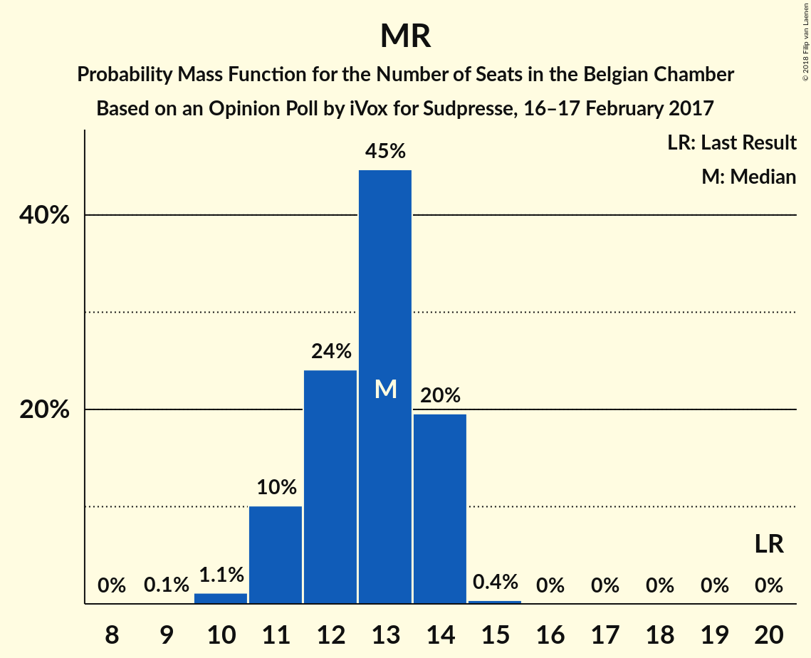
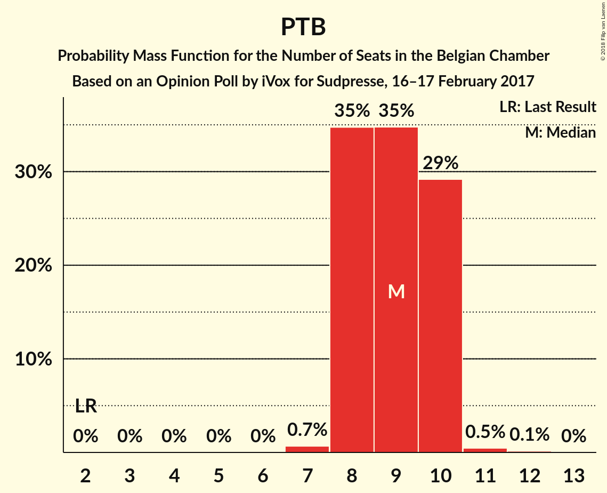
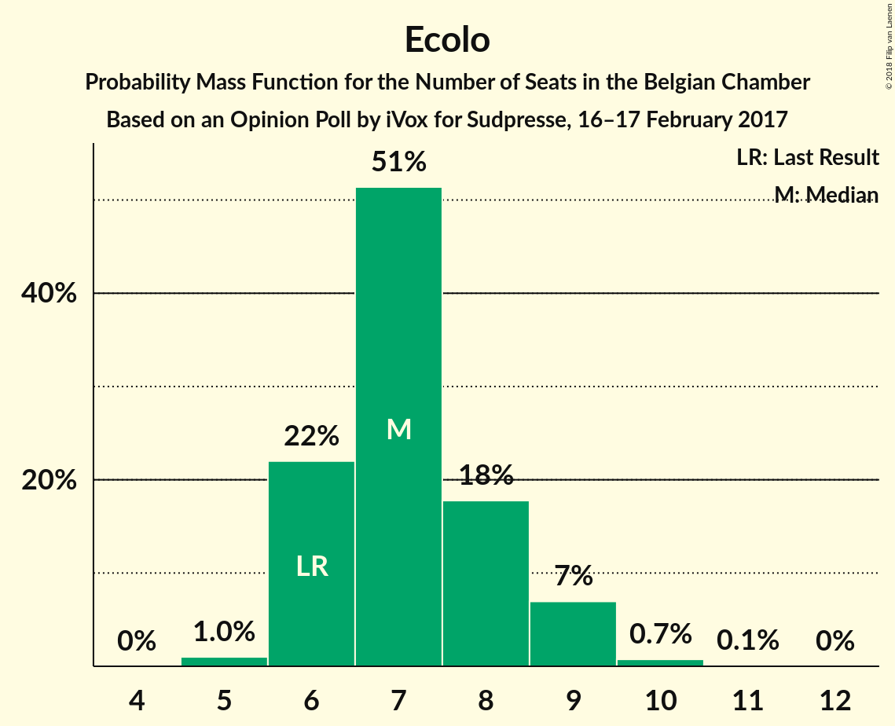
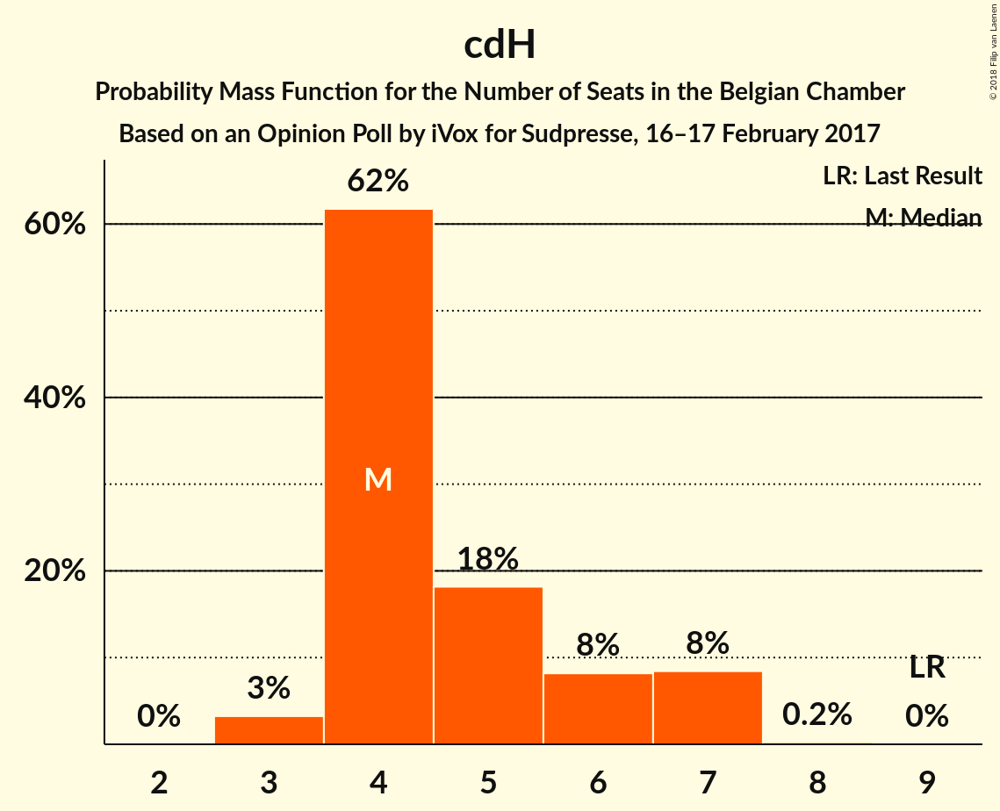
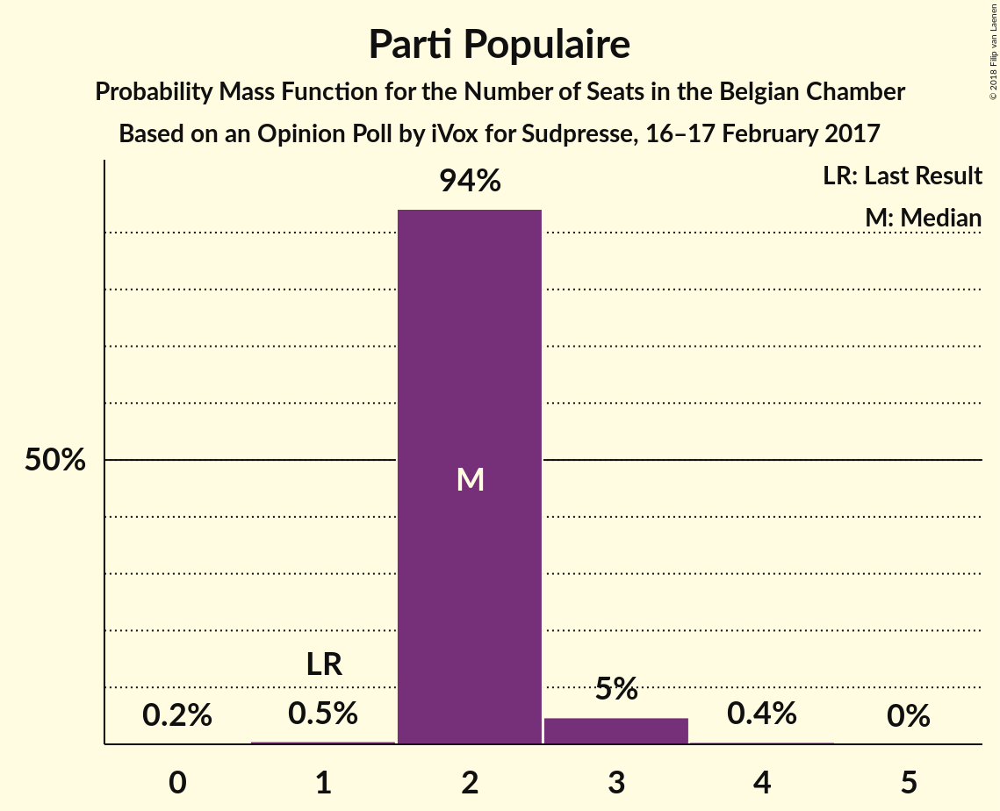

# Opinion Poll by iVox for Sudpresse, 16–17 February 2017

Areas included: Wallonia

<a href="#voting-intentions">Voting Intentions</a> | <a href="#seats">Seats</a> | <a href="#coalitions">Coalitions</a> | <a href="#technical-information">Technical Information</a>

## Voting Intentions

### Confidence Intervals

| Party | Last Result | Poll Result | 80% Confidence Interval | 90% Confidence Interval | 95% Confidence Interval | 99% Confidence Interval |
|:-----:|:-----------:|:-----------:|:-----------------------:|:-----------------------:|:-----------------------:|:-----------------------:|
| PS | 11.7% | 21.3% | N/A |N/A |N/A |N/A |
| MR | 9.6% | 20.7% | N/A |N/A |N/A |N/A |
| PTB | 2.0% | 17.4% | N/A |N/A |N/A |N/A |
| Ecolo | 3.3% | 13.7% | N/A |N/A |N/A |N/A |
| cdH | 5.0% | 10.1% | N/A |N/A |N/A |N/A |
| Parti Populaire | 1.5% | 6.9% | N/A |N/A |N/A |N/A |
| DéFI | 1.8% | 4.5% | N/A |N/A |N/A |N/A |

*Note:* The poll result column reflects the actual value used in the calculations. Published results may vary slightly, and in addition be rounded to fewer digits.

## Seats

### Confidence Intervals

| Party | Last Result | Median | 80% Confidence Interval | 90% Confidence Interval | 95% Confidence Interval | 99% Confidence Interval |
|:-----:|:-----------:|:------:|:-----------------------:|:-----------------------:|:-----------------------:|:-----------------------:|
| <a href="#ps">PS</a> | 23 | 12 | 11–14 |11–14 |11–14 |9–15 |
| <a href="#mr">MR</a> | 20 | 12 | 12–13 |11–13 |11–13 |11–13 |
| <a href="#ptb">PTB</a> | 2 | 8 | 8–9 |8–9 |8–9 |8–9 |
| <a href="#ecolo">Ecolo</a> | 6 | 9 | 6–10 |6–10 |6–10 |6–10 |
| <a href="#cdh">cdH</a> | 9 | 4 | 4–6 |3–6 |3–6 |3–7 |
| <a href="#parti-populaire">Parti Populaire</a> | 1 | 2 | 1–4 |1–4 |1–4 |1–4 |
| <a href="#défi">DéFI</a> | 2 | 0 | 0 |0 |0 |0–3 |

### PS

*For a full overview of the results for this party, see the [PS](party-ps.html) page.*

| Number of Seats | Probability | Accumulated | Special Marks |
|:---------------:|:-----------:|:-----------:|:-------------:|
| 9 | 0.9% | 100% |  |
| 10 | 0% | 99.1% |  |
| 11 | 19% | 99.1% |  |
| 12 | 57% | 80% | Median |
| 13 | 0% | 23% |  |
| 14 | 21% | 23% |  |
| 15 | 2% | 2% |  |
| 16 | 0% | 0% |  |
| 17 | 0% | 0% |  |
| 18 | 0% | 0% |  |
| 19 | 0% | 0% |  |
| 20 | 0% | 0% |  |
| 21 | 0% | 0% |  |
| 22 | 0% | 0% |  |
| 23 | 0% | 0% | Last Result |

### MR

*For a full overview of the results for this party, see the [MR](party-mr.html) page.*

| Number of Seats | Probability | Accumulated | Special Marks |
|:---------------:|:-----------:|:-----------:|:-------------:|
| 11 | 6% | 100% |  |
| 12 | 60% | 94% | Median |
| 13 | 34% | 34% |  |
| 14 | 0% | 0% |  |
| 15 | 0% | 0% |  |
| 16 | 0% | 0% |  |
| 17 | 0% | 0% |  |
| 18 | 0% | 0% |  |
| 19 | 0% | 0% |  |
| 20 | 0% | 0% | Last Result |

### PTB

*For a full overview of the results for this party, see the [PTB](party-ptb.html) page.*

| Number of Seats | Probability | Accumulated | Special Marks |
|:---------------:|:-----------:|:-----------:|:-------------:|
| 2 | 0% | 100% | Last Result |
| 3 | 0% | 100% |  |
| 4 | 0% | 100% |  |
| 5 | 0% | 100% |  |
| 6 | 0% | 100% |  |
| 7 | 0% | 100% |  |
| 8 | 52% | 100% | Median |
| 9 | 47% | 48% |  |
| 10 | 0.4% | 0.5% |  |
| 11 | 0% | 0% |  |

### Ecolo

*For a full overview of the results for this party, see the [Ecolo](party-ecolo.html) page.*

| Number of Seats | Probability | Accumulated | Special Marks |
|:---------------:|:-----------:|:-----------:|:-------------:|
| 6 | 17% | 100% | Last Result |
| 7 | 18% | 83% |  |
| 8 | 0% | 65% |  |
| 9 | 54% | 65% | Median |
| 10 | 11% | 11% |  |
| 11 | 0% | 0% |  |

### cdH

*For a full overview of the results for this party, see the [cdH](party-cdh.html) page.*

| Number of Seats | Probability | Accumulated | Special Marks |
|:---------------:|:-----------:|:-----------:|:-------------:|
| 3 | 8% | 100% |  |
| 4 | 57% | 92% | Median |
| 5 | 16% | 36% |  |
| 6 | 19% | 20% |  |
| 7 | 0.9% | 0.9% |  |
| 8 | 0% | 0% |  |
| 9 | 0% | 0% | Last Result |

### Parti Populaire

*For a full overview of the results for this party, see the [Parti Populaire](party-partipopulaire.html) page.*

| Number of Seats | Probability | Accumulated | Special Marks |
|:---------------:|:-----------:|:-----------:|:-------------:|
| 0 | 0.4% | 100% |  |
| 1 | 15% | 99.6% | Last Result |
| 2 | 63% | 85% | Median |
| 3 | 5% | 22% |  |
| 4 | 16% | 16% |  |
| 5 | 0% | 0% |  |

### DéFI

*For a full overview of the results for this party, see the [DéFI](party-dfi.html) page.*

| Number of Seats | Probability | Accumulated | Special Marks |
|:---------------:|:-----------:|:-----------:|:-------------:|
| 0 | 99.0% | 100% | Median |
| 1 | 0% | 1.0% |  |
| 2 | 0% | 1.0% | Last Result |
| 3 | 1.0% | 1.0% |  |
| 4 | 0% | 0% |  |

## Coalitions

### Confidence Intervals

| Coalition | Last Result | Median | Majority? | 80% Confidence Interval | 90% Confidence Interval | 95% Confidence Interval | 99% Confidence Interval |
|:---------:|:-----------:|:------:|:---------:|:-----------------------:|:-----------------------:|:-----------------------:|:-----------------------:|

## Technical Information

### Opinion Poll

+ **Polling firm:** iVox
+ **Commissioner(s):** Sudpresse
+ **Fieldwork period:** 16–17 February 2017

### Calculations

+ **Sample size:** 1001
+ **Simulations done:** 0
+ **Error estimate:** 100.00%

