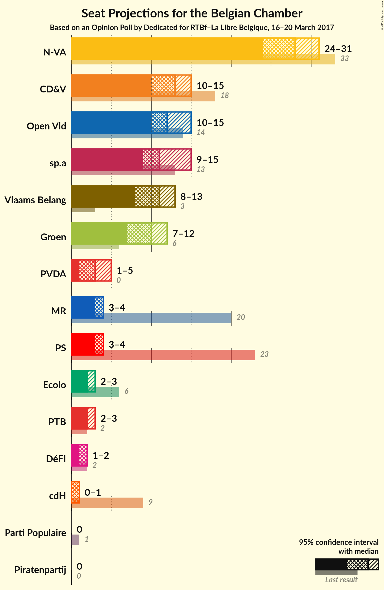

# Opinion Poll by Dedicated for RTBf–La Libre Belgique, 16–20 March 2017

Areas included: Flanders

<a href="#voting-intentions">Voting Intentions</a> | <a href="#seats">Seats</a> | <a href="#coalitions">Coalitions</a> | <a href="#technical-information">Technical Information</a>

## Voting Intentions

### Confidence Intervals

| Party | Last Result | Poll Result | 80% Confidence Interval | 90% Confidence Interval | 95% Confidence Interval | 99% Confidence Interval |
|:-----:|:-----------:|:-----------:|:-----------------------:|:-----------------------:|:-----------------------:|:-----------------------:|
| N-VA | 20.3% | 28.3% | 26.2–30.4% |25.7–31.0% |25.2–31.6% |24.2–32.6% |
| CD&V | 11.6% | 14.1% | 12.6–15.8% |12.1–16.3% |11.8–16.7% |11.1–17.6% |
| Open Vld | 9.8% | 13.5% | 12.1–15.2% |11.6–15.7% |11.3–16.2% |10.6–17.0% |
| sp.a | 8.8% | 12.9% | 11.4–14.6% |11.1–15.0% |10.7–15.5% |10.0–16.3% |
| Vlaams Belang | 3.7% | 11.8% | 10.5–13.5% |10.1–13.9% |9.7–14.3% |9.1–15.2% |
| Groen | 5.3% | 11.5% | 10.1–13.1% |9.7–13.5% |9.4–13.9% |8.8–14.7% |
| PVDA | 1.8% | 5.5% | 4.5–6.7% |4.3–7.0% |4.1–7.3% |3.7–7.9% |
| Piratenpartij | 0.3% | 1.4% | 1.0–2.2% |0.9–2.4% |0.8–2.5% |0.6–2.9% |

*Note:* The poll result column reflects the actual value used in the calculations. Published results may vary slightly, and in addition be rounded to fewer digits.

## Seats

### Confidence Intervals

| Party | Last Result | Median | 80% Confidence Interval | 90% Confidence Interval | 95% Confidence Interval | 99% Confidence Interval |
|:-----:|:-----------:|:------:|:-----------------------:|:-----------------------:|:-----------------------:|:-----------------------:|
| <a href="#n-va">N-VA</a> | 33 | 27 | 27 |27–29 |27–29 |27–31 |
| <a href="#cd&v">CD&V</a> | 18 | 13 | 13 |13 |9–13 |9–15 |
| <a href="#open-vld">Open Vld</a> | 14 | 11 | 11 |11–13 |11–13 |11–17 |
| <a href="#sp.a">sp.a</a> | 13 | 13 | 13 |12–13 |12–13 |8–13 |
| <a href="#vlaams-belang">Vlaams Belang</a> | 3 | 13 | 13 |12–13 |12–13 |8–13 |
| <a href="#groen">Groen</a> | 6 | 10 | 10 |10–12 |10–12 |9–12 |
| <a href="#pvda">PVDA</a> | 0 | 0 | 0 |0 |0 |0 |
| <a href="#piratenpartij">Piratenpartij</a> | 0 | 0 | 0 |0 |0 |0 |

### N-VA

*For a full overview of the results for this party, see the [N-VA](party-nva.html) page.*

| Number of Seats | Probability | Accumulated | Special Marks |
|:---------------:|:-----------:|:-----------:|:-------------:|
| 25 | 0.1% | 100% |  |
| 26 | 0% | 99.9% |  |
| 27 | 92% | 99.9% | Median |
| 28 | 1.4% | 8% |  |
| 29 | 6% | 6% |  |
| 30 | 0% | 0.6% |  |
| 31 | 0.5% | 0.5% |  |
| 32 | 0% | 0.1% |  |
| 33 | 0% | 0.1% | Last Result |
| 34 | 0% | 0% |  |

### CD&V

*For a full overview of the results for this party, see the [CD&V](party-cdv.html) page.*

| Number of Seats | Probability | Accumulated | Special Marks |
|:---------------:|:-----------:|:-----------:|:-------------:|
| 9 | 5% | 100% |  |
| 10 | 0% | 95% |  |
| 11 | 0% | 95% |  |
| 12 | 0% | 95% |  |
| 13 | 94% | 95% | Median |
| 14 | 0.3% | 1.5% |  |
| 15 | 1.1% | 1.2% |  |
| 16 | 0% | 0.1% |  |
| 17 | 0% | 0.1% |  |
| 18 | 0.1% | 0.1% | Last Result |
| 19 | 0% | 0% |  |

### Open Vld

*For a full overview of the results for this party, see the [Open Vld](party-openvld.html) page.*

| Number of Seats | Probability | Accumulated | Special Marks |
|:---------------:|:-----------:|:-----------:|:-------------:|
| 8 | 0.2% | 100% |  |
| 9 | 0% | 99.7% |  |
| 10 | 0% | 99.7% |  |
| 11 | 93% | 99.7% | Median |
| 12 | 0.1% | 7% |  |
| 13 | 5% | 7% |  |
| 14 | 0.7% | 2% | Last Result |
| 15 | 0.1% | 1.4% |  |
| 16 | 0% | 1.3% |  |
| 17 | 1.1% | 1.3% |  |
| 18 | 0.2% | 0.2% |  |
| 19 | 0% | 0% |  |

### sp.a

*For a full overview of the results for this party, see the [sp.a](party-spa.html) page.*

| Number of Seats | Probability | Accumulated | Special Marks |
|:---------------:|:-----------:|:-----------:|:-------------:|
| 8 | 1.1% | 100% |  |
| 9 | 0.1% | 98.9% |  |
| 10 | 0.2% | 98.8% |  |
| 11 | 0.4% | 98.5% |  |
| 12 | 5% | 98% |  |
| 13 | 93% | 93% | Last Result, Median |
| 14 | 0% | 0.1% |  |
| 15 | 0% | 0.1% |  |
| 16 | 0.1% | 0.1% |  |
| 17 | 0% | 0% |  |

### Vlaams Belang

*For a full overview of the results for this party, see the [Vlaams Belang](party-vlaamsbelang.html) page.*

| Number of Seats | Probability | Accumulated | Special Marks |
|:---------------:|:-----------:|:-----------:|:-------------:|
| 3 | 0% | 100% | Last Result |
| 4 | 0% | 100% |  |
| 5 | 0% | 100% |  |
| 6 | 0% | 100% |  |
| 7 | 0% | 100% |  |
| 8 | 2% | 100% |  |
| 9 | 0.1% | 98% |  |
| 10 | 0% | 98% |  |
| 11 | 0.3% | 98% |  |
| 12 | 5% | 98% |  |
| 13 | 92% | 93% | Median |
| 14 | 0.1% | 0.1% |  |
| 15 | 0% | 0% |  |

### Groen

*For a full overview of the results for this party, see the [Groen](party-groen.html) page.*

| Number of Seats | Probability | Accumulated | Special Marks |
|:---------------:|:-----------:|:-----------:|:-------------:|
| 6 | 0% | 100% | Last Result |
| 7 | 0.1% | 100% |  |
| 8 | 0.1% | 99.9% |  |
| 9 | 0.4% | 99.8% |  |
| 10 | 93% | 99.4% | Median |
| 11 | 1.1% | 6% |  |
| 12 | 5% | 5% |  |
| 13 | 0% | 0% |  |

### PVDA

*For a full overview of the results for this party, see the [PVDA](party-pvda.html) page.*

| Number of Seats | Probability | Accumulated | Special Marks |
|:---------------:|:-----------:|:-----------:|:-------------:|
| 0 | 100% | 100% | Last Result, Median |

### Piratenpartij

*For a full overview of the results for this party, see the [Piratenpartij](party-piratenpartij.html) page.*

| Number of Seats | Probability | Accumulated | Special Marks |
|:---------------:|:-----------:|:-----------:|:-------------:|
| 0 | 100% | 100% | Last Result, Median |

## Coalitions

### Confidence Intervals

| Coalition | Last Result | Median | Majority? | 80% Confidence Interval | 90% Confidence Interval | 95% Confidence Interval | 99% Confidence Interval |
|:---------:|:-----------:|:------:|:---------:|:-----------------------:|:-----------------------:|:-----------------------:|:-----------------------:|

## Technical Information

### Opinion Poll

+ **Pollster:** Dedicated
+ **Media:** RTBf–La Libre Belgique
+ **Fieldwork period:** 16–20 March 2017

### Calculations

+ **Sample size:** 768
+ **Simulations done:** 1,024
+ **Error estimate:** 3.48%

