# Opinion Poll by Dedicated for MR, 23–27 June 2017

Areas included: Brussels, Flanders, Wallonia

<a href="#voting-intentions">Voting Intentions</a> | <a href="#seats">Seats</a> | <a href="#coalitions">Coalitions</a> | <a href="#technical-information">Technical Information</a>

## Voting Intentions

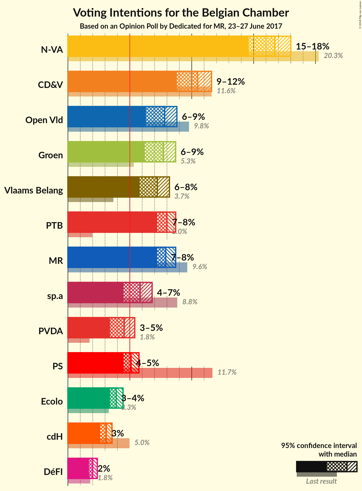

### Confidence Intervals

| Party | Last Result | Poll Result | 80% Confidence Interval | 90% Confidence Interval | 95% Confidence Interval | 99% Confidence Interval |
|:-----:|:-----------:|:-----------:|:-----------------------:|:-----------------------:|:-----------------------:|:-----------------------:|
| N-VA | 20.3% | 16.7% | 24.9–29.4% |24.2–30.1% |23.7–30.7% |22.7–31.8% |
| CD&V | 11.6% | 10.5% | 15.2–19.0% |14.7–19.6% |14.2–20.1% |13.4–21.1% |
| MR | 9.6% | 8.7% | 21.1–25.5% |20.6–26.1% |20.1–26.7% |19.1–27.8% |
| PTB | 2.0% | 8.7% | 22.8–27.3% |22.2–27.9% |21.7–28.5% |20.7–29.6% |
| Open Vld | 9.8% | 7.8% | 11.1–14.5% |10.6–15.0% |10.3–15.5% |9.6–16.4% |
| Groen | 5.3% | 7.7% | 10.9–14.3% |10.5–14.8% |10.1–15.3% |9.4–16.2% |
| Vlaams Belang | 3.7% | 7.2% | 10.2–13.5% |9.8–14.0% |9.4–14.4% |8.7–15.3% |
| sp.a | 8.8% | 5.8% | 8.1–11.1% |7.7–11.6% |7.4–12.0% |6.8–12.8% |
| PS | 11.7% | 5.7% | 14.3–18.0% |13.8–18.6% |13.3–19.1% |12.5–20.1% |
| PVDA | 1.8% | 4.5% | 6.2–8.9% |5.8–9.3% |5.6–9.7% |5.1–10.4% |
| Ecolo | 3.3% | 4.5% | 9.9–13.1% |9.5–13.6% |9.1–14.1% |8.4–15.0% |
| cdH | 5.0% | 3.6% | 8.4–11.4% |8.0–11.9% |7.7–12.3% |7.1–13.2% |
| DéFI | 1.8% | 2.4% | 3.0–5.0% |2.8–5.3% |2.6–5.6% |2.2–6.3% |

*Note:* The poll result column reflects the actual value used in the calculations. Published results may vary slightly, and in addition be rounded to fewer digits.

## Seats

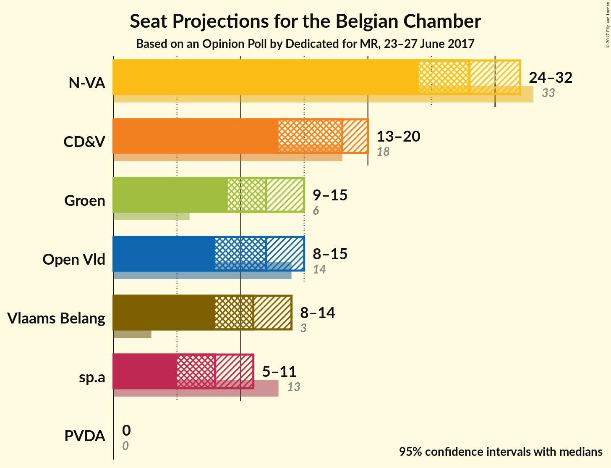

### Confidence Intervals

| Party | Last Result | Median | 80% Confidence Interval | 90% Confidence Interval | 95% Confidence Interval | 99% Confidence Interval |
|:-----:|:-----------:|:------:|:-----------------------:|:-----------------------:|:-----------------------:|:-----------------------:|
| <a href="#n-va">N-VA</a> | 33 | 28 | 25–31 |24–31 |24–32 |23–33 |
| <a href="#cd&v">CD&V</a> | 18 | 18 | 14–18 |13–19 |13–20 |13–22 |
| <a href="#mr">MR</a> | 20 | 18 | 16–20 |16–20 |15–21 |14–21 |
| <a href="#ptb">PTB</a> | 2 | 17 | 15–20 |14–20 |14–20 |13–21 |
| <a href="#open-vld">Open Vld</a> | 14 | 12 | 11–13 |11–14 |9–15 |8–17 |
| <a href="#groen">Groen</a> | 6 | 12 | 10–12 |10–13 |9–15 |8–16 |
| <a href="#vlaams-belang">Vlaams Belang</a> | 3 | 11 | 8–13 |8–13 |8–13 |8–15 |
| <a href="#sp.a">sp.a</a> | 13 | 8 | 6–9 |6–10 |6–11 |5–13 |
| <a href="#ps">PS</a> | 23 | 10 | 9–13 |9–14 |9–14 |8–14 |
| <a href="#pvda">PVDA</a> | 0 | 0 | 0 |0 |0 |0 |
| <a href="#ecolo">Ecolo</a> | 6 | 8 | 7–10 |6–10 |5–10 |5–10 |
| <a href="#cdh">cdH</a> | 9 | 6 | 4–7 |4–8 |4–8 |4–9 |
| <a href="#défi">DéFI</a> | 2 | 3 | 3 |2–4 |2–4 |2–6 |

### N-VA

*For a full overview of the results for this party, see the [N-VA](party-n-va.html) page.*

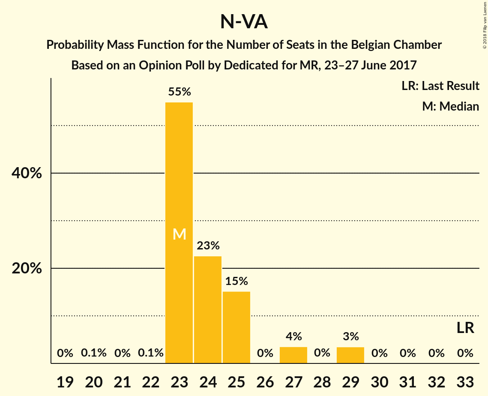

| Number of Seats | Probability | Accumulated | Special Marks |
|:---------------:|:-----------:|:-----------:|:-------------:|
| 22 | 0.1% | 100% |  |
| 23 | 0.3% | 99.8% |  |
| 24 | 7% | 99.5% |  |
| 25 | 7% | 92% |  |
| 26 | 8% | 86% |  |
| 27 | 18% | 77% |  |
| 28 | 20% | 59% | Median |
| 29 | 19% | 38% |  |
| 30 | 9% | 20% |  |
| 31 | 7% | 10% |  |
| 32 | 2% | 3% |  |
| 33 | 0.4% | 0.9% | Last Result |
| 34 | 0.4% | 0.5% |  |
| 35 | 0.1% | 0.1% |  |
| 36 | 0% | 0% |  |

### CD&V

*For a full overview of the results for this party, see the [CD&V](party-cdv.html) page.*

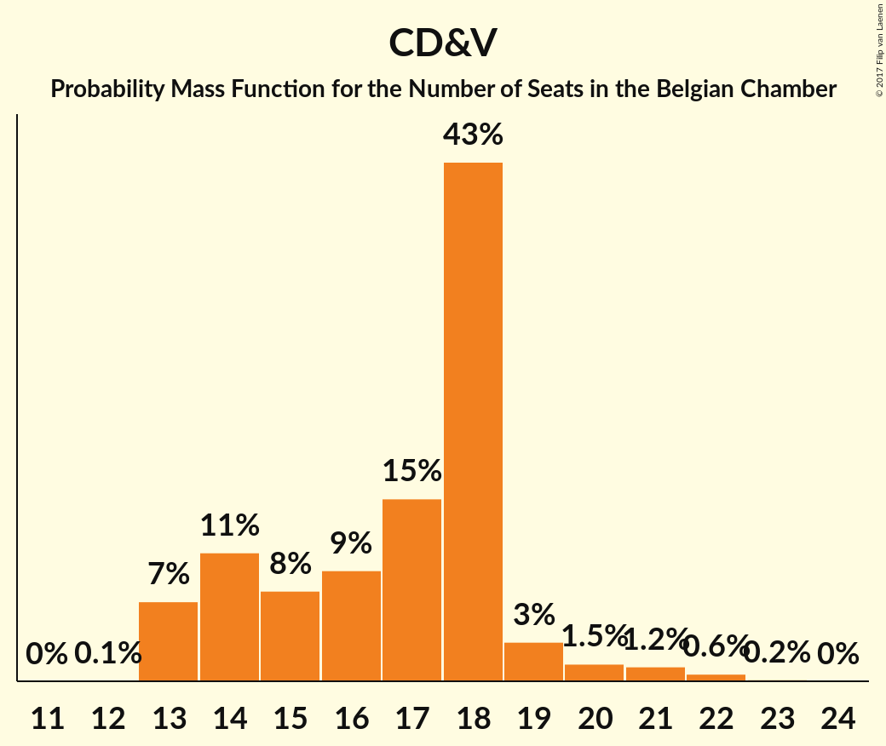

| Number of Seats | Probability | Accumulated | Special Marks |
|:---------------:|:-----------:|:-----------:|:-------------:|
| 12 | 0.1% | 100% |  |
| 13 | 7% | 99.9% |  |
| 14 | 11% | 93% |  |
| 15 | 8% | 82% |  |
| 16 | 9% | 75% |  |
| 17 | 15% | 66% |  |
| 18 | 43% | 50% | Last Result, Median |
| 19 | 3% | 7% |  |
| 20 | 1.5% | 3% |  |
| 21 | 1.2% | 2% |  |
| 22 | 0.6% | 0.8% |  |
| 23 | 0.2% | 0.2% |  |
| 24 | 0% | 0% |  |

### MR

*For a full overview of the results for this party, see the [MR](party-mr.html) page.*

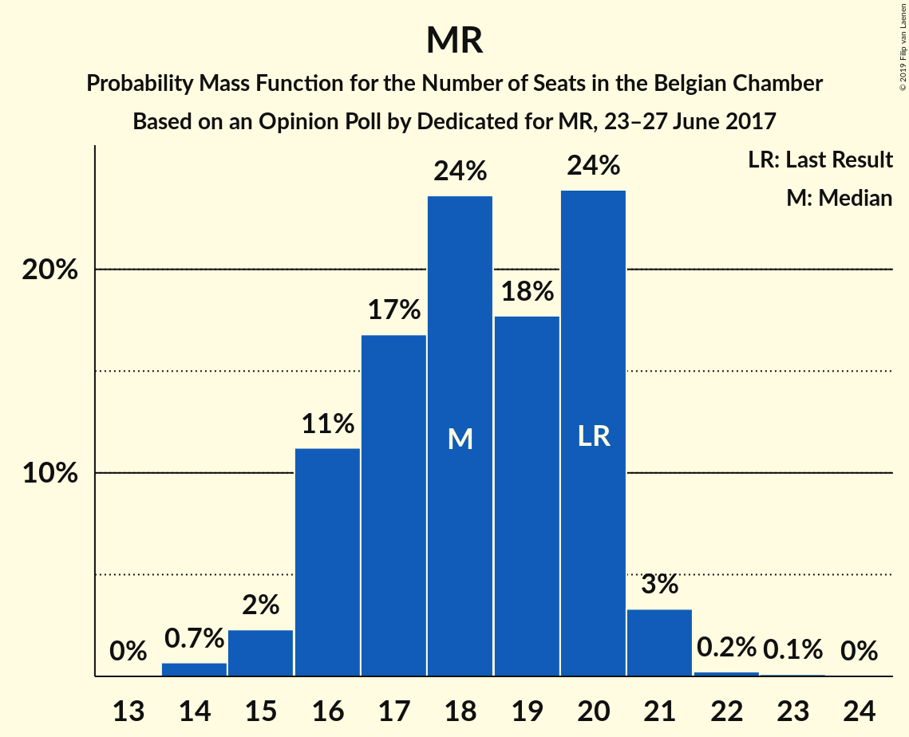

| Number of Seats | Probability | Accumulated | Special Marks |
|:---------------:|:-----------:|:-----------:|:-------------:|
| 14 | 0.6% | 100% |  |
| 15 | 2% | 99.4% |  |
| 16 | 11% | 97% |  |
| 17 | 16% | 86% |  |
| 18 | 25% | 70% | Median |
| 19 | 18% | 45% |  |
| 20 | 24% | 27% | Last Result |
| 21 | 3% | 3% |  |
| 22 | 0.2% | 0.3% |  |
| 23 | 0.1% | 0.1% |  |
| 24 | 0% | 0% |  |

### PTB

*For a full overview of the results for this party, see the [PTB](party-ptb.html) page.*

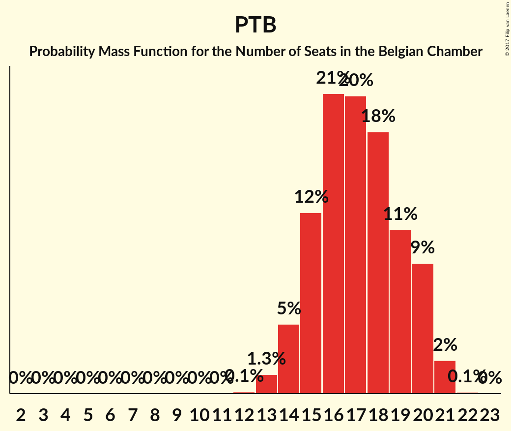

| Number of Seats | Probability | Accumulated | Special Marks |
|:---------------:|:-----------:|:-----------:|:-------------:|
| 2 | 0% | 100% | Last Result |
| 3 | 0% | 100% |  |
| 4 | 0% | 100% |  |
| 5 | 0% | 100% |  |
| 6 | 0% | 100% |  |
| 7 | 0% | 100% |  |
| 8 | 0% | 100% |  |
| 9 | 0% | 100% |  |
| 10 | 0% | 100% |  |
| 11 | 0% | 100% |  |
| 12 | 0.1% | 100% |  |
| 13 | 1.3% | 99.9% |  |
| 14 | 5% | 98.6% |  |
| 15 | 12% | 94% |  |
| 16 | 21% | 81% |  |
| 17 | 20% | 61% | Median |
| 18 | 18% | 40% |  |
| 19 | 11% | 23% |  |
| 20 | 9% | 11% |  |
| 21 | 2% | 2% |  |
| 22 | 0.1% | 0.1% |  |
| 23 | 0% | 0% |  |

### Open Vld

*For a full overview of the results for this party, see the [Open Vld](party-openvld.html) page.*

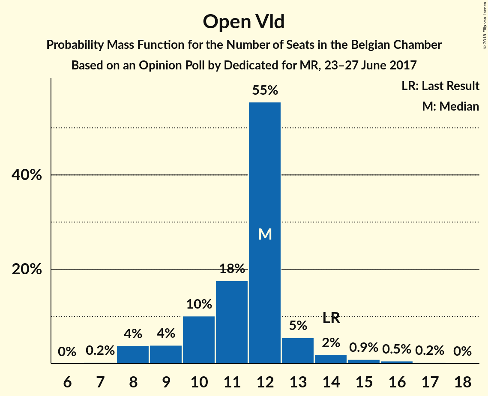

| Number of Seats | Probability | Accumulated | Special Marks |
|:---------------:|:-----------:|:-----------:|:-------------:|
| 8 | 2% | 100% |  |
| 9 | 1.1% | 98% |  |
| 10 | 2% | 97% |  |
| 11 | 23% | 95% |  |
| 12 | 54% | 72% | Median |
| 13 | 12% | 17% |  |
| 14 | 2% | 5% | Last Result |
| 15 | 0.9% | 3% |  |
| 16 | 0.8% | 2% |  |
| 17 | 1.0% | 1.0% |  |
| 18 | 0.1% | 0.1% |  |
| 19 | 0% | 0% |  |

### Groen

*For a full overview of the results for this party, see the [Groen](party-groen.html) page.*

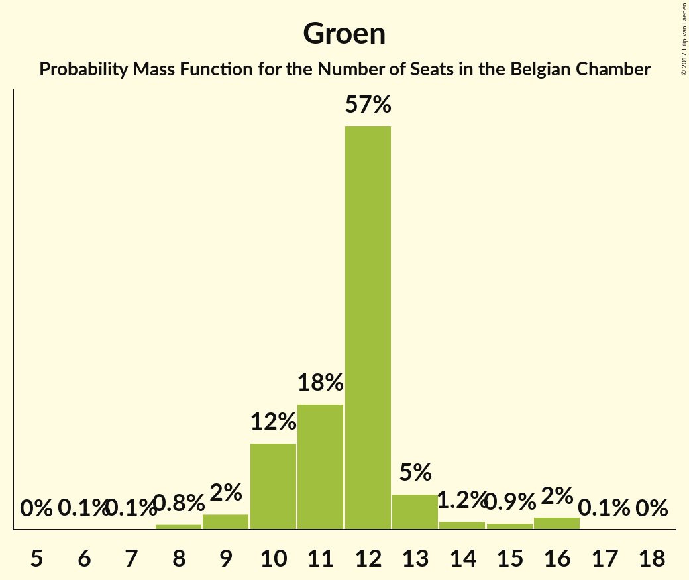

| Number of Seats | Probability | Accumulated | Special Marks |
|:---------------:|:-----------:|:-----------:|:-------------:|
| 6 | 0.1% | 100% | Last Result |
| 7 | 0.1% | 99.9% |  |
| 8 | 0.8% | 99.8% |  |
| 9 | 2% | 99.1% |  |
| 10 | 12% | 97% |  |
| 11 | 18% | 85% |  |
| 12 | 57% | 67% | Median |
| 13 | 5% | 9% |  |
| 14 | 1.2% | 4% |  |
| 15 | 0.9% | 3% |  |
| 16 | 2% | 2% |  |
| 17 | 0.1% | 0.1% |  |
| 18 | 0% | 0% |  |

### Vlaams Belang

*For a full overview of the results for this party, see the [Vlaams Belang](party-vlaamsbelang.html) page.*

| Number of Seats | Probability | Accumulated | Special Marks |
|:---------------:|:-----------:|:-----------:|:-------------:|
| 3 | 0% | 100% | Last Result |
| 4 | 0% | 100% |  |
| 5 | 0% | 100% |  |
| 6 | 0% | 100% |  |
| 7 | 0.3% | 100% |  |
| 8 | 27% | 99.7% |  |
| 9 | 9% | 73% |  |
| 10 | 8% | 64% |  |
| 11 | 7% | 56% | Median |
| 12 | 38% | 49% |  |
| 13 | 9% | 11% |  |
| 14 | 2% | 2% |  |
| 15 | 0.9% | 0.9% |  |
| 16 | 0% | 0% |  |

### sp.a

*For a full overview of the results for this party, see the [sp.a](party-spa.html) page.*

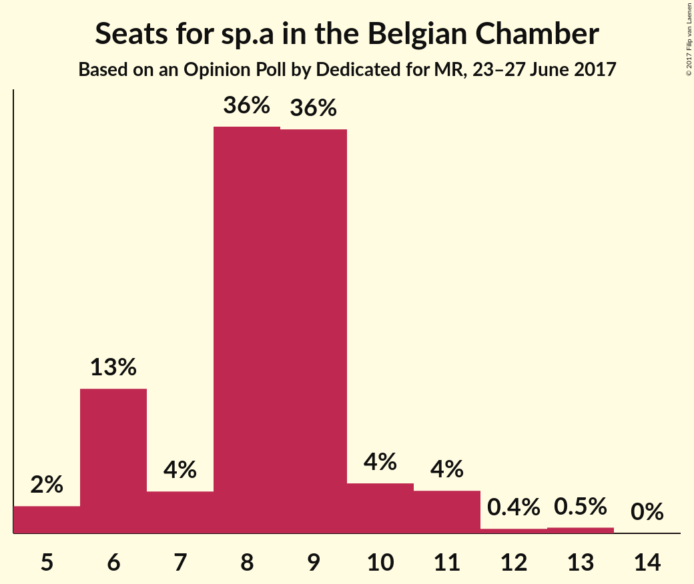

| Number of Seats | Probability | Accumulated | Special Marks |
|:---------------:|:-----------:|:-----------:|:-------------:|
| 5 | 2% | 100% |  |
| 6 | 13% | 98% |  |
| 7 | 4% | 85% |  |
| 8 | 36% | 81% | Median |
| 9 | 36% | 45% |  |
| 10 | 4% | 9% |  |
| 11 | 4% | 5% |  |
| 12 | 0.4% | 0.9% |  |
| 13 | 0.5% | 0.5% | Last Result |
| 14 | 0% | 0% |  |

### PS

*For a full overview of the results for this party, see the [PS](party-ps.html) page.*

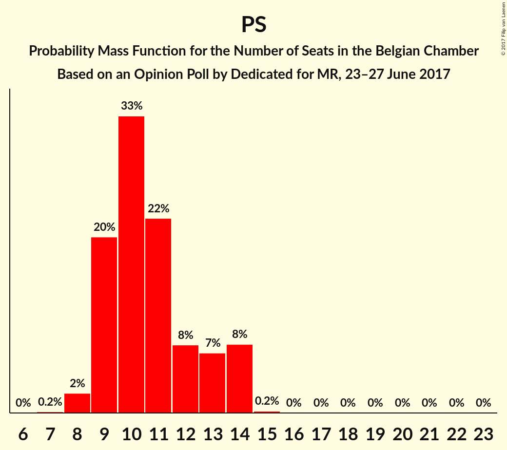

| Number of Seats | Probability | Accumulated | Special Marks |
|:---------------:|:-----------:|:-----------:|:-------------:|
| 7 | 0.2% | 100% |  |
| 8 | 2% | 99.8% |  |
| 9 | 20% | 98% |  |
| 10 | 33% | 78% | Median |
| 11 | 22% | 44% |  |
| 12 | 8% | 22% |  |
| 13 | 7% | 15% |  |
| 14 | 8% | 8% |  |
| 15 | 0.2% | 0.2% |  |
| 16 | 0% | 0% |  |
| 17 | 0% | 0% |  |
| 18 | 0% | 0% |  |
| 19 | 0% | 0% |  |
| 20 | 0% | 0% |  |
| 21 | 0% | 0% |  |
| 22 | 0% | 0% |  |
| 23 | 0% | 0% | Last Result |

### PVDA

*For a full overview of the results for this party, see the [PVDA](party-pvda.html) page.*

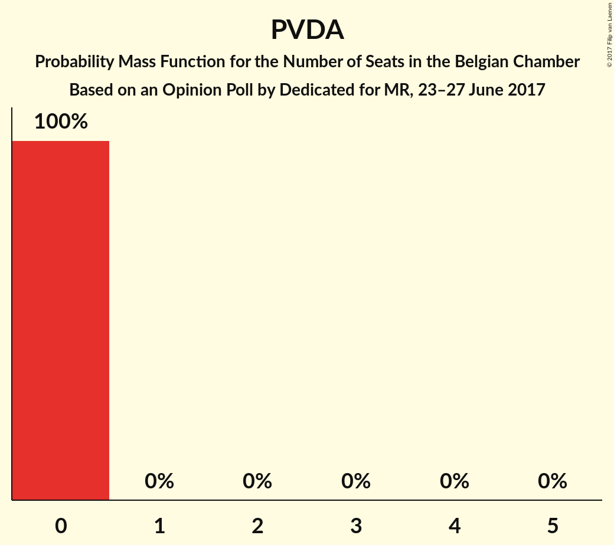

| Number of Seats | Probability | Accumulated | Special Marks |
|:---------------:|:-----------:|:-----------:|:-------------:|
| 0 | 100% | 100% | Last Result, Median |

### Ecolo

*For a full overview of the results for this party, see the [Ecolo](party-ecolo.html) page.*

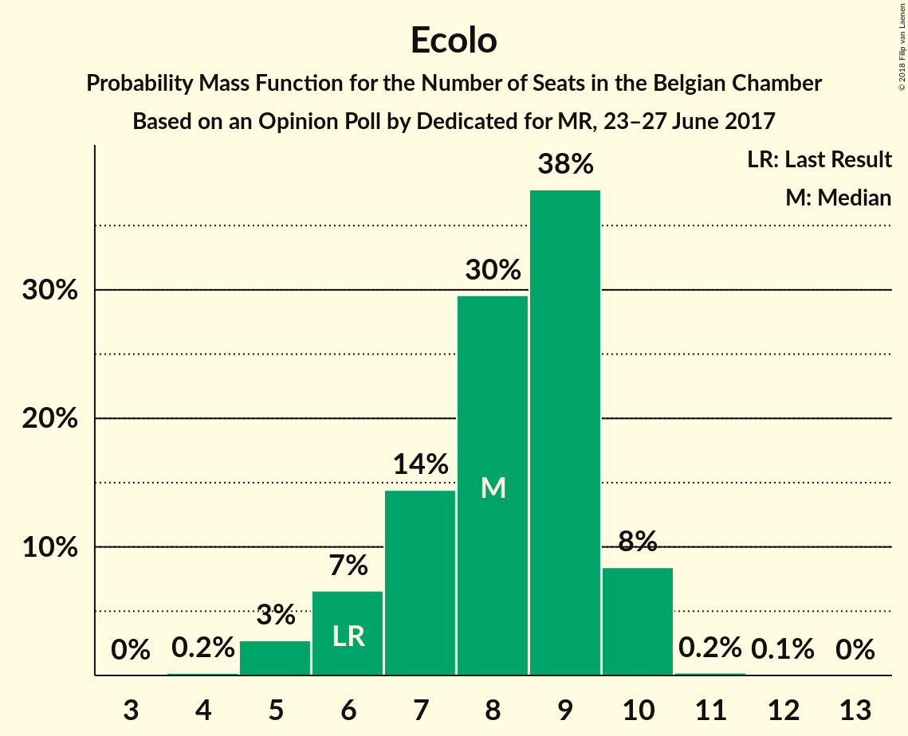

| Number of Seats | Probability | Accumulated | Special Marks |
|:---------------:|:-----------:|:-----------:|:-------------:|
| 4 | 0.2% | 100% |  |
| 5 | 3% | 99.8% |  |
| 6 | 7% | 97% | Last Result |
| 7 | 14% | 90% |  |
| 8 | 29% | 76% | Median |
| 9 | 37% | 47% |  |
| 10 | 10% | 10% |  |
| 11 | 0.3% | 0.3% |  |
| 12 | 0.1% | 0.1% |  |
| 13 | 0% | 0% |  |

### cdH

*For a full overview of the results for this party, see the [cdH](party-cdh.html) page.*

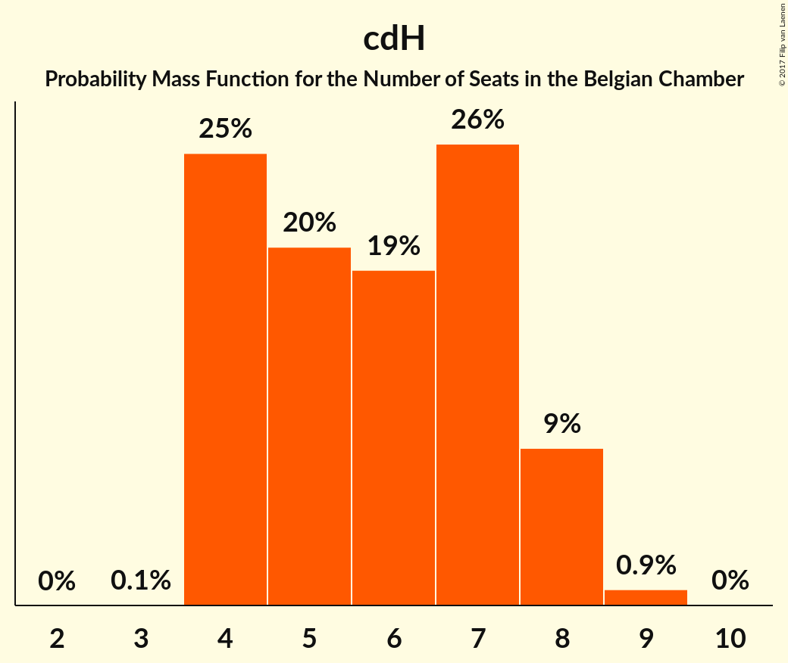

| Number of Seats | Probability | Accumulated | Special Marks |
|:---------------:|:-----------:|:-----------:|:-------------:|
| 3 | 0.1% | 100% |  |
| 4 | 25% | 99.9% |  |
| 5 | 20% | 75% |  |
| 6 | 19% | 54% | Median |
| 7 | 26% | 36% |  |
| 8 | 9% | 10% |  |
| 9 | 0.9% | 0.9% | Last Result |
| 10 | 0% | 0% |  |

### DéFI

*For a full overview of the results for this party, see the [DéFI](party-défi.html) page.*

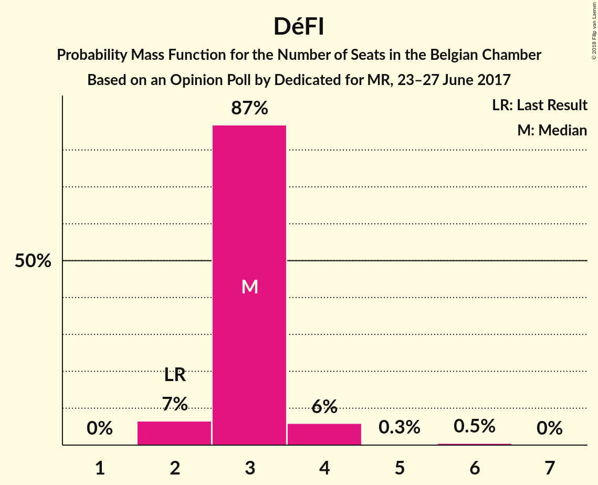

| Number of Seats | Probability | Accumulated | Special Marks |
|:---------------:|:-----------:|:-----------:|:-------------:|
| 2 | 8% | 100% | Last Result |
| 3 | 87% | 92% | Median |
| 4 | 5% | 6% |  |
| 5 | 0.3% | 0.8% |  |
| 6 | 0.5% | 0.5% |  |
| 7 | 0% | 0% |  |

## Coalitions

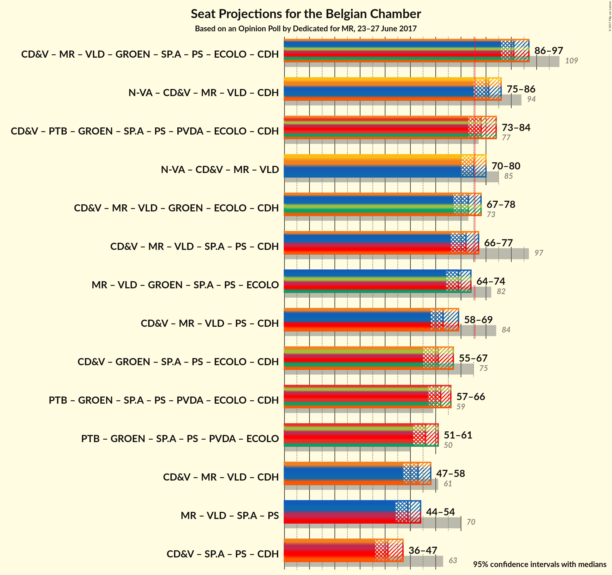

### Confidence Intervals

| Coalition | Last Result | Median | Majority? | 80% Confidence Interval | 90% Confidence Interval | 95% Confidence Interval | 99% Confidence Interval |
|:---------:|:-----------:|:------:|:---------:|:-----------------------:|:-----------------------:|:-----------------------:|:-----------------------:|
| CD&V – MR – Open Vld – Groen – sp.a – PS – Ecolo – cdH | 109 | 92 | 100% | 88–95 | 87–96 | 86–97 | 84–99 |
| N-VA – CD&V – MR – Open Vld – cdH | 94 | 81 | 96% | 77–84 | 76–85 | 75–86 | 73–88 |
| CD&V – PTB – Groen – sp.a – PS – PVDA – Ecolo – cdH | 77 | 78 | 86% | 75–82 | 74–83 | 73–84 | 72–85 |
| N-VA – CD&V – MR – Open Vld | 85 | 75 | 41% | 71–78 | 70–79 | 70–80 | 68–81 |
| CD&V – MR – Open Vld – Groen – Ecolo – cdH | 73 | 73 | 16% | 69–76 | 68–77 | 67–78 | 65–80 |
| CD&V – MR – Open Vld – sp.a – PS – cdH | 97 | 72 | 8% | 68–75 | 67–76 | 66–77 | 64–79 |
| MR – Open Vld – Groen – sp.a – PS – Ecolo | 82 | 69 | 0.8% | 66–72 | 65–73 | 64–74 | 62–76 |
| CD&V – MR – Open Vld – PS – cdH | 84 | 63 | 0% | 60–67 | 59–68 | 58–69 | 56–70 |
| CD&V – Groen – sp.a – PS – Ecolo – cdH | 75 | 61 | 0% | 57–65 | 56–66 | 55–67 | 54–69 |
| PTB – Groen – sp.a – PS – PVDA – Ecolo – cdH | 59 | 62 | 0% | 59–65 | 58–65 | 57–66 | 56–68 |
| PTB – Groen – sp.a – PS – PVDA – Ecolo | 50 | 56 | 0% | 53–59 | 52–60 | 51–61 | 49–63 |
| CD&V – MR – Open Vld – cdH | 61 | 53 | 0% | 49–56 | 48–57 | 47–58 | 45–60 |
| MR – Open Vld – sp.a – PS | 70 | 49 | 0% | 46–52 | 45–53 | 44–54 | 43–56 |
| CD&V – sp.a – PS – cdH | 63 | 41 | 0% | 38–45 | 37–46 | 36–47 | 34–49 |

### CD&V – MR – Open Vld – Groen – sp.a – PS – Ecolo – cdH

| Number of Seats | Probability | Accumulated | Special Marks |
|:---------------:|:-----------:|:-----------:|:-------------:|
| 82 | 0% | 100% |  |
| 83 | 0.2% | 99.9% |  |
| 84 | 0.6% | 99.7% |  |
| 85 | 1.2% | 99.2% |  |
| 86 | 3% | 98% |  |
| 87 | 4% | 95% |  |
| 88 | 7% | 91% |  |
| 89 | 9% | 84% |  |
| 90 | 12% | 75% |  |
| 91 | 13% | 64% |  |
| 92 | 14% | 50% | Median |
| 93 | 12% | 37% |  |
| 94 | 10% | 25% |  |
| 95 | 7% | 15% |  |
| 96 | 4% | 8% |  |
| 97 | 2% | 4% |  |
| 98 | 0.9% | 1.5% |  |
| 99 | 0.4% | 0.6% |  |
| 100 | 0.1% | 0.2% |  |
| 101 | 0% | 0.1% |  |
| 102 | 0% | 0% |  |
| 103 | 0% | 0% |  |
| 104 | 0% | 0% |  |
| 105 | 0% | 0% |  |
| 106 | 0% | 0% |  |
| 107 | 0% | 0% |  |
| 108 | 0% | 0% |  |
| 109 | 0% | 0% | Last Result |

### N-VA – CD&V – MR – Open Vld – cdH

| Number of Seats | Probability | Accumulated | Special Marks |
|:---------------:|:-----------:|:-----------:|:-------------:|
| 71 | 0.1% | 100% |  |
| 72 | 0.2% | 99.9% |  |
| 73 | 0.5% | 99.7% |  |
| 74 | 1.2% | 99.2% |  |
| 75 | 2% | 98% |  |
| 76 | 4% | 96% | Majority |
| 77 | 6% | 92% |  |
| 78 | 9% | 85% |  |
| 79 | 12% | 76% |  |
| 80 | 13% | 65% |  |
| 81 | 13% | 52% |  |
| 82 | 13% | 39% | Median |
| 83 | 10% | 26% |  |
| 84 | 7% | 16% |  |
| 85 | 4% | 8% |  |
| 86 | 2% | 4% |  |
| 87 | 1.0% | 2% |  |
| 88 | 0.4% | 0.6% |  |
| 89 | 0.1% | 0.2% |  |
| 90 | 0% | 0.1% |  |
| 91 | 0% | 0% |  |
| 92 | 0% | 0% |  |
| 93 | 0% | 0% |  |
| 94 | 0% | 0% | Last Result |

### CD&V – PTB – Groen – sp.a – PS – PVDA – Ecolo – cdH

| Number of Seats | Probability | Accumulated | Special Marks |
|:---------------:|:-----------:|:-----------:|:-------------:|
| 70 | 0.1% | 100% |  |
| 71 | 0.3% | 99.9% |  |
| 72 | 1.1% | 99.6% |  |
| 73 | 2% | 98% |  |
| 74 | 4% | 96% |  |
| 75 | 6% | 92% |  |
| 76 | 10% | 86% | Majority |
| 77 | 12% | 75% | Last Result |
| 78 | 14% | 63% |  |
| 79 | 15% | 49% | Median |
| 80 | 12% | 35% |  |
| 81 | 10% | 22% |  |
| 82 | 6% | 13% |  |
| 83 | 4% | 7% |  |
| 84 | 2% | 3% |  |
| 85 | 0.7% | 1.2% |  |
| 86 | 0.3% | 0.5% |  |
| 87 | 0.1% | 0.2% |  |
| 88 | 0% | 0% |  |

### N-VA – CD&V – MR – Open Vld

| Number of Seats | Probability | Accumulated | Special Marks |
|:---------------:|:-----------:|:-----------:|:-------------:|
| 66 | 0.1% | 100% |  |
| 67 | 0.2% | 99.9% |  |
| 68 | 0.6% | 99.7% |  |
| 69 | 1.4% | 99.1% |  |
| 70 | 3% | 98% |  |
| 71 | 6% | 95% |  |
| 72 | 8% | 89% |  |
| 73 | 11% | 81% |  |
| 74 | 14% | 69% |  |
| 75 | 15% | 55% |  |
| 76 | 13% | 41% | Median, Majority |
| 77 | 11% | 27% |  |
| 78 | 8% | 16% |  |
| 79 | 4% | 8% |  |
| 80 | 2% | 3% |  |
| 81 | 1.0% | 1.4% |  |
| 82 | 0.3% | 0.4% |  |
| 83 | 0.1% | 0.1% |  |
| 84 | 0% | 0% |  |
| 85 | 0% | 0% | Last Result |

### CD&V – MR – Open Vld – Groen – Ecolo – cdH

| Number of Seats | Probability | Accumulated | Special Marks |
|:---------------:|:-----------:|:-----------:|:-------------:|
| 63 | 0.1% | 100% |  |
| 64 | 0.2% | 99.9% |  |
| 65 | 0.6% | 99.6% |  |
| 66 | 1.3% | 99.1% |  |
| 67 | 2% | 98% |  |
| 68 | 4% | 95% |  |
| 69 | 6% | 91% |  |
| 70 | 9% | 85% |  |
| 71 | 11% | 77% |  |
| 72 | 13% | 65% |  |
| 73 | 13% | 52% | Last Result |
| 74 | 13% | 39% | Median |
| 75 | 11% | 26% |  |
| 76 | 8% | 16% | Majority |
| 77 | 4% | 8% |  |
| 78 | 2% | 4% |  |
| 79 | 1.0% | 2% |  |
| 80 | 0.5% | 0.7% |  |
| 81 | 0.2% | 0.2% |  |
| 82 | 0% | 0.1% |  |
| 83 | 0% | 0% |  |

### CD&V – MR – Open Vld – sp.a – PS – cdH

| Number of Seats | Probability | Accumulated | Special Marks |
|:---------------:|:-----------:|:-----------:|:-------------:|
| 62 | 0% | 100% |  |
| 63 | 0.2% | 99.9% |  |
| 64 | 0.5% | 99.8% |  |
| 65 | 1.1% | 99.3% |  |
| 66 | 2% | 98% |  |
| 67 | 4% | 96% |  |
| 68 | 6% | 92% |  |
| 69 | 9% | 86% |  |
| 70 | 11% | 77% |  |
| 71 | 13% | 65% |  |
| 72 | 14% | 52% | Median |
| 73 | 13% | 39% |  |
| 74 | 10% | 26% |  |
| 75 | 7% | 16% |  |
| 76 | 4% | 8% | Majority |
| 77 | 2% | 4% |  |
| 78 | 1.1% | 2% |  |
| 79 | 0.5% | 0.7% |  |
| 80 | 0.2% | 0.3% |  |
| 81 | 0.1% | 0.1% |  |
| 82 | 0% | 0% |  |
| 83 | 0% | 0% |  |
| 84 | 0% | 0% |  |
| 85 | 0% | 0% |  |
| 86 | 0% | 0% |  |
| 87 | 0% | 0% |  |
| 88 | 0% | 0% |  |
| 89 | 0% | 0% |  |
| 90 | 0% | 0% |  |
| 91 | 0% | 0% |  |
| 92 | 0% | 0% |  |
| 93 | 0% | 0% |  |
| 94 | 0% | 0% |  |
| 95 | 0% | 0% |  |
| 96 | 0% | 0% |  |
| 97 | 0% | 0% | Last Result |

### MR – Open Vld – Groen – sp.a – PS – Ecolo

| Number of Seats | Probability | Accumulated | Special Marks |
|:---------------:|:-----------:|:-----------:|:-------------:|
| 60 | 0.1% | 100% |  |
| 61 | 0.2% | 99.9% |  |
| 62 | 0.6% | 99.7% |  |
| 63 | 1.3% | 99.1% |  |
| 64 | 3% | 98% |  |
| 65 | 5% | 95% |  |
| 66 | 8% | 91% |  |
| 67 | 11% | 83% |  |
| 68 | 14% | 72% | Median |
| 69 | 16% | 57% |  |
| 70 | 15% | 41% |  |
| 71 | 11% | 26% |  |
| 72 | 7% | 15% |  |
| 73 | 4% | 8% |  |
| 74 | 2% | 4% |  |
| 75 | 1.1% | 2% |  |
| 76 | 0.5% | 0.8% | Majority |
| 77 | 0.2% | 0.3% |  |
| 78 | 0.1% | 0.1% |  |
| 79 | 0% | 0% |  |
| 80 | 0% | 0% |  |
| 81 | 0% | 0% |  |
| 82 | 0% | 0% | Last Result |

### CD&V – MR – Open Vld – PS – cdH

| Number of Seats | Probability | Accumulated | Special Marks |
|:---------------:|:-----------:|:-----------:|:-------------:|
| 54 | 0% | 100% |  |
| 55 | 0.2% | 99.9% |  |
| 56 | 0.5% | 99.8% |  |
| 57 | 1.3% | 99.3% |  |
| 58 | 3% | 98% |  |
| 59 | 4% | 95% |  |
| 60 | 6% | 91% |  |
| 61 | 9% | 85% |  |
| 62 | 12% | 75% |  |
| 63 | 14% | 63% |  |
| 64 | 14% | 49% | Median |
| 65 | 13% | 35% |  |
| 66 | 10% | 22% |  |
| 67 | 6% | 12% |  |
| 68 | 3% | 6% |  |
| 69 | 2% | 3% |  |
| 70 | 0.8% | 1.3% |  |
| 71 | 0.3% | 0.5% |  |
| 72 | 0.1% | 0.2% |  |
| 73 | 0% | 0.1% |  |
| 74 | 0% | 0% |  |
| 75 | 0% | 0% |  |
| 76 | 0% | 0% | Majority |
| 77 | 0% | 0% |  |
| 78 | 0% | 0% |  |
| 79 | 0% | 0% |  |
| 80 | 0% | 0% |  |
| 81 | 0% | 0% |  |
| 82 | 0% | 0% |  |
| 83 | 0% | 0% |  |
| 84 | 0% | 0% | Last Result |

### CD&V – Groen – sp.a – PS – Ecolo – cdH

| Number of Seats | Probability | Accumulated | Special Marks |
|:---------------:|:-----------:|:-----------:|:-------------:|
| 52 | 0.1% | 100% |  |
| 53 | 0.3% | 99.9% |  |
| 54 | 0.7% | 99.6% |  |
| 55 | 2% | 98.9% |  |
| 56 | 3% | 97% |  |
| 57 | 5% | 95% |  |
| 58 | 7% | 90% |  |
| 59 | 10% | 82% |  |
| 60 | 12% | 73% |  |
| 61 | 13% | 61% |  |
| 62 | 13% | 47% | Median |
| 63 | 11% | 35% |  |
| 64 | 9% | 23% |  |
| 65 | 6% | 14% |  |
| 66 | 4% | 8% |  |
| 67 | 2% | 4% |  |
| 68 | 1.1% | 2% |  |
| 69 | 0.4% | 0.7% |  |
| 70 | 0.2% | 0.3% |  |
| 71 | 0.1% | 0.1% |  |
| 72 | 0% | 0% |  |
| 73 | 0% | 0% |  |
| 74 | 0% | 0% |  |
| 75 | 0% | 0% | Last Result |

### PTB – Groen – sp.a – PS – PVDA – Ecolo – cdH

| Number of Seats | Probability | Accumulated | Special Marks |
|:---------------:|:-----------:|:-----------:|:-------------:|
| 54 | 0.1% | 100% |  |
| 55 | 0.3% | 99.9% |  |
| 56 | 0.8% | 99.6% |  |
| 57 | 2% | 98.9% |  |
| 58 | 6% | 97% |  |
| 59 | 9% | 91% | Last Result |
| 60 | 14% | 82% |  |
| 61 | 17% | 68% | Median |
| 62 | 16% | 51% |  |
| 63 | 14% | 35% |  |
| 64 | 10% | 20% |  |
| 65 | 6% | 11% |  |
| 66 | 3% | 5% |  |
| 67 | 1.3% | 2% |  |
| 68 | 0.5% | 0.9% |  |
| 69 | 0.2% | 0.3% |  |
| 70 | 0.1% | 0.1% |  |
| 71 | 0% | 0% |  |

### PTB – Groen – sp.a – PS – PVDA – Ecolo

| Number of Seats | Probability | Accumulated | Special Marks |
|:---------------:|:-----------:|:-----------:|:-------------:|
| 48 | 0.1% | 100% |  |
| 49 | 0.4% | 99.8% |  |
| 50 | 1.0% | 99.5% | Last Result |
| 51 | 2% | 98% |  |
| 52 | 5% | 96% |  |
| 53 | 9% | 91% |  |
| 54 | 12% | 82% |  |
| 55 | 15% | 70% | Median |
| 56 | 16% | 55% |  |
| 57 | 13% | 39% |  |
| 58 | 10% | 26% |  |
| 59 | 7% | 16% |  |
| 60 | 5% | 8% |  |
| 61 | 2% | 4% |  |
| 62 | 1.0% | 2% |  |
| 63 | 0.4% | 0.7% |  |
| 64 | 0.2% | 0.3% |  |
| 65 | 0.1% | 0.1% |  |
| 66 | 0% | 0% |  |

### CD&V – MR – Open Vld – cdH

| Number of Seats | Probability | Accumulated | Special Marks |
|:---------------:|:-----------:|:-----------:|:-------------:|
| 44 | 0.1% | 100% |  |
| 45 | 0.4% | 99.8% |  |
| 46 | 1.1% | 99.4% |  |
| 47 | 2% | 98% |  |
| 48 | 3% | 96% |  |
| 49 | 6% | 93% |  |
| 50 | 9% | 87% |  |
| 51 | 11% | 79% |  |
| 52 | 12% | 68% |  |
| 53 | 14% | 55% |  |
| 54 | 15% | 42% | Median |
| 55 | 12% | 27% |  |
| 56 | 7% | 15% |  |
| 57 | 4% | 8% |  |
| 58 | 2% | 3% |  |
| 59 | 0.9% | 1.5% |  |
| 60 | 0.4% | 0.6% |  |
| 61 | 0.1% | 0.2% | Last Result |
| 62 | 0% | 0.1% |  |
| 63 | 0% | 0% |  |

### MR – Open Vld – sp.a – PS

| Number of Seats | Probability | Accumulated | Special Marks |
|:---------------:|:-----------:|:-----------:|:-------------:|
| 41 | 0.1% | 100% |  |
| 42 | 0.3% | 99.9% |  |
| 43 | 0.7% | 99.6% |  |
| 44 | 2% | 98.9% |  |
| 45 | 4% | 97% |  |
| 46 | 7% | 93% |  |
| 47 | 11% | 86% |  |
| 48 | 15% | 75% | Median |
| 49 | 18% | 60% |  |
| 50 | 17% | 42% |  |
| 51 | 11% | 25% |  |
| 52 | 7% | 14% |  |
| 53 | 4% | 7% |  |
| 54 | 2% | 3% |  |
| 55 | 0.9% | 2% |  |
| 56 | 0.4% | 0.6% |  |
| 57 | 0.1% | 0.2% |  |
| 58 | 0.1% | 0.1% |  |
| 59 | 0% | 0% |  |
| 60 | 0% | 0% |  |
| 61 | 0% | 0% |  |
| 62 | 0% | 0% |  |
| 63 | 0% | 0% |  |
| 64 | 0% | 0% |  |
| 65 | 0% | 0% |  |
| 66 | 0% | 0% |  |
| 67 | 0% | 0% |  |
| 68 | 0% | 0% |  |
| 69 | 0% | 0% |  |
| 70 | 0% | 0% | Last Result |

### CD&V – sp.a – PS – cdH

| Number of Seats | Probability | Accumulated | Special Marks |
|:---------------:|:-----------:|:-----------:|:-------------:|
| 33 | 0.1% | 100% |  |
| 34 | 0.4% | 99.8% |  |
| 35 | 1.2% | 99.5% |  |
| 36 | 2% | 98% |  |
| 37 | 5% | 96% |  |
| 38 | 7% | 91% |  |
| 39 | 9% | 84% |  |
| 40 | 12% | 75% |  |
| 41 | 14% | 63% |  |
| 42 | 14% | 49% | Median |
| 43 | 12% | 35% |  |
| 44 | 9% | 23% |  |
| 45 | 6% | 14% |  |
| 46 | 4% | 8% |  |
| 47 | 2% | 4% |  |
| 48 | 0.9% | 2% |  |
| 49 | 0.4% | 0.6% |  |
| 50 | 0.1% | 0.2% |  |
| 51 | 0% | 0.1% |  |
| 52 | 0% | 0% |  |
| 53 | 0% | 0% |  |
| 54 | 0% | 0% |  |
| 55 | 0% | 0% |  |
| 56 | 0% | 0% |  |
| 57 | 0% | 0% |  |
| 58 | 0% | 0% |  |
| 59 | 0% | 0% |  |
| 60 | 0% | 0% |  |
| 61 | 0% | 0% |  |
| 62 | 0% | 0% |  |
| 63 | 0% | 0% | Last Result |

## Technical Information

### Opinion Poll

+ **Polling firm:** Dedicated
+ **Commissioner(s):** MR
+ **Fieldwork period:** 23–27 June 2017

### Calculations

+ **Sample size:** 1011
+ **Simulations done:** 1,048,576
+ **Error estimate:** 1.05%

