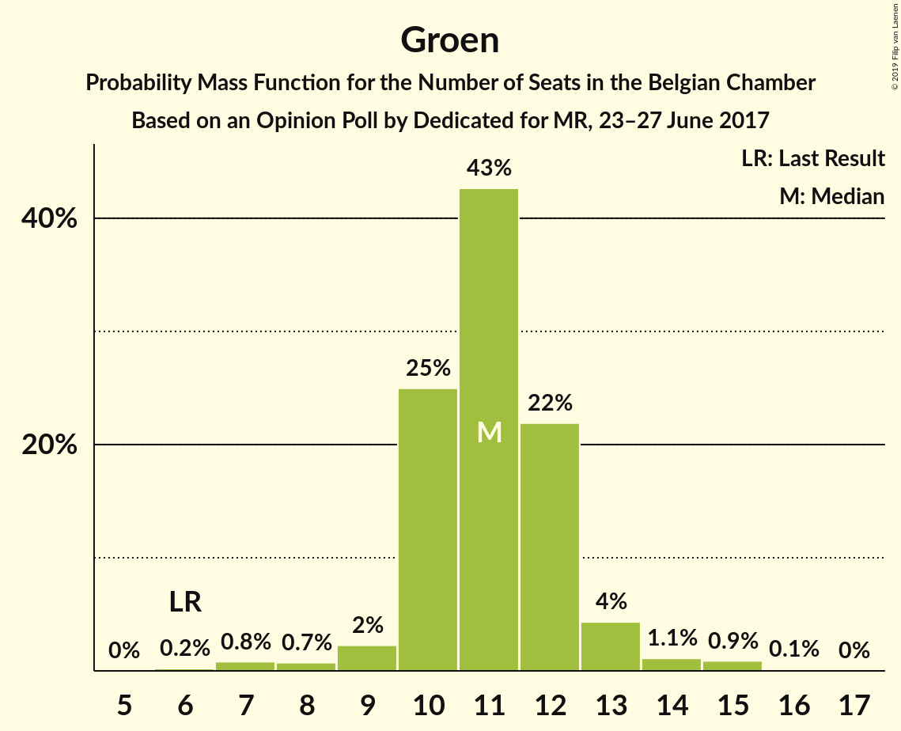
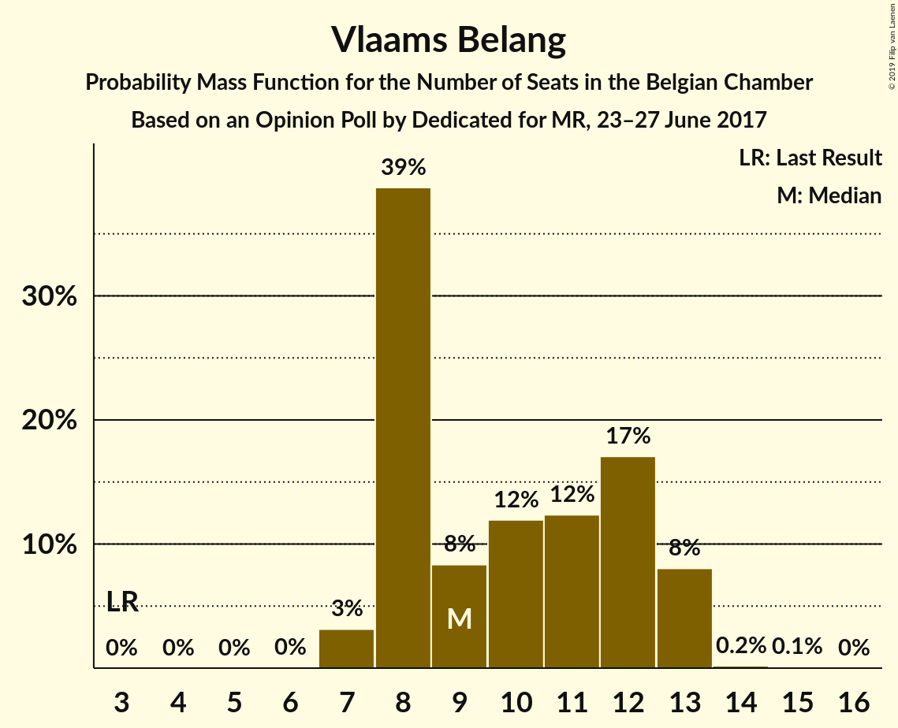
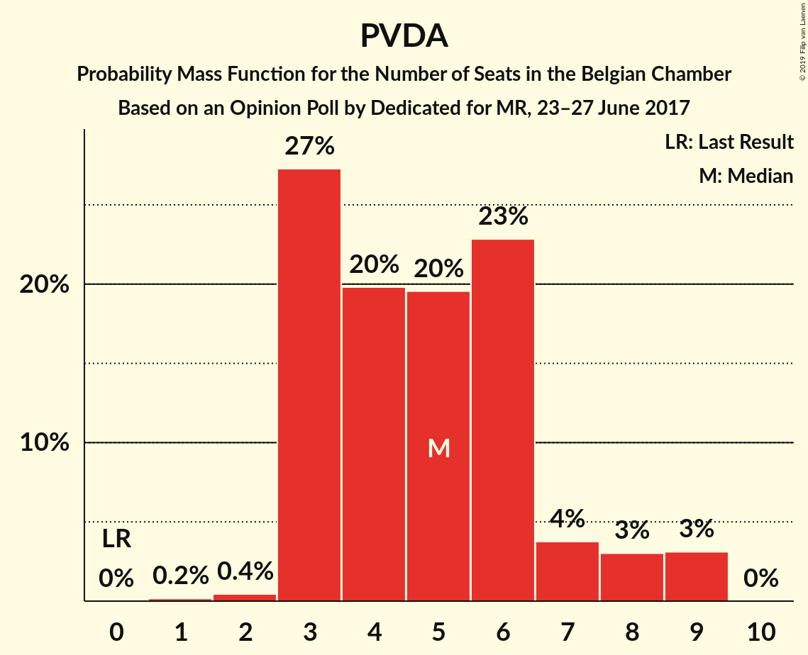
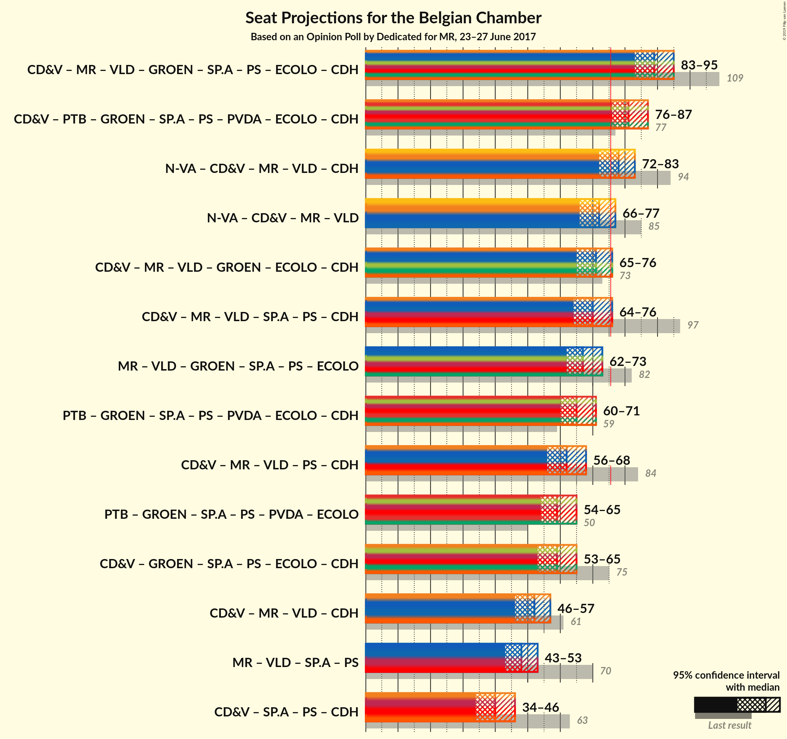

# Opinion Poll by Dedicated for MR, 23–27 June 2017

Areas included: Brussels, Flanders, Wallonia

<a href="#voting-intentions">Voting Intentions</a> | <a href="#seats">Seats</a> | <a href="#coalitions">Coalitions</a> | <a href="#technical-information">Technical Information</a>

## Voting Intentions

### Confidence Intervals

| Party | Last Result | Poll Result | 80% Confidence Interval | 90% Confidence Interval | 95% Confidence Interval | 99% Confidence Interval |
|:-----:|:-----------:|:-----------:|:-----------------------:|:-----------------------:|:-----------------------:|:-----------------------:|
| N-VA | 20.3% | 16.7% | 15.3–17.7% |14.9–17.9% |14.6–18.0% |14.0–18.1% |
| CD&V | 11.6% | 10.5% | 9.3–11.4% |9.0–11.5% |8.8–11.6% |8.3–11.7% |
| MR | 9.6% | 8.7% | 7.4–7.9% |7.3–7.9% |7.2–7.9% |7.0–8.0% |
| PTB | 2.0% | 8.7% | 7.5–8.0% |7.4–8.0% |7.2–8.0% |7.0–8.0% |
| Open Vld | 9.8% | 7.8% | 6.8–8.6% |6.5–8.8% |6.3–8.8% |5.9–8.9% |
| Groen | 5.3% | 7.7% | 6.7–8.5% |6.4–8.6% |6.2–8.7% |5.8–8.8% |
| Vlaams Belang | 3.7% | 7.2% | 6.3–8.0% |6.0–8.1% |5.8–8.2% |5.4–8.3% |
| sp.a | 8.8% | 5.8% | 5.0–6.6% |4.7–6.7% |4.5–6.8% |4.2–6.8% |
| PS | 11.7% | 5.7% | 4.7–5.1% |4.6–5.1% |4.5–5.1% |4.3–5.1% |
| PVDA | 1.8% | 4.5% | 3.8–5.2% |3.6–5.3% |3.4–5.4% |3.1–5.4% |
| Ecolo | 3.3% | 4.5% | 3.5–3.9% |3.5–3.9% |3.4–3.9% |3.2–3.9% |
| cdH | 5.0% | 3.6% | 2.8–3.1% |2.7–3.1% |2.6–3.1% |2.5–3.1% |
| DéFI | 1.8% | 2.4% | 1.8–2.0% |1.8–2.0% |1.7–2.0% |1.6–2.0% |

*Note:* The poll result column reflects the actual value used in the calculations. Published results may vary slightly, and in addition be rounded to fewer digits.

## Seats

### Confidence Intervals

| Party | Last Result | Median | 80% Confidence Interval | 90% Confidence Interval | 95% Confidence Interval | 99% Confidence Interval |
|:-----:|:-----------:|:------:|:-----------------------:|:-----------------------:|:-----------------------:|:-----------------------:|
| <a href="#n-va">N-VA</a> | 33 | 23 | 23–25 |23–27 |23–29 |23–29 |
| <a href="#cd&v">CD&V</a> | 18 | 15 | 14–16 |13–16 |11–18 |11–19 |
| <a href="#mr">MR</a> | 20 | 18 | 16–20 |16–20 |15–21 |14–21 |
| <a href="#ptb">PTB</a> | 2 | 17 | 15–20 |14–20 |14–20 |13–21 |
| <a href="#open-vld">Open Vld</a> | 14 | 12 | 12–14 |12–14 |12–14 |9–14 |
| <a href="#groen">Groen</a> | 6 | 11 | 10–11 |10–11 |10–13 |6–13 |
| <a href="#vlaams-belang">Vlaams Belang</a> | 3 | 8 | 8–11 |8–12 |8–12 |8–13 |
| <a href="#sp.a">sp.a</a> | 13 | 9 | 5–9 |5–10 |5–10 |5–10 |
| <a href="#ps">PS</a> | 23 | 10 | 9–13 |9–14 |9–14 |8–14 |
| <a href="#pvda">PVDA</a> | 0 | 9 | 3–9 |3–9 |3–9 |3–9 |
| <a href="#ecolo">Ecolo</a> | 6 | 8 | 7–9 |6–10 |5–10 |5–10 |
| <a href="#cdh">cdH</a> | 9 | 6 | 4–8 |4–8 |4–8 |4–9 |
| <a href="#défi">DéFI</a> | 2 | 3 | 3 |2–4 |2–4 |2–6 |

### N-VA

*For a full overview of the results for this party, see the [N-VA](party-n-va.html) page.*

| Number of Seats | Probability | Accumulated | Special Marks |
|:---------------:|:-----------:|:-----------:|:-------------:|
| 20 | 0.1% | 100% |  |
| 21 | 0% | 99.9% |  |
| 22 | 0.1% | 99.9% |  |
| 23 | 55% | 99.8% | Median |
| 24 | 23% | 45% |  |
| 25 | 15% | 22% |  |
| 26 | 0% | 7% |  |
| 27 | 4% | 7% |  |
| 28 | 0% | 4% |  |
| 29 | 3% | 4% |  |
| 30 | 0% | 0% |  |
| 31 | 0% | 0% |  |
| 32 | 0% | 0% |  |
| 33 | 0% | 0% | Last Result |

### CD&V

*For a full overview of the results for this party, see the [CD&V](party-cdv.html) page.*

| Number of Seats | Probability | Accumulated | Special Marks |
|:---------------:|:-----------:|:-----------:|:-------------:|
| 11 | 3% | 100% |  |
| 12 | 0% | 96% |  |
| 13 | 6% | 96% |  |
| 14 | 2% | 91% |  |
| 15 | 53% | 89% | Median |
| 16 | 32% | 36% |  |
| 17 | 0.1% | 4% |  |
| 18 | 3% | 4% | Last Result |
| 19 | 0.1% | 0.5% |  |
| 20 | 0.3% | 0.5% |  |
| 21 | 0% | 0.2% |  |
| 22 | 0.1% | 0.1% |  |
| 23 | 0% | 0.1% |  |
| 24 | 0.1% | 0.1% |  |
| 25 | 0% | 0% |  |

### MR

*For a full overview of the results for this party, see the [MR](party-mr.html) page.*

| Number of Seats | Probability | Accumulated | Special Marks |
|:---------------:|:-----------:|:-----------:|:-------------:|
| 14 | 0.7% | 100% |  |
| 15 | 2% | 99.3% |  |
| 16 | 11% | 97% |  |
| 17 | 17% | 86% |  |
| 18 | 24% | 69% | Median |
| 19 | 18% | 45% |  |
| 20 | 24% | 28% | Last Result |
| 21 | 3% | 4% |  |
| 22 | 0.2% | 0.4% |  |
| 23 | 0.1% | 0.2% |  |
| 24 | 0% | 0% |  |

### PTB

*For a full overview of the results for this party, see the [PTB](party-ptb.html) page.*

| Number of Seats | Probability | Accumulated | Special Marks |
|:---------------:|:-----------:|:-----------:|:-------------:|
| 2 | 0% | 100% | Last Result |
| 3 | 0% | 100% |  |
| 4 | 0% | 100% |  |
| 5 | 0% | 100% |  |
| 6 | 0% | 100% |  |
| 7 | 0% | 100% |  |
| 8 | 0% | 100% |  |
| 9 | 0% | 100% |  |
| 10 | 0% | 100% |  |
| 11 | 0% | 100% |  |
| 12 | 0.1% | 100% |  |
| 13 | 1.3% | 99.9% |  |
| 14 | 5% | 98.6% |  |
| 15 | 12% | 94% |  |
| 16 | 21% | 82% |  |
| 17 | 20% | 61% | Median |
| 18 | 18% | 41% |  |
| 19 | 12% | 23% |  |
| 20 | 9% | 11% |  |
| 21 | 2% | 2% |  |
| 22 | 0.1% | 0.1% |  |
| 23 | 0% | 0% |  |

### Open Vld

*For a full overview of the results for this party, see the [Open Vld](party-openvld.html) page.*

| Number of Seats | Probability | Accumulated | Special Marks |
|:---------------:|:-----------:|:-----------:|:-------------:|
| 8 | 0.3% | 100% |  |
| 9 | 0.3% | 99.6% |  |
| 10 | 0.2% | 99.4% |  |
| 11 | 0.1% | 99.2% |  |
| 12 | 65% | 99.1% | Median |
| 13 | 10% | 34% |  |
| 14 | 24% | 24% | Last Result |
| 15 | 0% | 0% |  |

### Groen

*For a full overview of the results for this party, see the [Groen](party-groen.html) page.*

| Number of Seats | Probability | Accumulated | Special Marks |
|:---------------:|:-----------:|:-----------:|:-------------:|
| 6 | 0.6% | 100% | Last Result |
| 7 | 0% | 99.4% |  |
| 8 | 0% | 99.4% |  |
| 9 | 0% | 99.3% |  |
| 10 | 17% | 99.3% |  |
| 11 | 80% | 82% | Median |
| 12 | 0% | 3% |  |
| 13 | 3% | 3% |  |
| 14 | 0% | 0.1% |  |
| 15 | 0% | 0.1% |  |
| 16 | 0.1% | 0.1% |  |
| 17 | 0% | 0% |  |

### Vlaams Belang

*For a full overview of the results for this party, see the [Vlaams Belang](party-vlaamsbelang.html) page.*

| Number of Seats | Probability | Accumulated | Special Marks |
|:---------------:|:-----------:|:-----------:|:-------------:|
| 3 | 0% | 100% | Last Result |
| 4 | 0% | 100% |  |
| 5 | 0% | 100% |  |
| 6 | 0% | 100% |  |
| 7 | 0.1% | 100% |  |
| 8 | 55% | 99.9% | Median |
| 9 | 0% | 45% |  |
| 10 | 15% | 44% |  |
| 11 | 23% | 29% |  |
| 12 | 5% | 7% |  |
| 13 | 1.3% | 1.5% |  |
| 14 | 0% | 0.2% |  |
| 15 | 0.1% | 0.2% |  |
| 16 | 0% | 0% |  |

### sp.a

*For a full overview of the results for this party, see the [sp.a](party-spa.html) page.*

| Number of Seats | Probability | Accumulated | Special Marks |
|:---------------:|:-----------:|:-----------:|:-------------:|
| 5 | 13% | 100% |  |
| 6 | 5% | 87% |  |
| 7 | 0% | 82% |  |
| 8 | 23% | 82% |  |
| 9 | 54% | 59% | Median |
| 10 | 6% | 6% |  |
| 11 | 0% | 0.1% |  |
| 12 | 0% | 0% |  |
| 13 | 0% | 0% | Last Result |

### PS

*For a full overview of the results for this party, see the [PS](party-ps.html) page.*

| Number of Seats | Probability | Accumulated | Special Marks |
|:---------------:|:-----------:|:-----------:|:-------------:|
| 7 | 0.1% | 100% |  |
| 8 | 2% | 99.8% |  |
| 9 | 20% | 98% |  |
| 10 | 33% | 78% | Median |
| 11 | 22% | 44% |  |
| 12 | 7% | 22% |  |
| 13 | 7% | 15% |  |
| 14 | 8% | 8% |  |
| 15 | 0.2% | 0.2% |  |
| 16 | 0% | 0% |  |
| 17 | 0% | 0% |  |
| 18 | 0% | 0% |  |
| 19 | 0% | 0% |  |
| 20 | 0% | 0% |  |
| 21 | 0% | 0% |  |
| 22 | 0% | 0% |  |
| 23 | 0% | 0% | Last Result |

### PVDA

*For a full overview of the results for this party, see the [PVDA](party-pvda.html) page.*

| Number of Seats | Probability | Accumulated | Special Marks |
|:---------------:|:-----------:|:-----------:|:-------------:|
| 0 | 0% | 100% | Last Result |
| 1 | 0.1% | 100% |  |
| 2 | 0% | 99.9% |  |
| 3 | 25% | 99.9% |  |
| 4 | 0.1% | 75% |  |
| 5 | 5% | 75% |  |
| 6 | 6% | 70% |  |
| 7 | 2% | 65% |  |
| 8 | 0% | 63% |  |
| 9 | 63% | 63% | Median |
| 10 | 0% | 0% |  |

### Ecolo

*For a full overview of the results for this party, see the [Ecolo](party-ecolo.html) page.*

| Number of Seats | Probability | Accumulated | Special Marks |
|:---------------:|:-----------:|:-----------:|:-------------:|
| 4 | 0.2% | 100% |  |
| 5 | 3% | 99.8% |  |
| 6 | 7% | 97% | Last Result |
| 7 | 14% | 90% |  |
| 8 | 30% | 76% | Median |
| 9 | 38% | 46% |  |
| 10 | 8% | 9% |  |
| 11 | 0.2% | 0.3% |  |
| 12 | 0.1% | 0.1% |  |
| 13 | 0% | 0% |  |

### cdH

*For a full overview of the results for this party, see the [cdH](party-cdh.html) page.*

| Number of Seats | Probability | Accumulated | Special Marks |
|:---------------:|:-----------:|:-----------:|:-------------:|
| 3 | 0.1% | 100% |  |
| 4 | 27% | 99.9% |  |
| 5 | 18% | 73% |  |
| 6 | 18% | 55% | Median |
| 7 | 26% | 36% |  |
| 8 | 9% | 10% |  |
| 9 | 1.0% | 1.0% | Last Result |
| 10 | 0% | 0% |  |

### DéFI

*For a full overview of the results for this party, see the [DéFI](party-défi.html) page.*

| Number of Seats | Probability | Accumulated | Special Marks |
|:---------------:|:-----------:|:-----------:|:-------------:|
| 2 | 7% | 100% | Last Result |
| 3 | 87% | 93% | Median |
| 4 | 6% | 7% |  |
| 5 | 0.3% | 0.8% |  |
| 6 | 0.5% | 0.5% |  |
| 7 | 0% | 0% |  |

## Coalitions

### Confidence Intervals

| Coalition | Last Result | Median | Majority? | 80% Confidence Interval | 90% Confidence Interval | 95% Confidence Interval | 99% Confidence Interval |
|:---------:|:-----------:|:------:|:---------:|:-----------------------:|:-----------------------:|:-----------------------:|:-----------------------:|
| CD&V – MR – Open Vld – Groen – sp.a – PS – Ecolo – cdH | 109 | 90 | 100% | 86–93 | 84–94 | 83–94 | 81–96 |
| CD&V – PTB – Groen – sp.a – PS – PVDA – Ecolo – cdH | 77 | 84 | 97% | 78–87 | 77–88 | 75–88 | 73–89 |
| N-VA – CD&V – MR – Open Vld – cdH | 94 | 75 | 49% | 72–79 | 71–80 | 71–81 | 70–83 |
| CD&V – MR – Open Vld – Groen – Ecolo – cdH | 73 | 71 | 4% | 67–74 | 66–75 | 66–76 | 64–78 |
| N-VA – CD&V – MR – Open Vld | 85 | 70 | 1.1% | 67–73 | 66–74 | 66–75 | 64–77 |
| CD&V – MR – Open Vld – sp.a – PS – cdH | 97 | 71 | 2% | 67–74 | 66–75 | 65–75 | 62–77 |
| MR – Open Vld – Groen – sp.a – PS – Ecolo | 82 | 69 | 0% | 65–72 | 64–72 | 63–73 | 61–74 |
| PTB – Groen – sp.a – PS – PVDA – Ecolo – cdH | 59 | 69 | 0% | 63–72 | 62–73 | 61–73 | 58–74 |
| PTB – Groen – sp.a – PS – PVDA – Ecolo | 50 | 63 | 0% | 57–67 | 56–68 | 55–68 | 53–69 |
| CD&V – MR – Open Vld – PS – cdH | 84 | 62 | 0% | 59–66 | 58–67 | 58–67 | 56–69 |
| CD&V – Groen – sp.a – PS – Ecolo – cdH | 75 | 59 | 0% | 55–62 | 54–63 | 52–63 | 50–65 |
| CD&V – MR – Open Vld – cdH | 61 | 52 | 0% | 48–55 | 48–56 | 47–57 | 45–58 |
| MR – Open Vld – sp.a – PS | 70 | 50 | 0% | 46–52 | 45–53 | 44–54 | 43–55 |
| CD&V – sp.a – PS – cdH | 63 | 40 | 0% | 37–43 | 35–44 | 34–44 | 31–46 |

### CD&V – MR – Open Vld – Groen – sp.a – PS – Ecolo – cdH

| Number of Seats | Probability | Accumulated | Special Marks |
|:---------------:|:-----------:|:-----------:|:-------------:|
| 80 | 0.1% | 100% |  |
| 81 | 0.4% | 99.8% |  |
| 82 | 0.8% | 99.4% |  |
| 83 | 2% | 98.6% |  |
| 84 | 2% | 97% |  |
| 85 | 3% | 95% |  |
| 86 | 5% | 92% |  |
| 87 | 8% | 87% |  |
| 88 | 10% | 79% |  |
| 89 | 13% | 69% | Median |
| 90 | 15% | 56% |  |
| 91 | 16% | 41% |  |
| 92 | 12% | 25% |  |
| 93 | 7% | 13% |  |
| 94 | 4% | 6% |  |
| 95 | 1.4% | 2% |  |
| 96 | 0.5% | 0.6% |  |
| 97 | 0.1% | 0.1% |  |
| 98 | 0% | 0% |  |
| 99 | 0% | 0% |  |
| 100 | 0% | 0% |  |
| 101 | 0% | 0% |  |
| 102 | 0% | 0% |  |
| 103 | 0% | 0% |  |
| 104 | 0% | 0% |  |
| 105 | 0% | 0% |  |
| 106 | 0% | 0% |  |
| 107 | 0% | 0% |  |
| 108 | 0% | 0% |  |
| 109 | 0% | 0% | Last Result |

### CD&V – PTB – Groen – sp.a – PS – PVDA – Ecolo – cdH

| Number of Seats | Probability | Accumulated | Special Marks |
|:---------------:|:-----------:|:-----------:|:-------------:|
| 72 | 0.1% | 100% |  |
| 73 | 0.8% | 99.8% |  |
| 74 | 0.7% | 99.0% |  |
| 75 | 1.1% | 98% |  |
| 76 | 1.2% | 97% | Majority |
| 77 | 2% | 96% | Last Result |
| 78 | 6% | 94% |  |
| 79 | 7% | 88% |  |
| 80 | 9% | 82% |  |
| 81 | 7% | 73% |  |
| 82 | 6% | 65% |  |
| 83 | 6% | 59% |  |
| 84 | 14% | 53% |  |
| 85 | 10% | 40% | Median |
| 86 | 13% | 29% |  |
| 87 | 9% | 17% |  |
| 88 | 6% | 8% |  |
| 89 | 1.4% | 2% |  |
| 90 | 0.4% | 0.4% |  |
| 91 | 0% | 0% |  |

### N-VA – CD&V – MR – Open Vld – cdH

| Number of Seats | Probability | Accumulated | Special Marks |
|:---------------:|:-----------:|:-----------:|:-------------:|
| 67 | 0% | 100% |  |
| 68 | 0.1% | 99.9% |  |
| 69 | 0.2% | 99.9% |  |
| 70 | 2% | 99.6% |  |
| 71 | 4% | 98% |  |
| 72 | 6% | 93% |  |
| 73 | 8% | 87% |  |
| 74 | 13% | 79% | Median |
| 75 | 17% | 65% |  |
| 76 | 12% | 49% | Majority |
| 77 | 10% | 36% |  |
| 78 | 10% | 26% |  |
| 79 | 8% | 16% |  |
| 80 | 4% | 8% |  |
| 81 | 2% | 4% |  |
| 82 | 1.0% | 2% |  |
| 83 | 0.4% | 0.6% |  |
| 84 | 0.2% | 0.2% |  |
| 85 | 0.1% | 0.1% |  |
| 86 | 0% | 0% |  |
| 87 | 0% | 0% |  |
| 88 | 0% | 0% |  |
| 89 | 0% | 0% |  |
| 90 | 0% | 0% |  |
| 91 | 0% | 0% |  |
| 92 | 0% | 0% |  |
| 93 | 0% | 0% |  |
| 94 | 0% | 0% | Last Result |

### CD&V – MR – Open Vld – Groen – Ecolo – cdH

| Number of Seats | Probability | Accumulated | Special Marks |
|:---------------:|:-----------:|:-----------:|:-------------:|
| 61 | 0.1% | 100% |  |
| 62 | 0.1% | 99.9% |  |
| 63 | 0.2% | 99.8% |  |
| 64 | 0.6% | 99.6% |  |
| 65 | 1.3% | 98.9% |  |
| 66 | 3% | 98% |  |
| 67 | 5% | 95% |  |
| 68 | 9% | 90% |  |
| 69 | 12% | 81% |  |
| 70 | 14% | 68% | Median |
| 71 | 15% | 55% |  |
| 72 | 16% | 40% |  |
| 73 | 10% | 25% | Last Result |
| 74 | 6% | 14% |  |
| 75 | 5% | 9% |  |
| 76 | 2% | 4% | Majority |
| 77 | 0.7% | 1.4% |  |
| 78 | 0.3% | 0.7% |  |
| 79 | 0.3% | 0.4% |  |
| 80 | 0.1% | 0.1% |  |
| 81 | 0% | 0% |  |

### N-VA – CD&V – MR – Open Vld

| Number of Seats | Probability | Accumulated | Special Marks |
|:---------------:|:-----------:|:-----------:|:-------------:|
| 62 | 0.1% | 100% |  |
| 63 | 0.1% | 99.9% |  |
| 64 | 0.4% | 99.8% |  |
| 65 | 1.4% | 99.4% |  |
| 66 | 6% | 98% |  |
| 67 | 10% | 92% |  |
| 68 | 14% | 82% | Median |
| 69 | 13% | 68% |  |
| 70 | 19% | 55% |  |
| 71 | 11% | 37% |  |
| 72 | 9% | 26% |  |
| 73 | 8% | 17% |  |
| 74 | 7% | 9% |  |
| 75 | 2% | 3% |  |
| 76 | 0.4% | 1.1% | Majority |
| 77 | 0.5% | 0.6% |  |
| 78 | 0.1% | 0.2% |  |
| 79 | 0% | 0.1% |  |
| 80 | 0% | 0% |  |
| 81 | 0% | 0% |  |
| 82 | 0% | 0% |  |
| 83 | 0% | 0% |  |
| 84 | 0% | 0% |  |
| 85 | 0% | 0% | Last Result |

### CD&V – MR – Open Vld – sp.a – PS – cdH

| Number of Seats | Probability | Accumulated | Special Marks |
|:---------------:|:-----------:|:-----------:|:-------------:|
| 61 | 0.1% | 100% |  |
| 62 | 0.3% | 99.8% |  |
| 63 | 0.7% | 99.5% |  |
| 64 | 1.1% | 98.8% |  |
| 65 | 2% | 98% |  |
| 66 | 3% | 96% |  |
| 67 | 5% | 93% |  |
| 68 | 8% | 88% |  |
| 69 | 12% | 80% |  |
| 70 | 14% | 68% | Median |
| 71 | 16% | 54% |  |
| 72 | 15% | 38% |  |
| 73 | 11% | 23% |  |
| 74 | 7% | 12% |  |
| 75 | 4% | 6% |  |
| 76 | 1.3% | 2% | Majority |
| 77 | 0.5% | 0.7% |  |
| 78 | 0.1% | 0.2% |  |
| 79 | 0% | 0% |  |
| 80 | 0% | 0% |  |
| 81 | 0% | 0% |  |
| 82 | 0% | 0% |  |
| 83 | 0% | 0% |  |
| 84 | 0% | 0% |  |
| 85 | 0% | 0% |  |
| 86 | 0% | 0% |  |
| 87 | 0% | 0% |  |
| 88 | 0% | 0% |  |
| 89 | 0% | 0% |  |
| 90 | 0% | 0% |  |
| 91 | 0% | 0% |  |
| 92 | 0% | 0% |  |
| 93 | 0% | 0% |  |
| 94 | 0% | 0% |  |
| 95 | 0% | 0% |  |
| 96 | 0% | 0% |  |
| 97 | 0% | 0% | Last Result |

### MR – Open Vld – Groen – sp.a – PS – Ecolo

| Number of Seats | Probability | Accumulated | Special Marks |
|:---------------:|:-----------:|:-----------:|:-------------:|
| 59 | 0.1% | 100% |  |
| 60 | 0.3% | 99.9% |  |
| 61 | 0.6% | 99.6% |  |
| 62 | 1.2% | 99.0% |  |
| 63 | 2% | 98% |  |
| 64 | 4% | 96% |  |
| 65 | 4% | 92% |  |
| 66 | 5% | 87% |  |
| 67 | 8% | 82% |  |
| 68 | 12% | 74% | Median |
| 69 | 20% | 62% |  |
| 70 | 19% | 42% |  |
| 71 | 12% | 23% |  |
| 72 | 6% | 10% |  |
| 73 | 3% | 4% |  |
| 74 | 1.0% | 1.2% |  |
| 75 | 0.2% | 0.2% |  |
| 76 | 0% | 0% | Majority |
| 77 | 0% | 0% |  |
| 78 | 0% | 0% |  |
| 79 | 0% | 0% |  |
| 80 | 0% | 0% |  |
| 81 | 0% | 0% |  |
| 82 | 0% | 0% | Last Result |

### PTB – Groen – sp.a – PS – PVDA – Ecolo – cdH

| Number of Seats | Probability | Accumulated | Special Marks |
|:---------------:|:-----------:|:-----------:|:-------------:|
| 57 | 0.1% | 100% |  |
| 58 | 0.4% | 99.9% |  |
| 59 | 0.4% | 99.5% | Last Result |
| 60 | 0.6% | 99.1% |  |
| 61 | 2% | 98.5% |  |
| 62 | 6% | 97% |  |
| 63 | 6% | 91% |  |
| 64 | 9% | 85% |  |
| 65 | 7% | 76% |  |
| 66 | 7% | 69% |  |
| 67 | 4% | 62% |  |
| 68 | 5% | 58% |  |
| 69 | 13% | 53% |  |
| 70 | 11% | 40% | Median |
| 71 | 12% | 29% |  |
| 72 | 9% | 17% |  |
| 73 | 6% | 8% |  |
| 74 | 1.4% | 2% |  |
| 75 | 0.4% | 0.4% |  |
| 76 | 0% | 0% | Majority |

### PTB – Groen – sp.a – PS – PVDA – Ecolo

| Number of Seats | Probability | Accumulated | Special Marks |
|:---------------:|:-----------:|:-----------:|:-------------:|
| 50 | 0% | 100% | Last Result |
| 51 | 0.1% | 100% |  |
| 52 | 0.3% | 99.8% |  |
| 53 | 0.5% | 99.6% |  |
| 54 | 1.0% | 99.0% |  |
| 55 | 2% | 98% |  |
| 56 | 4% | 96% |  |
| 57 | 7% | 92% |  |
| 58 | 7% | 85% |  |
| 59 | 7% | 78% |  |
| 60 | 6% | 71% |  |
| 61 | 6% | 65% |  |
| 62 | 7% | 59% |  |
| 63 | 8% | 52% |  |
| 64 | 13% | 44% | Median |
| 65 | 11% | 31% |  |
| 66 | 7% | 19% |  |
| 67 | 6% | 12% |  |
| 68 | 4% | 6% |  |
| 69 | 2% | 2% |  |
| 70 | 0.2% | 0.2% |  |
| 71 | 0% | 0% |  |

### CD&V – MR – Open Vld – PS – cdH

| Number of Seats | Probability | Accumulated | Special Marks |
|:---------------:|:-----------:|:-----------:|:-------------:|
| 54 | 0.1% | 100% |  |
| 55 | 0.2% | 99.9% |  |
| 56 | 0.5% | 99.8% |  |
| 57 | 1.3% | 99.3% |  |
| 58 | 3% | 98% |  |
| 59 | 7% | 95% |  |
| 60 | 11% | 88% |  |
| 61 | 14% | 77% | Median |
| 62 | 16% | 63% |  |
| 63 | 16% | 48% |  |
| 64 | 12% | 31% |  |
| 65 | 8% | 20% |  |
| 66 | 6% | 11% |  |
| 67 | 3% | 5% |  |
| 68 | 1.3% | 2% |  |
| 69 | 0.7% | 0.9% |  |
| 70 | 0.2% | 0.3% |  |
| 71 | 0% | 0.1% |  |
| 72 | 0% | 0% |  |
| 73 | 0% | 0% |  |
| 74 | 0% | 0% |  |
| 75 | 0% | 0% |  |
| 76 | 0% | 0% | Majority |
| 77 | 0% | 0% |  |
| 78 | 0% | 0% |  |
| 79 | 0% | 0% |  |
| 80 | 0% | 0% |  |
| 81 | 0% | 0% |  |
| 82 | 0% | 0% |  |
| 83 | 0% | 0% |  |
| 84 | 0% | 0% | Last Result |

### CD&V – Groen – sp.a – PS – Ecolo – cdH

| Number of Seats | Probability | Accumulated | Special Marks |
|:---------------:|:-----------:|:-----------:|:-------------:|
| 49 | 0.2% | 100% |  |
| 50 | 0.4% | 99.8% |  |
| 51 | 0.7% | 99.4% |  |
| 52 | 1.2% | 98.7% |  |
| 53 | 2% | 97% |  |
| 54 | 3% | 96% |  |
| 55 | 4% | 93% |  |
| 56 | 6% | 89% |  |
| 57 | 10% | 83% |  |
| 58 | 14% | 72% |  |
| 59 | 18% | 58% | Median |
| 60 | 15% | 41% |  |
| 61 | 11% | 25% |  |
| 62 | 7% | 14% |  |
| 63 | 5% | 7% |  |
| 64 | 2% | 2% |  |
| 65 | 0.3% | 0.5% |  |
| 66 | 0.1% | 0.2% |  |
| 67 | 0.1% | 0.1% |  |
| 68 | 0% | 0.1% |  |
| 69 | 0% | 0% |  |
| 70 | 0% | 0% |  |
| 71 | 0% | 0% |  |
| 72 | 0% | 0% |  |
| 73 | 0% | 0% |  |
| 74 | 0% | 0% |  |
| 75 | 0% | 0% | Last Result |

### CD&V – MR – Open Vld – cdH

| Number of Seats | Probability | Accumulated | Special Marks |
|:---------------:|:-----------:|:-----------:|:-------------:|
| 44 | 0.2% | 100% |  |
| 45 | 0.3% | 99.8% |  |
| 46 | 0.8% | 99.5% |  |
| 47 | 3% | 98.6% |  |
| 48 | 6% | 96% |  |
| 49 | 8% | 90% |  |
| 50 | 11% | 81% |  |
| 51 | 16% | 70% | Median |
| 52 | 18% | 54% |  |
| 53 | 13% | 37% |  |
| 54 | 10% | 24% |  |
| 55 | 7% | 14% |  |
| 56 | 4% | 7% |  |
| 57 | 2% | 3% |  |
| 58 | 0.7% | 1.0% |  |
| 59 | 0.2% | 0.3% |  |
| 60 | 0.1% | 0.1% |  |
| 61 | 0% | 0% | Last Result |

### MR – Open Vld – sp.a – PS

| Number of Seats | Probability | Accumulated | Special Marks |
|:---------------:|:-----------:|:-----------:|:-------------:|
| 41 | 0% | 100% |  |
| 42 | 0.3% | 99.9% |  |
| 43 | 0.7% | 99.7% |  |
| 44 | 2% | 98.9% |  |
| 45 | 3% | 97% |  |
| 46 | 5% | 95% |  |
| 47 | 7% | 89% |  |
| 48 | 10% | 82% |  |
| 49 | 15% | 72% | Median |
| 50 | 20% | 58% |  |
| 51 | 18% | 38% |  |
| 52 | 11% | 20% |  |
| 53 | 5% | 9% |  |
| 54 | 2% | 4% |  |
| 55 | 1.0% | 1.4% |  |
| 56 | 0.3% | 0.4% |  |
| 57 | 0.1% | 0.1% |  |
| 58 | 0% | 0% |  |
| 59 | 0% | 0% |  |
| 60 | 0% | 0% |  |
| 61 | 0% | 0% |  |
| 62 | 0% | 0% |  |
| 63 | 0% | 0% |  |
| 64 | 0% | 0% |  |
| 65 | 0% | 0% |  |
| 66 | 0% | 0% |  |
| 67 | 0% | 0% |  |
| 68 | 0% | 0% |  |
| 69 | 0% | 0% |  |
| 70 | 0% | 0% | Last Result |

### CD&V – sp.a – PS – cdH

| Number of Seats | Probability | Accumulated | Special Marks |
|:---------------:|:-----------:|:-----------:|:-------------:|
| 30 | 0.2% | 100% |  |
| 31 | 0.4% | 99.8% |  |
| 32 | 0.7% | 99.4% |  |
| 33 | 0.9% | 98.7% |  |
| 34 | 1.3% | 98% |  |
| 35 | 2% | 97% |  |
| 36 | 3% | 95% |  |
| 37 | 7% | 92% |  |
| 38 | 12% | 85% |  |
| 39 | 17% | 73% |  |
| 40 | 18% | 56% | Median |
| 41 | 15% | 37% |  |
| 42 | 10% | 22% |  |
| 43 | 6% | 13% |  |
| 44 | 4% | 6% |  |
| 45 | 1.4% | 2% |  |
| 46 | 0.4% | 0.5% |  |
| 47 | 0.1% | 0.2% |  |
| 48 | 0% | 0.1% |  |
| 49 | 0% | 0% |  |
| 50 | 0% | 0% |  |
| 51 | 0% | 0% |  |
| 52 | 0% | 0% |  |
| 53 | 0% | 0% |  |
| 54 | 0% | 0% |  |
| 55 | 0% | 0% |  |
| 56 | 0% | 0% |  |
| 57 | 0% | 0% |  |
| 58 | 0% | 0% |  |
| 59 | 0% | 0% |  |
| 60 | 0% | 0% |  |
| 61 | 0% | 0% |  |
| 62 | 0% | 0% |  |
| 63 | 0% | 0% | Last Result |

## Technical Information

### Opinion Poll

+ **Polling firm:** Dedicated
+ **Commissioner(s):** MR
+ **Fieldwork period:** 23–27 June 2017

### Calculations

+ **Sample size:** 1011
+ **Simulations done:** 1,024
+ **Error estimate:** 2.45%

