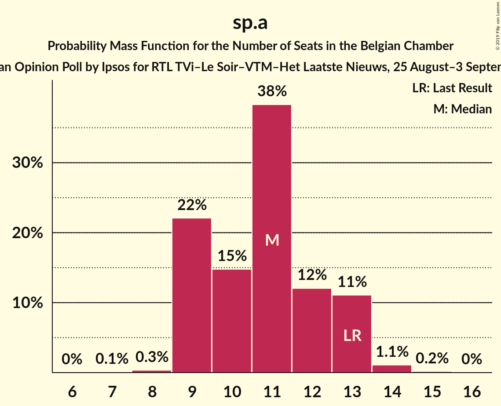
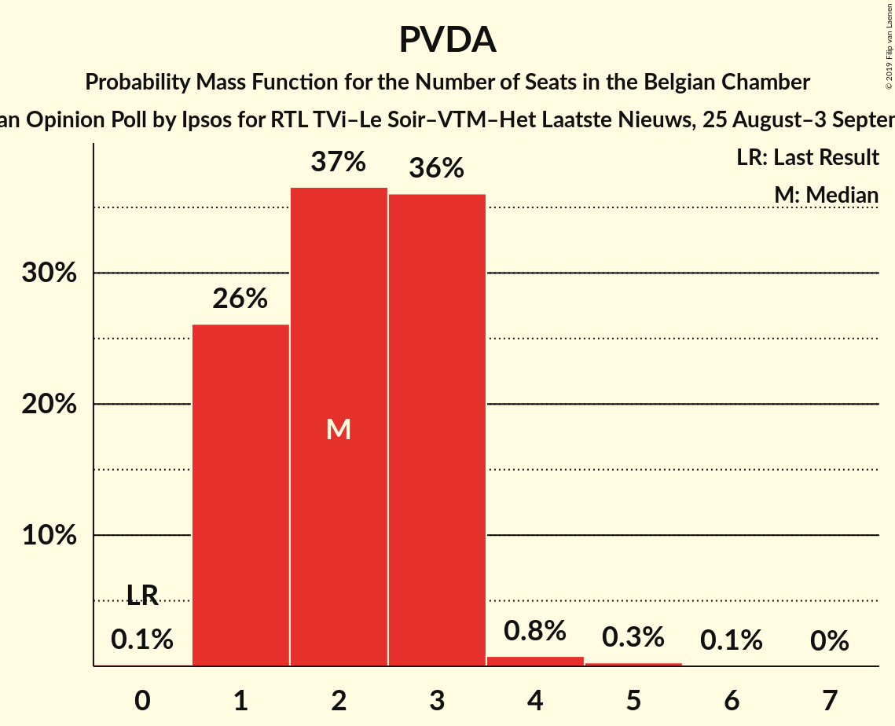
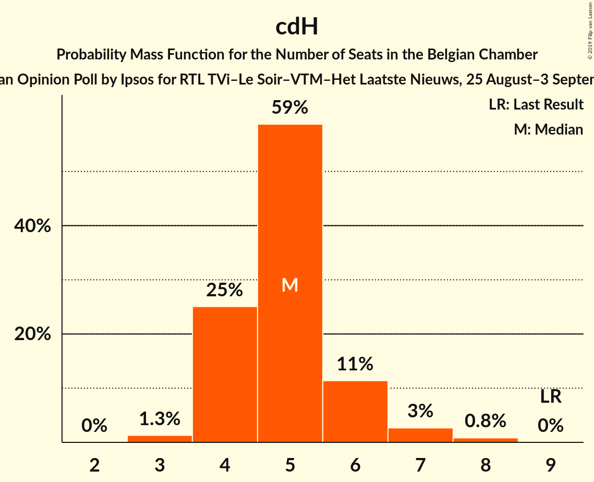
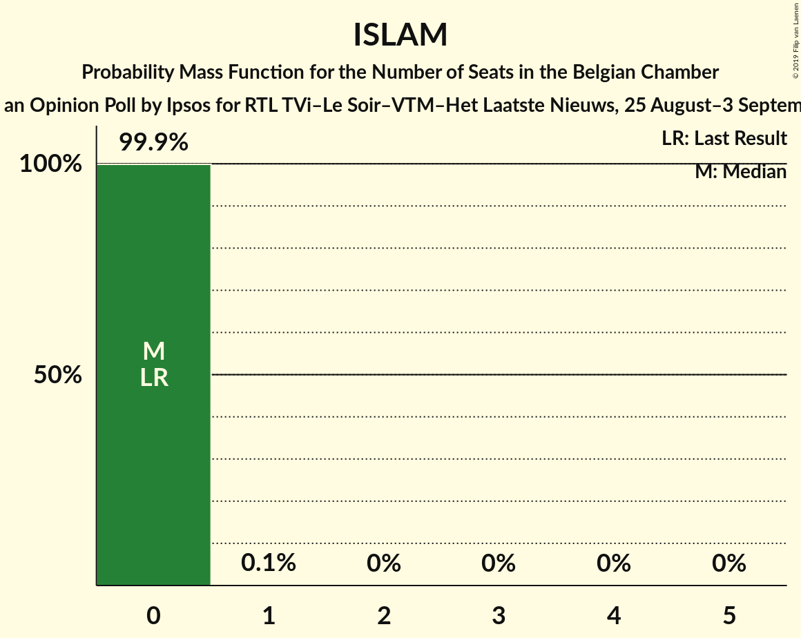

# Opinion Poll by Ipsos for RTL TVi–Le Soir–VTM–Het Laatste Nieuws, 25 August–3 September 2017

Areas included: Brussels, Flanders, Wallonia

<a href="#voting-intentions">Voting Intentions</a> | <a href="#seats">Seats</a> | <a href="#coalitions">Coalitions</a> | <a href="#technical-information">Technical Information</a>

## Voting Intentions

### Confidence Intervals

| Party | Last Result | Poll Result | 80% Confidence Interval | 90% Confidence Interval | 95% Confidence Interval | 99% Confidence Interval |
|:-----:|:-----------:|:-----------:|:-----------------------:|:-----------------------:|:-----------------------:|:-----------------------:|
| N-VA | 20.3% | 18.9% | 17.0–17.9% |16.7–17.9% |16.5–17.9% |16.1–18.0% |
| CD&V | 11.6% | 10.1% | 8.5–9.3% |8.4–9.3% |8.2–9.3% |7.9–9.3% |
| Groen | 5.3% | 8.3% | 7.5–8.9% |7.2–9.1% |7.1–9.1% |6.7–9.2% |
| MR | 9.6% | 8.1% | 7.0–7.4% |6.9–7.4% |6.9–7.4% |6.7–7.5% |
| sp.a | 8.8% | 7.7% | 6.3–6.9% |6.2–7.0% |6.0–7.0% |5.8–7.0% |
| Open Vld | 9.8% | 7.6% | 6.3–6.9% |6.1–6.9% |6.0–6.9% |5.7–7.0% |
| PS | 11.7% | 7.3% | 6.3–6.7% |6.2–6.7% |6.1–6.7% |5.9–6.7% |
| PTB | 2.0% | 6.1% | 5.2–5.5% |5.1–5.5% |5.0–5.5% |4.8–5.5% |
| Vlaams Belang | 3.7% | 5.0% | 3.9–4.4% |3.8–4.5% |3.7–4.5% |3.5–4.5% |
| Ecolo | 3.3% | 4.8% | 4.0–4.3% |4.0–4.3% |3.9–4.4% |3.7–4.4% |
| DéFI | 1.8% | 3.3% | 2.7–2.9% |2.6–2.9% |2.6–2.9% |2.5–2.9% |
| PVDA | 1.8% | 3.1% | 2.6–3.5% |2.4–3.6% |2.3–3.7% |2.1–3.7% |
| cdH | 5.0% | 3.1% | 2.5–2.7% |2.4–2.7% |2.4–2.7% |2.3–2.7% |
| Parti Populaire | 1.5% | 1.5% | 1.1–1.3% |1.1–1.3% |1.1–1.3% |1.0–1.3% |
| La Droite | 0.4% | 0.5% | 0.3% |0.2–0.4% |0.2–0.4% |0.2–0.4% |
| ISLAM | 0.2% | 0.2% | 0.1% |0.1% |0.1% |0.1% |

*Note:* The poll result column reflects the actual value used in the calculations. Published results may vary slightly, and in addition be rounded to fewer digits.

## Seats

### Confidence Intervals

| Party | Last Result | Median | 80% Confidence Interval | 90% Confidence Interval | 95% Confidence Interval | 99% Confidence Interval |
|:-----:|:-----------:|:------:|:-----------------------:|:-----------------------:|:-----------------------:|:-----------------------:|
| <a href="#n-va">N-VA</a> | 33 | 30 | 28–31 |28–31 |27–31 |26–32 |
| <a href="#cd&v">CD&V</a> | 18 | 14 | 13–14 |12–14 |12–15 |12–16 |
| <a href="#groen">Groen</a> | 6 | 12 | 12 |12–13 |12–14 |12–15 |
| <a href="#mr">MR</a> | 20 | 17 | 16–18 |15–19 |15–19 |15–20 |
| <a href="#sp.a">sp.a</a> | 13 | 11 | 11–13 |11–14 |11–14 |9–14 |
| <a href="#open-vld">Open Vld</a> | 14 | 10 | 10–13 |9–13 |9–13 |8–14 |
| <a href="#ps">PS</a> | 23 | 15 | 14–16 |14–17 |13–17 |12–18 |
| <a href="#ptb">PTB</a> | 2 | 11 | 10–12 |10–12 |9–13 |9–14 |
| <a href="#vlaams-belang">Vlaams Belang</a> | 3 | 8 | 7–8 |7–8 |5–8 |5–8 |
| <a href="#ecolo">Ecolo</a> | 6 | 9 | 8–10 |8–10 |7–10 |7–11 |
| <a href="#défi">DéFI</a> | 2 | 6 | 4–7 |3–7 |3–7 |3–8 |
| <a href="#pvda">PVDA</a> | 0 | 2 | 2–3 |1–3 |1–3 |1–3 |
| <a href="#cdh">cdH</a> | 9 | 5 | 4–6 |4–6 |4–7 |3–8 |
| <a href="#parti-populaire">Parti Populaire</a> | 1 | 0 | 0–2 |0–2 |0–2 |0–2 |
| <a href="#la-droite">La Droite</a> | 0 | 0 | 0 |0 |0 |0 |
| <a href="#islam">ISLAM</a> | 0 | 0 | 0 |0 |0 |0 |

### N-VA

*For a full overview of the results for this party, see the [N-VA](party-n-va.html) page.*

| Number of Seats | Probability | Accumulated | Special Marks |
|:---------------:|:-----------:|:-----------:|:-------------:|
| 25 | 0.1% | 100% |  |
| 26 | 2% | 99.9% |  |
| 27 | 0.6% | 98% |  |
| 28 | 33% | 97% |  |
| 29 | 4% | 64% |  |
| 30 | 45% | 60% | Median |
| 31 | 14% | 15% |  |
| 32 | 1.0% | 1.1% |  |
| 33 | 0% | 0.1% | Last Result |
| 34 | 0% | 0% |  |

### CD&V

*For a full overview of the results for this party, see the [CD&V](party-cdv.html) page.*

| Number of Seats | Probability | Accumulated | Special Marks |
|:---------------:|:-----------:|:-----------:|:-------------:|
| 12 | 6% | 100% |  |
| 13 | 9% | 94% |  |
| 14 | 82% | 85% | Median |
| 15 | 2% | 3% |  |
| 16 | 0.3% | 0.7% |  |
| 17 | 0.2% | 0.3% |  |
| 18 | 0.2% | 0.2% | Last Result |
| 19 | 0% | 0% |  |

### Groen

*For a full overview of the results for this party, see the [Groen](party-groen.html) page.*

| Number of Seats | Probability | Accumulated | Special Marks |
|:---------------:|:-----------:|:-----------:|:-------------:|
| 6 | 0% | 100% | Last Result |
| 7 | 0% | 100% |  |
| 8 | 0% | 100% |  |
| 9 | 0% | 100% |  |
| 10 | 0% | 100% |  |
| 11 | 0.1% | 100% |  |
| 12 | 95% | 99.9% | Median |
| 13 | 3% | 5% |  |
| 14 | 0.3% | 3% |  |
| 15 | 2% | 2% |  |
| 16 | 0.2% | 0.2% |  |
| 17 | 0% | 0% |  |

### MR

*For a full overview of the results for this party, see the [MR](party-mr.html) page.*

| Number of Seats | Probability | Accumulated | Special Marks |
|:---------------:|:-----------:|:-----------:|:-------------:|
| 14 | 0.4% | 100% |  |
| 15 | 9% | 99.6% |  |
| 16 | 35% | 91% |  |
| 17 | 24% | 56% | Median |
| 18 | 23% | 32% |  |
| 19 | 7% | 9% |  |
| 20 | 1.3% | 1.5% | Last Result |
| 21 | 0.1% | 0.2% |  |
| 22 | 0% | 0% |  |

### sp.a

*For a full overview of the results for this party, see the [sp.a](party-spa.html) page.*

| Number of Seats | Probability | Accumulated | Special Marks |
|:---------------:|:-----------:|:-----------:|:-------------:|
| 9 | 0.8% | 100% |  |
| 10 | 0% | 99.2% |  |
| 11 | 86% | 99.2% | Median |
| 12 | 0.1% | 14% |  |
| 13 | 5% | 13% | Last Result |
| 14 | 9% | 9% |  |
| 15 | 0.3% | 0.3% |  |
| 16 | 0% | 0% |  |

### Open Vld

*For a full overview of the results for this party, see the [Open Vld](party-openvld.html) page.*

| Number of Seats | Probability | Accumulated | Special Marks |
|:---------------:|:-----------:|:-----------:|:-------------:|
| 8 | 2% | 100% |  |
| 9 | 3% | 98% |  |
| 10 | 51% | 94% | Median |
| 11 | 6% | 44% |  |
| 12 | 8% | 37% |  |
| 13 | 29% | 29% |  |
| 14 | 0.6% | 0.6% | Last Result |
| 15 | 0% | 0% |  |

### PS

*For a full overview of the results for this party, see the [PS](party-ps.html) page.*

| Number of Seats | Probability | Accumulated | Special Marks |
|:---------------:|:-----------:|:-----------:|:-------------:|
| 11 | 0.2% | 100% |  |
| 12 | 0.5% | 99.7% |  |
| 13 | 2% | 99.2% |  |
| 14 | 46% | 97% |  |
| 15 | 28% | 51% | Median |
| 16 | 15% | 23% |  |
| 17 | 7% | 8% |  |
| 18 | 1.0% | 1.0% |  |
| 19 | 0% | 0% |  |
| 20 | 0% | 0% |  |
| 21 | 0% | 0% |  |
| 22 | 0% | 0% |  |
| 23 | 0% | 0% | Last Result |

### PTB

*For a full overview of the results for this party, see the [PTB](party-ptb.html) page.*

| Number of Seats | Probability | Accumulated | Special Marks |
|:---------------:|:-----------:|:-----------:|:-------------:|
| 2 | 0% | 100% | Last Result |
| 3 | 0% | 100% |  |
| 4 | 0% | 100% |  |
| 5 | 0% | 100% |  |
| 6 | 0% | 100% |  |
| 7 | 0% | 100% |  |
| 8 | 0.1% | 100% |  |
| 9 | 4% | 99.9% |  |
| 10 | 25% | 96% |  |
| 11 | 45% | 72% | Median |
| 12 | 24% | 27% |  |
| 13 | 2% | 3% |  |
| 14 | 0.4% | 0.5% |  |
| 15 | 0.1% | 0.1% |  |
| 16 | 0% | 0% |  |

### Vlaams Belang

*For a full overview of the results for this party, see the [Vlaams Belang](party-vlaamsbelang.html) page.*

| Number of Seats | Probability | Accumulated | Special Marks |
|:---------------:|:-----------:|:-----------:|:-------------:|
| 3 | 0% | 100% | Last Result |
| 4 | 0.3% | 100% |  |
| 5 | 2% | 99.7% |  |
| 6 | 2% | 97% |  |
| 7 | 44% | 95% |  |
| 8 | 51% | 51% | Median |
| 9 | 0% | 0% |  |

### Ecolo

*For a full overview of the results for this party, see the [Ecolo](party-ecolo.html) page.*

| Number of Seats | Probability | Accumulated | Special Marks |
|:---------------:|:-----------:|:-----------:|:-------------:|
| 6 | 0.2% | 100% | Last Result |
| 7 | 3% | 99.8% |  |
| 8 | 13% | 97% |  |
| 9 | 65% | 85% | Median |
| 10 | 17% | 19% |  |
| 11 | 2% | 2% |  |
| 12 | 0.3% | 0.4% |  |
| 13 | 0.1% | 0.1% |  |
| 14 | 0% | 0% |  |

### DéFI

*For a full overview of the results for this party, see the [DéFI](party-défi.html) page.*

| Number of Seats | Probability | Accumulated | Special Marks |
|:---------------:|:-----------:|:-----------:|:-------------:|
| 2 | 0% | 100% | Last Result |
| 3 | 8% | 100% |  |
| 4 | 22% | 92% |  |
| 5 | 8% | 71% |  |
| 6 | 20% | 63% | Median |
| 7 | 40% | 42% |  |
| 8 | 2% | 2% |  |
| 9 | 0% | 0% |  |

### PVDA

*For a full overview of the results for this party, see the [PVDA](party-pvda.html) page.*

| Number of Seats | Probability | Accumulated | Special Marks |
|:---------------:|:-----------:|:-----------:|:-------------:|
| 0 | 0% | 100% | Last Result |
| 1 | 9% | 100% |  |
| 2 | 79% | 91% | Median |
| 3 | 11% | 11% |  |
| 4 | 0% | 0.2% |  |
| 5 | 0.1% | 0.2% |  |
| 6 | 0.1% | 0.1% |  |
| 7 | 0% | 0% |  |

### cdH

*For a full overview of the results for this party, see the [cdH](party-cdh.html) page.*

| Number of Seats | Probability | Accumulated | Special Marks |
|:---------------:|:-----------:|:-----------:|:-------------:|
| 3 | 1.3% | 100% |  |
| 4 | 25% | 98.7% |  |
| 5 | 59% | 74% | Median |
| 6 | 11% | 15% |  |
| 7 | 3% | 3% |  |
| 8 | 0.8% | 0.8% |  |
| 9 | 0% | 0% | Last Result |

### Parti Populaire

*For a full overview of the results for this party, see the [Parti Populaire](party-partipopulaire.html) page.*

| Number of Seats | Probability | Accumulated | Special Marks |
|:---------------:|:-----------:|:-----------:|:-------------:|
| 0 | 66% | 100% | Median |
| 1 | 10% | 34% | Last Result |
| 2 | 24% | 24% |  |
| 3 | 0.1% | 0.1% |  |
| 4 | 0% | 0% |  |

### La Droite

*For a full overview of the results for this party, see the [La Droite](party-ladroite.html) page.*

| Number of Seats | Probability | Accumulated | Special Marks |
|:---------------:|:-----------:|:-----------:|:-------------:|
| 0 | 100% | 100% | Last Result, Median |

### ISLAM

*For a full overview of the results for this party, see the [ISLAM](party-islam.html) page.*

| Number of Seats | Probability | Accumulated | Special Marks |
|:---------------:|:-----------:|:-----------:|:-------------:|
| 0 | 99.9% | 100% | Last Result, Median |
| 1 | 0.1% | 0.1% |  |
| 2 | 0% | 0% |  |

## Coalitions

### Confidence Intervals

| Coalition | Last Result | Median | Majority? | 80% Confidence Interval | 90% Confidence Interval | 95% Confidence Interval | 99% Confidence Interval |
|:---------:|:-----------:|:------:|:---------:|:-----------------------:|:-----------------------:|:-----------------------:|:-----------------------:|
| CD&V – Groen – MR – sp.a – Open Vld – PS – Ecolo – cdH | 109 | 94 | 100% | 91–97 | 91–98 | 90–99 | 89–101 |
| CD&V – Groen – sp.a – PS – PTB – Ecolo – PVDA – cdH | 77 | 79 | 99.4% | 77–81 | 77–82 | 76–84 | 75–86 |
| Groen – MR – sp.a – Open Vld – PS – Ecolo | 82 | 75 | 43% | 72–78 | 71–79 | 71–80 | 70–82 |
| N-VA – CD&V – MR – Open Vld – cdH | 94 | 76 | 62% | 74–78 | 73–79 | 73–79 | 71–80 |
| CD&V – MR – sp.a – Open Vld – PS – cdH | 97 | 73 | 14% | 70–76 | 69–77 | 69–77 | 68–79 |
| N-VA – CD&V – MR – Open Vld | 85 | 71 | 0.2% | 69–73 | 69–73 | 68–74 | 66–75 |
| CD&V – Groen – MR – Open Vld – Ecolo – cdH | 73 | 68 | 0.1% | 65–71 | 65–71 | 64–72 | 63–73 |
| CD&V – Groen – sp.a – PS – Ecolo – cdH | 75 | 66 | 0% | 64–68 | 64–69 | 63–70 | 62–72 |
| Groen – sp.a – PS – PTB – Ecolo – PVDA – cdH | 59 | 65 | 0% | 63–67 | 63–68 | 63–70 | 62–72 |
| CD&V – MR – Open Vld – PS – cdH | 84 | 61 | 0% | 59–64 | 58–65 | 58–66 | 57–67 |
| Groen – sp.a – PS – PTB – Ecolo – PVDA | 50 | 60 | 0% | 58–62 | 58–63 | 57–65 | 57–67 |
| MR – sp.a – Open Vld – PS | 70 | 54 | 0% | 51–57 | 51–58 | 50–59 | 50–60 |
| CD&V – MR – Open Vld – cdH | 61 | 47 | 0% | 44–49 | 44–50 | 43–51 | 42–52 |
| CD&V – sp.a – PS – cdH | 63 | 45 | 0% | 43–47 | 43–47 | 42–48 | 41–49 |

### CD&V – Groen – MR – sp.a – Open Vld – PS – Ecolo – cdH

| Number of Seats | Probability | Accumulated | Special Marks |
|:---------------:|:-----------:|:-----------:|:-------------:|
| 88 | 0% | 100% |  |
| 89 | 0.6% | 99.9% |  |
| 90 | 4% | 99.4% |  |
| 91 | 13% | 95% |  |
| 92 | 13% | 82% |  |
| 93 | 14% | 69% | Median |
| 94 | 17% | 56% |  |
| 95 | 14% | 39% |  |
| 96 | 9% | 25% |  |
| 97 | 7% | 15% |  |
| 98 | 5% | 8% |  |
| 99 | 2% | 3% |  |
| 100 | 0.8% | 1.4% |  |
| 101 | 0.3% | 0.5% |  |
| 102 | 0.1% | 0.2% |  |
| 103 | 0% | 0.1% |  |
| 104 | 0% | 0% |  |
| 105 | 0% | 0% |  |
| 106 | 0% | 0% |  |
| 107 | 0% | 0% |  |
| 108 | 0% | 0% |  |
| 109 | 0% | 0% | Last Result |

### CD&V – Groen – sp.a – PS – PTB – Ecolo – PVDA – cdH

| Number of Seats | Probability | Accumulated | Special Marks |
|:---------------:|:-----------:|:-----------:|:-------------:|
| 74 | 0.1% | 100% |  |
| 75 | 0.4% | 99.9% |  |
| 76 | 2% | 99.4% | Majority |
| 77 | 12% | 97% | Last Result |
| 78 | 27% | 85% |  |
| 79 | 26% | 58% | Median |
| 80 | 20% | 32% |  |
| 81 | 6% | 13% |  |
| 82 | 1.5% | 6% |  |
| 83 | 1.2% | 5% |  |
| 84 | 1.4% | 3% |  |
| 85 | 1.2% | 2% |  |
| 86 | 0.7% | 0.9% |  |
| 87 | 0.2% | 0.2% |  |
| 88 | 0% | 0% |  |

### Groen – MR – sp.a – Open Vld – PS – Ecolo

| Number of Seats | Probability | Accumulated | Special Marks |
|:---------------:|:-----------:|:-----------:|:-------------:|
| 70 | 0.8% | 100% |  |
| 71 | 4% | 99.1% |  |
| 72 | 9% | 95% |  |
| 73 | 13% | 85% |  |
| 74 | 14% | 73% | Median |
| 75 | 16% | 59% |  |
| 76 | 14% | 43% | Majority |
| 77 | 11% | 29% |  |
| 78 | 8% | 18% |  |
| 79 | 5% | 10% |  |
| 80 | 3% | 5% |  |
| 81 | 1.2% | 2% |  |
| 82 | 0.5% | 0.6% | Last Result |
| 83 | 0.1% | 0.1% |  |
| 84 | 0% | 0% |  |

### N-VA – CD&V – MR – Open Vld – cdH

| Number of Seats | Probability | Accumulated | Special Marks |
|:---------------:|:-----------:|:-----------:|:-------------:|
| 70 | 0.3% | 100% |  |
| 71 | 0.5% | 99.7% |  |
| 72 | 0.9% | 99.1% |  |
| 73 | 3% | 98% |  |
| 74 | 12% | 95% |  |
| 75 | 21% | 83% |  |
| 76 | 24% | 62% | Median, Majority |
| 77 | 20% | 38% |  |
| 78 | 12% | 18% |  |
| 79 | 5% | 6% |  |
| 80 | 1.2% | 1.4% |  |
| 81 | 0.2% | 0.2% |  |
| 82 | 0% | 0% |  |
| 83 | 0% | 0% |  |
| 84 | 0% | 0% |  |
| 85 | 0% | 0% |  |
| 86 | 0% | 0% |  |
| 87 | 0% | 0% |  |
| 88 | 0% | 0% |  |
| 89 | 0% | 0% |  |
| 90 | 0% | 0% |  |
| 91 | 0% | 0% |  |
| 92 | 0% | 0% |  |
| 93 | 0% | 0% |  |
| 94 | 0% | 0% | Last Result |

### CD&V – MR – sp.a – Open Vld – PS – cdH

| Number of Seats | Probability | Accumulated | Special Marks |
|:---------------:|:-----------:|:-----------:|:-------------:|
| 67 | 0.1% | 100% |  |
| 68 | 0.7% | 99.9% |  |
| 69 | 5% | 99.3% |  |
| 70 | 13% | 95% |  |
| 71 | 14% | 82% |  |
| 72 | 14% | 67% | Median |
| 73 | 17% | 54% |  |
| 74 | 14% | 37% |  |
| 75 | 9% | 23% |  |
| 76 | 7% | 14% | Majority |
| 77 | 4% | 7% |  |
| 78 | 2% | 2% |  |
| 79 | 0.5% | 0.8% |  |
| 80 | 0.1% | 0.2% |  |
| 81 | 0% | 0.1% |  |
| 82 | 0% | 0% |  |
| 83 | 0% | 0% |  |
| 84 | 0% | 0% |  |
| 85 | 0% | 0% |  |
| 86 | 0% | 0% |  |
| 87 | 0% | 0% |  |
| 88 | 0% | 0% |  |
| 89 | 0% | 0% |  |
| 90 | 0% | 0% |  |
| 91 | 0% | 0% |  |
| 92 | 0% | 0% |  |
| 93 | 0% | 0% |  |
| 94 | 0% | 0% |  |
| 95 | 0% | 0% |  |
| 96 | 0% | 0% |  |
| 97 | 0% | 0% | Last Result |

### N-VA – CD&V – MR – Open Vld

| Number of Seats | Probability | Accumulated | Special Marks |
|:---------------:|:-----------:|:-----------:|:-------------:|
| 65 | 0.2% | 100% |  |
| 66 | 0.7% | 99.8% |  |
| 67 | 0.6% | 99.2% |  |
| 68 | 2% | 98.6% |  |
| 69 | 8% | 97% |  |
| 70 | 24% | 89% |  |
| 71 | 27% | 65% | Median |
| 72 | 22% | 38% |  |
| 73 | 12% | 17% |  |
| 74 | 4% | 5% |  |
| 75 | 0.7% | 0.9% |  |
| 76 | 0.1% | 0.2% | Majority |
| 77 | 0% | 0% |  |
| 78 | 0% | 0% |  |
| 79 | 0% | 0% |  |
| 80 | 0% | 0% |  |
| 81 | 0% | 0% |  |
| 82 | 0% | 0% |  |
| 83 | 0% | 0% |  |
| 84 | 0% | 0% |  |
| 85 | 0% | 0% | Last Result |

### CD&V – Groen – MR – Open Vld – Ecolo – cdH

| Number of Seats | Probability | Accumulated | Special Marks |
|:---------------:|:-----------:|:-----------:|:-------------:|
| 62 | 0.1% | 100% |  |
| 63 | 0.8% | 99.9% |  |
| 64 | 3% | 99.1% |  |
| 65 | 10% | 96% |  |
| 66 | 16% | 86% |  |
| 67 | 17% | 70% | Median |
| 68 | 17% | 53% |  |
| 69 | 14% | 36% |  |
| 70 | 10% | 22% |  |
| 71 | 7% | 12% |  |
| 72 | 3% | 5% |  |
| 73 | 1.0% | 1.4% | Last Result |
| 74 | 0.2% | 0.4% |  |
| 75 | 0.1% | 0.2% |  |
| 76 | 0% | 0.1% | Majority |
| 77 | 0% | 0% |  |

### CD&V – Groen – sp.a – PS – Ecolo – cdH

| Number of Seats | Probability | Accumulated | Special Marks |
|:---------------:|:-----------:|:-----------:|:-------------:|
| 61 | 0.1% | 100% |  |
| 62 | 0.6% | 99.8% |  |
| 63 | 3% | 99.2% |  |
| 64 | 6% | 96% |  |
| 65 | 34% | 90% |  |
| 66 | 23% | 56% | Median |
| 67 | 19% | 33% |  |
| 68 | 7% | 14% |  |
| 69 | 3% | 7% |  |
| 70 | 2% | 4% |  |
| 71 | 1.1% | 2% |  |
| 72 | 0.7% | 1.0% |  |
| 73 | 0.2% | 0.3% |  |
| 74 | 0.1% | 0.1% |  |
| 75 | 0% | 0% | Last Result |

### Groen – sp.a – PS – PTB – Ecolo – PVDA – cdH

| Number of Seats | Probability | Accumulated | Special Marks |
|:---------------:|:-----------:|:-----------:|:-------------:|
| 59 | 0% | 100% | Last Result |
| 60 | 0.1% | 100% |  |
| 61 | 0.3% | 99.9% |  |
| 62 | 2% | 99.6% |  |
| 63 | 10% | 98% |  |
| 64 | 25% | 88% |  |
| 65 | 25% | 63% | Median |
| 66 | 21% | 38% |  |
| 67 | 9% | 16% |  |
| 68 | 4% | 8% |  |
| 69 | 2% | 4% |  |
| 70 | 1.3% | 3% |  |
| 71 | 0.7% | 1.3% |  |
| 72 | 0.5% | 0.6% |  |
| 73 | 0.1% | 0.1% |  |
| 74 | 0% | 0% |  |

### CD&V – MR – Open Vld – PS – cdH

| Number of Seats | Probability | Accumulated | Special Marks |
|:---------------:|:-----------:|:-----------:|:-------------:|
| 56 | 0.4% | 100% |  |
| 57 | 2% | 99.6% |  |
| 58 | 6% | 98% |  |
| 59 | 14% | 92% |  |
| 60 | 15% | 79% |  |
| 61 | 15% | 63% | Median |
| 62 | 17% | 49% |  |
| 63 | 13% | 31% |  |
| 64 | 8% | 18% |  |
| 65 | 6% | 10% |  |
| 66 | 3% | 4% |  |
| 67 | 0.8% | 1.0% |  |
| 68 | 0.2% | 0.2% |  |
| 69 | 0% | 0% |  |
| 70 | 0% | 0% |  |
| 71 | 0% | 0% |  |
| 72 | 0% | 0% |  |
| 73 | 0% | 0% |  |
| 74 | 0% | 0% |  |
| 75 | 0% | 0% |  |
| 76 | 0% | 0% | Majority |
| 77 | 0% | 0% |  |
| 78 | 0% | 0% |  |
| 79 | 0% | 0% |  |
| 80 | 0% | 0% |  |
| 81 | 0% | 0% |  |
| 82 | 0% | 0% |  |
| 83 | 0% | 0% |  |
| 84 | 0% | 0% | Last Result |

### Groen – sp.a – PS – PTB – Ecolo – PVDA

| Number of Seats | Probability | Accumulated | Special Marks |
|:---------------:|:-----------:|:-----------:|:-------------:|
| 50 | 0% | 100% | Last Result |
| 51 | 0% | 100% |  |
| 52 | 0% | 100% |  |
| 53 | 0% | 100% |  |
| 54 | 0% | 100% |  |
| 55 | 0.1% | 100% |  |
| 56 | 0.4% | 99.9% |  |
| 57 | 3% | 99.5% |  |
| 58 | 11% | 97% |  |
| 59 | 22% | 86% |  |
| 60 | 24% | 64% | Median |
| 61 | 19% | 41% |  |
| 62 | 11% | 21% |  |
| 63 | 5% | 10% |  |
| 64 | 2% | 5% |  |
| 65 | 1.3% | 3% |  |
| 66 | 0.8% | 2% |  |
| 67 | 0.5% | 0.7% |  |
| 68 | 0.2% | 0.3% |  |
| 69 | 0% | 0.1% |  |
| 70 | 0% | 0% |  |

### MR – sp.a – Open Vld – PS

| Number of Seats | Probability | Accumulated | Special Marks |
|:---------------:|:-----------:|:-----------:|:-------------:|
| 48 | 0.1% | 100% |  |
| 49 | 0.3% | 99.9% |  |
| 50 | 3% | 99.6% |  |
| 51 | 12% | 97% |  |
| 52 | 13% | 85% |  |
| 53 | 13% | 71% | Median |
| 54 | 18% | 58% |  |
| 55 | 14% | 40% |  |
| 56 | 10% | 26% |  |
| 57 | 8% | 16% |  |
| 58 | 5% | 8% |  |
| 59 | 2% | 4% |  |
| 60 | 0.9% | 1.2% |  |
| 61 | 0.3% | 0.3% |  |
| 62 | 0% | 0.1% |  |
| 63 | 0% | 0% |  |
| 64 | 0% | 0% |  |
| 65 | 0% | 0% |  |
| 66 | 0% | 0% |  |
| 67 | 0% | 0% |  |
| 68 | 0% | 0% |  |
| 69 | 0% | 0% |  |
| 70 | 0% | 0% | Last Result |

### CD&V – MR – Open Vld – cdH

| Number of Seats | Probability | Accumulated | Special Marks |
|:---------------:|:-----------:|:-----------:|:-------------:|
| 41 | 0.2% | 100% |  |
| 42 | 1.1% | 99.8% |  |
| 43 | 4% | 98.8% |  |
| 44 | 11% | 95% |  |
| 45 | 17% | 84% |  |
| 46 | 17% | 68% | Median |
| 47 | 16% | 50% |  |
| 48 | 14% | 34% |  |
| 49 | 10% | 20% |  |
| 50 | 6% | 10% |  |
| 51 | 3% | 4% |  |
| 52 | 0.8% | 1.0% |  |
| 53 | 0.1% | 0.1% |  |
| 54 | 0% | 0% |  |
| 55 | 0% | 0% |  |
| 56 | 0% | 0% |  |
| 57 | 0% | 0% |  |
| 58 | 0% | 0% |  |
| 59 | 0% | 0% |  |
| 60 | 0% | 0% |  |
| 61 | 0% | 0% | Last Result |

### CD&V – sp.a – PS – cdH

| Number of Seats | Probability | Accumulated | Special Marks |
|:---------------:|:-----------:|:-----------:|:-------------:|
| 40 | 0.1% | 100% |  |
| 41 | 0.6% | 99.9% |  |
| 42 | 3% | 99.3% |  |
| 43 | 6% | 96% |  |
| 44 | 36% | 90% |  |
| 45 | 24% | 54% | Median |
| 46 | 19% | 30% |  |
| 47 | 7% | 12% |  |
| 48 | 3% | 5% |  |
| 49 | 0.9% | 1.4% |  |
| 50 | 0.3% | 0.5% |  |
| 51 | 0.1% | 0.2% |  |
| 52 | 0.1% | 0.1% |  |
| 53 | 0% | 0% |  |
| 54 | 0% | 0% |  |
| 55 | 0% | 0% |  |
| 56 | 0% | 0% |  |
| 57 | 0% | 0% |  |
| 58 | 0% | 0% |  |
| 59 | 0% | 0% |  |
| 60 | 0% | 0% |  |
| 61 | 0% | 0% |  |
| 62 | 0% | 0% |  |
| 63 | 0% | 0% | Last Result |

## Technical Information

### Opinion Poll

+ **Polling firm:** Ipsos
+ **Commissioner(s):** RTL TVi–Le Soir–VTM–Het Laatste Nieuws
+ **Fieldwork period:** 25 August–3 September 2017

### Calculations

+ **Sample size:** 1552
+ **Simulations done:** 1,024
+ **Error estimate:** 2.29%

