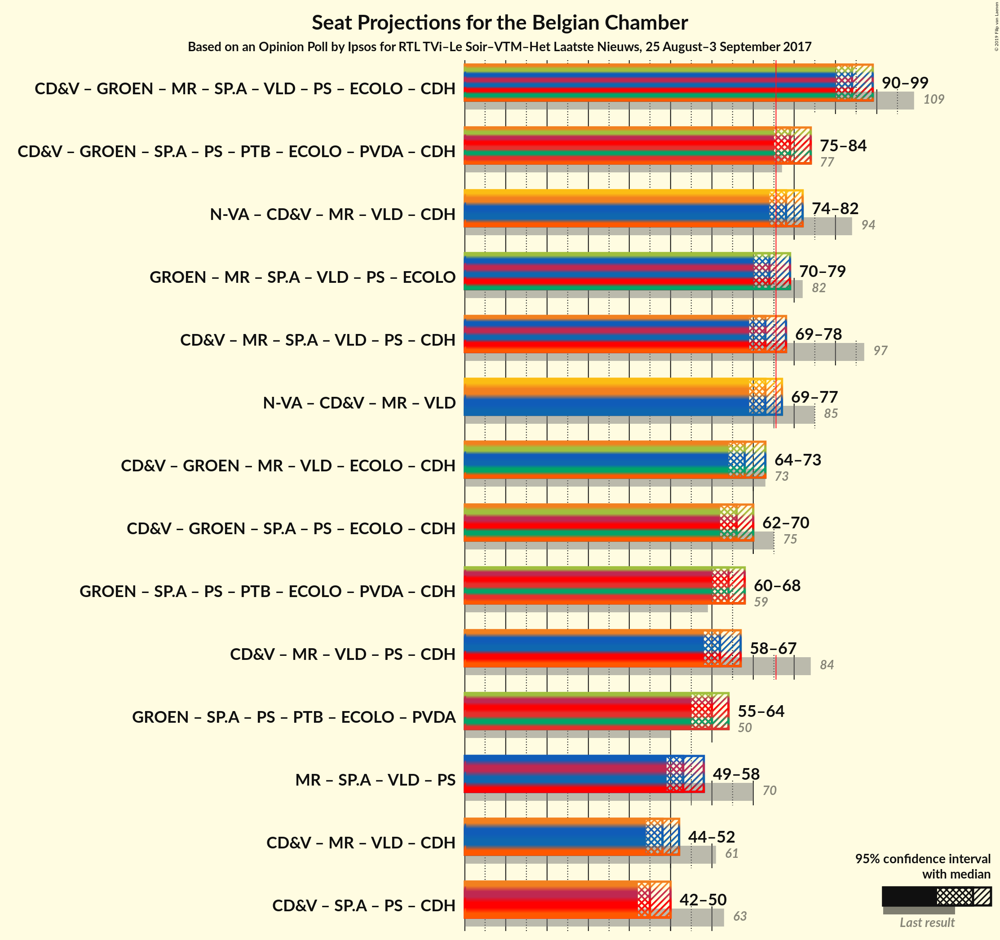

# Opinion Poll by Ipsos for RTL TVi–Le Soir–VTM–Het Laatste Nieuws, 25 August–3 September 2017

Areas included: Flanders, Wallonia

<a href="#voting-intentions">Voting Intentions</a> | <a href="#seats">Seats</a> | <a href="#coalitions">Coalitions</a> | <a href="#technical-information">Technical Information</a>

## Voting Intentions

### Confidence Intervals

| Party | Last Result | Poll Result | 80% Confidence Interval | 90% Confidence Interval | 95% Confidence Interval | 99% Confidence Interval |
|:-----:|:-----------:|:-----------:|:-----------------------:|:-----------------------:|:-----------------------:|:-----------------------:|
| N-VA | 20.3% | 20.2% | 28.4–32.2% |27.9–32.8% |27.4–33.2% |26.5–34.2% |
| CD&V | 11.6% | 10.7% | 14.6–17.7% |14.2–18.1% |13.9–18.5% |13.2–19.3% |
| Groen | 5.3% | 9.0% | 12.1–15.0% |11.8–15.4% |11.4–15.8% |10.8–16.5% |
| sp.a | 8.8% | 8.1% | 10.9–13.7% |10.6–14.1% |10.3–14.4% |9.7–15.2% |
| Open Vld | 9.8% | 8.1% | 10.8–13.5% |10.5–14.0% |10.2–14.3% |9.6–15.0% |
| MR | 9.6% | 7.1% | N/A |N/A |N/A |N/A |
| PS | 11.7% | 6.9% | N/A |N/A |N/A |N/A |
| PTB | 2.0% | 5.8% | N/A |N/A |N/A |N/A |
| Vlaams Belang | 3.7% | 5.3% | 6.9–9.2% |6.6–9.5% |6.4–9.8% |5.9–10.4% |
| Ecolo | 3.3% | 4.2% | N/A |N/A |N/A |N/A |
| PVDA | 1.8% | 3.3% | 4.2–6.0% |4.0–6.3% |3.8–6.6% |3.4–7.1% |
| cdH | 5.0% | 2.9% | N/A |N/A |N/A |N/A |
| DéFI | 1.8% | 2.1% | N/A |N/A |N/A |N/A |
| Parti Populaire | 1.5% | 1.5% | N/A |N/A |N/A |N/A |
| La Droite | 0.4% | 0.5% | N/A |N/A |N/A |N/A |

*Note:* The poll result column reflects the actual value used in the calculations. Published results may vary slightly, and in addition be rounded to fewer digits.

## Seats

### Confidence Intervals

| Party | Last Result | Median | 80% Confidence Interval | 90% Confidence Interval | 95% Confidence Interval | 99% Confidence Interval |
|:-----:|:-----------:|:------:|:-----------------------:|:-----------------------:|:-----------------------:|:-----------------------:|
| <a href="#n-va">N-VA</a> | 33 | 31 | 28–33 |28–33 |27–34 |27–36 |
| <a href="#cd&v">CD&V</a> | 18 | 15 | 13–18 |13–18 |13–18 |13–18 |
| <a href="#groen">Groen</a> | 6 | 12 | 11–13 |11–15 |10–15 |9–16 |
| <a href="#sp.a">sp.a</a> | 13 | 11 | 9–13 |9–13 |9–13 |9–14 |
| <a href="#open-vld">Open Vld</a> | 14 | 11 | 10–12 |9–13 |8–13 |8–13 |
| <a href="#mr">MR</a> | 20 | 12 | 11–14 |11–15 |11–15 |11–16 |
| <a href="#ps">PS</a> | 23 | 12 | 12–14 |12–15 |11–15 |10–15 |
| <a href="#ptb">PTB</a> | 2 | 9 | 8–10 |8–10 |8–10 |7–12 |
| <a href="#vlaams-belang">Vlaams Belang</a> | 3 | 7 | 5–8 |5–8 |5–8 |4–8 |
| <a href="#ecolo">Ecolo</a> | 6 | 7 | 6–7 |6–8 |5–8 |5–9 |
| <a href="#pvda">PVDA</a> | 0 | 0 | 0 |0 |0 |0 |
| <a href="#cdh">cdH</a> | 9 | 4 | 3–5 |3–5 |3–6 |3–7 |
| <a href="#défi">DéFI</a> | 2 | 3 | 0–3 |0–3 |0–3 |0–4 |
| <a href="#parti-populaire">Parti Populaire</a> | 1 | 0 | 0–2 |0–2 |0–2 |0–2 |
| <a href="#la-droite">La Droite</a> | 0 | 0 | 0 |0 |0 |0 |

### N-VA

*For a full overview of the results for this party, see the [N-VA](party-nva.html) page.*

| Number of Seats | Probability | Accumulated | Special Marks |
|:---------------:|:-----------:|:-----------:|:-------------:|
| 25 | 0% | 100% |  |
| 26 | 0.1% | 99.9% |  |
| 27 | 4% | 99.8% |  |
| 28 | 6% | 96% |  |
| 29 | 12% | 90% |  |
| 30 | 16% | 78% |  |
| 31 | 37% | 62% | Median |
| 32 | 14% | 25% |  |
| 33 | 7% | 11% | Last Result |
| 34 | 3% | 4% |  |
| 35 | 1.0% | 2% |  |
| 36 | 0.4% | 0.5% |  |
| 37 | 0.1% | 0.1% |  |
| 38 | 0% | 0% |  |

### CD&V

*For a full overview of the results for this party, see the [CD&V](party-cdv.html) page.*

| Number of Seats | Probability | Accumulated | Special Marks |
|:---------------:|:-----------:|:-----------:|:-------------:|
| 12 | 0.1% | 100% |  |
| 13 | 13% | 99.8% |  |
| 14 | 35% | 87% |  |
| 15 | 13% | 52% | Median |
| 16 | 14% | 38% |  |
| 17 | 7% | 24% |  |
| 18 | 17% | 17% | Last Result |
| 19 | 0.1% | 0.2% |  |
| 20 | 0% | 0% |  |

### Groen

*For a full overview of the results for this party, see the [Groen](party-groen.html) page.*

| Number of Seats | Probability | Accumulated | Special Marks |
|:---------------:|:-----------:|:-----------:|:-------------:|
| 6 | 0% | 100% | Last Result |
| 7 | 0% | 100% |  |
| 8 | 0.1% | 100% |  |
| 9 | 0.4% | 99.9% |  |
| 10 | 2% | 99.5% |  |
| 11 | 9% | 97% |  |
| 12 | 75% | 88% | Median |
| 13 | 6% | 13% |  |
| 14 | 2% | 7% |  |
| 15 | 3% | 5% |  |
| 16 | 2% | 2% |  |
| 17 | 0.1% | 0.1% |  |
| 18 | 0% | 0% |  |

### sp.a

*For a full overview of the results for this party, see the [sp.a](party-spa.html) page.*

| Number of Seats | Probability | Accumulated | Special Marks |
|:---------------:|:-----------:|:-----------:|:-------------:|
| 8 | 0.4% | 100% |  |
| 9 | 22% | 99.6% |  |
| 10 | 15% | 77% |  |
| 11 | 25% | 63% | Median |
| 12 | 13% | 38% |  |
| 13 | 24% | 25% | Last Result |
| 14 | 1.3% | 1.4% |  |
| 15 | 0.2% | 0.2% |  |
| 16 | 0% | 0% |  |

### Open Vld

*For a full overview of the results for this party, see the [Open Vld](party-openvld.html) page.*

| Number of Seats | Probability | Accumulated | Special Marks |
|:---------------:|:-----------:|:-----------:|:-------------:|
| 7 | 0.2% | 100% |  |
| 8 | 3% | 99.8% |  |
| 9 | 3% | 97% |  |
| 10 | 5% | 94% |  |
| 11 | 55% | 89% | Median |
| 12 | 28% | 34% |  |
| 13 | 6% | 6% |  |
| 14 | 0.3% | 0.5% | Last Result |
| 15 | 0.1% | 0.2% |  |
| 16 | 0% | 0% |  |

### MR

*For a full overview of the results for this party, see the [MR](party-mr.html) page.*

| Number of Seats | Probability | Accumulated | Special Marks |
|:---------------:|:-----------:|:-----------:|:-------------:|
| 10 | 0.3% | 100% |  |
| 11 | 12% | 99.7% |  |
| 12 | 39% | 87% | Median |
| 13 | 18% | 48% |  |
| 14 | 23% | 30% |  |
| 15 | 6% | 7% |  |
| 16 | 1.0% | 1.1% |  |
| 17 | 0.1% | 0.1% |  |
| 18 | 0% | 0% |  |
| 19 | 0% | 0% |  |
| 20 | 0% | 0% | Last Result |

### PS

*For a full overview of the results for this party, see the [PS](party-ps.html) page.*

| Number of Seats | Probability | Accumulated | Special Marks |
|:---------------:|:-----------:|:-----------:|:-------------:|
| 8 | 0.1% | 100% |  |
| 9 | 0.3% | 99.9% |  |
| 10 | 0.6% | 99.7% |  |
| 11 | 3% | 99.1% |  |
| 12 | 52% | 96% | Median |
| 13 | 22% | 44% |  |
| 14 | 17% | 22% |  |
| 15 | 5% | 6% |  |
| 16 | 0.3% | 0.3% |  |
| 17 | 0% | 0% |  |
| 18 | 0% | 0% |  |
| 19 | 0% | 0% |  |
| 20 | 0% | 0% |  |
| 21 | 0% | 0% |  |
| 22 | 0% | 0% |  |
| 23 | 0% | 0% | Last Result |

### PTB

*For a full overview of the results for this party, see the [PTB](party-ptb.html) page.*

| Number of Seats | Probability | Accumulated | Special Marks |
|:---------------:|:-----------:|:-----------:|:-------------:|
| 2 | 0% | 100% | Last Result |
| 3 | 0% | 100% |  |
| 4 | 0% | 100% |  |
| 5 | 0% | 100% |  |
| 6 | 0% | 100% |  |
| 7 | 0.5% | 100% |  |
| 8 | 20% | 99.5% |  |
| 9 | 52% | 80% | Median |
| 10 | 26% | 28% |  |
| 11 | 2% | 2% |  |
| 12 | 0.5% | 0.5% |  |
| 13 | 0% | 0% |  |

### Vlaams Belang

*For a full overview of the results for this party, see the [Vlaams Belang](party-vlaamsbelang.html) page.*

| Number of Seats | Probability | Accumulated | Special Marks |
|:---------------:|:-----------:|:-----------:|:-------------:|
| 2 | 0.2% | 100% |  |
| 3 | 0.2% | 99.8% | Last Result |
| 4 | 0.3% | 99.6% |  |
| 5 | 9% | 99.3% |  |
| 6 | 21% | 90% |  |
| 7 | 49% | 69% | Median |
| 8 | 20% | 20% |  |
| 9 | 0% | 0% |  |

### Ecolo

*For a full overview of the results for this party, see the [Ecolo](party-ecolo.html) page.*

| Number of Seats | Probability | Accumulated | Special Marks |
|:---------------:|:-----------:|:-----------:|:-------------:|
| 4 | 0.2% | 100% |  |
| 5 | 3% | 99.8% |  |
| 6 | 15% | 96% | Last Result |
| 7 | 73% | 81% | Median |
| 8 | 7% | 8% |  |
| 9 | 0.5% | 0.7% |  |
| 10 | 0.2% | 0.2% |  |
| 11 | 0% | 0% |  |

### PVDA

*For a full overview of the results for this party, see the [PVDA](party-pvda.html) page.*

| Number of Seats | Probability | Accumulated | Special Marks |
|:---------------:|:-----------:|:-----------:|:-------------:|
| 0 | 100% | 100% | Last Result, Median |

### cdH

*For a full overview of the results for this party, see the [cdH](party-cdh.html) page.*

| Number of Seats | Probability | Accumulated | Special Marks |
|:---------------:|:-----------:|:-----------:|:-------------:|
| 2 | 0.3% | 100% |  |
| 3 | 24% | 99.6% |  |
| 4 | 59% | 76% | Median |
| 5 | 13% | 17% |  |
| 6 | 3% | 4% |  |
| 7 | 0.8% | 0.8% |  |
| 8 | 0% | 0% |  |
| 9 | 0% | 0% | Last Result |

### DéFI

*For a full overview of the results for this party, see the [DéFI](party-dfi.html) page.*

| Number of Seats | Probability | Accumulated | Special Marks |
|:---------------:|:-----------:|:-----------:|:-------------:|
| 0 | 26% | 100% |  |
| 1 | 9% | 74% |  |
| 2 | 6% | 65% | Last Result |
| 3 | 58% | 59% | Median |
| 4 | 0.9% | 0.9% |  |
| 5 | 0% | 0% |  |

### Parti Populaire

*For a full overview of the results for this party, see the [Parti Populaire](party-partipopulaire.html) page.*

| Number of Seats | Probability | Accumulated | Special Marks |
|:---------------:|:-----------:|:-----------:|:-------------:|
| 0 | 59% | 100% | Median |
| 1 | 12% | 41% | Last Result |
| 2 | 28% | 28% |  |
| 3 | 0% | 0% |  |

### La Droite

*For a full overview of the results for this party, see the [La Droite](party-ladroite.html) page.*

| Number of Seats | Probability | Accumulated | Special Marks |
|:---------------:|:-----------:|:-----------:|:-------------:|
| 0 | 100% | 100% | Last Result, Median |

## Coalitions

### Confidence Intervals

| Coalition | Last Result | Median | Majority? | 80% Confidence Interval | 90% Confidence Interval | 95% Confidence Interval | 99% Confidence Interval |
|:---------:|:-----------:|:------:|:---------:|:-----------------------:|:-----------------------:|:-----------------------:|:-----------------------:|
| CD&V – Groen – sp.a – Open Vld – MR – PS – Ecolo – cdH | 109 | 86 | 100% | 83–89 | 82–90 | 81–90 | 80–92 |
| N-VA – CD&V – Open Vld – MR – cdH | 94 | 74 | 21% | 71–77 | 70–77 | 70–78 | 68–79 |
| CD&V – Groen – sp.a – PS – PTB – Ecolo – PVDA – cdH | 77 | 71 | 2% | 68–74 | 67–75 | 67–75 | 65–77 |
| N-VA – CD&V – Open Vld – MR | 85 | 70 | 0.3% | 67–73 | 67–73 | 66–74 | 65–75 |
| CD&V – sp.a – Open Vld – MR – PS – cdH | 97 | 67 | 0% | 64–70 | 63–71 | 62–72 | 61–73 |
| Groen – sp.a – Open Vld – MR – PS – Ecolo | 82 | 67 | 0% | 64–70 | 63–71 | 62–72 | 61–73 |
| CD&V – Groen – sp.a – PS – Ecolo – cdH | 75 | 62 | 0% | 59–65 | 58–66 | 58–66 | 57–68 |
| CD&V – Open Vld – MR – PS – cdH | 84 | 56 | 0% | 53–59 | 52–60 | 52–61 | 50–62 |
| Groen – sp.a – PS – PTB – Ecolo – PVDA – cdH | 59 | 56 | 0% | 53–58 | 53–59 | 52–60 | 51–61 |
| Groen – sp.a – PS – PTB – Ecolo – PVDA | 50 | 52 | 0% | 49–55 | 48–55 | 48–56 | 47–57 |
| sp.a – Open Vld – MR – PS | 70 | 48 | 0% | 45–51 | 44–52 | 44–52 | 42–53 |
| CD&V – Open Vld – MR – cdH | 61 | 43 | 0% | 40–46 | 40–47 | 39–48 | 38–49 |
| CD&V – sp.a – PS – cdH | 63 | 43 | 0% | 40–46 | 39–47 | 39–47 | 38–49 |

### CD&V – Groen – sp.a – Open Vld – MR – PS – Ecolo – cdH

| Number of Seats | Probability | Accumulated | Special Marks |
|:---------------:|:-----------:|:-----------:|:-------------:|
| 78 | 0.1% | 100% |  |
| 79 | 0.2% | 99.9% |  |
| 80 | 0.7% | 99.7% |  |
| 81 | 2% | 99.1% |  |
| 82 | 4% | 97% |  |
| 83 | 9% | 93% |  |
| 84 | 14% | 84% | Median |
| 85 | 17% | 70% |  |
| 86 | 16% | 53% |  |
| 87 | 14% | 37% |  |
| 88 | 11% | 23% |  |
| 89 | 7% | 13% |  |
| 90 | 3% | 6% |  |
| 91 | 2% | 2% |  |
| 92 | 0.7% | 1.0% |  |
| 93 | 0.2% | 0.3% |  |
| 94 | 0.1% | 0.1% |  |
| 95 | 0% | 0% |  |
| 96 | 0% | 0% |  |
| 97 | 0% | 0% |  |
| 98 | 0% | 0% |  |
| 99 | 0% | 0% |  |
| 100 | 0% | 0% |  |
| 101 | 0% | 0% |  |
| 102 | 0% | 0% |  |
| 103 | 0% | 0% |  |
| 104 | 0% | 0% |  |
| 105 | 0% | 0% |  |
| 106 | 0% | 0% |  |
| 107 | 0% | 0% |  |
| 108 | 0% | 0% |  |
| 109 | 0% | 0% | Last Result |

### N-VA – CD&V – Open Vld – MR – cdH

| Number of Seats | Probability | Accumulated | Special Marks |
|:---------------:|:-----------:|:-----------:|:-------------:|
| 67 | 0.1% | 100% |  |
| 68 | 0.4% | 99.8% |  |
| 69 | 1.4% | 99.4% |  |
| 70 | 4% | 98% |  |
| 71 | 9% | 94% |  |
| 72 | 15% | 85% |  |
| 73 | 18% | 71% | Median |
| 74 | 17% | 53% |  |
| 75 | 15% | 36% |  |
| 76 | 10% | 21% | Majority |
| 77 | 6% | 11% |  |
| 78 | 3% | 5% |  |
| 79 | 1.2% | 2% |  |
| 80 | 0.3% | 0.4% |  |
| 81 | 0.1% | 0.1% |  |
| 82 | 0% | 0% |  |
| 83 | 0% | 0% |  |
| 84 | 0% | 0% |  |
| 85 | 0% | 0% |  |
| 86 | 0% | 0% |  |
| 87 | 0% | 0% |  |
| 88 | 0% | 0% |  |
| 89 | 0% | 0% |  |
| 90 | 0% | 0% |  |
| 91 | 0% | 0% |  |
| 92 | 0% | 0% |  |
| 93 | 0% | 0% |  |
| 94 | 0% | 0% | Last Result |

### CD&V – Groen – sp.a – PS – PTB – Ecolo – PVDA – cdH

| Number of Seats | Probability | Accumulated | Special Marks |
|:---------------:|:-----------:|:-----------:|:-------------:|
| 64 | 0.1% | 100% |  |
| 65 | 0.5% | 99.9% |  |
| 66 | 1.5% | 99.4% |  |
| 67 | 3% | 98% |  |
| 68 | 7% | 94% |  |
| 69 | 12% | 87% |  |
| 70 | 17% | 75% | Median |
| 71 | 19% | 59% |  |
| 72 | 16% | 39% |  |
| 73 | 11% | 23% |  |
| 74 | 6% | 12% |  |
| 75 | 3% | 6% |  |
| 76 | 2% | 2% | Majority |
| 77 | 0.6% | 0.8% | Last Result |
| 78 | 0.1% | 0.2% |  |
| 79 | 0% | 0% |  |

### N-VA – CD&V – Open Vld – MR

| Number of Seats | Probability | Accumulated | Special Marks |
|:---------------:|:-----------:|:-----------:|:-------------:|
| 63 | 0.1% | 100% |  |
| 64 | 0.3% | 99.9% |  |
| 65 | 1.1% | 99.6% |  |
| 66 | 3% | 98% |  |
| 67 | 8% | 95% |  |
| 68 | 15% | 87% |  |
| 69 | 17% | 71% | Median |
| 70 | 18% | 54% |  |
| 71 | 16% | 36% |  |
| 72 | 10% | 20% |  |
| 73 | 6% | 10% |  |
| 74 | 3% | 4% |  |
| 75 | 1.0% | 1.3% |  |
| 76 | 0.2% | 0.3% | Majority |
| 77 | 0.1% | 0.1% |  |
| 78 | 0% | 0% |  |
| 79 | 0% | 0% |  |
| 80 | 0% | 0% |  |
| 81 | 0% | 0% |  |
| 82 | 0% | 0% |  |
| 83 | 0% | 0% |  |
| 84 | 0% | 0% |  |
| 85 | 0% | 0% | Last Result |

### CD&V – sp.a – Open Vld – MR – PS – cdH

| Number of Seats | Probability | Accumulated | Special Marks |
|:---------------:|:-----------:|:-----------:|:-------------:|
| 59 | 0% | 100% |  |
| 60 | 0.2% | 99.9% |  |
| 61 | 0.8% | 99.7% |  |
| 62 | 2% | 98.9% |  |
| 63 | 5% | 97% |  |
| 64 | 8% | 92% |  |
| 65 | 13% | 84% | Median |
| 66 | 17% | 71% |  |
| 67 | 16% | 54% |  |
| 68 | 14% | 38% |  |
| 69 | 11% | 24% |  |
| 70 | 7% | 13% |  |
| 71 | 3% | 6% |  |
| 72 | 2% | 3% |  |
| 73 | 0.7% | 1.0% |  |
| 74 | 0.2% | 0.3% |  |
| 75 | 0.1% | 0.1% |  |
| 76 | 0% | 0% | Majority |
| 77 | 0% | 0% |  |
| 78 | 0% | 0% |  |
| 79 | 0% | 0% |  |
| 80 | 0% | 0% |  |
| 81 | 0% | 0% |  |
| 82 | 0% | 0% |  |
| 83 | 0% | 0% |  |
| 84 | 0% | 0% |  |
| 85 | 0% | 0% |  |
| 86 | 0% | 0% |  |
| 87 | 0% | 0% |  |
| 88 | 0% | 0% |  |
| 89 | 0% | 0% |  |
| 90 | 0% | 0% |  |
| 91 | 0% | 0% |  |
| 92 | 0% | 0% |  |
| 93 | 0% | 0% |  |
| 94 | 0% | 0% |  |
| 95 | 0% | 0% |  |
| 96 | 0% | 0% |  |
| 97 | 0% | 0% | Last Result |

### Groen – sp.a – Open Vld – MR – PS – Ecolo

| Number of Seats | Probability | Accumulated | Special Marks |
|:---------------:|:-----------:|:-----------:|:-------------:|
| 59 | 0.1% | 100% |  |
| 60 | 0.3% | 99.9% |  |
| 61 | 0.9% | 99.7% |  |
| 62 | 3% | 98.8% |  |
| 63 | 6% | 96% |  |
| 64 | 11% | 90% |  |
| 65 | 14% | 80% | Median |
| 66 | 15% | 66% |  |
| 67 | 15% | 51% |  |
| 68 | 13% | 36% |  |
| 69 | 10% | 23% |  |
| 70 | 6% | 13% |  |
| 71 | 4% | 7% |  |
| 72 | 2% | 3% |  |
| 73 | 0.7% | 0.9% |  |
| 74 | 0.2% | 0.2% |  |
| 75 | 0% | 0.1% |  |
| 76 | 0% | 0% | Majority |
| 77 | 0% | 0% |  |
| 78 | 0% | 0% |  |
| 79 | 0% | 0% |  |
| 80 | 0% | 0% |  |
| 81 | 0% | 0% |  |
| 82 | 0% | 0% | Last Result |

### CD&V – Groen – sp.a – PS – Ecolo – cdH

| Number of Seats | Probability | Accumulated | Special Marks |
|:---------------:|:-----------:|:-----------:|:-------------:|
| 55 | 0.1% | 100% |  |
| 56 | 0.3% | 99.9% |  |
| 57 | 2% | 99.6% |  |
| 58 | 3% | 98% |  |
| 59 | 7% | 95% |  |
| 60 | 13% | 87% |  |
| 61 | 17% | 75% | Median |
| 62 | 23% | 58% |  |
| 63 | 14% | 35% |  |
| 64 | 11% | 21% |  |
| 65 | 5% | 10% |  |
| 66 | 3% | 5% |  |
| 67 | 1.2% | 2% |  |
| 68 | 0.5% | 0.6% |  |
| 69 | 0.1% | 0.1% |  |
| 70 | 0% | 0% |  |
| 71 | 0% | 0% |  |
| 72 | 0% | 0% |  |
| 73 | 0% | 0% |  |
| 74 | 0% | 0% |  |
| 75 | 0% | 0% | Last Result |

### CD&V – Open Vld – MR – PS – cdH

| Number of Seats | Probability | Accumulated | Special Marks |
|:---------------:|:-----------:|:-----------:|:-------------:|
| 49 | 0.2% | 100% |  |
| 50 | 0.4% | 99.8% |  |
| 51 | 1.4% | 99.3% |  |
| 52 | 5% | 98% |  |
| 53 | 11% | 93% |  |
| 54 | 14% | 82% | Median |
| 55 | 15% | 68% |  |
| 56 | 16% | 53% |  |
| 57 | 14% | 37% |  |
| 58 | 10% | 23% |  |
| 59 | 6% | 13% |  |
| 60 | 4% | 7% |  |
| 61 | 2% | 3% |  |
| 62 | 0.5% | 0.6% |  |
| 63 | 0.1% | 0.1% |  |
| 64 | 0% | 0% |  |
| 65 | 0% | 0% |  |
| 66 | 0% | 0% |  |
| 67 | 0% | 0% |  |
| 68 | 0% | 0% |  |
| 69 | 0% | 0% |  |
| 70 | 0% | 0% |  |
| 71 | 0% | 0% |  |
| 72 | 0% | 0% |  |
| 73 | 0% | 0% |  |
| 74 | 0% | 0% |  |
| 75 | 0% | 0% |  |
| 76 | 0% | 0% | Majority |
| 77 | 0% | 0% |  |
| 78 | 0% | 0% |  |
| 79 | 0% | 0% |  |
| 80 | 0% | 0% |  |
| 81 | 0% | 0% |  |
| 82 | 0% | 0% |  |
| 83 | 0% | 0% |  |
| 84 | 0% | 0% | Last Result |

### Groen – sp.a – PS – PTB – Ecolo – PVDA – cdH

| Number of Seats | Probability | Accumulated | Special Marks |
|:---------------:|:-----------:|:-----------:|:-------------:|
| 50 | 0.2% | 100% |  |
| 51 | 0.8% | 99.7% |  |
| 52 | 4% | 98.9% |  |
| 53 | 9% | 95% |  |
| 54 | 14% | 87% |  |
| 55 | 18% | 73% | Median |
| 56 | 19% | 55% |  |
| 57 | 17% | 36% |  |
| 58 | 11% | 19% |  |
| 59 | 6% | 9% | Last Result |
| 60 | 2% | 3% |  |
| 61 | 0.6% | 0.9% |  |
| 62 | 0.2% | 0.3% |  |
| 63 | 0.1% | 0.1% |  |
| 64 | 0% | 0% |  |

### Groen – sp.a – PS – PTB – Ecolo – PVDA

| Number of Seats | Probability | Accumulated | Special Marks |
|:---------------:|:-----------:|:-----------:|:-------------:|
| 45 | 0.1% | 100% |  |
| 46 | 0.3% | 99.9% |  |
| 47 | 1.3% | 99.6% |  |
| 48 | 4% | 98% |  |
| 49 | 8% | 94% |  |
| 50 | 14% | 86% | Last Result |
| 51 | 17% | 72% | Median |
| 52 | 18% | 55% |  |
| 53 | 16% | 37% |  |
| 54 | 11% | 22% |  |
| 55 | 6% | 11% |  |
| 56 | 3% | 4% |  |
| 57 | 0.9% | 1.4% |  |
| 58 | 0.3% | 0.4% |  |
| 59 | 0.1% | 0.1% |  |
| 60 | 0% | 0% |  |

### sp.a – Open Vld – MR – PS

| Number of Seats | Probability | Accumulated | Special Marks |
|:---------------:|:-----------:|:-----------:|:-------------:|
| 41 | 0.2% | 100% |  |
| 42 | 0.5% | 99.8% |  |
| 43 | 2% | 99.3% |  |
| 44 | 6% | 98% |  |
| 45 | 10% | 92% |  |
| 46 | 15% | 82% | Median |
| 47 | 15% | 67% |  |
| 48 | 16% | 51% |  |
| 49 | 14% | 35% |  |
| 50 | 10% | 21% |  |
| 51 | 6% | 12% |  |
| 52 | 4% | 6% |  |
| 53 | 2% | 2% |  |
| 54 | 0.4% | 0.5% |  |
| 55 | 0.1% | 0.1% |  |
| 56 | 0% | 0% |  |
| 57 | 0% | 0% |  |
| 58 | 0% | 0% |  |
| 59 | 0% | 0% |  |
| 60 | 0% | 0% |  |
| 61 | 0% | 0% |  |
| 62 | 0% | 0% |  |
| 63 | 0% | 0% |  |
| 64 | 0% | 0% |  |
| 65 | 0% | 0% |  |
| 66 | 0% | 0% |  |
| 67 | 0% | 0% |  |
| 68 | 0% | 0% |  |
| 69 | 0% | 0% |  |
| 70 | 0% | 0% | Last Result |

### CD&V – Open Vld – MR – cdH

| Number of Seats | Probability | Accumulated | Special Marks |
|:---------------:|:-----------:|:-----------:|:-------------:|
| 36 | 0.1% | 100% |  |
| 37 | 0.3% | 99.9% |  |
| 38 | 0.7% | 99.6% |  |
| 39 | 3% | 98.9% |  |
| 40 | 8% | 96% |  |
| 41 | 14% | 89% |  |
| 42 | 17% | 74% | Median |
| 43 | 16% | 57% |  |
| 44 | 14% | 41% |  |
| 45 | 12% | 26% |  |
| 46 | 8% | 15% |  |
| 47 | 4% | 7% |  |
| 48 | 2% | 3% |  |
| 49 | 0.7% | 0.8% |  |
| 50 | 0.1% | 0.2% |  |
| 51 | 0% | 0% |  |
| 52 | 0% | 0% |  |
| 53 | 0% | 0% |  |
| 54 | 0% | 0% |  |
| 55 | 0% | 0% |  |
| 56 | 0% | 0% |  |
| 57 | 0% | 0% |  |
| 58 | 0% | 0% |  |
| 59 | 0% | 0% |  |
| 60 | 0% | 0% |  |
| 61 | 0% | 0% | Last Result |

### CD&V – sp.a – PS – cdH

| Number of Seats | Probability | Accumulated | Special Marks |
|:---------------:|:-----------:|:-----------:|:-------------:|
| 37 | 0.2% | 100% |  |
| 38 | 2% | 99.8% |  |
| 39 | 4% | 98% |  |
| 40 | 8% | 95% |  |
| 41 | 12% | 87% |  |
| 42 | 16% | 75% | Median |
| 43 | 22% | 58% |  |
| 44 | 16% | 36% |  |
| 45 | 10% | 21% |  |
| 46 | 5% | 10% |  |
| 47 | 3% | 5% |  |
| 48 | 1.3% | 2% |  |
| 49 | 0.5% | 0.6% |  |
| 50 | 0.1% | 0.1% |  |
| 51 | 0% | 0% |  |
| 52 | 0% | 0% |  |
| 53 | 0% | 0% |  |
| 54 | 0% | 0% |  |
| 55 | 0% | 0% |  |
| 56 | 0% | 0% |  |
| 57 | 0% | 0% |  |
| 58 | 0% | 0% |  |
| 59 | 0% | 0% |  |
| 60 | 0% | 0% |  |
| 61 | 0% | 0% |  |
| 62 | 0% | 0% |  |
| 63 | 0% | 0% | Last Result |

## Technical Information

### Opinion Poll

+ **Pollster:** Ipsos
+ **Media:** RTL TVi–Le Soir–VTM–Het Laatste Nieuws
+ **Fieldwork period:** 25 August–3 September 2017

### Calculations

+ **Sample size:** 1436
+ **Simulations done:** 1,048,576
+ **Error estimate:** 1.52%

