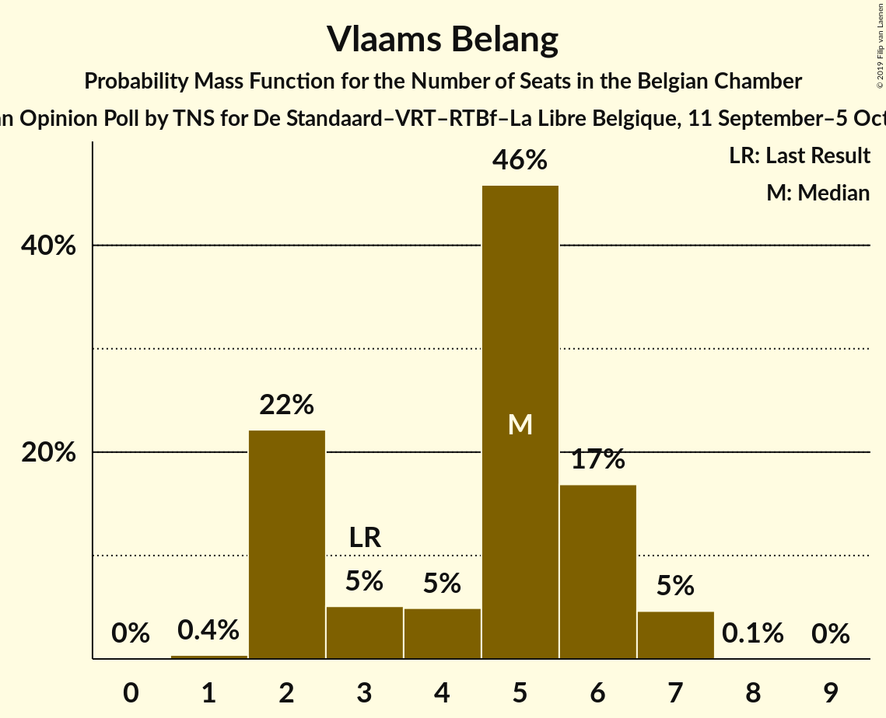

# Opinion Poll by TNS for De Standaard–VRT–RTBf–La Libre Belgique, 11 September–5 October 2017

Areas included: Brussels, Flanders, Wallonia

<a href="#voting-intentions">Voting Intentions</a> | <a href="#seats">Seats</a> | <a href="#coalitions">Coalitions</a> | <a href="#technical-information">Technical Information</a>

## Voting Intentions

### Confidence Intervals

| Party | Last Result | Poll Result | 80% Confidence Interval | 90% Confidence Interval | 95% Confidence Interval | 99% Confidence Interval |
|:-----:|:-----------:|:-----------:|:-----------------------:|:-----------------------:|:-----------------------:|:-----------------------:|
| N-VA | 20.3% | 17.6% | 15.8–16.6% |15.6–16.7% |15.4–16.7% |15.0–16.7% |
| CD&V | 11.6% | 12.2% | 10.6–11.3% |10.4–11.3% |10.2–11.4% |9.9–11.4% |
| Open Vld | 9.8% | 9.7% | 8.3–8.9% |8.1–9.0% |8.0–9.0% |7.7–9.0% |
| Groen | 5.3% | 8.6% | 7.7–9.2% |7.5–9.3% |7.3–9.4% |7.0–9.4% |
| MR | 9.6% | 8.1% | 7.2–7.5% |7.1–7.5% |7.0–7.6% |6.8–7.6% |
| PS | 11.7% | 7.7% | 6.8–7.2% |6.7–7.2% |6.6–7.2% |6.5–7.2% |
| Ecolo | 3.3% | 7.2% | 6.3–6.6% |6.2–6.6% |6.1–6.6% |6.0–6.6% |
| sp.a | 8.8% | 6.9% | 5.7–6.2% |5.5–6.3% |5.4–6.3% |5.1–6.3% |
| PTB | 2.0% | 5.3% | 4.5–4.8% |4.4–4.8% |4.3–4.8% |4.2–4.8% |
| Vlaams Belang | 3.7% | 4.1% | 3.1–3.6% |3.0–3.6% |2.9–3.6% |2.7–3.6% |
| cdH | 5.0% | 3.3% | 2.6–2.9% |2.6–2.9% |2.5–2.9% |2.4–2.9% |
| PVDA | 1.8% | 3.1% | 2.6–3.6% |2.5–3.6% |2.4–3.7% |2.2–3.7% |
| DéFI | 1.8% | 2.8% | 2.3–2.5% |2.3–2.5% |2.2–2.5% |2.1–2.5% |
| Parti Populaire | 1.5% | 0.3% | 0.1–0.2% |0.1–0.2% |0.1–0.2% |0.1–0.2% |

*Note:* The poll result column reflects the actual value used in the calculations. Published results may vary slightly, and in addition be rounded to fewer digits.

## Seats

### Confidence Intervals

| Party | Last Result | Median | 80% Confidence Interval | 90% Confidence Interval | 95% Confidence Interval | 99% Confidence Interval |
|:-----:|:-----------:|:------:|:-----------------------:|:-----------------------:|:-----------------------:|:-----------------------:|
| <a href="#n-va">N-VA</a> | 33 | 28 | 26–29 |25–30 |25–30 |24–31 |
| <a href="#cd&v">CD&V</a> | 18 | 18 | 14–18 |14–21 |14–21 |14–21 |
| <a href="#open-vld">Open Vld</a> | 14 | 13 | 12–15 |12–16 |12–16 |12–17 |
| <a href="#groen">Groen</a> | 6 | 12 | 11–13 |11–13 |11–13 |10–13 |
| <a href="#mr">MR</a> | 20 | 16 | 15–17 |15–18 |14–18 |14–19 |
| <a href="#ps">PS</a> | 23 | 15 | 14–17 |14–17 |14–17 |13–18 |
| <a href="#ecolo">Ecolo</a> | 6 | 14 | 13–16 |12–16 |12–16 |11–17 |
| <a href="#sp.a">sp.a</a> | 13 | 11 | 8–12 |8–12 |8–12 |7–12 |
| <a href="#ptb">PTB</a> | 2 | 9 | 8–10 |8–10 |8–11 |7–11 |
| <a href="#vlaams-belang">Vlaams Belang</a> | 3 | 5 | 5–6 |2–6 |2–6 |2–7 |
| <a href="#cdh">cdH</a> | 9 | 4 | 4–5 |4–5 |4–6 |4–7 |
| <a href="#pvda">PVDA</a> | 0 | 1 | 1–2 |1–3 |1–3 |1–3 |
| <a href="#défi">DéFI</a> | 2 | 3 | 2–5 |2–6 |2–6 |2–6 |
| <a href="#parti-populaire">Parti Populaire</a> | 1 | 0 | 0 |0 |0 |0 |

### N-VA

*For a full overview of the results for this party, see the [N-VA](party-n-va.html) page.*

| Number of Seats | Probability | Accumulated | Special Marks |
|:---------------:|:-----------:|:-----------:|:-------------:|
| 24 | 0.8% | 100% |  |
| 25 | 7% | 99.2% |  |
| 26 | 14% | 92% |  |
| 27 | 14% | 78% |  |
| 28 | 51% | 64% | Median |
| 29 | 6% | 13% |  |
| 30 | 7% | 8% |  |
| 31 | 0.6% | 0.6% |  |
| 32 | 0% | 0% |  |
| 33 | 0% | 0% | Last Result |

### CD&V

*For a full overview of the results for this party, see the [CD&V](party-cdv.html) page.*

| Number of Seats | Probability | Accumulated | Special Marks |
|:---------------:|:-----------:|:-----------:|:-------------:|
| 14 | 22% | 100% |  |
| 15 | 0.6% | 78% |  |
| 16 | 0% | 77% |  |
| 17 | 4% | 77% |  |
| 18 | 64% | 73% | Last Result, Median |
| 19 | 2% | 9% |  |
| 20 | 0.5% | 7% |  |
| 21 | 6% | 6% |  |
| 22 | 0.2% | 0.2% |  |
| 23 | 0% | 0% |  |

### Open Vld

*For a full overview of the results for this party, see the [Open Vld](party-openvld.html) page.*

| Number of Seats | Probability | Accumulated | Special Marks |
|:---------------:|:-----------:|:-----------:|:-------------:|
| 12 | 26% | 100% |  |
| 13 | 25% | 74% | Median |
| 14 | 0.7% | 50% | Last Result |
| 15 | 43% | 49% |  |
| 16 | 4% | 6% |  |
| 17 | 2% | 2% |  |
| 18 | 0.3% | 0.3% |  |
| 19 | 0% | 0% |  |

### Groen

*For a full overview of the results for this party, see the [Groen](party-groen.html) page.*

| Number of Seats | Probability | Accumulated | Special Marks |
|:---------------:|:-----------:|:-----------:|:-------------:|
| 6 | 0% | 100% | Last Result |
| 7 | 0% | 100% |  |
| 8 | 0% | 100% |  |
| 9 | 0% | 100% |  |
| 10 | 2% | 100% |  |
| 11 | 13% | 98% |  |
| 12 | 73% | 85% | Median |
| 13 | 12% | 12% |  |
| 14 | 0.1% | 0.1% |  |
| 15 | 0% | 0.1% |  |
| 16 | 0% | 0.1% |  |
| 17 | 0.1% | 0.1% |  |
| 18 | 0% | 0% |  |

### MR

*For a full overview of the results for this party, see the [MR](party-mr.html) page.*

| Number of Seats | Probability | Accumulated | Special Marks |
|:---------------:|:-----------:|:-----------:|:-------------:|
| 13 | 0.5% | 100% |  |
| 14 | 4% | 99.5% |  |
| 15 | 16% | 96% |  |
| 16 | 45% | 80% | Median |
| 17 | 28% | 35% |  |
| 18 | 6% | 7% |  |
| 19 | 1.2% | 1.2% |  |
| 20 | 0% | 0% | Last Result |

### PS

*For a full overview of the results for this party, see the [PS](party-ps.html) page.*

| Number of Seats | Probability | Accumulated | Special Marks |
|:---------------:|:-----------:|:-----------:|:-------------:|
| 12 | 0.1% | 100% |  |
| 13 | 0.6% | 99.9% |  |
| 14 | 17% | 99.3% |  |
| 15 | 40% | 82% | Median |
| 16 | 30% | 43% |  |
| 17 | 11% | 13% |  |
| 18 | 2% | 2% |  |
| 19 | 0.3% | 0.3% |  |
| 20 | 0% | 0% |  |
| 21 | 0% | 0% |  |
| 22 | 0% | 0% |  |
| 23 | 0% | 0% | Last Result |

### Ecolo

*For a full overview of the results for this party, see the [Ecolo](party-ecolo.html) page.*

| Number of Seats | Probability | Accumulated | Special Marks |
|:---------------:|:-----------:|:-----------:|:-------------:|
| 6 | 0% | 100% | Last Result |
| 7 | 0% | 100% |  |
| 8 | 0% | 100% |  |
| 9 | 0% | 100% |  |
| 10 | 0% | 100% |  |
| 11 | 2% | 100% |  |
| 12 | 5% | 98% |  |
| 13 | 14% | 93% |  |
| 14 | 30% | 79% | Median |
| 15 | 34% | 50% |  |
| 16 | 15% | 16% |  |
| 17 | 0.9% | 0.9% |  |
| 18 | 0% | 0% |  |

### sp.a

*For a full overview of the results for this party, see the [sp.a](party-spa.html) page.*

| Number of Seats | Probability | Accumulated | Special Marks |
|:---------------:|:-----------:|:-----------:|:-------------:|
| 7 | 0.7% | 100% |  |
| 8 | 33% | 99.3% |  |
| 9 | 8% | 67% |  |
| 10 | 2% | 58% |  |
| 11 | 35% | 57% | Median |
| 12 | 22% | 22% |  |
| 13 | 0% | 0% | Last Result |

### PTB

*For a full overview of the results for this party, see the [PTB](party-ptb.html) page.*

| Number of Seats | Probability | Accumulated | Special Marks |
|:---------------:|:-----------:|:-----------:|:-------------:|
| 2 | 0% | 100% | Last Result |
| 3 | 0% | 100% |  |
| 4 | 0% | 100% |  |
| 5 | 0% | 100% |  |
| 6 | 0.2% | 100% |  |
| 7 | 1.1% | 99.8% |  |
| 8 | 19% | 98.8% |  |
| 9 | 47% | 79% | Median |
| 10 | 29% | 33% |  |
| 11 | 3% | 3% |  |
| 12 | 0.2% | 0.2% |  |
| 13 | 0% | 0% |  |

### Vlaams Belang

*For a full overview of the results for this party, see the [Vlaams Belang](party-vlaamsbelang.html) page.*

| Number of Seats | Probability | Accumulated | Special Marks |
|:---------------:|:-----------:|:-----------:|:-------------:|
| 1 | 0.2% | 100% |  |
| 2 | 8% | 99.8% |  |
| 3 | 0% | 92% | Last Result |
| 4 | 0.1% | 92% |  |
| 5 | 68% | 92% | Median |
| 6 | 23% | 24% |  |
| 7 | 0.8% | 0.8% |  |
| 8 | 0% | 0% |  |

### cdH

*For a full overview of the results for this party, see the [cdH](party-cdh.html) page.*

| Number of Seats | Probability | Accumulated | Special Marks |
|:---------------:|:-----------:|:-----------:|:-------------:|
| 3 | 0.3% | 100% |  |
| 4 | 71% | 99.7% | Median |
| 5 | 25% | 29% |  |
| 6 | 3% | 4% |  |
| 7 | 0.5% | 0.6% |  |
| 8 | 0.1% | 0.1% |  |
| 9 | 0% | 0% | Last Result |

### PVDA

*For a full overview of the results for this party, see the [PVDA](party-pvda.html) page.*

| Number of Seats | Probability | Accumulated | Special Marks |
|:---------------:|:-----------:|:-----------:|:-------------:|
| 0 | 0% | 100% | Last Result |
| 1 | 64% | 100% | Median |
| 2 | 27% | 36% |  |
| 3 | 9% | 9% |  |
| 4 | 0.1% | 0.3% |  |
| 5 | 0.2% | 0.2% |  |
| 6 | 0% | 0% |  |

### DéFI

*For a full overview of the results for this party, see the [DéFI](party-défi.html) page.*

| Number of Seats | Probability | Accumulated | Special Marks |
|:---------------:|:-----------:|:-----------:|:-------------:|
| 2 | 26% | 100% | Last Result |
| 3 | 30% | 74% | Median |
| 4 | 16% | 44% |  |
| 5 | 20% | 27% |  |
| 6 | 7% | 7% |  |
| 7 | 0% | 0% |  |

### Parti Populaire

*For a full overview of the results for this party, see the [Parti Populaire](party-partipopulaire.html) page.*

| Number of Seats | Probability | Accumulated | Special Marks |
|:---------------:|:-----------:|:-----------:|:-------------:|
| 0 | 100% | 100% | Median |
| 1 | 0% | 0% | Last Result |

## Coalitions

### Confidence Intervals

| Coalition | Last Result | Median | Majority? | 80% Confidence Interval | 90% Confidence Interval | 95% Confidence Interval | 99% Confidence Interval |
|:---------:|:-----------:|:------:|:---------:|:-----------------------:|:-----------------------:|:-----------------------:|:-----------------------:|
| CD&V – Open Vld – Groen – MR – PS – Ecolo – sp.a – cdH | 109 | 103 | 100% | 101–106 | 100–107 | 99–108 | 98–109 |
| CD&V – Groen – PS – Ecolo – sp.a – PTB – cdH – PVDA | 77 | 84 | 100% | 81–87 | 81–89 | 80–91 | 79–92 |
| N-VA – CD&V – Open Vld – MR – cdH | 94 | 80 | 88% | 75–82 | 75–83 | 74–83 | 74–85 |
| CD&V – Open Vld – MR – PS – sp.a – cdH | 97 | 77 | 72% | 74–80 | 74–81 | 73–82 | 72–83 |
| CD&V – Open Vld – Groen – MR – Ecolo – cdH | 73 | 79 | 77% | 74–81 | 73–81 | 72–82 | 71–83 |
| CD&V – Groen – PS – Ecolo – sp.a – cdH | 75 | 73 | 17% | 71–77 | 70–78 | 70–79 | 69–80 |
| CD&V – Open Vld – MR – PS – cdH | 84 | 68 | 0% | 63–70 | 62–71 | 61–71 | 61–73 |
| CD&V – Open Vld – MR – cdH | 61 | 52 | 0% | 47–55 | 47–55 | 46–56 | 46–57 |
| CD&V – PS – sp.a – cdH | 63 | 47 | 0% | 45–50 | 44–51 | 44–52 | 43–53 |
| Open Vld – Groen – MR – PS – Ecolo – sp.a | 82 | 46 | 0% | 44–48 | 43–48 | 43–48 | 42–49 |
| Groen – PS – Ecolo – sp.a – PTB – cdH – PVDA | 59 | 43 | 0% | 41–45 | 41–45 | 41–46 | 40–47 |
| Groen – PS – Ecolo – sp.a – PTB – PVDA | 50 | 39 | 0% | 37–41 | 36–41 | 36–41 | 35–42 |
| Open Vld – MR – PS – sp.a | 70 | 32 | 0% | 30–33 | 30–34 | 29–34 | 29–35 |
| N-VA – CD&V – Open Vld – MR | 85 | 16 | 0% | 15–17 | 15–18 | 14–18 | 14–19 |

### CD&V – Open Vld – Groen – MR – PS – Ecolo – sp.a – cdH

| Number of Seats | Probability | Accumulated | Special Marks |
|:---------------:|:-----------:|:-----------:|:-------------:|
| 97 | 0.1% | 100% |  |
| 98 | 0.6% | 99.9% |  |
| 99 | 3% | 99.2% |  |
| 100 | 6% | 96% |  |
| 101 | 11% | 90% |  |
| 102 | 17% | 79% |  |
| 103 | 15% | 63% | Median |
| 104 | 17% | 47% |  |
| 105 | 13% | 31% |  |
| 106 | 9% | 17% |  |
| 107 | 5% | 8% |  |
| 108 | 2% | 3% |  |
| 109 | 0.5% | 0.5% | Last Result |
| 110 | 0.1% | 0.1% |  |
| 111 | 0% | 0% |  |

### CD&V – Groen – PS – Ecolo – sp.a – PTB – cdH – PVDA

| Number of Seats | Probability | Accumulated | Special Marks |
|:---------------:|:-----------:|:-----------:|:-------------:|
| 77 | 0.1% | 100% | Last Result |
| 78 | 0.1% | 99.9% |  |
| 79 | 0.8% | 99.8% |  |
| 80 | 4% | 99.0% |  |
| 81 | 9% | 95% |  |
| 82 | 15% | 87% |  |
| 83 | 20% | 71% |  |
| 84 | 18% | 52% | Median |
| 85 | 13% | 34% |  |
| 86 | 8% | 21% |  |
| 87 | 5% | 13% |  |
| 88 | 3% | 8% |  |
| 89 | 2% | 6% |  |
| 90 | 2% | 4% |  |
| 91 | 2% | 3% |  |
| 92 | 0.8% | 1.0% |  |
| 93 | 0.2% | 0.2% |  |
| 94 | 0% | 0% |  |

### N-VA – CD&V – Open Vld – MR – cdH

| Number of Seats | Probability | Accumulated | Special Marks |
|:---------------:|:-----------:|:-----------:|:-------------:|
| 73 | 0.3% | 100% |  |
| 74 | 3% | 99.7% |  |
| 75 | 9% | 97% |  |
| 76 | 8% | 88% | Majority |
| 77 | 9% | 80% |  |
| 78 | 10% | 71% |  |
| 79 | 11% | 61% | Median |
| 80 | 13% | 50% |  |
| 81 | 18% | 37% |  |
| 82 | 12% | 20% |  |
| 83 | 5% | 7% |  |
| 84 | 2% | 2% |  |
| 85 | 0.5% | 0.6% |  |
| 86 | 0.1% | 0.1% |  |
| 87 | 0% | 0% |  |
| 88 | 0% | 0% |  |
| 89 | 0% | 0% |  |
| 90 | 0% | 0% |  |
| 91 | 0% | 0% |  |
| 92 | 0% | 0% |  |
| 93 | 0% | 0% |  |
| 94 | 0% | 0% | Last Result |

### CD&V – Open Vld – MR – PS – sp.a – cdH

| Number of Seats | Probability | Accumulated | Special Marks |
|:---------------:|:-----------:|:-----------:|:-------------:|
| 71 | 0.1% | 100% |  |
| 72 | 0.4% | 99.9% |  |
| 73 | 4% | 99.5% |  |
| 74 | 8% | 95% |  |
| 75 | 15% | 87% |  |
| 76 | 18% | 72% | Majority |
| 77 | 16% | 55% | Median |
| 78 | 13% | 39% |  |
| 79 | 10% | 26% |  |
| 80 | 8% | 16% |  |
| 81 | 5% | 8% |  |
| 82 | 2% | 3% |  |
| 83 | 0.7% | 0.9% |  |
| 84 | 0.2% | 0.2% |  |
| 85 | 0% | 0% |  |
| 86 | 0% | 0% |  |
| 87 | 0% | 0% |  |
| 88 | 0% | 0% |  |
| 89 | 0% | 0% |  |
| 90 | 0% | 0% |  |
| 91 | 0% | 0% |  |
| 92 | 0% | 0% |  |
| 93 | 0% | 0% |  |
| 94 | 0% | 0% |  |
| 95 | 0% | 0% |  |
| 96 | 0% | 0% |  |
| 97 | 0% | 0% | Last Result |

### CD&V – Open Vld – Groen – MR – Ecolo – cdH

| Number of Seats | Probability | Accumulated | Special Marks |
|:---------------:|:-----------:|:-----------:|:-------------:|
| 70 | 0.1% | 100% |  |
| 71 | 0.7% | 99.9% |  |
| 72 | 2% | 99.2% |  |
| 73 | 5% | 97% | Last Result |
| 74 | 8% | 92% |  |
| 75 | 7% | 84% |  |
| 76 | 5% | 77% | Majority |
| 77 | 8% | 72% | Median |
| 78 | 13% | 64% |  |
| 79 | 17% | 51% |  |
| 80 | 18% | 34% |  |
| 81 | 11% | 16% |  |
| 82 | 3% | 4% |  |
| 83 | 1.0% | 1.2% |  |
| 84 | 0.2% | 0.2% |  |
| 85 | 0% | 0% |  |

### CD&V – Groen – PS – Ecolo – sp.a – cdH

| Number of Seats | Probability | Accumulated | Special Marks |
|:---------------:|:-----------:|:-----------:|:-------------:|
| 66 | 0.1% | 100% |  |
| 67 | 0.1% | 99.9% |  |
| 68 | 0.2% | 99.8% |  |
| 69 | 1.0% | 99.6% |  |
| 70 | 6% | 98.7% |  |
| 71 | 13% | 92% |  |
| 72 | 18% | 79% |  |
| 73 | 20% | 61% |  |
| 74 | 14% | 40% | Median |
| 75 | 9% | 26% | Last Result |
| 76 | 7% | 17% | Majority |
| 77 | 5% | 11% |  |
| 78 | 3% | 6% |  |
| 79 | 2% | 3% |  |
| 80 | 0.7% | 0.8% |  |
| 81 | 0.1% | 0.2% |  |
| 82 | 0% | 0% |  |

### CD&V – Open Vld – MR – PS – cdH

| Number of Seats | Probability | Accumulated | Special Marks |
|:---------------:|:-----------:|:-----------:|:-------------:|
| 60 | 0.2% | 100% |  |
| 61 | 3% | 99.7% |  |
| 62 | 6% | 97% |  |
| 63 | 7% | 91% |  |
| 64 | 7% | 84% |  |
| 65 | 7% | 77% |  |
| 66 | 7% | 70% | Median |
| 67 | 12% | 63% |  |
| 68 | 15% | 51% |  |
| 69 | 16% | 36% |  |
| 70 | 12% | 19% |  |
| 71 | 5% | 8% |  |
| 72 | 2% | 2% |  |
| 73 | 0.5% | 0.6% |  |
| 74 | 0.1% | 0.1% |  |
| 75 | 0% | 0% |  |
| 76 | 0% | 0% | Majority |
| 77 | 0% | 0% |  |
| 78 | 0% | 0% |  |
| 79 | 0% | 0% |  |
| 80 | 0% | 0% |  |
| 81 | 0% | 0% |  |
| 82 | 0% | 0% |  |
| 83 | 0% | 0% |  |
| 84 | 0% | 0% | Last Result |

### CD&V – Open Vld – MR – cdH

| Number of Seats | Probability | Accumulated | Special Marks |
|:---------------:|:-----------:|:-----------:|:-------------:|
| 45 | 0.3% | 100% |  |
| 46 | 3% | 99.7% |  |
| 47 | 9% | 97% |  |
| 48 | 7% | 88% |  |
| 49 | 5% | 81% |  |
| 50 | 9% | 76% |  |
| 51 | 7% | 67% | Median |
| 52 | 10% | 60% |  |
| 53 | 23% | 50% |  |
| 54 | 16% | 27% |  |
| 55 | 7% | 11% |  |
| 56 | 3% | 4% |  |
| 57 | 0.7% | 0.9% |  |
| 58 | 0.1% | 0.2% |  |
| 59 | 0% | 0% |  |
| 60 | 0% | 0% |  |
| 61 | 0% | 0% | Last Result |

### CD&V – PS – sp.a – cdH

| Number of Seats | Probability | Accumulated | Special Marks |
|:---------------:|:-----------:|:-----------:|:-------------:|
| 41 | 0.1% | 100% |  |
| 42 | 0.2% | 99.9% |  |
| 43 | 0.3% | 99.7% |  |
| 44 | 7% | 99.3% |  |
| 45 | 18% | 93% |  |
| 46 | 21% | 74% |  |
| 47 | 17% | 54% |  |
| 48 | 15% | 37% | Median |
| 49 | 10% | 22% |  |
| 50 | 5% | 12% |  |
| 51 | 3% | 7% |  |
| 52 | 2% | 3% |  |
| 53 | 1.0% | 1.3% |  |
| 54 | 0.3% | 0.4% |  |
| 55 | 0% | 0% |  |
| 56 | 0% | 0% |  |
| 57 | 0% | 0% |  |
| 58 | 0% | 0% |  |
| 59 | 0% | 0% |  |
| 60 | 0% | 0% |  |
| 61 | 0% | 0% |  |
| 62 | 0% | 0% |  |
| 63 | 0% | 0% | Last Result |

### Open Vld – Groen – MR – PS – Ecolo – sp.a

| Number of Seats | Probability | Accumulated | Special Marks |
|:---------------:|:-----------:|:-----------:|:-------------:|
| 41 | 0.1% | 100% |  |
| 42 | 0.9% | 99.9% |  |
| 43 | 4% | 99.0% |  |
| 44 | 10% | 95% |  |
| 45 | 20% | 84% |  |
| 46 | 26% | 64% |  |
| 47 | 26% | 38% |  |
| 48 | 11% | 12% |  |
| 49 | 1.4% | 1.4% |  |
| 50 | 0% | 0% |  |
| 51 | 0% | 0% |  |
| 52 | 0% | 0% |  |
| 53 | 0% | 0% |  |
| 54 | 0% | 0% |  |
| 55 | 0% | 0% |  |
| 56 | 0% | 0% |  |
| 57 | 0% | 0% |  |
| 58 | 0% | 0% |  |
| 59 | 0% | 0% |  |
| 60 | 0% | 0% |  |
| 61 | 0% | 0% |  |
| 62 | 0% | 0% |  |
| 63 | 0% | 0% |  |
| 64 | 0% | 0% |  |
| 65 | 0% | 0% |  |
| 66 | 0% | 0% |  |
| 67 | 0% | 0% |  |
| 68 | 0% | 0% |  |
| 69 | 0% | 0% |  |
| 70 | 0% | 0% |  |
| 71 | 0% | 0% |  |
| 72 | 0% | 0% |  |
| 73 | 0% | 0% |  |
| 74 | 0% | 0% |  |
| 75 | 0% | 0% |  |
| 76 | 0% | 0% | Majority |
| 77 | 0% | 0% |  |
| 78 | 0% | 0% |  |
| 79 | 0% | 0% |  |
| 80 | 0% | 0% |  |
| 81 | 0% | 0% | Median |
| 82 | 0% | 0% | Last Result |

### Groen – PS – Ecolo – sp.a – PTB – cdH – PVDA

| Number of Seats | Probability | Accumulated | Special Marks |
|:---------------:|:-----------:|:-----------:|:-------------:|
| 39 | 0.1% | 100% |  |
| 40 | 2% | 99.9% |  |
| 41 | 9% | 98% |  |
| 42 | 18% | 89% |  |
| 43 | 26% | 70% |  |
| 44 | 26% | 44% |  |
| 45 | 14% | 18% |  |
| 46 | 3% | 4% |  |
| 47 | 0.6% | 0.6% |  |
| 48 | 0.1% | 0.1% |  |
| 49 | 0% | 0% |  |
| 50 | 0% | 0% |  |
| 51 | 0% | 0% |  |
| 52 | 0% | 0% |  |
| 53 | 0% | 0% |  |
| 54 | 0% | 0% |  |
| 55 | 0% | 0% |  |
| 56 | 0% | 0% |  |
| 57 | 0% | 0% |  |
| 58 | 0% | 0% |  |
| 59 | 0% | 0% | Last Result |

### Groen – PS – Ecolo – sp.a – PTB – PVDA

| Number of Seats | Probability | Accumulated | Special Marks |
|:---------------:|:-----------:|:-----------:|:-------------:|
| 34 | 0.1% | 100% |  |
| 35 | 1.2% | 99.9% |  |
| 36 | 5% | 98.7% |  |
| 37 | 11% | 94% |  |
| 38 | 20% | 83% |  |
| 39 | 26% | 63% |  |
| 40 | 24% | 37% |  |
| 41 | 12% | 13% |  |
| 42 | 2% | 2% |  |
| 43 | 0.1% | 0.2% |  |
| 44 | 0% | 0% |  |
| 45 | 0% | 0% |  |
| 46 | 0% | 0% |  |
| 47 | 0% | 0% |  |
| 48 | 0% | 0% |  |
| 49 | 0% | 0% |  |
| 50 | 0% | 0% | Last Result |

### Open Vld – MR – PS – sp.a

| Number of Seats | Probability | Accumulated | Special Marks |
|:---------------:|:-----------:|:-----------:|:-------------:|
| 28 | 0.3% | 100% |  |
| 29 | 3% | 99.6% |  |
| 30 | 17% | 97% |  |
| 31 | 28% | 80% |  |
| 32 | 29% | 52% |  |
| 33 | 18% | 23% |  |
| 34 | 4% | 5% |  |
| 35 | 0.9% | 1.1% |  |
| 36 | 0.2% | 0.2% |  |
| 37 | 0% | 0% |  |
| 38 | 0% | 0% |  |
| 39 | 0% | 0% |  |
| 40 | 0% | 0% |  |
| 41 | 0% | 0% |  |
| 42 | 0% | 0% |  |
| 43 | 0% | 0% |  |
| 44 | 0% | 0% |  |
| 45 | 0% | 0% |  |
| 46 | 0% | 0% |  |
| 47 | 0% | 0% |  |
| 48 | 0% | 0% |  |
| 49 | 0% | 0% |  |
| 50 | 0% | 0% |  |
| 51 | 0% | 0% |  |
| 52 | 0% | 0% |  |
| 53 | 0% | 0% |  |
| 54 | 0% | 0% |  |
| 55 | 0% | 0% | Median |
| 56 | 0% | 0% |  |
| 57 | 0% | 0% |  |
| 58 | 0% | 0% |  |
| 59 | 0% | 0% |  |
| 60 | 0% | 0% |  |
| 61 | 0% | 0% |  |
| 62 | 0% | 0% |  |
| 63 | 0% | 0% |  |
| 64 | 0% | 0% |  |
| 65 | 0% | 0% |  |
| 66 | 0% | 0% |  |
| 67 | 0% | 0% |  |
| 68 | 0% | 0% |  |
| 69 | 0% | 0% |  |
| 70 | 0% | 0% | Last Result |

### N-VA – CD&V – Open Vld – MR

| Number of Seats | Probability | Accumulated | Special Marks |
|:---------------:|:-----------:|:-----------:|:-------------:|
| 13 | 0.4% | 100% |  |
| 14 | 3% | 99.6% |  |
| 15 | 14% | 96% |  |
| 16 | 44% | 82% |  |
| 17 | 29% | 38% |  |
| 18 | 7% | 8% |  |
| 19 | 1.4% | 1.5% |  |
| 20 | 0.1% | 0.1% |  |
| 21 | 0% | 0% |  |
| 22 | 0% | 0% |  |
| 23 | 0% | 0% |  |
| 24 | 0% | 0% |  |
| 25 | 0% | 0% |  |
| 26 | 0% | 0% |  |
| 27 | 0% | 0% |  |
| 28 | 0% | 0% |  |
| 29 | 0% | 0% |  |
| 30 | 0% | 0% |  |
| 31 | 0% | 0% |  |
| 32 | 0% | 0% |  |
| 33 | 0% | 0% |  |
| 34 | 0% | 0% |  |
| 35 | 0% | 0% |  |
| 36 | 0% | 0% |  |
| 37 | 0% | 0% |  |
| 38 | 0% | 0% |  |
| 39 | 0% | 0% |  |
| 40 | 0% | 0% |  |
| 41 | 0% | 0% |  |
| 42 | 0% | 0% |  |
| 43 | 0% | 0% |  |
| 44 | 0% | 0% |  |
| 45 | 0% | 0% |  |
| 46 | 0% | 0% |  |
| 47 | 0% | 0% |  |
| 48 | 0% | 0% |  |
| 49 | 0% | 0% |  |
| 50 | 0% | 0% |  |
| 51 | 0% | 0% |  |
| 52 | 0% | 0% |  |
| 53 | 0% | 0% |  |
| 54 | 0% | 0% |  |
| 55 | 0% | 0% |  |
| 56 | 0% | 0% |  |
| 57 | 0% | 0% |  |
| 58 | 0% | 0% |  |
| 59 | 0% | 0% |  |
| 60 | 0% | 0% |  |
| 61 | 0% | 0% |  |
| 62 | 0% | 0% |  |
| 63 | 0% | 0% |  |
| 64 | 0% | 0% |  |
| 65 | 0% | 0% |  |
| 66 | 0% | 0% |  |
| 67 | 0% | 0% |  |
| 68 | 0% | 0% |  |
| 69 | 0% | 0% |  |
| 70 | 0% | 0% |  |
| 71 | 0% | 0% |  |
| 72 | 0% | 0% |  |
| 73 | 0% | 0% |  |
| 74 | 0% | 0% |  |
| 75 | 0% | 0% | Median |
| 76 | 0% | 0% | Majority |
| 77 | 0% | 0% |  |
| 78 | 0% | 0% |  |
| 79 | 0% | 0% |  |
| 80 | 0% | 0% |  |
| 81 | 0% | 0% |  |
| 82 | 0% | 0% |  |
| 83 | 0% | 0% |  |
| 84 | 0% | 0% |  |
| 85 | 0% | 0% | Last Result |

## Technical Information

### Opinion Poll

+ **Polling firm:** TNS
+ **Commissioner(s):** De Standaard–VRT–RTBf–La Libre Belgique
+ **Fieldwork period:** 11 September–5 October 2017

### Calculations

+ **Sample size:** 1690
+ **Simulations done:** 1,024
+ **Error estimate:** 2.42%

