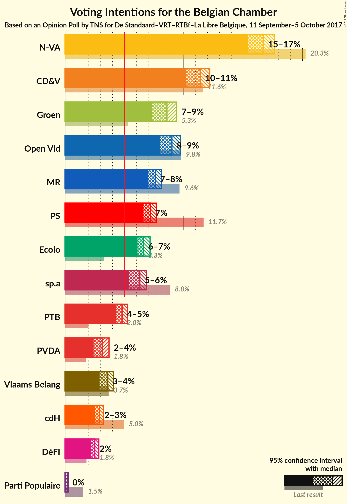
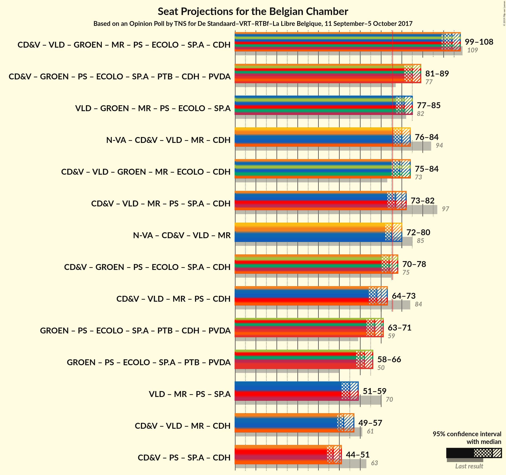

# Opinion Poll by TNS for De Standaard–VRT–RTBf–La Libre Belgique, 11 September–5 October 2017

Areas included: Brussels, Flanders, Wallonia

<a href="#voting-intentions">Voting Intentions</a> | <a href="#seats">Seats</a> | <a href="#coalitions">Coalitions</a> | <a href="#technical-information">Technical Information</a>

## Voting Intentions

### Confidence Intervals

| Party | Last Result | Poll Result | 80% Confidence Interval | 90% Confidence Interval | 95% Confidence Interval | 99% Confidence Interval |
|:-----:|:-----------:|:-----------:|:-----------------------:|:-----------------------:|:-----------------------:|:-----------------------:|
| N-VA | 20.3% | 17.6% | 26.3–29.9% |25.8–30.4% |25.4–30.8% |24.6–31.7% |
| CD&V | 11.6% | 12.2% | 17.9–21.1% |17.5–21.5% |17.1–21.9% |16.4–22.8% |
| Open Vld | 9.8% | 9.7% | 14.1–17.0% |13.8–17.5% |13.4–17.8% |12.8–18.6% |
| Groen | 5.3% | 8.6% | 12.6–15.3% |12.2–15.7% |11.9–16.1% |11.3–16.8% |
| MR | 9.6% | 8.1% | N/A |N/A |N/A |N/A |
| PS | 11.7% | 7.7% | N/A |N/A |N/A |N/A |
| Ecolo | 3.3% | 7.2% | N/A |N/A |N/A |N/A |
| sp.a | 8.8% | 6.9% | 9.8–12.3% |9.5–12.7% |9.2–13.1% |8.7–13.7% |
| PTB | 2.0% | 5.3% | N/A |N/A |N/A |N/A |
| Vlaams Belang | 3.7% | 4.1% | 5.6–7.6% |5.4–7.9% |5.2–8.2% |4.8–8.7% |
| cdH | 5.0% | 3.3% | N/A |N/A |N/A |N/A |
| PVDA | 1.8% | 3.1% | 4.3–6.1% |4.1–6.3% |3.9–6.6% |3.6–7.1% |
| DéFI | 1.8% | 2.8% | N/A |N/A |N/A |N/A |
| Parti Populaire | 1.5% | 0.3% | N/A |N/A |N/A |N/A |

*Note:* The poll result column reflects the actual value used in the calculations. Published results may vary slightly, and in addition be rounded to fewer digits.

## Seats

### Confidence Intervals

| Party | Last Result | Median | 80% Confidence Interval | 90% Confidence Interval | 95% Confidence Interval | 99% Confidence Interval |
|:-----:|:-----------:|:------:|:-----------------------:|:-----------------------:|:-----------------------:|:-----------------------:|
| <a href="#n-va">N-VA</a> | 33 | 28 | 27–32 |26–32 |26–32 |25–32 |
| <a href="#cd&v">CD&V</a> | 18 | 18 | 15–18 |15–18 |15–18 |15–22 |
| <a href="#open-vld">Open Vld</a> | 14 | 13 | 12–15 |12–15 |12–15 |12–15 |
| <a href="#groen">Groen</a> | 6 | 12 | 11–14 |11–14 |11–14 |11–14 |
| <a href="#mr">MR</a> | 20 | 18 | 17–18 |17–18 |16–18 |16–18 |
| <a href="#ps">PS</a> | 23 | 15 | 15–16 |15–16 |14–16 |14–16 |
| <a href="#ecolo">Ecolo</a> | 6 | 13 | 12–15 |12–15 |12–15 |12–16 |
| <a href="#sp.a">sp.a</a> | 13 | 12 | 9–13 |9–13 |9–13 |8–13 |
| <a href="#ptb">PTB</a> | 2 | 9 | 9 |9–10 |9–10 |8–10 |
| <a href="#vlaams-belang">Vlaams Belang</a> | 3 | 5 | 5–6 |5–6 |5–6 |5–6 |
| <a href="#cdh">cdH</a> | 9 | 5 | 4–5 |4–5 |4–6 |4–7 |
| <a href="#pvda">PVDA</a> | 0 | 0 | 0 |0 |0 |0 |
| <a href="#défi">DéFI</a> | 2 | 2 | 2–3 |2–3 |2–3 |2–4 |
| <a href="#parti-populaire">Parti Populaire</a> | 1 | 0 | 0 |0 |0 |0 |

### N-VA

*For a full overview of the results for this party, see the [N-VA](party-nva.html) page.*

| Number of Seats | Probability | Accumulated | Special Marks |
|:---------------:|:-----------:|:-----------:|:-------------:|
| 24 | 0.3% | 100% |  |
| 25 | 1.0% | 99.7% |  |
| 26 | 4% | 98.7% |  |
| 27 | 19% | 95% |  |
| 28 | 28% | 76% | Median |
| 29 | 34% | 48% |  |
| 30 | 0% | 14% |  |
| 31 | 3% | 14% |  |
| 32 | 11% | 11% |  |
| 33 | 0.2% | 0.2% | Last Result |
| 34 | 0% | 0% |  |

### CD&V

*For a full overview of the results for this party, see the [CD&V](party-cdv.html) page.*

| Number of Seats | Probability | Accumulated | Special Marks |
|:---------------:|:-----------:|:-----------:|:-------------:|
| 15 | 43% | 100% |  |
| 16 | 0.1% | 57% |  |
| 17 | 0.2% | 57% |  |
| 18 | 55% | 57% | Last Result, Median |
| 19 | 0% | 1.4% |  |
| 20 | 0% | 1.4% |  |
| 21 | 0.1% | 1.4% |  |
| 22 | 1.3% | 1.3% |  |
| 23 | 0% | 0% |  |

### Open Vld

*For a full overview of the results for this party, see the [Open Vld](party-openvld.html) page.*

| Number of Seats | Probability | Accumulated | Special Marks |
|:---------------:|:-----------:|:-----------:|:-------------:|
| 12 | 38% | 100% |  |
| 13 | 43% | 62% | Median |
| 14 | 1.3% | 19% | Last Result |
| 15 | 17% | 18% |  |
| 16 | 0.3% | 0.4% |  |
| 17 | 0.2% | 0.2% |  |
| 18 | 0% | 0% |  |

### Groen

*For a full overview of the results for this party, see the [Groen](party-groen.html) page.*

| Number of Seats | Probability | Accumulated | Special Marks |
|:---------------:|:-----------:|:-----------:|:-------------:|
| 6 | 0% | 100% | Last Result |
| 7 | 0% | 100% |  |
| 8 | 0% | 100% |  |
| 9 | 0% | 100% |  |
| 10 | 0.2% | 100% |  |
| 11 | 17% | 99.8% |  |
| 12 | 58% | 82% | Median |
| 13 | 1.5% | 25% |  |
| 14 | 23% | 23% |  |
| 15 | 0% | 0.1% |  |
| 16 | 0% | 0.1% |  |
| 17 | 0.1% | 0.1% |  |
| 18 | 0% | 0% |  |

### MR

*For a full overview of the results for this party, see the [MR](party-mr.html) page.*

| Number of Seats | Probability | Accumulated | Special Marks |
|:---------------:|:-----------:|:-----------:|:-------------:|
| 15 | 0.4% | 100% |  |
| 16 | 2% | 99.6% |  |
| 17 | 26% | 97% |  |
| 18 | 71% | 71% | Median |
| 19 | 0.2% | 0.2% |  |
| 20 | 0% | 0% | Last Result |

### PS

*For a full overview of the results for this party, see the [PS](party-ps.html) page.*

| Number of Seats | Probability | Accumulated | Special Marks |
|:---------------:|:-----------:|:-----------:|:-------------:|
| 12 | 0.1% | 100% |  |
| 13 | 0% | 99.9% |  |
| 14 | 4% | 99.9% |  |
| 15 | 67% | 96% | Median |
| 16 | 29% | 29% |  |
| 17 | 0.1% | 0.3% |  |
| 18 | 0.1% | 0.2% |  |
| 19 | 0.1% | 0.1% |  |
| 20 | 0% | 0% |  |
| 21 | 0% | 0% |  |
| 22 | 0% | 0% |  |
| 23 | 0% | 0% | Last Result |

### Ecolo

*For a full overview of the results for this party, see the [Ecolo](party-ecolo.html) page.*

| Number of Seats | Probability | Accumulated | Special Marks |
|:---------------:|:-----------:|:-----------:|:-------------:|
| 6 | 0% | 100% | Last Result |
| 7 | 0% | 100% |  |
| 8 | 0% | 100% |  |
| 9 | 0% | 100% |  |
| 10 | 0% | 100% |  |
| 11 | 0.3% | 100% |  |
| 12 | 11% | 99.7% |  |
| 13 | 67% | 89% | Median |
| 14 | 7% | 22% |  |
| 15 | 15% | 15% |  |
| 16 | 0.3% | 0.7% |  |
| 17 | 0.4% | 0.4% |  |
| 18 | 0% | 0% |  |

### sp.a

*For a full overview of the results for this party, see the [sp.a](party-spa.html) page.*

| Number of Seats | Probability | Accumulated | Special Marks |
|:---------------:|:-----------:|:-----------:|:-------------:|
| 8 | 2% | 100% |  |
| 9 | 14% | 98% |  |
| 10 | 0% | 84% |  |
| 11 | 23% | 84% |  |
| 12 | 17% | 60% | Median |
| 13 | 43% | 43% | Last Result |
| 14 | 0% | 0% |  |

### PTB

*For a full overview of the results for this party, see the [PTB](party-ptb.html) page.*

| Number of Seats | Probability | Accumulated | Special Marks |
|:---------------:|:-----------:|:-----------:|:-------------:|
| 2 | 0% | 100% | Last Result |
| 3 | 0% | 100% |  |
| 4 | 0% | 100% |  |
| 5 | 0% | 100% |  |
| 6 | 0% | 100% |  |
| 7 | 0.3% | 100% |  |
| 8 | 1.0% | 99.7% |  |
| 9 | 92% | 98.8% | Median |
| 10 | 6% | 6% |  |
| 11 | 0% | 0% |  |

### Vlaams Belang

*For a full overview of the results for this party, see the [Vlaams Belang](party-vlaamsbelang.html) page.*

| Number of Seats | Probability | Accumulated | Special Marks |
|:---------------:|:-----------:|:-----------:|:-------------:|
| 2 | 0.3% | 100% |  |
| 3 | 0% | 99.7% | Last Result |
| 4 | 0% | 99.7% |  |
| 5 | 55% | 99.7% | Median |
| 6 | 44% | 45% |  |
| 7 | 0.3% | 0.5% |  |
| 8 | 0.2% | 0.2% |  |
| 9 | 0% | 0% |  |

### cdH

*For a full overview of the results for this party, see the [cdH](party-cdh.html) page.*

| Number of Seats | Probability | Accumulated | Special Marks |
|:---------------:|:-----------:|:-----------:|:-------------:|
| 3 | 0.2% | 100% |  |
| 4 | 21% | 99.8% |  |
| 5 | 75% | 78% | Median |
| 6 | 0.8% | 3% |  |
| 7 | 2% | 2% |  |
| 8 | 0% | 0% |  |
| 9 | 0% | 0% | Last Result |

### PVDA

*For a full overview of the results for this party, see the [PVDA](party-pvda.html) page.*

| Number of Seats | Probability | Accumulated | Special Marks |
|:---------------:|:-----------:|:-----------:|:-------------:|
| 0 | 100% | 100% | Last Result, Median |

### DéFI

*For a full overview of the results for this party, see the [DéFI](party-dfi.html) page.*

| Number of Seats | Probability | Accumulated | Special Marks |
|:---------------:|:-----------:|:-----------:|:-------------:|
| 2 | 89% | 100% | Last Result, Median |
| 3 | 10% | 11% |  |
| 4 | 0.9% | 1.2% |  |
| 5 | 0.3% | 0.3% |  |
| 6 | 0% | 0% |  |

### Parti Populaire

*For a full overview of the results for this party, see the [Parti Populaire](party-partipopulaire.html) page.*

| Number of Seats | Probability | Accumulated | Special Marks |
|:---------------:|:-----------:|:-----------:|:-------------:|
| 0 | 100% | 100% | Median |
| 1 | 0% | 0% | Last Result |

## Coalitions

### Confidence Intervals

| Coalition | Last Result | Median | Majority? | 80% Confidence Interval | 90% Confidence Interval | 95% Confidence Interval | 99% Confidence Interval |
|:---------:|:-----------:|:------:|:---------:|:-----------------------:|:-----------------------:|:-----------------------:|:-----------------------:|
| CD&V – Open Vld – Groen – MR – PS – Ecolo – sp.a – cdH | 109 | 105 | 100% | 102–107 | 102–107 | 102–108 | 101–108 |
| CD&V – Groen – PS – Ecolo – sp.a – PTB – cdH – PVDA | 77 | 83 | 100% | 82–85 | 81–86 | 81–86 | 80–87 |
| Open Vld – Groen – MR – PS – Ecolo – sp.a | 82 | 84 | 100% | 79–85 | 79–85 | 79–85 | 78–86 |
| N-VA – CD&V – Open Vld – MR – cdH | 94 | 80 | 99.9% | 79–84 | 78–85 | 77–85 | 77–86 |
| CD&V – Open Vld – MR – PS – sp.a – cdH | 97 | 79 | 97% | 77–83 | 77–83 | 75–84 | 75–84 |
| CD&V – Open Vld – Groen – MR – Ecolo – cdH | 73 | 78 | 95% | 76–80 | 76–80 | 74–80 | 74–85 |
| N-VA – CD&V – Open Vld – MR | 85 | 75 | 46% | 74–79 | 74–80 | 73–80 | 73–80 |
| CD&V – Groen – PS – Ecolo – sp.a – cdH | 75 | 74 | 25% | 72–76 | 72–77 | 72–77 | 71–78 |
| CD&V – Open Vld – MR – PS – cdH | 84 | 67 | 0% | 65–71 | 64–71 | 64–72 | 64–74 |
| Groen – PS – Ecolo – sp.a – PTB – cdH – PVDA | 59 | 67 | 0% | 63–68 | 63–68 | 63–69 | 62–69 |
| Groen – PS – Ecolo – sp.a – PTB – PVDA | 50 | 62 | 0% | 58–64 | 58–64 | 58–64 | 57–65 |
| Open Vld – MR – PS – sp.a | 70 | 59 | 0% | 54–60 | 54–60 | 53–61 | 53–61 |
| CD&V – Open Vld – MR – cdH | 61 | 52 | 0% | 50–56 | 49–56 | 49–56 | 48–59 |
| CD&V – PS – sp.a – cdH | 63 | 48 | 0% | 47–50 | 47–51 | 46–51 | 45–52 |

### CD&V – Open Vld – Groen – MR – PS – Ecolo – sp.a – cdH

| Number of Seats | Probability | Accumulated | Special Marks |
|:---------------:|:-----------:|:-----------:|:-------------:|
| 99 | 0.1% | 100% |  |
| 100 | 0.2% | 99.9% |  |
| 101 | 2% | 99.7% |  |
| 102 | 10% | 98% |  |
| 103 | 9% | 88% |  |
| 104 | 29% | 79% |  |
| 105 | 12% | 51% |  |
| 106 | 18% | 39% | Median |
| 107 | 16% | 21% |  |
| 108 | 4% | 5% |  |
| 109 | 0.4% | 0.4% | Last Result |
| 110 | 0% | 0% |  |

### CD&V – Groen – PS – Ecolo – sp.a – PTB – cdH – PVDA

| Number of Seats | Probability | Accumulated | Special Marks |
|:---------------:|:-----------:|:-----------:|:-------------:|
| 77 | 0.1% | 100% | Last Result |
| 78 | 0% | 99.9% |  |
| 79 | 0.1% | 99.9% |  |
| 80 | 0.4% | 99.8% |  |
| 81 | 9% | 99.4% |  |
| 82 | 31% | 90% |  |
| 83 | 26% | 59% |  |
| 84 | 8% | 33% | Median |
| 85 | 16% | 25% |  |
| 86 | 8% | 9% |  |
| 87 | 1.1% | 1.2% |  |
| 88 | 0% | 0% |  |

### Open Vld – Groen – MR – PS – Ecolo – sp.a

| Number of Seats | Probability | Accumulated | Special Marks |
|:---------------:|:-----------:|:-----------:|:-------------:|
| 76 | 0% | 100% | Majority |
| 77 | 0.3% | 99.9% |  |
| 78 | 2% | 99.6% |  |
| 79 | 8% | 98% |  |
| 80 | 4% | 90% |  |
| 81 | 2% | 86% |  |
| 82 | 4% | 84% | Last Result |
| 83 | 19% | 80% | Median |
| 84 | 40% | 60% |  |
| 85 | 17% | 20% |  |
| 86 | 2% | 2% |  |
| 87 | 0.2% | 0.3% |  |
| 88 | 0.1% | 0.1% |  |
| 89 | 0% | 0% |  |

### N-VA – CD&V – Open Vld – MR – cdH

| Number of Seats | Probability | Accumulated | Special Marks |
|:---------------:|:-----------:|:-----------:|:-------------:|
| 75 | 0.1% | 100% |  |
| 76 | 0.2% | 99.9% | Majority |
| 77 | 2% | 99.8% |  |
| 78 | 7% | 97% |  |
| 79 | 15% | 90% |  |
| 80 | 30% | 76% |  |
| 81 | 15% | 46% |  |
| 82 | 6% | 31% | Median |
| 83 | 11% | 24% |  |
| 84 | 5% | 13% |  |
| 85 | 7% | 8% |  |
| 86 | 0.4% | 0.6% |  |
| 87 | 0.1% | 0.1% |  |
| 88 | 0% | 0% |  |
| 89 | 0% | 0% |  |
| 90 | 0% | 0% |  |
| 91 | 0% | 0% |  |
| 92 | 0% | 0% |  |
| 93 | 0% | 0% |  |
| 94 | 0% | 0% | Last Result |

### CD&V – Open Vld – MR – PS – sp.a – cdH

| Number of Seats | Probability | Accumulated | Special Marks |
|:---------------:|:-----------:|:-----------:|:-------------:|
| 73 | 0% | 100% |  |
| 74 | 0.3% | 99.9% |  |
| 75 | 3% | 99.6% |  |
| 76 | 1.0% | 97% | Majority |
| 77 | 20% | 96% |  |
| 78 | 6% | 76% |  |
| 79 | 39% | 70% |  |
| 80 | 12% | 31% |  |
| 81 | 4% | 19% | Median |
| 82 | 2% | 15% |  |
| 83 | 10% | 14% |  |
| 84 | 3% | 3% |  |
| 85 | 0.1% | 0.1% |  |
| 86 | 0% | 0% |  |
| 87 | 0% | 0% |  |
| 88 | 0% | 0% |  |
| 89 | 0% | 0% |  |
| 90 | 0% | 0% |  |
| 91 | 0% | 0% |  |
| 92 | 0% | 0% |  |
| 93 | 0% | 0% |  |
| 94 | 0% | 0% |  |
| 95 | 0% | 0% |  |
| 96 | 0% | 0% |  |
| 97 | 0% | 0% | Last Result |

### CD&V – Open Vld – Groen – MR – Ecolo – cdH

| Number of Seats | Probability | Accumulated | Special Marks |
|:---------------:|:-----------:|:-----------:|:-------------:|
| 72 | 0.1% | 100% |  |
| 73 | 0% | 99.9% | Last Result |
| 74 | 4% | 99.9% |  |
| 75 | 0.4% | 96% |  |
| 76 | 39% | 95% | Majority |
| 77 | 0.4% | 56% |  |
| 78 | 17% | 55% |  |
| 79 | 0.4% | 39% | Median |
| 80 | 36% | 38% |  |
| 81 | 0.3% | 2% |  |
| 82 | 0.3% | 2% |  |
| 83 | 0.2% | 2% |  |
| 84 | 0.2% | 1.4% |  |
| 85 | 1.1% | 1.2% |  |
| 86 | 0% | 0% |  |

### N-VA – CD&V – Open Vld – MR

| Number of Seats | Probability | Accumulated | Special Marks |
|:---------------:|:-----------:|:-----------:|:-------------:|
| 71 | 0.1% | 100% |  |
| 72 | 0.2% | 99.9% |  |
| 73 | 3% | 99.7% |  |
| 74 | 18% | 97% |  |
| 75 | 32% | 79% |  |
| 76 | 14% | 46% | Majority |
| 77 | 7% | 32% | Median |
| 78 | 11% | 25% |  |
| 79 | 6% | 14% |  |
| 80 | 8% | 8% |  |
| 81 | 0.2% | 0.4% |  |
| 82 | 0.1% | 0.1% |  |
| 83 | 0% | 0% |  |
| 84 | 0% | 0% |  |
| 85 | 0% | 0% | Last Result |

### CD&V – Groen – PS – Ecolo – sp.a – cdH

| Number of Seats | Probability | Accumulated | Special Marks |
|:---------------:|:-----------:|:-----------:|:-------------:|
| 68 | 0.1% | 100% |  |
| 69 | 0% | 99.9% |  |
| 70 | 0% | 99.9% |  |
| 71 | 0.9% | 99.8% |  |
| 72 | 10% | 99.0% |  |
| 73 | 31% | 89% |  |
| 74 | 24% | 57% |  |
| 75 | 8% | 33% | Last Result, Median |
| 76 | 16% | 25% | Majority |
| 77 | 8% | 9% |  |
| 78 | 1.2% | 1.2% |  |
| 79 | 0.1% | 0.1% |  |
| 80 | 0% | 0% |  |

### CD&V – Open Vld – MR – PS – cdH

| Number of Seats | Probability | Accumulated | Special Marks |
|:---------------:|:-----------:|:-----------:|:-------------:|
| 61 | 0.1% | 100% |  |
| 62 | 0.1% | 99.9% |  |
| 63 | 0.2% | 99.8% |  |
| 64 | 7% | 99.6% |  |
| 65 | 2% | 92% |  |
| 66 | 32% | 90% |  |
| 67 | 10% | 58% |  |
| 68 | 22% | 48% |  |
| 69 | 10% | 26% | Median |
| 70 | 1.1% | 16% |  |
| 71 | 10% | 15% |  |
| 72 | 3% | 5% |  |
| 73 | 0.3% | 1.4% |  |
| 74 | 0.8% | 1.1% |  |
| 75 | 0.2% | 0.3% |  |
| 76 | 0% | 0% | Majority |
| 77 | 0% | 0% |  |
| 78 | 0% | 0% |  |
| 79 | 0% | 0% |  |
| 80 | 0% | 0% |  |
| 81 | 0% | 0% |  |
| 82 | 0% | 0% |  |
| 83 | 0% | 0% |  |
| 84 | 0% | 0% | Last Result |

### Groen – PS – Ecolo – sp.a – PTB – cdH – PVDA

| Number of Seats | Probability | Accumulated | Special Marks |
|:---------------:|:-----------:|:-----------:|:-------------:|
| 59 | 0% | 100% | Last Result |
| 60 | 0% | 100% |  |
| 61 | 0.1% | 100% |  |
| 62 | 0.4% | 99.9% |  |
| 63 | 10% | 99.5% |  |
| 64 | 5% | 90% |  |
| 65 | 12% | 84% |  |
| 66 | 6% | 73% | Median |
| 67 | 42% | 67% |  |
| 68 | 22% | 25% |  |
| 69 | 3% | 3% |  |
| 70 | 0.1% | 0.1% |  |
| 71 | 0% | 0% |  |

### Groen – PS – Ecolo – sp.a – PTB – PVDA

| Number of Seats | Probability | Accumulated | Special Marks |
|:---------------:|:-----------:|:-----------:|:-------------:|
| 50 | 0% | 100% | Last Result |
| 51 | 0% | 100% |  |
| 52 | 0% | 100% |  |
| 53 | 0% | 100% |  |
| 54 | 0% | 100% |  |
| 55 | 0% | 100% |  |
| 56 | 0.1% | 100% |  |
| 57 | 0.7% | 99.9% |  |
| 58 | 9% | 99.2% |  |
| 59 | 4% | 90% |  |
| 60 | 13% | 86% |  |
| 61 | 6% | 73% | Median |
| 62 | 42% | 68% |  |
| 63 | 14% | 26% |  |
| 64 | 10% | 12% |  |
| 65 | 2% | 2% |  |
| 66 | 0% | 0% |  |

### Open Vld – MR – PS – sp.a

| Number of Seats | Probability | Accumulated | Special Marks |
|:---------------:|:-----------:|:-----------:|:-------------:|
| 50 | 0.1% | 100% |  |
| 51 | 0% | 99.9% |  |
| 52 | 0.3% | 99.9% |  |
| 53 | 3% | 99.6% |  |
| 54 | 10% | 97% |  |
| 55 | 8% | 87% |  |
| 56 | 15% | 80% |  |
| 57 | 4% | 64% |  |
| 58 | 8% | 60% | Median |
| 59 | 31% | 51% |  |
| 60 | 18% | 21% |  |
| 61 | 3% | 3% |  |
| 62 | 0% | 0% |  |
| 63 | 0% | 0% |  |
| 64 | 0% | 0% |  |
| 65 | 0% | 0% |  |
| 66 | 0% | 0% |  |
| 67 | 0% | 0% |  |
| 68 | 0% | 0% |  |
| 69 | 0% | 0% |  |
| 70 | 0% | 0% | Last Result |

### CD&V – Open Vld – MR – cdH

| Number of Seats | Probability | Accumulated | Special Marks |
|:---------------:|:-----------:|:-----------:|:-------------:|
| 47 | 0.2% | 100% |  |
| 48 | 0.9% | 99.8% |  |
| 49 | 7% | 98.9% |  |
| 50 | 6% | 92% |  |
| 51 | 34% | 86% |  |
| 52 | 6% | 52% |  |
| 53 | 25% | 45% |  |
| 54 | 4% | 20% | Median |
| 55 | 2% | 16% |  |
| 56 | 12% | 14% |  |
| 57 | 0.9% | 2% |  |
| 58 | 0.3% | 1.3% |  |
| 59 | 0.9% | 0.9% |  |
| 60 | 0.1% | 0.1% |  |
| 61 | 0% | 0% | Last Result |

### CD&V – PS – sp.a – cdH

| Number of Seats | Probability | Accumulated | Special Marks |
|:---------------:|:-----------:|:-----------:|:-------------:|
| 44 | 0% | 100% |  |
| 45 | 0.6% | 99.9% |  |
| 46 | 4% | 99.3% |  |
| 47 | 15% | 96% |  |
| 48 | 32% | 81% |  |
| 49 | 26% | 49% |  |
| 50 | 17% | 23% | Median |
| 51 | 5% | 6% |  |
| 52 | 0.5% | 0.7% |  |
| 53 | 0.2% | 0.2% |  |
| 54 | 0% | 0% |  |
| 55 | 0% | 0% |  |
| 56 | 0% | 0% |  |
| 57 | 0% | 0% |  |
| 58 | 0% | 0% |  |
| 59 | 0% | 0% |  |
| 60 | 0% | 0% |  |
| 61 | 0% | 0% |  |
| 62 | 0% | 0% |  |
| 63 | 0% | 0% | Last Result |

## Technical Information

### Opinion Poll

+ **Pollster:** TNS
+ **Media:** De Standaard–VRT–RTBf–La Libre Belgique
+ **Fieldwork period:** 11 September–5 October 2017

### Calculations

+ **Sample size:** 1690
+ **Simulations done:** 1,024
+ **Error estimate:** 2.42%

