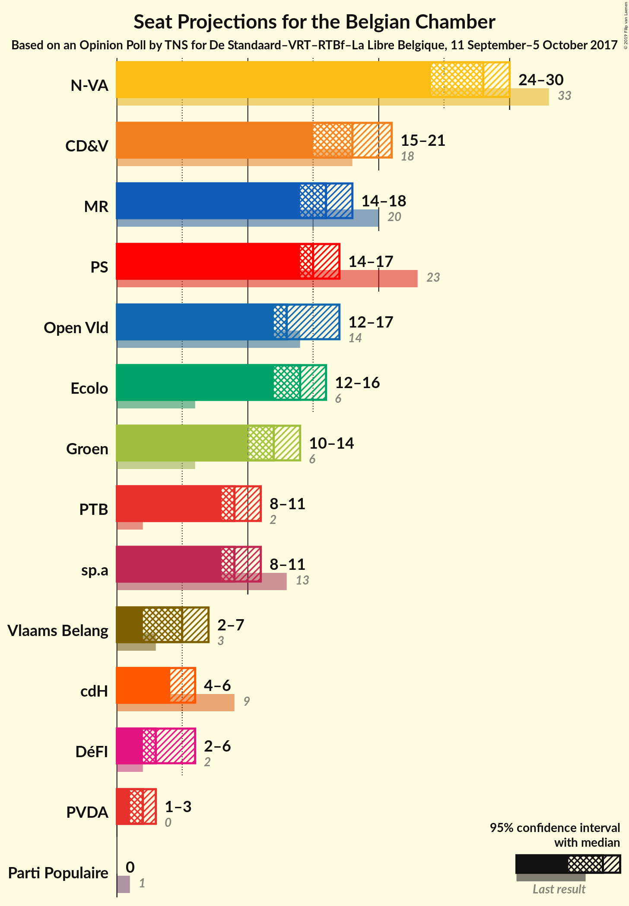
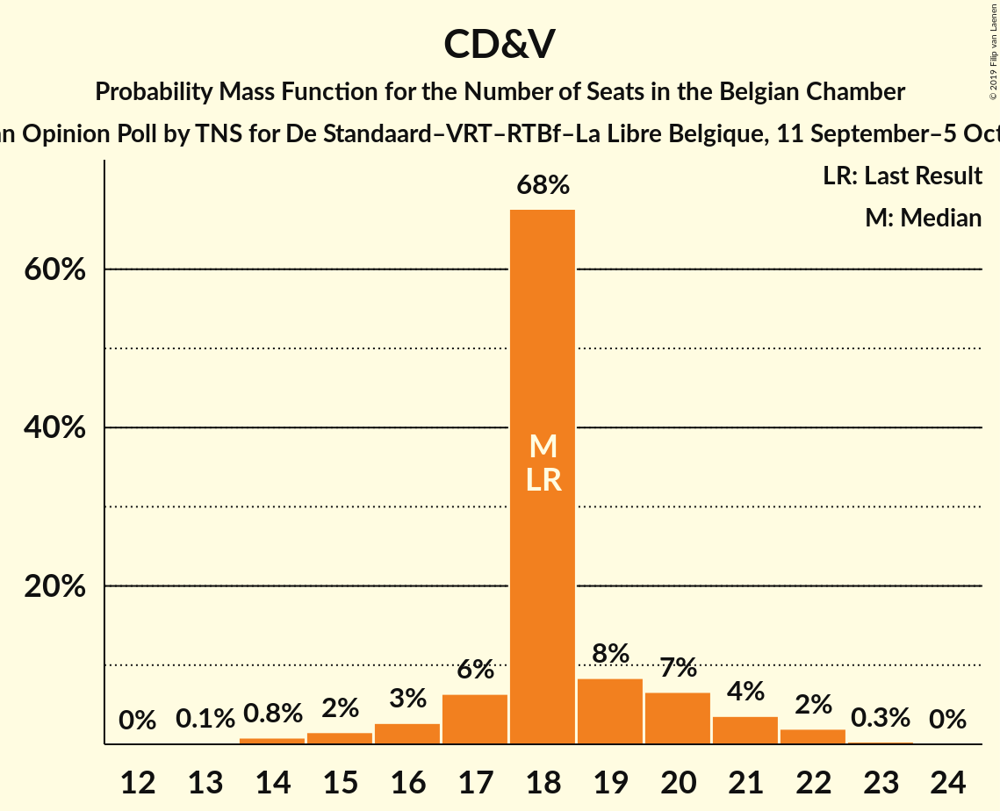
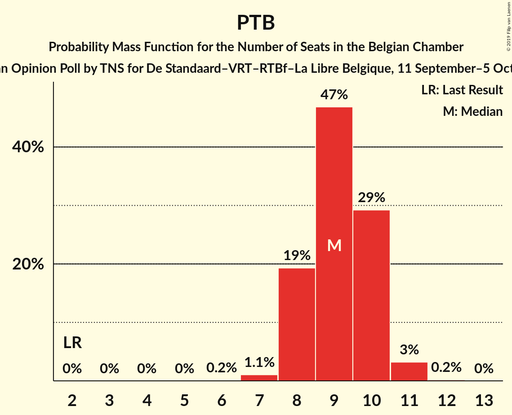

# Opinion Poll by TNS for De Standaard–VRT–RTBf–La Libre Belgique, 11 September–5 October 2017

Areas included: Brussels, Flanders, Wallonia

<a href="#voting-intentions">Voting Intentions</a> | <a href="#seats">Seats</a> | <a href="#coalitions">Coalitions</a> | <a href="#technical-information">Technical Information</a>

## Voting Intentions

### Confidence Intervals

| Party | Last Result | Poll Result | 80% Confidence Interval | 90% Confidence Interval | 95% Confidence Interval | 99% Confidence Interval |
|:-----:|:-----------:|:-----------:|:-----------------------:|:-----------------------:|:-----------------------:|:-----------------------:|
| N-VA | 20.3% | 17.6% | 26.3–29.9% |25.8–30.4% |25.4–30.8% |24.6–31.7% |
| CD&V | 11.6% | 12.2% | 17.9–21.1% |17.5–21.5% |17.1–21.9% |16.4–22.7% |
| Open Vld | 9.8% | 9.7% | 14.2–17.0% |13.8–17.4% |13.4–17.8% |12.8–18.6% |
| Groen | 5.3% | 8.6% | 12.6–15.3% |12.2–15.7% |11.9–16.1% |11.3–16.8% |
| MR | 9.6% | 8.1% | 19.8–23.0% |19.4–23.5% |19.0–23.9% |18.3–24.7% |
| PS | 11.7% | 7.7% | 19.9–23.1% |19.5–23.6% |19.1–24.0% |18.4–24.8% |
| Ecolo | 3.3% | 7.2% | 17.0–20.1% |16.6–20.5% |16.3–20.9% |15.6–21.7% |
| sp.a | 8.8% | 6.9% | 9.9–12.3% |9.5–12.7% |9.2–13.1% |8.7–13.7% |
| PTB | 2.0% | 5.3% | 13.5–16.2% |13.1–16.7% |12.8–17.0% |12.2–17.7% |
| Vlaams Belang | 3.7% | 4.1% | 5.6–7.6% |5.4–7.9% |5.2–8.2% |4.8–8.7% |
| cdH | 5.0% | 3.3% | 7.7–9.9% |7.4–10.3% |7.2–10.6% |6.7–11.2% |
| PVDA | 1.8% | 3.1% | 4.3–6.0% |4.1–6.3% |3.9–6.6% |3.6–7.1% |
| DéFI | 1.8% | 2.8% | 4.9–6.8% |4.7–7.1% |4.5–7.3% |4.2–7.8% |
| Parti Populaire | 1.5% | 0.3% | 0.5–1.2% |0.4–1.3% |0.4–1.5% |0.3–1.7% |

*Note:* The poll result column reflects the actual value used in the calculations. Published results may vary slightly, and in addition be rounded to fewer digits.

## Seats

### Confidence Intervals

| Party | Last Result | Median | 80% Confidence Interval | 90% Confidence Interval | 95% Confidence Interval | 99% Confidence Interval |
|:-----:|:-----------:|:------:|:-----------------------:|:-----------------------:|:-----------------------:|:-----------------------:|
| <a href="#n-va">N-VA</a> | 33 | 28 | 26–30 |25–31 |24–31 |24–32 |
| <a href="#cd&v">CD&V</a> | 18 | 18 | 18–21 |17–21 |16–22 |15–23 |
| <a href="#open-vld">Open Vld</a> | 14 | 13 | 12–17 |12–17 |12–17 |12–18 |
| <a href="#groen">Groen</a> | 6 | 12 | 12–14 |12–15 |11–15 |10–16 |
| <a href="#mr">MR</a> | 20 | 16 | 15–17 |15–18 |14–18 |14–19 |
| <a href="#ps">PS</a> | 23 | 15 | 14–17 |14–17 |14–17 |13–18 |
| <a href="#ecolo">Ecolo</a> | 6 | 14 | 13–16 |12–16 |12–16 |11–17 |
| <a href="#sp.a">sp.a</a> | 13 | 9 | 8–11 |8–12 |8–12 |7–13 |
| <a href="#ptb">PTB</a> | 2 | 9 | 8–10 |8–10 |8–11 |7–11 |
| <a href="#vlaams-belang">Vlaams Belang</a> | 3 | 5 | 2–6 |2–7 |2–7 |2–7 |
| <a href="#cdh">cdH</a> | 9 | 4 | 4–5 |4–5 |4–6 |4–7 |
| <a href="#pvda">PVDA</a> | 0 | 0 | 0 |0 |0 |0 |
| <a href="#défi">DéFI</a> | 2 | 3 | 2–5 |2–6 |2–6 |2–6 |
| <a href="#parti-populaire">Parti Populaire</a> | 1 | 0 | 0 |0 |0 |0 |

### N-VA

*For a full overview of the results for this party, see the [N-VA](party-n-va.html) page.*

| Number of Seats | Probability | Accumulated | Special Marks |
|:---------------:|:-----------:|:-----------:|:-------------:|
| 23 | 0.2% | 100% |  |
| 24 | 3% | 99.7% |  |
| 25 | 3% | 97% |  |
| 26 | 10% | 94% |  |
| 27 | 22% | 84% |  |
| 28 | 28% | 63% | Median |
| 29 | 16% | 35% |  |
| 30 | 14% | 19% |  |
| 31 | 4% | 5% |  |
| 32 | 0.5% | 0.8% |  |
| 33 | 0.1% | 0.3% | Last Result |
| 34 | 0.1% | 0.1% |  |
| 35 | 0% | 0% |  |

### CD&V

*For a full overview of the results for this party, see the [CD&V](party-cdv.html) page.*

| Number of Seats | Probability | Accumulated | Special Marks |
|:---------------:|:-----------:|:-----------:|:-------------:|
| 13 | 0.1% | 100% |  |
| 14 | 0.3% | 99.9% |  |
| 15 | 0.6% | 99.6% |  |
| 16 | 2% | 98.9% |  |
| 17 | 3% | 97% |  |
| 18 | 60% | 94% | Last Result, Median |
| 19 | 15% | 34% |  |
| 20 | 7% | 19% |  |
| 21 | 8% | 12% |  |
| 22 | 3% | 3% |  |
| 23 | 0.5% | 0.6% |  |
| 24 | 0% | 0% |  |

### Open Vld

*For a full overview of the results for this party, see the [Open Vld](party-openvld.html) page.*

| Number of Seats | Probability | Accumulated | Special Marks |
|:---------------:|:-----------:|:-----------:|:-------------:|
| 11 | 0.4% | 100% |  |
| 12 | 10% | 99.6% |  |
| 13 | 40% | 90% | Median |
| 14 | 12% | 50% | Last Result |
| 15 | 10% | 38% |  |
| 16 | 10% | 28% |  |
| 17 | 16% | 18% |  |
| 18 | 2% | 2% |  |
| 19 | 0% | 0% |  |

### Groen

*For a full overview of the results for this party, see the [Groen](party-groen.html) page.*

| Number of Seats | Probability | Accumulated | Special Marks |
|:---------------:|:-----------:|:-----------:|:-------------:|
| 6 | 0% | 100% | Last Result |
| 7 | 0% | 100% |  |
| 8 | 0% | 100% |  |
| 9 | 0.1% | 100% |  |
| 10 | 1.3% | 99.9% |  |
| 11 | 3% | 98.6% |  |
| 12 | 82% | 96% | Median |
| 13 | 4% | 14% |  |
| 14 | 4% | 10% |  |
| 15 | 4% | 6% |  |
| 16 | 2% | 2% |  |
| 17 | 0.1% | 0.1% |  |
| 18 | 0% | 0% |  |

### MR

*For a full overview of the results for this party, see the [MR](party-mr.html) page.*

| Number of Seats | Probability | Accumulated | Special Marks |
|:---------------:|:-----------:|:-----------:|:-------------:|
| 13 | 0.5% | 100% |  |
| 14 | 4% | 99.5% |  |
| 15 | 16% | 96% |  |
| 16 | 46% | 80% | Median |
| 17 | 27% | 34% |  |
| 18 | 6% | 7% |  |
| 19 | 1.1% | 1.2% |  |
| 20 | 0% | 0% | Last Result |

### PS

*For a full overview of the results for this party, see the [PS](party-ps.html) page.*

| Number of Seats | Probability | Accumulated | Special Marks |
|:---------------:|:-----------:|:-----------:|:-------------:|
| 12 | 0.1% | 100% |  |
| 13 | 0.5% | 99.9% |  |
| 14 | 16% | 99.4% |  |
| 15 | 40% | 83% | Median |
| 16 | 30% | 43% |  |
| 17 | 11% | 13% |  |
| 18 | 2% | 2% |  |
| 19 | 0.3% | 0.3% |  |
| 20 | 0% | 0% |  |
| 21 | 0% | 0% |  |
| 22 | 0% | 0% |  |
| 23 | 0% | 0% | Last Result |

### Ecolo

*For a full overview of the results for this party, see the [Ecolo](party-ecolo.html) page.*

| Number of Seats | Probability | Accumulated | Special Marks |
|:---------------:|:-----------:|:-----------:|:-------------:|
| 6 | 0% | 100% | Last Result |
| 7 | 0% | 100% |  |
| 8 | 0% | 100% |  |
| 9 | 0% | 100% |  |
| 10 | 0% | 100% |  |
| 11 | 2% | 100% |  |
| 12 | 6% | 98% |  |
| 13 | 14% | 93% |  |
| 14 | 30% | 79% | Median |
| 15 | 34% | 50% |  |
| 16 | 15% | 16% |  |
| 17 | 0.9% | 0.9% |  |
| 18 | 0% | 0% |  |

### sp.a

*For a full overview of the results for this party, see the [sp.a](party-spa.html) page.*

| Number of Seats | Probability | Accumulated | Special Marks |
|:---------------:|:-----------:|:-----------:|:-------------:|
| 6 | 0.2% | 100% |  |
| 7 | 0.4% | 99.8% |  |
| 8 | 13% | 99.4% |  |
| 9 | 59% | 86% | Median |
| 10 | 13% | 27% |  |
| 11 | 9% | 14% |  |
| 12 | 3% | 5% |  |
| 13 | 2% | 2% | Last Result |
| 14 | 0% | 0% |  |

### PTB

*For a full overview of the results for this party, see the [PTB](party-ptb.html) page.*

| Number of Seats | Probability | Accumulated | Special Marks |
|:---------------:|:-----------:|:-----------:|:-------------:|
| 2 | 0% | 100% | Last Result |
| 3 | 0% | 100% |  |
| 4 | 0% | 100% |  |
| 5 | 0% | 100% |  |
| 6 | 0.1% | 100% |  |
| 7 | 1.0% | 99.9% |  |
| 8 | 19% | 98.8% |  |
| 9 | 47% | 80% | Median |
| 10 | 29% | 33% |  |
| 11 | 3% | 3% |  |
| 12 | 0.2% | 0.2% |  |
| 13 | 0% | 0% |  |

### Vlaams Belang

*For a full overview of the results for this party, see the [Vlaams Belang](party-vlaamsbelang.html) page.*

| Number of Seats | Probability | Accumulated | Special Marks |
|:---------------:|:-----------:|:-----------:|:-------------:|
| 1 | 0.3% | 100% |  |
| 2 | 17% | 99.7% |  |
| 3 | 6% | 83% | Last Result |
| 4 | 4% | 77% |  |
| 5 | 46% | 72% | Median |
| 6 | 20% | 26% |  |
| 7 | 6% | 6% |  |
| 8 | 0.4% | 0.4% |  |
| 9 | 0% | 0% |  |

### cdH

*For a full overview of the results for this party, see the [cdH](party-cdh.html) page.*

| Number of Seats | Probability | Accumulated | Special Marks |
|:---------------:|:-----------:|:-----------:|:-------------:|
| 3 | 0.3% | 100% |  |
| 4 | 71% | 99.7% | Median |
| 5 | 25% | 29% |  |
| 6 | 3% | 4% |  |
| 7 | 0.5% | 0.6% |  |
| 8 | 0.1% | 0.1% |  |
| 9 | 0% | 0% | Last Result |

### PVDA

*For a full overview of the results for this party, see the [PVDA](party-pvda.html) page.*

| Number of Seats | Probability | Accumulated | Special Marks |
|:---------------:|:-----------:|:-----------:|:-------------:|
| 0 | 100% | 100% | Last Result, Median |

### DéFI

*For a full overview of the results for this party, see the [DéFI](party-défi.html) page.*

| Number of Seats | Probability | Accumulated | Special Marks |
|:---------------:|:-----------:|:-----------:|:-------------:|
| 2 | 26% | 100% | Last Result |
| 3 | 30% | 74% | Median |
| 4 | 17% | 43% |  |
| 5 | 20% | 27% |  |
| 6 | 7% | 7% |  |
| 7 | 0% | 0% |  |

### Parti Populaire

*For a full overview of the results for this party, see the [Parti Populaire](party-partipopulaire.html) page.*

| Number of Seats | Probability | Accumulated | Special Marks |
|:---------------:|:-----------:|:-----------:|:-------------:|
| 0 | 100% | 100% | Median |
| 1 | 0% | 0% | Last Result |

## Coalitions

### Confidence Intervals

| Coalition | Last Result | Median | Majority? | 80% Confidence Interval | 90% Confidence Interval | 95% Confidence Interval | 99% Confidence Interval |
|:---------:|:-----------:|:------:|:---------:|:-----------------------:|:-----------------------:|:-----------------------:|:-----------------------:|
| CD&V – Open Vld – Groen – MR – PS – Ecolo – sp.a – cdH | 109 | 105 | 100% | 102–108 | 101–109 | 100–109 | 99–111 |
| CD&V – Groen – PS – Ecolo – sp.a – PTB – cdH – PVDA | 77 | 83 | 100% | 81–86 | 80–87 | 79–88 | 78–90 |
| N-VA – CD&V – Open Vld – MR – cdH | 94 | 81 | 99.8% | 79–84 | 78–85 | 77–86 | 76–87 |
| Open Vld – Groen – MR – PS – Ecolo – sp.a | 82 | 82 | 99.8% | 79–85 | 78–86 | 77–86 | 76–88 |
| CD&V – Open Vld – Groen – MR – Ecolo – cdH | 73 | 80 | 98% | 77–83 | 76–84 | 76–85 | 74–86 |
| CD&V – Open Vld – MR – PS – sp.a – cdH | 97 | 78 | 85% | 75–81 | 74–82 | 74–83 | 73–84 |
| N-VA – CD&V – Open Vld – MR | 85 | 77 | 77% | 74–80 | 74–81 | 73–81 | 72–82 |
| CD&V – Groen – PS – Ecolo – sp.a – cdH | 75 | 74 | 27% | 72–77 | 71–78 | 70–79 | 69–80 |
| CD&V – Open Vld – MR – PS – cdH | 84 | 69 | 0.3% | 66–72 | 65–73 | 65–74 | 64–75 |
| Groen – PS – Ecolo – sp.a – PTB – cdH – PVDA | 59 | 65 | 0% | 62–67 | 62–68 | 61–69 | 60–70 |
| Groen – PS – Ecolo – sp.a – PTB – PVDA | 50 | 60 | 0% | 58–63 | 57–64 | 57–65 | 56–66 |
| Open Vld – MR – PS – sp.a | 70 | 55 | 0% | 52–58 | 52–59 | 51–59 | 50–61 |
| CD&V – Open Vld – MR – cdH | 61 | 53 | 0% | 51–56 | 50–57 | 50–58 | 48–59 |
| CD&V – PS – sp.a – cdH | 63 | 47 | 0% | 45–50 | 45–51 | 44–52 | 43–53 |

### CD&V – Open Vld – Groen – MR – PS – Ecolo – sp.a – cdH

| Number of Seats | Probability | Accumulated | Special Marks |
|:---------------:|:-----------:|:-----------:|:-------------:|
| 98 | 0.1% | 100% |  |
| 99 | 0.7% | 99.8% |  |
| 100 | 2% | 99.1% |  |
| 101 | 5% | 97% | Median |
| 102 | 9% | 92% |  |
| 103 | 13% | 83% |  |
| 104 | 15% | 69% |  |
| 105 | 16% | 54% |  |
| 106 | 15% | 38% |  |
| 107 | 11% | 23% |  |
| 108 | 6% | 11% |  |
| 109 | 3% | 5% | Last Result |
| 110 | 1.4% | 2% |  |
| 111 | 0.4% | 0.5% |  |
| 112 | 0.1% | 0.1% |  |
| 113 | 0% | 0% |  |

### CD&V – Groen – PS – Ecolo – sp.a – PTB – cdH – PVDA

| Number of Seats | Probability | Accumulated | Special Marks |
|:---------------:|:-----------:|:-----------:|:-------------:|
| 76 | 0.1% | 100% | Majority |
| 77 | 0.2% | 99.9% | Last Result |
| 78 | 0.5% | 99.8% |  |
| 79 | 2% | 99.2% |  |
| 80 | 5% | 97% |  |
| 81 | 11% | 92% | Median |
| 82 | 16% | 81% |  |
| 83 | 19% | 65% |  |
| 84 | 17% | 47% |  |
| 85 | 13% | 30% |  |
| 86 | 9% | 17% |  |
| 87 | 5% | 9% |  |
| 88 | 2% | 4% |  |
| 89 | 1.0% | 2% |  |
| 90 | 0.4% | 0.6% |  |
| 91 | 0.1% | 0.2% |  |
| 92 | 0% | 0% |  |

### N-VA – CD&V – Open Vld – MR – cdH

| Number of Seats | Probability | Accumulated | Special Marks |
|:---------------:|:-----------:|:-----------:|:-------------:|
| 75 | 0.2% | 100% |  |
| 76 | 0.7% | 99.8% | Majority |
| 77 | 2% | 99.1% |  |
| 78 | 5% | 97% |  |
| 79 | 11% | 91% | Median |
| 80 | 17% | 80% |  |
| 81 | 20% | 64% |  |
| 82 | 16% | 44% |  |
| 83 | 12% | 28% |  |
| 84 | 9% | 17% |  |
| 85 | 5% | 8% |  |
| 86 | 2% | 3% |  |
| 87 | 0.7% | 0.9% |  |
| 88 | 0.2% | 0.2% |  |
| 89 | 0% | 0% |  |
| 90 | 0% | 0% |  |
| 91 | 0% | 0% |  |
| 92 | 0% | 0% |  |
| 93 | 0% | 0% |  |
| 94 | 0% | 0% | Last Result |

### Open Vld – Groen – MR – PS – Ecolo – sp.a

| Number of Seats | Probability | Accumulated | Special Marks |
|:---------------:|:-----------:|:-----------:|:-------------:|
| 75 | 0.2% | 100% |  |
| 76 | 0.7% | 99.8% | Majority |
| 77 | 2% | 99.1% |  |
| 78 | 5% | 97% |  |
| 79 | 9% | 92% | Median |
| 80 | 13% | 83% |  |
| 81 | 16% | 70% |  |
| 82 | 15% | 54% | Last Result |
| 83 | 14% | 39% |  |
| 84 | 12% | 25% |  |
| 85 | 8% | 13% |  |
| 86 | 4% | 6% |  |
| 87 | 1.3% | 2% |  |
| 88 | 0.5% | 0.7% |  |
| 89 | 0.2% | 0.2% |  |
| 90 | 0% | 0% |  |

### CD&V – Open Vld – Groen – MR – Ecolo – cdH

| Number of Seats | Probability | Accumulated | Special Marks |
|:---------------:|:-----------:|:-----------:|:-------------:|
| 73 | 0.1% | 100% | Last Result |
| 74 | 0.4% | 99.9% |  |
| 75 | 1.4% | 99.4% |  |
| 76 | 4% | 98% | Majority |
| 77 | 8% | 94% | Median |
| 78 | 14% | 86% |  |
| 79 | 16% | 72% |  |
| 80 | 16% | 56% |  |
| 81 | 14% | 41% |  |
| 82 | 12% | 26% |  |
| 83 | 8% | 14% |  |
| 84 | 4% | 6% |  |
| 85 | 2% | 3% |  |
| 86 | 0.6% | 0.9% |  |
| 87 | 0.2% | 0.2% |  |
| 88 | 0% | 0% |  |

### CD&V – Open Vld – MR – PS – sp.a – cdH

| Number of Seats | Probability | Accumulated | Special Marks |
|:---------------:|:-----------:|:-----------:|:-------------:|
| 72 | 0.2% | 100% |  |
| 73 | 1.2% | 99.7% |  |
| 74 | 4% | 98.5% |  |
| 75 | 9% | 94% | Median |
| 76 | 12% | 85% | Majority |
| 77 | 15% | 73% |  |
| 78 | 16% | 59% |  |
| 79 | 15% | 43% |  |
| 80 | 12% | 28% |  |
| 81 | 8% | 16% |  |
| 82 | 4% | 8% |  |
| 83 | 2% | 3% |  |
| 84 | 0.8% | 1.2% |  |
| 85 | 0.3% | 0.4% |  |
| 86 | 0.1% | 0.1% |  |
| 87 | 0% | 0% |  |
| 88 | 0% | 0% |  |
| 89 | 0% | 0% |  |
| 90 | 0% | 0% |  |
| 91 | 0% | 0% |  |
| 92 | 0% | 0% |  |
| 93 | 0% | 0% |  |
| 94 | 0% | 0% |  |
| 95 | 0% | 0% |  |
| 96 | 0% | 0% |  |
| 97 | 0% | 0% | Last Result |

### N-VA – CD&V – Open Vld – MR

| Number of Seats | Probability | Accumulated | Special Marks |
|:---------------:|:-----------:|:-----------:|:-------------:|
| 70 | 0.1% | 100% |  |
| 71 | 0.3% | 99.9% |  |
| 72 | 1.0% | 99.7% |  |
| 73 | 3% | 98.6% |  |
| 74 | 7% | 96% |  |
| 75 | 13% | 89% | Median |
| 76 | 18% | 77% | Majority |
| 77 | 20% | 58% |  |
| 78 | 15% | 38% |  |
| 79 | 10% | 23% |  |
| 80 | 8% | 13% |  |
| 81 | 4% | 5% |  |
| 82 | 1.1% | 1.4% |  |
| 83 | 0.3% | 0.3% |  |
| 84 | 0% | 0% |  |
| 85 | 0% | 0% | Last Result |

### CD&V – Groen – PS – Ecolo – sp.a – cdH

| Number of Seats | Probability | Accumulated | Special Marks |
|:---------------:|:-----------:|:-----------:|:-------------:|
| 67 | 0.1% | 100% |  |
| 68 | 0.2% | 99.9% |  |
| 69 | 0.5% | 99.8% |  |
| 70 | 2% | 99.2% |  |
| 71 | 6% | 97% |  |
| 72 | 12% | 91% | Median |
| 73 | 16% | 80% |  |
| 74 | 19% | 63% |  |
| 75 | 16% | 44% | Last Result |
| 76 | 12% | 27% | Majority |
| 77 | 8% | 15% |  |
| 78 | 4% | 8% |  |
| 79 | 2% | 3% |  |
| 80 | 0.9% | 1.4% |  |
| 81 | 0.4% | 0.5% |  |
| 82 | 0.1% | 0.1% |  |
| 83 | 0% | 0% |  |

### CD&V – Open Vld – MR – PS – cdH

| Number of Seats | Probability | Accumulated | Special Marks |
|:---------------:|:-----------:|:-----------:|:-------------:|
| 62 | 0.1% | 100% |  |
| 63 | 0.4% | 99.9% |  |
| 64 | 2% | 99.5% |  |
| 65 | 5% | 98% |  |
| 66 | 10% | 93% | Median |
| 67 | 14% | 82% |  |
| 68 | 16% | 68% |  |
| 69 | 15% | 52% |  |
| 70 | 13% | 37% |  |
| 71 | 10% | 23% |  |
| 72 | 7% | 13% |  |
| 73 | 4% | 6% |  |
| 74 | 2% | 3% |  |
| 75 | 0.7% | 1.0% |  |
| 76 | 0.2% | 0.3% | Majority |
| 77 | 0.1% | 0.1% |  |
| 78 | 0% | 0% |  |
| 79 | 0% | 0% |  |
| 80 | 0% | 0% |  |
| 81 | 0% | 0% |  |
| 82 | 0% | 0% |  |
| 83 | 0% | 0% |  |
| 84 | 0% | 0% | Last Result |

### Groen – PS – Ecolo – sp.a – PTB – cdH – PVDA

| Number of Seats | Probability | Accumulated | Special Marks |
|:---------------:|:-----------:|:-----------:|:-------------:|
| 59 | 0.1% | 100% | Last Result |
| 60 | 0.5% | 99.9% |  |
| 61 | 3% | 99.3% |  |
| 62 | 7% | 97% |  |
| 63 | 14% | 90% | Median |
| 64 | 20% | 76% |  |
| 65 | 21% | 56% |  |
| 66 | 16% | 35% |  |
| 67 | 9% | 19% |  |
| 68 | 5% | 9% |  |
| 69 | 3% | 4% |  |
| 70 | 1.0% | 1.4% |  |
| 71 | 0.3% | 0.3% |  |
| 72 | 0.1% | 0.1% |  |
| 73 | 0% | 0% |  |

### Groen – PS – Ecolo – sp.a – PTB – PVDA

| Number of Seats | Probability | Accumulated | Special Marks |
|:---------------:|:-----------:|:-----------:|:-------------:|
| 50 | 0% | 100% | Last Result |
| 51 | 0% | 100% |  |
| 52 | 0% | 100% |  |
| 53 | 0% | 100% |  |
| 54 | 0.1% | 100% |  |
| 55 | 0.3% | 99.9% |  |
| 56 | 1.4% | 99.6% |  |
| 57 | 4% | 98% |  |
| 58 | 9% | 94% |  |
| 59 | 15% | 85% | Median |
| 60 | 20% | 70% |  |
| 61 | 20% | 50% |  |
| 62 | 14% | 30% |  |
| 63 | 8% | 16% |  |
| 64 | 5% | 8% |  |
| 65 | 2% | 3% |  |
| 66 | 0.7% | 0.9% |  |
| 67 | 0.2% | 0.2% |  |
| 68 | 0% | 0% |  |

### Open Vld – MR – PS – sp.a

| Number of Seats | Probability | Accumulated | Special Marks |
|:---------------:|:-----------:|:-----------:|:-------------:|
| 49 | 0.1% | 100% |  |
| 50 | 0.5% | 99.9% |  |
| 51 | 3% | 99.4% |  |
| 52 | 8% | 97% |  |
| 53 | 13% | 89% | Median |
| 54 | 16% | 75% |  |
| 55 | 16% | 59% |  |
| 56 | 14% | 43% |  |
| 57 | 13% | 29% |  |
| 58 | 9% | 16% |  |
| 59 | 5% | 7% |  |
| 60 | 2% | 2% |  |
| 61 | 0.5% | 0.8% |  |
| 62 | 0.2% | 0.2% |  |
| 63 | 0% | 0.1% |  |
| 64 | 0% | 0% |  |
| 65 | 0% | 0% |  |
| 66 | 0% | 0% |  |
| 67 | 0% | 0% |  |
| 68 | 0% | 0% |  |
| 69 | 0% | 0% |  |
| 70 | 0% | 0% | Last Result |

### CD&V – Open Vld – MR – cdH

| Number of Seats | Probability | Accumulated | Special Marks |
|:---------------:|:-----------:|:-----------:|:-------------:|
| 47 | 0.1% | 100% |  |
| 48 | 0.5% | 99.9% |  |
| 49 | 2% | 99.4% |  |
| 50 | 6% | 98% |  |
| 51 | 14% | 91% | Median |
| 52 | 17% | 78% |  |
| 53 | 16% | 61% |  |
| 54 | 15% | 45% |  |
| 55 | 14% | 31% |  |
| 56 | 9% | 17% |  |
| 57 | 5% | 8% |  |
| 58 | 2% | 4% |  |
| 59 | 0.9% | 1.3% |  |
| 60 | 0.3% | 0.4% |  |
| 61 | 0.1% | 0.1% | Last Result |
| 62 | 0% | 0% |  |

### CD&V – PS – sp.a – cdH

| Number of Seats | Probability | Accumulated | Special Marks |
|:---------------:|:-----------:|:-----------:|:-------------:|
| 41 | 0.1% | 100% |  |
| 42 | 0.2% | 99.9% |  |
| 43 | 0.5% | 99.7% |  |
| 44 | 2% | 99.1% |  |
| 45 | 8% | 97% |  |
| 46 | 18% | 89% | Median |
| 47 | 21% | 71% |  |
| 48 | 19% | 50% |  |
| 49 | 14% | 31% |  |
| 50 | 9% | 17% |  |
| 51 | 5% | 8% |  |
| 52 | 2% | 3% |  |
| 53 | 0.8% | 1.2% |  |
| 54 | 0.3% | 0.4% |  |
| 55 | 0.1% | 0.1% |  |
| 56 | 0% | 0% |  |
| 57 | 0% | 0% |  |
| 58 | 0% | 0% |  |
| 59 | 0% | 0% |  |
| 60 | 0% | 0% |  |
| 61 | 0% | 0% |  |
| 62 | 0% | 0% |  |
| 63 | 0% | 0% | Last Result |

## Technical Information

### Opinion Poll

+ **Polling firm:** TNS
+ **Commissioner(s):** De Standaard–VRT–RTBf–La Libre Belgique
+ **Fieldwork period:** 11 September–5 October 2017

### Calculations

+ **Sample size:** 1690
+ **Simulations done:** 1,048,576
+ **Error estimate:** 0.85%

