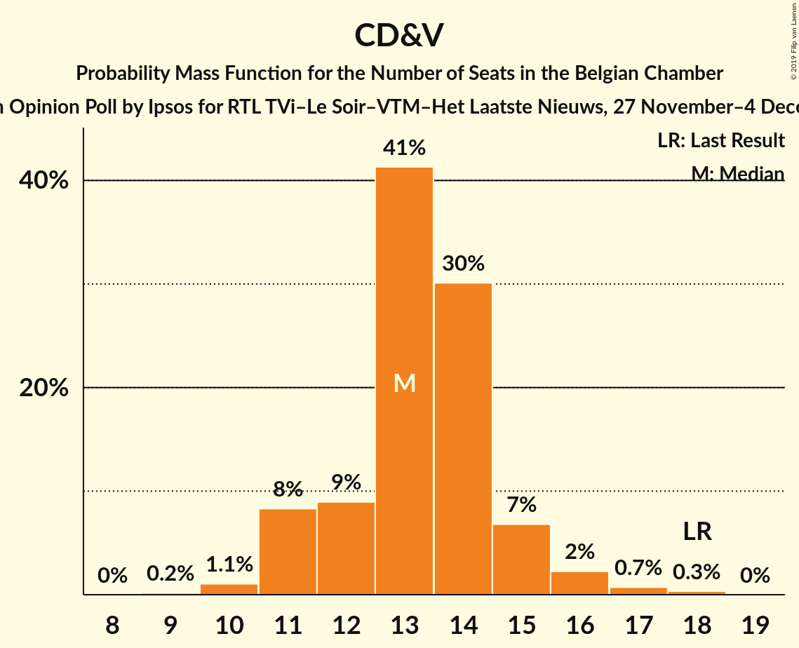
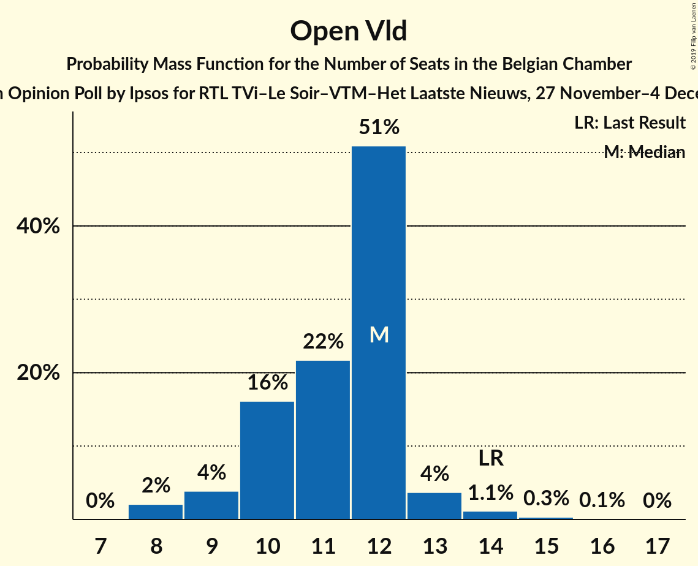

# Opinion Poll by Ipsos for RTL TVi–Le Soir–VTM–Het Laatste Nieuws, 27 November–4 December 2017

Areas included: Flanders

<a href="#voting-intentions">Voting Intentions</a> | <a href="#seats">Seats</a> | <a href="#coalitions">Coalitions</a> | <a href="#technical-information">Technical Information</a>

## Voting Intentions

### Confidence Intervals

| Party | Last Result | Poll Result | 80% Confidence Interval | 90% Confidence Interval | 95% Confidence Interval | 99% Confidence Interval |
|:-----:|:-----------:|:-----------:|:-----------------------:|:-----------------------:|:-----------------------:|:-----------------------:|
| N-VA | 20.3% | 29.5% | 27.7–31.5% |27.2–32.0% |26.8–32.5% |25.9–33.4% |
| CD&V | 11.6% | 14.1% | 12.7–15.6% |12.4–16.0% |12.0–16.4% |11.4–17.1% |
| Groen | 5.3% | 13.2% | 11.9–14.6% |11.5–15.1% |11.2–15.4% |10.6–16.1% |
| Open Vld | 9.8% | 12.2% | 10.9–13.6% |10.6–14.0% |10.3–14.3% |9.7–15.1% |
| sp.a | 8.8% | 10.9% | 9.7–12.2% |9.3–12.6% |9.1–13.0% |8.5–13.6% |
| Vlaams Belang | 3.7% | 10.4% | 9.2–11.7% |8.9–12.1% |8.6–12.4% |8.1–13.1% |
| PVDA | 1.8% | 5.5% | 4.7–6.6% |4.5–6.9% |4.3–7.1% |3.9–7.7% |

*Note:* The poll result column reflects the actual value used in the calculations. Published results may vary slightly, and in addition be rounded to fewer digits.

## Seats

### Confidence Intervals

| Party | Last Result | Median | 80% Confidence Interval | 90% Confidence Interval | 95% Confidence Interval | 99% Confidence Interval |
|:-----:|:-----------:|:------:|:-----------------------:|:-----------------------:|:-----------------------:|:-----------------------:|
| <a href="#n-va">N-VA</a> | 33 | 31 | 29–33 |28–34 |28–34 |27–35 |
| <a href="#cd&v">CD&V</a> | 18 | 13 | 13–15 |12–16 |12–17 |10–18 |
| <a href="#groen">Groen</a> | 6 | 12 | 11–13 |11–15 |10–16 |10–16 |
| <a href="#open-vld">Open Vld</a> | 14 | 12 | 11–13 |11–13 |9–13 |8–15 |
| <a href="#sp.a">sp.a</a> | 13 | 10 | 9–11 |9–12 |8–13 |7–14 |
| <a href="#vlaams-belang">Vlaams Belang</a> | 3 | 8 | 8–12 |8–12 |8–12 |7–13 |
| <a href="#pvda">PVDA</a> | 0 | 0 | 0 |0 |0 |0 |

### N-VA

*For a full overview of the results for this party, see the [N-VA](party-n-va.html) page.*

| Number of Seats | Probability | Accumulated | Special Marks |
|:---------------:|:-----------:|:-----------:|:-------------:|
| 25 | 0.1% | 100% |  |
| 26 | 0.1% | 99.9% |  |
| 27 | 1.5% | 99.8% |  |
| 28 | 7% | 98% |  |
| 29 | 13% | 91% |  |
| 30 | 16% | 78% |  |
| 31 | 25% | 63% | Median |
| 32 | 21% | 38% |  |
| 33 | 10% | 16% | Last Result |
| 34 | 5% | 6% |  |
| 35 | 1.3% | 2% |  |
| 36 | 0.2% | 0.2% |  |
| 37 | 0% | 0% |  |

### CD&V

*For a full overview of the results for this party, see the [CD&V](party-cdv.html) page.*

| Number of Seats | Probability | Accumulated | Special Marks |
|:---------------:|:-----------:|:-----------:|:-------------:|
| 9 | 0.2% | 100% |  |
| 10 | 0.9% | 99.8% |  |
| 11 | 1.3% | 98.9% |  |
| 12 | 3% | 98% |  |
| 13 | 50% | 94% | Median |
| 14 | 33% | 44% |  |
| 15 | 6% | 12% |  |
| 16 | 2% | 5% |  |
| 17 | 1.5% | 3% |  |
| 18 | 2% | 2% | Last Result |
| 19 | 0% | 0% |  |

### Groen

*For a full overview of the results for this party, see the [Groen](party-groen.html) page.*

| Number of Seats | Probability | Accumulated | Special Marks |
|:---------------:|:-----------:|:-----------:|:-------------:|
| 6 | 0% | 100% | Last Result |
| 7 | 0% | 100% |  |
| 8 | 0% | 100% |  |
| 9 | 0.1% | 100% |  |
| 10 | 3% | 99.9% |  |
| 11 | 9% | 97% |  |
| 12 | 70% | 88% | Median |
| 13 | 9% | 18% |  |
| 14 | 3% | 8% |  |
| 15 | 3% | 5% |  |
| 16 | 3% | 3% |  |
| 17 | 0.4% | 0.4% |  |
| 18 | 0% | 0% |  |

### Open Vld

*For a full overview of the results for this party, see the [Open Vld](party-openvld.html) page.*

| Number of Seats | Probability | Accumulated | Special Marks |
|:---------------:|:-----------:|:-----------:|:-------------:|
| 8 | 1.5% | 100% |  |
| 9 | 1.1% | 98% |  |
| 10 | 2% | 97% |  |
| 11 | 37% | 96% |  |
| 12 | 48% | 58% | Median |
| 13 | 8% | 10% |  |
| 14 | 1.5% | 2% | Last Result |
| 15 | 0.4% | 0.6% |  |
| 16 | 0.1% | 0.2% |  |
| 17 | 0.1% | 0.1% |  |
| 18 | 0% | 0% |  |

### sp.a

*For a full overview of the results for this party, see the [sp.a](party-spa.html) page.*

| Number of Seats | Probability | Accumulated | Special Marks |
|:---------------:|:-----------:|:-----------:|:-------------:|
| 6 | 0.2% | 100% |  |
| 7 | 0.3% | 99.8% |  |
| 8 | 4% | 99.5% |  |
| 9 | 44% | 95% |  |
| 10 | 22% | 52% | Median |
| 11 | 22% | 29% |  |
| 12 | 3% | 7% |  |
| 13 | 4% | 4% | Last Result |
| 14 | 0.5% | 0.5% |  |
| 15 | 0% | 0% |  |

### Vlaams Belang

*For a full overview of the results for this party, see the [Vlaams Belang](party-vlaamsbelang.html) page.*

| Number of Seats | Probability | Accumulated | Special Marks |
|:---------------:|:-----------:|:-----------:|:-------------:|
| 3 | 0% | 100% | Last Result |
| 4 | 0% | 100% |  |
| 5 | 0% | 100% |  |
| 6 | 0% | 100% |  |
| 7 | 2% | 100% |  |
| 8 | 66% | 98% | Median |
| 9 | 10% | 32% |  |
| 10 | 5% | 22% |  |
| 11 | 6% | 17% |  |
| 12 | 10% | 11% |  |
| 13 | 0.5% | 0.5% |  |
| 14 | 0% | 0% |  |

### PVDA

*For a full overview of the results for this party, see the [PVDA](party-pvda.html) page.*

| Number of Seats | Probability | Accumulated | Special Marks |
|:---------------:|:-----------:|:-----------:|:-------------:|
| 0 | 100% | 100% | Last Result, Median |

## Coalitions

### Confidence Intervals

| Coalition | Last Result | Median | Majority? | 80% Confidence Interval | 90% Confidence Interval | 95% Confidence Interval | 99% Confidence Interval |
|:---------:|:-----------:|:------:|:---------:|:-----------------------:|:-----------------------:|:-----------------------:|:-----------------------:|

## Technical Information

### Opinion Poll

+ **Polling firm:** Ipsos
+ **Commissioner(s):** RTL TVi–Le Soir–VTM–Het Laatste Nieuws
+ **Fieldwork period:** 27 November–4 December 2017

### Calculations

+ **Sample size:** 995
+ **Simulations done:** 1,048,576
+ **Error estimate:** 1.01%

