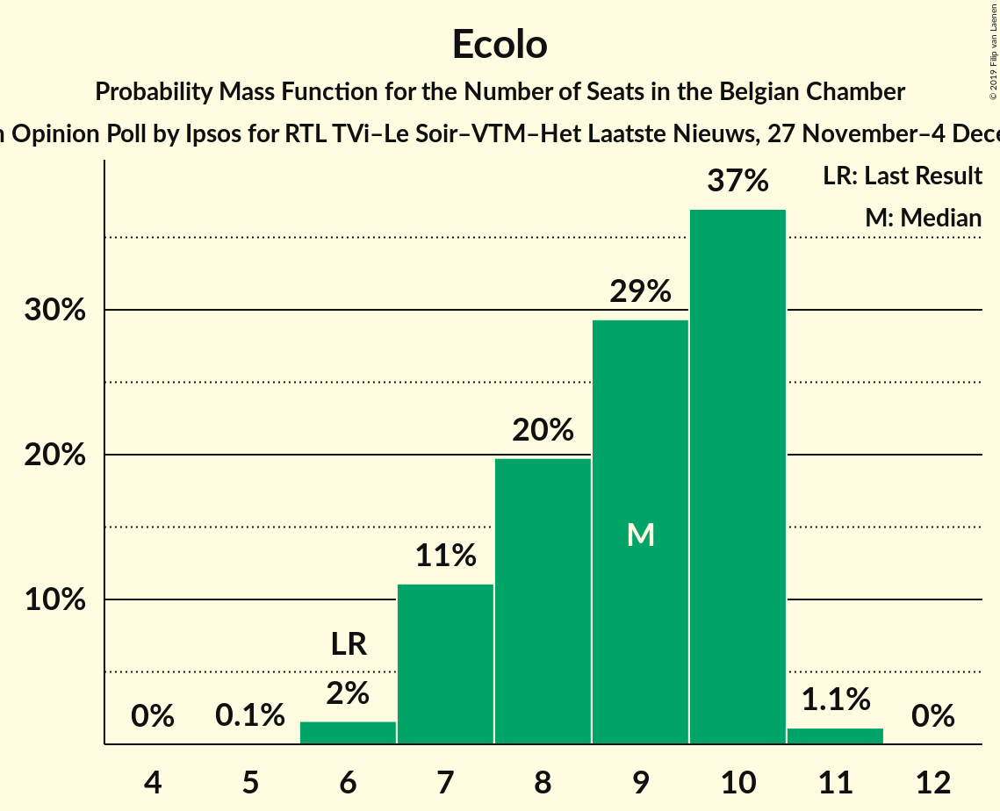
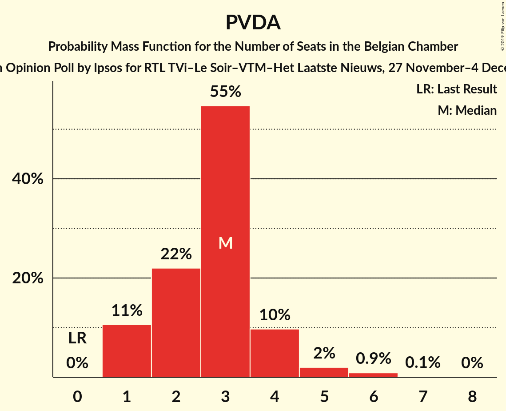

# Opinion Poll by Ipsos for RTL TVi–Le Soir–VTM–Het Laatste Nieuws, 27 November–4 December 2017

Areas included: Brussels, Flanders, Wallonia

<a href="#voting-intentions">Voting Intentions</a> | <a href="#seats">Seats</a> | <a href="#coalitions">Coalitions</a> | <a href="#technical-information">Technical Information</a>

## Voting Intentions

### Confidence Intervals

| Party | Last Result | Poll Result | 80% Confidence Interval | 90% Confidence Interval | 95% Confidence Interval | 99% Confidence Interval |
|:-----:|:-----------:|:-----------:|:-----------------------:|:-----------------------:|:-----------------------:|:-----------------------:|
| N-VA | 20.3% | 18.7% | 16.8–17.7% |16.6–17.7% |16.4–17.7% |16.0–17.7% |
| CD&V | 11.6% | 8.8% | 7.4–8.0% |7.2–8.1% |7.1–8.1% |6.8–8.1% |
| Groen | 5.3% | 8.1% | 7.3–8.8% |7.1–8.9% |6.9–8.9% |6.6–9.0% |
| MR | 9.6% | 8.0% | 7.0–7.4% |6.9–7.4% |6.9–7.4% |6.7–7.4% |
| Open Vld | 9.8% | 7.6% | 6.3–6.9% |6.2–6.9% |6.0–7.0% |5.8–7.0% |
| PS | 11.7% | 7.3% | 6.4–6.7% |6.3–6.7% |6.2–6.7% |6.0–6.8% |
| sp.a | 8.8% | 6.8% | 5.6–6.2% |5.4–6.2% |5.3–6.2% |5.0–6.2% |
| Vlaams Belang | 3.7% | 6.5% | 5.3–5.8% |5.1–5.9% |5.0–5.9% |4.8–5.9% |
| PTB | 2.0% | 6.4% | 5.5–5.9% |5.4–5.9% |5.3–5.9% |5.2–5.9% |
| Ecolo | 3.3% | 4.5% | 3.8–4.0% |3.7–4.0% |3.6–4.0% |3.5–4.1% |
| PVDA | 1.8% | 3.4% | 2.9–3.9% |2.7–4.0% |2.6–4.0% |2.4–4.1% |
| DéFI | 1.8% | 3.2% | 2.6–2.8% |2.5–2.8% |2.5–2.8% |2.4–2.8% |
| cdH | 5.0% | 2.9% | 2.3–2.6% |2.3–2.6% |2.2–2.6% |2.1–2.6% |
| Parti Populaire | 1.5% | 1.5% | 1.1–1.2% |1.0–1.2% |1.0–1.2% |0.9–1.2% |
| La Droite | 0.4% | 0.7% | 0.5–0.7% |0.5–0.7% |0.4–0.7% |0.4–0.7% |

*Note:* The poll result column reflects the actual value used in the calculations. Published results may vary slightly, and in addition be rounded to fewer digits.

## Seats

### Confidence Intervals

| Party | Last Result | Median | 80% Confidence Interval | 90% Confidence Interval | 95% Confidence Interval | 99% Confidence Interval |
|:-----:|:-----------:|:------:|:-----------------------:|:-----------------------:|:-----------------------:|:-----------------------:|
| <a href="#n-va">N-VA</a> | 33 | 32 | 31–32 |29–32 |26–32 |24–36 |
| <a href="#cd&v">CD&V</a> | 18 | 14 | 14 |14–15 |13–16 |11–18 |
| <a href="#groen">Groen</a> | 6 | 10 | 10–11 |10–11 |10–12 |10–16 |
| <a href="#mr">MR</a> | 20 | 16 | 15–19 |15–19 |15–20 |14–20 |
| <a href="#open-vld">Open Vld</a> | 14 | 10 | 10–11 |10–12 |10–12 |10–12 |
| <a href="#ps">PS</a> | 23 | 15 | 14–17 |13–17 |13–18 |12–18 |
| <a href="#sp.a">sp.a</a> | 13 | 9 | 9–11 |9–11 |9–11 |8–11 |
| <a href="#vlaams-belang">Vlaams Belang</a> | 3 | 11 | 8–11 |8–11 |8–11 |7–12 |
| <a href="#ptb">PTB</a> | 2 | 11 | 10–13 |10–13 |10–13 |9–14 |
| <a href="#ecolo">Ecolo</a> | 6 | 9 | 7–10 |7–10 |7–10 |6–11 |
| <a href="#pvda">PVDA</a> | 0 | 2 | 1–2 |1–3 |1–5 |1–6 |
| <a href="#défi">DéFI</a> | 2 | 6 | 3–6 |3–7 |3–7 |2–7 |
| <a href="#cdh">cdH</a> | 9 | 4 | 3–6 |3–6 |3–6 |2–7 |
| <a href="#parti-populaire">Parti Populaire</a> | 1 | 0 | 0–2 |0–2 |0–2 |0–2 |
| <a href="#la-droite">La Droite</a> | 0 | 0 | 0 |0 |0 |0 |

### N-VA

*For a full overview of the results for this party, see the [N-VA](party-n-va.html) page.*

| Number of Seats | Probability | Accumulated | Special Marks |
|:---------------:|:-----------:|:-----------:|:-------------:|
| 23 | 0.1% | 100% |  |
| 24 | 1.4% | 99.9% |  |
| 25 | 0.7% | 98% |  |
| 26 | 2% | 98% |  |
| 27 | 0.2% | 96% |  |
| 28 | 0.3% | 96% |  |
| 29 | 0.6% | 95% |  |
| 30 | 0.1% | 95% |  |
| 31 | 9% | 95% |  |
| 32 | 84% | 85% | Median |
| 33 | 0.5% | 1.4% | Last Result |
| 34 | 0.1% | 0.9% |  |
| 35 | 0.3% | 0.9% |  |
| 36 | 0.2% | 0.5% |  |
| 37 | 0.3% | 0.3% |  |
| 38 | 0% | 0% |  |

### CD&V

*For a full overview of the results for this party, see the [CD&V](party-cdv.html) page.*

| Number of Seats | Probability | Accumulated | Special Marks |
|:---------------:|:-----------:|:-----------:|:-------------:|
| 9 | 0.3% | 100% |  |
| 10 | 0.1% | 99.7% |  |
| 11 | 0.3% | 99.6% |  |
| 12 | 0.4% | 99.3% |  |
| 13 | 3% | 98.8% |  |
| 14 | 90% | 96% | Median |
| 15 | 2% | 5% |  |
| 16 | 2% | 3% |  |
| 17 | 0% | 2% |  |
| 18 | 2% | 2% | Last Result |
| 19 | 0% | 0% |  |

### Groen

*For a full overview of the results for this party, see the [Groen](party-groen.html) page.*

| Number of Seats | Probability | Accumulated | Special Marks |
|:---------------:|:-----------:|:-----------:|:-------------:|
| 6 | 0% | 100% | Last Result |
| 7 | 0% | 100% |  |
| 8 | 0% | 100% |  |
| 9 | 0% | 100% |  |
| 10 | 75% | 99.9% | Median |
| 11 | 20% | 25% |  |
| 12 | 4% | 5% |  |
| 13 | 0% | 1.3% |  |
| 14 | 0.4% | 1.3% |  |
| 15 | 0.1% | 0.9% |  |
| 16 | 0.6% | 0.8% |  |
| 17 | 0.2% | 0.2% |  |
| 18 | 0% | 0% |  |

### MR

*For a full overview of the results for this party, see the [MR](party-mr.html) page.*

| Number of Seats | Probability | Accumulated | Special Marks |
|:---------------:|:-----------:|:-----------:|:-------------:|
| 13 | 0.1% | 100% |  |
| 14 | 2% | 99.9% |  |
| 15 | 27% | 98% |  |
| 16 | 22% | 70% | Median |
| 17 | 19% | 48% |  |
| 18 | 15% | 29% |  |
| 19 | 10% | 14% |  |
| 20 | 3% | 4% | Last Result |
| 21 | 0.5% | 0.5% |  |
| 22 | 0% | 0% |  |

### Open Vld

*For a full overview of the results for this party, see the [Open Vld](party-openvld.html) page.*

| Number of Seats | Probability | Accumulated | Special Marks |
|:---------------:|:-----------:|:-----------:|:-------------:|
| 8 | 0.2% | 100% |  |
| 9 | 0% | 99.8% |  |
| 10 | 74% | 99.8% | Median |
| 11 | 20% | 26% |  |
| 12 | 5% | 6% |  |
| 13 | 0% | 0.3% |  |
| 14 | 0% | 0.3% | Last Result |
| 15 | 0% | 0.3% |  |
| 16 | 0.3% | 0.3% |  |
| 17 | 0% | 0% |  |

### PS

*For a full overview of the results for this party, see the [PS](party-ps.html) page.*

| Number of Seats | Probability | Accumulated | Special Marks |
|:---------------:|:-----------:|:-----------:|:-------------:|
| 11 | 0.2% | 100% |  |
| 12 | 2% | 99.8% |  |
| 13 | 3% | 98% |  |
| 14 | 6% | 95% |  |
| 15 | 48% | 89% | Median |
| 16 | 29% | 41% |  |
| 17 | 9% | 12% |  |
| 18 | 2% | 3% |  |
| 19 | 0.2% | 0.2% |  |
| 20 | 0% | 0% |  |
| 21 | 0% | 0% |  |
| 22 | 0% | 0% |  |
| 23 | 0% | 0% | Last Result |

### sp.a

*For a full overview of the results for this party, see the [sp.a](party-spa.html) page.*

| Number of Seats | Probability | Accumulated | Special Marks |
|:---------------:|:-----------:|:-----------:|:-------------:|
| 6 | 0.3% | 100% |  |
| 7 | 0% | 99.7% |  |
| 8 | 2% | 99.7% |  |
| 9 | 77% | 98% | Median |
| 10 | 0% | 21% |  |
| 11 | 21% | 21% |  |
| 12 | 0% | 0.2% |  |
| 13 | 0.2% | 0.2% | Last Result |
| 14 | 0% | 0% |  |

### Vlaams Belang

*For a full overview of the results for this party, see the [Vlaams Belang](party-vlaamsbelang.html) page.*

| Number of Seats | Probability | Accumulated | Special Marks |
|:---------------:|:-----------:|:-----------:|:-------------:|
| 3 | 0% | 100% | Last Result |
| 4 | 0% | 100% |  |
| 5 | 0% | 100% |  |
| 6 | 0.2% | 100% |  |
| 7 | 0.6% | 99.8% |  |
| 8 | 23% | 99.2% |  |
| 9 | 2% | 76% |  |
| 10 | 0% | 74% |  |
| 11 | 74% | 74% | Median |
| 12 | 0.6% | 0.6% |  |
| 13 | 0% | 0% |  |

### PTB

*For a full overview of the results for this party, see the [PTB](party-ptb.html) page.*

| Number of Seats | Probability | Accumulated | Special Marks |
|:---------------:|:-----------:|:-----------:|:-------------:|
| 2 | 0% | 100% | Last Result |
| 3 | 0% | 100% |  |
| 4 | 0% | 100% |  |
| 5 | 0% | 100% |  |
| 6 | 0% | 100% |  |
| 7 | 0% | 100% |  |
| 8 | 0% | 100% |  |
| 9 | 2% | 100% |  |
| 10 | 26% | 98% |  |
| 11 | 40% | 72% | Median |
| 12 | 22% | 33% |  |
| 13 | 8% | 10% |  |
| 14 | 2% | 2% |  |
| 15 | 0.2% | 0.2% |  |
| 16 | 0% | 0% |  |

### Ecolo

*For a full overview of the results for this party, see the [Ecolo](party-ecolo.html) page.*

| Number of Seats | Probability | Accumulated | Special Marks |
|:---------------:|:-----------:|:-----------:|:-------------:|
| 5 | 0.1% | 100% |  |
| 6 | 2% | 99.9% | Last Result |
| 7 | 11% | 98% |  |
| 8 | 20% | 87% |  |
| 9 | 29% | 67% | Median |
| 10 | 37% | 38% |  |
| 11 | 1.1% | 1.2% |  |
| 12 | 0% | 0% |  |

### PVDA

*For a full overview of the results for this party, see the [PVDA](party-pvda.html) page.*

| Number of Seats | Probability | Accumulated | Special Marks |
|:---------------:|:-----------:|:-----------:|:-------------:|
| 0 | 0% | 100% | Last Result |
| 1 | 21% | 100% |  |
| 2 | 72% | 79% | Median |
| 3 | 3% | 7% |  |
| 4 | 0.8% | 4% |  |
| 5 | 2% | 3% |  |
| 6 | 1.5% | 2% |  |
| 7 | 0.2% | 0.2% |  |
| 8 | 0% | 0% |  |

### DéFI

*For a full overview of the results for this party, see the [DéFI](party-défi.html) page.*

| Number of Seats | Probability | Accumulated | Special Marks |
|:---------------:|:-----------:|:-----------:|:-------------:|
| 2 | 2% | 100% | Last Result |
| 3 | 17% | 98% |  |
| 4 | 7% | 80% |  |
| 5 | 13% | 73% |  |
| 6 | 51% | 60% | Median |
| 7 | 8% | 9% |  |
| 8 | 0.3% | 0.3% |  |
| 9 | 0% | 0% |  |

### cdH

*For a full overview of the results for this party, see the [cdH](party-cdh.html) page.*

| Number of Seats | Probability | Accumulated | Special Marks |
|:---------------:|:-----------:|:-----------:|:-------------:|
| 2 | 0.5% | 100% |  |
| 3 | 15% | 99.5% |  |
| 4 | 40% | 85% | Median |
| 5 | 34% | 45% |  |
| 6 | 9% | 11% |  |
| 7 | 1.3% | 1.4% |  |
| 8 | 0.1% | 0.1% |  |
| 9 | 0% | 0% | Last Result |

### Parti Populaire

*For a full overview of the results for this party, see the [Parti Populaire](party-partipopulaire.html) page.*

| Number of Seats | Probability | Accumulated | Special Marks |
|:---------------:|:-----------:|:-----------:|:-------------:|
| 0 | 74% | 100% | Median |
| 1 | 12% | 26% | Last Result |
| 2 | 14% | 14% |  |
| 3 | 0% | 0% |  |

### La Droite

*For a full overview of the results for this party, see the [La Droite](party-ladroite.html) page.*

| Number of Seats | Probability | Accumulated | Special Marks |
|:---------------:|:-----------:|:-----------:|:-------------:|
| 0 | 99.9% | 100% | Last Result, Median |
| 1 | 0.1% | 0.1% |  |
| 2 | 0% | 0% |  |

## Coalitions

### Confidence Intervals

| Coalition | Last Result | Median | Majority? | 80% Confidence Interval | 90% Confidence Interval | 95% Confidence Interval | 99% Confidence Interval |
|:---------:|:-----------:|:------:|:---------:|:-----------------------:|:-----------------------:|:-----------------------:|:-----------------------:|
| CD&V – Groen – MR – Open Vld – PS – sp.a – Ecolo – cdH | 109 | 89 | 100% | 87–93 | 86–94 | 86–95 | 85–97 |
| CD&V – Groen – PS – sp.a – PTB – Ecolo – PVDA – cdH | 77 | 75 | 50% | 73–78 | 72–79 | 72–81 | 70–84 |
| N-VA – CD&V – MR – Open Vld – cdH | 94 | 77 | 79% | 75–80 | 74–80 | 72–81 | 69–83 |
| Groen – MR – Open Vld – PS – sp.a – Ecolo | 82 | 71 | 6% | 68–74 | 68–76 | 67–77 | 66–78 |
| N-VA – CD&V – MR – Open Vld | 85 | 73 | 7% | 71–75 | 70–76 | 68–76 | 65–78 |
| CD&V – MR – Open Vld – PS – sp.a – cdH | 97 | 70 | 2% | 67–73 | 67–74 | 66–75 | 65–76 |
| CD&V – Groen – MR – Open Vld – Ecolo – cdH | 73 | 64 | 0% | 62–67 | 62–68 | 61–69 | 60–72 |
| CD&V – Groen – PS – sp.a – Ecolo – cdH | 75 | 62 | 0% | 60–65 | 59–66 | 58–67 | 57–68 |
| Groen – PS – sp.a – PTB – Ecolo – PVDA – cdH | 59 | 61 | 0% | 59–64 | 58–65 | 58–67 | 57–69 |
| CD&V – MR – Open Vld – PS – cdH | 84 | 61 | 0% | 58–63 | 58–64 | 57–65 | 56–67 |
| Groen – PS – sp.a – PTB – Ecolo – PVDA | 50 | 57 | 0% | 55–60 | 54–61 | 53–63 | 52–65 |
| MR – Open Vld – PS – sp.a | 70 | 52 | 0% | 49–55 | 49–56 | 48–56 | 47–58 |
| CD&V – MR – Open Vld – cdH | 61 | 45 | 0% | 43–48 | 43–49 | 42–49 | 41–51 |
| CD&V – PS – sp.a – cdH | 63 | 43 | 0% | 41–45 | 40–46 | 40–47 | 38–48 |

### CD&V – Groen – MR – Open Vld – PS – sp.a – Ecolo – cdH

| Number of Seats | Probability | Accumulated | Special Marks |
|:---------------:|:-----------:|:-----------:|:-------------:|
| 83 | 0.1% | 100% |  |
| 84 | 0.3% | 99.9% |  |
| 85 | 1.2% | 99.6% |  |
| 86 | 6% | 98% |  |
| 87 | 15% | 93% | Median |
| 88 | 21% | 78% |  |
| 89 | 15% | 57% |  |
| 90 | 11% | 42% |  |
| 91 | 11% | 31% |  |
| 92 | 7% | 20% |  |
| 93 | 5% | 12% |  |
| 94 | 3% | 7% |  |
| 95 | 2% | 4% |  |
| 96 | 0.9% | 2% |  |
| 97 | 0.4% | 0.8% |  |
| 98 | 0.2% | 0.4% |  |
| 99 | 0.1% | 0.1% |  |
| 100 | 0% | 0% |  |
| 101 | 0% | 0% |  |
| 102 | 0% | 0% |  |
| 103 | 0% | 0% |  |
| 104 | 0% | 0% |  |
| 105 | 0% | 0% |  |
| 106 | 0% | 0% |  |
| 107 | 0% | 0% |  |
| 108 | 0% | 0% |  |
| 109 | 0% | 0% | Last Result |

### CD&V – Groen – PS – sp.a – PTB – Ecolo – PVDA – cdH

| Number of Seats | Probability | Accumulated | Special Marks |
|:---------------:|:-----------:|:-----------:|:-------------:|
| 69 | 0.1% | 100% |  |
| 70 | 0.4% | 99.9% |  |
| 71 | 2% | 99.5% |  |
| 72 | 4% | 98% |  |
| 73 | 8% | 93% |  |
| 74 | 14% | 85% | Median |
| 75 | 21% | 71% |  |
| 76 | 21% | 50% | Majority |
| 77 | 13% | 29% | Last Result |
| 78 | 8% | 15% |  |
| 79 | 4% | 8% |  |
| 80 | 2% | 4% |  |
| 81 | 0.7% | 3% |  |
| 82 | 0.6% | 2% |  |
| 83 | 0.6% | 1.3% |  |
| 84 | 0.5% | 0.8% |  |
| 85 | 0.2% | 0.3% |  |
| 86 | 0.1% | 0.1% |  |
| 87 | 0% | 0% |  |

### N-VA – CD&V – MR – Open Vld – cdH

| Number of Seats | Probability | Accumulated | Special Marks |
|:---------------:|:-----------:|:-----------:|:-------------:|
| 68 | 0.1% | 100% |  |
| 69 | 0.3% | 99.8% |  |
| 70 | 0.6% | 99.5% |  |
| 71 | 0.9% | 98.9% |  |
| 72 | 1.0% | 98% |  |
| 73 | 1.4% | 97% |  |
| 74 | 5% | 96% |  |
| 75 | 12% | 91% |  |
| 76 | 18% | 79% | Median, Majority |
| 77 | 20% | 61% |  |
| 78 | 17% | 41% |  |
| 79 | 13% | 24% |  |
| 80 | 8% | 12% |  |
| 81 | 3% | 4% |  |
| 82 | 0.7% | 1.2% |  |
| 83 | 0.3% | 0.5% |  |
| 84 | 0.2% | 0.2% |  |
| 85 | 0% | 0% |  |
| 86 | 0% | 0% |  |
| 87 | 0% | 0% |  |
| 88 | 0% | 0% |  |
| 89 | 0% | 0% |  |
| 90 | 0% | 0% |  |
| 91 | 0% | 0% |  |
| 92 | 0% | 0% |  |
| 93 | 0% | 0% |  |
| 94 | 0% | 0% | Last Result |

### Groen – MR – Open Vld – PS – sp.a – Ecolo

| Number of Seats | Probability | Accumulated | Special Marks |
|:---------------:|:-----------:|:-----------:|:-------------:|
| 65 | 0.1% | 100% |  |
| 66 | 0.6% | 99.9% |  |
| 67 | 3% | 99.2% |  |
| 68 | 9% | 96% |  |
| 69 | 18% | 86% | Median |
| 70 | 18% | 68% |  |
| 71 | 13% | 50% |  |
| 72 | 12% | 37% |  |
| 73 | 9% | 25% |  |
| 74 | 6% | 16% |  |
| 75 | 4% | 10% |  |
| 76 | 3% | 6% | Majority |
| 77 | 2% | 3% |  |
| 78 | 0.7% | 1.2% |  |
| 79 | 0.3% | 0.5% |  |
| 80 | 0.1% | 0.2% |  |
| 81 | 0.1% | 0.1% |  |
| 82 | 0% | 0% | Last Result |

### N-VA – CD&V – MR – Open Vld

| Number of Seats | Probability | Accumulated | Special Marks |
|:---------------:|:-----------:|:-----------:|:-------------:|
| 64 | 0.2% | 100% |  |
| 65 | 0.3% | 99.8% |  |
| 66 | 1.1% | 99.5% |  |
| 67 | 0.9% | 98% |  |
| 68 | 0.9% | 98% |  |
| 69 | 0.9% | 97% |  |
| 70 | 3% | 96% |  |
| 71 | 21% | 92% |  |
| 72 | 21% | 71% | Median |
| 73 | 18% | 50% |  |
| 74 | 15% | 32% |  |
| 75 | 10% | 17% |  |
| 76 | 5% | 7% | Majority |
| 77 | 1.5% | 2% |  |
| 78 | 0.5% | 0.8% |  |
| 79 | 0.2% | 0.3% |  |
| 80 | 0.1% | 0.1% |  |
| 81 | 0% | 0% |  |
| 82 | 0% | 0% |  |
| 83 | 0% | 0% |  |
| 84 | 0% | 0% |  |
| 85 | 0% | 0% | Last Result |

### CD&V – MR – Open Vld – PS – sp.a – cdH

| Number of Seats | Probability | Accumulated | Special Marks |
|:---------------:|:-----------:|:-----------:|:-------------:|
| 63 | 0% | 100% |  |
| 64 | 0.1% | 99.9% |  |
| 65 | 0.5% | 99.8% |  |
| 66 | 2% | 99.3% |  |
| 67 | 8% | 97% |  |
| 68 | 14% | 89% | Median |
| 69 | 17% | 75% |  |
| 70 | 16% | 58% |  |
| 71 | 16% | 42% |  |
| 72 | 11% | 26% |  |
| 73 | 6% | 15% |  |
| 74 | 4% | 8% |  |
| 75 | 2% | 4% |  |
| 76 | 1.0% | 2% | Majority |
| 77 | 0.4% | 0.5% |  |
| 78 | 0.1% | 0.1% |  |
| 79 | 0% | 0% |  |
| 80 | 0% | 0% |  |
| 81 | 0% | 0% |  |
| 82 | 0% | 0% |  |
| 83 | 0% | 0% |  |
| 84 | 0% | 0% |  |
| 85 | 0% | 0% |  |
| 86 | 0% | 0% |  |
| 87 | 0% | 0% |  |
| 88 | 0% | 0% |  |
| 89 | 0% | 0% |  |
| 90 | 0% | 0% |  |
| 91 | 0% | 0% |  |
| 92 | 0% | 0% |  |
| 93 | 0% | 0% |  |
| 94 | 0% | 0% |  |
| 95 | 0% | 0% |  |
| 96 | 0% | 0% |  |
| 97 | 0% | 0% | Last Result |

### CD&V – Groen – MR – Open Vld – Ecolo – cdH

| Number of Seats | Probability | Accumulated | Special Marks |
|:---------------:|:-----------:|:-----------:|:-------------:|
| 59 | 0.1% | 100% |  |
| 60 | 0.5% | 99.9% |  |
| 61 | 3% | 99.4% |  |
| 62 | 10% | 96% |  |
| 63 | 18% | 87% | Median |
| 64 | 20% | 69% |  |
| 65 | 17% | 49% |  |
| 66 | 15% | 32% |  |
| 67 | 8% | 17% |  |
| 68 | 4% | 9% |  |
| 69 | 2% | 4% |  |
| 70 | 0.9% | 2% |  |
| 71 | 0.6% | 1.2% |  |
| 72 | 0.3% | 0.7% |  |
| 73 | 0.2% | 0.3% | Last Result |
| 74 | 0.1% | 0.2% |  |
| 75 | 0.1% | 0.1% |  |
| 76 | 0% | 0% | Majority |

### CD&V – Groen – PS – sp.a – Ecolo – cdH

| Number of Seats | Probability | Accumulated | Special Marks |
|:---------------:|:-----------:|:-----------:|:-------------:|
| 55 | 0% | 100% |  |
| 56 | 0.2% | 99.9% |  |
| 57 | 0.6% | 99.8% |  |
| 58 | 2% | 99.2% |  |
| 59 | 4% | 97% |  |
| 60 | 8% | 93% |  |
| 61 | 15% | 85% | Median |
| 62 | 24% | 70% |  |
| 63 | 20% | 46% |  |
| 64 | 9% | 26% |  |
| 65 | 8% | 17% |  |
| 66 | 6% | 9% |  |
| 67 | 2% | 3% |  |
| 68 | 0.8% | 1.3% |  |
| 69 | 0.3% | 0.5% |  |
| 70 | 0.1% | 0.2% |  |
| 71 | 0% | 0% |  |
| 72 | 0% | 0% |  |
| 73 | 0% | 0% |  |
| 74 | 0% | 0% |  |
| 75 | 0% | 0% | Last Result |

### Groen – PS – sp.a – PTB – Ecolo – PVDA – cdH

| Number of Seats | Probability | Accumulated | Special Marks |
|:---------------:|:-----------:|:-----------:|:-------------:|
| 55 | 0.1% | 100% |  |
| 56 | 0.4% | 99.9% |  |
| 57 | 2% | 99.5% |  |
| 58 | 4% | 98% |  |
| 59 | 9% | 93% | Last Result |
| 60 | 15% | 85% | Median |
| 61 | 21% | 70% |  |
| 62 | 22% | 49% |  |
| 63 | 13% | 27% |  |
| 64 | 7% | 14% |  |
| 65 | 3% | 7% |  |
| 66 | 1.3% | 4% |  |
| 67 | 1.1% | 3% |  |
| 68 | 0.9% | 2% |  |
| 69 | 0.7% | 1.1% |  |
| 70 | 0.3% | 0.4% |  |
| 71 | 0.1% | 0.1% |  |
| 72 | 0% | 0.1% |  |
| 73 | 0% | 0% |  |

### CD&V – MR – Open Vld – PS – cdH

| Number of Seats | Probability | Accumulated | Special Marks |
|:---------------:|:-----------:|:-----------:|:-------------:|
| 55 | 0.1% | 100% |  |
| 56 | 0.5% | 99.8% |  |
| 57 | 2% | 99.4% |  |
| 58 | 8% | 97% |  |
| 59 | 16% | 89% | Median |
| 60 | 20% | 73% |  |
| 61 | 18% | 53% |  |
| 62 | 17% | 35% |  |
| 63 | 11% | 18% |  |
| 64 | 5% | 8% |  |
| 65 | 2% | 3% |  |
| 66 | 0.6% | 1.2% |  |
| 67 | 0.4% | 0.6% |  |
| 68 | 0.2% | 0.2% |  |
| 69 | 0% | 0.1% |  |
| 70 | 0% | 0% |  |
| 71 | 0% | 0% |  |
| 72 | 0% | 0% |  |
| 73 | 0% | 0% |  |
| 74 | 0% | 0% |  |
| 75 | 0% | 0% |  |
| 76 | 0% | 0% | Majority |
| 77 | 0% | 0% |  |
| 78 | 0% | 0% |  |
| 79 | 0% | 0% |  |
| 80 | 0% | 0% |  |
| 81 | 0% | 0% |  |
| 82 | 0% | 0% |  |
| 83 | 0% | 0% |  |
| 84 | 0% | 0% | Last Result |

### Groen – PS – sp.a – PTB – Ecolo – PVDA

| Number of Seats | Probability | Accumulated | Special Marks |
|:---------------:|:-----------:|:-----------:|:-------------:|
| 50 | 0% | 100% | Last Result |
| 51 | 0.1% | 100% |  |
| 52 | 0.5% | 99.9% |  |
| 53 | 3% | 99.3% |  |
| 54 | 6% | 97% |  |
| 55 | 12% | 90% |  |
| 56 | 19% | 78% | Median |
| 57 | 20% | 59% |  |
| 58 | 17% | 39% |  |
| 59 | 11% | 22% |  |
| 60 | 5% | 12% |  |
| 61 | 3% | 6% |  |
| 62 | 1.3% | 4% |  |
| 63 | 1.0% | 3% |  |
| 64 | 0.8% | 2% |  |
| 65 | 0.5% | 0.8% |  |
| 66 | 0.2% | 0.4% |  |
| 67 | 0.1% | 0.1% |  |
| 68 | 0% | 0% |  |

### MR – Open Vld – PS – sp.a

| Number of Seats | Probability | Accumulated | Special Marks |
|:---------------:|:-----------:|:-----------:|:-------------:|
| 47 | 0.5% | 100% |  |
| 48 | 2% | 99.5% |  |
| 49 | 13% | 97% |  |
| 50 | 17% | 84% | Median |
| 51 | 15% | 66% |  |
| 52 | 17% | 51% |  |
| 53 | 15% | 34% |  |
| 54 | 9% | 19% |  |
| 55 | 5% | 11% |  |
| 56 | 3% | 5% |  |
| 57 | 1.5% | 2% |  |
| 58 | 0.5% | 0.7% |  |
| 59 | 0.1% | 0.2% |  |
| 60 | 0% | 0% |  |
| 61 | 0% | 0% |  |
| 62 | 0% | 0% |  |
| 63 | 0% | 0% |  |
| 64 | 0% | 0% |  |
| 65 | 0% | 0% |  |
| 66 | 0% | 0% |  |
| 67 | 0% | 0% |  |
| 68 | 0% | 0% |  |
| 69 | 0% | 0% |  |
| 70 | 0% | 0% | Last Result |

### CD&V – MR – Open Vld – cdH

| Number of Seats | Probability | Accumulated | Special Marks |
|:---------------:|:-----------:|:-----------:|:-------------:|
| 39 | 0.1% | 100% |  |
| 40 | 0.1% | 99.9% |  |
| 41 | 0.6% | 99.8% |  |
| 42 | 4% | 99.2% |  |
| 43 | 11% | 95% |  |
| 44 | 18% | 84% | Median |
| 45 | 21% | 66% |  |
| 46 | 18% | 46% |  |
| 47 | 14% | 28% |  |
| 48 | 9% | 14% |  |
| 49 | 3% | 5% |  |
| 50 | 1.0% | 2% |  |
| 51 | 0.5% | 0.9% |  |
| 52 | 0.3% | 0.4% |  |
| 53 | 0.1% | 0.2% |  |
| 54 | 0% | 0% |  |
| 55 | 0% | 0% |  |
| 56 | 0% | 0% |  |
| 57 | 0% | 0% |  |
| 58 | 0% | 0% |  |
| 59 | 0% | 0% |  |
| 60 | 0% | 0% |  |
| 61 | 0% | 0% | Last Result |

### CD&V – PS – sp.a – cdH

| Number of Seats | Probability | Accumulated | Special Marks |
|:---------------:|:-----------:|:-----------:|:-------------:|
| 36 | 0% | 100% |  |
| 37 | 0.2% | 99.9% |  |
| 38 | 0.5% | 99.8% |  |
| 39 | 1.4% | 99.2% |  |
| 40 | 3% | 98% |  |
| 41 | 7% | 95% |  |
| 42 | 19% | 88% | Median |
| 43 | 29% | 69% |  |
| 44 | 20% | 40% |  |
| 45 | 12% | 21% |  |
| 46 | 6% | 8% |  |
| 47 | 2% | 3% |  |
| 48 | 0.6% | 0.7% |  |
| 49 | 0.1% | 0.1% |  |
| 50 | 0% | 0% |  |
| 51 | 0% | 0% |  |
| 52 | 0% | 0% |  |
| 53 | 0% | 0% |  |
| 54 | 0% | 0% |  |
| 55 | 0% | 0% |  |
| 56 | 0% | 0% |  |
| 57 | 0% | 0% |  |
| 58 | 0% | 0% |  |
| 59 | 0% | 0% |  |
| 60 | 0% | 0% |  |
| 61 | 0% | 0% |  |
| 62 | 0% | 0% |  |
| 63 | 0% | 0% | Last Result |

## Technical Information

### Opinion Poll

+ **Polling firm:** Ipsos
+ **Commissioner(s):** RTL TVi–Le Soir–VTM–Het Laatste Nieuws
+ **Fieldwork period:** 27 November–4 December 2017

### Calculations

+ **Sample size:** 1610
+ **Simulations done:** 1,024
+ **Error estimate:** 1.65%

