# Opinion Poll by Ipsos for RTL TVi–Le Soir–VTM–Het Laatste Nieuws, 27 February–6 March 2018

Areas included: Brussels, Flanders, Wallonia

<a href="#voting-intentions">Voting Intentions</a> | <a href="#seats">Seats</a> | <a href="#coalitions">Coalitions</a> | <a href="#technical-information">Technical Information</a>

## Voting Intentions

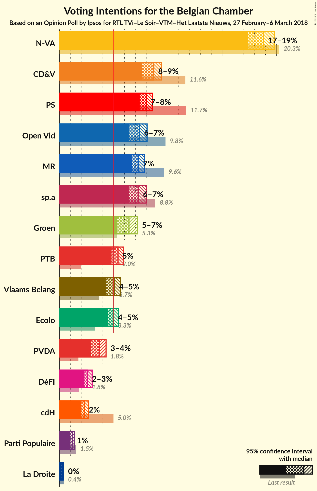

### Confidence Intervals

| Party | Last Result | Poll Result | 80% Confidence Interval | 90% Confidence Interval | 95% Confidence Interval | 99% Confidence Interval |
|:-----:|:-----------:|:-----------:|:-----------------------:|:-----------------------:|:-----------------------:|:-----------------------:|
| N-VA | 20.3% | 19.8% | 17.8–18.7% |17.6–18.8% |17.4–18.8% |16.9–18.8% |
| CD&V | 11.6% | 9.4% | 8.0–8.6% |7.8–8.7% |7.6–8.7% |7.3–8.7% |
| PS | 11.7% | 8.6% | 7.6–8.0% |7.5–8.0% |7.4–8.0% |7.2–8.0% |
| Open Vld | 9.8% | 8.1% | 6.7–7.4% |6.6–7.4% |6.4–7.4% |6.1–7.4% |
| sp.a | 8.8% | 8.0% | 6.7–7.3% |6.5–7.3% |6.4–7.3% |6.1–7.3% |
| MR | 9.6% | 7.8% | 6.9–7.2% |6.8–7.3% |6.7–7.3% |6.5–7.3% |
| Groen | 5.3% | 6.4% | 5.7–7.0% |5.5–7.1% |5.3–7.2% |5.0–7.2% |
| PTB | 2.0% | 5.9% | 5.0–5.3% |4.9–5.4% |4.8–5.4% |4.7–5.4% |
| Vlaams Belang | 3.7% | 5.6% | 4.5–5.0% |4.4–5.1% |4.3–5.1% |4.0–5.1% |
| Ecolo | 3.3% | 5.4% | 4.6–4.9% |4.5–5.0% |4.5–5.0% |4.3–5.0% |
| PVDA | 1.8% | 3.7% | 3.2–4.2% |3.0–4.3% |2.9–4.3% |2.6–4.4% |
| DéFI | 1.8% | 3.0% | 2.4–2.6% |2.4–2.6% |2.3–2.6% |2.2–2.7% |
| cdH | 5.0% | 2.7% | 2.1–2.3% |2.0–2.3% |2.0–2.3% |1.9–2.3% |
| Parti Populaire | 1.5% | 1.4% | 1.0–1.2% |1.0–1.2% |1.0–1.2% |0.9–1.2% |
| La Droite | 0.4% | 0.3% | 0.2–0.4% |0.2–0.4% |0.2–0.4% |0.1–0.4% |

*Note:* The poll result column reflects the actual value used in the calculations. Published results may vary slightly, and in addition be rounded to fewer digits.

## Seats

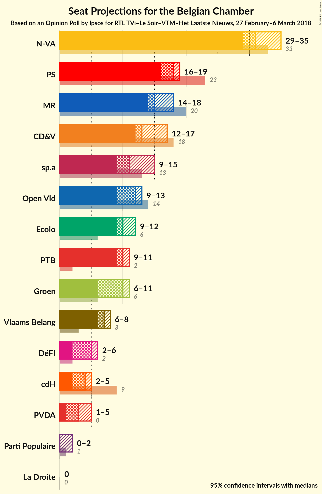

### Confidence Intervals

| Party | Last Result | Median | 80% Confidence Interval | 90% Confidence Interval | 95% Confidence Interval | 99% Confidence Interval |
|:-----:|:-----------:|:------:|:-----------------------:|:-----------------------:|:-----------------------:|:-----------------------:|
| <a href="#n-va">N-VA</a> | 33 | 31 | 29–34 |29–35 |29–35 |28–36 |
| <a href="#cd&v">CD&V</a> | 18 | 13 | 13–15 |13–16 |12–17 |11–18 |
| <a href="#ps">PS</a> | 23 | 18 | 16–19 |16–19 |15–19 |15–20 |
| <a href="#open-vld">Open Vld</a> | 14 | 12 | 11–12 |10–13 |9–13 |8–15 |
| <a href="#sp.a">sp.a</a> | 13 | 11 | 10–13 |9–14 |9–15 |9–15 |
| <a href="#mr">MR</a> | 20 | 15 | 14–17 |14–17 |14–18 |14–18 |
| <a href="#groen">Groen</a> | 6 | 10 | 7–10 |6–11 |6–11 |6–12 |
| <a href="#ptb">PTB</a> | 2 | 10 | 9–11 |9–11 |9–11 |8–12 |
| <a href="#vlaams-belang">Vlaams Belang</a> | 3 | 7 | 7–8 |6–8 |6–8 |5–9 |
| <a href="#ecolo">Ecolo</a> | 6 | 10 | 10–11 |10–11 |9–12 |9–13 |
| <a href="#pvda">PVDA</a> | 0 | 3 | 2–4 |2–5 |1–5 |1–6 |
| <a href="#défi">DéFI</a> | 2 | 5 | 3–6 |2–6 |2–6 |2–6 |
| <a href="#cdh">cdH</a> | 9 | 4 | 3–4 |3–5 |2–5 |2–5 |
| <a href="#parti-populaire">Parti Populaire</a> | 1 | 0 | 0–1 |0–1 |0–2 |0–2 |
| <a href="#la-droite">La Droite</a> | 0 | 0 | 0 |0 |0 |0 |

### N-VA

*For a full overview of the results for this party, see the [N-VA](party-n-va.html) page.*

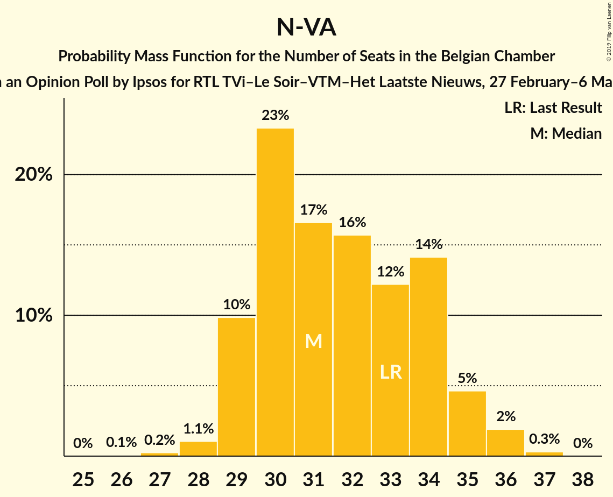

| Number of Seats | Probability | Accumulated | Special Marks |
|:---------------:|:-----------:|:-----------:|:-------------:|
| 26 | 0.1% | 100% |  |
| 27 | 0.2% | 99.9% |  |
| 28 | 1.1% | 99.7% |  |
| 29 | 10% | 98.6% |  |
| 30 | 23% | 89% |  |
| 31 | 17% | 65% | Median |
| 32 | 16% | 49% |  |
| 33 | 12% | 33% | Last Result |
| 34 | 14% | 21% |  |
| 35 | 5% | 7% |  |
| 36 | 2% | 2% |  |
| 37 | 0.3% | 0.3% |  |
| 38 | 0% | 0% |  |

### CD&V

*For a full overview of the results for this party, see the [CD&V](party-cdv.html) page.*

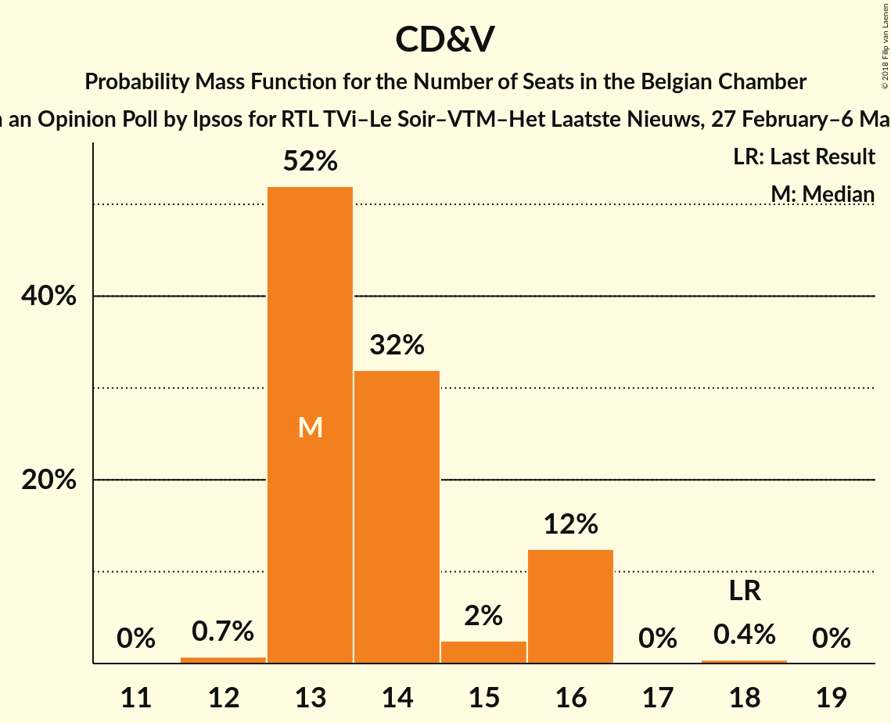

| Number of Seats | Probability | Accumulated | Special Marks |
|:---------------:|:-----------:|:-----------:|:-------------:|
| 10 | 0.2% | 100% |  |
| 11 | 1.5% | 99.7% |  |
| 12 | 2% | 98% |  |
| 13 | 47% | 96% | Median |
| 14 | 31% | 48% |  |
| 15 | 10% | 17% |  |
| 16 | 4% | 7% |  |
| 17 | 2% | 4% |  |
| 18 | 2% | 2% | Last Result |
| 19 | 0% | 0% |  |

### PS

*For a full overview of the results for this party, see the [PS](party-ps.html) page.*

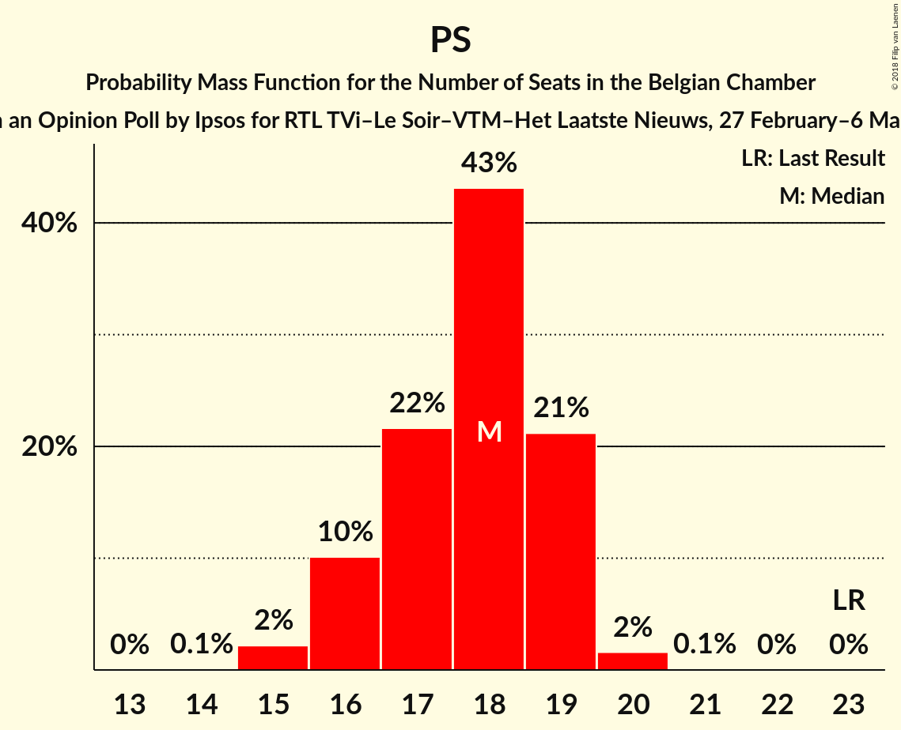

| Number of Seats | Probability | Accumulated | Special Marks |
|:---------------:|:-----------:|:-----------:|:-------------:|
| 14 | 0.2% | 100% |  |
| 15 | 2% | 99.8% |  |
| 16 | 11% | 97% |  |
| 17 | 23% | 87% |  |
| 18 | 42% | 64% | Median |
| 19 | 20% | 22% |  |
| 20 | 2% | 2% |  |
| 21 | 0.1% | 0.1% |  |
| 22 | 0% | 0% |  |
| 23 | 0% | 0% | Last Result |

### Open Vld

*For a full overview of the results for this party, see the [Open Vld](party-openvld.html) page.*

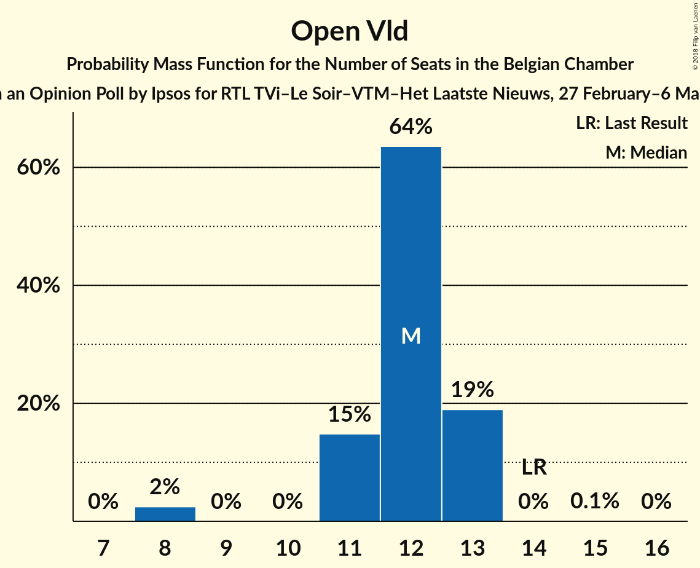

| Number of Seats | Probability | Accumulated | Special Marks |
|:---------------:|:-----------:|:-----------:|:-------------:|
| 8 | 1.1% | 100% |  |
| 9 | 2% | 98.9% |  |
| 10 | 7% | 97% |  |
| 11 | 34% | 90% |  |
| 12 | 46% | 56% | Median |
| 13 | 7% | 10% |  |
| 14 | 1.5% | 2% | Last Result |
| 15 | 0.4% | 0.6% |  |
| 16 | 0.1% | 0.1% |  |
| 17 | 0% | 0% |  |

### sp.a

*For a full overview of the results for this party, see the [sp.a](party-spa.html) page.*

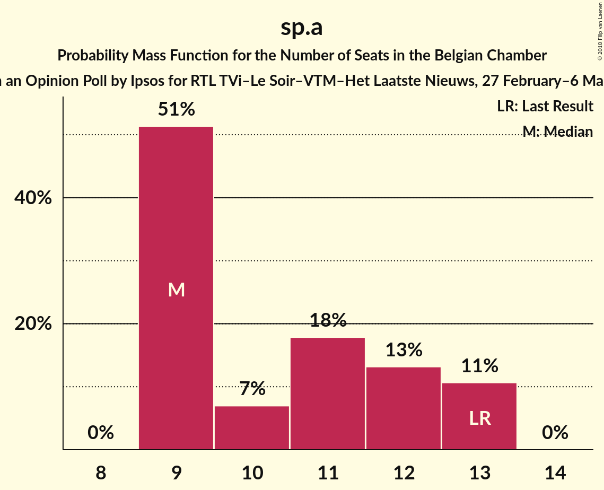

| Number of Seats | Probability | Accumulated | Special Marks |
|:---------------:|:-----------:|:-----------:|:-------------:|
| 8 | 0.1% | 100% |  |
| 9 | 5% | 99.9% |  |
| 10 | 9% | 94% |  |
| 11 | 39% | 86% | Median |
| 12 | 18% | 46% |  |
| 13 | 19% | 28% | Last Result |
| 14 | 5% | 9% |  |
| 15 | 3% | 3% |  |
| 16 | 0% | 0% |  |

### MR

*For a full overview of the results for this party, see the [MR](party-mr.html) page.*

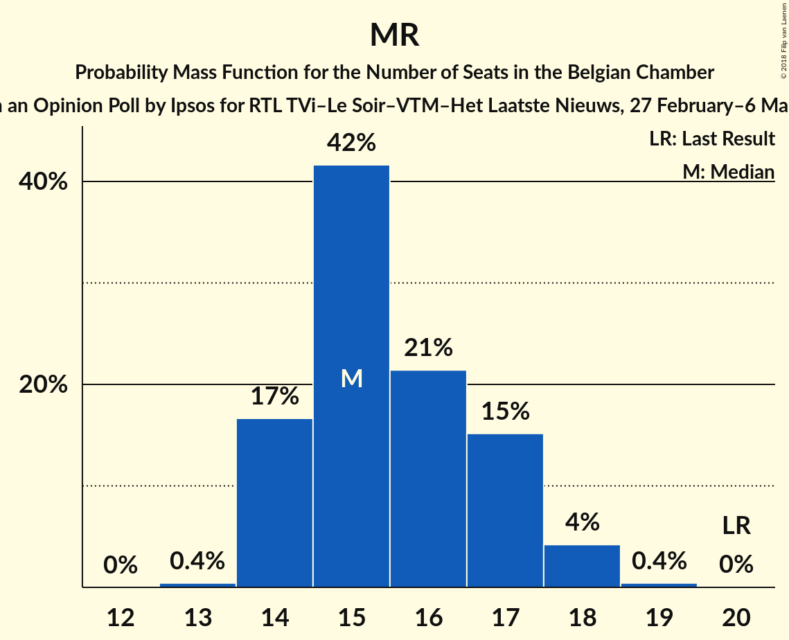

| Number of Seats | Probability | Accumulated | Special Marks |
|:---------------:|:-----------:|:-----------:|:-------------:|
| 13 | 0.4% | 100% |  |
| 14 | 17% | 99.5% |  |
| 15 | 42% | 82% | Median |
| 16 | 21% | 40% |  |
| 17 | 15% | 19% |  |
| 18 | 4% | 4% |  |
| 19 | 0.4% | 0.4% |  |
| 20 | 0% | 0% | Last Result |

### Groen

*For a full overview of the results for this party, see the [Groen](party-groen.html) page.*

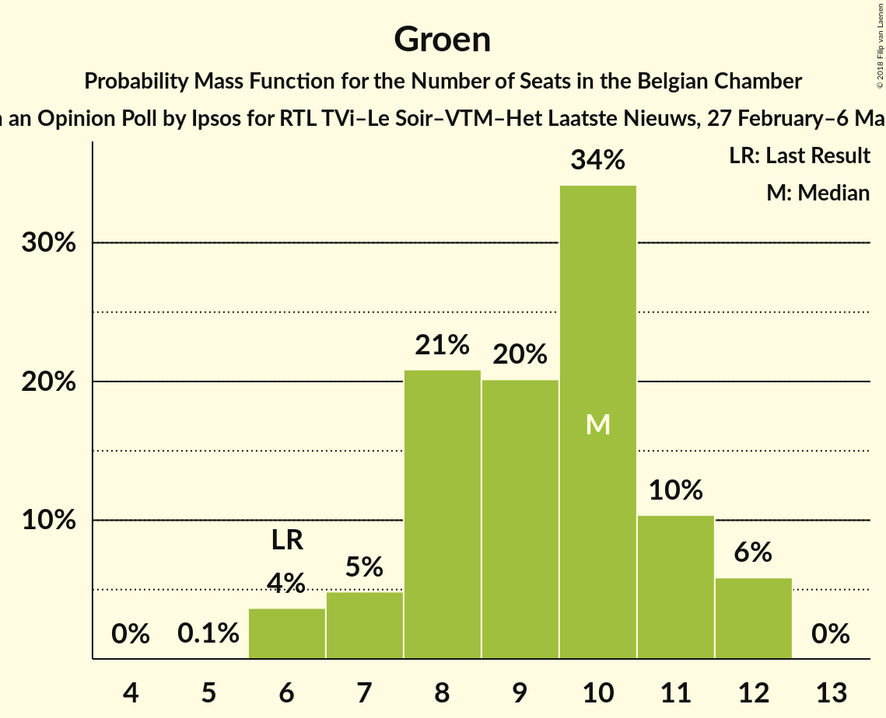

| Number of Seats | Probability | Accumulated | Special Marks |
|:---------------:|:-----------:|:-----------:|:-------------:|
| 5 | 0.3% | 100% |  |
| 6 | 5% | 99.7% | Last Result |
| 7 | 18% | 95% |  |
| 8 | 10% | 77% |  |
| 9 | 16% | 66% |  |
| 10 | 40% | 50% | Median |
| 11 | 9% | 10% |  |
| 12 | 0.7% | 0.7% |  |
| 13 | 0% | 0% |  |

### PTB

*For a full overview of the results for this party, see the [PTB](party-ptb.html) page.*

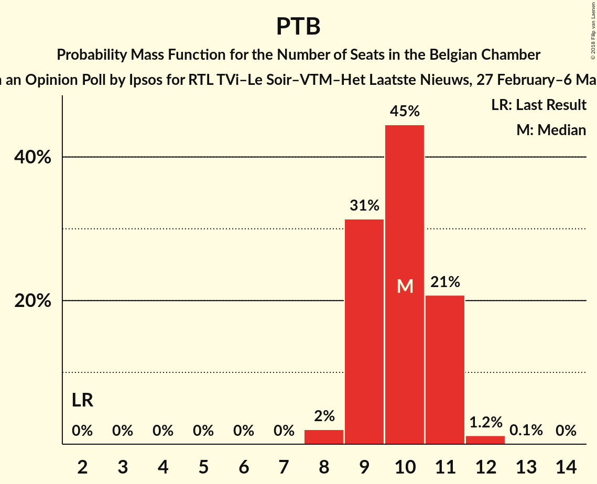

| Number of Seats | Probability | Accumulated | Special Marks |
|:---------------:|:-----------:|:-----------:|:-------------:|
| 2 | 0% | 100% | Last Result |
| 3 | 0% | 100% |  |
| 4 | 0% | 100% |  |
| 5 | 0% | 100% |  |
| 6 | 0% | 100% |  |
| 7 | 0% | 100% |  |
| 8 | 2% | 100% |  |
| 9 | 31% | 98% |  |
| 10 | 45% | 67% | Median |
| 11 | 21% | 22% |  |
| 12 | 1.2% | 1.3% |  |
| 13 | 0.1% | 0.1% |  |
| 14 | 0% | 0% |  |

### Vlaams Belang

*For a full overview of the results for this party, see the [Vlaams Belang](party-vlaamsbelang.html) page.*

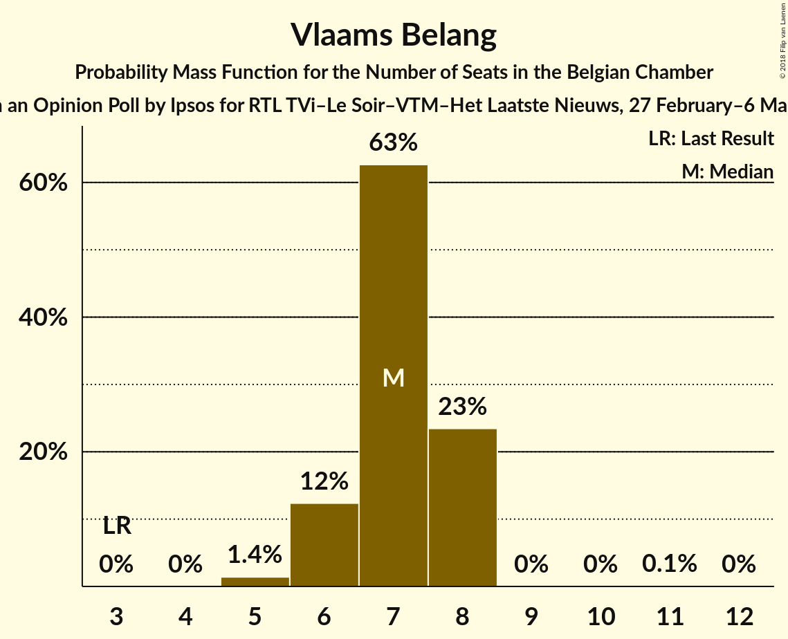

| Number of Seats | Probability | Accumulated | Special Marks |
|:---------------:|:-----------:|:-----------:|:-------------:|
| 3 | 0% | 100% | Last Result |
| 4 | 0% | 100% |  |
| 5 | 0.9% | 100% |  |
| 6 | 6% | 99.1% |  |
| 7 | 58% | 93% | Median |
| 8 | 34% | 35% |  |
| 9 | 0.6% | 1.1% |  |
| 10 | 0.3% | 0.5% |  |
| 11 | 0.2% | 0.2% |  |
| 12 | 0% | 0% |  |

### Ecolo

*For a full overview of the results for this party, see the [Ecolo](party-ecolo.html) page.*

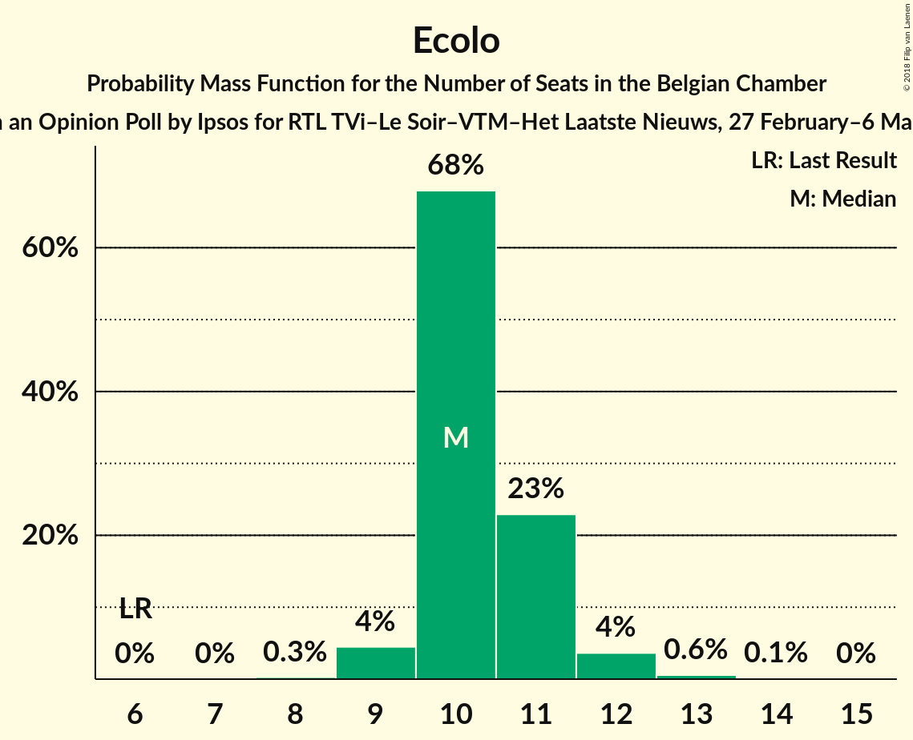

| Number of Seats | Probability | Accumulated | Special Marks |
|:---------------:|:-----------:|:-----------:|:-------------:|
| 6 | 0% | 100% | Last Result |
| 7 | 0% | 100% |  |
| 8 | 0.3% | 100% |  |
| 9 | 4% | 99.7% |  |
| 10 | 68% | 95% | Median |
| 11 | 23% | 27% |  |
| 12 | 4% | 4% |  |
| 13 | 0.6% | 0.7% |  |
| 14 | 0.1% | 0.2% |  |
| 15 | 0% | 0% |  |

### PVDA

*For a full overview of the results for this party, see the [PVDA](party-pvda.html) page.*

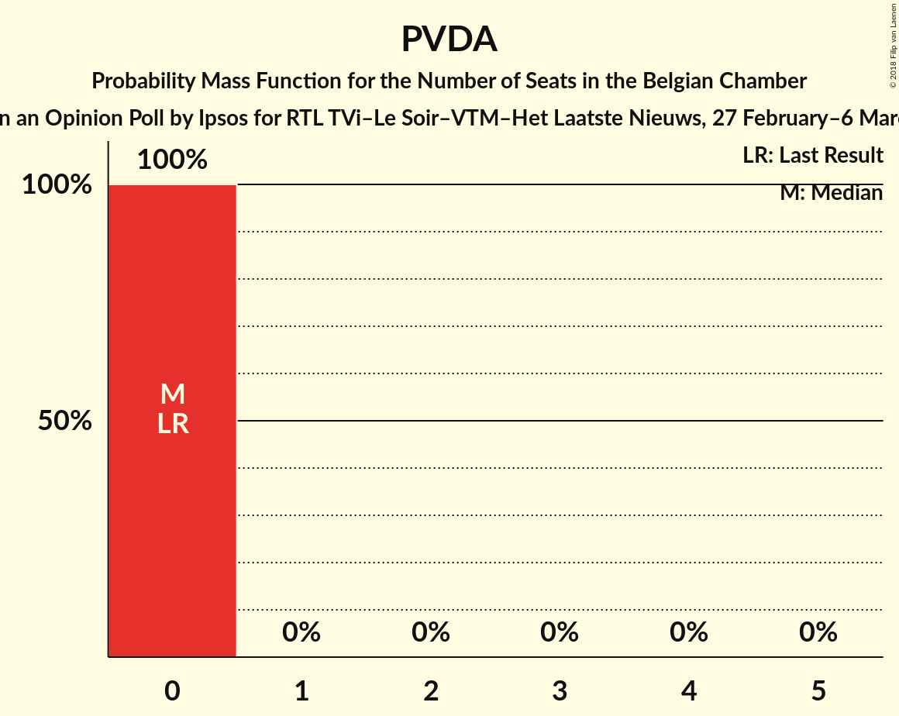

| Number of Seats | Probability | Accumulated | Special Marks |
|:---------------:|:-----------:|:-----------:|:-------------:|
| 0 | 0% | 100% | Last Result |
| 1 | 3% | 100% |  |
| 2 | 12% | 97% |  |
| 3 | 68% | 85% | Median |
| 4 | 8% | 17% |  |
| 5 | 6% | 9% |  |
| 6 | 2% | 2% |  |
| 7 | 0.3% | 0.3% |  |
| 8 | 0% | 0% |  |

### DéFI

*For a full overview of the results for this party, see the [DéFI](party-défi.html) page.*

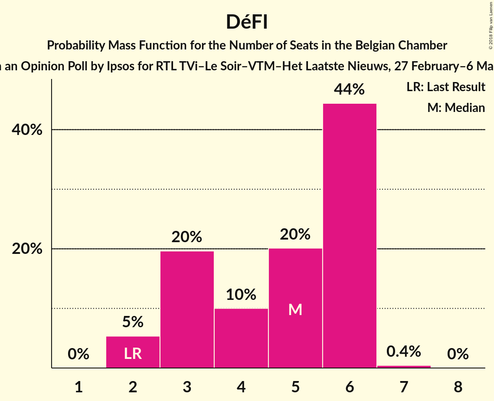

| Number of Seats | Probability | Accumulated | Special Marks |
|:---------------:|:-----------:|:-----------:|:-------------:|
| 2 | 5% | 100% | Last Result |
| 3 | 20% | 95% |  |
| 4 | 10% | 75% |  |
| 5 | 20% | 65% | Median |
| 6 | 44% | 45% |  |
| 7 | 0.4% | 0.5% |  |
| 8 | 0% | 0% |  |

### cdH

*For a full overview of the results for this party, see the [cdH](party-cdh.html) page.*

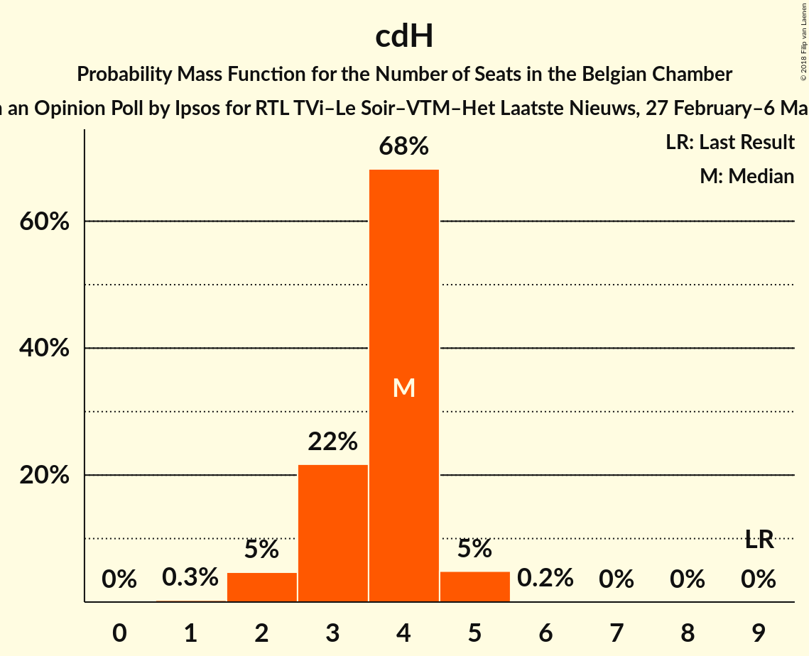

| Number of Seats | Probability | Accumulated | Special Marks |
|:---------------:|:-----------:|:-----------:|:-------------:|
| 1 | 0.3% | 100% |  |
| 2 | 5% | 99.7% |  |
| 3 | 22% | 95% |  |
| 4 | 68% | 73% | Median |
| 5 | 5% | 5% |  |
| 6 | 0.2% | 0.2% |  |
| 7 | 0% | 0% |  |
| 8 | 0% | 0% |  |
| 9 | 0% | 0% | Last Result |

### Parti Populaire

*For a full overview of the results for this party, see the [Parti Populaire](party-partipopulaire.html) page.*

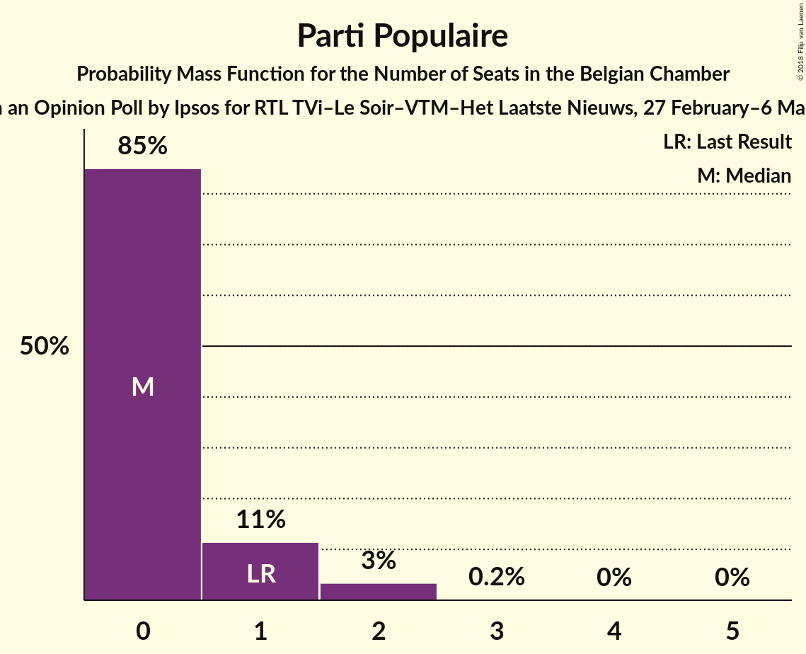

| Number of Seats | Probability | Accumulated | Special Marks |
|:---------------:|:-----------:|:-----------:|:-------------:|
| 0 | 85% | 100% | Median |
| 1 | 11% | 15% | Last Result |
| 2 | 3% | 4% |  |
| 3 | 0.2% | 0.2% |  |
| 4 | 0% | 0% |  |

### La Droite

*For a full overview of the results for this party, see the [La Droite](party-ladroite.html) page.*

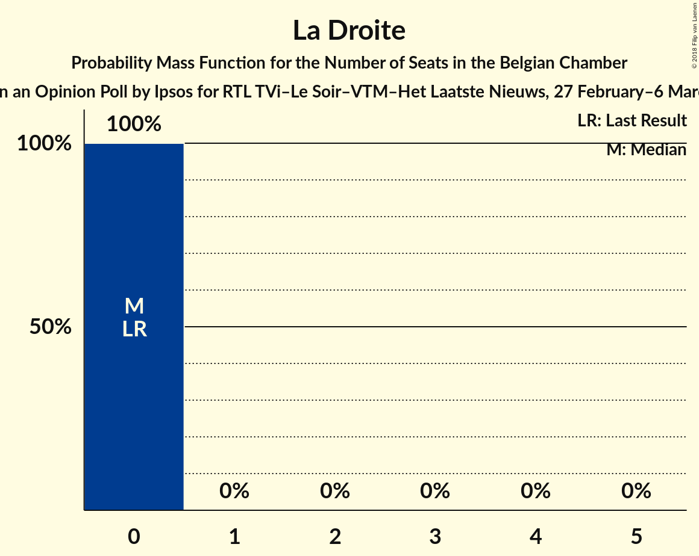

| Number of Seats | Probability | Accumulated | Special Marks |
|:---------------:|:-----------:|:-----------:|:-------------:|
| 0 | 100% | 100% | Last Result, Median |

## Coalitions

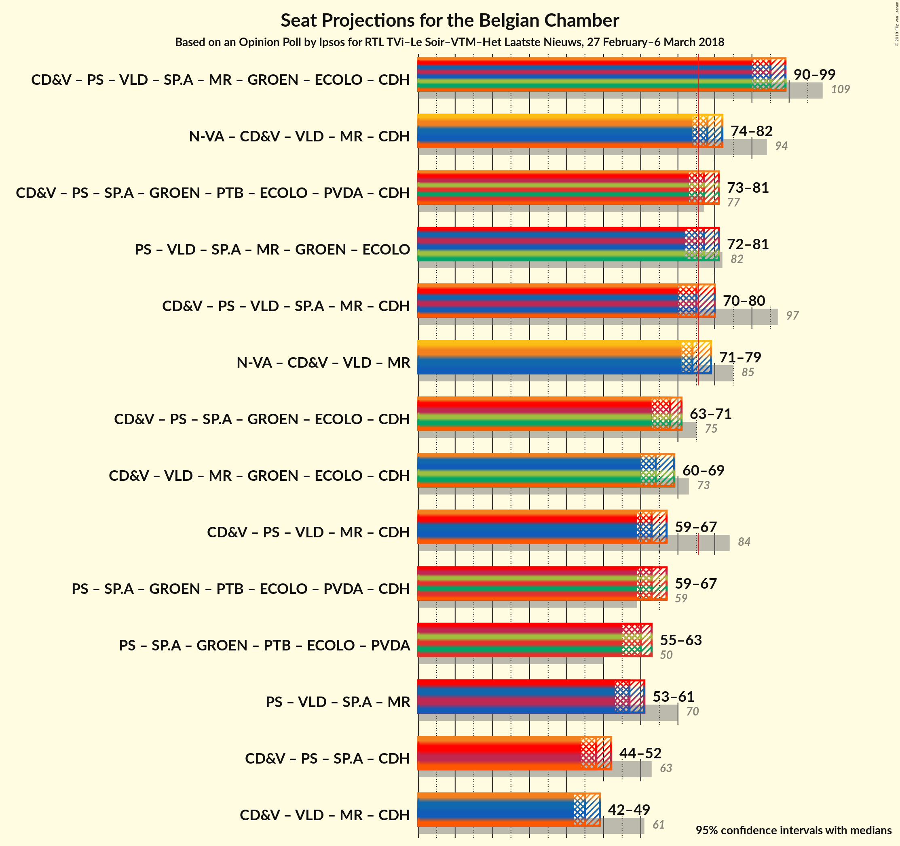

### Confidence Intervals

| Coalition | Last Result | Median | Majority? | 80% Confidence Interval | 90% Confidence Interval | 95% Confidence Interval | 99% Confidence Interval |
|:---------:|:-----------:|:------:|:---------:|:-----------------------:|:-----------------------:|:-----------------------:|:-----------------------:|
| CD&V – PS – Open Vld – sp.a – MR – Groen – Ecolo – cdH | 109 | 93 | 100% | 90–96 | 89–97 | 88–97 | 87–99 |
| CD&V – PS – sp.a – Groen – PTB – Ecolo – PVDA – cdH | 77 | 79 | 93% | 76–82 | 75–83 | 75–83 | 73–84 |
| N-VA – CD&V – Open Vld – MR – cdH | 94 | 76 | 59% | 73–79 | 73–80 | 72–81 | 71–82 |
| PS – Open Vld – sp.a – MR – Groen – Ecolo | 82 | 76 | 54% | 73–79 | 72–79 | 71–80 | 70–81 |
| CD&V – PS – Open Vld – sp.a – MR – cdH | 97 | 74 | 23% | 71–77 | 70–78 | 70–78 | 68–80 |
| N-VA – CD&V – Open Vld – MR | 85 | 72 | 8% | 70–75 | 69–76 | 68–77 | 67–78 |
| CD&V – PS – sp.a – Groen – Ecolo – cdH | 75 | 66 | 0% | 63–69 | 62–70 | 62–70 | 60–71 |
| PS – sp.a – Groen – PTB – Ecolo – PVDA – cdH | 59 | 65 | 0% | 62–68 | 62–69 | 61–69 | 60–71 |
| CD&V – Open Vld – MR – Groen – Ecolo – cdH | 73 | 64 | 0% | 61–67 | 60–67 | 60–68 | 58–69 |
| CD&V – PS – Open Vld – MR – cdH | 84 | 62 | 0% | 60–65 | 59–66 | 58–66 | 57–68 |
| PS – sp.a – Groen – PTB – Ecolo – PVDA | 50 | 62 | 0% | 59–64 | 58–65 | 57–66 | 56–67 |
| PS – Open Vld – sp.a – MR | 70 | 56 | 0% | 54–59 | 53–60 | 52–61 | 51–62 |
| CD&V – PS – sp.a – cdH | 63 | 47 | 0% | 44–49 | 44–50 | 43–51 | 42–52 |
| CD&V – Open Vld – MR – cdH | 61 | 44 | 0% | 42–47 | 42–48 | 41–49 | 40–50 |

### CD&V – PS – Open Vld – sp.a – MR – Groen – Ecolo – cdH

| Number of Seats | Probability | Accumulated | Special Marks |
|:---------------:|:-----------:|:-----------:|:-------------:|
| 86 | 0.1% | 100% |  |
| 87 | 0.5% | 99.9% |  |
| 88 | 2% | 99.4% |  |
| 89 | 5% | 97% |  |
| 90 | 8% | 92% |  |
| 91 | 10% | 84% |  |
| 92 | 12% | 74% |  |
| 93 | 16% | 62% | Median |
| 94 | 17% | 46% |  |
| 95 | 13% | 29% |  |
| 96 | 8% | 16% |  |
| 97 | 5% | 7% |  |
| 98 | 2% | 2% |  |
| 99 | 0.5% | 0.6% |  |
| 100 | 0.1% | 0.1% |  |
| 101 | 0% | 0% |  |
| 102 | 0% | 0% |  |
| 103 | 0% | 0% |  |
| 104 | 0% | 0% |  |
| 105 | 0% | 0% |  |
| 106 | 0% | 0% |  |
| 107 | 0% | 0% |  |
| 108 | 0% | 0% |  |
| 109 | 0% | 0% | Last Result |

### CD&V – PS – sp.a – Groen – PTB – Ecolo – PVDA – cdH

| Number of Seats | Probability | Accumulated | Special Marks |
|:---------------:|:-----------:|:-----------:|:-------------:|
| 72 | 0.1% | 100% |  |
| 73 | 0.4% | 99.9% |  |
| 74 | 2% | 99.5% |  |
| 75 | 4% | 98% |  |
| 76 | 8% | 93% | Majority |
| 77 | 11% | 86% | Last Result |
| 78 | 13% | 75% |  |
| 79 | 16% | 61% | Median |
| 80 | 17% | 45% |  |
| 81 | 14% | 28% |  |
| 82 | 9% | 14% |  |
| 83 | 4% | 5% |  |
| 84 | 1.2% | 2% |  |
| 85 | 0.3% | 0.4% |  |
| 86 | 0.1% | 0.1% |  |
| 87 | 0% | 0% |  |

### N-VA – CD&V – Open Vld – MR – cdH

| Number of Seats | Probability | Accumulated | Special Marks |
|:---------------:|:-----------:|:-----------:|:-------------:|
| 70 | 0.2% | 100% |  |
| 71 | 1.0% | 99.7% |  |
| 72 | 3% | 98.8% |  |
| 73 | 8% | 95% |  |
| 74 | 13% | 87% |  |
| 75 | 15% | 74% | Median |
| 76 | 16% | 59% | Majority |
| 77 | 16% | 43% |  |
| 78 | 13% | 27% |  |
| 79 | 8% | 15% |  |
| 80 | 4% | 7% |  |
| 81 | 2% | 3% |  |
| 82 | 0.6% | 0.9% |  |
| 83 | 0.2% | 0.3% |  |
| 84 | 0.1% | 0.1% |  |
| 85 | 0% | 0% |  |
| 86 | 0% | 0% |  |
| 87 | 0% | 0% |  |
| 88 | 0% | 0% |  |
| 89 | 0% | 0% |  |
| 90 | 0% | 0% |  |
| 91 | 0% | 0% |  |
| 92 | 0% | 0% |  |
| 93 | 0% | 0% |  |
| 94 | 0% | 0% | Last Result |

### PS – Open Vld – sp.a – MR – Groen – Ecolo

| Number of Seats | Probability | Accumulated | Special Marks |
|:---------------:|:-----------:|:-----------:|:-------------:|
| 68 | 0.1% | 100% |  |
| 69 | 0.3% | 99.9% |  |
| 70 | 1.0% | 99.6% |  |
| 71 | 3% | 98.6% |  |
| 72 | 6% | 96% |  |
| 73 | 9% | 90% |  |
| 74 | 12% | 81% |  |
| 75 | 15% | 69% |  |
| 76 | 17% | 54% | Median, Majority |
| 77 | 15% | 37% |  |
| 78 | 11% | 21% |  |
| 79 | 6% | 11% |  |
| 80 | 3% | 5% |  |
| 81 | 1.2% | 2% |  |
| 82 | 0.3% | 0.4% | Last Result |
| 83 | 0.1% | 0.1% |  |
| 84 | 0% | 0% |  |

### CD&V – PS – Open Vld – sp.a – MR – cdH

| Number of Seats | Probability | Accumulated | Special Marks |
|:---------------:|:-----------:|:-----------:|:-------------:|
| 67 | 0.1% | 100% |  |
| 68 | 0.5% | 99.9% |  |
| 69 | 2% | 99.4% |  |
| 70 | 4% | 98% |  |
| 71 | 9% | 93% |  |
| 72 | 13% | 85% |  |
| 73 | 17% | 71% | Median |
| 74 | 17% | 55% |  |
| 75 | 15% | 38% |  |
| 76 | 11% | 23% | Majority |
| 77 | 7% | 13% |  |
| 78 | 4% | 6% |  |
| 79 | 2% | 2% |  |
| 80 | 0.5% | 0.7% |  |
| 81 | 0.1% | 0.2% |  |
| 82 | 0% | 0% |  |
| 83 | 0% | 0% |  |
| 84 | 0% | 0% |  |
| 85 | 0% | 0% |  |
| 86 | 0% | 0% |  |
| 87 | 0% | 0% |  |
| 88 | 0% | 0% |  |
| 89 | 0% | 0% |  |
| 90 | 0% | 0% |  |
| 91 | 0% | 0% |  |
| 92 | 0% | 0% |  |
| 93 | 0% | 0% |  |
| 94 | 0% | 0% |  |
| 95 | 0% | 0% |  |
| 96 | 0% | 0% |  |
| 97 | 0% | 0% | Last Result |

### N-VA – CD&V – Open Vld – MR

| Number of Seats | Probability | Accumulated | Special Marks |
|:---------------:|:-----------:|:-----------:|:-------------:|
| 66 | 0.1% | 100% |  |
| 67 | 0.5% | 99.9% |  |
| 68 | 2% | 99.4% |  |
| 69 | 7% | 97% |  |
| 70 | 12% | 90% |  |
| 71 | 15% | 78% | Median |
| 72 | 17% | 64% |  |
| 73 | 16% | 47% |  |
| 74 | 14% | 31% |  |
| 75 | 9% | 17% |  |
| 76 | 5% | 8% | Majority |
| 77 | 2% | 3% |  |
| 78 | 0.7% | 1.0% |  |
| 79 | 0.2% | 0.3% |  |
| 80 | 0.1% | 0.1% |  |
| 81 | 0% | 0% |  |
| 82 | 0% | 0% |  |
| 83 | 0% | 0% |  |
| 84 | 0% | 0% |  |
| 85 | 0% | 0% | Last Result |

### CD&V – PS – sp.a – Groen – Ecolo – cdH

| Number of Seats | Probability | Accumulated | Special Marks |
|:---------------:|:-----------:|:-----------:|:-------------:|
| 59 | 0.1% | 100% |  |
| 60 | 0.4% | 99.9% |  |
| 61 | 2% | 99.5% |  |
| 62 | 4% | 98% |  |
| 63 | 8% | 93% |  |
| 64 | 11% | 85% |  |
| 65 | 13% | 75% |  |
| 66 | 15% | 62% | Median |
| 67 | 17% | 46% |  |
| 68 | 14% | 29% |  |
| 69 | 9% | 14% |  |
| 70 | 4% | 5% |  |
| 71 | 1.1% | 2% |  |
| 72 | 0.3% | 0.4% |  |
| 73 | 0.1% | 0.1% |  |
| 74 | 0% | 0% |  |
| 75 | 0% | 0% | Last Result |

### PS – sp.a – Groen – PTB – Ecolo – PVDA – cdH

| Number of Seats | Probability | Accumulated | Special Marks |
|:---------------:|:-----------:|:-----------:|:-------------:|
| 58 | 0.1% | 100% |  |
| 59 | 0.3% | 99.9% | Last Result |
| 60 | 1.0% | 99.6% |  |
| 61 | 3% | 98.7% |  |
| 62 | 6% | 96% |  |
| 63 | 11% | 90% |  |
| 64 | 14% | 79% |  |
| 65 | 16% | 65% |  |
| 66 | 17% | 48% | Median |
| 67 | 14% | 32% |  |
| 68 | 10% | 17% |  |
| 69 | 5% | 7% |  |
| 70 | 2% | 2% |  |
| 71 | 0.5% | 0.6% |  |
| 72 | 0.1% | 0.1% |  |
| 73 | 0% | 0% |  |

### CD&V – Open Vld – MR – Groen – Ecolo – cdH

| Number of Seats | Probability | Accumulated | Special Marks |
|:---------------:|:-----------:|:-----------:|:-------------:|
| 56 | 0% | 100% |  |
| 57 | 0.2% | 99.9% |  |
| 58 | 0.5% | 99.8% |  |
| 59 | 2% | 99.2% |  |
| 60 | 5% | 98% |  |
| 61 | 9% | 92% |  |
| 62 | 13% | 83% |  |
| 63 | 17% | 71% |  |
| 64 | 18% | 54% | Median |
| 65 | 15% | 36% |  |
| 66 | 11% | 21% |  |
| 67 | 6% | 10% |  |
| 68 | 3% | 4% |  |
| 69 | 1.0% | 1.5% |  |
| 70 | 0.3% | 0.5% |  |
| 71 | 0.1% | 0.1% |  |
| 72 | 0% | 0% |  |
| 73 | 0% | 0% | Last Result |

### CD&V – PS – Open Vld – MR – cdH

| Number of Seats | Probability | Accumulated | Special Marks |
|:---------------:|:-----------:|:-----------:|:-------------:|
| 56 | 0.2% | 100% |  |
| 57 | 0.6% | 99.8% |  |
| 58 | 2% | 99.2% |  |
| 59 | 5% | 97% |  |
| 60 | 12% | 92% |  |
| 61 | 18% | 80% |  |
| 62 | 21% | 62% | Median |
| 63 | 17% | 41% |  |
| 64 | 12% | 24% |  |
| 65 | 7% | 13% |  |
| 66 | 3% | 6% |  |
| 67 | 2% | 2% |  |
| 68 | 0.6% | 0.8% |  |
| 69 | 0.2% | 0.3% |  |
| 70 | 0.1% | 0.1% |  |
| 71 | 0% | 0% |  |
| 72 | 0% | 0% |  |
| 73 | 0% | 0% |  |
| 74 | 0% | 0% |  |
| 75 | 0% | 0% |  |
| 76 | 0% | 0% | Majority |
| 77 | 0% | 0% |  |
| 78 | 0% | 0% |  |
| 79 | 0% | 0% |  |
| 80 | 0% | 0% |  |
| 81 | 0% | 0% |  |
| 82 | 0% | 0% |  |
| 83 | 0% | 0% |  |
| 84 | 0% | 0% | Last Result |

### PS – sp.a – Groen – PTB – Ecolo – PVDA

| Number of Seats | Probability | Accumulated | Special Marks |
|:---------------:|:-----------:|:-----------:|:-------------:|
| 50 | 0% | 100% | Last Result |
| 51 | 0% | 100% |  |
| 52 | 0% | 100% |  |
| 53 | 0% | 100% |  |
| 54 | 0.1% | 100% |  |
| 55 | 0.2% | 99.9% |  |
| 56 | 0.8% | 99.7% |  |
| 57 | 2% | 99.0% |  |
| 58 | 5% | 97% |  |
| 59 | 9% | 91% |  |
| 60 | 13% | 82% |  |
| 61 | 16% | 69% |  |
| 62 | 17% | 53% | Median |
| 63 | 15% | 36% |  |
| 64 | 11% | 21% |  |
| 65 | 6% | 10% |  |
| 66 | 3% | 4% |  |
| 67 | 0.8% | 1.1% |  |
| 68 | 0.2% | 0.2% |  |
| 69 | 0% | 0% |  |

### PS – Open Vld – sp.a – MR

| Number of Seats | Probability | Accumulated | Special Marks |
|:---------------:|:-----------:|:-----------:|:-------------:|
| 50 | 0.1% | 100% |  |
| 51 | 0.6% | 99.8% |  |
| 52 | 2% | 99.3% |  |
| 53 | 5% | 97% |  |
| 54 | 10% | 92% |  |
| 55 | 16% | 82% |  |
| 56 | 19% | 66% | Median |
| 57 | 17% | 46% |  |
| 58 | 13% | 29% |  |
| 59 | 8% | 16% |  |
| 60 | 5% | 8% |  |
| 61 | 2% | 3% |  |
| 62 | 0.7% | 1.0% |  |
| 63 | 0.2% | 0.3% |  |
| 64 | 0.1% | 0.1% |  |
| 65 | 0% | 0% |  |
| 66 | 0% | 0% |  |
| 67 | 0% | 0% |  |
| 68 | 0% | 0% |  |
| 69 | 0% | 0% |  |
| 70 | 0% | 0% | Last Result |

### CD&V – PS – sp.a – cdH

| Number of Seats | Probability | Accumulated | Special Marks |
|:---------------:|:-----------:|:-----------:|:-------------:|
| 41 | 0.2% | 100% |  |
| 42 | 0.9% | 99.7% |  |
| 43 | 3% | 98.8% |  |
| 44 | 8% | 96% |  |
| 45 | 13% | 88% |  |
| 46 | 20% | 75% | Median |
| 47 | 19% | 55% |  |
| 48 | 16% | 36% |  |
| 49 | 11% | 21% |  |
| 50 | 6% | 10% |  |
| 51 | 2% | 3% |  |
| 52 | 0.7% | 0.9% |  |
| 53 | 0.2% | 0.2% |  |
| 54 | 0% | 0% |  |
| 55 | 0% | 0% |  |
| 56 | 0% | 0% |  |
| 57 | 0% | 0% |  |
| 58 | 0% | 0% |  |
| 59 | 0% | 0% |  |
| 60 | 0% | 0% |  |
| 61 | 0% | 0% |  |
| 62 | 0% | 0% |  |
| 63 | 0% | 0% | Last Result |

### CD&V – Open Vld – MR – cdH

| Number of Seats | Probability | Accumulated | Special Marks |
|:---------------:|:-----------:|:-----------:|:-------------:|
| 38 | 0% | 100% |  |
| 39 | 0.3% | 99.9% |  |
| 40 | 1.1% | 99.7% |  |
| 41 | 3% | 98.6% |  |
| 42 | 9% | 95% |  |
| 43 | 18% | 87% |  |
| 44 | 22% | 68% | Median |
| 45 | 18% | 46% |  |
| 46 | 14% | 28% |  |
| 47 | 7% | 14% |  |
| 48 | 4% | 6% |  |
| 49 | 2% | 3% |  |
| 50 | 0.6% | 0.9% |  |
| 51 | 0.2% | 0.3% |  |
| 52 | 0.1% | 0.1% |  |
| 53 | 0% | 0% |  |
| 54 | 0% | 0% |  |
| 55 | 0% | 0% |  |
| 56 | 0% | 0% |  |
| 57 | 0% | 0% |  |
| 58 | 0% | 0% |  |
| 59 | 0% | 0% |  |
| 60 | 0% | 0% |  |
| 61 | 0% | 0% | Last Result |

## Technical Information

### Opinion Poll

+ **Polling firm:** Ipsos
+ **Commissioner(s):** RTL TVi–Le Soir–VTM–Het Laatste Nieuws
+ **Fieldwork period:** 27 February–6 March 2018

### Calculations

+ **Sample size:** 1560
+ **Simulations done:** 1,048,576
+ **Error estimate:** 0.66%

