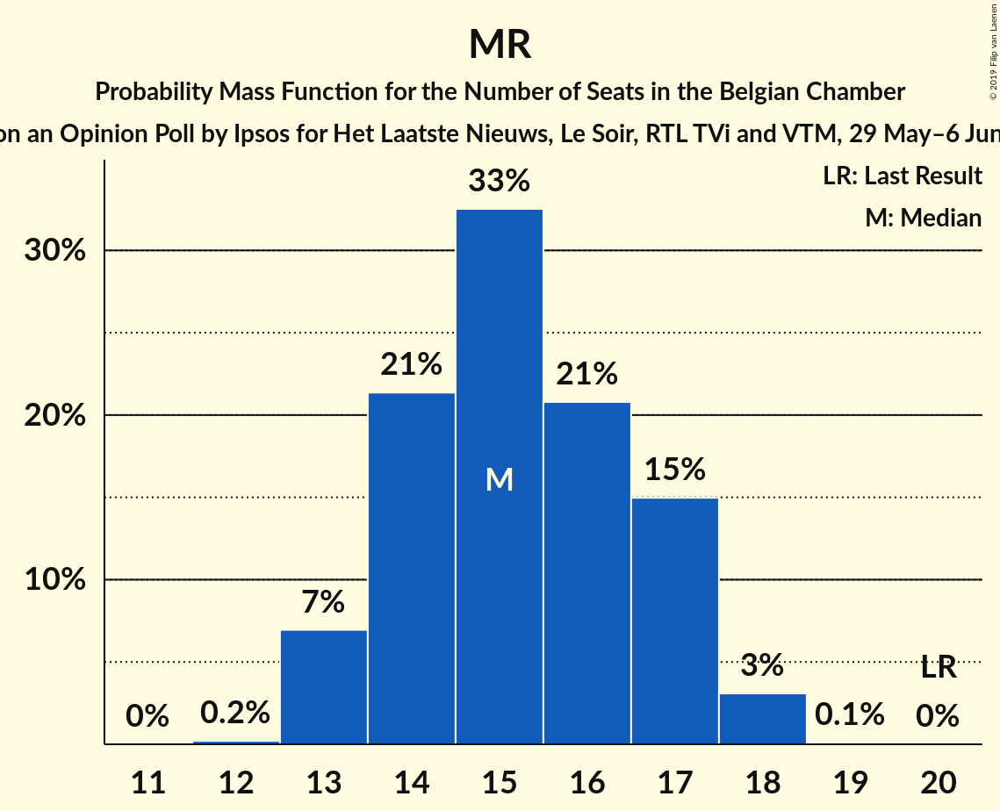
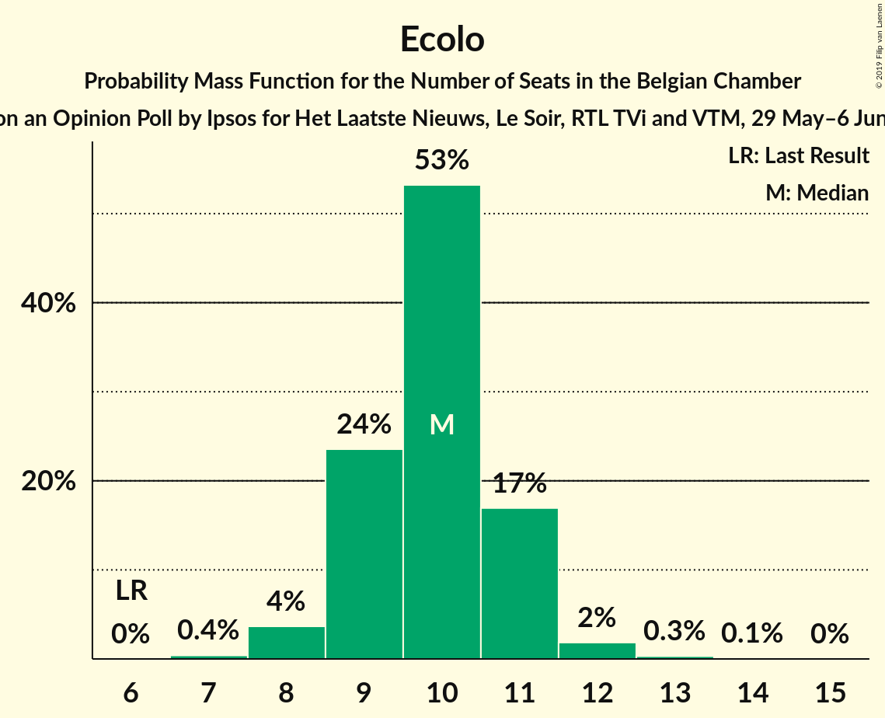
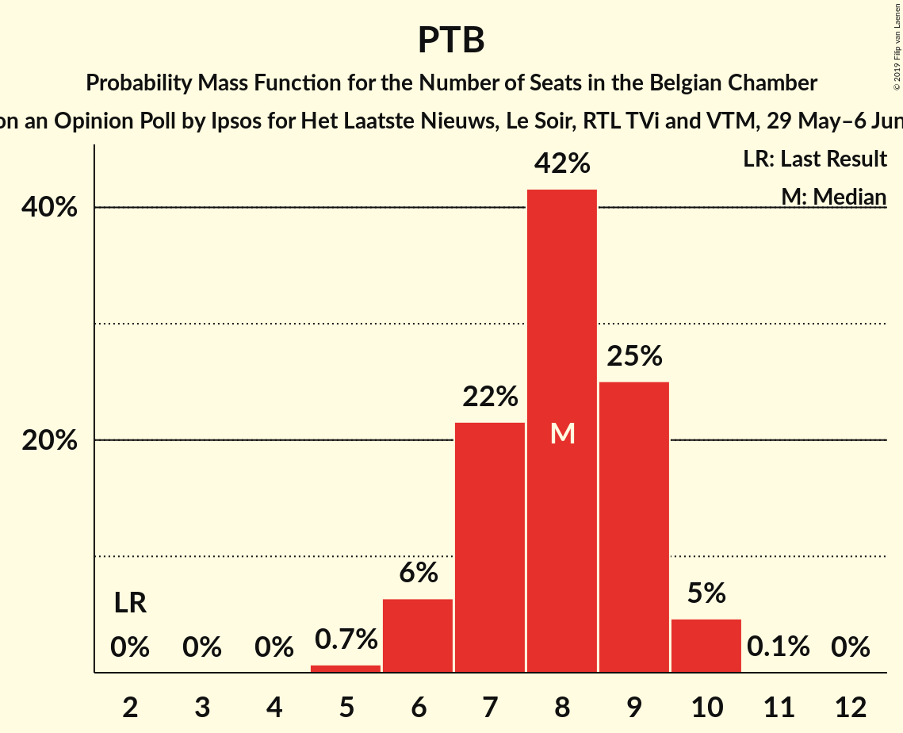
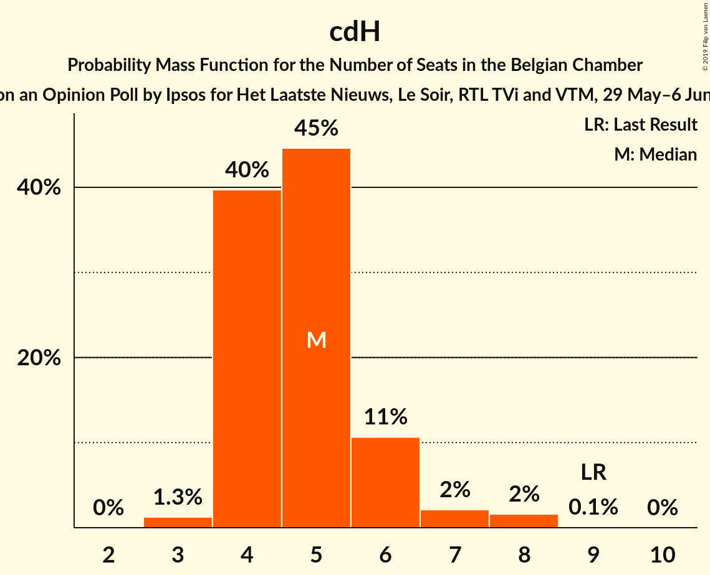
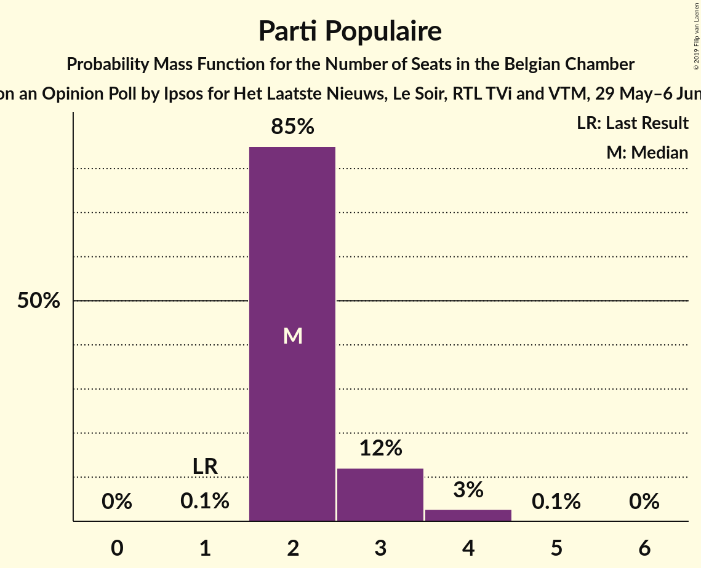

# Opinion Poll by Ipsos for Het Laatste Nieuws, Le Soir, RTL TVi and VTM, 29 May–6 June 2018

Areas included: Brussels, Flanders, Wallonia

<a href="#voting-intentions">Voting Intentions</a> | <a href="#seats">Seats</a> | <a href="#coalitions">Coalitions</a> | <a href="#technical-information">Technical Information</a>

## Voting Intentions

### Confidence Intervals

| Party | Last Result | Poll Result | 80% Confidence Interval | 90% Confidence Interval | 95% Confidence Interval | 99% Confidence Interval |
|:-----:|:-----------:|:-----------:|:-----------------------:|:-----------------------:|:-----------------------:|:-----------------------:|
| N-VA | 20.3% | 16.9% | 15.0–15.9% |14.8–15.9% |14.6–15.9% |14.2–15.9% |
| CD&V | 11.6% | 9.5% | 8.1–8.8% |7.9–8.8% |7.8–8.8% |7.4–8.8% |
| Open Vld | 9.8% | 8.8% | 7.4–8.0% |7.2–8.0% |7.1–8.0% |6.8–8.0% |
| PS | 11.7% | 8.2% | 7.3–7.7% |7.2–7.7% |7.1–7.7% |6.9–7.7% |
| Groen | 5.3% | 7.7% | 6.9–8.3% |6.7–8.4% |6.5–8.4% |6.1–8.5% |
| MR | 9.6% | 7.4% | 6.5–6.8% |6.4–6.8% |6.3–6.8% |6.1–6.8% |
| sp.a | 8.8% | 7.3% | 6.0–6.6% |5.9–6.6% |5.7–6.6% |5.5–6.6% |
| Vlaams Belang | 3.7% | 6.2% | 5.0–5.5% |4.9–5.5% |4.7–5.6% |4.5–5.6% |
| Ecolo | 3.3% | 5.1% | 4.3–4.6% |4.2–4.6% |4.1–4.6% |4.0–4.6% |
| PTB | 2.0% | 4.6% | 3.9–4.2% |3.8–4.2% |3.7–4.2% |3.6–4.2% |
| PVDA | 1.8% | 3.8% | 3.3–4.3% |3.1–4.4% |3.0–4.5% |2.8–4.5% |
| cdH | 5.0% | 3.3% | 2.7–2.9% |2.6–2.9% |2.6–2.9% |2.4–2.9% |
| DéFI | 1.8% | 3.0% | 2.4–2.6% |2.3–2.6% |2.3–2.6% |2.2–2.6% |
| Parti Populaire | 1.5% | 2.4% | 1.9–2.1% |1.8–2.1% |1.8–2.1% |1.7–2.1% |
| La Droite | 0.4% | 0.6% | 0.5–0.7% |0.4–0.7% |0.4–0.7% |0.4–0.7% |

*Note:* The poll result column reflects the actual value used in the calculations. Published results may vary slightly, and in addition be rounded to fewer digits.

## Seats

### Confidence Intervals

| Party | Last Result | Median | 80% Confidence Interval | 90% Confidence Interval | 95% Confidence Interval | 99% Confidence Interval |
|:-----:|:-----------:|:------:|:-----------------------:|:-----------------------:|:-----------------------:|:-----------------------:|
| <a href="#n-va">N-VA</a> | 33 | 28 | 25–29 |25–30 |24–30 |23–31 |
| <a href="#cd&v">CD&V</a> | 18 | 14 | 13–17 |13–18 |13–18 |11–18 |
| <a href="#open-vld">Open Vld</a> | 14 | 12 | 12–15 |12–16 |11–16 |11–17 |
| <a href="#ps">PS</a> | 23 | 17 | 16–19 |15–19 |15–19 |14–20 |
| <a href="#groen">Groen</a> | 6 | 11 | 10–12 |10–12 |10–13 |9–14 |
| <a href="#mr">MR</a> | 20 | 15 | 14–17 |13–17 |13–18 |13–18 |
| <a href="#sp.a">sp.a</a> | 13 | 11 | 9–12 |9–13 |9–13 |8–14 |
| <a href="#vlaams-belang">Vlaams Belang</a> | 3 | 8 | 7–8 |7–9 |7–10 |6–12 |
| <a href="#ecolo">Ecolo</a> | 6 | 10 | 9–11 |9–11 |8–11 |8–12 |
| <a href="#ptb">PTB</a> | 2 | 8 | 7–9 |6–9 |6–10 |5–10 |
| <a href="#pvda">PVDA</a> | 0 | 3 | 3–5 |2–5 |2–6 |1–7 |
| <a href="#cdh">cdH</a> | 9 | 5 | 4–6 |4–6 |4–7 |3–8 |
| <a href="#défi">DéFI</a> | 2 | 5 | 3–6 |3–6 |2–6 |2–7 |
| <a href="#parti-populaire">Parti Populaire</a> | 1 | 2 | 2–3 |2–3 |2–4 |2–4 |
| <a href="#la-droite">La Droite</a> | 0 | 0 | 0 |0 |0 |0 |

### N-VA

*For a full overview of the results for this party, see the [N-VA](party-n-va.html) page.*

| Number of Seats | Probability | Accumulated | Special Marks |
|:---------------:|:-----------:|:-----------:|:-------------:|
| 23 | 0.5% | 100% |  |
| 24 | 3% | 99.5% |  |
| 25 | 10% | 97% |  |
| 26 | 12% | 87% |  |
| 27 | 21% | 75% |  |
| 28 | 22% | 54% | Median |
| 29 | 22% | 32% |  |
| 30 | 8% | 10% |  |
| 31 | 1.5% | 2% |  |
| 32 | 0.4% | 0.4% |  |
| 33 | 0.1% | 0.1% | Last Result |
| 34 | 0% | 0% |  |

### CD&V

*For a full overview of the results for this party, see the [CD&V](party-cdv.html) page.*

| Number of Seats | Probability | Accumulated | Special Marks |
|:---------------:|:-----------:|:-----------:|:-------------:|
| 11 | 0.7% | 100% |  |
| 12 | 1.5% | 99.2% |  |
| 13 | 32% | 98% |  |
| 14 | 28% | 65% | Median |
| 15 | 18% | 37% |  |
| 16 | 8% | 19% |  |
| 17 | 6% | 11% |  |
| 18 | 5% | 6% | Last Result |
| 19 | 0.1% | 0.1% |  |
| 20 | 0% | 0% |  |

### Open Vld

*For a full overview of the results for this party, see the [Open Vld](party-openvld.html) page.*

| Number of Seats | Probability | Accumulated | Special Marks |
|:---------------:|:-----------:|:-----------:|:-------------:|
| 9 | 0% | 100% |  |
| 10 | 0.2% | 99.9% |  |
| 11 | 3% | 99.7% |  |
| 12 | 55% | 97% | Median |
| 13 | 14% | 42% |  |
| 14 | 12% | 28% | Last Result |
| 15 | 9% | 16% |  |
| 16 | 6% | 8% |  |
| 17 | 2% | 2% |  |
| 18 | 0.1% | 0.1% |  |
| 19 | 0% | 0% |  |

### PS

*For a full overview of the results for this party, see the [PS](party-ps.html) page.*

| Number of Seats | Probability | Accumulated | Special Marks |
|:---------------:|:-----------:|:-----------:|:-------------:|
| 14 | 1.0% | 100% |  |
| 15 | 6% | 99.0% |  |
| 16 | 13% | 93% |  |
| 17 | 31% | 81% | Median |
| 18 | 32% | 50% |  |
| 19 | 16% | 17% |  |
| 20 | 1.1% | 1.3% |  |
| 21 | 0.1% | 0.1% |  |
| 22 | 0% | 0% |  |
| 23 | 0% | 0% | Last Result |

### Groen

*For a full overview of the results for this party, see the [Groen](party-groen.html) page.*

| Number of Seats | Probability | Accumulated | Special Marks |
|:---------------:|:-----------:|:-----------:|:-------------:|
| 6 | 0% | 100% | Last Result |
| 7 | 0.1% | 100% |  |
| 8 | 0.4% | 99.9% |  |
| 9 | 0.6% | 99.5% |  |
| 10 | 22% | 98.9% |  |
| 11 | 34% | 77% | Median |
| 12 | 39% | 42% |  |
| 13 | 2% | 3% |  |
| 14 | 0.8% | 1.1% |  |
| 15 | 0.3% | 0.3% |  |
| 16 | 0.1% | 0.1% |  |
| 17 | 0% | 0% |  |

### MR

*For a full overview of the results for this party, see the [MR](party-mr.html) page.*

| Number of Seats | Probability | Accumulated | Special Marks |
|:---------------:|:-----------:|:-----------:|:-------------:|
| 12 | 0.2% | 100% |  |
| 13 | 7% | 99.8% |  |
| 14 | 21% | 93% |  |
| 15 | 33% | 71% | Median |
| 16 | 21% | 39% |  |
| 17 | 15% | 18% |  |
| 18 | 3% | 3% |  |
| 19 | 0.1% | 0.1% |  |
| 20 | 0% | 0% | Last Result |

### sp.a

*For a full overview of the results for this party, see the [sp.a](party-spa.html) page.*

| Number of Seats | Probability | Accumulated | Special Marks |
|:---------------:|:-----------:|:-----------:|:-------------:|
| 6 | 0.1% | 100% |  |
| 7 | 0.1% | 99.9% |  |
| 8 | 2% | 99.8% |  |
| 9 | 18% | 98% |  |
| 10 | 24% | 80% |  |
| 11 | 42% | 56% | Median |
| 12 | 7% | 14% |  |
| 13 | 6% | 7% | Last Result |
| 14 | 0.7% | 1.1% |  |
| 15 | 0.3% | 0.3% |  |
| 16 | 0% | 0% |  |

### Vlaams Belang

*For a full overview of the results for this party, see the [Vlaams Belang](party-vlaamsbelang.html) page.*

| Number of Seats | Probability | Accumulated | Special Marks |
|:---------------:|:-----------:|:-----------:|:-------------:|
| 3 | 0% | 100% | Last Result |
| 4 | 0% | 100% |  |
| 5 | 0% | 100% |  |
| 6 | 1.3% | 100% |  |
| 7 | 21% | 98.7% |  |
| 8 | 69% | 78% | Median |
| 9 | 4% | 8% |  |
| 10 | 3% | 5% |  |
| 11 | 1.0% | 2% |  |
| 12 | 0.8% | 0.8% |  |
| 13 | 0% | 0% |  |

### Ecolo

*For a full overview of the results for this party, see the [Ecolo](party-ecolo.html) page.*

| Number of Seats | Probability | Accumulated | Special Marks |
|:---------------:|:-----------:|:-----------:|:-------------:|
| 6 | 0% | 100% | Last Result |
| 7 | 0.4% | 100% |  |
| 8 | 4% | 99.6% |  |
| 9 | 24% | 96% |  |
| 10 | 53% | 72% | Median |
| 11 | 17% | 19% |  |
| 12 | 2% | 2% |  |
| 13 | 0.3% | 0.4% |  |
| 14 | 0.1% | 0.1% |  |
| 15 | 0% | 0% |  |

### PTB

*For a full overview of the results for this party, see the [PTB](party-ptb.html) page.*

| Number of Seats | Probability | Accumulated | Special Marks |
|:---------------:|:-----------:|:-----------:|:-------------:|
| 2 | 0% | 100% | Last Result |
| 3 | 0% | 100% |  |
| 4 | 0% | 100% |  |
| 5 | 0.7% | 100% |  |
| 6 | 6% | 99.3% |  |
| 7 | 22% | 93% |  |
| 8 | 42% | 71% | Median |
| 9 | 25% | 30% |  |
| 10 | 5% | 5% |  |
| 11 | 0.1% | 0.1% |  |
| 12 | 0% | 0% |  |

### PVDA

*For a full overview of the results for this party, see the [PVDA](party-pvda.html) page.*

| Number of Seats | Probability | Accumulated | Special Marks |
|:---------------:|:-----------:|:-----------:|:-------------:|
| 0 | 0% | 100% | Last Result |
| 1 | 0.6% | 100% |  |
| 2 | 8% | 99.4% |  |
| 3 | 61% | 91% | Median |
| 4 | 11% | 30% |  |
| 5 | 15% | 20% |  |
| 6 | 3% | 4% |  |
| 7 | 1.0% | 1.3% |  |
| 8 | 0.2% | 0.3% |  |
| 9 | 0% | 0% |  |

### cdH

*For a full overview of the results for this party, see the [cdH](party-cdh.html) page.*

| Number of Seats | Probability | Accumulated | Special Marks |
|:---------------:|:-----------:|:-----------:|:-------------:|
| 3 | 1.3% | 100% |  |
| 4 | 40% | 98.7% |  |
| 5 | 45% | 59% | Median |
| 6 | 11% | 14% |  |
| 7 | 2% | 4% |  |
| 8 | 2% | 2% |  |
| 9 | 0.1% | 0.1% | Last Result |
| 10 | 0% | 0% |  |

### DéFI

*For a full overview of the results for this party, see the [DéFI](party-défi.html) page.*

| Number of Seats | Probability | Accumulated | Special Marks |
|:---------------:|:-----------:|:-----------:|:-------------:|
| 2 | 3% | 100% | Last Result |
| 3 | 29% | 97% |  |
| 4 | 16% | 68% |  |
| 5 | 18% | 52% | Median |
| 6 | 33% | 34% |  |
| 7 | 0.9% | 0.9% |  |
| 8 | 0% | 0% |  |

### Parti Populaire

*For a full overview of the results for this party, see the [Parti Populaire](party-partipopulaire.html) page.*

| Number of Seats | Probability | Accumulated | Special Marks |
|:---------------:|:-----------:|:-----------:|:-------------:|
| 1 | 0.1% | 100% | Last Result |
| 2 | 85% | 99.9% | Median |
| 3 | 12% | 15% |  |
| 4 | 3% | 3% |  |
| 5 | 0.1% | 0.1% |  |
| 6 | 0% | 0% |  |

### La Droite

*For a full overview of the results for this party, see the [La Droite](party-ladroite.html) page.*

| Number of Seats | Probability | Accumulated | Special Marks |
|:---------------:|:-----------:|:-----------:|:-------------:|
| 0 | 99.9% | 100% | Last Result, Median |
| 1 | 0.1% | 0.1% |  |
| 2 | 0% | 0% |  |

## Coalitions

### Confidence Intervals

| Coalition | Last Result | Median | Majority? | 80% Confidence Interval | 90% Confidence Interval | 95% Confidence Interval | 99% Confidence Interval |
|:---------:|:-----------:|:------:|:---------:|:-----------------------:|:-----------------------:|:-----------------------:|:-----------------------:|
| CD&V – Open Vld – PS – Groen – MR – sp.a – Ecolo – cdH | 109 | 96 | 100% | 93–99 | 93–100 | 92–101 | 91–102 |
| CD&V – PS – Groen – sp.a – Ecolo – PTB – PVDA – cdH | 77 | 80 | 97% | 77–83 | 76–83 | 75–84 | 74–86 |
| Open Vld – PS – Groen – MR – sp.a – Ecolo | 82 | 77 | 77% | 74–80 | 73–81 | 73–82 | 71–83 |
| CD&V – Open Vld – PS – MR – sp.a – cdH | 97 | 75 | 44% | 73–78 | 72–79 | 71–80 | 70–81 |
| N-VA – CD&V – Open Vld – MR – cdH | 94 | 75 | 38% | 72–78 | 71–79 | 71–79 | 69–81 |
| N-VA – CD&V – Open Vld – MR | 85 | 70 | 0.4% | 67–73 | 67–74 | 66–74 | 65–75 |
| CD&V – Open Vld – Groen – MR – Ecolo – cdH | 73 | 68 | 0.1% | 65–71 | 65–72 | 64–73 | 63–75 |
| CD&V – PS – Groen – sp.a – Ecolo – cdH | 75 | 68 | 0.1% | 65–71 | 65–72 | 64–73 | 63–74 |
| CD&V – Open Vld – PS – MR – cdH | 84 | 65 | 0% | 62–68 | 61–69 | 61–69 | 60–71 |
| PS – Groen – sp.a – Ecolo – PTB – PVDA – cdH | 59 | 65 | 0% | 63–68 | 62–69 | 61–69 | 60–71 |
| PS – Groen – sp.a – Ecolo – PTB – PVDA | 50 | 61 | 0% | 58–63 | 57–64 | 56–65 | 55–66 |
| Open Vld – PS – MR – sp.a | 70 | 56 | 0% | 53–59 | 53–60 | 52–61 | 51–62 |
| CD&V – Open Vld – MR – cdH | 61 | 47 | 0% | 45–50 | 44–51 | 43–52 | 43–53 |
| CD&V – PS – sp.a – cdH | 63 | 47 | 0% | 45–50 | 44–51 | 43–51 | 42–53 |

### CD&V – Open Vld – PS – Groen – MR – sp.a – Ecolo – cdH

| Number of Seats | Probability | Accumulated | Special Marks |
|:---------------:|:-----------:|:-----------:|:-------------:|
| 89 | 0.1% | 100% |  |
| 90 | 0.3% | 99.9% |  |
| 91 | 0.9% | 99.6% |  |
| 92 | 3% | 98.7% |  |
| 93 | 6% | 96% |  |
| 94 | 11% | 90% |  |
| 95 | 15% | 79% | Median |
| 96 | 17% | 65% |  |
| 97 | 17% | 47% |  |
| 98 | 13% | 31% |  |
| 99 | 9% | 18% |  |
| 100 | 5% | 9% |  |
| 101 | 2% | 4% |  |
| 102 | 0.9% | 1.3% |  |
| 103 | 0.3% | 0.4% |  |
| 104 | 0.1% | 0.1% |  |
| 105 | 0% | 0% |  |
| 106 | 0% | 0% |  |
| 107 | 0% | 0% |  |
| 108 | 0% | 0% |  |
| 109 | 0% | 0% | Last Result |

### CD&V – PS – Groen – sp.a – Ecolo – PTB – PVDA – cdH

| Number of Seats | Probability | Accumulated | Special Marks |
|:---------------:|:-----------:|:-----------:|:-------------:|
| 73 | 0.1% | 100% |  |
| 74 | 0.6% | 99.8% |  |
| 75 | 2% | 99.2% |  |
| 76 | 5% | 97% | Majority |
| 77 | 9% | 92% | Last Result |
| 78 | 14% | 84% |  |
| 79 | 18% | 70% | Median |
| 80 | 18% | 52% |  |
| 81 | 14% | 34% |  |
| 82 | 10% | 20% |  |
| 83 | 6% | 10% |  |
| 84 | 3% | 5% |  |
| 85 | 1.2% | 2% |  |
| 86 | 0.4% | 0.6% |  |
| 87 | 0.1% | 0.2% |  |
| 88 | 0% | 0% |  |

### Open Vld – PS – Groen – MR – sp.a – Ecolo

| Number of Seats | Probability | Accumulated | Special Marks |
|:---------------:|:-----------:|:-----------:|:-------------:|
| 69 | 0% | 100% |  |
| 70 | 0.2% | 99.9% |  |
| 71 | 0.6% | 99.8% |  |
| 72 | 2% | 99.2% |  |
| 73 | 4% | 98% |  |
| 74 | 7% | 94% |  |
| 75 | 11% | 87% |  |
| 76 | 15% | 77% | Median, Majority |
| 77 | 17% | 62% |  |
| 78 | 16% | 46% |  |
| 79 | 12% | 30% |  |
| 80 | 8% | 17% |  |
| 81 | 5% | 9% |  |
| 82 | 2% | 4% | Last Result |
| 83 | 1.0% | 1.5% |  |
| 84 | 0.4% | 0.5% |  |
| 85 | 0.1% | 0.1% |  |
| 86 | 0% | 0% |  |

### CD&V – Open Vld – PS – MR – sp.a – cdH

| Number of Seats | Probability | Accumulated | Special Marks |
|:---------------:|:-----------:|:-----------:|:-------------:|
| 68 | 0% | 100% |  |
| 69 | 0.2% | 99.9% |  |
| 70 | 0.8% | 99.7% |  |
| 71 | 2% | 99.0% |  |
| 72 | 6% | 97% |  |
| 73 | 11% | 91% |  |
| 74 | 16% | 79% | Median |
| 75 | 19% | 63% |  |
| 76 | 16% | 44% | Majority |
| 77 | 13% | 28% |  |
| 78 | 8% | 15% |  |
| 79 | 4% | 7% |  |
| 80 | 2% | 3% |  |
| 81 | 0.7% | 1.1% |  |
| 82 | 0.2% | 0.3% |  |
| 83 | 0.1% | 0.1% |  |
| 84 | 0% | 0% |  |
| 85 | 0% | 0% |  |
| 86 | 0% | 0% |  |
| 87 | 0% | 0% |  |
| 88 | 0% | 0% |  |
| 89 | 0% | 0% |  |
| 90 | 0% | 0% |  |
| 91 | 0% | 0% |  |
| 92 | 0% | 0% |  |
| 93 | 0% | 0% |  |
| 94 | 0% | 0% |  |
| 95 | 0% | 0% |  |
| 96 | 0% | 0% |  |
| 97 | 0% | 0% | Last Result |

### N-VA – CD&V – Open Vld – MR – cdH

| Number of Seats | Probability | Accumulated | Special Marks |
|:---------------:|:-----------:|:-----------:|:-------------:|
| 68 | 0.1% | 100% |  |
| 69 | 0.5% | 99.8% |  |
| 70 | 1.5% | 99.4% |  |
| 71 | 4% | 98% |  |
| 72 | 8% | 94% |  |
| 73 | 13% | 86% |  |
| 74 | 17% | 73% | Median |
| 75 | 18% | 56% |  |
| 76 | 15% | 38% | Majority |
| 77 | 11% | 23% |  |
| 78 | 7% | 12% |  |
| 79 | 3% | 5% |  |
| 80 | 1.4% | 2% |  |
| 81 | 0.4% | 0.6% |  |
| 82 | 0.1% | 0.1% |  |
| 83 | 0% | 0% |  |
| 84 | 0% | 0% |  |
| 85 | 0% | 0% |  |
| 86 | 0% | 0% |  |
| 87 | 0% | 0% |  |
| 88 | 0% | 0% |  |
| 89 | 0% | 0% |  |
| 90 | 0% | 0% |  |
| 91 | 0% | 0% |  |
| 92 | 0% | 0% |  |
| 93 | 0% | 0% |  |
| 94 | 0% | 0% | Last Result |

### N-VA – CD&V – Open Vld – MR

| Number of Seats | Probability | Accumulated | Special Marks |
|:---------------:|:-----------:|:-----------:|:-------------:|
| 63 | 0.1% | 100% |  |
| 64 | 0.3% | 99.9% |  |
| 65 | 1.0% | 99.6% |  |
| 66 | 3% | 98.6% |  |
| 67 | 6% | 96% |  |
| 68 | 12% | 89% |  |
| 69 | 17% | 78% | Median |
| 70 | 19% | 61% |  |
| 71 | 17% | 42% |  |
| 72 | 12% | 25% |  |
| 73 | 7% | 13% |  |
| 74 | 4% | 5% |  |
| 75 | 1.4% | 2% |  |
| 76 | 0.4% | 0.4% | Majority |
| 77 | 0.1% | 0.1% |  |
| 78 | 0% | 0% |  |
| 79 | 0% | 0% |  |
| 80 | 0% | 0% |  |
| 81 | 0% | 0% |  |
| 82 | 0% | 0% |  |
| 83 | 0% | 0% |  |
| 84 | 0% | 0% |  |
| 85 | 0% | 0% | Last Result |

### CD&V – Open Vld – Groen – MR – Ecolo – cdH

| Number of Seats | Probability | Accumulated | Special Marks |
|:---------------:|:-----------:|:-----------:|:-------------:|
| 62 | 0.2% | 100% |  |
| 63 | 0.9% | 99.8% |  |
| 64 | 3% | 98.9% |  |
| 65 | 7% | 96% |  |
| 66 | 11% | 89% |  |
| 67 | 15% | 79% | Median |
| 68 | 16% | 64% |  |
| 69 | 16% | 48% |  |
| 70 | 13% | 32% |  |
| 71 | 9% | 19% |  |
| 72 | 5% | 10% |  |
| 73 | 3% | 4% | Last Result |
| 74 | 1.2% | 2% |  |
| 75 | 0.4% | 0.6% |  |
| 76 | 0.1% | 0.1% | Majority |
| 77 | 0% | 0% |  |

### CD&V – PS – Groen – sp.a – Ecolo – cdH

| Number of Seats | Probability | Accumulated | Special Marks |
|:---------------:|:-----------:|:-----------:|:-------------:|
| 61 | 0.1% | 100% |  |
| 62 | 0.3% | 99.9% |  |
| 63 | 1.1% | 99.6% |  |
| 64 | 3% | 98% |  |
| 65 | 7% | 95% |  |
| 66 | 11% | 89% |  |
| 67 | 16% | 78% |  |
| 68 | 18% | 62% | Median |
| 69 | 16% | 44% |  |
| 70 | 13% | 28% |  |
| 71 | 8% | 16% |  |
| 72 | 4% | 7% |  |
| 73 | 2% | 3% |  |
| 74 | 0.7% | 1.0% |  |
| 75 | 0.2% | 0.3% | Last Result |
| 76 | 0% | 0.1% | Majority |
| 77 | 0% | 0% |  |

### CD&V – Open Vld – PS – MR – cdH

| Number of Seats | Probability | Accumulated | Special Marks |
|:---------------:|:-----------:|:-----------:|:-------------:|
| 58 | 0.1% | 100% |  |
| 59 | 0.3% | 99.9% |  |
| 60 | 1.4% | 99.6% |  |
| 61 | 4% | 98% |  |
| 62 | 9% | 94% |  |
| 63 | 15% | 85% | Median |
| 64 | 18% | 70% |  |
| 65 | 17% | 51% |  |
| 66 | 14% | 34% |  |
| 67 | 10% | 21% |  |
| 68 | 6% | 11% |  |
| 69 | 3% | 5% |  |
| 70 | 1.3% | 2% |  |
| 71 | 0.5% | 0.7% |  |
| 72 | 0.2% | 0.2% |  |
| 73 | 0% | 0.1% |  |
| 74 | 0% | 0% |  |
| 75 | 0% | 0% |  |
| 76 | 0% | 0% | Majority |
| 77 | 0% | 0% |  |
| 78 | 0% | 0% |  |
| 79 | 0% | 0% |  |
| 80 | 0% | 0% |  |
| 81 | 0% | 0% |  |
| 82 | 0% | 0% |  |
| 83 | 0% | 0% |  |
| 84 | 0% | 0% | Last Result |

### PS – Groen – sp.a – Ecolo – PTB – PVDA – cdH

| Number of Seats | Probability | Accumulated | Special Marks |
|:---------------:|:-----------:|:-----------:|:-------------:|
| 59 | 0.1% | 100% | Last Result |
| 60 | 0.6% | 99.9% |  |
| 61 | 2% | 99.2% |  |
| 62 | 6% | 97% |  |
| 63 | 10% | 91% |  |
| 64 | 15% | 81% |  |
| 65 | 19% | 66% | Median |
| 66 | 19% | 46% |  |
| 67 | 14% | 27% |  |
| 68 | 8% | 14% |  |
| 69 | 4% | 6% |  |
| 70 | 2% | 2% |  |
| 71 | 0.5% | 0.7% |  |
| 72 | 0.2% | 0.2% |  |
| 73 | 0% | 0% |  |

### PS – Groen – sp.a – Ecolo – PTB – PVDA

| Number of Seats | Probability | Accumulated | Special Marks |
|:---------------:|:-----------:|:-----------:|:-------------:|
| 50 | 0% | 100% | Last Result |
| 51 | 0% | 100% |  |
| 52 | 0% | 100% |  |
| 53 | 0% | 100% |  |
| 54 | 0.2% | 99.9% |  |
| 55 | 0.8% | 99.7% |  |
| 56 | 2% | 99.0% |  |
| 57 | 5% | 97% |  |
| 58 | 9% | 92% |  |
| 59 | 14% | 82% |  |
| 60 | 18% | 69% | Median |
| 61 | 18% | 51% |  |
| 62 | 15% | 33% |  |
| 63 | 10% | 18% |  |
| 64 | 5% | 8% |  |
| 65 | 2% | 3% |  |
| 66 | 0.8% | 1.1% |  |
| 67 | 0.2% | 0.3% |  |
| 68 | 0.1% | 0.1% |  |
| 69 | 0% | 0% |  |

### Open Vld – PS – MR – sp.a

| Number of Seats | Probability | Accumulated | Special Marks |
|:---------------:|:-----------:|:-----------:|:-------------:|
| 50 | 0.2% | 100% |  |
| 51 | 1.0% | 99.7% |  |
| 52 | 3% | 98.8% |  |
| 53 | 7% | 96% |  |
| 54 | 12% | 89% |  |
| 55 | 17% | 77% | Median |
| 56 | 19% | 61% |  |
| 57 | 16% | 42% |  |
| 58 | 12% | 26% |  |
| 59 | 7% | 14% |  |
| 60 | 4% | 7% |  |
| 61 | 2% | 3% |  |
| 62 | 0.6% | 0.9% |  |
| 63 | 0.2% | 0.3% |  |
| 64 | 0% | 0.1% |  |
| 65 | 0% | 0% |  |
| 66 | 0% | 0% |  |
| 67 | 0% | 0% |  |
| 68 | 0% | 0% |  |
| 69 | 0% | 0% |  |
| 70 | 0% | 0% | Last Result |

### CD&V – Open Vld – MR – cdH

| Number of Seats | Probability | Accumulated | Special Marks |
|:---------------:|:-----------:|:-----------:|:-------------:|
| 41 | 0.1% | 100% |  |
| 42 | 0.4% | 99.9% |  |
| 43 | 2% | 99.5% |  |
| 44 | 6% | 97% |  |
| 45 | 12% | 91% |  |
| 46 | 16% | 78% | Median |
| 47 | 18% | 62% |  |
| 48 | 16% | 44% |  |
| 49 | 12% | 28% |  |
| 50 | 8% | 16% |  |
| 51 | 4% | 8% |  |
| 52 | 2% | 3% |  |
| 53 | 0.9% | 1.3% |  |
| 54 | 0.3% | 0.4% |  |
| 55 | 0.1% | 0.1% |  |
| 56 | 0% | 0% |  |
| 57 | 0% | 0% |  |
| 58 | 0% | 0% |  |
| 59 | 0% | 0% |  |
| 60 | 0% | 0% |  |
| 61 | 0% | 0% | Last Result |

### CD&V – PS – sp.a – cdH

| Number of Seats | Probability | Accumulated | Special Marks |
|:---------------:|:-----------:|:-----------:|:-------------:|
| 41 | 0.1% | 100% |  |
| 42 | 0.6% | 99.9% |  |
| 43 | 2% | 99.3% |  |
| 44 | 6% | 97% |  |
| 45 | 13% | 91% |  |
| 46 | 19% | 78% |  |
| 47 | 19% | 59% | Median |
| 48 | 15% | 40% |  |
| 49 | 11% | 24% |  |
| 50 | 8% | 13% |  |
| 51 | 4% | 6% |  |
| 52 | 2% | 2% |  |
| 53 | 0.5% | 0.7% |  |
| 54 | 0.1% | 0.2% |  |
| 55 | 0% | 0% |  |
| 56 | 0% | 0% |  |
| 57 | 0% | 0% |  |
| 58 | 0% | 0% |  |
| 59 | 0% | 0% |  |
| 60 | 0% | 0% |  |
| 61 | 0% | 0% |  |
| 62 | 0% | 0% |  |
| 63 | 0% | 0% | Last Result |

## Technical Information

### Opinion Poll

+ **Polling firm:** Ipsos
+ **Commissioner(s):** Het Laatste Nieuws, Le Soir, RTL TVi and VTM
+ **Fieldwork period:** 29 May–6 June 2018

### Calculations

+ **Sample size:** 1618
+ **Simulations done:** 1,048,576
+ **Error estimate:** 1.83%

