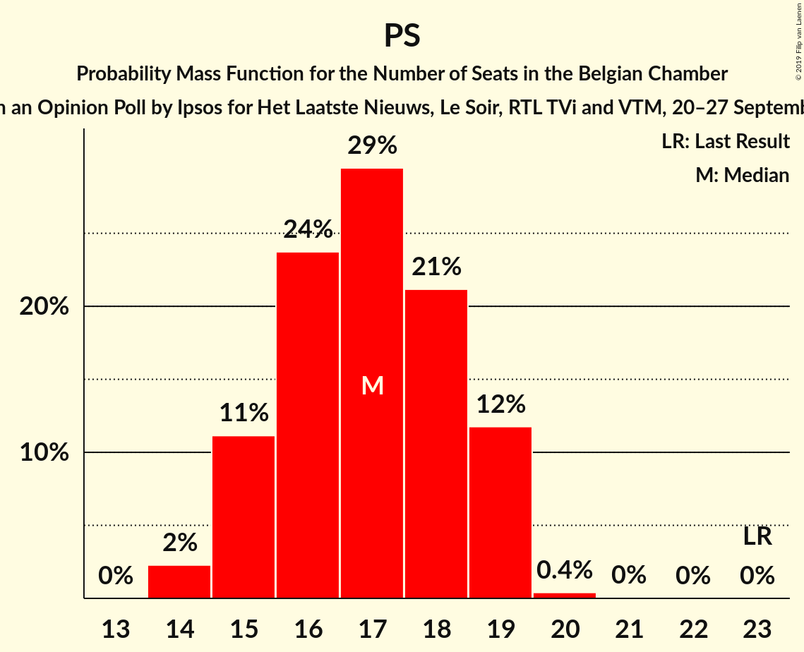
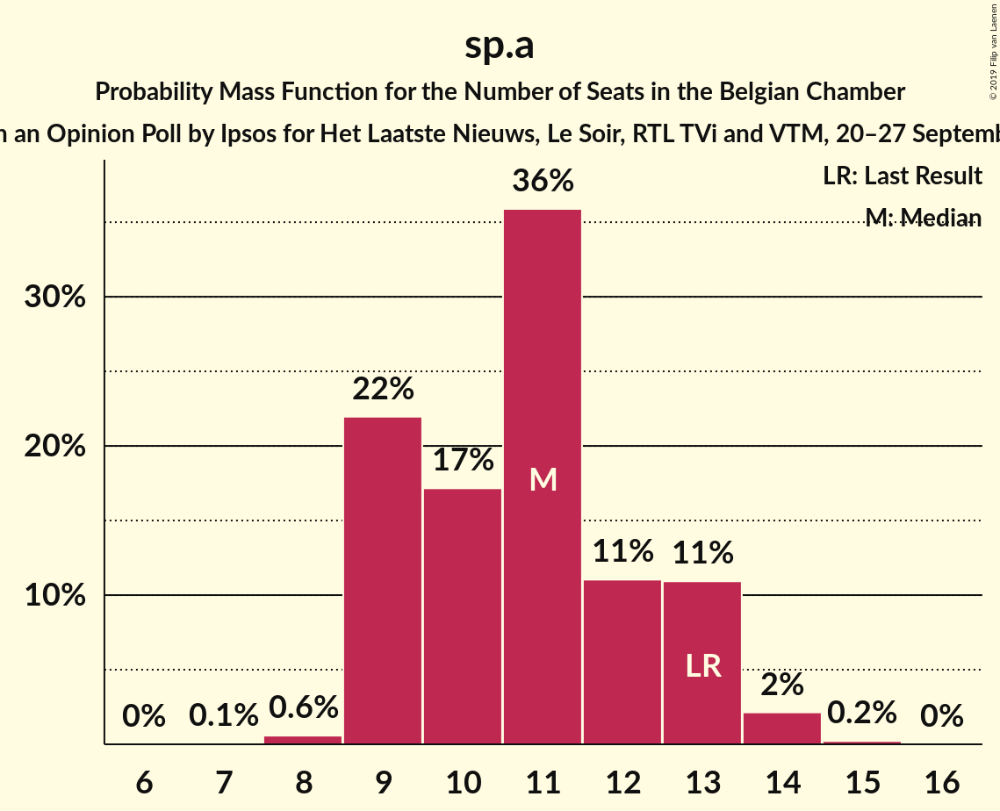
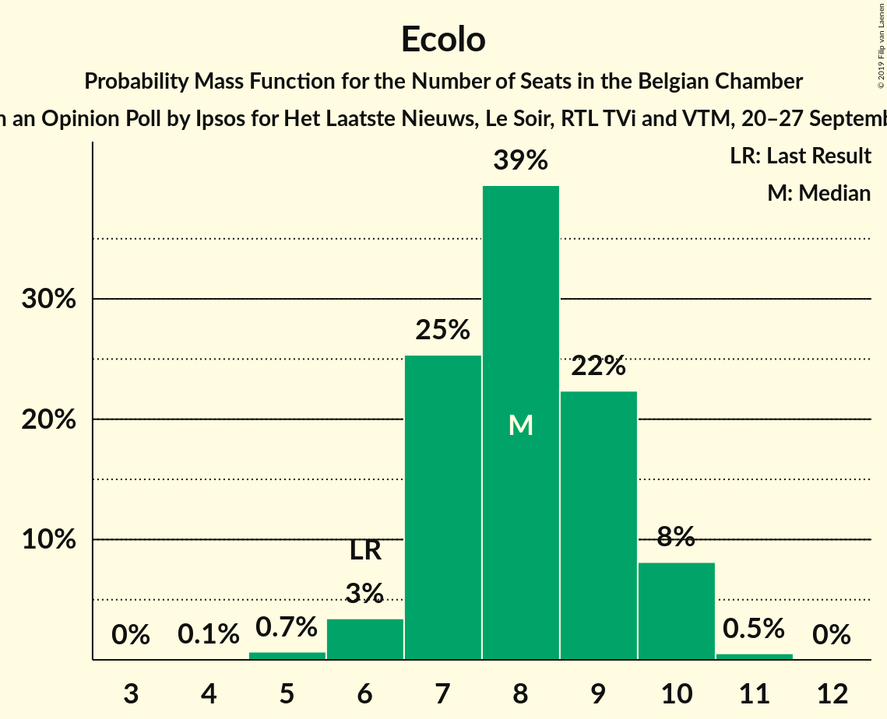
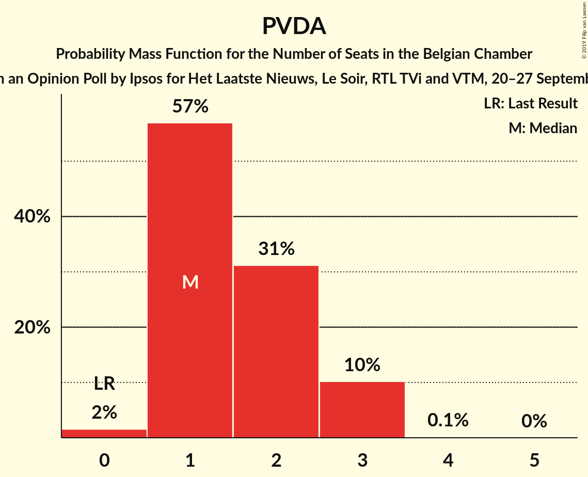
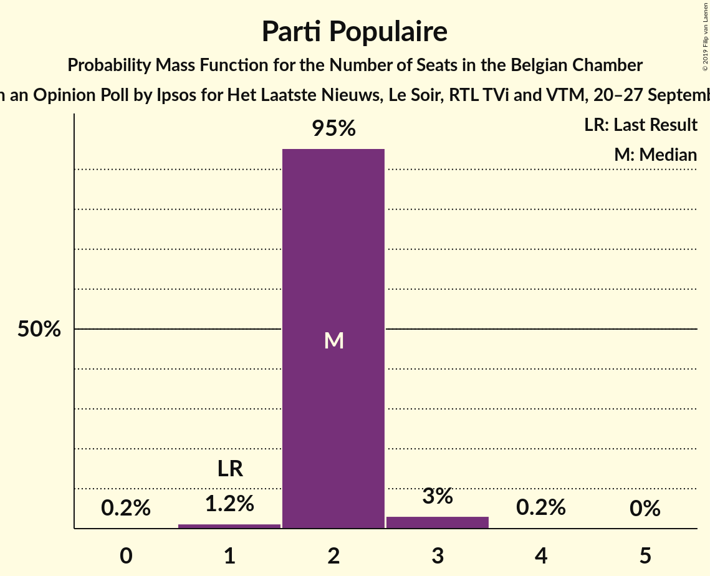
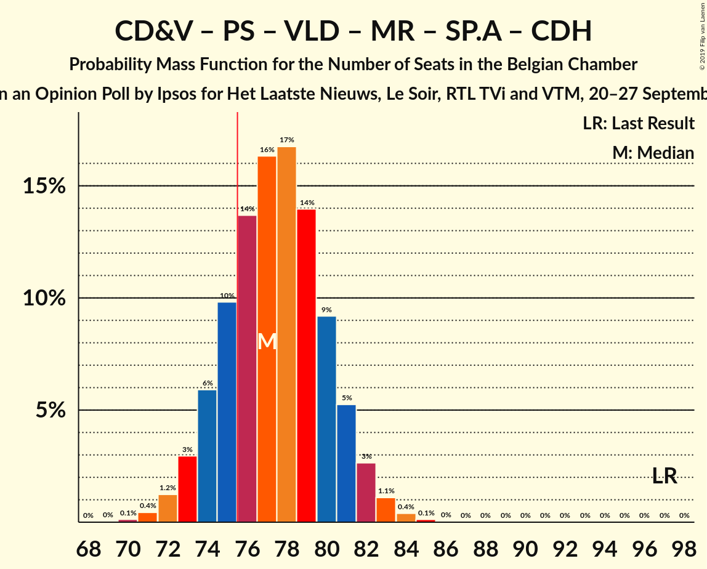
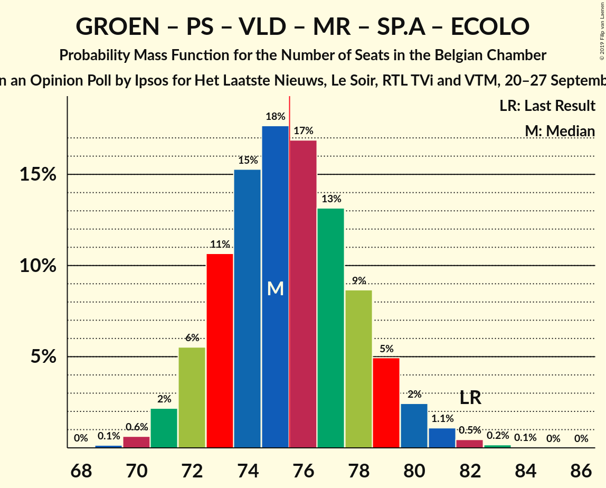
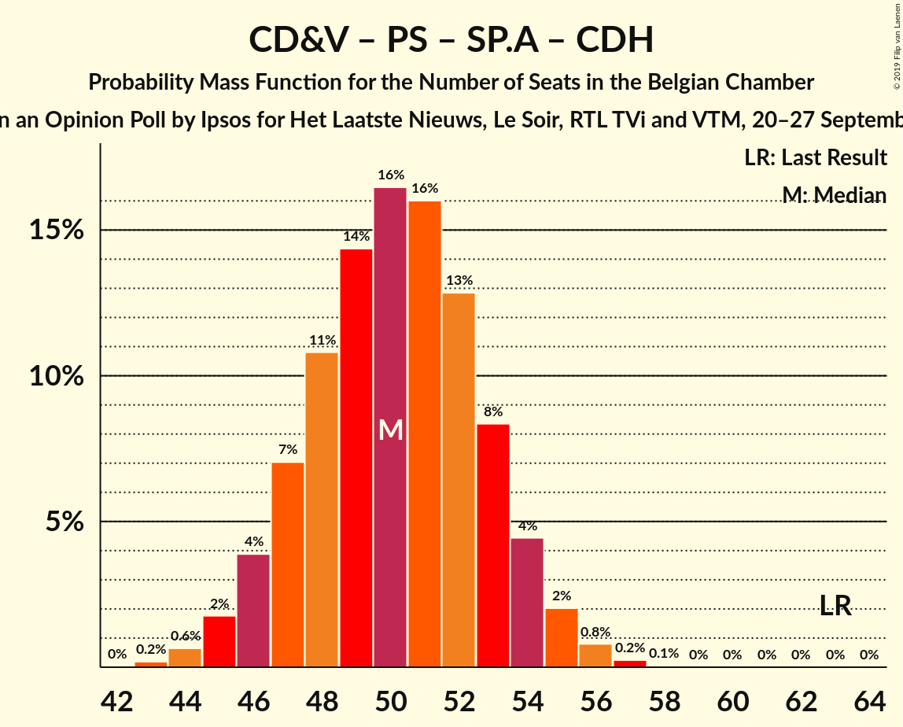

# Opinion Poll by Ipsos for Het Laatste Nieuws, Le Soir, RTL TVi and VTM, 20–27 September 2018

Areas included: Brussels, Flanders, Wallonia

<a href="#voting-intentions">Voting Intentions</a> | <a href="#seats">Seats</a> | <a href="#coalitions">Coalitions</a> | <a href="#technical-information">Technical Information</a>

## Voting Intentions

### Confidence Intervals

| Party | Last Result | Poll Result | 80% Confidence Interval | 90% Confidence Interval | 95% Confidence Interval | 99% Confidence Interval |
|:-----:|:-----------:|:-----------:|:-----------------------:|:-----------------------:|:-----------------------:|:-----------------------:|
| N-VA | 20.3% | 15.9% | 14.1–14.9% |13.9–15.0% |13.7–15.0% |13.3–15.0% |
| CD&V | 11.6% | 10.7% | 9.2–9.9% |9.0–9.9% |8.8–9.9% |8.5–9.9% |
| Groen | 5.3% | 8.7% | 7.9–9.3% |7.6–9.5% |7.4–9.5% |7.1–9.6% |
| PS | 11.7% | 8.4% | 7.3–7.7% |7.2–7.7% |7.1–7.8% |7.0–7.8% |
| Open Vld | 9.8% | 8.0% | 6.7–7.3% |6.5–7.3% |6.4–7.3% |6.1–7.3% |
| MR | 9.6% | 7.7% | 6.8–7.2% |6.7–7.2% |6.6–7.2% |6.4–7.2% |
| sp.a | 8.8% | 7.5% | 6.2–6.9% |6.1–6.9% |6.0–6.9% |5.7–6.9% |
| Vlaams Belang | 3.7% | 7.1% | 5.9–6.5% |5.7–6.5% |5.6–6.5% |5.3–6.5% |
| PTB | 2.0% | 4.7% | 3.9–4.2% |3.8–4.2% |3.8–4.2% |3.6–4.2% |
| Ecolo | 3.3% | 4.5% | 3.7–4.0% |3.7–4.0% |3.6–4.0% |3.5–4.0% |
| cdH | 5.0% | 3.5% | 2.9–3.2% |2.8–3.2% |2.8–3.2% |2.6–3.2% |
| DéFI | 1.8% | 3.3% | 2.7–2.9% |2.6–2.9% |2.6–2.9% |2.5–2.9% |
| PVDA | 1.8% | 2.7% | 2.3–3.1% |2.1–3.2% |2.0–3.2% |1.8–3.3% |
| Parti Populaire | 1.5% | 2.2% | 1.7–1.9% |1.6–1.9% |1.6–1.9% |1.5–1.9% |

*Note:* The poll result column reflects the actual value used in the calculations. Published results may vary slightly, and in addition be rounded to fewer digits.

## Seats

### Confidence Intervals

| Party | Last Result | Median | 80% Confidence Interval | 90% Confidence Interval | 95% Confidence Interval | 99% Confidence Interval |
|:-----:|:-----------:|:------:|:-----------------------:|:-----------------------:|:-----------------------:|:-----------------------:|
| <a href="#n-va">N-VA</a> | 33 | 25 | 24–27 |23–28 |22–29 |21–30 |
| <a href="#cd&v">CD&V</a> | 18 | 17 | 14–18 |14–18 |14–19 |13–20 |
| <a href="#groen">Groen</a> | 6 | 12 | 11–14 |11–15 |11–16 |10–16 |
| <a href="#ps">PS</a> | 23 | 17 | 15–19 |15–19 |15–19 |14–19 |
| <a href="#open-vld">Open Vld</a> | 14 | 12 | 11–13 |11–13 |9–14 |8–15 |
| <a href="#mr">MR</a> | 20 | 16 | 14–17 |14–18 |13–18 |13–19 |
| <a href="#sp.a">sp.a</a> | 13 | 11 | 9–13 |9–13 |9–14 |8–14 |
| <a href="#vlaams-belang">Vlaams Belang</a> | 3 | 9 | 8–12 |8–12 |8–12 |7–13 |
| <a href="#ptb">PTB</a> | 2 | 8 | 7–9 |6–10 |6–10 |6–10 |
| <a href="#ecolo">Ecolo</a> | 6 | 8 | 7–9 |7–10 |6–10 |5–10 |
| <a href="#cdh">cdH</a> | 9 | 6 | 4–7 |4–8 |4–8 |3–8 |
| <a href="#défi">DéFI</a> | 2 | 6 | 5–6 |3–6 |3–7 |2–7 |
| <a href="#pvda">PVDA</a> | 0 | 1 | 1–2 |1–3 |1–3 |0–3 |
| <a href="#parti-populaire">Parti Populaire</a> | 1 | 2 | 2 |2–3 |2–3 |2–3 |

### N-VA

*For a full overview of the results for this party, see the [N-VA](party-n-va.html) page.*

| Number of Seats | Probability | Accumulated | Special Marks |
|:---------------:|:-----------:|:-----------:|:-------------:|
| 20 | 0.1% | 100% |  |
| 21 | 0.5% | 99.8% |  |
| 22 | 2% | 99.3% |  |
| 23 | 7% | 97% |  |
| 24 | 18% | 90% |  |
| 25 | 27% | 73% | Median |
| 26 | 21% | 46% |  |
| 27 | 15% | 24% |  |
| 28 | 4% | 9% |  |
| 29 | 4% | 5% |  |
| 30 | 0.7% | 0.8% |  |
| 31 | 0% | 0% |  |
| 32 | 0% | 0% |  |
| 33 | 0% | 0% | Last Result |

### CD&V

*For a full overview of the results for this party, see the [CD&V](party-cdv.html) page.*

| Number of Seats | Probability | Accumulated | Special Marks |
|:---------------:|:-----------:|:-----------:|:-------------:|
| 13 | 1.2% | 100% |  |
| 14 | 25% | 98.8% |  |
| 15 | 5% | 74% |  |
| 16 | 9% | 68% |  |
| 17 | 16% | 59% | Median |
| 18 | 41% | 44% | Last Result |
| 19 | 2% | 3% |  |
| 20 | 0.5% | 0.9% |  |
| 21 | 0.4% | 0.5% |  |
| 22 | 0.1% | 0.1% |  |
| 23 | 0% | 0% |  |

### Groen

*For a full overview of the results for this party, see the [Groen](party-groen.html) page.*

| Number of Seats | Probability | Accumulated | Special Marks |
|:---------------:|:-----------:|:-----------:|:-------------:|
| 6 | 0% | 100% | Last Result |
| 7 | 0% | 100% |  |
| 8 | 0% | 100% |  |
| 9 | 0% | 100% |  |
| 10 | 1.0% | 100% |  |
| 11 | 12% | 99.0% |  |
| 12 | 59% | 87% | Median |
| 13 | 15% | 28% |  |
| 14 | 7% | 13% |  |
| 15 | 3% | 7% |  |
| 16 | 3% | 4% |  |
| 17 | 0.4% | 0.4% |  |
| 18 | 0% | 0% |  |

### PS

*For a full overview of the results for this party, see the [PS](party-ps.html) page.*

| Number of Seats | Probability | Accumulated | Special Marks |
|:---------------:|:-----------:|:-----------:|:-------------:|
| 14 | 2% | 100% |  |
| 15 | 9% | 98% |  |
| 16 | 22% | 90% |  |
| 17 | 34% | 67% | Median |
| 18 | 20% | 34% |  |
| 19 | 13% | 13% |  |
| 20 | 0.4% | 0.4% |  |
| 21 | 0% | 0% |  |
| 22 | 0% | 0% |  |
| 23 | 0% | 0% | Last Result |

### Open Vld

*For a full overview of the results for this party, see the [Open Vld](party-openvld.html) page.*

| Number of Seats | Probability | Accumulated | Special Marks |
|:---------------:|:-----------:|:-----------:|:-------------:|
| 8 | 1.1% | 100% |  |
| 9 | 2% | 98.9% |  |
| 10 | 2% | 97% |  |
| 11 | 41% | 95% |  |
| 12 | 38% | 54% | Median |
| 13 | 12% | 16% |  |
| 14 | 3% | 4% | Last Result |
| 15 | 0.3% | 0.6% |  |
| 16 | 0.2% | 0.3% |  |
| 17 | 0.1% | 0.2% |  |
| 18 | 0% | 0% |  |

### MR

*For a full overview of the results for this party, see the [MR](party-mr.html) page.*

| Number of Seats | Probability | Accumulated | Special Marks |
|:---------------:|:-----------:|:-----------:|:-------------:|
| 12 | 0.2% | 100% |  |
| 13 | 5% | 99.8% |  |
| 14 | 16% | 95% |  |
| 15 | 27% | 80% |  |
| 16 | 36% | 53% | Median |
| 17 | 11% | 17% |  |
| 18 | 5% | 6% |  |
| 19 | 0.8% | 0.8% |  |
| 20 | 0.1% | 0.1% | Last Result |
| 21 | 0% | 0% |  |

### sp.a

*For a full overview of the results for this party, see the [sp.a](party-spa.html) page.*

| Number of Seats | Probability | Accumulated | Special Marks |
|:---------------:|:-----------:|:-----------:|:-------------:|
| 7 | 0.1% | 100% |  |
| 8 | 0.6% | 99.9% |  |
| 9 | 17% | 99.3% |  |
| 10 | 15% | 83% |  |
| 11 | 46% | 68% | Median |
| 12 | 11% | 22% |  |
| 13 | 8% | 12% | Last Result |
| 14 | 4% | 4% |  |
| 15 | 0.2% | 0.2% |  |
| 16 | 0% | 0% |  |

### Vlaams Belang

*For a full overview of the results for this party, see the [Vlaams Belang](party-vlaamsbelang.html) page.*

| Number of Seats | Probability | Accumulated | Special Marks |
|:---------------:|:-----------:|:-----------:|:-------------:|
| 3 | 0% | 100% | Last Result |
| 4 | 0% | 100% |  |
| 5 | 0% | 100% |  |
| 6 | 0% | 100% |  |
| 7 | 0.8% | 100% |  |
| 8 | 47% | 99.2% |  |
| 9 | 7% | 52% | Median |
| 10 | 11% | 45% |  |
| 11 | 14% | 33% |  |
| 12 | 18% | 19% |  |
| 13 | 1.1% | 1.1% |  |
| 14 | 0% | 0% |  |

### PTB

*For a full overview of the results for this party, see the [PTB](party-ptb.html) page.*

| Number of Seats | Probability | Accumulated | Special Marks |
|:---------------:|:-----------:|:-----------:|:-------------:|
| 2 | 0% | 100% | Last Result |
| 3 | 0% | 100% |  |
| 4 | 0% | 100% |  |
| 5 | 0.5% | 100% |  |
| 6 | 6% | 99.5% |  |
| 7 | 18% | 94% |  |
| 8 | 38% | 75% | Median |
| 9 | 32% | 38% |  |
| 10 | 5% | 5% |  |
| 11 | 0.1% | 0.1% |  |
| 12 | 0% | 0% |  |

### Ecolo

*For a full overview of the results for this party, see the [Ecolo](party-ecolo.html) page.*

| Number of Seats | Probability | Accumulated | Special Marks |
|:---------------:|:-----------:|:-----------:|:-------------:|
| 5 | 0.6% | 100% |  |
| 6 | 4% | 99.4% | Last Result |
| 7 | 25% | 96% |  |
| 8 | 39% | 70% | Median |
| 9 | 23% | 31% |  |
| 10 | 8% | 8% |  |
| 11 | 0.5% | 0.5% |  |
| 12 | 0% | 0% |  |

### cdH

*For a full overview of the results for this party, see the [cdH](party-cdh.html) page.*

| Number of Seats | Probability | Accumulated | Special Marks |
|:---------------:|:-----------:|:-----------:|:-------------:|
| 3 | 2% | 100% |  |
| 4 | 9% | 98% |  |
| 5 | 21% | 90% |  |
| 6 | 47% | 69% | Median |
| 7 | 15% | 22% |  |
| 8 | 7% | 7% |  |
| 9 | 0.1% | 0.1% | Last Result |
| 10 | 0% | 0% |  |

### DéFI

*For a full overview of the results for this party, see the [DéFI](party-défi.html) page.*

| Number of Seats | Probability | Accumulated | Special Marks |
|:---------------:|:-----------:|:-----------:|:-------------:|
| 2 | 1.1% | 100% | Last Result |
| 3 | 5% | 98.9% |  |
| 4 | 3% | 94% |  |
| 5 | 21% | 90% |  |
| 6 | 66% | 70% | Median |
| 7 | 4% | 4% |  |
| 8 | 0.1% | 0.1% |  |
| 9 | 0% | 0% |  |

### PVDA

*For a full overview of the results for this party, see the [PVDA](party-pvda.html) page.*

| Number of Seats | Probability | Accumulated | Special Marks |
|:---------------:|:-----------:|:-----------:|:-------------:|
| 0 | 2% | 100% | Last Result |
| 1 | 58% | 98% | Median |
| 2 | 33% | 40% |  |
| 3 | 7% | 7% |  |
| 4 | 0.1% | 0.1% |  |
| 5 | 0% | 0% |  |

### Parti Populaire

*For a full overview of the results for this party, see the [Parti Populaire](party-partipopulaire.html) page.*

| Number of Seats | Probability | Accumulated | Special Marks |
|:---------------:|:-----------:|:-----------:|:-------------:|
| 1 | 0% | 100% | Last Result |
| 2 | 94% | 99.9% | Median |
| 3 | 6% | 6% |  |
| 4 | 0.2% | 0.2% |  |
| 5 | 0% | 0% |  |

## Coalitions

### Confidence Intervals

| Coalition | Last Result | Median | Majority? | 80% Confidence Interval | 90% Confidence Interval | 95% Confidence Interval | 99% Confidence Interval |
|:---------:|:-----------:|:------:|:---------:|:-----------------------:|:-----------------------:|:-----------------------:|:-----------------------:|
| CD&V – Groen – PS – Open Vld – MR – sp.a – Ecolo – cdH | 109 | 98 | 100% | 95–101 | 95–102 | 94–102 | 93–104 |
| CD&V – Groen – PS – sp.a – PTB – Ecolo – cdH – PVDA | 77 | 80 | 98.6% | 77–83 | 77–84 | 76–85 | 75–86 |
| CD&V – PS – Open Vld – MR – sp.a – cdH | 97 | 77 | 77% | 74–81 | 73–82 | 73–82 | 71–84 |
| Groen – PS – Open Vld – MR – sp.a – Ecolo | 82 | 75 | 48% | 73–78 | 72–79 | 71–80 | 70–82 |
| N-VA – CD&V – Open Vld – MR – cdH | 94 | 75 | 44% | 72–78 | 71–79 | 70–80 | 68–81 |
| CD&V – Groen – PS – sp.a – Ecolo – cdH | 75 | 71 | 2% | 68–74 | 67–75 | 66–75 | 65–77 |
| CD&V – Groen – Open Vld – MR – Ecolo – cdH | 73 | 70 | 1.0% | 67–73 | 67–73 | 66–74 | 65–76 |
| N-VA – CD&V – Open Vld – MR | 85 | 69 | 0.2% | 66–72 | 65–73 | 64–74 | 63–75 |
| CD&V – PS – Open Vld – MR – cdH | 84 | 67 | 0% | 63–69 | 63–70 | 62–71 | 61–72 |
| Groen – PS – sp.a – PTB – Ecolo – cdH – PVDA | 59 | 64 | 0% | 61–66 | 61–67 | 60–68 | 59–70 |
| Groen – PS – sp.a – PTB – Ecolo – PVDA | 50 | 58 | 0% | 55–61 | 54–62 | 54–62 | 53–64 |
| PS – Open Vld – MR – sp.a | 70 | 55 | 0% | 53–58 | 52–59 | 51–60 | 50–61 |
| CD&V – PS – sp.a – cdH | 63 | 50 | 0% | 47–53 | 46–54 | 45–55 | 44–56 |
| CD&V – Open Vld – MR – cdH | 61 | 50 | 0% | 46–52 | 46–53 | 45–54 | 44–55 |

### CD&V – Groen – PS – Open Vld – MR – sp.a – Ecolo – cdH

| Number of Seats | Probability | Accumulated | Special Marks |
|:---------------:|:-----------:|:-----------:|:-------------:|
| 91 | 0.1% | 100% |  |
| 92 | 0.3% | 99.9% |  |
| 93 | 1.1% | 99.6% |  |
| 94 | 4% | 98.5% |  |
| 95 | 9% | 95% |  |
| 96 | 14% | 86% |  |
| 97 | 18% | 73% |  |
| 98 | 19% | 55% |  |
| 99 | 15% | 36% | Median |
| 100 | 10% | 22% |  |
| 101 | 6% | 12% |  |
| 102 | 3% | 5% |  |
| 103 | 1.4% | 2% |  |
| 104 | 0.5% | 0.7% |  |
| 105 | 0.2% | 0.2% |  |
| 106 | 0% | 0% |  |
| 107 | 0% | 0% |  |
| 108 | 0% | 0% |  |
| 109 | 0% | 0% | Last Result |

### CD&V – Groen – PS – sp.a – PTB – Ecolo – cdH – PVDA

| Number of Seats | Probability | Accumulated | Special Marks |
|:---------------:|:-----------:|:-----------:|:-------------:|
| 73 | 0.1% | 100% |  |
| 74 | 0.3% | 99.9% |  |
| 75 | 1.0% | 99.6% |  |
| 76 | 3% | 98.6% | Majority |
| 77 | 6% | 95% | Last Result |
| 78 | 10% | 89% |  |
| 79 | 15% | 79% |  |
| 80 | 19% | 63% | Median |
| 81 | 17% | 45% |  |
| 82 | 12% | 28% |  |
| 83 | 8% | 16% |  |
| 84 | 4% | 8% |  |
| 85 | 2% | 3% |  |
| 86 | 0.8% | 1.1% |  |
| 87 | 0.2% | 0.3% |  |
| 88 | 0.1% | 0.1% |  |
| 89 | 0% | 0% |  |

### CD&V – PS – Open Vld – MR – sp.a – cdH

| Number of Seats | Probability | Accumulated | Special Marks |
|:---------------:|:-----------:|:-----------:|:-------------:|
| 70 | 0.1% | 100% |  |
| 71 | 0.5% | 99.9% |  |
| 72 | 2% | 99.4% |  |
| 73 | 4% | 98% |  |
| 74 | 7% | 94% |  |
| 75 | 10% | 87% |  |
| 76 | 13% | 77% | Majority |
| 77 | 15% | 65% |  |
| 78 | 16% | 50% |  |
| 79 | 14% | 34% | Median |
| 80 | 9% | 20% |  |
| 81 | 6% | 11% |  |
| 82 | 3% | 5% |  |
| 83 | 1.3% | 2% |  |
| 84 | 0.5% | 0.8% |  |
| 85 | 0.2% | 0.2% |  |
| 86 | 0% | 0.1% |  |
| 87 | 0% | 0% |  |
| 88 | 0% | 0% |  |
| 89 | 0% | 0% |  |
| 90 | 0% | 0% |  |
| 91 | 0% | 0% |  |
| 92 | 0% | 0% |  |
| 93 | 0% | 0% |  |
| 94 | 0% | 0% |  |
| 95 | 0% | 0% |  |
| 96 | 0% | 0% |  |
| 97 | 0% | 0% | Last Result |

### Groen – PS – Open Vld – MR – sp.a – Ecolo

| Number of Seats | Probability | Accumulated | Special Marks |
|:---------------:|:-----------:|:-----------:|:-------------:|
| 69 | 0.2% | 100% |  |
| 70 | 0.6% | 99.8% |  |
| 71 | 2% | 99.2% |  |
| 72 | 6% | 97% |  |
| 73 | 11% | 91% |  |
| 74 | 15% | 81% |  |
| 75 | 17% | 65% |  |
| 76 | 16% | 48% | Median, Majority |
| 77 | 13% | 32% |  |
| 78 | 9% | 19% |  |
| 79 | 5% | 10% |  |
| 80 | 3% | 5% |  |
| 81 | 1.2% | 2% |  |
| 82 | 0.5% | 0.7% | Last Result |
| 83 | 0.2% | 0.2% |  |
| 84 | 0.1% | 0.1% |  |
| 85 | 0% | 0% |  |

### N-VA – CD&V – Open Vld – MR – cdH

| Number of Seats | Probability | Accumulated | Special Marks |
|:---------------:|:-----------:|:-----------:|:-------------:|
| 67 | 0.1% | 100% |  |
| 68 | 0.5% | 99.8% |  |
| 69 | 1.3% | 99.3% |  |
| 70 | 3% | 98% |  |
| 71 | 5% | 95% |  |
| 72 | 8% | 90% |  |
| 73 | 11% | 83% |  |
| 74 | 13% | 72% |  |
| 75 | 15% | 59% |  |
| 76 | 15% | 44% | Median, Majority |
| 77 | 13% | 29% |  |
| 78 | 8% | 16% |  |
| 79 | 4% | 8% |  |
| 80 | 2% | 3% |  |
| 81 | 0.7% | 1.0% |  |
| 82 | 0.2% | 0.3% |  |
| 83 | 0.1% | 0.1% |  |
| 84 | 0% | 0% |  |
| 85 | 0% | 0% |  |
| 86 | 0% | 0% |  |
| 87 | 0% | 0% |  |
| 88 | 0% | 0% |  |
| 89 | 0% | 0% |  |
| 90 | 0% | 0% |  |
| 91 | 0% | 0% |  |
| 92 | 0% | 0% |  |
| 93 | 0% | 0% |  |
| 94 | 0% | 0% | Last Result |

### CD&V – Groen – PS – sp.a – Ecolo – cdH

| Number of Seats | Probability | Accumulated | Special Marks |
|:---------------:|:-----------:|:-----------:|:-------------:|
| 63 | 0.1% | 100% |  |
| 64 | 0.3% | 99.9% |  |
| 65 | 0.9% | 99.7% |  |
| 66 | 3% | 98.8% |  |
| 67 | 5% | 96% |  |
| 68 | 9% | 91% |  |
| 69 | 13% | 82% |  |
| 70 | 16% | 69% |  |
| 71 | 17% | 53% | Median |
| 72 | 15% | 36% |  |
| 73 | 10% | 21% |  |
| 74 | 6% | 11% |  |
| 75 | 3% | 5% | Last Result |
| 76 | 1.4% | 2% | Majority |
| 77 | 0.5% | 0.7% |  |
| 78 | 0.1% | 0.2% |  |
| 79 | 0% | 0.1% |  |
| 80 | 0% | 0% |  |

### CD&V – Groen – Open Vld – MR – Ecolo – cdH

| Number of Seats | Probability | Accumulated | Special Marks |
|:---------------:|:-----------:|:-----------:|:-------------:|
| 63 | 0.1% | 100% |  |
| 64 | 0.3% | 99.9% |  |
| 65 | 1.1% | 99.6% |  |
| 66 | 3% | 98.5% |  |
| 67 | 7% | 95% |  |
| 68 | 12% | 88% |  |
| 69 | 17% | 76% |  |
| 70 | 20% | 58% |  |
| 71 | 17% | 39% | Median |
| 72 | 11% | 22% |  |
| 73 | 6% | 11% | Last Result |
| 74 | 3% | 5% |  |
| 75 | 1.2% | 2% |  |
| 76 | 0.6% | 1.0% | Majority |
| 77 | 0.3% | 0.4% |  |
| 78 | 0.1% | 0.1% |  |
| 79 | 0% | 0% |  |

### N-VA – CD&V – Open Vld – MR

| Number of Seats | Probability | Accumulated | Special Marks |
|:---------------:|:-----------:|:-----------:|:-------------:|
| 61 | 0.1% | 100% |  |
| 62 | 0.3% | 99.9% |  |
| 63 | 1.0% | 99.6% |  |
| 64 | 2% | 98.7% |  |
| 65 | 5% | 96% |  |
| 66 | 7% | 92% |  |
| 67 | 10% | 85% |  |
| 68 | 13% | 74% |  |
| 69 | 15% | 62% |  |
| 70 | 16% | 46% | Median |
| 71 | 14% | 30% |  |
| 72 | 9% | 16% |  |
| 73 | 4% | 7% |  |
| 74 | 2% | 3% |  |
| 75 | 0.6% | 0.9% |  |
| 76 | 0.2% | 0.2% | Majority |
| 77 | 0% | 0% |  |
| 78 | 0% | 0% |  |
| 79 | 0% | 0% |  |
| 80 | 0% | 0% |  |
| 81 | 0% | 0% |  |
| 82 | 0% | 0% |  |
| 83 | 0% | 0% |  |
| 84 | 0% | 0% |  |
| 85 | 0% | 0% | Last Result |

### CD&V – PS – Open Vld – MR – cdH

| Number of Seats | Probability | Accumulated | Special Marks |
|:---------------:|:-----------:|:-----------:|:-------------:|
| 59 | 0.1% | 100% |  |
| 60 | 0.3% | 99.9% |  |
| 61 | 1.1% | 99.6% |  |
| 62 | 3% | 98.6% |  |
| 63 | 6% | 96% |  |
| 64 | 9% | 90% |  |
| 65 | 12% | 80% |  |
| 66 | 15% | 69% |  |
| 67 | 18% | 54% |  |
| 68 | 16% | 35% | Median |
| 69 | 10% | 19% |  |
| 70 | 5% | 9% |  |
| 71 | 3% | 4% |  |
| 72 | 1.0% | 1.4% |  |
| 73 | 0.3% | 0.4% |  |
| 74 | 0.1% | 0.1% |  |
| 75 | 0% | 0% |  |
| 76 | 0% | 0% | Majority |
| 77 | 0% | 0% |  |
| 78 | 0% | 0% |  |
| 79 | 0% | 0% |  |
| 80 | 0% | 0% |  |
| 81 | 0% | 0% |  |
| 82 | 0% | 0% |  |
| 83 | 0% | 0% |  |
| 84 | 0% | 0% | Last Result |

### Groen – PS – sp.a – PTB – Ecolo – cdH – PVDA

| Number of Seats | Probability | Accumulated | Special Marks |
|:---------------:|:-----------:|:-----------:|:-------------:|
| 57 | 0% | 100% |  |
| 58 | 0.2% | 99.9% |  |
| 59 | 1.1% | 99.7% | Last Result |
| 60 | 4% | 98.6% |  |
| 61 | 8% | 95% |  |
| 62 | 15% | 87% |  |
| 63 | 19% | 72% | Median |
| 64 | 18% | 53% |  |
| 65 | 15% | 35% |  |
| 66 | 10% | 20% |  |
| 67 | 5% | 10% |  |
| 68 | 3% | 5% |  |
| 69 | 1.2% | 2% |  |
| 70 | 0.5% | 0.7% |  |
| 71 | 0.2% | 0.2% |  |
| 72 | 0% | 0.1% |  |
| 73 | 0% | 0% |  |

### Groen – PS – sp.a – PTB – Ecolo – PVDA

| Number of Seats | Probability | Accumulated | Special Marks |
|:---------------:|:-----------:|:-----------:|:-------------:|
| 50 | 0% | 100% | Last Result |
| 51 | 0.1% | 100% |  |
| 52 | 0.3% | 99.9% |  |
| 53 | 1.2% | 99.6% |  |
| 54 | 4% | 98% |  |
| 55 | 8% | 95% |  |
| 56 | 13% | 87% |  |
| 57 | 19% | 73% | Median |
| 58 | 17% | 55% |  |
| 59 | 15% | 38% |  |
| 60 | 10% | 22% |  |
| 61 | 6% | 12% |  |
| 62 | 3% | 6% |  |
| 63 | 2% | 2% |  |
| 64 | 0.6% | 1.0% |  |
| 65 | 0.2% | 0.3% |  |
| 66 | 0.1% | 0.1% |  |
| 67 | 0% | 0% |  |

### PS – Open Vld – MR – sp.a

| Number of Seats | Probability | Accumulated | Special Marks |
|:---------------:|:-----------:|:-----------:|:-------------:|
| 48 | 0% | 100% |  |
| 49 | 0.2% | 99.9% |  |
| 50 | 0.7% | 99.8% |  |
| 51 | 2% | 99.0% |  |
| 52 | 6% | 97% |  |
| 53 | 13% | 90% |  |
| 54 | 19% | 78% |  |
| 55 | 20% | 59% |  |
| 56 | 16% | 39% | Median |
| 57 | 11% | 24% |  |
| 58 | 7% | 13% |  |
| 59 | 4% | 6% |  |
| 60 | 2% | 3% |  |
| 61 | 0.6% | 1.0% |  |
| 62 | 0.2% | 0.3% |  |
| 63 | 0.1% | 0.1% |  |
| 64 | 0% | 0% |  |
| 65 | 0% | 0% |  |
| 66 | 0% | 0% |  |
| 67 | 0% | 0% |  |
| 68 | 0% | 0% |  |
| 69 | 0% | 0% |  |
| 70 | 0% | 0% | Last Result |

### CD&V – PS – sp.a – cdH

| Number of Seats | Probability | Accumulated | Special Marks |
|:---------------:|:-----------:|:-----------:|:-------------:|
| 43 | 0.2% | 100% |  |
| 44 | 0.7% | 99.8% |  |
| 45 | 2% | 99.1% |  |
| 46 | 4% | 97% |  |
| 47 | 8% | 93% |  |
| 48 | 10% | 85% |  |
| 49 | 13% | 75% |  |
| 50 | 15% | 62% |  |
| 51 | 15% | 47% | Median |
| 52 | 13% | 32% |  |
| 53 | 9% | 19% |  |
| 54 | 6% | 10% |  |
| 55 | 2% | 4% |  |
| 56 | 1.1% | 2% |  |
| 57 | 0.3% | 0.4% |  |
| 58 | 0.1% | 0.1% |  |
| 59 | 0% | 0% |  |
| 60 | 0% | 0% |  |
| 61 | 0% | 0% |  |
| 62 | 0% | 0% |  |
| 63 | 0% | 0% | Last Result |

### CD&V – Open Vld – MR – cdH

| Number of Seats | Probability | Accumulated | Special Marks |
|:---------------:|:-----------:|:-----------:|:-------------:|
| 42 | 0.1% | 100% |  |
| 43 | 0.4% | 99.9% |  |
| 44 | 1.3% | 99.5% |  |
| 45 | 3% | 98% |  |
| 46 | 6% | 95% |  |
| 47 | 9% | 90% |  |
| 48 | 13% | 80% |  |
| 49 | 14% | 68% |  |
| 50 | 17% | 54% |  |
| 51 | 17% | 36% | Median |
| 52 | 11% | 19% |  |
| 53 | 5% | 8% |  |
| 54 | 2% | 3% |  |
| 55 | 0.7% | 1.0% |  |
| 56 | 0.2% | 0.3% |  |
| 57 | 0.1% | 0.1% |  |
| 58 | 0% | 0% |  |
| 59 | 0% | 0% |  |
| 60 | 0% | 0% |  |
| 61 | 0% | 0% | Last Result |

## Technical Information

### Opinion Poll

+ **Polling firm:** Ipsos
+ **Commissioner(s):** Het Laatste Nieuws, Le Soir, RTL TVi and VTM
+ **Fieldwork period:** 20–27 September 2018

### Calculations

+ **Sample size:** 1616
+ **Simulations done:** 131,072
+ **Error estimate:** 1.54%

