# Opinion Poll by Ipsos for Het Laatste Nieuws, Le Soir, RTL TVi and VTM, 27 November–3 December 2018

Areas included: Brussels, Flanders, Wallonia

<a href="#voting-intentions">Voting Intentions</a> | <a href="#seats">Seats</a> | <a href="#coalitions">Coalitions</a> | <a href="#technical-information">Technical Information</a>

## Voting Intentions

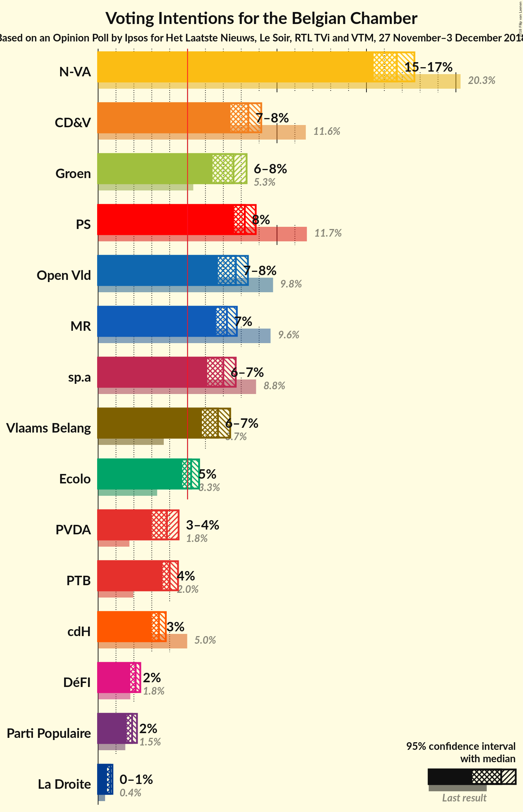

### Confidence Intervals

| Party | Last Result | Poll Result | 80% Confidence Interval | 90% Confidence Interval | 95% Confidence Interval | 99% Confidence Interval |
|:-----:|:-----------:|:-----------:|:-----------------------:|:-----------------------:|:-----------------------:|:-----------------------:|
| N-VA | 20.3% | 17.7% | 15.8–16.7% |15.6–16.7% |15.4–16.7% |15.0–16.7% |
| CD&V | 11.6% | 9.1% | 7.7–8.4% |7.5–8.4% |7.4–8.4% |7.1–8.4% |
| PS | 11.7% | 8.8% | 7.8–8.2% |7.7–8.2% |7.6–8.2% |7.4–8.2% |
| Open Vld | 9.8% | 8.4% | 7.0–7.7% |6.9–7.7% |6.7–7.7% |6.4–7.7% |
| MR | 9.6% | 7.8% | 6.8–7.1% |6.7–7.2% |6.6–7.2% |6.4–7.2% |
| sp.a | 8.8% | 7.7% | 6.4–7.0% |6.2–7.0% |6.1–7.0% |5.8–7.0% |
| Groen | 5.3% | 7.6% | 6.8–8.2% |6.6–8.3% |6.4–8.3% |6.0–8.4% |
| Vlaams Belang | 3.7% | 7.4% | 6.1–6.7% |5.9–6.7% |5.8–6.7% |5.5–6.7% |
| Ecolo | 3.3% | 5.6% | 4.9–5.2% |4.8–5.2% |4.7–5.2% |4.6–5.2% |
| PTB | 2.0% | 4.5% | 3.7–4.0% |3.6–4.0% |3.6–4.0% |3.4–4.0% |
| PVDA | 1.8% | 3.8% | 3.3–4.3% |3.1–4.4% |3.0–4.5% |2.8–4.5% |
| cdH | 5.0% | 3.8% | 3.1–3.4% |3.0–3.4% |3.0–3.4% |2.8–3.4% |
| DéFI | 1.8% | 2.4% | 1.9–2.1% |1.8–2.1% |1.8–2.1% |1.7–2.1% |
| Parti Populaire | 1.5% | 2.2% | 1.7–1.9% |1.6–1.9% |1.6–1.9% |1.5–1.9% |
| La Droite | 0.4% | 0.7% | 0.5–0.7% |0.5–0.7% |0.5–0.8% |0.4–0.8% |

*Note:* The poll result column reflects the actual value used in the calculations. Published results may vary slightly, and in addition be rounded to fewer digits.

## Seats

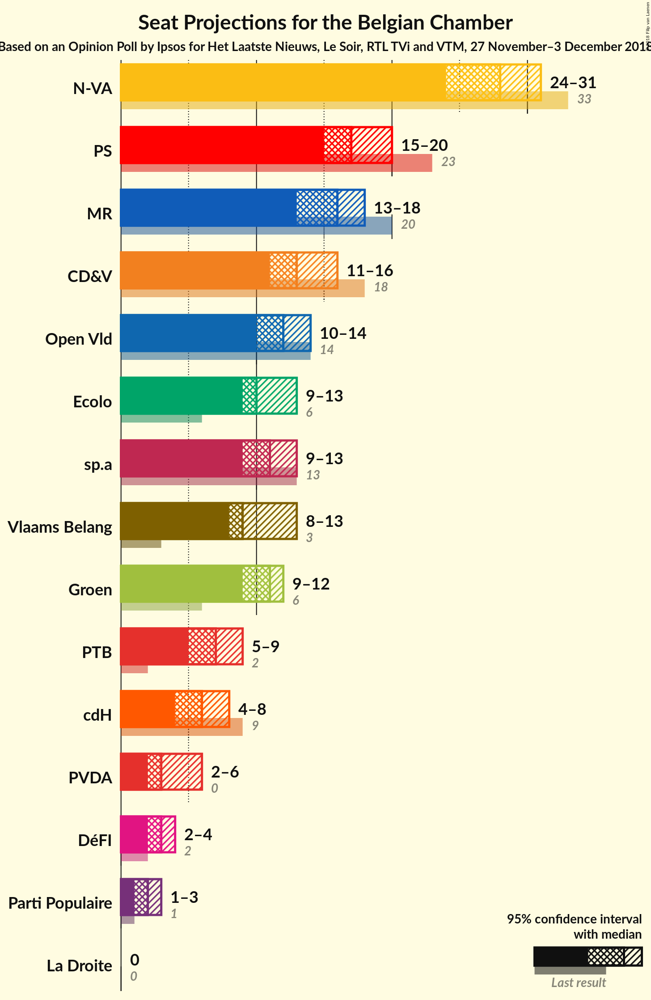

### Confidence Intervals

| Party | Last Result | Median | 80% Confidence Interval | 90% Confidence Interval | 95% Confidence Interval | 99% Confidence Interval |
|:-----:|:-----------:|:------:|:-----------------------:|:-----------------------:|:-----------------------:|:-----------------------:|
| <a href="#n-va">N-VA</a> | 33 | 31 | 28–31 |28–31 |27–31 |25–31 |
| <a href="#cd&v">CD&V</a> | 18 | 13 | 13 |13 |13 |11–17 |
| <a href="#ps">PS</a> | 23 | 17 | 17–18 |17–19 |16–19 |15–20 |
| <a href="#open-vld">Open Vld</a> | 14 | 12 | 12 |12 |12 |11–14 |
| <a href="#mr">MR</a> | 20 | 17 | 15–18 |15–18 |14–18 |14–18 |
| <a href="#sp.a">sp.a</a> | 13 | 10 | 10–11 |10–11 |10–11 |10–12 |
| <a href="#groen">Groen</a> | 6 | 10 | 10–11 |10–11 |10–11 |10–11 |
| <a href="#vlaams-belang">Vlaams Belang</a> | 3 | 9 | 8–9 |8–9 |8–9 |8–13 |
| <a href="#ecolo">Ecolo</a> | 6 | 10 | 10–12 |10–12 |9–13 |9–13 |
| <a href="#ptb">PTB</a> | 2 | 8 | 7–9 |6–9 |6–9 |5–9 |
| <a href="#pvda">PVDA</a> | 0 | 3 | 3–5 |3–5 |3–5 |2–5 |
| <a href="#cdh">cdH</a> | 9 | 5 | 4–7 |4–7 |4–8 |3–8 |
| <a href="#défi">DéFI</a> | 2 | 2 | 2 |2 |2 |2–4 |
| <a href="#parti-populaire">Parti Populaire</a> | 1 | 2 | 2 |1–3 |1–3 |0–3 |
| <a href="#la-droite">La Droite</a> | 0 | 0 | 0 |0 |0 |0 |

### N-VA

*For a full overview of the results for this party, see the [N-VA](party-n-va.html) page.*

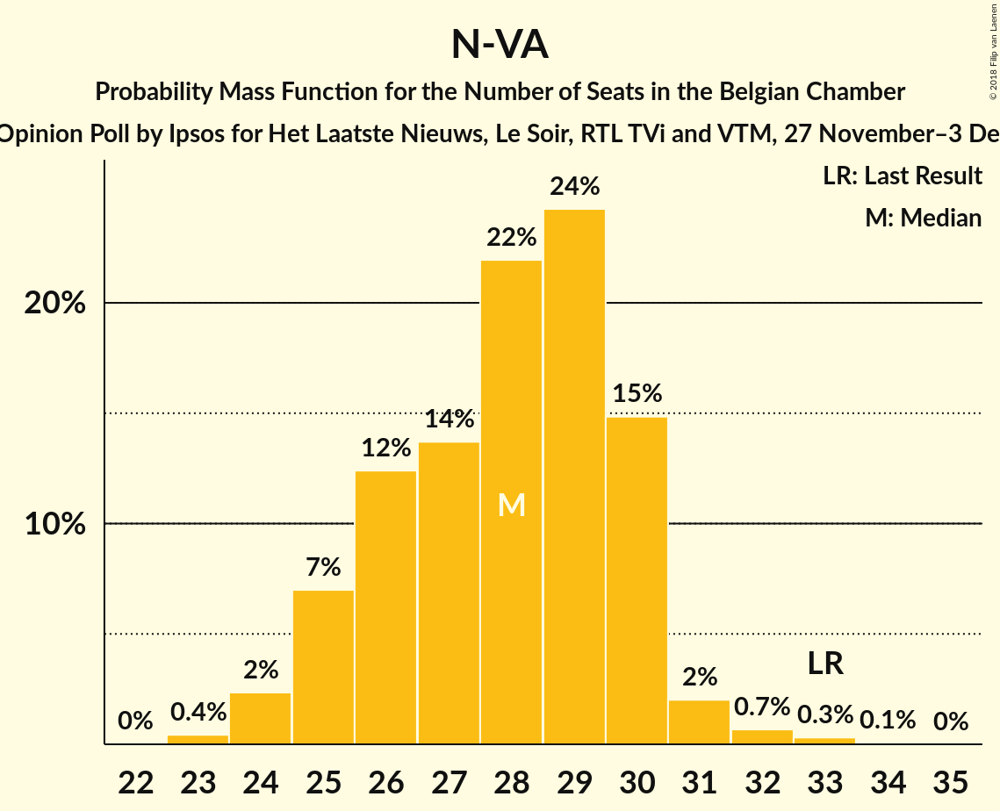

| Number of Seats | Probability | Accumulated | Special Marks |
|:---------------:|:-----------:|:-----------:|:-------------:|
| 24 | 0.1% | 100% |  |
| 25 | 0.5% | 99.9% |  |
| 26 | 0.1% | 99.4% |  |
| 27 | 2% | 99.4% |  |
| 28 | 19% | 97% |  |
| 29 | 0.4% | 78% |  |
| 30 | 5% | 78% |  |
| 31 | 73% | 73% | Median |
| 32 | 0.1% | 0.1% |  |
| 33 | 0% | 0% | Last Result |

### CD&V

*For a full overview of the results for this party, see the [CD&V](party-cdv.html) page.*

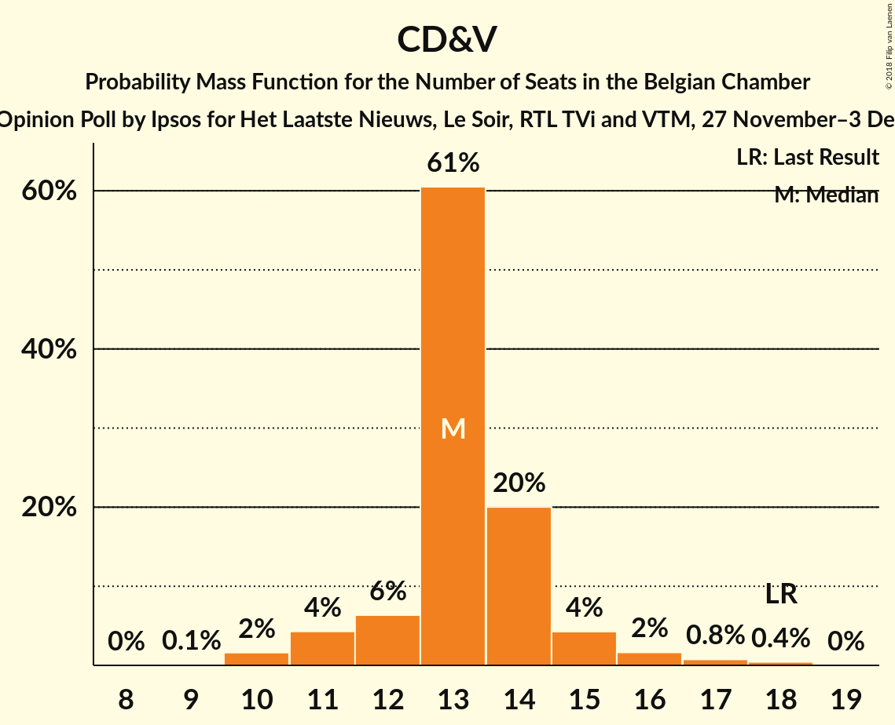

| Number of Seats | Probability | Accumulated | Special Marks |
|:---------------:|:-----------:|:-----------:|:-------------:|
| 10 | 0.4% | 100% |  |
| 11 | 0.1% | 99.6% |  |
| 12 | 0% | 99.5% |  |
| 13 | 98% | 99.5% | Median |
| 14 | 0.5% | 1.3% |  |
| 15 | 0% | 0.8% |  |
| 16 | 0% | 0.8% |  |
| 17 | 0.7% | 0.8% |  |
| 18 | 0% | 0% | Last Result |

### PS

*For a full overview of the results for this party, see the [PS](party-ps.html) page.*

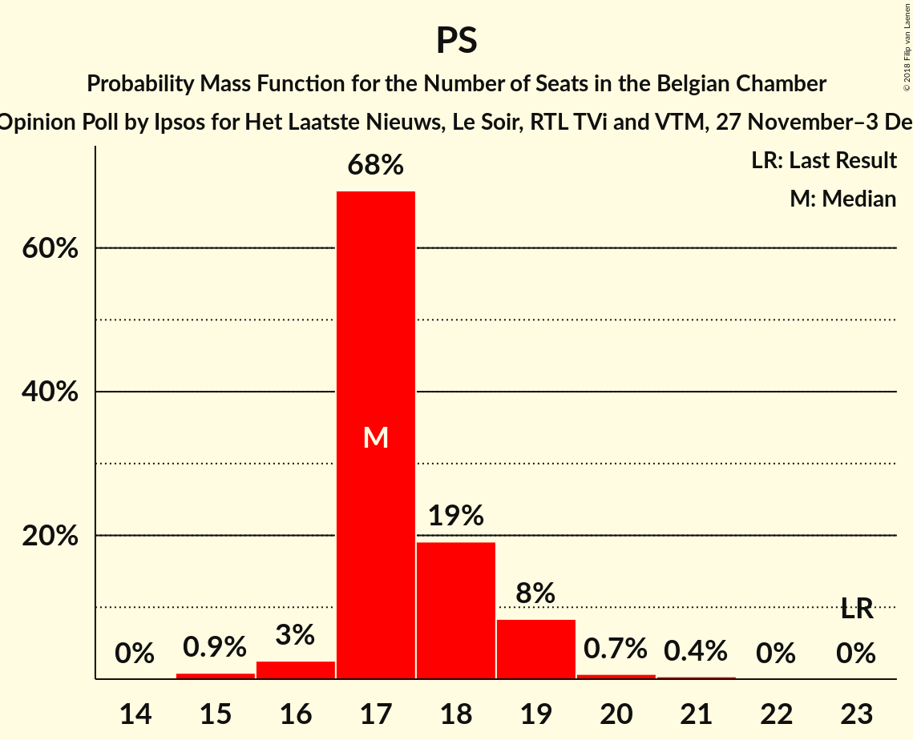

| Number of Seats | Probability | Accumulated | Special Marks |
|:---------------:|:-----------:|:-----------:|:-------------:|
| 15 | 0.9% | 100% |  |
| 16 | 3% | 99.1% |  |
| 17 | 68% | 97% | Median |
| 18 | 19% | 29% |  |
| 19 | 8% | 9% |  |
| 20 | 0.7% | 1.1% |  |
| 21 | 0.4% | 0.4% |  |
| 22 | 0% | 0% |  |
| 23 | 0% | 0% | Last Result |

### Open Vld

*For a full overview of the results for this party, see the [Open Vld](party-openvld.html) page.*

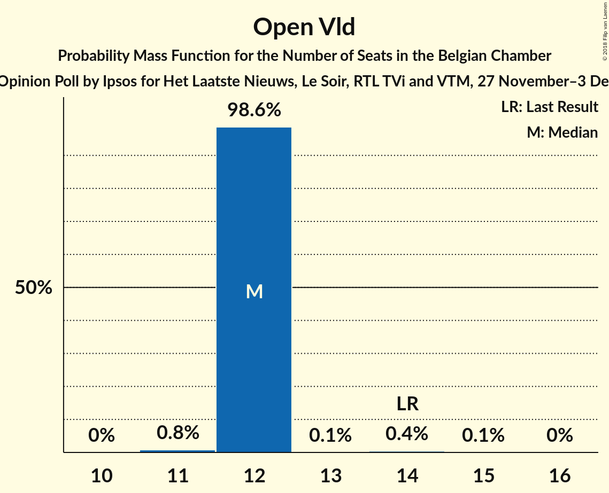

| Number of Seats | Probability | Accumulated | Special Marks |
|:---------------:|:-----------:|:-----------:|:-------------:|
| 11 | 0.8% | 100% |  |
| 12 | 98.6% | 99.2% | Median |
| 13 | 0.1% | 0.6% |  |
| 14 | 0.4% | 0.5% | Last Result |
| 15 | 0.1% | 0.1% |  |
| 16 | 0% | 0% |  |

### MR

*For a full overview of the results for this party, see the [MR](party-mr.html) page.*

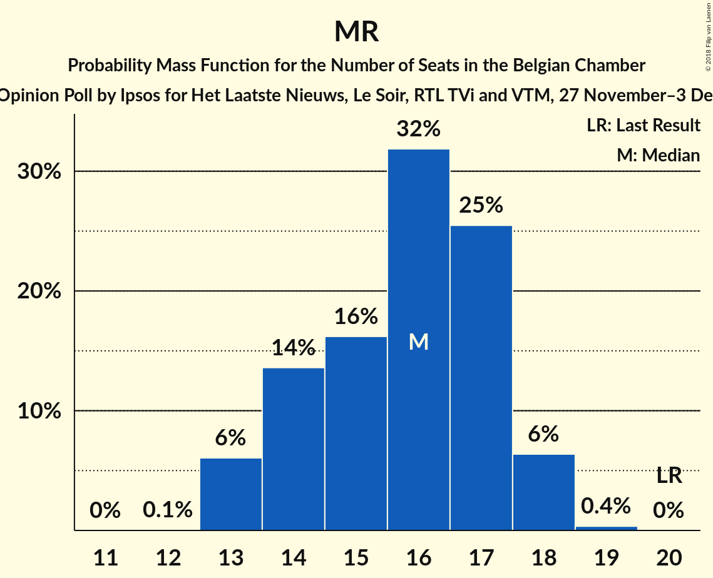

| Number of Seats | Probability | Accumulated | Special Marks |
|:---------------:|:-----------:|:-----------:|:-------------:|
| 13 | 0.2% | 100% |  |
| 14 | 3% | 99.8% |  |
| 15 | 17% | 97% |  |
| 16 | 18% | 79% |  |
| 17 | 44% | 61% | Median |
| 18 | 17% | 17% |  |
| 19 | 0% | 0% |  |
| 20 | 0% | 0% | Last Result |

### sp.a

*For a full overview of the results for this party, see the [sp.a](party-spa.html) page.*

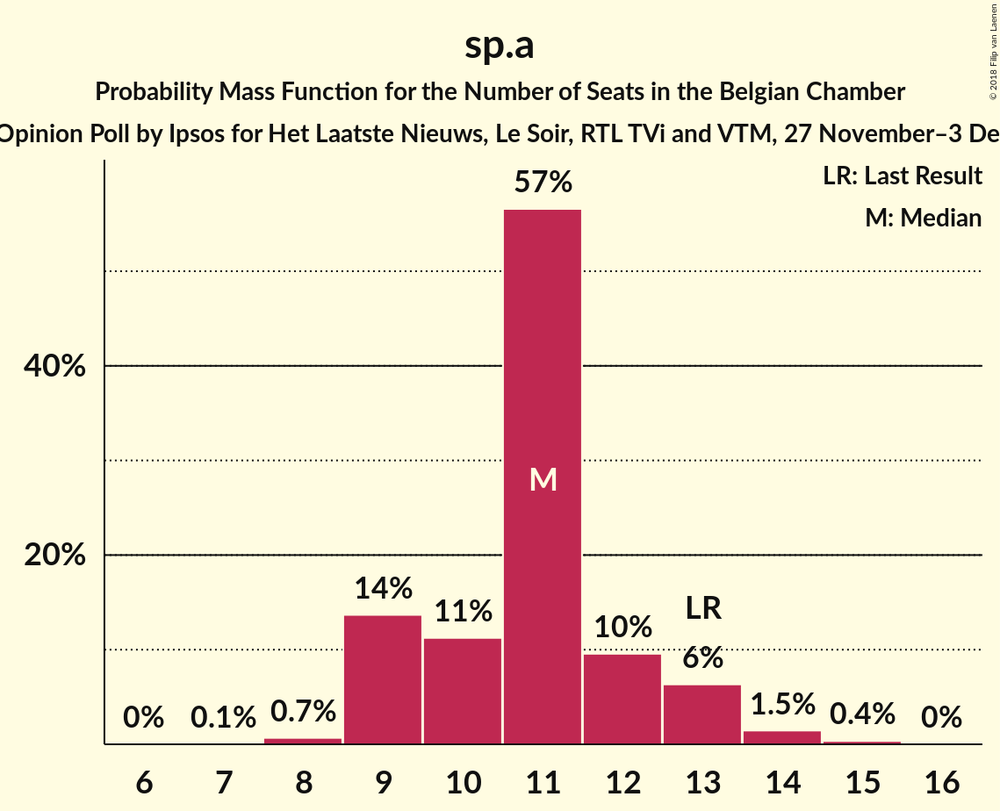

| Number of Seats | Probability | Accumulated | Special Marks |
|:---------------:|:-----------:|:-----------:|:-------------:|
| 10 | 78% | 100% | Median |
| 11 | 21% | 22% |  |
| 12 | 0.8% | 0.9% |  |
| 13 | 0.1% | 0.1% | Last Result |
| 14 | 0% | 0% |  |

### Groen

*For a full overview of the results for this party, see the [Groen](party-groen.html) page.*

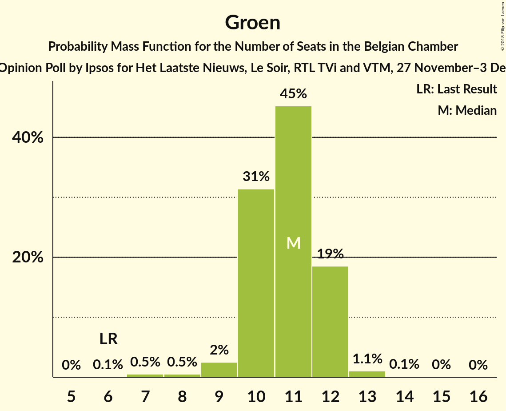

| Number of Seats | Probability | Accumulated | Special Marks |
|:---------------:|:-----------:|:-----------:|:-------------:|
| 6 | 0% | 100% | Last Result |
| 7 | 0.1% | 100% |  |
| 8 | 0% | 99.9% |  |
| 9 | 0% | 99.9% |  |
| 10 | 79% | 99.9% | Median |
| 11 | 21% | 21% |  |
| 12 | 0% | 0.1% |  |
| 13 | 0% | 0% |  |

### Vlaams Belang

*For a full overview of the results for this party, see the [Vlaams Belang](party-vlaamsbelang.html) page.*

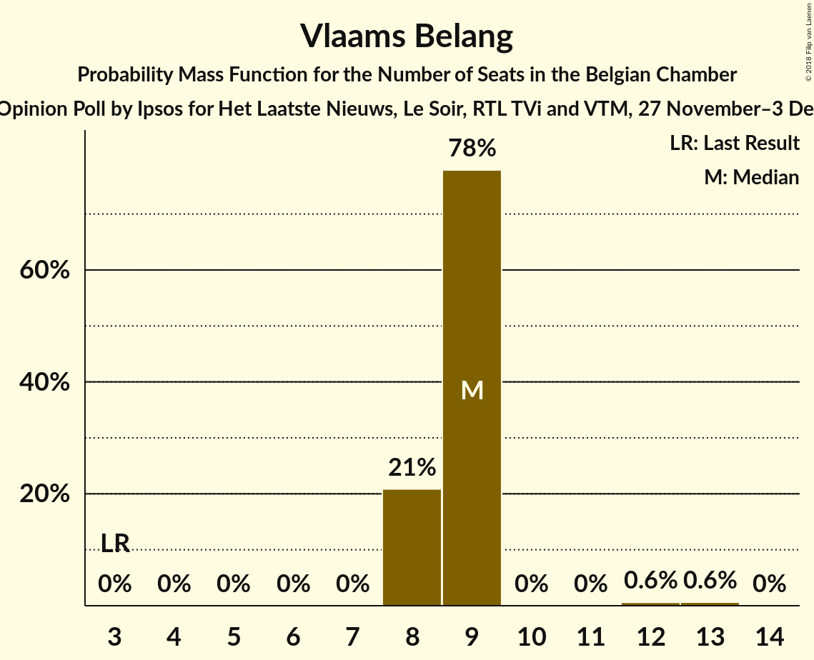

| Number of Seats | Probability | Accumulated | Special Marks |
|:---------------:|:-----------:|:-----------:|:-------------:|
| 3 | 0% | 100% | Last Result |
| 4 | 0% | 100% |  |
| 5 | 0% | 100% |  |
| 6 | 0% | 100% |  |
| 7 | 0% | 100% |  |
| 8 | 21% | 100% |  |
| 9 | 78% | 79% | Median |
| 10 | 0% | 1.3% |  |
| 11 | 0% | 1.2% |  |
| 12 | 0.6% | 1.2% |  |
| 13 | 0.6% | 0.6% |  |
| 14 | 0% | 0% |  |

### Ecolo

*For a full overview of the results for this party, see the [Ecolo](party-ecolo.html) page.*

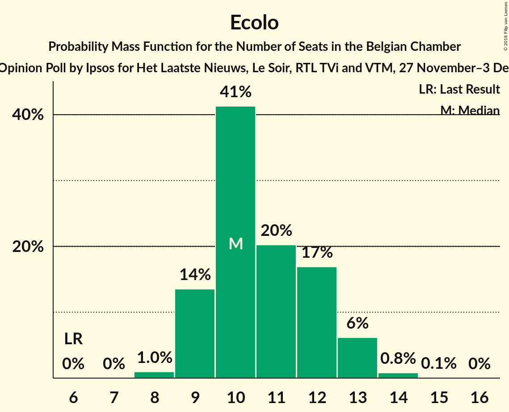

| Number of Seats | Probability | Accumulated | Special Marks |
|:---------------:|:-----------:|:-----------:|:-------------:|
| 6 | 0% | 100% | Last Result |
| 7 | 0% | 100% |  |
| 8 | 0% | 100% |  |
| 9 | 4% | 100% |  |
| 10 | 74% | 96% | Median |
| 11 | 12% | 23% |  |
| 12 | 6% | 11% |  |
| 13 | 4% | 4% |  |
| 14 | 0.2% | 0.2% |  |
| 15 | 0% | 0% |  |

### PTB

*For a full overview of the results for this party, see the [PTB](party-ptb.html) page.*

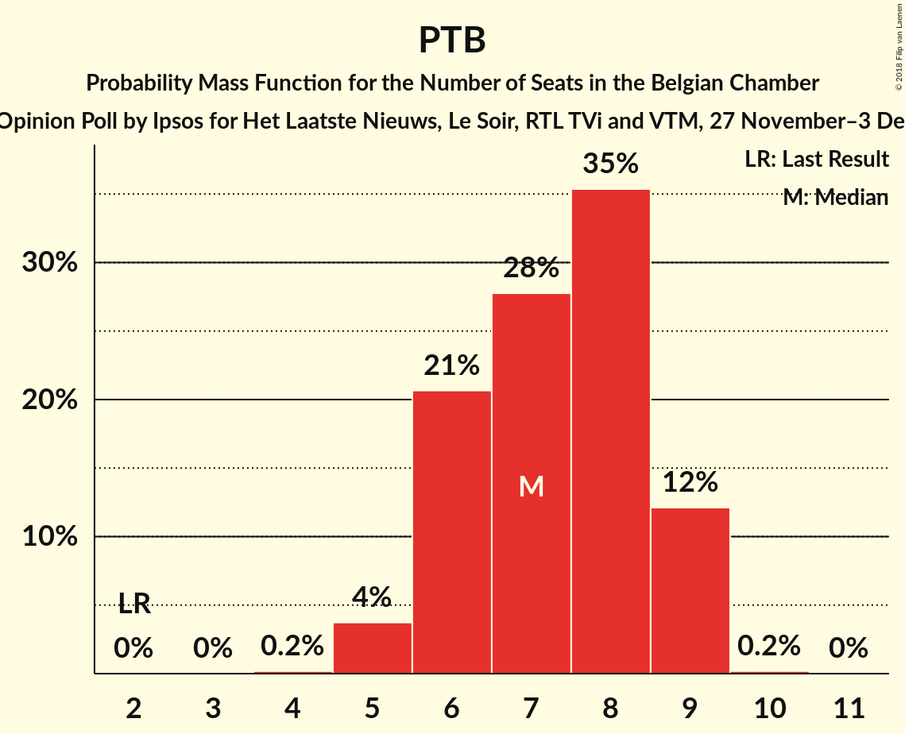

| Number of Seats | Probability | Accumulated | Special Marks |
|:---------------:|:-----------:|:-----------:|:-------------:|
| 2 | 0% | 100% | Last Result |
| 3 | 0% | 100% |  |
| 4 | 0% | 100% |  |
| 5 | 1.3% | 100% |  |
| 6 | 4% | 98.7% |  |
| 7 | 8% | 95% |  |
| 8 | 47% | 87% | Median |
| 9 | 40% | 40% |  |
| 10 | 0% | 0% |  |

### PVDA

*For a full overview of the results for this party, see the [PVDA](party-pvda.html) page.*

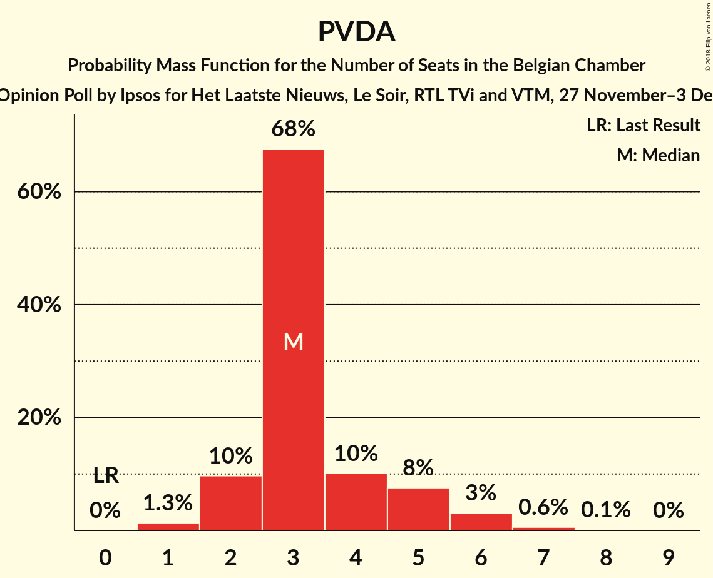

| Number of Seats | Probability | Accumulated | Special Marks |
|:---------------:|:-----------:|:-----------:|:-------------:|
| 0 | 0% | 100% | Last Result |
| 1 | 0.2% | 100% |  |
| 2 | 0.9% | 99.8% |  |
| 3 | 79% | 98.9% | Median |
| 4 | 0% | 20% |  |
| 5 | 20% | 20% |  |
| 6 | 0.3% | 0.3% |  |
| 7 | 0% | 0% |  |

### cdH

*For a full overview of the results for this party, see the [cdH](party-cdh.html) page.*

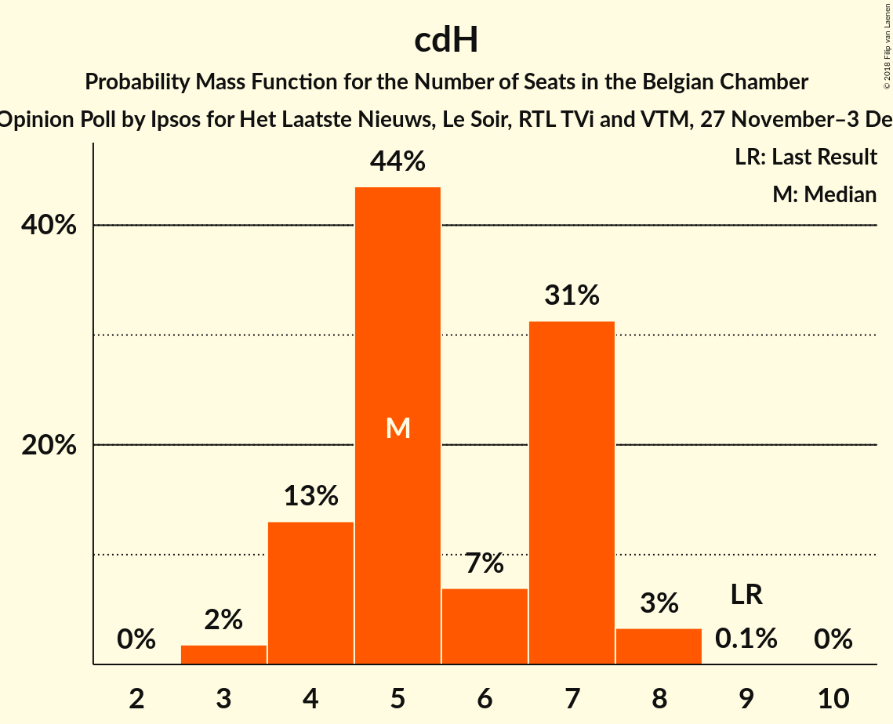

| Number of Seats | Probability | Accumulated | Special Marks |
|:---------------:|:-----------:|:-----------:|:-------------:|
| 3 | 2% | 100% |  |
| 4 | 13% | 98% |  |
| 5 | 44% | 85% | Median |
| 6 | 7% | 42% |  |
| 7 | 31% | 35% |  |
| 8 | 3% | 3% |  |
| 9 | 0.1% | 0.1% | Last Result |
| 10 | 0% | 0% |  |

### DéFI

*For a full overview of the results for this party, see the [DéFI](party-défi.html) page.*

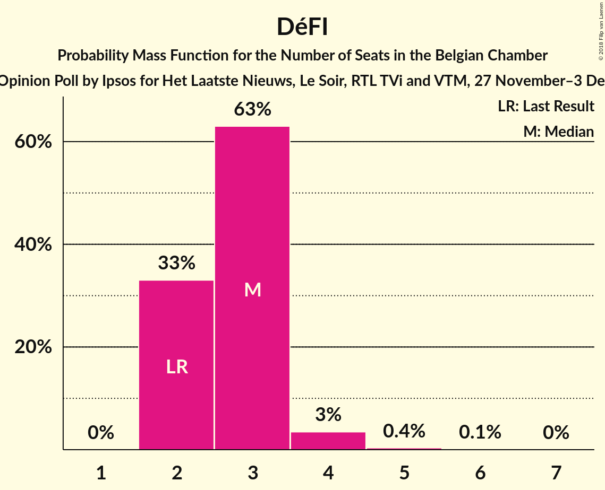

| Number of Seats | Probability | Accumulated | Special Marks |
|:---------------:|:-----------:|:-----------:|:-------------:|
| 2 | 98.6% | 100% | Last Result, Median |
| 3 | 0.7% | 1.3% |  |
| 4 | 0.6% | 0.7% |  |
| 5 | 0.1% | 0.1% |  |
| 6 | 0% | 0% |  |

### Parti Populaire

*For a full overview of the results for this party, see the [Parti Populaire](party-partipopulaire.html) page.*

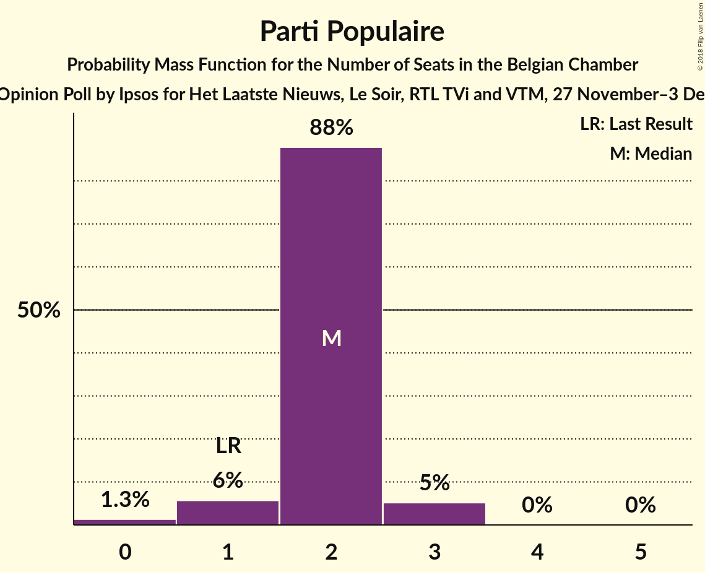

| Number of Seats | Probability | Accumulated | Special Marks |
|:---------------:|:-----------:|:-----------:|:-------------:|
| 0 | 1.3% | 100% |  |
| 1 | 6% | 98.7% | Last Result |
| 2 | 88% | 93% | Median |
| 3 | 5% | 5% |  |
| 4 | 0% | 0% |  |

### La Droite

*For a full overview of the results for this party, see the [La Droite](party-ladroite.html) page.*

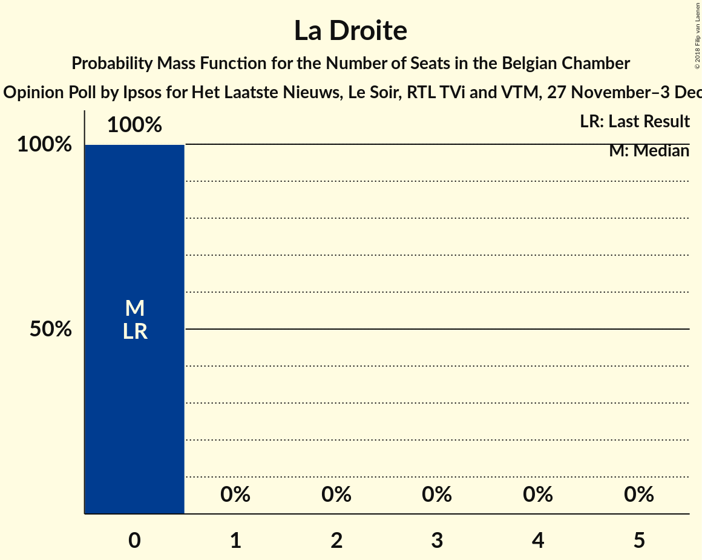

| Number of Seats | Probability | Accumulated | Special Marks |
|:---------------:|:-----------:|:-----------:|:-------------:|
| 0 | 100% | 100% | Last Result, Median |

## Coalitions

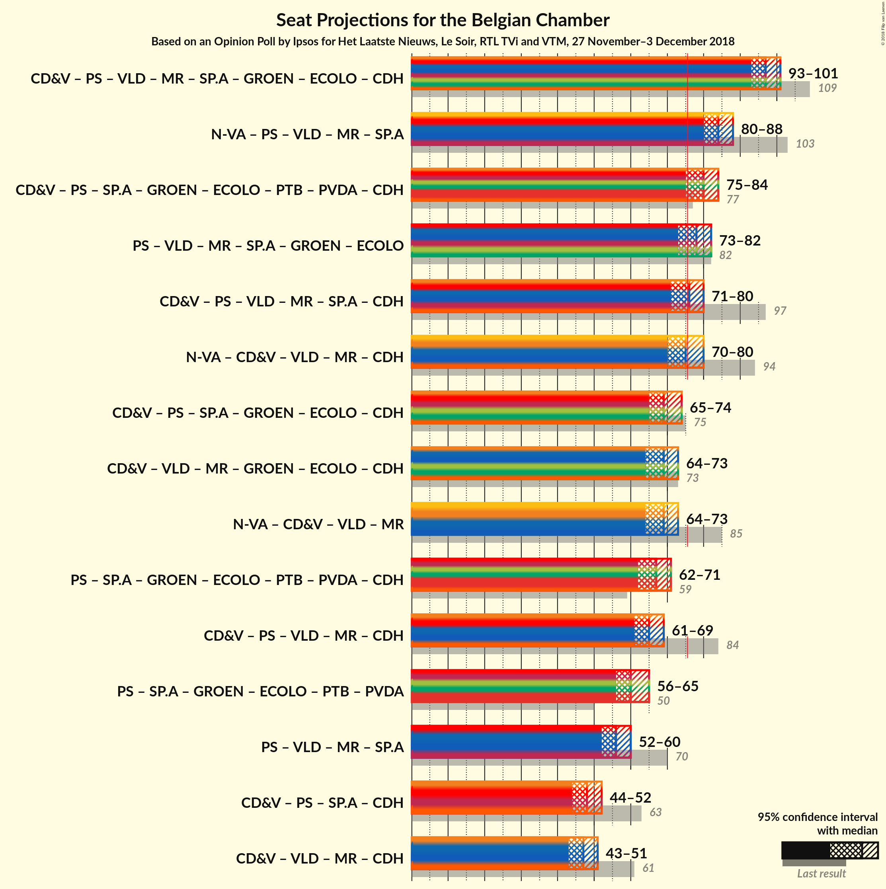

### Confidence Intervals

| Coalition | Last Result | Median | Majority? | 80% Confidence Interval | 90% Confidence Interval | 95% Confidence Interval | 99% Confidence Interval |
|:---------:|:-----------:|:------:|:---------:|:-----------------------:|:-----------------------:|:-----------------------:|:-----------------------:|
| CD&V – PS – Open Vld – MR – sp.a – Groen – Ecolo – cdH | 109 | 95 | 100% | 94–97 | 94–98 | 94–98 | 93–101 |
| N-VA – PS – Open Vld – MR – sp.a | 103 | 87 | 100% | 84–88 | 84–89 | 83–89 | 82–90 |
| CD&V – PS – sp.a – Groen – Ecolo – PTB – PVDA – cdH | 77 | 78 | 99.5% | 76–81 | 76–82 | 76–83 | 76–84 |
| PS – Open Vld – MR – sp.a – Groen – Ecolo | 82 | 76 | 78% | 75–78 | 75–80 | 75–80 | 74–81 |
| N-VA – CD&V – Open Vld – MR – cdH | 94 | 78 | 81% | 75–79 | 74–80 | 74–80 | 72–81 |
| CD&V – PS – Open Vld – MR – sp.a – cdH | 97 | 75 | 24% | 74–76 | 73–77 | 73–77 | 72–80 |
| N-VA – CD&V – Open Vld – MR | 85 | 72 | 0% | 70–74 | 68–74 | 68–74 | 67–74 |
| CD&V – PS – sp.a – Groen – Ecolo – cdH | 75 | 67 | 0% | 65–69 | 65–70 | 65–71 | 64–72 |
| CD&V – Open Vld – MR – Groen – Ecolo – cdH | 73 | 68 | 0% | 67–69 | 67–70 | 66–70 | 65–71 |
| PS – sp.a – Groen – Ecolo – PTB – PVDA – cdH | 59 | 65 | 0% | 63–68 | 63–69 | 63–70 | 63–71 |
| CD&V – PS – Open Vld – MR – cdH | 84 | 64 | 0% | 63–66 | 63–67 | 62–67 | 62–68 |
| PS – sp.a – Groen – Ecolo – PTB – PVDA | 50 | 59 | 0% | 58–63 | 57–63 | 57–64 | 57–67 |
| PS – Open Vld – MR – sp.a | 70 | 56 | 0% | 55–58 | 54–58 | 54–59 | 53–59 |
| CD&V – PS – sp.a – cdH | 63 | 46 | 0% | 45–48 | 44–49 | 44–50 | 43–51 |
| CD&V – Open Vld – MR – cdH | 61 | 47 | 0% | 46–48 | 45–49 | 44–49 | 43–51 |

### CD&V – PS – Open Vld – MR – sp.a – Groen – Ecolo – cdH

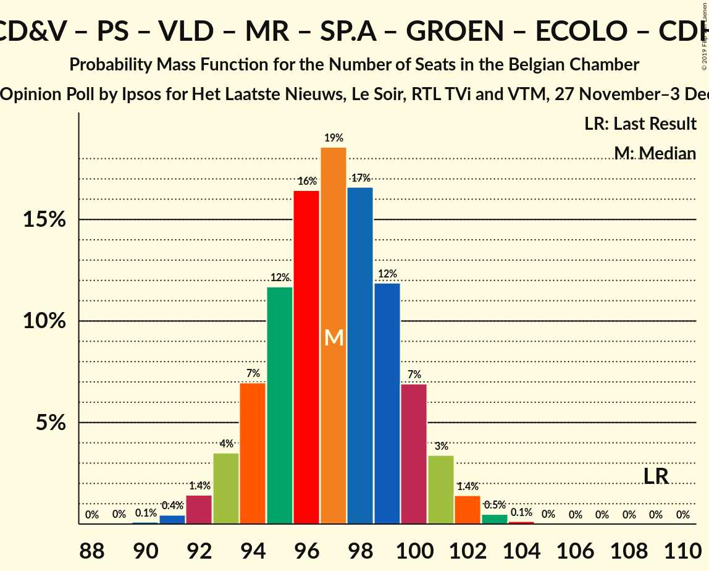

| Number of Seats | Probability | Accumulated | Special Marks |
|:---------------:|:-----------:|:-----------:|:-------------:|
| 92 | 0.1% | 100% |  |
| 93 | 0.7% | 99.9% |  |
| 94 | 31% | 99.2% | Median |
| 95 | 32% | 69% |  |
| 96 | 19% | 37% |  |
| 97 | 12% | 18% |  |
| 98 | 4% | 6% |  |
| 99 | 1.1% | 2% |  |
| 100 | 0.6% | 1.1% |  |
| 101 | 0.4% | 0.6% |  |
| 102 | 0.1% | 0.2% |  |
| 103 | 0% | 0.1% |  |
| 104 | 0% | 0% |  |
| 105 | 0% | 0% |  |
| 106 | 0% | 0% |  |
| 107 | 0% | 0% |  |
| 108 | 0% | 0% |  |
| 109 | 0% | 0% | Last Result |

### N-VA – PS – Open Vld – MR – sp.a

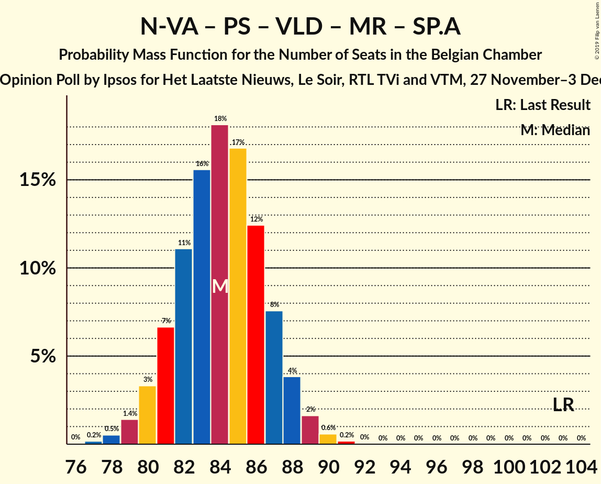

| Number of Seats | Probability | Accumulated | Special Marks |
|:---------------:|:-----------:|:-----------:|:-------------:|
| 80 | 0.1% | 100% |  |
| 81 | 0.3% | 99.8% |  |
| 82 | 0.6% | 99.6% |  |
| 83 | 2% | 98.9% |  |
| 84 | 7% | 97% |  |
| 85 | 14% | 90% |  |
| 86 | 23% | 76% |  |
| 87 | 36% | 53% | Median |
| 88 | 10% | 17% |  |
| 89 | 5% | 6% |  |
| 90 | 0.6% | 0.7% |  |
| 91 | 0% | 0.1% |  |
| 92 | 0% | 0% |  |
| 93 | 0% | 0% |  |
| 94 | 0% | 0% |  |
| 95 | 0% | 0% |  |
| 96 | 0% | 0% |  |
| 97 | 0% | 0% |  |
| 98 | 0% | 0% |  |
| 99 | 0% | 0% |  |
| 100 | 0% | 0% |  |
| 101 | 0% | 0% |  |
| 102 | 0% | 0% |  |
| 103 | 0% | 0% | Last Result |

### CD&V – PS – sp.a – Groen – Ecolo – PTB – PVDA – cdH

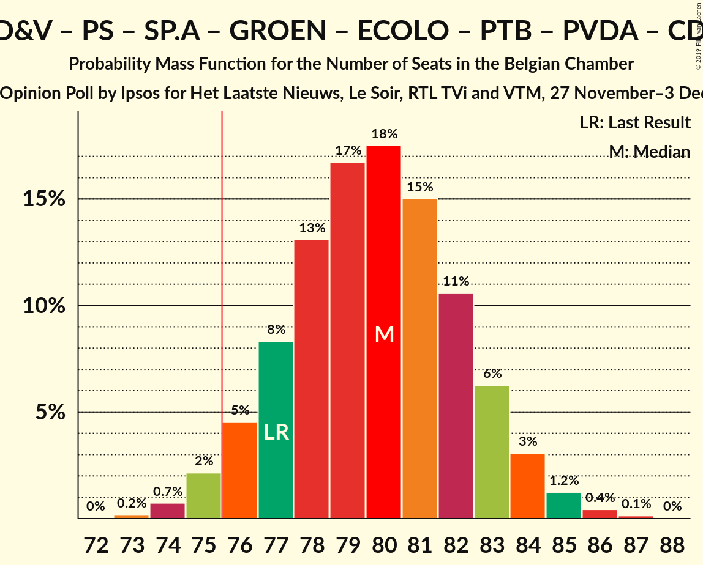

| Number of Seats | Probability | Accumulated | Special Marks |
|:---------------:|:-----------:|:-----------:|:-------------:|
| 73 | 0.1% | 100% |  |
| 74 | 0.2% | 99.9% |  |
| 75 | 0.2% | 99.7% |  |
| 76 | 12% | 99.5% | Median, Majority |
| 77 | 35% | 88% | Last Result |
| 78 | 15% | 53% |  |
| 79 | 12% | 38% |  |
| 80 | 7% | 26% |  |
| 81 | 10% | 19% |  |
| 82 | 4% | 9% |  |
| 83 | 3% | 5% |  |
| 84 | 1.2% | 1.4% |  |
| 85 | 0.2% | 0.3% |  |
| 86 | 0% | 0.1% |  |
| 87 | 0% | 0% |  |

### PS – Open Vld – MR – sp.a – Groen – Ecolo

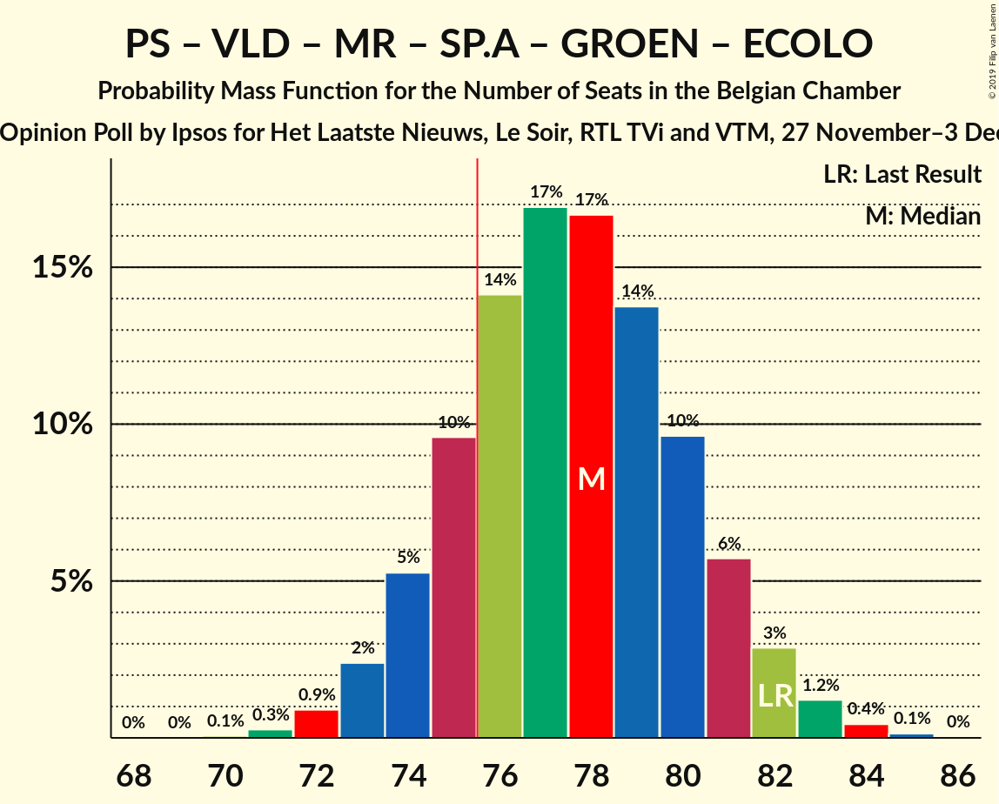

| Number of Seats | Probability | Accumulated | Special Marks |
|:---------------:|:-----------:|:-----------:|:-------------:|
| 73 | 0.3% | 100% |  |
| 74 | 2% | 99.7% |  |
| 75 | 20% | 98% |  |
| 76 | 33% | 78% | Median, Majority |
| 77 | 13% | 45% |  |
| 78 | 22% | 31% |  |
| 79 | 5% | 10% |  |
| 80 | 4% | 5% |  |
| 81 | 0.9% | 1.1% |  |
| 82 | 0.2% | 0.2% | Last Result |
| 83 | 0% | 0.1% |  |
| 84 | 0% | 0% |  |

### N-VA – CD&V – Open Vld – MR – cdH

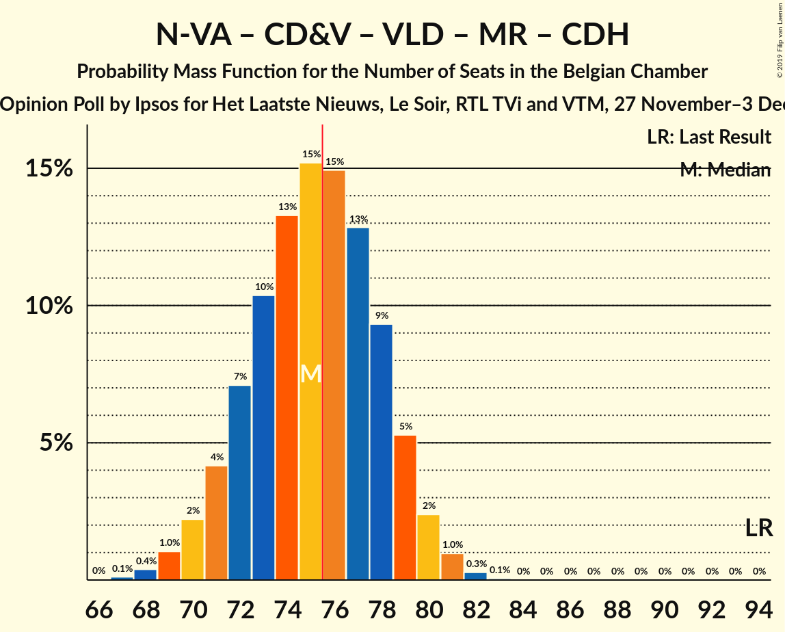

| Number of Seats | Probability | Accumulated | Special Marks |
|:---------------:|:-----------:|:-----------:|:-------------:|
| 70 | 0% | 100% |  |
| 71 | 0.4% | 99.9% |  |
| 72 | 0.9% | 99.6% |  |
| 73 | 0.7% | 98.7% |  |
| 74 | 3% | 98% |  |
| 75 | 14% | 95% |  |
| 76 | 6% | 81% | Majority |
| 77 | 8% | 75% |  |
| 78 | 44% | 67% | Median |
| 79 | 17% | 23% |  |
| 80 | 6% | 7% |  |
| 81 | 0.6% | 0.6% |  |
| 82 | 0% | 0% |  |
| 83 | 0% | 0% |  |
| 84 | 0% | 0% |  |
| 85 | 0% | 0% |  |
| 86 | 0% | 0% |  |
| 87 | 0% | 0% |  |
| 88 | 0% | 0% |  |
| 89 | 0% | 0% |  |
| 90 | 0% | 0% |  |
| 91 | 0% | 0% |  |
| 92 | 0% | 0% |  |
| 93 | 0% | 0% |  |
| 94 | 0% | 0% | Last Result |

### CD&V – PS – Open Vld – MR – sp.a – cdH

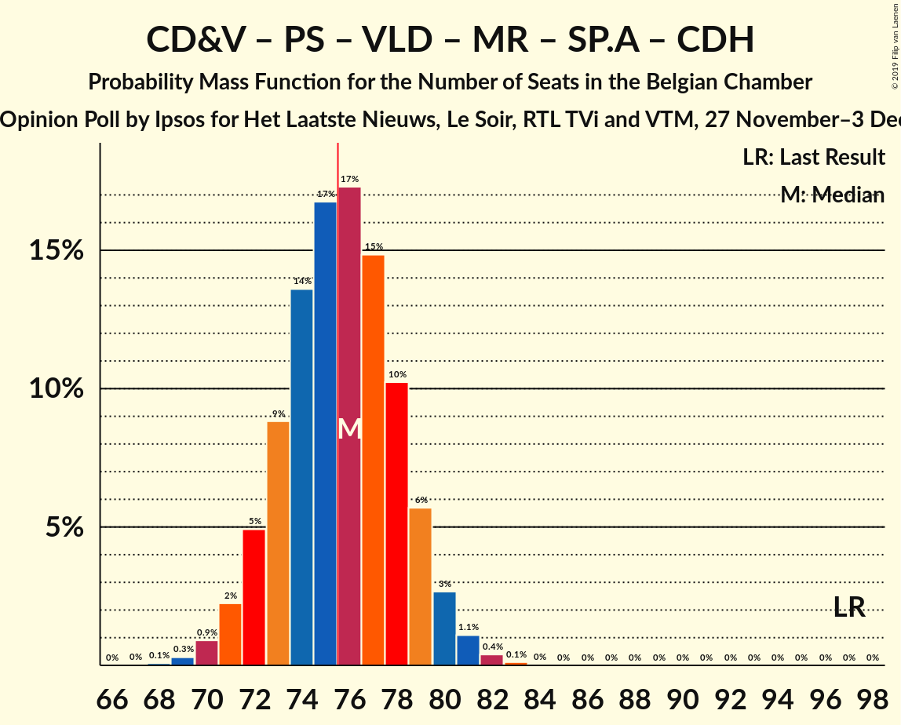

| Number of Seats | Probability | Accumulated | Special Marks |
|:---------------:|:-----------:|:-----------:|:-------------:|
| 71 | 0.2% | 100% |  |
| 72 | 2% | 99.8% |  |
| 73 | 8% | 98% |  |
| 74 | 38% | 90% | Median |
| 75 | 29% | 53% |  |
| 76 | 15% | 24% | Majority |
| 77 | 6% | 9% |  |
| 78 | 1.4% | 2% |  |
| 79 | 0.3% | 1.1% |  |
| 80 | 0.4% | 0.8% |  |
| 81 | 0.2% | 0.4% |  |
| 82 | 0.1% | 0.2% |  |
| 83 | 0% | 0.1% |  |
| 84 | 0% | 0% |  |
| 85 | 0% | 0% |  |
| 86 | 0% | 0% |  |
| 87 | 0% | 0% |  |
| 88 | 0% | 0% |  |
| 89 | 0% | 0% |  |
| 90 | 0% | 0% |  |
| 91 | 0% | 0% |  |
| 92 | 0% | 0% |  |
| 93 | 0% | 0% |  |
| 94 | 0% | 0% |  |
| 95 | 0% | 0% |  |
| 96 | 0% | 0% |  |
| 97 | 0% | 0% | Last Result |

### N-VA – CD&V – Open Vld – MR

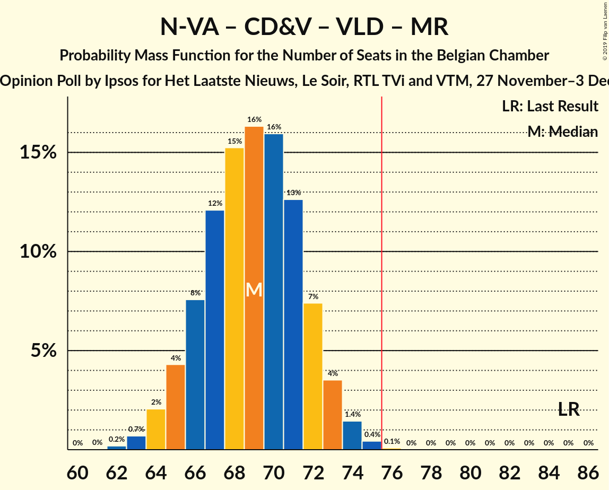

| Number of Seats | Probability | Accumulated | Special Marks |
|:---------------:|:-----------:|:-----------:|:-------------:|
| 65 | 0.1% | 100% |  |
| 66 | 0.3% | 99.8% |  |
| 67 | 0.9% | 99.5% |  |
| 68 | 4% | 98.6% |  |
| 69 | 4% | 94% |  |
| 70 | 11% | 90% |  |
| 71 | 18% | 79% |  |
| 72 | 13% | 60% |  |
| 73 | 34% | 47% | Median |
| 74 | 13% | 13% |  |
| 75 | 0% | 0.1% |  |
| 76 | 0% | 0% | Majority |
| 77 | 0% | 0% |  |
| 78 | 0% | 0% |  |
| 79 | 0% | 0% |  |
| 80 | 0% | 0% |  |
| 81 | 0% | 0% |  |
| 82 | 0% | 0% |  |
| 83 | 0% | 0% |  |
| 84 | 0% | 0% |  |
| 85 | 0% | 0% | Last Result |

### CD&V – PS – sp.a – Groen – Ecolo – cdH

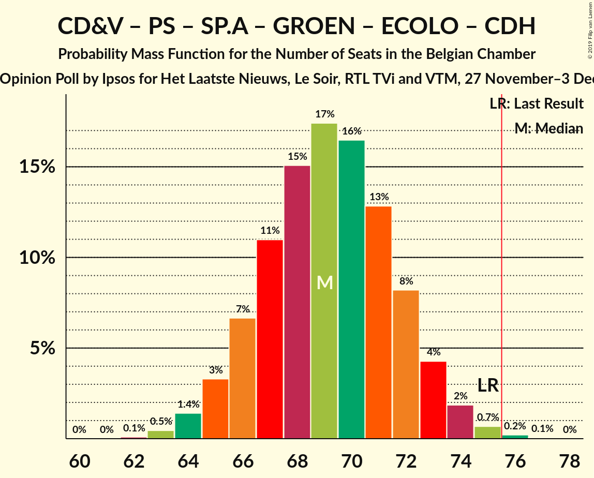

| Number of Seats | Probability | Accumulated | Special Marks |
|:---------------:|:-----------:|:-----------:|:-------------:|
| 62 | 0.2% | 100% |  |
| 63 | 0.1% | 99.8% |  |
| 64 | 0.3% | 99.7% |  |
| 65 | 35% | 99.4% | Median |
| 66 | 9% | 64% |  |
| 67 | 24% | 55% |  |
| 68 | 16% | 32% |  |
| 69 | 9% | 16% |  |
| 70 | 5% | 8% |  |
| 71 | 2% | 3% |  |
| 72 | 0.4% | 0.9% |  |
| 73 | 0.2% | 0.4% |  |
| 74 | 0.1% | 0.2% |  |
| 75 | 0.1% | 0.1% | Last Result |
| 76 | 0% | 0% | Majority |

### CD&V – Open Vld – MR – Groen – Ecolo – cdH

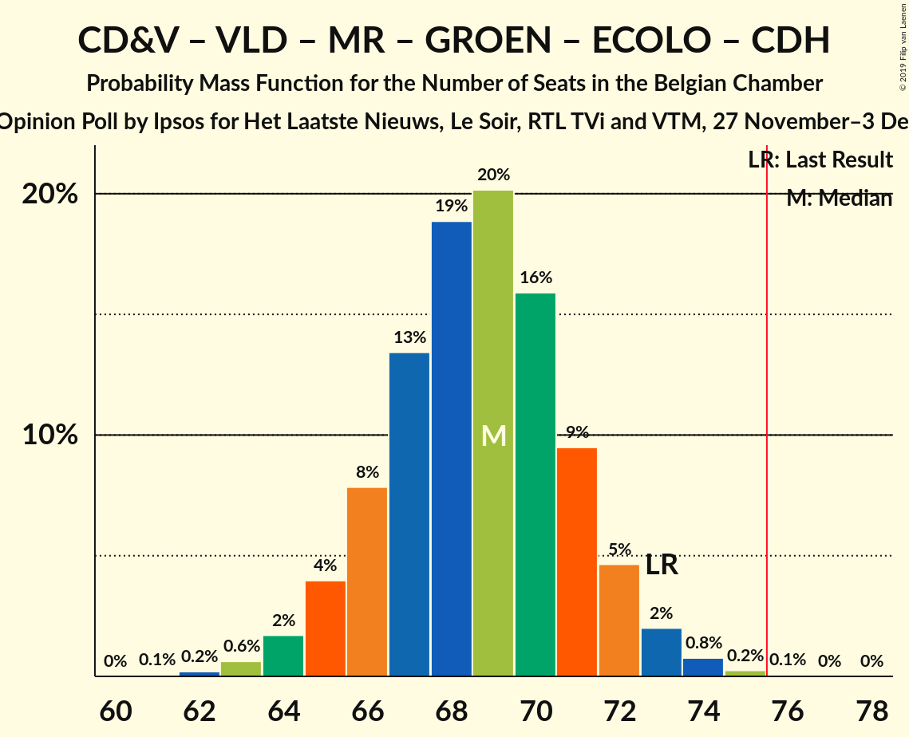

| Number of Seats | Probability | Accumulated | Special Marks |
|:---------------:|:-----------:|:-----------:|:-------------:|
| 64 | 0.3% | 100% |  |
| 65 | 1.1% | 99.7% |  |
| 66 | 3% | 98.5% |  |
| 67 | 42% | 96% | Median |
| 68 | 35% | 54% |  |
| 69 | 14% | 19% |  |
| 70 | 4% | 5% |  |
| 71 | 0.9% | 1.3% |  |
| 72 | 0.3% | 0.4% |  |
| 73 | 0.1% | 0.1% | Last Result |
| 74 | 0% | 0% |  |

### PS – sp.a – Groen – Ecolo – PTB – PVDA – cdH

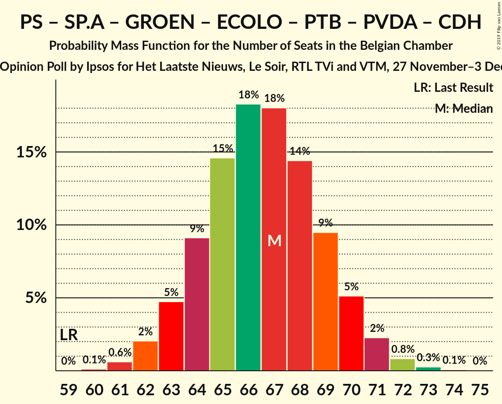

| Number of Seats | Probability | Accumulated | Special Marks |
|:---------------:|:-----------:|:-----------:|:-------------:|
| 59 | 0% | 100% | Last Result |
| 60 | 0% | 100% |  |
| 61 | 0% | 100% |  |
| 62 | 0.1% | 100% |  |
| 63 | 12% | 99.9% | Median |
| 64 | 35% | 88% |  |
| 65 | 15% | 53% |  |
| 66 | 13% | 38% |  |
| 67 | 7% | 25% |  |
| 68 | 10% | 18% |  |
| 69 | 4% | 8% |  |
| 70 | 3% | 4% |  |
| 71 | 1.0% | 1.2% |  |
| 72 | 0.1% | 0.2% |  |
| 73 | 0% | 0% |  |

### CD&V – PS – Open Vld – MR – cdH

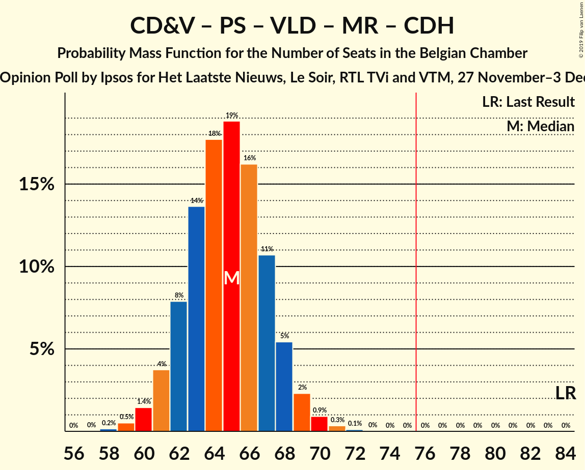

| Number of Seats | Probability | Accumulated | Special Marks |
|:---------------:|:-----------:|:-----------:|:-------------:|
| 61 | 0.2% | 100% |  |
| 62 | 2% | 99.8% |  |
| 63 | 9% | 97% |  |
| 64 | 45% | 88% | Median |
| 65 | 24% | 43% |  |
| 66 | 13% | 19% |  |
| 67 | 4% | 6% |  |
| 68 | 0.9% | 1.4% |  |
| 69 | 0.3% | 0.5% |  |
| 70 | 0.1% | 0.2% |  |
| 71 | 0% | 0% |  |
| 72 | 0% | 0% |  |
| 73 | 0% | 0% |  |
| 74 | 0% | 0% |  |
| 75 | 0% | 0% |  |
| 76 | 0% | 0% | Majority |
| 77 | 0% | 0% |  |
| 78 | 0% | 0% |  |
| 79 | 0% | 0% |  |
| 80 | 0% | 0% |  |
| 81 | 0% | 0% |  |
| 82 | 0% | 0% |  |
| 83 | 0% | 0% |  |
| 84 | 0% | 0% | Last Result |

### PS – sp.a – Groen – Ecolo – PTB – PVDA

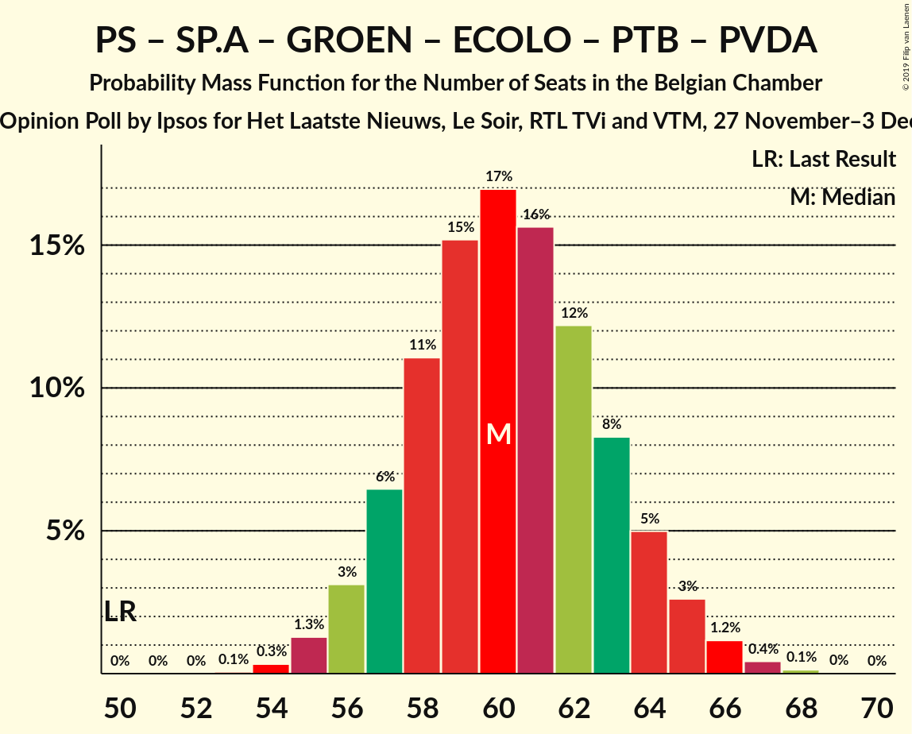

| Number of Seats | Probability | Accumulated | Special Marks |
|:---------------:|:-----------:|:-----------:|:-------------:|
| 50 | 0% | 100% | Last Result |
| 51 | 0% | 100% |  |
| 52 | 0% | 100% |  |
| 53 | 0% | 100% |  |
| 54 | 0% | 100% |  |
| 55 | 0% | 100% |  |
| 56 | 0.3% | 99.9% |  |
| 57 | 6% | 99.6% |  |
| 58 | 17% | 94% | Median |
| 59 | 46% | 77% |  |
| 60 | 5% | 31% |  |
| 61 | 3% | 26% |  |
| 62 | 6% | 23% |  |
| 63 | 14% | 17% |  |
| 64 | 1.4% | 3% |  |
| 65 | 0.4% | 1.4% |  |
| 66 | 0.3% | 1.0% |  |
| 67 | 0.6% | 0.6% |  |
| 68 | 0% | 0% |  |

### PS – Open Vld – MR – sp.a

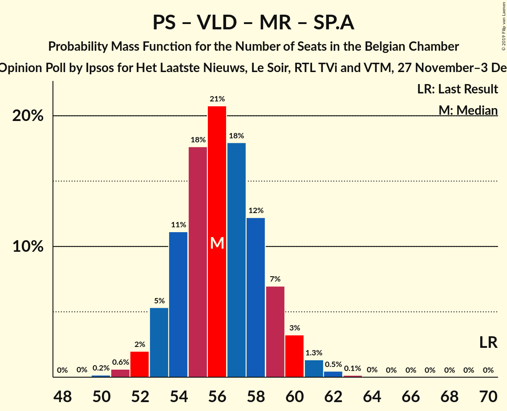

| Number of Seats | Probability | Accumulated | Special Marks |
|:---------------:|:-----------:|:-----------:|:-------------:|
| 52 | 0.1% | 100% |  |
| 53 | 0.9% | 99.9% |  |
| 54 | 4% | 99.0% |  |
| 55 | 22% | 95% |  |
| 56 | 41% | 72% | Median |
| 57 | 20% | 32% |  |
| 58 | 9% | 11% |  |
| 59 | 2% | 3% |  |
| 60 | 0.3% | 0.4% |  |
| 61 | 0.1% | 0.1% |  |
| 62 | 0% | 0.1% |  |
| 63 | 0% | 0% |  |
| 64 | 0% | 0% |  |
| 65 | 0% | 0% |  |
| 66 | 0% | 0% |  |
| 67 | 0% | 0% |  |
| 68 | 0% | 0% |  |
| 69 | 0% | 0% |  |
| 70 | 0% | 0% | Last Result |

### CD&V – PS – sp.a – cdH

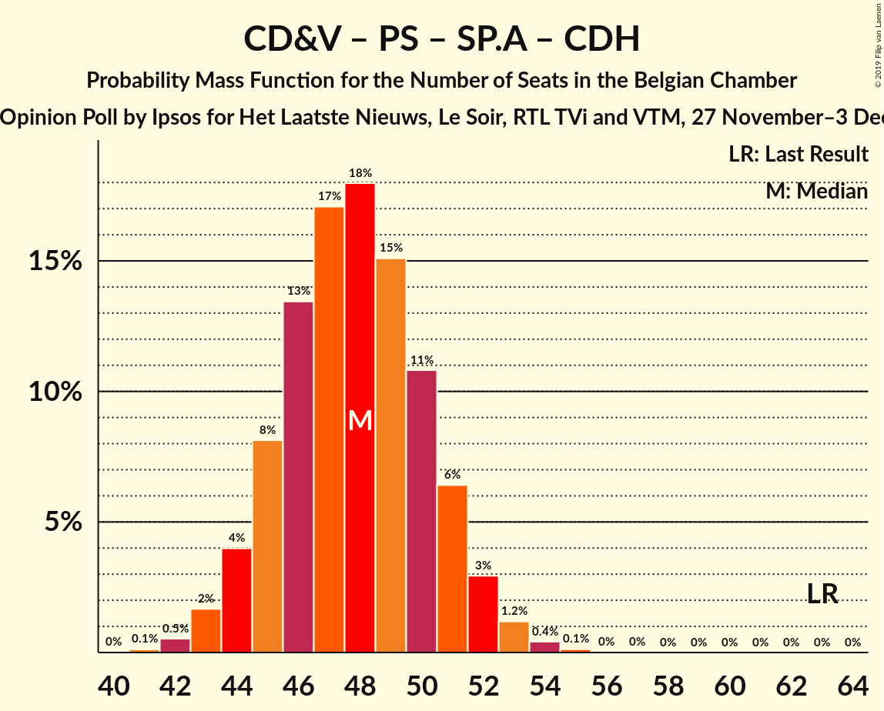

| Number of Seats | Probability | Accumulated | Special Marks |
|:---------------:|:-----------:|:-----------:|:-------------:|
| 41 | 0% | 100% |  |
| 42 | 0.2% | 99.9% |  |
| 43 | 0.7% | 99.8% |  |
| 44 | 8% | 99.0% |  |
| 45 | 32% | 91% | Median |
| 46 | 20% | 59% |  |
| 47 | 17% | 39% |  |
| 48 | 14% | 22% |  |
| 49 | 5% | 8% |  |
| 50 | 2% | 3% |  |
| 51 | 0.6% | 1.1% |  |
| 52 | 0.1% | 0.4% |  |
| 53 | 0.1% | 0.3% |  |
| 54 | 0.1% | 0.1% |  |
| 55 | 0% | 0% |  |
| 56 | 0% | 0% |  |
| 57 | 0% | 0% |  |
| 58 | 0% | 0% |  |
| 59 | 0% | 0% |  |
| 60 | 0% | 0% |  |
| 61 | 0% | 0% |  |
| 62 | 0% | 0% |  |
| 63 | 0% | 0% | Last Result |

### CD&V – Open Vld – MR – cdH

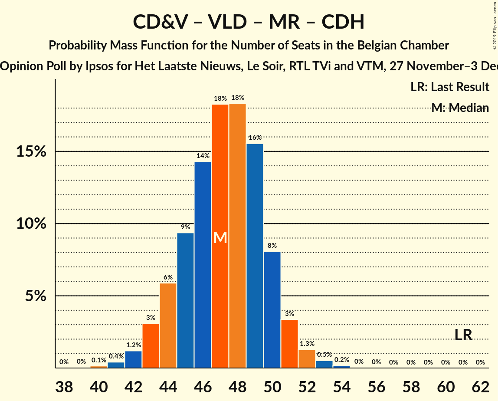

| Number of Seats | Probability | Accumulated | Special Marks |
|:---------------:|:-----------:|:-----------:|:-------------:|
| 43 | 1.3% | 100% |  |
| 44 | 3% | 98.7% |  |
| 45 | 2% | 96% |  |
| 46 | 6% | 94% |  |
| 47 | 56% | 88% | Median |
| 48 | 22% | 31% |  |
| 49 | 8% | 10% |  |
| 50 | 0.9% | 2% |  |
| 51 | 0.5% | 0.8% |  |
| 52 | 0.2% | 0.3% |  |
| 53 | 0.1% | 0.1% |  |
| 54 | 0% | 0% |  |
| 55 | 0% | 0% |  |
| 56 | 0% | 0% |  |
| 57 | 0% | 0% |  |
| 58 | 0% | 0% |  |
| 59 | 0% | 0% |  |
| 60 | 0% | 0% |  |
| 61 | 0% | 0% | Last Result |

## Technical Information

### Opinion Poll

+ **Polling firm:** Ipsos
+ **Commissioner(s):** Het Laatste Nieuws, Le Soir, RTL TVi and VTM
+ **Fieldwork period:** 27 November–3 December 2018

### Calculations

+ **Sample size:** 1612
+ **Simulations done:** 1,024
+ **Error estimate:** 2.74%

