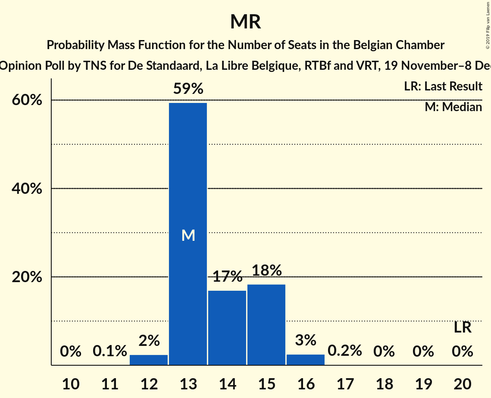
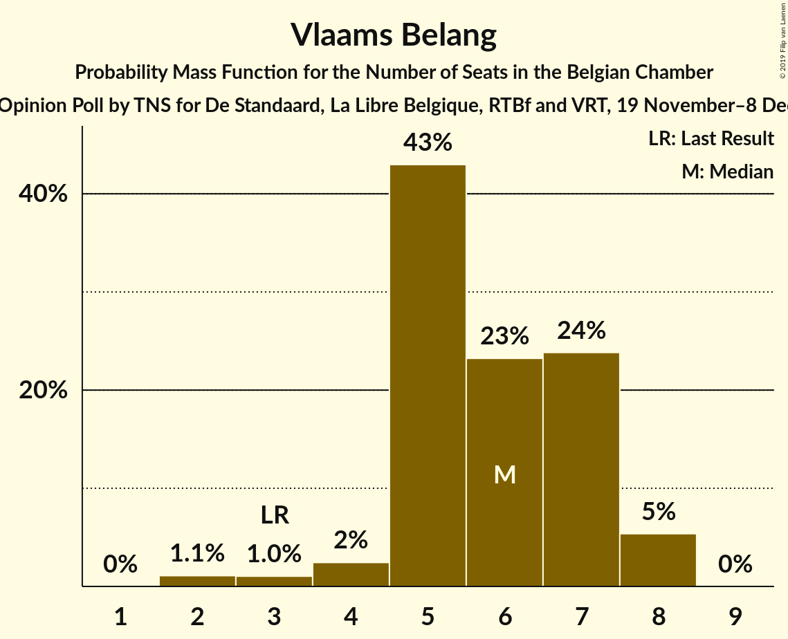
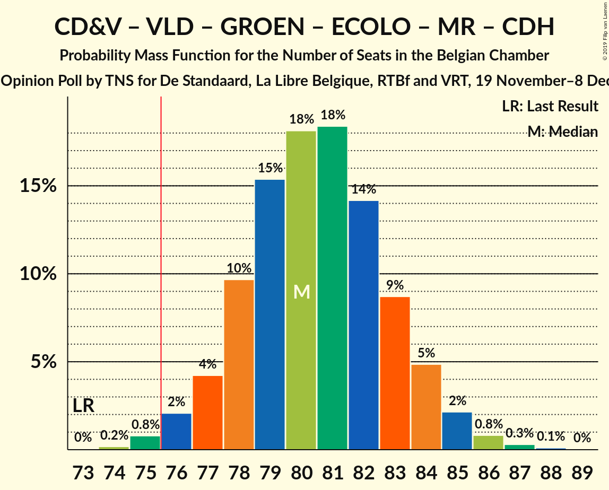
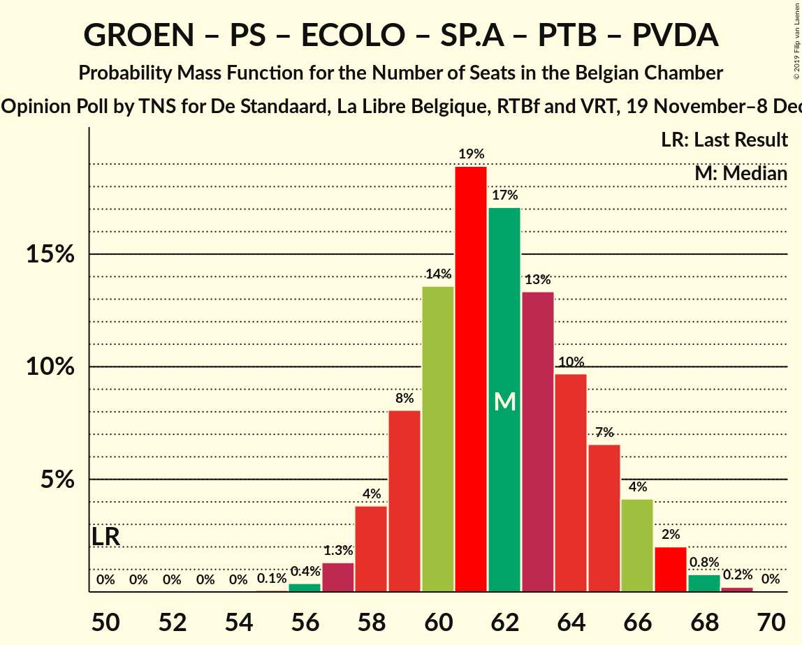

# Opinion Poll by TNS for De Standaard, La Libre Belgique, RTBf and VRT, 19 November–8 December 2018

Areas included: Brussels, Flanders, Wallonia

<a href="#voting-intentions">Voting Intentions</a> | <a href="#seats">Seats</a> | <a href="#coalitions">Coalitions</a> | <a href="#technical-information">Technical Information</a>

## Voting Intentions

### Confidence Intervals

| Party | Last Result | Poll Result | 80% Confidence Interval | 90% Confidence Interval | 95% Confidence Interval | 99% Confidence Interval |
|:-----:|:-----------:|:-----------:|:-----------------------:|:-----------------------:|:-----------------------:|:-----------------------:|
| N-VA | 20.3% | 18.0% | 16.1–17.0% |15.9–17.0% |15.7–17.0% |15.3–17.0% |
| CD&V | 11.6% | 11.8% | 10.2–10.9% |10.0–11.0% |9.9–11.0% |9.5–11.0% |
| Open Vld | 9.8% | 10.9% | 9.4–10.1% |9.2–10.1% |9.1–10.1% |8.7–10.1% |
| Groen | 5.3% | 9.9% | 9.0–10.5% |8.8–10.7% |8.6–10.8% |8.2–10.8% |
| PS | 11.7% | 9.0% | 8.0–8.4% |7.9–8.4% |7.8–8.4% |7.6–8.4% |
| Ecolo | 3.3% | 7.7% | 6.8–7.2% |6.7–7.2% |6.7–7.2% |6.5–7.2% |
| MR | 9.6% | 7.4% | 6.5–6.8% |6.4–6.8% |6.3–6.9% |6.1–6.9% |
| sp.a | 8.8% | 5.8% | 4.7–5.3% |4.6–5.3% |4.5–5.3% |4.3–5.3% |
| PTB | 2.0% | 5.1% | 4.4–4.7% |4.3–4.7% |4.2–4.7% |4.1–4.7% |
| Vlaams Belang | 3.7% | 4.7% | 3.7–4.1% |3.6–4.2% |3.5–4.2% |3.3–4.2% |
| cdH | 5.0% | 3.6% | 3.0–3.2% |2.9–3.2% |2.8–3.2% |2.7–3.2% |
| DéFI | 1.8% | 1.8% | 1.4–1.5% |1.4–1.6% |1.3–1.6% |1.2–1.6% |
| Parti Populaire | 1.5% | 1.7% | 1.2–1.4% |1.2–1.4% |1.2–1.4% |1.1–1.4% |
| PVDA | 1.8% | 1.5% | 1.2–1.9% |1.1–1.9% |1.1–1.9% |0.9–2.0% |

*Note:* The poll result column reflects the actual value used in the calculations. Published results may vary slightly, and in addition be rounded to fewer digits.

## Seats

### Confidence Intervals

| Party | Last Result | Median | 80% Confidence Interval | 90% Confidence Interval | 95% Confidence Interval | 99% Confidence Interval |
|:-----:|:-----------:|:------:|:-----------------------:|:-----------------------:|:-----------------------:|:-----------------------:|
| <a href="#n-va">N-VA</a> | 33 | 28 | 26–31 |25–32 |24–32 |24–32 |
| <a href="#cd&v">CD&V</a> | 18 | 18 | 15–18 |14–19 |14–21 |14–22 |
| <a href="#open-vld">Open Vld</a> | 14 | 17 | 14–18 |13–18 |13–18 |12–19 |
| <a href="#groen">Groen</a> | 6 | 13 | 12–16 |12–16 |12–17 |12–18 |
| <a href="#ps">PS</a> | 23 | 19 | 18–19 |18–19 |18–19 |16–19 |
| <a href="#ecolo">Ecolo</a> | 6 | 13 | 13–15 |13–15 |13–16 |13–16 |
| <a href="#mr">MR</a> | 20 | 14 | 13–14 |13–14 |13–14 |13–14 |
| <a href="#sp.a">sp.a</a> | 13 | 8 | 5–9 |5–9 |5–9 |5–9 |
| <a href="#ptb">PTB</a> | 2 | 10 | 9–10 |9–10 |8–10 |6–11 |
| <a href="#vlaams-belang">Vlaams Belang</a> | 3 | 6 | 4–7 |4–8 |3–8 |2–8 |
| <a href="#cdh">cdH</a> | 9 | 5 | 4–5 |4–5 |4–5 |4–6 |
| <a href="#défi">DéFI</a> | 2 | 1 | 1 |1 |1 |1 |
| <a href="#parti-populaire">Parti Populaire</a> | 1 | 0 | 0–2 |0–2 |0–2 |0–2 |
| <a href="#pvda">PVDA</a> | 0 | 0 | 0 |0–1 |0–1 |0–1 |

### N-VA

*For a full overview of the results for this party, see the [N-VA](party-n-va.html) page.*

| Number of Seats | Probability | Accumulated | Special Marks |
|:---------------:|:-----------:|:-----------:|:-------------:|
| 23 | 0.1% | 100% |  |
| 24 | 3% | 99.9% |  |
| 25 | 6% | 97% |  |
| 26 | 14% | 91% |  |
| 27 | 10% | 76% |  |
| 28 | 24% | 66% | Median |
| 29 | 18% | 42% |  |
| 30 | 11% | 24% |  |
| 31 | 5% | 13% |  |
| 32 | 7% | 7% |  |
| 33 | 0.3% | 0.3% | Last Result |
| 34 | 0% | 0% |  |

### CD&V

*For a full overview of the results for this party, see the [CD&V](party-cdv.html) page.*

| Number of Seats | Probability | Accumulated | Special Marks |
|:---------------:|:-----------:|:-----------:|:-------------:|
| 13 | 0.5% | 100% |  |
| 14 | 8% | 99.5% |  |
| 15 | 4% | 92% |  |
| 16 | 16% | 88% |  |
| 17 | 21% | 72% |  |
| 18 | 44% | 51% | Last Result, Median |
| 19 | 3% | 6% |  |
| 20 | 0.5% | 4% |  |
| 21 | 2% | 3% |  |
| 22 | 1.0% | 1.0% |  |
| 23 | 0% | 0% |  |

### Open Vld

*For a full overview of the results for this party, see the [Open Vld](party-openvld.html) page.*

| Number of Seats | Probability | Accumulated | Special Marks |
|:---------------:|:-----------:|:-----------:|:-------------:|
| 12 | 1.3% | 100% |  |
| 13 | 5% | 98.6% |  |
| 14 | 13% | 94% | Last Result |
| 15 | 15% | 81% |  |
| 16 | 12% | 65% |  |
| 17 | 32% | 54% | Median |
| 18 | 21% | 22% |  |
| 19 | 0.9% | 1.0% |  |
| 20 | 0.1% | 0.1% |  |
| 21 | 0% | 0% |  |

### Groen

*For a full overview of the results for this party, see the [Groen](party-groen.html) page.*

| Number of Seats | Probability | Accumulated | Special Marks |
|:---------------:|:-----------:|:-----------:|:-------------:|
| 6 | 0% | 100% | Last Result |
| 7 | 0% | 100% |  |
| 8 | 0% | 100% |  |
| 9 | 0% | 100% |  |
| 10 | 0% | 100% |  |
| 11 | 0.2% | 100% |  |
| 12 | 43% | 99.7% |  |
| 13 | 12% | 57% | Median |
| 14 | 9% | 45% |  |
| 15 | 7% | 36% |  |
| 16 | 25% | 29% |  |
| 17 | 3% | 4% |  |
| 18 | 1.2% | 1.2% |  |
| 19 | 0% | 0% |  |

### PS

*For a full overview of the results for this party, see the [PS](party-ps.html) page.*

| Number of Seats | Probability | Accumulated | Special Marks |
|:---------------:|:-----------:|:-----------:|:-------------:|
| 16 | 0.9% | 100% |  |
| 17 | 0.1% | 99.1% |  |
| 18 | 12% | 99.0% |  |
| 19 | 87% | 87% | Median |
| 20 | 0% | 0.2% |  |
| 21 | 0.1% | 0.1% |  |
| 22 | 0% | 0% |  |
| 23 | 0% | 0% | Last Result |

### Ecolo

*For a full overview of the results for this party, see the [Ecolo](party-ecolo.html) page.*

| Number of Seats | Probability | Accumulated | Special Marks |
|:---------------:|:-----------:|:-----------:|:-------------:|
| 6 | 0% | 100% | Last Result |
| 7 | 0% | 100% |  |
| 8 | 0% | 100% |  |
| 9 | 0% | 100% |  |
| 10 | 0% | 100% |  |
| 11 | 0% | 100% |  |
| 12 | 0% | 100% |  |
| 13 | 57% | 100% | Median |
| 14 | 29% | 43% |  |
| 15 | 11% | 14% |  |
| 16 | 2% | 3% |  |
| 17 | 0.5% | 0.5% |  |
| 18 | 0% | 0% |  |

### MR

*For a full overview of the results for this party, see the [MR](party-mr.html) page.*

| Number of Seats | Probability | Accumulated | Special Marks |
|:---------------:|:-----------:|:-----------:|:-------------:|
| 12 | 0.4% | 100% |  |
| 13 | 43% | 99.6% |  |
| 14 | 57% | 57% | Median |
| 15 | 0% | 0% |  |
| 16 | 0% | 0% |  |
| 17 | 0% | 0% |  |
| 18 | 0% | 0% |  |
| 19 | 0% | 0% |  |
| 20 | 0% | 0% | Last Result |

### sp.a

*For a full overview of the results for this party, see the [sp.a](party-spa.html) page.*

| Number of Seats | Probability | Accumulated | Special Marks |
|:---------------:|:-----------:|:-----------:|:-------------:|
| 5 | 18% | 100% |  |
| 6 | 20% | 82% |  |
| 7 | 10% | 62% |  |
| 8 | 38% | 52% | Median |
| 9 | 14% | 14% |  |
| 10 | 0.4% | 0.5% |  |
| 11 | 0.1% | 0.1% |  |
| 12 | 0% | 0% |  |
| 13 | 0% | 0% | Last Result |

### PTB

*For a full overview of the results for this party, see the [PTB](party-ptb.html) page.*

| Number of Seats | Probability | Accumulated | Special Marks |
|:---------------:|:-----------:|:-----------:|:-------------:|
| 2 | 0% | 100% | Last Result |
| 3 | 0% | 100% |  |
| 4 | 0% | 100% |  |
| 5 | 0% | 100% |  |
| 6 | 2% | 100% |  |
| 7 | 0.2% | 98% |  |
| 8 | 0.3% | 98% |  |
| 9 | 13% | 97% |  |
| 10 | 83% | 84% | Median |
| 11 | 0.7% | 0.7% |  |
| 12 | 0% | 0% |  |

### Vlaams Belang

*For a full overview of the results for this party, see the [Vlaams Belang](party-vlaamsbelang.html) page.*

| Number of Seats | Probability | Accumulated | Special Marks |
|:---------------:|:-----------:|:-----------:|:-------------:|
| 2 | 0.8% | 100% |  |
| 3 | 4% | 99.2% | Last Result |
| 4 | 9% | 95% |  |
| 5 | 36% | 86% |  |
| 6 | 26% | 50% | Median |
| 7 | 16% | 24% |  |
| 8 | 9% | 9% |  |
| 9 | 0% | 0% |  |

### cdH

*For a full overview of the results for this party, see the [cdH](party-cdh.html) page.*

| Number of Seats | Probability | Accumulated | Special Marks |
|:---------------:|:-----------:|:-----------:|:-------------:|
| 4 | 13% | 100% |  |
| 5 | 85% | 87% | Median |
| 6 | 1.2% | 1.3% |  |
| 7 | 0.2% | 0.2% |  |
| 8 | 0% | 0% |  |
| 9 | 0% | 0% | Last Result |

### DéFI

*For a full overview of the results for this party, see the [DéFI](party-défi.html) page.*

| Number of Seats | Probability | Accumulated | Special Marks |
|:---------------:|:-----------:|:-----------:|:-------------:|
| 1 | 100% | 100% | Median |
| 2 | 0% | 0% | Last Result |

### Parti Populaire

*For a full overview of the results for this party, see the [Parti Populaire](party-partipopulaire.html) page.*

| Number of Seats | Probability | Accumulated | Special Marks |
|:---------------:|:-----------:|:-----------:|:-------------:|
| 0 | 84% | 100% | Median |
| 1 | 0.6% | 16% | Last Result |
| 2 | 15% | 15% |  |
| 3 | 0% | 0% |  |

### PVDA

*For a full overview of the results for this party, see the [PVDA](party-pvda.html) page.*

| Number of Seats | Probability | Accumulated | Special Marks |
|:---------------:|:-----------:|:-----------:|:-------------:|
| 0 | 91% | 100% | Last Result, Median |
| 1 | 9% | 9% |  |
| 2 | 0% | 0% |  |

## Coalitions

### Confidence Intervals

| Coalition | Last Result | Median | Majority? | 80% Confidence Interval | 90% Confidence Interval | 95% Confidence Interval | 99% Confidence Interval |
|:---------:|:-----------:|:------:|:---------:|:-----------------------:|:-----------------------:|:-----------------------:|:-----------------------:|
| CD&V – Open Vld – Groen – PS – Ecolo – MR – sp.a – cdH | 109 | 105 | 100% | 102–108 | 101–108 | 101–108 | 100–111 |
| CD&V – Groen – PS – Ecolo – sp.a – PTB – cdH – PVDA | 77 | 85 | 100% | 82–88 | 81–89 | 81–90 | 80–91 |
| Open Vld – Groen – PS – Ecolo – MR – sp.a | 82 | 83 | 100% | 80–86 | 79–87 | 79–88 | 78–89 |
| N-VA – Open Vld – PS – MR – sp.a | 103 | 84 | 100% | 81–86 | 80–87 | 80–87 | 78–88 |
| N-VA – CD&V – Open Vld – MR – cdH | 94 | 80 | 95% | 77–83 | 76–84 | 75–84 | 73–85 |
| CD&V – Open Vld – Groen – Ecolo – MR – cdH | 73 | 79 | 97% | 76–81 | 76–82 | 75–83 | 75–85 |
| CD&V – Open Vld – PS – MR – sp.a – cdH | 97 | 77 | 86% | 75–81 | 74–81 | 73–82 | 72–82 |
| CD&V – Groen – PS – Ecolo – sp.a – cdH | 75 | 75 | 48% | 72–78 | 72–79 | 71–80 | 70–81 |
| N-VA – CD&V – Open Vld – MR | 85 | 75 | 43% | 72–78 | 71–79 | 70–79 | 69–80 |
| CD&V – Open Vld – PS – MR – cdH | 84 | 71 | 0.5% | 68–73 | 67–74 | 66–74 | 65–76 |
| Groen – PS – Ecolo – sp.a – PTB – cdH – PVDA | 59 | 68 | 0% | 65–71 | 64–72 | 64–72 | 63–73 |
| Groen – PS – Ecolo – sp.a – PTB – PVDA | 50 | 63 | 0% | 60–66 | 60–67 | 59–68 | 59–68 |
| Open Vld – PS – MR – sp.a | 70 | 56 | 0% | 53–58 | 52–59 | 52–60 | 50–60 |
| CD&V – Open Vld – MR – cdH | 61 | 52 | 0% | 49–54 | 48–55 | 48–55 | 46–57 |
| CD&V – PS – sp.a – cdH | 63 | 48 | 0% | 46–50 | 45–51 | 44–52 | 43–53 |

### CD&V – Open Vld – Groen – PS – Ecolo – MR – sp.a – cdH

| Number of Seats | Probability | Accumulated | Special Marks |
|:---------------:|:-----------:|:-----------:|:-------------:|
| 99 | 0.1% | 100% |  |
| 100 | 0.9% | 99.9% |  |
| 101 | 6% | 99.0% |  |
| 102 | 9% | 93% |  |
| 103 | 7% | 84% |  |
| 104 | 11% | 77% |  |
| 105 | 19% | 66% |  |
| 106 | 26% | 47% |  |
| 107 | 10% | 21% | Median |
| 108 | 9% | 11% |  |
| 109 | 1.0% | 2% | Last Result |
| 110 | 0.7% | 1.3% |  |
| 111 | 0.6% | 0.7% |  |
| 112 | 0.1% | 0.1% |  |
| 113 | 0% | 0% |  |

### CD&V – Groen – PS – Ecolo – sp.a – PTB – cdH – PVDA

| Number of Seats | Probability | Accumulated | Special Marks |
|:---------------:|:-----------:|:-----------:|:-------------:|
| 77 | 0% | 100% | Last Result |
| 78 | 0% | 100% |  |
| 79 | 0.2% | 100% |  |
| 80 | 1.4% | 99.7% |  |
| 81 | 5% | 98% |  |
| 82 | 8% | 94% |  |
| 83 | 11% | 85% |  |
| 84 | 12% | 74% |  |
| 85 | 16% | 62% |  |
| 86 | 17% | 46% | Median |
| 87 | 12% | 29% |  |
| 88 | 8% | 17% |  |
| 89 | 5% | 9% |  |
| 90 | 2% | 3% |  |
| 91 | 0.7% | 0.8% |  |
| 92 | 0.1% | 0.1% |  |
| 93 | 0% | 0% |  |

### Open Vld – Groen – PS – Ecolo – MR – sp.a

| Number of Seats | Probability | Accumulated | Special Marks |
|:---------------:|:-----------:|:-----------:|:-------------:|
| 76 | 0.1% | 100% | Majority |
| 77 | 0.1% | 99.9% |  |
| 78 | 2% | 99.8% |  |
| 79 | 8% | 98% |  |
| 80 | 8% | 90% |  |
| 81 | 4% | 82% |  |
| 82 | 14% | 78% | Last Result |
| 83 | 29% | 65% |  |
| 84 | 13% | 36% | Median |
| 85 | 9% | 23% |  |
| 86 | 5% | 13% |  |
| 87 | 5% | 9% |  |
| 88 | 3% | 4% |  |
| 89 | 0.8% | 0.9% |  |
| 90 | 0.1% | 0.1% |  |
| 91 | 0% | 0% |  |

### N-VA – Open Vld – PS – MR – sp.a

| Number of Seats | Probability | Accumulated | Special Marks |
|:---------------:|:-----------:|:-----------:|:-------------:|
| 76 | 0.1% | 100% | Majority |
| 77 | 0.3% | 99.9% |  |
| 78 | 0.7% | 99.7% |  |
| 79 | 1.3% | 98.9% |  |
| 80 | 3% | 98% |  |
| 81 | 9% | 94% |  |
| 82 | 15% | 86% |  |
| 83 | 14% | 71% |  |
| 84 | 13% | 57% |  |
| 85 | 19% | 44% |  |
| 86 | 18% | 25% | Median |
| 87 | 6% | 7% |  |
| 88 | 0.7% | 1.2% |  |
| 89 | 0.3% | 0.4% |  |
| 90 | 0.1% | 0.2% |  |
| 91 | 0% | 0% |  |
| 92 | 0% | 0% |  |
| 93 | 0% | 0% |  |
| 94 | 0% | 0% |  |
| 95 | 0% | 0% |  |
| 96 | 0% | 0% |  |
| 97 | 0% | 0% |  |
| 98 | 0% | 0% |  |
| 99 | 0% | 0% |  |
| 100 | 0% | 0% |  |
| 101 | 0% | 0% |  |
| 102 | 0% | 0% |  |
| 103 | 0% | 0% | Last Result |

### N-VA – CD&V – Open Vld – MR – cdH

| Number of Seats | Probability | Accumulated | Special Marks |
|:---------------:|:-----------:|:-----------:|:-------------:|
| 72 | 0.1% | 100% |  |
| 73 | 0.5% | 99.9% |  |
| 74 | 1.4% | 99.5% |  |
| 75 | 3% | 98% |  |
| 76 | 5% | 95% | Majority |
| 77 | 8% | 90% |  |
| 78 | 12% | 82% |  |
| 79 | 15% | 70% |  |
| 80 | 14% | 55% |  |
| 81 | 15% | 42% |  |
| 82 | 9% | 27% | Median |
| 83 | 9% | 18% |  |
| 84 | 7% | 9% |  |
| 85 | 2% | 2% |  |
| 86 | 0.1% | 0.1% |  |
| 87 | 0% | 0% |  |
| 88 | 0% | 0% |  |
| 89 | 0% | 0% |  |
| 90 | 0% | 0% |  |
| 91 | 0% | 0% |  |
| 92 | 0% | 0% |  |
| 93 | 0% | 0% |  |
| 94 | 0% | 0% | Last Result |

### CD&V – Open Vld – Groen – Ecolo – MR – cdH

| Number of Seats | Probability | Accumulated | Special Marks |
|:---------------:|:-----------:|:-----------:|:-------------:|
| 73 | 0.1% | 100% | Last Result |
| 74 | 0.3% | 99.8% |  |
| 75 | 3% | 99.6% |  |
| 76 | 8% | 97% | Majority |
| 77 | 12% | 88% |  |
| 78 | 13% | 76% |  |
| 79 | 20% | 64% |  |
| 80 | 23% | 44% | Median |
| 81 | 12% | 21% |  |
| 82 | 6% | 10% |  |
| 83 | 2% | 4% |  |
| 84 | 1.2% | 2% |  |
| 85 | 0.4% | 0.5% |  |
| 86 | 0.1% | 0.1% |  |
| 87 | 0% | 0% |  |

### CD&V – Open Vld – PS – MR – sp.a – cdH

| Number of Seats | Probability | Accumulated | Special Marks |
|:---------------:|:-----------:|:-----------:|:-------------:|
| 70 | 0.1% | 100% |  |
| 71 | 0.2% | 99.9% |  |
| 72 | 0.6% | 99.7% |  |
| 73 | 3% | 99.1% |  |
| 74 | 4% | 97% |  |
| 75 | 7% | 93% |  |
| 76 | 18% | 86% | Majority |
| 77 | 18% | 67% |  |
| 78 | 12% | 50% |  |
| 79 | 13% | 38% |  |
| 80 | 11% | 24% |  |
| 81 | 9% | 13% | Median |
| 82 | 3% | 4% |  |
| 83 | 0.3% | 0.4% |  |
| 84 | 0.1% | 0.1% |  |
| 85 | 0% | 0% |  |
| 86 | 0% | 0% |  |
| 87 | 0% | 0% |  |
| 88 | 0% | 0% |  |
| 89 | 0% | 0% |  |
| 90 | 0% | 0% |  |
| 91 | 0% | 0% |  |
| 92 | 0% | 0% |  |
| 93 | 0% | 0% |  |
| 94 | 0% | 0% |  |
| 95 | 0% | 0% |  |
| 96 | 0% | 0% |  |
| 97 | 0% | 0% | Last Result |

### CD&V – Groen – PS – Ecolo – sp.a – cdH

| Number of Seats | Probability | Accumulated | Special Marks |
|:---------------:|:-----------:|:-----------:|:-------------:|
| 69 | 0.1% | 100% |  |
| 70 | 0.7% | 99.9% |  |
| 71 | 4% | 99.2% |  |
| 72 | 8% | 95% |  |
| 73 | 12% | 87% |  |
| 74 | 11% | 75% |  |
| 75 | 16% | 64% | Last Result |
| 76 | 17% | 48% | Median, Majority |
| 77 | 12% | 30% |  |
| 78 | 9% | 19% |  |
| 79 | 6% | 10% |  |
| 80 | 3% | 4% |  |
| 81 | 0.8% | 1.1% |  |
| 82 | 0.2% | 0.2% |  |
| 83 | 0.1% | 0.1% |  |
| 84 | 0% | 0% |  |

### N-VA – CD&V – Open Vld – MR

| Number of Seats | Probability | Accumulated | Special Marks |
|:---------------:|:-----------:|:-----------:|:-------------:|
| 68 | 0.3% | 100% |  |
| 69 | 1.2% | 99.7% |  |
| 70 | 3% | 98% |  |
| 71 | 5% | 96% |  |
| 72 | 7% | 91% |  |
| 73 | 12% | 84% |  |
| 74 | 14% | 72% |  |
| 75 | 15% | 58% |  |
| 76 | 15% | 43% | Majority |
| 77 | 9% | 28% | Median |
| 78 | 10% | 19% |  |
| 79 | 8% | 10% |  |
| 80 | 2% | 2% |  |
| 81 | 0.1% | 0.1% |  |
| 82 | 0% | 0% |  |
| 83 | 0% | 0% |  |
| 84 | 0% | 0% |  |
| 85 | 0% | 0% | Last Result |

### CD&V – Open Vld – PS – MR – cdH

| Number of Seats | Probability | Accumulated | Special Marks |
|:---------------:|:-----------:|:-----------:|:-------------:|
| 63 | 0.1% | 100% |  |
| 64 | 0.3% | 99.9% |  |
| 65 | 0.8% | 99.6% |  |
| 66 | 2% | 98.7% |  |
| 67 | 5% | 97% |  |
| 68 | 7% | 92% |  |
| 69 | 13% | 85% |  |
| 70 | 18% | 71% |  |
| 71 | 17% | 54% |  |
| 72 | 18% | 36% |  |
| 73 | 12% | 18% | Median |
| 74 | 4% | 6% |  |
| 75 | 1.0% | 2% |  |
| 76 | 0.4% | 0.5% | Majority |
| 77 | 0.2% | 0.2% |  |
| 78 | 0% | 0% |  |
| 79 | 0% | 0% |  |
| 80 | 0% | 0% |  |
| 81 | 0% | 0% |  |
| 82 | 0% | 0% |  |
| 83 | 0% | 0% |  |
| 84 | 0% | 0% | Last Result |

### Groen – PS – Ecolo – sp.a – PTB – cdH – PVDA

| Number of Seats | Probability | Accumulated | Special Marks |
|:---------------:|:-----------:|:-----------:|:-------------:|
| 59 | 0% | 100% | Last Result |
| 60 | 0% | 100% |  |
| 61 | 0% | 100% |  |
| 62 | 0.2% | 100% |  |
| 63 | 1.1% | 99.8% |  |
| 64 | 5% | 98.8% |  |
| 65 | 10% | 94% |  |
| 66 | 10% | 84% |  |
| 67 | 15% | 73% |  |
| 68 | 18% | 58% | Median |
| 69 | 12% | 40% |  |
| 70 | 10% | 28% |  |
| 71 | 9% | 18% |  |
| 72 | 6% | 9% |  |
| 73 | 2% | 2% |  |
| 74 | 0.2% | 0.2% |  |
| 75 | 0% | 0% |  |

### Groen – PS – Ecolo – sp.a – PTB – PVDA

| Number of Seats | Probability | Accumulated | Special Marks |
|:---------------:|:-----------:|:-----------:|:-------------:|
| 50 | 0% | 100% | Last Result |
| 51 | 0% | 100% |  |
| 52 | 0% | 100% |  |
| 53 | 0% | 100% |  |
| 54 | 0% | 100% |  |
| 55 | 0% | 100% |  |
| 56 | 0% | 100% |  |
| 57 | 0.1% | 100% |  |
| 58 | 0.4% | 99.9% |  |
| 59 | 4% | 99.5% |  |
| 60 | 11% | 95% |  |
| 61 | 9% | 84% |  |
| 62 | 15% | 75% |  |
| 63 | 18% | 60% | Median |
| 64 | 12% | 42% |  |
| 65 | 10% | 29% |  |
| 66 | 9% | 19% |  |
| 67 | 7% | 9% |  |
| 68 | 2% | 3% |  |
| 69 | 0.3% | 0.3% |  |
| 70 | 0% | 0% |  |

### Open Vld – PS – MR – sp.a

| Number of Seats | Probability | Accumulated | Special Marks |
|:---------------:|:-----------:|:-----------:|:-------------:|
| 49 | 0.1% | 100% |  |
| 50 | 0.4% | 99.8% |  |
| 51 | 1.3% | 99.4% |  |
| 52 | 4% | 98% |  |
| 53 | 11% | 94% |  |
| 54 | 15% | 83% |  |
| 55 | 16% | 68% |  |
| 56 | 14% | 52% |  |
| 57 | 16% | 38% |  |
| 58 | 15% | 23% | Median |
| 59 | 5% | 8% |  |
| 60 | 3% | 3% |  |
| 61 | 0.1% | 0.1% |  |
| 62 | 0% | 0% |  |
| 63 | 0% | 0% |  |
| 64 | 0% | 0% |  |
| 65 | 0% | 0% |  |
| 66 | 0% | 0% |  |
| 67 | 0% | 0% |  |
| 68 | 0% | 0% |  |
| 69 | 0% | 0% |  |
| 70 | 0% | 0% | Last Result |

### CD&V – Open Vld – MR – cdH

| Number of Seats | Probability | Accumulated | Special Marks |
|:---------------:|:-----------:|:-----------:|:-------------:|
| 45 | 0.1% | 100% |  |
| 46 | 0.5% | 99.8% |  |
| 47 | 1.5% | 99.3% |  |
| 48 | 4% | 98% |  |
| 49 | 7% | 94% |  |
| 50 | 13% | 87% |  |
| 51 | 18% | 74% |  |
| 52 | 19% | 56% |  |
| 53 | 19% | 38% |  |
| 54 | 13% | 19% | Median |
| 55 | 5% | 6% |  |
| 56 | 1.1% | 2% |  |
| 57 | 0.4% | 0.5% |  |
| 58 | 0.2% | 0.2% |  |
| 59 | 0% | 0% |  |
| 60 | 0% | 0% |  |
| 61 | 0% | 0% | Last Result |

### CD&V – PS – sp.a – cdH

| Number of Seats | Probability | Accumulated | Special Marks |
|:---------------:|:-----------:|:-----------:|:-------------:|
| 42 | 0.1% | 100% |  |
| 43 | 0.7% | 99.8% |  |
| 44 | 3% | 99.2% |  |
| 45 | 5% | 97% |  |
| 46 | 16% | 91% |  |
| 47 | 20% | 76% |  |
| 48 | 16% | 56% |  |
| 49 | 11% | 40% |  |
| 50 | 20% | 29% | Median |
| 51 | 6% | 9% |  |
| 52 | 1.3% | 3% |  |
| 53 | 1.3% | 1.4% |  |
| 54 | 0% | 0.1% |  |
| 55 | 0% | 0% |  |
| 56 | 0% | 0% |  |
| 57 | 0% | 0% |  |
| 58 | 0% | 0% |  |
| 59 | 0% | 0% |  |
| 60 | 0% | 0% |  |
| 61 | 0% | 0% |  |
| 62 | 0% | 0% |  |
| 63 | 0% | 0% | Last Result |

## Technical Information

### Opinion Poll

+ **Polling firm:** TNS
+ **Commissioner(s):** De Standaard, La Libre Belgique, RTBf and VRT
+ **Fieldwork period:** 19 November–8 December 2018

### Calculations

+ **Sample size:** 1678
+ **Simulations done:** 65,536
+ **Error estimate:** 3.08%

