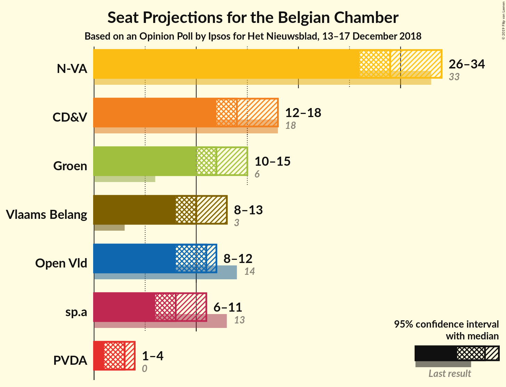
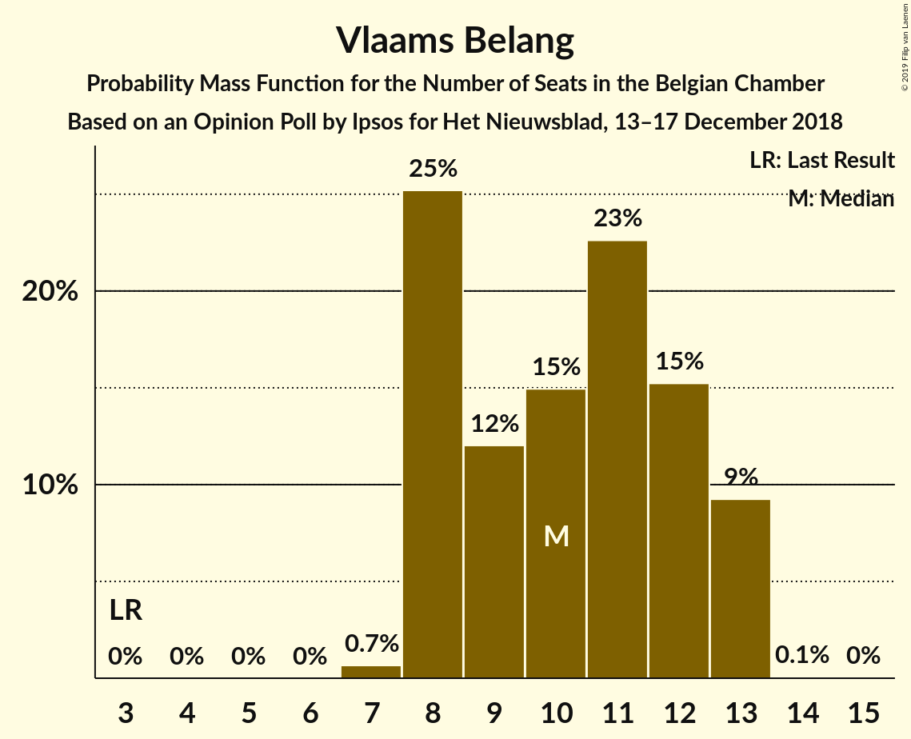
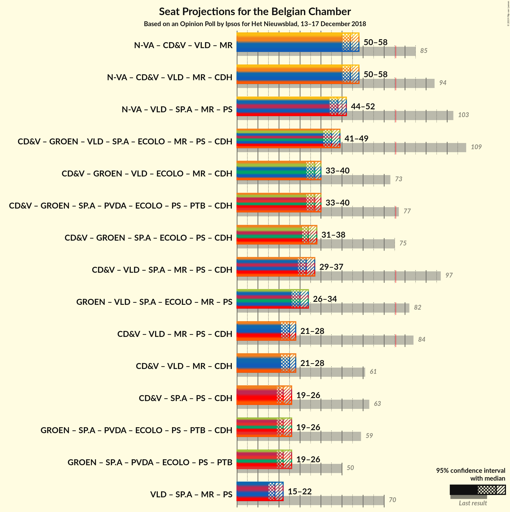

# Opinion Poll by Ipsos for Het Nieuwsblad, 13–17 December 2018

Areas included: Flanders

<a href="#voting-intentions">Voting Intentions</a> | <a href="#seats">Seats</a> | <a href="#coalitions">Coalitions</a> | <a href="#technical-information">Technical Information</a>

## Voting Intentions

### Confidence Intervals

| Party | Last Result | Poll Result | 80% Confidence Interval | 90% Confidence Interval | 95% Confidence Interval | 99% Confidence Interval |
|:-----:|:-----------:|:-----------:|:-----------------------:|:-----------------------:|:-----------------------:|:-----------------------:|
| N-VA | 20.3% | 30.2% | N/A |N/A |N/A |N/A |
| CD&V | 11.6% | 15.7% | N/A |N/A |N/A |N/A |
| Groen | 5.3% | 13.8% | N/A |N/A |N/A |N/A |
| Vlaams Belang | 3.7% | 12.0% | N/A |N/A |N/A |N/A |
| Open Vld | 9.8% | 11.6% | N/A |N/A |N/A |N/A |
| sp.a | 8.8% | 9.7% | N/A |N/A |N/A |N/A |
| PVDA | 1.8% | 5.5% | N/A |N/A |N/A |N/A |

*Note:* The poll result column reflects the actual value used in the calculations. Published results may vary slightly, and in addition be rounded to fewer digits.

## Seats

### Confidence Intervals

| Party | Last Result | Median | 80% Confidence Interval | 90% Confidence Interval | 95% Confidence Interval | 99% Confidence Interval |
|:-----:|:-----------:|:------:|:-----------------------:|:-----------------------:|:-----------------------:|:-----------------------:|
| <a href="#n-va">N-VA</a> | 33 | 29 | 26–31 |26–31 |26–33 |24–34 |
| <a href="#cd&v">CD&V</a> | 18 | 16 | 11–18 |11–18 |11–18 |11–18 |
| <a href="#groen">Groen</a> | 6 | 12 | 11–13 |11–14 |11–14 |10–14 |
| <a href="#vlaams-belang">Vlaams Belang</a> | 3 | 10 | 10–11 |9–11 |9–11 |8–13 |
| <a href="#open-vld">Open Vld</a> | 14 | 12 | 10–12 |10–12 |8–12 |8–12 |
| <a href="#sp.a">sp.a</a> | 13 | 8 | 6–8 |5–8 |5–9 |5–11 |
| <a href="#pvda">PVDA</a> | 0 | 2 | 1–4 |1–4 |1–4 |1–4 |

### N-VA

*For a full overview of the results for this party, see the [N-VA](party-n-va.html) page.*

| Number of Seats | Probability | Accumulated | Special Marks |
|:---------------:|:-----------:|:-----------:|:-------------:|
| 24 | 2% | 100% |  |
| 25 | 0.2% | 98% |  |
| 26 | 27% | 98% |  |
| 27 | 0.4% | 70% |  |
| 28 | 5% | 70% |  |
| 29 | 25% | 65% | Median |
| 30 | 0.4% | 40% |  |
| 31 | 36% | 40% |  |
| 32 | 0% | 3% |  |
| 33 | 2% | 3% | Last Result |
| 34 | 1.2% | 1.2% |  |
| 35 | 0% | 0.1% |  |
| 36 | 0% | 0% |  |

### CD&V

*For a full overview of the results for this party, see the [CD&V](party-cdv.html) page.*

| Number of Seats | Probability | Accumulated | Special Marks |
|:---------------:|:-----------:|:-----------:|:-------------:|
| 10 | 0.1% | 100% |  |
| 11 | 35% | 99.9% |  |
| 12 | 0% | 65% |  |
| 13 | 4% | 65% |  |
| 14 | 0.8% | 62% |  |
| 15 | 0.1% | 61% |  |
| 16 | 23% | 61% | Median |
| 17 | 24% | 37% |  |
| 18 | 13% | 13% | Last Result |
| 19 | 0% | 0% |  |

### Groen

*For a full overview of the results for this party, see the [Groen](party-groen.html) page.*

| Number of Seats | Probability | Accumulated | Special Marks |
|:---------------:|:-----------:|:-----------:|:-------------:|
| 6 | 0% | 100% | Last Result |
| 7 | 0% | 100% |  |
| 8 | 0% | 100% |  |
| 9 | 0% | 100% |  |
| 10 | 2% | 100% |  |
| 11 | 27% | 98% |  |
| 12 | 60% | 71% | Median |
| 13 | 6% | 11% |  |
| 14 | 5% | 5% |  |
| 15 | 0.1% | 0.2% |  |
| 16 | 0.1% | 0.1% |  |
| 17 | 0% | 0% |  |

### Vlaams Belang

*For a full overview of the results for this party, see the [Vlaams Belang](party-vlaamsbelang.html) page.*

| Number of Seats | Probability | Accumulated | Special Marks |
|:---------------:|:-----------:|:-----------:|:-------------:|
| 3 | 0% | 100% | Last Result |
| 4 | 0% | 100% |  |
| 5 | 0% | 100% |  |
| 6 | 0% | 100% |  |
| 7 | 0% | 100% |  |
| 8 | 0.7% | 100% |  |
| 9 | 7% | 99.3% |  |
| 10 | 66% | 92% | Median |
| 11 | 25% | 27% |  |
| 12 | 1.1% | 2% |  |
| 13 | 0.1% | 0.6% |  |
| 14 | 0% | 0.5% |  |
| 15 | 0.5% | 0.5% |  |
| 16 | 0% | 0% |  |

### Open Vld

*For a full overview of the results for this party, see the [Open Vld](party-openvld.html) page.*

| Number of Seats | Probability | Accumulated | Special Marks |
|:---------------:|:-----------:|:-----------:|:-------------:|
| 7 | 0.1% | 100% |  |
| 8 | 4% | 99.9% |  |
| 9 | 0.2% | 96% |  |
| 10 | 7% | 96% |  |
| 11 | 28% | 89% |  |
| 12 | 60% | 60% | Median |
| 13 | 0.1% | 0.2% |  |
| 14 | 0.1% | 0.1% | Last Result |
| 15 | 0% | 0% |  |

### sp.a

*For a full overview of the results for this party, see the [sp.a](party-spa.html) page.*

| Number of Seats | Probability | Accumulated | Special Marks |
|:---------------:|:-----------:|:-----------:|:-------------:|
| 5 | 6% | 100% |  |
| 6 | 6% | 94% |  |
| 7 | 35% | 87% |  |
| 8 | 48% | 53% | Median |
| 9 | 4% | 5% |  |
| 10 | 0% | 0.9% |  |
| 11 | 0.8% | 0.9% |  |
| 12 | 0.1% | 0.1% |  |
| 13 | 0% | 0% | Last Result |

### PVDA

*For a full overview of the results for this party, see the [PVDA](party-pvda.html) page.*

| Number of Seats | Probability | Accumulated | Special Marks |
|:---------------:|:-----------:|:-----------:|:-------------:|
| 0 | 0.3% | 100% | Last Result |
| 1 | 27% | 99.7% |  |
| 2 | 24% | 73% | Median |
| 3 | 12% | 49% |  |
| 4 | 36% | 37% |  |
| 5 | 0% | 0.5% |  |
| 6 | 0% | 0.5% |  |
| 7 | 0.4% | 0.5% |  |
| 8 | 0% | 0% |  |

## Coalitions

### Confidence Intervals

| Coalition | Last Result | Median | Majority? | 80% Confidence Interval | 90% Confidence Interval | 95% Confidence Interval | 99% Confidence Interval |
|:---------:|:-----------:|:------:|:---------:|:-----------------------:|:-----------------------:|:-----------------------:|:-----------------------:|

## Technical Information

### Opinion Poll

+ **Polling firm:** Ipsos
+ **Commissioner(s):** Het Nieuwsblad
+ **Fieldwork period:** 13–17 December 2018

### Calculations

+ **Sample size:** 1000
+ **Simulations done:** 1,024
+ **Error estimate:** 4.72%

