# Opinion Poll by Ipsos for Het Laatste Nieuws, Le Soir, RTL TVi and VTM, 5–11 February 2019

Areas included: Brussels, Flanders, Wallonia

<a href="#voting-intentions">Voting Intentions</a> | <a href="#seats">Seats</a> | <a href="#coalitions">Coalitions</a> | <a href="#technical-information">Technical Information</a>

## Voting Intentions

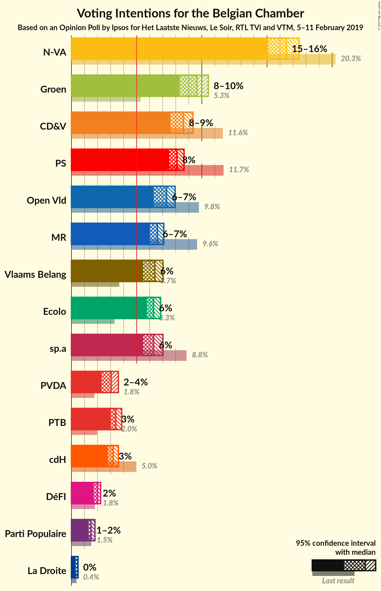

### Confidence Intervals

| Party | Last Result | Poll Result | 80% Confidence Interval | 90% Confidence Interval | 95% Confidence Interval | 99% Confidence Interval |
|:-----:|:-----------:|:-----------:|:-----------------------:|:-----------------------:|:-----------------------:|:-----------------------:|
| N-VA | 20.3% | 17.5% | 15.5–16.4% |15.3–16.5% |15.1–16.5% |14.7–16.5% |
| Groen | 5.3% | 9.6% | 8.7–10.3% |8.5–10.4% |8.3–10.5% |7.9–10.6% |
| CD&V | 11.6% | 9.3% | 7.9–8.5% |7.7–8.6% |7.6–8.6% |7.3–8.6% |
| PS | 11.7% | 8.6% | 7.7–8.1% |7.6–8.1% |7.5–8.1% |7.3–8.1% |
| Open Vld | 9.8% | 8.0% | 6.6–7.2% |6.5–7.3% |6.3–7.3% |6.0–7.3% |
| MR | 9.6% | 7.1% | 6.2–6.5% |6.1–6.5% |6.0–6.6% |5.8–6.6% |
| sp.a | 8.8% | 7.0% | 5.7–6.3% |5.6–6.3% |5.5–6.3% |5.2–6.4% |
| Vlaams Belang | 3.7% | 7.0% | 5.8–6.4% |5.6–6.4% |5.5–6.4% |5.2–6.4% |
| Ecolo | 3.3% | 6.8% | 5.9–6.3% |5.9–6.3% |5.8–6.3% |5.6–6.3% |
| PTB | 2.0% | 3.9% | 3.1–3.4% |3.1–3.4% |3.0–3.4% |2.9–3.4% |
| cdH | 5.0% | 3.6% | 2.9–3.2% |2.9–3.2% |2.8–3.2% |2.7–3.2% |
| PVDA | 1.8% | 3.0% | 2.5–3.5% |2.4–3.6% |2.3–3.6% |2.1–3.7% |
| DéFI | 1.8% | 2.2% | 1.8–2.0% |1.7–2.0% |1.7–2.0% |1.6–2.0% |
| Parti Populaire | 1.5% | 1.8% | 1.4–1.5% |1.3–1.5% |1.3–1.5% |1.2–1.5% |
| La Droite | 0.4% | 0.5% | 0.3–0.5% |0.3–0.5% |0.3–0.5% |0.2–0.5% |

*Note:* The poll result column reflects the actual value used in the calculations. Published results may vary slightly, and in addition be rounded to fewer digits.

## Seats

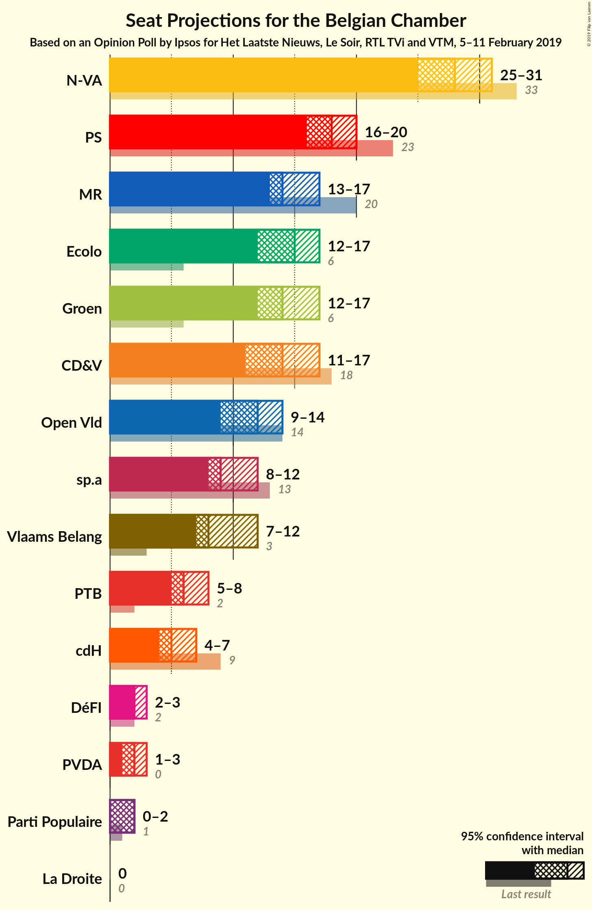

### Confidence Intervals

| Party | Last Result | Median | 80% Confidence Interval | 90% Confidence Interval | 95% Confidence Interval | 99% Confidence Interval |
|:-----:|:-----------:|:------:|:-----------------------:|:-----------------------:|:-----------------------:|:-----------------------:|
| <a href="#n-va">N-VA</a> | 33 | 28 | 26–30 |25–30 |25–31 |24–32 |
| <a href="#groen">Groen</a> | 6 | 14 | 12–16 |12–17 |12–17 |11–17 |
| <a href="#cd&v">CD&V</a> | 18 | 14 | 13–15 |12–16 |11–17 |11–18 |
| <a href="#ps">PS</a> | 23 | 18 | 17–19 |16–20 |16–20 |15–21 |
| <a href="#open-vld">Open Vld</a> | 14 | 12 | 10–13 |10–13 |9–14 |8–15 |
| <a href="#mr">MR</a> | 20 | 14 | 13–16 |13–16 |13–17 |12–17 |
| <a href="#sp.a">sp.a</a> | 13 | 9 | 9–11 |8–11 |8–12 |6–13 |
| <a href="#vlaams-belang">Vlaams Belang</a> | 3 | 8 | 8–11 |8–12 |7–12 |7–13 |
| <a href="#ecolo">Ecolo</a> | 6 | 15 | 13–16 |13–17 |12–17 |11–17 |
| <a href="#ptb">PTB</a> | 2 | 6 | 5–7 |5–8 |5–8 |4–8 |
| <a href="#cdh">cdH</a> | 9 | 5 | 4–6 |4–7 |4–7 |3–8 |
| <a href="#pvda">PVDA</a> | 0 | 2 | 1–3 |1–3 |1–3 |1–4 |
| <a href="#défi">DéFI</a> | 2 | 2 | 2–3 |2–3 |2–3 |2–5 |
| <a href="#parti-populaire">Parti Populaire</a> | 1 | 2 | 1–2 |0–2 |0–2 |0–2 |
| <a href="#la-droite">La Droite</a> | 0 | 0 | 0 |0 |0 |0 |

### N-VA

*For a full overview of the results for this party, see the [N-VA](party-n-va.html) page.*

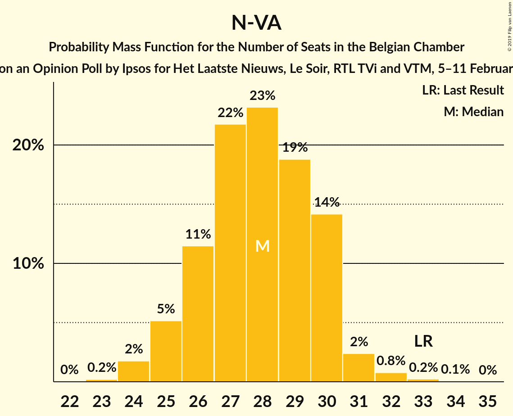

| Number of Seats | Probability | Accumulated | Special Marks |
|:---------------:|:-----------:|:-----------:|:-------------:|
| 23 | 0.2% | 100% |  |
| 24 | 2% | 99.8% |  |
| 25 | 5% | 98% |  |
| 26 | 11% | 93% |  |
| 27 | 22% | 81% |  |
| 28 | 23% | 60% | Median |
| 29 | 19% | 36% |  |
| 30 | 14% | 18% |  |
| 31 | 2% | 3% |  |
| 32 | 0.8% | 1.1% |  |
| 33 | 0.2% | 0.3% | Last Result |
| 34 | 0.1% | 0.1% |  |
| 35 | 0% | 0% |  |

### Groen

*For a full overview of the results for this party, see the [Groen](party-groen.html) page.*

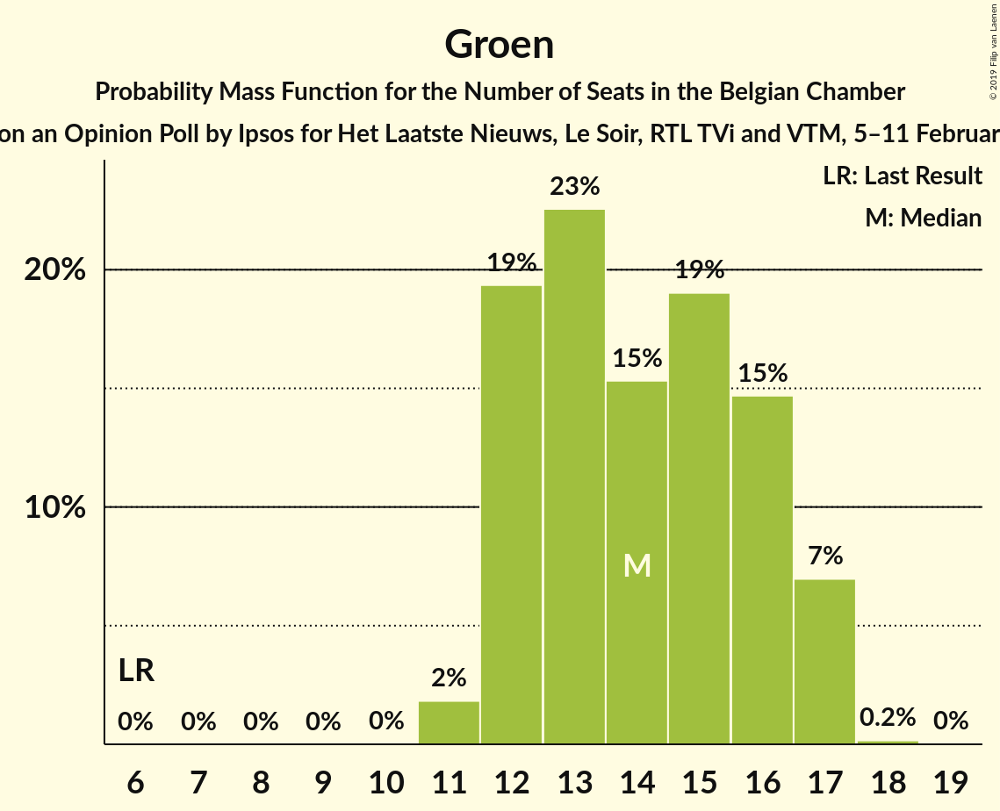

| Number of Seats | Probability | Accumulated | Special Marks |
|:---------------:|:-----------:|:-----------:|:-------------:|
| 6 | 0% | 100% | Last Result |
| 7 | 0% | 100% |  |
| 8 | 0% | 100% |  |
| 9 | 0% | 100% |  |
| 10 | 0% | 100% |  |
| 11 | 2% | 100% |  |
| 12 | 19% | 98% |  |
| 13 | 23% | 79% |  |
| 14 | 15% | 56% | Median |
| 15 | 19% | 41% |  |
| 16 | 15% | 22% |  |
| 17 | 7% | 7% |  |
| 18 | 0.2% | 0.2% |  |
| 19 | 0% | 0% |  |

### CD&V

*For a full overview of the results for this party, see the [CD&V](party-cdv.html) page.*

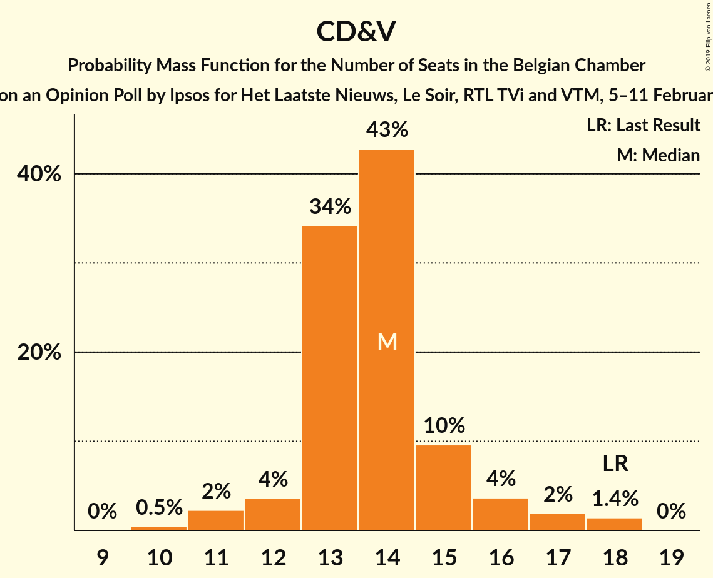

| Number of Seats | Probability | Accumulated | Special Marks |
|:---------------:|:-----------:|:-----------:|:-------------:|
| 10 | 0.5% | 100% |  |
| 11 | 2% | 99.5% |  |
| 12 | 4% | 97% |  |
| 13 | 34% | 94% |  |
| 14 | 43% | 59% | Median |
| 15 | 10% | 17% |  |
| 16 | 4% | 7% |  |
| 17 | 2% | 3% |  |
| 18 | 1.4% | 1.4% | Last Result |
| 19 | 0% | 0% |  |

### PS

*For a full overview of the results for this party, see the [PS](party-ps.html) page.*

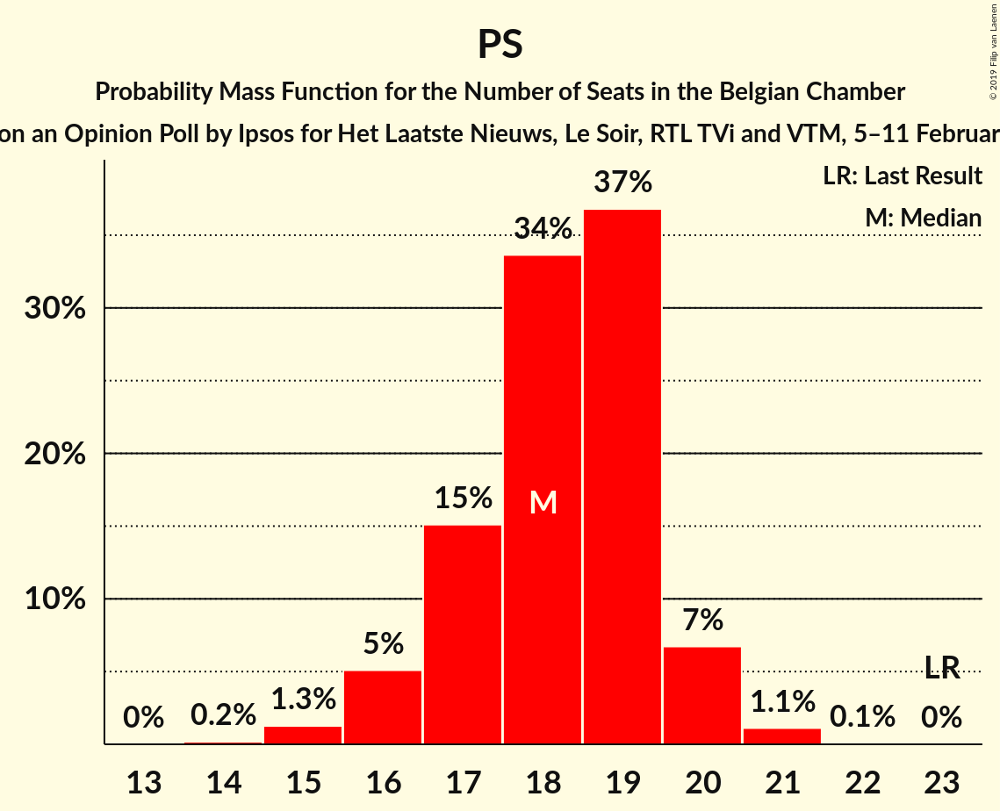

| Number of Seats | Probability | Accumulated | Special Marks |
|:---------------:|:-----------:|:-----------:|:-------------:|
| 14 | 0.2% | 100% |  |
| 15 | 1.3% | 99.8% |  |
| 16 | 5% | 98.6% |  |
| 17 | 15% | 93% |  |
| 18 | 34% | 78% | Median |
| 19 | 37% | 45% |  |
| 20 | 7% | 8% |  |
| 21 | 1.1% | 1.2% |  |
| 22 | 0.1% | 0.1% |  |
| 23 | 0% | 0% | Last Result |

### Open Vld

*For a full overview of the results for this party, see the [Open Vld](party-openvld.html) page.*

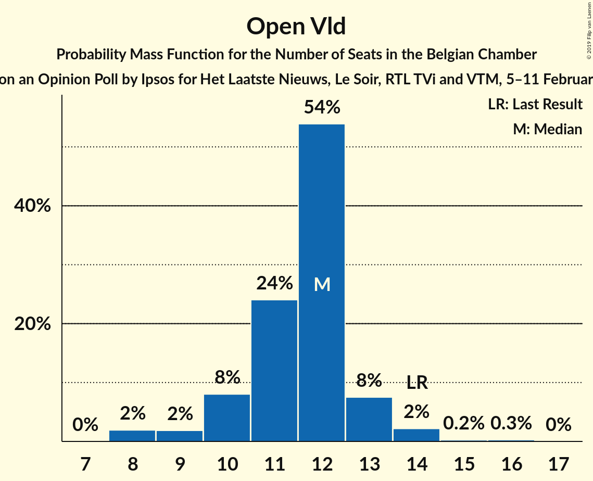

| Number of Seats | Probability | Accumulated | Special Marks |
|:---------------:|:-----------:|:-----------:|:-------------:|
| 8 | 2% | 100% |  |
| 9 | 2% | 98% |  |
| 10 | 8% | 96% |  |
| 11 | 24% | 88% |  |
| 12 | 54% | 64% | Median |
| 13 | 8% | 10% |  |
| 14 | 2% | 3% | Last Result |
| 15 | 0.2% | 0.5% |  |
| 16 | 0.3% | 0.3% |  |
| 17 | 0% | 0% |  |

### MR

*For a full overview of the results for this party, see the [MR](party-mr.html) page.*

| Number of Seats | Probability | Accumulated | Special Marks |
|:---------------:|:-----------:|:-----------:|:-------------:|
| 11 | 0.1% | 100% |  |
| 12 | 2% | 99.9% |  |
| 13 | 22% | 98% |  |
| 14 | 28% | 75% | Median |
| 15 | 31% | 47% |  |
| 16 | 12% | 16% |  |
| 17 | 4% | 4% |  |
| 18 | 0.2% | 0.2% |  |
| 19 | 0% | 0% |  |
| 20 | 0% | 0% | Last Result |

### sp.a

*For a full overview of the results for this party, see the [sp.a](party-spa.html) page.*

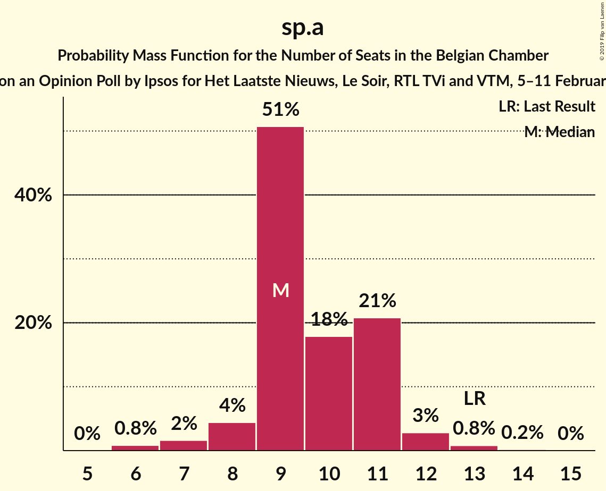

| Number of Seats | Probability | Accumulated | Special Marks |
|:---------------:|:-----------:|:-----------:|:-------------:|
| 6 | 0.8% | 100% |  |
| 7 | 2% | 99.2% |  |
| 8 | 4% | 98% |  |
| 9 | 51% | 93% | Median |
| 10 | 18% | 42% |  |
| 11 | 21% | 25% |  |
| 12 | 3% | 4% |  |
| 13 | 0.8% | 1.0% | Last Result |
| 14 | 0.2% | 0.2% |  |
| 15 | 0% | 0% |  |

### Vlaams Belang

*For a full overview of the results for this party, see the [Vlaams Belang](party-vlaamsbelang.html) page.*

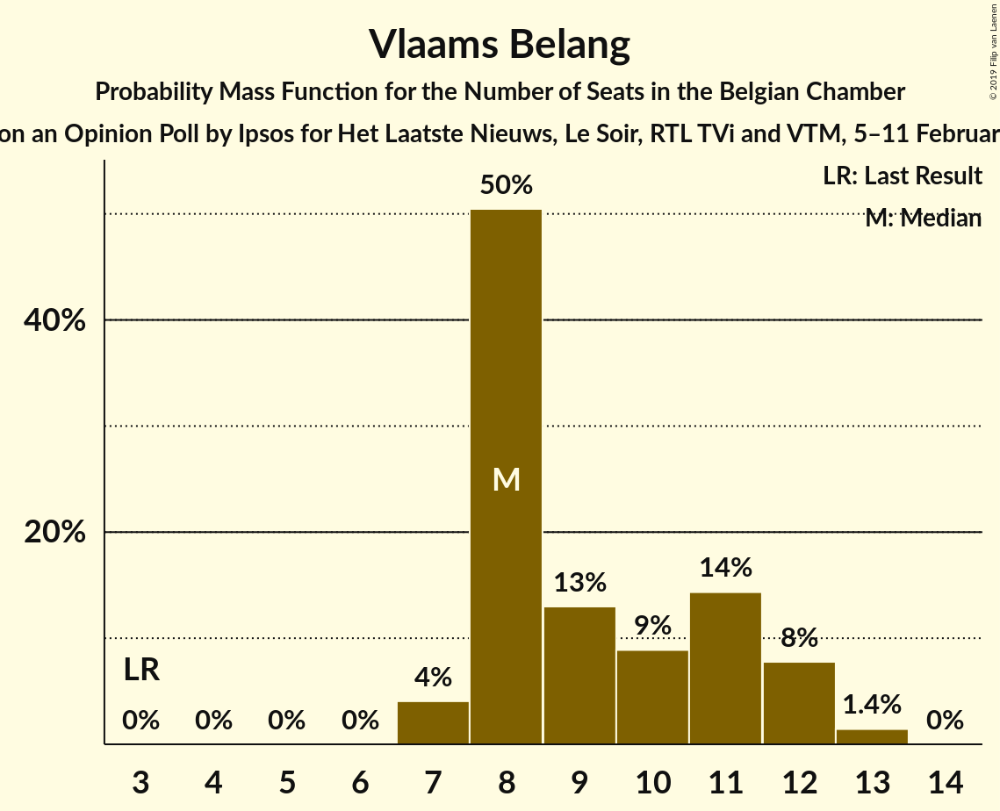

| Number of Seats | Probability | Accumulated | Special Marks |
|:---------------:|:-----------:|:-----------:|:-------------:|
| 3 | 0% | 100% | Last Result |
| 4 | 0% | 100% |  |
| 5 | 0% | 100% |  |
| 6 | 0% | 100% |  |
| 7 | 4% | 100% |  |
| 8 | 50% | 96% | Median |
| 9 | 13% | 45% |  |
| 10 | 9% | 32% |  |
| 11 | 14% | 24% |  |
| 12 | 8% | 9% |  |
| 13 | 1.4% | 1.4% |  |
| 14 | 0% | 0% |  |

### Ecolo

*For a full overview of the results for this party, see the [Ecolo](party-ecolo.html) page.*

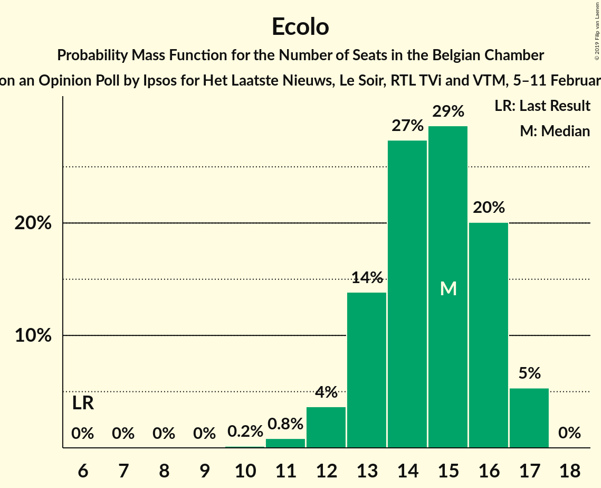

| Number of Seats | Probability | Accumulated | Special Marks |
|:---------------:|:-----------:|:-----------:|:-------------:|
| 6 | 0% | 100% | Last Result |
| 7 | 0% | 100% |  |
| 8 | 0% | 100% |  |
| 9 | 0% | 100% |  |
| 10 | 0.2% | 100% |  |
| 11 | 0.8% | 99.8% |  |
| 12 | 4% | 99.0% |  |
| 13 | 14% | 95% |  |
| 14 | 27% | 81% |  |
| 15 | 29% | 54% | Median |
| 16 | 20% | 25% |  |
| 17 | 5% | 5% |  |
| 18 | 0% | 0% |  |

### PTB

*For a full overview of the results for this party, see the [PTB](party-ptb.html) page.*

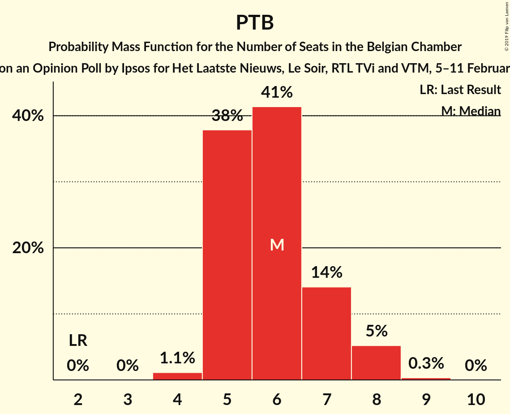

| Number of Seats | Probability | Accumulated | Special Marks |
|:---------------:|:-----------:|:-----------:|:-------------:|
| 2 | 0% | 100% | Last Result |
| 3 | 0% | 100% |  |
| 4 | 1.1% | 100% |  |
| 5 | 38% | 98.9% |  |
| 6 | 41% | 61% | Median |
| 7 | 14% | 20% |  |
| 8 | 5% | 6% |  |
| 9 | 0.3% | 0.3% |  |
| 10 | 0% | 0% |  |

### cdH

*For a full overview of the results for this party, see the [cdH](party-cdh.html) page.*

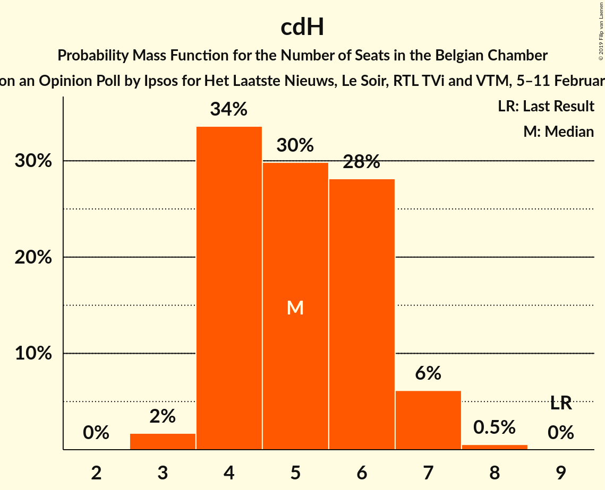

| Number of Seats | Probability | Accumulated | Special Marks |
|:---------------:|:-----------:|:-----------:|:-------------:|
| 3 | 2% | 100% |  |
| 4 | 34% | 98% |  |
| 5 | 30% | 65% | Median |
| 6 | 28% | 35% |  |
| 7 | 6% | 7% |  |
| 8 | 0.5% | 0.6% |  |
| 9 | 0% | 0% | Last Result |

### PVDA

*For a full overview of the results for this party, see the [PVDA](party-pvda.html) page.*

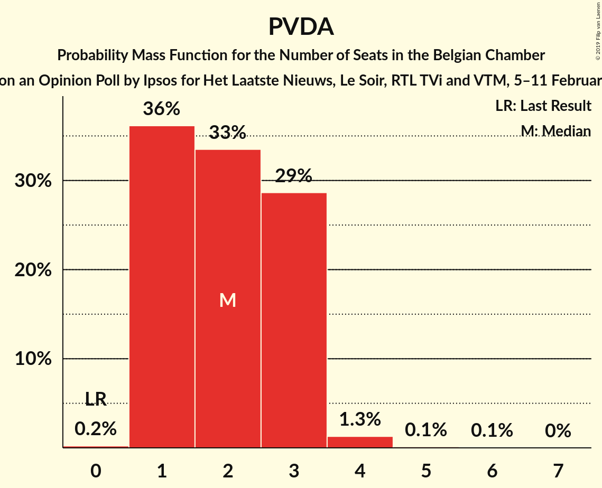

| Number of Seats | Probability | Accumulated | Special Marks |
|:---------------:|:-----------:|:-----------:|:-------------:|
| 0 | 0.2% | 100% | Last Result |
| 1 | 36% | 99.8% |  |
| 2 | 33% | 64% | Median |
| 3 | 29% | 30% |  |
| 4 | 1.3% | 1.5% |  |
| 5 | 0.1% | 0.2% |  |
| 6 | 0.1% | 0.1% |  |
| 7 | 0% | 0% |  |

### DéFI

*For a full overview of the results for this party, see the [DéFI](party-défi.html) page.*

| Number of Seats | Probability | Accumulated | Special Marks |
|:---------------:|:-----------:|:-----------:|:-------------:|
| 1 | 0.3% | 100% |  |
| 2 | 80% | 99.7% | Last Result, Median |
| 3 | 18% | 20% |  |
| 4 | 1.2% | 2% |  |
| 5 | 0.7% | 0.8% |  |
| 6 | 0.1% | 0.1% |  |
| 7 | 0% | 0% |  |

### Parti Populaire

*For a full overview of the results for this party, see the [Parti Populaire](party-partipopulaire.html) page.*

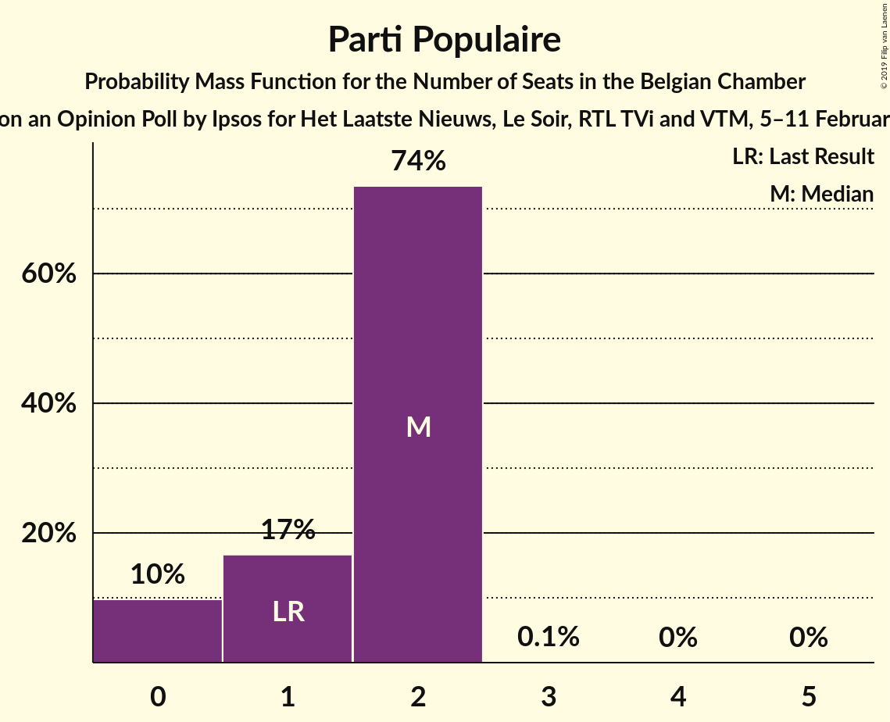

| Number of Seats | Probability | Accumulated | Special Marks |
|:---------------:|:-----------:|:-----------:|:-------------:|
| 0 | 10% | 100% |  |
| 1 | 17% | 90% | Last Result |
| 2 | 74% | 74% | Median |
| 3 | 0.1% | 0.1% |  |
| 4 | 0% | 0% |  |

### La Droite

*For a full overview of the results for this party, see the [La Droite](party-ladroite.html) page.*

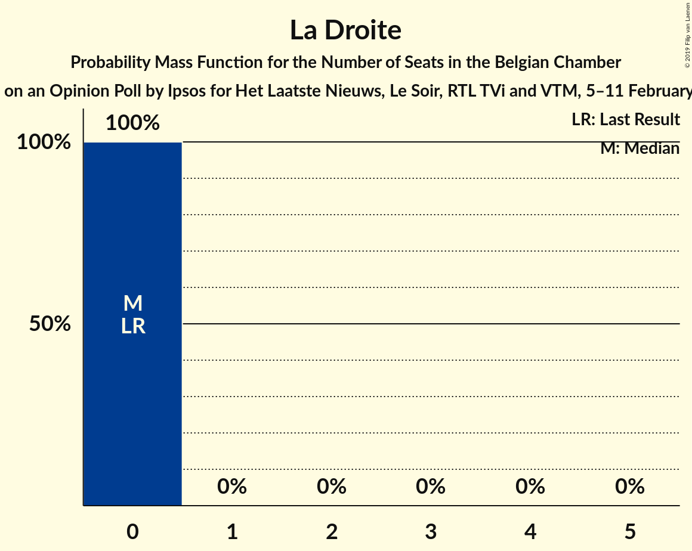

| Number of Seats | Probability | Accumulated | Special Marks |
|:---------------:|:-----------:|:-----------:|:-------------:|
| 0 | 100% | 100% | Last Result, Median |

## Coalitions

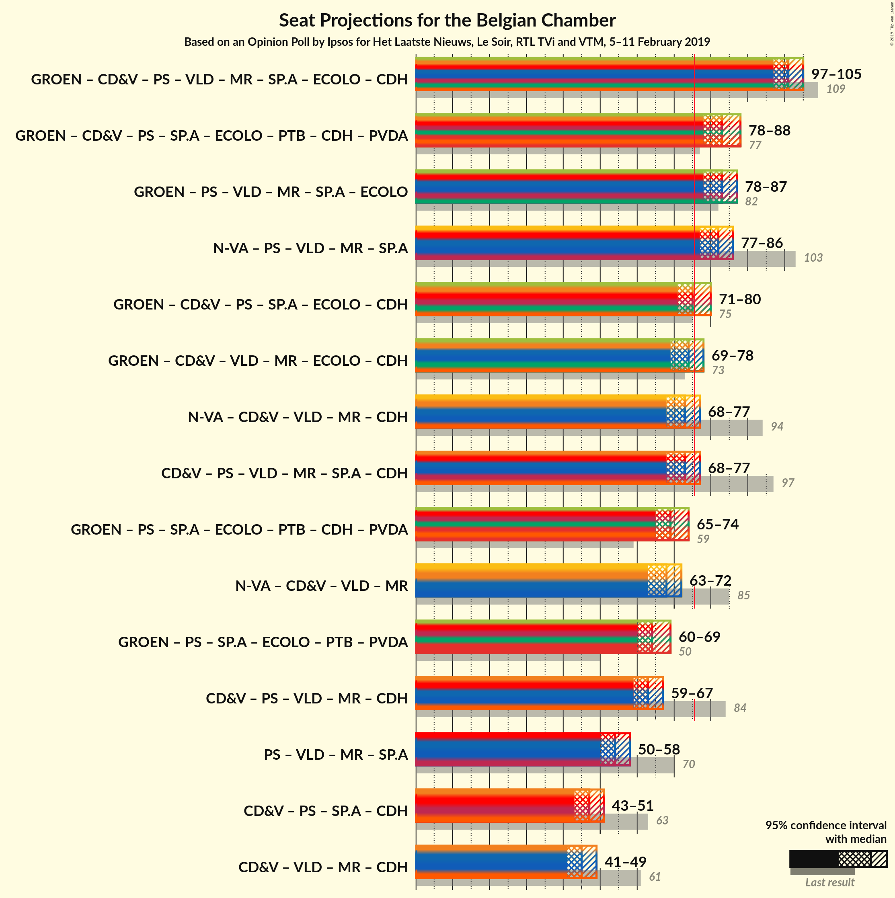

### Confidence Intervals

| Coalition | Last Result | Median | Majority? | 80% Confidence Interval | 90% Confidence Interval | 95% Confidence Interval | 99% Confidence Interval |
|:---------:|:-----------:|:------:|:---------:|:-----------------------:|:-----------------------:|:-----------------------:|:-----------------------:|
| Groen – CD&V – PS – Open Vld – MR – sp.a – Ecolo – cdH | 109 | 101 | 100% | 98–104 | 98–105 | 97–105 | 95–107 |
| Groen – CD&V – PS – sp.a – Ecolo – PTB – cdH – PVDA | 77 | 83 | 100% | 80–86 | 79–87 | 78–88 | 77–89 |
| Groen – PS – Open Vld – MR – sp.a – Ecolo | 82 | 83 | 99.9% | 80–85 | 79–86 | 78–87 | 77–88 |
| N-VA – PS – Open Vld – MR – sp.a | 103 | 82 | 99.6% | 79–85 | 78–85 | 77–86 | 76–88 |
| Groen – CD&V – PS – sp.a – Ecolo – cdH | 75 | 75 | 47% | 72–78 | 71–79 | 71–80 | 69–81 |
| Groen – CD&V – Open Vld – MR – Ecolo – cdH | 73 | 74 | 20% | 70–76 | 70–77 | 69–78 | 67–79 |
| N-VA – CD&V – Open Vld – MR – cdH | 94 | 73 | 12% | 70–76 | 69–77 | 68–77 | 67–79 |
| CD&V – PS – Open Vld – MR – sp.a – cdH | 97 | 73 | 10% | 70–76 | 69–76 | 68–77 | 67–79 |
| Groen – PS – sp.a – Ecolo – PTB – cdH – PVDA | 59 | 69 | 0.4% | 66–72 | 66–73 | 65–74 | 64–75 |
| N-VA – CD&V – Open Vld – MR | 85 | 68 | 0% | 65–70 | 64–71 | 63–72 | 62–73 |
| Groen – PS – sp.a – Ecolo – PTB – PVDA | 50 | 64 | 0% | 61–67 | 60–68 | 60–69 | 58–70 |
| CD&V – PS – Open Vld – MR – cdH | 84 | 63 | 0% | 61–66 | 60–67 | 59–67 | 58–69 |
| PS – Open Vld – MR – sp.a | 70 | 54 | 0% | 51–56 | 51–57 | 50–58 | 48–59 |
| CD&V – PS – sp.a – cdH | 63 | 47 | 0% | 44–49 | 44–50 | 43–51 | 42–52 |
| CD&V – Open Vld – MR – cdH | 61 | 45 | 0% | 42–47 | 41–48 | 41–49 | 39–50 |

### Groen – CD&V – PS – Open Vld – MR – sp.a – Ecolo – cdH

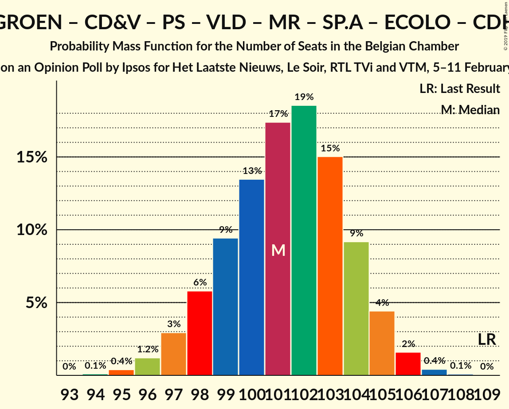

| Number of Seats | Probability | Accumulated | Special Marks |
|:---------------:|:-----------:|:-----------:|:-------------:|
| 94 | 0.1% | 100% |  |
| 95 | 0.4% | 99.9% |  |
| 96 | 1.2% | 99.5% |  |
| 97 | 3% | 98% |  |
| 98 | 6% | 95% |  |
| 99 | 9% | 90% |  |
| 100 | 13% | 80% |  |
| 101 | 17% | 67% | Median |
| 102 | 19% | 49% |  |
| 103 | 15% | 31% |  |
| 104 | 9% | 16% |  |
| 105 | 4% | 7% |  |
| 106 | 2% | 2% |  |
| 107 | 0.4% | 0.5% |  |
| 108 | 0.1% | 0.1% |  |
| 109 | 0% | 0% | Last Result |

### Groen – CD&V – PS – sp.a – Ecolo – PTB – cdH – PVDA

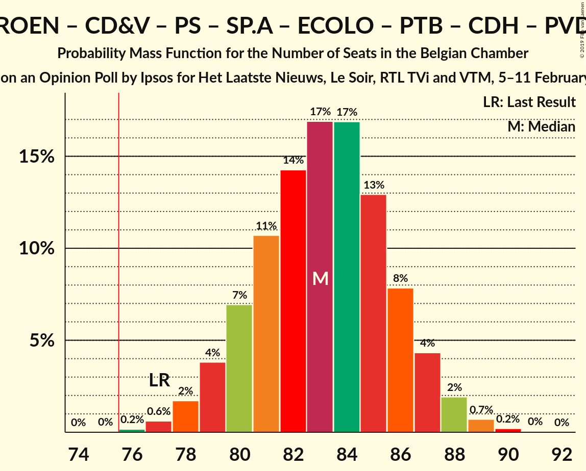

| Number of Seats | Probability | Accumulated | Special Marks |
|:---------------:|:-----------:|:-----------:|:-------------:|
| 76 | 0.2% | 100% | Majority |
| 77 | 0.6% | 99.8% | Last Result |
| 78 | 2% | 99.2% |  |
| 79 | 4% | 97% |  |
| 80 | 7% | 94% |  |
| 81 | 11% | 87% |  |
| 82 | 14% | 76% |  |
| 83 | 17% | 62% | Median |
| 84 | 17% | 45% |  |
| 85 | 13% | 28% |  |
| 86 | 8% | 15% |  |
| 87 | 4% | 7% |  |
| 88 | 2% | 3% |  |
| 89 | 0.7% | 1.0% |  |
| 90 | 0.2% | 0.3% |  |
| 91 | 0% | 0.1% |  |
| 92 | 0% | 0% |  |

### Groen – PS – Open Vld – MR – sp.a – Ecolo

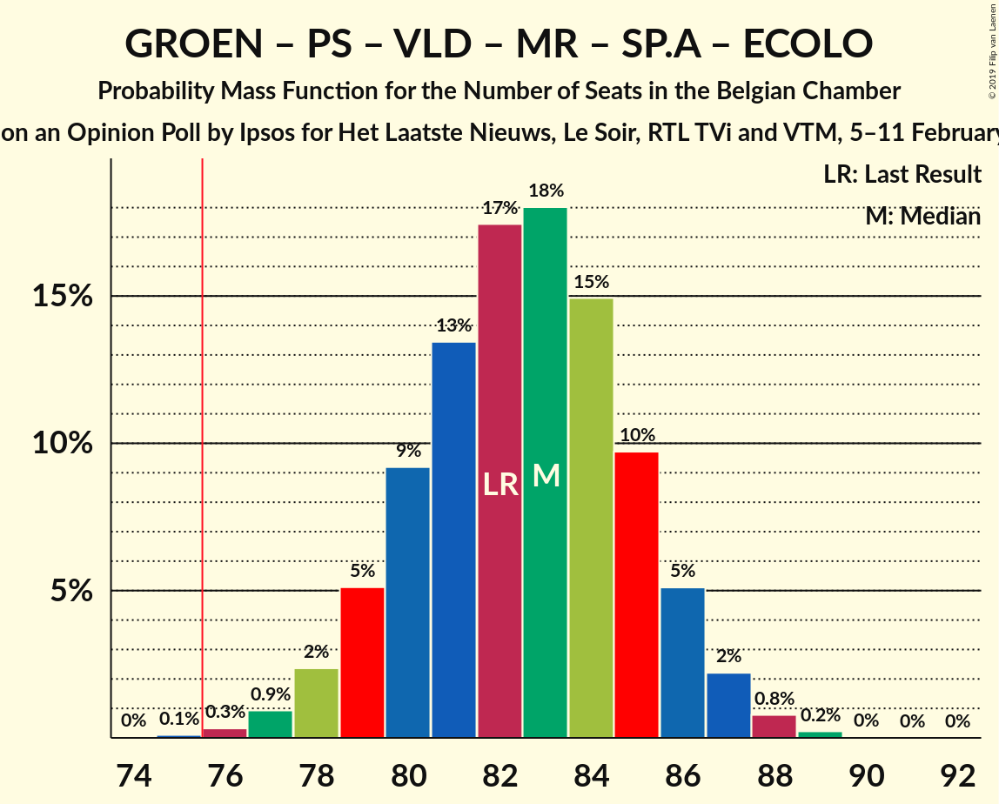

| Number of Seats | Probability | Accumulated | Special Marks |
|:---------------:|:-----------:|:-----------:|:-------------:|
| 75 | 0.1% | 100% |  |
| 76 | 0.3% | 99.9% | Majority |
| 77 | 0.9% | 99.5% |  |
| 78 | 2% | 98.6% |  |
| 79 | 5% | 96% |  |
| 80 | 9% | 91% |  |
| 81 | 13% | 82% |  |
| 82 | 17% | 68% | Last Result, Median |
| 83 | 18% | 51% |  |
| 84 | 15% | 33% |  |
| 85 | 10% | 18% |  |
| 86 | 5% | 8% |  |
| 87 | 2% | 3% |  |
| 88 | 0.8% | 1.1% |  |
| 89 | 0.2% | 0.3% |  |
| 90 | 0% | 0.1% |  |
| 91 | 0% | 0% |  |

### N-VA – PS – Open Vld – MR – sp.a

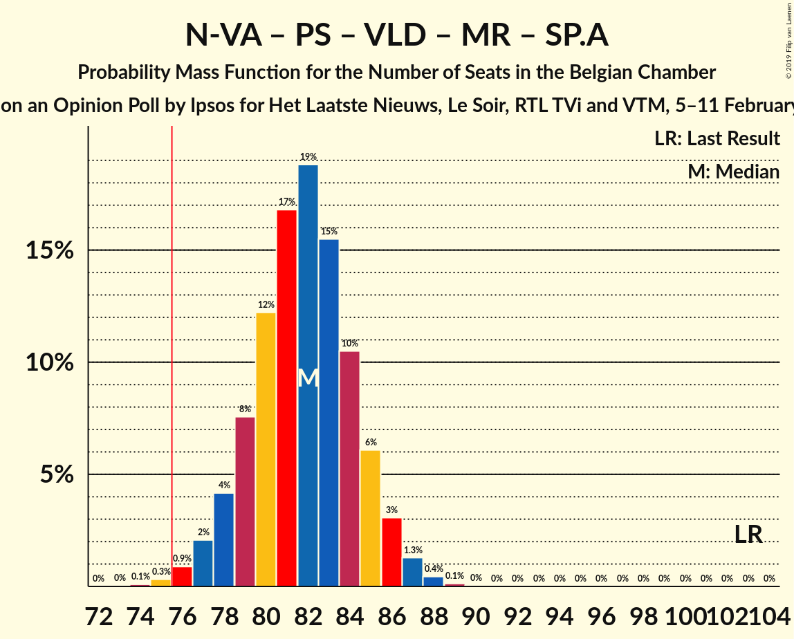

| Number of Seats | Probability | Accumulated | Special Marks |
|:---------------:|:-----------:|:-----------:|:-------------:|
| 74 | 0.1% | 100% |  |
| 75 | 0.3% | 99.9% |  |
| 76 | 0.9% | 99.6% | Majority |
| 77 | 2% | 98.7% |  |
| 78 | 4% | 97% |  |
| 79 | 8% | 92% |  |
| 80 | 12% | 85% |  |
| 81 | 17% | 73% | Median |
| 82 | 19% | 56% |  |
| 83 | 15% | 37% |  |
| 84 | 10% | 22% |  |
| 85 | 6% | 11% |  |
| 86 | 3% | 5% |  |
| 87 | 1.3% | 2% |  |
| 88 | 0.4% | 0.6% |  |
| 89 | 0.1% | 0.2% |  |
| 90 | 0% | 0% |  |
| 91 | 0% | 0% |  |
| 92 | 0% | 0% |  |
| 93 | 0% | 0% |  |
| 94 | 0% | 0% |  |
| 95 | 0% | 0% |  |
| 96 | 0% | 0% |  |
| 97 | 0% | 0% |  |
| 98 | 0% | 0% |  |
| 99 | 0% | 0% |  |
| 100 | 0% | 0% |  |
| 101 | 0% | 0% |  |
| 102 | 0% | 0% |  |
| 103 | 0% | 0% | Last Result |

### Groen – CD&V – PS – sp.a – Ecolo – cdH

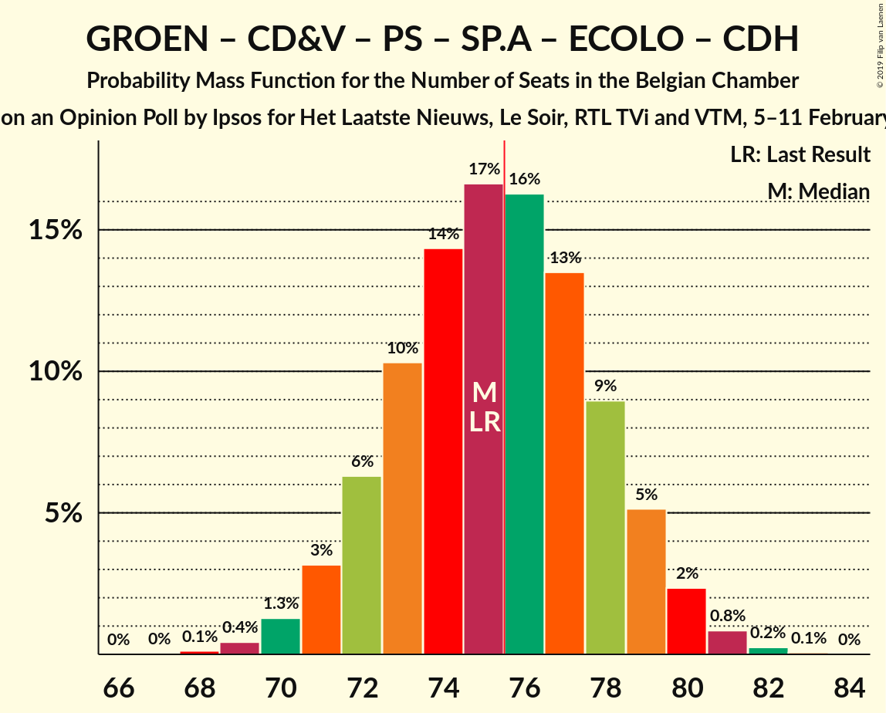

| Number of Seats | Probability | Accumulated | Special Marks |
|:---------------:|:-----------:|:-----------:|:-------------:|
| 68 | 0.1% | 100% |  |
| 69 | 0.4% | 99.8% |  |
| 70 | 1.3% | 99.4% |  |
| 71 | 3% | 98% |  |
| 72 | 6% | 95% |  |
| 73 | 10% | 89% |  |
| 74 | 14% | 78% |  |
| 75 | 17% | 64% | Last Result, Median |
| 76 | 16% | 47% | Majority |
| 77 | 13% | 31% |  |
| 78 | 9% | 18% |  |
| 79 | 5% | 9% |  |
| 80 | 2% | 4% |  |
| 81 | 0.8% | 1.2% |  |
| 82 | 0.2% | 0.3% |  |
| 83 | 0.1% | 0.1% |  |
| 84 | 0% | 0% |  |

### Groen – CD&V – Open Vld – MR – Ecolo – cdH

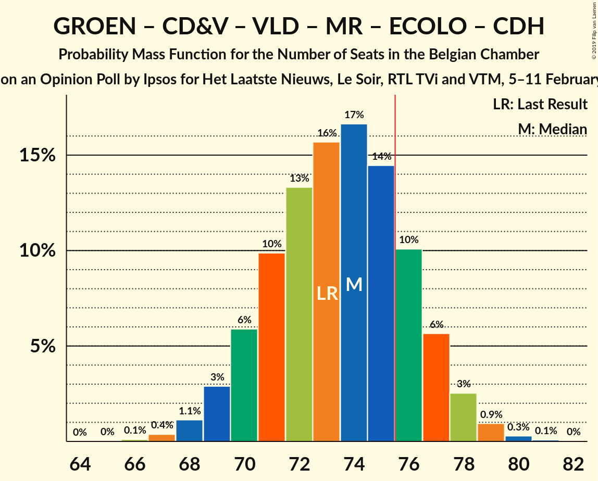

| Number of Seats | Probability | Accumulated | Special Marks |
|:---------------:|:-----------:|:-----------:|:-------------:|
| 66 | 0.1% | 100% |  |
| 67 | 0.4% | 99.9% |  |
| 68 | 1.1% | 99.5% |  |
| 69 | 3% | 98% |  |
| 70 | 6% | 95% |  |
| 71 | 10% | 90% |  |
| 72 | 13% | 80% |  |
| 73 | 16% | 66% | Last Result |
| 74 | 17% | 51% | Median |
| 75 | 14% | 34% |  |
| 76 | 10% | 20% | Majority |
| 77 | 6% | 10% |  |
| 78 | 3% | 4% |  |
| 79 | 0.9% | 1.3% |  |
| 80 | 0.3% | 0.4% |  |
| 81 | 0.1% | 0.1% |  |
| 82 | 0% | 0% |  |

### N-VA – CD&V – Open Vld – MR – cdH

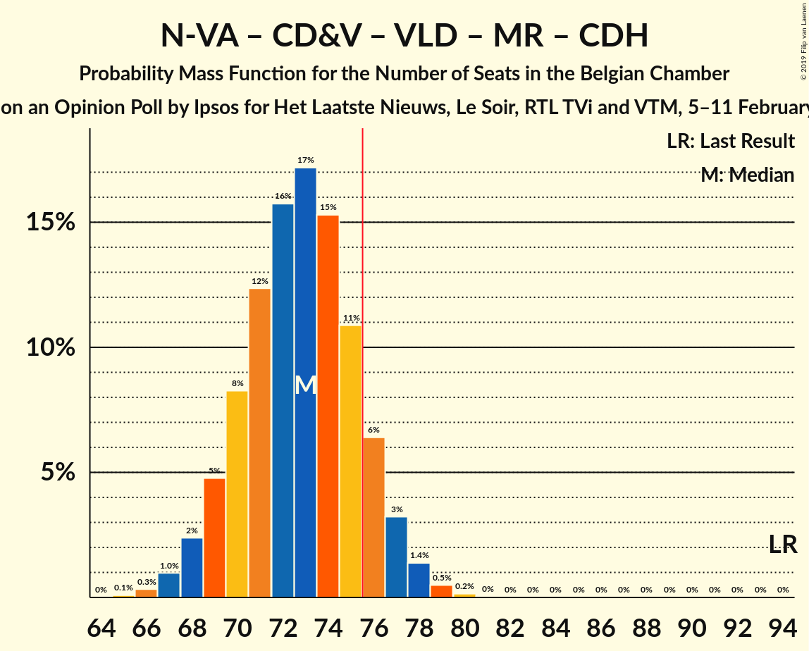

| Number of Seats | Probability | Accumulated | Special Marks |
|:---------------:|:-----------:|:-----------:|:-------------:|
| 65 | 0.1% | 100% |  |
| 66 | 0.3% | 99.9% |  |
| 67 | 1.0% | 99.6% |  |
| 68 | 2% | 98.6% |  |
| 69 | 5% | 96% |  |
| 70 | 8% | 91% |  |
| 71 | 12% | 83% |  |
| 72 | 16% | 71% |  |
| 73 | 17% | 55% | Median |
| 74 | 15% | 38% |  |
| 75 | 11% | 23% |  |
| 76 | 6% | 12% | Majority |
| 77 | 3% | 5% |  |
| 78 | 1.4% | 2% |  |
| 79 | 0.5% | 0.7% |  |
| 80 | 0.2% | 0.2% |  |
| 81 | 0% | 0% |  |
| 82 | 0% | 0% |  |
| 83 | 0% | 0% |  |
| 84 | 0% | 0% |  |
| 85 | 0% | 0% |  |
| 86 | 0% | 0% |  |
| 87 | 0% | 0% |  |
| 88 | 0% | 0% |  |
| 89 | 0% | 0% |  |
| 90 | 0% | 0% |  |
| 91 | 0% | 0% |  |
| 92 | 0% | 0% |  |
| 93 | 0% | 0% |  |
| 94 | 0% | 0% | Last Result |

### CD&V – PS – Open Vld – MR – sp.a – cdH

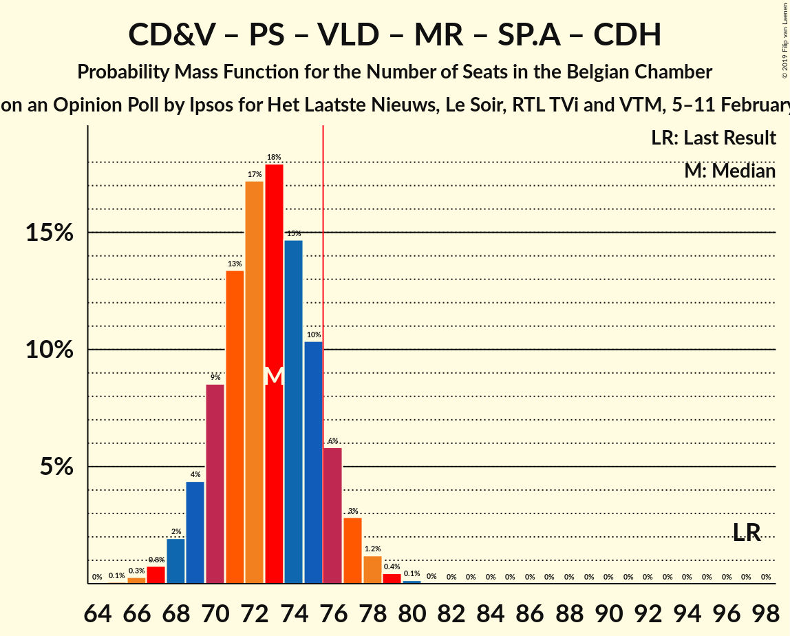

| Number of Seats | Probability | Accumulated | Special Marks |
|:---------------:|:-----------:|:-----------:|:-------------:|
| 65 | 0.1% | 100% |  |
| 66 | 0.3% | 99.9% |  |
| 67 | 0.8% | 99.6% |  |
| 68 | 2% | 98.9% |  |
| 69 | 4% | 97% |  |
| 70 | 9% | 93% |  |
| 71 | 13% | 84% |  |
| 72 | 17% | 71% | Median |
| 73 | 18% | 53% |  |
| 74 | 15% | 36% |  |
| 75 | 10% | 21% |  |
| 76 | 6% | 10% | Majority |
| 77 | 3% | 5% |  |
| 78 | 1.2% | 2% |  |
| 79 | 0.4% | 0.6% |  |
| 80 | 0.1% | 0.2% |  |
| 81 | 0% | 0.1% |  |
| 82 | 0% | 0% |  |
| 83 | 0% | 0% |  |
| 84 | 0% | 0% |  |
| 85 | 0% | 0% |  |
| 86 | 0% | 0% |  |
| 87 | 0% | 0% |  |
| 88 | 0% | 0% |  |
| 89 | 0% | 0% |  |
| 90 | 0% | 0% |  |
| 91 | 0% | 0% |  |
| 92 | 0% | 0% |  |
| 93 | 0% | 0% |  |
| 94 | 0% | 0% |  |
| 95 | 0% | 0% |  |
| 96 | 0% | 0% |  |
| 97 | 0% | 0% | Last Result |

### Groen – PS – sp.a – Ecolo – PTB – cdH – PVDA

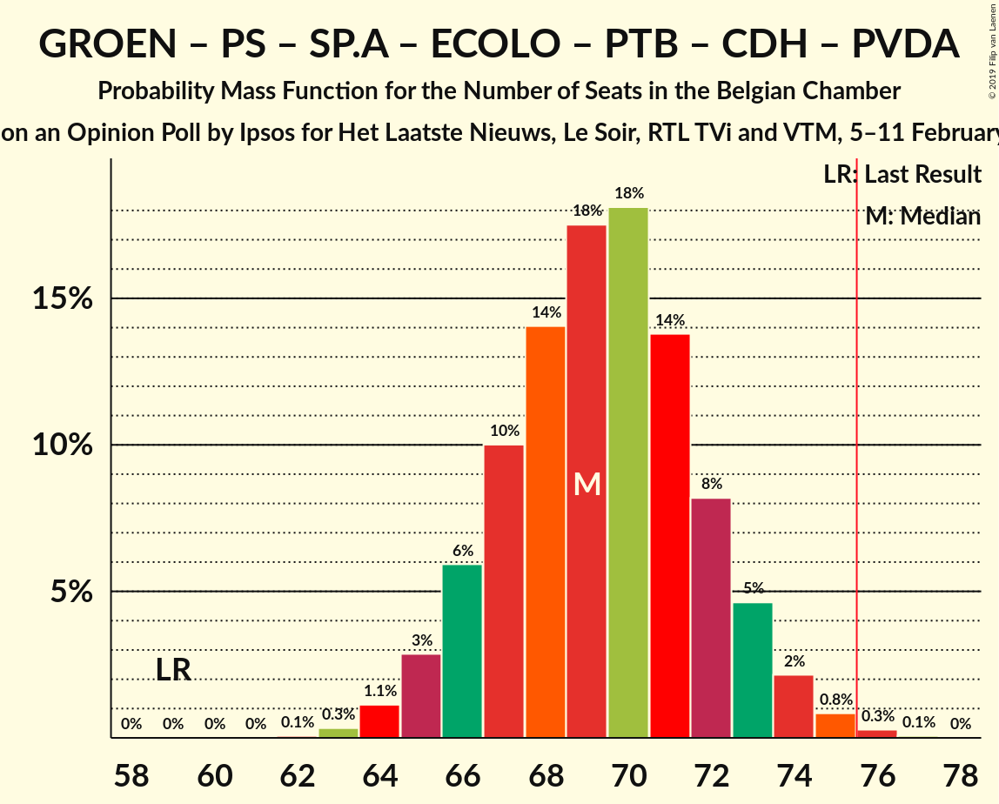

| Number of Seats | Probability | Accumulated | Special Marks |
|:---------------:|:-----------:|:-----------:|:-------------:|
| 59 | 0% | 100% | Last Result |
| 60 | 0% | 100% |  |
| 61 | 0% | 100% |  |
| 62 | 0.1% | 100% |  |
| 63 | 0.3% | 99.9% |  |
| 64 | 1.1% | 99.6% |  |
| 65 | 3% | 98% |  |
| 66 | 6% | 96% |  |
| 67 | 10% | 90% |  |
| 68 | 14% | 80% |  |
| 69 | 18% | 66% | Median |
| 70 | 18% | 48% |  |
| 71 | 14% | 30% |  |
| 72 | 8% | 16% |  |
| 73 | 5% | 8% |  |
| 74 | 2% | 3% |  |
| 75 | 0.8% | 1.2% |  |
| 76 | 0.3% | 0.4% | Majority |
| 77 | 0.1% | 0.1% |  |
| 78 | 0% | 0% |  |

### N-VA – CD&V – Open Vld – MR

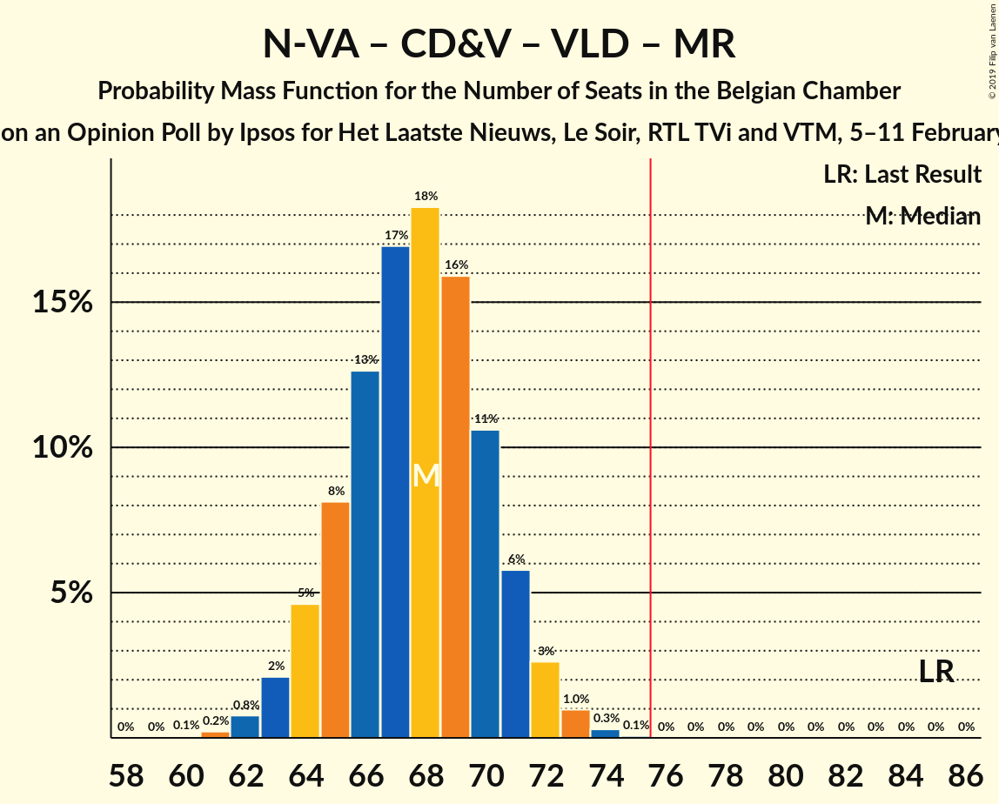

| Number of Seats | Probability | Accumulated | Special Marks |
|:---------------:|:-----------:|:-----------:|:-------------:|
| 60 | 0.1% | 100% |  |
| 61 | 0.2% | 99.9% |  |
| 62 | 0.8% | 99.7% |  |
| 63 | 2% | 98.9% |  |
| 64 | 5% | 97% |  |
| 65 | 8% | 92% |  |
| 66 | 13% | 84% |  |
| 67 | 17% | 71% |  |
| 68 | 18% | 55% | Median |
| 69 | 16% | 36% |  |
| 70 | 11% | 20% |  |
| 71 | 6% | 10% |  |
| 72 | 3% | 4% |  |
| 73 | 1.0% | 1.3% |  |
| 74 | 0.3% | 0.4% |  |
| 75 | 0.1% | 0.1% |  |
| 76 | 0% | 0% | Majority |
| 77 | 0% | 0% |  |
| 78 | 0% | 0% |  |
| 79 | 0% | 0% |  |
| 80 | 0% | 0% |  |
| 81 | 0% | 0% |  |
| 82 | 0% | 0% |  |
| 83 | 0% | 0% |  |
| 84 | 0% | 0% |  |
| 85 | 0% | 0% | Last Result |

### Groen – PS – sp.a – Ecolo – PTB – PVDA

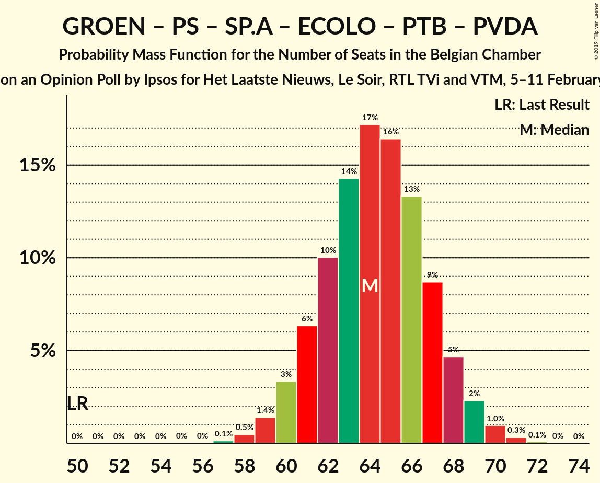

| Number of Seats | Probability | Accumulated | Special Marks |
|:---------------:|:-----------:|:-----------:|:-------------:|
| 50 | 0% | 100% | Last Result |
| 51 | 0% | 100% |  |
| 52 | 0% | 100% |  |
| 53 | 0% | 100% |  |
| 54 | 0% | 100% |  |
| 55 | 0% | 100% |  |
| 56 | 0% | 100% |  |
| 57 | 0.1% | 100% |  |
| 58 | 0.5% | 99.8% |  |
| 59 | 1.4% | 99.4% |  |
| 60 | 3% | 98% |  |
| 61 | 6% | 95% |  |
| 62 | 10% | 88% |  |
| 63 | 14% | 78% |  |
| 64 | 17% | 64% | Median |
| 65 | 16% | 47% |  |
| 66 | 13% | 30% |  |
| 67 | 9% | 17% |  |
| 68 | 5% | 8% |  |
| 69 | 2% | 4% |  |
| 70 | 1.0% | 1.4% |  |
| 71 | 0.3% | 0.4% |  |
| 72 | 0.1% | 0.1% |  |
| 73 | 0% | 0% |  |

### CD&V – PS – Open Vld – MR – cdH

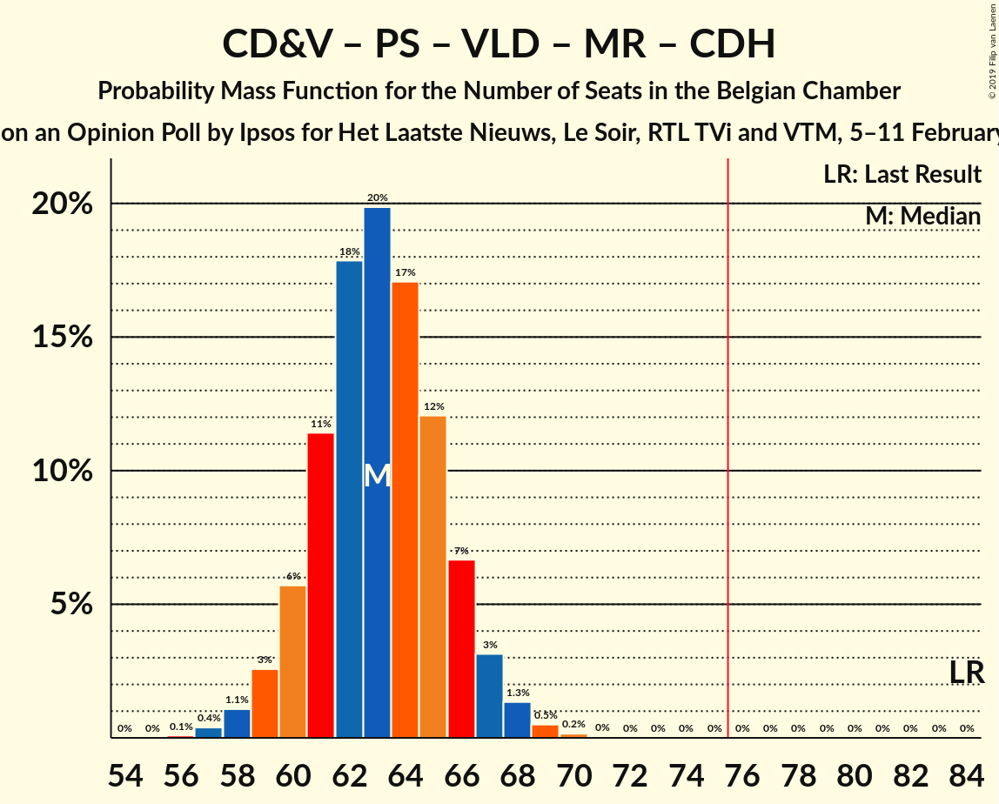

| Number of Seats | Probability | Accumulated | Special Marks |
|:---------------:|:-----------:|:-----------:|:-------------:|
| 56 | 0.1% | 100% |  |
| 57 | 0.4% | 99.9% |  |
| 58 | 1.1% | 99.5% |  |
| 59 | 3% | 98% |  |
| 60 | 6% | 96% |  |
| 61 | 11% | 90% |  |
| 62 | 18% | 79% |  |
| 63 | 20% | 61% | Median |
| 64 | 17% | 41% |  |
| 65 | 12% | 24% |  |
| 66 | 7% | 12% |  |
| 67 | 3% | 5% |  |
| 68 | 1.3% | 2% |  |
| 69 | 0.5% | 0.7% |  |
| 70 | 0.2% | 0.2% |  |
| 71 | 0% | 0.1% |  |
| 72 | 0% | 0% |  |
| 73 | 0% | 0% |  |
| 74 | 0% | 0% |  |
| 75 | 0% | 0% |  |
| 76 | 0% | 0% | Majority |
| 77 | 0% | 0% |  |
| 78 | 0% | 0% |  |
| 79 | 0% | 0% |  |
| 80 | 0% | 0% |  |
| 81 | 0% | 0% |  |
| 82 | 0% | 0% |  |
| 83 | 0% | 0% |  |
| 84 | 0% | 0% | Last Result |

### PS – Open Vld – MR – sp.a

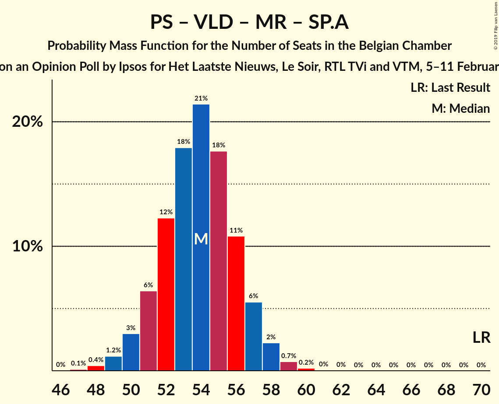

| Number of Seats | Probability | Accumulated | Special Marks |
|:---------------:|:-----------:|:-----------:|:-------------:|
| 47 | 0.1% | 100% |  |
| 48 | 0.4% | 99.8% |  |
| 49 | 1.2% | 99.4% |  |
| 50 | 3% | 98% |  |
| 51 | 6% | 95% |  |
| 52 | 12% | 89% |  |
| 53 | 18% | 77% | Median |
| 54 | 21% | 59% |  |
| 55 | 18% | 37% |  |
| 56 | 11% | 20% |  |
| 57 | 6% | 9% |  |
| 58 | 2% | 3% |  |
| 59 | 0.7% | 1.0% |  |
| 60 | 0.2% | 0.3% |  |
| 61 | 0% | 0.1% |  |
| 62 | 0% | 0% |  |
| 63 | 0% | 0% |  |
| 64 | 0% | 0% |  |
| 65 | 0% | 0% |  |
| 66 | 0% | 0% |  |
| 67 | 0% | 0% |  |
| 68 | 0% | 0% |  |
| 69 | 0% | 0% |  |
| 70 | 0% | 0% | Last Result |

### CD&V – PS – sp.a – cdH

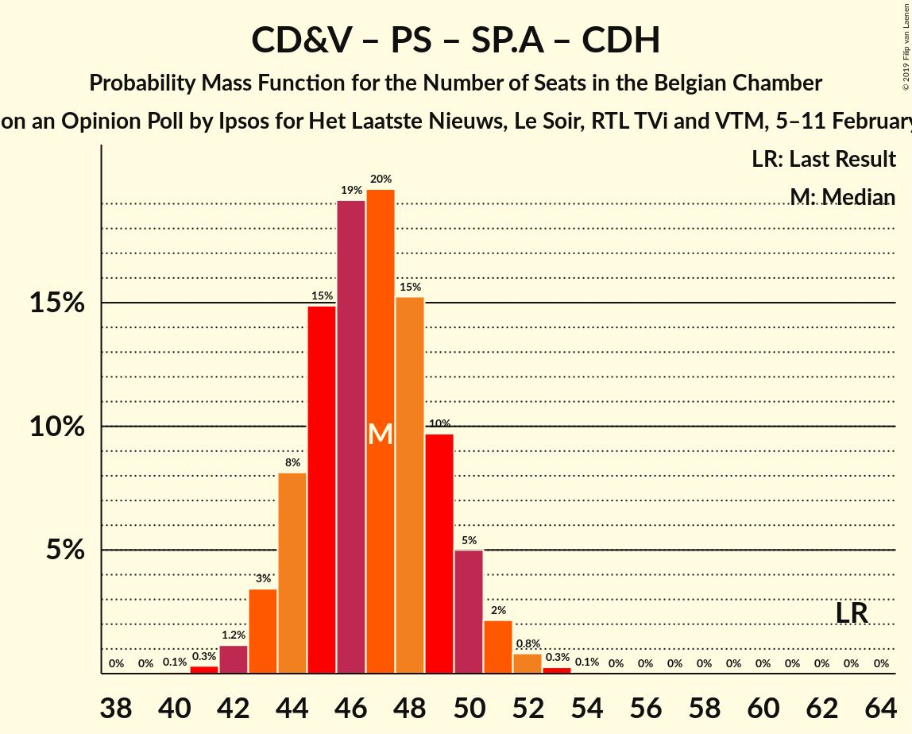

| Number of Seats | Probability | Accumulated | Special Marks |
|:---------------:|:-----------:|:-----------:|:-------------:|
| 40 | 0.1% | 100% |  |
| 41 | 0.3% | 99.9% |  |
| 42 | 1.2% | 99.6% |  |
| 43 | 3% | 98% |  |
| 44 | 8% | 95% |  |
| 45 | 15% | 87% |  |
| 46 | 19% | 72% | Median |
| 47 | 20% | 53% |  |
| 48 | 15% | 33% |  |
| 49 | 10% | 18% |  |
| 50 | 5% | 8% |  |
| 51 | 2% | 3% |  |
| 52 | 0.8% | 1.2% |  |
| 53 | 0.3% | 0.3% |  |
| 54 | 0.1% | 0.1% |  |
| 55 | 0% | 0% |  |
| 56 | 0% | 0% |  |
| 57 | 0% | 0% |  |
| 58 | 0% | 0% |  |
| 59 | 0% | 0% |  |
| 60 | 0% | 0% |  |
| 61 | 0% | 0% |  |
| 62 | 0% | 0% |  |
| 63 | 0% | 0% | Last Result |

### CD&V – Open Vld – MR – cdH

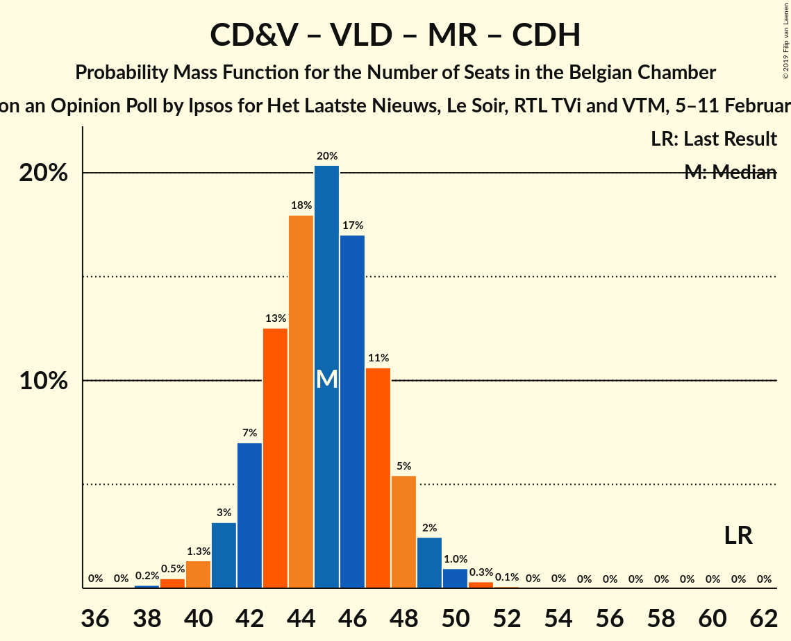

| Number of Seats | Probability | Accumulated | Special Marks |
|:---------------:|:-----------:|:-----------:|:-------------:|
| 38 | 0.2% | 100% |  |
| 39 | 0.5% | 99.8% |  |
| 40 | 1.3% | 99.3% |  |
| 41 | 3% | 98% |  |
| 42 | 7% | 95% |  |
| 43 | 13% | 88% |  |
| 44 | 18% | 75% |  |
| 45 | 20% | 57% | Median |
| 46 | 17% | 37% |  |
| 47 | 11% | 20% |  |
| 48 | 5% | 9% |  |
| 49 | 2% | 4% |  |
| 50 | 1.0% | 1.4% |  |
| 51 | 0.3% | 0.4% |  |
| 52 | 0.1% | 0.1% |  |
| 53 | 0% | 0% |  |
| 54 | 0% | 0% |  |
| 55 | 0% | 0% |  |
| 56 | 0% | 0% |  |
| 57 | 0% | 0% |  |
| 58 | 0% | 0% |  |
| 59 | 0% | 0% |  |
| 60 | 0% | 0% |  |
| 61 | 0% | 0% | Last Result |

## Technical Information

### Opinion Poll

+ **Polling firm:** Ipsos
+ **Commissioner(s):** Het Laatste Nieuws, Le Soir, RTL TVi and VTM
+ **Fieldwork period:** 5–11 February 2019

### Calculations

+ **Sample size:** 1609
+ **Simulations done:** 1,048,576
+ **Error estimate:** 1.10%

