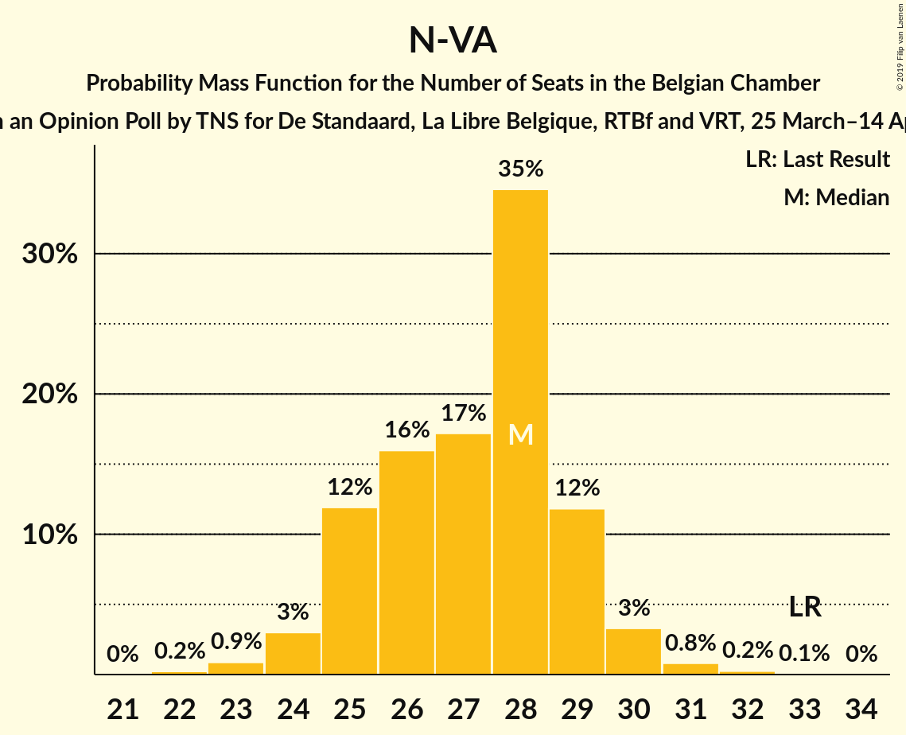
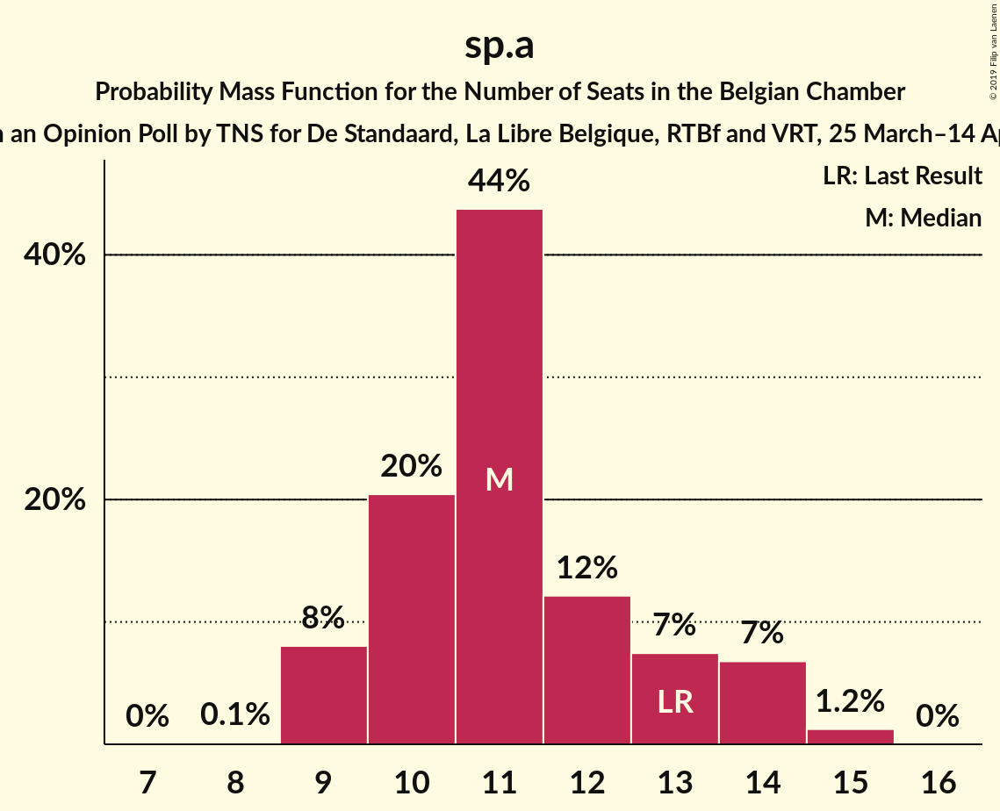
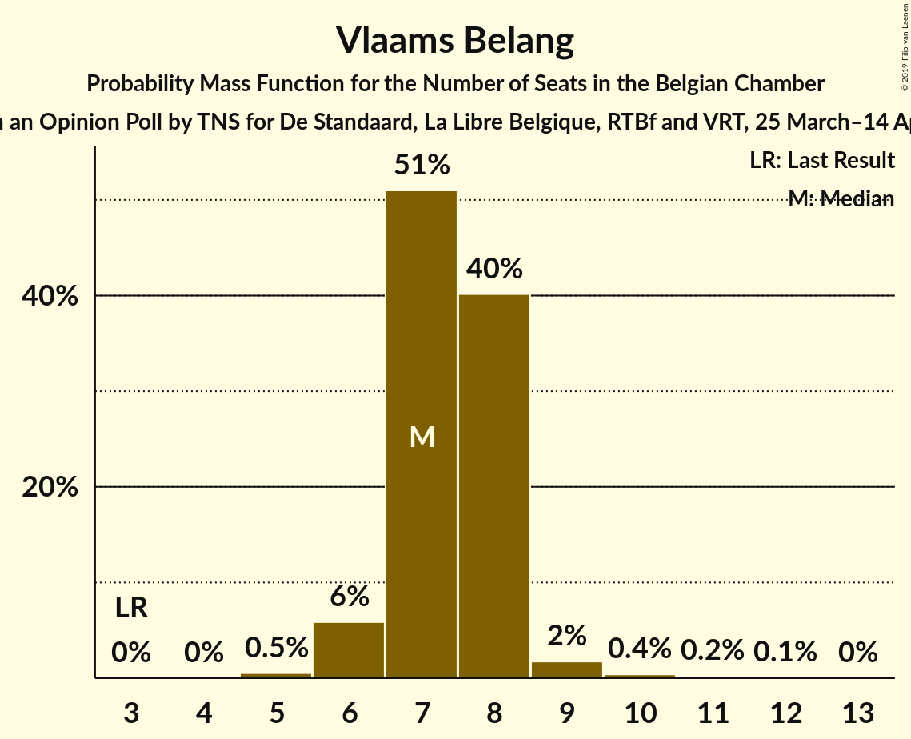
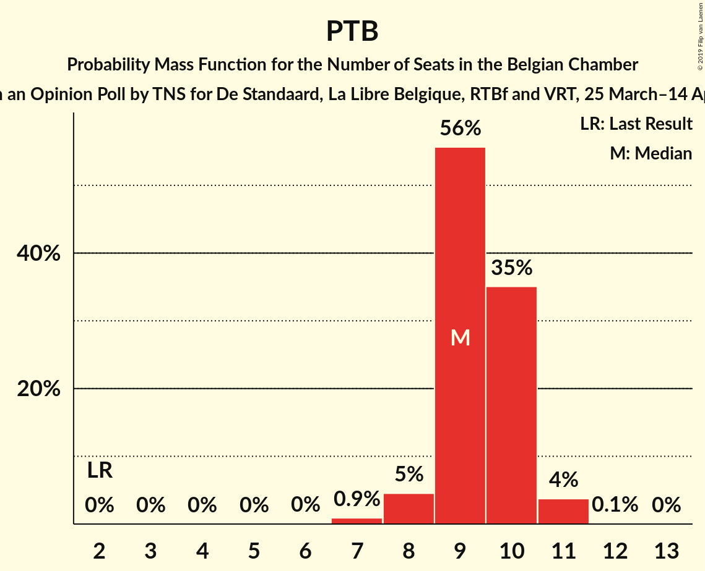
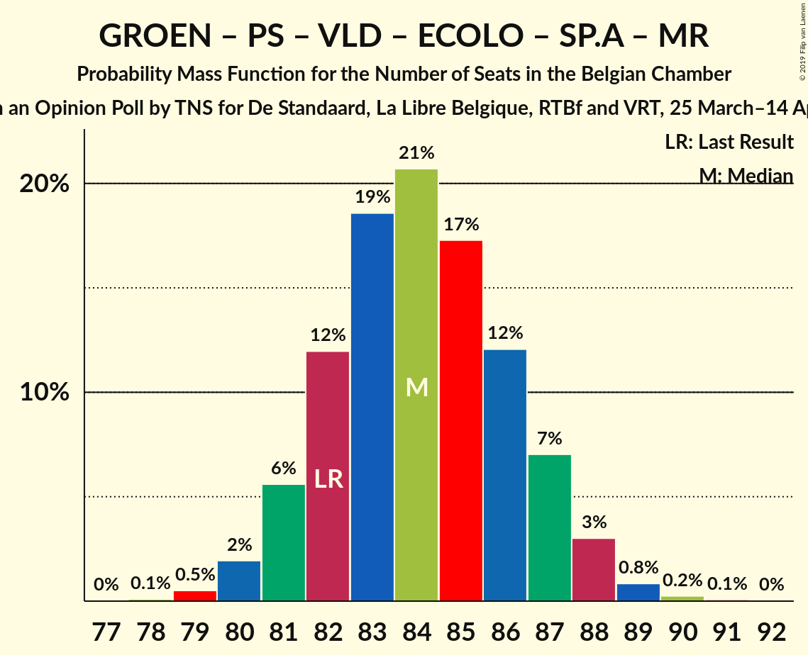
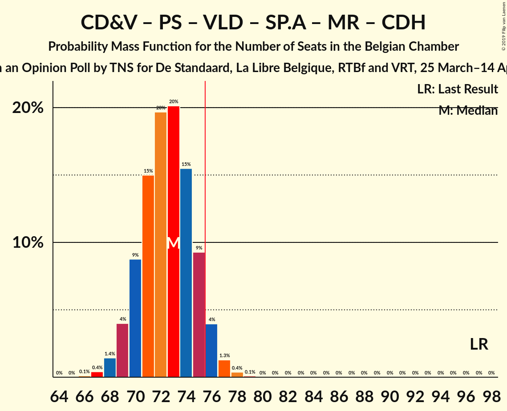
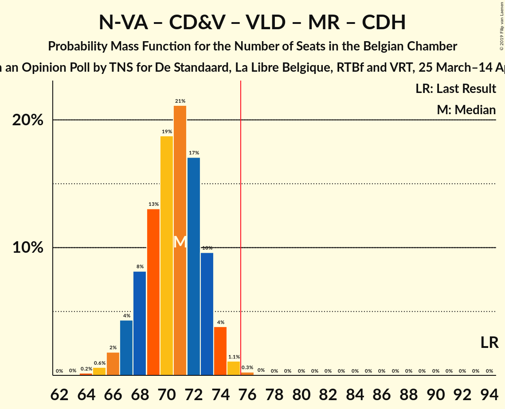
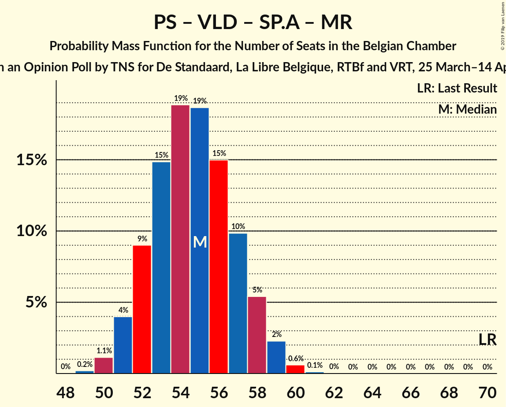
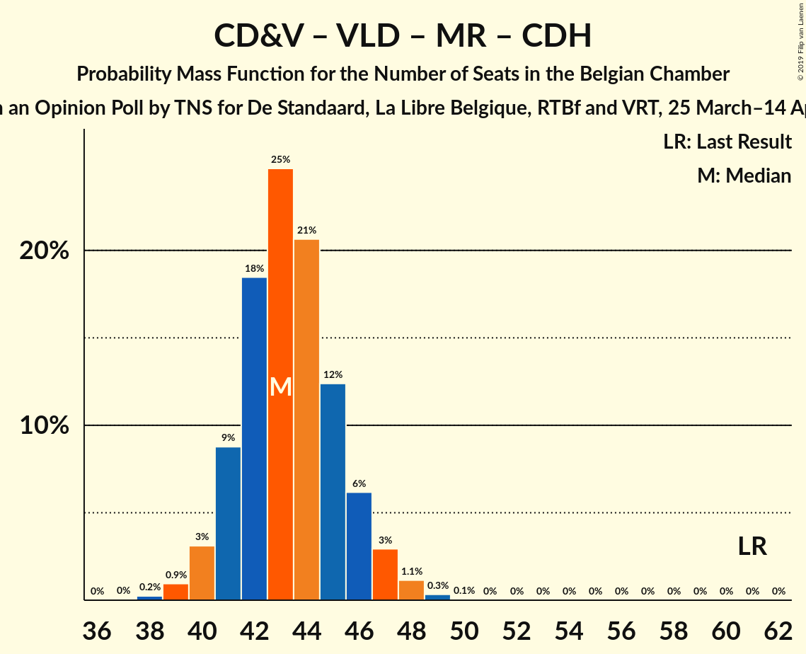

# Opinion Poll by TNS for De Standaard, La Libre Belgique, RTBf and VRT, 25 March–14 April 2019

Areas included: Brussels, Flanders, Wallonia

<a href="#voting-intentions">Voting Intentions</a> | <a href="#seats">Seats</a> | <a href="#coalitions">Coalitions</a> | <a href="#technical-information">Technical Information</a>

## Voting Intentions

### Confidence Intervals

| Party | Last Result | Poll Result | 80% Confidence Interval | 90% Confidence Interval | 95% Confidence Interval | 99% Confidence Interval |
|:-----:|:-----------:|:-----------:|:-----------------------:|:-----------------------:|:-----------------------:|:-----------------------:|
| N-VA | 20.3% | 17.6% | 15.7–16.6% |15.5–16.6% |15.3–16.6% |14.9–16.6% |
| CD&V | 11.6% | 9.2% | 7.8–8.5% |7.6–8.5% |7.5–8.5% |7.2–8.5% |
| Groen | 5.3% | 9.0% | 8.2–9.7% |7.9–9.8% |7.7–9.9% |7.4–10.0% |
| PS | 11.7% | 9.0% | 8.0–8.4% |7.9–8.4% |7.8–8.4% |7.6–8.4% |
| Open Vld | 9.8% | 8.9% | 7.5–8.2% |7.3–8.2% |7.2–8.2% |6.9–8.2% |
| Ecolo | 3.3% | 8.6% | 7.6–8.0% |7.5–8.0% |7.4–8.0% |7.2–8.0% |
| sp.a | 8.8% | 7.9% | 6.6–7.2% |6.5–7.3% |6.3–7.3% |6.0–7.3% |
| MR | 9.6% | 6.8% | 5.9–6.2% |5.8–6.2% |5.7–6.2% |5.6–6.3% |
| Vlaams Belang | 3.7% | 5.9% | 4.7–5.3% |4.6–5.3% |4.5–5.3% |4.2–5.3% |
| PTB | 2.0% | 5.4% | 4.6–4.9% |4.6–5.0% |4.5–5.0% |4.3–5.0% |
| PVDA | 1.8% | 3.6% | 3.1–4.1% |2.9–4.2% |2.8–4.2% |2.6–4.3% |
| cdH | 5.0% | 3.4% | 2.7–3.0% |2.7–3.0% |2.6–3.0% |2.5–3.0% |
| DéFI | 1.8% | 1.8% | 1.4–1.6% |1.4–1.6% |1.3–1.6% |1.2–1.6% |
| Parti Populaire | 1.5% | 1.1% | 0.7–0.9% |0.7–0.9% |0.7–0.9% |0.6–0.9% |

*Note:* The poll result column reflects the actual value used in the calculations. Published results may vary slightly, and in addition be rounded to fewer digits.

## Seats

### Confidence Intervals

| Party | Last Result | Median | 80% Confidence Interval | 90% Confidence Interval | 95% Confidence Interval | 99% Confidence Interval |
|:-----:|:-----------:|:------:|:-----------------------:|:-----------------------:|:-----------------------:|:-----------------------:|
| <a href="#n-va">N-VA</a> | 33 | 28 | 25–29 |25–29 |24–30 |22–31 |
| <a href="#cd&v">CD&V</a> | 18 | 14 | 12–14 |11–15 |11–16 |10–18 |
| <a href="#groen">Groen</a> | 6 | 12 | 11–15 |11–15 |11–16 |10–17 |
| <a href="#ps">PS</a> | 23 | 18 | 17–20 |16–20 |16–20 |16–20 |
| <a href="#open-vld">Open Vld</a> | 14 | 12 | 11–14 |11–15 |11–16 |10–17 |
| <a href="#ecolo">Ecolo</a> | 6 | 17 | 16–18 |16–18 |15–18 |15–19 |
| <a href="#sp.a">sp.a</a> | 13 | 11 | 10–13 |9–14 |9–14 |9–15 |
| <a href="#mr">MR</a> | 20 | 12 | 12–14 |11–14 |11–15 |11–15 |
| <a href="#vlaams-belang">Vlaams Belang</a> | 3 | 7 | 7–8 |6–8 |6–9 |5–10 |
| <a href="#ptb">PTB</a> | 2 | 9 | 9–10 |9–11 |8–11 |7–11 |
| <a href="#pvda">PVDA</a> | 0 | 3 | 2–4 |2–4 |1–5 |1–6 |
| <a href="#cdh">cdH</a> | 9 | 4 | 4–5 |4–6 |4–6 |3–6 |
| <a href="#défi">DéFI</a> | 2 | 1 | 1–2 |1–2 |1–2 |1–2 |
| <a href="#parti-populaire">Parti Populaire</a> | 1 | 0 | 0 |0 |0 |0–2 |

### N-VA

*For a full overview of the results for this party, see the [N-VA](party-n-va.html) page.*

| Number of Seats | Probability | Accumulated | Special Marks |
|:---------------:|:-----------:|:-----------:|:-------------:|
| 22 | 0.5% | 100% |  |
| 23 | 1.2% | 99.4% |  |
| 24 | 2% | 98% |  |
| 25 | 11% | 96% |  |
| 26 | 15% | 85% |  |
| 27 | 11% | 70% |  |
| 28 | 38% | 59% | Median |
| 29 | 16% | 20% |  |
| 30 | 3% | 4% |  |
| 31 | 0.7% | 1.1% |  |
| 32 | 0.3% | 0.4% |  |
| 33 | 0.1% | 0.1% | Last Result |
| 34 | 0% | 0% |  |

### CD&V

*For a full overview of the results for this party, see the [CD&V](party-cdv.html) page.*

| Number of Seats | Probability | Accumulated | Special Marks |
|:---------------:|:-----------:|:-----------:|:-------------:|
| 9 | 0.3% | 100% |  |
| 10 | 1.2% | 99.7% |  |
| 11 | 7% | 98.5% |  |
| 12 | 13% | 91% |  |
| 13 | 24% | 78% |  |
| 14 | 46% | 54% | Median |
| 15 | 4% | 8% |  |
| 16 | 3% | 4% |  |
| 17 | 0.6% | 1.4% |  |
| 18 | 0.8% | 0.8% | Last Result |
| 19 | 0% | 0% |  |

### Groen

*For a full overview of the results for this party, see the [Groen](party-groen.html) page.*

| Number of Seats | Probability | Accumulated | Special Marks |
|:---------------:|:-----------:|:-----------:|:-------------:|
| 6 | 0% | 100% | Last Result |
| 7 | 0% | 100% |  |
| 8 | 0% | 100% |  |
| 9 | 0% | 100% |  |
| 10 | 2% | 100% |  |
| 11 | 11% | 98% |  |
| 12 | 61% | 88% | Median |
| 13 | 7% | 27% |  |
| 14 | 6% | 20% |  |
| 15 | 9% | 14% |  |
| 16 | 2% | 4% |  |
| 17 | 2% | 2% |  |
| 18 | 0% | 0% |  |

### PS

*For a full overview of the results for this party, see the [PS](party-ps.html) page.*

| Number of Seats | Probability | Accumulated | Special Marks |
|:---------------:|:-----------:|:-----------:|:-------------:|
| 15 | 0.4% | 100% |  |
| 16 | 6% | 99.6% |  |
| 17 | 21% | 93% |  |
| 18 | 30% | 73% | Median |
| 19 | 29% | 43% |  |
| 20 | 14% | 14% |  |
| 21 | 0.1% | 0.1% |  |
| 22 | 0% | 0% |  |
| 23 | 0% | 0% | Last Result |

### Open Vld

*For a full overview of the results for this party, see the [Open Vld](party-openvld.html) page.*

| Number of Seats | Probability | Accumulated | Special Marks |
|:---------------:|:-----------:|:-----------:|:-------------:|
| 9 | 0.1% | 100% |  |
| 10 | 0.5% | 99.9% |  |
| 11 | 10% | 99.4% |  |
| 12 | 57% | 89% | Median |
| 13 | 14% | 33% |  |
| 14 | 9% | 19% | Last Result |
| 15 | 6% | 9% |  |
| 16 | 2% | 3% |  |
| 17 | 1.2% | 1.2% |  |
| 18 | 0% | 0% |  |

### Ecolo

*For a full overview of the results for this party, see the [Ecolo](party-ecolo.html) page.*

| Number of Seats | Probability | Accumulated | Special Marks |
|:---------------:|:-----------:|:-----------:|:-------------:|
| 6 | 0% | 100% | Last Result |
| 7 | 0% | 100% |  |
| 8 | 0% | 100% |  |
| 9 | 0% | 100% |  |
| 10 | 0% | 100% |  |
| 11 | 0% | 100% |  |
| 12 | 0% | 100% |  |
| 13 | 0% | 100% |  |
| 14 | 0.2% | 100% |  |
| 15 | 4% | 99.8% |  |
| 16 | 26% | 96% |  |
| 17 | 45% | 70% | Median |
| 18 | 23% | 25% |  |
| 19 | 2% | 2% |  |
| 20 | 0.1% | 0.2% |  |
| 21 | 0% | 0% |  |

### sp.a

*For a full overview of the results for this party, see the [sp.a](party-spa.html) page.*

| Number of Seats | Probability | Accumulated | Special Marks |
|:---------------:|:-----------:|:-----------:|:-------------:|
| 8 | 0.1% | 100% |  |
| 9 | 8% | 99.9% |  |
| 10 | 19% | 92% |  |
| 11 | 46% | 73% | Median |
| 12 | 13% | 26% |  |
| 13 | 7% | 14% | Last Result |
| 14 | 5% | 7% |  |
| 15 | 1.5% | 1.5% |  |
| 16 | 0% | 0% |  |

### MR

*For a full overview of the results for this party, see the [MR](party-mr.html) page.*

| Number of Seats | Probability | Accumulated | Special Marks |
|:---------------:|:-----------:|:-----------:|:-------------:|
| 10 | 0.2% | 100% |  |
| 11 | 9% | 99.8% |  |
| 12 | 43% | 91% | Median |
| 13 | 37% | 48% |  |
| 14 | 7% | 11% |  |
| 15 | 3% | 3% |  |
| 16 | 0.1% | 0.1% |  |
| 17 | 0% | 0% |  |
| 18 | 0% | 0% |  |
| 19 | 0% | 0% |  |
| 20 | 0% | 0% | Last Result |

### Vlaams Belang

*For a full overview of the results for this party, see the [Vlaams Belang](party-vlaamsbelang.html) page.*

| Number of Seats | Probability | Accumulated | Special Marks |
|:---------------:|:-----------:|:-----------:|:-------------:|
| 3 | 0% | 100% | Last Result |
| 4 | 0% | 100% |  |
| 5 | 0.6% | 100% |  |
| 6 | 7% | 99.4% |  |
| 7 | 51% | 92% | Median |
| 8 | 38% | 42% |  |
| 9 | 3% | 4% |  |
| 10 | 0.4% | 0.8% |  |
| 11 | 0.3% | 0.4% |  |
| 12 | 0.1% | 0.1% |  |
| 13 | 0% | 0% |  |

### PTB

*For a full overview of the results for this party, see the [PTB](party-ptb.html) page.*

| Number of Seats | Probability | Accumulated | Special Marks |
|:---------------:|:-----------:|:-----------:|:-------------:|
| 2 | 0% | 100% | Last Result |
| 3 | 0% | 100% |  |
| 4 | 0% | 100% |  |
| 5 | 0% | 100% |  |
| 6 | 0% | 100% |  |
| 7 | 0.9% | 100% |  |
| 8 | 3% | 99.1% |  |
| 9 | 57% | 96% | Median |
| 10 | 34% | 39% |  |
| 11 | 5% | 5% |  |
| 12 | 0.1% | 0.1% |  |
| 13 | 0% | 0% |  |

### PVDA

*For a full overview of the results for this party, see the [PVDA](party-pvda.html) page.*

| Number of Seats | Probability | Accumulated | Special Marks |
|:---------------:|:-----------:|:-----------:|:-------------:|
| 0 | 0% | 100% | Last Result |
| 1 | 4% | 100% |  |
| 2 | 23% | 96% |  |
| 3 | 62% | 74% | Median |
| 4 | 9% | 12% |  |
| 5 | 3% | 4% |  |
| 6 | 0.6% | 0.7% |  |
| 7 | 0.1% | 0.1% |  |
| 8 | 0% | 0% |  |

### cdH

*For a full overview of the results for this party, see the [cdH](party-cdh.html) page.*

| Number of Seats | Probability | Accumulated | Special Marks |
|:---------------:|:-----------:|:-----------:|:-------------:|
| 3 | 0.6% | 100% |  |
| 4 | 56% | 99.4% | Median |
| 5 | 38% | 44% |  |
| 6 | 5% | 6% |  |
| 7 | 0.5% | 0.5% |  |
| 8 | 0% | 0% |  |
| 9 | 0% | 0% | Last Result |

### DéFI

*For a full overview of the results for this party, see the [DéFI](party-défi.html) page.*

| Number of Seats | Probability | Accumulated | Special Marks |
|:---------------:|:-----------:|:-----------:|:-------------:|
| 1 | 74% | 100% | Median |
| 2 | 26% | 26% | Last Result |
| 3 | 0.1% | 0.1% |  |
| 4 | 0% | 0% |  |

### Parti Populaire

*For a full overview of the results for this party, see the [Parti Populaire](party-partipopulaire.html) page.*

| Number of Seats | Probability | Accumulated | Special Marks |
|:---------------:|:-----------:|:-----------:|:-------------:|
| 0 | 98% | 100% | Median |
| 1 | 1.2% | 2% | Last Result |
| 2 | 0.7% | 0.7% |  |
| 3 | 0% | 0% |  |

## Coalitions

### Confidence Intervals

| Coalition | Last Result | Median | Majority? | 80% Confidence Interval | 90% Confidence Interval | 95% Confidence Interval | 99% Confidence Interval |
|:---------:|:-----------:|:------:|:---------:|:-----------------------:|:-----------------------:|:-----------------------:|:-----------------------:|
| CD&V – Groen – PS – Open Vld – Ecolo – sp.a – MR – cdH | 109 | 102 | 100% | 100–104 | 99–105 | 98–105 | 97–107 |
| CD&V – Groen – PS – Ecolo – sp.a – PTB – PVDA – cdH | 77 | 89 | 100% | 86–91 | 86–92 | 85–93 | 84–94 |
| Groen – PS – Open Vld – Ecolo – sp.a – MR | 82 | 84 | 100% | 81–87 | 81–87 | 80–88 | 79–89 |
| N-VA – PS – Open Vld – sp.a – MR | 103 | 82 | 99.8% | 79–84 | 78–85 | 78–85 | 76–86 |
| CD&V – Groen – PS – Ecolo – sp.a – cdH | 75 | 77 | 73% | 74–79 | 73–80 | 73–81 | 71–82 |
| Groen – PS – Ecolo – sp.a – PTB – PVDA – cdH | 59 | 76 | 50% | 73–78 | 72–79 | 72–80 | 71–81 |
| CD&V – Groen – Open Vld – Ecolo – MR – cdH | 73 | 72 | 7% | 70–75 | 69–76 | 69–77 | 68–78 |
| CD&V – PS – Open Vld – sp.a – MR – cdH | 97 | 72 | 5% | 70–75 | 69–75 | 68–76 | 67–77 |
| Groen – PS – Ecolo – sp.a – PTB – PVDA | 50 | 71 | 3% | 68–74 | 68–75 | 67–76 | 66–77 |
| N-VA – CD&V – Open Vld – MR – cdH | 94 | 70 | 0.3% | 67–73 | 66–73 | 66–74 | 64–75 |
| N-VA – CD&V – Open Vld – MR | 85 | 66 | 0% | 63–68 | 62–69 | 61–69 | 60–71 |
| CD&V – PS – Open Vld – MR – cdH | 84 | 61 | 0% | 59–64 | 58–64 | 58–65 | 57–66 |
| PS – Open Vld – sp.a – MR | 70 | 54 | 0% | 52–57 | 51–58 | 51–58 | 50–59 |
| CD&V – PS – sp.a – cdH | 63 | 47 | 0% | 45–50 | 44–50 | 43–51 | 42–52 |
| CD&V – Open Vld – MR – cdH | 61 | 43 | 0% | 41–45 | 40–46 | 39–47 | 38–48 |

### CD&V – Groen – PS – Open Vld – Ecolo – sp.a – MR – cdH

| Number of Seats | Probability | Accumulated | Special Marks |
|:---------------:|:-----------:|:-----------:|:-------------:|
| 96 | 0.1% | 100% |  |
| 97 | 0.6% | 99.8% |  |
| 98 | 2% | 99.2% |  |
| 99 | 6% | 97% |  |
| 100 | 14% | 91% | Median |
| 101 | 24% | 77% |  |
| 102 | 23% | 54% |  |
| 103 | 15% | 30% |  |
| 104 | 9% | 15% |  |
| 105 | 4% | 6% |  |
| 106 | 1.3% | 2% |  |
| 107 | 0.5% | 0.6% |  |
| 108 | 0.1% | 0.1% |  |
| 109 | 0% | 0% | Last Result |

### CD&V – Groen – PS – Ecolo – sp.a – PTB – PVDA – cdH

| Number of Seats | Probability | Accumulated | Special Marks |
|:---------------:|:-----------:|:-----------:|:-------------:|
| 77 | 0% | 100% | Last Result |
| 78 | 0% | 100% |  |
| 79 | 0% | 100% |  |
| 80 | 0% | 100% |  |
| 81 | 0% | 100% |  |
| 82 | 0.1% | 100% |  |
| 83 | 0.3% | 99.9% |  |
| 84 | 1.1% | 99.6% |  |
| 85 | 3% | 98% |  |
| 86 | 7% | 96% |  |
| 87 | 11% | 89% |  |
| 88 | 20% | 78% | Median |
| 89 | 19% | 58% |  |
| 90 | 19% | 39% |  |
| 91 | 10% | 20% |  |
| 92 | 5% | 10% |  |
| 93 | 3% | 4% |  |
| 94 | 1.3% | 2% |  |
| 95 | 0.3% | 0.4% |  |
| 96 | 0.1% | 0.1% |  |
| 97 | 0% | 0% |  |

### Groen – PS – Open Vld – Ecolo – sp.a – MR

| Number of Seats | Probability | Accumulated | Special Marks |
|:---------------:|:-----------:|:-----------:|:-------------:|
| 78 | 0.1% | 100% |  |
| 79 | 0.7% | 99.8% |  |
| 80 | 3% | 99.1% |  |
| 81 | 7% | 96% |  |
| 82 | 14% | 89% | Last Result, Median |
| 83 | 19% | 74% |  |
| 84 | 18% | 55% |  |
| 85 | 15% | 37% |  |
| 86 | 12% | 22% |  |
| 87 | 7% | 10% |  |
| 88 | 3% | 3% |  |
| 89 | 0.6% | 0.9% |  |
| 90 | 0.2% | 0.3% |  |
| 91 | 0.1% | 0.1% |  |
| 92 | 0% | 0% |  |

### N-VA – PS – Open Vld – sp.a – MR

| Number of Seats | Probability | Accumulated | Special Marks |
|:---------------:|:-----------:|:-----------:|:-------------:|
| 74 | 0% | 100% |  |
| 75 | 0.2% | 99.9% |  |
| 76 | 0.6% | 99.8% | Majority |
| 77 | 2% | 99.2% |  |
| 78 | 4% | 98% |  |
| 79 | 7% | 94% |  |
| 80 | 12% | 87% |  |
| 81 | 17% | 75% | Median |
| 82 | 20% | 57% |  |
| 83 | 18% | 37% |  |
| 84 | 12% | 19% |  |
| 85 | 5% | 7% |  |
| 86 | 2% | 2% |  |
| 87 | 0.4% | 0.5% |  |
| 88 | 0.1% | 0.1% |  |
| 89 | 0% | 0% |  |
| 90 | 0% | 0% |  |
| 91 | 0% | 0% |  |
| 92 | 0% | 0% |  |
| 93 | 0% | 0% |  |
| 94 | 0% | 0% |  |
| 95 | 0% | 0% |  |
| 96 | 0% | 0% |  |
| 97 | 0% | 0% |  |
| 98 | 0% | 0% |  |
| 99 | 0% | 0% |  |
| 100 | 0% | 0% |  |
| 101 | 0% | 0% |  |
| 102 | 0% | 0% |  |
| 103 | 0% | 0% | Last Result |

### CD&V – Groen – PS – Ecolo – sp.a – cdH

| Number of Seats | Probability | Accumulated | Special Marks |
|:---------------:|:-----------:|:-----------:|:-------------:|
| 70 | 0.1% | 100% |  |
| 71 | 0.4% | 99.9% |  |
| 72 | 1.3% | 99.4% |  |
| 73 | 4% | 98% |  |
| 74 | 8% | 95% |  |
| 75 | 13% | 87% | Last Result |
| 76 | 20% | 73% | Median, Majority |
| 77 | 20% | 53% |  |
| 78 | 17% | 33% |  |
| 79 | 8% | 16% |  |
| 80 | 4% | 8% |  |
| 81 | 2% | 3% |  |
| 82 | 0.9% | 1.2% |  |
| 83 | 0.2% | 0.2% |  |
| 84 | 0.1% | 0.1% |  |
| 85 | 0% | 0% |  |

### Groen – PS – Ecolo – sp.a – PTB – PVDA – cdH

| Number of Seats | Probability | Accumulated | Special Marks |
|:---------------:|:-----------:|:-----------:|:-------------:|
| 59 | 0% | 100% | Last Result |
| 60 | 0% | 100% |  |
| 61 | 0% | 100% |  |
| 62 | 0% | 100% |  |
| 63 | 0% | 100% |  |
| 64 | 0% | 100% |  |
| 65 | 0% | 100% |  |
| 66 | 0% | 100% |  |
| 67 | 0% | 100% |  |
| 68 | 0% | 100% |  |
| 69 | 0.1% | 100% |  |
| 70 | 0.4% | 99.9% |  |
| 71 | 1.3% | 99.6% |  |
| 72 | 4% | 98% |  |
| 73 | 8% | 94% |  |
| 74 | 17% | 86% | Median |
| 75 | 18% | 69% |  |
| 76 | 21% | 50% | Majority |
| 77 | 12% | 29% |  |
| 78 | 8% | 17% |  |
| 79 | 5% | 8% |  |
| 80 | 2% | 4% |  |
| 81 | 1.1% | 1.4% |  |
| 82 | 0.2% | 0.3% |  |
| 83 | 0.1% | 0.1% |  |
| 84 | 0% | 0% |  |

### CD&V – Groen – Open Vld – Ecolo – MR – cdH

| Number of Seats | Probability | Accumulated | Special Marks |
|:---------------:|:-----------:|:-----------:|:-------------:|
| 66 | 0% | 100% |  |
| 67 | 0.4% | 99.9% |  |
| 68 | 2% | 99.6% |  |
| 69 | 4% | 98% |  |
| 70 | 10% | 94% |  |
| 71 | 17% | 83% | Median |
| 72 | 21% | 66% |  |
| 73 | 19% | 46% | Last Result |
| 74 | 12% | 27% |  |
| 75 | 8% | 14% |  |
| 76 | 4% | 7% | Majority |
| 77 | 2% | 3% |  |
| 78 | 0.6% | 0.8% |  |
| 79 | 0.1% | 0.2% |  |
| 80 | 0% | 0% |  |

### CD&V – PS – Open Vld – sp.a – MR – cdH

| Number of Seats | Probability | Accumulated | Special Marks |
|:---------------:|:-----------:|:-----------:|:-------------:|
| 66 | 0.1% | 100% |  |
| 67 | 0.6% | 99.9% |  |
| 68 | 3% | 99.3% |  |
| 69 | 6% | 97% |  |
| 70 | 10% | 91% |  |
| 71 | 14% | 81% | Median |
| 72 | 19% | 67% |  |
| 73 | 21% | 47% |  |
| 74 | 14% | 27% |  |
| 75 | 8% | 13% |  |
| 76 | 3% | 5% | Majority |
| 77 | 0.9% | 1.2% |  |
| 78 | 0.2% | 0.3% |  |
| 79 | 0.1% | 0.1% |  |
| 80 | 0% | 0% |  |
| 81 | 0% | 0% |  |
| 82 | 0% | 0% |  |
| 83 | 0% | 0% |  |
| 84 | 0% | 0% |  |
| 85 | 0% | 0% |  |
| 86 | 0% | 0% |  |
| 87 | 0% | 0% |  |
| 88 | 0% | 0% |  |
| 89 | 0% | 0% |  |
| 90 | 0% | 0% |  |
| 91 | 0% | 0% |  |
| 92 | 0% | 0% |  |
| 93 | 0% | 0% |  |
| 94 | 0% | 0% |  |
| 95 | 0% | 0% |  |
| 96 | 0% | 0% |  |
| 97 | 0% | 0% | Last Result |

### Groen – PS – Ecolo – sp.a – PTB – PVDA

| Number of Seats | Probability | Accumulated | Special Marks |
|:---------------:|:-----------:|:-----------:|:-------------:|
| 50 | 0% | 100% | Last Result |
| 51 | 0% | 100% |  |
| 52 | 0% | 100% |  |
| 53 | 0% | 100% |  |
| 54 | 0% | 100% |  |
| 55 | 0% | 100% |  |
| 56 | 0% | 100% |  |
| 57 | 0% | 100% |  |
| 58 | 0% | 100% |  |
| 59 | 0% | 100% |  |
| 60 | 0% | 100% |  |
| 61 | 0% | 100% |  |
| 62 | 0% | 100% |  |
| 63 | 0% | 100% |  |
| 64 | 0% | 100% |  |
| 65 | 0.2% | 100% |  |
| 66 | 0.8% | 99.8% |  |
| 67 | 3% | 99.0% |  |
| 68 | 6% | 96% |  |
| 69 | 12% | 90% |  |
| 70 | 18% | 78% | Median |
| 71 | 19% | 59% |  |
| 72 | 17% | 40% |  |
| 73 | 10% | 23% |  |
| 74 | 7% | 13% |  |
| 75 | 4% | 6% |  |
| 76 | 2% | 3% | Majority |
| 77 | 0.7% | 0.9% |  |
| 78 | 0.2% | 0.2% |  |
| 79 | 0% | 0% |  |

### N-VA – CD&V – Open Vld – MR – cdH

| Number of Seats | Probability | Accumulated | Special Marks |
|:---------------:|:-----------:|:-----------:|:-------------:|
| 63 | 0.1% | 100% |  |
| 64 | 0.5% | 99.9% |  |
| 65 | 2% | 99.4% |  |
| 66 | 3% | 98% |  |
| 67 | 5% | 95% |  |
| 68 | 8% | 90% |  |
| 69 | 13% | 81% |  |
| 70 | 20% | 68% | Median |
| 71 | 21% | 49% |  |
| 72 | 15% | 28% |  |
| 73 | 8% | 12% |  |
| 74 | 3% | 4% |  |
| 75 | 0.9% | 1.2% |  |
| 76 | 0.2% | 0.3% | Majority |
| 77 | 0.1% | 0.1% |  |
| 78 | 0% | 0% |  |
| 79 | 0% | 0% |  |
| 80 | 0% | 0% |  |
| 81 | 0% | 0% |  |
| 82 | 0% | 0% |  |
| 83 | 0% | 0% |  |
| 84 | 0% | 0% |  |
| 85 | 0% | 0% |  |
| 86 | 0% | 0% |  |
| 87 | 0% | 0% |  |
| 88 | 0% | 0% |  |
| 89 | 0% | 0% |  |
| 90 | 0% | 0% |  |
| 91 | 0% | 0% |  |
| 92 | 0% | 0% |  |
| 93 | 0% | 0% |  |
| 94 | 0% | 0% | Last Result |

### N-VA – CD&V – Open Vld – MR

| Number of Seats | Probability | Accumulated | Special Marks |
|:---------------:|:-----------:|:-----------:|:-------------:|
| 59 | 0.2% | 100% |  |
| 60 | 0.8% | 99.8% |  |
| 61 | 2% | 99.0% |  |
| 62 | 4% | 97% |  |
| 63 | 6% | 93% |  |
| 64 | 10% | 87% |  |
| 65 | 16% | 76% |  |
| 66 | 23% | 60% | Median |
| 67 | 19% | 37% |  |
| 68 | 11% | 18% |  |
| 69 | 5% | 7% |  |
| 70 | 2% | 2% |  |
| 71 | 0.5% | 0.6% |  |
| 72 | 0.1% | 0.1% |  |
| 73 | 0% | 0% |  |
| 74 | 0% | 0% |  |
| 75 | 0% | 0% |  |
| 76 | 0% | 0% | Majority |
| 77 | 0% | 0% |  |
| 78 | 0% | 0% |  |
| 79 | 0% | 0% |  |
| 80 | 0% | 0% |  |
| 81 | 0% | 0% |  |
| 82 | 0% | 0% |  |
| 83 | 0% | 0% |  |
| 84 | 0% | 0% |  |
| 85 | 0% | 0% | Last Result |

### CD&V – PS – Open Vld – MR – cdH

| Number of Seats | Probability | Accumulated | Special Marks |
|:---------------:|:-----------:|:-----------:|:-------------:|
| 55 | 0% | 100% |  |
| 56 | 0.3% | 99.9% |  |
| 57 | 2% | 99.6% |  |
| 58 | 5% | 98% |  |
| 59 | 10% | 93% |  |
| 60 | 19% | 83% | Median |
| 61 | 23% | 64% |  |
| 62 | 22% | 41% |  |
| 63 | 9% | 20% |  |
| 64 | 6% | 10% |  |
| 65 | 3% | 4% |  |
| 66 | 1.1% | 1.5% |  |
| 67 | 0.3% | 0.3% |  |
| 68 | 0% | 0.1% |  |
| 69 | 0% | 0% |  |
| 70 | 0% | 0% |  |
| 71 | 0% | 0% |  |
| 72 | 0% | 0% |  |
| 73 | 0% | 0% |  |
| 74 | 0% | 0% |  |
| 75 | 0% | 0% |  |
| 76 | 0% | 0% | Majority |
| 77 | 0% | 0% |  |
| 78 | 0% | 0% |  |
| 79 | 0% | 0% |  |
| 80 | 0% | 0% |  |
| 81 | 0% | 0% |  |
| 82 | 0% | 0% |  |
| 83 | 0% | 0% |  |
| 84 | 0% | 0% | Last Result |

### PS – Open Vld – sp.a – MR

| Number of Seats | Probability | Accumulated | Special Marks |
|:---------------:|:-----------:|:-----------:|:-------------:|
| 49 | 0.2% | 100% |  |
| 50 | 1.2% | 99.8% |  |
| 51 | 4% | 98.6% |  |
| 52 | 11% | 94% |  |
| 53 | 17% | 84% | Median |
| 54 | 20% | 66% |  |
| 55 | 18% | 46% |  |
| 56 | 13% | 28% |  |
| 57 | 8% | 15% |  |
| 58 | 5% | 7% |  |
| 59 | 2% | 2% |  |
| 60 | 0.3% | 0.5% |  |
| 61 | 0.1% | 0.1% |  |
| 62 | 0% | 0% |  |
| 63 | 0% | 0% |  |
| 64 | 0% | 0% |  |
| 65 | 0% | 0% |  |
| 66 | 0% | 0% |  |
| 67 | 0% | 0% |  |
| 68 | 0% | 0% |  |
| 69 | 0% | 0% |  |
| 70 | 0% | 0% | Last Result |

### CD&V – PS – sp.a – cdH

| Number of Seats | Probability | Accumulated | Special Marks |
|:---------------:|:-----------:|:-----------:|:-------------:|
| 41 | 0.2% | 100% |  |
| 42 | 0.8% | 99.8% |  |
| 43 | 2% | 99.0% |  |
| 44 | 6% | 97% |  |
| 45 | 11% | 91% |  |
| 46 | 15% | 80% |  |
| 47 | 19% | 65% | Median |
| 48 | 21% | 47% |  |
| 49 | 15% | 26% |  |
| 50 | 7% | 11% |  |
| 51 | 3% | 4% |  |
| 52 | 0.7% | 0.9% |  |
| 53 | 0.2% | 0.2% |  |
| 54 | 0% | 0% |  |
| 55 | 0% | 0% |  |
| 56 | 0% | 0% |  |
| 57 | 0% | 0% |  |
| 58 | 0% | 0% |  |
| 59 | 0% | 0% |  |
| 60 | 0% | 0% |  |
| 61 | 0% | 0% |  |
| 62 | 0% | 0% |  |
| 63 | 0% | 0% | Last Result |

### CD&V – Open Vld – MR – cdH

| Number of Seats | Probability | Accumulated | Special Marks |
|:---------------:|:-----------:|:-----------:|:-------------:|
| 37 | 0.1% | 100% |  |
| 38 | 0.5% | 99.9% |  |
| 39 | 2% | 99.4% |  |
| 40 | 6% | 97% |  |
| 41 | 12% | 91% |  |
| 42 | 20% | 79% | Median |
| 43 | 23% | 58% |  |
| 44 | 17% | 35% |  |
| 45 | 10% | 18% |  |
| 46 | 5% | 9% |  |
| 47 | 2% | 4% |  |
| 48 | 0.9% | 1.2% |  |
| 49 | 0.3% | 0.3% |  |
| 50 | 0% | 0.1% |  |
| 51 | 0% | 0% |  |
| 52 | 0% | 0% |  |
| 53 | 0% | 0% |  |
| 54 | 0% | 0% |  |
| 55 | 0% | 0% |  |
| 56 | 0% | 0% |  |
| 57 | 0% | 0% |  |
| 58 | 0% | 0% |  |
| 59 | 0% | 0% |  |
| 60 | 0% | 0% |  |
| 61 | 0% | 0% | Last Result |

## Technical Information

### Opinion Poll

+ **Polling firm:** TNS
+ **Commissioner(s):** De Standaard, La Libre Belgique, RTBf and VRT
+ **Fieldwork period:** 25 March–14 April 2019

### Calculations

+ **Sample size:** 1626
+ **Simulations done:** 131,072
+ **Error estimate:** 1.94%

