# Opinion Poll by Ipsos for Het Laatste Nieuws, Le Soir, RTL TVi and VTM, 6–14 May 2019

Areas included: Brussels, Flanders, Wallonia

<a href="#voting-intentions">Voting Intentions</a> | <a href="#seats">Seats</a> | <a href="#coalitions">Coalitions</a> | <a href="#technical-information">Technical Information</a>

## Voting Intentions

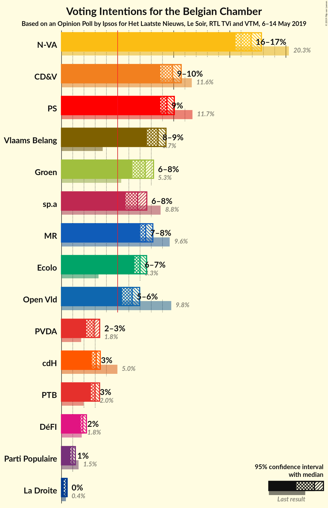

### Confidence Intervals

| Party | Last Result | Poll Result | 80% Confidence Interval | 90% Confidence Interval | 95% Confidence Interval | 99% Confidence Interval |
|:-----:|:-----------:|:-----------:|:-----------------------:|:-----------------------:|:-----------------------:|:-----------------------:|
| N-VA | 20.3% | 17.8% | 15.9–16.8% |15.7–16.8% |15.5–16.9% |15.1–16.9% |
| CD&V | 11.6% | 10.7% | 9.1–9.9% |9.0–9.9% |8.8–9.9% |8.5–9.9% |
| PS | 11.7% | 10.0% | 9.0–9.4% |8.9–9.4% |8.8–9.4% |8.6–9.4% |
| Vlaams Belang | 3.7% | 9.3% | 7.9–8.5% |7.7–8.6% |7.6–8.6% |7.3–8.6% |
| MR | 9.6% | 8.1% | 7.1–7.5% |7.0–7.5% |7.0–7.5% |6.8–7.5% |
| Ecolo | 3.3% | 7.6% | 6.6–7.0% |6.5–7.0% |6.5–7.0% |6.3–7.0% |
| Groen | 5.3% | 7.5% | 6.7–8.1% |6.5–8.2% |6.3–8.2% |5.9–8.3% |
| Open Vld | 9.8% | 7.0% | 5.7–6.3% |5.6–6.3% |5.4–6.3% |5.2–6.3% |
| sp.a | 8.8% | 6.8% | 6.0–7.4% |5.8–7.5% |5.7–7.6% |5.3–7.6% |
| cdH | 5.0% | 3.5% | 2.8–3.1% |2.7–3.1% |2.7–3.1% |2.6–3.1% |
| PTB | 2.0% | 3.4% | 2.8–3.0% |2.7–3.0% |2.6–3.0% |2.5–3.0% |
| PVDA | 1.8% | 2.9% | 2.4–3.3% |2.3–3.4% |2.2–3.4% |2.0–3.5% |
| DéFI | 1.8% | 2.2% | 1.7–1.9% |1.7–1.9% |1.7–1.9% |1.6–1.9% |
| Parti Populaire | 1.5% | 1.2% | 0.8–1.0% |0.8–1.0% |0.8–1.0% |0.7–1.0% |
| La Droite | 0.4% | 0.4% | 0.3–0.5% |0.3–0.5% |0.2–0.5% |0.2–0.5% |

*Note:* The poll result column reflects the actual value used in the calculations. Published results may vary slightly, and in addition be rounded to fewer digits.

## Seats

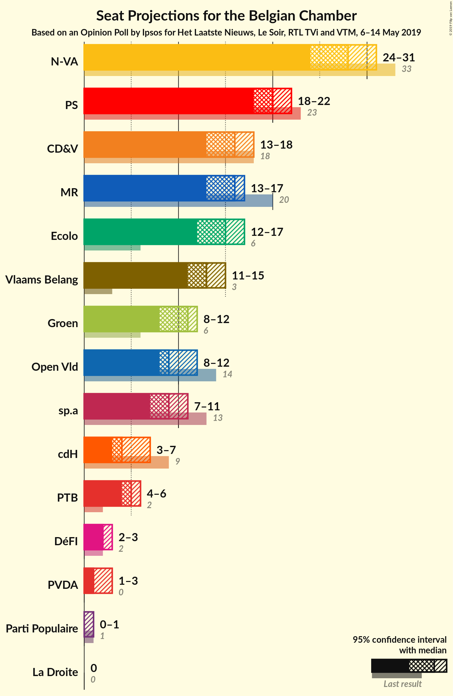

### Confidence Intervals

| Party | Last Result | Median | 80% Confidence Interval | 90% Confidence Interval | 95% Confidence Interval | 99% Confidence Interval |
|:-----:|:-----------:|:------:|:-----------------------:|:-----------------------:|:-----------------------:|:-----------------------:|
| <a href="#n-va">N-VA</a> | 33 | 28 | 25–30 |25–31 |24–31 |24–32 |
| <a href="#cd&v">CD&V</a> | 18 | 16 | 13–18 |13–18 |13–18 |13–18 |
| <a href="#ps">PS</a> | 23 | 20 | 19–21 |18–21 |18–22 |17–22 |
| <a href="#vlaams-belang">Vlaams Belang</a> | 3 | 13 | 12–15 |12–15 |11–15 |9–16 |
| <a href="#mr">MR</a> | 20 | 16 | 14–16 |14–17 |13–17 |13–18 |
| <a href="#ecolo">Ecolo</a> | 6 | 15 | 14–17 |13–17 |13–17 |12–17 |
| <a href="#groen">Groen</a> | 6 | 11 | 10–12 |9–12 |8–12 |6–13 |
| <a href="#open-vld">Open Vld</a> | 14 | 9 | 8–11 |8–12 |8–12 |7–12 |
| <a href="#sp.a">sp.a</a> | 13 | 9 | 8–11 |8–11 |7–11 |6–13 |
| <a href="#cdh">cdH</a> | 9 | 4 | 4–5 |3–6 |3–7 |3–7 |
| <a href="#ptb">PTB</a> | 2 | 5 | 4–5 |4–6 |4–6 |3–6 |
| <a href="#pvda">PVDA</a> | 0 | 1 | 1–3 |1–3 |1–3 |0–3 |
| <a href="#défi">DéFI</a> | 2 | 2 | 2–3 |2–3 |2–3 |1–3 |
| <a href="#parti-populaire">Parti Populaire</a> | 1 | 0 | 0 |0 |0–1 |0–1 |
| <a href="#la-droite">La Droite</a> | 0 | 0 | 0 |0 |0 |0 |

### N-VA

*For a full overview of the results for this party, see the [N-VA](party-n-va.html) page.*

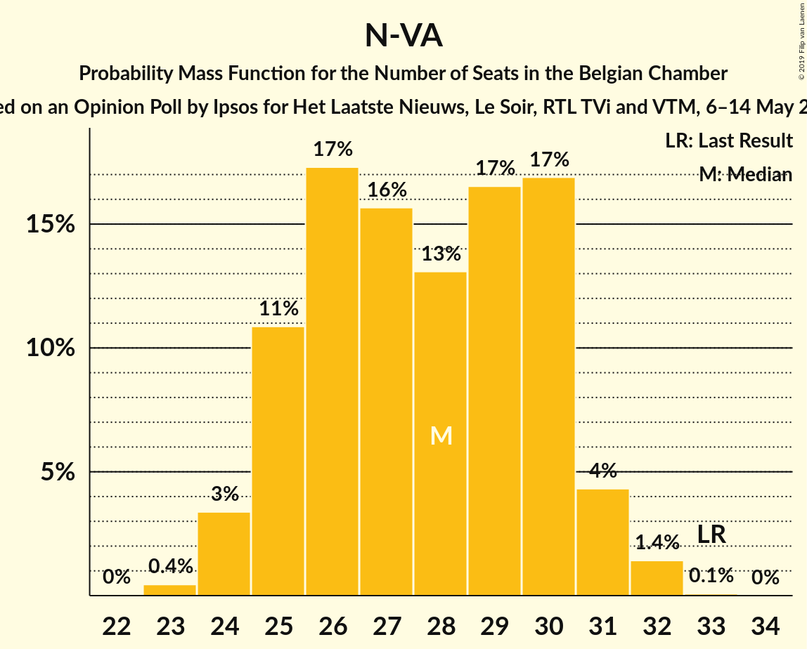

| Number of Seats | Probability | Accumulated | Special Marks |
|:---------------:|:-----------:|:-----------:|:-------------:|
| 23 | 0.4% | 100% |  |
| 24 | 3% | 99.5% |  |
| 25 | 11% | 96% |  |
| 26 | 17% | 85% |  |
| 27 | 16% | 68% |  |
| 28 | 13% | 52% | Median |
| 29 | 17% | 39% |  |
| 30 | 17% | 23% |  |
| 31 | 4% | 6% |  |
| 32 | 1.4% | 2% |  |
| 33 | 0.1% | 0.1% | Last Result |
| 34 | 0% | 0% |  |

### CD&V

*For a full overview of the results for this party, see the [CD&V](party-cdv.html) page.*

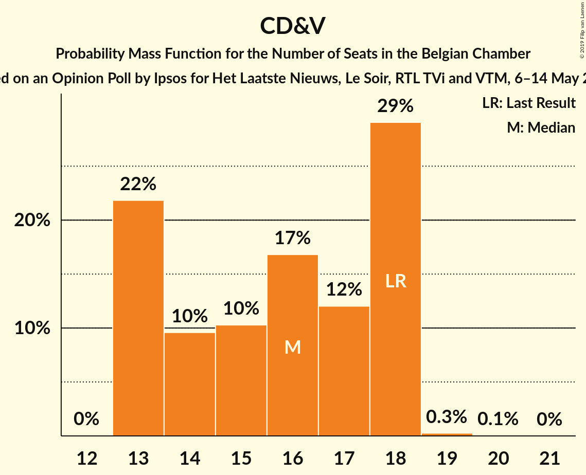

| Number of Seats | Probability | Accumulated | Special Marks |
|:---------------:|:-----------:|:-----------:|:-------------:|
| 12 | 0% | 100% |  |
| 13 | 22% | 99.9% |  |
| 14 | 10% | 78% |  |
| 15 | 10% | 69% |  |
| 16 | 17% | 58% | Median |
| 17 | 12% | 41% |  |
| 18 | 29% | 29% | Last Result |
| 19 | 0.3% | 0.3% |  |
| 20 | 0.1% | 0.1% |  |
| 21 | 0% | 0% |  |

### PS

*For a full overview of the results for this party, see the [PS](party-ps.html) page.*

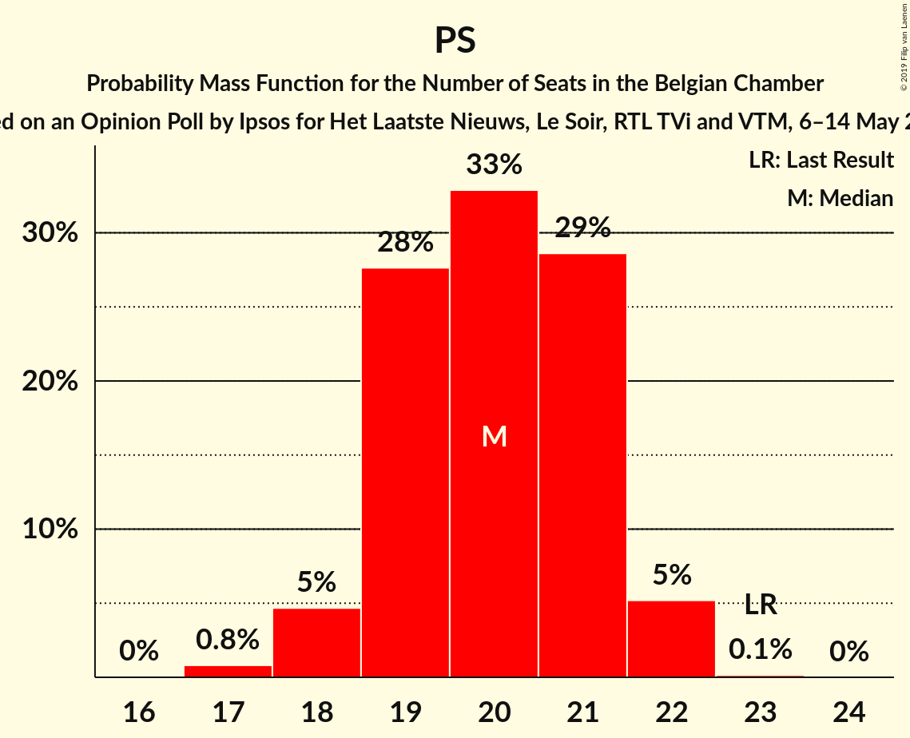

| Number of Seats | Probability | Accumulated | Special Marks |
|:---------------:|:-----------:|:-----------:|:-------------:|
| 17 | 0.8% | 100% |  |
| 18 | 6% | 99.2% |  |
| 19 | 30% | 94% |  |
| 20 | 36% | 63% | Median |
| 21 | 23% | 27% |  |
| 22 | 4% | 4% |  |
| 23 | 0.1% | 0.1% | Last Result |
| 24 | 0% | 0% |  |

### Vlaams Belang

*For a full overview of the results for this party, see the [Vlaams Belang](party-vlaamsbelang.html) page.*

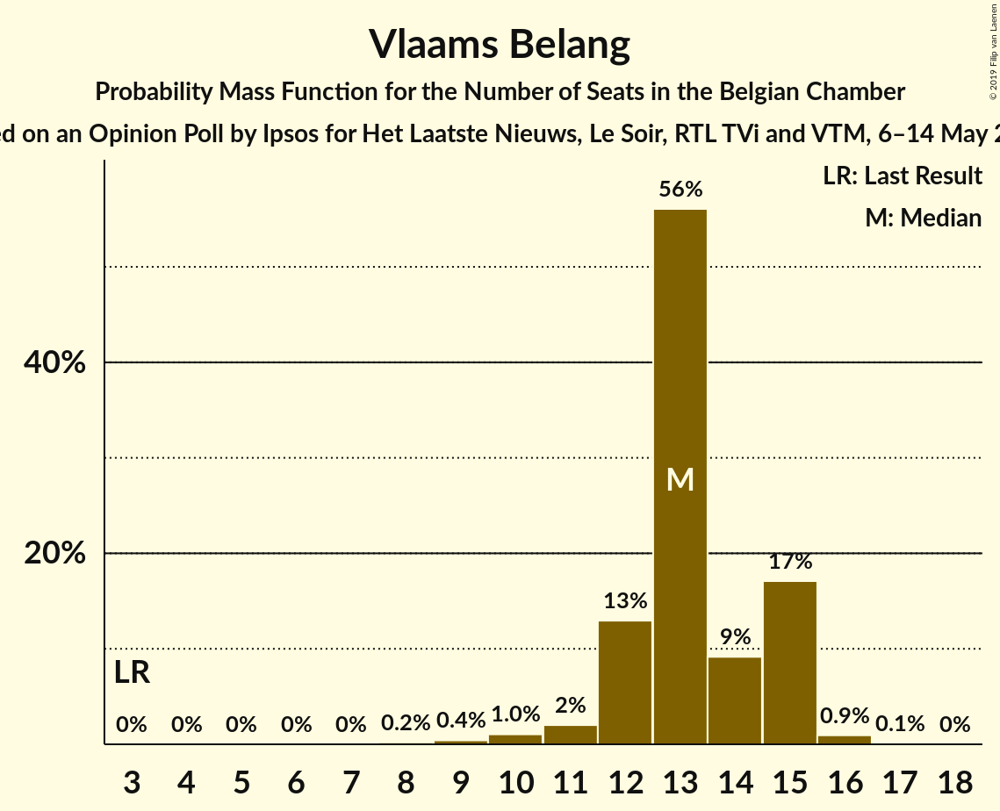

| Number of Seats | Probability | Accumulated | Special Marks |
|:---------------:|:-----------:|:-----------:|:-------------:|
| 3 | 0% | 100% | Last Result |
| 4 | 0% | 100% |  |
| 5 | 0% | 100% |  |
| 6 | 0% | 100% |  |
| 7 | 0% | 100% |  |
| 8 | 0.2% | 100% |  |
| 9 | 0.4% | 99.8% |  |
| 10 | 1.0% | 99.4% |  |
| 11 | 2% | 98% |  |
| 12 | 13% | 96% |  |
| 13 | 56% | 83% | Median |
| 14 | 9% | 27% |  |
| 15 | 17% | 18% |  |
| 16 | 0.9% | 1.0% |  |
| 17 | 0.1% | 0.1% |  |
| 18 | 0% | 0% |  |

### MR

*For a full overview of the results for this party, see the [MR](party-mr.html) page.*

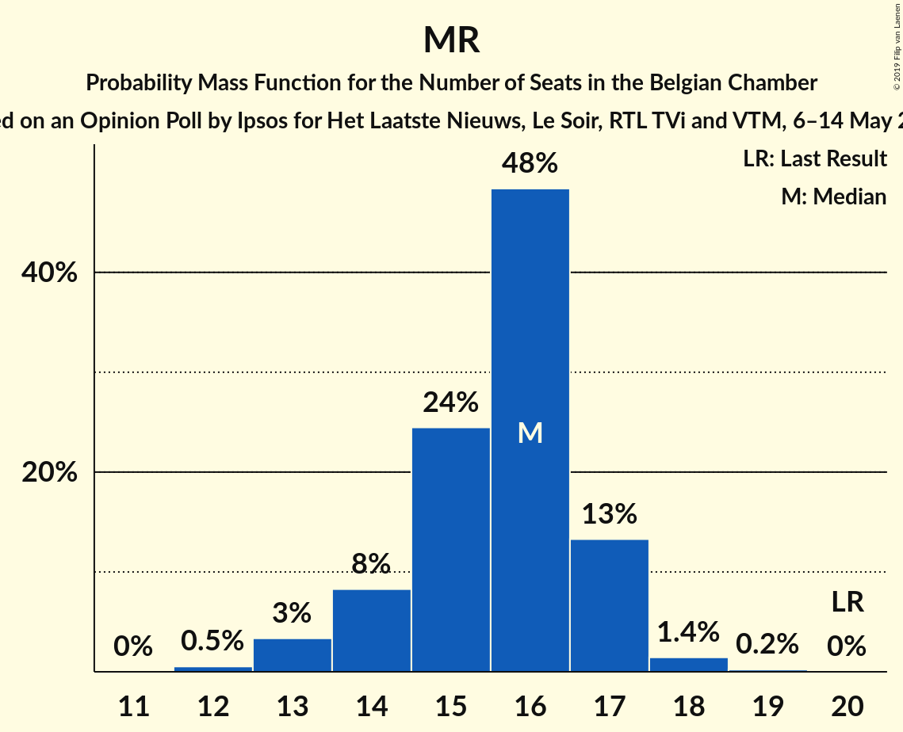

| Number of Seats | Probability | Accumulated | Special Marks |
|:---------------:|:-----------:|:-----------:|:-------------:|
| 12 | 0.3% | 100% |  |
| 13 | 2% | 99.7% |  |
| 14 | 8% | 97% |  |
| 15 | 28% | 89% |  |
| 16 | 51% | 61% | Median |
| 17 | 9% | 10% |  |
| 18 | 0.9% | 1.2% |  |
| 19 | 0.3% | 0.3% |  |
| 20 | 0% | 0% | Last Result |

### Ecolo

*For a full overview of the results for this party, see the [Ecolo](party-ecolo.html) page.*

| Number of Seats | Probability | Accumulated | Special Marks |
|:---------------:|:-----------:|:-----------:|:-------------:|
| 6 | 0% | 100% | Last Result |
| 7 | 0% | 100% |  |
| 8 | 0% | 100% |  |
| 9 | 0% | 100% |  |
| 10 | 0% | 100% |  |
| 11 | 0.1% | 100% |  |
| 12 | 2% | 99.9% |  |
| 13 | 6% | 98% |  |
| 14 | 11% | 92% |  |
| 15 | 31% | 80% | Median |
| 16 | 38% | 49% |  |
| 17 | 11% | 11% |  |
| 18 | 0.4% | 0.4% |  |
| 19 | 0% | 0% |  |

### Groen

*For a full overview of the results for this party, see the [Groen](party-groen.html) page.*

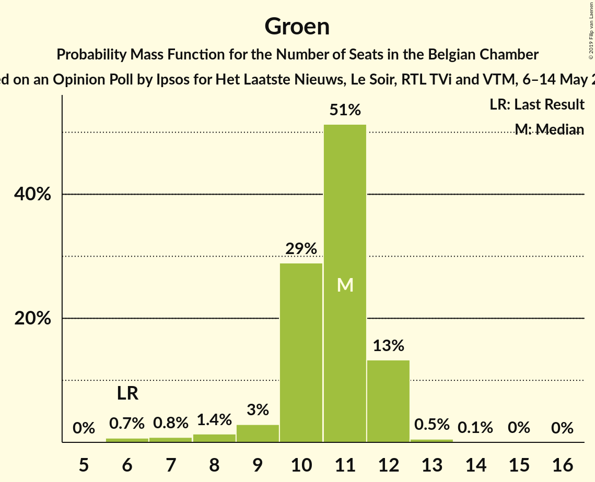

| Number of Seats | Probability | Accumulated | Special Marks |
|:---------------:|:-----------:|:-----------:|:-------------:|
| 6 | 0.7% | 100% | Last Result |
| 7 | 0.8% | 99.3% |  |
| 8 | 1.4% | 98% |  |
| 9 | 3% | 97% |  |
| 10 | 29% | 94% |  |
| 11 | 51% | 65% | Median |
| 12 | 13% | 14% |  |
| 13 | 0.5% | 0.7% |  |
| 14 | 0.1% | 0.1% |  |
| 15 | 0% | 0.1% |  |
| 16 | 0% | 0% |  |

### Open Vld

*For a full overview of the results for this party, see the [Open Vld](party-openvld.html) page.*

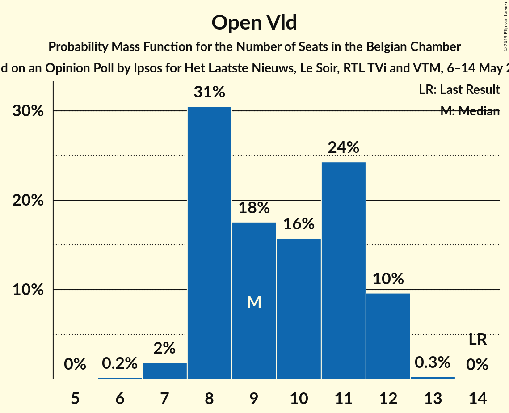

| Number of Seats | Probability | Accumulated | Special Marks |
|:---------------:|:-----------:|:-----------:|:-------------:|
| 6 | 0.2% | 100% |  |
| 7 | 2% | 99.8% |  |
| 8 | 31% | 98% |  |
| 9 | 18% | 67% | Median |
| 10 | 16% | 50% |  |
| 11 | 24% | 34% |  |
| 12 | 10% | 10% |  |
| 13 | 0.3% | 0.3% |  |
| 14 | 0% | 0% | Last Result |

### sp.a

*For a full overview of the results for this party, see the [sp.a](party-spa.html) page.*

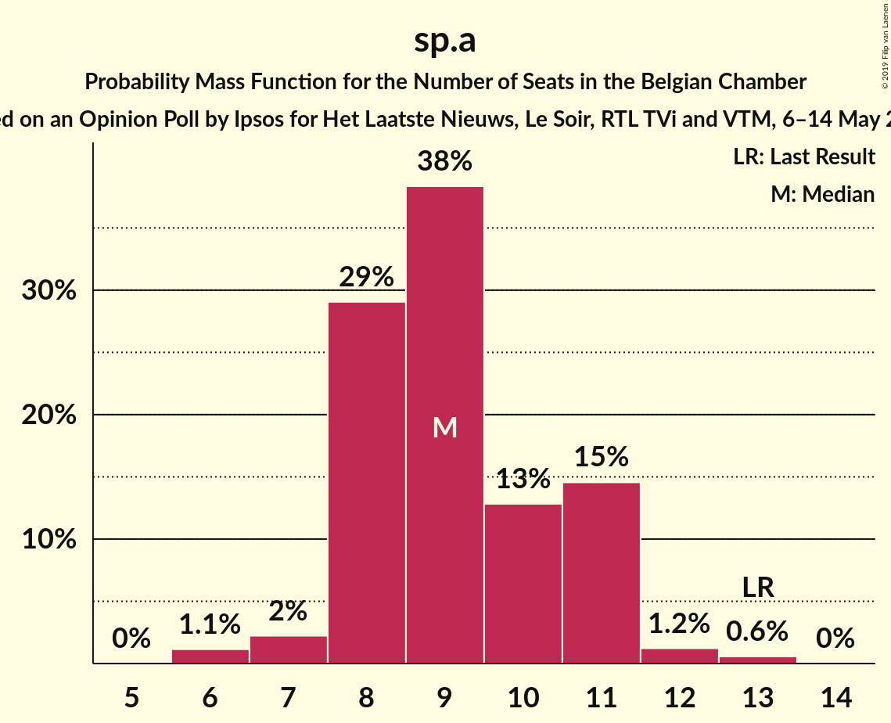

| Number of Seats | Probability | Accumulated | Special Marks |
|:---------------:|:-----------:|:-----------:|:-------------:|
| 6 | 1.1% | 100% |  |
| 7 | 2% | 98.8% |  |
| 8 | 29% | 97% |  |
| 9 | 38% | 68% | Median |
| 10 | 13% | 29% |  |
| 11 | 15% | 16% |  |
| 12 | 1.2% | 2% |  |
| 13 | 0.6% | 0.6% | Last Result |
| 14 | 0% | 0% |  |

### cdH

*For a full overview of the results for this party, see the [cdH](party-cdh.html) page.*

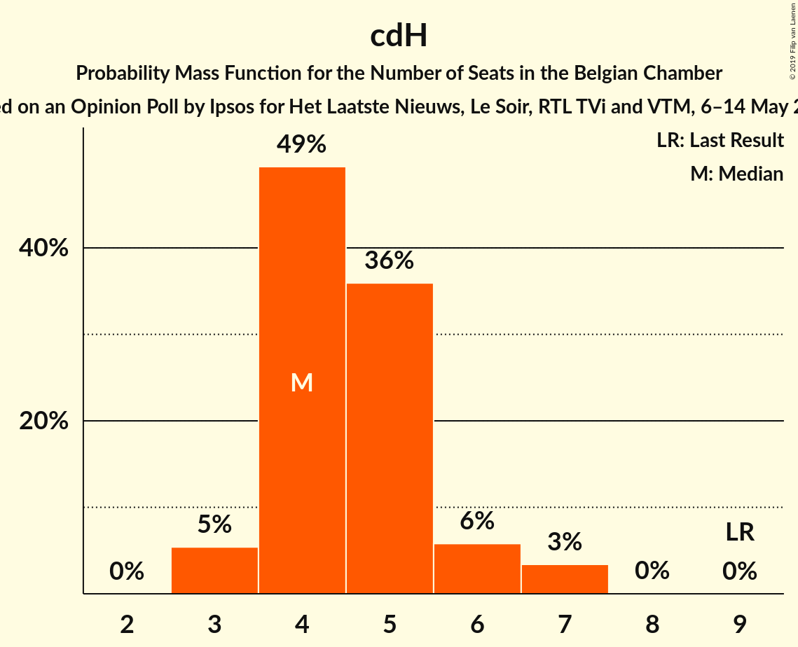

| Number of Seats | Probability | Accumulated | Special Marks |
|:---------------:|:-----------:|:-----------:|:-------------:|
| 3 | 6% | 100% |  |
| 4 | 52% | 94% | Median |
| 5 | 33% | 43% |  |
| 6 | 5% | 10% |  |
| 7 | 4% | 4% |  |
| 8 | 0.1% | 0.1% |  |
| 9 | 0% | 0% | Last Result |

### PTB

*For a full overview of the results for this party, see the [PTB](party-ptb.html) page.*

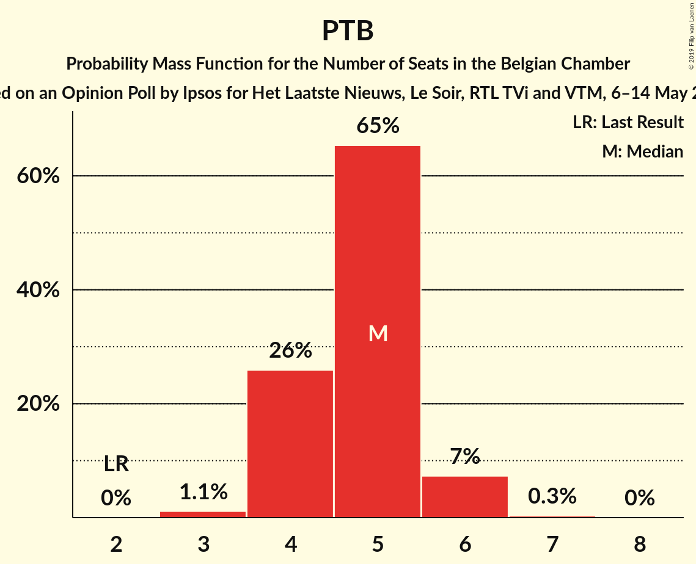

| Number of Seats | Probability | Accumulated | Special Marks |
|:---------------:|:-----------:|:-----------:|:-------------:|
| 2 | 0% | 100% | Last Result |
| 3 | 0.6% | 100% |  |
| 4 | 29% | 99.4% |  |
| 5 | 63% | 70% | Median |
| 6 | 7% | 8% |  |
| 7 | 0.3% | 0.3% |  |
| 8 | 0% | 0% |  |

### PVDA

*For a full overview of the results for this party, see the [PVDA](party-pvda.html) page.*

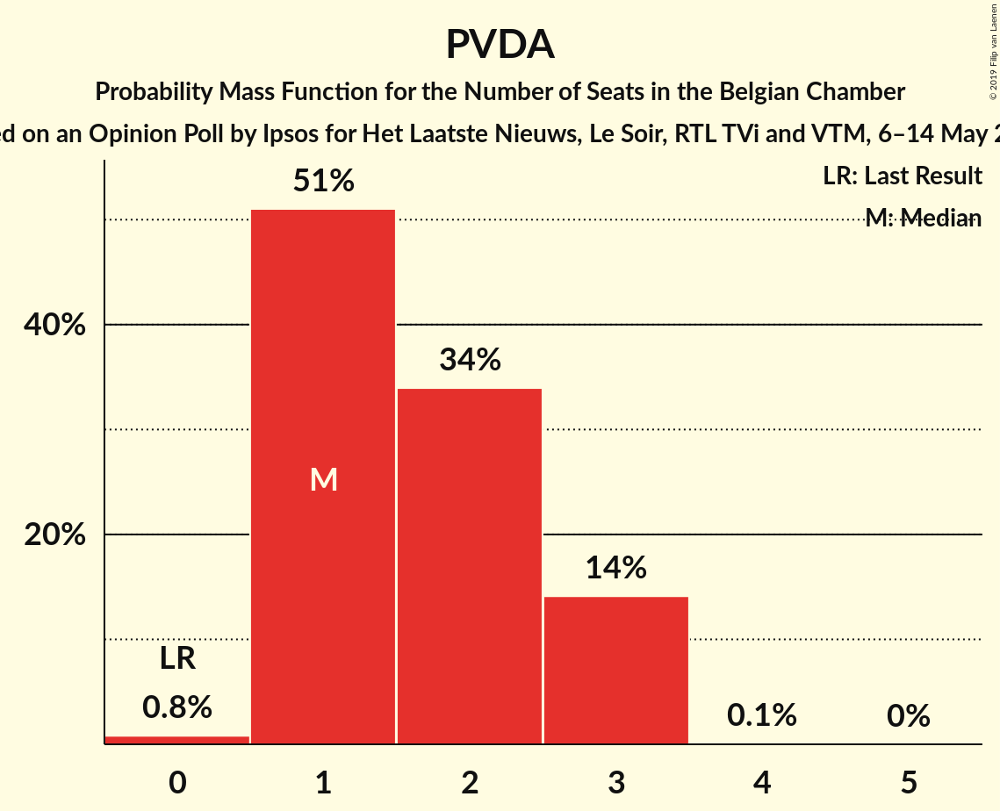

| Number of Seats | Probability | Accumulated | Special Marks |
|:---------------:|:-----------:|:-----------:|:-------------:|
| 0 | 0.8% | 100% | Last Result |
| 1 | 51% | 99.2% | Median |
| 2 | 34% | 48% |  |
| 3 | 14% | 14% |  |
| 4 | 0.1% | 0.1% |  |
| 5 | 0% | 0% |  |

### DéFI

*For a full overview of the results for this party, see the [DéFI](party-défi.html) page.*

| Number of Seats | Probability | Accumulated | Special Marks |
|:---------------:|:-----------:|:-----------:|:-------------:|
| 1 | 1.4% | 100% |  |
| 2 | 78% | 98.6% | Last Result, Median |
| 3 | 21% | 21% |  |
| 4 | 0.1% | 0.1% |  |
| 5 | 0% | 0% |  |

### Parti Populaire

*For a full overview of the results for this party, see the [Parti Populaire](party-partipopulaire.html) page.*

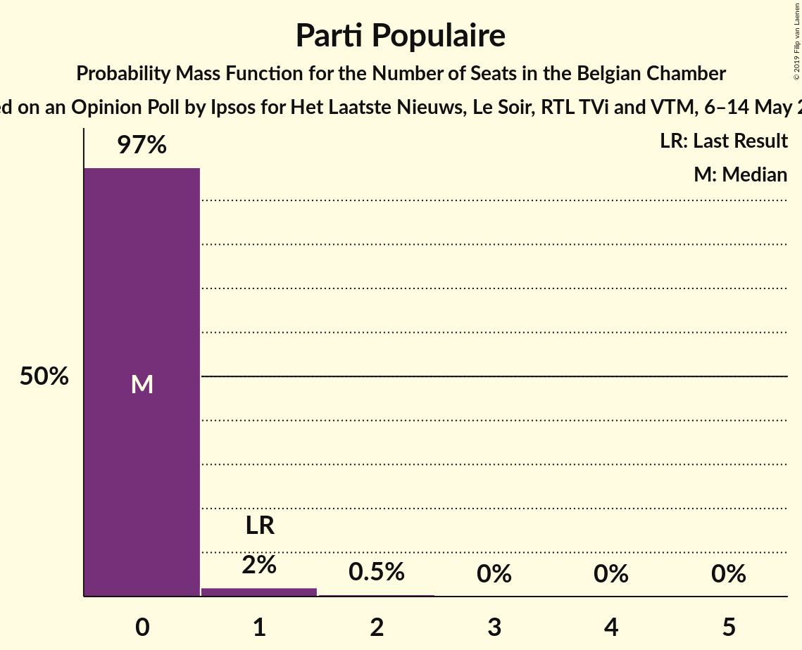

| Number of Seats | Probability | Accumulated | Special Marks |
|:---------------:|:-----------:|:-----------:|:-------------:|
| 0 | 97% | 100% | Median |
| 1 | 2% | 3% | Last Result |
| 2 | 0.3% | 0.3% |  |
| 3 | 0% | 0% |  |

### La Droite

*For a full overview of the results for this party, see the [La Droite](party-ladroite.html) page.*

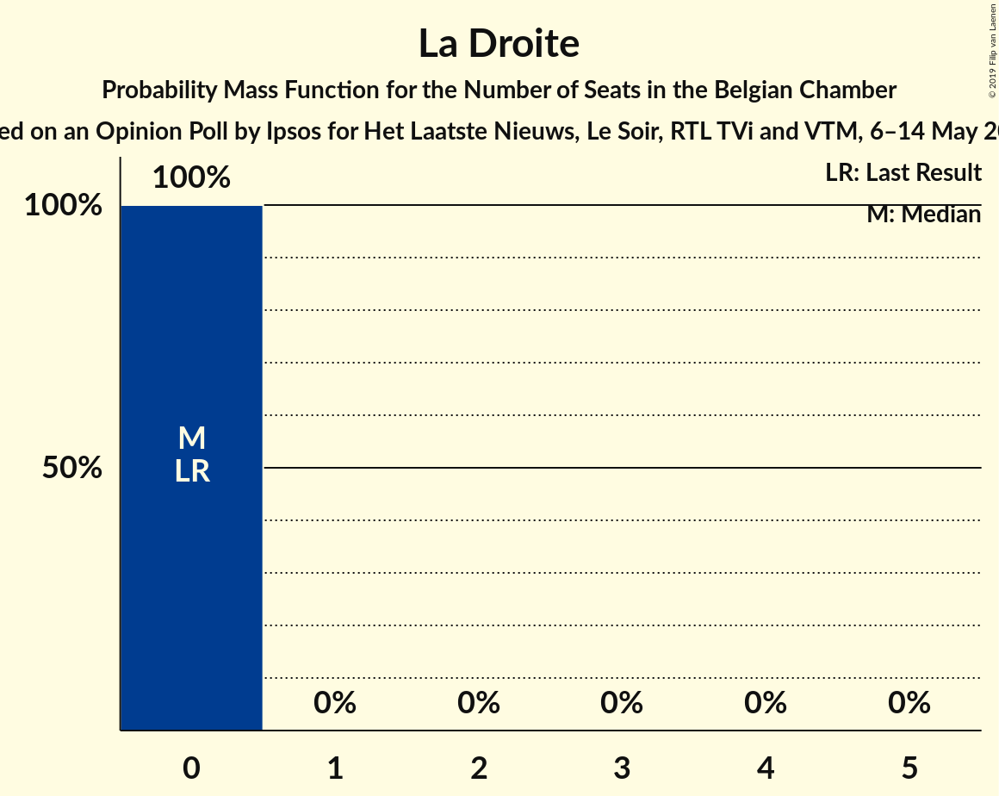

| Number of Seats | Probability | Accumulated | Special Marks |
|:---------------:|:-----------:|:-----------:|:-------------:|
| 0 | 100% | 100% | Last Result, Median |

## Coalitions

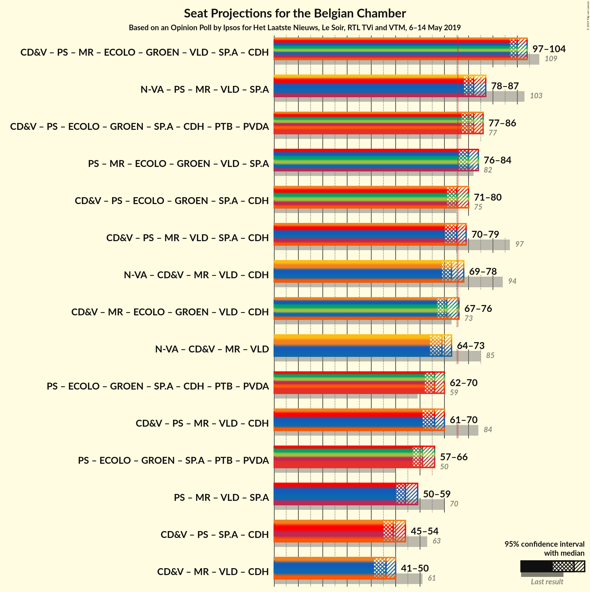

### Confidence Intervals

| Coalition | Last Result | Median | Majority? | 80% Confidence Interval | 90% Confidence Interval | 95% Confidence Interval | 99% Confidence Interval |
|:---------:|:-----------:|:------:|:---------:|:-----------------------:|:-----------------------:|:-----------------------:|:-----------------------:|
| CD&V – PS – MR – Ecolo – Groen – Open Vld – sp.a – cdH | 109 | 100 | 100% | 98–103 | 97–104 | 97–104 | 96–106 |
| N-VA – PS – MR – Open Vld – sp.a | 103 | 82 | 99.9% | 79–85 | 78–86 | 78–87 | 76–88 |
| CD&V – PS – Ecolo – Groen – sp.a – cdH – PTB – PVDA | 77 | 82 | 99.8% | 78–85 | 78–86 | 77–86 | 76–88 |
| PS – MR – Ecolo – Groen – Open Vld – sp.a | 82 | 80 | 98.5% | 77–83 | 77–84 | 76–84 | 75–85 |
| CD&V – PS – Ecolo – Groen – sp.a – cdH | 75 | 75 | 46% | 72–78 | 72–79 | 71–80 | 70–81 |
| CD&V – PS – MR – Open Vld – sp.a – cdH | 97 | 74 | 33% | 71–78 | 71–78 | 70–79 | 69–81 |
| N-VA – CD&V – MR – Open Vld – cdH | 94 | 73 | 15% | 70–76 | 69–77 | 69–78 | 68–79 |
| CD&V – MR – Ecolo – Groen – Open Vld – cdH | 73 | 72 | 3% | 68–74 | 68–75 | 67–76 | 66–77 |
| N-VA – CD&V – MR – Open Vld | 85 | 69 | 0.1% | 66–71 | 65–72 | 64–73 | 63–74 |
| PS – Ecolo – Groen – sp.a – cdH – PTB – PVDA | 59 | 66 | 0% | 63–68 | 63–69 | 62–70 | 61–71 |
| CD&V – PS – MR – Open Vld – cdH | 84 | 65 | 0% | 62–69 | 61–69 | 61–70 | 60–71 |
| PS – Ecolo – Groen – sp.a – PTB – PVDA | 50 | 61 | 0% | 59–64 | 58–65 | 57–65 | 56–67 |
| PS – MR – Open Vld – sp.a | 70 | 54 | 0% | 51–57 | 51–58 | 50–58 | 49–59 |
| CD&V – PS – sp.a – cdH | 63 | 49 | 0% | 46–52 | 46–53 | 45–54 | 44–55 |
| CD&V – MR – Open Vld – cdH | 61 | 45 | 0% | 42–49 | 41–49 | 41–50 | 40–52 |

### CD&V – PS – MR – Ecolo – Groen – Open Vld – sp.a – cdH

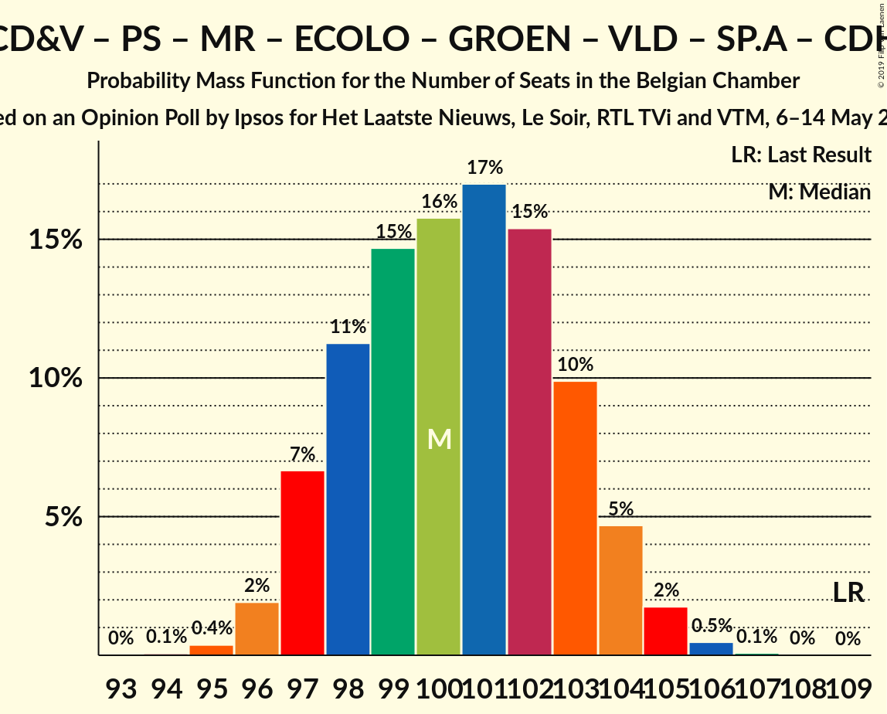

| Number of Seats | Probability | Accumulated | Special Marks |
|:---------------:|:-----------:|:-----------:|:-------------:|
| 94 | 0.1% | 100% |  |
| 95 | 0.4% | 99.9% |  |
| 96 | 2% | 99.6% |  |
| 97 | 7% | 98% |  |
| 98 | 11% | 91% |  |
| 99 | 15% | 80% |  |
| 100 | 16% | 65% | Median |
| 101 | 17% | 50% |  |
| 102 | 15% | 33% |  |
| 103 | 10% | 17% |  |
| 104 | 5% | 7% |  |
| 105 | 2% | 2% |  |
| 106 | 0.5% | 0.6% |  |
| 107 | 0.1% | 0.1% |  |
| 108 | 0% | 0% |  |
| 109 | 0% | 0% | Last Result |

### N-VA – PS – MR – Open Vld – sp.a

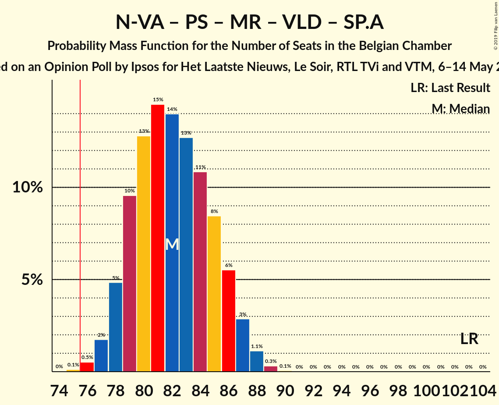

| Number of Seats | Probability | Accumulated | Special Marks |
|:---------------:|:-----------:|:-----------:|:-------------:|
| 75 | 0.1% | 100% |  |
| 76 | 0.4% | 99.9% | Majority |
| 77 | 2% | 99.4% |  |
| 78 | 5% | 98% |  |
| 79 | 11% | 93% |  |
| 80 | 14% | 82% |  |
| 81 | 15% | 68% |  |
| 82 | 14% | 53% | Median |
| 83 | 12% | 39% |  |
| 84 | 11% | 27% |  |
| 85 | 8% | 16% |  |
| 86 | 5% | 8% |  |
| 87 | 2% | 3% |  |
| 88 | 0.7% | 1.0% |  |
| 89 | 0.2% | 0.2% |  |
| 90 | 0% | 0% |  |
| 91 | 0% | 0% |  |
| 92 | 0% | 0% |  |
| 93 | 0% | 0% |  |
| 94 | 0% | 0% |  |
| 95 | 0% | 0% |  |
| 96 | 0% | 0% |  |
| 97 | 0% | 0% |  |
| 98 | 0% | 0% |  |
| 99 | 0% | 0% |  |
| 100 | 0% | 0% |  |
| 101 | 0% | 0% |  |
| 102 | 0% | 0% |  |
| 103 | 0% | 0% | Last Result |

### CD&V – PS – Ecolo – Groen – sp.a – cdH – PTB – PVDA

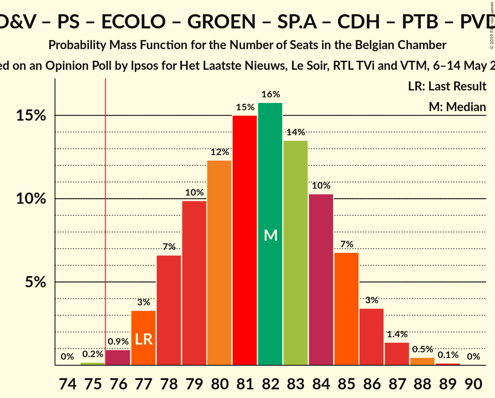

| Number of Seats | Probability | Accumulated | Special Marks |
|:---------------:|:-----------:|:-----------:|:-------------:|
| 75 | 0.1% | 100% |  |
| 76 | 0.7% | 99.8% | Majority |
| 77 | 3% | 99.1% | Last Result |
| 78 | 6% | 96% |  |
| 79 | 10% | 90% |  |
| 80 | 12% | 80% |  |
| 81 | 15% | 68% | Median |
| 82 | 16% | 53% |  |
| 83 | 14% | 37% |  |
| 84 | 11% | 23% |  |
| 85 | 7% | 12% |  |
| 86 | 3% | 5% |  |
| 87 | 1.3% | 2% |  |
| 88 | 0.4% | 0.5% |  |
| 89 | 0.1% | 0.1% |  |
| 90 | 0% | 0% |  |

### PS – MR – Ecolo – Groen – Open Vld – sp.a

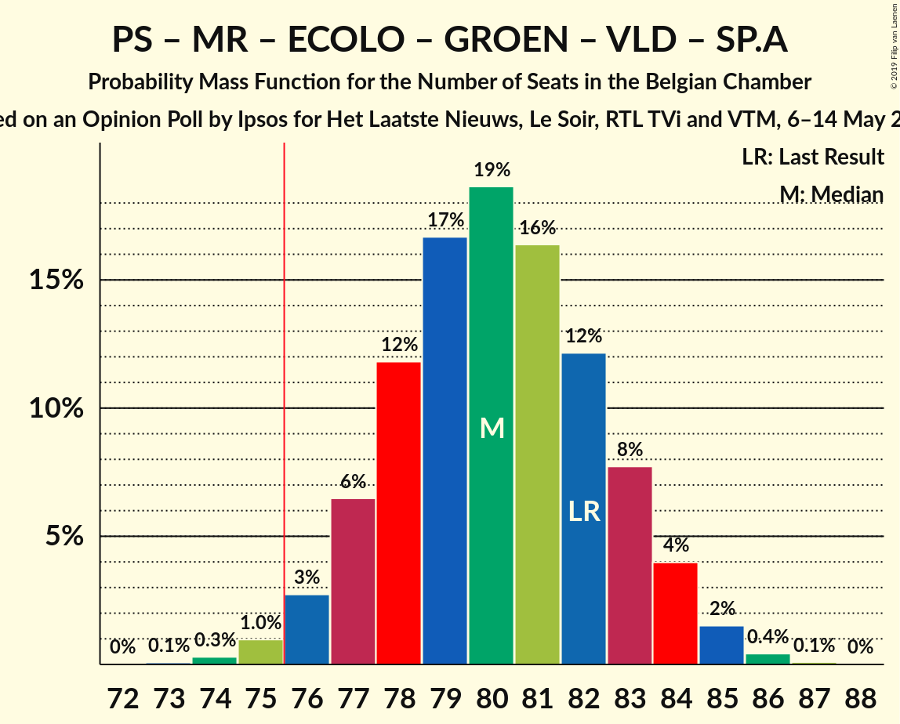

| Number of Seats | Probability | Accumulated | Special Marks |
|:---------------:|:-----------:|:-----------:|:-------------:|
| 73 | 0.1% | 100% |  |
| 74 | 0.3% | 99.9% |  |
| 75 | 1.0% | 99.6% |  |
| 76 | 3% | 98.5% | Majority |
| 77 | 6% | 96% |  |
| 78 | 11% | 90% |  |
| 79 | 16% | 78% |  |
| 80 | 19% | 62% | Median |
| 81 | 17% | 43% |  |
| 82 | 12% | 26% | Last Result |
| 83 | 8% | 14% |  |
| 84 | 4% | 6% |  |
| 85 | 1.5% | 2% |  |
| 86 | 0.4% | 0.5% |  |
| 87 | 0.1% | 0.1% |  |
| 88 | 0% | 0% |  |

### CD&V – PS – Ecolo – Groen – sp.a – cdH

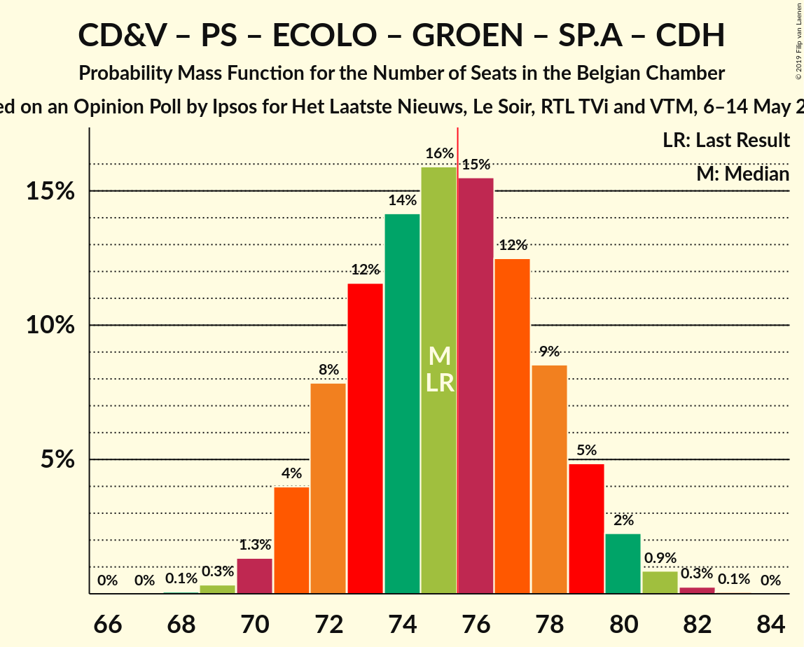

| Number of Seats | Probability | Accumulated | Special Marks |
|:---------------:|:-----------:|:-----------:|:-------------:|
| 68 | 0.1% | 100% |  |
| 69 | 0.3% | 99.9% |  |
| 70 | 1.0% | 99.6% |  |
| 71 | 4% | 98.6% |  |
| 72 | 8% | 95% |  |
| 73 | 11% | 87% |  |
| 74 | 14% | 76% |  |
| 75 | 16% | 62% | Last Result, Median |
| 76 | 16% | 46% | Majority |
| 77 | 13% | 30% |  |
| 78 | 9% | 17% |  |
| 79 | 5% | 8% |  |
| 80 | 2% | 3% |  |
| 81 | 0.8% | 1.1% |  |
| 82 | 0.2% | 0.3% |  |
| 83 | 0.1% | 0.1% |  |
| 84 | 0% | 0% |  |

### CD&V – PS – MR – Open Vld – sp.a – cdH

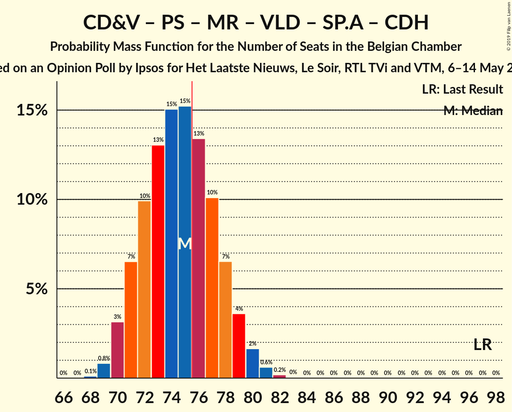

| Number of Seats | Probability | Accumulated | Special Marks |
|:---------------:|:-----------:|:-----------:|:-------------:|
| 68 | 0.1% | 100% |  |
| 69 | 0.9% | 99.9% |  |
| 70 | 3% | 99.0% |  |
| 71 | 7% | 96% |  |
| 72 | 11% | 88% |  |
| 73 | 14% | 78% |  |
| 74 | 15% | 64% | Median |
| 75 | 15% | 48% |  |
| 76 | 13% | 33% | Majority |
| 77 | 9% | 20% |  |
| 78 | 6% | 10% |  |
| 79 | 3% | 5% |  |
| 80 | 1.2% | 2% |  |
| 81 | 0.4% | 0.6% |  |
| 82 | 0.1% | 0.2% |  |
| 83 | 0% | 0% |  |
| 84 | 0% | 0% |  |
| 85 | 0% | 0% |  |
| 86 | 0% | 0% |  |
| 87 | 0% | 0% |  |
| 88 | 0% | 0% |  |
| 89 | 0% | 0% |  |
| 90 | 0% | 0% |  |
| 91 | 0% | 0% |  |
| 92 | 0% | 0% |  |
| 93 | 0% | 0% |  |
| 94 | 0% | 0% |  |
| 95 | 0% | 0% |  |
| 96 | 0% | 0% |  |
| 97 | 0% | 0% | Last Result |

### N-VA – CD&V – MR – Open Vld – cdH

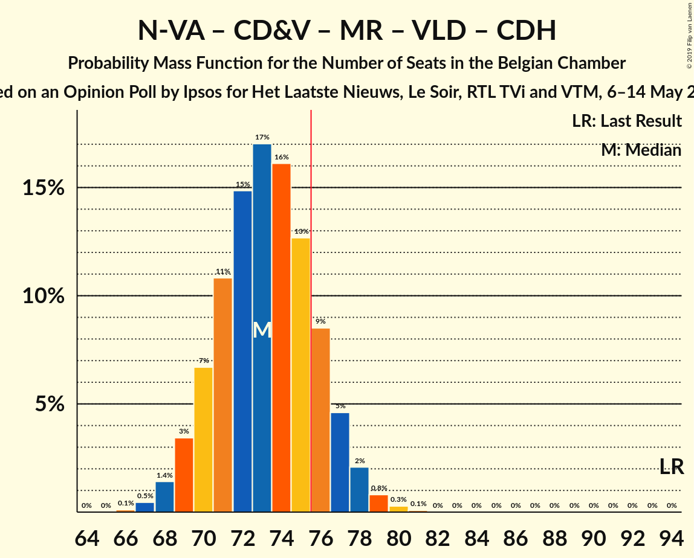

| Number of Seats | Probability | Accumulated | Special Marks |
|:---------------:|:-----------:|:-----------:|:-------------:|
| 66 | 0.1% | 100% |  |
| 67 | 0.4% | 99.9% |  |
| 68 | 1.4% | 99.5% |  |
| 69 | 3% | 98% |  |
| 70 | 7% | 95% |  |
| 71 | 11% | 88% |  |
| 72 | 15% | 77% |  |
| 73 | 18% | 61% | Median |
| 74 | 16% | 44% |  |
| 75 | 12% | 27% |  |
| 76 | 8% | 15% | Majority |
| 77 | 4% | 7% |  |
| 78 | 2% | 3% |  |
| 79 | 0.8% | 1.2% |  |
| 80 | 0.3% | 0.4% |  |
| 81 | 0.1% | 0.1% |  |
| 82 | 0% | 0% |  |
| 83 | 0% | 0% |  |
| 84 | 0% | 0% |  |
| 85 | 0% | 0% |  |
| 86 | 0% | 0% |  |
| 87 | 0% | 0% |  |
| 88 | 0% | 0% |  |
| 89 | 0% | 0% |  |
| 90 | 0% | 0% |  |
| 91 | 0% | 0% |  |
| 92 | 0% | 0% |  |
| 93 | 0% | 0% |  |
| 94 | 0% | 0% | Last Result |

### CD&V – MR – Ecolo – Groen – Open Vld – cdH

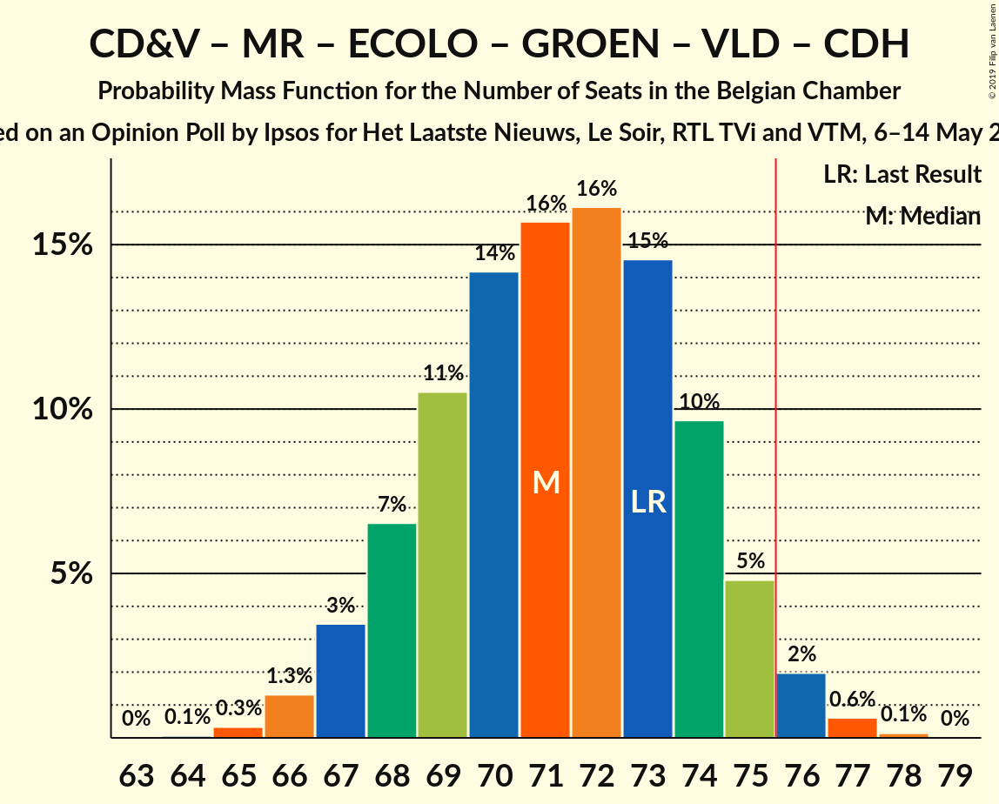

| Number of Seats | Probability | Accumulated | Special Marks |
|:---------------:|:-----------:|:-----------:|:-------------:|
| 64 | 0.1% | 100% |  |
| 65 | 0.3% | 99.9% |  |
| 66 | 1.1% | 99.6% |  |
| 67 | 3% | 98.6% |  |
| 68 | 6% | 96% |  |
| 69 | 10% | 89% |  |
| 70 | 14% | 80% |  |
| 71 | 16% | 66% | Median |
| 72 | 16% | 50% |  |
| 73 | 15% | 34% | Last Result |
| 74 | 11% | 19% |  |
| 75 | 5% | 8% |  |
| 76 | 2% | 3% | Majority |
| 77 | 0.7% | 0.8% |  |
| 78 | 0.1% | 0.2% |  |
| 79 | 0% | 0% |  |

### N-VA – CD&V – MR – Open Vld

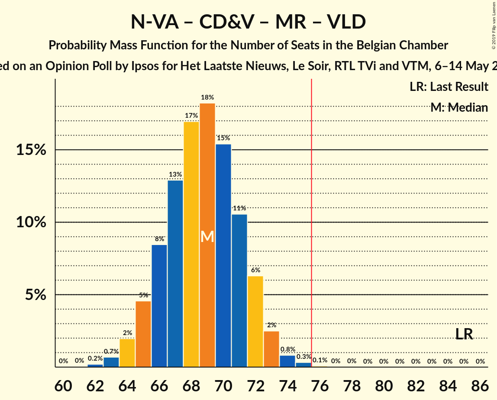

| Number of Seats | Probability | Accumulated | Special Marks |
|:---------------:|:-----------:|:-----------:|:-------------:|
| 62 | 0.2% | 100% |  |
| 63 | 0.6% | 99.8% |  |
| 64 | 2% | 99.2% |  |
| 65 | 5% | 97% |  |
| 66 | 9% | 93% |  |
| 67 | 13% | 84% |  |
| 68 | 17% | 71% |  |
| 69 | 19% | 53% | Median |
| 70 | 15% | 35% |  |
| 71 | 10% | 19% |  |
| 72 | 6% | 9% |  |
| 73 | 2% | 3% |  |
| 74 | 0.7% | 1.1% |  |
| 75 | 0.3% | 0.4% |  |
| 76 | 0.1% | 0.1% | Majority |
| 77 | 0% | 0% |  |
| 78 | 0% | 0% |  |
| 79 | 0% | 0% |  |
| 80 | 0% | 0% |  |
| 81 | 0% | 0% |  |
| 82 | 0% | 0% |  |
| 83 | 0% | 0% |  |
| 84 | 0% | 0% |  |
| 85 | 0% | 0% | Last Result |

### PS – Ecolo – Groen – sp.a – cdH – PTB – PVDA

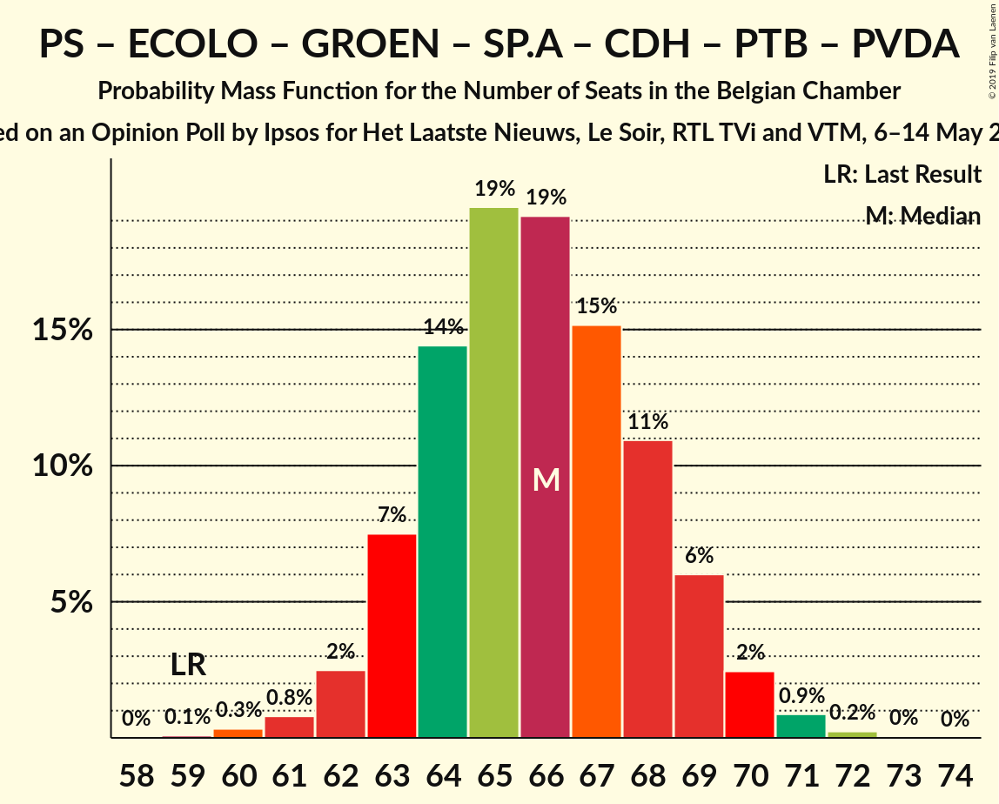

| Number of Seats | Probability | Accumulated | Special Marks |
|:---------------:|:-----------:|:-----------:|:-------------:|
| 59 | 0.1% | 100% | Last Result |
| 60 | 0.3% | 99.9% |  |
| 61 | 0.7% | 99.6% |  |
| 62 | 2% | 98.9% |  |
| 63 | 7% | 97% |  |
| 64 | 14% | 90% |  |
| 65 | 20% | 76% | Median |
| 66 | 20% | 56% |  |
| 67 | 16% | 36% |  |
| 68 | 11% | 21% |  |
| 69 | 6% | 10% |  |
| 70 | 2% | 3% |  |
| 71 | 0.8% | 1.0% |  |
| 72 | 0.2% | 0.2% |  |
| 73 | 0% | 0% |  |

### CD&V – PS – MR – Open Vld – cdH

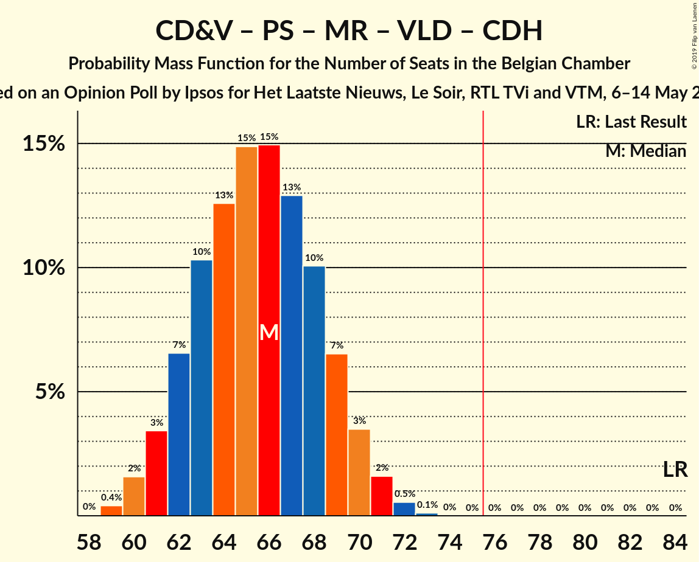

| Number of Seats | Probability | Accumulated | Special Marks |
|:---------------:|:-----------:|:-----------:|:-------------:|
| 59 | 0.4% | 100% |  |
| 60 | 2% | 99.5% |  |
| 61 | 4% | 98% |  |
| 62 | 7% | 94% |  |
| 63 | 11% | 87% |  |
| 64 | 13% | 76% |  |
| 65 | 15% | 63% | Median |
| 66 | 15% | 47% |  |
| 67 | 13% | 32% |  |
| 68 | 9% | 20% |  |
| 69 | 6% | 10% |  |
| 70 | 3% | 4% |  |
| 71 | 1.1% | 2% |  |
| 72 | 0.4% | 0.4% |  |
| 73 | 0.1% | 0.1% |  |
| 74 | 0% | 0% |  |
| 75 | 0% | 0% |  |
| 76 | 0% | 0% | Majority |
| 77 | 0% | 0% |  |
| 78 | 0% | 0% |  |
| 79 | 0% | 0% |  |
| 80 | 0% | 0% |  |
| 81 | 0% | 0% |  |
| 82 | 0% | 0% |  |
| 83 | 0% | 0% |  |
| 84 | 0% | 0% | Last Result |

### PS – Ecolo – Groen – sp.a – PTB – PVDA

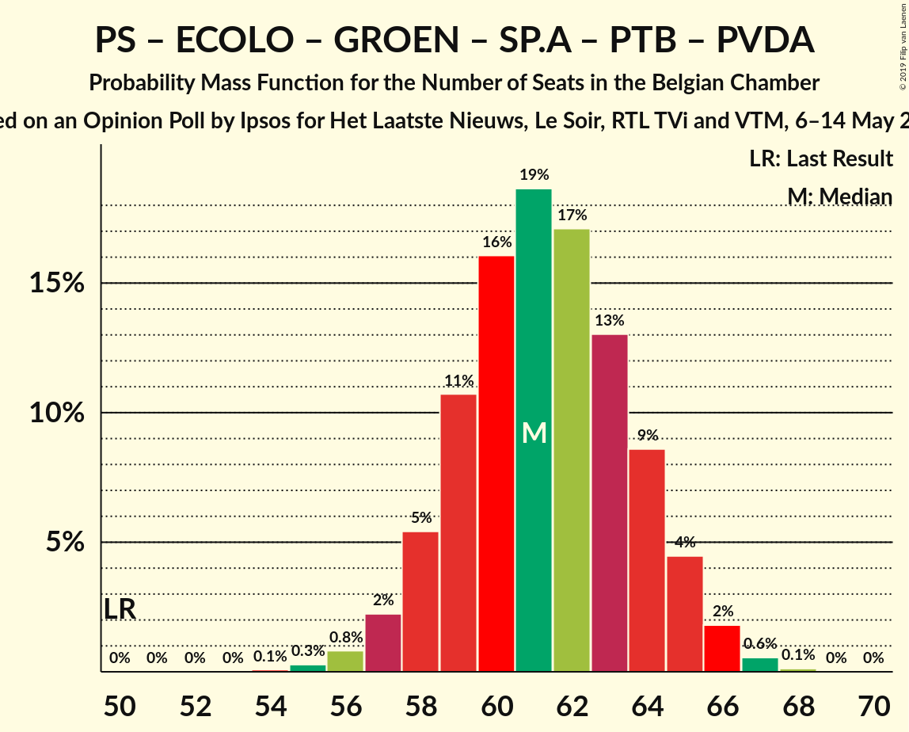

| Number of Seats | Probability | Accumulated | Special Marks |
|:---------------:|:-----------:|:-----------:|:-------------:|
| 50 | 0% | 100% | Last Result |
| 51 | 0% | 100% |  |
| 52 | 0% | 100% |  |
| 53 | 0% | 100% |  |
| 54 | 0.1% | 100% |  |
| 55 | 0.3% | 99.9% |  |
| 56 | 0.9% | 99.6% |  |
| 57 | 2% | 98.7% |  |
| 58 | 5% | 97% |  |
| 59 | 10% | 92% |  |
| 60 | 16% | 82% |  |
| 61 | 19% | 66% | Median |
| 62 | 18% | 47% |  |
| 63 | 13% | 29% |  |
| 64 | 9% | 16% |  |
| 65 | 5% | 7% |  |
| 66 | 2% | 2% |  |
| 67 | 0.5% | 0.6% |  |
| 68 | 0.1% | 0.1% |  |
| 69 | 0% | 0% |  |

### PS – MR – Open Vld – sp.a

| Number of Seats | Probability | Accumulated | Special Marks |
|:---------------:|:-----------:|:-----------:|:-------------:|
| 48 | 0.1% | 100% |  |
| 49 | 0.6% | 99.8% |  |
| 50 | 2% | 99.3% |  |
| 51 | 7% | 97% |  |
| 52 | 12% | 90% |  |
| 53 | 16% | 78% |  |
| 54 | 19% | 62% | Median |
| 55 | 17% | 44% |  |
| 56 | 13% | 26% |  |
| 57 | 8% | 13% |  |
| 58 | 4% | 5% |  |
| 59 | 1.3% | 2% |  |
| 60 | 0.4% | 0.5% |  |
| 61 | 0.1% | 0.1% |  |
| 62 | 0% | 0% |  |
| 63 | 0% | 0% |  |
| 64 | 0% | 0% |  |
| 65 | 0% | 0% |  |
| 66 | 0% | 0% |  |
| 67 | 0% | 0% |  |
| 68 | 0% | 0% |  |
| 69 | 0% | 0% |  |
| 70 | 0% | 0% | Last Result |

### CD&V – PS – sp.a – cdH

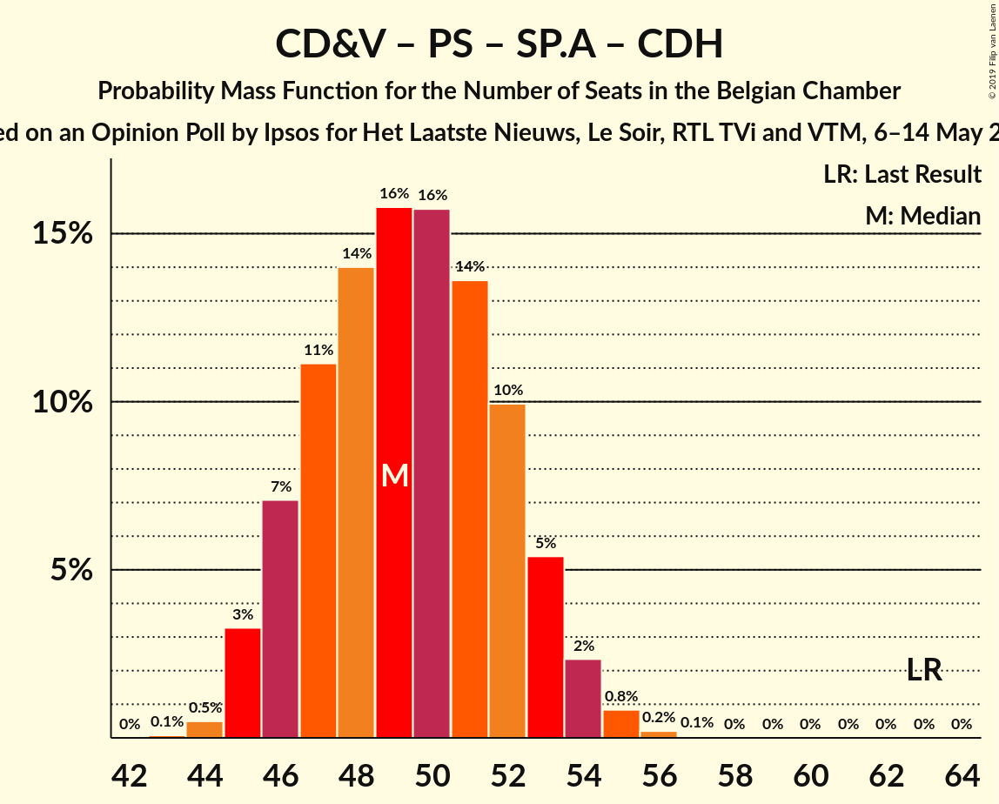

| Number of Seats | Probability | Accumulated | Special Marks |
|:---------------:|:-----------:|:-----------:|:-------------:|
| 43 | 0.1% | 100% |  |
| 44 | 0.6% | 99.9% |  |
| 45 | 4% | 99.3% |  |
| 46 | 8% | 95% |  |
| 47 | 12% | 88% |  |
| 48 | 14% | 76% |  |
| 49 | 16% | 62% | Median |
| 50 | 16% | 46% |  |
| 51 | 13% | 30% |  |
| 52 | 9% | 17% |  |
| 53 | 5% | 8% |  |
| 54 | 2% | 3% |  |
| 55 | 0.8% | 1.1% |  |
| 56 | 0.2% | 0.3% |  |
| 57 | 0.1% | 0.1% |  |
| 58 | 0% | 0% |  |
| 59 | 0% | 0% |  |
| 60 | 0% | 0% |  |
| 61 | 0% | 0% |  |
| 62 | 0% | 0% |  |
| 63 | 0% | 0% | Last Result |

### CD&V – MR – Open Vld – cdH

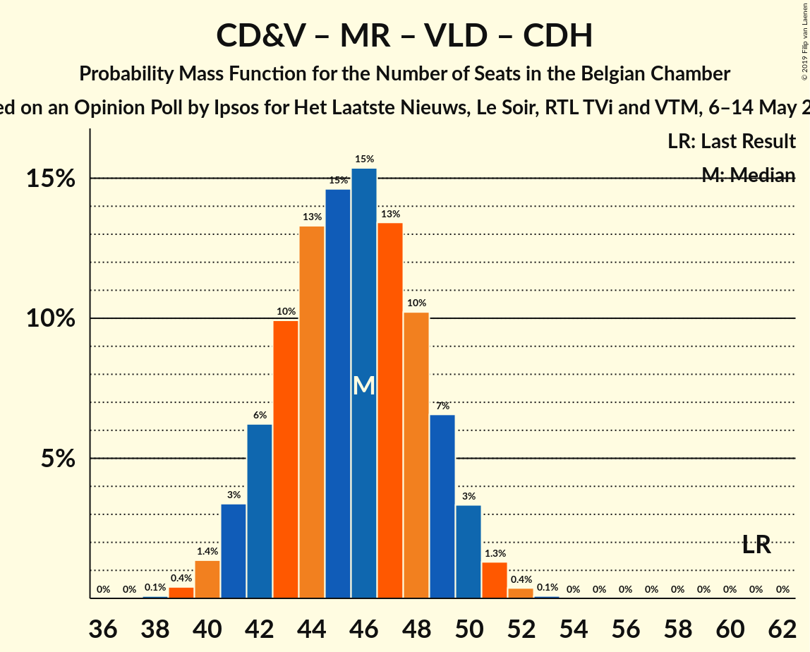

| Number of Seats | Probability | Accumulated | Special Marks |
|:---------------:|:-----------:|:-----------:|:-------------:|
| 38 | 0.1% | 100% |  |
| 39 | 0.3% | 99.9% |  |
| 40 | 1.3% | 99.6% |  |
| 41 | 3% | 98% |  |
| 42 | 6% | 95% |  |
| 43 | 10% | 88% |  |
| 44 | 14% | 78% |  |
| 45 | 15% | 64% | Median |
| 46 | 15% | 50% |  |
| 47 | 14% | 34% |  |
| 48 | 10% | 21% |  |
| 49 | 6% | 11% |  |
| 50 | 3% | 5% |  |
| 51 | 1.1% | 2% |  |
| 52 | 0.4% | 0.5% |  |
| 53 | 0.1% | 0.1% |  |
| 54 | 0% | 0% |  |
| 55 | 0% | 0% |  |
| 56 | 0% | 0% |  |
| 57 | 0% | 0% |  |
| 58 | 0% | 0% |  |
| 59 | 0% | 0% |  |
| 60 | 0% | 0% |  |
| 61 | 0% | 0% | Last Result |

## Technical Information

### Opinion Poll

+ **Polling firm:** Ipsos
+ **Commissioner(s):** Het Laatste Nieuws, Le Soir, RTL TVi and VTM
+ **Fieldwork period:** 6–14 May 2019

### Calculations

+ **Sample size:** 1622
+ **Simulations done:** 1,048,576
+ **Error estimate:** 0.87%

