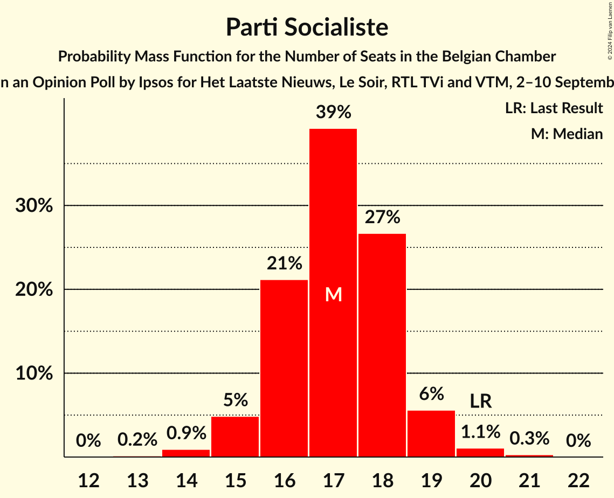
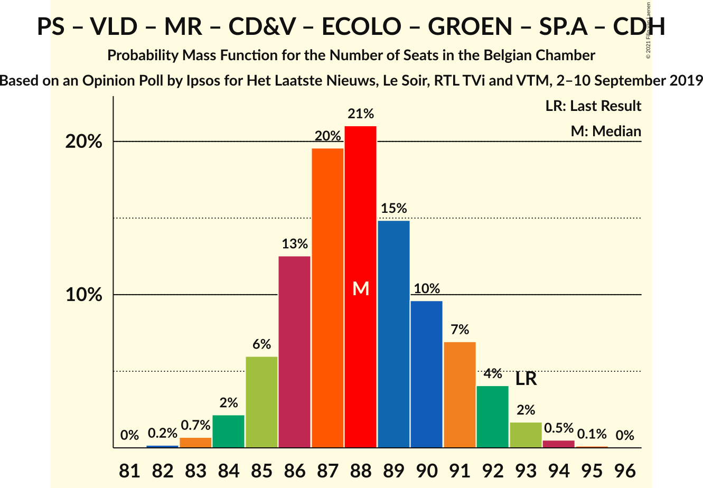
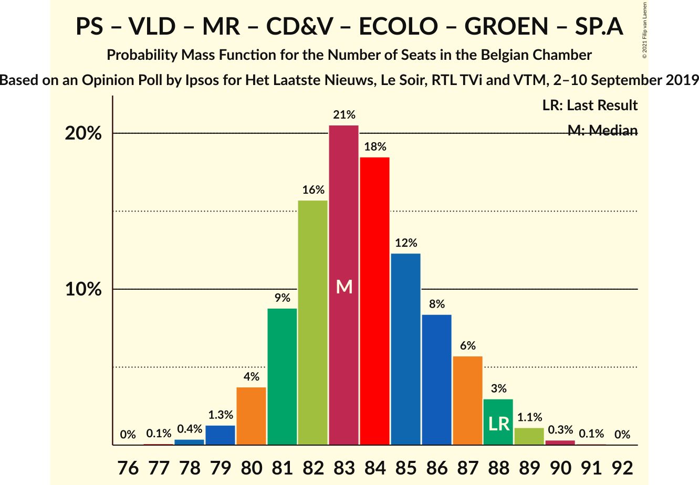
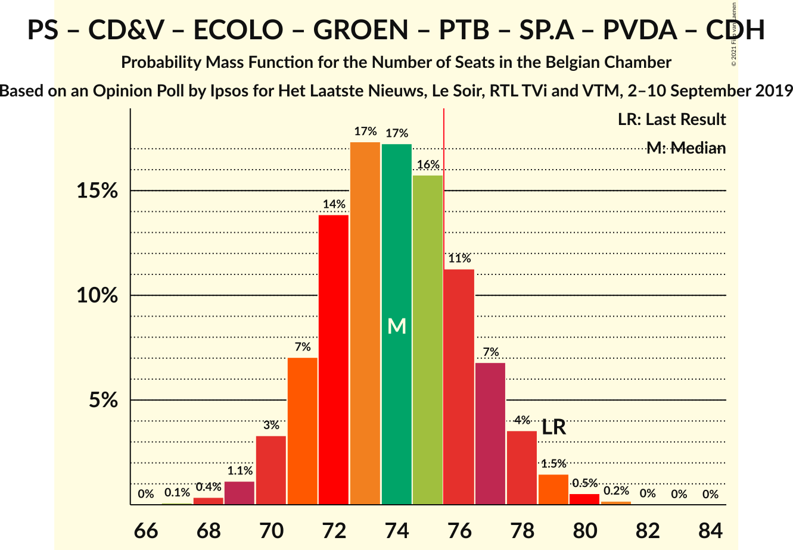
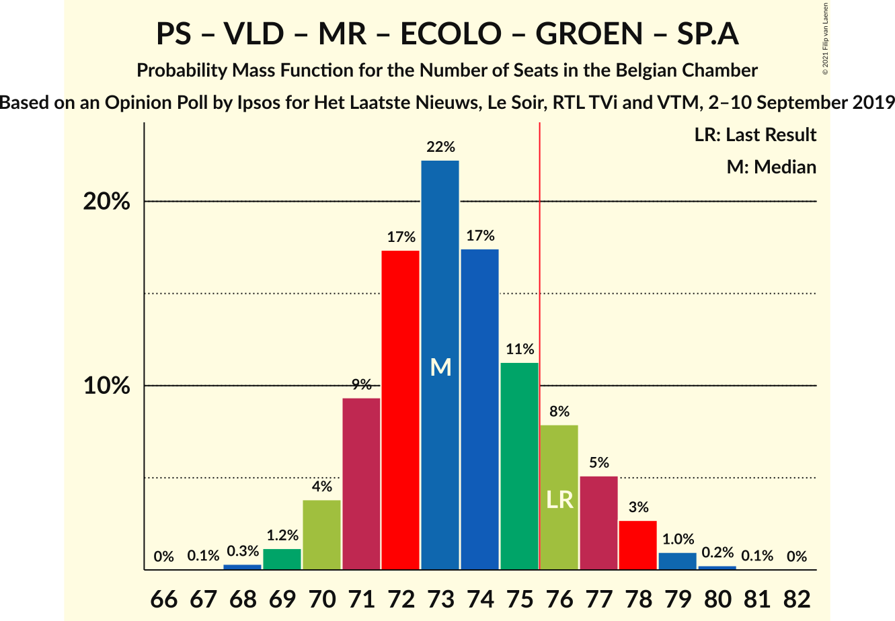
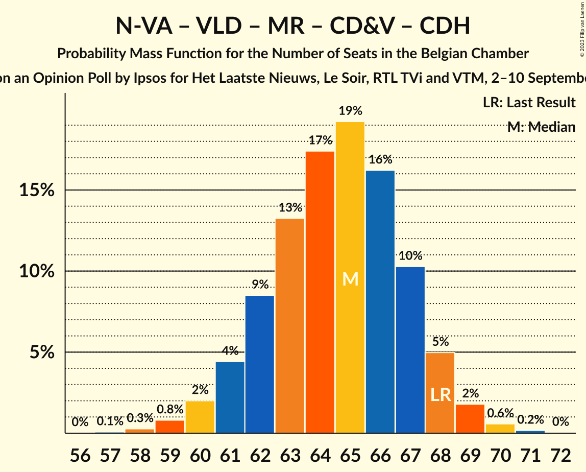
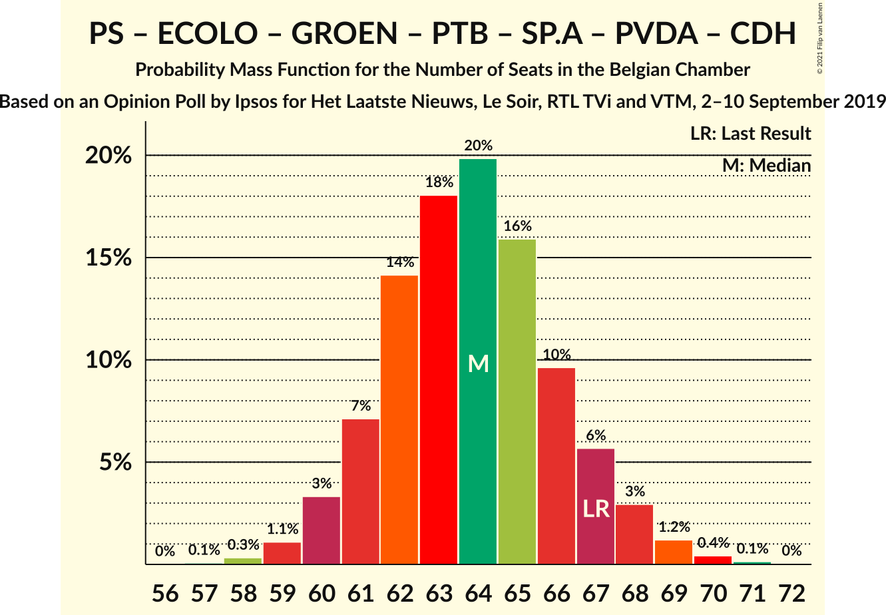
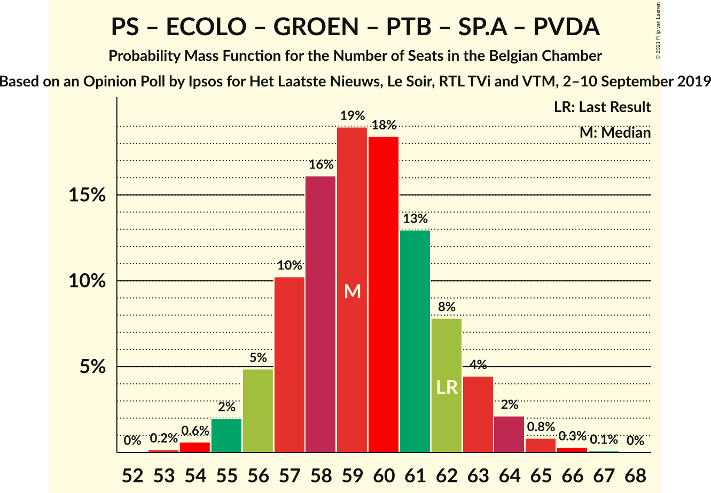

# Opinion Poll by Ipsos for Het Laatste Nieuws, Le Soir, RTL TVi and VTM, 2–10 September 2019

Areas included: Brussels, Flanders, Wallonia

<a href="#voting-intentions">Voting Intentions</a> | <a href="#seats">Seats</a> | <a href="#coalitions">Coalitions</a> | <a href="#technical-information">Technical Information</a>

## Voting Intentions

### Confidence Intervals

| Party | Last Result | Poll Result | 80% Confidence Interval | 90% Confidence Interval | 95% Confidence Interval | 99% Confidence Interval |
|:-----:|:-----------:|:-----------:|:-----------------------:|:-----------------------:|:-----------------------:|:-----------------------:|
| Vlaams Belang | 12.0% | 15.6% | 13.8–14.6% |13.6–14.6% |13.4–14.7% |13.0–14.7% |
| Nieuw-Vlaamse Alliantie | 16.0% | 14.3% | 12.6–13.4% |12.4–13.4% |12.2–13.4% |11.8–13.4% |
| Parti Socialiste | 9.5% | 8.5% | 7.5–7.9% |7.4–7.9% |7.3–7.9% |7.1–7.9% |
| Open Vlaamse Liberalen en Democraten | 8.5% | 8.4% | 7.0–7.7% |6.9–7.7% |6.7–7.7% |6.4–7.7% |
| Mouvement Réformateur | 7.6% | 8.2% | 7.2–7.6% |7.1–7.6% |7.0–7.6% |6.8–7.6% |
| Christen-Democratisch en Vlaams | 8.9% | 7.2% | 5.9–6.5% |5.8–6.5% |5.7–6.5% |5.4–6.5% |
| Groen | 6.1% | 6.8% | 6.0–7.4% |5.8–7.5% |5.7–7.6% |5.3–7.6% |
| Ecolo | 6.1% | 6.8% | 5.9–6.3% |5.8–6.3% |5.8–6.3% |5.6–6.3% |
| Parti du Travail de Belgique | 4.8% | 5.6% | 4.7–5.1% |4.7–5.1% |4.6–5.1% |4.4–5.1% |
| Socialistische Partij Anders | 6.7% | 5.2% | 4.5–5.7% |4.4–5.8% |4.2–5.9% |3.9–5.9% |
| Partij van de Arbeid van België | 3.3% | 3.8% | 3.3–4.3% |3.1–4.4% |3.0–4.5% |2.8–4.5% |
| Centre démocrate humaniste | 3.7% | 3.0% | 2.4–2.6% |2.3–2.6% |2.2–2.6% |2.1–2.6% |
| DéFI | 2.2% | 2.4% | 1.9–2.1% |1.8–2.1% |1.8–2.1% |1.7–2.1% |

*Note:* The poll result column reflects the actual value used in the calculations. Published results may vary slightly, and in addition be rounded to fewer digits.

## Seats

### Confidence Intervals

| Party | Last Result | Median | 80% Confidence Interval | 90% Confidence Interval | 95% Confidence Interval | 99% Confidence Interval |
|:-----:|:-----------:|:------:|:-----------------------:|:-----------------------:|:-----------------------:|:-----------------------:|
| <a href="#vlaams-belang">Vlaams Belang</a> | 18 | 24 | 22–25 |21–26 |21–26 |20–28 |
| <a href="#nieuw-vlaamse-alliantie">Nieuw-Vlaamse Alliantie</a> | 25 | 22 | 20–24 |20–25 |20–25 |18–26 |
| <a href="#parti-socialiste">Parti Socialiste</a> | 20 | 17 | 16–18 |15–19 |15–19 |14–20 |
| <a href="#open-vlaamse-liberalen-en-democraten">Open Vlaamse Liberalen en Democraten</a> | 12 | 11 | 10–14 |10–15 |10–15 |10–16 |
| <a href="#mouvement-réformateur">Mouvement Réformateur</a> | 14 | 17 | 15–17 |14–17 |14–18 |13–19 |
| <a href="#christen-democratisch-en-vlaams">Christen-Democratisch en Vlaams</a> | 12 | 10 | 9–11 |9–11 |8–11 |7–13 |
| <a href="#groen">Groen</a> | 8 | 9 | 9–10 |8–12 |7–12 |6–13 |
| <a href="#ecolo">Ecolo</a> | 13 | 13 | 12–14 |12–14 |11–15 |11–16 |
| <a href="#parti-du-travail-de-belgique">Parti du Travail de Belgique</a> | 9 | 10 | 9–11 |8–11 |8–11 |8–12 |
| <a href="#socialistische-partij-anders">Socialistische Partij Anders</a> | 9 | 6 | 6–7 |5–8 |4–8 |4–9 |
| <a href="#partij-van-de-arbeid-van-belgië">Partij van de Arbeid van België</a> | 3 | 4 | 3–5 |2–5 |1–7 |1–7 |
| <a href="#centre-démocrate-humaniste">Centre démocrate humaniste</a> | 5 | 4 | 4–5 |4–5 |4–5 |2–5 |
| <a href="#défi">DéFI</a> | 2 | 2 | 1–4 |1–4 |1–4 |1–4 |

### Vlaams Belang

*For a full overview of the results for this party, see the [Vlaams Belang](party-vlaamsbelang.html) page.*

| Number of Seats | Probability | Accumulated | Special Marks |
|:---------------:|:-----------:|:-----------:|:-------------:|
| 18 | 0% | 100% | Last Result |
| 19 | 0.2% | 100% |  |
| 20 | 1.5% | 99.7% |  |
| 21 | 4% | 98% |  |
| 22 | 12% | 94% |  |
| 23 | 24% | 82% |  |
| 24 | 23% | 58% | Median |
| 25 | 28% | 35% |  |
| 26 | 5% | 6% |  |
| 27 | 0.7% | 1.2% |  |
| 28 | 0.3% | 0.5% |  |
| 29 | 0.2% | 0.2% |  |
| 30 | 0.1% | 0.1% |  |
| 31 | 0% | 0% |  |

### Nieuw-Vlaamse Alliantie

*For a full overview of the results for this party, see the [Nieuw-Vlaamse Alliantie](party-nieuw-vlaamsealliantie.html) page.*

| Number of Seats | Probability | Accumulated | Special Marks |
|:---------------:|:-----------:|:-----------:|:-------------:|
| 17 | 0.1% | 100% |  |
| 18 | 0.6% | 99.9% |  |
| 19 | 1.2% | 99.2% |  |
| 20 | 14% | 98% |  |
| 21 | 23% | 85% |  |
| 22 | 20% | 62% | Median |
| 23 | 20% | 42% |  |
| 24 | 13% | 22% |  |
| 25 | 9% | 10% | Last Result |
| 26 | 0.9% | 1.0% |  |
| 27 | 0% | 0.1% |  |
| 28 | 0% | 0% |  |

### Parti Socialiste

*For a full overview of the results for this party, see the [Parti Socialiste](party-partisocialiste.html) page.*

| Number of Seats | Probability | Accumulated | Special Marks |
|:---------------:|:-----------:|:-----------:|:-------------:|
| 13 | 0.2% | 100% |  |
| 14 | 0.9% | 99.8% |  |
| 15 | 5% | 98.9% |  |
| 16 | 21% | 94% |  |
| 17 | 39% | 73% | Median |
| 18 | 27% | 34% |  |
| 19 | 6% | 7% |  |
| 20 | 1.1% | 1.4% | Last Result |
| 21 | 0.3% | 0.3% |  |
| 22 | 0% | 0% |  |

### Open Vlaamse Liberalen en Democraten

*For a full overview of the results for this party, see the [Open Vlaamse Liberalen en Democraten](party-openvlaamseliberalenendemocraten.html) page.*

| Number of Seats | Probability | Accumulated | Special Marks |
|:---------------:|:-----------:|:-----------:|:-------------:|
| 9 | 0.1% | 100% |  |
| 10 | 18% | 99.9% |  |
| 11 | 45% | 82% | Median |
| 12 | 18% | 37% | Last Result |
| 13 | 8% | 20% |  |
| 14 | 6% | 12% |  |
| 15 | 5% | 6% |  |
| 16 | 0.8% | 0.9% |  |
| 17 | 0% | 0% |  |

### Mouvement Réformateur

*For a full overview of the results for this party, see the [Mouvement Réformateur](party-mouvementréformateur.html) page.*

| Number of Seats | Probability | Accumulated | Special Marks |
|:---------------:|:-----------:|:-----------:|:-------------:|
| 12 | 0.3% | 100% |  |
| 13 | 2% | 99.7% |  |
| 14 | 6% | 98% | Last Result |
| 15 | 12% | 92% |  |
| 16 | 28% | 80% |  |
| 17 | 48% | 52% | Median |
| 18 | 3% | 4% |  |
| 19 | 0.4% | 0.5% |  |
| 20 | 0.1% | 0.1% |  |
| 21 | 0% | 0% |  |

### Christen-Democratisch en Vlaams

*For a full overview of the results for this party, see the [Christen-Democratisch en Vlaams](party-christen-democratischenvlaams.html) page.*

| Number of Seats | Probability | Accumulated | Special Marks |
|:---------------:|:-----------:|:-----------:|:-------------:|
| 6 | 0.4% | 100% |  |
| 7 | 0.7% | 99.6% |  |
| 8 | 2% | 98.9% |  |
| 9 | 19% | 97% |  |
| 10 | 41% | 77% | Median |
| 11 | 34% | 37% |  |
| 12 | 1.4% | 2% | Last Result |
| 13 | 0.7% | 0.9% |  |
| 14 | 0.2% | 0.2% |  |
| 15 | 0% | 0% |  |

### Groen

*For a full overview of the results for this party, see the [Groen](party-groen.html) page.*

| Number of Seats | Probability | Accumulated | Special Marks |
|:---------------:|:-----------:|:-----------:|:-------------:|
| 5 | 0.1% | 100% |  |
| 6 | 0.9% | 99.9% |  |
| 7 | 2% | 99.1% |  |
| 8 | 3% | 97% | Last Result |
| 9 | 76% | 94% | Median |
| 10 | 8% | 18% |  |
| 11 | 4% | 10% |  |
| 12 | 4% | 5% |  |
| 13 | 2% | 2% |  |
| 14 | 0% | 0% |  |

### Ecolo

*For a full overview of the results for this party, see the [Ecolo](party-ecolo.html) page.*

| Number of Seats | Probability | Accumulated | Special Marks |
|:---------------:|:-----------:|:-----------:|:-------------:|
| 10 | 0.2% | 100% |  |
| 11 | 3% | 99.8% |  |
| 12 | 13% | 97% |  |
| 13 | 45% | 84% | Last Result, Median |
| 14 | 35% | 39% |  |
| 15 | 4% | 4% |  |
| 16 | 0.5% | 0.6% |  |
| 17 | 0.1% | 0.1% |  |
| 18 | 0% | 0% |  |

### Parti du Travail de Belgique

*For a full overview of the results for this party, see the [Parti du Travail de Belgique](party-partidutravaildebelgique.html) page.*

| Number of Seats | Probability | Accumulated | Special Marks |
|:---------------:|:-----------:|:-----------:|:-------------:|
| 7 | 0.1% | 100% |  |
| 8 | 5% | 99.9% |  |
| 9 | 35% | 95% | Last Result |
| 10 | 49% | 60% | Median |
| 11 | 10% | 10% |  |
| 12 | 0.6% | 0.6% |  |
| 13 | 0% | 0% |  |

### Socialistische Partij Anders

*For a full overview of the results for this party, see the [Socialistische Partij Anders](party-socialistischepartijanders.html) page.*

| Number of Seats | Probability | Accumulated | Special Marks |
|:---------------:|:-----------:|:-----------:|:-------------:|
| 3 | 0.1% | 100% |  |
| 4 | 3% | 99.9% |  |
| 5 | 6% | 97% |  |
| 6 | 74% | 90% | Median |
| 7 | 10% | 16% |  |
| 8 | 4% | 6% |  |
| 9 | 2% | 2% | Last Result |
| 10 | 0.2% | 0.3% |  |
| 11 | 0% | 0% |  |

### Partij van de Arbeid van België

*For a full overview of the results for this party, see the [Partij van de Arbeid van België](party-partijvandearbeidvanbelgië.html) page.*

| Number of Seats | Probability | Accumulated | Special Marks |
|:---------------:|:-----------:|:-----------:|:-------------:|
| 1 | 4% | 100% |  |
| 2 | 1.4% | 96% |  |
| 3 | 30% | 95% | Last Result |
| 4 | 20% | 65% | Median |
| 5 | 40% | 45% |  |
| 6 | 2% | 5% |  |
| 7 | 2% | 3% |  |
| 8 | 0.4% | 0.4% |  |
| 9 | 0% | 0% |  |

### Centre démocrate humaniste

*For a full overview of the results for this party, see the [Centre démocrate humaniste](party-centredémocratehumaniste.html) page.*

| Number of Seats | Probability | Accumulated | Special Marks |
|:---------------:|:-----------:|:-----------:|:-------------:|
| 1 | 0.2% | 100% |  |
| 2 | 0.4% | 99.8% |  |
| 3 | 0.5% | 99.4% |  |
| 4 | 53% | 98.9% | Median |
| 5 | 46% | 46% | Last Result |
| 6 | 0.2% | 0.2% |  |
| 7 | 0% | 0% |  |

### DéFI

*For a full overview of the results for this party, see the [DéFI](party-défi.html) page.*

| Number of Seats | Probability | Accumulated | Special Marks |
|:---------------:|:-----------:|:-----------:|:-------------:|
| 1 | 13% | 100% |  |
| 2 | 58% | 87% | Last Result, Median |
| 3 | 17% | 29% |  |
| 4 | 11% | 11% |  |
| 5 | 0.1% | 0.1% |  |
| 6 | 0% | 0% |  |

## Coalitions

### Confidence Intervals

| Coalition | Last Result | Median | Majority? | 80% Confidence Interval | 90% Confidence Interval | 95% Confidence Interval | 99% Confidence Interval |
|:---------:|:-----------:|:------:|:---------:|:-----------------------:|:-----------------------:|:-----------------------:|:-----------------------:|
| Parti Socialiste – Open Vlaamse Liberalen en Democraten – Mouvement Réformateur – Christen-Democratisch en Vlaams – Ecolo – Groen – Socialistische Partij Anders – Centre démocrate humaniste | 93 | 88 | 100% | 86–91 | 85–92 | 84–92 | 83–94 |
| Parti Socialiste – Open Vlaamse Liberalen en Democraten – Mouvement Réformateur – Christen-Democratisch en Vlaams – Ecolo – Groen – Socialistische Partij Anders | 88 | 83 | 100% | 81–87 | 80–87 | 80–88 | 78–89 |
| Parti Socialiste – Christen-Democratisch en Vlaams – Ecolo – Groen – Parti du Travail de Belgique – Socialistische Partij Anders – Partij van de Arbeid van België – Centre démocrate humaniste | 79 | 74 | 24% | 71–77 | 71–78 | 70–78 | 69–80 |
| Parti Socialiste – Open Vlaamse Liberalen en Democraten – Mouvement Réformateur – Ecolo – Groen – Socialistische Partij Anders | 76 | 73 | 17% | 71–76 | 70–77 | 70–78 | 69–79 |
| Nieuw-Vlaamse Alliantie – Parti Socialiste – Open Vlaamse Liberalen en Democraten – Mouvement Réformateur – Socialistische Partij Anders | 80 | 73 | 14% | 70–76 | 70–77 | 69–77 | 68–79 |
| Parti Socialiste – Open Vlaamse Liberalen en Democraten – Mouvement Réformateur – Christen-Democratisch en Vlaams – Socialistische Partij Anders – Centre démocrate humaniste | 72 | 65 | 0% | 63–68 | 62–69 | 62–70 | 61–71 |
| Open Vlaamse Liberalen en Democraten – Mouvement Réformateur – Christen-Democratisch en Vlaams – Ecolo – Groen – Centre démocrate humaniste | 64 | 65 | 0% | 62–68 | 62–69 | 61–69 | 59–71 |
| Nieuw-Vlaamse Alliantie – Open Vlaamse Liberalen en Democraten – Mouvement Réformateur – Christen-Democratisch en Vlaams – Centre démocrate humaniste | 68 | 65 | 0% | 62–67 | 61–68 | 60–69 | 59–70 |
| Parti Socialiste – Ecolo – Groen – Parti du Travail de Belgique – Socialistische Partij Anders – Partij van de Arbeid van België – Centre démocrate humaniste | 67 | 64 | 0% | 61–67 | 61–67 | 60–68 | 59–70 |
| Parti Socialiste – Christen-Democratisch en Vlaams – Ecolo – Groen – Socialistische Partij Anders – Centre démocrate humaniste | 67 | 60 | 0% | 58–63 | 57–63 | 57–64 | 56–66 |
| Parti Socialiste – Open Vlaamse Liberalen en Democraten – Mouvement Réformateur – Christen-Democratisch en Vlaams – Centre démocrate humaniste | 63 | 59 | 0% | 57–62 | 56–63 | 56–64 | 55–65 |
| Nieuw-Vlaamse Alliantie – Open Vlaamse Liberalen en Democraten – Mouvement Réformateur – Christen-Democratisch en Vlaams | 63 | 60 | 0% | 57–63 | 57–63 | 56–64 | 54–65 |
| Parti Socialiste – Ecolo – Groen – Parti du Travail de Belgique – Socialistische Partij Anders – Partij van de Arbeid van België | 62 | 59 | 0% | 57–62 | 56–63 | 55–64 | 54–65 |
| Parti Socialiste – Open Vlaamse Liberalen en Democraten – Mouvement Réformateur – Socialistische Partij Anders | 55 | 51 | 0% | 49–54 | 48–55 | 48–55 | 46–57 |
| Open Vlaamse Liberalen en Democraten – Mouvement Réformateur – Christen-Democratisch en Vlaams – Centre démocrate humaniste | 43 | 42 | 0% | 40–45 | 39–46 | 39–47 | 37–48 |
| Parti Socialiste – Christen-Democratisch en Vlaams – Socialistische Partij Anders – Centre démocrate humaniste | 46 | 38 | 0% | 36–40 | 35–40 | 35–41 | 34–42 |

### Parti Socialiste – Open Vlaamse Liberalen en Democraten – Mouvement Réformateur – Christen-Democratisch en Vlaams – Ecolo – Groen – Socialistische Partij Anders – Centre démocrate humaniste

| Number of Seats | Probability | Accumulated | Special Marks |
|:---------------:|:-----------:|:-----------:|:-------------:|
| 82 | 0.2% | 100% |  |
| 83 | 0.7% | 99.8% |  |
| 84 | 2% | 99.1% |  |
| 85 | 6% | 97% |  |
| 86 | 13% | 91% |  |
| 87 | 20% | 78% | Median |
| 88 | 21% | 59% |  |
| 89 | 15% | 38% |  |
| 90 | 10% | 23% |  |
| 91 | 7% | 13% |  |
| 92 | 4% | 6% |  |
| 93 | 2% | 2% | Last Result |
| 94 | 0.5% | 0.7% |  |
| 95 | 0.1% | 0.2% |  |
| 96 | 0% | 0% |  |

### Parti Socialiste – Open Vlaamse Liberalen en Democraten – Mouvement Réformateur – Christen-Democratisch en Vlaams – Ecolo – Groen – Socialistische Partij Anders

| Number of Seats | Probability | Accumulated | Special Marks |
|:---------------:|:-----------:|:-----------:|:-------------:|
| 77 | 0.1% | 100% |  |
| 78 | 0.4% | 99.9% |  |
| 79 | 1.3% | 99.5% |  |
| 80 | 4% | 98% |  |
| 81 | 9% | 94% |  |
| 82 | 16% | 86% |  |
| 83 | 21% | 70% | Median |
| 84 | 18% | 49% |  |
| 85 | 12% | 31% |  |
| 86 | 8% | 19% |  |
| 87 | 6% | 10% |  |
| 88 | 3% | 5% | Last Result |
| 89 | 1.1% | 2% |  |
| 90 | 0.3% | 0.4% |  |
| 91 | 0.1% | 0.1% |  |
| 92 | 0% | 0% |  |

### Parti Socialiste – Christen-Democratisch en Vlaams – Ecolo – Groen – Parti du Travail de Belgique – Socialistische Partij Anders – Partij van de Arbeid van België – Centre démocrate humaniste

| Number of Seats | Probability | Accumulated | Special Marks |
|:---------------:|:-----------:|:-----------:|:-------------:|
| 67 | 0.1% | 100% |  |
| 68 | 0.4% | 99.9% |  |
| 69 | 1.1% | 99.5% |  |
| 70 | 3% | 98% |  |
| 71 | 7% | 95% |  |
| 72 | 14% | 88% |  |
| 73 | 17% | 74% | Median |
| 74 | 17% | 57% |  |
| 75 | 16% | 40% |  |
| 76 | 11% | 24% | Majority |
| 77 | 7% | 13% |  |
| 78 | 4% | 6% |  |
| 79 | 1.5% | 2% | Last Result |
| 80 | 0.5% | 0.8% |  |
| 81 | 0.2% | 0.2% |  |
| 82 | 0% | 0.1% |  |
| 83 | 0% | 0% |  |

### Parti Socialiste – Open Vlaamse Liberalen en Democraten – Mouvement Réformateur – Ecolo – Groen – Socialistische Partij Anders

| Number of Seats | Probability | Accumulated | Special Marks |
|:---------------:|:-----------:|:-----------:|:-------------:|
| 67 | 0.1% | 100% |  |
| 68 | 0.3% | 99.9% |  |
| 69 | 1.2% | 99.6% |  |
| 70 | 4% | 98% |  |
| 71 | 9% | 95% |  |
| 72 | 17% | 85% |  |
| 73 | 22% | 68% | Median |
| 74 | 17% | 46% |  |
| 75 | 11% | 28% |  |
| 76 | 8% | 17% | Last Result, Majority |
| 77 | 5% | 9% |  |
| 78 | 3% | 4% |  |
| 79 | 1.0% | 1.3% |  |
| 80 | 0.2% | 0.3% |  |
| 81 | 0.1% | 0.1% |  |
| 82 | 0% | 0% |  |

### Nieuw-Vlaamse Alliantie – Parti Socialiste – Open Vlaamse Liberalen en Democraten – Mouvement Réformateur – Socialistische Partij Anders

| Number of Seats | Probability | Accumulated | Special Marks |
|:---------------:|:-----------:|:-----------:|:-------------:|
| 66 | 0.1% | 100% |  |
| 67 | 0.3% | 99.9% |  |
| 68 | 1.0% | 99.6% |  |
| 69 | 3% | 98.7% |  |
| 70 | 6% | 96% |  |
| 71 | 11% | 90% |  |
| 72 | 16% | 79% |  |
| 73 | 18% | 63% | Median |
| 74 | 17% | 45% |  |
| 75 | 14% | 28% |  |
| 76 | 8% | 14% | Majority |
| 77 | 4% | 6% |  |
| 78 | 1.4% | 2% |  |
| 79 | 0.5% | 0.6% |  |
| 80 | 0.1% | 0.2% | Last Result |
| 81 | 0% | 0% |  |

### Parti Socialiste – Open Vlaamse Liberalen en Democraten – Mouvement Réformateur – Christen-Democratisch en Vlaams – Socialistische Partij Anders – Centre démocrate humaniste

| Number of Seats | Probability | Accumulated | Special Marks |
|:---------------:|:-----------:|:-----------:|:-------------:|
| 59 | 0.1% | 100% |  |
| 60 | 0.3% | 99.9% |  |
| 61 | 1.2% | 99.5% |  |
| 62 | 4% | 98% |  |
| 63 | 9% | 95% |  |
| 64 | 16% | 86% |  |
| 65 | 21% | 70% | Median |
| 66 | 19% | 49% |  |
| 67 | 12% | 29% |  |
| 68 | 8% | 17% |  |
| 69 | 5% | 10% |  |
| 70 | 3% | 4% |  |
| 71 | 1.0% | 1.3% |  |
| 72 | 0.3% | 0.3% | Last Result |
| 73 | 0.1% | 0.1% |  |
| 74 | 0% | 0% |  |

### Open Vlaamse Liberalen en Democraten – Mouvement Réformateur – Christen-Democratisch en Vlaams – Ecolo – Groen – Centre démocrate humaniste

| Number of Seats | Probability | Accumulated | Special Marks |
|:---------------:|:-----------:|:-----------:|:-------------:|
| 58 | 0.1% | 100% |  |
| 59 | 0.4% | 99.9% |  |
| 60 | 1.2% | 99.5% |  |
| 61 | 3% | 98% |  |
| 62 | 7% | 95% |  |
| 63 | 13% | 88% |  |
| 64 | 19% | 75% | Last Result, Median |
| 65 | 21% | 56% |  |
| 66 | 15% | 36% |  |
| 67 | 9% | 20% |  |
| 68 | 6% | 11% |  |
| 69 | 3% | 6% |  |
| 70 | 1.4% | 2% |  |
| 71 | 0.5% | 0.6% |  |
| 72 | 0.1% | 0.2% |  |
| 73 | 0% | 0% |  |

### Nieuw-Vlaamse Alliantie – Open Vlaamse Liberalen en Democraten – Mouvement Réformateur – Christen-Democratisch en Vlaams – Centre démocrate humaniste

| Number of Seats | Probability | Accumulated | Special Marks |
|:---------------:|:-----------:|:-----------:|:-------------:|
| 57 | 0.1% | 100% |  |
| 58 | 0.3% | 99.9% |  |
| 59 | 0.8% | 99.6% |  |
| 60 | 2% | 98.8% |  |
| 61 | 4% | 97% |  |
| 62 | 9% | 92% |  |
| 63 | 13% | 84% |  |
| 64 | 17% | 71% | Median |
| 65 | 19% | 53% |  |
| 66 | 16% | 34% |  |
| 67 | 10% | 18% |  |
| 68 | 5% | 8% | Last Result |
| 69 | 2% | 3% |  |
| 70 | 0.6% | 0.8% |  |
| 71 | 0.2% | 0.2% |  |
| 72 | 0% | 0% |  |

### Parti Socialiste – Ecolo – Groen – Parti du Travail de Belgique – Socialistische Partij Anders – Partij van de Arbeid van België – Centre démocrate humaniste

| Number of Seats | Probability | Accumulated | Special Marks |
|:---------------:|:-----------:|:-----------:|:-------------:|
| 57 | 0.1% | 100% |  |
| 58 | 0.3% | 99.9% |  |
| 59 | 1.1% | 99.6% |  |
| 60 | 3% | 98% |  |
| 61 | 7% | 95% |  |
| 62 | 14% | 88% |  |
| 63 | 18% | 74% | Median |
| 64 | 20% | 56% |  |
| 65 | 16% | 36% |  |
| 66 | 10% | 20% |  |
| 67 | 6% | 10% | Last Result |
| 68 | 3% | 5% |  |
| 69 | 1.2% | 2% |  |
| 70 | 0.4% | 0.6% |  |
| 71 | 0.1% | 0.2% |  |
| 72 | 0% | 0% |  |

### Parti Socialiste – Christen-Democratisch en Vlaams – Ecolo – Groen – Socialistische Partij Anders – Centre démocrate humaniste

| Number of Seats | Probability | Accumulated | Special Marks |
|:---------------:|:-----------:|:-----------:|:-------------:|
| 54 | 0.1% | 100% |  |
| 55 | 0.4% | 99.9% |  |
| 56 | 1.4% | 99.5% |  |
| 57 | 4% | 98% |  |
| 58 | 10% | 94% |  |
| 59 | 18% | 84% | Median |
| 60 | 23% | 66% |  |
| 61 | 20% | 43% |  |
| 62 | 12% | 23% |  |
| 63 | 6% | 11% |  |
| 64 | 3% | 5% |  |
| 65 | 1.1% | 2% |  |
| 66 | 0.4% | 0.5% |  |
| 67 | 0.1% | 0.2% | Last Result |
| 68 | 0% | 0% |  |

### Parti Socialiste – Open Vlaamse Liberalen en Democraten – Mouvement Réformateur – Christen-Democratisch en Vlaams – Centre démocrate humaniste

| Number of Seats | Probability | Accumulated | Special Marks |
|:---------------:|:-----------:|:-----------:|:-------------:|
| 53 | 0.1% | 100% |  |
| 54 | 0.3% | 99.9% |  |
| 55 | 1.2% | 99.6% |  |
| 56 | 4% | 98% |  |
| 57 | 9% | 95% |  |
| 58 | 16% | 86% |  |
| 59 | 23% | 69% | Median |
| 60 | 20% | 47% |  |
| 61 | 12% | 27% |  |
| 62 | 7% | 14% |  |
| 63 | 4% | 8% | Last Result |
| 64 | 2% | 3% |  |
| 65 | 0.7% | 0.9% |  |
| 66 | 0.2% | 0.2% |  |
| 67 | 0% | 0% |  |

### Nieuw-Vlaamse Alliantie – Open Vlaamse Liberalen en Democraten – Mouvement Réformateur – Christen-Democratisch en Vlaams

| Number of Seats | Probability | Accumulated | Special Marks |
|:---------------:|:-----------:|:-----------:|:-------------:|
| 53 | 0.1% | 100% |  |
| 54 | 0.4% | 99.9% |  |
| 55 | 1.1% | 99.5% |  |
| 56 | 3% | 98% |  |
| 57 | 6% | 96% |  |
| 58 | 11% | 90% |  |
| 59 | 15% | 79% |  |
| 60 | 19% | 64% | Median |
| 61 | 19% | 45% |  |
| 62 | 14% | 25% |  |
| 63 | 8% | 12% | Last Result |
| 64 | 3% | 4% |  |
| 65 | 0.9% | 1.3% |  |
| 66 | 0.3% | 0.4% |  |
| 67 | 0.1% | 0.1% |  |
| 68 | 0% | 0% |  |

### Parti Socialiste – Ecolo – Groen – Parti du Travail de Belgique – Socialistische Partij Anders – Partij van de Arbeid van België

| Number of Seats | Probability | Accumulated | Special Marks |
|:---------------:|:-----------:|:-----------:|:-------------:|
| 53 | 0.2% | 100% |  |
| 54 | 0.6% | 99.8% |  |
| 55 | 2% | 99.2% |  |
| 56 | 5% | 97% |  |
| 57 | 10% | 92% |  |
| 58 | 16% | 82% |  |
| 59 | 19% | 66% | Median |
| 60 | 18% | 47% |  |
| 61 | 13% | 29% |  |
| 62 | 8% | 16% | Last Result |
| 63 | 4% | 8% |  |
| 64 | 2% | 3% |  |
| 65 | 0.8% | 1.3% |  |
| 66 | 0.3% | 0.4% |  |
| 67 | 0.1% | 0.1% |  |
| 68 | 0% | 0% |  |

### Parti Socialiste – Open Vlaamse Liberalen en Democraten – Mouvement Réformateur – Socialistische Partij Anders

| Number of Seats | Probability | Accumulated | Special Marks |
|:---------------:|:-----------:|:-----------:|:-------------:|
| 45 | 0.1% | 100% |  |
| 46 | 0.5% | 99.9% |  |
| 47 | 2% | 99.4% |  |
| 48 | 5% | 98% |  |
| 49 | 13% | 92% |  |
| 50 | 21% | 80% |  |
| 51 | 23% | 58% | Median |
| 52 | 15% | 36% |  |
| 53 | 9% | 20% |  |
| 54 | 6% | 11% |  |
| 55 | 3% | 6% | Last Result |
| 56 | 2% | 2% |  |
| 57 | 0.4% | 0.6% |  |
| 58 | 0.1% | 0.1% |  |
| 59 | 0% | 0% |  |

### Open Vlaamse Liberalen en Democraten – Mouvement Réformateur – Christen-Democratisch en Vlaams – Centre démocrate humaniste

| Number of Seats | Probability | Accumulated | Special Marks |
|:---------------:|:-----------:|:-----------:|:-------------:|
| 36 | 0.1% | 100% |  |
| 37 | 0.6% | 99.8% |  |
| 38 | 2% | 99.3% |  |
| 39 | 4% | 98% |  |
| 40 | 9% | 93% |  |
| 41 | 16% | 85% |  |
| 42 | 22% | 69% | Median |
| 43 | 21% | 46% | Last Result |
| 44 | 12% | 25% |  |
| 45 | 6% | 13% |  |
| 46 | 5% | 7% |  |
| 47 | 2% | 3% |  |
| 48 | 0.6% | 0.7% |  |
| 49 | 0.1% | 0.1% |  |
| 50 | 0% | 0% |  |

### Parti Socialiste – Christen-Democratisch en Vlaams – Socialistische Partij Anders – Centre démocrate humaniste

| Number of Seats | Probability | Accumulated | Special Marks |
|:---------------:|:-----------:|:-----------:|:-------------:|
| 32 | 0.1% | 100% |  |
| 33 | 0.4% | 99.9% |  |
| 34 | 1.5% | 99.5% |  |
| 35 | 5% | 98% |  |
| 36 | 13% | 93% |  |
| 37 | 24% | 80% | Median |
| 38 | 27% | 57% |  |
| 39 | 18% | 30% |  |
| 40 | 8% | 12% |  |
| 41 | 3% | 4% |  |
| 42 | 1.0% | 1.4% |  |
| 43 | 0.3% | 0.4% |  |
| 44 | 0.1% | 0.1% |  |
| 45 | 0% | 0% |  |
| 46 | 0% | 0% | Last Result |

## Technical Information

### Opinion Poll

+ **Polling firm:** Ipsos
+ **Commissioner(s):** Het Laatste Nieuws, Le Soir, RTL TVi and VTM
+ **Fieldwork period:** 2–10 September 2019

### Calculations

+ **Sample size:** 1616
+ **Simulations done:** 1,048,576
+ **Error estimate:** 1.28%

