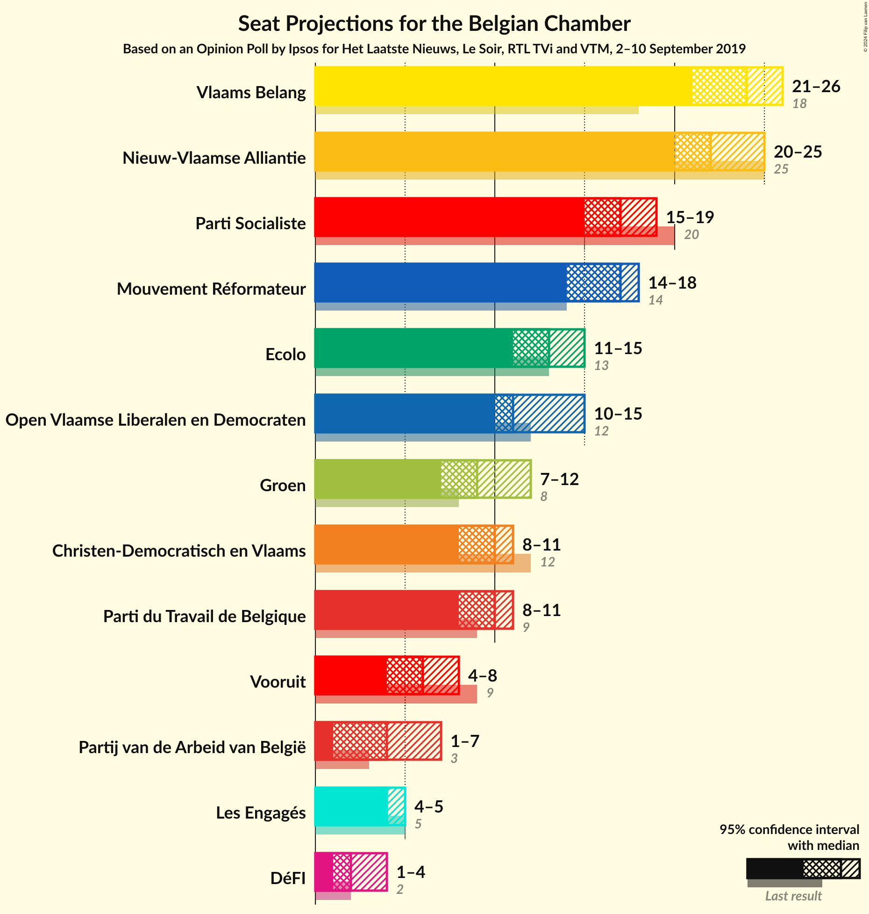

# Opinion Poll by Ipsos for Het Laatste Nieuws, Le Soir, RTL TVi and VTM, 2–10 September 2019

Areas included: Brussels, Flanders, Wallonia

<a href="#voting-intentions">Voting Intentions</a> | <a href="#seats">Seats</a> | <a href="#coalitions">Coalitions</a> | <a href="#technical-information">Technical Information</a>

## Voting Intentions

### Confidence Intervals

| Party | Last Result | Poll Result | 80% Confidence Interval | 90% Confidence Interval | 95% Confidence Interval | 99% Confidence Interval |
|:-----:|:-----------:|:-----------:|:-----------------------:|:-----------------------:|:-----------------------:|:-----------------------:|
| Vlaams Belang | 12.0% | 15.6% | 13.8–14.6% |13.6–14.6% |13.4–14.7% |13.0–14.7% |
| Nieuw-Vlaamse Alliantie | N/A | 14.0% | N/A |N/A |N/A |N/A |
| PS | 9.5% | 8.5% | 7.5–7.9% |7.4–7.9% |7.3–7.9% |7.1–7.9% |
| Open Vlaamse Liberalen en Democraten | N/A | 8.2% | N/A |N/A |N/A |N/A |
| MR | 7.6% | 8.2% | 7.2–7.6% |7.1–7.6% |7.0–7.6% |6.8–7.6% |
| Christen-Democratisch en Vlaams | N/A | 7.2% | N/A |N/A |N/A |N/A |
| Groen | 6.1% | 6.8% | 6.0–7.4% |5.8–7.5% |5.7–7.6% |5.3–7.6% |
| Ecolo | 6.1% | 6.8% | 5.9–6.3% |5.8–6.3% |5.8–6.3% |5.6–6.3% |
| PTB | 4.8% | 5.6% | 4.7–5.1% |4.7–5.1% |4.6–5.1% |4.4–5.1% |
| Socialistische Partij Anders | N/A | 5.2% | N/A |N/A |N/A |N/A |
| Partij van de Arbeid van België | N/A | 3.8% | N/A |N/A |N/A |N/A |
| cdH | 3.7% | 3.0% | 2.4–2.6% |2.3–2.6% |2.2–2.6% |2.1–2.6% |
| DéFI | 2.2% | 2.4% | 1.9–2.1% |1.8–2.1% |1.8–2.1% |1.7–2.1% |
| N-VA | 16.0% | 0.2% | 12.6–13.4% |12.4–13.4% |12.2–13.4% |11.8–13.4% |
| Open Vld | 8.5% | 0.2% | 7.0–7.7% |6.9–7.7% |6.7–7.7% |6.4–7.7% |
| sp.a | 6.7% | 0.1% | 4.2–4.7% |4.1–4.7% |3.9–4.7% |3.7–4.7% |
| CD&V | 8.9% | 0.0% | 5.9–6.5% |5.8–6.5% |5.7–6.5% |5.4–6.5% |

*Note:* The poll result column reflects the actual value used in the calculations. Published results may vary slightly, and in addition be rounded to fewer digits.

## Seats

### Confidence Intervals

| Party | Last Result | Median | 80% Confidence Interval | 90% Confidence Interval | 95% Confidence Interval | 99% Confidence Interval |
|:-----:|:-----------:|:------:|:-----------------------:|:-----------------------:|:-----------------------:|:-----------------------:|
| <a href="#vlaams-belang">Vlaams Belang</a> | 18 | 23 | 20–24 |20–24 |20–24 |20–24 |
| <a href="#nieuw-vlaamse-alliantie">Nieuw-Vlaamse Alliantie</a> | N/A | N/A | N/A |N/A |N/A |N/A |
| <a href="#ps">PS</a> | 20 | 0 | 0 |0 |0 |0 |
| <a href="#open-vlaamse-liberalen-en-democraten">Open Vlaamse Liberalen en Democraten</a> | N/A | N/A | N/A |N/A |N/A |N/A |
| <a href="#mr">MR</a> | 14 | 0 | 0 |0 |0 |0 |
| <a href="#christen-democratisch-en-vlaams">Christen-Democratisch en Vlaams</a> | N/A | N/A | N/A |N/A |N/A |N/A |
| <a href="#groen">Groen</a> | 8 | 9 | 9–10 |9–10 |9–10 |7–10 |
| <a href="#ecolo">Ecolo</a> | 13 | 4 | 4 |4 |4 |4 |
| <a href="#ptb">PTB</a> | 9 | 0 | 0 |0 |0 |0 |
| <a href="#socialistische-partij-anders">Socialistische Partij Anders</a> | N/A | N/A | N/A |N/A |N/A |N/A |
| <a href="#partij-van-de-arbeid-van-belgië">Partij van de Arbeid van België</a> | N/A | N/A | N/A |N/A |N/A |N/A |
| <a href="#cdh">cdH</a> | 5 | 0 | 0 |0 |0 |0 |
| <a href="#défi">DéFI</a> | 2 | 1 | 1 |1 |1 |1 |
| <a href="#n-va">N-VA</a> | 25 | 0 | 0 |0 |0 |0 |
| <a href="#open-vld">Open Vld</a> | 12 | 0 | 0 |0 |0 |0 |
| <a href="#sp.a">sp.a</a> | 9 | 0 | 0 |0 |0 |0 |
| <a href="#cd&v">CD&V</a> | 12 | 0 | 0 |0 |0 |0 |

