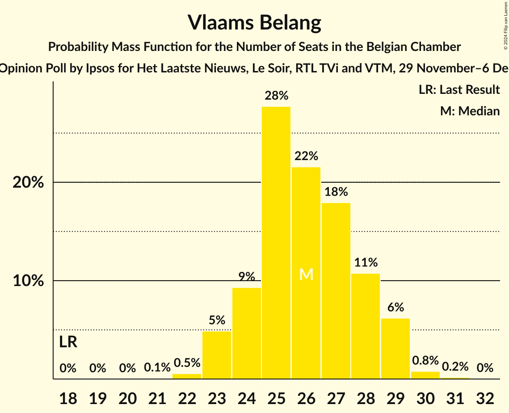
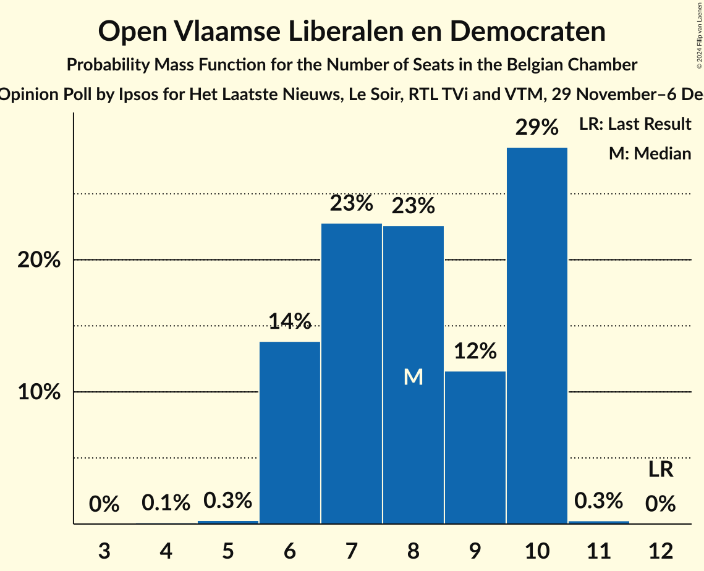
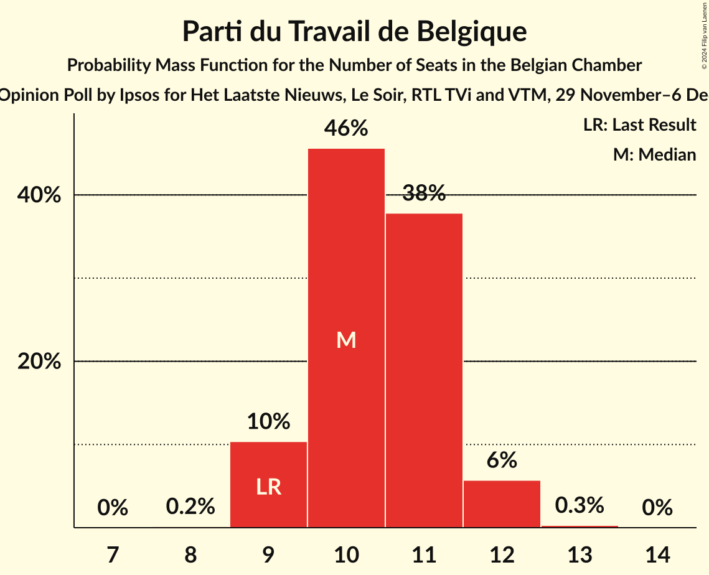
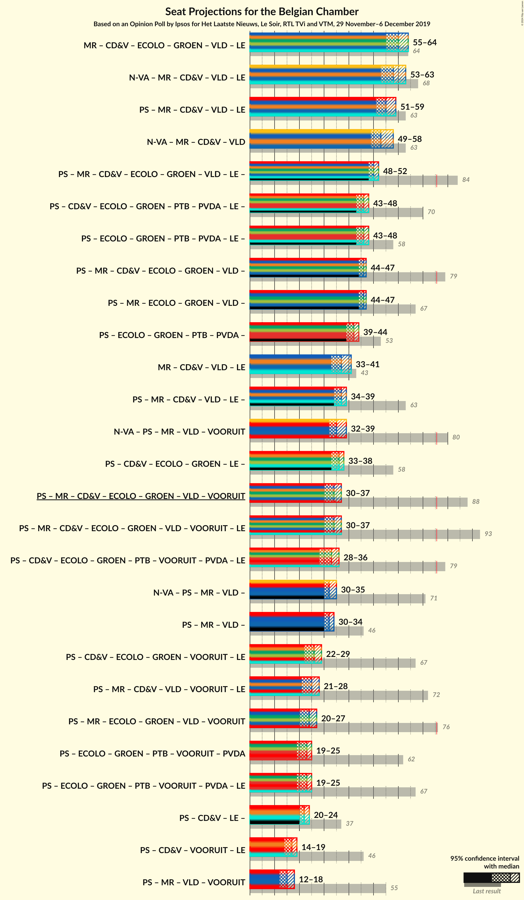
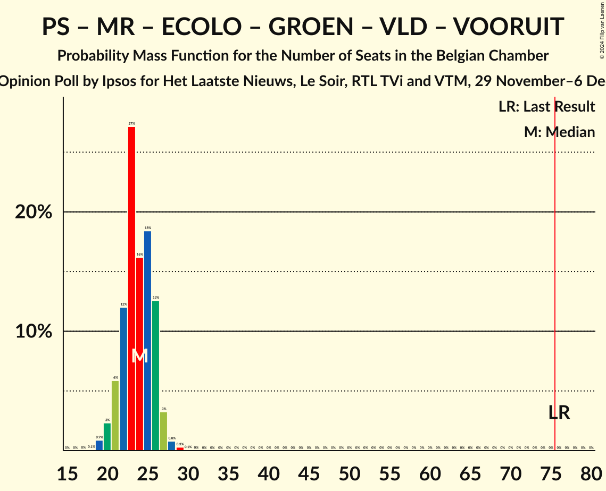
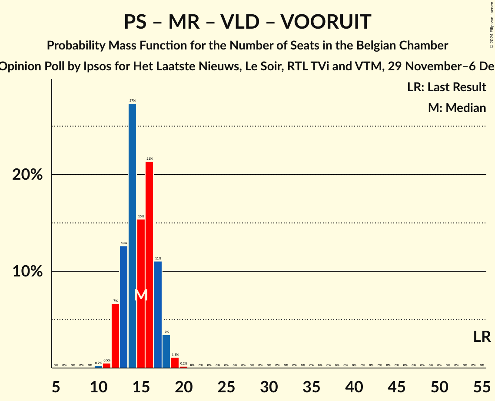

# Opinion Poll by Ipsos for Het Laatste Nieuws, Le Soir, RTL TVi and VTM, 29 November–6 December 2019

Areas included: Brussels, Flanders, Wallonia

<a href="#voting-intentions">Voting Intentions</a> | <a href="#seats">Seats</a> | <a href="#coalitions">Coalitions</a> | <a href="#technical-information">Technical Information</a>

## Voting Intentions

### Confidence Intervals

| Party | Last Result | Poll Result | 80% Confidence Interval | 90% Confidence Interval | 95% Confidence Interval | 99% Confidence Interval |
|:-----:|:-----------:|:-----------:|:-----------------------:|:-----------------------:|:-----------------------:|:-----------------------:|
| Vlaams Belang | 12.0% | 17.0% | 15.2–16.0% |15.0–16.1% |14.8–16.1% |14.4–16.1% |
| Nieuw-Vlaamse Alliantie | 16.0% | 14.1% | 12.3–13.1% |12.1–13.1% |11.9–13.2% |11.6–13.2% |
| Parti Socialiste | 9.5% | 8.8% | 7.8–8.2% |7.7–8.2% |7.6–8.2% |7.4–8.2% |
| Mouvement Réformateur | 7.6% | 7.5% | 6.6–6.9% |6.5–6.9% |6.4–6.9% |6.2–6.9% |
| Christen-Democratisch en Vlaams | 8.9% | 7.1% | 5.9–6.5% |5.7–6.5% |5.6–6.5% |5.3–6.5% |
| Ecolo | 6.1% | 6.9% | 6.1–6.4% |6.0–6.4% |5.9–6.4% |5.7–6.4% |
| Groen | 6.1% | 6.6% | 5.9–7.2% |5.7–7.3% |5.5–7.4% |5.2–7.5% |
| Open Vlaamse Liberalen en Democraten | 8.5% | 6.3% | 5.1–5.7% |5.0–5.7% |4.9–5.7% |4.6–5.7% |
| Parti du Travail de Belgique | 4.8% | 6.0% | 5.1–5.5% |5.0–5.5% |5.0–5.5% |4.8–5.5% |
| Vooruit | 6.7% | 5.5% | 4.8–6.0% |4.6–6.1% |4.5–6.2% |4.2–6.3% |
| Partij van de Arbeid van België | 3.3% | 5.2% | 4.5–5.7% |4.4–5.8% |4.2–5.9% |3.9–5.9% |
| Centre démocrate humaniste | N/A | 3.1% | N/A |N/A |N/A |N/A |
| DéFI | 2.2% | 2.4% | 1.8–2.0% |1.8–2.0% |1.7–2.0% |1.6–2.0% |

*Note:* The poll result column reflects the actual value used in the calculations. Published results may vary slightly, and in addition be rounded to fewer digits.

## Seats

### Confidence Intervals

| Party | Last Result | Median | 80% Confidence Interval | 90% Confidence Interval | 95% Confidence Interval | 99% Confidence Interval |
|:-----:|:-----------:|:------:|:-----------------------:|:-----------------------:|:-----------------------:|:-----------------------:|
| <a href="#vlaams-belang">Vlaams Belang</a> | 18 | 26 | 24–28 |23–29 |23–29 |22–30 |
| <a href="#nieuw-vlaamse-alliantie">Nieuw-Vlaamse Alliantie</a> | 25 | 20 | 19–23 |19–24 |18–25 |18–26 |
| <a href="#parti-socialiste">Parti Socialiste</a> | 20 | 18 | 16–19 |16–19 |16–20 |15–21 |
| <a href="#mouvement-réformateur">Mouvement Réformateur</a> | 14 | 14 | 13–17 |13–17 |12–17 |12–17 |
| <a href="#christen-democratisch-en-vlaams">Christen-Democratisch en Vlaams</a> | 12 | 10 | 9–11 |8–11 |8–11 |6–13 |
| <a href="#ecolo">Ecolo</a> | 13 | 13 | 12–15 |12–15 |12–16 |11–17 |
| <a href="#groen">Groen</a> | 8 | 9 | 8–10 |7–11 |7–11 |6–13 |
| <a href="#open-vlaamse-liberalen-en-democraten">Open Vlaamse Liberalen en Democraten</a> | 12 | 8 | 6–10 |6–10 |6–10 |6–10 |
| <a href="#parti-du-travail-de-belgique">Parti du Travail de Belgique</a> | 9 | 10 | 9–11 |9–12 |9–12 |9–12 |
| <a href="#vooruit">Vooruit</a> | 9 | 6 | 6–8 |6–8 |5–9 |4–10 |
| <a href="#partij-van-de-arbeid-van-belgië">Partij van de Arbeid van België</a> | 3 | 7 | 5–8 |5–8 |5–8 |4–9 |
| <a href="#centre-démocrate-humaniste">Centre démocrate humaniste</a> | N/A | N/A | N/A |N/A |N/A |N/A |
| <a href="#défi">DéFI</a> | 2 | 2 | 2–3 |1–4 |1–4 |1–4 |

### Vlaams Belang

*For a full overview of the results for this party, see the [Vlaams Belang](party-vlaamsbelang.html) page.*

| Number of Seats | Probability | Accumulated | Special Marks |
|:---------------:|:-----------:|:-----------:|:-------------:|
| 18 | 0% | 100% | Last Result |
| 19 | 0% | 100% |  |
| 20 | 0% | 100% |  |
| 21 | 0.1% | 100% |  |
| 22 | 0.5% | 99.9% |  |
| 23 | 5% | 99.4% |  |
| 24 | 9% | 94% |  |
| 25 | 28% | 85% |  |
| 26 | 22% | 57% | Median |
| 27 | 18% | 36% |  |
| 28 | 11% | 18% |  |
| 29 | 6% | 7% |  |
| 30 | 0.8% | 1.0% |  |
| 31 | 0.2% | 0.2% |  |
| 32 | 0% | 0% |  |

### Nieuw-Vlaamse Alliantie

*For a full overview of the results for this party, see the [Nieuw-Vlaamse Alliantie](party-nieuw-vlaamsealliantie.html) page.*

| Number of Seats | Probability | Accumulated | Special Marks |
|:---------------:|:-----------:|:-----------:|:-------------:|
| 16 | 0.1% | 100% |  |
| 17 | 0.3% | 99.9% |  |
| 18 | 4% | 99.6% |  |
| 19 | 11% | 96% |  |
| 20 | 41% | 85% | Median |
| 21 | 23% | 44% |  |
| 22 | 9% | 21% |  |
| 23 | 6% | 12% |  |
| 24 | 4% | 7% |  |
| 25 | 3% | 3% | Last Result |
| 26 | 0.6% | 0.6% |  |
| 27 | 0% | 0% |  |

### Parti Socialiste

*For a full overview of the results for this party, see the [Parti Socialiste](party-partisocialiste.html) page.*

| Number of Seats | Probability | Accumulated | Special Marks |
|:---------------:|:-----------:|:-----------:|:-------------:|
| 14 | 0.3% | 100% |  |
| 15 | 2% | 99.7% |  |
| 16 | 10% | 98% |  |
| 17 | 26% | 88% |  |
| 18 | 39% | 62% | Median |
| 19 | 18% | 23% |  |
| 20 | 4% | 5% | Last Result |
| 21 | 0.9% | 0.9% |  |
| 22 | 0% | 0% |  |

### Mouvement Réformateur

*For a full overview of the results for this party, see the [Mouvement Réformateur](party-mouvementréformateur.html) page.*

| Number of Seats | Probability | Accumulated | Special Marks |
|:---------------:|:-----------:|:-----------:|:-------------:|
| 12 | 4% | 100% |  |
| 13 | 27% | 96% |  |
| 14 | 22% | 68% | Last Result, Median |
| 15 | 21% | 46% |  |
| 16 | 15% | 26% |  |
| 17 | 11% | 11% |  |
| 18 | 0.3% | 0.3% |  |
| 19 | 0% | 0% |  |

### Christen-Democratisch en Vlaams

*For a full overview of the results for this party, see the [Christen-Democratisch en Vlaams](party-christen-democratischenvlaams.html) page.*

| Number of Seats | Probability | Accumulated | Special Marks |
|:---------------:|:-----------:|:-----------:|:-------------:|
| 6 | 1.0% | 100% |  |
| 7 | 1.3% | 98.9% |  |
| 8 | 7% | 98% |  |
| 9 | 10% | 90% |  |
| 10 | 52% | 80% | Median |
| 11 | 25% | 27% |  |
| 12 | 2% | 2% | Last Result |
| 13 | 0.5% | 0.5% |  |
| 14 | 0% | 0% |  |

### Ecolo

*For a full overview of the results for this party, see the [Ecolo](party-ecolo.html) page.*

| Number of Seats | Probability | Accumulated | Special Marks |
|:---------------:|:-----------:|:-----------:|:-------------:|
| 10 | 0.1% | 100% |  |
| 11 | 1.4% | 99.9% |  |
| 12 | 9% | 98% |  |
| 13 | 47% | 90% | Last Result, Median |
| 14 | 33% | 43% |  |
| 15 | 7% | 10% |  |
| 16 | 2% | 3% |  |
| 17 | 0.7% | 0.8% |  |
| 18 | 0% | 0% |  |

### Groen

*For a full overview of the results for this party, see the [Groen](party-groen.html) page.*

| Number of Seats | Probability | Accumulated | Special Marks |
|:---------------:|:-----------:|:-----------:|:-------------:|
| 5 | 0.2% | 100% |  |
| 6 | 0.9% | 99.8% |  |
| 7 | 8% | 98.9% |  |
| 8 | 7% | 91% | Last Result |
| 9 | 73% | 84% | Median |
| 10 | 5% | 11% |  |
| 11 | 3% | 5% |  |
| 12 | 1.4% | 2% |  |
| 13 | 0.8% | 0.8% |  |
| 14 | 0% | 0% |  |

### Open Vlaamse Liberalen en Democraten

*For a full overview of the results for this party, see the [Open Vlaamse Liberalen en Democraten](party-openvlaamseliberalenendemocraten.html) page.*

| Number of Seats | Probability | Accumulated | Special Marks |
|:---------------:|:-----------:|:-----------:|:-------------:|
| 4 | 0.1% | 100% |  |
| 5 | 0.3% | 99.9% |  |
| 6 | 14% | 99.6% |  |
| 7 | 23% | 86% |  |
| 8 | 23% | 63% | Median |
| 9 | 12% | 40% |  |
| 10 | 29% | 29% |  |
| 11 | 0.3% | 0.3% |  |
| 12 | 0% | 0% | Last Result |

### Parti du Travail de Belgique

*For a full overview of the results for this party, see the [Parti du Travail de Belgique](party-partidutravaildebelgique.html) page.*

| Number of Seats | Probability | Accumulated | Special Marks |
|:---------------:|:-----------:|:-----------:|:-------------:|
| 8 | 0.2% | 100% |  |
| 9 | 10% | 99.8% | Last Result |
| 10 | 46% | 89% | Median |
| 11 | 38% | 44% |  |
| 12 | 6% | 6% |  |
| 13 | 0.3% | 0.3% |  |
| 14 | 0% | 0% |  |

### Vooruit

*For a full overview of the results for this party, see the [Vooruit](party-vooruit.html) page.*

| Number of Seats | Probability | Accumulated | Special Marks |
|:---------------:|:-----------:|:-----------:|:-------------:|
| 4 | 1.1% | 100% |  |
| 5 | 3% | 98.9% |  |
| 6 | 49% | 96% | Median |
| 7 | 30% | 47% |  |
| 8 | 13% | 17% |  |
| 9 | 3% | 4% | Last Result |
| 10 | 1.3% | 1.5% |  |
| 11 | 0.2% | 0.2% |  |
| 12 | 0% | 0% |  |

### Partij van de Arbeid van België

*For a full overview of the results for this party, see the [Partij van de Arbeid van België](party-partijvandearbeidvanbelgië.html) page.*

| Number of Seats | Probability | Accumulated | Special Marks |
|:---------------:|:-----------:|:-----------:|:-------------:|
| 3 | 0.2% | 100% | Last Result |
| 4 | 2% | 99.8% |  |
| 5 | 23% | 98% |  |
| 6 | 8% | 75% |  |
| 7 | 25% | 67% | Median |
| 8 | 41% | 42% |  |
| 9 | 0.7% | 0.7% |  |
| 10 | 0% | 0% |  |

### Centre démocrate humaniste

*For a full overview of the results for this party, see the [Centre démocrate humaniste](party-centredémocratehumaniste.html) page.*

### DéFI

*For a full overview of the results for this party, see the [DéFI](party-défi.html) page.*

| Number of Seats | Probability | Accumulated | Special Marks |
|:---------------:|:-----------:|:-----------:|:-------------:|
| 1 | 7% | 100% |  |
| 2 | 77% | 93% | Last Result, Median |
| 3 | 11% | 16% |  |
| 4 | 6% | 6% |  |
| 5 | 0.2% | 0.2% |  |
| 6 | 0% | 0% |  |

## Coalitions

### Confidence Intervals

| Coalition | Last Result | Median | Majority? | 80% Confidence Interval | 90% Confidence Interval | 95% Confidence Interval | 99% Confidence Interval |
|:---------:|:-----------:|:------:|:---------:|:-----------------------:|:-----------------------:|:-----------------------:|:-----------------------:|
| Nieuw-Vlaamse Alliantie – Mouvement Réformateur – Christen-Democratisch en Vlaams – Open Vlaamse Liberalen en Democraten | 63 | 53 | 0% | 50–56 | 50–57 | 49–58 | 48–59 |
| Nieuw-Vlaamse Alliantie – Parti Socialiste – Mouvement Réformateur – Open Vlaamse Liberalen en Democraten – Vooruit | 80 | 35 | 0% | 33–38 | 32–39 | 32–39 | 31–41 |
| Parti Socialiste – Mouvement Réformateur – Christen-Democratisch en Vlaams – Ecolo – Groen – Open Vlaamse Liberalen en Democraten – Vooruit | 88 | 34 | 0% | 31–36 | 30–37 | 30–37 | 29–38 |
| Parti Socialiste – Mouvement Réformateur – Ecolo – Groen – Open Vlaamse Liberalen en Democraten – Vooruit | 76 | 24 | 0% | 22–26 | 21–26 | 20–27 | 19–28 |
| Parti Socialiste – Ecolo – Groen – Parti du Travail de Belgique – Vooruit – Partij van de Arbeid van België | 62 | 23 | 0% | 20–24 | 20–25 | 19–25 | 18–27 |
| Parti Socialiste – Mouvement Réformateur – Open Vlaamse Liberalen en Democraten – Vooruit | 55 | 15 | 0% | 13–17 | 12–17 | 12–18 | 11–19 |

### Nieuw-Vlaamse Alliantie – Mouvement Réformateur – Christen-Democratisch en Vlaams – Open Vlaamse Liberalen en Democraten

| Number of Seats | Probability | Accumulated | Special Marks |
|:---------------:|:-----------:|:-----------:|:-------------:|
| 46 | 0.1% | 100% |  |
| 47 | 0.3% | 99.9% |  |
| 48 | 1.1% | 99.6% |  |
| 49 | 3% | 98.6% |  |
| 50 | 7% | 95% |  |
| 51 | 12% | 88% |  |
| 52 | 15% | 77% | Median |
| 53 | 16% | 62% |  |
| 54 | 16% | 46% |  |
| 55 | 12% | 30% |  |
| 56 | 9% | 18% |  |
| 57 | 5% | 9% |  |
| 58 | 3% | 4% |  |
| 59 | 1.0% | 1.4% |  |
| 60 | 0.3% | 0.4% |  |
| 61 | 0.1% | 0.1% |  |
| 62 | 0% | 0% |  |
| 63 | 0% | 0% | Last Result |

### Nieuw-Vlaamse Alliantie – Parti Socialiste – Mouvement Réformateur – Open Vlaamse Liberalen en Democraten – Vooruit

| Number of Seats | Probability | Accumulated | Special Marks |
|:---------------:|:-----------:|:-----------:|:-------------:|
| 30 | 0.2% | 100% |  |
| 31 | 1.0% | 99.8% |  |
| 32 | 4% | 98.8% |  |
| 33 | 10% | 94% |  |
| 34 | 22% | 85% |  |
| 35 | 18% | 62% |  |
| 36 | 18% | 44% |  |
| 37 | 13% | 26% |  |
| 38 | 7% | 13% |  |
| 39 | 4% | 6% |  |
| 40 | 1.1% | 2% |  |
| 41 | 0.6% | 0.7% |  |
| 42 | 0.1% | 0.1% |  |
| 43 | 0% | 0% |  |
| 44 | 0% | 0% |  |
| 45 | 0% | 0% |  |
| 46 | 0% | 0% |  |
| 47 | 0% | 0% |  |
| 48 | 0% | 0% |  |
| 49 | 0% | 0% |  |
| 50 | 0% | 0% |  |
| 51 | 0% | 0% |  |
| 52 | 0% | 0% |  |
| 53 | 0% | 0% |  |
| 54 | 0% | 0% |  |
| 55 | 0% | 0% |  |
| 56 | 0% | 0% |  |
| 57 | 0% | 0% |  |
| 58 | 0% | 0% |  |
| 59 | 0% | 0% |  |
| 60 | 0% | 0% |  |
| 61 | 0% | 0% |  |
| 62 | 0% | 0% |  |
| 63 | 0% | 0% |  |
| 64 | 0% | 0% |  |
| 65 | 0% | 0% |  |
| 66 | 0% | 0% | Median |
| 67 | 0% | 0% |  |
| 68 | 0% | 0% |  |
| 69 | 0% | 0% |  |
| 70 | 0% | 0% |  |
| 71 | 0% | 0% |  |
| 72 | 0% | 0% |  |
| 73 | 0% | 0% |  |
| 74 | 0% | 0% |  |
| 75 | 0% | 0% |  |
| 76 | 0% | 0% | Majority |
| 77 | 0% | 0% |  |
| 78 | 0% | 0% |  |
| 79 | 0% | 0% |  |
| 80 | 0% | 0% | Last Result |

### Parti Socialiste – Mouvement Réformateur – Christen-Democratisch en Vlaams – Ecolo – Groen – Open Vlaamse Liberalen en Democraten – Vooruit

| Number of Seats | Probability | Accumulated | Special Marks |
|:---------------:|:-----------:|:-----------:|:-------------:|
| 28 | 0.2% | 100% |  |
| 29 | 2% | 99.7% |  |
| 30 | 4% | 98% |  |
| 31 | 8% | 94% |  |
| 32 | 13% | 87% |  |
| 33 | 19% | 74% |  |
| 34 | 18% | 55% |  |
| 35 | 18% | 37% |  |
| 36 | 13% | 19% |  |
| 37 | 5% | 6% |  |
| 38 | 0.8% | 1.1% |  |
| 39 | 0.3% | 0.3% |  |
| 40 | 0% | 0% |  |
| 41 | 0% | 0% |  |
| 42 | 0% | 0% |  |
| 43 | 0% | 0% |  |
| 44 | 0% | 0% |  |
| 45 | 0% | 0% |  |
| 46 | 0% | 0% |  |
| 47 | 0% | 0% |  |
| 48 | 0% | 0% |  |
| 49 | 0% | 0% |  |
| 50 | 0% | 0% |  |
| 51 | 0% | 0% |  |
| 52 | 0% | 0% |  |
| 53 | 0% | 0% |  |
| 54 | 0% | 0% |  |
| 55 | 0% | 0% |  |
| 56 | 0% | 0% |  |
| 57 | 0% | 0% |  |
| 58 | 0% | 0% |  |
| 59 | 0% | 0% |  |
| 60 | 0% | 0% |  |
| 61 | 0% | 0% |  |
| 62 | 0% | 0% |  |
| 63 | 0% | 0% |  |
| 64 | 0% | 0% |  |
| 65 | 0% | 0% |  |
| 66 | 0% | 0% |  |
| 67 | 0% | 0% |  |
| 68 | 0% | 0% |  |
| 69 | 0% | 0% |  |
| 70 | 0% | 0% |  |
| 71 | 0% | 0% |  |
| 72 | 0% | 0% |  |
| 73 | 0% | 0% |  |
| 74 | 0% | 0% |  |
| 75 | 0% | 0% |  |
| 76 | 0% | 0% | Majority |
| 77 | 0% | 0% |  |
| 78 | 0% | 0% | Median |
| 79 | 0% | 0% |  |
| 80 | 0% | 0% |  |
| 81 | 0% | 0% |  |
| 82 | 0% | 0% |  |
| 83 | 0% | 0% |  |
| 84 | 0% | 0% |  |
| 85 | 0% | 0% |  |
| 86 | 0% | 0% |  |
| 87 | 0% | 0% |  |
| 88 | 0% | 0% | Last Result |

### Parti Socialiste – Mouvement Réformateur – Ecolo – Groen – Open Vlaamse Liberalen en Democraten – Vooruit

| Number of Seats | Probability | Accumulated | Special Marks |
|:---------------:|:-----------:|:-----------:|:-------------:|
| 18 | 0.1% | 100% |  |
| 19 | 0.9% | 99.9% |  |
| 20 | 2% | 99.0% |  |
| 21 | 6% | 97% |  |
| 22 | 12% | 91% |  |
| 23 | 27% | 79% |  |
| 24 | 16% | 52% |  |
| 25 | 18% | 35% |  |
| 26 | 13% | 17% |  |
| 27 | 3% | 4% |  |
| 28 | 0.8% | 1.2% |  |
| 29 | 0.3% | 0.4% |  |
| 30 | 0.1% | 0.1% |  |
| 31 | 0% | 0% |  |
| 32 | 0% | 0% |  |
| 33 | 0% | 0% |  |
| 34 | 0% | 0% |  |
| 35 | 0% | 0% |  |
| 36 | 0% | 0% |  |
| 37 | 0% | 0% |  |
| 38 | 0% | 0% |  |
| 39 | 0% | 0% |  |
| 40 | 0% | 0% |  |
| 41 | 0% | 0% |  |
| 42 | 0% | 0% |  |
| 43 | 0% | 0% |  |
| 44 | 0% | 0% |  |
| 45 | 0% | 0% |  |
| 46 | 0% | 0% |  |
| 47 | 0% | 0% |  |
| 48 | 0% | 0% |  |
| 49 | 0% | 0% |  |
| 50 | 0% | 0% |  |
| 51 | 0% | 0% |  |
| 52 | 0% | 0% |  |
| 53 | 0% | 0% |  |
| 54 | 0% | 0% |  |
| 55 | 0% | 0% |  |
| 56 | 0% | 0% |  |
| 57 | 0% | 0% |  |
| 58 | 0% | 0% |  |
| 59 | 0% | 0% |  |
| 60 | 0% | 0% |  |
| 61 | 0% | 0% |  |
| 62 | 0% | 0% |  |
| 63 | 0% | 0% |  |
| 64 | 0% | 0% |  |
| 65 | 0% | 0% |  |
| 66 | 0% | 0% |  |
| 67 | 0% | 0% |  |
| 68 | 0% | 0% | Median |
| 69 | 0% | 0% |  |
| 70 | 0% | 0% |  |
| 71 | 0% | 0% |  |
| 72 | 0% | 0% |  |
| 73 | 0% | 0% |  |
| 74 | 0% | 0% |  |
| 75 | 0% | 0% |  |
| 76 | 0% | 0% | Last Result, Majority |

### Parti Socialiste – Ecolo – Groen – Parti du Travail de Belgique – Vooruit – Partij van de Arbeid van België

| Number of Seats | Probability | Accumulated | Special Marks |
|:---------------:|:-----------:|:-----------:|:-------------:|
| 17 | 0.3% | 100% |  |
| 18 | 1.1% | 99.7% |  |
| 19 | 2% | 98.6% |  |
| 20 | 10% | 96% |  |
| 21 | 16% | 86% |  |
| 22 | 14% | 71% |  |
| 23 | 34% | 56% |  |
| 24 | 15% | 22% |  |
| 25 | 5% | 7% |  |
| 26 | 1.4% | 2% |  |
| 27 | 0.6% | 0.8% |  |
| 28 | 0.2% | 0.2% |  |
| 29 | 0% | 0% |  |
| 30 | 0% | 0% |  |
| 31 | 0% | 0% |  |
| 32 | 0% | 0% |  |
| 33 | 0% | 0% |  |
| 34 | 0% | 0% |  |
| 35 | 0% | 0% |  |
| 36 | 0% | 0% |  |
| 37 | 0% | 0% |  |
| 38 | 0% | 0% |  |
| 39 | 0% | 0% |  |
| 40 | 0% | 0% |  |
| 41 | 0% | 0% |  |
| 42 | 0% | 0% |  |
| 43 | 0% | 0% |  |
| 44 | 0% | 0% |  |
| 45 | 0% | 0% |  |
| 46 | 0% | 0% |  |
| 47 | 0% | 0% |  |
| 48 | 0% | 0% |  |
| 49 | 0% | 0% |  |
| 50 | 0% | 0% |  |
| 51 | 0% | 0% |  |
| 52 | 0% | 0% |  |
| 53 | 0% | 0% |  |
| 54 | 0% | 0% |  |
| 55 | 0% | 0% |  |
| 56 | 0% | 0% |  |
| 57 | 0% | 0% |  |
| 58 | 0% | 0% |  |
| 59 | 0% | 0% |  |
| 60 | 0% | 0% |  |
| 61 | 0% | 0% |  |
| 62 | 0% | 0% | Last Result |

### Parti Socialiste – Mouvement Réformateur – Open Vlaamse Liberalen en Democraten – Vooruit

| Number of Seats | Probability | Accumulated | Special Marks |
|:---------------:|:-----------:|:-----------:|:-------------:|
| 10 | 0.2% | 100% |  |
| 11 | 0.5% | 99.8% |  |
| 12 | 7% | 99.3% |  |
| 13 | 13% | 93% |  |
| 14 | 27% | 80% |  |
| 15 | 15% | 53% |  |
| 16 | 21% | 37% |  |
| 17 | 11% | 16% |  |
| 18 | 3% | 5% |  |
| 19 | 1.1% | 1.3% |  |
| 20 | 0.2% | 0.2% |  |
| 21 | 0% | 0% |  |
| 22 | 0% | 0% |  |
| 23 | 0% | 0% |  |
| 24 | 0% | 0% |  |
| 25 | 0% | 0% |  |
| 26 | 0% | 0% |  |
| 27 | 0% | 0% |  |
| 28 | 0% | 0% |  |
| 29 | 0% | 0% |  |
| 30 | 0% | 0% |  |
| 31 | 0% | 0% |  |
| 32 | 0% | 0% |  |
| 33 | 0% | 0% |  |
| 34 | 0% | 0% |  |
| 35 | 0% | 0% |  |
| 36 | 0% | 0% |  |
| 37 | 0% | 0% |  |
| 38 | 0% | 0% |  |
| 39 | 0% | 0% |  |
| 40 | 0% | 0% |  |
| 41 | 0% | 0% |  |
| 42 | 0% | 0% |  |
| 43 | 0% | 0% |  |
| 44 | 0% | 0% |  |
| 45 | 0% | 0% |  |
| 46 | 0% | 0% | Median |
| 47 | 0% | 0% |  |
| 48 | 0% | 0% |  |
| 49 | 0% | 0% |  |
| 50 | 0% | 0% |  |
| 51 | 0% | 0% |  |
| 52 | 0% | 0% |  |
| 53 | 0% | 0% |  |
| 54 | 0% | 0% |  |
| 55 | 0% | 0% | Last Result |

## Technical Information

### Opinion Poll

+ **Polling firm:** Ipsos
+ **Commissioner(s):** Het Laatste Nieuws, Le Soir, RTL TVi and VTM
+ **Fieldwork period:** 29 November–6 December 2019

### Calculations

+ **Sample size:** 1615
+ **Simulations done:** 1,048,576
+ **Error estimate:** 0.64%

