# Opinion Poll by Dedicated for RTBf–La Libre Belgique, 5–9 March 2015

Areas included: Brussels, Flanders, Wallonia

<a href="#voting-intentions">Voting Intentions</a> | <a href="#seats">Seats</a> | <a href="#coalitions">Coalitions</a> | <a href="#technical-information">Technical Information</a>

## Voting Intentions

### Confidence Intervals

| Party | Last Result | Poll Result | 80% Confidence Interval | 90% Confidence Interval | 95% Confidence Interval | 99% Confidence Interval |
|:-----:|:-----------:|:-----------:|:-----------------------:|:-----------------------:|:-----------------------:|:-----------------------:|
| N-VA | 20.3% | 18.1% | 15.8–16.9% |15.5–16.9% |15.3–16.9% |14.8–16.9% |
| CD&V | 11.6% | 10.4% | 8.6–9.4% |8.4–9.5% |8.2–9.5% |7.8–9.5% |
| sp.a | 8.8% | 10.4% | 8.5–9.4% |8.3–9.4% |8.2–9.4% |7.8–9.4% |
| PS | 11.7% | 10.3% | 9.1–9.6% |8.9–9.6% |8.8–9.6% |8.6–9.6% |
| Open Vld | 9.8% | 9.7% | 7.9–8.7% |7.7–8.8% |7.6–8.8% |7.2–8.8% |
| MR | 9.6% | 9.5% | 8.3–8.7% |8.1–8.7% |8.0–8.7% |7.8–8.8% |
| Groen | 5.3% | 5.9% | 5.1–6.6% |4.9–6.7% |4.7–6.8% |4.3–6.9% |
| cdH | 5.0% | 5.1% | 4.2–4.6% |4.1–4.6% |4.0–4.6% |3.9–4.6% |
| Vlaams Belang | 3.7% | 4.7% | 3.4–4.0% |3.3–4.0% |3.2–4.0% |2.9–4.0% |
| Ecolo | 3.3% | 3.4% | 2.7–2.9% |2.6–3.0% |2.5–3.0% |2.4–3.0% |
| PTB | 2.0% | 3.0% | 2.3–2.5% |2.2–2.5% |2.1–2.5% |2.0–2.5% |
| PVDA | 1.8% | 2.1% | 1.6–2.5% |1.5–2.6% |1.4–2.6% |1.2–2.7% |
| DéFI | 1.8% | 1.8% | 1.4–1.6% |1.4–1.6% |1.3–1.6% |1.2–1.6% |
| Parti Populaire | 1.5% | 1.3% | 0.8–1.0% |0.8–1.0% |0.7–1.0% |0.7–1.0% |
| Piratenpartij | 0.3% | 0.8% | 0.5–1.1% |0.5–1.2% |0.4–1.2% |0.3–1.3% |
| Lijst Dedecker | 0.4% | 0.4% | 0.2–0.6% |0.2–0.7% |0.1–0.7% |0.1–0.7% |

*Note:* The poll result column reflects the actual value used in the calculations. Published results may vary slightly, and in addition be rounded to fewer digits.

## Seats

### Confidence Intervals

| Party | Last Result | Median | 80% Confidence Interval | 90% Confidence Interval | 95% Confidence Interval | 99% Confidence Interval |
|:-----:|:-----------:|:------:|:-----------------------:|:-----------------------:|:-----------------------:|:-----------------------:|
| <a href="#n-va">N-VA</a> | 33 | 29 | 26–31 |25–32 |25–32 |24–34 |
| <a href="#cd&v">CD&V</a> | 18 | 16 | 13–18 |13–18 |13–19 |13–19 |
| <a href="#sp.a">sp.a</a> | 13 | 15 | 13–18 |13–18 |13–18 |12–19 |
| <a href="#ps">PS</a> | 23 | 22 | 20–23 |20–24 |20–25 |19–26 |
| <a href="#open-vld">Open Vld</a> | 14 | 13 | 12–17 |12–17 |12–18 |11–18 |
| <a href="#mr">MR</a> | 20 | 20 | 18–22 |18–22 |18–23 |17–23 |
| <a href="#groen">Groen</a> | 6 | 8 | 6–10 |5–10 |5–11 |5–12 |
| <a href="#cdh">cdH</a> | 9 | 9 | 8–11 |8–12 |8–13 |8–13 |
| <a href="#vlaams-belang">Vlaams Belang</a> | 3 | 6 | 4–8 |3–8 |2–8 |2–8 |
| <a href="#ecolo">Ecolo</a> | 6 | 5 | 4–7 |3–7 |3–7 |3–8 |
| <a href="#ptb">PTB</a> | 2 | 4 | 3–5 |3–5 |3–6 |2–7 |
| <a href="#pvda">PVDA</a> | 0 | 0 | 0 |0 |0 |0 |
| <a href="#défi">DéFI</a> | 2 | 2 | 2 |2–3 |2–3 |2–3 |
| <a href="#parti-populaire">Parti Populaire</a> | 1 | 0 | 0–1 |0–1 |0–2 |0–2 |
| <a href="#piratenpartij">Piratenpartij</a> | 0 | 0 | 0 |0 |0 |0 |
| <a href="#lijst-dedecker">Lijst Dedecker</a> | 0 | 0 | 0–1 |0–1 |0–1 |0–1 |

### N-VA

*For a full overview of the results for this party, see the [N-VA](party-n-va.html) page.*

| Number of Seats | Probability | Accumulated | Special Marks |
|:---------------:|:-----------:|:-----------:|:-------------:|
| 23 | 0.3% | 100% |  |
| 24 | 1.5% | 99.7% |  |
| 25 | 6% | 98% |  |
| 26 | 10% | 92% |  |
| 27 | 12% | 82% |  |
| 28 | 13% | 70% |  |
| 29 | 21% | 57% | Median |
| 30 | 12% | 36% |  |
| 31 | 19% | 24% |  |
| 32 | 4% | 5% |  |
| 33 | 0.9% | 1.4% | Last Result |
| 34 | 0.4% | 0.5% |  |
| 35 | 0% | 0.1% |  |
| 36 | 0.1% | 0.1% |  |
| 37 | 0% | 0% |  |

### CD&V

*For a full overview of the results for this party, see the [CD&V](party-cdv.html) page.*

| Number of Seats | Probability | Accumulated | Special Marks |
|:---------------:|:-----------:|:-----------:|:-------------:|
| 11 | 0.1% | 100% |  |
| 12 | 0.3% | 99.9% |  |
| 13 | 25% | 99.6% |  |
| 14 | 9% | 75% |  |
| 15 | 12% | 65% |  |
| 16 | 20% | 54% | Median |
| 17 | 11% | 34% |  |
| 18 | 21% | 23% | Last Result |
| 19 | 2% | 3% |  |
| 20 | 0.2% | 0.3% |  |
| 21 | 0.1% | 0.1% |  |
| 22 | 0% | 0% |  |

### sp.a

*For a full overview of the results for this party, see the [sp.a](party-spa.html) page.*

| Number of Seats | Probability | Accumulated | Special Marks |
|:---------------:|:-----------:|:-----------:|:-------------:|
| 10 | 0.1% | 100% |  |
| 11 | 0.3% | 99.9% |  |
| 12 | 1.1% | 99.7% |  |
| 13 | 26% | 98.6% | Last Result |
| 14 | 14% | 73% |  |
| 15 | 20% | 59% | Median |
| 16 | 15% | 39% |  |
| 17 | 11% | 23% |  |
| 18 | 10% | 12% |  |
| 19 | 1.3% | 2% |  |
| 20 | 0.1% | 0.2% |  |
| 21 | 0.1% | 0.1% |  |
| 22 | 0% | 0% |  |

### PS

*For a full overview of the results for this party, see the [PS](party-ps.html) page.*

| Number of Seats | Probability | Accumulated | Special Marks |
|:---------------:|:-----------:|:-----------:|:-------------:|
| 18 | 0.1% | 100% |  |
| 19 | 2% | 99.9% |  |
| 20 | 10% | 98% |  |
| 21 | 27% | 88% |  |
| 22 | 47% | 61% | Median |
| 23 | 8% | 14% | Last Result |
| 24 | 3% | 6% |  |
| 25 | 2% | 3% |  |
| 26 | 0.8% | 0.9% |  |
| 27 | 0.1% | 0.1% |  |
| 28 | 0% | 0% |  |

### Open Vld

*For a full overview of the results for this party, see the [Open Vld](party-openvld.html) page.*

| Number of Seats | Probability | Accumulated | Special Marks |
|:---------------:|:-----------:|:-----------:|:-------------:|
| 10 | 0.1% | 100% |  |
| 11 | 2% | 99.9% |  |
| 12 | 16% | 98% |  |
| 13 | 38% | 82% | Median |
| 14 | 8% | 44% | Last Result |
| 15 | 15% | 36% |  |
| 16 | 7% | 21% |  |
| 17 | 8% | 13% |  |
| 18 | 5% | 5% |  |
| 19 | 0.3% | 0.3% |  |
| 20 | 0% | 0% |  |

### MR

*For a full overview of the results for this party, see the [MR](party-mr.html) page.*

| Number of Seats | Probability | Accumulated | Special Marks |
|:---------------:|:-----------:|:-----------:|:-------------:|
| 16 | 0.1% | 100% |  |
| 17 | 2% | 99.9% |  |
| 18 | 17% | 98% |  |
| 19 | 24% | 82% |  |
| 20 | 23% | 58% | Last Result, Median |
| 21 | 22% | 35% |  |
| 22 | 11% | 13% |  |
| 23 | 2% | 3% |  |
| 24 | 0.3% | 0.4% |  |
| 25 | 0.1% | 0.1% |  |
| 26 | 0% | 0% |  |

### Groen

*For a full overview of the results for this party, see the [Groen](party-groen.html) page.*

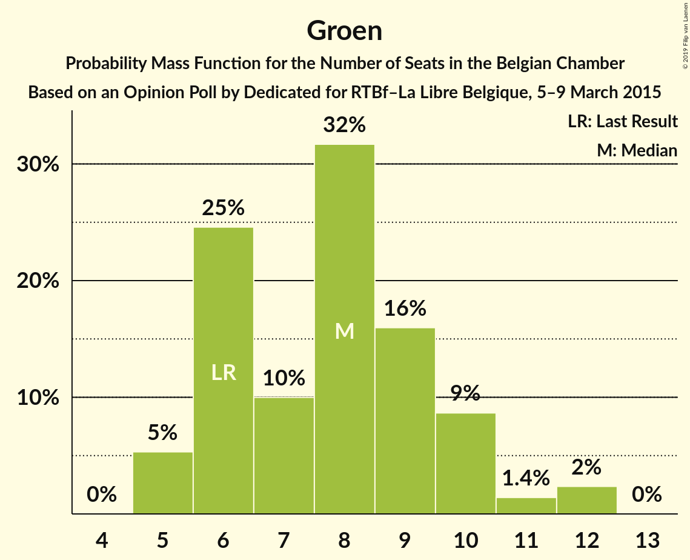

| Number of Seats | Probability | Accumulated | Special Marks |
|:---------------:|:-----------:|:-----------:|:-------------:|
| 5 | 5% | 100% |  |
| 6 | 25% | 95% | Last Result |
| 7 | 10% | 70% |  |
| 8 | 32% | 60% | Median |
| 9 | 16% | 28% |  |
| 10 | 9% | 12% |  |
| 11 | 1.4% | 4% |  |
| 12 | 2% | 2% |  |
| 13 | 0% | 0% |  |

### cdH

*For a full overview of the results for this party, see the [cdH](party-cdh.html) page.*

| Number of Seats | Probability | Accumulated | Special Marks |
|:---------------:|:-----------:|:-----------:|:-------------:|
| 6 | 0.1% | 100% |  |
| 7 | 0.1% | 99.9% |  |
| 8 | 10% | 99.8% |  |
| 9 | 51% | 89% | Last Result, Median |
| 10 | 23% | 39% |  |
| 11 | 6% | 15% |  |
| 12 | 7% | 10% |  |
| 13 | 3% | 3% |  |
| 14 | 0% | 0% |  |

### Vlaams Belang

*For a full overview of the results for this party, see the [Vlaams Belang](party-vlaamsbelang.html) page.*

| Number of Seats | Probability | Accumulated | Special Marks |
|:---------------:|:-----------:|:-----------:|:-------------:|
| 1 | 0.1% | 100% |  |
| 2 | 4% | 99.9% |  |
| 3 | 6% | 96% | Last Result |
| 4 | 3% | 91% |  |
| 5 | 23% | 88% |  |
| 6 | 27% | 64% | Median |
| 7 | 27% | 38% |  |
| 8 | 11% | 11% |  |
| 9 | 0% | 0% |  |

### Ecolo

*For a full overview of the results for this party, see the [Ecolo](party-ecolo.html) page.*

| Number of Seats | Probability | Accumulated | Special Marks |
|:---------------:|:-----------:|:-----------:|:-------------:|
| 2 | 0.1% | 100% |  |
| 3 | 7% | 99.9% |  |
| 4 | 24% | 92% |  |
| 5 | 18% | 68% | Median |
| 6 | 25% | 50% | Last Result |
| 7 | 23% | 25% |  |
| 8 | 2% | 2% |  |
| 9 | 0% | 0% |  |

### PTB

*For a full overview of the results for this party, see the [PTB](party-ptb.html) page.*

| Number of Seats | Probability | Accumulated | Special Marks |
|:---------------:|:-----------:|:-----------:|:-------------:|
| 2 | 1.2% | 100% | Last Result |
| 3 | 16% | 98.8% |  |
| 4 | 47% | 83% | Median |
| 5 | 32% | 36% |  |
| 6 | 4% | 5% |  |
| 7 | 1.1% | 1.2% |  |
| 8 | 0% | 0% |  |

### PVDA

*For a full overview of the results for this party, see the [PVDA](party-pvda.html) page.*

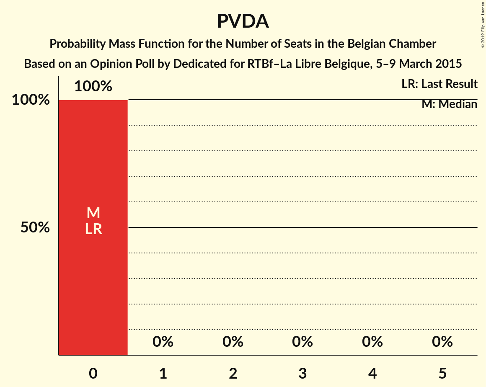

| Number of Seats | Probability | Accumulated | Special Marks |
|:---------------:|:-----------:|:-----------:|:-------------:|
| 0 | 100% | 100% | Last Result, Median |

### DéFI

*For a full overview of the results for this party, see the [DéFI](party-défi.html) page.*

| Number of Seats | Probability | Accumulated | Special Marks |
|:---------------:|:-----------:|:-----------:|:-------------:|
| 1 | 0.1% | 100% |  |
| 2 | 93% | 99.9% | Last Result, Median |
| 3 | 7% | 7% |  |
| 4 | 0% | 0% |  |

### Parti Populaire

*For a full overview of the results for this party, see the [Parti Populaire](party-partipopulaire.html) page.*

| Number of Seats | Probability | Accumulated | Special Marks |
|:---------------:|:-----------:|:-----------:|:-------------:|
| 0 | 87% | 100% | Median |
| 1 | 10% | 13% | Last Result |
| 2 | 3% | 3% |  |
| 3 | 0% | 0% |  |

### Piratenpartij

*For a full overview of the results for this party, see the [Piratenpartij](party-piratenpartij.html) page.*

| Number of Seats | Probability | Accumulated | Special Marks |
|:---------------:|:-----------:|:-----------:|:-------------:|
| 0 | 99.9% | 100% | Last Result, Median |
| 1 | 0.1% | 0.1% |  |
| 2 | 0% | 0% |  |

### Lijst Dedecker

*For a full overview of the results for this party, see the [Lijst Dedecker](party-lijstdedecker.html) page.*

| Number of Seats | Probability | Accumulated | Special Marks |
|:---------------:|:-----------:|:-----------:|:-------------:|
| 0 | 84% | 100% | Last Result, Median |
| 1 | 16% | 16% |  |
| 2 | 0.1% | 0.1% |  |
| 3 | 0% | 0% |  |

## Coalitions

### Confidence Intervals

| Coalition | Last Result | Median | Majority? | 80% Confidence Interval | 90% Confidence Interval | 95% Confidence Interval | 99% Confidence Interval |
|:---------:|:-----------:|:------:|:---------:|:-----------------------:|:-----------------------:|:-----------------------:|:-----------------------:|
| CD&V – sp.a – PS – Open Vld – MR – Groen – cdH – Ecolo | 109 | 109 | 100% | 106–112 | 105–113 | 104–114 | 103–115 |
| CD&V – sp.a – PS – Open Vld – MR – cdH | 97 | 96 | 100% | 92–100 | 91–101 | 91–102 | 89–103 |
| N-VA – CD&V – Open Vld – MR – cdH | 94 | 88 | 100% | 84–91 | 83–92 | 82–93 | 81–95 |
| sp.a – PS – Open Vld – MR – Groen – Ecolo | 82 | 84 | 99.9% | 80–87 | 79–88 | 78–89 | 77–91 |
| CD&V – PS – Open Vld – MR – cdH | 84 | 81 | 97% | 77–84 | 76–85 | 75–86 | 74–88 |
| CD&V – sp.a – PS – Groen – cdH – Ecolo – PTB – PVDA | 77 | 79 | 91% | 76–83 | 75–84 | 74–85 | 72–87 |
| N-VA – CD&V – Open Vld – MR | 85 | 78 | 81% | 74–82 | 73–83 | 73–83 | 71–85 |
| CD&V – sp.a – PS – Groen – cdH – Ecolo | 75 | 75 | 40% | 71–79 | 70–80 | 70–81 | 68–82 |
| CD&V – Open Vld – MR – Groen – cdH – Ecolo | 73 | 72 | 10% | 69–76 | 68–77 | 67–78 | 65–79 |
| sp.a – PS – Open Vld – MR | 70 | 71 | 4% | 67–74 | 66–75 | 66–76 | 64–78 |
| sp.a – PS – Groen – cdH – Ecolo – PTB – PVDA | 59 | 64 | 0% | 60–67 | 59–68 | 59–69 | 57–70 |
| CD&V – sp.a – PS – cdH | 63 | 62 | 0% | 59–66 | 58–67 | 57–68 | 56–69 |
| CD&V – Open Vld – MR – cdH | 61 | 59 | 0% | 55–63 | 54–64 | 54–65 | 52–66 |
| sp.a – PS – Groen – Ecolo – PTB – PVDA | 50 | 54 | 0% | 51–58 | 50–59 | 49–60 | 48–61 |

### CD&V – sp.a – PS – Open Vld – MR – Groen – cdH – Ecolo

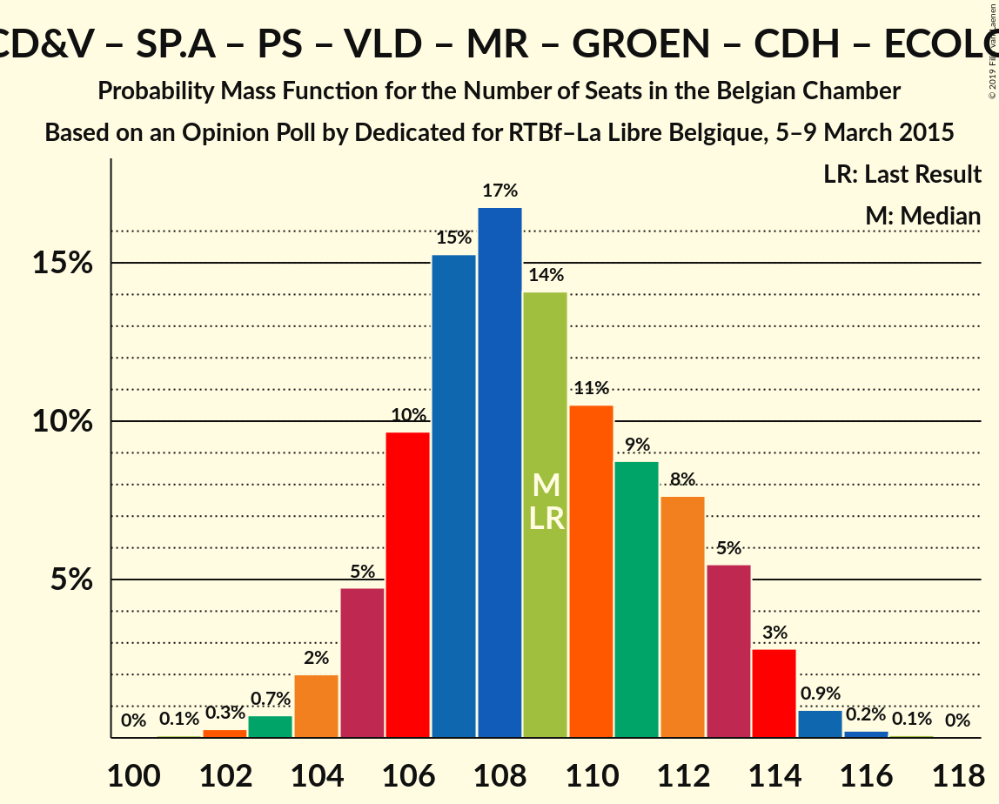

| Number of Seats | Probability | Accumulated | Special Marks |
|:---------------:|:-----------:|:-----------:|:-------------:|
| 101 | 0.1% | 100% |  |
| 102 | 0.3% | 99.9% |  |
| 103 | 0.7% | 99.6% |  |
| 104 | 2% | 98.9% |  |
| 105 | 5% | 97% |  |
| 106 | 10% | 92% |  |
| 107 | 15% | 83% |  |
| 108 | 17% | 67% | Median |
| 109 | 14% | 50% | Last Result |
| 110 | 11% | 36% |  |
| 111 | 9% | 26% |  |
| 112 | 8% | 17% |  |
| 113 | 5% | 10% |  |
| 114 | 3% | 4% |  |
| 115 | 0.9% | 1.2% |  |
| 116 | 0.2% | 0.3% |  |
| 117 | 0.1% | 0.1% |  |
| 118 | 0% | 0% |  |

### CD&V – sp.a – PS – Open Vld – MR – cdH

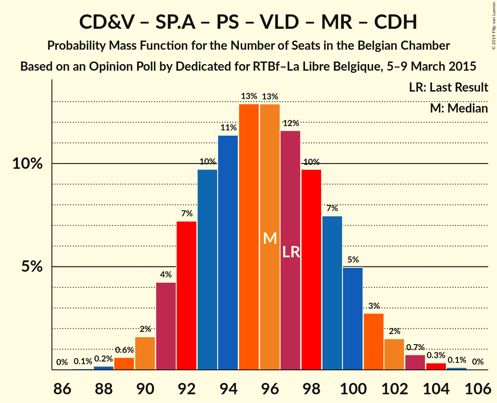

| Number of Seats | Probability | Accumulated | Special Marks |
|:---------------:|:-----------:|:-----------:|:-------------:|
| 87 | 0.1% | 100% |  |
| 88 | 0.2% | 99.9% |  |
| 89 | 0.6% | 99.8% |  |
| 90 | 2% | 99.2% |  |
| 91 | 4% | 98% |  |
| 92 | 7% | 93% |  |
| 93 | 10% | 86% |  |
| 94 | 11% | 76% |  |
| 95 | 13% | 65% | Median |
| 96 | 13% | 52% |  |
| 97 | 12% | 39% | Last Result |
| 98 | 10% | 28% |  |
| 99 | 7% | 18% |  |
| 100 | 5% | 10% |  |
| 101 | 3% | 5% |  |
| 102 | 2% | 3% |  |
| 103 | 0.7% | 1.2% |  |
| 104 | 0.3% | 0.5% |  |
| 105 | 0.1% | 0.1% |  |
| 106 | 0% | 0% |  |

### N-VA – CD&V – Open Vld – MR – cdH

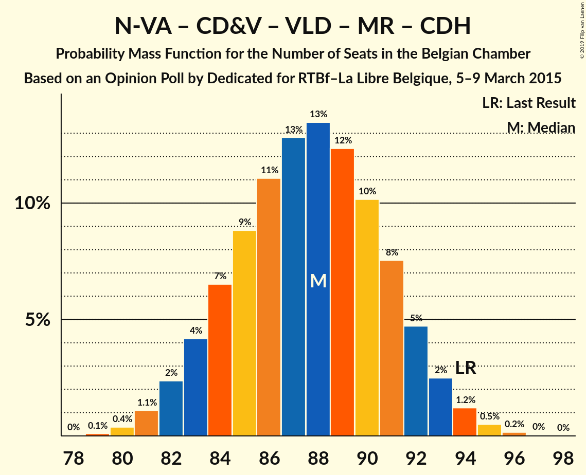

| Number of Seats | Probability | Accumulated | Special Marks |
|:---------------:|:-----------:|:-----------:|:-------------:|
| 79 | 0.1% | 100% |  |
| 80 | 0.4% | 99.9% |  |
| 81 | 1.1% | 99.5% |  |
| 82 | 2% | 98% |  |
| 83 | 4% | 96% |  |
| 84 | 7% | 92% |  |
| 85 | 9% | 85% |  |
| 86 | 11% | 77% |  |
| 87 | 13% | 65% | Median |
| 88 | 13% | 53% |  |
| 89 | 12% | 39% |  |
| 90 | 10% | 27% |  |
| 91 | 8% | 17% |  |
| 92 | 5% | 9% |  |
| 93 | 2% | 4% |  |
| 94 | 1.2% | 2% | Last Result |
| 95 | 0.5% | 0.7% |  |
| 96 | 0.2% | 0.2% |  |
| 97 | 0% | 0.1% |  |
| 98 | 0% | 0% |  |

### sp.a – PS – Open Vld – MR – Groen – Ecolo

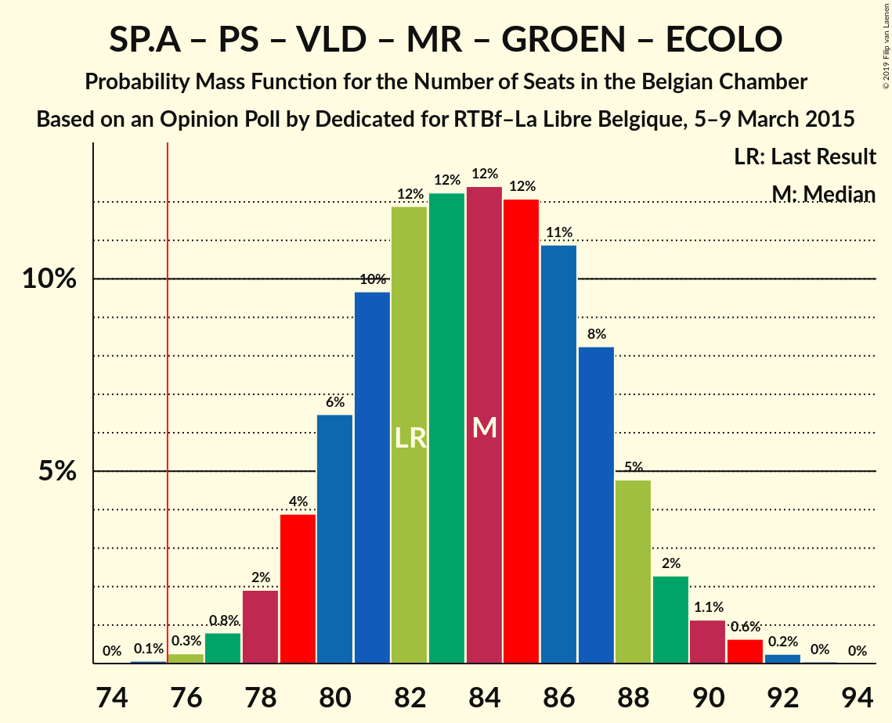

| Number of Seats | Probability | Accumulated | Special Marks |
|:---------------:|:-----------:|:-----------:|:-------------:|
| 75 | 0.1% | 100% |  |
| 76 | 0.3% | 99.9% | Majority |
| 77 | 0.8% | 99.7% |  |
| 78 | 2% | 98.9% |  |
| 79 | 4% | 97% |  |
| 80 | 6% | 93% |  |
| 81 | 10% | 87% |  |
| 82 | 12% | 77% | Last Result |
| 83 | 12% | 65% | Median |
| 84 | 12% | 53% |  |
| 85 | 12% | 40% |  |
| 86 | 11% | 28% |  |
| 87 | 8% | 17% |  |
| 88 | 5% | 9% |  |
| 89 | 2% | 4% |  |
| 90 | 1.1% | 2% |  |
| 91 | 0.6% | 0.9% |  |
| 92 | 0.2% | 0.3% |  |
| 93 | 0% | 0.1% |  |
| 94 | 0% | 0% |  |

### CD&V – PS – Open Vld – MR – cdH

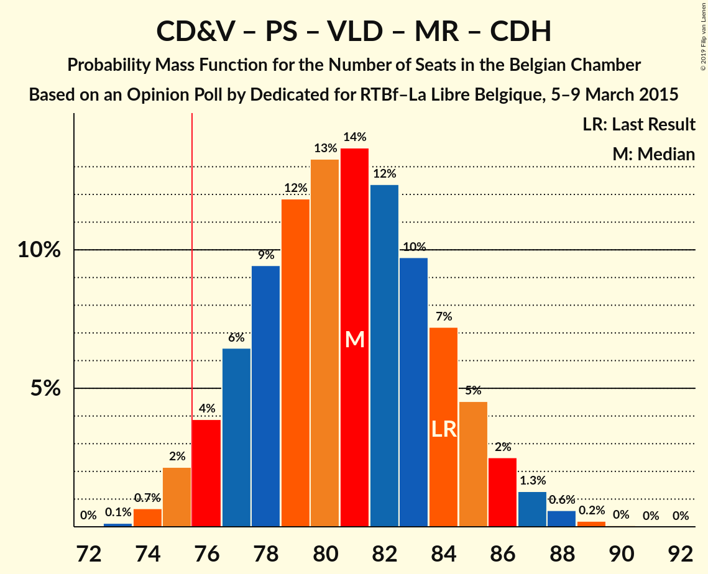

| Number of Seats | Probability | Accumulated | Special Marks |
|:---------------:|:-----------:|:-----------:|:-------------:|
| 73 | 0.1% | 100% |  |
| 74 | 0.7% | 99.8% |  |
| 75 | 2% | 99.2% |  |
| 76 | 4% | 97% | Majority |
| 77 | 6% | 93% |  |
| 78 | 9% | 87% |  |
| 79 | 12% | 77% |  |
| 80 | 13% | 65% | Median |
| 81 | 14% | 52% |  |
| 82 | 12% | 38% |  |
| 83 | 10% | 26% |  |
| 84 | 7% | 16% | Last Result |
| 85 | 5% | 9% |  |
| 86 | 2% | 5% |  |
| 87 | 1.3% | 2% |  |
| 88 | 0.6% | 0.9% |  |
| 89 | 0.2% | 0.3% |  |
| 90 | 0% | 0.1% |  |
| 91 | 0% | 0% |  |

### CD&V – sp.a – PS – Groen – cdH – Ecolo – PTB – PVDA

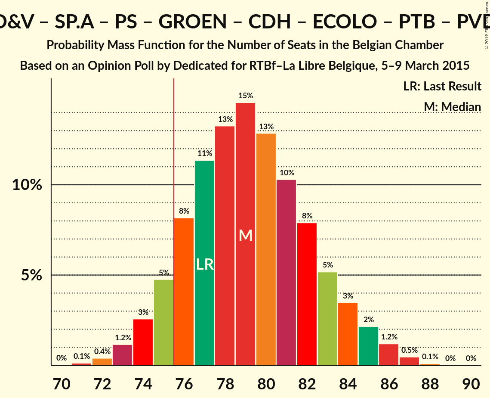

| Number of Seats | Probability | Accumulated | Special Marks |
|:---------------:|:-----------:|:-----------:|:-------------:|
| 71 | 0.1% | 100% |  |
| 72 | 0.4% | 99.8% |  |
| 73 | 1.2% | 99.4% |  |
| 74 | 3% | 98% |  |
| 75 | 5% | 96% |  |
| 76 | 8% | 91% | Majority |
| 77 | 11% | 83% | Last Result |
| 78 | 13% | 71% |  |
| 79 | 15% | 58% | Median |
| 80 | 13% | 44% |  |
| 81 | 10% | 31% |  |
| 82 | 8% | 20% |  |
| 83 | 5% | 13% |  |
| 84 | 3% | 7% |  |
| 85 | 2% | 4% |  |
| 86 | 1.2% | 2% |  |
| 87 | 0.5% | 0.6% |  |
| 88 | 0.1% | 0.1% |  |
| 89 | 0% | 0% |  |

### N-VA – CD&V – Open Vld – MR

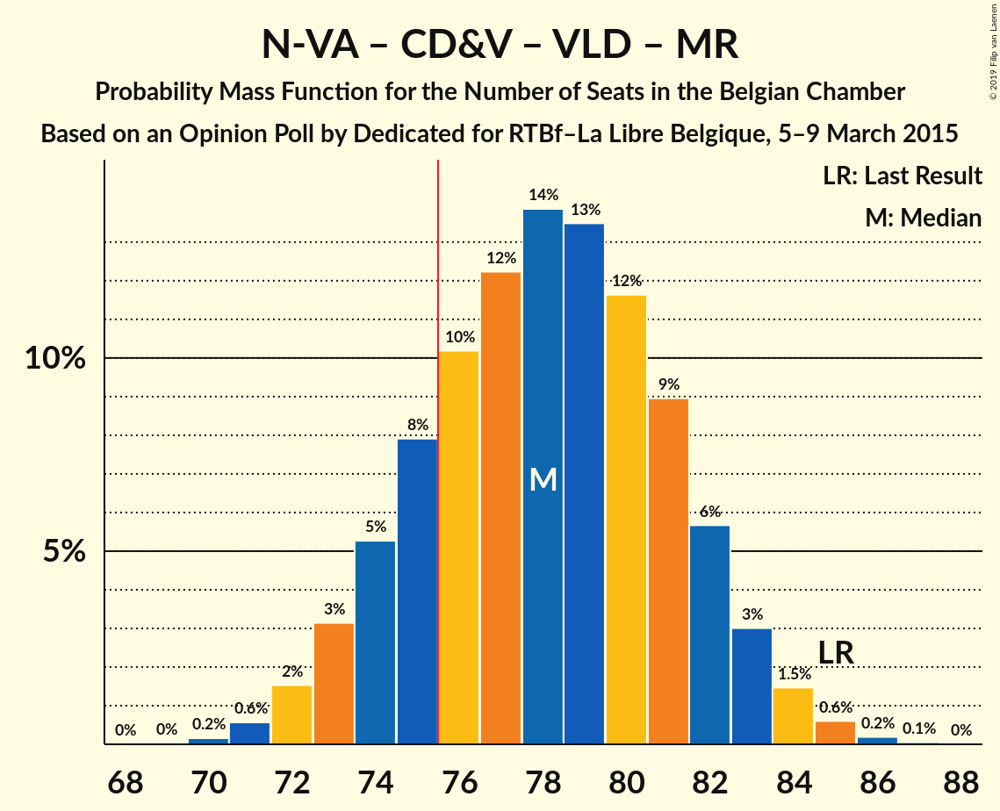

| Number of Seats | Probability | Accumulated | Special Marks |
|:---------------:|:-----------:|:-----------:|:-------------:|
| 70 | 0.2% | 100% |  |
| 71 | 0.6% | 99.8% |  |
| 72 | 2% | 99.2% |  |
| 73 | 3% | 98% |  |
| 74 | 5% | 95% |  |
| 75 | 8% | 89% |  |
| 76 | 10% | 81% | Majority |
| 77 | 12% | 71% |  |
| 78 | 14% | 59% | Median |
| 79 | 13% | 45% |  |
| 80 | 12% | 32% |  |
| 81 | 9% | 20% |  |
| 82 | 6% | 11% |  |
| 83 | 3% | 5% |  |
| 84 | 1.5% | 2% |  |
| 85 | 0.6% | 0.9% | Last Result |
| 86 | 0.2% | 0.3% |  |
| 87 | 0.1% | 0.1% |  |
| 88 | 0% | 0% |  |

### CD&V – sp.a – PS – Groen – cdH – Ecolo

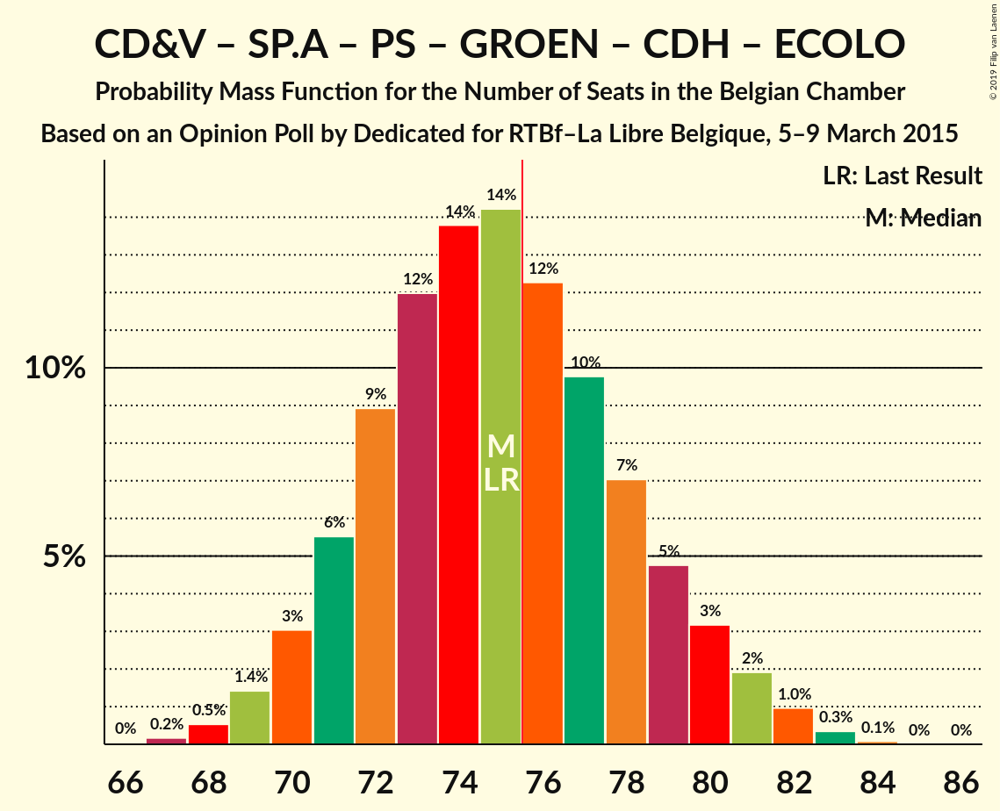

| Number of Seats | Probability | Accumulated | Special Marks |
|:---------------:|:-----------:|:-----------:|:-------------:|
| 66 | 0% | 100% |  |
| 67 | 0.2% | 99.9% |  |
| 68 | 0.5% | 99.8% |  |
| 69 | 1.4% | 99.2% |  |
| 70 | 3% | 98% |  |
| 71 | 6% | 95% |  |
| 72 | 9% | 89% |  |
| 73 | 12% | 80% |  |
| 74 | 14% | 68% |  |
| 75 | 14% | 55% | Last Result, Median |
| 76 | 12% | 40% | Majority |
| 77 | 10% | 28% |  |
| 78 | 7% | 18% |  |
| 79 | 5% | 11% |  |
| 80 | 3% | 6% |  |
| 81 | 2% | 3% |  |
| 82 | 1.0% | 1.4% |  |
| 83 | 0.3% | 0.4% |  |
| 84 | 0.1% | 0.1% |  |
| 85 | 0% | 0% |  |

### CD&V – Open Vld – MR – Groen – cdH – Ecolo

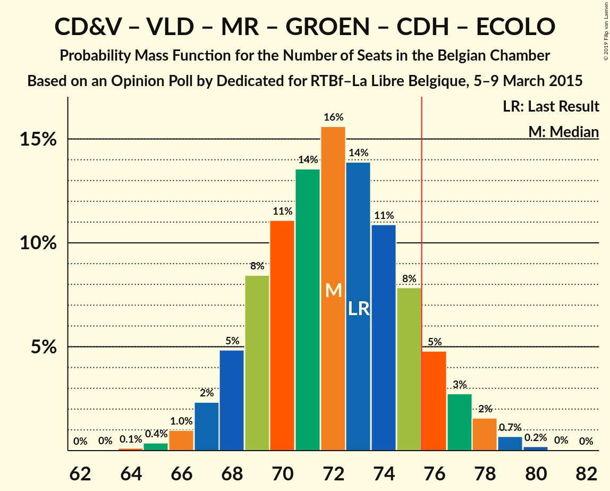

| Number of Seats | Probability | Accumulated | Special Marks |
|:---------------:|:-----------:|:-----------:|:-------------:|
| 64 | 0.1% | 100% |  |
| 65 | 0.4% | 99.8% |  |
| 66 | 1.0% | 99.5% |  |
| 67 | 2% | 98% |  |
| 68 | 5% | 96% |  |
| 69 | 8% | 91% |  |
| 70 | 11% | 83% |  |
| 71 | 14% | 72% | Median |
| 72 | 16% | 58% |  |
| 73 | 14% | 43% | Last Result |
| 74 | 11% | 29% |  |
| 75 | 8% | 18% |  |
| 76 | 5% | 10% | Majority |
| 77 | 3% | 5% |  |
| 78 | 2% | 3% |  |
| 79 | 0.7% | 0.9% |  |
| 80 | 0.2% | 0.3% |  |
| 81 | 0% | 0.1% |  |
| 82 | 0% | 0% |  |

### sp.a – PS – Open Vld – MR

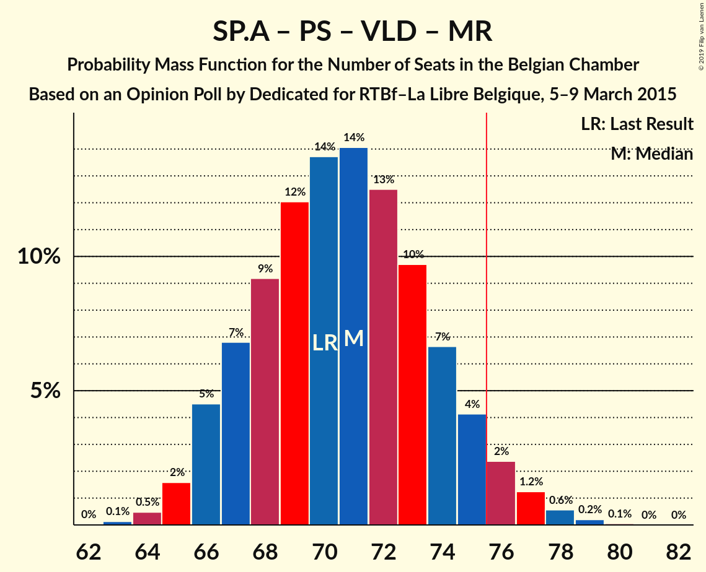

| Number of Seats | Probability | Accumulated | Special Marks |
|:---------------:|:-----------:|:-----------:|:-------------:|
| 63 | 0.1% | 100% |  |
| 64 | 0.5% | 99.8% |  |
| 65 | 2% | 99.4% |  |
| 66 | 5% | 98% |  |
| 67 | 7% | 93% |  |
| 68 | 9% | 86% |  |
| 69 | 12% | 77% |  |
| 70 | 14% | 65% | Last Result, Median |
| 71 | 14% | 52% |  |
| 72 | 13% | 37% |  |
| 73 | 10% | 25% |  |
| 74 | 7% | 15% |  |
| 75 | 4% | 9% |  |
| 76 | 2% | 4% | Majority |
| 77 | 1.2% | 2% |  |
| 78 | 0.6% | 0.8% |  |
| 79 | 0.2% | 0.3% |  |
| 80 | 0.1% | 0.1% |  |
| 81 | 0% | 0% |  |

### sp.a – PS – Groen – cdH – Ecolo – PTB – PVDA

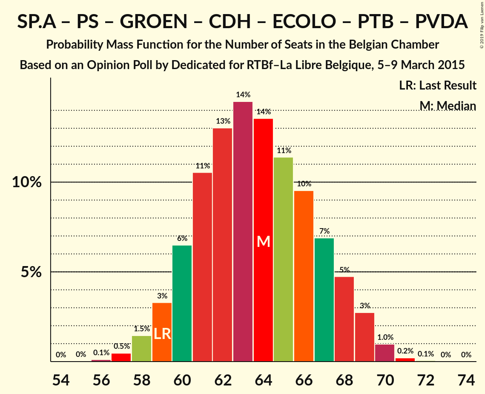

| Number of Seats | Probability | Accumulated | Special Marks |
|:---------------:|:-----------:|:-----------:|:-------------:|
| 56 | 0.1% | 100% |  |
| 57 | 0.5% | 99.9% |  |
| 58 | 1.5% | 99.4% |  |
| 59 | 3% | 98% | Last Result |
| 60 | 6% | 95% |  |
| 61 | 11% | 88% |  |
| 62 | 13% | 78% |  |
| 63 | 14% | 65% | Median |
| 64 | 14% | 50% |  |
| 65 | 11% | 37% |  |
| 66 | 10% | 25% |  |
| 67 | 7% | 16% |  |
| 68 | 5% | 9% |  |
| 69 | 3% | 4% |  |
| 70 | 1.0% | 1.3% |  |
| 71 | 0.2% | 0.3% |  |
| 72 | 0.1% | 0.1% |  |
| 73 | 0% | 0% |  |

### CD&V – sp.a – PS – cdH

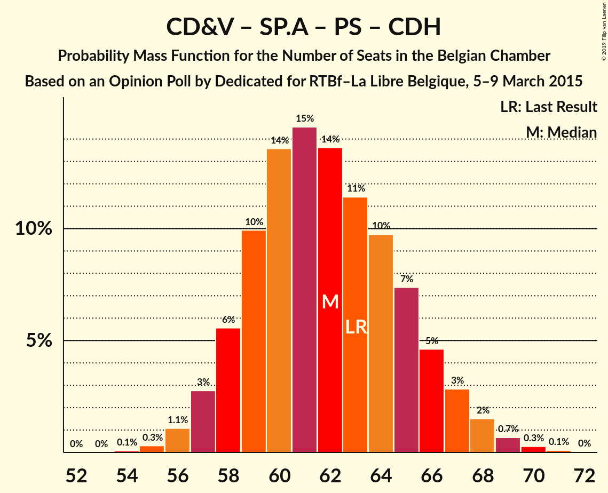

| Number of Seats | Probability | Accumulated | Special Marks |
|:---------------:|:-----------:|:-----------:|:-------------:|
| 54 | 0.1% | 100% |  |
| 55 | 0.3% | 99.9% |  |
| 56 | 1.1% | 99.6% |  |
| 57 | 3% | 98.5% |  |
| 58 | 6% | 96% |  |
| 59 | 10% | 90% |  |
| 60 | 14% | 80% |  |
| 61 | 15% | 67% |  |
| 62 | 14% | 52% | Median |
| 63 | 11% | 39% | Last Result |
| 64 | 10% | 27% |  |
| 65 | 7% | 17% |  |
| 66 | 5% | 10% |  |
| 67 | 3% | 5% |  |
| 68 | 2% | 3% |  |
| 69 | 0.7% | 1.1% |  |
| 70 | 0.3% | 0.4% |  |
| 71 | 0.1% | 0.1% |  |
| 72 | 0% | 0% |  |

### CD&V – Open Vld – MR – cdH

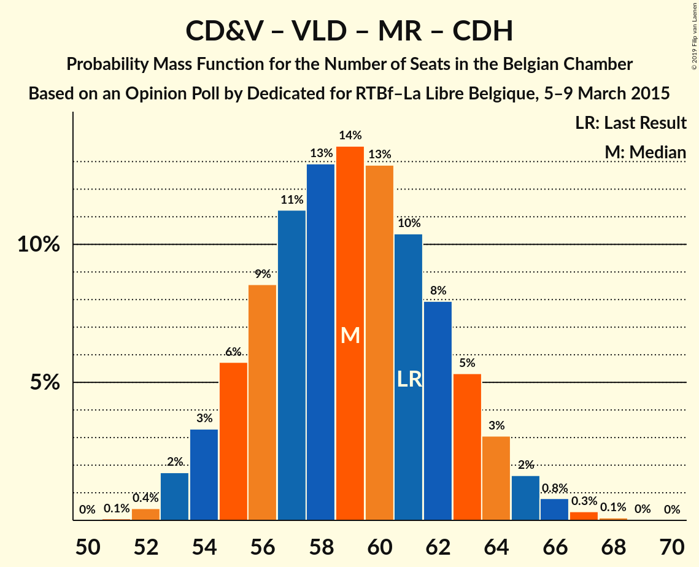

| Number of Seats | Probability | Accumulated | Special Marks |
|:---------------:|:-----------:|:-----------:|:-------------:|
| 51 | 0.1% | 100% |  |
| 52 | 0.4% | 99.9% |  |
| 53 | 2% | 99.5% |  |
| 54 | 3% | 98% |  |
| 55 | 6% | 94% |  |
| 56 | 9% | 89% |  |
| 57 | 11% | 80% |  |
| 58 | 13% | 69% | Median |
| 59 | 14% | 56% |  |
| 60 | 13% | 42% |  |
| 61 | 10% | 30% | Last Result |
| 62 | 8% | 19% |  |
| 63 | 5% | 11% |  |
| 64 | 3% | 6% |  |
| 65 | 2% | 3% |  |
| 66 | 0.8% | 1.2% |  |
| 67 | 0.3% | 0.4% |  |
| 68 | 0.1% | 0.1% |  |
| 69 | 0% | 0% |  |

### sp.a – PS – Groen – Ecolo – PTB – PVDA

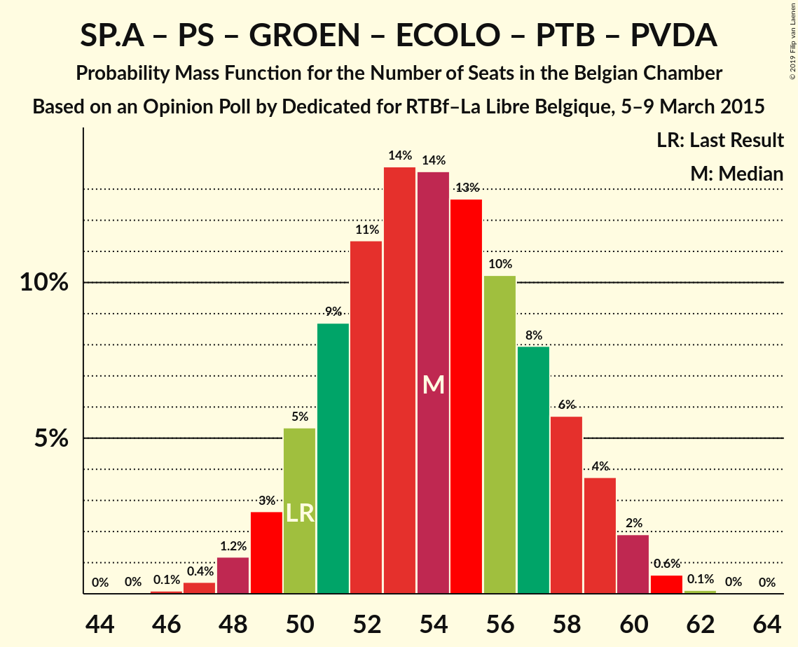

| Number of Seats | Probability | Accumulated | Special Marks |
|:---------------:|:-----------:|:-----------:|:-------------:|
| 46 | 0.1% | 100% |  |
| 47 | 0.4% | 99.9% |  |
| 48 | 1.2% | 99.5% |  |
| 49 | 3% | 98% |  |
| 50 | 5% | 96% | Last Result |
| 51 | 9% | 90% |  |
| 52 | 11% | 82% |  |
| 53 | 14% | 70% |  |
| 54 | 14% | 57% | Median |
| 55 | 13% | 43% |  |
| 56 | 10% | 30% |  |
| 57 | 8% | 20% |  |
| 58 | 6% | 12% |  |
| 59 | 4% | 6% |  |
| 60 | 2% | 3% |  |
| 61 | 0.6% | 0.8% |  |
| 62 | 0.1% | 0.2% |  |
| 63 | 0% | 0% |  |

## Technical Information

### Opinion Poll

+ **Polling firm:** Dedicated
+ **Commissioner(s):** RTBf–La Libre Belgique
+ **Fieldwork period:** 5–9 March 2015

### Calculations

+ **Sample size:** 1117
+ **Simulations done:** 2,097,152
+ **Error estimate:** 1.17%

