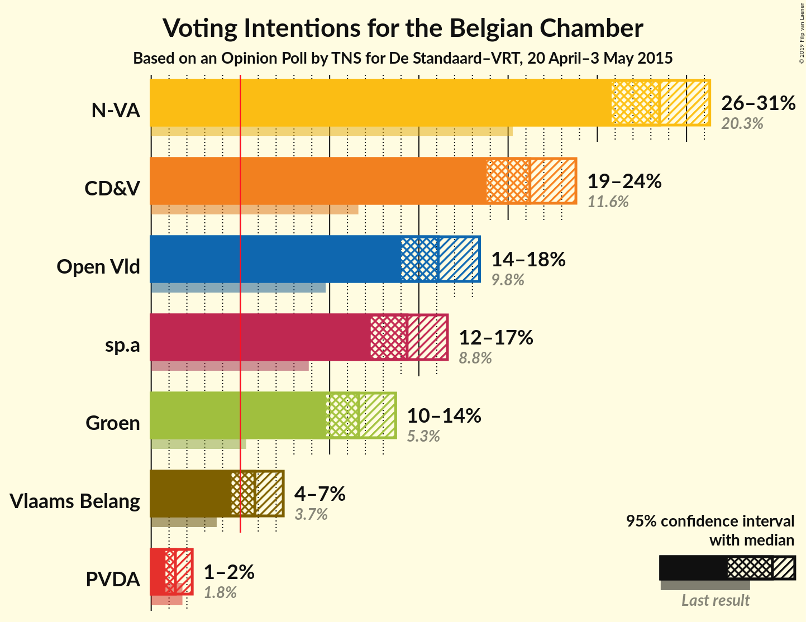
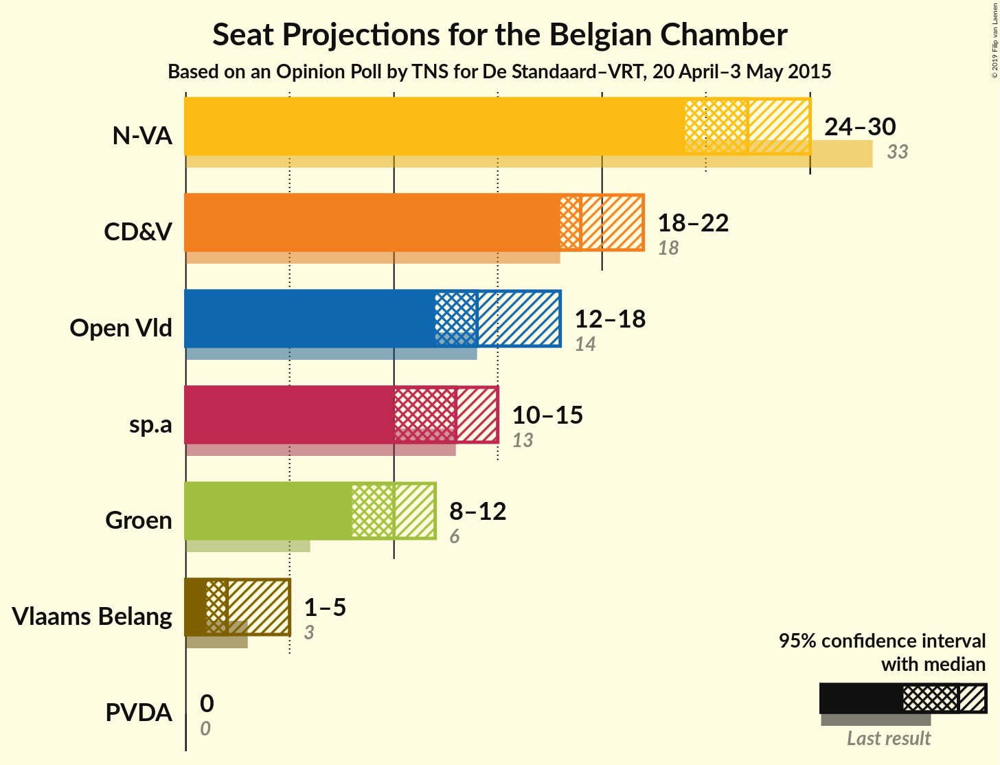
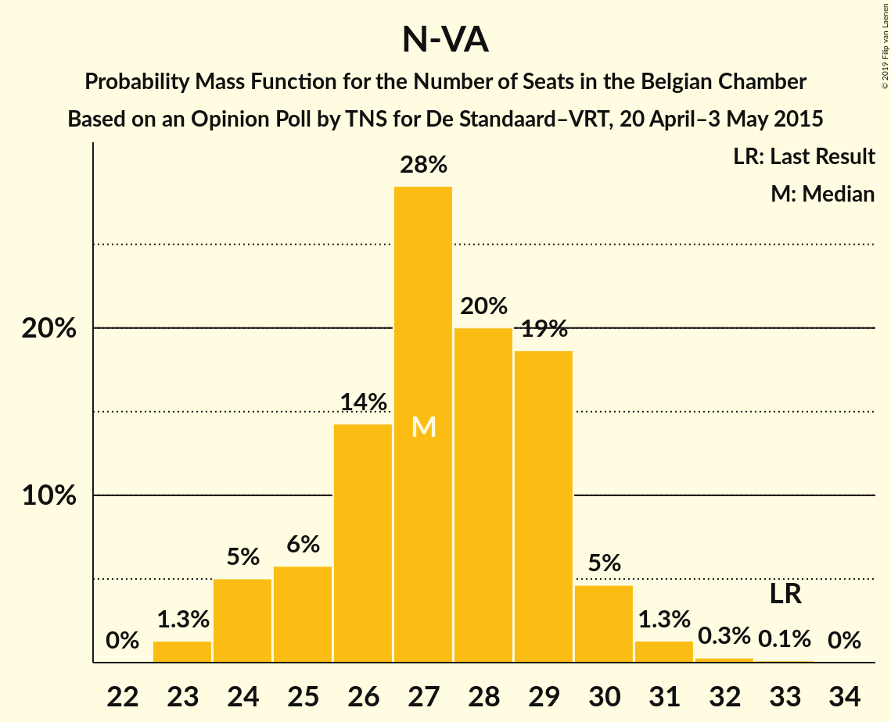
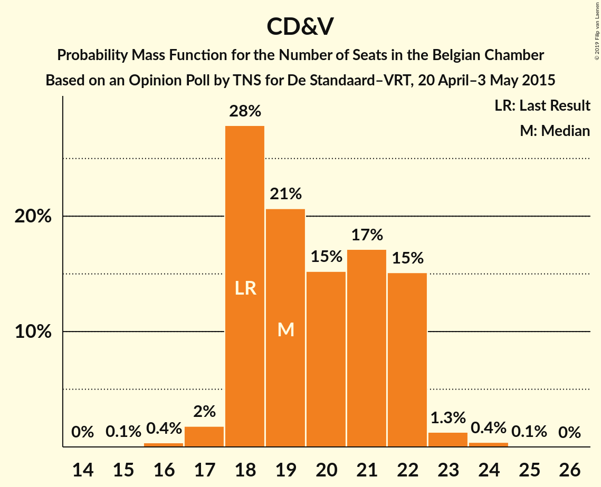
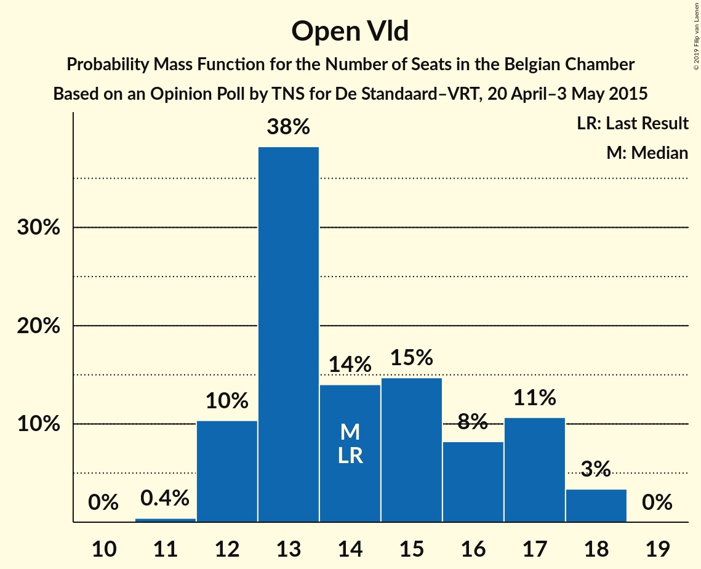
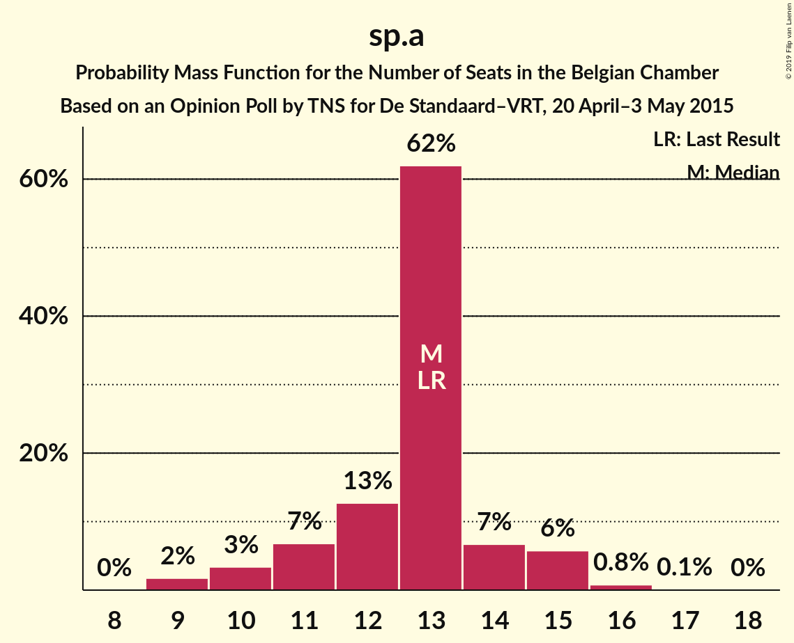
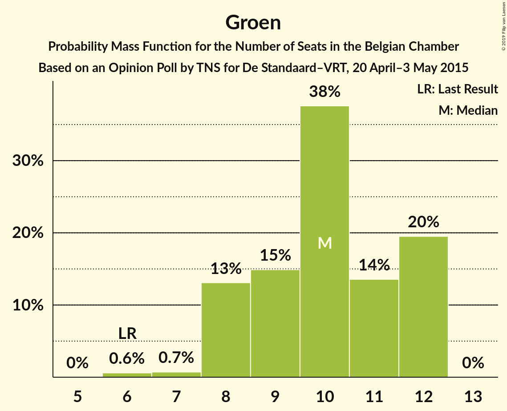
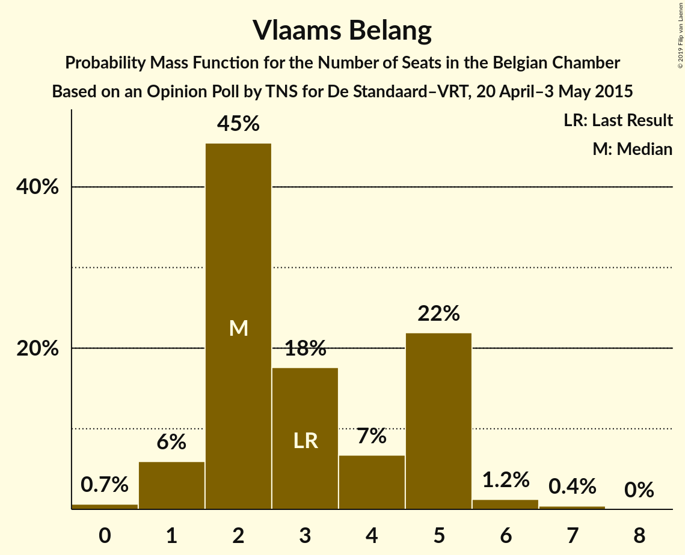
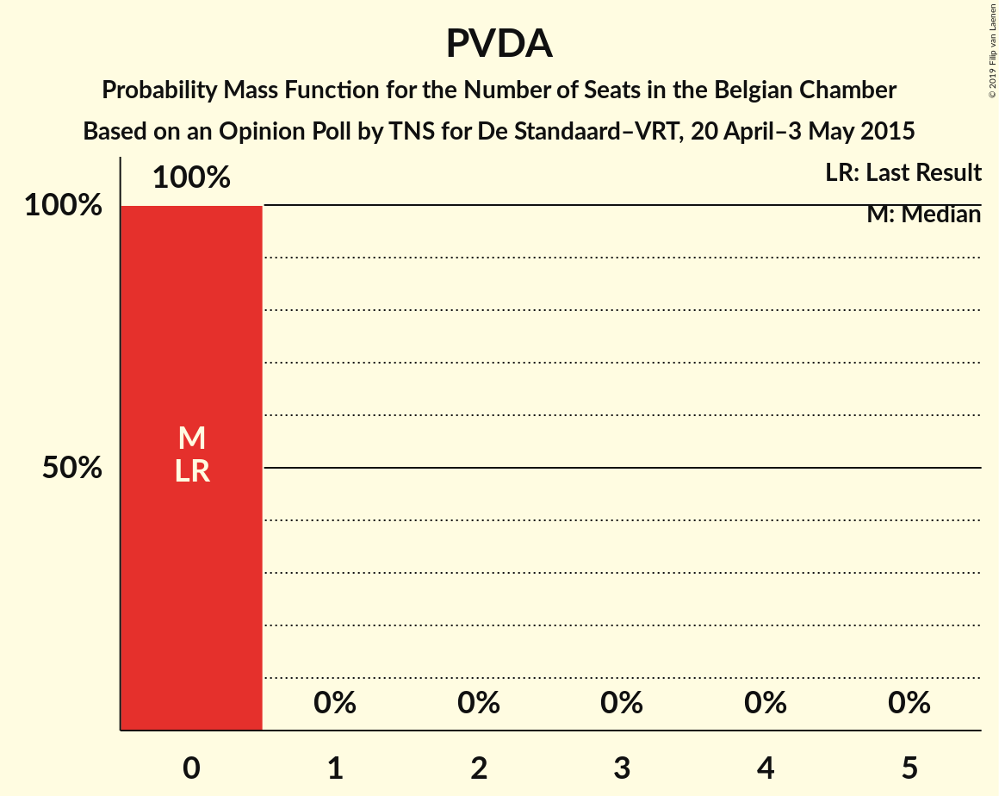
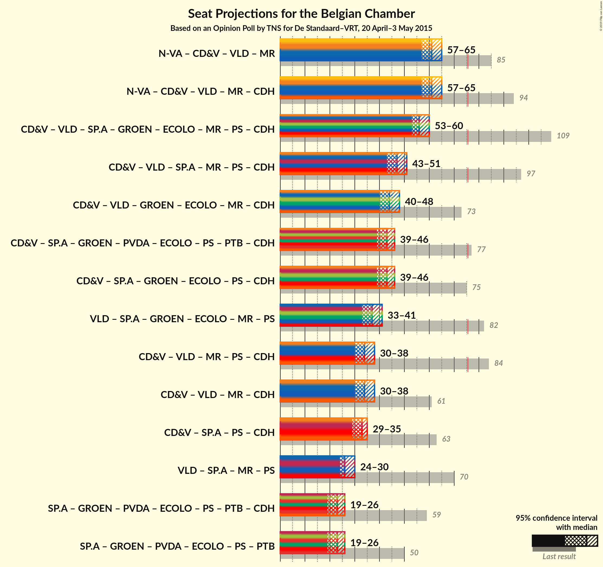

# Opinion Poll by TNS for De Standaard–VRT, 20 April–3 May 2015

Areas included: Flanders

<a href="#voting-intentions">Voting Intentions</a> | <a href="#seats">Seats</a> | <a href="#coalitions">Coalitions</a> | <a href="#technical-information">Technical Information</a>

## Voting Intentions

### Confidence Intervals

| Party | Last Result | Poll Result | 80% Confidence Interval | 90% Confidence Interval | 95% Confidence Interval | 99% Confidence Interval |
|:-----:|:-----------:|:-----------:|:-----------------------:|:-----------------------:|:-----------------------:|:-----------------------:|
| N-VA | 20.3% | 28.5% | 26.7–30.3% |26.2–30.9% |25.8–31.3% |25.0–32.2% |
| CD&V | 11.6% | 21.2% | 19.7–22.9% |19.2–23.4% |18.8–23.8% |18.1–24.7% |
| Open Vld | 9.8% | 16.1% | 14.7–17.6% |14.3–18.1% |14.0–18.4% |13.3–19.2% |
| sp.a | 8.8% | 14.3% | 13.0–15.8% |12.7–16.2% |12.3–16.6% |11.7–17.4% |
| Groen | 5.3% | 11.6% | 10.4–13.0% |10.1–13.4% |9.8–13.7% |9.3–14.4% |
| Vlaams Belang | 3.7% | 5.8% | 5.0–6.9% |4.7–7.2% |4.5–7.4% |4.2–7.9% |
| PVDA | 1.8% | 1.4% | 1.0–1.9% |0.9–2.1% |0.8–2.3% |0.7–2.6% |

*Note:* The poll result column reflects the actual value used in the calculations. Published results may vary slightly, and in addition be rounded to fewer digits.

## Seats

### Confidence Intervals

| Party | Last Result | Median | 80% Confidence Interval | 90% Confidence Interval | 95% Confidence Interval | 99% Confidence Interval |
|:-----:|:-----------:|:------:|:-----------------------:|:-----------------------:|:-----------------------:|:-----------------------:|
| <a href="#n-va">N-VA</a> | 33 | 27 | 25–29 |24–30 |24–30 |23–31 |
| <a href="#cd&v">CD&V</a> | 18 | 19 | 18–22 |18–22 |18–22 |17–23 |
| <a href="#open-vld">Open Vld</a> | 14 | 14 | 12–17 |12–17 |12–18 |12–18 |
| <a href="#sp.a">sp.a</a> | 13 | 13 | 11–14 |10–15 |10–15 |9–16 |
| <a href="#groen">Groen</a> | 6 | 10 | 8–12 |8–12 |8–12 |6–12 |
| <a href="#vlaams-belang">Vlaams Belang</a> | 3 | 2 | 2–5 |1–5 |1–5 |0–6 |
| <a href="#pvda">PVDA</a> | 0 | 0 | 0 |0 |0 |0 |

### N-VA

*For a full overview of the results for this party, see the [N-VA](party-n-va.html) page.*

| Number of Seats | Probability | Accumulated | Special Marks |
|:---------------:|:-----------:|:-----------:|:-------------:|
| 23 | 1.3% | 100% |  |
| 24 | 5% | 98.7% |  |
| 25 | 6% | 94% |  |
| 26 | 14% | 88% |  |
| 27 | 28% | 74% | Median |
| 28 | 20% | 45% |  |
| 29 | 19% | 25% |  |
| 30 | 5% | 6% |  |
| 31 | 1.3% | 2% |  |
| 32 | 0.3% | 0.4% |  |
| 33 | 0.1% | 0.2% | Last Result |
| 34 | 0% | 0% |  |

### CD&V

*For a full overview of the results for this party, see the [CD&V](party-cdv.html) page.*

| Number of Seats | Probability | Accumulated | Special Marks |
|:---------------:|:-----------:|:-----------:|:-------------:|
| 15 | 0.1% | 100% |  |
| 16 | 0.4% | 99.9% |  |
| 17 | 2% | 99.5% |  |
| 18 | 28% | 98% | Last Result |
| 19 | 21% | 70% | Median |
| 20 | 15% | 49% |  |
| 21 | 17% | 34% |  |
| 22 | 15% | 17% |  |
| 23 | 1.3% | 2% |  |
| 24 | 0.4% | 0.5% |  |
| 25 | 0.1% | 0.1% |  |
| 26 | 0% | 0% |  |

### Open Vld

*For a full overview of the results for this party, see the [Open Vld](party-openvld.html) page.*

| Number of Seats | Probability | Accumulated | Special Marks |
|:---------------:|:-----------:|:-----------:|:-------------:|
| 11 | 0.4% | 100% |  |
| 12 | 10% | 99.6% |  |
| 13 | 38% | 89% |  |
| 14 | 14% | 51% | Last Result, Median |
| 15 | 15% | 37% |  |
| 16 | 8% | 22% |  |
| 17 | 11% | 14% |  |
| 18 | 3% | 3% |  |
| 19 | 0% | 0% |  |

### sp.a

*For a full overview of the results for this party, see the [sp.a](party-spa.html) page.*

| Number of Seats | Probability | Accumulated | Special Marks |
|:---------------:|:-----------:|:-----------:|:-------------:|
| 9 | 2% | 100% |  |
| 10 | 3% | 98% |  |
| 11 | 7% | 95% |  |
| 12 | 13% | 88% |  |
| 13 | 62% | 75% | Last Result, Median |
| 14 | 7% | 13% |  |
| 15 | 6% | 7% |  |
| 16 | 0.8% | 0.9% |  |
| 17 | 0.1% | 0.1% |  |
| 18 | 0% | 0% |  |

### Groen

*For a full overview of the results for this party, see the [Groen](party-groen.html) page.*

| Number of Seats | Probability | Accumulated | Special Marks |
|:---------------:|:-----------:|:-----------:|:-------------:|
| 6 | 0.6% | 100% | Last Result |
| 7 | 0.7% | 99.4% |  |
| 8 | 13% | 98.7% |  |
| 9 | 15% | 86% |  |
| 10 | 38% | 71% | Median |
| 11 | 14% | 33% |  |
| 12 | 20% | 20% |  |
| 13 | 0% | 0% |  |

### Vlaams Belang

*For a full overview of the results for this party, see the [Vlaams Belang](party-vlaamsbelang.html) page.*

| Number of Seats | Probability | Accumulated | Special Marks |
|:---------------:|:-----------:|:-----------:|:-------------:|
| 0 | 0.7% | 100% |  |
| 1 | 6% | 99.3% |  |
| 2 | 45% | 93% | Median |
| 3 | 18% | 48% | Last Result |
| 4 | 7% | 30% |  |
| 5 | 22% | 24% |  |
| 6 | 1.2% | 2% |  |
| 7 | 0.4% | 0.4% |  |
| 8 | 0% | 0% |  |

### PVDA

*For a full overview of the results for this party, see the [PVDA](party-pvda.html) page.*

| Number of Seats | Probability | Accumulated | Special Marks |
|:---------------:|:-----------:|:-----------:|:-------------:|
| 0 | 100% | 100% | Last Result, Median |

## Coalitions

### Confidence Intervals

| Coalition | Last Result | Median | Majority? | 80% Confidence Interval | 90% Confidence Interval | 95% Confidence Interval | 99% Confidence Interval |
|:---------:|:-----------:|:------:|:---------:|:-----------------------:|:-----------------------:|:-----------------------:|:-----------------------:|

## Technical Information

### Opinion Poll

+ **Polling firm:** TNS
+ **Commissioner(s):** De Standaard–VRT
+ **Fieldwork period:** 20 April–3 May 2015

### Calculations

+ **Sample size:** 1032
+ **Simulations done:** 2,097,152
+ **Error estimate:** 0.70%

