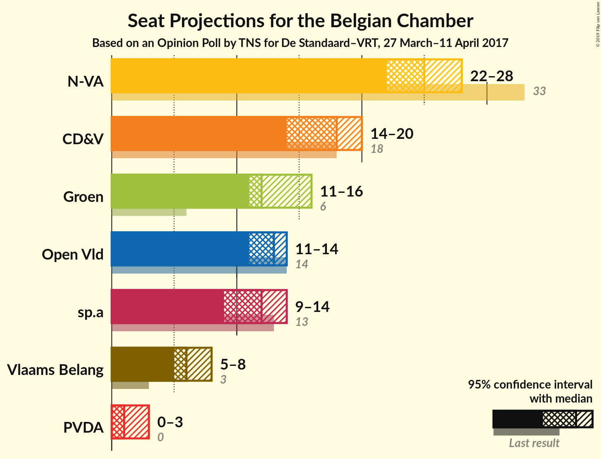
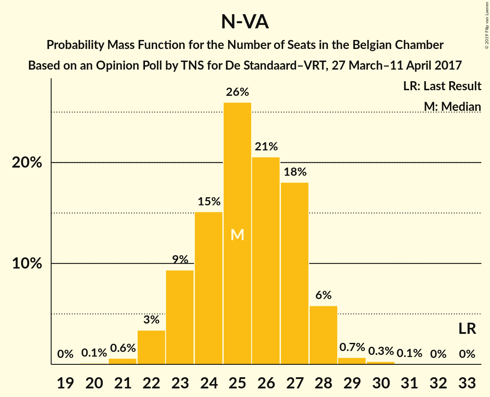
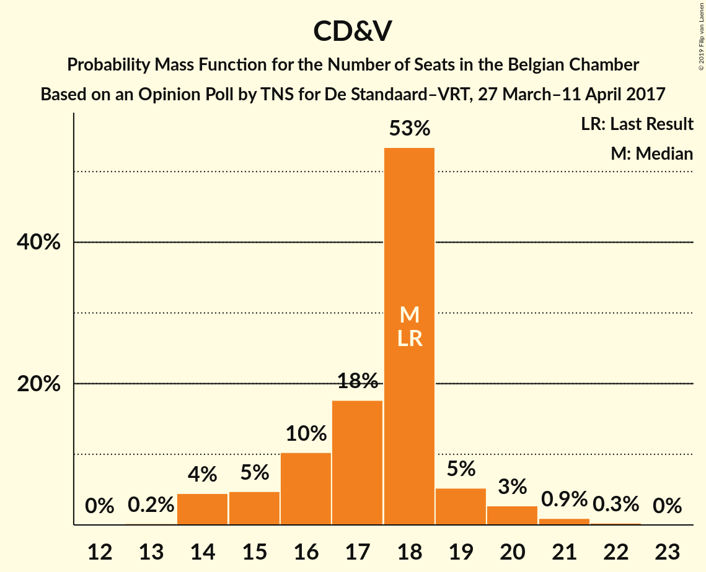
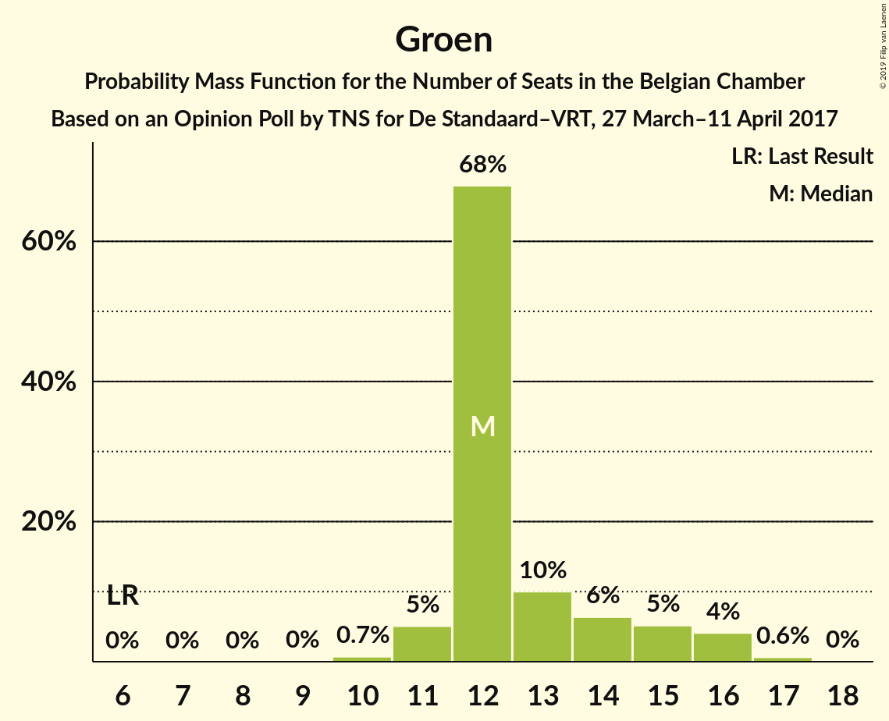
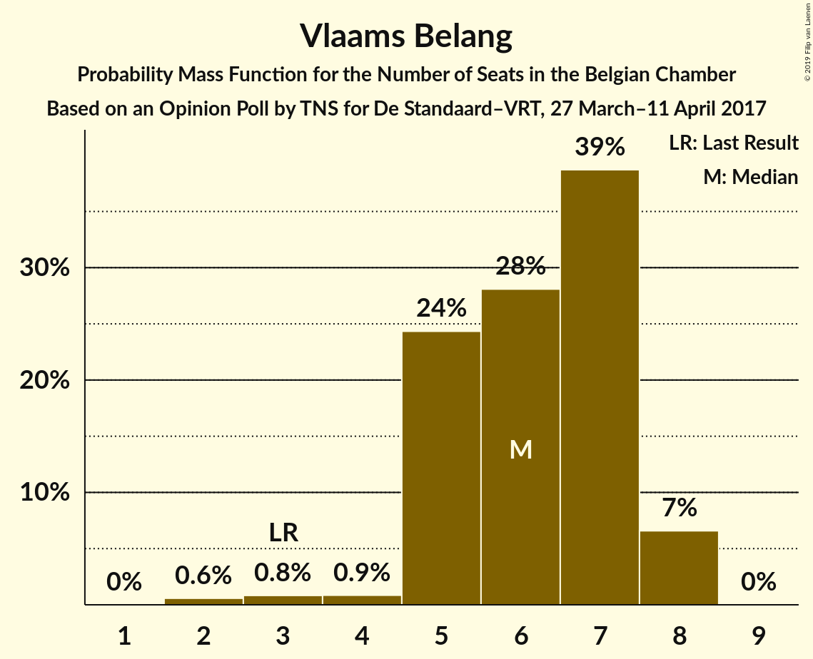

# Opinion Poll by TNS for De Standaard–VRT, 27 March–11 April 2017

Areas included: Flanders

<a href="#voting-intentions">Voting Intentions</a> | <a href="#seats">Seats</a> | <a href="#coalitions">Coalitions</a> | <a href="#technical-information">Technical Information</a>

## Voting Intentions

### Confidence Intervals

| Party | Last Result | Poll Result | 80% Confidence Interval | 90% Confidence Interval | 95% Confidence Interval | 99% Confidence Interval |
|:-----:|:-----------:|:-----------:|:-----------------------:|:-----------------------:|:-----------------------:|:-----------------------:|
| N-VA | 20.3% | 26.3% | 24.6–28.1% |24.1–28.6% |23.7–29.1% |22.9–30.0% |
| CD&V | 11.6% | 18.6% | 17.2–20.3% |16.7–20.7% |16.4–21.1% |15.7–21.9% |
| Groen | 5.3% | 14.7% | 13.3–16.1% |12.9–16.6% |12.6–17.0% |12.0–17.7% |
| Open Vld | 9.8% | 14.4% | 13.1–15.9% |12.7–16.3% |12.4–16.7% |11.8–17.4% |
| sp.a | 8.8% | 13.2% | 11.9–14.6% |11.6–15.1% |11.3–15.4% |10.7–16.1% |
| Vlaams Belang | 3.7% | 7.8% | 6.8–8.9% |6.5–9.3% |6.3–9.6% |5.8–10.2% |
| PVDA | 1.8% | 4.2% | 3.5–5.1% |3.3–5.3% |3.1–5.6% |2.8–6.0% |

*Note:* The poll result column reflects the actual value used in the calculations. Published results may vary slightly, and in addition be rounded to fewer digits.

## Seats

### Confidence Intervals

| Party | Last Result | Median | 80% Confidence Interval | 90% Confidence Interval | 95% Confidence Interval | 99% Confidence Interval |
|:-----:|:-----------:|:------:|:-----------------------:|:-----------------------:|:-----------------------:|:-----------------------:|
| <a href="#n-va">N-VA</a> | 33 | 25 | 23–27 |23–28 |22–28 |21–29 |
| <a href="#cd&v">CD&V</a> | 18 | 18 | 16–18 |15–19 |14–20 |14–21 |
| <a href="#groen">Groen</a> | 6 | 12 | 12–14 |11–15 |11–16 |10–17 |
| <a href="#open-vld">Open Vld</a> | 14 | 13 | 11–14 |11–14 |11–14 |11–17 |
| <a href="#sp.a">sp.a</a> | 13 | 12 | 10–13 |9–14 |9–14 |9–15 |
| <a href="#vlaams-belang">Vlaams Belang</a> | 3 | 6 | 5–7 |5–8 |5–8 |2–8 |
| <a href="#pvda">PVDA</a> | 0 | 1 | 1–2 |0–2 |0–3 |0–3 |

### N-VA

*For a full overview of the results for this party, see the [N-VA](party-n-va.html) page.*

| Number of Seats | Probability | Accumulated | Special Marks |
|:---------------:|:-----------:|:-----------:|:-------------:|
| 20 | 0.1% | 100% |  |
| 21 | 0.6% | 99.9% |  |
| 22 | 3% | 99.3% |  |
| 23 | 9% | 96% |  |
| 24 | 15% | 87% |  |
| 25 | 26% | 71% | Median |
| 26 | 21% | 45% |  |
| 27 | 18% | 25% |  |
| 28 | 6% | 7% |  |
| 29 | 0.7% | 1.0% |  |
| 30 | 0.3% | 0.4% |  |
| 31 | 0.1% | 0.1% |  |
| 32 | 0% | 0% |  |
| 33 | 0% | 0% | Last Result |

### CD&V

*For a full overview of the results for this party, see the [CD&V](party-cdv.html) page.*

| Number of Seats | Probability | Accumulated | Special Marks |
|:---------------:|:-----------:|:-----------:|:-------------:|
| 13 | 0.2% | 100% |  |
| 14 | 4% | 99.8% |  |
| 15 | 5% | 95% |  |
| 16 | 10% | 91% |  |
| 17 | 18% | 80% |  |
| 18 | 53% | 63% | Last Result, Median |
| 19 | 5% | 9% |  |
| 20 | 3% | 4% |  |
| 21 | 0.9% | 1.2% |  |
| 22 | 0.3% | 0.3% |  |
| 23 | 0% | 0% |  |

### Groen

*For a full overview of the results for this party, see the [Groen](party-groen.html) page.*

| Number of Seats | Probability | Accumulated | Special Marks |
|:---------------:|:-----------:|:-----------:|:-------------:|
| 6 | 0% | 100% | Last Result |
| 7 | 0% | 100% |  |
| 8 | 0% | 100% |  |
| 9 | 0% | 100% |  |
| 10 | 0.7% | 100% |  |
| 11 | 5% | 99.3% |  |
| 12 | 68% | 94% | Median |
| 13 | 10% | 26% |  |
| 14 | 6% | 16% |  |
| 15 | 5% | 10% |  |
| 16 | 4% | 5% |  |
| 17 | 0.6% | 0.6% |  |
| 18 | 0% | 0% |  |

### Open Vld

*For a full overview of the results for this party, see the [Open Vld](party-openvld.html) page.*

| Number of Seats | Probability | Accumulated | Special Marks |
|:---------------:|:-----------:|:-----------:|:-------------:|
| 10 | 0.1% | 100% |  |
| 11 | 16% | 99.9% |  |
| 12 | 24% | 84% |  |
| 13 | 47% | 61% | Median |
| 14 | 12% | 14% | Last Result |
| 15 | 1.0% | 2% |  |
| 16 | 0.5% | 1.3% |  |
| 17 | 0.6% | 0.8% |  |
| 18 | 0.2% | 0.2% |  |
| 19 | 0% | 0% |  |

### sp.a

*For a full overview of the results for this party, see the [sp.a](party-spa.html) page.*

| Number of Seats | Probability | Accumulated | Special Marks |
|:---------------:|:-----------:|:-----------:|:-------------:|
| 8 | 0.1% | 100% |  |
| 9 | 7% | 99.9% |  |
| 10 | 20% | 93% |  |
| 11 | 21% | 73% |  |
| 12 | 16% | 52% | Median |
| 13 | 29% | 37% | Last Result |
| 14 | 7% | 7% |  |
| 15 | 0.6% | 0.6% |  |
| 16 | 0% | 0% |  |

### Vlaams Belang

*For a full overview of the results for this party, see the [Vlaams Belang](party-vlaamsbelang.html) page.*

| Number of Seats | Probability | Accumulated | Special Marks |
|:---------------:|:-----------:|:-----------:|:-------------:|
| 2 | 0.6% | 100% |  |
| 3 | 0.8% | 99.4% | Last Result |
| 4 | 0.9% | 98.6% |  |
| 5 | 24% | 98% |  |
| 6 | 28% | 73% | Median |
| 7 | 39% | 45% |  |
| 8 | 7% | 7% |  |
| 9 | 0% | 0% |  |

### PVDA

*For a full overview of the results for this party, see the [PVDA](party-pvda.html) page.*

| Number of Seats | Probability | Accumulated | Special Marks |
|:---------------:|:-----------:|:-----------:|:-------------:|
| 0 | 5% | 100% | Last Result |
| 1 | 68% | 95% | Median |
| 2 | 22% | 27% |  |
| 3 | 5% | 5% |  |
| 4 | 0% | 0% |  |

## Coalitions

### Confidence Intervals

| Coalition | Last Result | Median | Majority? | 80% Confidence Interval | 90% Confidence Interval | 95% Confidence Interval | 99% Confidence Interval |
|:---------:|:-----------:|:------:|:---------:|:-----------------------:|:-----------------------:|:-----------------------:|:-----------------------:|

## Technical Information

### Opinion Poll

+ **Polling firm:** TNS
+ **Commissioner(s):** De Standaard–VRT
+ **Fieldwork period:** 27 March–11 April 2017

### Calculations

+ **Sample size:** 1030
+ **Simulations done:** 1,048,576
+ **Error estimate:** 1.45%

