# Opinion Poll by TNS for De Standaard–VRT–RTBf–La Libre Belgique, 26 February–17 March 2018

Areas included: Brussels, Flanders, Wallonia

<a href="#voting-intentions">Voting Intentions</a> | <a href="#seats">Seats</a> | <a href="#coalitions">Coalitions</a> | <a href="#technical-information">Technical Information</a>

## Voting Intentions

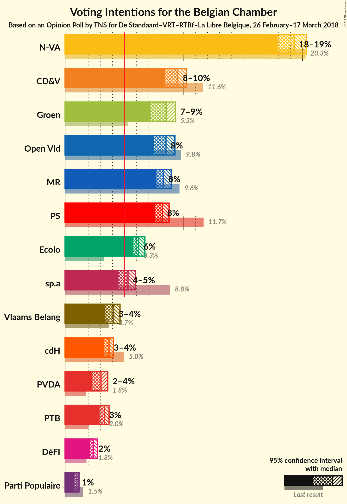

### Confidence Intervals

| Party | Last Result | Poll Result | 80% Confidence Interval | 90% Confidence Interval | 95% Confidence Interval | 99% Confidence Interval |
|:-----:|:-----------:|:-----------:|:-----------------------:|:-----------------------:|:-----------------------:|:-----------------------:|
| N-VA | 20.3% | 20.4% | 18.4–19.3% |18.1–19.3% |17.9–19.3% |17.5–19.4% |
| CD&V | 11.6% | 10.2% | 8.7–9.4% |8.6–9.5% |8.4–9.5% |8.1–9.5% |
| Open Vld | 9.8% | 9.3% | 7.8–8.5% |7.7–8.5% |7.5–8.5% |7.2–8.5% |
| MR | 9.6% | 8.9% | 7.9–8.3% |7.8–8.3% |7.7–8.3% |7.6–8.3% |
| PS | 11.7% | 8.8% | 7.8–8.1% |7.7–8.2% |7.6–8.2% |7.4–8.2% |
| Groen | 5.3% | 8.5% | 7.7–9.1% |7.4–9.3% |7.2–9.3% |6.9–9.4% |
| Ecolo | 3.3% | 6.7% | 5.9–6.2% |5.8–6.2% |5.7–6.2% |5.5–6.2% |
| sp.a | 8.8% | 5.9% | 4.8–5.3% |4.6–5.3% |4.5–5.3% |4.3–5.3% |
| Vlaams Belang | 3.7% | 4.6% | 3.6–4.1% |3.5–4.1% |3.4–4.1% |3.2–4.1% |
| cdH | 5.0% | 4.1% | 3.4–3.7% |3.3–3.7% |3.3–3.7% |3.1–3.7% |
| PTB | 2.0% | 3.7% | 3.0–3.3% |3.0–3.3% |2.9–3.3% |2.8–3.3% |
| PVDA | 1.8% | 3.0% | 2.5–3.5% |2.4–3.5% |2.3–3.6% |2.1–3.6% |
| DéFI | 1.8% | 2.7% | 2.2–2.4% |2.1–2.4% |2.1–2.4% |2.0–2.4% |
| Parti Populaire | 1.5% | 1.2% | 0.8–1.0% |0.8–1.0% |0.8–1.0% |0.7–1.0% |

*Note:* The poll result column reflects the actual value used in the calculations. Published results may vary slightly, and in addition be rounded to fewer digits.

## Seats

### Confidence Intervals

| Party | Last Result | Median | 80% Confidence Interval | 90% Confidence Interval | 95% Confidence Interval | 99% Confidence Interval |
|:-----:|:-----------:|:------:|:-----------------------:|:-----------------------:|:-----------------------:|:-----------------------:|
| <a href="#n-va">N-VA</a> | 33 | 31 | 29–33 |29–34 |28–34 |28–36 |
| <a href="#cd&v">CD&V</a> | 18 | 15 | 13–18 |13–18 |13–18 |13–18 |
| <a href="#open-vld">Open Vld</a> | 14 | 13 | 12–15 |12–16 |11–16 |11–17 |
| <a href="#mr">MR</a> | 20 | 17 | 16–19 |16–19 |15–19 |15–20 |
| <a href="#ps">PS</a> | 23 | 18 | 16–19 |16–20 |15–20 |15–20 |
| <a href="#groen">Groen</a> | 6 | 12 | 11–13 |11–13 |11–14 |10–15 |
| <a href="#ecolo">Ecolo</a> | 6 | 13 | 11–15 |11–15 |11–15 |10–16 |
| <a href="#sp.a">sp.a</a> | 13 | 8 | 6–9 |6–9 |6–10 |5–10 |
| <a href="#vlaams-belang">Vlaams Belang</a> | 3 | 6 | 5–7 |4–7 |3–7 |2–8 |
| <a href="#cdh">cdH</a> | 9 | 7 | 5–8 |5–8 |5–9 |4–9 |
| <a href="#ptb">PTB</a> | 2 | 5 | 5–7 |4–7 |4–8 |4–8 |
| <a href="#pvda">PVDA</a> | 0 | 2 | 1–3 |1–3 |1–3 |1–4 |
| <a href="#défi">DéFI</a> | 2 | 2 | 2–5 |2–5 |2–5 |2–5 |
| <a href="#parti-populaire">Parti Populaire</a> | 1 | 0 | 0 |0 |0 |0–2 |

### N-VA

*For a full overview of the results for this party, see the [N-VA](party-n-va.html) page.*

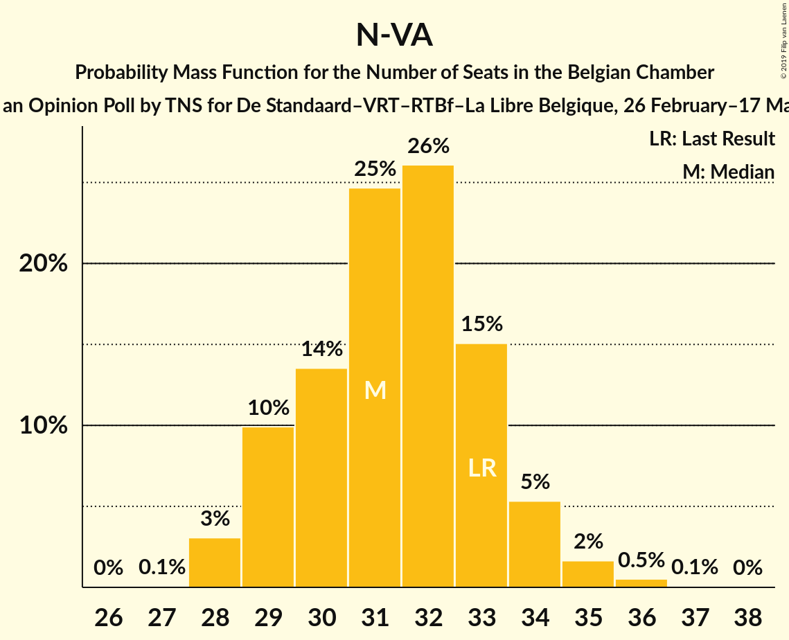

| Number of Seats | Probability | Accumulated | Special Marks |
|:---------------:|:-----------:|:-----------:|:-------------:|
| 27 | 0.1% | 100% |  |
| 28 | 3% | 99.9% |  |
| 29 | 10% | 97% |  |
| 30 | 14% | 87% |  |
| 31 | 25% | 73% | Median |
| 32 | 26% | 49% |  |
| 33 | 15% | 23% | Last Result |
| 34 | 5% | 8% |  |
| 35 | 2% | 2% |  |
| 36 | 0.5% | 0.6% |  |
| 37 | 0.1% | 0.1% |  |
| 38 | 0% | 0% |  |

### CD&V

*For a full overview of the results for this party, see the [CD&V](party-cdv.html) page.*

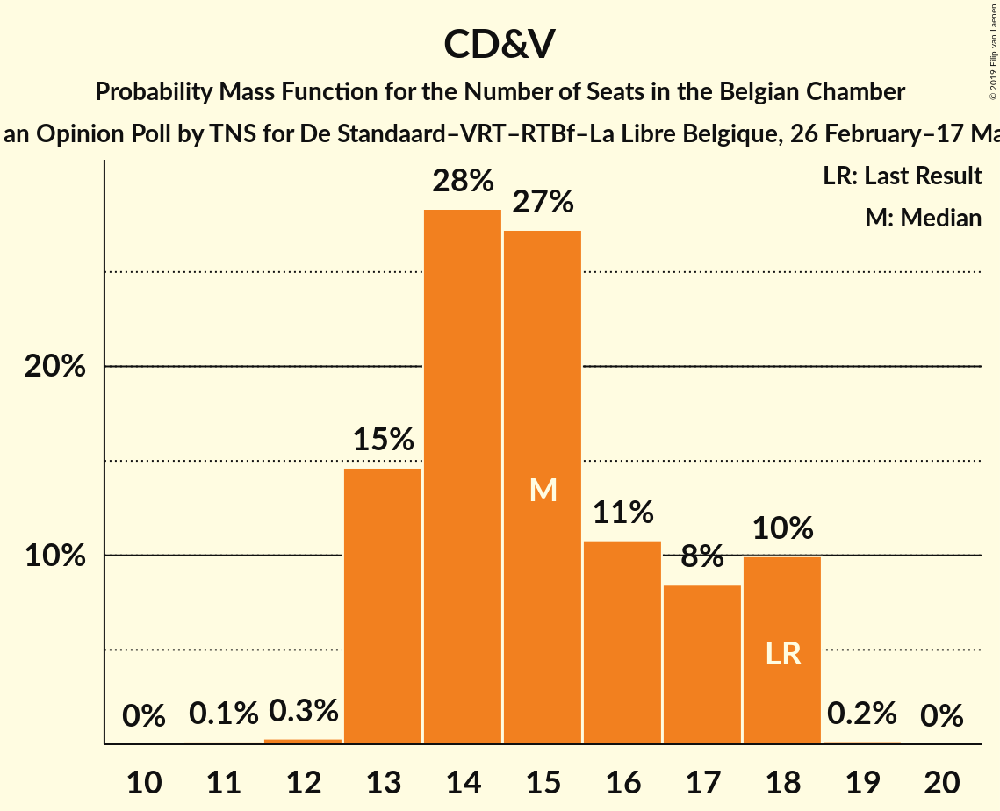

| Number of Seats | Probability | Accumulated | Special Marks |
|:---------------:|:-----------:|:-----------:|:-------------:|
| 11 | 0.1% | 100% |  |
| 12 | 0.3% | 99.9% |  |
| 13 | 15% | 99.6% |  |
| 14 | 28% | 85% |  |
| 15 | 27% | 57% | Median |
| 16 | 11% | 29% |  |
| 17 | 8% | 19% |  |
| 18 | 10% | 10% | Last Result |
| 19 | 0.2% | 0.2% |  |
| 20 | 0% | 0% |  |

### Open Vld

*For a full overview of the results for this party, see the [Open Vld](party-openvld.html) page.*

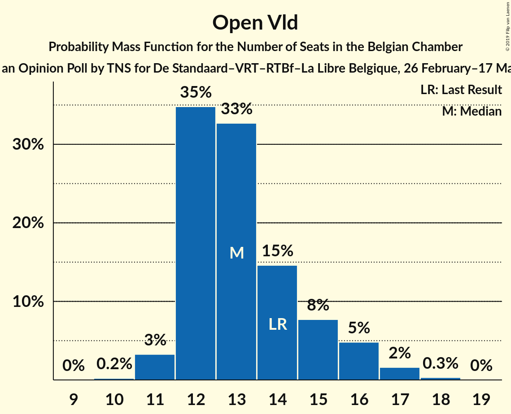

| Number of Seats | Probability | Accumulated | Special Marks |
|:---------------:|:-----------:|:-----------:|:-------------:|
| 10 | 0.2% | 100% |  |
| 11 | 3% | 99.8% |  |
| 12 | 35% | 97% |  |
| 13 | 33% | 62% | Median |
| 14 | 15% | 29% | Last Result |
| 15 | 8% | 14% |  |
| 16 | 5% | 7% |  |
| 17 | 2% | 2% |  |
| 18 | 0.3% | 0.3% |  |
| 19 | 0% | 0% |  |

### MR

*For a full overview of the results for this party, see the [MR](party-mr.html) page.*

| Number of Seats | Probability | Accumulated | Special Marks |
|:---------------:|:-----------:|:-----------:|:-------------:|
| 14 | 0.1% | 100% |  |
| 15 | 4% | 99.9% |  |
| 16 | 22% | 96% |  |
| 17 | 33% | 74% | Median |
| 18 | 28% | 41% |  |
| 19 | 11% | 13% |  |
| 20 | 2% | 2% | Last Result |
| 21 | 0.2% | 0.2% |  |
| 22 | 0% | 0% |  |

### PS

*For a full overview of the results for this party, see the [PS](party-ps.html) page.*

| Number of Seats | Probability | Accumulated | Special Marks |
|:---------------:|:-----------:|:-----------:|:-------------:|
| 14 | 0.3% | 100% |  |
| 15 | 3% | 99.6% |  |
| 16 | 12% | 96% |  |
| 17 | 20% | 84% |  |
| 18 | 35% | 63% | Median |
| 19 | 20% | 29% |  |
| 20 | 8% | 8% |  |
| 21 | 0.4% | 0.4% |  |
| 22 | 0% | 0% |  |
| 23 | 0% | 0% | Last Result |

### Groen

*For a full overview of the results for this party, see the [Groen](party-groen.html) page.*

| Number of Seats | Probability | Accumulated | Special Marks |
|:---------------:|:-----------:|:-----------:|:-------------:|
| 6 | 0% | 100% | Last Result |
| 7 | 0% | 100% |  |
| 8 | 0% | 100% |  |
| 9 | 0% | 100% |  |
| 10 | 2% | 99.9% |  |
| 11 | 18% | 98% |  |
| 12 | 70% | 80% | Median |
| 13 | 6% | 10% |  |
| 14 | 2% | 4% |  |
| 15 | 2% | 2% |  |
| 16 | 0.4% | 0.5% |  |
| 17 | 0% | 0% |  |

### Ecolo

*For a full overview of the results for this party, see the [Ecolo](party-ecolo.html) page.*

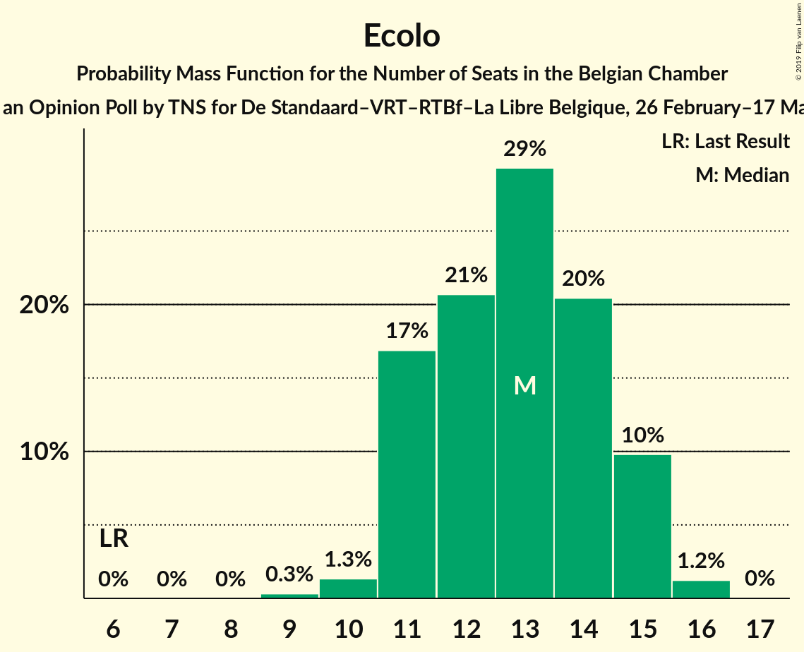

| Number of Seats | Probability | Accumulated | Special Marks |
|:---------------:|:-----------:|:-----------:|:-------------:|
| 6 | 0% | 100% | Last Result |
| 7 | 0% | 100% |  |
| 8 | 0% | 100% |  |
| 9 | 0.3% | 100% |  |
| 10 | 1.3% | 99.7% |  |
| 11 | 17% | 98% |  |
| 12 | 21% | 81% |  |
| 13 | 29% | 61% | Median |
| 14 | 20% | 31% |  |
| 15 | 10% | 11% |  |
| 16 | 1.2% | 1.2% |  |
| 17 | 0% | 0% |  |

### sp.a

*For a full overview of the results for this party, see the [sp.a](party-spa.html) page.*

| Number of Seats | Probability | Accumulated | Special Marks |
|:---------------:|:-----------:|:-----------:|:-------------:|
| 5 | 1.2% | 100% |  |
| 6 | 18% | 98.8% |  |
| 7 | 15% | 81% |  |
| 8 | 29% | 66% | Median |
| 9 | 35% | 38% |  |
| 10 | 2% | 3% |  |
| 11 | 0.4% | 0.5% |  |
| 12 | 0% | 0% |  |
| 13 | 0% | 0% | Last Result |

### Vlaams Belang

*For a full overview of the results for this party, see the [Vlaams Belang](party-vlaamsbelang.html) page.*

| Number of Seats | Probability | Accumulated | Special Marks |
|:---------------:|:-----------:|:-----------:|:-------------:|
| 2 | 1.4% | 100% |  |
| 3 | 2% | 98.6% | Last Result |
| 4 | 2% | 97% |  |
| 5 | 26% | 94% |  |
| 6 | 37% | 69% | Median |
| 7 | 30% | 31% |  |
| 8 | 1.0% | 1.0% |  |
| 9 | 0% | 0% |  |

### cdH

*For a full overview of the results for this party, see the [cdH](party-cdh.html) page.*

| Number of Seats | Probability | Accumulated | Special Marks |
|:---------------:|:-----------:|:-----------:|:-------------:|
| 4 | 0.5% | 100% |  |
| 5 | 13% | 99.5% |  |
| 6 | 29% | 86% |  |
| 7 | 31% | 57% | Median |
| 8 | 23% | 26% |  |
| 9 | 4% | 4% | Last Result |
| 10 | 0% | 0% |  |

### PTB

*For a full overview of the results for this party, see the [PTB](party-ptb.html) page.*

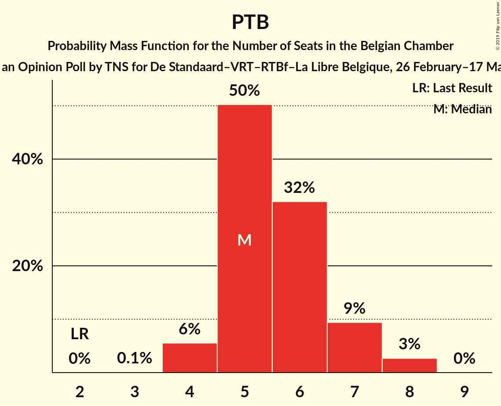

| Number of Seats | Probability | Accumulated | Special Marks |
|:---------------:|:-----------:|:-----------:|:-------------:|
| 2 | 0% | 100% | Last Result |
| 3 | 0.1% | 100% |  |
| 4 | 6% | 99.9% |  |
| 5 | 50% | 94% | Median |
| 6 | 32% | 44% |  |
| 7 | 9% | 12% |  |
| 8 | 3% | 3% |  |
| 9 | 0% | 0% |  |

### PVDA

*For a full overview of the results for this party, see the [PVDA](party-pvda.html) page.*

| Number of Seats | Probability | Accumulated | Special Marks |
|:---------------:|:-----------:|:-----------:|:-------------:|
| 0 | 0.3% | 100% | Last Result |
| 1 | 39% | 99.7% |  |
| 2 | 36% | 60% | Median |
| 3 | 23% | 24% |  |
| 4 | 0.5% | 0.7% |  |
| 5 | 0.1% | 0.1% |  |
| 6 | 0% | 0% |  |

### DéFI

*For a full overview of the results for this party, see the [DéFI](party-défi.html) page.*

| Number of Seats | Probability | Accumulated | Special Marks |
|:---------------:|:-----------:|:-----------:|:-------------:|
| 1 | 0.1% | 100% |  |
| 2 | 62% | 99.9% | Last Result, Median |
| 3 | 13% | 38% |  |
| 4 | 14% | 25% |  |
| 5 | 10% | 11% |  |
| 6 | 0.4% | 0.4% |  |
| 7 | 0% | 0% |  |

### Parti Populaire

*For a full overview of the results for this party, see the [Parti Populaire](party-partipopulaire.html) page.*

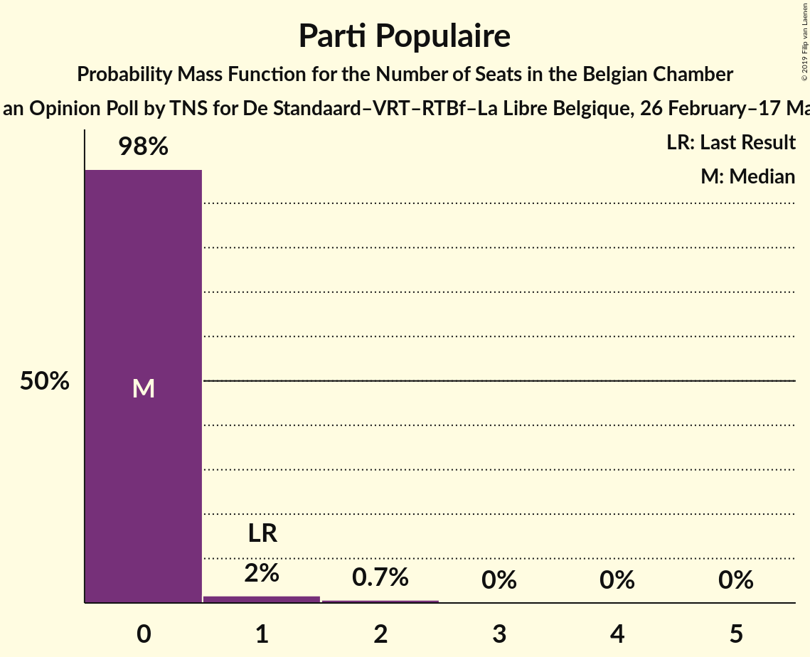

| Number of Seats | Probability | Accumulated | Special Marks |
|:---------------:|:-----------:|:-----------:|:-------------:|
| 0 | 98% | 100% | Median |
| 1 | 2% | 2% | Last Result |
| 2 | 0.7% | 0.7% |  |
| 3 | 0% | 0% |  |

## Coalitions

### Confidence Intervals

| Coalition | Last Result | Median | Majority? | 80% Confidence Interval | 90% Confidence Interval | 95% Confidence Interval | 99% Confidence Interval |
|:---------:|:-----------:|:------:|:---------:|:-----------------------:|:-----------------------:|:-----------------------:|:-----------------------:|
| CD&V – Open Vld – MR – PS – Groen – Ecolo – sp.a – cdH | 109 | 103 | 100% | 100–105 | 99–106 | 98–106 | 97–107 |
| N-VA – CD&V – Open Vld – MR – cdH | 94 | 83 | 100% | 81–86 | 80–87 | 79–88 | 78–89 |
| Open Vld – MR – PS – Groen – Ecolo – sp.a | 82 | 81 | 99.1% | 78–84 | 77–84 | 76–85 | 75–86 |
| CD&V – PS – Groen – Ecolo – sp.a – cdH – PTB – PVDA | 77 | 80 | 97% | 77–82 | 76–83 | 75–84 | 74–85 |
| CD&V – Open Vld – MR – PS – sp.a – cdH | 97 | 78 | 83% | 75–81 | 74–82 | 73–82 | 72–84 |
| CD&V – Open Vld – MR – Groen – Ecolo – cdH | 73 | 77 | 73% | 74–80 | 73–81 | 73–81 | 71–83 |
| N-VA – CD&V – Open Vld – MR | 85 | 77 | 73% | 74–79 | 74–80 | 73–81 | 72–82 |
| CD&V – PS – Groen – Ecolo – sp.a – cdH | 75 | 72 | 6% | 69–75 | 69–76 | 68–76 | 67–77 |
| CD&V – Open Vld – MR – PS – cdH | 84 | 70 | 1.0% | 67–73 | 66–74 | 66–75 | 64–76 |
| PS – Groen – Ecolo – sp.a – cdH – PTB – PVDA | 59 | 65 | 0% | 62–67 | 61–68 | 61–68 | 60–70 |
| PS – Groen – Ecolo – sp.a – PTB – PVDA | 50 | 58 | 0% | 55–60 | 55–61 | 54–62 | 53–63 |
| Open Vld – MR – PS – sp.a | 70 | 56 | 0% | 53–59 | 52–60 | 52–61 | 50–62 |
| CD&V – Open Vld – MR – cdH | 61 | 52 | 0% | 49–55 | 49–56 | 48–57 | 47–58 |
| CD&V – PS – sp.a – cdH | 63 | 47 | 0% | 45–50 | 44–51 | 43–52 | 42–53 |

### CD&V – Open Vld – MR – PS – Groen – Ecolo – sp.a – cdH

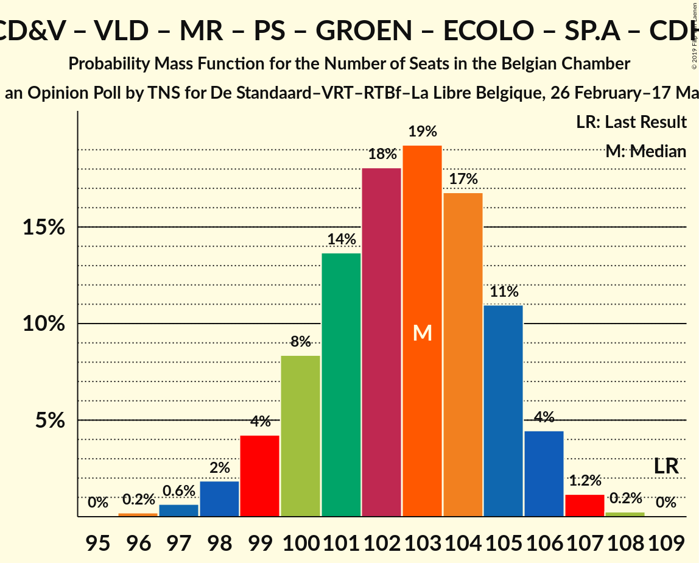

| Number of Seats | Probability | Accumulated | Special Marks |
|:---------------:|:-----------:|:-----------:|:-------------:|
| 95 | 0% | 100% |  |
| 96 | 0.2% | 99.9% |  |
| 97 | 0.6% | 99.7% |  |
| 98 | 2% | 99.1% |  |
| 99 | 4% | 97% |  |
| 100 | 8% | 93% |  |
| 101 | 14% | 85% |  |
| 102 | 18% | 71% |  |
| 103 | 19% | 53% | Median |
| 104 | 17% | 34% |  |
| 105 | 11% | 17% |  |
| 106 | 4% | 6% |  |
| 107 | 1.2% | 1.5% |  |
| 108 | 0.2% | 0.3% |  |
| 109 | 0% | 0% | Last Result |

### N-VA – CD&V – Open Vld – MR – cdH

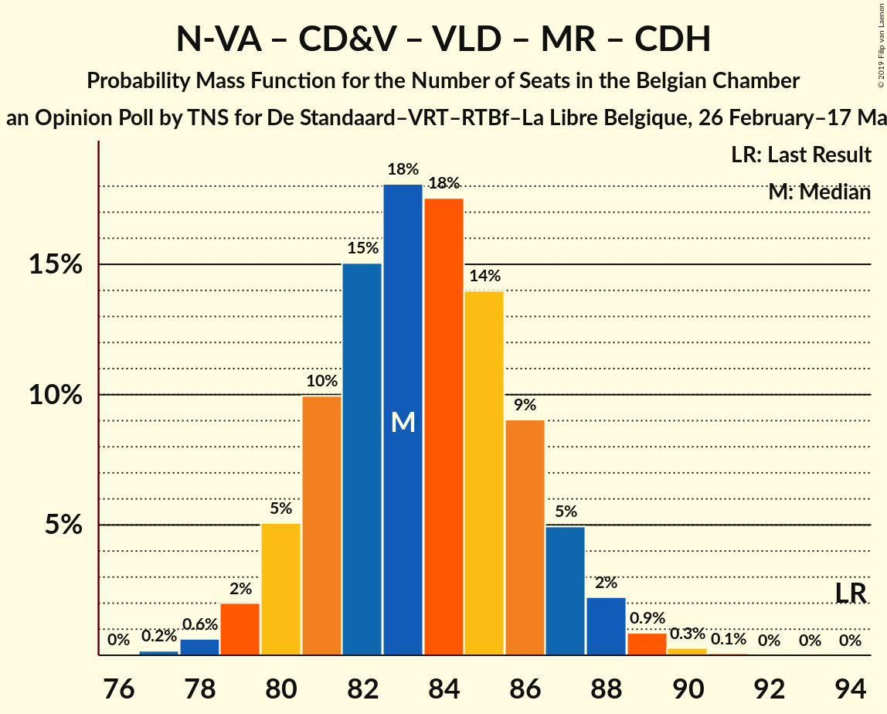

| Number of Seats | Probability | Accumulated | Special Marks |
|:---------------:|:-----------:|:-----------:|:-------------:|
| 77 | 0.2% | 100% |  |
| 78 | 0.6% | 99.8% |  |
| 79 | 2% | 99.2% |  |
| 80 | 5% | 97% |  |
| 81 | 10% | 92% |  |
| 82 | 15% | 82% |  |
| 83 | 18% | 67% | Median |
| 84 | 18% | 49% |  |
| 85 | 14% | 31% |  |
| 86 | 9% | 17% |  |
| 87 | 5% | 8% |  |
| 88 | 2% | 3% |  |
| 89 | 0.9% | 1.2% |  |
| 90 | 0.3% | 0.4% |  |
| 91 | 0.1% | 0.1% |  |
| 92 | 0% | 0% |  |
| 93 | 0% | 0% |  |
| 94 | 0% | 0% | Last Result |

### Open Vld – MR – PS – Groen – Ecolo – sp.a

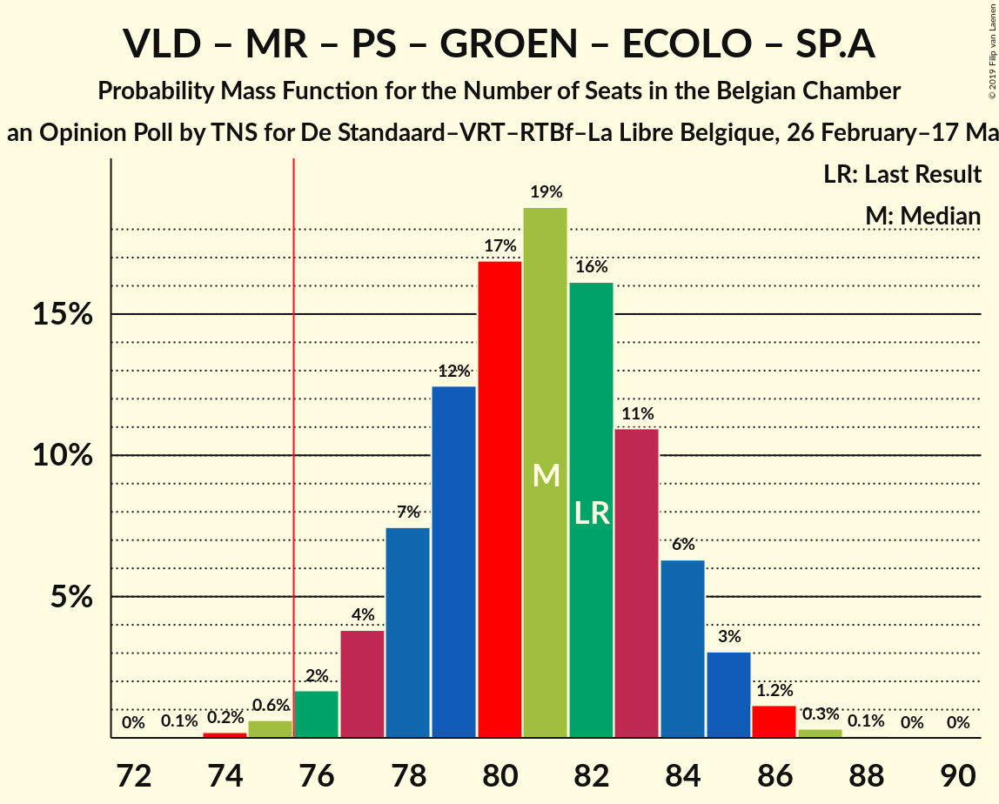

| Number of Seats | Probability | Accumulated | Special Marks |
|:---------------:|:-----------:|:-----------:|:-------------:|
| 73 | 0.1% | 100% |  |
| 74 | 0.2% | 99.9% |  |
| 75 | 0.6% | 99.7% |  |
| 76 | 2% | 99.1% | Majority |
| 77 | 4% | 97% |  |
| 78 | 7% | 94% |  |
| 79 | 12% | 86% |  |
| 80 | 17% | 74% |  |
| 81 | 19% | 57% | Median |
| 82 | 16% | 38% | Last Result |
| 83 | 11% | 22% |  |
| 84 | 6% | 11% |  |
| 85 | 3% | 5% |  |
| 86 | 1.2% | 2% |  |
| 87 | 0.3% | 0.4% |  |
| 88 | 0.1% | 0.1% |  |
| 89 | 0% | 0% |  |

### CD&V – PS – Groen – Ecolo – sp.a – cdH – PTB – PVDA

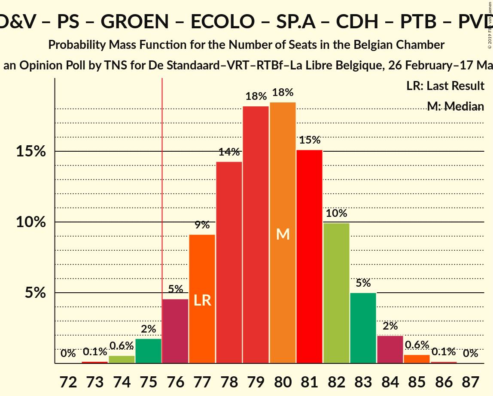

| Number of Seats | Probability | Accumulated | Special Marks |
|:---------------:|:-----------:|:-----------:|:-------------:|
| 73 | 0.1% | 100% |  |
| 74 | 0.6% | 99.8% |  |
| 75 | 2% | 99.3% |  |
| 76 | 5% | 97% | Majority |
| 77 | 9% | 93% | Last Result |
| 78 | 14% | 84% |  |
| 79 | 18% | 70% |  |
| 80 | 18% | 51% | Median |
| 81 | 15% | 33% |  |
| 82 | 10% | 18% |  |
| 83 | 5% | 8% |  |
| 84 | 2% | 3% |  |
| 85 | 0.6% | 0.8% |  |
| 86 | 0.1% | 0.2% |  |
| 87 | 0% | 0% |  |

### CD&V – Open Vld – MR – PS – sp.a – cdH

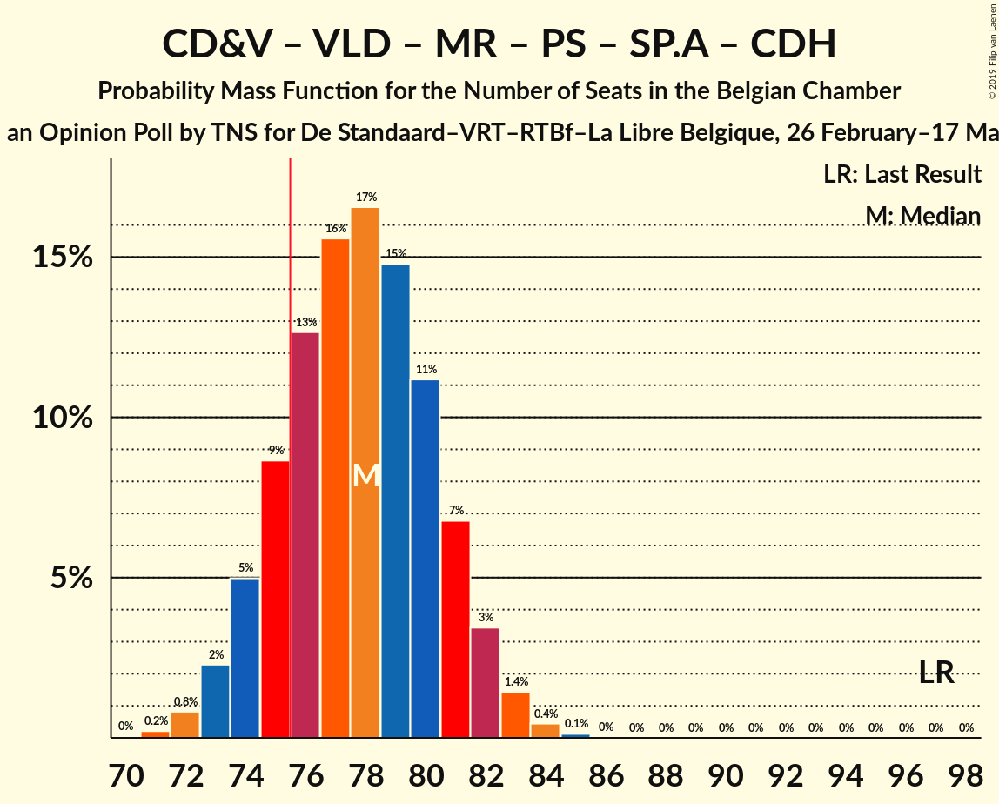

| Number of Seats | Probability | Accumulated | Special Marks |
|:---------------:|:-----------:|:-----------:|:-------------:|
| 70 | 0% | 100% |  |
| 71 | 0.2% | 99.9% |  |
| 72 | 0.8% | 99.7% |  |
| 73 | 2% | 98.9% |  |
| 74 | 5% | 97% |  |
| 75 | 9% | 92% |  |
| 76 | 13% | 83% | Majority |
| 77 | 16% | 70% |  |
| 78 | 17% | 55% | Median |
| 79 | 15% | 38% |  |
| 80 | 11% | 23% |  |
| 81 | 7% | 12% |  |
| 82 | 3% | 5% |  |
| 83 | 1.4% | 2% |  |
| 84 | 0.4% | 0.6% |  |
| 85 | 0.1% | 0.2% |  |
| 86 | 0% | 0% |  |
| 87 | 0% | 0% |  |
| 88 | 0% | 0% |  |
| 89 | 0% | 0% |  |
| 90 | 0% | 0% |  |
| 91 | 0% | 0% |  |
| 92 | 0% | 0% |  |
| 93 | 0% | 0% |  |
| 94 | 0% | 0% |  |
| 95 | 0% | 0% |  |
| 96 | 0% | 0% |  |
| 97 | 0% | 0% | Last Result |

### CD&V – Open Vld – MR – Groen – Ecolo – cdH

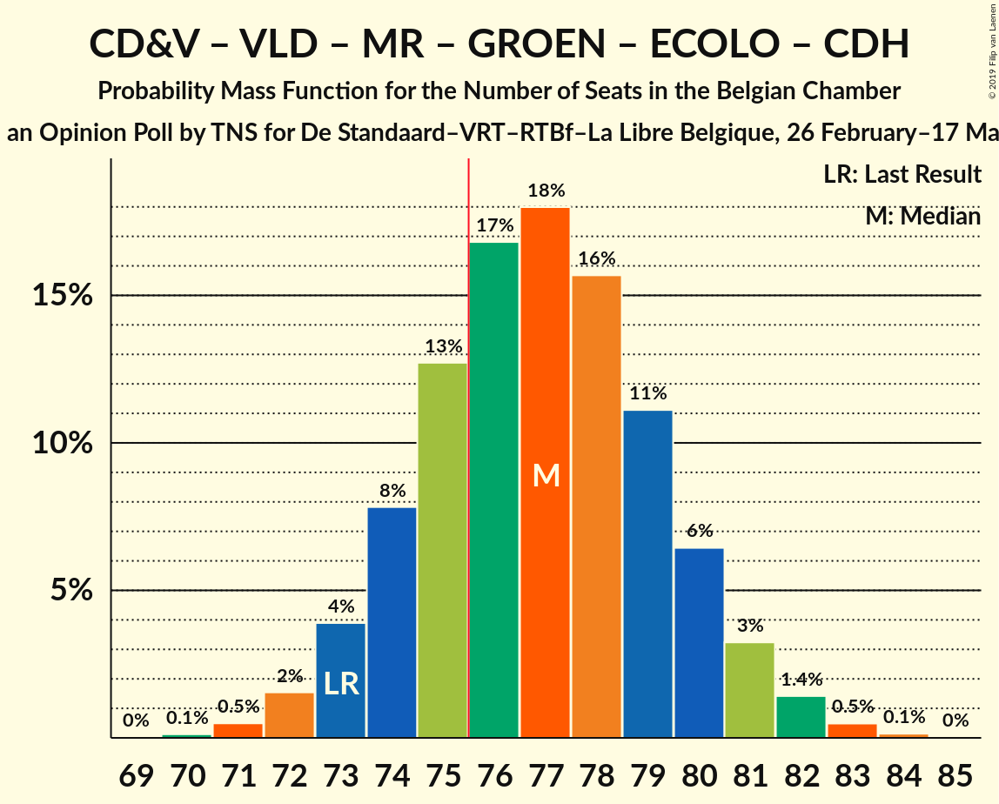

| Number of Seats | Probability | Accumulated | Special Marks |
|:---------------:|:-----------:|:-----------:|:-------------:|
| 70 | 0.1% | 100% |  |
| 71 | 0.5% | 99.8% |  |
| 72 | 2% | 99.4% |  |
| 73 | 4% | 98% | Last Result |
| 74 | 8% | 94% |  |
| 75 | 13% | 86% |  |
| 76 | 17% | 73% | Majority |
| 77 | 18% | 57% | Median |
| 78 | 16% | 39% |  |
| 79 | 11% | 23% |  |
| 80 | 6% | 12% |  |
| 81 | 3% | 5% |  |
| 82 | 1.4% | 2% |  |
| 83 | 0.5% | 0.7% |  |
| 84 | 0.1% | 0.2% |  |
| 85 | 0% | 0% |  |

### N-VA – CD&V – Open Vld – MR

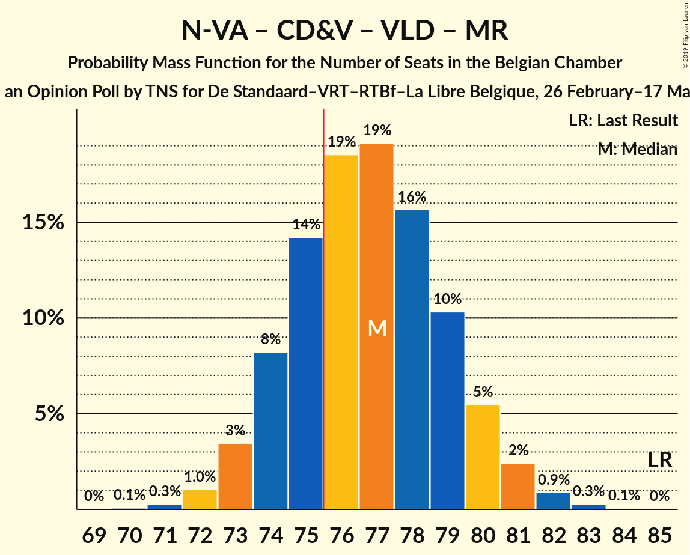

| Number of Seats | Probability | Accumulated | Special Marks |
|:---------------:|:-----------:|:-----------:|:-------------:|
| 70 | 0.1% | 100% |  |
| 71 | 0.3% | 99.9% |  |
| 72 | 1.0% | 99.6% |  |
| 73 | 3% | 98.6% |  |
| 74 | 8% | 95% |  |
| 75 | 14% | 87% |  |
| 76 | 19% | 73% | Median, Majority |
| 77 | 19% | 54% |  |
| 78 | 16% | 35% |  |
| 79 | 10% | 19% |  |
| 80 | 5% | 9% |  |
| 81 | 2% | 4% |  |
| 82 | 0.9% | 1.2% |  |
| 83 | 0.3% | 0.3% |  |
| 84 | 0.1% | 0.1% |  |
| 85 | 0% | 0% | Last Result |

### CD&V – PS – Groen – Ecolo – sp.a – cdH

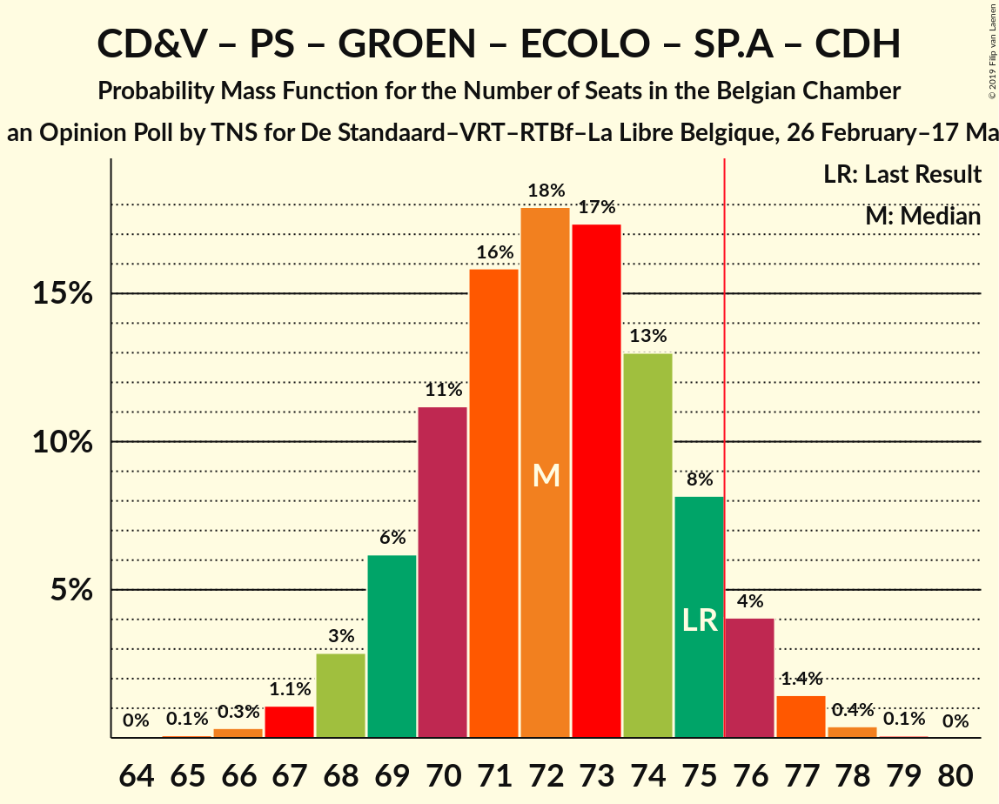

| Number of Seats | Probability | Accumulated | Special Marks |
|:---------------:|:-----------:|:-----------:|:-------------:|
| 65 | 0.1% | 100% |  |
| 66 | 0.3% | 99.9% |  |
| 67 | 1.1% | 99.6% |  |
| 68 | 3% | 98% |  |
| 69 | 6% | 96% |  |
| 70 | 11% | 89% |  |
| 71 | 16% | 78% |  |
| 72 | 18% | 62% |  |
| 73 | 17% | 44% | Median |
| 74 | 13% | 27% |  |
| 75 | 8% | 14% | Last Result |
| 76 | 4% | 6% | Majority |
| 77 | 1.4% | 2% |  |
| 78 | 0.4% | 0.5% |  |
| 79 | 0.1% | 0.1% |  |
| 80 | 0% | 0% |  |

### CD&V – Open Vld – MR – PS – cdH

| Number of Seats | Probability | Accumulated | Special Marks |
|:---------------:|:-----------:|:-----------:|:-------------:|
| 63 | 0.1% | 100% |  |
| 64 | 0.5% | 99.9% |  |
| 65 | 2% | 99.4% |  |
| 66 | 4% | 98% |  |
| 67 | 8% | 93% |  |
| 68 | 13% | 85% |  |
| 69 | 16% | 72% |  |
| 70 | 17% | 56% | Median |
| 71 | 15% | 39% |  |
| 72 | 11% | 25% |  |
| 73 | 7% | 14% |  |
| 74 | 4% | 7% |  |
| 75 | 2% | 3% |  |
| 76 | 0.7% | 1.0% | Majority |
| 77 | 0.2% | 0.3% |  |
| 78 | 0% | 0.1% |  |
| 79 | 0% | 0% |  |
| 80 | 0% | 0% |  |
| 81 | 0% | 0% |  |
| 82 | 0% | 0% |  |
| 83 | 0% | 0% |  |
| 84 | 0% | 0% | Last Result |

### PS – Groen – Ecolo – sp.a – cdH – PTB – PVDA

| Number of Seats | Probability | Accumulated | Special Marks |
|:---------------:|:-----------:|:-----------:|:-------------:|
| 58 | 0.1% | 100% |  |
| 59 | 0.3% | 99.9% | Last Result |
| 60 | 1.3% | 99.6% |  |
| 61 | 4% | 98% |  |
| 62 | 9% | 94% |  |
| 63 | 15% | 86% |  |
| 64 | 19% | 71% |  |
| 65 | 20% | 52% | Median |
| 66 | 16% | 32% |  |
| 67 | 9% | 16% |  |
| 68 | 4% | 6% |  |
| 69 | 1.4% | 2% |  |
| 70 | 0.4% | 0.5% |  |
| 71 | 0.1% | 0.1% |  |
| 72 | 0% | 0% |  |

### PS – Groen – Ecolo – sp.a – PTB – PVDA

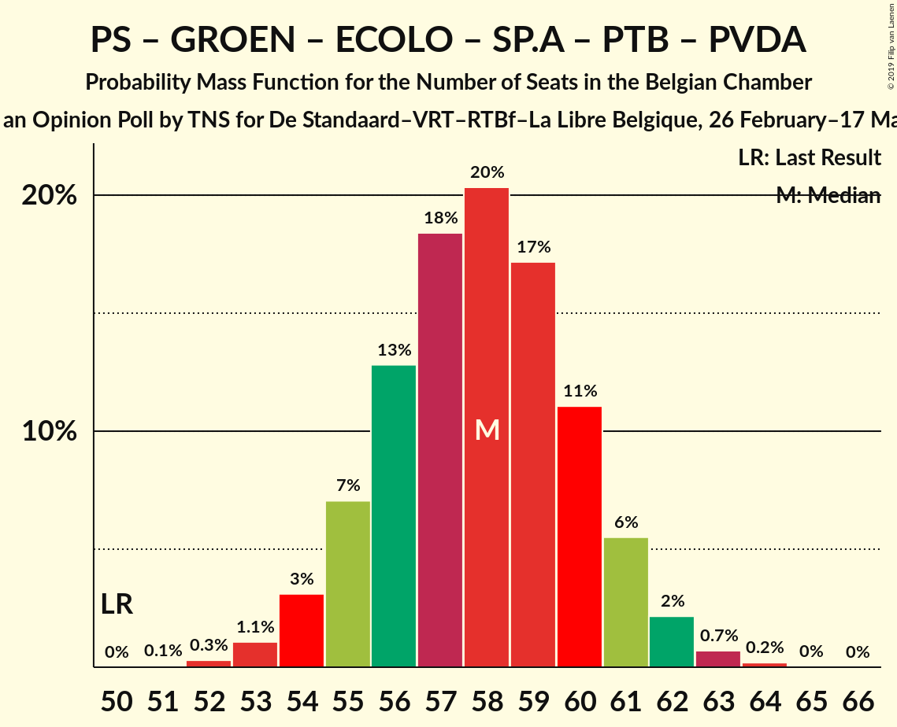

| Number of Seats | Probability | Accumulated | Special Marks |
|:---------------:|:-----------:|:-----------:|:-------------:|
| 50 | 0% | 100% | Last Result |
| 51 | 0.1% | 100% |  |
| 52 | 0.3% | 99.9% |  |
| 53 | 1.1% | 99.6% |  |
| 54 | 3% | 98.6% |  |
| 55 | 7% | 95% |  |
| 56 | 13% | 88% |  |
| 57 | 18% | 76% |  |
| 58 | 20% | 57% | Median |
| 59 | 17% | 37% |  |
| 60 | 11% | 20% |  |
| 61 | 6% | 9% |  |
| 62 | 2% | 3% |  |
| 63 | 0.7% | 0.9% |  |
| 64 | 0.2% | 0.2% |  |
| 65 | 0% | 0.1% |  |
| 66 | 0% | 0% |  |

### Open Vld – MR – PS – sp.a

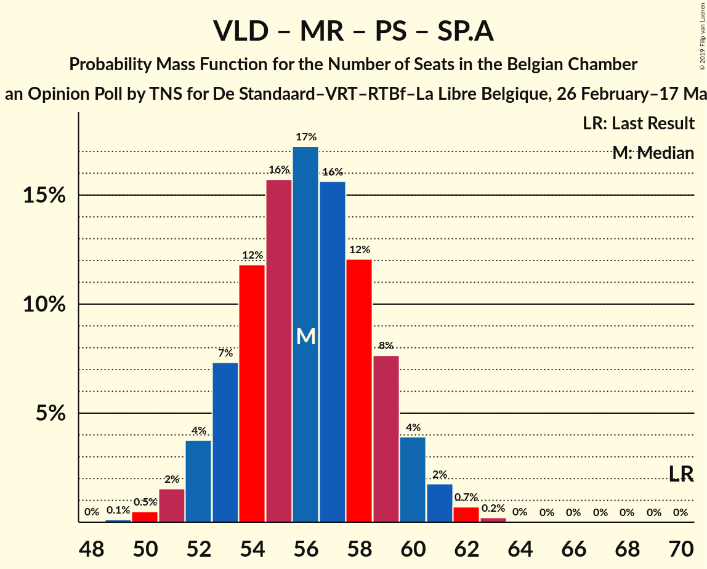

| Number of Seats | Probability | Accumulated | Special Marks |
|:---------------:|:-----------:|:-----------:|:-------------:|
| 49 | 0.1% | 100% |  |
| 50 | 0.5% | 99.9% |  |
| 51 | 2% | 99.4% |  |
| 52 | 4% | 98% |  |
| 53 | 7% | 94% |  |
| 54 | 12% | 87% |  |
| 55 | 16% | 75% |  |
| 56 | 17% | 59% | Median |
| 57 | 16% | 42% |  |
| 58 | 12% | 26% |  |
| 59 | 8% | 14% |  |
| 60 | 4% | 7% |  |
| 61 | 2% | 3% |  |
| 62 | 0.7% | 1.0% |  |
| 63 | 0.2% | 0.3% |  |
| 64 | 0% | 0.1% |  |
| 65 | 0% | 0% |  |
| 66 | 0% | 0% |  |
| 67 | 0% | 0% |  |
| 68 | 0% | 0% |  |
| 69 | 0% | 0% |  |
| 70 | 0% | 0% | Last Result |

### CD&V – Open Vld – MR – cdH

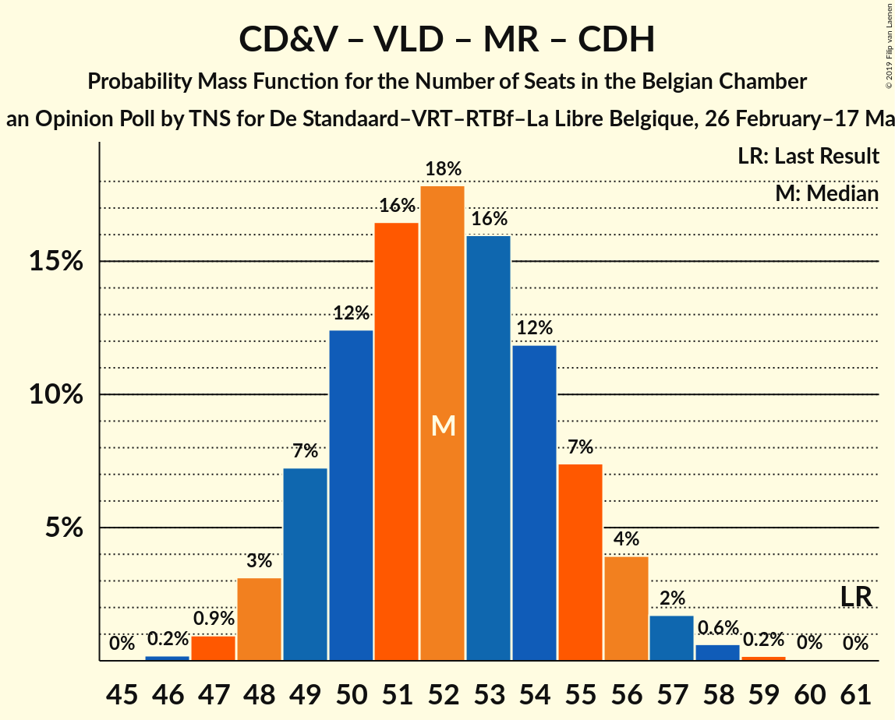

| Number of Seats | Probability | Accumulated | Special Marks |
|:---------------:|:-----------:|:-----------:|:-------------:|
| 46 | 0.2% | 100% |  |
| 47 | 0.9% | 99.8% |  |
| 48 | 3% | 98.8% |  |
| 49 | 7% | 96% |  |
| 50 | 12% | 88% |  |
| 51 | 16% | 76% |  |
| 52 | 18% | 60% | Median |
| 53 | 16% | 42% |  |
| 54 | 12% | 26% |  |
| 55 | 7% | 14% |  |
| 56 | 4% | 6% |  |
| 57 | 2% | 3% |  |
| 58 | 0.6% | 0.8% |  |
| 59 | 0.2% | 0.2% |  |
| 60 | 0% | 0% |  |
| 61 | 0% | 0% | Last Result |

### CD&V – PS – sp.a – cdH

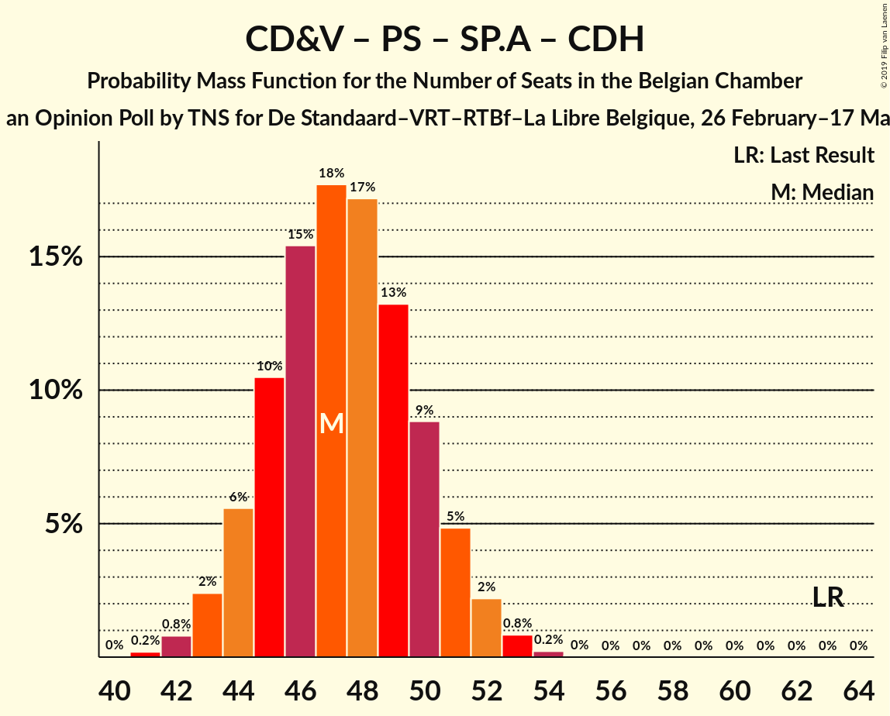

| Number of Seats | Probability | Accumulated | Special Marks |
|:---------------:|:-----------:|:-----------:|:-------------:|
| 41 | 0.2% | 100% |  |
| 42 | 0.8% | 99.8% |  |
| 43 | 2% | 99.0% |  |
| 44 | 6% | 97% |  |
| 45 | 10% | 91% |  |
| 46 | 15% | 81% |  |
| 47 | 18% | 65% |  |
| 48 | 17% | 47% | Median |
| 49 | 13% | 30% |  |
| 50 | 9% | 17% |  |
| 51 | 5% | 8% |  |
| 52 | 2% | 3% |  |
| 53 | 0.8% | 1.1% |  |
| 54 | 0.2% | 0.3% |  |
| 55 | 0% | 0% |  |
| 56 | 0% | 0% |  |
| 57 | 0% | 0% |  |
| 58 | 0% | 0% |  |
| 59 | 0% | 0% |  |
| 60 | 0% | 0% |  |
| 61 | 0% | 0% |  |
| 62 | 0% | 0% |  |
| 63 | 0% | 0% | Last Result |

## Technical Information

### Opinion Poll

+ **Polling firm:** TNS
+ **Commissioner(s):** De Standaard–VRT–RTBf–La Libre Belgique
+ **Fieldwork period:** 26 February–17 March 2018

### Calculations

+ **Sample size:** 1621
+ **Simulations done:** 1,048,576
+ **Error estimate:** 1.07%

