# Opinion Poll by TNS for De Standaard, La Libre Belgique, RTBf and VRT, 19 November–8 December 2018

Areas included: Brussels, Flanders, Wallonia

<a href="#voting-intentions">Voting Intentions</a> | <a href="#seats">Seats</a> | <a href="#coalitions">Coalitions</a> | <a href="#technical-information">Technical Information</a>

## Voting Intentions

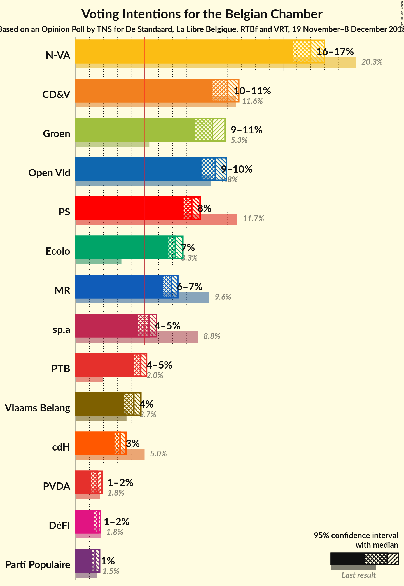

### Confidence Intervals

| Party | Last Result | Poll Result | 80% Confidence Interval | 90% Confidence Interval | 95% Confidence Interval | 99% Confidence Interval |
|:-----:|:-----------:|:-----------:|:-----------------------:|:-----------------------:|:-----------------------:|:-----------------------:|
| N-VA | 20.3% | 18.0% | 16.1–17.0% |15.9–17.0% |15.7–17.0% |15.3–17.0% |
| CD&V | 11.6% | 11.8% | 10.2–10.9% |10.0–11.0% |9.9–11.0% |9.5–11.0% |
| Open Vld | 9.8% | 10.9% | 9.4–10.1% |9.2–10.1% |9.1–10.1% |8.7–10.1% |
| Groen | 5.3% | 9.9% | 9.0–10.5% |8.8–10.7% |8.6–10.8% |8.2–10.8% |
| PS | 11.7% | 9.0% | 8.0–8.4% |7.9–8.4% |7.8–8.4% |7.6–8.4% |
| Ecolo | 3.3% | 7.7% | 6.8–7.2% |6.7–7.2% |6.7–7.2% |6.5–7.2% |
| MR | 9.6% | 7.4% | 6.5–6.8% |6.4–6.8% |6.3–6.9% |6.1–6.9% |
| sp.a | 8.8% | 5.8% | 4.7–5.3% |4.6–5.3% |4.5–5.3% |4.3–5.3% |
| PTB | 2.0% | 5.1% | 4.4–4.7% |4.3–4.7% |4.2–4.7% |4.1–4.7% |
| Vlaams Belang | 3.7% | 4.7% | 3.7–4.1% |3.6–4.2% |3.5–4.2% |3.3–4.2% |
| cdH | 5.0% | 3.6% | 3.0–3.2% |2.9–3.2% |2.8–3.2% |2.7–3.2% |
| DéFI | 1.8% | 1.8% | 1.4–1.5% |1.4–1.6% |1.3–1.6% |1.2–1.6% |
| Parti Populaire | 1.5% | 1.7% | 1.2–1.4% |1.2–1.4% |1.2–1.4% |1.1–1.4% |
| PVDA | 1.8% | 1.5% | 1.2–1.9% |1.1–1.9% |1.1–1.9% |0.9–2.0% |

*Note:* The poll result column reflects the actual value used in the calculations. Published results may vary slightly, and in addition be rounded to fewer digits.

## Seats

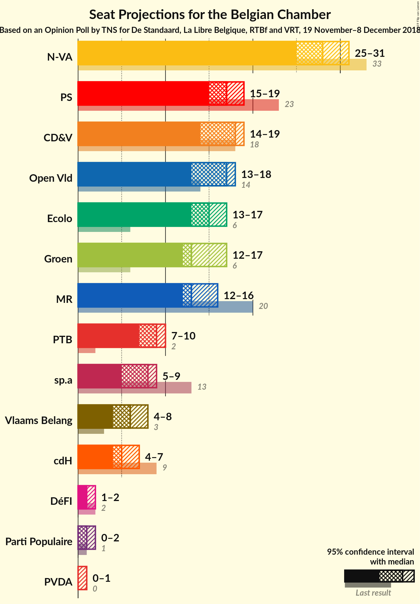

### Confidence Intervals

| Party | Last Result | Median | 80% Confidence Interval | 90% Confidence Interval | 95% Confidence Interval | 99% Confidence Interval |
|:-----:|:-----------:|:------:|:-----------------------:|:-----------------------:|:-----------------------:|:-----------------------:|
| <a href="#n-va">N-VA</a> | 33 | 28 | 26–30 |25–30 |25–31 |24–32 |
| <a href="#cd&v">CD&V</a> | 18 | 18 | 15–18 |14–19 |14–19 |14–21 |
| <a href="#open-vld">Open Vld</a> | 14 | 17 | 14–18 |13–18 |13–18 |12–19 |
| <a href="#groen">Groen</a> | 6 | 13 | 12–16 |12–16 |12–17 |12–18 |
| <a href="#ps">PS</a> | 23 | 17 | 16–19 |16–19 |15–19 |15–20 |
| <a href="#ecolo">Ecolo</a> | 6 | 15 | 14–16 |14–16 |13–17 |13–17 |
| <a href="#mr">MR</a> | 20 | 13 | 13–15 |13–15 |12–16 |12–16 |
| <a href="#sp.a">sp.a</a> | 13 | 8 | 5–9 |5–9 |5–9 |5–9 |
| <a href="#ptb">PTB</a> | 2 | 9 | 7–10 |7–10 |7–10 |6–10 |
| <a href="#vlaams-belang">Vlaams Belang</a> | 3 | 6 | 5–7 |5–8 |4–8 |2–8 |
| <a href="#cdh">cdH</a> | 9 | 5 | 4–6 |4–7 |4–7 |3–7 |
| <a href="#défi">DéFI</a> | 2 | 1 | 1–2 |1–2 |1–2 |1–2 |
| <a href="#parti-populaire">Parti Populaire</a> | 1 | 1 | 0–2 |0–2 |0–2 |0–2 |
| <a href="#pvda">PVDA</a> | 0 | 0 | 0–1 |0–1 |0–1 |0–1 |

### N-VA

*For a full overview of the results for this party, see the [N-VA](party-n-va.html) page.*

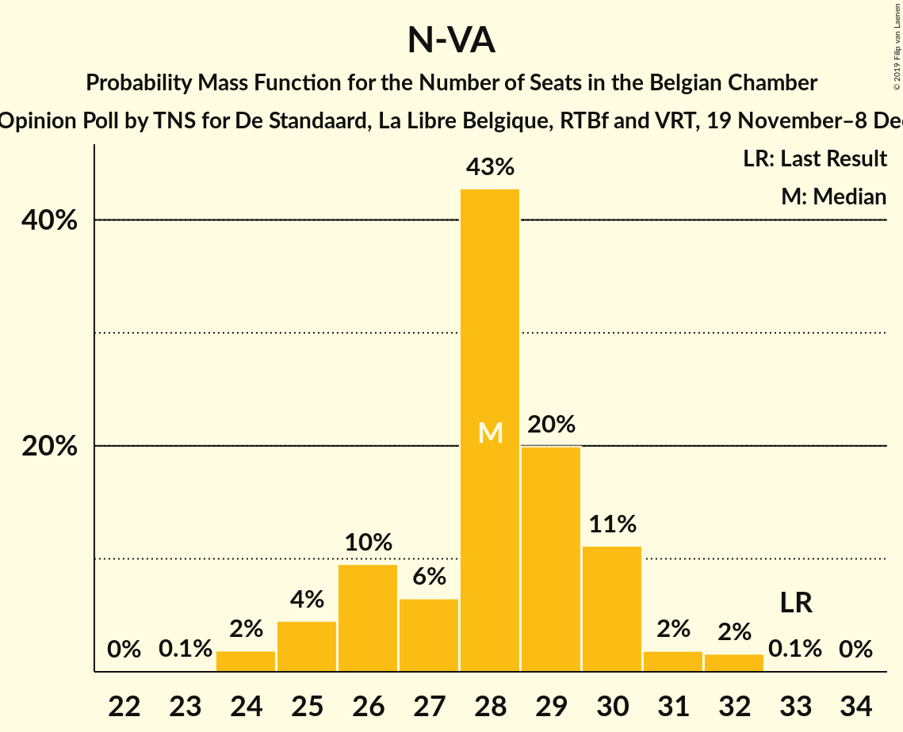

| Number of Seats | Probability | Accumulated | Special Marks |
|:---------------:|:-----------:|:-----------:|:-------------:|
| 23 | 0.1% | 100% |  |
| 24 | 2% | 99.8% |  |
| 25 | 4% | 98% |  |
| 26 | 10% | 93% |  |
| 27 | 6% | 84% |  |
| 28 | 43% | 77% | Median |
| 29 | 20% | 35% |  |
| 30 | 11% | 15% |  |
| 31 | 2% | 4% |  |
| 32 | 2% | 2% |  |
| 33 | 0.1% | 0.2% | Last Result |
| 34 | 0% | 0% |  |

### CD&V

*For a full overview of the results for this party, see the [CD&V](party-cdv.html) page.*

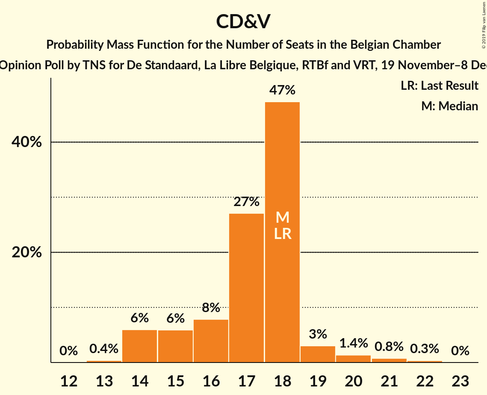

| Number of Seats | Probability | Accumulated | Special Marks |
|:---------------:|:-----------:|:-----------:|:-------------:|
| 13 | 0.4% | 100% |  |
| 14 | 6% | 99.6% |  |
| 15 | 6% | 94% |  |
| 16 | 8% | 88% |  |
| 17 | 27% | 80% |  |
| 18 | 47% | 53% | Last Result, Median |
| 19 | 3% | 5% |  |
| 20 | 1.4% | 2% |  |
| 21 | 0.8% | 1.1% |  |
| 22 | 0.3% | 0.4% |  |
| 23 | 0% | 0% |  |

### Open Vld

*For a full overview of the results for this party, see the [Open Vld](party-openvld.html) page.*

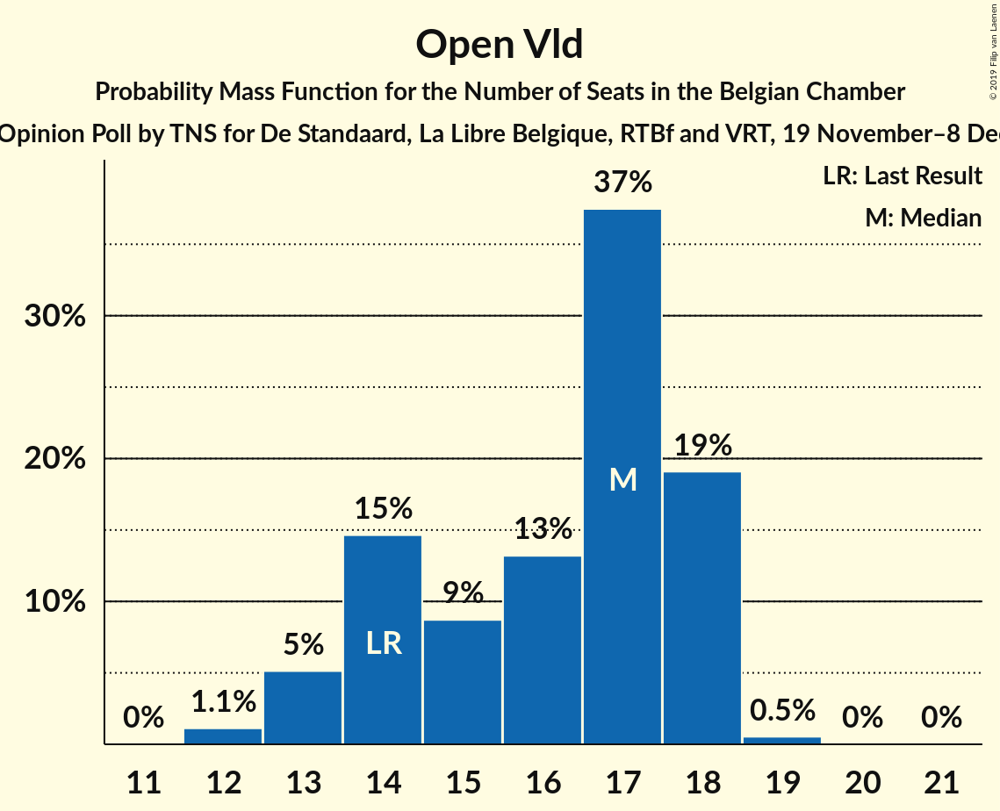

| Number of Seats | Probability | Accumulated | Special Marks |
|:---------------:|:-----------:|:-----------:|:-------------:|
| 12 | 1.1% | 100% |  |
| 13 | 5% | 98.9% |  |
| 14 | 15% | 94% | Last Result |
| 15 | 9% | 79% |  |
| 16 | 13% | 70% |  |
| 17 | 37% | 57% | Median |
| 18 | 19% | 20% |  |
| 19 | 0.5% | 0.6% |  |
| 20 | 0% | 0.1% |  |
| 21 | 0% | 0% |  |

### Groen

*For a full overview of the results for this party, see the [Groen](party-groen.html) page.*

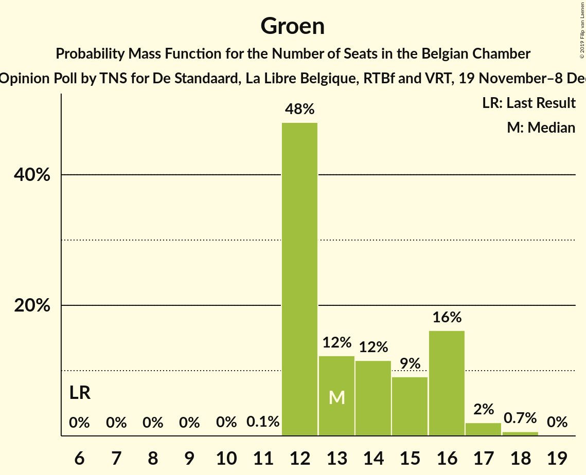

| Number of Seats | Probability | Accumulated | Special Marks |
|:---------------:|:-----------:|:-----------:|:-------------:|
| 6 | 0% | 100% | Last Result |
| 7 | 0% | 100% |  |
| 8 | 0% | 100% |  |
| 9 | 0% | 100% |  |
| 10 | 0% | 100% |  |
| 11 | 0.1% | 100% |  |
| 12 | 48% | 99.9% |  |
| 13 | 12% | 52% | Median |
| 14 | 12% | 40% |  |
| 15 | 9% | 28% |  |
| 16 | 16% | 19% |  |
| 17 | 2% | 3% |  |
| 18 | 0.7% | 0.7% |  |
| 19 | 0% | 0% |  |

### PS

*For a full overview of the results for this party, see the [PS](party-ps.html) page.*

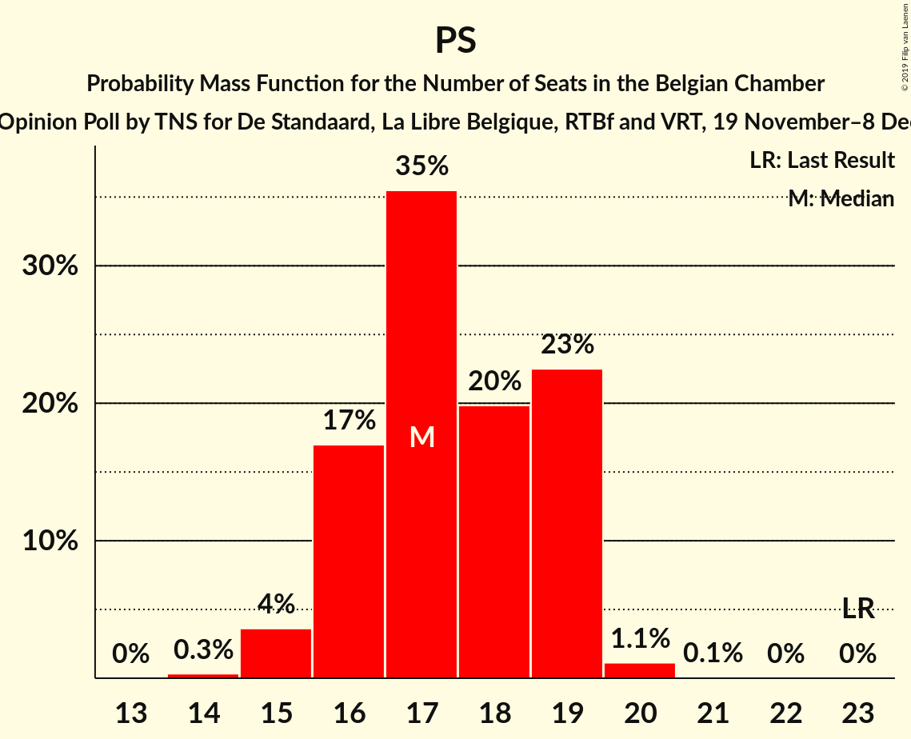

| Number of Seats | Probability | Accumulated | Special Marks |
|:---------------:|:-----------:|:-----------:|:-------------:|
| 14 | 0.3% | 100% |  |
| 15 | 4% | 99.7% |  |
| 16 | 17% | 96% |  |
| 17 | 35% | 79% | Median |
| 18 | 20% | 44% |  |
| 19 | 23% | 24% |  |
| 20 | 1.1% | 1.2% |  |
| 21 | 0.1% | 0.1% |  |
| 22 | 0% | 0% |  |
| 23 | 0% | 0% | Last Result |

### Ecolo

*For a full overview of the results for this party, see the [Ecolo](party-ecolo.html) page.*

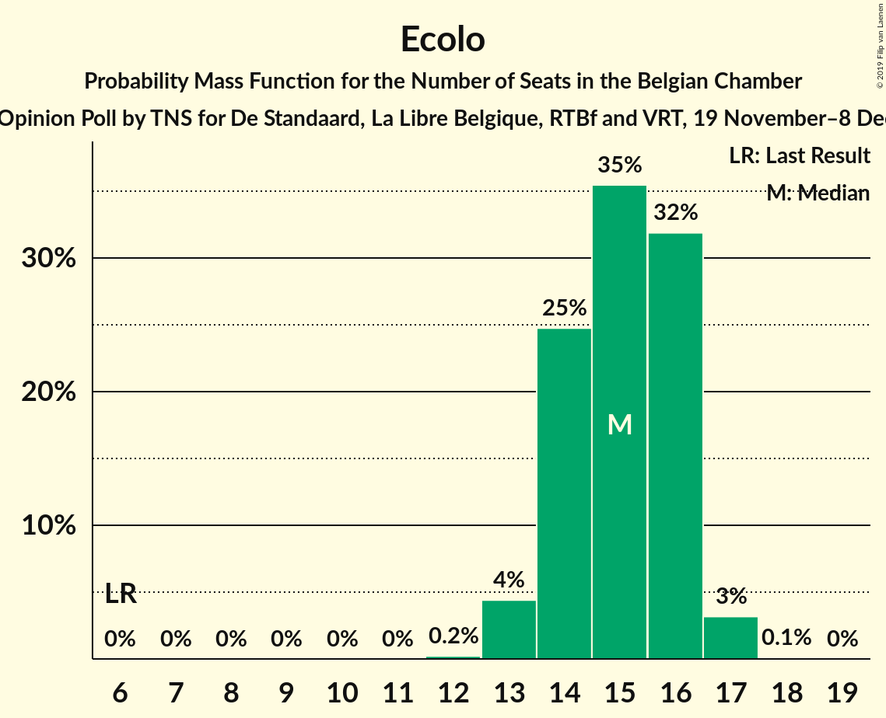

| Number of Seats | Probability | Accumulated | Special Marks |
|:---------------:|:-----------:|:-----------:|:-------------:|
| 6 | 0% | 100% | Last Result |
| 7 | 0% | 100% |  |
| 8 | 0% | 100% |  |
| 9 | 0% | 100% |  |
| 10 | 0% | 100% |  |
| 11 | 0% | 100% |  |
| 12 | 0.2% | 100% |  |
| 13 | 4% | 99.8% |  |
| 14 | 25% | 95% |  |
| 15 | 35% | 71% | Median |
| 16 | 32% | 35% |  |
| 17 | 3% | 3% |  |
| 18 | 0.1% | 0.1% |  |
| 19 | 0% | 0% |  |

### MR

*For a full overview of the results for this party, see the [MR](party-mr.html) page.*

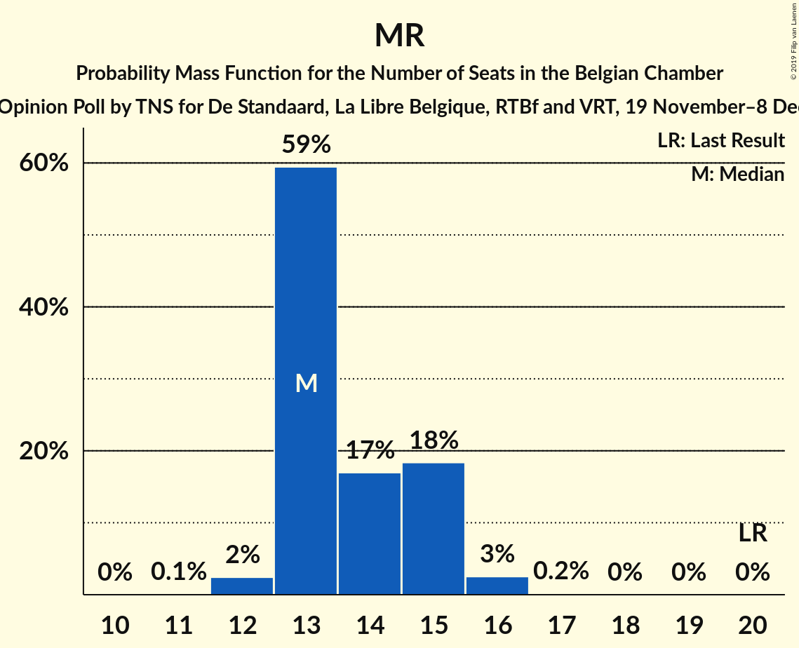

| Number of Seats | Probability | Accumulated | Special Marks |
|:---------------:|:-----------:|:-----------:|:-------------:|
| 11 | 0.1% | 100% |  |
| 12 | 2% | 99.9% |  |
| 13 | 59% | 97% | Median |
| 14 | 17% | 38% |  |
| 15 | 18% | 21% |  |
| 16 | 3% | 3% |  |
| 17 | 0.2% | 0.2% |  |
| 18 | 0% | 0% |  |
| 19 | 0% | 0% |  |
| 20 | 0% | 0% | Last Result |

### sp.a

*For a full overview of the results for this party, see the [sp.a](party-spa.html) page.*

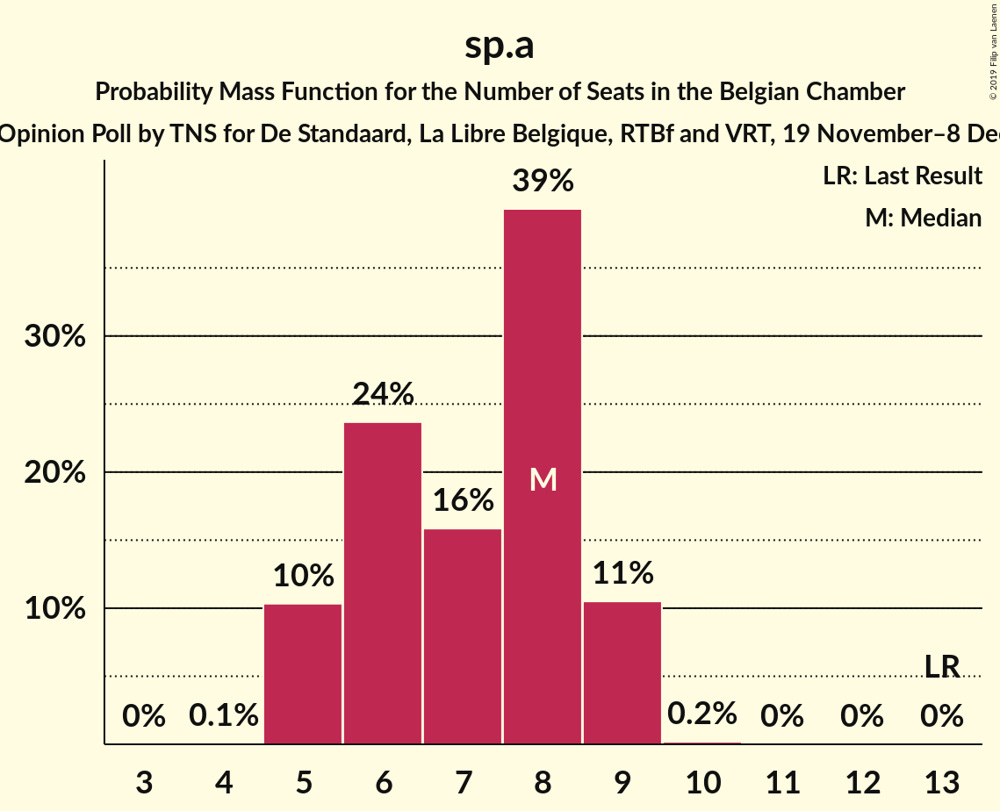

| Number of Seats | Probability | Accumulated | Special Marks |
|:---------------:|:-----------:|:-----------:|:-------------:|
| 4 | 0.1% | 100% |  |
| 5 | 10% | 99.9% |  |
| 6 | 24% | 90% |  |
| 7 | 16% | 66% |  |
| 8 | 39% | 50% | Median |
| 9 | 11% | 11% |  |
| 10 | 0.2% | 0.2% |  |
| 11 | 0% | 0% |  |
| 12 | 0% | 0% |  |
| 13 | 0% | 0% | Last Result |

### PTB

*For a full overview of the results for this party, see the [PTB](party-ptb.html) page.*

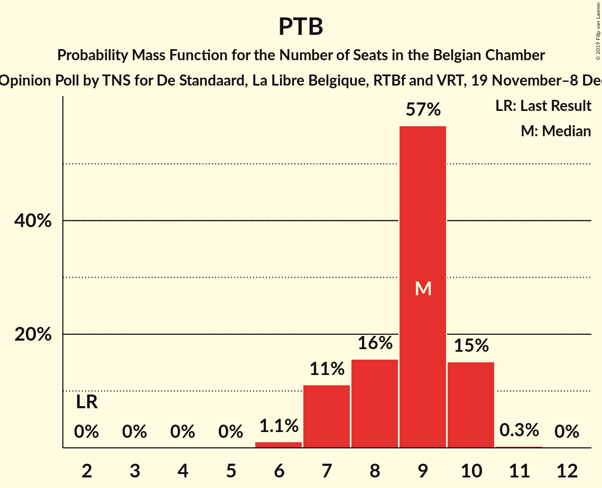

| Number of Seats | Probability | Accumulated | Special Marks |
|:---------------:|:-----------:|:-----------:|:-------------:|
| 2 | 0% | 100% | Last Result |
| 3 | 0% | 100% |  |
| 4 | 0% | 100% |  |
| 5 | 0% | 100% |  |
| 6 | 1.1% | 100% |  |
| 7 | 11% | 98.9% |  |
| 8 | 16% | 88% |  |
| 9 | 57% | 72% | Median |
| 10 | 15% | 15% |  |
| 11 | 0.3% | 0.3% |  |
| 12 | 0% | 0% |  |

### Vlaams Belang

*For a full overview of the results for this party, see the [Vlaams Belang](party-vlaamsbelang.html) page.*

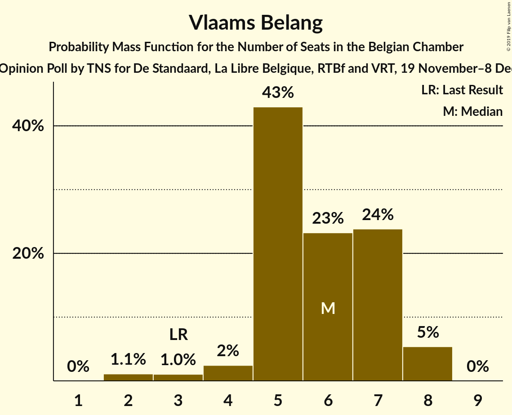

| Number of Seats | Probability | Accumulated | Special Marks |
|:---------------:|:-----------:|:-----------:|:-------------:|
| 2 | 1.1% | 100% |  |
| 3 | 1.0% | 98.9% | Last Result |
| 4 | 2% | 98% |  |
| 5 | 43% | 95% |  |
| 6 | 23% | 52% | Median |
| 7 | 24% | 29% |  |
| 8 | 5% | 5% |  |
| 9 | 0% | 0% |  |

### cdH

*For a full overview of the results for this party, see the [cdH](party-cdh.html) page.*

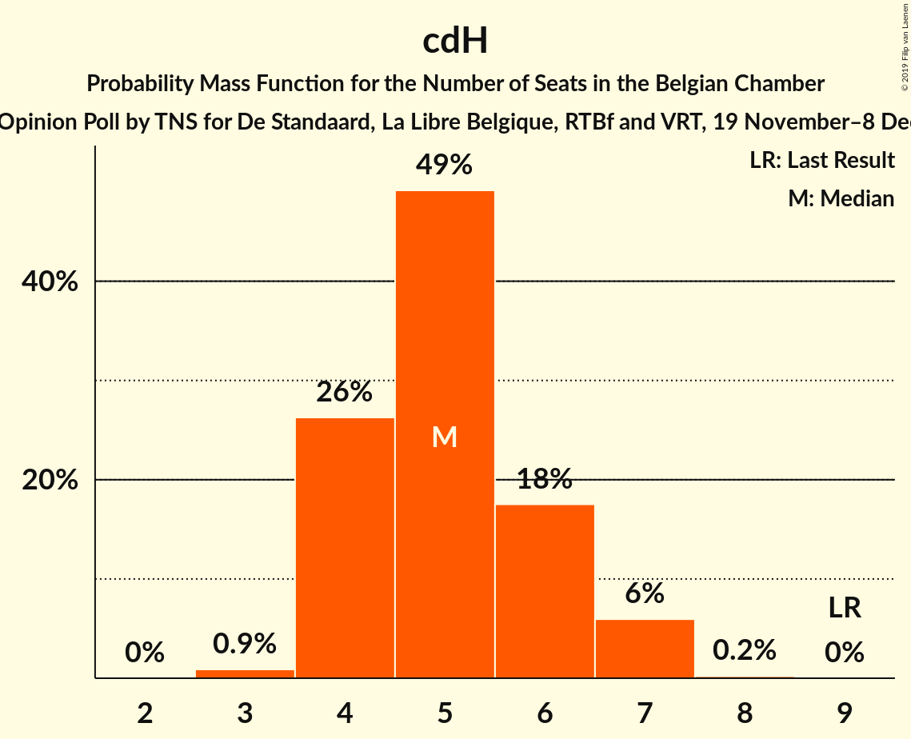

| Number of Seats | Probability | Accumulated | Special Marks |
|:---------------:|:-----------:|:-----------:|:-------------:|
| 3 | 0.9% | 100% |  |
| 4 | 26% | 99.1% |  |
| 5 | 49% | 73% | Median |
| 6 | 18% | 24% |  |
| 7 | 6% | 6% |  |
| 8 | 0.2% | 0.2% |  |
| 9 | 0% | 0% | Last Result |

### DéFI

*For a full overview of the results for this party, see the [DéFI](party-défi.html) page.*

| Number of Seats | Probability | Accumulated | Special Marks |
|:---------------:|:-----------:|:-----------:|:-------------:|
| 1 | 85% | 100% | Median |
| 2 | 15% | 15% | Last Result |
| 3 | 0% | 0% |  |

### Parti Populaire

*For a full overview of the results for this party, see the [Parti Populaire](party-partipopulaire.html) page.*

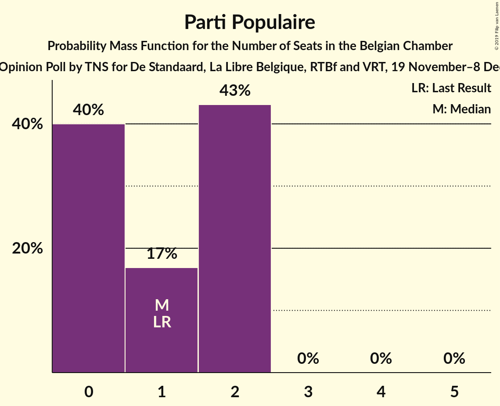

| Number of Seats | Probability | Accumulated | Special Marks |
|:---------------:|:-----------:|:-----------:|:-------------:|
| 0 | 40% | 100% |  |
| 1 | 17% | 60% | Last Result, Median |
| 2 | 43% | 43% |  |
| 3 | 0% | 0% |  |

### PVDA

*For a full overview of the results for this party, see the [PVDA](party-pvda.html) page.*

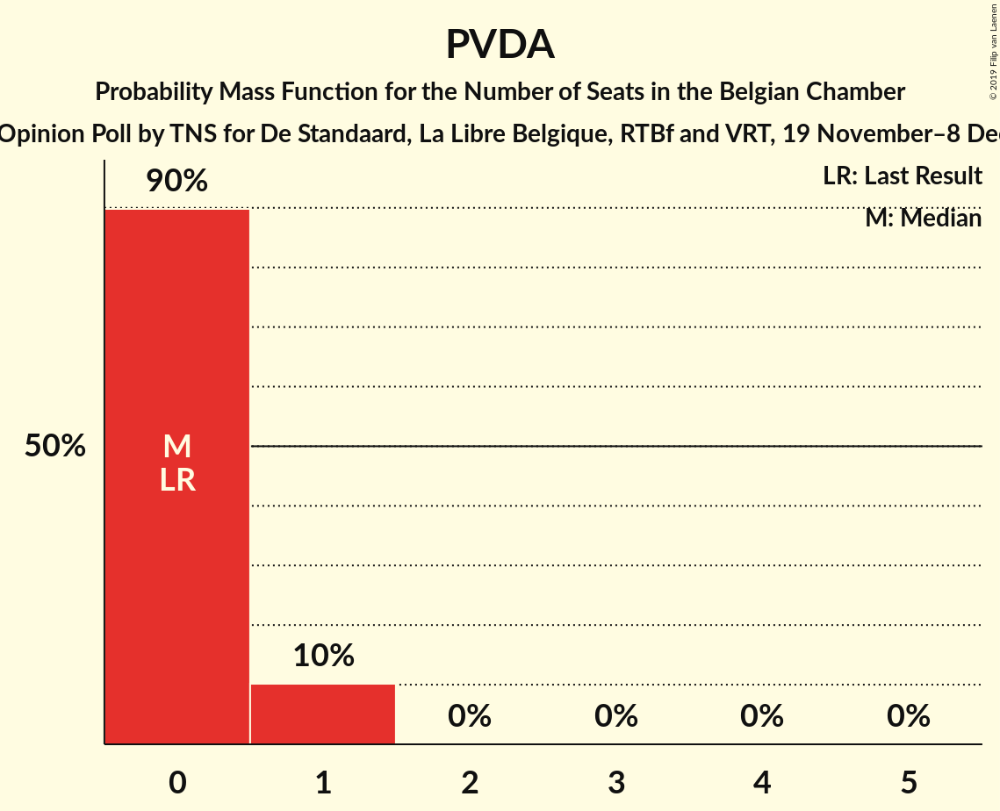

| Number of Seats | Probability | Accumulated | Special Marks |
|:---------------:|:-----------:|:-----------:|:-------------:|
| 0 | 90% | 100% | Last Result, Median |
| 1 | 10% | 10% |  |
| 2 | 0% | 0% |  |

## Coalitions

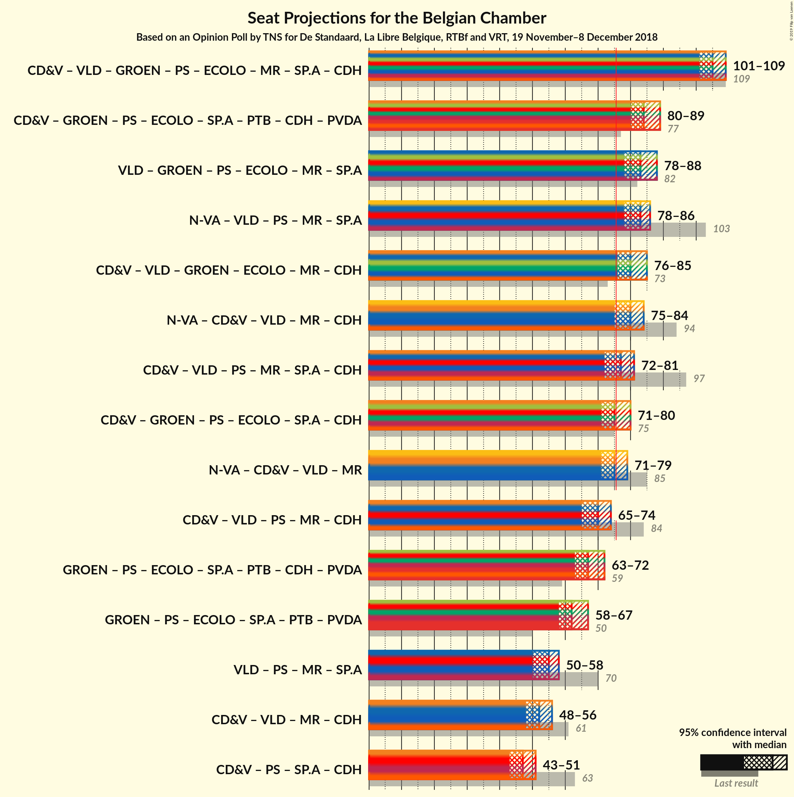

### Confidence Intervals

| Coalition | Last Result | Median | Majority? | 80% Confidence Interval | 90% Confidence Interval | 95% Confidence Interval | 99% Confidence Interval |
|:---------:|:-----------:|:------:|:---------:|:-----------------------:|:-----------------------:|:-----------------------:|:-----------------------:|
| CD&V – Open Vld – Groen – PS – Ecolo – MR – sp.a – cdH | 109 | 105 | 100% | 102–108 | 102–109 | 101–109 | 100–111 |
| CD&V – Groen – PS – Ecolo – sp.a – PTB – cdH – PVDA | 77 | 84 | 100% | 81–87 | 81–88 | 80–89 | 79–91 |
| Open Vld – Groen – PS – Ecolo – MR – sp.a | 82 | 83 | 100% | 80–86 | 79–87 | 78–88 | 77–90 |
| N-VA – Open Vld – PS – MR – sp.a | 103 | 83 | 99.8% | 80–85 | 79–86 | 78–86 | 76–88 |
| CD&V – Open Vld – Groen – Ecolo – MR – cdH | 73 | 80 | 99.0% | 78–83 | 77–84 | 76–85 | 75–86 |
| N-VA – CD&V – Open Vld – MR – cdH | 94 | 80 | 97% | 77–83 | 76–84 | 75–84 | 74–86 |
| CD&V – Open Vld – PS – MR – sp.a – cdH | 97 | 77 | 68% | 74–80 | 73–80 | 72–81 | 71–82 |
| CD&V – Groen – PS – Ecolo – sp.a – cdH | 75 | 75 | 45% | 72–78 | 72–79 | 71–80 | 70–82 |
| N-VA – CD&V – Open Vld – MR | 85 | 75 | 45% | 72–78 | 71–79 | 71–79 | 69–81 |
| CD&V – Open Vld – PS – MR – cdH | 84 | 70 | 0.2% | 67–72 | 66–73 | 65–74 | 64–75 |
| Groen – PS – Ecolo – sp.a – PTB – cdH – PVDA | 59 | 67 | 0% | 64–70 | 63–71 | 63–72 | 62–73 |
| Groen – PS – Ecolo – sp.a – PTB – PVDA | 50 | 62 | 0% | 59–65 | 58–66 | 58–67 | 57–68 |
| Open Vld – PS – MR – sp.a | 70 | 55 | 0% | 51–57 | 51–58 | 50–58 | 49–60 |
| CD&V – Open Vld – MR – cdH | 61 | 52 | 0% | 49–55 | 49–55 | 48–56 | 46–57 |
| CD&V – PS – sp.a – cdH | 63 | 47 | 0% | 44–50 | 43–50 | 43–51 | 41–52 |

### CD&V – Open Vld – Groen – PS – Ecolo – MR – sp.a – cdH

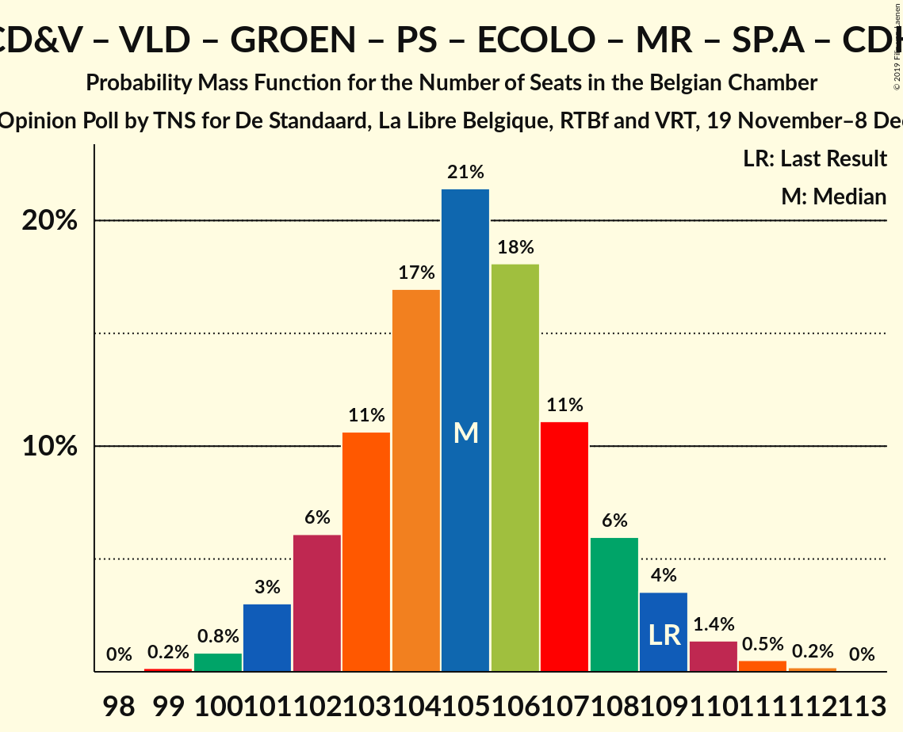

| Number of Seats | Probability | Accumulated | Special Marks |
|:---------------:|:-----------:|:-----------:|:-------------:|
| 99 | 0.2% | 100% |  |
| 100 | 0.8% | 99.8% |  |
| 101 | 3% | 99.0% |  |
| 102 | 6% | 96% |  |
| 103 | 11% | 90% |  |
| 104 | 17% | 79% |  |
| 105 | 21% | 62% |  |
| 106 | 18% | 41% | Median |
| 107 | 11% | 23% |  |
| 108 | 6% | 12% |  |
| 109 | 4% | 6% | Last Result |
| 110 | 1.4% | 2% |  |
| 111 | 0.5% | 0.7% |  |
| 112 | 0.2% | 0.2% |  |
| 113 | 0% | 0% |  |

### CD&V – Groen – PS – Ecolo – sp.a – PTB – cdH – PVDA

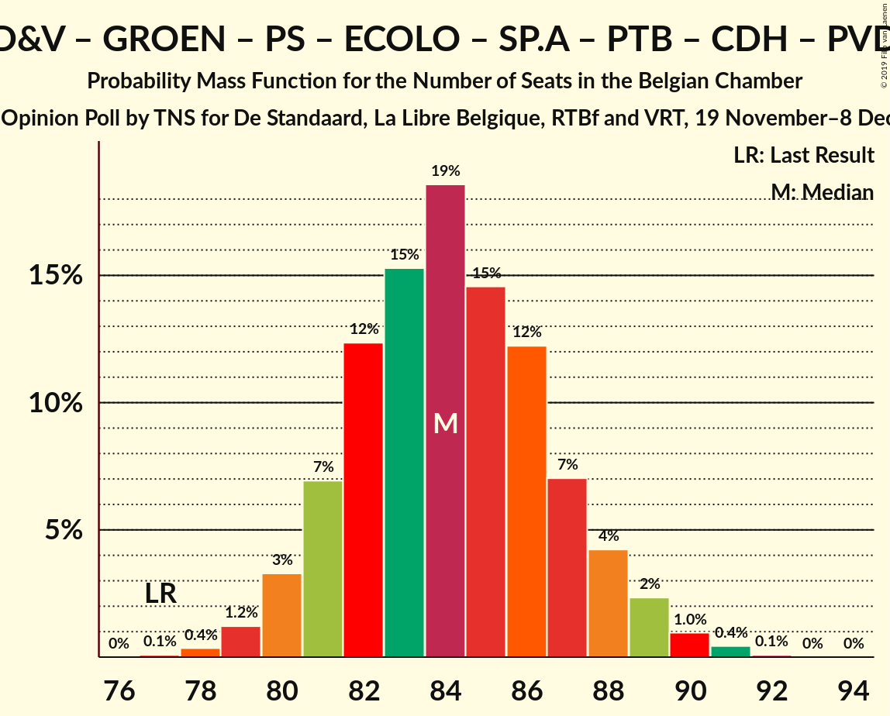

| Number of Seats | Probability | Accumulated | Special Marks |
|:---------------:|:-----------:|:-----------:|:-------------:|
| 77 | 0.1% | 100% | Last Result |
| 78 | 0.4% | 99.9% |  |
| 79 | 1.2% | 99.5% |  |
| 80 | 3% | 98% |  |
| 81 | 7% | 95% |  |
| 82 | 12% | 88% |  |
| 83 | 15% | 76% |  |
| 84 | 19% | 60% |  |
| 85 | 15% | 42% | Median |
| 86 | 12% | 27% |  |
| 87 | 7% | 15% |  |
| 88 | 4% | 8% |  |
| 89 | 2% | 4% |  |
| 90 | 1.0% | 1.5% |  |
| 91 | 0.4% | 0.5% |  |
| 92 | 0.1% | 0.1% |  |
| 93 | 0% | 0% |  |

### Open Vld – Groen – PS – Ecolo – MR – sp.a

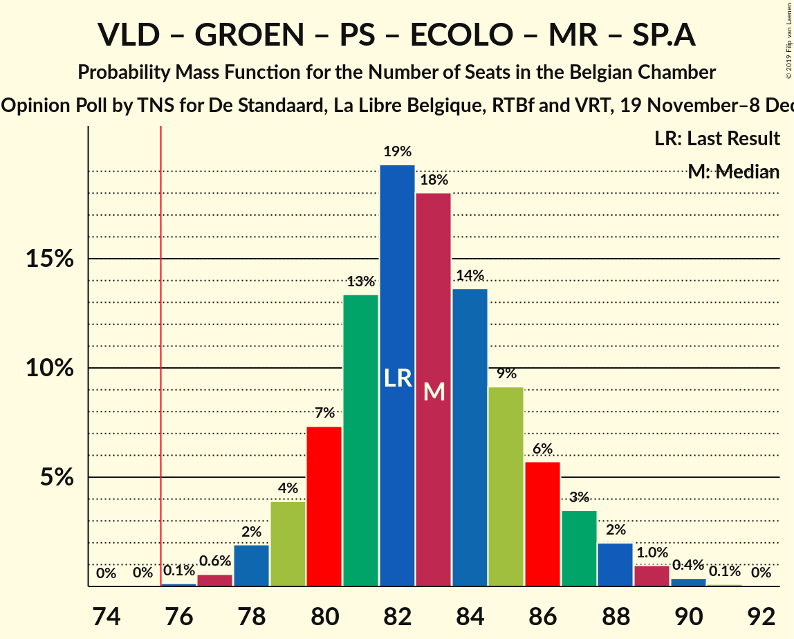

| Number of Seats | Probability | Accumulated | Special Marks |
|:---------------:|:-----------:|:-----------:|:-------------:|
| 76 | 0.1% | 100% | Majority |
| 77 | 0.6% | 99.8% |  |
| 78 | 2% | 99.3% |  |
| 79 | 4% | 97% |  |
| 80 | 7% | 93% |  |
| 81 | 13% | 86% |  |
| 82 | 19% | 73% | Last Result |
| 83 | 18% | 53% | Median |
| 84 | 14% | 35% |  |
| 85 | 9% | 22% |  |
| 86 | 6% | 13% |  |
| 87 | 3% | 7% |  |
| 88 | 2% | 3% |  |
| 89 | 1.0% | 1.5% |  |
| 90 | 0.4% | 0.5% |  |
| 91 | 0.1% | 0.1% |  |
| 92 | 0% | 0% |  |

### N-VA – Open Vld – PS – MR – sp.a

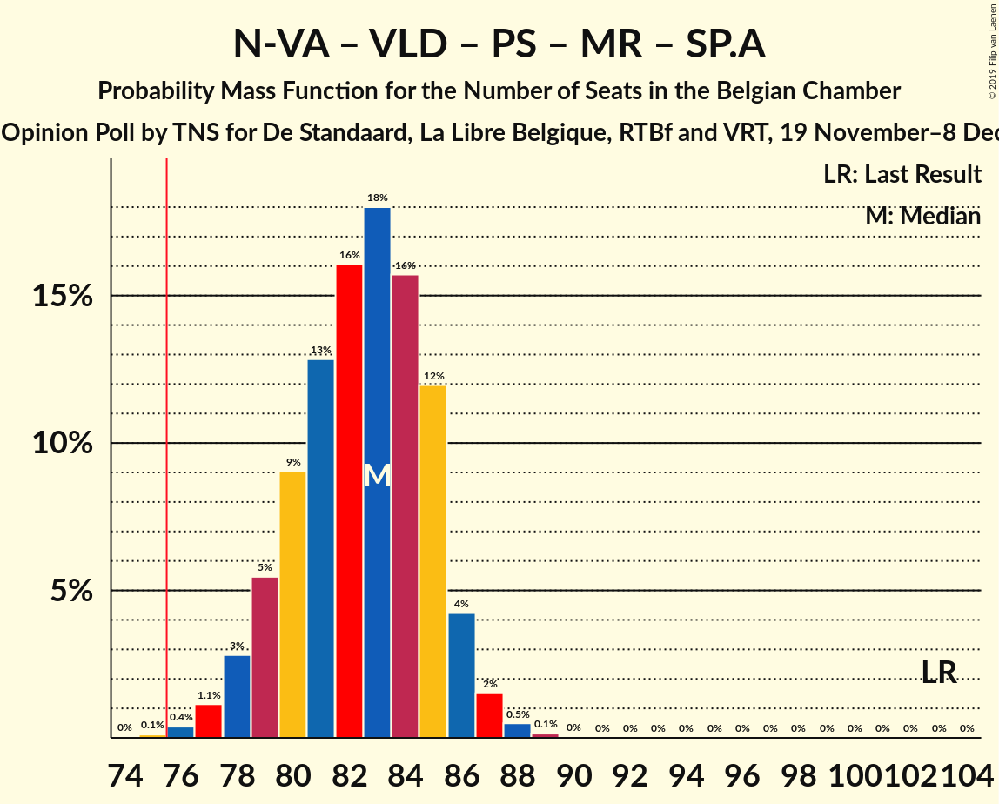

| Number of Seats | Probability | Accumulated | Special Marks |
|:---------------:|:-----------:|:-----------:|:-------------:|
| 75 | 0.1% | 100% |  |
| 76 | 0.4% | 99.8% | Majority |
| 77 | 1.1% | 99.5% |  |
| 78 | 3% | 98% |  |
| 79 | 5% | 96% |  |
| 80 | 9% | 90% |  |
| 81 | 13% | 81% |  |
| 82 | 16% | 68% |  |
| 83 | 18% | 52% | Median |
| 84 | 16% | 34% |  |
| 85 | 12% | 18% |  |
| 86 | 4% | 6% |  |
| 87 | 2% | 2% |  |
| 88 | 0.5% | 0.7% |  |
| 89 | 0.1% | 0.2% |  |
| 90 | 0% | 0% |  |
| 91 | 0% | 0% |  |
| 92 | 0% | 0% |  |
| 93 | 0% | 0% |  |
| 94 | 0% | 0% |  |
| 95 | 0% | 0% |  |
| 96 | 0% | 0% |  |
| 97 | 0% | 0% |  |
| 98 | 0% | 0% |  |
| 99 | 0% | 0% |  |
| 100 | 0% | 0% |  |
| 101 | 0% | 0% |  |
| 102 | 0% | 0% |  |
| 103 | 0% | 0% | Last Result |

### CD&V – Open Vld – Groen – Ecolo – MR – cdH

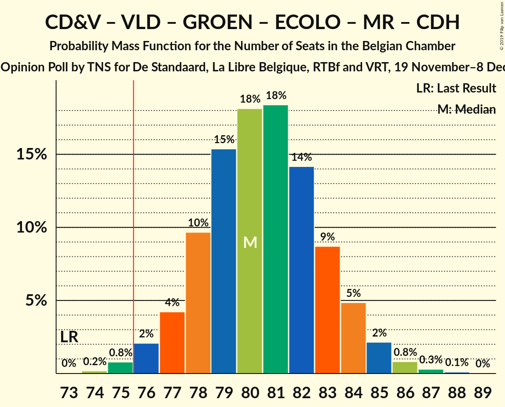

| Number of Seats | Probability | Accumulated | Special Marks |
|:---------------:|:-----------:|:-----------:|:-------------:|
| 73 | 0% | 100% | Last Result |
| 74 | 0.2% | 100% |  |
| 75 | 0.8% | 99.8% |  |
| 76 | 2% | 99.0% | Majority |
| 77 | 4% | 97% |  |
| 78 | 10% | 93% |  |
| 79 | 15% | 83% |  |
| 80 | 18% | 68% |  |
| 81 | 18% | 50% | Median |
| 82 | 14% | 31% |  |
| 83 | 9% | 17% |  |
| 84 | 5% | 8% |  |
| 85 | 2% | 3% |  |
| 86 | 0.8% | 1.3% |  |
| 87 | 0.3% | 0.4% |  |
| 88 | 0.1% | 0.1% |  |
| 89 | 0% | 0% |  |

### N-VA – CD&V – Open Vld – MR – cdH

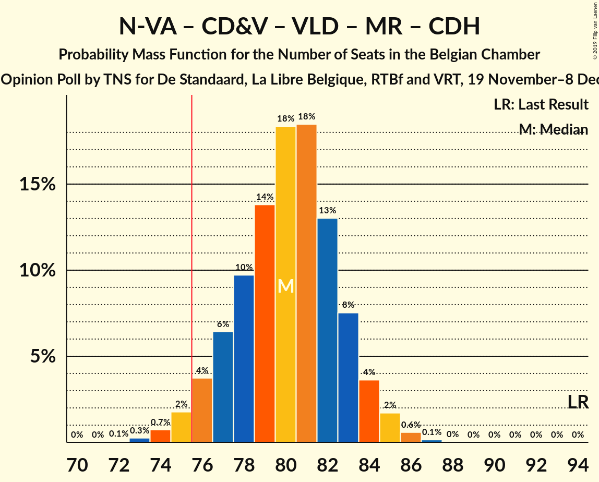

| Number of Seats | Probability | Accumulated | Special Marks |
|:---------------:|:-----------:|:-----------:|:-------------:|
| 72 | 0.1% | 100% |  |
| 73 | 0.3% | 99.9% |  |
| 74 | 0.7% | 99.7% |  |
| 75 | 2% | 99.0% |  |
| 76 | 4% | 97% | Majority |
| 77 | 6% | 93% |  |
| 78 | 10% | 87% |  |
| 79 | 14% | 77% |  |
| 80 | 18% | 63% |  |
| 81 | 18% | 45% | Median |
| 82 | 13% | 27% |  |
| 83 | 8% | 14% |  |
| 84 | 4% | 6% |  |
| 85 | 2% | 2% |  |
| 86 | 0.6% | 0.8% |  |
| 87 | 0.1% | 0.2% |  |
| 88 | 0% | 0% |  |
| 89 | 0% | 0% |  |
| 90 | 0% | 0% |  |
| 91 | 0% | 0% |  |
| 92 | 0% | 0% |  |
| 93 | 0% | 0% |  |
| 94 | 0% | 0% | Last Result |

### CD&V – Open Vld – PS – MR – sp.a – cdH

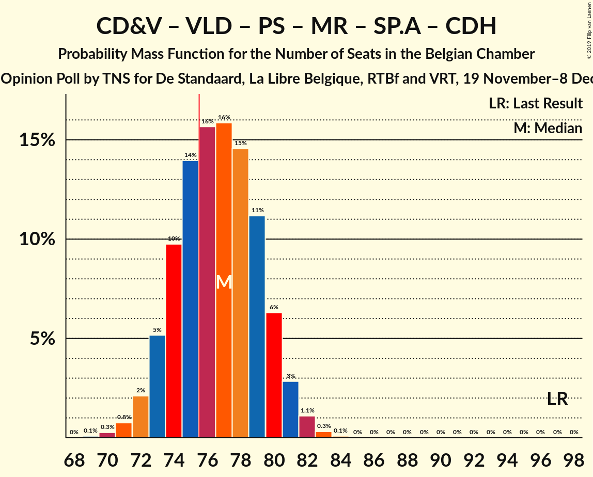

| Number of Seats | Probability | Accumulated | Special Marks |
|:---------------:|:-----------:|:-----------:|:-------------:|
| 69 | 0.1% | 100% |  |
| 70 | 0.3% | 99.9% |  |
| 71 | 0.8% | 99.6% |  |
| 72 | 2% | 98.9% |  |
| 73 | 5% | 97% |  |
| 74 | 10% | 92% |  |
| 75 | 14% | 82% |  |
| 76 | 16% | 68% | Majority |
| 77 | 16% | 52% |  |
| 78 | 15% | 36% | Median |
| 79 | 11% | 22% |  |
| 80 | 6% | 11% |  |
| 81 | 3% | 4% |  |
| 82 | 1.1% | 2% |  |
| 83 | 0.3% | 0.4% |  |
| 84 | 0.1% | 0.1% |  |
| 85 | 0% | 0% |  |
| 86 | 0% | 0% |  |
| 87 | 0% | 0% |  |
| 88 | 0% | 0% |  |
| 89 | 0% | 0% |  |
| 90 | 0% | 0% |  |
| 91 | 0% | 0% |  |
| 92 | 0% | 0% |  |
| 93 | 0% | 0% |  |
| 94 | 0% | 0% |  |
| 95 | 0% | 0% |  |
| 96 | 0% | 0% |  |
| 97 | 0% | 0% | Last Result |

### CD&V – Groen – PS – Ecolo – sp.a – cdH

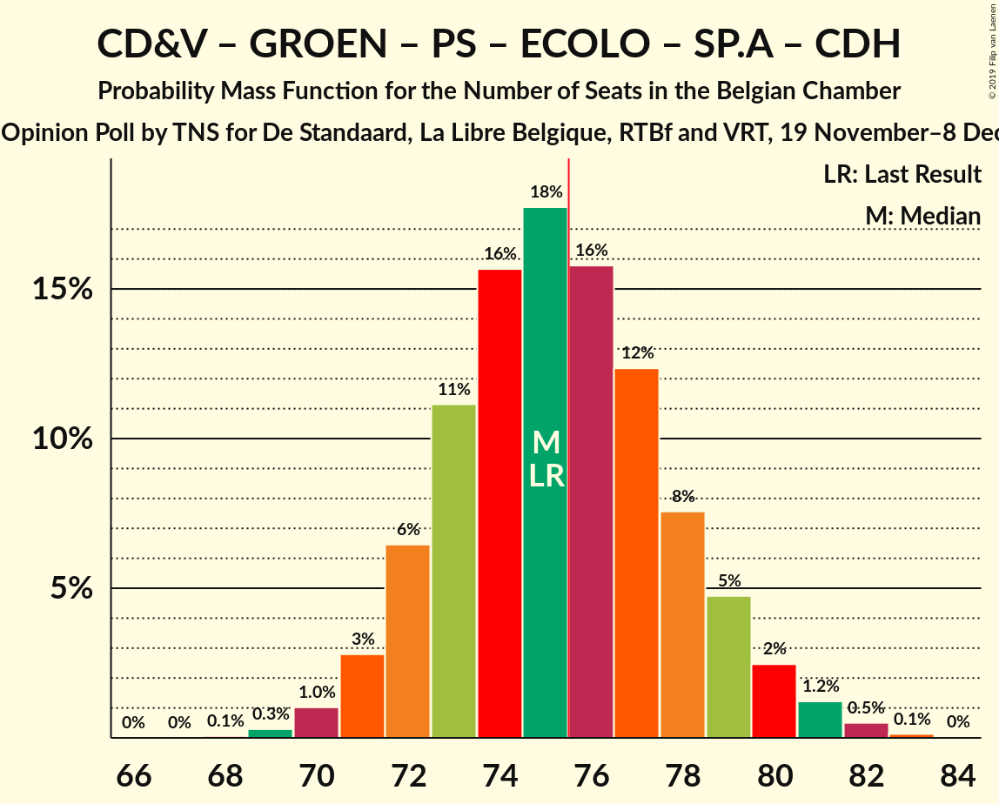

| Number of Seats | Probability | Accumulated | Special Marks |
|:---------------:|:-----------:|:-----------:|:-------------:|
| 68 | 0.1% | 100% |  |
| 69 | 0.3% | 99.9% |  |
| 70 | 1.0% | 99.6% |  |
| 71 | 3% | 98.6% |  |
| 72 | 6% | 96% |  |
| 73 | 11% | 89% |  |
| 74 | 16% | 78% |  |
| 75 | 18% | 63% | Last Result |
| 76 | 16% | 45% | Median, Majority |
| 77 | 12% | 29% |  |
| 78 | 8% | 17% |  |
| 79 | 5% | 9% |  |
| 80 | 2% | 4% |  |
| 81 | 1.2% | 2% |  |
| 82 | 0.5% | 0.7% |  |
| 83 | 0.1% | 0.2% |  |
| 84 | 0% | 0% |  |

### N-VA – CD&V – Open Vld – MR

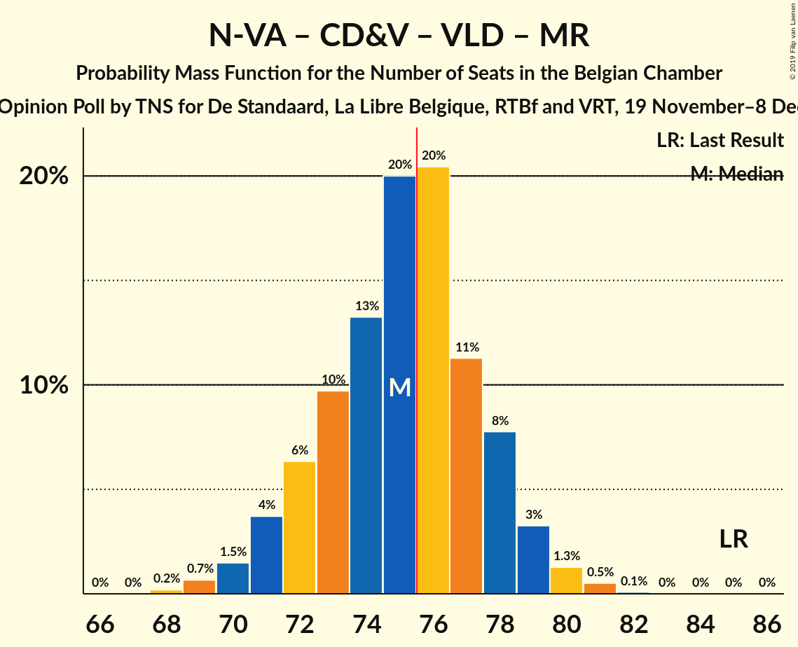

| Number of Seats | Probability | Accumulated | Special Marks |
|:---------------:|:-----------:|:-----------:|:-------------:|
| 68 | 0.2% | 100% |  |
| 69 | 0.7% | 99.8% |  |
| 70 | 1.5% | 99.1% |  |
| 71 | 4% | 98% |  |
| 72 | 6% | 94% |  |
| 73 | 10% | 88% |  |
| 74 | 13% | 78% |  |
| 75 | 20% | 65% |  |
| 76 | 20% | 45% | Median, Majority |
| 77 | 11% | 24% |  |
| 78 | 8% | 13% |  |
| 79 | 3% | 5% |  |
| 80 | 1.3% | 2% |  |
| 81 | 0.5% | 0.6% |  |
| 82 | 0.1% | 0.1% |  |
| 83 | 0% | 0% |  |
| 84 | 0% | 0% |  |
| 85 | 0% | 0% | Last Result |

### CD&V – Open Vld – PS – MR – cdH

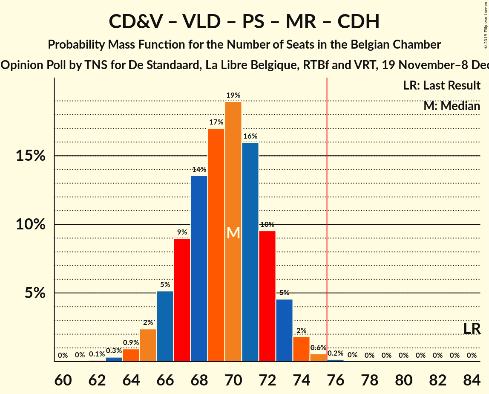

| Number of Seats | Probability | Accumulated | Special Marks |
|:---------------:|:-----------:|:-----------:|:-------------:|
| 62 | 0.1% | 100% |  |
| 63 | 0.3% | 99.9% |  |
| 64 | 0.9% | 99.5% |  |
| 65 | 2% | 98.6% |  |
| 66 | 5% | 96% |  |
| 67 | 9% | 91% |  |
| 68 | 14% | 82% |  |
| 69 | 17% | 69% |  |
| 70 | 19% | 52% | Median |
| 71 | 16% | 33% |  |
| 72 | 10% | 17% |  |
| 73 | 5% | 7% |  |
| 74 | 2% | 3% |  |
| 75 | 0.6% | 0.8% |  |
| 76 | 0.2% | 0.2% | Majority |
| 77 | 0% | 0% |  |
| 78 | 0% | 0% |  |
| 79 | 0% | 0% |  |
| 80 | 0% | 0% |  |
| 81 | 0% | 0% |  |
| 82 | 0% | 0% |  |
| 83 | 0% | 0% |  |
| 84 | 0% | 0% | Last Result |

### Groen – PS – Ecolo – sp.a – PTB – cdH – PVDA

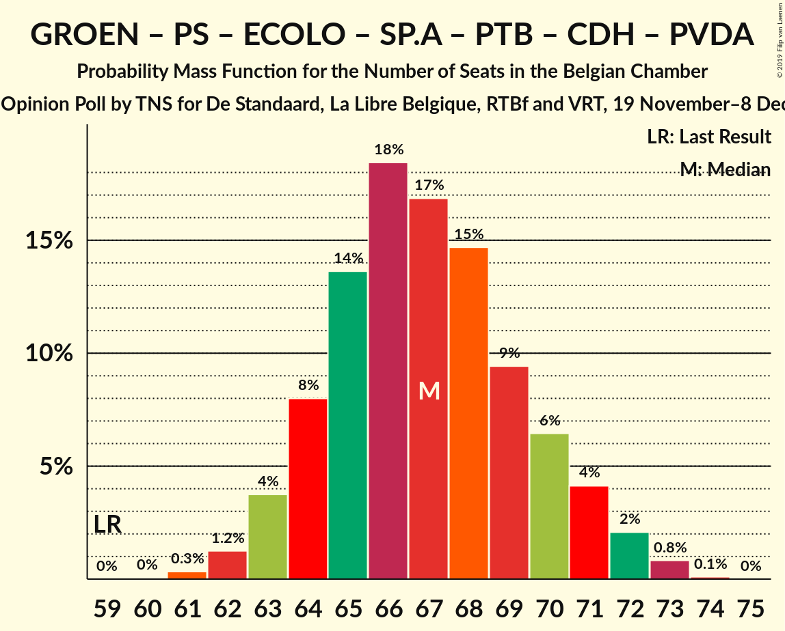

| Number of Seats | Probability | Accumulated | Special Marks |
|:---------------:|:-----------:|:-----------:|:-------------:|
| 59 | 0% | 100% | Last Result |
| 60 | 0% | 100% |  |
| 61 | 0.3% | 100% |  |
| 62 | 1.2% | 99.6% |  |
| 63 | 4% | 98% |  |
| 64 | 8% | 95% |  |
| 65 | 14% | 87% |  |
| 66 | 18% | 73% |  |
| 67 | 17% | 55% | Median |
| 68 | 15% | 38% |  |
| 69 | 9% | 23% |  |
| 70 | 6% | 14% |  |
| 71 | 4% | 7% |  |
| 72 | 2% | 3% |  |
| 73 | 0.8% | 0.9% |  |
| 74 | 0.1% | 0.1% |  |
| 75 | 0% | 0% |  |

### Groen – PS – Ecolo – sp.a – PTB – PVDA

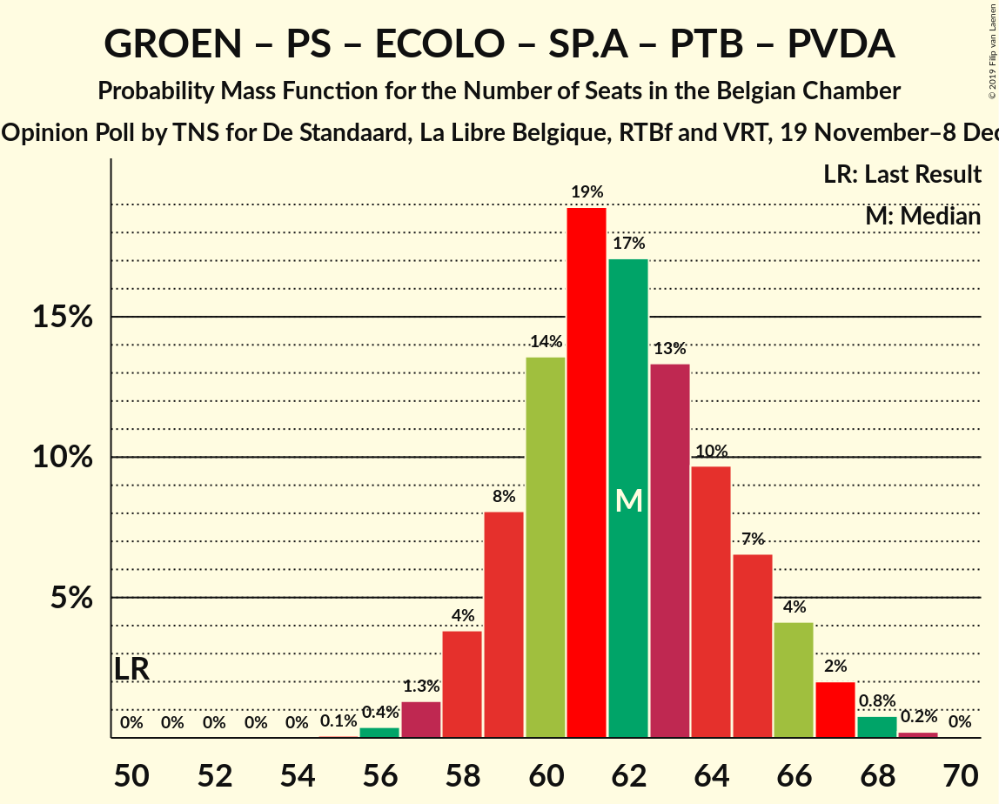

| Number of Seats | Probability | Accumulated | Special Marks |
|:---------------:|:-----------:|:-----------:|:-------------:|
| 50 | 0% | 100% | Last Result |
| 51 | 0% | 100% |  |
| 52 | 0% | 100% |  |
| 53 | 0% | 100% |  |
| 54 | 0% | 100% |  |
| 55 | 0.1% | 100% |  |
| 56 | 0.4% | 99.9% |  |
| 57 | 1.3% | 99.5% |  |
| 58 | 4% | 98% |  |
| 59 | 8% | 94% |  |
| 60 | 14% | 86% |  |
| 61 | 19% | 73% |  |
| 62 | 17% | 54% | Median |
| 63 | 13% | 37% |  |
| 64 | 10% | 23% |  |
| 65 | 7% | 14% |  |
| 66 | 4% | 7% |  |
| 67 | 2% | 3% |  |
| 68 | 0.8% | 1.0% |  |
| 69 | 0.2% | 0.2% |  |
| 70 | 0% | 0% |  |

### Open Vld – PS – MR – sp.a

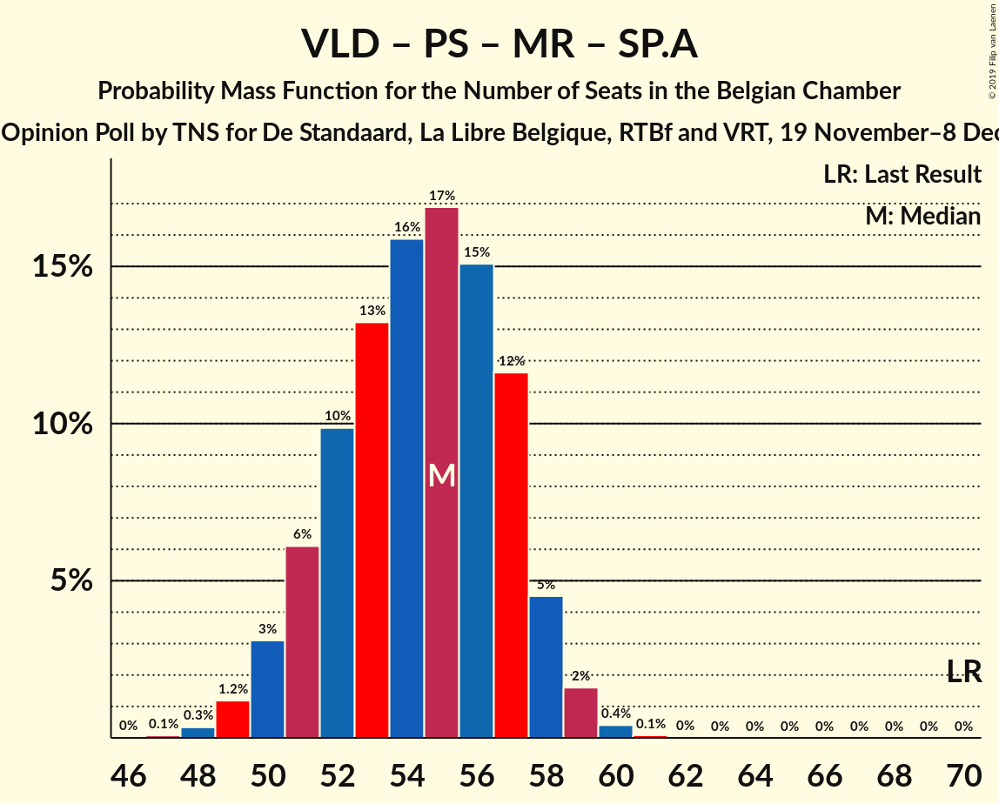

| Number of Seats | Probability | Accumulated | Special Marks |
|:---------------:|:-----------:|:-----------:|:-------------:|
| 47 | 0.1% | 100% |  |
| 48 | 0.3% | 99.9% |  |
| 49 | 1.2% | 99.6% |  |
| 50 | 3% | 98% |  |
| 51 | 6% | 95% |  |
| 52 | 10% | 89% |  |
| 53 | 13% | 79% |  |
| 54 | 16% | 66% |  |
| 55 | 17% | 50% | Median |
| 56 | 15% | 33% |  |
| 57 | 12% | 18% |  |
| 58 | 5% | 7% |  |
| 59 | 2% | 2% |  |
| 60 | 0.4% | 0.5% |  |
| 61 | 0.1% | 0.1% |  |
| 62 | 0% | 0% |  |
| 63 | 0% | 0% |  |
| 64 | 0% | 0% |  |
| 65 | 0% | 0% |  |
| 66 | 0% | 0% |  |
| 67 | 0% | 0% |  |
| 68 | 0% | 0% |  |
| 69 | 0% | 0% |  |
| 70 | 0% | 0% | Last Result |

### CD&V – Open Vld – MR – cdH

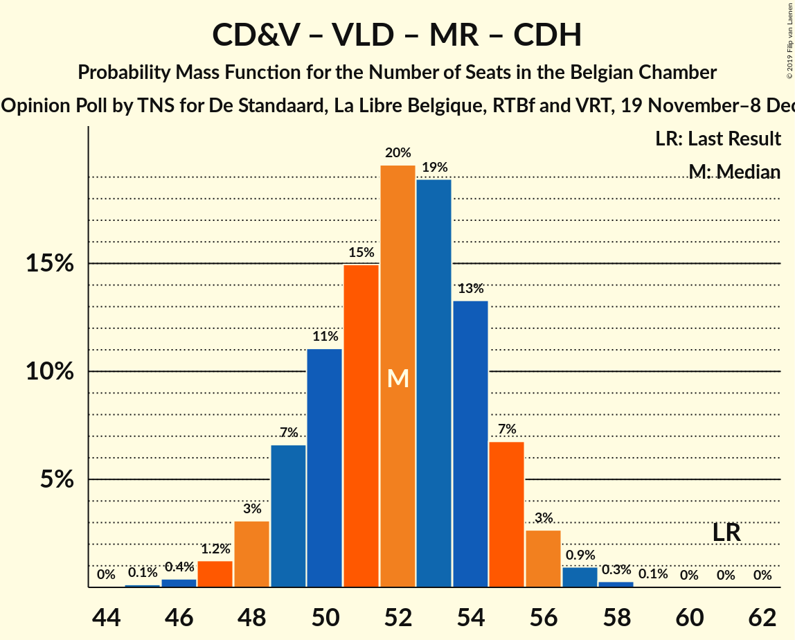

| Number of Seats | Probability | Accumulated | Special Marks |
|:---------------:|:-----------:|:-----------:|:-------------:|
| 45 | 0.1% | 100% |  |
| 46 | 0.4% | 99.8% |  |
| 47 | 1.2% | 99.4% |  |
| 48 | 3% | 98% |  |
| 49 | 7% | 95% |  |
| 50 | 11% | 88% |  |
| 51 | 15% | 77% |  |
| 52 | 20% | 62% |  |
| 53 | 19% | 43% | Median |
| 54 | 13% | 24% |  |
| 55 | 7% | 11% |  |
| 56 | 3% | 4% |  |
| 57 | 0.9% | 1.3% |  |
| 58 | 0.3% | 0.4% |  |
| 59 | 0.1% | 0.1% |  |
| 60 | 0% | 0% |  |
| 61 | 0% | 0% | Last Result |

### CD&V – PS – sp.a – cdH

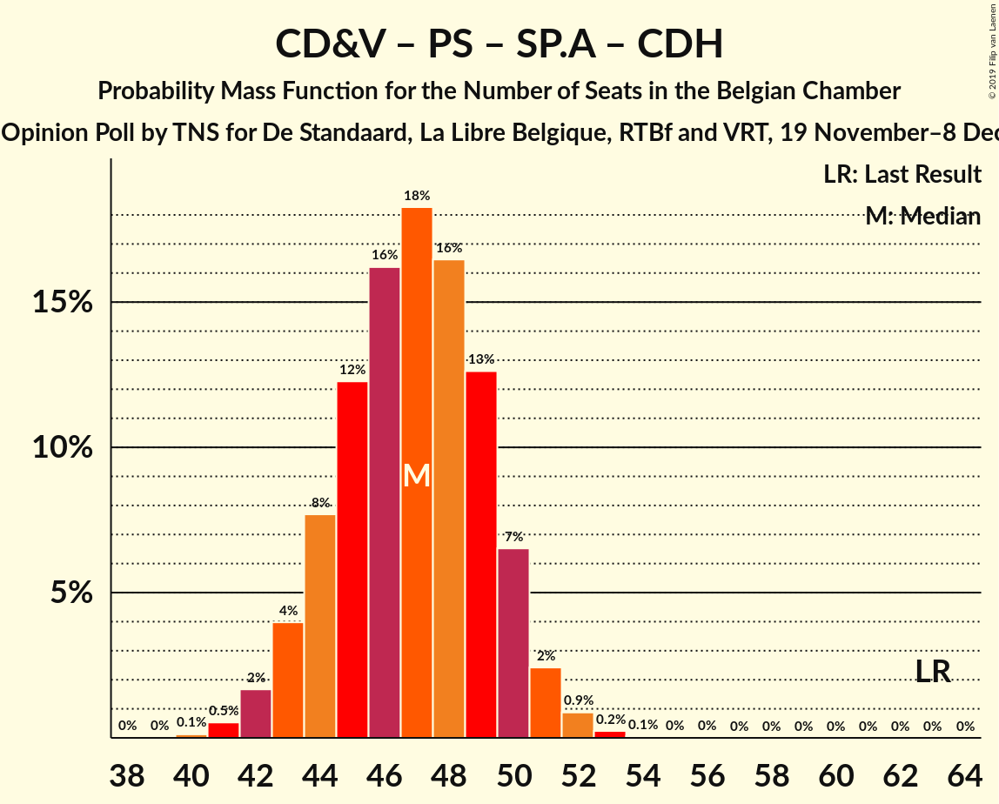

| Number of Seats | Probability | Accumulated | Special Marks |
|:---------------:|:-----------:|:-----------:|:-------------:|
| 40 | 0.1% | 100% |  |
| 41 | 0.5% | 99.9% |  |
| 42 | 2% | 99.3% |  |
| 43 | 4% | 98% |  |
| 44 | 8% | 94% |  |
| 45 | 12% | 86% |  |
| 46 | 16% | 74% |  |
| 47 | 18% | 57% |  |
| 48 | 16% | 39% | Median |
| 49 | 13% | 23% |  |
| 50 | 7% | 10% |  |
| 51 | 2% | 4% |  |
| 52 | 0.9% | 1.2% |  |
| 53 | 0.2% | 0.3% |  |
| 54 | 0.1% | 0.1% |  |
| 55 | 0% | 0% |  |
| 56 | 0% | 0% |  |
| 57 | 0% | 0% |  |
| 58 | 0% | 0% |  |
| 59 | 0% | 0% |  |
| 60 | 0% | 0% |  |
| 61 | 0% | 0% |  |
| 62 | 0% | 0% |  |
| 63 | 0% | 0% | Last Result |

## Technical Information

### Opinion Poll

+ **Polling firm:** TNS
+ **Commissioner(s):** De Standaard, La Libre Belgique, RTBf and VRT
+ **Fieldwork period:** 19 November–8 December 2018

### Calculations

+ **Sample size:** 1678
+ **Simulations done:** 1,048,576
+ **Error estimate:** 1.78%

