# Opinion Poll by Ipsos for Het Laatste Nieuws, Le Soir, RTL TVi and VTM, 4–9 March 2020

Areas included: Brussels, Flanders, Wallonia

<a href="#voting-intentions">Voting Intentions</a> | <a href="#seats">Seats</a> | <a href="#coalitions">Coalitions</a> | <a href="#technical-information">Technical Information</a>

## Voting Intentions

### Confidence Intervals

| Party | Last Result | Poll Result | 80% Confidence Interval | 90% Confidence Interval | 95% Confidence Interval | 99% Confidence Interval |
|:-----:|:-----------:|:-----------:|:-----------------------:|:-----------------------:|:-----------------------:|:-----------------------:|
| Vlaams Belang | 12.0% | 17.6% | 15.6–16.5% |15.4–16.6% |15.2–16.6% |14.8–16.6% |
| Nieuw-Vlaamse Alliantie | 16.0% | 13.1% | 11.4–12.2% |11.2–12.2% |11.0–12.2% |10.6–12.2% |
| Parti Socialiste | 9.5% | 9.4% | 8.4–8.8% |8.3–8.8% |8.2–8.8% |8.0–8.8% |
| Christen-Democratisch en Vlaams | 8.9% | 7.3% | 6.0–6.6% |5.8–6.6% |5.7–6.6% |5.4–6.6% |
| Mouvement Réformateur | 7.6% | 7.3% | 6.4–6.8% |6.3–6.8% |6.2–6.8% |6.0–6.8% |
| Parti du Travail de Belgique | 4.8% | 6.6% | 5.7–6.1% |5.6–6.1% |5.5–6.1% |5.4–6.1% |
| Open Vlaamse Liberalen en Democraten | 8.5% | 6.5% | 5.2–5.8% |5.1–5.8% |5.0–5.8% |4.7–5.8% |
| Ecolo | 6.1% | 6.4% | 5.5–5.8% |5.4–5.9% |5.3–5.9% |5.2–5.9% |
| Socialistische Partij Anders | 6.7% | 5.9% | 5.2–6.5% |5.0–6.6% |4.9–6.7% |4.6–6.7% |
| Partij van de Arbeid van België | 3.3% | 5.7% | 5.0–6.3% |4.8–6.4% |4.7–6.5% |4.4–6.5% |
| Groen | 6.1% | 5.4% | 4.7–6.0% |4.5–6.1% |4.4–6.1% |4.1–6.2% |
| Centre démocrate humaniste | 3.7% | 2.6% | 2.0–2.2% |2.0–2.2% |1.9–2.2% |1.8–2.2% |
| DéFI | 2.2% | 2.3% | 1.8–2.0% |1.8–2.0% |1.7–2.0% |1.6–2.0% |

*Note:* The poll result column reflects the actual value used in the calculations. Published results may vary slightly, and in addition be rounded to fewer digits.

## Seats

### Confidence Intervals

| Party | Last Result | Median | 80% Confidence Interval | 90% Confidence Interval | 95% Confidence Interval | 99% Confidence Interval |
|:-----:|:-----------:|:------:|:-----------------------:|:-----------------------:|:-----------------------:|:-----------------------:|
| <a href="#vlaams-belang">Vlaams Belang</a> | 18 | 26 | 25–29 |24–30 |24–30 |23–31 |
| <a href="#nieuw-vlaamse-alliantie">Nieuw-Vlaamse Alliantie</a> | 25 | 19 | 18–21 |17–22 |17–22 |15–24 |
| <a href="#parti-socialiste">Parti Socialiste</a> | 20 | 19 | 18–21 |18–21 |17–21 |17–22 |
| <a href="#christen-democratisch-en-vlaams">Christen-Democratisch en Vlaams</a> | 12 | 10 | 9–11 |9–11 |8–12 |6–14 |
| <a href="#mouvement-réformateur">Mouvement Réformateur</a> | 14 | 14 | 13–15 |13–16 |12–17 |12–18 |
| <a href="#parti-du-travail-de-belgique">Parti du Travail de Belgique</a> | 9 | 11 | 10–13 |10–13 |10–14 |9–15 |
| <a href="#open-vlaamse-liberalen-en-democraten">Open Vlaamse Liberalen en Democraten</a> | 12 | 9 | 7–10 |6–10 |6–10 |6–11 |
| <a href="#ecolo">Ecolo</a> | 13 | 12 | 11–14 |11–14 |10–14 |10–15 |
| <a href="#socialistische-partij-anders">Socialistische Partij Anders</a> | 9 | 8 | 6–9 |6–10 |6–10 |5–11 |
| <a href="#partij-van-de-arbeid-van-belgië">Partij van de Arbeid van België</a> | 3 | 8 | 7–8 |6–9 |5–9 |5–10 |
| <a href="#groen">Groen</a> | 8 | 7 | 5–9 |5–9 |5–9 |5–9 |
| <a href="#centre-démocrate-humaniste">Centre démocrate humaniste</a> | 5 | 4 | 2–4 |2–5 |1–5 |0–5 |
| <a href="#défi">DéFI</a> | 2 | 2 | 1–3 |1–4 |1–4 |1–4 |

### Vlaams Belang

*For a full overview of the results for this party, see the [Vlaams Belang](party-vlaamsbelang.html) page.*

| Number of Seats | Probability | Accumulated | Special Marks |
|:---------------:|:-----------:|:-----------:|:-------------:|
| 18 | 0% | 100% | Last Result |
| 19 | 0% | 100% |  |
| 20 | 0% | 100% |  |
| 21 | 0.1% | 100% |  |
| 22 | 0.3% | 99.9% |  |
| 23 | 1.3% | 99.6% |  |
| 24 | 4% | 98% |  |
| 25 | 31% | 95% |  |
| 26 | 18% | 64% | Median |
| 27 | 13% | 45% |  |
| 28 | 8% | 33% |  |
| 29 | 15% | 25% |  |
| 30 | 8% | 9% |  |
| 31 | 1.0% | 1.2% |  |
| 32 | 0.1% | 0.2% |  |
| 33 | 0% | 0% |  |

### Nieuw-Vlaamse Alliantie

*For a full overview of the results for this party, see the [Nieuw-Vlaamse Alliantie](party-nieuw-vlaamsealliantie.html) page.*

| Number of Seats | Probability | Accumulated | Special Marks |
|:---------------:|:-----------:|:-----------:|:-------------:|
| 15 | 0.6% | 100% |  |
| 16 | 1.5% | 99.4% |  |
| 17 | 5% | 98% |  |
| 18 | 31% | 93% |  |
| 19 | 17% | 63% | Median |
| 20 | 21% | 45% |  |
| 21 | 17% | 25% |  |
| 22 | 6% | 8% |  |
| 23 | 1.5% | 2% |  |
| 24 | 0.7% | 0.9% |  |
| 25 | 0.2% | 0.2% | Last Result |
| 26 | 0% | 0% |  |

### Parti Socialiste

*For a full overview of the results for this party, see the [Parti Socialiste](party-partisocialiste.html) page.*

| Number of Seats | Probability | Accumulated | Special Marks |
|:---------------:|:-----------:|:-----------:|:-------------:|
| 16 | 0.4% | 100% |  |
| 17 | 3% | 99.5% |  |
| 18 | 13% | 97% |  |
| 19 | 51% | 84% | Median |
| 20 | 19% | 33% | Last Result |
| 21 | 13% | 15% |  |
| 22 | 1.5% | 2% |  |
| 23 | 0% | 0% |  |

### Christen-Democratisch en Vlaams

*For a full overview of the results for this party, see the [Christen-Democratisch en Vlaams](party-christen-democratischenvlaams.html) page.*

| Number of Seats | Probability | Accumulated | Special Marks |
|:---------------:|:-----------:|:-----------:|:-------------:|
| 6 | 0.8% | 100% |  |
| 7 | 0.4% | 99.1% |  |
| 8 | 2% | 98.7% |  |
| 9 | 8% | 97% |  |
| 10 | 67% | 89% | Median |
| 11 | 19% | 22% |  |
| 12 | 1.5% | 3% | Last Result |
| 13 | 0.8% | 1.4% |  |
| 14 | 0.6% | 0.7% |  |
| 15 | 0.1% | 0.1% |  |
| 16 | 0% | 0% |  |

### Mouvement Réformateur

*For a full overview of the results for this party, see the [Mouvement Réformateur](party-mouvementréformateur.html) page.*

| Number of Seats | Probability | Accumulated | Special Marks |
|:---------------:|:-----------:|:-----------:|:-------------:|
| 11 | 0.4% | 100% |  |
| 12 | 2% | 99.6% |  |
| 13 | 21% | 97% |  |
| 14 | 45% | 76% | Last Result, Median |
| 15 | 22% | 32% |  |
| 16 | 5% | 9% |  |
| 17 | 3% | 4% |  |
| 18 | 0.9% | 0.9% |  |
| 19 | 0% | 0% |  |

### Parti du Travail de Belgique

*For a full overview of the results for this party, see the [Parti du Travail de Belgique](party-partidutravaildebelgique.html) page.*

| Number of Seats | Probability | Accumulated | Special Marks |
|:---------------:|:-----------:|:-----------:|:-------------:|
| 8 | 0.1% | 100% |  |
| 9 | 1.4% | 99.9% | Last Result |
| 10 | 13% | 98.5% |  |
| 11 | 40% | 85% | Median |
| 12 | 31% | 45% |  |
| 13 | 11% | 14% |  |
| 14 | 3% | 4% |  |
| 15 | 0.6% | 0.8% |  |
| 16 | 0.2% | 0.2% |  |
| 17 | 0% | 0% |  |

### Open Vlaamse Liberalen en Democraten

*For a full overview of the results for this party, see the [Open Vlaamse Liberalen en Democraten](party-openvlaamseliberalenendemocraten.html) page.*

| Number of Seats | Probability | Accumulated | Special Marks |
|:---------------:|:-----------:|:-----------:|:-------------:|
| 6 | 8% | 100% |  |
| 7 | 17% | 92% |  |
| 8 | 12% | 75% |  |
| 9 | 20% | 64% | Median |
| 10 | 43% | 44% |  |
| 11 | 0.6% | 0.9% |  |
| 12 | 0.2% | 0.3% | Last Result |
| 13 | 0.1% | 0.1% |  |
| 14 | 0% | 0% |  |

### Ecolo

*For a full overview of the results for this party, see the [Ecolo](party-ecolo.html) page.*

| Number of Seats | Probability | Accumulated | Special Marks |
|:---------------:|:-----------:|:-----------:|:-------------:|
| 10 | 3% | 100% |  |
| 11 | 23% | 97% |  |
| 12 | 35% | 74% | Median |
| 13 | 24% | 39% | Last Result |
| 14 | 14% | 15% |  |
| 15 | 1.0% | 1.0% |  |
| 16 | 0% | 0.1% |  |
| 17 | 0% | 0% |  |

### Socialistische Partij Anders

*For a full overview of the results for this party, see the [Socialistische Partij Anders](party-socialistischepartijanders.html) page.*

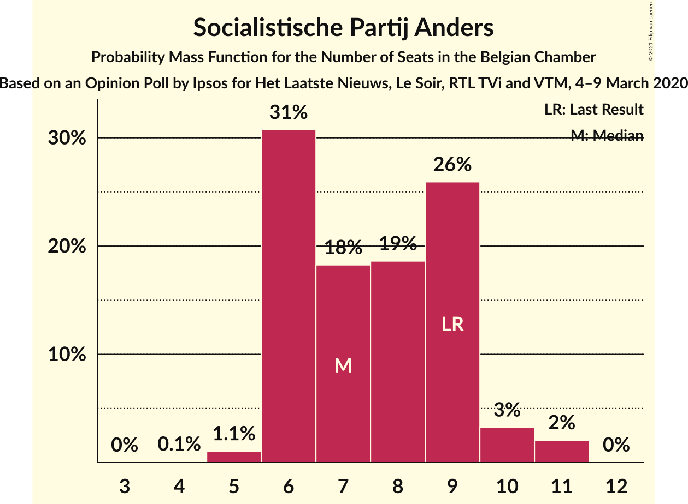

| Number of Seats | Probability | Accumulated | Special Marks |
|:---------------:|:-----------:|:-----------:|:-------------:|
| 4 | 0.1% | 100% |  |
| 5 | 1.2% | 99.9% |  |
| 6 | 31% | 98.7% |  |
| 7 | 17% | 67% |  |
| 8 | 19% | 51% | Median |
| 9 | 27% | 32% | Last Result |
| 10 | 3% | 5% |  |
| 11 | 2% | 2% |  |
| 12 | 0% | 0% |  |

### Partij van de Arbeid van België

*For a full overview of the results for this party, see the [Partij van de Arbeid van België](party-partijvandearbeidvanbelgië.html) page.*

| Number of Seats | Probability | Accumulated | Special Marks |
|:---------------:|:-----------:|:-----------:|:-------------:|
| 3 | 0% | 100% | Last Result |
| 4 | 0.1% | 100% |  |
| 5 | 4% | 99.9% |  |
| 6 | 2% | 96% |  |
| 7 | 16% | 94% |  |
| 8 | 69% | 78% | Median |
| 9 | 8% | 9% |  |
| 10 | 0.7% | 0.8% |  |
| 11 | 0.1% | 0.1% |  |
| 12 | 0% | 0% |  |

### Groen

*For a full overview of the results for this party, see the [Groen](party-groen.html) page.*

| Number of Seats | Probability | Accumulated | Special Marks |
|:---------------:|:-----------:|:-----------:|:-------------:|
| 3 | 0.2% | 100% |  |
| 4 | 0.2% | 99.8% |  |
| 5 | 22% | 99.6% |  |
| 6 | 15% | 77% |  |
| 7 | 29% | 63% | Median |
| 8 | 17% | 34% | Last Result |
| 9 | 16% | 16% |  |
| 10 | 0% | 0.1% |  |
| 11 | 0% | 0% |  |

### Centre démocrate humaniste

*For a full overview of the results for this party, see the [Centre démocrate humaniste](party-centredémocratehumaniste.html) page.*

| Number of Seats | Probability | Accumulated | Special Marks |
|:---------------:|:-----------:|:-----------:|:-------------:|
| 0 | 0.9% | 100% |  |
| 1 | 3% | 99.1% |  |
| 2 | 8% | 96% |  |
| 3 | 8% | 88% |  |
| 4 | 72% | 80% | Median |
| 5 | 8% | 8% | Last Result |
| 6 | 0% | 0% |  |

### DéFI

*For a full overview of the results for this party, see the [DéFI](party-défi.html) page.*

| Number of Seats | Probability | Accumulated | Special Marks |
|:---------------:|:-----------:|:-----------:|:-------------:|
| 1 | 40% | 100% |  |
| 2 | 39% | 60% | Last Result, Median |
| 3 | 14% | 22% |  |
| 4 | 7% | 7% |  |
| 5 | 0.3% | 0.3% |  |
| 6 | 0% | 0% |  |

## Coalitions

### Confidence Intervals

| Coalition | Last Result | Median | Majority? | 80% Confidence Interval | 90% Confidence Interval | 95% Confidence Interval | 99% Confidence Interval |
|:---------:|:-----------:|:------:|:---------:|:-----------------------:|:-----------------------:|:-----------------------:|:-----------------------:|
| Parti Socialiste – Christen-Democratisch en Vlaams – Mouvement Réformateur – Open Vlaamse Liberalen en Democraten – Ecolo – Socialistische Partij Anders – Groen – Centre démocrate humaniste | 93 | 83 | 99.9% | 80–86 | 79–87 | 78–87 | 76–88 |
| Parti Socialiste – Christen-Democratisch en Vlaams – Mouvement Réformateur – Open Vlaamse Liberalen en Democraten – Ecolo – Socialistische Partij Anders – Groen | 88 | 79 | 91% | 76–82 | 75–83 | 74–84 | 73–85 |
| Parti Socialiste – Christen-Democratisch en Vlaams – Parti du Travail de Belgique – Ecolo – Socialistische Partij Anders – Partij van de Arbeid van België – Groen – Centre démocrate humaniste | 79 | 79 | 94% | 76–82 | 75–83 | 74–83 | 73–84 |
| Parti Socialiste – Mouvement Réformateur – Open Vlaamse Liberalen en Democraten – Ecolo – Socialistische Partij Anders – Groen | 76 | 69 | 0.2% | 66–72 | 65–73 | 64–74 | 63–75 |
| Nieuw-Vlaamse Alliantie – Parti Socialiste – Mouvement Réformateur – Open Vlaamse Liberalen en Democraten – Socialistische Partij Anders | 80 | 69 | 0.4% | 66–72 | 65–73 | 64–74 | 63–75 |
| Parti Socialiste – Parti du Travail de Belgique – Ecolo – Socialistische Partij Anders – Partij van de Arbeid van België – Groen – Centre démocrate humaniste | 67 | 69 | 0.1% | 66–72 | 65–72 | 64–73 | 63–74 |
| Parti Socialiste – Parti du Travail de Belgique – Ecolo – Socialistische Partij Anders – Partij van de Arbeid van België – Groen | 62 | 65 | 0% | 62–68 | 61–69 | 61–70 | 59–71 |
| Parti Socialiste – Christen-Democratisch en Vlaams – Mouvement Réformateur – Open Vlaamse Liberalen en Democraten – Socialistische Partij Anders – Centre démocrate humaniste | 72 | 64 | 0% | 60–67 | 60–67 | 59–68 | 58–69 |
| Parti Socialiste – Christen-Democratisch en Vlaams – Ecolo – Socialistische Partij Anders – Groen – Centre démocrate humaniste | 67 | 60 | 0% | 57–63 | 56–63 | 55–64 | 54–65 |
| Nieuw-Vlaamse Alliantie – Christen-Democratisch en Vlaams – Mouvement Réformateur – Open Vlaamse Liberalen en Democraten – Centre démocrate humaniste | 68 | 56 | 0% | 53–59 | 52–60 | 52–60 | 50–62 |
| Parti Socialiste – Christen-Democratisch en Vlaams – Mouvement Réformateur – Open Vlaamse Liberalen en Democraten – Centre démocrate humaniste | 63 | 56 | 0% | 53–58 | 53–59 | 52–60 | 51–61 |
| Christen-Democratisch en Vlaams – Mouvement Réformateur – Open Vlaamse Liberalen en Democraten – Ecolo – Groen – Centre démocrate humaniste | 64 | 56 | 0% | 53–59 | 52–60 | 51–60 | 50–61 |
| Nieuw-Vlaamse Alliantie – Christen-Democratisch en Vlaams – Mouvement Réformateur – Open Vlaamse Liberalen en Democraten | 63 | 52 | 0% | 50–55 | 49–56 | 48–57 | 47–58 |
| Parti Socialiste – Mouvement Réformateur – Open Vlaamse Liberalen en Democraten – Socialistische Partij Anders | 55 | 50 | 0% | 47–53 | 46–54 | 45–54 | 44–56 |
| Parti Socialiste – Christen-Democratisch en Vlaams – Socialistische Partij Anders – Centre démocrate humaniste | 46 | 41 | 0% | 38–43 | 38–44 | 37–44 | 35–46 |
| Christen-Democratisch en Vlaams – Mouvement Réformateur – Open Vlaamse Liberalen en Democraten – Centre démocrate humaniste | 43 | 37 | 0% | 34–39 | 33–40 | 33–40 | 31–42 |

### Parti Socialiste – Christen-Democratisch en Vlaams – Mouvement Réformateur – Open Vlaamse Liberalen en Democraten – Ecolo – Socialistische Partij Anders – Groen – Centre démocrate humaniste

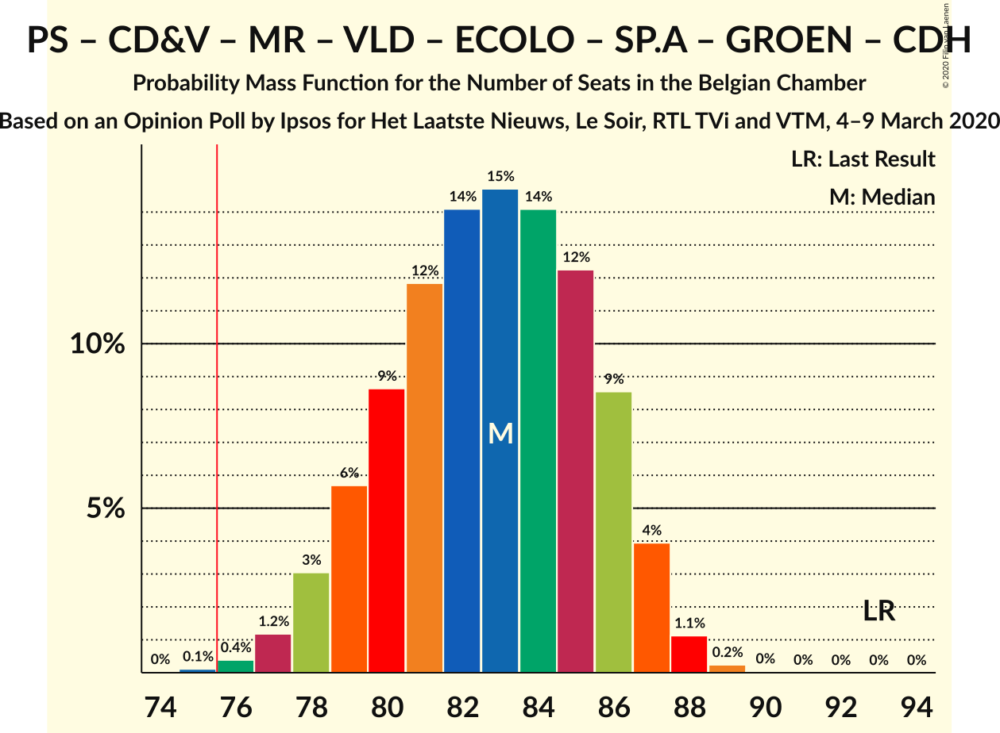

| Number of Seats | Probability | Accumulated | Special Marks |
|:---------------:|:-----------:|:-----------:|:-------------:|
| 75 | 0.1% | 100% |  |
| 76 | 0.4% | 99.9% | Majority |
| 77 | 1.1% | 99.5% |  |
| 78 | 3% | 98% |  |
| 79 | 5% | 95% |  |
| 80 | 9% | 90% |  |
| 81 | 12% | 81% |  |
| 82 | 14% | 69% |  |
| 83 | 14% | 55% | Median |
| 84 | 14% | 41% |  |
| 85 | 13% | 27% |  |
| 86 | 9% | 14% |  |
| 87 | 4% | 5% |  |
| 88 | 1.1% | 1.4% |  |
| 89 | 0.2% | 0.3% |  |
| 90 | 0% | 0.1% |  |
| 91 | 0% | 0% |  |
| 92 | 0% | 0% |  |
| 93 | 0% | 0% | Last Result |

### Parti Socialiste – Christen-Democratisch en Vlaams – Mouvement Réformateur – Open Vlaamse Liberalen en Democraten – Ecolo – Socialistische Partij Anders – Groen

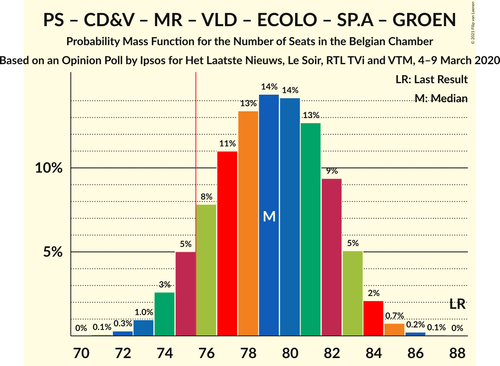

| Number of Seats | Probability | Accumulated | Special Marks |
|:---------------:|:-----------:|:-----------:|:-------------:|
| 71 | 0.1% | 100% |  |
| 72 | 0.3% | 99.9% |  |
| 73 | 0.9% | 99.6% |  |
| 74 | 2% | 98.7% |  |
| 75 | 5% | 96% |  |
| 76 | 8% | 91% | Majority |
| 77 | 11% | 84% |  |
| 78 | 13% | 72% |  |
| 79 | 14% | 59% | Median |
| 80 | 14% | 45% |  |
| 81 | 13% | 31% |  |
| 82 | 10% | 18% |  |
| 83 | 5% | 8% |  |
| 84 | 2% | 3% |  |
| 85 | 0.7% | 1.0% |  |
| 86 | 0.2% | 0.3% |  |
| 87 | 0.1% | 0.1% |  |
| 88 | 0% | 0% | Last Result |

### Parti Socialiste – Christen-Democratisch en Vlaams – Parti du Travail de Belgique – Ecolo – Socialistische Partij Anders – Partij van de Arbeid van België – Groen – Centre démocrate humaniste

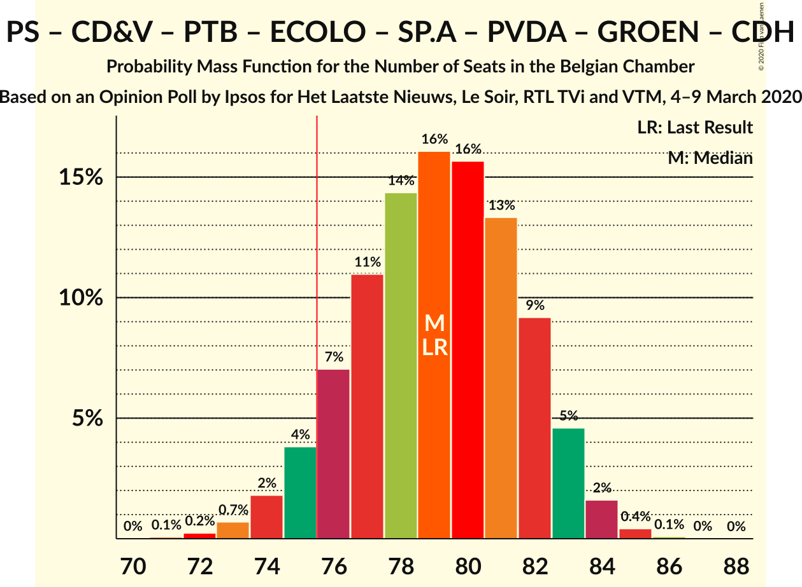

| Number of Seats | Probability | Accumulated | Special Marks |
|:---------------:|:-----------:|:-----------:|:-------------:|
| 71 | 0.1% | 100% |  |
| 72 | 0.2% | 99.9% |  |
| 73 | 0.6% | 99.7% |  |
| 74 | 2% | 99.0% |  |
| 75 | 4% | 97% |  |
| 76 | 7% | 94% | Majority |
| 77 | 11% | 87% |  |
| 78 | 15% | 76% |  |
| 79 | 17% | 61% | Last Result, Median |
| 80 | 16% | 45% |  |
| 81 | 14% | 28% |  |
| 82 | 9% | 15% |  |
| 83 | 4% | 6% |  |
| 84 | 1.3% | 2% |  |
| 85 | 0.3% | 0.4% |  |
| 86 | 0.1% | 0.1% |  |
| 87 | 0% | 0% |  |

### Parti Socialiste – Mouvement Réformateur – Open Vlaamse Liberalen en Democraten – Ecolo – Socialistische Partij Anders – Groen

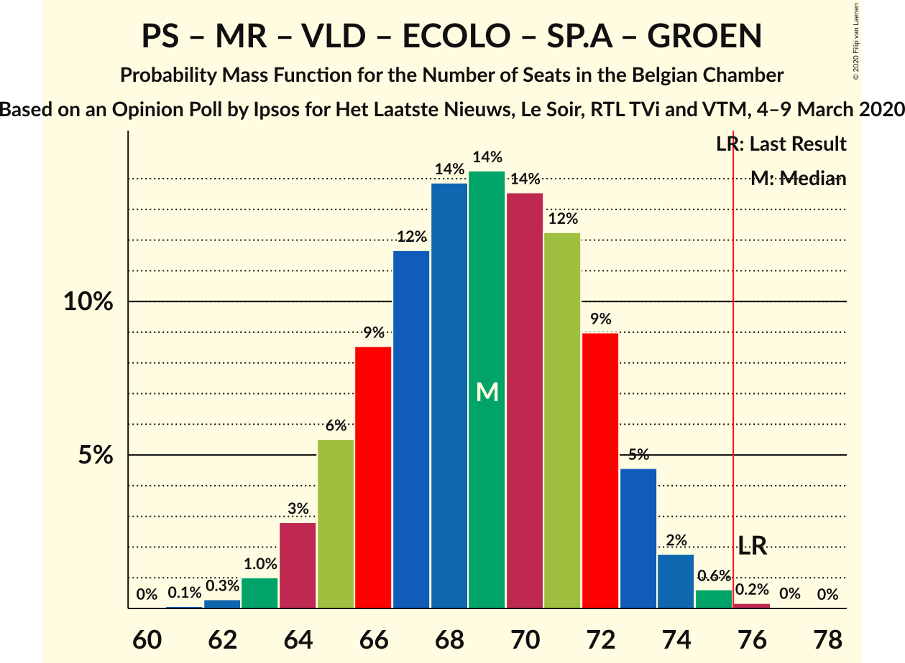

| Number of Seats | Probability | Accumulated | Special Marks |
|:---------------:|:-----------:|:-----------:|:-------------:|
| 61 | 0.1% | 100% |  |
| 62 | 0.3% | 99.9% |  |
| 63 | 1.0% | 99.6% |  |
| 64 | 3% | 98.7% |  |
| 65 | 5% | 96% |  |
| 66 | 8% | 91% |  |
| 67 | 11% | 82% |  |
| 68 | 13% | 71% |  |
| 69 | 14% | 58% | Median |
| 70 | 14% | 44% |  |
| 71 | 13% | 29% |  |
| 72 | 9% | 17% |  |
| 73 | 5% | 7% |  |
| 74 | 2% | 3% |  |
| 75 | 0.6% | 0.8% |  |
| 76 | 0.2% | 0.2% | Last Result, Majority |
| 77 | 0% | 0% |  |

### Nieuw-Vlaamse Alliantie – Parti Socialiste – Mouvement Réformateur – Open Vlaamse Liberalen en Democraten – Socialistische Partij Anders

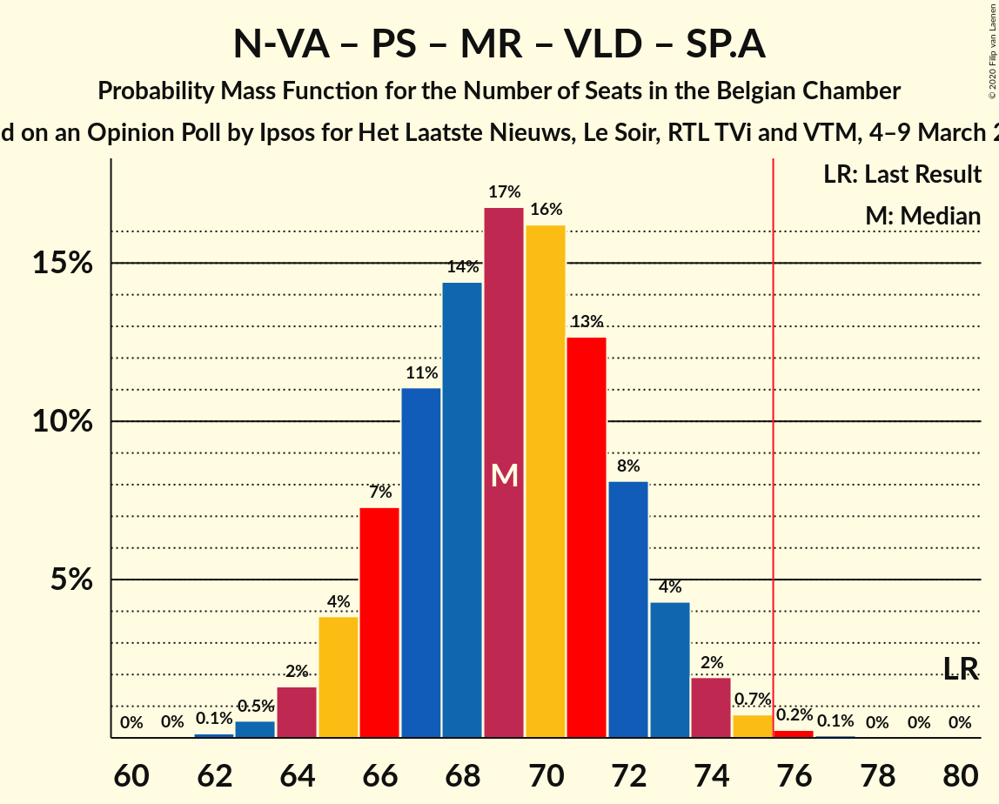

| Number of Seats | Probability | Accumulated | Special Marks |
|:---------------:|:-----------:|:-----------:|:-------------:|
| 62 | 0.1% | 100% |  |
| 63 | 0.6% | 99.8% |  |
| 64 | 2% | 99.2% |  |
| 65 | 4% | 97% |  |
| 66 | 7% | 93% |  |
| 67 | 11% | 86% |  |
| 68 | 14% | 76% |  |
| 69 | 16% | 62% | Median |
| 70 | 17% | 46% |  |
| 71 | 13% | 29% |  |
| 72 | 8% | 16% |  |
| 73 | 4% | 8% |  |
| 74 | 2% | 3% |  |
| 75 | 0.8% | 1.1% |  |
| 76 | 0.3% | 0.4% | Majority |
| 77 | 0.1% | 0.1% |  |
| 78 | 0% | 0% |  |
| 79 | 0% | 0% |  |
| 80 | 0% | 0% | Last Result |

### Parti Socialiste – Parti du Travail de Belgique – Ecolo – Socialistische Partij Anders – Partij van de Arbeid van België – Groen – Centre démocrate humaniste

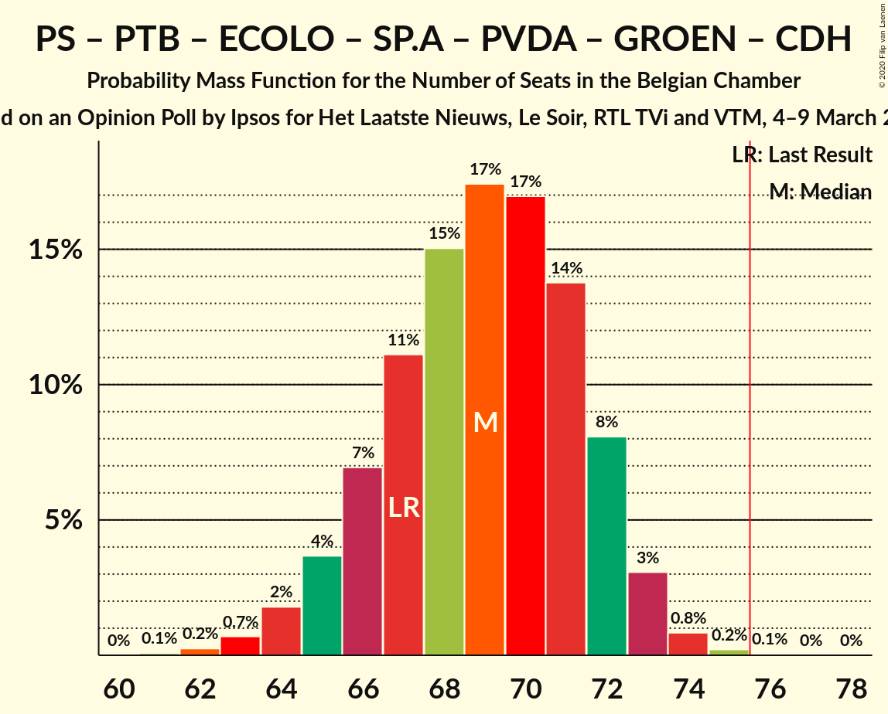

| Number of Seats | Probability | Accumulated | Special Marks |
|:---------------:|:-----------:|:-----------:|:-------------:|
| 61 | 0.1% | 100% |  |
| 62 | 0.2% | 99.9% |  |
| 63 | 0.7% | 99.7% |  |
| 64 | 2% | 99.0% |  |
| 65 | 4% | 97% |  |
| 66 | 7% | 93% |  |
| 67 | 11% | 87% | Last Result |
| 68 | 15% | 75% |  |
| 69 | 17% | 60% | Median |
| 70 | 17% | 43% |  |
| 71 | 14% | 26% |  |
| 72 | 8% | 12% |  |
| 73 | 3% | 4% |  |
| 74 | 0.8% | 1.1% |  |
| 75 | 0.2% | 0.3% |  |
| 76 | 0.1% | 0.1% | Majority |
| 77 | 0% | 0% |  |

### Parti Socialiste – Parti du Travail de Belgique – Ecolo – Socialistische Partij Anders – Partij van de Arbeid van België – Groen

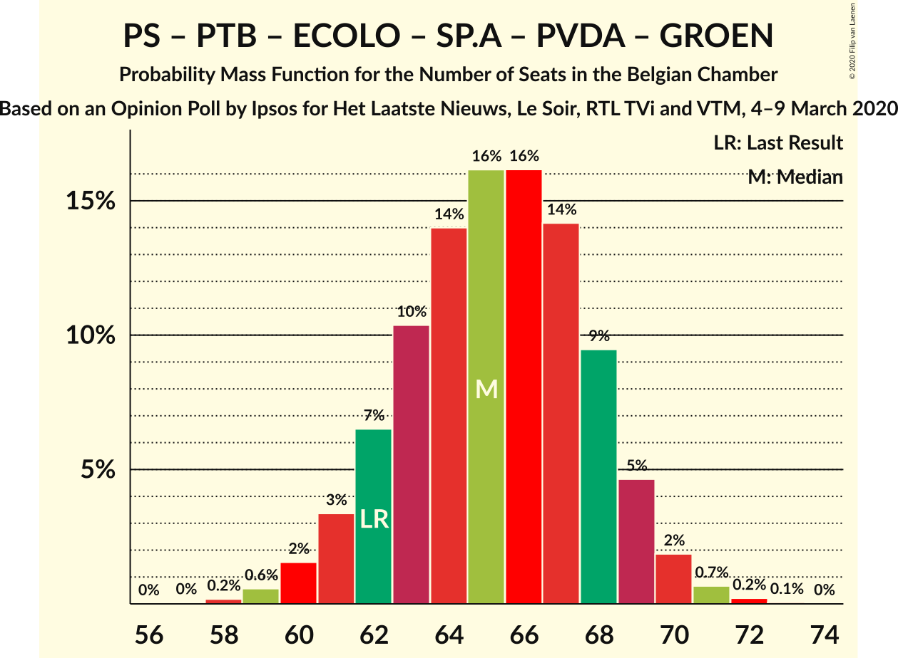

| Number of Seats | Probability | Accumulated | Special Marks |
|:---------------:|:-----------:|:-----------:|:-------------:|
| 57 | 0.1% | 100% |  |
| 58 | 0.2% | 99.9% |  |
| 59 | 0.6% | 99.7% |  |
| 60 | 1.5% | 99.2% |  |
| 61 | 3% | 98% |  |
| 62 | 6% | 95% | Last Result |
| 63 | 10% | 89% |  |
| 64 | 14% | 78% |  |
| 65 | 17% | 64% | Median |
| 66 | 17% | 48% |  |
| 67 | 14% | 31% |  |
| 68 | 9% | 16% |  |
| 69 | 4% | 7% |  |
| 70 | 2% | 3% |  |
| 71 | 0.6% | 0.8% |  |
| 72 | 0.2% | 0.2% |  |
| 73 | 0% | 0.1% |  |
| 74 | 0% | 0% |  |

### Parti Socialiste – Christen-Democratisch en Vlaams – Mouvement Réformateur – Open Vlaamse Liberalen en Democraten – Socialistische Partij Anders – Centre démocrate humaniste

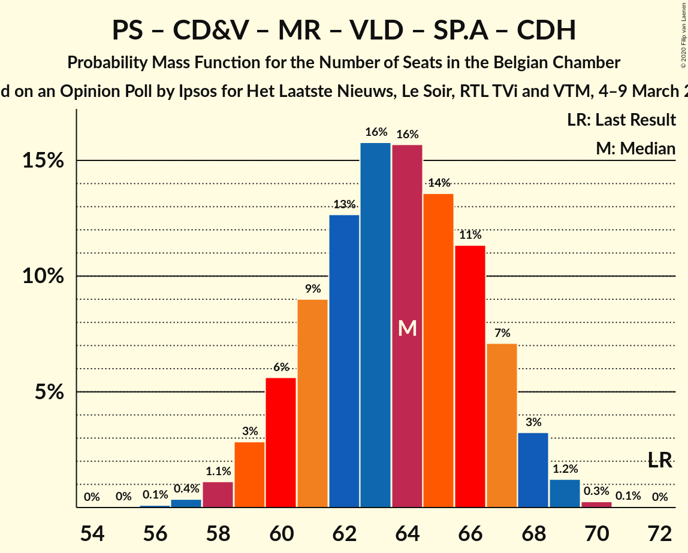

| Number of Seats | Probability | Accumulated | Special Marks |
|:---------------:|:-----------:|:-----------:|:-------------:|
| 56 | 0.1% | 100% |  |
| 57 | 0.4% | 99.9% |  |
| 58 | 1.1% | 99.5% |  |
| 59 | 3% | 98% |  |
| 60 | 6% | 96% |  |
| 61 | 9% | 90% |  |
| 62 | 13% | 81% |  |
| 63 | 16% | 68% |  |
| 64 | 16% | 52% | Median |
| 65 | 14% | 37% |  |
| 66 | 11% | 23% |  |
| 67 | 7% | 12% |  |
| 68 | 3% | 5% |  |
| 69 | 1.2% | 2% |  |
| 70 | 0.3% | 0.3% |  |
| 71 | 0.1% | 0.1% |  |
| 72 | 0% | 0% | Last Result |

### Parti Socialiste – Christen-Democratisch en Vlaams – Ecolo – Socialistische Partij Anders – Groen – Centre démocrate humaniste

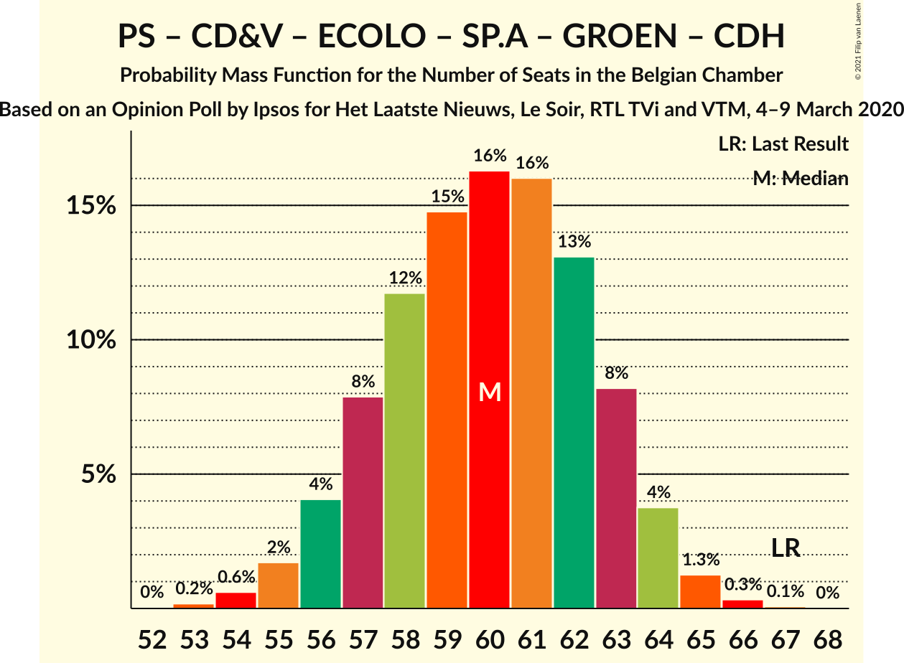

| Number of Seats | Probability | Accumulated | Special Marks |
|:---------------:|:-----------:|:-----------:|:-------------:|
| 52 | 0% | 100% |  |
| 53 | 0.2% | 99.9% |  |
| 54 | 0.7% | 99.7% |  |
| 55 | 2% | 99.1% |  |
| 56 | 4% | 97% |  |
| 57 | 8% | 93% |  |
| 58 | 12% | 85% |  |
| 59 | 15% | 72% |  |
| 60 | 17% | 57% | Median |
| 61 | 16% | 40% |  |
| 62 | 12% | 24% |  |
| 63 | 7% | 12% |  |
| 64 | 3% | 4% |  |
| 65 | 1.0% | 1.3% |  |
| 66 | 0.3% | 0.3% |  |
| 67 | 0.1% | 0.1% | Last Result |
| 68 | 0% | 0% |  |

### Nieuw-Vlaamse Alliantie – Christen-Democratisch en Vlaams – Mouvement Réformateur – Open Vlaamse Liberalen en Democraten – Centre démocrate humaniste

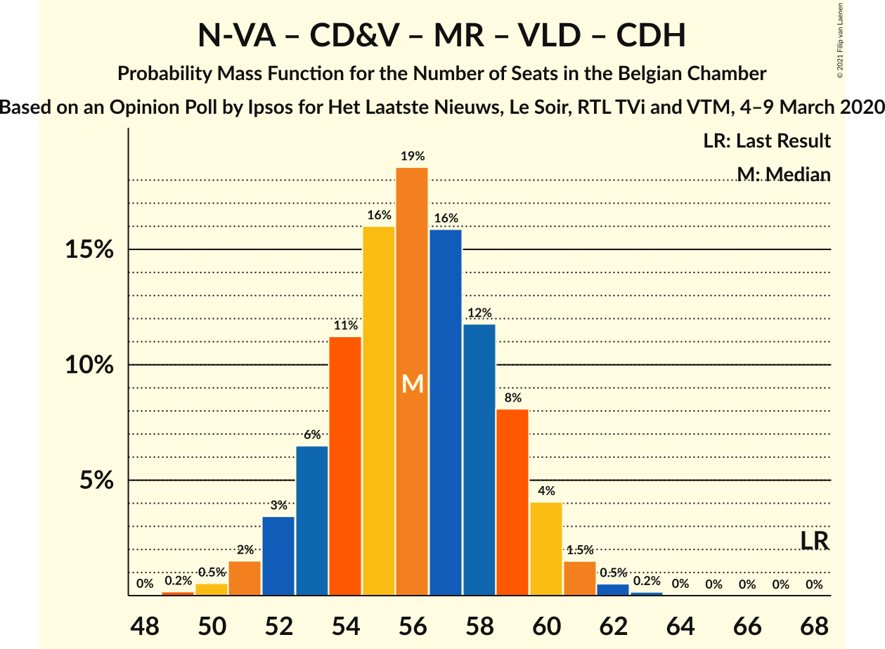

| Number of Seats | Probability | Accumulated | Special Marks |
|:---------------:|:-----------:|:-----------:|:-------------:|
| 49 | 0.1% | 100% |  |
| 50 | 0.5% | 99.8% |  |
| 51 | 1.3% | 99.3% |  |
| 52 | 3% | 98% |  |
| 53 | 7% | 95% |  |
| 54 | 11% | 88% |  |
| 55 | 16% | 77% |  |
| 56 | 18% | 61% | Median |
| 57 | 16% | 42% |  |
| 58 | 11% | 27% |  |
| 59 | 8% | 15% |  |
| 60 | 5% | 7% |  |
| 61 | 2% | 2% |  |
| 62 | 0.6% | 0.8% |  |
| 63 | 0.2% | 0.2% |  |
| 64 | 0% | 0.1% |  |
| 65 | 0% | 0% |  |
| 66 | 0% | 0% |  |
| 67 | 0% | 0% |  |
| 68 | 0% | 0% | Last Result |

### Parti Socialiste – Christen-Democratisch en Vlaams – Mouvement Réformateur – Open Vlaamse Liberalen en Democraten – Centre démocrate humaniste

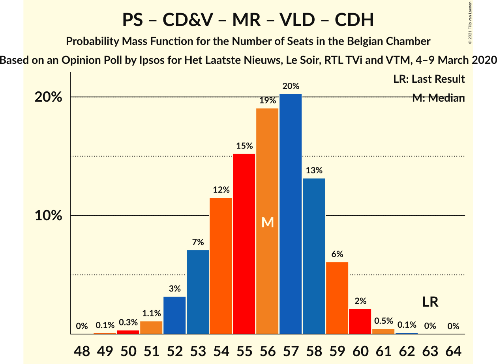

| Number of Seats | Probability | Accumulated | Special Marks |
|:---------------:|:-----------:|:-----------:|:-------------:|
| 49 | 0.1% | 100% |  |
| 50 | 0.4% | 99.9% |  |
| 51 | 1.1% | 99.5% |  |
| 52 | 3% | 98% |  |
| 53 | 7% | 95% |  |
| 54 | 11% | 89% |  |
| 55 | 14% | 78% |  |
| 56 | 19% | 64% | Median |
| 57 | 21% | 45% |  |
| 58 | 14% | 24% |  |
| 59 | 7% | 10% |  |
| 60 | 3% | 3% |  |
| 61 | 0.5% | 0.7% |  |
| 62 | 0.2% | 0.2% |  |
| 63 | 0.1% | 0.1% | Last Result |
| 64 | 0% | 0% |  |

### Christen-Democratisch en Vlaams – Mouvement Réformateur – Open Vlaamse Liberalen en Democraten – Ecolo – Groen – Centre démocrate humaniste

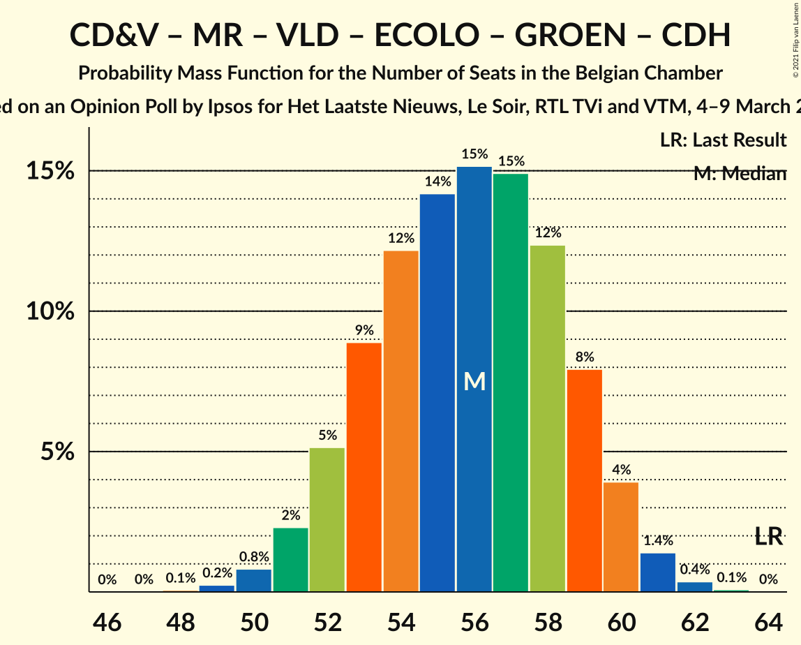

| Number of Seats | Probability | Accumulated | Special Marks |
|:---------------:|:-----------:|:-----------:|:-------------:|
| 48 | 0.1% | 100% |  |
| 49 | 0.2% | 99.9% |  |
| 50 | 0.8% | 99.7% |  |
| 51 | 2% | 98.9% |  |
| 52 | 5% | 97% |  |
| 53 | 8% | 92% |  |
| 54 | 12% | 84% |  |
| 55 | 14% | 72% |  |
| 56 | 16% | 58% | Median |
| 57 | 16% | 43% |  |
| 58 | 13% | 27% |  |
| 59 | 8% | 14% |  |
| 60 | 4% | 6% |  |
| 61 | 1.4% | 2% |  |
| 62 | 0.4% | 0.5% |  |
| 63 | 0.1% | 0.1% |  |
| 64 | 0% | 0% | Last Result |

### Nieuw-Vlaamse Alliantie – Christen-Democratisch en Vlaams – Mouvement Réformateur – Open Vlaamse Liberalen en Democraten

| Number of Seats | Probability | Accumulated | Special Marks |
|:---------------:|:-----------:|:-----------:|:-------------:|
| 46 | 0.2% | 100% |  |
| 47 | 0.7% | 99.8% |  |
| 48 | 2% | 99.1% |  |
| 49 | 5% | 97% |  |
| 50 | 10% | 92% |  |
| 51 | 16% | 82% |  |
| 52 | 19% | 66% | Median |
| 53 | 17% | 46% |  |
| 54 | 12% | 30% |  |
| 55 | 9% | 18% |  |
| 56 | 5% | 8% |  |
| 57 | 2% | 3% |  |
| 58 | 0.8% | 1.1% |  |
| 59 | 0.3% | 0.3% |  |
| 60 | 0.1% | 0.1% |  |
| 61 | 0% | 0% |  |
| 62 | 0% | 0% |  |
| 63 | 0% | 0% | Last Result |

### Parti Socialiste – Mouvement Réformateur – Open Vlaamse Liberalen en Democraten – Socialistische Partij Anders

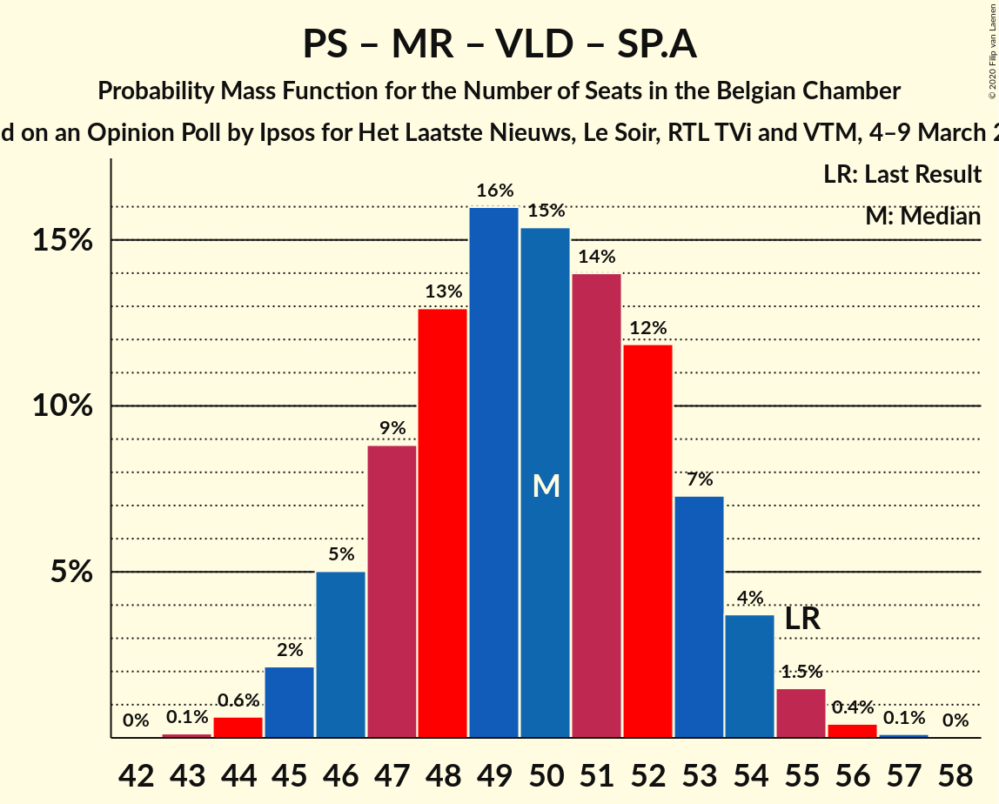

| Number of Seats | Probability | Accumulated | Special Marks |
|:---------------:|:-----------:|:-----------:|:-------------:|
| 43 | 0.1% | 100% |  |
| 44 | 0.6% | 99.8% |  |
| 45 | 2% | 99.2% |  |
| 46 | 5% | 97% |  |
| 47 | 9% | 92% |  |
| 48 | 13% | 83% |  |
| 49 | 16% | 70% |  |
| 50 | 15% | 54% | Median |
| 51 | 14% | 39% |  |
| 52 | 12% | 25% |  |
| 53 | 7% | 13% |  |
| 54 | 4% | 6% |  |
| 55 | 1.5% | 2% | Last Result |
| 56 | 0.4% | 0.6% |  |
| 57 | 0.1% | 0.1% |  |
| 58 | 0% | 0% |  |

### Parti Socialiste – Christen-Democratisch en Vlaams – Socialistische Partij Anders – Centre démocrate humaniste

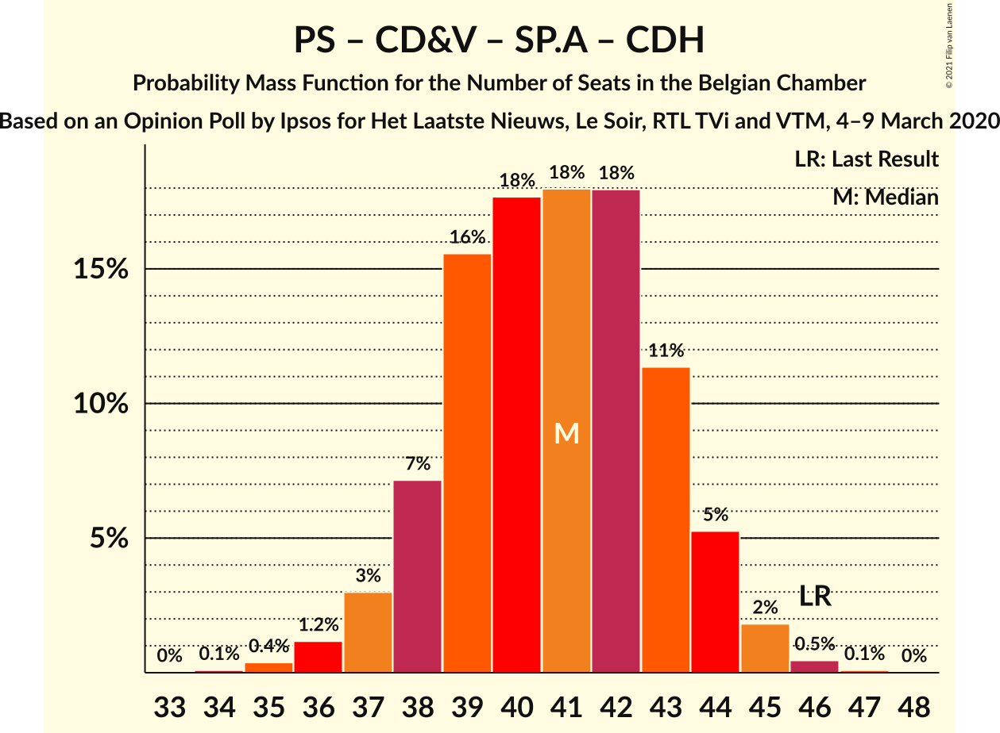

| Number of Seats | Probability | Accumulated | Special Marks |
|:---------------:|:-----------:|:-----------:|:-------------:|
| 34 | 0.1% | 100% |  |
| 35 | 0.4% | 99.9% |  |
| 36 | 1.2% | 99.5% |  |
| 37 | 3% | 98% |  |
| 38 | 8% | 95% |  |
| 39 | 16% | 87% |  |
| 40 | 17% | 71% |  |
| 41 | 19% | 54% | Median |
| 42 | 18% | 35% |  |
| 43 | 11% | 18% |  |
| 44 | 5% | 7% |  |
| 45 | 2% | 2% |  |
| 46 | 0.4% | 0.5% | Last Result |
| 47 | 0.1% | 0.1% |  |
| 48 | 0% | 0% |  |

### Christen-Democratisch en Vlaams – Mouvement Réformateur – Open Vlaamse Liberalen en Democraten – Centre démocrate humaniste

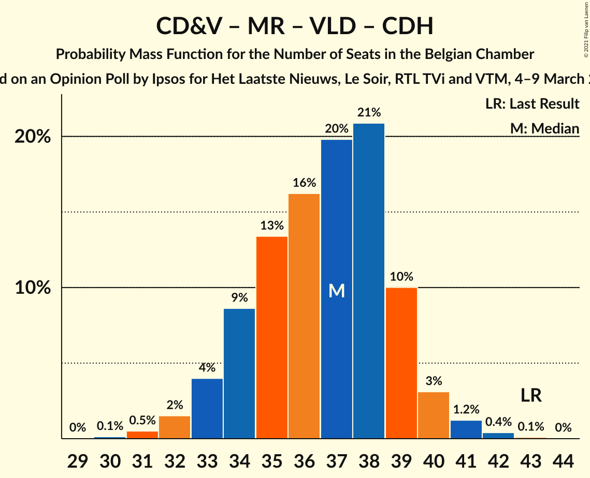

| Number of Seats | Probability | Accumulated | Special Marks |
|:---------------:|:-----------:|:-----------:|:-------------:|
| 30 | 0.1% | 100% |  |
| 31 | 0.5% | 99.8% |  |
| 32 | 1.4% | 99.4% |  |
| 33 | 4% | 98% |  |
| 34 | 8% | 94% |  |
| 35 | 12% | 86% |  |
| 36 | 15% | 74% |  |
| 37 | 19% | 59% | Median |
| 38 | 22% | 40% |  |
| 39 | 12% | 18% |  |
| 40 | 4% | 6% |  |
| 41 | 1.4% | 2% |  |
| 42 | 0.5% | 0.7% |  |
| 43 | 0.1% | 0.2% | Last Result |
| 44 | 0% | 0% |  |

## Technical Information

### Opinion Poll

+ **Polling firm:** Ipsos
+ **Commissioner(s):** Het Laatste Nieuws, Le Soir, RTL TVi and VTM
+ **Fieldwork period:** 4–9 March 2020

### Calculations

+ **Sample size:** 1549
+ **Simulations done:** 524,288
+ **Error estimate:** 2.15%

