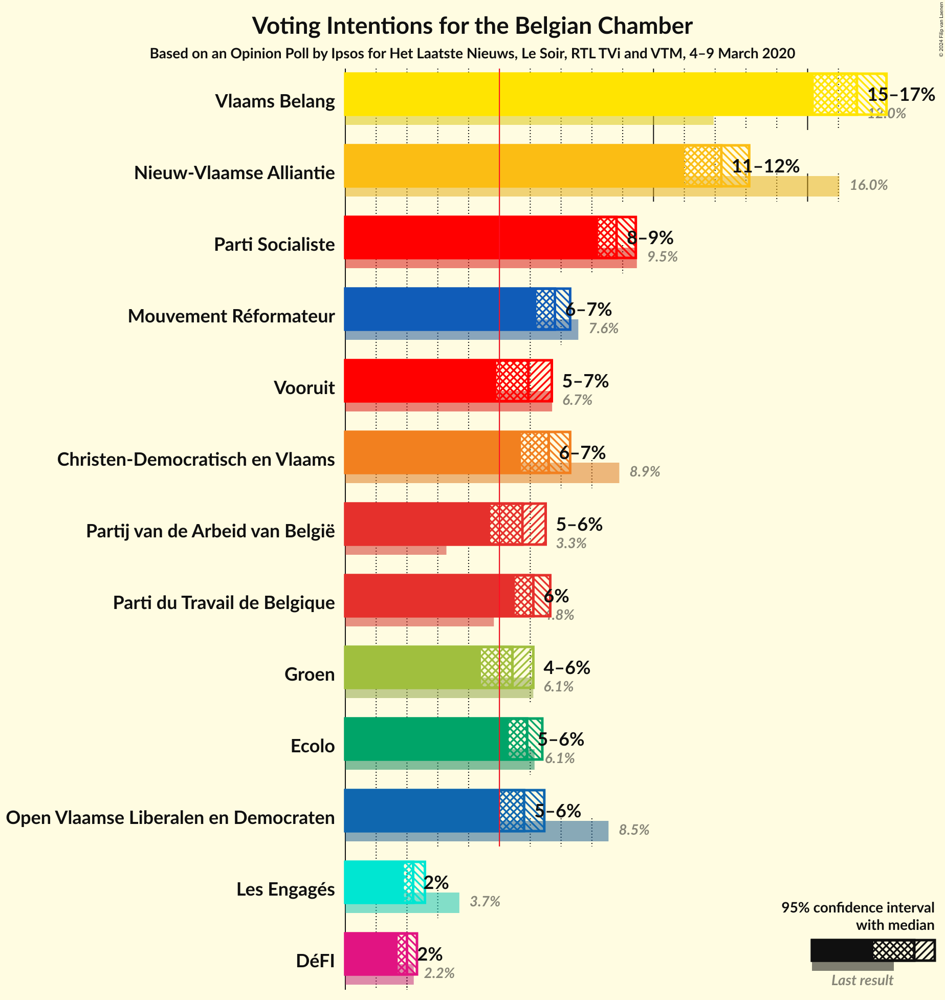
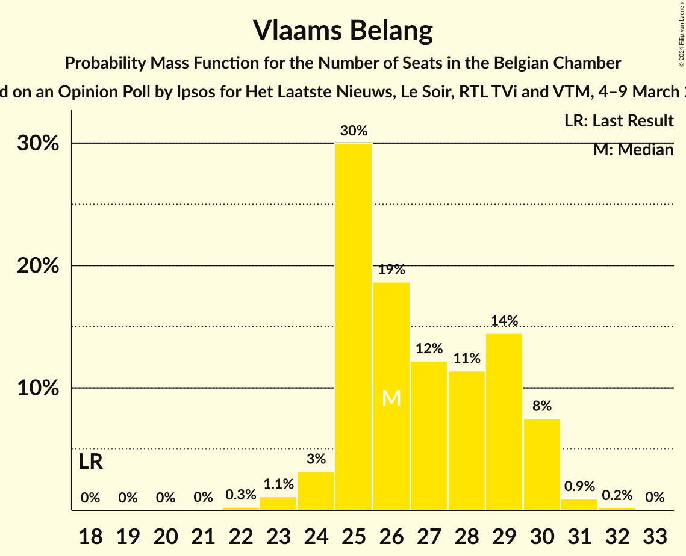
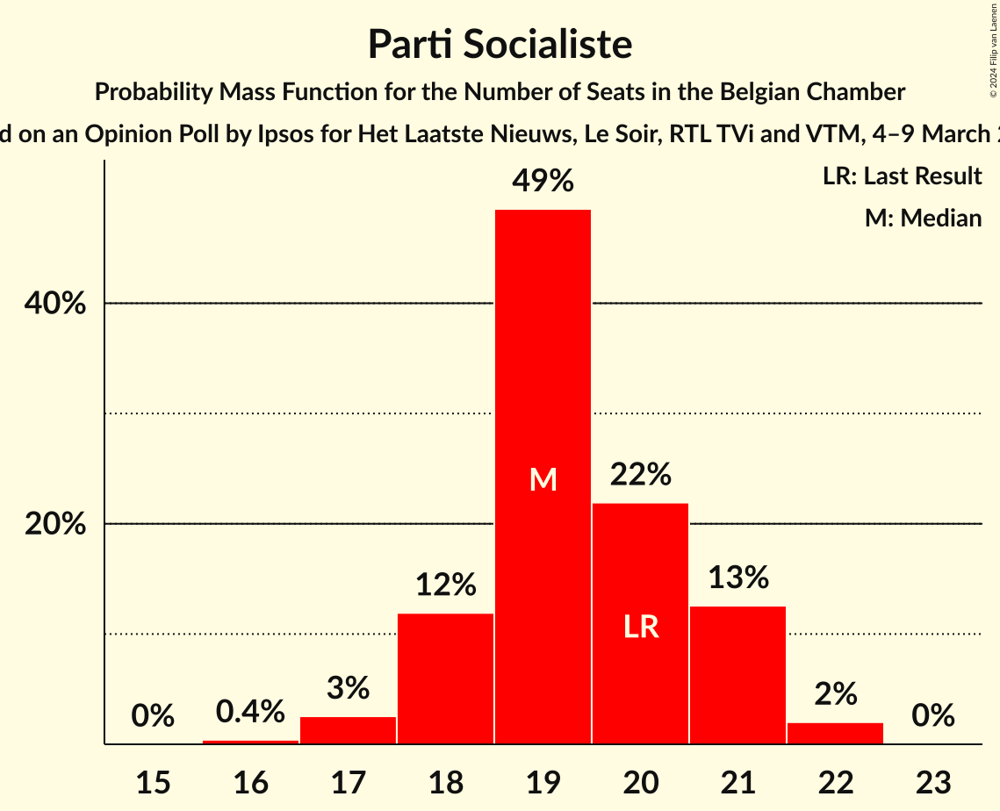
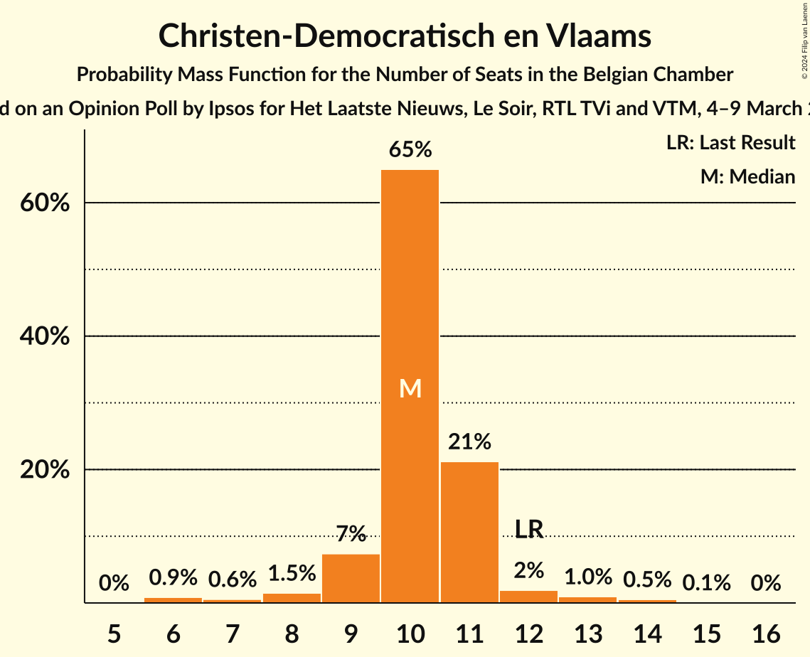
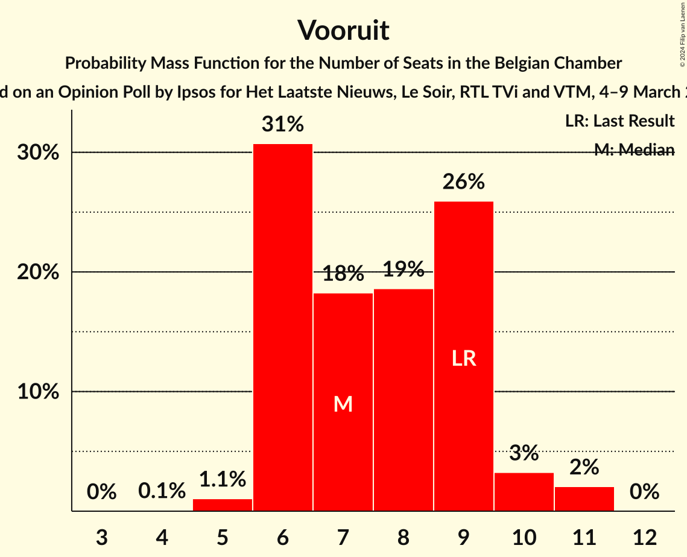
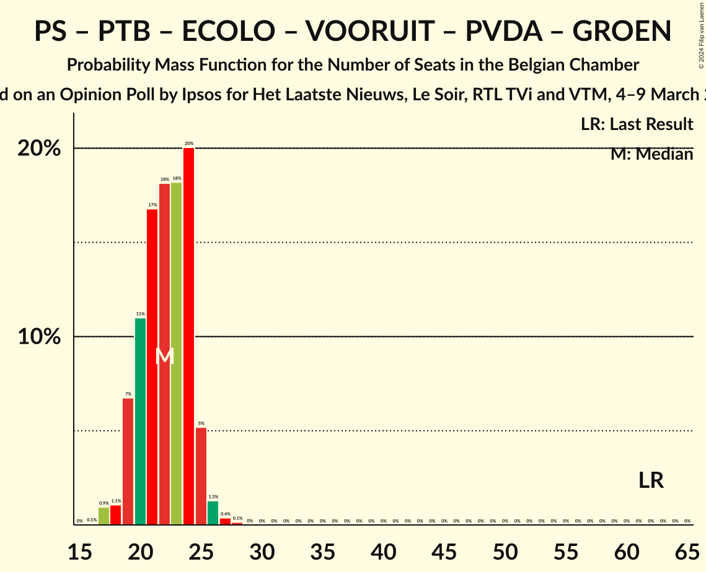
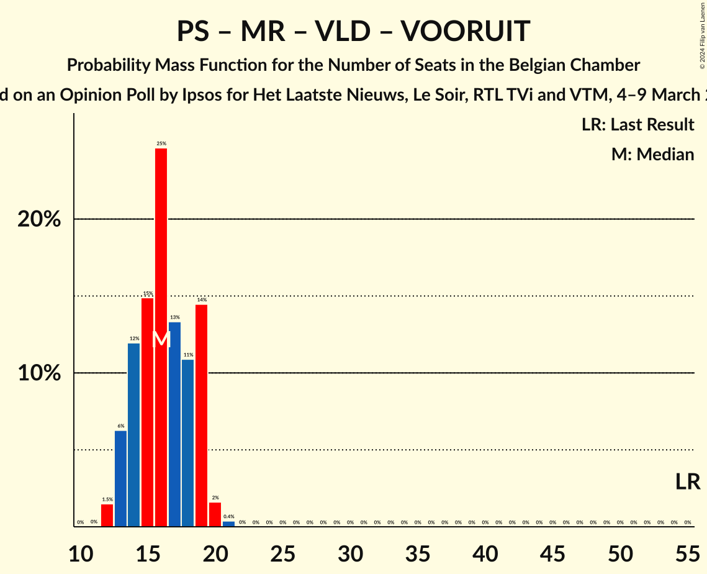

# Opinion Poll by Ipsos for Het Laatste Nieuws, Le Soir, RTL TVi and VTM, 4–9 March 2020

Areas included: Brussels, Flanders, Wallonia

<a href="#voting-intentions">Voting Intentions</a> | <a href="#seats">Seats</a> | <a href="#coalitions">Coalitions</a> | <a href="#technical-information">Technical Information</a>

## Voting Intentions

### Confidence Intervals

| Party | Last Result | Poll Result | 80% Confidence Interval | 90% Confidence Interval | 95% Confidence Interval | 99% Confidence Interval |
|:-----:|:-----------:|:-----------:|:-----------------------:|:-----------------------:|:-----------------------:|:-----------------------:|
| Vlaams Belang | 12.0% | 17.6% | 15.6–16.5% |15.4–16.6% |15.2–16.6% |14.8–16.6% |
| Nieuw-Vlaamse Alliantie | 16.0% | 13.1% | 11.4–12.2% |11.2–12.2% |11.0–12.2% |10.6–12.2% |
| Parti Socialiste | 9.5% | 9.4% | 8.4–8.8% |8.3–8.8% |8.2–8.8% |8.0–8.8% |
| Christen-Democratisch en Vlaams | 8.9% | 7.3% | 6.0–6.6% |5.8–6.6% |5.7–6.6% |5.4–6.6% |
| Mouvement Réformateur | 7.6% | 7.3% | 6.4–6.8% |6.3–6.8% |6.2–6.8% |6.0–6.8% |
| Parti du Travail de Belgique | 4.8% | 6.6% | 5.7–6.1% |5.6–6.1% |5.5–6.1% |5.4–6.1% |
| Open Vlaamse Liberalen en Democraten | 8.5% | 6.5% | 5.2–5.8% |5.1–5.8% |5.0–5.8% |4.7–5.8% |
| Ecolo | 6.1% | 6.4% | 5.5–5.8% |5.4–5.9% |5.3–5.9% |5.2–5.9% |
| Vooruit | 6.7% | 5.9% | 5.2–6.5% |5.0–6.6% |4.9–6.7% |4.6–6.7% |
| Partij van de Arbeid van België | 3.3% | 5.7% | 5.0–6.3% |4.8–6.4% |4.7–6.5% |4.4–6.5% |
| Groen | 6.1% | 5.4% | 4.7–6.0% |4.5–6.1% |4.4–6.1% |4.1–6.2% |
| Centre démocrate humaniste | N/A | 2.6% | N/A |N/A |N/A |N/A |
| DéFI | 2.2% | 2.3% | 1.8–2.0% |1.8–2.0% |1.7–2.0% |1.6–2.0% |

*Note:* The poll result column reflects the actual value used in the calculations. Published results may vary slightly, and in addition be rounded to fewer digits.

## Seats

### Confidence Intervals

| Party | Last Result | Median | 80% Confidence Interval | 90% Confidence Interval | 95% Confidence Interval | 99% Confidence Interval |
|:-----:|:-----------:|:------:|:-----------------------:|:-----------------------:|:-----------------------:|:-----------------------:|
| <a href="#vlaams-belang">Vlaams Belang</a> | 18 | 26 | 25–29 |25–30 |24–30 |23–31 |
| <a href="#nieuw-vlaamse-alliantie">Nieuw-Vlaamse Alliantie</a> | 25 | 20 | 18–21 |17–22 |17–22 |15–24 |
| <a href="#parti-socialiste">Parti Socialiste</a> | 20 | 19 | 18–21 |18–21 |17–21 |17–22 |
| <a href="#christen-democratisch-en-vlaams">Christen-Democratisch en Vlaams</a> | 12 | 10 | 9–11 |9–11 |8–12 |6–14 |
| <a href="#mouvement-réformateur">Mouvement Réformateur</a> | 14 | 14 | 13–15 |13–16 |12–17 |12–18 |
| <a href="#parti-du-travail-de-belgique">Parti du Travail de Belgique</a> | 9 | 11 | 10–13 |10–13 |10–14 |9–15 |
| <a href="#open-vlaamse-liberalen-en-democraten">Open Vlaamse Liberalen en Democraten</a> | 12 | 9 | 7–10 |6–10 |6–10 |6–11 |
| <a href="#ecolo">Ecolo</a> | 13 | 12 | 11–14 |11–14 |10–14 |10–15 |
| <a href="#vooruit">Vooruit</a> | 9 | 7 | 6–9 |6–10 |6–10 |5–11 |
| <a href="#partij-van-de-arbeid-van-belgië">Partij van de Arbeid van België</a> | 3 | 8 | 7–8 |5–9 |5–9 |5–10 |
| <a href="#groen">Groen</a> | 8 | 7 | 5–9 |5–9 |5–9 |5–9 |
| <a href="#centre-démocrate-humaniste">Centre démocrate humaniste</a> | N/A | N/A | N/A |N/A |N/A |N/A |
| <a href="#défi">DéFI</a> | 2 | 2 | 1–3 |1–4 |1–4 |1–4 |

### Vlaams Belang

*For a full overview of the results for this party, see the [Vlaams Belang](party-vlaamsbelang.html) page.*

| Number of Seats | Probability | Accumulated | Special Marks |
|:---------------:|:-----------:|:-----------:|:-------------:|
| 18 | 0% | 100% | Last Result |
| 19 | 0% | 100% |  |
| 20 | 0% | 100% |  |
| 21 | 0% | 100% |  |
| 22 | 0.3% | 100% |  |
| 23 | 1.1% | 99.7% |  |
| 24 | 3% | 98.6% |  |
| 25 | 30% | 95% |  |
| 26 | 19% | 65% | Median |
| 27 | 12% | 47% |  |
| 28 | 11% | 35% |  |
| 29 | 14% | 23% |  |
| 30 | 8% | 9% |  |
| 31 | 0.9% | 1.2% |  |
| 32 | 0.2% | 0.3% |  |
| 33 | 0% | 0% |  |

### Nieuw-Vlaamse Alliantie

*For a full overview of the results for this party, see the [Nieuw-Vlaamse Alliantie](party-nieuw-vlaamsealliantie.html) page.*

| Number of Seats | Probability | Accumulated | Special Marks |
|:---------------:|:-----------:|:-----------:|:-------------:|
| 15 | 0.5% | 100% |  |
| 16 | 2% | 99.5% |  |
| 17 | 4% | 98% |  |
| 18 | 26% | 93% |  |
| 19 | 17% | 67% |  |
| 20 | 23% | 50% | Median |
| 21 | 20% | 27% |  |
| 22 | 6% | 8% |  |
| 23 | 2% | 2% |  |
| 24 | 0.6% | 0.8% |  |
| 25 | 0.2% | 0.2% | Last Result |
| 26 | 0% | 0% |  |

### Parti Socialiste

*For a full overview of the results for this party, see the [Parti Socialiste](party-partisocialiste.html) page.*

| Number of Seats | Probability | Accumulated | Special Marks |
|:---------------:|:-----------:|:-----------:|:-------------:|
| 16 | 0.4% | 100% |  |
| 17 | 3% | 99.6% |  |
| 18 | 12% | 97% |  |
| 19 | 49% | 85% | Median |
| 20 | 22% | 37% | Last Result |
| 21 | 13% | 15% |  |
| 22 | 2% | 2% |  |
| 23 | 0% | 0% |  |

### Christen-Democratisch en Vlaams

*For a full overview of the results for this party, see the [Christen-Democratisch en Vlaams](party-christen-democratischenvlaams.html) page.*

| Number of Seats | Probability | Accumulated | Special Marks |
|:---------------:|:-----------:|:-----------:|:-------------:|
| 6 | 0.9% | 100% |  |
| 7 | 0.6% | 99.1% |  |
| 8 | 1.5% | 98.6% |  |
| 9 | 7% | 97% |  |
| 10 | 65% | 90% | Median |
| 11 | 21% | 25% |  |
| 12 | 2% | 3% | Last Result |
| 13 | 1.0% | 2% |  |
| 14 | 0.5% | 0.6% |  |
| 15 | 0.1% | 0.1% |  |
| 16 | 0% | 0% |  |

### Mouvement Réformateur

*For a full overview of the results for this party, see the [Mouvement Réformateur](party-mouvementréformateur.html) page.*

| Number of Seats | Probability | Accumulated | Special Marks |
|:---------------:|:-----------:|:-----------:|:-------------:|
| 11 | 0.4% | 100% |  |
| 12 | 2% | 99.6% |  |
| 13 | 24% | 97% |  |
| 14 | 48% | 73% | Last Result, Median |
| 15 | 17% | 26% |  |
| 16 | 5% | 8% |  |
| 17 | 3% | 3% |  |
| 18 | 0.6% | 0.6% |  |
| 19 | 0% | 0% |  |

### Parti du Travail de Belgique

*For a full overview of the results for this party, see the [Parti du Travail de Belgique](party-partidutravaildebelgique.html) page.*

| Number of Seats | Probability | Accumulated | Special Marks |
|:---------------:|:-----------:|:-----------:|:-------------:|
| 9 | 1.2% | 100% | Last Result |
| 10 | 12% | 98.8% |  |
| 11 | 45% | 87% | Median |
| 12 | 29% | 42% |  |
| 13 | 10% | 13% |  |
| 14 | 2% | 3% |  |
| 15 | 0.6% | 0.7% |  |
| 16 | 0.1% | 0.2% |  |
| 17 | 0% | 0% |  |

### Open Vlaamse Liberalen en Democraten

*For a full overview of the results for this party, see the [Open Vlaamse Liberalen en Democraten](party-openvlaamseliberalenendemocraten.html) page.*

| Number of Seats | Probability | Accumulated | Special Marks |
|:---------------:|:-----------:|:-----------:|:-------------:|
| 5 | 0% | 100% |  |
| 6 | 6% | 99.9% |  |
| 7 | 22% | 94% |  |
| 8 | 12% | 71% |  |
| 9 | 18% | 60% | Median |
| 10 | 41% | 42% |  |
| 11 | 0.7% | 1.0% |  |
| 12 | 0.2% | 0.3% | Last Result |
| 13 | 0.1% | 0.1% |  |
| 14 | 0% | 0% |  |

### Ecolo

*For a full overview of the results for this party, see the [Ecolo](party-ecolo.html) page.*

| Number of Seats | Probability | Accumulated | Special Marks |
|:---------------:|:-----------:|:-----------:|:-------------:|
| 10 | 3% | 100% |  |
| 11 | 21% | 97% |  |
| 12 | 33% | 75% | Median |
| 13 | 26% | 43% | Last Result |
| 14 | 15% | 17% |  |
| 15 | 2% | 2% |  |
| 16 | 0.1% | 0.1% |  |
| 17 | 0% | 0% |  |

### Vooruit

*For a full overview of the results for this party, see the [Vooruit](party-vooruit.html) page.*

| Number of Seats | Probability | Accumulated | Special Marks |
|:---------------:|:-----------:|:-----------:|:-------------:|
| 4 | 0.1% | 100% |  |
| 5 | 1.1% | 99.9% |  |
| 6 | 31% | 98.9% |  |
| 7 | 18% | 68% | Median |
| 8 | 19% | 50% |  |
| 9 | 26% | 31% | Last Result |
| 10 | 3% | 5% |  |
| 11 | 2% | 2% |  |
| 12 | 0% | 0% |  |

### Partij van de Arbeid van België

*For a full overview of the results for this party, see the [Partij van de Arbeid van België](party-partijvandearbeidvanbelgië.html) page.*

| Number of Seats | Probability | Accumulated | Special Marks |
|:---------------:|:-----------:|:-----------:|:-------------:|
| 3 | 0% | 100% | Last Result |
| 4 | 0.1% | 100% |  |
| 5 | 6% | 99.9% |  |
| 6 | 3% | 94% |  |
| 7 | 14% | 90% |  |
| 8 | 68% | 76% | Median |
| 9 | 7% | 8% |  |
| 10 | 0.6% | 0.7% |  |
| 11 | 0.1% | 0.1% |  |
| 12 | 0% | 0% |  |

### Groen

*For a full overview of the results for this party, see the [Groen](party-groen.html) page.*

| Number of Seats | Probability | Accumulated | Special Marks |
|:---------------:|:-----------:|:-----------:|:-------------:|
| 3 | 0.2% | 100% |  |
| 4 | 0.2% | 99.8% |  |
| 5 | 23% | 99.6% |  |
| 6 | 13% | 76% |  |
| 7 | 29% | 63% | Median |
| 8 | 18% | 34% | Last Result |
| 9 | 16% | 16% |  |
| 10 | 0.1% | 0.1% |  |
| 11 | 0% | 0% |  |

### Centre démocrate humaniste

*For a full overview of the results for this party, see the [Centre démocrate humaniste](party-centredémocratehumaniste.html) page.*

### DéFI

*For a full overview of the results for this party, see the [DéFI](party-défi.html) page.*

| Number of Seats | Probability | Accumulated | Special Marks |
|:---------------:|:-----------:|:-----------:|:-------------:|
| 1 | 37% | 100% |  |
| 2 | 42% | 63% | Last Result, Median |
| 3 | 14% | 21% |  |
| 4 | 7% | 7% |  |
| 5 | 0.2% | 0.2% |  |
| 6 | 0% | 0% |  |

## Coalitions

### Confidence Intervals

| Coalition | Last Result | Median | Majority? | 80% Confidence Interval | 90% Confidence Interval | 95% Confidence Interval | 99% Confidence Interval |
|:---------:|:-----------:|:------:|:---------:|:-----------------------:|:-----------------------:|:-----------------------:|:-----------------------:|
| Nieuw-Vlaamse Alliantie – Christen-Democratisch en Vlaams – Mouvement Réformateur – Open Vlaamse Liberalen en Democraten | 63 | 52 | 0% | 50–55 | 49–56 | 48–57 | 47–58 |
| Nieuw-Vlaamse Alliantie – Parti Socialiste – Mouvement Réformateur – Open Vlaamse Liberalen en Democraten – Vooruit | 80 | 36 | 0% | 33–38 | 32–39 | 32–39 | 31–40 |
| Parti Socialiste – Christen-Democratisch en Vlaams – Mouvement Réformateur – Open Vlaamse Liberalen en Democraten – Ecolo – Vooruit – Groen | 88 | 33 | 0% | 30–36 | 29–36 | 29–37 | 29–38 |
| Parti Socialiste – Mouvement Réformateur – Open Vlaamse Liberalen en Democraten – Ecolo – Vooruit – Groen | 76 | 23 | 0% | 20–26 | 19–26 | 19–26 | 19–28 |
| Parti Socialiste – Parti du Travail de Belgique – Ecolo – Vooruit – Partij van de Arbeid van België – Groen | 62 | 22 | 0% | 20–24 | 19–25 | 19–25 | 17–27 |
| Parti Socialiste – Mouvement Réformateur – Open Vlaamse Liberalen en Democraten – Vooruit | 55 | 16 | 0% | 14–19 | 13–19 | 13–19 | 12–20 |

### Nieuw-Vlaamse Alliantie – Christen-Democratisch en Vlaams – Mouvement Réformateur – Open Vlaamse Liberalen en Democraten

| Number of Seats | Probability | Accumulated | Special Marks |
|:---------------:|:-----------:|:-----------:|:-------------:|
| 45 | 0% | 100% |  |
| 46 | 0.2% | 99.9% |  |
| 47 | 0.9% | 99.7% |  |
| 48 | 2% | 98.8% |  |
| 49 | 5% | 96% |  |
| 50 | 10% | 91% |  |
| 51 | 16% | 81% |  |
| 52 | 19% | 66% |  |
| 53 | 17% | 46% | Median |
| 54 | 13% | 30% |  |
| 55 | 9% | 17% |  |
| 56 | 5% | 7% |  |
| 57 | 2% | 3% |  |
| 58 | 0.7% | 1.0% |  |
| 59 | 0.2% | 0.3% |  |
| 60 | 0.1% | 0.1% |  |
| 61 | 0% | 0% |  |
| 62 | 0% | 0% |  |
| 63 | 0% | 0% | Last Result |

### Nieuw-Vlaamse Alliantie – Parti Socialiste – Mouvement Réformateur – Open Vlaamse Liberalen en Democraten – Vooruit

| Number of Seats | Probability | Accumulated | Special Marks |
|:---------------:|:-----------:|:-----------:|:-------------:|
| 29 | 0.1% | 100% |  |
| 30 | 0.2% | 99.9% |  |
| 31 | 2% | 99.7% |  |
| 32 | 4% | 98% |  |
| 33 | 9% | 94% |  |
| 34 | 15% | 85% |  |
| 35 | 16% | 70% |  |
| 36 | 21% | 55% |  |
| 37 | 18% | 34% |  |
| 38 | 10% | 15% |  |
| 39 | 4% | 5% |  |
| 40 | 1.2% | 2% |  |
| 41 | 0.3% | 0.4% |  |
| 42 | 0.1% | 0.1% |  |
| 43 | 0% | 0% |  |
| 44 | 0% | 0% |  |
| 45 | 0% | 0% |  |
| 46 | 0% | 0% |  |
| 47 | 0% | 0% |  |
| 48 | 0% | 0% |  |
| 49 | 0% | 0% |  |
| 50 | 0% | 0% |  |
| 51 | 0% | 0% |  |
| 52 | 0% | 0% |  |
| 53 | 0% | 0% |  |
| 54 | 0% | 0% |  |
| 55 | 0% | 0% |  |
| 56 | 0% | 0% |  |
| 57 | 0% | 0% |  |
| 58 | 0% | 0% |  |
| 59 | 0% | 0% |  |
| 60 | 0% | 0% |  |
| 61 | 0% | 0% |  |
| 62 | 0% | 0% |  |
| 63 | 0% | 0% |  |
| 64 | 0% | 0% |  |
| 65 | 0% | 0% |  |
| 66 | 0% | 0% |  |
| 67 | 0% | 0% |  |
| 68 | 0% | 0% |  |
| 69 | 0% | 0% | Median |
| 70 | 0% | 0% |  |
| 71 | 0% | 0% |  |
| 72 | 0% | 0% |  |
| 73 | 0% | 0% |  |
| 74 | 0% | 0% |  |
| 75 | 0% | 0% |  |
| 76 | 0% | 0% | Majority |
| 77 | 0% | 0% |  |
| 78 | 0% | 0% |  |
| 79 | 0% | 0% |  |
| 80 | 0% | 0% | Last Result |

### Parti Socialiste – Christen-Democratisch en Vlaams – Mouvement Réformateur – Open Vlaamse Liberalen en Democraten – Ecolo – Vooruit – Groen

| Number of Seats | Probability | Accumulated | Special Marks |
|:---------------:|:-----------:|:-----------:|:-------------:|
| 27 | 0.1% | 100% |  |
| 28 | 0.4% | 99.9% |  |
| 29 | 5% | 99.5% |  |
| 30 | 6% | 94% |  |
| 31 | 11% | 89% |  |
| 32 | 15% | 78% |  |
| 33 | 15% | 63% |  |
| 34 | 16% | 48% |  |
| 35 | 14% | 32% |  |
| 36 | 14% | 19% |  |
| 37 | 3% | 4% |  |
| 38 | 0.6% | 0.8% |  |
| 39 | 0.1% | 0.2% |  |
| 40 | 0% | 0% |  |
| 41 | 0% | 0% |  |
| 42 | 0% | 0% |  |
| 43 | 0% | 0% |  |
| 44 | 0% | 0% |  |
| 45 | 0% | 0% |  |
| 46 | 0% | 0% |  |
| 47 | 0% | 0% |  |
| 48 | 0% | 0% |  |
| 49 | 0% | 0% |  |
| 50 | 0% | 0% |  |
| 51 | 0% | 0% |  |
| 52 | 0% | 0% |  |
| 53 | 0% | 0% |  |
| 54 | 0% | 0% |  |
| 55 | 0% | 0% |  |
| 56 | 0% | 0% |  |
| 57 | 0% | 0% |  |
| 58 | 0% | 0% |  |
| 59 | 0% | 0% |  |
| 60 | 0% | 0% |  |
| 61 | 0% | 0% |  |
| 62 | 0% | 0% |  |
| 63 | 0% | 0% |  |
| 64 | 0% | 0% |  |
| 65 | 0% | 0% |  |
| 66 | 0% | 0% |  |
| 67 | 0% | 0% |  |
| 68 | 0% | 0% |  |
| 69 | 0% | 0% |  |
| 70 | 0% | 0% |  |
| 71 | 0% | 0% |  |
| 72 | 0% | 0% |  |
| 73 | 0% | 0% |  |
| 74 | 0% | 0% |  |
| 75 | 0% | 0% |  |
| 76 | 0% | 0% | Majority |
| 77 | 0% | 0% |  |
| 78 | 0% | 0% | Median |
| 79 | 0% | 0% |  |
| 80 | 0% | 0% |  |
| 81 | 0% | 0% |  |
| 82 | 0% | 0% |  |
| 83 | 0% | 0% |  |
| 84 | 0% | 0% |  |
| 85 | 0% | 0% |  |
| 86 | 0% | 0% |  |
| 87 | 0% | 0% |  |
| 88 | 0% | 0% | Last Result |

### Parti Socialiste – Mouvement Réformateur – Open Vlaamse Liberalen en Democraten – Ecolo – Vooruit – Groen

| Number of Seats | Probability | Accumulated | Special Marks |
|:---------------:|:-----------:|:-----------:|:-------------:|
| 17 | 0% | 100% |  |
| 18 | 0.3% | 99.9% |  |
| 19 | 5% | 99.7% |  |
| 20 | 7% | 94% |  |
| 21 | 11% | 87% |  |
| 22 | 16% | 76% |  |
| 23 | 16% | 60% |  |
| 24 | 13% | 44% |  |
| 25 | 14% | 31% |  |
| 26 | 15% | 17% |  |
| 27 | 2% | 2% |  |
| 28 | 0.5% | 0.6% |  |
| 29 | 0.1% | 0.1% |  |
| 30 | 0% | 0% |  |
| 31 | 0% | 0% |  |
| 32 | 0% | 0% |  |
| 33 | 0% | 0% |  |
| 34 | 0% | 0% |  |
| 35 | 0% | 0% |  |
| 36 | 0% | 0% |  |
| 37 | 0% | 0% |  |
| 38 | 0% | 0% |  |
| 39 | 0% | 0% |  |
| 40 | 0% | 0% |  |
| 41 | 0% | 0% |  |
| 42 | 0% | 0% |  |
| 43 | 0% | 0% |  |
| 44 | 0% | 0% |  |
| 45 | 0% | 0% |  |
| 46 | 0% | 0% |  |
| 47 | 0% | 0% |  |
| 48 | 0% | 0% |  |
| 49 | 0% | 0% |  |
| 50 | 0% | 0% |  |
| 51 | 0% | 0% |  |
| 52 | 0% | 0% |  |
| 53 | 0% | 0% |  |
| 54 | 0% | 0% |  |
| 55 | 0% | 0% |  |
| 56 | 0% | 0% |  |
| 57 | 0% | 0% |  |
| 58 | 0% | 0% |  |
| 59 | 0% | 0% |  |
| 60 | 0% | 0% |  |
| 61 | 0% | 0% |  |
| 62 | 0% | 0% |  |
| 63 | 0% | 0% |  |
| 64 | 0% | 0% |  |
| 65 | 0% | 0% |  |
| 66 | 0% | 0% |  |
| 67 | 0% | 0% |  |
| 68 | 0% | 0% | Median |
| 69 | 0% | 0% |  |
| 70 | 0% | 0% |  |
| 71 | 0% | 0% |  |
| 72 | 0% | 0% |  |
| 73 | 0% | 0% |  |
| 74 | 0% | 0% |  |
| 75 | 0% | 0% |  |
| 76 | 0% | 0% | Last Result, Majority |

### Parti Socialiste – Parti du Travail de Belgique – Ecolo – Vooruit – Partij van de Arbeid van België – Groen

| Number of Seats | Probability | Accumulated | Special Marks |
|:---------------:|:-----------:|:-----------:|:-------------:|
| 16 | 0.1% | 100% |  |
| 17 | 0.9% | 99.9% |  |
| 18 | 1.1% | 99.0% |  |
| 19 | 7% | 98% |  |
| 20 | 11% | 91% |  |
| 21 | 17% | 80% |  |
| 22 | 18% | 63% |  |
| 23 | 18% | 45% |  |
| 24 | 20% | 27% |  |
| 25 | 5% | 7% |  |
| 26 | 1.3% | 2% |  |
| 27 | 0.4% | 0.5% |  |
| 28 | 0.1% | 0.2% |  |
| 29 | 0% | 0% |  |
| 30 | 0% | 0% |  |
| 31 | 0% | 0% |  |
| 32 | 0% | 0% |  |
| 33 | 0% | 0% |  |
| 34 | 0% | 0% |  |
| 35 | 0% | 0% |  |
| 36 | 0% | 0% |  |
| 37 | 0% | 0% |  |
| 38 | 0% | 0% |  |
| 39 | 0% | 0% |  |
| 40 | 0% | 0% |  |
| 41 | 0% | 0% |  |
| 42 | 0% | 0% |  |
| 43 | 0% | 0% |  |
| 44 | 0% | 0% |  |
| 45 | 0% | 0% |  |
| 46 | 0% | 0% |  |
| 47 | 0% | 0% |  |
| 48 | 0% | 0% |  |
| 49 | 0% | 0% |  |
| 50 | 0% | 0% |  |
| 51 | 0% | 0% |  |
| 52 | 0% | 0% |  |
| 53 | 0% | 0% |  |
| 54 | 0% | 0% |  |
| 55 | 0% | 0% |  |
| 56 | 0% | 0% |  |
| 57 | 0% | 0% |  |
| 58 | 0% | 0% |  |
| 59 | 0% | 0% |  |
| 60 | 0% | 0% |  |
| 61 | 0% | 0% |  |
| 62 | 0% | 0% | Last Result |

### Parti Socialiste – Mouvement Réformateur – Open Vlaamse Liberalen en Democraten – Vooruit

| Number of Seats | Probability | Accumulated | Special Marks |
|:---------------:|:-----------:|:-----------:|:-------------:|
| 11 | 0% | 100% |  |
| 12 | 1.5% | 99.9% |  |
| 13 | 6% | 98% |  |
| 14 | 12% | 92% |  |
| 15 | 15% | 80% |  |
| 16 | 25% | 65% |  |
| 17 | 13% | 41% |  |
| 18 | 11% | 27% |  |
| 19 | 14% | 16% |  |
| 20 | 2% | 2% |  |
| 21 | 0.4% | 0.4% |  |
| 22 | 0% | 0% |  |
| 23 | 0% | 0% |  |
| 24 | 0% | 0% |  |
| 25 | 0% | 0% |  |
| 26 | 0% | 0% |  |
| 27 | 0% | 0% |  |
| 28 | 0% | 0% |  |
| 29 | 0% | 0% |  |
| 30 | 0% | 0% |  |
| 31 | 0% | 0% |  |
| 32 | 0% | 0% |  |
| 33 | 0% | 0% |  |
| 34 | 0% | 0% |  |
| 35 | 0% | 0% |  |
| 36 | 0% | 0% |  |
| 37 | 0% | 0% |  |
| 38 | 0% | 0% |  |
| 39 | 0% | 0% |  |
| 40 | 0% | 0% |  |
| 41 | 0% | 0% |  |
| 42 | 0% | 0% |  |
| 43 | 0% | 0% |  |
| 44 | 0% | 0% |  |
| 45 | 0% | 0% |  |
| 46 | 0% | 0% |  |
| 47 | 0% | 0% |  |
| 48 | 0% | 0% |  |
| 49 | 0% | 0% | Median |
| 50 | 0% | 0% |  |
| 51 | 0% | 0% |  |
| 52 | 0% | 0% |  |
| 53 | 0% | 0% |  |
| 54 | 0% | 0% |  |
| 55 | 0% | 0% | Last Result |

## Technical Information

### Opinion Poll

+ **Polling firm:** Ipsos
+ **Commissioner(s):** Het Laatste Nieuws, Le Soir, RTL TVi and VTM
+ **Fieldwork period:** 4–9 March 2020

### Calculations

+ **Sample size:** 1549
+ **Simulations done:** 1,048,576
+ **Error estimate:** 1.42%

