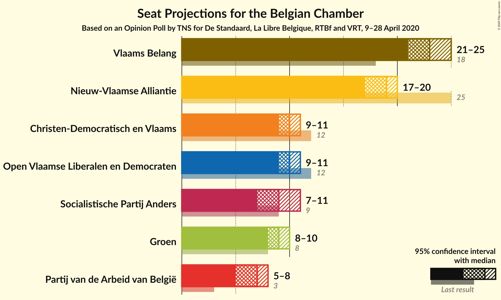
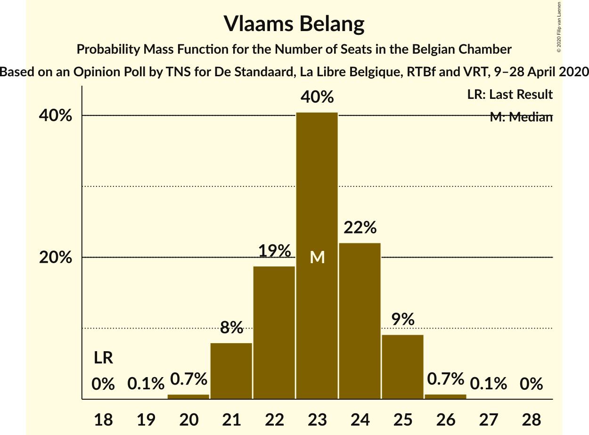
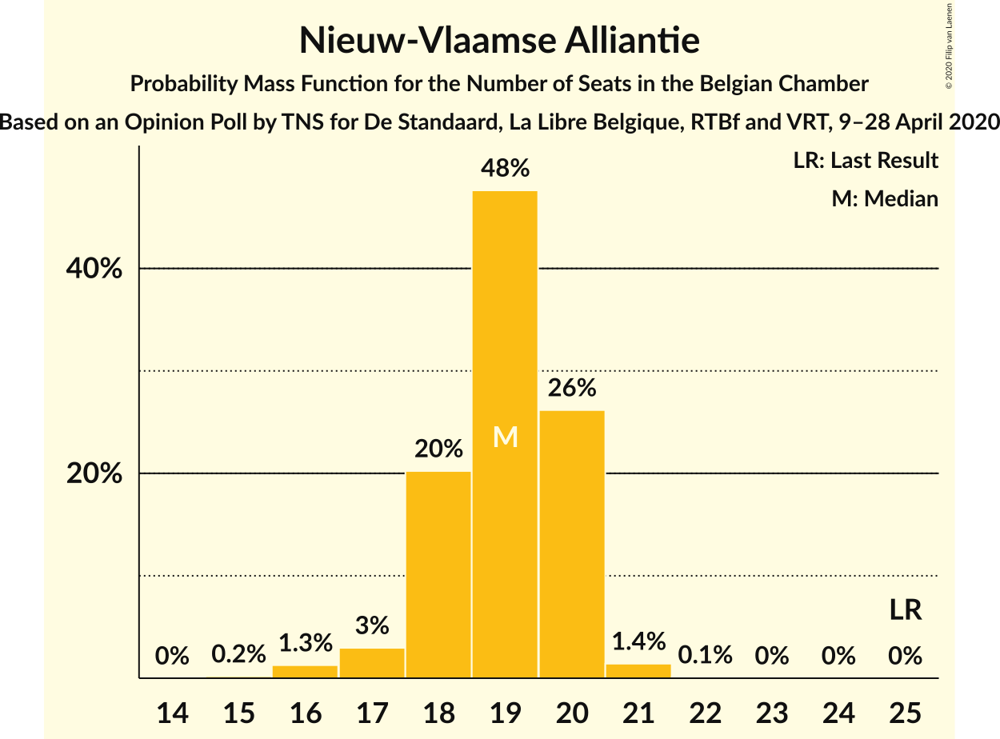
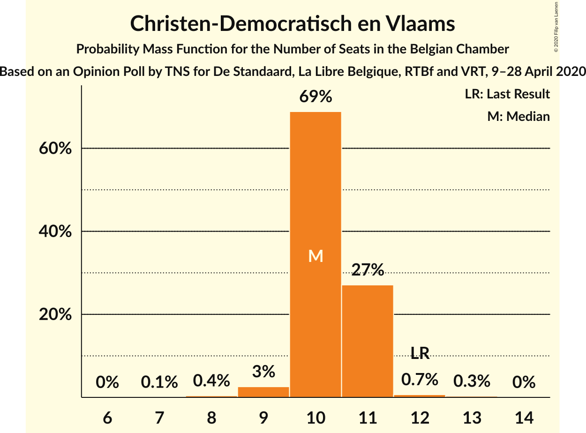
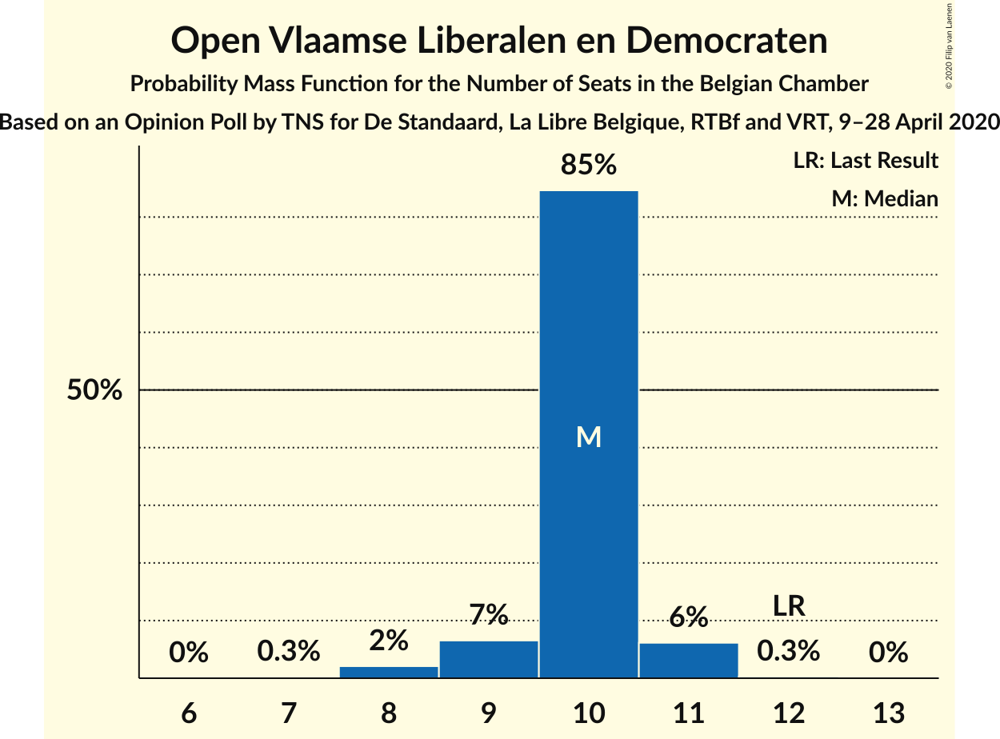
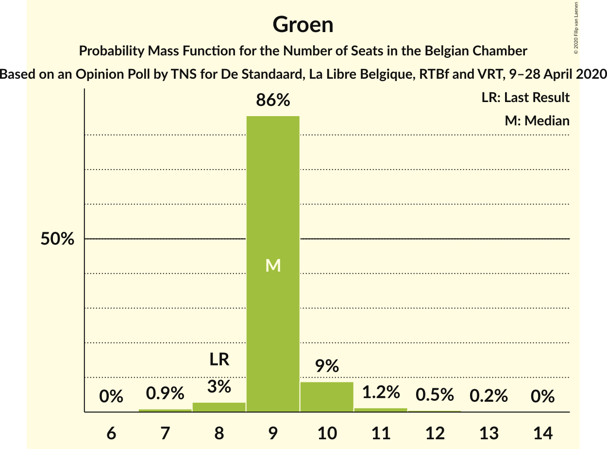
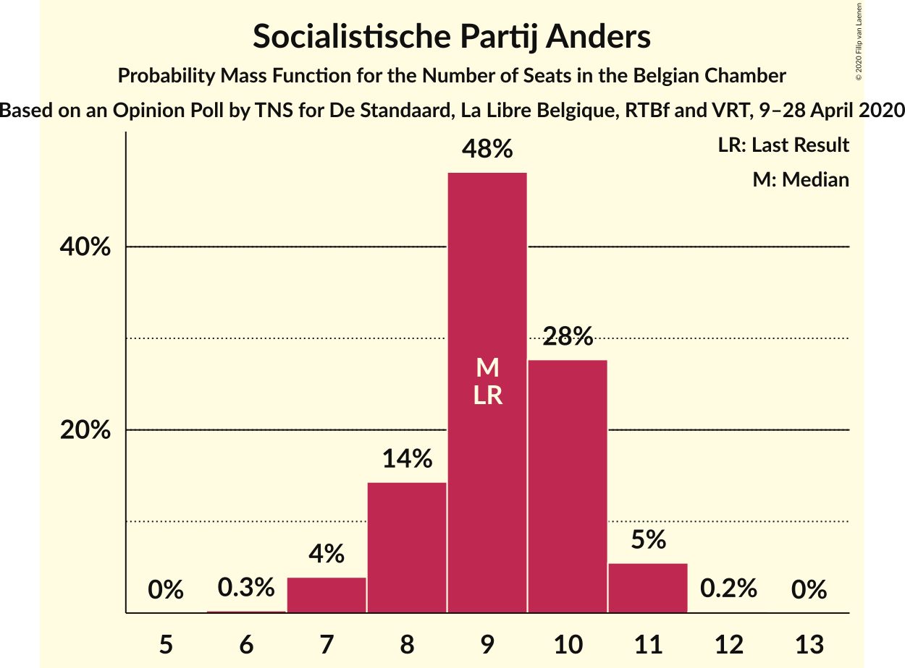
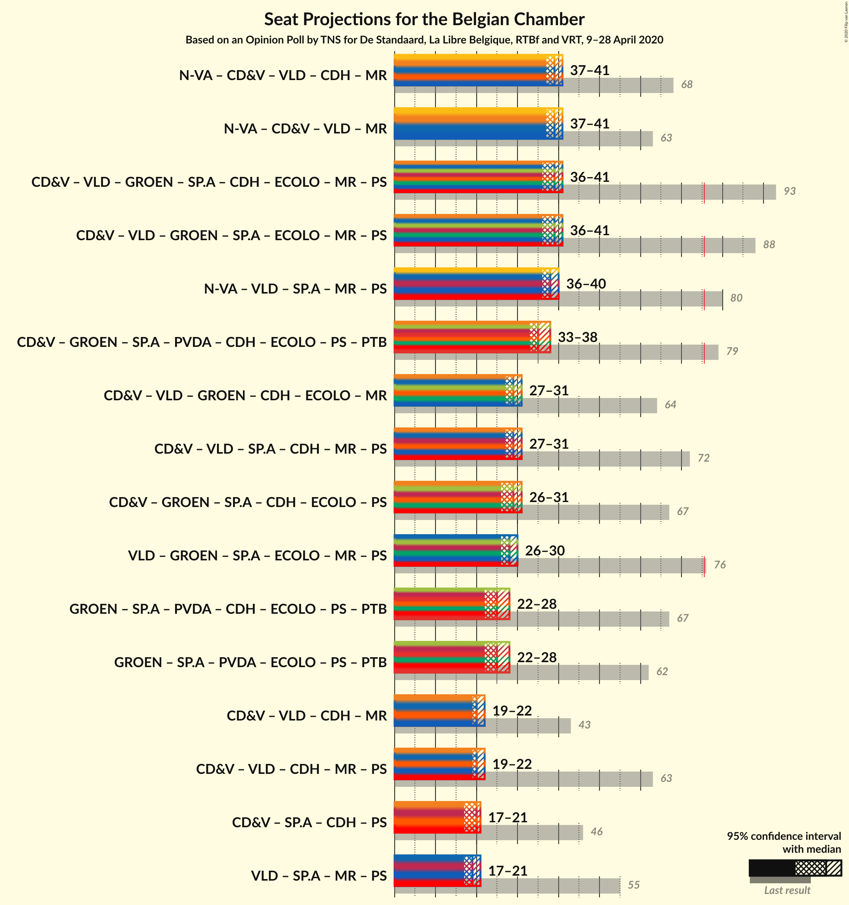

# Opinion Poll by TNS for De Standaard, La Libre Belgique, RTBf and VRT, 9–28 April 2020

Areas included: Flanders

<a href="#voting-intentions">Voting Intentions</a> | <a href="#seats">Seats</a> | <a href="#coalitions">Coalitions</a> | <a href="#technical-information">Technical Information</a>

## Voting Intentions

### Confidence Intervals

| Party | Last Result | Poll Result | 80% Confidence Interval | 90% Confidence Interval | 95% Confidence Interval | 99% Confidence Interval |
|:-----:|:-----------:|:-----------:|:-----------------------:|:-----------------------:|:-----------------------:|:-----------------------:|
| Vlaams Belang | 12.0% | 24.5% | N/A |N/A |N/A |N/A |
| Nieuw-Vlaamse Alliantie | 16.0% | 20.3% | N/A |N/A |N/A |N/A |
| Christen-Democratisch en Vlaams | 8.9% | 11.9% | N/A |N/A |N/A |N/A |
| Open Vlaamse Liberalen en Democraten | 8.5% | 11.6% | N/A |N/A |N/A |N/A |
| Groen | 6.1% | 11.1% | N/A |N/A |N/A |N/A |
| Socialistische Partij Anders | 6.7% | 11.0% | N/A |N/A |N/A |N/A |
| Partij van de Arbeid van België | 3.3% | 8.2% | N/A |N/A |N/A |N/A |

*Note:* The poll result column reflects the actual value used in the calculations. Published results may vary slightly, and in addition be rounded to fewer digits.

## Seats

### Confidence Intervals

| Party | Last Result | Median | 80% Confidence Interval | 90% Confidence Interval | 95% Confidence Interval | 99% Confidence Interval |
|:-----:|:-----------:|:------:|:-----------------------:|:-----------------------:|:-----------------------:|:-----------------------:|
| <a href="#vlaams-belang">Vlaams Belang</a> | 18 | 23 | 22–24 |21–25 |21–25 |20–26 |
| <a href="#nieuw-vlaamse-alliantie">Nieuw-Vlaamse Alliantie</a> | 25 | 19 | 18–20 |18–20 |17–20 |16–21 |
| <a href="#christen-democratisch-en-vlaams">Christen-Democratisch en Vlaams</a> | 12 | 10 | 10–11 |10–11 |9–11 |9–12 |
| <a href="#open-vlaamse-liberalen-en-democraten">Open Vlaamse Liberalen en Democraten</a> | 12 | 10 | 10 |9–11 |9–11 |8–11 |
| <a href="#groen">Groen</a> | 8 | 9 | 9–10 |9–10 |8–10 |7–12 |
| <a href="#socialistische-partij-anders">Socialistische Partij Anders</a> | 9 | 9 | 8–10 |8–11 |7–11 |7–11 |
| <a href="#partij-van-de-arbeid-van-belgië">Partij van de Arbeid van België</a> | 3 | 7 | 5–8 |5–8 |5–8 |4–8 |

### Vlaams Belang

*For a full overview of the results for this party, see the [Vlaams Belang](party-vlaamsbelang.html) page.*

| Number of Seats | Probability | Accumulated | Special Marks |
|:---------------:|:-----------:|:-----------:|:-------------:|
| 18 | 0% | 100% | Last Result |
| 19 | 0.1% | 100% |  |
| 20 | 0.7% | 99.9% |  |
| 21 | 8% | 99.2% |  |
| 22 | 19% | 91% |  |
| 23 | 40% | 72% | Median |
| 24 | 22% | 32% |  |
| 25 | 9% | 10% |  |
| 26 | 0.7% | 0.8% |  |
| 27 | 0.1% | 0.1% |  |
| 28 | 0% | 0% |  |

### Nieuw-Vlaamse Alliantie

*For a full overview of the results for this party, see the [Nieuw-Vlaamse Alliantie](party-nieuw-vlaamsealliantie.html) page.*

| Number of Seats | Probability | Accumulated | Special Marks |
|:---------------:|:-----------:|:-----------:|:-------------:|
| 15 | 0.2% | 100% |  |
| 16 | 1.3% | 99.8% |  |
| 17 | 3% | 98.5% |  |
| 18 | 20% | 96% |  |
| 19 | 48% | 75% | Median |
| 20 | 26% | 28% |  |
| 21 | 1.4% | 2% |  |
| 22 | 0.1% | 0.1% |  |
| 23 | 0% | 0% |  |
| 24 | 0% | 0% |  |
| 25 | 0% | 0% | Last Result |

### Christen-Democratisch en Vlaams

*For a full overview of the results for this party, see the [Christen-Democratisch en Vlaams](party-christen-democratischenvlaams.html) page.*

| Number of Seats | Probability | Accumulated | Special Marks |
|:---------------:|:-----------:|:-----------:|:-------------:|
| 7 | 0.1% | 100% |  |
| 8 | 0.4% | 99.9% |  |
| 9 | 3% | 99.5% |  |
| 10 | 69% | 97% | Median |
| 11 | 27% | 28% |  |
| 12 | 0.7% | 1.0% | Last Result |
| 13 | 0.3% | 0.3% |  |
| 14 | 0% | 0% |  |

### Open Vlaamse Liberalen en Democraten

*For a full overview of the results for this party, see the [Open Vlaamse Liberalen en Democraten](party-openvlaamseliberalenendemocraten.html) page.*

| Number of Seats | Probability | Accumulated | Special Marks |
|:---------------:|:-----------:|:-----------:|:-------------:|
| 7 | 0.3% | 100% |  |
| 8 | 2% | 99.7% |  |
| 9 | 7% | 98% |  |
| 10 | 85% | 91% | Median |
| 11 | 6% | 6% |  |
| 12 | 0.3% | 0.3% | Last Result |
| 13 | 0% | 0% |  |

### Groen

*For a full overview of the results for this party, see the [Groen](party-groen.html) page.*

| Number of Seats | Probability | Accumulated | Special Marks |
|:---------------:|:-----------:|:-----------:|:-------------:|
| 7 | 0.9% | 100% |  |
| 8 | 3% | 99.1% | Last Result |
| 9 | 86% | 96% | Median |
| 10 | 9% | 11% |  |
| 11 | 1.2% | 2% |  |
| 12 | 0.5% | 0.7% |  |
| 13 | 0.2% | 0.2% |  |
| 14 | 0% | 0% |  |

### Socialistische Partij Anders

*For a full overview of the results for this party, see the [Socialistische Partij Anders](party-socialistischepartijanders.html) page.*

| Number of Seats | Probability | Accumulated | Special Marks |
|:---------------:|:-----------:|:-----------:|:-------------:|
| 6 | 0.3% | 100% |  |
| 7 | 4% | 99.7% |  |
| 8 | 14% | 96% |  |
| 9 | 48% | 81% | Last Result, Median |
| 10 | 28% | 33% |  |
| 11 | 5% | 6% |  |
| 12 | 0.2% | 0.2% |  |
| 13 | 0% | 0% |  |

### Partij van de Arbeid van België

*For a full overview of the results for this party, see the [Partij van de Arbeid van België](party-partijvandearbeidvanbelgië.html) page.*

| Number of Seats | Probability | Accumulated | Special Marks |
|:---------------:|:-----------:|:-----------:|:-------------:|
| 3 | 0% | 100% | Last Result |
| 4 | 0.7% | 100% |  |
| 5 | 30% | 99.3% |  |
| 6 | 14% | 70% |  |
| 7 | 31% | 56% | Median |
| 8 | 25% | 25% |  |
| 9 | 0% | 0% |  |

## Coalitions

### Confidence Intervals

| Coalition | Last Result | Median | Majority? | 80% Confidence Interval | 90% Confidence Interval | 95% Confidence Interval | 99% Confidence Interval |
|:---------:|:-----------:|:------:|:---------:|:-----------------------:|:-----------------------:|:-----------------------:|:-----------------------:|

## Technical Information

### Opinion Poll

+ **Polling firm:** TNS
+ **Commissioner(s):** De Standaard, La Libre Belgique, RTBf and VRT
+ **Fieldwork period:** 9–28 April 2020

### Calculations

+ **Sample size:** 1857
+ **Simulations done:** 1,048,576
+ **Error estimate:** 0.59%

