# Opinion Poll by Ipsos for Het Laatste Nieuws, Le Soir, RTL TVi and VTM, 10–15 June 2020

Areas included: Brussels, Flanders, Wallonia

<a href="#voting-intentions">Voting Intentions</a> | <a href="#seats">Seats</a> | <a href="#coalitions">Coalitions</a> | <a href="#technical-information">Technical Information</a>

## Voting Intentions

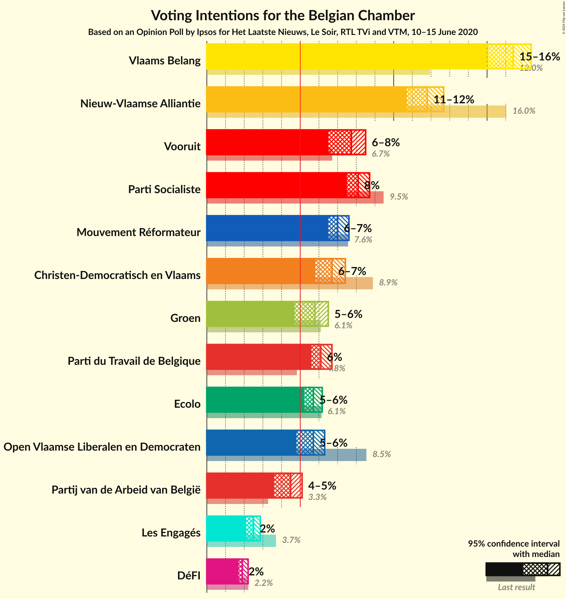

### Confidence Intervals

| Party | Last Result | Poll Result | 80% Confidence Interval | 90% Confidence Interval | 95% Confidence Interval | 99% Confidence Interval |
|:-----:|:-----------:|:-----------:|:-----------------------:|:-----------------------:|:-----------------------:|:-----------------------:|
| Vlaams Belang | 12.0% | 17.4% | 15.4–16.3% |15.2–16.4% |15.0–16.4% |14.6–16.4% |
| Nieuw-Vlaamse Alliantie | 16.0% | 12.7% | 11.0–11.8% |10.8–11.8% |10.7–11.8% |10.3–11.9% |
| Parti Socialiste | 9.5% | 8.7% | 7.7–8.1% |7.6–8.1% |7.5–8.1% |7.3–8.1% |
| Vooruit | 6.7% | 7.7% | 6.9–8.4% |6.7–8.5% |6.5–8.5% |6.2–8.6% |
| Mouvement Réformateur | 7.6% | 7.6% | 6.6–7.0% |6.5–7.0% |6.5–7.0% |6.3–7.0% |
| Christen-Democratisch en Vlaams | 8.9% | 7.4% | 6.1–6.7% |5.9–6.7% |5.8–6.7% |5.5–6.7% |
| Parti du Travail de Belgique | 4.8% | 6.7% | 5.8–6.1% |5.7–6.1% |5.6–6.1% |5.4–6.1% |
| Open Vlaamse Liberalen en Democraten | 8.5% | 6.3% | 5.1–5.6% |4.9–5.6% |4.8–5.7% |4.6–5.7% |
| Ecolo | 6.1% | 6.2% | 5.3–5.7% |5.3–5.7% |5.2–5.7% |5.0–5.7% |
| Groen | 6.1% | 5.8% | 5.1–6.3% |4.9–6.5% |4.7–6.5% |4.4–6.6% |
| Partij van de Arbeid van België | 3.3% | 4.5% | 3.9–5.0% |3.7–5.1% |3.6–5.1% |3.3–5.2% |
| Centre démocrate humaniste | 3.7% | 2.9% | 2.2–2.5% |2.2–2.5% |2.1–2.5% |2.0–2.5% |
| DéFI | 2.2% | 2.2% | 1.8–1.9% |1.7–1.9% |1.7–1.9% |1.6–1.9% |

*Note:* The poll result column reflects the actual value used in the calculations. Published results may vary slightly, and in addition be rounded to fewer digits.

## Seats

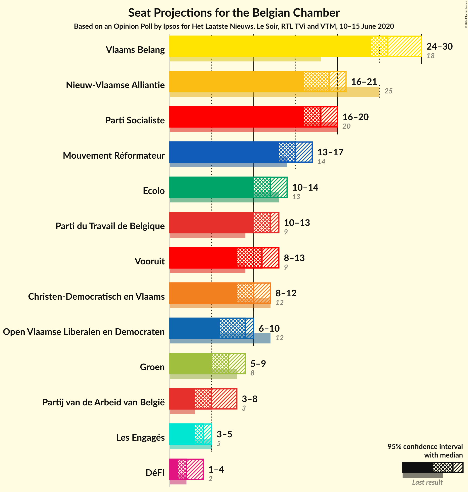

### Confidence Intervals

| Party | Last Result | Median | 80% Confidence Interval | 90% Confidence Interval | 95% Confidence Interval | 99% Confidence Interval |
|:-----:|:-----------:|:------:|:-----------------------:|:-----------------------:|:-----------------------:|:-----------------------:|
| <a href="#vlaams-belang">Vlaams Belang</a> | 18 | 26 | 25–29 |24–29 |24–30 |23–31 |
| <a href="#nieuw-vlaamse-alliantie">Nieuw-Vlaamse Alliantie</a> | 25 | 19 | 17–21 |16–21 |16–21 |15–23 |
| <a href="#parti-socialiste">Parti Socialiste</a> | 20 | 18 | 16–19 |16–19 |16–20 |15–21 |
| <a href="#vooruit">Vooruit</a> | 9 | 11 | 9–12 |9–13 |8–13 |8–14 |
| <a href="#mouvement-réformateur">Mouvement Réformateur</a> | 14 | 15 | 13–17 |13–17 |13–17 |12–18 |
| <a href="#christen-democratisch-en-vlaams">Christen-Democratisch en Vlaams</a> | 12 | 10 | 9–11 |8–12 |8–12 |7–13 |
| <a href="#parti-du-travail-de-belgique">Parti du Travail de Belgique</a> | 9 | 12 | 11–13 |10–13 |10–13 |10–15 |
| <a href="#open-vlaamse-liberalen-en-democraten">Open Vlaamse Liberalen en Democraten</a> | 12 | 9 | 6–10 |6–10 |6–10 |6–11 |
| <a href="#ecolo">Ecolo</a> | 13 | 12 | 11–13 |10–14 |10–14 |10–14 |
| <a href="#groen">Groen</a> | 8 | 7 | 6–9 |5–9 |5–9 |5–10 |
| <a href="#partij-van-de-arbeid-van-belgië">Partij van de Arbeid van België</a> | 3 | 5 | 4–7 |3–8 |3–8 |3–8 |
| <a href="#centre-démocrate-humaniste">Centre démocrate humaniste</a> | 5 | 4 | 4–5 |4–5 |3–5 |1–5 |
| <a href="#défi">DéFI</a> | 2 | 2 | 1–3 |1–3 |1–4 |1–4 |

### Vlaams Belang

*For a full overview of the results for this party, see the [Vlaams Belang](party-vlaamsbelang.html) page.*

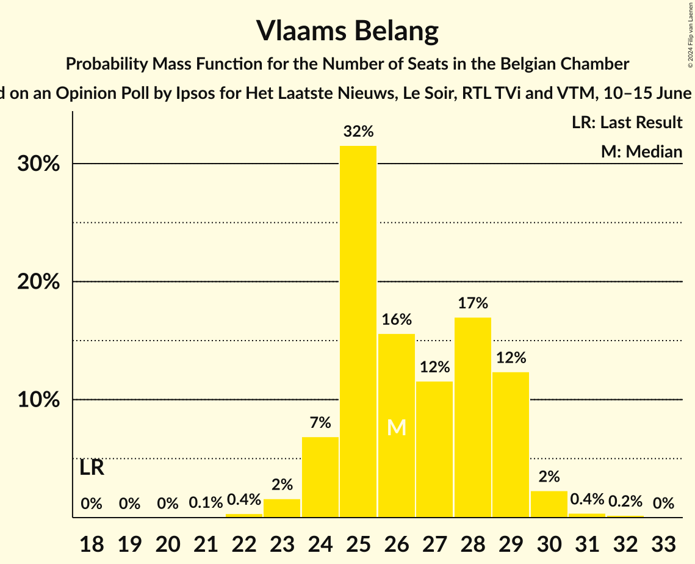

| Number of Seats | Probability | Accumulated | Special Marks |
|:---------------:|:-----------:|:-----------:|:-------------:|
| 18 | 0% | 100% | Last Result |
| 19 | 0% | 100% |  |
| 20 | 0% | 100% |  |
| 21 | 0.1% | 100% |  |
| 22 | 0.4% | 99.9% |  |
| 23 | 2% | 99.5% |  |
| 24 | 7% | 98% |  |
| 25 | 32% | 91% |  |
| 26 | 16% | 59% | Median |
| 27 | 12% | 44% |  |
| 28 | 17% | 32% |  |
| 29 | 12% | 15% |  |
| 30 | 2% | 3% |  |
| 31 | 0.4% | 0.6% |  |
| 32 | 0.2% | 0.2% |  |
| 33 | 0% | 0% |  |

### Nieuw-Vlaamse Alliantie

*For a full overview of the results for this party, see the [Nieuw-Vlaamse Alliantie](party-nieuw-vlaamsealliantie.html) page.*

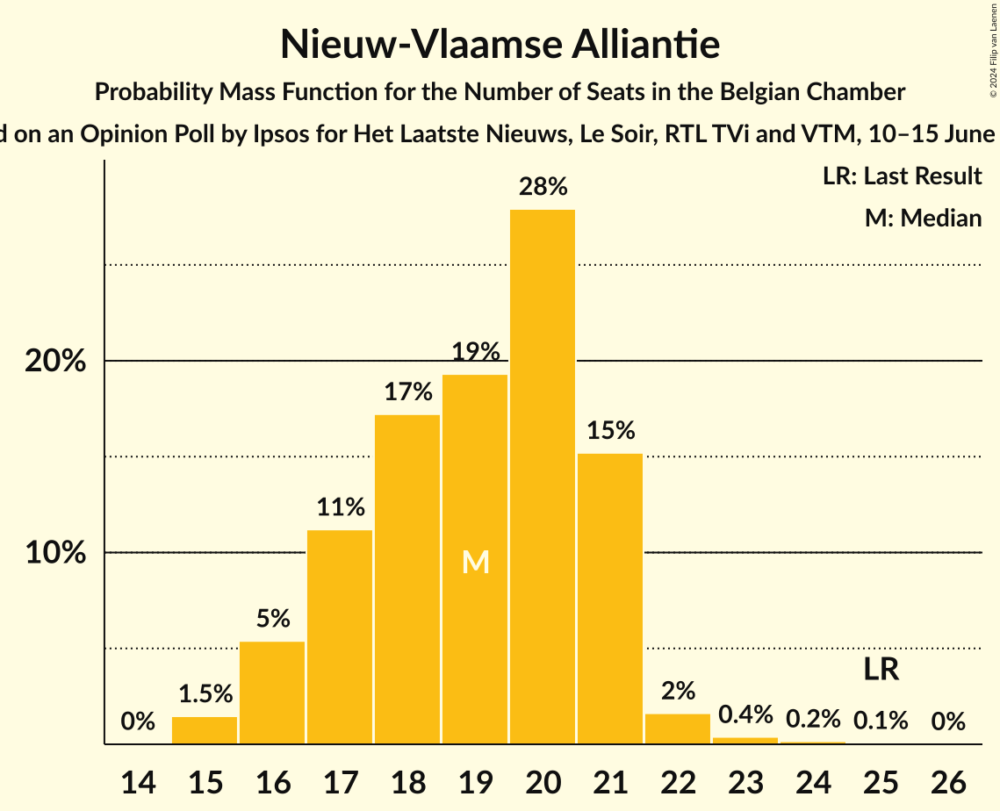

| Number of Seats | Probability | Accumulated | Special Marks |
|:---------------:|:-----------:|:-----------:|:-------------:|
| 15 | 1.5% | 100% |  |
| 16 | 5% | 98.5% |  |
| 17 | 11% | 93% |  |
| 18 | 17% | 82% |  |
| 19 | 19% | 65% | Median |
| 20 | 28% | 45% |  |
| 21 | 15% | 17% |  |
| 22 | 2% | 2% |  |
| 23 | 0.4% | 0.6% |  |
| 24 | 0.2% | 0.3% |  |
| 25 | 0.1% | 0.1% | Last Result |
| 26 | 0% | 0% |  |

### Parti Socialiste

*For a full overview of the results for this party, see the [Parti Socialiste](party-partisocialiste.html) page.*

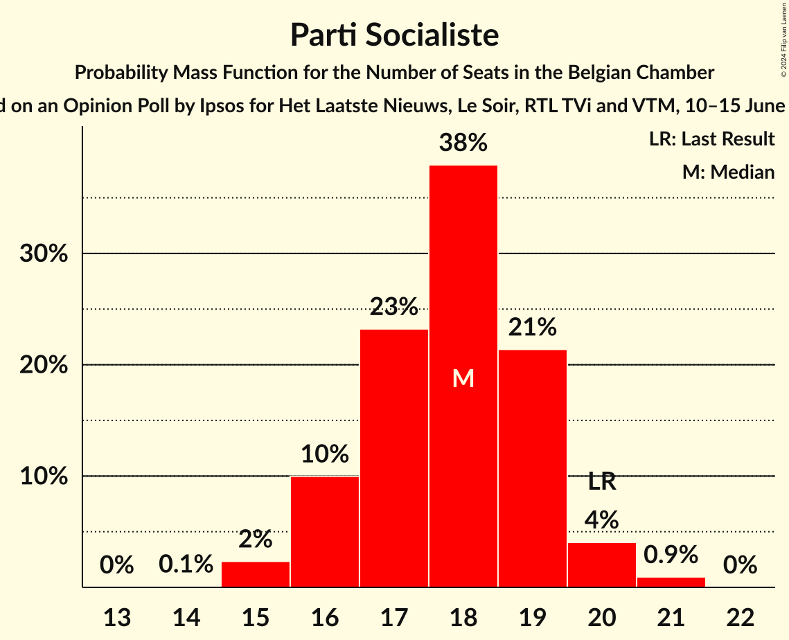

| Number of Seats | Probability | Accumulated | Special Marks |
|:---------------:|:-----------:|:-----------:|:-------------:|
| 14 | 0.1% | 100% |  |
| 15 | 2% | 99.9% |  |
| 16 | 10% | 98% |  |
| 17 | 23% | 88% |  |
| 18 | 38% | 64% | Median |
| 19 | 21% | 26% |  |
| 20 | 4% | 5% | Last Result |
| 21 | 0.9% | 1.0% |  |
| 22 | 0% | 0% |  |

### Vooruit

*For a full overview of the results for this party, see the [Vooruit](party-vooruit.html) page.*

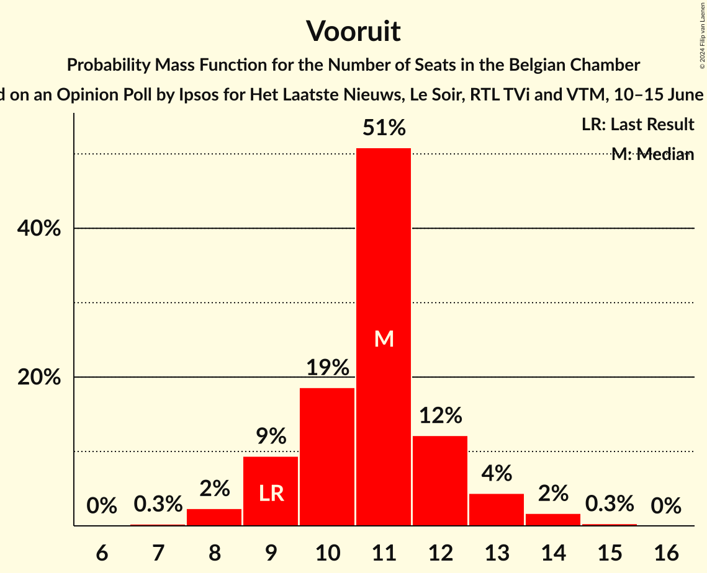

| Number of Seats | Probability | Accumulated | Special Marks |
|:---------------:|:-----------:|:-----------:|:-------------:|
| 7 | 0.3% | 100% |  |
| 8 | 2% | 99.7% |  |
| 9 | 9% | 97% | Last Result |
| 10 | 19% | 88% |  |
| 11 | 51% | 69% | Median |
| 12 | 12% | 19% |  |
| 13 | 4% | 6% |  |
| 14 | 2% | 2% |  |
| 15 | 0.3% | 0.3% |  |
| 16 | 0% | 0% |  |

### Mouvement Réformateur

*For a full overview of the results for this party, see the [Mouvement Réformateur](party-mouvementréformateur.html) page.*

| Number of Seats | Probability | Accumulated | Special Marks |
|:---------------:|:-----------:|:-----------:|:-------------:|
| 12 | 0.8% | 100% |  |
| 13 | 13% | 99.2% |  |
| 14 | 34% | 86% | Last Result |
| 15 | 26% | 52% | Median |
| 16 | 12% | 25% |  |
| 17 | 12% | 14% |  |
| 18 | 2% | 2% |  |
| 19 | 0% | 0% |  |

### Christen-Democratisch en Vlaams

*For a full overview of the results for this party, see the [Christen-Democratisch en Vlaams](party-christen-democratischenvlaams.html) page.*

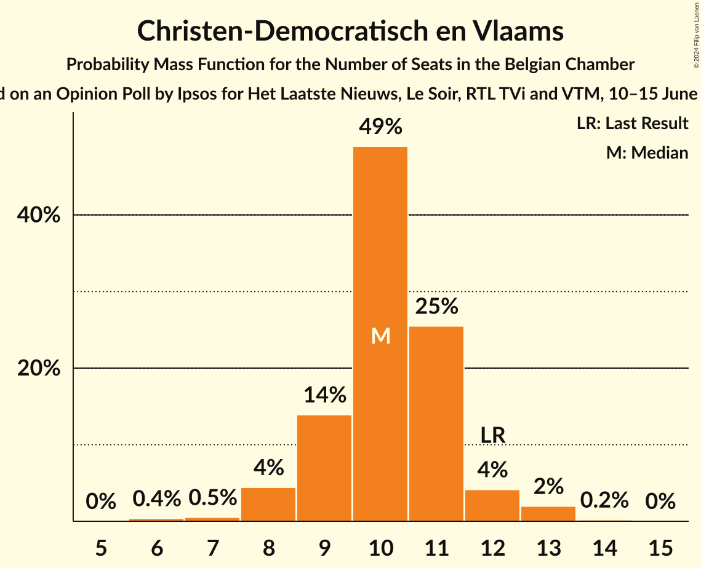

| Number of Seats | Probability | Accumulated | Special Marks |
|:---------------:|:-----------:|:-----------:|:-------------:|
| 6 | 0.4% | 100% |  |
| 7 | 0.5% | 99.6% |  |
| 8 | 4% | 99.1% |  |
| 9 | 14% | 95% |  |
| 10 | 49% | 81% | Median |
| 11 | 25% | 32% |  |
| 12 | 4% | 6% | Last Result |
| 13 | 2% | 2% |  |
| 14 | 0.2% | 0.2% |  |
| 15 | 0% | 0% |  |

### Parti du Travail de Belgique

*For a full overview of the results for this party, see the [Parti du Travail de Belgique](party-partidutravaildebelgique.html) page.*

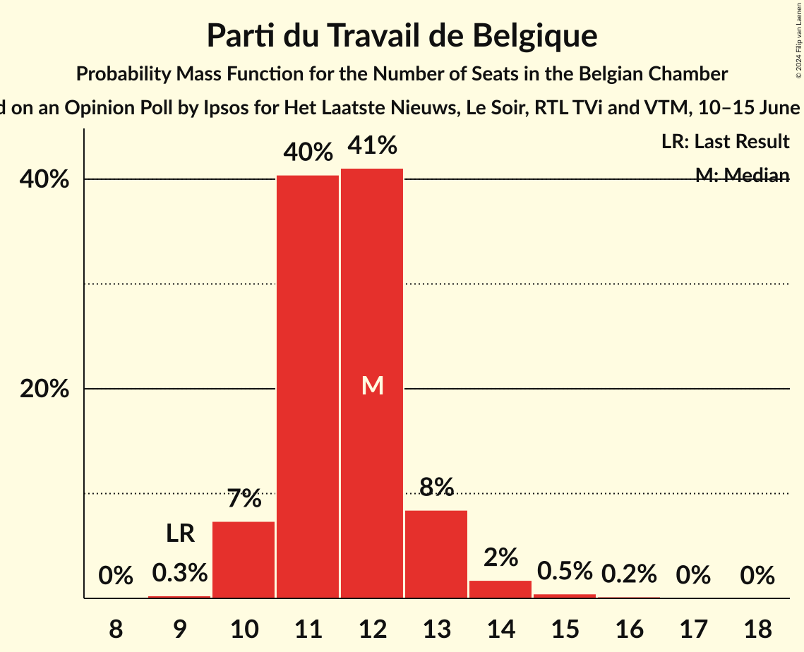

| Number of Seats | Probability | Accumulated | Special Marks |
|:---------------:|:-----------:|:-----------:|:-------------:|
| 9 | 0.3% | 100% | Last Result |
| 10 | 7% | 99.7% |  |
| 11 | 40% | 92% |  |
| 12 | 41% | 52% | Median |
| 13 | 8% | 11% |  |
| 14 | 2% | 2% |  |
| 15 | 0.5% | 0.7% |  |
| 16 | 0.2% | 0.2% |  |
| 17 | 0% | 0.1% |  |
| 18 | 0% | 0% |  |

### Open Vlaamse Liberalen en Democraten

*For a full overview of the results for this party, see the [Open Vlaamse Liberalen en Democraten](party-openvlaamseliberalenendemocraten.html) page.*

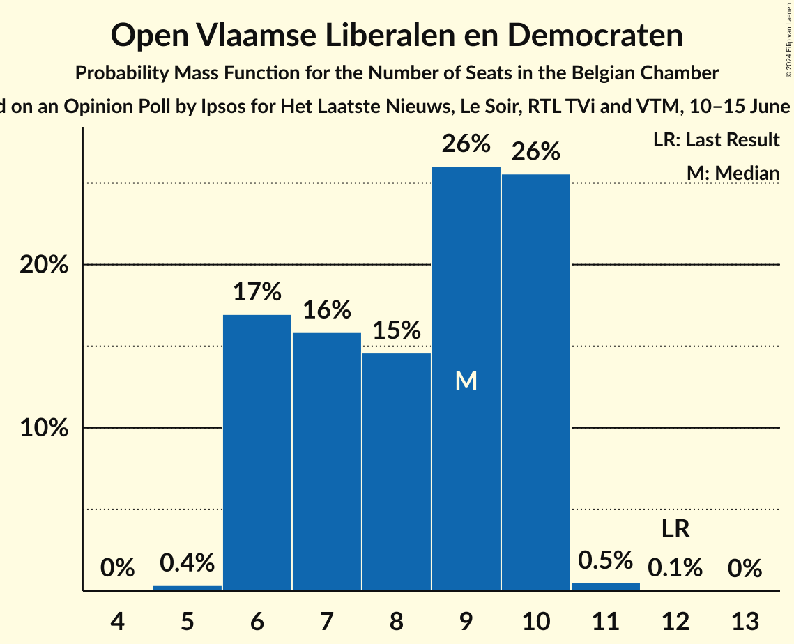

| Number of Seats | Probability | Accumulated | Special Marks |
|:---------------:|:-----------:|:-----------:|:-------------:|
| 5 | 0.4% | 100% |  |
| 6 | 17% | 99.6% |  |
| 7 | 16% | 83% |  |
| 8 | 15% | 67% |  |
| 9 | 26% | 52% | Median |
| 10 | 26% | 26% |  |
| 11 | 0.5% | 0.6% |  |
| 12 | 0.1% | 0.1% | Last Result |
| 13 | 0% | 0% |  |

### Ecolo

*For a full overview of the results for this party, see the [Ecolo](party-ecolo.html) page.*

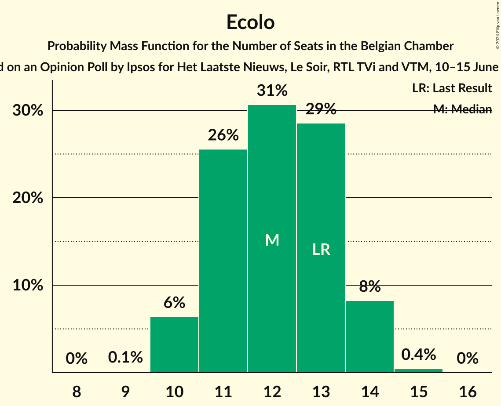

| Number of Seats | Probability | Accumulated | Special Marks |
|:---------------:|:-----------:|:-----------:|:-------------:|
| 9 | 0.1% | 100% |  |
| 10 | 6% | 99.9% |  |
| 11 | 26% | 93% |  |
| 12 | 31% | 68% | Median |
| 13 | 29% | 37% | Last Result |
| 14 | 8% | 9% |  |
| 15 | 0.4% | 0.5% |  |
| 16 | 0% | 0% |  |

### Groen

*For a full overview of the results for this party, see the [Groen](party-groen.html) page.*

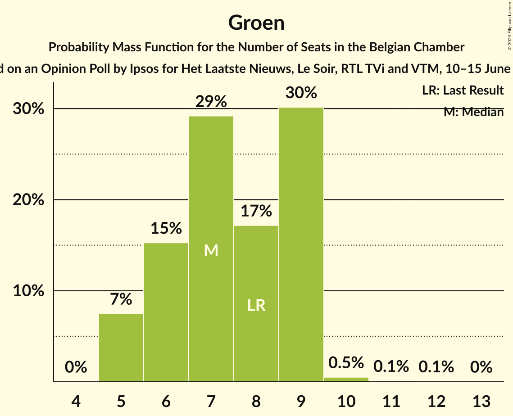

| Number of Seats | Probability | Accumulated | Special Marks |
|:---------------:|:-----------:|:-----------:|:-------------:|
| 5 | 7% | 100% |  |
| 6 | 15% | 92% |  |
| 7 | 29% | 77% | Median |
| 8 | 17% | 48% | Last Result |
| 9 | 30% | 31% |  |
| 10 | 0.5% | 0.7% |  |
| 11 | 0.1% | 0.2% |  |
| 12 | 0.1% | 0.1% |  |
| 13 | 0% | 0% |  |

### Partij van de Arbeid van België

*For a full overview of the results for this party, see the [Partij van de Arbeid van België](party-partijvandearbeidvanbelgië.html) page.*

| Number of Seats | Probability | Accumulated | Special Marks |
|:---------------:|:-----------:|:-----------:|:-------------:|
| 1 | 0.2% | 100% |  |
| 2 | 0.2% | 99.8% |  |
| 3 | 7% | 99.6% | Last Result |
| 4 | 15% | 92% |  |
| 5 | 49% | 77% | Median |
| 6 | 9% | 28% |  |
| 7 | 13% | 19% |  |
| 8 | 6% | 6% |  |
| 9 | 0% | 0% |  |

### Centre démocrate humaniste

*For a full overview of the results for this party, see the [Centre démocrate humaniste](party-centredémocratehumaniste.html) page.*

| Number of Seats | Probability | Accumulated | Special Marks |
|:---------------:|:-----------:|:-----------:|:-------------:|
| 0 | 0.1% | 100% |  |
| 1 | 0.5% | 99.9% |  |
| 2 | 1.2% | 99.4% |  |
| 3 | 2% | 98% |  |
| 4 | 59% | 96% | Median |
| 5 | 37% | 37% | Last Result |
| 6 | 0% | 0% |  |

### DéFI

*For a full overview of the results for this party, see the [DéFI](party-défi.html) page.*

| Number of Seats | Probability | Accumulated | Special Marks |
|:---------------:|:-----------:|:-----------:|:-------------:|
| 1 | 16% | 100% |  |
| 2 | 71% | 84% | Last Result, Median |
| 3 | 9% | 13% |  |
| 4 | 4% | 4% |  |
| 5 | 0.1% | 0.1% |  |
| 6 | 0% | 0% |  |

## Coalitions

### Confidence Intervals

| Coalition | Last Result | Median | Majority? | 80% Confidence Interval | 90% Confidence Interval | 95% Confidence Interval | 99% Confidence Interval |
|:---------:|:-----------:|:------:|:---------:|:-----------------------:|:-----------------------:|:-----------------------:|:-----------------------:|
| Mouvement Réformateur – Christen-Democratisch en Vlaams – Open Vlaamse Liberalen en Democraten – Ecolo – Groen – Centre démocrate humaniste | 64 | 57 | 0% | 54–60 | 53–61 | 53–62 | 51–63 |
| Nieuw-Vlaamse Alliantie – Mouvement Réformateur – Christen-Democratisch en Vlaams – Open Vlaamse Liberalen en Democraten – Centre démocrate humaniste | 68 | 57 | 0% | 54–60 | 53–60 | 52–61 | 50–63 |
| Parti Socialiste – Mouvement Réformateur – Christen-Democratisch en Vlaams – Open Vlaamse Liberalen en Democraten – Centre démocrate humaniste | 63 | 55 | 0% | 53–58 | 52–59 | 51–59 | 50–60 |
| Nieuw-Vlaamse Alliantie – Mouvement Réformateur – Christen-Democratisch en Vlaams – Open Vlaamse Liberalen en Democraten | 63 | 52 | 0% | 49–55 | 48–56 | 48–57 | 46–58 |
| Mouvement Réformateur – Christen-Democratisch en Vlaams – Open Vlaamse Liberalen en Democraten – Centre démocrate humaniste | 43 | 38 | 0% | 35–40 | 34–41 | 33–42 | 32–43 |
| Nieuw-Vlaamse Alliantie – Parti Socialiste – Vooruit – Mouvement Réformateur – Open Vlaamse Liberalen en Democraten | 80 | 38 | 0% | 35–40 | 35–41 | 34–41 | 33–42 |
| Parti Socialiste – Vooruit – Mouvement Réformateur – Christen-Democratisch en Vlaams – Open Vlaamse Liberalen en Democraten – Ecolo – Groen – Centre démocrate humaniste | 93 | 37 | 0% | 34–39 | 33–40 | 33–41 | 32–42 |
| Parti Socialiste – Vooruit – Mouvement Réformateur – Christen-Democratisch en Vlaams – Open Vlaamse Liberalen en Democraten – Ecolo – Groen | 88 | 37 | 0% | 34–39 | 33–40 | 33–41 | 32–42 |
| Parti Socialiste – Vooruit – Christen-Democratisch en Vlaams – Parti du Travail de Belgique – Ecolo – Groen – Partij van de Arbeid van België – Centre démocrate humaniste | 79 | 34 | 0% | 31–36 | 31–37 | 30–38 | 29–39 |
| Parti Socialiste – Vooruit – Mouvement Réformateur – Christen-Democratisch en Vlaams – Open Vlaamse Liberalen en Democraten – Centre démocrate humaniste | 72 | 29 | 0% | 27–31 | 26–32 | 26–33 | 25–34 |
| Parti Socialiste – Vooruit – Christen-Democratisch en Vlaams – Ecolo – Groen – Centre démocrate humaniste | 67 | 28 | 0% | 26–31 | 26–32 | 25–32 | 24–33 |
| Parti Socialiste – Vooruit – Mouvement Réformateur – Open Vlaamse Liberalen en Democraten – Ecolo – Groen | 76 | 27 | 0% | 24–29 | 24–30 | 23–30 | 22–31 |
| Parti Socialiste – Vooruit – Parti du Travail de Belgique – Ecolo – Groen – Partij van de Arbeid van België – Centre démocrate humaniste | 67 | 24 | 0% | 21–26 | 21–27 | 20–27 | 19–28 |
| Parti Socialiste – Vooruit – Parti du Travail de Belgique – Ecolo – Groen – Partij van de Arbeid van België | 62 | 24 | 0% | 21–26 | 21–27 | 20–27 | 19–28 |
| Parti Socialiste – Vooruit – Christen-Democratisch en Vlaams – Centre démocrate humaniste | 46 | 21 | 0% | 19–23 | 19–24 | 18–24 | 17–25 |
| Parti Socialiste – Vooruit – Mouvement Réformateur – Open Vlaamse Liberalen en Democraten | 55 | 19 | 0% | 17–21 | 16–22 | 16–22 | 15–23 |

### Mouvement Réformateur – Christen-Democratisch en Vlaams – Open Vlaamse Liberalen en Democraten – Ecolo – Groen – Centre démocrate humaniste

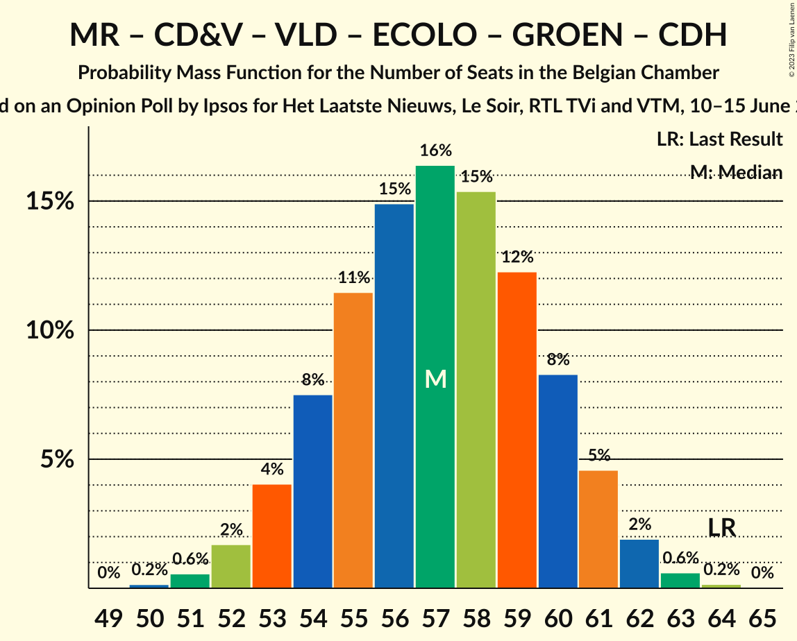

| Number of Seats | Probability | Accumulated | Special Marks |
|:---------------:|:-----------:|:-----------:|:-------------:|
| 50 | 0.2% | 100% |  |
| 51 | 0.6% | 99.8% |  |
| 52 | 2% | 99.2% |  |
| 53 | 4% | 98% |  |
| 54 | 8% | 93% |  |
| 55 | 11% | 86% |  |
| 56 | 15% | 75% |  |
| 57 | 16% | 60% | Median |
| 58 | 15% | 43% |  |
| 59 | 12% | 28% |  |
| 60 | 8% | 16% |  |
| 61 | 5% | 7% |  |
| 62 | 2% | 3% |  |
| 63 | 0.6% | 0.8% |  |
| 64 | 0.2% | 0.2% | Last Result |
| 65 | 0% | 0% |  |

### Nieuw-Vlaamse Alliantie – Mouvement Réformateur – Christen-Democratisch en Vlaams – Open Vlaamse Liberalen en Democraten – Centre démocrate humaniste

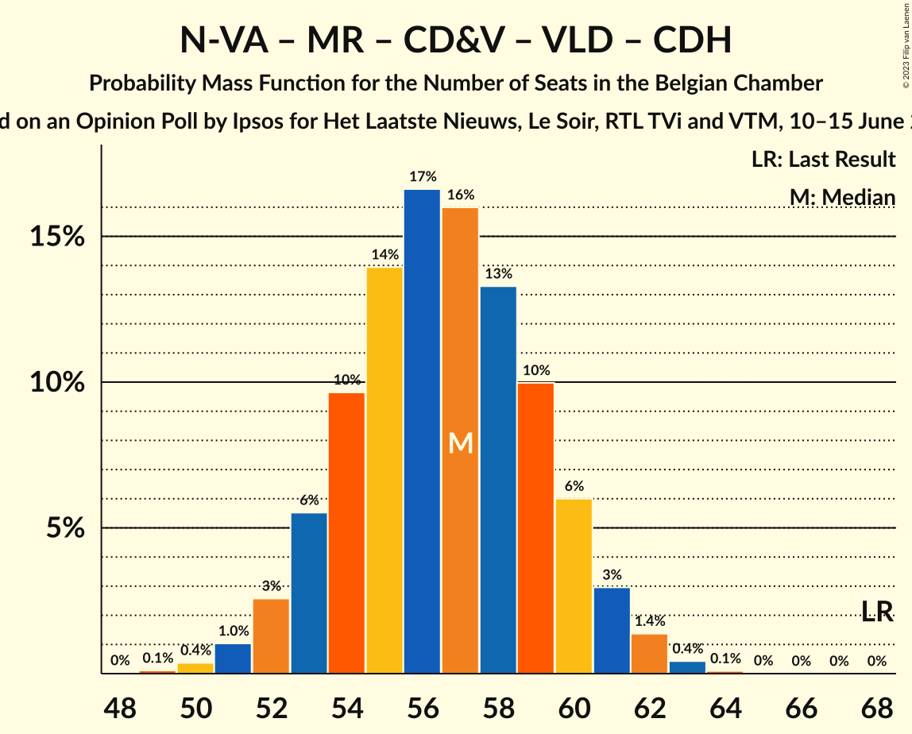

| Number of Seats | Probability | Accumulated | Special Marks |
|:---------------:|:-----------:|:-----------:|:-------------:|
| 49 | 0.1% | 100% |  |
| 50 | 0.4% | 99.9% |  |
| 51 | 1.0% | 99.5% |  |
| 52 | 3% | 98% |  |
| 53 | 6% | 96% |  |
| 54 | 10% | 90% |  |
| 55 | 14% | 81% |  |
| 56 | 17% | 67% |  |
| 57 | 16% | 50% | Median |
| 58 | 13% | 34% |  |
| 59 | 10% | 21% |  |
| 60 | 6% | 11% |  |
| 61 | 3% | 5% |  |
| 62 | 1.4% | 2% |  |
| 63 | 0.4% | 0.5% |  |
| 64 | 0.1% | 0.1% |  |
| 65 | 0% | 0% |  |
| 66 | 0% | 0% |  |
| 67 | 0% | 0% |  |
| 68 | 0% | 0% | Last Result |

### Parti Socialiste – Mouvement Réformateur – Christen-Democratisch en Vlaams – Open Vlaamse Liberalen en Democraten – Centre démocrate humaniste

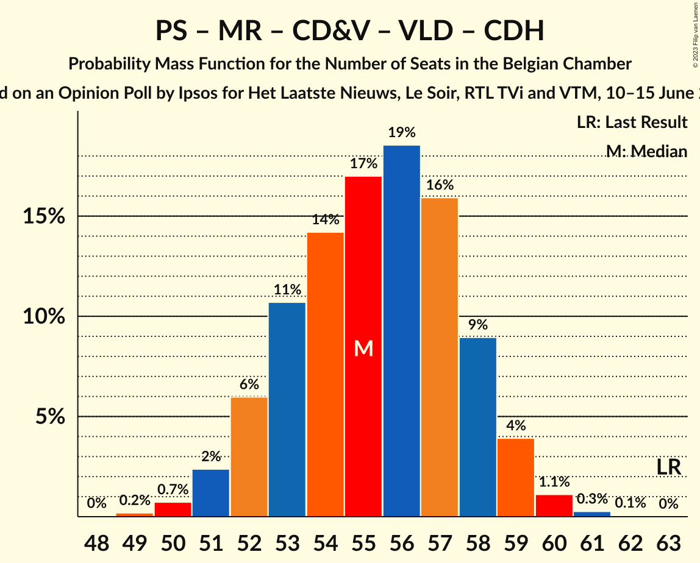

| Number of Seats | Probability | Accumulated | Special Marks |
|:---------------:|:-----------:|:-----------:|:-------------:|
| 48 | 0% | 100% |  |
| 49 | 0.2% | 99.9% |  |
| 50 | 0.7% | 99.8% |  |
| 51 | 2% | 99.0% |  |
| 52 | 6% | 97% |  |
| 53 | 11% | 91% |  |
| 54 | 14% | 80% |  |
| 55 | 17% | 66% |  |
| 56 | 19% | 49% | Median |
| 57 | 16% | 30% |  |
| 58 | 9% | 14% |  |
| 59 | 4% | 5% |  |
| 60 | 1.1% | 1.4% |  |
| 61 | 0.3% | 0.3% |  |
| 62 | 0.1% | 0.1% |  |
| 63 | 0% | 0% | Last Result |

### Nieuw-Vlaamse Alliantie – Mouvement Réformateur – Christen-Democratisch en Vlaams – Open Vlaamse Liberalen en Democraten

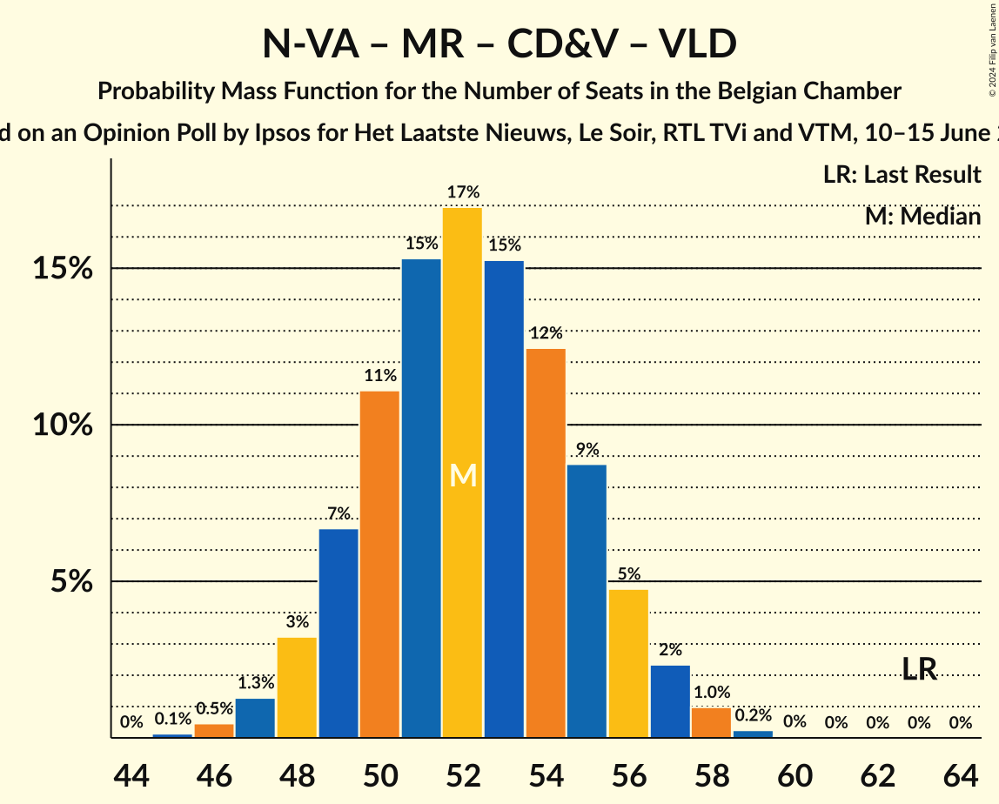

| Number of Seats | Probability | Accumulated | Special Marks |
|:---------------:|:-----------:|:-----------:|:-------------:|
| 45 | 0.1% | 100% |  |
| 46 | 0.5% | 99.8% |  |
| 47 | 1.3% | 99.4% |  |
| 48 | 3% | 98% |  |
| 49 | 7% | 95% |  |
| 50 | 11% | 88% |  |
| 51 | 15% | 77% |  |
| 52 | 17% | 62% |  |
| 53 | 15% | 45% | Median |
| 54 | 12% | 30% |  |
| 55 | 9% | 17% |  |
| 56 | 5% | 8% |  |
| 57 | 2% | 4% |  |
| 58 | 1.0% | 1.3% |  |
| 59 | 0.2% | 0.3% |  |
| 60 | 0% | 0.1% |  |
| 61 | 0% | 0% |  |
| 62 | 0% | 0% |  |
| 63 | 0% | 0% | Last Result |

### Mouvement Réformateur – Christen-Democratisch en Vlaams – Open Vlaamse Liberalen en Democraten – Centre démocrate humaniste

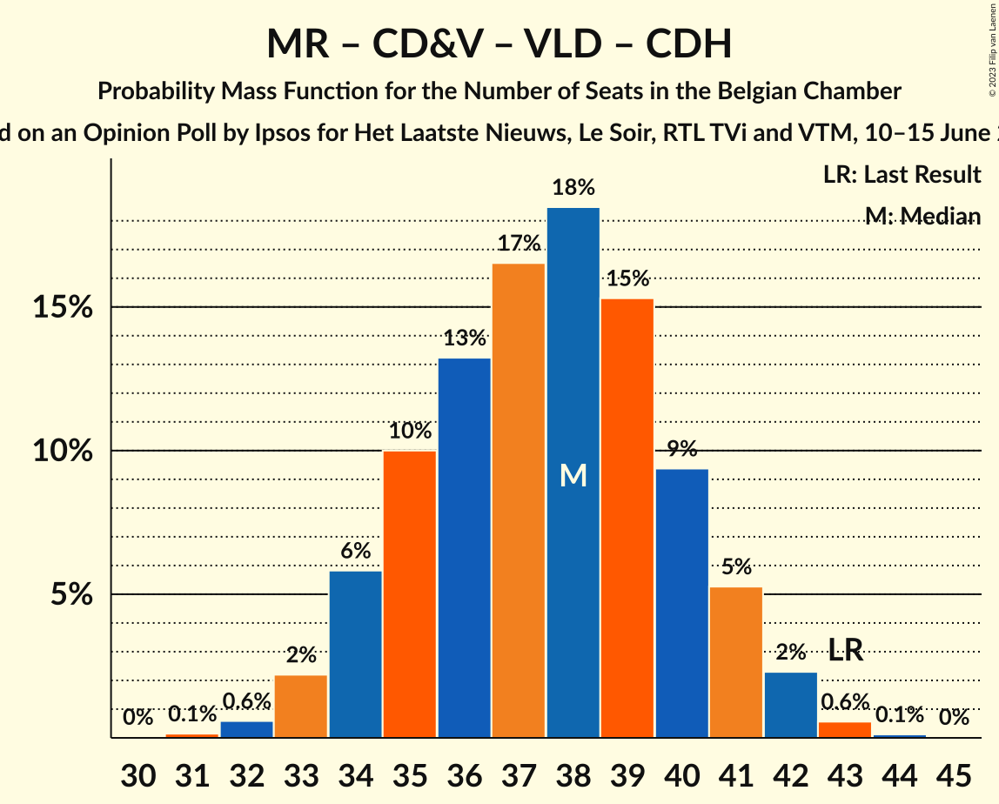

| Number of Seats | Probability | Accumulated | Special Marks |
|:---------------:|:-----------:|:-----------:|:-------------:|
| 31 | 0.1% | 100% |  |
| 32 | 0.6% | 99.8% |  |
| 33 | 2% | 99.2% |  |
| 34 | 6% | 97% |  |
| 35 | 10% | 91% |  |
| 36 | 13% | 81% |  |
| 37 | 17% | 68% |  |
| 38 | 18% | 51% | Median |
| 39 | 15% | 33% |  |
| 40 | 9% | 18% |  |
| 41 | 5% | 8% |  |
| 42 | 2% | 3% |  |
| 43 | 0.6% | 0.7% | Last Result |
| 44 | 0.1% | 0.2% |  |
| 45 | 0% | 0% |  |

### Nieuw-Vlaamse Alliantie – Parti Socialiste – Vooruit – Mouvement Réformateur – Open Vlaamse Liberalen en Democraten

| Number of Seats | Probability | Accumulated | Special Marks |
|:---------------:|:-----------:|:-----------:|:-------------:|
| 31 | 0.1% | 100% |  |
| 32 | 0.2% | 99.9% |  |
| 33 | 0.9% | 99.6% |  |
| 34 | 3% | 98.8% |  |
| 35 | 7% | 96% |  |
| 36 | 12% | 89% |  |
| 37 | 25% | 77% |  |
| 38 | 20% | 52% |  |
| 39 | 12% | 32% |  |
| 40 | 11% | 20% |  |
| 41 | 7% | 8% |  |
| 42 | 1.3% | 2% |  |
| 43 | 0.2% | 0.3% |  |
| 44 | 0.1% | 0.1% |  |
| 45 | 0% | 0% |  |
| 46 | 0% | 0% |  |
| 47 | 0% | 0% |  |
| 48 | 0% | 0% |  |
| 49 | 0% | 0% |  |
| 50 | 0% | 0% |  |
| 51 | 0% | 0% |  |
| 52 | 0% | 0% |  |
| 53 | 0% | 0% |  |
| 54 | 0% | 0% |  |
| 55 | 0% | 0% |  |
| 56 | 0% | 0% |  |
| 57 | 0% | 0% |  |
| 58 | 0% | 0% |  |
| 59 | 0% | 0% |  |
| 60 | 0% | 0% |  |
| 61 | 0% | 0% |  |
| 62 | 0% | 0% |  |
| 63 | 0% | 0% |  |
| 64 | 0% | 0% |  |
| 65 | 0% | 0% |  |
| 66 | 0% | 0% |  |
| 67 | 0% | 0% |  |
| 68 | 0% | 0% |  |
| 69 | 0% | 0% |  |
| 70 | 0% | 0% |  |
| 71 | 0% | 0% |  |
| 72 | 0% | 0% | Median |
| 73 | 0% | 0% |  |
| 74 | 0% | 0% |  |
| 75 | 0% | 0% |  |
| 76 | 0% | 0% | Majority |
| 77 | 0% | 0% |  |
| 78 | 0% | 0% |  |
| 79 | 0% | 0% |  |
| 80 | 0% | 0% | Last Result |

### Parti Socialiste – Vooruit – Mouvement Réformateur – Christen-Democratisch en Vlaams – Open Vlaamse Liberalen en Democraten – Ecolo – Groen – Centre démocrate humaniste

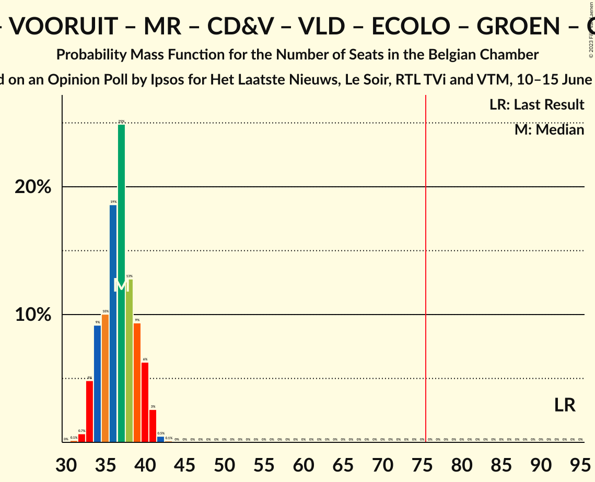

| Number of Seats | Probability | Accumulated | Special Marks |
|:---------------:|:-----------:|:-----------:|:-------------:|
| 31 | 0.1% | 100% |  |
| 32 | 0.7% | 99.8% |  |
| 33 | 5% | 99.1% |  |
| 34 | 9% | 94% |  |
| 35 | 10% | 85% |  |
| 36 | 19% | 75% |  |
| 37 | 25% | 56% |  |
| 38 | 13% | 32% |  |
| 39 | 9% | 19% |  |
| 40 | 6% | 9% |  |
| 41 | 3% | 3% |  |
| 42 | 0.5% | 0.6% |  |
| 43 | 0.1% | 0.1% |  |
| 44 | 0% | 0% |  |
| 45 | 0% | 0% |  |
| 46 | 0% | 0% |  |
| 47 | 0% | 0% |  |
| 48 | 0% | 0% |  |
| 49 | 0% | 0% |  |
| 50 | 0% | 0% |  |
| 51 | 0% | 0% |  |
| 52 | 0% | 0% |  |
| 53 | 0% | 0% |  |
| 54 | 0% | 0% |  |
| 55 | 0% | 0% |  |
| 56 | 0% | 0% |  |
| 57 | 0% | 0% |  |
| 58 | 0% | 0% |  |
| 59 | 0% | 0% |  |
| 60 | 0% | 0% |  |
| 61 | 0% | 0% |  |
| 62 | 0% | 0% |  |
| 63 | 0% | 0% |  |
| 64 | 0% | 0% |  |
| 65 | 0% | 0% |  |
| 66 | 0% | 0% |  |
| 67 | 0% | 0% |  |
| 68 | 0% | 0% |  |
| 69 | 0% | 0% |  |
| 70 | 0% | 0% |  |
| 71 | 0% | 0% |  |
| 72 | 0% | 0% |  |
| 73 | 0% | 0% |  |
| 74 | 0% | 0% |  |
| 75 | 0% | 0% |  |
| 76 | 0% | 0% | Majority |
| 77 | 0% | 0% |  |
| 78 | 0% | 0% |  |
| 79 | 0% | 0% |  |
| 80 | 0% | 0% |  |
| 81 | 0% | 0% |  |
| 82 | 0% | 0% |  |
| 83 | 0% | 0% |  |
| 84 | 0% | 0% |  |
| 85 | 0% | 0% |  |
| 86 | 0% | 0% | Median |
| 87 | 0% | 0% |  |
| 88 | 0% | 0% |  |
| 89 | 0% | 0% |  |
| 90 | 0% | 0% |  |
| 91 | 0% | 0% |  |
| 92 | 0% | 0% |  |
| 93 | 0% | 0% | Last Result |

### Parti Socialiste – Vooruit – Mouvement Réformateur – Christen-Democratisch en Vlaams – Open Vlaamse Liberalen en Democraten – Ecolo – Groen

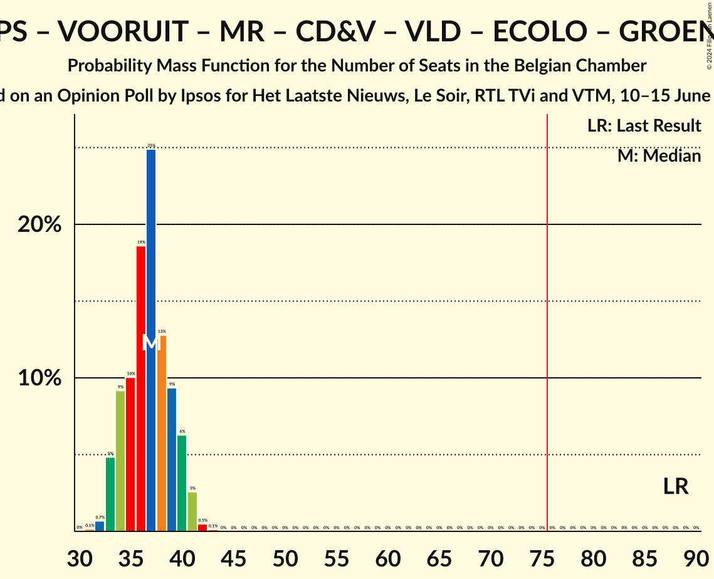

| Number of Seats | Probability | Accumulated | Special Marks |
|:---------------:|:-----------:|:-----------:|:-------------:|
| 31 | 0.1% | 100% |  |
| 32 | 0.7% | 99.8% |  |
| 33 | 5% | 99.1% |  |
| 34 | 9% | 94% |  |
| 35 | 10% | 85% |  |
| 36 | 19% | 75% |  |
| 37 | 25% | 56% |  |
| 38 | 13% | 32% |  |
| 39 | 9% | 19% |  |
| 40 | 6% | 9% |  |
| 41 | 3% | 3% |  |
| 42 | 0.5% | 0.6% |  |
| 43 | 0.1% | 0.1% |  |
| 44 | 0% | 0% |  |
| 45 | 0% | 0% |  |
| 46 | 0% | 0% |  |
| 47 | 0% | 0% |  |
| 48 | 0% | 0% |  |
| 49 | 0% | 0% |  |
| 50 | 0% | 0% |  |
| 51 | 0% | 0% |  |
| 52 | 0% | 0% |  |
| 53 | 0% | 0% |  |
| 54 | 0% | 0% |  |
| 55 | 0% | 0% |  |
| 56 | 0% | 0% |  |
| 57 | 0% | 0% |  |
| 58 | 0% | 0% |  |
| 59 | 0% | 0% |  |
| 60 | 0% | 0% |  |
| 61 | 0% | 0% |  |
| 62 | 0% | 0% |  |
| 63 | 0% | 0% |  |
| 64 | 0% | 0% |  |
| 65 | 0% | 0% |  |
| 66 | 0% | 0% |  |
| 67 | 0% | 0% |  |
| 68 | 0% | 0% |  |
| 69 | 0% | 0% |  |
| 70 | 0% | 0% |  |
| 71 | 0% | 0% |  |
| 72 | 0% | 0% |  |
| 73 | 0% | 0% |  |
| 74 | 0% | 0% |  |
| 75 | 0% | 0% |  |
| 76 | 0% | 0% | Majority |
| 77 | 0% | 0% |  |
| 78 | 0% | 0% |  |
| 79 | 0% | 0% |  |
| 80 | 0% | 0% |  |
| 81 | 0% | 0% |  |
| 82 | 0% | 0% | Median |
| 83 | 0% | 0% |  |
| 84 | 0% | 0% |  |
| 85 | 0% | 0% |  |
| 86 | 0% | 0% |  |
| 87 | 0% | 0% |  |
| 88 | 0% | 0% | Last Result |

### Parti Socialiste – Vooruit – Christen-Democratisch en Vlaams – Parti du Travail de Belgique – Ecolo – Groen – Partij van de Arbeid van België – Centre démocrate humaniste

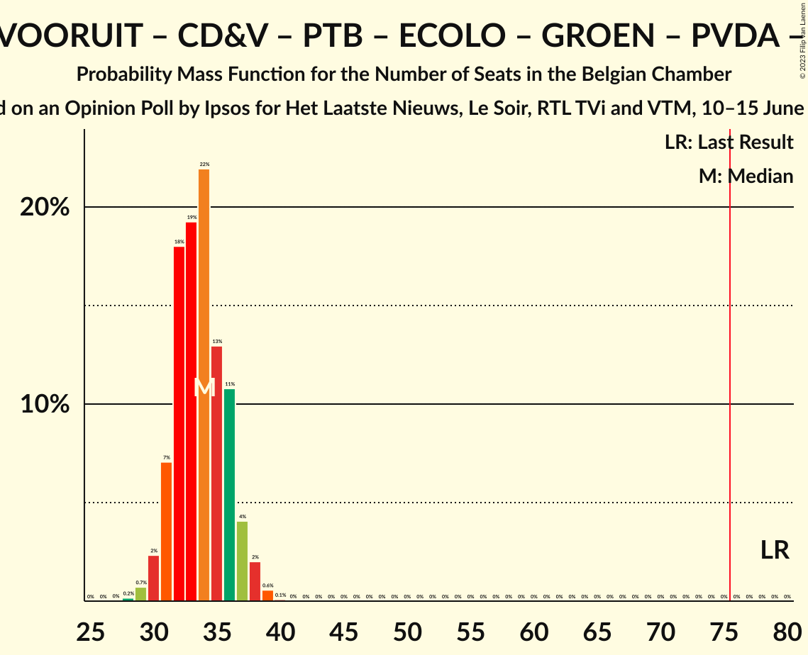

| Number of Seats | Probability | Accumulated | Special Marks |
|:---------------:|:-----------:|:-----------:|:-------------:|
| 28 | 0.2% | 100% |  |
| 29 | 0.7% | 99.8% |  |
| 30 | 2% | 99.1% |  |
| 31 | 7% | 97% |  |
| 32 | 18% | 90% |  |
| 33 | 19% | 72% |  |
| 34 | 22% | 52% |  |
| 35 | 13% | 30% |  |
| 36 | 11% | 18% |  |
| 37 | 4% | 7% |  |
| 38 | 2% | 3% |  |
| 39 | 0.6% | 0.7% |  |
| 40 | 0.1% | 0.1% |  |
| 41 | 0% | 0% |  |
| 42 | 0% | 0% |  |
| 43 | 0% | 0% |  |
| 44 | 0% | 0% |  |
| 45 | 0% | 0% |  |
| 46 | 0% | 0% |  |
| 47 | 0% | 0% |  |
| 48 | 0% | 0% |  |
| 49 | 0% | 0% |  |
| 50 | 0% | 0% |  |
| 51 | 0% | 0% |  |
| 52 | 0% | 0% |  |
| 53 | 0% | 0% |  |
| 54 | 0% | 0% |  |
| 55 | 0% | 0% |  |
| 56 | 0% | 0% |  |
| 57 | 0% | 0% |  |
| 58 | 0% | 0% |  |
| 59 | 0% | 0% |  |
| 60 | 0% | 0% |  |
| 61 | 0% | 0% |  |
| 62 | 0% | 0% |  |
| 63 | 0% | 0% |  |
| 64 | 0% | 0% |  |
| 65 | 0% | 0% |  |
| 66 | 0% | 0% |  |
| 67 | 0% | 0% |  |
| 68 | 0% | 0% |  |
| 69 | 0% | 0% |  |
| 70 | 0% | 0% |  |
| 71 | 0% | 0% |  |
| 72 | 0% | 0% |  |
| 73 | 0% | 0% |  |
| 74 | 0% | 0% |  |
| 75 | 0% | 0% |  |
| 76 | 0% | 0% | Majority |
| 77 | 0% | 0% |  |
| 78 | 0% | 0% |  |
| 79 | 0% | 0% | Last Result, Median |

### Parti Socialiste – Vooruit – Mouvement Réformateur – Christen-Democratisch en Vlaams – Open Vlaamse Liberalen en Democraten – Centre démocrate humaniste

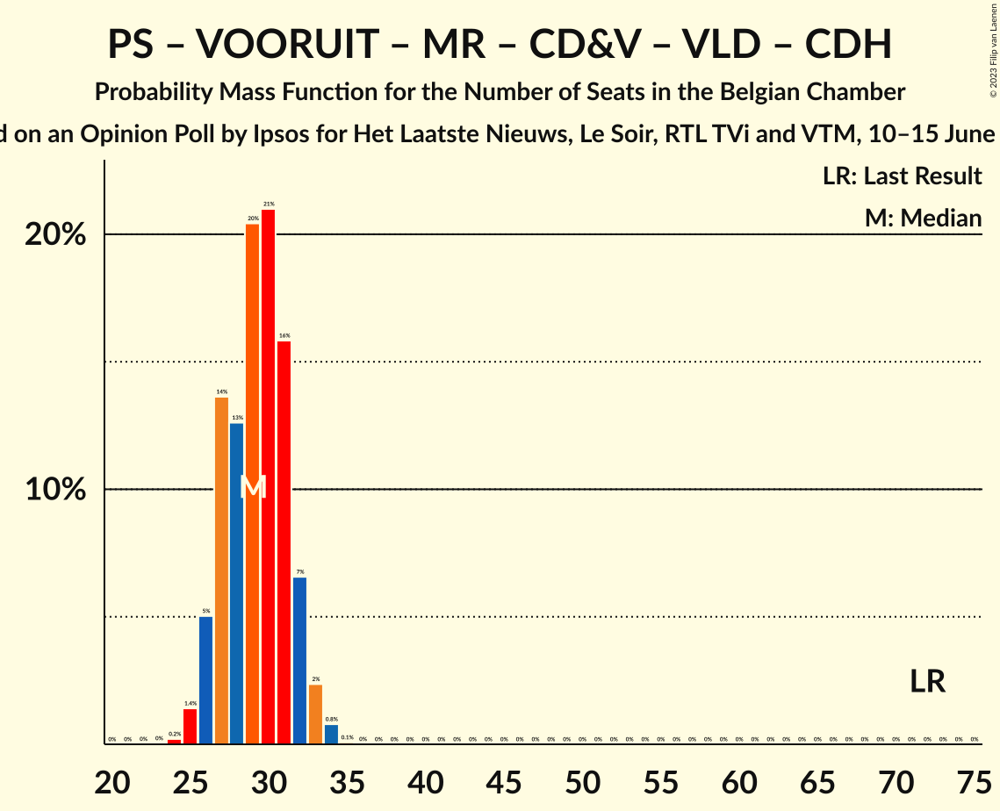

| Number of Seats | Probability | Accumulated | Special Marks |
|:---------------:|:-----------:|:-----------:|:-------------:|
| 23 | 0% | 100% |  |
| 24 | 0.2% | 99.9% |  |
| 25 | 1.4% | 99.7% |  |
| 26 | 5% | 98% |  |
| 27 | 14% | 93% |  |
| 28 | 13% | 80% |  |
| 29 | 20% | 67% |  |
| 30 | 21% | 47% |  |
| 31 | 16% | 26% |  |
| 32 | 7% | 10% |  |
| 33 | 2% | 3% |  |
| 34 | 0.8% | 0.9% |  |
| 35 | 0.1% | 0.1% |  |
| 36 | 0% | 0% |  |
| 37 | 0% | 0% |  |
| 38 | 0% | 0% |  |
| 39 | 0% | 0% |  |
| 40 | 0% | 0% |  |
| 41 | 0% | 0% |  |
| 42 | 0% | 0% |  |
| 43 | 0% | 0% |  |
| 44 | 0% | 0% |  |
| 45 | 0% | 0% |  |
| 46 | 0% | 0% |  |
| 47 | 0% | 0% |  |
| 48 | 0% | 0% |  |
| 49 | 0% | 0% |  |
| 50 | 0% | 0% |  |
| 51 | 0% | 0% |  |
| 52 | 0% | 0% |  |
| 53 | 0% | 0% |  |
| 54 | 0% | 0% |  |
| 55 | 0% | 0% |  |
| 56 | 0% | 0% |  |
| 57 | 0% | 0% |  |
| 58 | 0% | 0% |  |
| 59 | 0% | 0% |  |
| 60 | 0% | 0% |  |
| 61 | 0% | 0% |  |
| 62 | 0% | 0% |  |
| 63 | 0% | 0% |  |
| 64 | 0% | 0% |  |
| 65 | 0% | 0% |  |
| 66 | 0% | 0% |  |
| 67 | 0% | 0% | Median |
| 68 | 0% | 0% |  |
| 69 | 0% | 0% |  |
| 70 | 0% | 0% |  |
| 71 | 0% | 0% |  |
| 72 | 0% | 0% | Last Result |

### Parti Socialiste – Vooruit – Christen-Democratisch en Vlaams – Ecolo – Groen – Centre démocrate humaniste

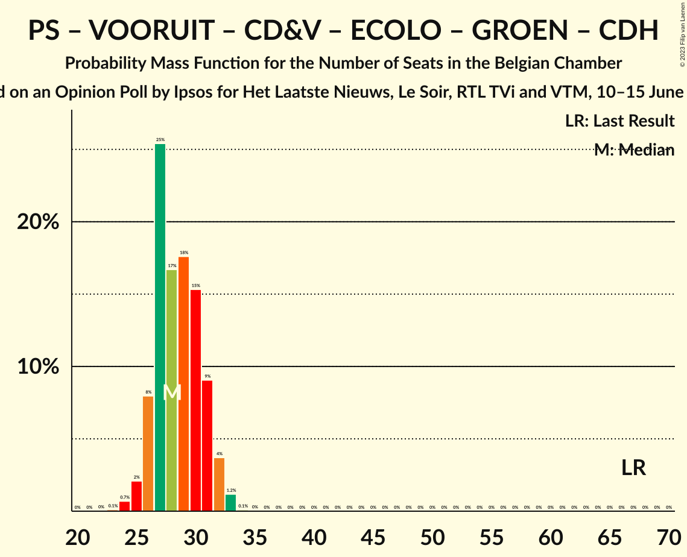

| Number of Seats | Probability | Accumulated | Special Marks |
|:---------------:|:-----------:|:-----------:|:-------------:|
| 23 | 0.1% | 100% |  |
| 24 | 0.7% | 99.9% |  |
| 25 | 2% | 99.2% |  |
| 26 | 8% | 97% |  |
| 27 | 25% | 89% |  |
| 28 | 17% | 64% |  |
| 29 | 18% | 47% |  |
| 30 | 15% | 29% |  |
| 31 | 9% | 14% |  |
| 32 | 4% | 5% |  |
| 33 | 1.2% | 1.3% |  |
| 34 | 0.1% | 0.1% |  |
| 35 | 0% | 0% |  |
| 36 | 0% | 0% |  |
| 37 | 0% | 0% |  |
| 38 | 0% | 0% |  |
| 39 | 0% | 0% |  |
| 40 | 0% | 0% |  |
| 41 | 0% | 0% |  |
| 42 | 0% | 0% |  |
| 43 | 0% | 0% |  |
| 44 | 0% | 0% |  |
| 45 | 0% | 0% |  |
| 46 | 0% | 0% |  |
| 47 | 0% | 0% |  |
| 48 | 0% | 0% |  |
| 49 | 0% | 0% |  |
| 50 | 0% | 0% |  |
| 51 | 0% | 0% |  |
| 52 | 0% | 0% |  |
| 53 | 0% | 0% |  |
| 54 | 0% | 0% |  |
| 55 | 0% | 0% |  |
| 56 | 0% | 0% |  |
| 57 | 0% | 0% |  |
| 58 | 0% | 0% |  |
| 59 | 0% | 0% |  |
| 60 | 0% | 0% |  |
| 61 | 0% | 0% |  |
| 62 | 0% | 0% | Median |
| 63 | 0% | 0% |  |
| 64 | 0% | 0% |  |
| 65 | 0% | 0% |  |
| 66 | 0% | 0% |  |
| 67 | 0% | 0% | Last Result |

### Parti Socialiste – Vooruit – Mouvement Réformateur – Open Vlaamse Liberalen en Democraten – Ecolo – Groen

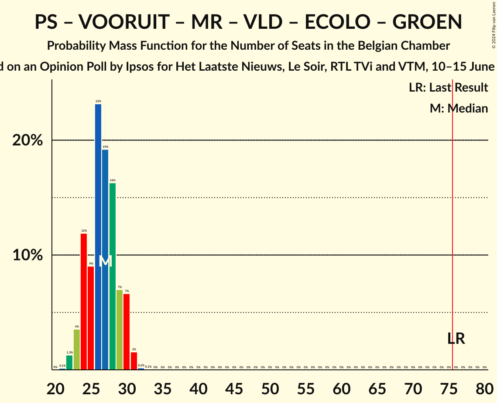

| Number of Seats | Probability | Accumulated | Special Marks |
|:---------------:|:-----------:|:-----------:|:-------------:|
| 21 | 0.1% | 100% |  |
| 22 | 1.3% | 99.8% |  |
| 23 | 4% | 98.5% |  |
| 24 | 12% | 95% |  |
| 25 | 9% | 83% |  |
| 26 | 23% | 74% |  |
| 27 | 19% | 51% |  |
| 28 | 16% | 32% |  |
| 29 | 7% | 15% |  |
| 30 | 7% | 8% |  |
| 31 | 2% | 2% |  |
| 32 | 0.2% | 0.2% |  |
| 33 | 0.1% | 0.1% |  |
| 34 | 0% | 0% |  |
| 35 | 0% | 0% |  |
| 36 | 0% | 0% |  |
| 37 | 0% | 0% |  |
| 38 | 0% | 0% |  |
| 39 | 0% | 0% |  |
| 40 | 0% | 0% |  |
| 41 | 0% | 0% |  |
| 42 | 0% | 0% |  |
| 43 | 0% | 0% |  |
| 44 | 0% | 0% |  |
| 45 | 0% | 0% |  |
| 46 | 0% | 0% |  |
| 47 | 0% | 0% |  |
| 48 | 0% | 0% |  |
| 49 | 0% | 0% |  |
| 50 | 0% | 0% |  |
| 51 | 0% | 0% |  |
| 52 | 0% | 0% |  |
| 53 | 0% | 0% |  |
| 54 | 0% | 0% |  |
| 55 | 0% | 0% |  |
| 56 | 0% | 0% |  |
| 57 | 0% | 0% |  |
| 58 | 0% | 0% |  |
| 59 | 0% | 0% |  |
| 60 | 0% | 0% |  |
| 61 | 0% | 0% |  |
| 62 | 0% | 0% |  |
| 63 | 0% | 0% |  |
| 64 | 0% | 0% |  |
| 65 | 0% | 0% |  |
| 66 | 0% | 0% |  |
| 67 | 0% | 0% |  |
| 68 | 0% | 0% |  |
| 69 | 0% | 0% |  |
| 70 | 0% | 0% |  |
| 71 | 0% | 0% |  |
| 72 | 0% | 0% | Median |
| 73 | 0% | 0% |  |
| 74 | 0% | 0% |  |
| 75 | 0% | 0% |  |
| 76 | 0% | 0% | Last Result, Majority |

### Parti Socialiste – Vooruit – Parti du Travail de Belgique – Ecolo – Groen – Partij van de Arbeid van België – Centre démocrate humaniste

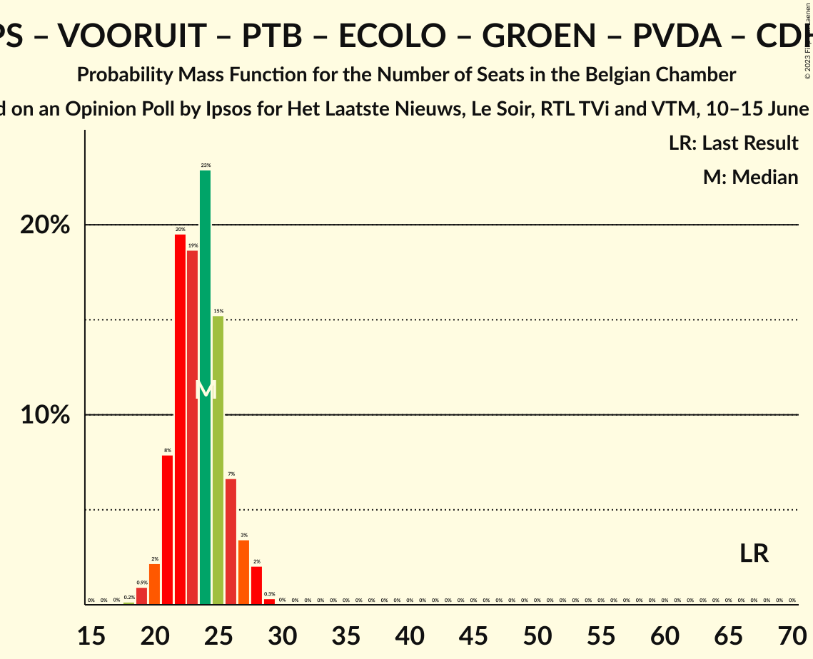

| Number of Seats | Probability | Accumulated | Special Marks |
|:---------------:|:-----------:|:-----------:|:-------------:|
| 18 | 0.2% | 100% |  |
| 19 | 0.9% | 99.8% |  |
| 20 | 2% | 98.9% |  |
| 21 | 8% | 97% |  |
| 22 | 20% | 89% |  |
| 23 | 19% | 69% |  |
| 24 | 23% | 51% |  |
| 25 | 15% | 28% |  |
| 26 | 7% | 12% |  |
| 27 | 3% | 6% |  |
| 28 | 2% | 2% |  |
| 29 | 0.3% | 0.4% |  |
| 30 | 0% | 0% |  |
| 31 | 0% | 0% |  |
| 32 | 0% | 0% |  |
| 33 | 0% | 0% |  |
| 34 | 0% | 0% |  |
| 35 | 0% | 0% |  |
| 36 | 0% | 0% |  |
| 37 | 0% | 0% |  |
| 38 | 0% | 0% |  |
| 39 | 0% | 0% |  |
| 40 | 0% | 0% |  |
| 41 | 0% | 0% |  |
| 42 | 0% | 0% |  |
| 43 | 0% | 0% |  |
| 44 | 0% | 0% |  |
| 45 | 0% | 0% |  |
| 46 | 0% | 0% |  |
| 47 | 0% | 0% |  |
| 48 | 0% | 0% |  |
| 49 | 0% | 0% |  |
| 50 | 0% | 0% |  |
| 51 | 0% | 0% |  |
| 52 | 0% | 0% |  |
| 53 | 0% | 0% |  |
| 54 | 0% | 0% |  |
| 55 | 0% | 0% |  |
| 56 | 0% | 0% |  |
| 57 | 0% | 0% |  |
| 58 | 0% | 0% |  |
| 59 | 0% | 0% |  |
| 60 | 0% | 0% |  |
| 61 | 0% | 0% |  |
| 62 | 0% | 0% |  |
| 63 | 0% | 0% |  |
| 64 | 0% | 0% |  |
| 65 | 0% | 0% |  |
| 66 | 0% | 0% |  |
| 67 | 0% | 0% | Last Result |

### Parti Socialiste – Vooruit – Parti du Travail de Belgique – Ecolo – Groen – Partij van de Arbeid van België

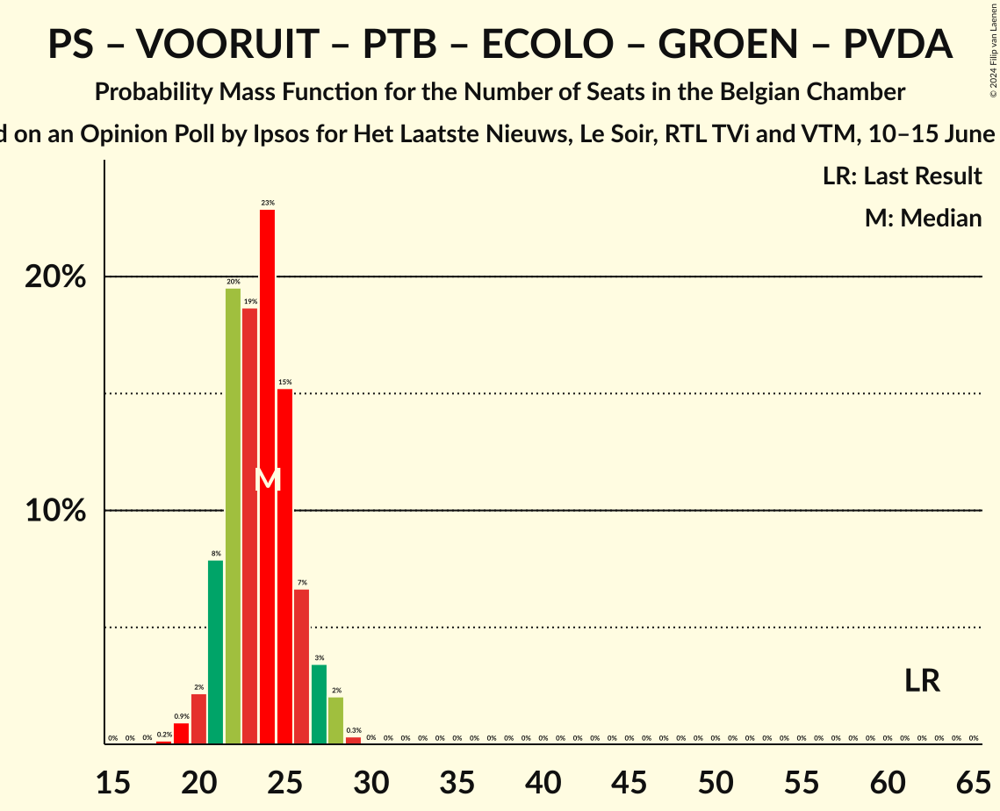

| Number of Seats | Probability | Accumulated | Special Marks |
|:---------------:|:-----------:|:-----------:|:-------------:|
| 18 | 0.2% | 100% |  |
| 19 | 0.9% | 99.8% |  |
| 20 | 2% | 98.9% |  |
| 21 | 8% | 97% |  |
| 22 | 20% | 89% |  |
| 23 | 19% | 69% |  |
| 24 | 23% | 51% |  |
| 25 | 15% | 28% |  |
| 26 | 7% | 12% |  |
| 27 | 3% | 6% |  |
| 28 | 2% | 2% |  |
| 29 | 0.3% | 0.4% |  |
| 30 | 0% | 0% |  |
| 31 | 0% | 0% |  |
| 32 | 0% | 0% |  |
| 33 | 0% | 0% |  |
| 34 | 0% | 0% |  |
| 35 | 0% | 0% |  |
| 36 | 0% | 0% |  |
| 37 | 0% | 0% |  |
| 38 | 0% | 0% |  |
| 39 | 0% | 0% |  |
| 40 | 0% | 0% |  |
| 41 | 0% | 0% |  |
| 42 | 0% | 0% |  |
| 43 | 0% | 0% |  |
| 44 | 0% | 0% |  |
| 45 | 0% | 0% |  |
| 46 | 0% | 0% |  |
| 47 | 0% | 0% |  |
| 48 | 0% | 0% |  |
| 49 | 0% | 0% |  |
| 50 | 0% | 0% |  |
| 51 | 0% | 0% |  |
| 52 | 0% | 0% |  |
| 53 | 0% | 0% |  |
| 54 | 0% | 0% |  |
| 55 | 0% | 0% |  |
| 56 | 0% | 0% |  |
| 57 | 0% | 0% |  |
| 58 | 0% | 0% |  |
| 59 | 0% | 0% |  |
| 60 | 0% | 0% |  |
| 61 | 0% | 0% |  |
| 62 | 0% | 0% | Last Result |

### Parti Socialiste – Vooruit – Christen-Democratisch en Vlaams – Centre démocrate humaniste

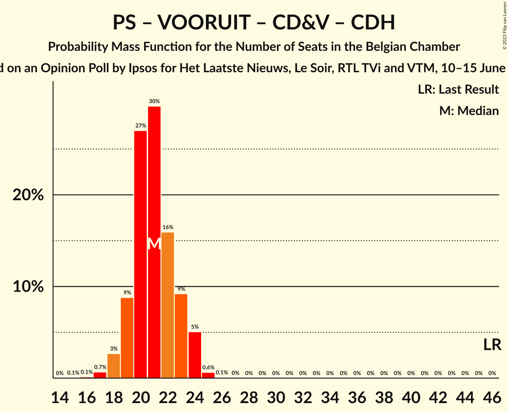

| Number of Seats | Probability | Accumulated | Special Marks |
|:---------------:|:-----------:|:-----------:|:-------------:|
| 15 | 0.1% | 100% |  |
| 16 | 0.1% | 99.9% |  |
| 17 | 0.7% | 99.8% |  |
| 18 | 3% | 99.1% |  |
| 19 | 9% | 96% |  |
| 20 | 27% | 88% |  |
| 21 | 30% | 61% |  |
| 22 | 16% | 31% |  |
| 23 | 9% | 15% |  |
| 24 | 5% | 6% |  |
| 25 | 0.6% | 0.7% |  |
| 26 | 0.1% | 0.1% |  |
| 27 | 0% | 0% |  |
| 28 | 0% | 0% |  |
| 29 | 0% | 0% |  |
| 30 | 0% | 0% |  |
| 31 | 0% | 0% |  |
| 32 | 0% | 0% |  |
| 33 | 0% | 0% |  |
| 34 | 0% | 0% |  |
| 35 | 0% | 0% |  |
| 36 | 0% | 0% |  |
| 37 | 0% | 0% |  |
| 38 | 0% | 0% |  |
| 39 | 0% | 0% |  |
| 40 | 0% | 0% |  |
| 41 | 0% | 0% |  |
| 42 | 0% | 0% |  |
| 43 | 0% | 0% | Median |
| 44 | 0% | 0% |  |
| 45 | 0% | 0% |  |
| 46 | 0% | 0% | Last Result |

### Parti Socialiste – Vooruit – Mouvement Réformateur – Open Vlaamse Liberalen en Democraten

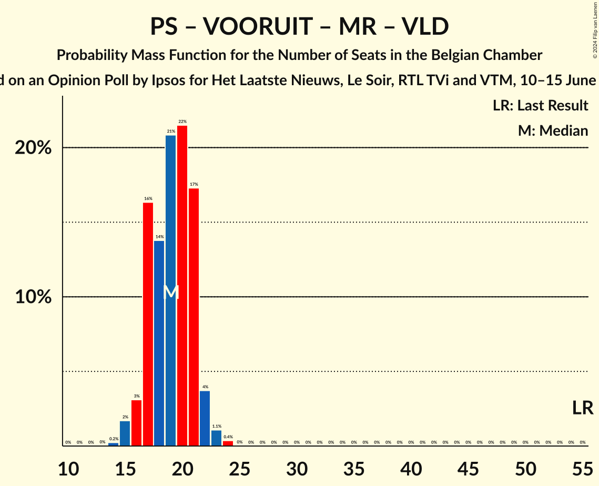

| Number of Seats | Probability | Accumulated | Special Marks |
|:---------------:|:-----------:|:-----------:|:-------------:|
| 14 | 0.2% | 100% |  |
| 15 | 2% | 99.7% |  |
| 16 | 3% | 98% |  |
| 17 | 16% | 95% |  |
| 18 | 14% | 79% |  |
| 19 | 21% | 65% |  |
| 20 | 22% | 44% |  |
| 21 | 17% | 22% |  |
| 22 | 4% | 5% |  |
| 23 | 1.1% | 1.5% |  |
| 24 | 0.4% | 0.4% |  |
| 25 | 0% | 0% |  |
| 26 | 0% | 0% |  |
| 27 | 0% | 0% |  |
| 28 | 0% | 0% |  |
| 29 | 0% | 0% |  |
| 30 | 0% | 0% |  |
| 31 | 0% | 0% |  |
| 32 | 0% | 0% |  |
| 33 | 0% | 0% |  |
| 34 | 0% | 0% |  |
| 35 | 0% | 0% |  |
| 36 | 0% | 0% |  |
| 37 | 0% | 0% |  |
| 38 | 0% | 0% |  |
| 39 | 0% | 0% |  |
| 40 | 0% | 0% |  |
| 41 | 0% | 0% |  |
| 42 | 0% | 0% |  |
| 43 | 0% | 0% |  |
| 44 | 0% | 0% |  |
| 45 | 0% | 0% |  |
| 46 | 0% | 0% |  |
| 47 | 0% | 0% |  |
| 48 | 0% | 0% |  |
| 49 | 0% | 0% |  |
| 50 | 0% | 0% |  |
| 51 | 0% | 0% |  |
| 52 | 0% | 0% |  |
| 53 | 0% | 0% | Median |
| 54 | 0% | 0% |  |
| 55 | 0% | 0% | Last Result |

## Technical Information

### Opinion Poll

+ **Polling firm:** Ipsos
+ **Commissioner(s):** Het Laatste Nieuws, Le Soir, RTL TVi and VTM
+ **Fieldwork period:** 10–15 June 2020

### Calculations

+ **Sample size:** 1538
+ **Simulations done:** 1,048,576
+ **Error estimate:** 1.40%

