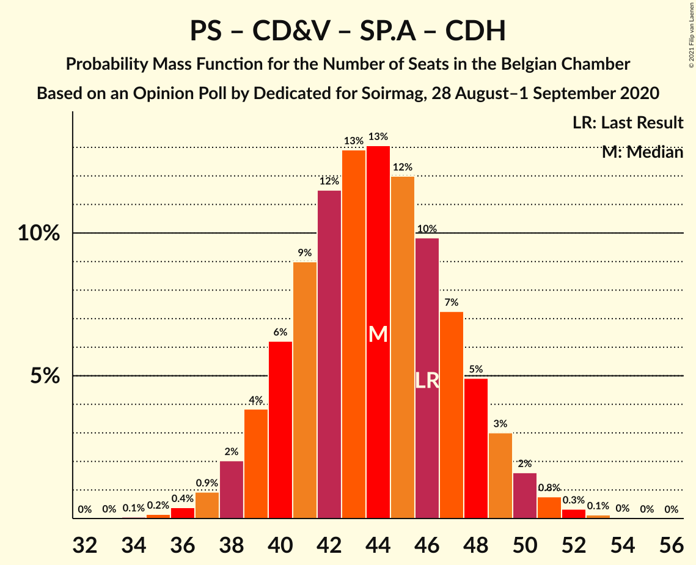

# Opinion Poll by Dedicated for Soirmag, 28 August–1 September 2020

Areas included: Brussels, Flanders, Wallonia

<a href="#voting-intentions">Voting Intentions</a> | <a href="#seats">Seats</a> | <a href="#coalitions">Coalitions</a> | <a href="#technical-information">Technical Information</a>

## Voting Intentions

### Confidence Intervals

| Party | Last Result | Poll Result | 80% Confidence Interval | 90% Confidence Interval | 95% Confidence Interval | 99% Confidence Interval |
|:-----:|:-----------:|:-----------:|:-----------------------:|:-----------------------:|:-----------------------:|:-----------------------:|
| Vlaams Belang | 12.0% | 17.0% | 14.6–15.8% |14.4–15.8% |14.1–15.8% |13.6–15.8% |
| Nieuw-Vlaamse Alliantie | 16.0% | 14.9% | 12.6–13.7% |12.4–13.7% |12.2–13.7% |11.7–13.7% |
| Parti Socialiste | 9.5% | 9.4% | 7.6–8.3% |7.4–8.4% |7.3–8.4% |6.9–8.4% |
| Open Vlaamse Liberalen en Democraten | 8.5% | 8.9% | 7.1–7.9% |6.9–8.0% |6.7–8.0% |6.4–8.0% |
| Mouvement Réformateur | 7.6% | 8.6% | 6.8–7.4% |6.6–7.5% |6.4–7.5% |6.1–7.5% |
| Christen-Democratisch en Vlaams | 8.9% | 8.3% | 6.6–7.4% |6.4–7.5% |6.3–7.5% |5.9–7.5% |
| Socialistische Partij Anders | 6.7% | 8.0% | 7.0–8.9% |6.8–9.0% |6.5–9.1% |6.1–9.2% |
| Ecolo | 6.1% | 6.3% | 4.9–5.4% |4.7–5.4% |4.6–5.4% |4.4–5.4% |
| Parti du Travail de Belgique | 4.8% | 5.9% | 4.5–5.0% |4.3–5.0% |4.2–5.0% |4.0–5.0% |
| Groen | 6.1% | 4.5% | 3.7–5.1% |3.5–5.2% |3.3–5.3% |3.0–5.4% |
| Centre démocrate humaniste | 3.7% | 2.2% | 1.4–1.7% |1.3–1.7% |1.3–1.7% |1.1–1.7% |
| DéFI | 2.2% | 1.8% | 1.0–1.3% |1.0–1.3% |0.9–1.3% |0.8–1.3% |
| Partij van de Arbeid van België | 3.3% | 1.1% | 0.8–1.5% |0.7–1.6% |0.6–1.7% |0.5–1.7% |
| Parti Populaire | 1.1% | 1.1% | 0.7–1.2% |0.6–1.2% |0.6–1.2% |0.4–1.2% |

*Note:* The poll result column reflects the actual value used in the calculations. Published results may vary slightly, and in addition be rounded to fewer digits.

## Seats

### Confidence Intervals

| Party | Last Result | Median | 80% Confidence Interval | 90% Confidence Interval | 95% Confidence Interval | 99% Confidence Interval |
|:-----:|:-----------:|:------:|:-----------------------:|:-----------------------:|:-----------------------:|:-----------------------:|
| <a href="#vlaams-belang">Vlaams Belang</a> | 18 | 26 | 24–29 |23–29 |22–30 |21–32 |
| <a href="#nieuw-vlaamse-alliantie">Nieuw-Vlaamse Alliantie</a> | 25 | 23 | 21–26 |20–27 |20–27 |18–27 |
| <a href="#parti-socialiste">Parti Socialiste</a> | 20 | 19 | 17–21 |16–21 |15–22 |14–23 |
| <a href="#open-vlaamse-liberalen-en-democraten">Open Vlaamse Liberalen en Democraten</a> | 12 | 12 | 10–15 |10–15 |10–16 |9–17 |
| <a href="#mouvement-réformateur">Mouvement Réformateur</a> | 14 | 17 | 14–19 |14–20 |13–20 |12–21 |
| <a href="#christen-democratisch-en-vlaams">Christen-Democratisch en Vlaams</a> | 12 | 11 | 10–13 |10–14 |9–14 |8–15 |
| <a href="#socialistische-partij-anders">Socialistische Partij Anders</a> | 9 | 11 | 9–13 |9–13 |9–14 |8–15 |
| <a href="#ecolo">Ecolo</a> | 13 | 12 | 10–13 |10–14 |9–15 |8–17 |
| <a href="#parti-du-travail-de-belgique">Parti du Travail de Belgique</a> | 9 | 10 | 9–12 |8–12 |7–13 |6–15 |
| <a href="#groen">Groen</a> | 8 | 5 | 3–7 |3–7 |3–8 |2–9 |
| <a href="#centre-démocrate-humaniste">Centre démocrate humaniste</a> | 5 | 1 | 0–5 |0–5 |0–5 |0–5 |
| <a href="#défi">DéFI</a> | 2 | 1 | 0–2 |0–3 |0–3 |0–3 |
| <a href="#partij-van-de-arbeid-van-belgië">Partij van de Arbeid van België</a> | 3 | 0 | 0 |0 |0 |0–1 |
| <a href="#parti-populaire">Parti Populaire</a> | 0 | 0 | 0–2 |0–2 |0–2 |0–2 |

### Vlaams Belang

*For a full overview of the results for this party, see the [Vlaams Belang](party-vlaamsbelang.html) page.*

| Number of Seats | Probability | Accumulated | Special Marks |
|:---------------:|:-----------:|:-----------:|:-------------:|
| 18 | 0% | 100% | Last Result |
| 19 | 0% | 100% |  |
| 20 | 0.2% | 100% |  |
| 21 | 2% | 99.7% |  |
| 22 | 3% | 98% |  |
| 23 | 4% | 95% |  |
| 24 | 9% | 91% |  |
| 25 | 24% | 83% |  |
| 26 | 26% | 58% | Median |
| 27 | 12% | 33% |  |
| 28 | 10% | 21% |  |
| 29 | 7% | 11% |  |
| 30 | 2% | 4% |  |
| 31 | 0.6% | 1.2% |  |
| 32 | 0.4% | 0.6% |  |
| 33 | 0.1% | 0.1% |  |
| 34 | 0% | 0% |  |

### Nieuw-Vlaamse Alliantie

*For a full overview of the results for this party, see the [Nieuw-Vlaamse Alliantie](party-nieuw-vlaamsealliantie.html) page.*

| Number of Seats | Probability | Accumulated | Special Marks |
|:---------------:|:-----------:|:-----------:|:-------------:|
| 17 | 0.4% | 100% |  |
| 18 | 0.7% | 99.6% |  |
| 19 | 1.2% | 98.9% |  |
| 20 | 3% | 98% |  |
| 21 | 21% | 95% |  |
| 22 | 14% | 74% |  |
| 23 | 25% | 60% | Median |
| 24 | 17% | 35% |  |
| 25 | 6% | 17% | Last Result |
| 26 | 4% | 11% |  |
| 27 | 6% | 6% |  |
| 28 | 0.3% | 0.4% |  |
| 29 | 0.1% | 0.1% |  |
| 30 | 0% | 0% |  |

### Parti Socialiste

*For a full overview of the results for this party, see the [Parti Socialiste](party-partisocialiste.html) page.*

| Number of Seats | Probability | Accumulated | Special Marks |
|:---------------:|:-----------:|:-----------:|:-------------:|
| 12 | 0.1% | 100% |  |
| 13 | 0.3% | 99.9% |  |
| 14 | 0.9% | 99.6% |  |
| 15 | 2% | 98.7% |  |
| 16 | 5% | 97% |  |
| 17 | 14% | 92% |  |
| 18 | 23% | 78% |  |
| 19 | 14% | 55% | Median |
| 20 | 28% | 41% | Last Result |
| 21 | 10% | 13% |  |
| 22 | 3% | 4% |  |
| 23 | 0.6% | 0.9% |  |
| 24 | 0.2% | 0.2% |  |
| 25 | 0% | 0.1% |  |
| 26 | 0% | 0% |  |

### Open Vlaamse Liberalen en Democraten

*For a full overview of the results for this party, see the [Open Vlaamse Liberalen en Democraten](party-openvlaamseliberalenendemocraten.html) page.*

| Number of Seats | Probability | Accumulated | Special Marks |
|:---------------:|:-----------:|:-----------:|:-------------:|
| 9 | 1.3% | 100% |  |
| 10 | 15% | 98.7% |  |
| 11 | 19% | 84% |  |
| 12 | 21% | 65% | Last Result, Median |
| 13 | 12% | 45% |  |
| 14 | 21% | 32% |  |
| 15 | 7% | 11% |  |
| 16 | 4% | 5% |  |
| 17 | 0.4% | 0.5% |  |
| 18 | 0.1% | 0.1% |  |
| 19 | 0% | 0% |  |

### Mouvement Réformateur

*For a full overview of the results for this party, see the [Mouvement Réformateur](party-mouvementréformateur.html) page.*

| Number of Seats | Probability | Accumulated | Special Marks |
|:---------------:|:-----------:|:-----------:|:-------------:|
| 11 | 0.1% | 100% |  |
| 12 | 0.8% | 99.9% |  |
| 13 | 4% | 99.1% |  |
| 14 | 8% | 95% | Last Result |
| 15 | 12% | 88% |  |
| 16 | 12% | 76% |  |
| 17 | 23% | 64% | Median |
| 18 | 27% | 41% |  |
| 19 | 8% | 14% |  |
| 20 | 5% | 6% |  |
| 21 | 0.7% | 1.1% |  |
| 22 | 0.2% | 0.3% |  |
| 23 | 0.1% | 0.1% |  |
| 24 | 0% | 0% |  |

### Christen-Democratisch en Vlaams

*For a full overview of the results for this party, see the [Christen-Democratisch en Vlaams](party-christen-democratischenvlaams.html) page.*

| Number of Seats | Probability | Accumulated | Special Marks |
|:---------------:|:-----------:|:-----------:|:-------------:|
| 6 | 0% | 100% |  |
| 7 | 0.2% | 99.9% |  |
| 8 | 0.7% | 99.7% |  |
| 9 | 4% | 99.0% |  |
| 10 | 38% | 95% |  |
| 11 | 17% | 58% | Median |
| 12 | 18% | 40% | Last Result |
| 13 | 14% | 22% |  |
| 14 | 6% | 8% |  |
| 15 | 2% | 2% |  |
| 16 | 0.3% | 0.4% |  |
| 17 | 0.1% | 0.1% |  |
| 18 | 0% | 0% |  |

### Socialistische Partij Anders

*For a full overview of the results for this party, see the [Socialistische Partij Anders](party-socialistischepartijanders.html) page.*

| Number of Seats | Probability | Accumulated | Special Marks |
|:---------------:|:-----------:|:-----------:|:-------------:|
| 6 | 0.1% | 100% |  |
| 7 | 0.2% | 99.9% |  |
| 8 | 2% | 99.7% |  |
| 9 | 13% | 98% | Last Result |
| 10 | 12% | 85% |  |
| 11 | 41% | 73% | Median |
| 12 | 10% | 32% |  |
| 13 | 17% | 22% |  |
| 14 | 3% | 5% |  |
| 15 | 1.3% | 1.4% |  |
| 16 | 0.1% | 0.2% |  |
| 17 | 0% | 0% |  |

### Ecolo

*For a full overview of the results for this party, see the [Ecolo](party-ecolo.html) page.*

| Number of Seats | Probability | Accumulated | Special Marks |
|:---------------:|:-----------:|:-----------:|:-------------:|
| 7 | 0.1% | 100% |  |
| 8 | 0.3% | 99.8% |  |
| 9 | 2% | 99.5% |  |
| 10 | 12% | 97% |  |
| 11 | 26% | 85% |  |
| 12 | 22% | 59% | Median |
| 13 | 28% | 37% | Last Result |
| 14 | 6% | 10% |  |
| 15 | 2% | 4% |  |
| 16 | 1.0% | 2% |  |
| 17 | 0.9% | 1.0% |  |
| 18 | 0.1% | 0.1% |  |
| 19 | 0% | 0% |  |

### Parti du Travail de Belgique

*For a full overview of the results for this party, see the [Parti du Travail de Belgique](party-partidutravaildebelgique.html) page.*

| Number of Seats | Probability | Accumulated | Special Marks |
|:---------------:|:-----------:|:-----------:|:-------------:|
| 6 | 0.6% | 100% |  |
| 7 | 2% | 99.4% |  |
| 8 | 4% | 97% |  |
| 9 | 18% | 93% | Last Result |
| 10 | 36% | 76% | Median |
| 11 | 24% | 39% |  |
| 12 | 10% | 15% |  |
| 13 | 3% | 5% |  |
| 14 | 0.9% | 1.4% |  |
| 15 | 0.4% | 0.6% |  |
| 16 | 0.1% | 0.2% |  |
| 17 | 0.1% | 0.1% |  |
| 18 | 0% | 0% |  |

### Groen

*For a full overview of the results for this party, see the [Groen](party-groen.html) page.*

| Number of Seats | Probability | Accumulated | Special Marks |
|:---------------:|:-----------:|:-----------:|:-------------:|
| 0 | 0.1% | 100% |  |
| 1 | 0.1% | 99.9% |  |
| 2 | 0.5% | 99.9% |  |
| 3 | 15% | 99.4% |  |
| 4 | 19% | 84% |  |
| 5 | 45% | 65% | Median |
| 6 | 10% | 20% |  |
| 7 | 6% | 10% |  |
| 8 | 2% | 4% | Last Result |
| 9 | 2% | 2% |  |
| 10 | 0% | 0% |  |

### Centre démocrate humaniste

*For a full overview of the results for this party, see the [Centre démocrate humaniste](party-centredémocratehumaniste.html) page.*

| Number of Seats | Probability | Accumulated | Special Marks |
|:---------------:|:-----------:|:-----------:|:-------------:|
| 0 | 20% | 100% |  |
| 1 | 31% | 80% | Median |
| 2 | 7% | 49% |  |
| 3 | 3% | 41% |  |
| 4 | 18% | 39% |  |
| 5 | 21% | 21% | Last Result |
| 6 | 0.1% | 0.1% |  |
| 7 | 0% | 0% |  |

### DéFI

*For a full overview of the results for this party, see the [DéFI](party-défi.html) page.*

| Number of Seats | Probability | Accumulated | Special Marks |
|:---------------:|:-----------:|:-----------:|:-------------:|
| 0 | 37% | 100% |  |
| 1 | 47% | 63% | Median |
| 2 | 9% | 16% | Last Result |
| 3 | 7% | 7% |  |
| 4 | 0.3% | 0.4% |  |
| 5 | 0.1% | 0.2% |  |
| 6 | 0% | 0% |  |

### Partij van de Arbeid van België

*For a full overview of the results for this party, see the [Partij van de Arbeid van België](party-partijvandearbeidvanbelgië.html) page.*

| Number of Seats | Probability | Accumulated | Special Marks |
|:---------------:|:-----------:|:-----------:|:-------------:|
| 0 | 99.4% | 100% | Median |
| 1 | 0.6% | 0.6% |  |
| 2 | 0% | 0% |  |
| 3 | 0% | 0% | Last Result |

### Parti Populaire

*For a full overview of the results for this party, see the [Parti Populaire](party-partipopulaire.html) page.*

| Number of Seats | Probability | Accumulated | Special Marks |
|:---------------:|:-----------:|:-----------:|:-------------:|
| 0 | 78% | 100% | Last Result, Median |
| 1 | 5% | 22% |  |
| 2 | 17% | 17% |  |
| 3 | 0.1% | 0.1% |  |
| 4 | 0% | 0% |  |

## Coalitions

### Confidence Intervals

| Coalition | Last Result | Median | Majority? | 80% Confidence Interval | 90% Confidence Interval | 95% Confidence Interval | 99% Confidence Interval |
|:---------:|:-----------:|:------:|:---------:|:-----------------------:|:-----------------------:|:-----------------------:|:-----------------------:|
| Parti Socialiste – Open Vlaamse Liberalen en Democraten – Mouvement Réformateur – Christen-Democratisch en Vlaams – Socialistische Partij Anders – Ecolo – Groen – Centre démocrate humaniste | 93 | 90 | 100% | 86–93 | 85–94 | 84–95 | 82–97 |
| Parti Socialiste – Open Vlaamse Liberalen en Democraten – Mouvement Réformateur – Christen-Democratisch en Vlaams – Socialistische Partij Anders – Ecolo – Groen | 88 | 87 | 100% | 83–91 | 82–93 | 81–93 | 79–95 |
| Nieuw-Vlaamse Alliantie – Parti Socialiste – Open Vlaamse Liberalen en Democraten – Mouvement Réformateur – Socialistische Partij Anders | 80 | 82 | 98% | 78–86 | 77–87 | 76–88 | 74–90 |
| Parti Socialiste – Open Vlaamse Liberalen en Democraten – Mouvement Réformateur – Socialistische Partij Anders – Ecolo – Groen | 76 | 76 | 56% | 72–80 | 71–81 | 70–82 | 68–84 |
| Parti Socialiste – Open Vlaamse Liberalen en Democraten – Mouvement Réformateur – Christen-Democratisch en Vlaams – Socialistische Partij Anders – Centre démocrate humaniste | 72 | 73 | 18% | 69–77 | 68–78 | 67–79 | 65–80 |
| Parti Socialiste – Christen-Democratisch en Vlaams – Socialistische Partij Anders – Ecolo – Parti du Travail de Belgique – Groen – Centre démocrate humaniste – Partij van de Arbeid van België | 79 | 71 | 5% | 67–74 | 66–76 | 65–77 | 63–78 |
| Nieuw-Vlaamse Alliantie – Open Vlaamse Liberalen en Democraten – Mouvement Réformateur – Christen-Democratisch en Vlaams – Centre démocrate humaniste | 68 | 66 | 0.1% | 62–70 | 61–71 | 60–72 | 58–74 |
| Nieuw-Vlaamse Alliantie – Open Vlaamse Liberalen en Democraten – Mouvement Réformateur – Christen-Democratisch en Vlaams | 63 | 63 | 0% | 60–67 | 59–68 | 58–69 | 56–71 |
| Parti Socialiste – Open Vlaamse Liberalen en Democraten – Mouvement Réformateur – Christen-Democratisch en Vlaams – Centre démocrate humaniste | 63 | 62 | 0% | 58–65 | 57–66 | 56–67 | 54–69 |
| Parti Socialiste – Christen-Democratisch en Vlaams – Socialistische Partij Anders – Ecolo – Groen – Centre démocrate humaniste | 67 | 60 | 0% | 56–64 | 55–65 | 54–66 | 53–68 |
| Open Vlaamse Liberalen en Democraten – Mouvement Réformateur – Christen-Democratisch en Vlaams – Ecolo – Groen – Centre démocrate humaniste | 64 | 60 | 0% | 56–63 | 55–65 | 54–65 | 52–67 |
| Parti Socialiste – Socialistische Partij Anders – Ecolo – Parti du Travail de Belgique – Groen – Centre démocrate humaniste – Partij van de Arbeid van België | 67 | 59 | 0% | 56–63 | 55–64 | 54–65 | 52–67 |
| Parti Socialiste – Open Vlaamse Liberalen en Democraten – Mouvement Réformateur – Socialistische Partij Anders | 55 | 59 | 0% | 55–63 | 54–64 | 53–65 | 51–67 |
| Parti Socialiste – Socialistische Partij Anders – Ecolo – Parti du Travail de Belgique – Groen – Partij van de Arbeid van België | 62 | 57 | 0% | 53–61 | 52–62 | 51–62 | 50–64 |
| Parti Socialiste – Christen-Democratisch en Vlaams – Socialistische Partij Anders – Centre démocrate humaniste | 46 | 43 | 0% | 40–47 | 39–48 | 38–49 | 36–51 |
| Open Vlaamse Liberalen en Democraten – Mouvement Réformateur – Christen-Democratisch en Vlaams – Centre démocrate humaniste | 43 | 43 | 0% | 39–47 | 38–48 | 37–49 | 36–50 |

### Parti Socialiste – Open Vlaamse Liberalen en Democraten – Mouvement Réformateur – Christen-Democratisch en Vlaams – Socialistische Partij Anders – Ecolo – Groen – Centre démocrate humaniste

| Number of Seats | Probability | Accumulated | Special Marks |
|:---------------:|:-----------:|:-----------:|:-------------:|
| 80 | 0.1% | 100% |  |
| 81 | 0.2% | 99.9% |  |
| 82 | 0.4% | 99.7% |  |
| 83 | 1.0% | 99.3% |  |
| 84 | 2% | 98% |  |
| 85 | 4% | 96% |  |
| 86 | 6% | 92% |  |
| 87 | 9% | 86% |  |
| 88 | 12% | 77% | Median |
| 89 | 14% | 65% |  |
| 90 | 14% | 52% |  |
| 91 | 13% | 38% |  |
| 92 | 10% | 25% |  |
| 93 | 7% | 15% | Last Result |
| 94 | 4% | 8% |  |
| 95 | 2% | 4% |  |
| 96 | 0.9% | 2% |  |
| 97 | 0.4% | 0.6% |  |
| 98 | 0.1% | 0.2% |  |
| 99 | 0% | 0.1% |  |
| 100 | 0% | 0% |  |

### Parti Socialiste – Open Vlaamse Liberalen en Democraten – Mouvement Réformateur – Christen-Democratisch en Vlaams – Socialistische Partij Anders – Ecolo – Groen

| Number of Seats | Probability | Accumulated | Special Marks |
|:---------------:|:-----------:|:-----------:|:-------------:|
| 77 | 0.1% | 100% |  |
| 78 | 0.2% | 99.9% |  |
| 79 | 0.4% | 99.7% |  |
| 80 | 1.0% | 99.3% |  |
| 81 | 2% | 98% |  |
| 82 | 3% | 96% |  |
| 83 | 5% | 93% |  |
| 84 | 8% | 88% |  |
| 85 | 10% | 80% |  |
| 86 | 11% | 70% |  |
| 87 | 12% | 59% | Median |
| 88 | 12% | 47% | Last Result |
| 89 | 11% | 36% |  |
| 90 | 9% | 25% |  |
| 91 | 7% | 16% |  |
| 92 | 5% | 10% |  |
| 93 | 3% | 5% |  |
| 94 | 1.4% | 2% |  |
| 95 | 0.6% | 1.0% |  |
| 96 | 0.2% | 0.4% |  |
| 97 | 0.1% | 0.1% |  |
| 98 | 0% | 0% |  |

### Nieuw-Vlaamse Alliantie – Parti Socialiste – Open Vlaamse Liberalen en Democraten – Mouvement Réformateur – Socialistische Partij Anders

| Number of Seats | Probability | Accumulated | Special Marks |
|:---------------:|:-----------:|:-----------:|:-------------:|
| 71 | 0% | 100% |  |
| 72 | 0.1% | 99.9% |  |
| 73 | 0.2% | 99.9% |  |
| 74 | 0.5% | 99.6% |  |
| 75 | 1.1% | 99.1% |  |
| 76 | 2% | 98% | Majority |
| 77 | 3% | 96% |  |
| 78 | 5% | 93% |  |
| 79 | 8% | 88% |  |
| 80 | 10% | 80% | Last Result |
| 81 | 11% | 70% |  |
| 82 | 12% | 59% | Median |
| 83 | 12% | 47% |  |
| 84 | 11% | 34% |  |
| 85 | 9% | 23% |  |
| 86 | 7% | 14% |  |
| 87 | 4% | 8% |  |
| 88 | 2% | 4% |  |
| 89 | 1.0% | 2% |  |
| 90 | 0.5% | 0.8% |  |
| 91 | 0.2% | 0.3% |  |
| 92 | 0.1% | 0.1% |  |
| 93 | 0% | 0% |  |

### Parti Socialiste – Open Vlaamse Liberalen en Democraten – Mouvement Réformateur – Socialistische Partij Anders – Ecolo – Groen

| Number of Seats | Probability | Accumulated | Special Marks |
|:---------------:|:-----------:|:-----------:|:-------------:|
| 66 | 0.1% | 100% |  |
| 67 | 0.2% | 99.9% |  |
| 68 | 0.5% | 99.7% |  |
| 69 | 1.1% | 99.2% |  |
| 70 | 2% | 98% |  |
| 71 | 4% | 96% |  |
| 72 | 6% | 92% |  |
| 73 | 8% | 86% |  |
| 74 | 10% | 78% |  |
| 75 | 11% | 68% |  |
| 76 | 12% | 56% | Last Result, Median, Majority |
| 77 | 12% | 44% |  |
| 78 | 10% | 33% |  |
| 79 | 8% | 23% |  |
| 80 | 6% | 15% |  |
| 81 | 4% | 9% |  |
| 82 | 2% | 4% |  |
| 83 | 1.2% | 2% |  |
| 84 | 0.4% | 0.7% |  |
| 85 | 0.2% | 0.2% |  |
| 86 | 0.1% | 0.1% |  |
| 87 | 0% | 0% |  |

### Parti Socialiste – Open Vlaamse Liberalen en Democraten – Mouvement Réformateur – Christen-Democratisch en Vlaams – Socialistische Partij Anders – Centre démocrate humaniste

| Number of Seats | Probability | Accumulated | Special Marks |
|:---------------:|:-----------:|:-----------:|:-------------:|
| 63 | 0.1% | 100% |  |
| 64 | 0.2% | 99.9% |  |
| 65 | 0.5% | 99.7% |  |
| 66 | 1.0% | 99.2% |  |
| 67 | 2% | 98% |  |
| 68 | 4% | 96% |  |
| 69 | 6% | 93% |  |
| 70 | 9% | 87% |  |
| 71 | 11% | 78% | Median |
| 72 | 13% | 66% | Last Result |
| 73 | 13% | 53% |  |
| 74 | 12% | 40% |  |
| 75 | 10% | 28% |  |
| 76 | 8% | 18% | Majority |
| 77 | 5% | 11% |  |
| 78 | 3% | 5% |  |
| 79 | 1.5% | 3% |  |
| 80 | 0.7% | 1.1% |  |
| 81 | 0.3% | 0.4% |  |
| 82 | 0.1% | 0.2% |  |
| 83 | 0% | 0.1% |  |
| 84 | 0% | 0% |  |

### Parti Socialiste – Christen-Democratisch en Vlaams – Socialistische Partij Anders – Ecolo – Parti du Travail de Belgique – Groen – Centre démocrate humaniste – Partij van de Arbeid van België

| Number of Seats | Probability | Accumulated | Special Marks |
|:---------------:|:-----------:|:-----------:|:-------------:|
| 61 | 0.1% | 100% |  |
| 62 | 0.2% | 99.9% |  |
| 63 | 0.4% | 99.8% |  |
| 64 | 1.0% | 99.3% |  |
| 65 | 2% | 98% |  |
| 66 | 4% | 96% |  |
| 67 | 7% | 92% |  |
| 68 | 9% | 85% |  |
| 69 | 12% | 76% | Median |
| 70 | 13% | 64% |  |
| 71 | 13% | 50% |  |
| 72 | 12% | 37% |  |
| 73 | 9% | 25% |  |
| 74 | 7% | 16% |  |
| 75 | 4% | 9% |  |
| 76 | 3% | 5% | Majority |
| 77 | 1.4% | 3% |  |
| 78 | 0.7% | 1.1% |  |
| 79 | 0.3% | 0.5% | Last Result |
| 80 | 0.1% | 0.2% |  |
| 81 | 0% | 0.1% |  |
| 82 | 0% | 0% |  |

### Nieuw-Vlaamse Alliantie – Open Vlaamse Liberalen en Democraten – Mouvement Réformateur – Christen-Democratisch en Vlaams – Centre démocrate humaniste

| Number of Seats | Probability | Accumulated | Special Marks |
|:---------------:|:-----------:|:-----------:|:-------------:|
| 56 | 0.1% | 100% |  |
| 57 | 0.2% | 99.9% |  |
| 58 | 0.4% | 99.7% |  |
| 59 | 1.0% | 99.3% |  |
| 60 | 2% | 98% |  |
| 61 | 3% | 96% |  |
| 62 | 6% | 93% |  |
| 63 | 9% | 87% |  |
| 64 | 12% | 78% | Median |
| 65 | 13% | 66% |  |
| 66 | 14% | 53% |  |
| 67 | 13% | 40% |  |
| 68 | 10% | 27% | Last Result |
| 69 | 7% | 17% |  |
| 70 | 5% | 10% |  |
| 71 | 3% | 6% |  |
| 72 | 1.5% | 3% |  |
| 73 | 0.8% | 1.3% |  |
| 74 | 0.3% | 0.6% |  |
| 75 | 0.1% | 0.2% |  |
| 76 | 0.1% | 0.1% | Majority |
| 77 | 0% | 0% |  |

### Nieuw-Vlaamse Alliantie – Open Vlaamse Liberalen en Democraten – Mouvement Réformateur – Christen-Democratisch en Vlaams

| Number of Seats | Probability | Accumulated | Special Marks |
|:---------------:|:-----------:|:-----------:|:-------------:|
| 54 | 0.1% | 100% |  |
| 55 | 0.2% | 99.9% |  |
| 56 | 0.6% | 99.6% |  |
| 57 | 1.2% | 99.1% |  |
| 58 | 2% | 98% |  |
| 59 | 4% | 96% |  |
| 60 | 7% | 91% |  |
| 61 | 9% | 85% |  |
| 62 | 12% | 76% |  |
| 63 | 14% | 64% | Last Result, Median |
| 64 | 13% | 50% |  |
| 65 | 12% | 36% |  |
| 66 | 10% | 24% |  |
| 67 | 7% | 14% |  |
| 68 | 4% | 7% |  |
| 69 | 2% | 4% |  |
| 70 | 0.9% | 2% |  |
| 71 | 0.4% | 0.7% |  |
| 72 | 0.2% | 0.2% |  |
| 73 | 0.1% | 0.1% |  |
| 74 | 0% | 0% |  |

### Parti Socialiste – Open Vlaamse Liberalen en Democraten – Mouvement Réformateur – Christen-Democratisch en Vlaams – Centre démocrate humaniste

| Number of Seats | Probability | Accumulated | Special Marks |
|:---------------:|:-----------:|:-----------:|:-------------:|
| 52 | 0.1% | 100% |  |
| 53 | 0.2% | 99.9% |  |
| 54 | 0.4% | 99.8% |  |
| 55 | 1.0% | 99.3% |  |
| 56 | 2% | 98% |  |
| 57 | 4% | 96% |  |
| 58 | 6% | 93% |  |
| 59 | 9% | 86% |  |
| 60 | 12% | 77% | Median |
| 61 | 13% | 65% |  |
| 62 | 14% | 52% |  |
| 63 | 12% | 38% | Last Result |
| 64 | 10% | 25% |  |
| 65 | 7% | 16% |  |
| 66 | 4% | 9% |  |
| 67 | 2% | 4% |  |
| 68 | 1.1% | 2% |  |
| 69 | 0.5% | 0.8% |  |
| 70 | 0.2% | 0.3% |  |
| 71 | 0.1% | 0.1% |  |
| 72 | 0% | 0% |  |

### Parti Socialiste – Christen-Democratisch en Vlaams – Socialistische Partij Anders – Ecolo – Groen – Centre démocrate humaniste

| Number of Seats | Probability | Accumulated | Special Marks |
|:---------------:|:-----------:|:-----------:|:-------------:|
| 51 | 0.1% | 100% |  |
| 52 | 0.3% | 99.9% |  |
| 53 | 0.7% | 99.6% |  |
| 54 | 2% | 98.9% |  |
| 55 | 3% | 97% |  |
| 56 | 5% | 94% |  |
| 57 | 7% | 89% |  |
| 58 | 10% | 82% |  |
| 59 | 12% | 72% | Median |
| 60 | 13% | 60% |  |
| 61 | 13% | 47% |  |
| 62 | 11% | 35% |  |
| 63 | 9% | 24% |  |
| 64 | 6% | 15% |  |
| 65 | 4% | 8% |  |
| 66 | 2% | 4% |  |
| 67 | 1.2% | 2% | Last Result |
| 68 | 0.6% | 1.0% |  |
| 69 | 0.3% | 0.4% |  |
| 70 | 0.1% | 0.2% |  |
| 71 | 0% | 0.1% |  |
| 72 | 0% | 0% |  |

### Open Vlaamse Liberalen en Democraten – Mouvement Réformateur – Christen-Democratisch en Vlaams – Ecolo – Groen – Centre démocrate humaniste

| Number of Seats | Probability | Accumulated | Special Marks |
|:---------------:|:-----------:|:-----------:|:-------------:|
| 50 | 0.1% | 100% |  |
| 51 | 0.2% | 99.9% |  |
| 52 | 0.4% | 99.8% |  |
| 53 | 1.0% | 99.3% |  |
| 54 | 2% | 98% |  |
| 55 | 4% | 96% |  |
| 56 | 7% | 92% |  |
| 57 | 9% | 85% |  |
| 58 | 12% | 76% | Median |
| 59 | 13% | 64% |  |
| 60 | 13% | 51% |  |
| 61 | 12% | 38% |  |
| 62 | 10% | 26% |  |
| 63 | 7% | 17% |  |
| 64 | 5% | 10% | Last Result |
| 65 | 3% | 5% |  |
| 66 | 1.4% | 2% |  |
| 67 | 0.6% | 1.1% |  |
| 68 | 0.3% | 0.4% |  |
| 69 | 0.1% | 0.2% |  |
| 70 | 0% | 0.1% |  |
| 71 | 0% | 0% |  |

### Parti Socialiste – Socialistische Partij Anders – Ecolo – Parti du Travail de Belgique – Groen – Centre démocrate humaniste – Partij van de Arbeid van België

| Number of Seats | Probability | Accumulated | Special Marks |
|:---------------:|:-----------:|:-----------:|:-------------:|
| 50 | 0% | 100% |  |
| 51 | 0.1% | 99.9% |  |
| 52 | 0.4% | 99.8% |  |
| 53 | 1.0% | 99.5% |  |
| 54 | 2% | 98% |  |
| 55 | 4% | 96% |  |
| 56 | 7% | 92% |  |
| 57 | 11% | 85% |  |
| 58 | 13% | 74% | Median |
| 59 | 14% | 61% |  |
| 60 | 13% | 47% |  |
| 61 | 12% | 33% |  |
| 62 | 9% | 22% |  |
| 63 | 6% | 13% |  |
| 64 | 4% | 7% |  |
| 65 | 2% | 3% |  |
| 66 | 0.9% | 2% |  |
| 67 | 0.4% | 0.6% | Last Result |
| 68 | 0.1% | 0.2% |  |
| 69 | 0.1% | 0.1% |  |
| 70 | 0% | 0% |  |

### Parti Socialiste – Open Vlaamse Liberalen en Democraten – Mouvement Réformateur – Socialistische Partij Anders

| Number of Seats | Probability | Accumulated | Special Marks |
|:---------------:|:-----------:|:-----------:|:-------------:|
| 49 | 0% | 100% |  |
| 50 | 0.1% | 99.9% |  |
| 51 | 0.3% | 99.8% |  |
| 52 | 0.8% | 99.5% |  |
| 53 | 2% | 98.6% |  |
| 54 | 3% | 97% |  |
| 55 | 6% | 93% | Last Result |
| 56 | 8% | 88% |  |
| 57 | 10% | 80% |  |
| 58 | 11% | 70% |  |
| 59 | 13% | 59% | Median |
| 60 | 12% | 47% |  |
| 61 | 11% | 34% |  |
| 62 | 8% | 24% |  |
| 63 | 7% | 15% |  |
| 64 | 4% | 9% |  |
| 65 | 3% | 4% |  |
| 66 | 1.1% | 2% |  |
| 67 | 0.5% | 0.7% |  |
| 68 | 0.1% | 0.2% |  |
| 69 | 0% | 0.1% |  |
| 70 | 0% | 0% |  |

### Parti Socialiste – Socialistische Partij Anders – Ecolo – Parti du Travail de Belgique – Groen – Partij van de Arbeid van België

| Number of Seats | Probability | Accumulated | Special Marks |
|:---------------:|:-----------:|:-----------:|:-------------:|
| 48 | 0.1% | 100% |  |
| 49 | 0.3% | 99.9% |  |
| 50 | 0.7% | 99.6% |  |
| 51 | 1.5% | 98.9% |  |
| 52 | 3% | 97% |  |
| 53 | 5% | 95% |  |
| 54 | 8% | 90% |  |
| 55 | 11% | 82% |  |
| 56 | 13% | 71% |  |
| 57 | 14% | 58% | Median |
| 58 | 14% | 43% |  |
| 59 | 11% | 30% |  |
| 60 | 8% | 19% |  |
| 61 | 5% | 10% |  |
| 62 | 3% | 5% | Last Result |
| 63 | 1.4% | 2% |  |
| 64 | 0.6% | 1.1% |  |
| 65 | 0.3% | 0.4% |  |
| 66 | 0.1% | 0.2% |  |
| 67 | 0% | 0.1% |  |
| 68 | 0% | 0% |  |

### Parti Socialiste – Christen-Democratisch en Vlaams – Socialistische Partij Anders – Centre démocrate humaniste

| Number of Seats | Probability | Accumulated | Special Marks |
|:---------------:|:-----------:|:-----------:|:-------------:|
| 34 | 0.1% | 100% |  |
| 35 | 0.2% | 99.9% |  |
| 36 | 0.4% | 99.8% |  |
| 37 | 1.0% | 99.4% |  |
| 38 | 2% | 98% |  |
| 39 | 4% | 96% |  |
| 40 | 7% | 92% |  |
| 41 | 10% | 85% |  |
| 42 | 12% | 75% | Median |
| 43 | 13% | 63% |  |
| 44 | 13% | 50% |  |
| 45 | 12% | 36% |  |
| 46 | 9% | 24% | Last Result |
| 47 | 6% | 15% |  |
| 48 | 4% | 9% |  |
| 49 | 2% | 4% |  |
| 50 | 1.2% | 2% |  |
| 51 | 0.5% | 0.8% |  |
| 52 | 0.2% | 0.3% |  |
| 53 | 0.1% | 0.1% |  |
| 54 | 0% | 0% |  |

### Open Vlaamse Liberalen en Democraten – Mouvement Réformateur – Christen-Democratisch en Vlaams – Centre démocrate humaniste

| Number of Seats | Probability | Accumulated | Special Marks |
|:---------------:|:-----------:|:-----------:|:-------------:|
| 34 | 0.1% | 100% |  |
| 35 | 0.3% | 99.9% |  |
| 36 | 0.7% | 99.6% |  |
| 37 | 2% | 98.9% |  |
| 38 | 4% | 97% |  |
| 39 | 6% | 94% |  |
| 40 | 9% | 88% |  |
| 41 | 12% | 79% | Median |
| 42 | 14% | 67% |  |
| 43 | 14% | 53% | Last Result |
| 44 | 12% | 40% |  |
| 45 | 10% | 28% |  |
| 46 | 7% | 18% |  |
| 47 | 5% | 10% |  |
| 48 | 3% | 6% |  |
| 49 | 2% | 3% |  |
| 50 | 0.7% | 1.2% |  |
| 51 | 0.3% | 0.5% |  |
| 52 | 0.1% | 0.2% |  |
| 53 | 0% | 0.1% |  |
| 54 | 0% | 0% |  |

## Technical Information

### Opinion Poll

+ **Polling firm:** Dedicated
+ **Commissioner(s):** Soirmag
+ **Fieldwork period:** 28 August–1 September 2020

### Calculations

+ **Sample size:** 911
+ **Simulations done:** 1,048,576
+ **Error estimate:** 1.89%

