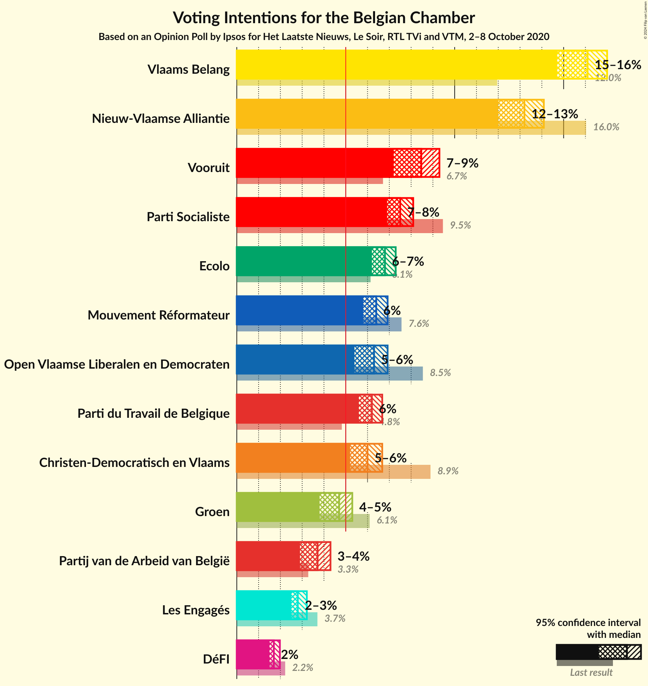
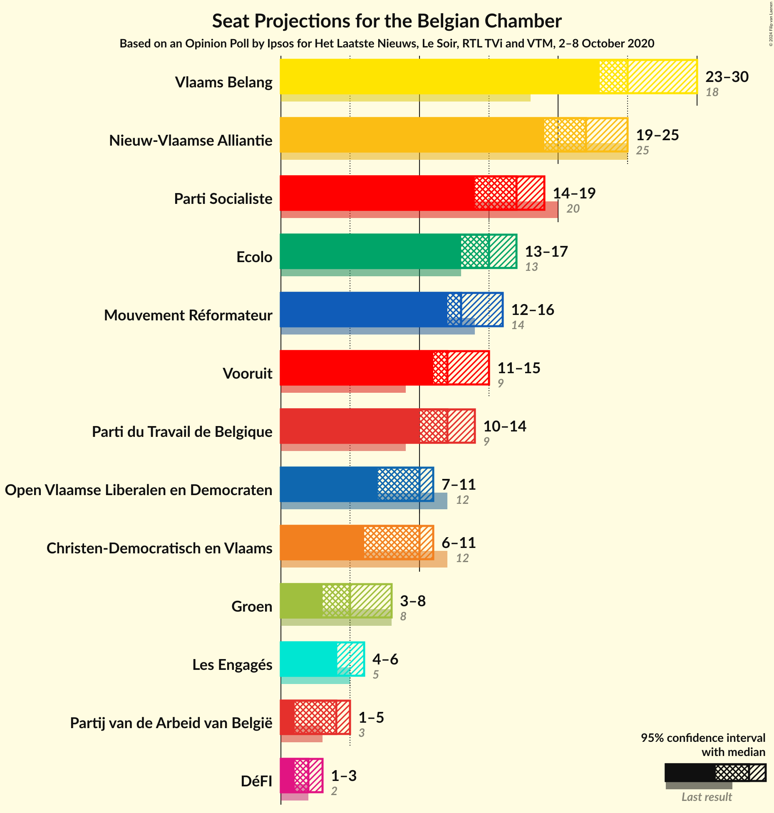
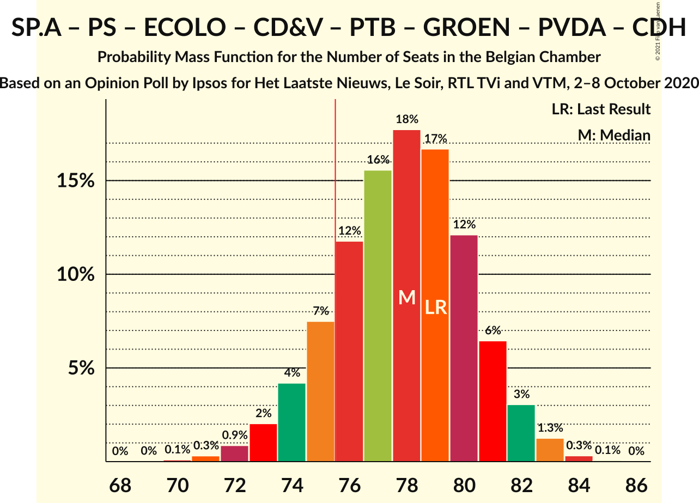
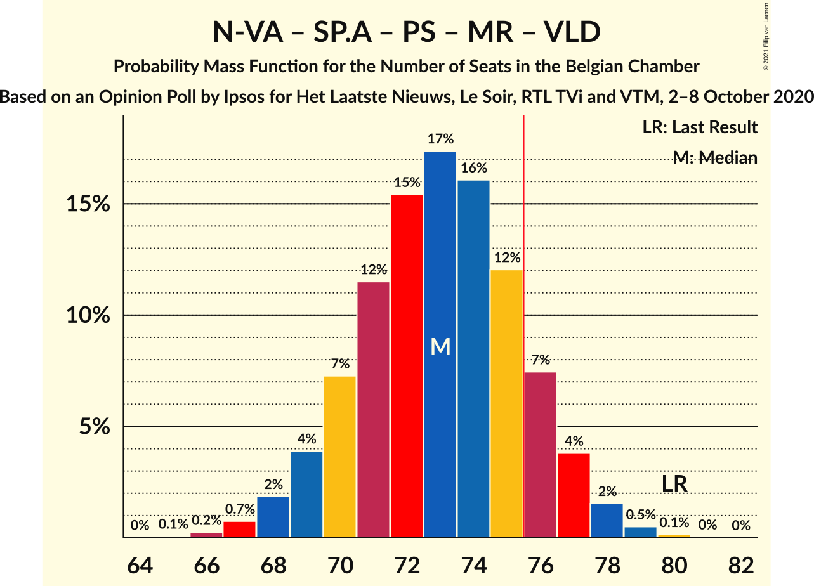
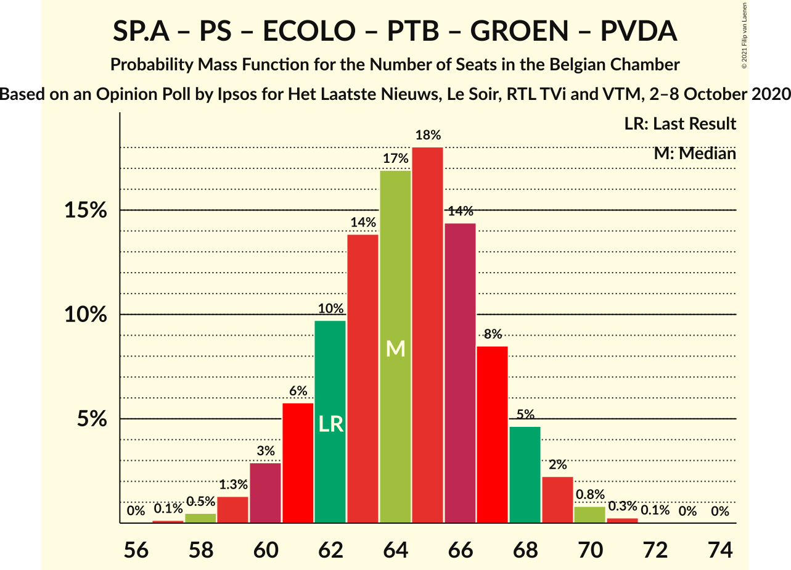
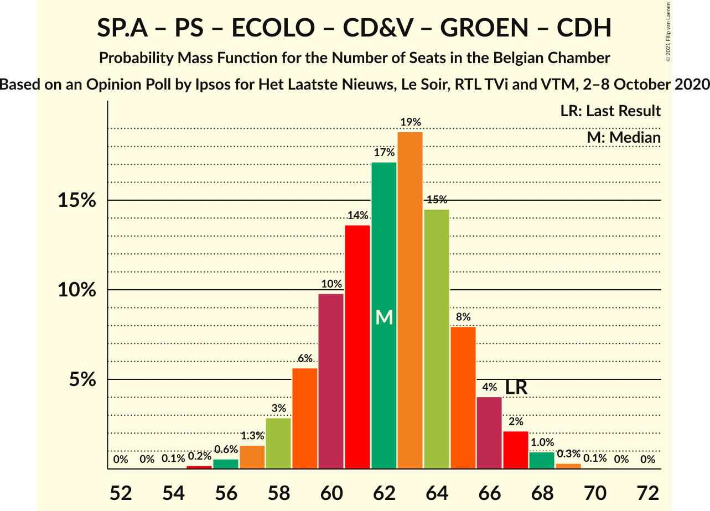
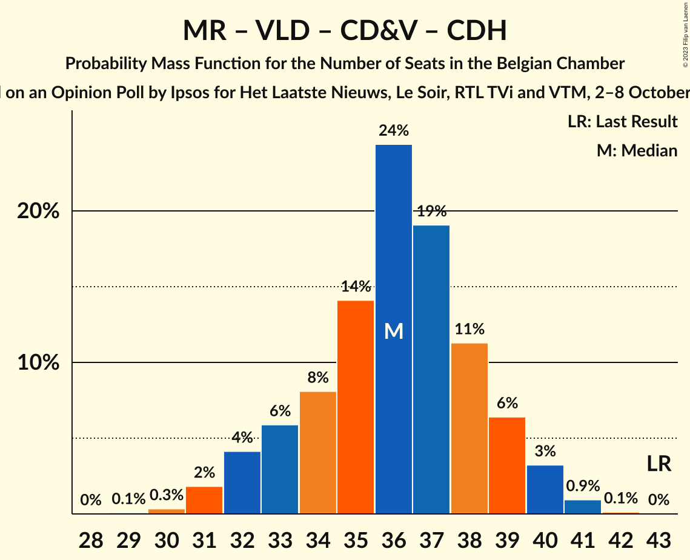

# Opinion Poll by Ipsos for Het Laatste Nieuws, Le Soir, RTL TVi and VTM, 2–8 October 2020

Areas included: Brussels, Flanders, Wallonia

<a href="#voting-intentions">Voting Intentions</a> | <a href="#seats">Seats</a> | <a href="#coalitions">Coalitions</a> | <a href="#technical-information">Technical Information</a>

## Voting Intentions

### Confidence Intervals

| Party | Last Result | Poll Result | 80% Confidence Interval | 90% Confidence Interval | 95% Confidence Interval | 99% Confidence Interval |
|:-----:|:-----------:|:-----------:|:-----------------------:|:-----------------------:|:-----------------------:|:-----------------------:|
| Vlaams Belang | 12.0% | 17.0% | 15.2–16.0% |14.9–16.1% |14.7–16.1% |14.3–16.1% |
| Nieuw-Vlaamse Alliantie | 16.0% | 14.1% | 12.3–13.1% |12.1–13.2% |12.0–13.2% |11.6–13.2% |
| Socialistische Partij Anders | 6.7% | 8.5% | 7.6–9.1% |7.4–9.2% |7.2–9.3% |6.8–9.3% |
| Parti Socialiste | 9.5% | 8.1% | 7.1–7.5% |7.0–7.5% |6.9–7.5% |6.7–7.5% |
| Ecolo | 6.1% | 7.3% | 6.4–6.7% |6.3–6.8% |6.2–6.8% |6.1–6.8% |
| Open Vlaamse Liberalen en Democraten | 8.5% | 6.9% | 5.7–6.2% |5.5–6.3% |5.4–6.3% |5.1–6.3% |
| Mouvement Réformateur | 7.6% | 6.9% | 6.0–6.4% |5.9–6.4% |5.8–6.4% |5.7–6.4% |
| Christen-Democratisch en Vlaams | 8.9% | 6.7% | 5.4–6.0% |5.3–6.0% |5.2–6.0% |4.9–6.1% |
| Parti du Travail de Belgique | 4.8% | 6.7% | 5.8–6.1% |5.7–6.2% |5.6–6.2% |5.5–6.2% |
| Groen | 6.1% | 4.7% | 4.1–5.2% |3.9–5.3% |3.8–5.3% |3.5–5.4% |
| Partij van de Arbeid van België | 3.3% | 3.7% | 3.2–4.2% |3.0–4.3% |2.9–4.3% |2.7–4.4% |
| Centre démocrate humaniste | 3.7% | 3.2% | 2.6–2.8% |2.5–2.8% |2.5–2.8% |2.3–2.8% |
| DéFI | 2.2% | 2.0% | 1.6–1.7% |1.5–1.7% |1.5–1.7% |1.4–1.7% |

*Note:* The poll result column reflects the actual value used in the calculations. Published results may vary slightly, and in addition be rounded to fewer digits.

## Seats

### Confidence Intervals

| Party | Last Result | Median | 80% Confidence Interval | 90% Confidence Interval | 95% Confidence Interval | 99% Confidence Interval |
|:-----:|:-----------:|:------:|:-----------------------:|:-----------------------:|:-----------------------:|:-----------------------:|
| <a href="#vlaams-belang">Vlaams Belang</a> | 18 | 25 | 25–29 |24–29 |23–30 |22–30 |
| <a href="#nieuw-vlaamse-alliantie">Nieuw-Vlaamse Alliantie</a> | 25 | 22 | 20–24 |19–25 |19–25 |18–26 |
| <a href="#socialistische-partij-anders">Socialistische Partij Anders</a> | 9 | 12 | 11–14 |11–15 |11–15 |9–15 |
| <a href="#parti-socialiste">Parti Socialiste</a> | 20 | 17 | 15–19 |15–19 |14–19 |13–20 |
| <a href="#ecolo">Ecolo</a> | 13 | 14 | 13–16 |13–17 |13–17 |12–18 |
| <a href="#open-vlaamse-liberalen-en-democraten">Open Vlaamse Liberalen en Democraten</a> | 12 | 10 | 8–10 |7–10 |7–11 |6–12 |
| <a href="#mouvement-réformateur">Mouvement Réformateur</a> | 14 | 13 | 12–15 |12–16 |12–16 |11–17 |
| <a href="#christen-democratisch-en-vlaams">Christen-Democratisch en Vlaams</a> | 12 | 10 | 7–10 |6–10 |6–11 |6–11 |
| <a href="#parti-du-travail-de-belgique">Parti du Travail de Belgique</a> | 9 | 12 | 11–13 |11–13 |10–14 |10–16 |
| <a href="#groen">Groen</a> | 8 | 5 | 5–7 |3–7 |3–8 |3–9 |
| <a href="#partij-van-de-arbeid-van-belgië">Partij van de Arbeid van België</a> | 3 | 4 | 1–5 |1–5 |1–5 |1–7 |
| <a href="#centre-démocrate-humaniste">Centre démocrate humaniste</a> | 5 | 4 | 4 |4–5 |4–5 |4–7 |
| <a href="#défi">DéFI</a> | 2 | 2 | 2 |1–2 |1–3 |1–3 |

### Vlaams Belang

*For a full overview of the results for this party, see the [Vlaams Belang](party-vlaamsbelang.html) page.*

| Number of Seats | Probability | Accumulated | Special Marks |
|:---------------:|:-----------:|:-----------:|:-------------:|
| 18 | 0% | 100% | Last Result |
| 19 | 0% | 100% |  |
| 20 | 0% | 100% |  |
| 21 | 0.2% | 100% |  |
| 22 | 0.6% | 99.8% |  |
| 23 | 2% | 99.2% |  |
| 24 | 5% | 97% |  |
| 25 | 43% | 92% | Median |
| 26 | 18% | 49% |  |
| 27 | 11% | 30% |  |
| 28 | 9% | 19% |  |
| 29 | 7% | 10% |  |
| 30 | 3% | 4% |  |
| 31 | 0.3% | 0.4% |  |
| 32 | 0.1% | 0.1% |  |
| 33 | 0% | 0% |  |

### Nieuw-Vlaamse Alliantie

*For a full overview of the results for this party, see the [Nieuw-Vlaamse Alliantie](party-nieuw-vlaamsealliantie.html) page.*

| Number of Seats | Probability | Accumulated | Special Marks |
|:---------------:|:-----------:|:-----------:|:-------------:|
| 16 | 0.1% | 100% |  |
| 17 | 0.2% | 99.9% |  |
| 18 | 2% | 99.7% |  |
| 19 | 5% | 98% |  |
| 20 | 14% | 93% |  |
| 21 | 29% | 79% |  |
| 22 | 26% | 51% | Median |
| 23 | 12% | 25% |  |
| 24 | 7% | 13% |  |
| 25 | 4% | 6% | Last Result |
| 26 | 1.5% | 2% |  |
| 27 | 0.1% | 0.1% |  |
| 28 | 0% | 0% |  |

### Socialistische Partij Anders

*For a full overview of the results for this party, see the [Socialistische Partij Anders](party-socialistischepartijanders.html) page.*

| Number of Seats | Probability | Accumulated | Special Marks |
|:---------------:|:-----------:|:-----------:|:-------------:|
| 9 | 0.7% | 100% | Last Result |
| 10 | 2% | 99.3% |  |
| 11 | 39% | 98% |  |
| 12 | 35% | 59% | Median |
| 13 | 8% | 24% |  |
| 14 | 10% | 16% |  |
| 15 | 6% | 6% |  |
| 16 | 0.4% | 0.4% |  |
| 17 | 0% | 0% |  |

### Parti Socialiste

*For a full overview of the results for this party, see the [Parti Socialiste](party-partisocialiste.html) page.*

| Number of Seats | Probability | Accumulated | Special Marks |
|:---------------:|:-----------:|:-----------:|:-------------:|
| 12 | 0.2% | 100% |  |
| 13 | 1.2% | 99.8% |  |
| 14 | 3% | 98.6% |  |
| 15 | 9% | 96% |  |
| 16 | 27% | 86% |  |
| 17 | 33% | 59% | Median |
| 18 | 16% | 26% |  |
| 19 | 9% | 10% |  |
| 20 | 1.0% | 1.0% | Last Result |
| 21 | 0% | 0% |  |

### Ecolo

*For a full overview of the results for this party, see the [Ecolo](party-ecolo.html) page.*

| Number of Seats | Probability | Accumulated | Special Marks |
|:---------------:|:-----------:|:-----------:|:-------------:|
| 11 | 0.1% | 100% |  |
| 12 | 0.7% | 99.9% |  |
| 13 | 16% | 99.2% | Last Result |
| 14 | 34% | 83% | Median |
| 15 | 28% | 49% |  |
| 16 | 14% | 21% |  |
| 17 | 6% | 7% |  |
| 18 | 2% | 2% |  |
| 19 | 0% | 0% |  |

### Open Vlaamse Liberalen en Democraten

*For a full overview of the results for this party, see the [Open Vlaamse Liberalen en Democraten](party-openvlaamseliberalenendemocraten.html) page.*

| Number of Seats | Probability | Accumulated | Special Marks |
|:---------------:|:-----------:|:-----------:|:-------------:|
| 6 | 1.5% | 100% |  |
| 7 | 6% | 98.5% |  |
| 8 | 11% | 93% |  |
| 9 | 18% | 81% |  |
| 10 | 59% | 63% | Median |
| 11 | 3% | 4% |  |
| 12 | 1.5% | 2% | Last Result |
| 13 | 0.2% | 0.2% |  |
| 14 | 0% | 0% |  |

### Mouvement Réformateur

*For a full overview of the results for this party, see the [Mouvement Réformateur](party-mouvementréformateur.html) page.*

| Number of Seats | Probability | Accumulated | Special Marks |
|:---------------:|:-----------:|:-----------:|:-------------:|
| 10 | 0.1% | 100% |  |
| 11 | 0.5% | 99.9% |  |
| 12 | 37% | 99.4% |  |
| 13 | 29% | 63% | Median |
| 14 | 17% | 34% | Last Result |
| 15 | 11% | 17% |  |
| 16 | 5% | 6% |  |
| 17 | 1.0% | 1.0% |  |
| 18 | 0% | 0% |  |

### Christen-Democratisch en Vlaams

*For a full overview of the results for this party, see the [Christen-Democratisch en Vlaams](party-christen-democratischenvlaams.html) page.*

| Number of Seats | Probability | Accumulated | Special Marks |
|:---------------:|:-----------:|:-----------:|:-------------:|
| 5 | 0.4% | 100% |  |
| 6 | 6% | 99.6% |  |
| 7 | 3% | 93% |  |
| 8 | 5% | 90% |  |
| 9 | 20% | 85% |  |
| 10 | 60% | 64% | Median |
| 11 | 4% | 4% |  |
| 12 | 0.2% | 0.3% | Last Result |
| 13 | 0.1% | 0.1% |  |
| 14 | 0% | 0% |  |

### Parti du Travail de Belgique

*For a full overview of the results for this party, see the [Parti du Travail de Belgique](party-partidutravaildebelgique.html) page.*

| Number of Seats | Probability | Accumulated | Special Marks |
|:---------------:|:-----------:|:-----------:|:-------------:|
| 9 | 0.1% | 100% | Last Result |
| 10 | 3% | 99.9% |  |
| 11 | 29% | 96% |  |
| 12 | 56% | 68% | Median |
| 13 | 8% | 12% |  |
| 14 | 2% | 4% |  |
| 15 | 1.3% | 2% |  |
| 16 | 0.5% | 0.7% |  |
| 17 | 0.2% | 0.2% |  |
| 18 | 0% | 0% |  |

### Groen

*For a full overview of the results for this party, see the [Groen](party-groen.html) page.*

| Number of Seats | Probability | Accumulated | Special Marks |
|:---------------:|:-----------:|:-----------:|:-------------:|
| 3 | 5% | 100% |  |
| 4 | 2% | 95% |  |
| 5 | 62% | 93% | Median |
| 6 | 13% | 31% |  |
| 7 | 13% | 18% |  |
| 8 | 3% | 4% | Last Result |
| 9 | 1.3% | 1.3% |  |
| 10 | 0% | 0% |  |

### Partij van de Arbeid van België

*For a full overview of the results for this party, see the [Partij van de Arbeid van België](party-partijvandearbeidvanbelgië.html) page.*

| Number of Seats | Probability | Accumulated | Special Marks |
|:---------------:|:-----------:|:-----------:|:-------------:|
| 1 | 10% | 100% |  |
| 2 | 4% | 90% |  |
| 3 | 28% | 86% | Last Result |
| 4 | 28% | 58% | Median |
| 5 | 29% | 30% |  |
| 6 | 0.5% | 1.2% |  |
| 7 | 0.5% | 0.6% |  |
| 8 | 0.1% | 0.1% |  |
| 9 | 0% | 0% |  |

### Centre démocrate humaniste

*For a full overview of the results for this party, see the [Centre démocrate humaniste](party-centredémocratehumaniste.html) page.*

| Number of Seats | Probability | Accumulated | Special Marks |
|:---------------:|:-----------:|:-----------:|:-------------:|
| 4 | 91% | 100% | Median |
| 5 | 8% | 9% | Last Result |
| 6 | 1.3% | 2% |  |
| 7 | 0.4% | 0.5% |  |
| 8 | 0.1% | 0.1% |  |
| 9 | 0% | 0% |  |

### DéFI

*For a full overview of the results for this party, see the [DéFI](party-défi.html) page.*

| Number of Seats | Probability | Accumulated | Special Marks |
|:---------------:|:-----------:|:-----------:|:-------------:|
| 1 | 8% | 100% |  |
| 2 | 88% | 92% | Last Result, Median |
| 3 | 3% | 3% |  |
| 4 | 0.2% | 0.2% |  |
| 5 | 0% | 0% |  |

## Coalitions

### Confidence Intervals

| Coalition | Last Result | Median | Majority? | 80% Confidence Interval | 90% Confidence Interval | 95% Confidence Interval | 99% Confidence Interval |
|:---------:|:-----------:|:------:|:---------:|:-----------------------:|:-----------------------:|:-----------------------:|:-----------------------:|
| Socialistische Partij Anders – Parti Socialiste – Ecolo – Mouvement Réformateur – Open Vlaamse Liberalen en Democraten – Christen-Democratisch en Vlaams – Groen – Centre démocrate humaniste | 93 | 85 | 100% | 82–87 | 81–88 | 80–89 | 79–90 |
| Socialistische Partij Anders – Parti Socialiste – Ecolo – Mouvement Réformateur – Open Vlaamse Liberalen en Democraten – Christen-Democratisch en Vlaams – Groen | 88 | 81 | 98.9% | 78–83 | 77–84 | 76–85 | 75–86 |
| Socialistische Partij Anders – Parti Socialiste – Ecolo – Christen-Democratisch en Vlaams – Parti du Travail de Belgique – Groen – Partij van de Arbeid van België – Centre démocrate humaniste | 79 | 78 | 84% | 75–81 | 74–81 | 73–82 | 72–83 |
| Nieuw-Vlaamse Alliantie – Socialistische Partij Anders – Parti Socialiste – Mouvement Réformateur – Open Vlaamse Liberalen en Democraten | 80 | 73 | 14% | 70–76 | 69–77 | 68–77 | 67–79 |
| Socialistische Partij Anders – Parti Socialiste – Ecolo – Mouvement Réformateur – Open Vlaamse Liberalen en Democraten – Groen | 76 | 71 | 2% | 69–74 | 68–75 | 68–75 | 66–77 |
| Socialistische Partij Anders – Parti Socialiste – Ecolo – Parti du Travail de Belgique – Groen – Partij van de Arbeid van België – Centre démocrate humaniste | 67 | 68 | 0.1% | 66–71 | 65–72 | 64–73 | 62–74 |
| Socialistische Partij Anders – Parti Socialiste – Mouvement Réformateur – Open Vlaamse Liberalen en Democraten – Christen-Democratisch en Vlaams – Centre démocrate humaniste | 72 | 65 | 0% | 62–68 | 61–68 | 60–69 | 59–70 |
| Socialistische Partij Anders – Parti Socialiste – Ecolo – Parti du Travail de Belgique – Groen – Partij van de Arbeid van België | 62 | 64 | 0% | 61–67 | 61–68 | 60–69 | 58–70 |
| Socialistische Partij Anders – Parti Socialiste – Ecolo – Christen-Democratisch en Vlaams – Groen – Centre démocrate humaniste | 67 | 62 | 0% | 59–65 | 58–66 | 58–67 | 56–68 |
| Nieuw-Vlaamse Alliantie – Mouvement Réformateur – Open Vlaamse Liberalen en Democraten – Christen-Democratisch en Vlaams – Centre démocrate humaniste | 68 | 58 | 0% | 55–61 | 54–62 | 53–62 | 52–64 |
| Ecolo – Mouvement Réformateur – Open Vlaamse Liberalen en Democraten – Christen-Democratisch en Vlaams – Groen – Centre démocrate humaniste | 64 | 56 | 0% | 53–59 | 52–60 | 51–60 | 50–62 |
| Nieuw-Vlaamse Alliantie – Mouvement Réformateur – Open Vlaamse Liberalen en Democraten – Christen-Democratisch en Vlaams | 63 | 54 | 0% | 51–57 | 50–57 | 49–58 | 48–60 |
| Parti Socialiste – Mouvement Réformateur – Open Vlaamse Liberalen en Democraten – Christen-Democratisch en Vlaams – Centre démocrate humaniste | 63 | 53 | 0% | 50–55 | 49–56 | 48–56 | 47–57 |
| Socialistische Partij Anders – Parti Socialiste – Mouvement Réformateur – Open Vlaamse Liberalen en Democraten | 55 | 51 | 0% | 49–54 | 48–55 | 47–55 | 46–57 |
| Socialistische Partij Anders – Parti Socialiste – Christen-Democratisch en Vlaams – Centre démocrate humaniste | 46 | 42 | 0% | 40–45 | 39–46 | 38–46 | 37–48 |
| Mouvement Réformateur – Open Vlaamse Liberalen en Democraten – Christen-Democratisch en Vlaams – Centre démocrate humaniste | 43 | 36 | 0% | 33–39 | 32–39 | 32–40 | 31–41 |

### Socialistische Partij Anders – Parti Socialiste – Ecolo – Mouvement Réformateur – Open Vlaamse Liberalen en Democraten – Christen-Democratisch en Vlaams – Groen – Centre démocrate humaniste

| Number of Seats | Probability | Accumulated | Special Marks |
|:---------------:|:-----------:|:-----------:|:-------------:|
| 77 | 0.1% | 100% |  |
| 78 | 0.2% | 99.9% |  |
| 79 | 0.6% | 99.7% |  |
| 80 | 2% | 99.1% |  |
| 81 | 4% | 97% |  |
| 82 | 7% | 94% |  |
| 83 | 11% | 87% |  |
| 84 | 15% | 76% |  |
| 85 | 20% | 62% | Median |
| 86 | 20% | 41% |  |
| 87 | 12% | 21% |  |
| 88 | 5% | 9% |  |
| 89 | 2% | 4% |  |
| 90 | 1.1% | 1.5% |  |
| 91 | 0.3% | 0.4% |  |
| 92 | 0.1% | 0.1% |  |
| 93 | 0% | 0% | Last Result |

### Socialistische Partij Anders – Parti Socialiste – Ecolo – Mouvement Réformateur – Open Vlaamse Liberalen en Democraten – Christen-Democratisch en Vlaams – Groen

| Number of Seats | Probability | Accumulated | Special Marks |
|:---------------:|:-----------:|:-----------:|:-------------:|
| 73 | 0.1% | 100% |  |
| 74 | 0.3% | 99.9% |  |
| 75 | 0.7% | 99.6% |  |
| 76 | 2% | 98.9% | Majority |
| 77 | 4% | 97% |  |
| 78 | 7% | 93% |  |
| 79 | 12% | 86% |  |
| 80 | 15% | 74% |  |
| 81 | 21% | 60% | Median |
| 82 | 20% | 39% |  |
| 83 | 11% | 19% |  |
| 84 | 5% | 8% |  |
| 85 | 2% | 3% |  |
| 86 | 1.0% | 1.3% |  |
| 87 | 0.3% | 0.3% |  |
| 88 | 0.1% | 0.1% | Last Result |
| 89 | 0% | 0% |  |

### Socialistische Partij Anders – Parti Socialiste – Ecolo – Christen-Democratisch en Vlaams – Parti du Travail de Belgique – Groen – Partij van de Arbeid van België – Centre démocrate humaniste

| Number of Seats | Probability | Accumulated | Special Marks |
|:---------------:|:-----------:|:-----------:|:-------------:|
| 70 | 0.1% | 100% |  |
| 71 | 0.3% | 99.9% |  |
| 72 | 0.9% | 99.6% |  |
| 73 | 2% | 98.7% |  |
| 74 | 4% | 97% |  |
| 75 | 8% | 92% |  |
| 76 | 12% | 84% | Majority |
| 77 | 16% | 72% |  |
| 78 | 18% | 56% | Median |
| 79 | 16% | 39% | Last Result |
| 80 | 12% | 22% |  |
| 81 | 6% | 11% |  |
| 82 | 3% | 4% |  |
| 83 | 1.2% | 2% |  |
| 84 | 0.3% | 0.4% |  |
| 85 | 0.1% | 0.1% |  |
| 86 | 0% | 0% |  |

### Nieuw-Vlaamse Alliantie – Socialistische Partij Anders – Parti Socialiste – Mouvement Réformateur – Open Vlaamse Liberalen en Democraten

| Number of Seats | Probability | Accumulated | Special Marks |
|:---------------:|:-----------:|:-----------:|:-------------:|
| 65 | 0.1% | 100% |  |
| 66 | 0.2% | 99.9% |  |
| 67 | 0.7% | 99.7% |  |
| 68 | 2% | 99.0% |  |
| 69 | 4% | 97% |  |
| 70 | 7% | 94% |  |
| 71 | 11% | 87% |  |
| 72 | 15% | 76% |  |
| 73 | 17% | 60% |  |
| 74 | 16% | 43% | Median |
| 75 | 12% | 27% |  |
| 76 | 8% | 14% | Majority |
| 77 | 4% | 6% |  |
| 78 | 2% | 2% |  |
| 79 | 0.5% | 0.8% |  |
| 80 | 0.2% | 0.2% | Last Result |
| 81 | 0% | 0.1% |  |
| 82 | 0% | 0% |  |

### Socialistische Partij Anders – Parti Socialiste – Ecolo – Mouvement Réformateur – Open Vlaamse Liberalen en Democraten – Groen

| Number of Seats | Probability | Accumulated | Special Marks |
|:---------------:|:-----------:|:-----------:|:-------------:|
| 64 | 0.1% | 100% |  |
| 65 | 0.2% | 99.9% |  |
| 66 | 0.6% | 99.7% |  |
| 67 | 2% | 99.1% |  |
| 68 | 5% | 98% |  |
| 69 | 9% | 93% |  |
| 70 | 14% | 84% |  |
| 71 | 20% | 70% | Median |
| 72 | 22% | 50% |  |
| 73 | 14% | 28% |  |
| 74 | 8% | 14% |  |
| 75 | 4% | 6% |  |
| 76 | 2% | 2% | Last Result, Majority |
| 77 | 0.5% | 0.7% |  |
| 78 | 0.1% | 0.1% |  |
| 79 | 0% | 0% |  |

### Socialistische Partij Anders – Parti Socialiste – Ecolo – Parti du Travail de Belgique – Groen – Partij van de Arbeid van België – Centre démocrate humaniste

| Number of Seats | Probability | Accumulated | Special Marks |
|:---------------:|:-----------:|:-----------:|:-------------:|
| 61 | 0.1% | 100% |  |
| 62 | 0.4% | 99.9% |  |
| 63 | 1.1% | 99.5% |  |
| 64 | 3% | 98% |  |
| 65 | 6% | 96% |  |
| 66 | 10% | 90% |  |
| 67 | 14% | 81% | Last Result |
| 68 | 17% | 67% | Median |
| 69 | 18% | 50% |  |
| 70 | 15% | 32% |  |
| 71 | 9% | 17% |  |
| 72 | 5% | 8% |  |
| 73 | 2% | 3% |  |
| 74 | 0.8% | 1.2% |  |
| 75 | 0.3% | 0.3% |  |
| 76 | 0.1% | 0.1% | Majority |
| 77 | 0% | 0% |  |

### Socialistische Partij Anders – Parti Socialiste – Mouvement Réformateur – Open Vlaamse Liberalen en Democraten – Christen-Democratisch en Vlaams – Centre démocrate humaniste

| Number of Seats | Probability | Accumulated | Special Marks |
|:---------------:|:-----------:|:-----------:|:-------------:|
| 57 | 0.1% | 100% |  |
| 58 | 0.3% | 99.9% |  |
| 59 | 0.9% | 99.6% |  |
| 60 | 2% | 98.7% |  |
| 61 | 4% | 97% |  |
| 62 | 7% | 93% |  |
| 63 | 11% | 86% |  |
| 64 | 16% | 74% |  |
| 65 | 18% | 59% |  |
| 66 | 17% | 41% | Median |
| 67 | 12% | 24% |  |
| 68 | 7% | 11% |  |
| 69 | 3% | 5% |  |
| 70 | 1.1% | 2% |  |
| 71 | 0.3% | 0.4% |  |
| 72 | 0.1% | 0.1% | Last Result |
| 73 | 0% | 0% |  |

### Socialistische Partij Anders – Parti Socialiste – Ecolo – Parti du Travail de Belgique – Groen – Partij van de Arbeid van België

| Number of Seats | Probability | Accumulated | Special Marks |
|:---------------:|:-----------:|:-----------:|:-------------:|
| 57 | 0.1% | 100% |  |
| 58 | 0.5% | 99.8% |  |
| 59 | 1.3% | 99.4% |  |
| 60 | 3% | 98% |  |
| 61 | 6% | 95% |  |
| 62 | 10% | 89% | Last Result |
| 63 | 14% | 79% |  |
| 64 | 17% | 65% | Median |
| 65 | 18% | 47% |  |
| 66 | 14% | 30% |  |
| 67 | 8% | 16% |  |
| 68 | 4% | 8% |  |
| 69 | 2% | 3% |  |
| 70 | 0.8% | 1.1% |  |
| 71 | 0.2% | 0.3% |  |
| 72 | 0.1% | 0.1% |  |
| 73 | 0% | 0% |  |

### Socialistische Partij Anders – Parti Socialiste – Ecolo – Christen-Democratisch en Vlaams – Groen – Centre démocrate humaniste

| Number of Seats | Probability | Accumulated | Special Marks |
|:---------------:|:-----------:|:-----------:|:-------------:|
| 54 | 0.1% | 100% |  |
| 55 | 0.2% | 99.9% |  |
| 56 | 0.6% | 99.7% |  |
| 57 | 1.4% | 99.2% |  |
| 58 | 3% | 98% |  |
| 59 | 6% | 95% |  |
| 60 | 10% | 89% |  |
| 61 | 14% | 79% |  |
| 62 | 17% | 65% | Median |
| 63 | 18% | 48% |  |
| 64 | 14% | 30% |  |
| 65 | 8% | 15% |  |
| 66 | 4% | 7% |  |
| 67 | 2% | 3% | Last Result |
| 68 | 0.9% | 1.3% |  |
| 69 | 0.3% | 0.4% |  |
| 70 | 0.1% | 0.1% |  |
| 71 | 0% | 0% |  |

### Nieuw-Vlaamse Alliantie – Mouvement Réformateur – Open Vlaamse Liberalen en Democraten – Christen-Democratisch en Vlaams – Centre démocrate humaniste

| Number of Seats | Probability | Accumulated | Special Marks |
|:---------------:|:-----------:|:-----------:|:-------------:|
| 50 | 0.1% | 100% |  |
| 51 | 0.2% | 99.9% |  |
| 52 | 1.0% | 99.7% |  |
| 53 | 3% | 98.7% |  |
| 54 | 5% | 96% |  |
| 55 | 8% | 91% |  |
| 56 | 11% | 83% |  |
| 57 | 16% | 72% |  |
| 58 | 18% | 56% |  |
| 59 | 15% | 37% | Median |
| 60 | 11% | 22% |  |
| 61 | 6% | 12% |  |
| 62 | 3% | 5% |  |
| 63 | 1.3% | 2% |  |
| 64 | 0.4% | 0.6% |  |
| 65 | 0.1% | 0.2% |  |
| 66 | 0% | 0% |  |
| 67 | 0% | 0% |  |
| 68 | 0% | 0% | Last Result |

### Ecolo – Mouvement Réformateur – Open Vlaamse Liberalen en Democraten – Christen-Democratisch en Vlaams – Groen – Centre démocrate humaniste

| Number of Seats | Probability | Accumulated | Special Marks |
|:---------------:|:-----------:|:-----------:|:-------------:|
| 49 | 0.2% | 100% |  |
| 50 | 0.6% | 99.8% |  |
| 51 | 2% | 99.1% |  |
| 52 | 4% | 97% |  |
| 53 | 6% | 94% |  |
| 54 | 9% | 88% |  |
| 55 | 14% | 78% |  |
| 56 | 19% | 64% | Median |
| 57 | 19% | 46% |  |
| 58 | 14% | 27% |  |
| 59 | 8% | 13% |  |
| 60 | 3% | 5% |  |
| 61 | 1.3% | 2% |  |
| 62 | 0.4% | 0.5% |  |
| 63 | 0.1% | 0.1% |  |
| 64 | 0% | 0% | Last Result |

### Nieuw-Vlaamse Alliantie – Mouvement Réformateur – Open Vlaamse Liberalen en Democraten – Christen-Democratisch en Vlaams

| Number of Seats | Probability | Accumulated | Special Marks |
|:---------------:|:-----------:|:-----------:|:-------------:|
| 46 | 0.1% | 100% |  |
| 47 | 0.3% | 99.9% |  |
| 48 | 1.1% | 99.6% |  |
| 49 | 3% | 98.6% |  |
| 50 | 6% | 96% |  |
| 51 | 8% | 90% |  |
| 52 | 11% | 82% |  |
| 53 | 17% | 70% |  |
| 54 | 19% | 54% |  |
| 55 | 15% | 35% | Median |
| 56 | 10% | 21% |  |
| 57 | 6% | 10% |  |
| 58 | 3% | 4% |  |
| 59 | 1.1% | 2% |  |
| 60 | 0.4% | 0.5% |  |
| 61 | 0.1% | 0.1% |  |
| 62 | 0% | 0% |  |
| 63 | 0% | 0% | Last Result |

### Parti Socialiste – Mouvement Réformateur – Open Vlaamse Liberalen en Democraten – Christen-Democratisch en Vlaams – Centre démocrate humaniste

| Number of Seats | Probability | Accumulated | Special Marks |
|:---------------:|:-----------:|:-----------:|:-------------:|
| 45 | 0.1% | 100% |  |
| 46 | 0.3% | 99.9% |  |
| 47 | 0.9% | 99.6% |  |
| 48 | 2% | 98.7% |  |
| 49 | 4% | 97% |  |
| 50 | 7% | 92% |  |
| 51 | 10% | 86% |  |
| 52 | 15% | 76% |  |
| 53 | 18% | 61% |  |
| 54 | 20% | 43% | Median |
| 55 | 15% | 23% |  |
| 56 | 6% | 8% |  |
| 57 | 2% | 2% |  |
| 58 | 0.3% | 0.3% |  |
| 59 | 0% | 0.1% |  |
| 60 | 0% | 0% |  |
| 61 | 0% | 0% |  |
| 62 | 0% | 0% |  |
| 63 | 0% | 0% | Last Result |

### Socialistische Partij Anders – Parti Socialiste – Mouvement Réformateur – Open Vlaamse Liberalen en Democraten

| Number of Seats | Probability | Accumulated | Special Marks |
|:---------------:|:-----------:|:-----------:|:-------------:|
| 44 | 0.1% | 100% |  |
| 45 | 0.2% | 99.9% |  |
| 46 | 0.8% | 99.7% |  |
| 47 | 2% | 98.9% |  |
| 48 | 5% | 97% |  |
| 49 | 9% | 92% |  |
| 50 | 15% | 83% |  |
| 51 | 19% | 68% |  |
| 52 | 19% | 49% | Median |
| 53 | 15% | 30% |  |
| 54 | 9% | 15% |  |
| 55 | 4% | 6% | Last Result |
| 56 | 2% | 2% |  |
| 57 | 0.5% | 0.6% |  |
| 58 | 0.1% | 0.1% |  |
| 59 | 0% | 0% |  |

### Socialistische Partij Anders – Parti Socialiste – Christen-Democratisch en Vlaams – Centre démocrate humaniste

| Number of Seats | Probability | Accumulated | Special Marks |
|:---------------:|:-----------:|:-----------:|:-------------:|
| 35 | 0.1% | 100% |  |
| 36 | 0.3% | 99.9% |  |
| 37 | 0.9% | 99.6% |  |
| 38 | 2% | 98.6% |  |
| 39 | 5% | 96% |  |
| 40 | 10% | 92% |  |
| 41 | 16% | 82% |  |
| 42 | 20% | 66% |  |
| 43 | 19% | 45% | Median |
| 44 | 13% | 26% |  |
| 45 | 8% | 13% |  |
| 46 | 4% | 6% | Last Result |
| 47 | 1.5% | 2% |  |
| 48 | 0.5% | 0.5% |  |
| 49 | 0.1% | 0.1% |  |
| 50 | 0% | 0% |  |

### Mouvement Réformateur – Open Vlaamse Liberalen en Democraten – Christen-Democratisch en Vlaams – Centre démocrate humaniste

| Number of Seats | Probability | Accumulated | Special Marks |
|:---------------:|:-----------:|:-----------:|:-------------:|
| 29 | 0.1% | 100% |  |
| 30 | 0.3% | 99.9% |  |
| 31 | 2% | 99.6% |  |
| 32 | 4% | 98% |  |
| 33 | 6% | 94% |  |
| 34 | 8% | 88% |  |
| 35 | 14% | 80% |  |
| 36 | 24% | 66% |  |
| 37 | 19% | 43% | Median |
| 38 | 13% | 24% |  |
| 39 | 7% | 11% |  |
| 40 | 3% | 4% |  |
| 41 | 0.9% | 1.0% |  |
| 42 | 0.1% | 0.2% |  |
| 43 | 0% | 0% | Last Result |

## Technical Information

### Opinion Poll

+ **Polling firm:** Ipsos
+ **Commissioner(s):** Het Laatste Nieuws, Le Soir, RTL TVi and VTM
+ **Fieldwork period:** 2–8 October 2020

### Calculations

+ **Sample size:** 1618
+ **Simulations done:** 1,048,576
+ **Error estimate:** 0.88%

