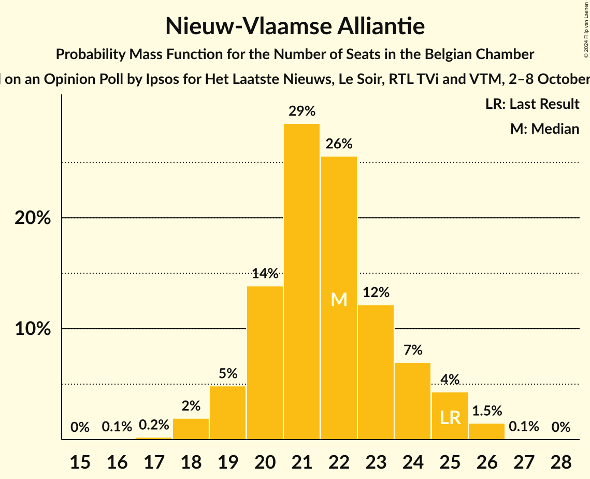
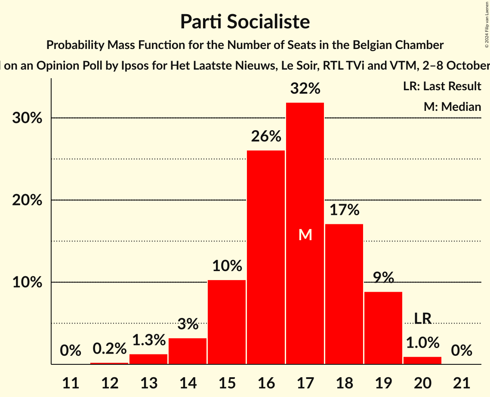
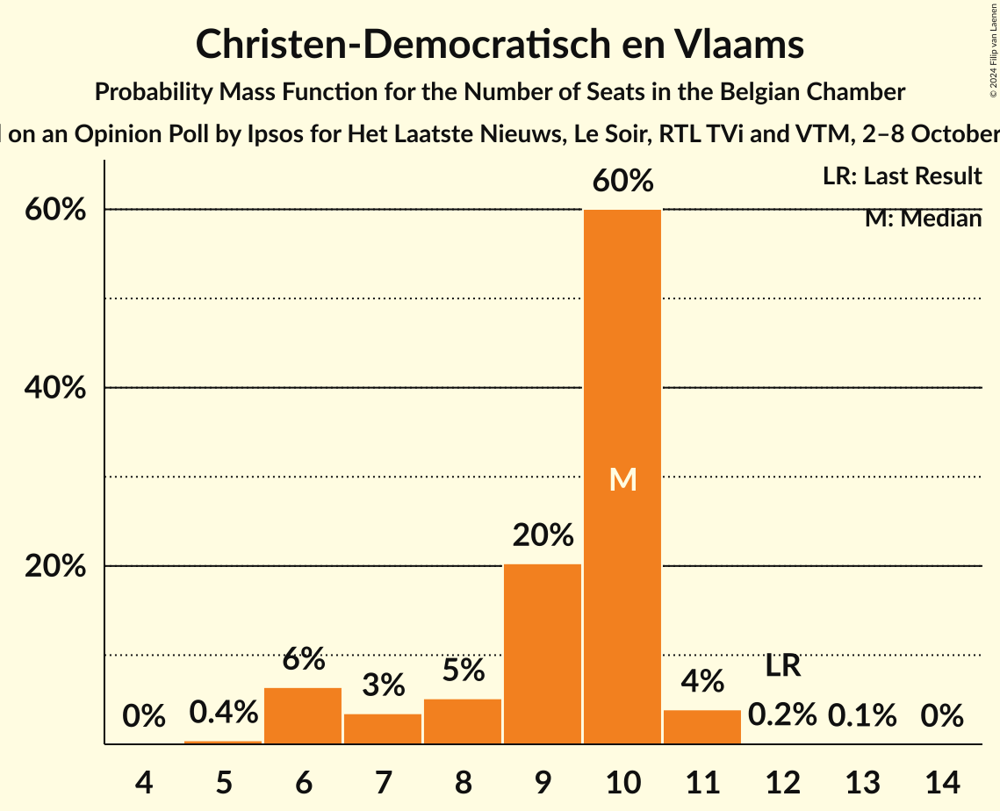
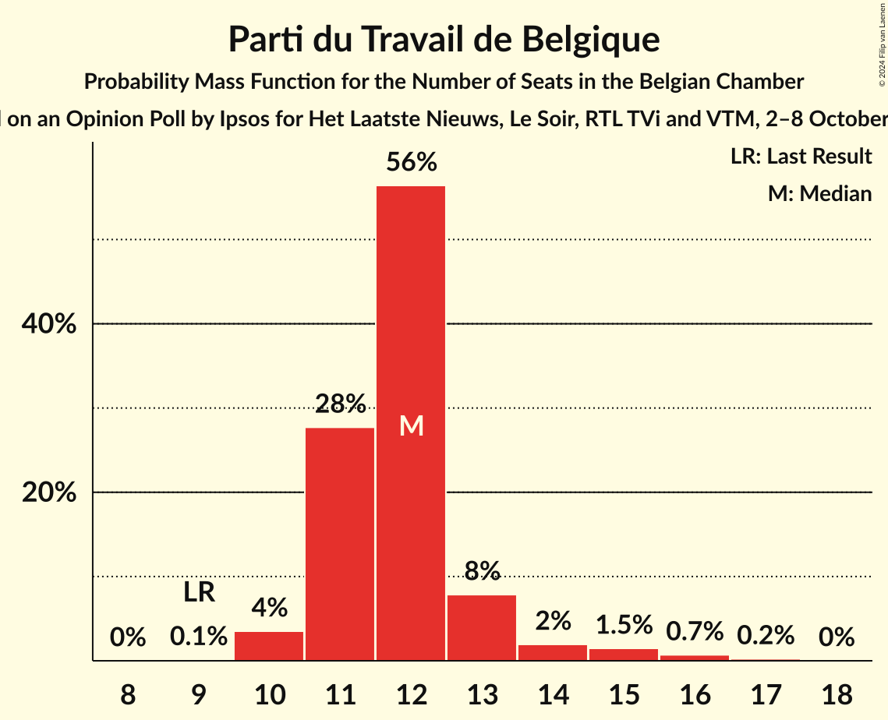
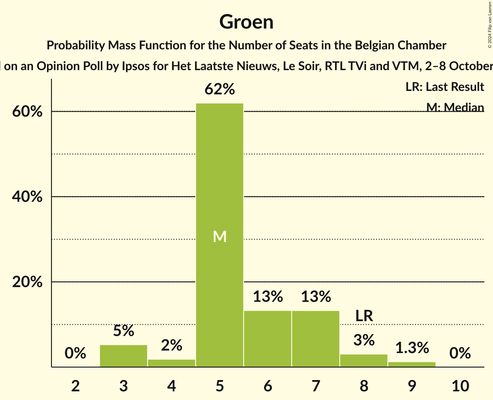
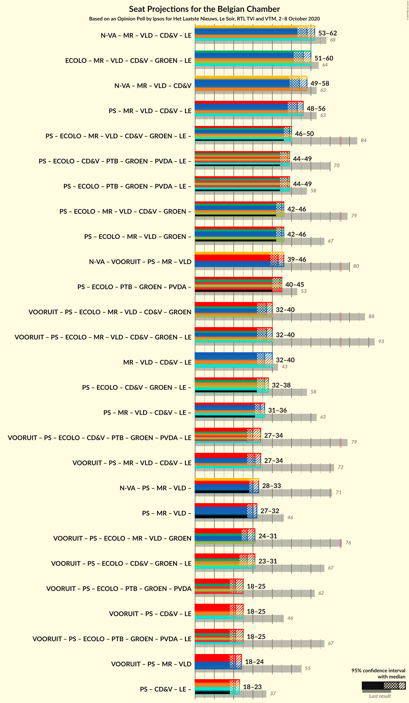

# Opinion Poll by Ipsos for Het Laatste Nieuws, Le Soir, RTL TVi and VTM, 2–8 October 2020

Areas included: Brussels, Flanders, Wallonia

<a href="#voting-intentions">Voting Intentions</a> | <a href="#seats">Seats</a> | <a href="#coalitions">Coalitions</a> | <a href="#technical-information">Technical Information</a>

## Voting Intentions

### Confidence Intervals

| Party | Last Result | Poll Result | 80% Confidence Interval | 90% Confidence Interval | 95% Confidence Interval | 99% Confidence Interval |
|:-----:|:-----------:|:-----------:|:-----------------------:|:-----------------------:|:-----------------------:|:-----------------------:|
| Vlaams Belang | 12.0% | 17.0% | 15.2–16.0% |14.9–16.1% |14.7–16.1% |14.3–16.1% |
| Nieuw-Vlaamse Alliantie | 16.0% | 14.1% | 12.3–13.1% |12.1–13.2% |12.0–13.2% |11.6–13.2% |
| Vooruit | 6.7% | 8.5% | 7.6–9.1% |7.4–9.2% |7.2–9.3% |6.8–9.3% |
| Parti Socialiste | 9.5% | 8.1% | 7.1–7.5% |7.0–7.5% |6.9–7.5% |6.7–7.5% |
| Ecolo | 6.1% | 7.3% | 6.4–6.7% |6.3–6.8% |6.2–6.8% |6.1–6.8% |
| Open Vlaamse Liberalen en Democraten | 8.5% | 6.9% | 5.7–6.2% |5.5–6.3% |5.4–6.3% |5.1–6.3% |
| Mouvement Réformateur | 7.6% | 6.9% | 6.0–6.4% |5.9–6.4% |5.8–6.4% |5.7–6.4% |
| Christen-Democratisch en Vlaams | 8.9% | 6.7% | 5.4–6.0% |5.3–6.0% |5.2–6.0% |4.9–6.1% |
| Parti du Travail de Belgique | 4.8% | 6.7% | 5.8–6.1% |5.7–6.2% |5.6–6.2% |5.5–6.2% |
| Groen | 6.1% | 4.7% | 4.1–5.2% |3.9–5.3% |3.8–5.3% |3.5–5.4% |
| Partij van de Arbeid van België | 3.3% | 3.7% | 3.2–4.2% |3.0–4.3% |2.9–4.3% |2.7–4.4% |
| Les Engagés | 3.7% | 3.2% | 2.6–2.8% |2.5–2.8% |2.5–2.8% |2.3–2.8% |
| DéFI | 2.2% | 2.0% | 1.6–1.7% |1.5–1.7% |1.5–1.7% |1.4–1.7% |

*Note:* The poll result column reflects the actual value used in the calculations. Published results may vary slightly, and in addition be rounded to fewer digits.

## Seats

### Confidence Intervals

| Party | Last Result | Median | 80% Confidence Interval | 90% Confidence Interval | 95% Confidence Interval | 99% Confidence Interval |
|:-----:|:-----------:|:------:|:-----------------------:|:-----------------------:|:-----------------------:|:-----------------------:|
| <a href="#vlaams-belang">Vlaams Belang</a> | 18 | 25 | 25–29 |24–29 |23–30 |22–30 |
| <a href="#nieuw-vlaamse-alliantie">Nieuw-Vlaamse Alliantie</a> | 25 | 22 | 20–24 |19–25 |19–25 |18–26 |
| <a href="#vooruit">Vooruit</a> | 9 | 12 | 11–14 |11–15 |11–15 |9–15 |
| <a href="#parti-socialiste">Parti Socialiste</a> | 20 | 17 | 15–18 |15–19 |14–19 |13–20 |
| <a href="#ecolo">Ecolo</a> | 13 | 15 | 13–16 |13–17 |13–17 |12–18 |
| <a href="#open-vlaamse-liberalen-en-democraten">Open Vlaamse Liberalen en Democraten</a> | 12 | 10 | 8–10 |7–10 |7–11 |6–12 |
| <a href="#mouvement-réformateur">Mouvement Réformateur</a> | 14 | 13 | 12–15 |12–16 |12–16 |11–17 |
| <a href="#christen-democratisch-en-vlaams">Christen-Democratisch en Vlaams</a> | 12 | 10 | 7–10 |6–10 |6–11 |6–11 |
| <a href="#parti-du-travail-de-belgique">Parti du Travail de Belgique</a> | 9 | 12 | 11–13 |11–13 |10–14 |10–16 |
| <a href="#groen">Groen</a> | 8 | 5 | 5–7 |3–7 |3–8 |3–9 |
| <a href="#partij-van-de-arbeid-van-belgië">Partij van de Arbeid van België</a> | 3 | 4 | 1–5 |1–5 |1–5 |1–7 |
| <a href="#les-engagés">Les Engagés</a> | 5 | 4 | 4 |4–5 |4–6 |4–7 |
| <a href="#défi">DéFI</a> | 2 | 2 | 2 |1–2 |1–3 |1–3 |

### Vlaams Belang

*For a full overview of the results for this party, see the [Vlaams Belang](party-vlaamsbelang.html) page.*

| Number of Seats | Probability | Accumulated | Special Marks |
|:---------------:|:-----------:|:-----------:|:-------------:|
| 18 | 0% | 100% | Last Result |
| 19 | 0% | 100% |  |
| 20 | 0% | 100% |  |
| 21 | 0.2% | 100% |  |
| 22 | 0.6% | 99.8% |  |
| 23 | 2% | 99.2% |  |
| 24 | 5% | 97% |  |
| 25 | 43% | 92% | Median |
| 26 | 18% | 49% |  |
| 27 | 11% | 30% |  |
| 28 | 9% | 19% |  |
| 29 | 7% | 10% |  |
| 30 | 3% | 4% |  |
| 31 | 0.3% | 0.4% |  |
| 32 | 0.1% | 0.1% |  |
| 33 | 0% | 0% |  |

### Nieuw-Vlaamse Alliantie

*For a full overview of the results for this party, see the [Nieuw-Vlaamse Alliantie](party-nieuw-vlaamsealliantie.html) page.*

| Number of Seats | Probability | Accumulated | Special Marks |
|:---------------:|:-----------:|:-----------:|:-------------:|
| 16 | 0.1% | 100% |  |
| 17 | 0.2% | 99.9% |  |
| 18 | 2% | 99.7% |  |
| 19 | 5% | 98% |  |
| 20 | 14% | 93% |  |
| 21 | 29% | 79% |  |
| 22 | 26% | 51% | Median |
| 23 | 12% | 25% |  |
| 24 | 7% | 13% |  |
| 25 | 4% | 6% | Last Result |
| 26 | 1.5% | 2% |  |
| 27 | 0.1% | 0.1% |  |
| 28 | 0% | 0% |  |

### Vooruit

*For a full overview of the results for this party, see the [Vooruit](party-vooruit.html) page.*

| Number of Seats | Probability | Accumulated | Special Marks |
|:---------------:|:-----------:|:-----------:|:-------------:|
| 9 | 0.7% | 100% | Last Result |
| 10 | 2% | 99.3% |  |
| 11 | 39% | 98% |  |
| 12 | 35% | 59% | Median |
| 13 | 8% | 24% |  |
| 14 | 10% | 16% |  |
| 15 | 6% | 6% |  |
| 16 | 0.4% | 0.4% |  |
| 17 | 0% | 0% |  |

### Parti Socialiste

*For a full overview of the results for this party, see the [Parti Socialiste](party-partisocialiste.html) page.*

| Number of Seats | Probability | Accumulated | Special Marks |
|:---------------:|:-----------:|:-----------:|:-------------:|
| 12 | 0.2% | 100% |  |
| 13 | 1.3% | 99.8% |  |
| 14 | 3% | 98% |  |
| 15 | 10% | 95% |  |
| 16 | 26% | 85% |  |
| 17 | 32% | 59% | Median |
| 18 | 17% | 27% |  |
| 19 | 9% | 10% |  |
| 20 | 1.0% | 1.0% | Last Result |
| 21 | 0% | 0% |  |

### Ecolo

*For a full overview of the results for this party, see the [Ecolo](party-ecolo.html) page.*

| Number of Seats | Probability | Accumulated | Special Marks |
|:---------------:|:-----------:|:-----------:|:-------------:|
| 11 | 0.1% | 100% |  |
| 12 | 0.9% | 99.9% |  |
| 13 | 13% | 99.0% | Last Result |
| 14 | 35% | 86% |  |
| 15 | 29% | 51% | Median |
| 16 | 14% | 22% |  |
| 17 | 7% | 8% |  |
| 18 | 1.5% | 1.5% |  |
| 19 | 0% | 0% |  |

### Open Vlaamse Liberalen en Democraten

*For a full overview of the results for this party, see the [Open Vlaamse Liberalen en Democraten](party-openvlaamseliberalenendemocraten.html) page.*

| Number of Seats | Probability | Accumulated | Special Marks |
|:---------------:|:-----------:|:-----------:|:-------------:|
| 6 | 1.5% | 100% |  |
| 7 | 6% | 98.5% |  |
| 8 | 11% | 93% |  |
| 9 | 18% | 81% |  |
| 10 | 59% | 63% | Median |
| 11 | 3% | 4% |  |
| 12 | 1.5% | 2% | Last Result |
| 13 | 0.2% | 0.2% |  |
| 14 | 0% | 0% |  |

### Mouvement Réformateur

*For a full overview of the results for this party, see the [Mouvement Réformateur](party-mouvementréformateur.html) page.*

| Number of Seats | Probability | Accumulated | Special Marks |
|:---------------:|:-----------:|:-----------:|:-------------:|
| 10 | 0.1% | 100% |  |
| 11 | 0.6% | 99.9% |  |
| 12 | 38% | 99.3% |  |
| 13 | 31% | 61% | Median |
| 14 | 15% | 30% | Last Result |
| 15 | 9% | 15% |  |
| 16 | 5% | 6% |  |
| 17 | 1.2% | 1.3% |  |
| 18 | 0% | 0% |  |

### Christen-Democratisch en Vlaams

*For a full overview of the results for this party, see the [Christen-Democratisch en Vlaams](party-christen-democratischenvlaams.html) page.*

| Number of Seats | Probability | Accumulated | Special Marks |
|:---------------:|:-----------:|:-----------:|:-------------:|
| 5 | 0.4% | 100% |  |
| 6 | 6% | 99.6% |  |
| 7 | 3% | 93% |  |
| 8 | 5% | 90% |  |
| 9 | 20% | 85% |  |
| 10 | 60% | 64% | Median |
| 11 | 4% | 4% |  |
| 12 | 0.2% | 0.3% | Last Result |
| 13 | 0.1% | 0.1% |  |
| 14 | 0% | 0% |  |

### Parti du Travail de Belgique

*For a full overview of the results for this party, see the [Parti du Travail de Belgique](party-partidutravaildebelgique.html) page.*

| Number of Seats | Probability | Accumulated | Special Marks |
|:---------------:|:-----------:|:-----------:|:-------------:|
| 9 | 0.1% | 100% | Last Result |
| 10 | 4% | 99.9% |  |
| 11 | 28% | 96% |  |
| 12 | 56% | 69% | Median |
| 13 | 8% | 12% |  |
| 14 | 2% | 4% |  |
| 15 | 1.5% | 2% |  |
| 16 | 0.7% | 1.0% |  |
| 17 | 0.2% | 0.2% |  |
| 18 | 0% | 0% |  |

### Groen

*For a full overview of the results for this party, see the [Groen](party-groen.html) page.*

| Number of Seats | Probability | Accumulated | Special Marks |
|:---------------:|:-----------:|:-----------:|:-------------:|
| 3 | 5% | 100% |  |
| 4 | 2% | 95% |  |
| 5 | 62% | 93% | Median |
| 6 | 13% | 31% |  |
| 7 | 13% | 18% |  |
| 8 | 3% | 4% | Last Result |
| 9 | 1.3% | 1.3% |  |
| 10 | 0% | 0% |  |

### Partij van de Arbeid van België

*For a full overview of the results for this party, see the [Partij van de Arbeid van België](party-partijvandearbeidvanbelgië.html) page.*

| Number of Seats | Probability | Accumulated | Special Marks |
|:---------------:|:-----------:|:-----------:|:-------------:|
| 1 | 10% | 100% |  |
| 2 | 4% | 90% |  |
| 3 | 28% | 86% | Last Result |
| 4 | 28% | 58% | Median |
| 5 | 29% | 30% |  |
| 6 | 0.5% | 1.2% |  |
| 7 | 0.5% | 0.6% |  |
| 8 | 0.1% | 0.1% |  |
| 9 | 0% | 0% |  |

### Les Engagés

*For a full overview of the results for this party, see the [Les Engagés](party-lesengagés.html) page.*

| Number of Seats | Probability | Accumulated | Special Marks |
|:---------------:|:-----------:|:-----------:|:-------------:|
| 4 | 91% | 100% | Median |
| 5 | 6% | 9% | Last Result |
| 6 | 2% | 3% |  |
| 7 | 0.4% | 0.6% |  |
| 8 | 0.1% | 0.1% |  |
| 9 | 0% | 0% |  |

### DéFI

*For a full overview of the results for this party, see the [DéFI](party-défi.html) page.*

| Number of Seats | Probability | Accumulated | Special Marks |
|:---------------:|:-----------:|:-----------:|:-------------:|
| 1 | 8% | 100% |  |
| 2 | 89% | 92% | Last Result, Median |
| 3 | 3% | 3% |  |
| 4 | 0.2% | 0.2% |  |
| 5 | 0% | 0% |  |

## Coalitions

### Confidence Intervals

| Coalition | Last Result | Median | Majority? | 80% Confidence Interval | 90% Confidence Interval | 95% Confidence Interval | 99% Confidence Interval |
|:---------:|:-----------:|:------:|:---------:|:-----------------------:|:-----------------------:|:-----------------------:|:-----------------------:|
| Nieuw-Vlaamse Alliantie – Mouvement Réformateur – Open Vlaamse Liberalen en Democraten – Christen-Democratisch en Vlaams – Les Engagés | 68 | 58 | 0% | 55–61 | 54–62 | 53–62 | 52–64 |
| Ecolo – Mouvement Réformateur – Open Vlaamse Liberalen en Democraten – Christen-Democratisch en Vlaams – Groen – Les Engagés | 64 | 56 | 0% | 53–59 | 52–60 | 51–60 | 50–62 |
| Nieuw-Vlaamse Alliantie – Mouvement Réformateur – Open Vlaamse Liberalen en Democraten – Christen-Democratisch en Vlaams | 63 | 54 | 0% | 50–57 | 50–57 | 49–58 | 48–60 |
| Parti Socialiste – Mouvement Réformateur – Open Vlaamse Liberalen en Democraten – Christen-Democratisch en Vlaams – Les Engagés | 63 | 53 | 0% | 50–55 | 49–56 | 48–56 | 47–57 |
| Nieuw-Vlaamse Alliantie – Vooruit – Parti Socialiste – Mouvement Réformateur – Open Vlaamse Liberalen en Democraten | 80 | 43 | 0% | 40–45 | 39–46 | 39–46 | 38–47 |
| Vooruit – Parti Socialiste – Ecolo – Mouvement Réformateur – Open Vlaamse Liberalen en Democraten – Christen-Democratisch en Vlaams – Groen | 88 | 37 | 0% | 34–38 | 33–39 | 32–40 | 31–41 |
| Vooruit – Parti Socialiste – Ecolo – Mouvement Réformateur – Open Vlaamse Liberalen en Democraten – Christen-Democratisch en Vlaams – Groen – Les Engagés | 93 | 37 | 0% | 34–38 | 33–39 | 32–40 | 31–41 |
| Mouvement Réformateur – Open Vlaamse Liberalen en Democraten – Christen-Democratisch en Vlaams – Les Engagés | 43 | 36 | 0% | 33–39 | 32–39 | 32–40 | 31–41 |
| Vooruit – Parti Socialiste – Ecolo – Christen-Democratisch en Vlaams – Parti du Travail de Belgique – Groen – Partij van de Arbeid van België – Les Engagés | 79 | 30 | 0% | 28–33 | 27–34 | 27–34 | 26–35 |
| Vooruit – Parti Socialiste – Mouvement Réformateur – Open Vlaamse Liberalen en Democraten – Christen-Democratisch en Vlaams – Les Engagés | 72 | 31 | 0% | 28–33 | 28–34 | 27–34 | 26–35 |
| Vooruit – Parti Socialiste – Ecolo – Mouvement Réformateur – Open Vlaamse Liberalen en Democraten – Groen | 76 | 27 | 0% | 25–29 | 24–30 | 24–31 | 23–31 |
| Vooruit – Parti Socialiste – Ecolo – Christen-Democratisch en Vlaams – Groen – Les Engagés | 67 | 27 | 0% | 25–29 | 24–30 | 23–31 | 22–32 |
| Vooruit – Parti Socialiste – Ecolo – Parti du Travail de Belgique – Groen – Partij van de Arbeid van België | 62 | 21 | 0% | 19–24 | 18–24 | 18–25 | 17–26 |
| Vooruit – Parti Socialiste – Christen-Democratisch en Vlaams – Les Engagés | 46 | 21 | 0% | 20–24 | 19–24 | 18–25 | 17–25 |
| Vooruit – Parti Socialiste – Ecolo – Parti du Travail de Belgique – Groen – Partij van de Arbeid van België – Les Engagés | 67 | 21 | 0% | 19–24 | 18–24 | 18–25 | 17–26 |
| Vooruit – Parti Socialiste – Mouvement Réformateur – Open Vlaamse Liberalen en Democraten | 55 | 21 | 0% | 20–23 | 19–24 | 18–24 | 17–25 |

### Nieuw-Vlaamse Alliantie – Mouvement Réformateur – Open Vlaamse Liberalen en Democraten – Christen-Democratisch en Vlaams – Les Engagés

| Number of Seats | Probability | Accumulated | Special Marks |
|:---------------:|:-----------:|:-----------:|:-------------:|
| 50 | 0.1% | 100% |  |
| 51 | 0.3% | 99.9% |  |
| 52 | 1.0% | 99.7% |  |
| 53 | 3% | 98.6% |  |
| 54 | 5% | 96% |  |
| 55 | 8% | 90% |  |
| 56 | 11% | 82% |  |
| 57 | 17% | 71% |  |
| 58 | 19% | 55% |  |
| 59 | 15% | 36% | Median |
| 60 | 10% | 21% |  |
| 61 | 6% | 11% |  |
| 62 | 3% | 5% |  |
| 63 | 1.3% | 2% |  |
| 64 | 0.5% | 0.6% |  |
| 65 | 0.1% | 0.2% |  |
| 66 | 0% | 0% |  |
| 67 | 0% | 0% |  |
| 68 | 0% | 0% | Last Result |

### Ecolo – Mouvement Réformateur – Open Vlaamse Liberalen en Democraten – Christen-Democratisch en Vlaams – Groen – Les Engagés

| Number of Seats | Probability | Accumulated | Special Marks |
|:---------------:|:-----------:|:-----------:|:-------------:|
| 49 | 0.2% | 100% |  |
| 50 | 0.7% | 99.8% |  |
| 51 | 2% | 99.1% |  |
| 52 | 4% | 97% |  |
| 53 | 6% | 94% |  |
| 54 | 10% | 88% |  |
| 55 | 14% | 78% |  |
| 56 | 18% | 64% |  |
| 57 | 19% | 45% | Median |
| 58 | 14% | 27% |  |
| 59 | 8% | 13% |  |
| 60 | 4% | 5% |  |
| 61 | 1.3% | 2% |  |
| 62 | 0.4% | 0.5% |  |
| 63 | 0.1% | 0.1% |  |
| 64 | 0% | 0% | Last Result |

### Nieuw-Vlaamse Alliantie – Mouvement Réformateur – Open Vlaamse Liberalen en Democraten – Christen-Democratisch en Vlaams

| Number of Seats | Probability | Accumulated | Special Marks |
|:---------------:|:-----------:|:-----------:|:-------------:|
| 46 | 0.1% | 100% |  |
| 47 | 0.3% | 99.9% |  |
| 48 | 1.1% | 99.6% |  |
| 49 | 3% | 98% |  |
| 50 | 6% | 95% |  |
| 51 | 8% | 90% |  |
| 52 | 12% | 81% |  |
| 53 | 17% | 70% |  |
| 54 | 19% | 53% |  |
| 55 | 14% | 34% | Median |
| 56 | 9% | 19% |  |
| 57 | 6% | 10% |  |
| 58 | 3% | 4% |  |
| 59 | 1.1% | 2% |  |
| 60 | 0.4% | 0.5% |  |
| 61 | 0.1% | 0.1% |  |
| 62 | 0% | 0% |  |
| 63 | 0% | 0% | Last Result |

### Parti Socialiste – Mouvement Réformateur – Open Vlaamse Liberalen en Democraten – Christen-Democratisch en Vlaams – Les Engagés

| Number of Seats | Probability | Accumulated | Special Marks |
|:---------------:|:-----------:|:-----------:|:-------------:|
| 45 | 0.1% | 100% |  |
| 46 | 0.3% | 99.9% |  |
| 47 | 1.0% | 99.5% |  |
| 48 | 2% | 98.6% |  |
| 49 | 4% | 96% |  |
| 50 | 7% | 92% |  |
| 51 | 10% | 85% |  |
| 52 | 15% | 75% |  |
| 53 | 18% | 60% |  |
| 54 | 19% | 41% | Median |
| 55 | 14% | 22% |  |
| 56 | 6% | 8% |  |
| 57 | 1.4% | 2% |  |
| 58 | 0.2% | 0.3% |  |
| 59 | 0% | 0% |  |
| 60 | 0% | 0% |  |
| 61 | 0% | 0% |  |
| 62 | 0% | 0% |  |
| 63 | 0% | 0% | Last Result |

### Nieuw-Vlaamse Alliantie – Vooruit – Parti Socialiste – Mouvement Réformateur – Open Vlaamse Liberalen en Democraten

| Number of Seats | Probability | Accumulated | Special Marks |
|:---------------:|:-----------:|:-----------:|:-------------:|
| 37 | 0.3% | 100% |  |
| 38 | 0.8% | 99.7% |  |
| 39 | 4% | 98.9% |  |
| 40 | 7% | 95% |  |
| 41 | 14% | 88% |  |
| 42 | 22% | 74% |  |
| 43 | 22% | 53% |  |
| 44 | 15% | 30% |  |
| 45 | 10% | 15% |  |
| 46 | 4% | 5% |  |
| 47 | 1.0% | 1.4% |  |
| 48 | 0.2% | 0.4% |  |
| 49 | 0.1% | 0.1% |  |
| 50 | 0% | 0% |  |
| 51 | 0% | 0% |  |
| 52 | 0% | 0% |  |
| 53 | 0% | 0% |  |
| 54 | 0% | 0% |  |
| 55 | 0% | 0% |  |
| 56 | 0% | 0% |  |
| 57 | 0% | 0% |  |
| 58 | 0% | 0% |  |
| 59 | 0% | 0% |  |
| 60 | 0% | 0% |  |
| 61 | 0% | 0% |  |
| 62 | 0% | 0% |  |
| 63 | 0% | 0% |  |
| 64 | 0% | 0% |  |
| 65 | 0% | 0% |  |
| 66 | 0% | 0% |  |
| 67 | 0% | 0% |  |
| 68 | 0% | 0% |  |
| 69 | 0% | 0% |  |
| 70 | 0% | 0% |  |
| 71 | 0% | 0% |  |
| 72 | 0% | 0% |  |
| 73 | 0% | 0% |  |
| 74 | 0% | 0% | Median |
| 75 | 0% | 0% |  |
| 76 | 0% | 0% | Majority |
| 77 | 0% | 0% |  |
| 78 | 0% | 0% |  |
| 79 | 0% | 0% |  |
| 80 | 0% | 0% | Last Result |

### Vooruit – Parti Socialiste – Ecolo – Mouvement Réformateur – Open Vlaamse Liberalen en Democraten – Christen-Democratisch en Vlaams – Groen

| Number of Seats | Probability | Accumulated | Special Marks |
|:---------------:|:-----------:|:-----------:|:-------------:|
| 30 | 0.1% | 100% |  |
| 31 | 0.5% | 99.8% |  |
| 32 | 3% | 99.3% |  |
| 33 | 5% | 97% |  |
| 34 | 10% | 92% |  |
| 35 | 15% | 82% |  |
| 36 | 15% | 67% |  |
| 37 | 35% | 52% |  |
| 38 | 9% | 18% |  |
| 39 | 6% | 9% |  |
| 40 | 2% | 3% |  |
| 41 | 1.4% | 2% |  |
| 42 | 0.2% | 0.2% |  |
| 43 | 0% | 0% |  |
| 44 | 0% | 0% |  |
| 45 | 0% | 0% |  |
| 46 | 0% | 0% |  |
| 47 | 0% | 0% |  |
| 48 | 0% | 0% |  |
| 49 | 0% | 0% |  |
| 50 | 0% | 0% |  |
| 51 | 0% | 0% |  |
| 52 | 0% | 0% |  |
| 53 | 0% | 0% |  |
| 54 | 0% | 0% |  |
| 55 | 0% | 0% |  |
| 56 | 0% | 0% |  |
| 57 | 0% | 0% |  |
| 58 | 0% | 0% |  |
| 59 | 0% | 0% |  |
| 60 | 0% | 0% |  |
| 61 | 0% | 0% |  |
| 62 | 0% | 0% |  |
| 63 | 0% | 0% |  |
| 64 | 0% | 0% |  |
| 65 | 0% | 0% |  |
| 66 | 0% | 0% |  |
| 67 | 0% | 0% |  |
| 68 | 0% | 0% |  |
| 69 | 0% | 0% |  |
| 70 | 0% | 0% |  |
| 71 | 0% | 0% |  |
| 72 | 0% | 0% |  |
| 73 | 0% | 0% |  |
| 74 | 0% | 0% |  |
| 75 | 0% | 0% |  |
| 76 | 0% | 0% | Majority |
| 77 | 0% | 0% |  |
| 78 | 0% | 0% |  |
| 79 | 0% | 0% |  |
| 80 | 0% | 0% |  |
| 81 | 0% | 0% |  |
| 82 | 0% | 0% | Median |
| 83 | 0% | 0% |  |
| 84 | 0% | 0% |  |
| 85 | 0% | 0% |  |
| 86 | 0% | 0% |  |
| 87 | 0% | 0% |  |
| 88 | 0% | 0% | Last Result |

### Vooruit – Parti Socialiste – Ecolo – Mouvement Réformateur – Open Vlaamse Liberalen en Democraten – Christen-Democratisch en Vlaams – Groen – Les Engagés

| Number of Seats | Probability | Accumulated | Special Marks |
|:---------------:|:-----------:|:-----------:|:-------------:|
| 30 | 0.1% | 100% |  |
| 31 | 0.5% | 99.8% |  |
| 32 | 3% | 99.3% |  |
| 33 | 5% | 97% |  |
| 34 | 10% | 92% |  |
| 35 | 15% | 82% |  |
| 36 | 15% | 67% |  |
| 37 | 35% | 52% |  |
| 38 | 9% | 18% |  |
| 39 | 6% | 9% |  |
| 40 | 2% | 3% |  |
| 41 | 1.4% | 2% |  |
| 42 | 0.2% | 0.2% |  |
| 43 | 0% | 0% |  |
| 44 | 0% | 0% |  |
| 45 | 0% | 0% |  |
| 46 | 0% | 0% |  |
| 47 | 0% | 0% |  |
| 48 | 0% | 0% |  |
| 49 | 0% | 0% |  |
| 50 | 0% | 0% |  |
| 51 | 0% | 0% |  |
| 52 | 0% | 0% |  |
| 53 | 0% | 0% |  |
| 54 | 0% | 0% |  |
| 55 | 0% | 0% |  |
| 56 | 0% | 0% |  |
| 57 | 0% | 0% |  |
| 58 | 0% | 0% |  |
| 59 | 0% | 0% |  |
| 60 | 0% | 0% |  |
| 61 | 0% | 0% |  |
| 62 | 0% | 0% |  |
| 63 | 0% | 0% |  |
| 64 | 0% | 0% |  |
| 65 | 0% | 0% |  |
| 66 | 0% | 0% |  |
| 67 | 0% | 0% |  |
| 68 | 0% | 0% |  |
| 69 | 0% | 0% |  |
| 70 | 0% | 0% |  |
| 71 | 0% | 0% |  |
| 72 | 0% | 0% |  |
| 73 | 0% | 0% |  |
| 74 | 0% | 0% |  |
| 75 | 0% | 0% |  |
| 76 | 0% | 0% | Majority |
| 77 | 0% | 0% |  |
| 78 | 0% | 0% |  |
| 79 | 0% | 0% |  |
| 80 | 0% | 0% |  |
| 81 | 0% | 0% |  |
| 82 | 0% | 0% |  |
| 83 | 0% | 0% |  |
| 84 | 0% | 0% |  |
| 85 | 0% | 0% |  |
| 86 | 0% | 0% | Median |
| 87 | 0% | 0% |  |
| 88 | 0% | 0% |  |
| 89 | 0% | 0% |  |
| 90 | 0% | 0% |  |
| 91 | 0% | 0% |  |
| 92 | 0% | 0% |  |
| 93 | 0% | 0% | Last Result |

### Mouvement Réformateur – Open Vlaamse Liberalen en Democraten – Christen-Democratisch en Vlaams – Les Engagés

| Number of Seats | Probability | Accumulated | Special Marks |
|:---------------:|:-----------:|:-----------:|:-------------:|
| 29 | 0.1% | 100% |  |
| 30 | 0.3% | 99.9% |  |
| 31 | 2% | 99.6% |  |
| 32 | 4% | 98% |  |
| 33 | 6% | 94% |  |
| 34 | 8% | 88% |  |
| 35 | 14% | 80% |  |
| 36 | 24% | 66% |  |
| 37 | 19% | 41% | Median |
| 38 | 11% | 22% |  |
| 39 | 6% | 11% |  |
| 40 | 3% | 4% |  |
| 41 | 0.9% | 1.1% |  |
| 42 | 0.1% | 0.2% |  |
| 43 | 0% | 0% | Last Result |

### Vooruit – Parti Socialiste – Ecolo – Christen-Democratisch en Vlaams – Parti du Travail de Belgique – Groen – Partij van de Arbeid van België – Les Engagés

| Number of Seats | Probability | Accumulated | Special Marks |
|:---------------:|:-----------:|:-----------:|:-------------:|
| 24 | 0.1% | 100% |  |
| 25 | 0.2% | 99.9% |  |
| 26 | 1.5% | 99.7% |  |
| 27 | 3% | 98% |  |
| 28 | 9% | 95% |  |
| 29 | 15% | 85% |  |
| 30 | 21% | 71% |  |
| 31 | 22% | 50% |  |
| 32 | 16% | 28% |  |
| 33 | 6% | 11% |  |
| 34 | 4% | 5% |  |
| 35 | 1.0% | 1.2% |  |
| 36 | 0.2% | 0.3% |  |
| 37 | 0% | 0% |  |
| 38 | 0% | 0% |  |
| 39 | 0% | 0% |  |
| 40 | 0% | 0% |  |
| 41 | 0% | 0% |  |
| 42 | 0% | 0% |  |
| 43 | 0% | 0% |  |
| 44 | 0% | 0% |  |
| 45 | 0% | 0% |  |
| 46 | 0% | 0% |  |
| 47 | 0% | 0% |  |
| 48 | 0% | 0% |  |
| 49 | 0% | 0% |  |
| 50 | 0% | 0% |  |
| 51 | 0% | 0% |  |
| 52 | 0% | 0% |  |
| 53 | 0% | 0% |  |
| 54 | 0% | 0% |  |
| 55 | 0% | 0% |  |
| 56 | 0% | 0% |  |
| 57 | 0% | 0% |  |
| 58 | 0% | 0% |  |
| 59 | 0% | 0% |  |
| 60 | 0% | 0% |  |
| 61 | 0% | 0% |  |
| 62 | 0% | 0% |  |
| 63 | 0% | 0% |  |
| 64 | 0% | 0% |  |
| 65 | 0% | 0% |  |
| 66 | 0% | 0% |  |
| 67 | 0% | 0% |  |
| 68 | 0% | 0% |  |
| 69 | 0% | 0% |  |
| 70 | 0% | 0% |  |
| 71 | 0% | 0% |  |
| 72 | 0% | 0% |  |
| 73 | 0% | 0% |  |
| 74 | 0% | 0% |  |
| 75 | 0% | 0% |  |
| 76 | 0% | 0% | Majority |
| 77 | 0% | 0% |  |
| 78 | 0% | 0% |  |
| 79 | 0% | 0% | Last Result, Median |

### Vooruit – Parti Socialiste – Mouvement Réformateur – Open Vlaamse Liberalen en Democraten – Christen-Democratisch en Vlaams – Les Engagés

| Number of Seats | Probability | Accumulated | Special Marks |
|:---------------:|:-----------:|:-----------:|:-------------:|
| 24 | 0% | 100% |  |
| 25 | 0.2% | 99.9% |  |
| 26 | 1.1% | 99.7% |  |
| 27 | 3% | 98.6% |  |
| 28 | 5% | 95% |  |
| 29 | 10% | 90% |  |
| 30 | 22% | 80% |  |
| 31 | 21% | 58% |  |
| 32 | 24% | 37% |  |
| 33 | 7% | 13% |  |
| 34 | 5% | 6% |  |
| 35 | 1.0% | 1.2% |  |
| 36 | 0.2% | 0.2% |  |
| 37 | 0% | 0% |  |
| 38 | 0% | 0% |  |
| 39 | 0% | 0% |  |
| 40 | 0% | 0% |  |
| 41 | 0% | 0% |  |
| 42 | 0% | 0% |  |
| 43 | 0% | 0% |  |
| 44 | 0% | 0% |  |
| 45 | 0% | 0% |  |
| 46 | 0% | 0% |  |
| 47 | 0% | 0% |  |
| 48 | 0% | 0% |  |
| 49 | 0% | 0% |  |
| 50 | 0% | 0% |  |
| 51 | 0% | 0% |  |
| 52 | 0% | 0% |  |
| 53 | 0% | 0% |  |
| 54 | 0% | 0% |  |
| 55 | 0% | 0% |  |
| 56 | 0% | 0% |  |
| 57 | 0% | 0% |  |
| 58 | 0% | 0% |  |
| 59 | 0% | 0% |  |
| 60 | 0% | 0% |  |
| 61 | 0% | 0% |  |
| 62 | 0% | 0% |  |
| 63 | 0% | 0% |  |
| 64 | 0% | 0% |  |
| 65 | 0% | 0% |  |
| 66 | 0% | 0% | Median |
| 67 | 0% | 0% |  |
| 68 | 0% | 0% |  |
| 69 | 0% | 0% |  |
| 70 | 0% | 0% |  |
| 71 | 0% | 0% |  |
| 72 | 0% | 0% | Last Result |

### Vooruit – Parti Socialiste – Ecolo – Mouvement Réformateur – Open Vlaamse Liberalen en Democraten – Groen

| Number of Seats | Probability | Accumulated | Special Marks |
|:---------------:|:-----------:|:-----------:|:-------------:|
| 21 | 0% | 100% |  |
| 22 | 0.3% | 99.9% |  |
| 23 | 1.3% | 99.7% |  |
| 24 | 8% | 98% |  |
| 25 | 12% | 91% |  |
| 26 | 16% | 79% |  |
| 27 | 32% | 63% |  |
| 28 | 16% | 31% |  |
| 29 | 9% | 15% |  |
| 30 | 3% | 6% |  |
| 31 | 2% | 3% |  |
| 32 | 0.3% | 0.4% |  |
| 33 | 0.1% | 0.1% |  |
| 34 | 0% | 0% |  |
| 35 | 0% | 0% |  |
| 36 | 0% | 0% |  |
| 37 | 0% | 0% |  |
| 38 | 0% | 0% |  |
| 39 | 0% | 0% |  |
| 40 | 0% | 0% |  |
| 41 | 0% | 0% |  |
| 42 | 0% | 0% |  |
| 43 | 0% | 0% |  |
| 44 | 0% | 0% |  |
| 45 | 0% | 0% |  |
| 46 | 0% | 0% |  |
| 47 | 0% | 0% |  |
| 48 | 0% | 0% |  |
| 49 | 0% | 0% |  |
| 50 | 0% | 0% |  |
| 51 | 0% | 0% |  |
| 52 | 0% | 0% |  |
| 53 | 0% | 0% |  |
| 54 | 0% | 0% |  |
| 55 | 0% | 0% |  |
| 56 | 0% | 0% |  |
| 57 | 0% | 0% |  |
| 58 | 0% | 0% |  |
| 59 | 0% | 0% |  |
| 60 | 0% | 0% |  |
| 61 | 0% | 0% |  |
| 62 | 0% | 0% |  |
| 63 | 0% | 0% |  |
| 64 | 0% | 0% |  |
| 65 | 0% | 0% |  |
| 66 | 0% | 0% |  |
| 67 | 0% | 0% |  |
| 68 | 0% | 0% |  |
| 69 | 0% | 0% |  |
| 70 | 0% | 0% |  |
| 71 | 0% | 0% |  |
| 72 | 0% | 0% | Median |
| 73 | 0% | 0% |  |
| 74 | 0% | 0% |  |
| 75 | 0% | 0% |  |
| 76 | 0% | 0% | Last Result, Majority |

### Vooruit – Parti Socialiste – Ecolo – Christen-Democratisch en Vlaams – Groen – Les Engagés

| Number of Seats | Probability | Accumulated | Special Marks |
|:---------------:|:-----------:|:-----------:|:-------------:|
| 21 | 0.2% | 100% |  |
| 22 | 0.7% | 99.8% |  |
| 23 | 3% | 99.1% |  |
| 24 | 5% | 96% |  |
| 25 | 10% | 91% |  |
| 26 | 19% | 82% |  |
| 27 | 39% | 63% |  |
| 28 | 11% | 24% |  |
| 29 | 6% | 13% |  |
| 30 | 4% | 7% |  |
| 31 | 2% | 3% |  |
| 32 | 0.6% | 0.7% |  |
| 33 | 0.1% | 0.1% |  |
| 34 | 0% | 0% |  |
| 35 | 0% | 0% |  |
| 36 | 0% | 0% |  |
| 37 | 0% | 0% |  |
| 38 | 0% | 0% |  |
| 39 | 0% | 0% |  |
| 40 | 0% | 0% |  |
| 41 | 0% | 0% |  |
| 42 | 0% | 0% |  |
| 43 | 0% | 0% |  |
| 44 | 0% | 0% |  |
| 45 | 0% | 0% |  |
| 46 | 0% | 0% |  |
| 47 | 0% | 0% |  |
| 48 | 0% | 0% |  |
| 49 | 0% | 0% |  |
| 50 | 0% | 0% |  |
| 51 | 0% | 0% |  |
| 52 | 0% | 0% |  |
| 53 | 0% | 0% |  |
| 54 | 0% | 0% |  |
| 55 | 0% | 0% |  |
| 56 | 0% | 0% |  |
| 57 | 0% | 0% |  |
| 58 | 0% | 0% |  |
| 59 | 0% | 0% |  |
| 60 | 0% | 0% |  |
| 61 | 0% | 0% |  |
| 62 | 0% | 0% |  |
| 63 | 0% | 0% | Median |
| 64 | 0% | 0% |  |
| 65 | 0% | 0% |  |
| 66 | 0% | 0% |  |
| 67 | 0% | 0% | Last Result |

### Vooruit – Parti Socialiste – Ecolo – Parti du Travail de Belgique – Groen – Partij van de Arbeid van België

| Number of Seats | Probability | Accumulated | Special Marks |
|:---------------:|:-----------:|:-----------:|:-------------:|
| 15 | 0% | 100% |  |
| 16 | 0.3% | 99.9% |  |
| 17 | 2% | 99.7% |  |
| 18 | 6% | 98% |  |
| 19 | 11% | 92% |  |
| 20 | 16% | 81% |  |
| 21 | 26% | 65% |  |
| 22 | 19% | 39% |  |
| 23 | 9% | 19% |  |
| 24 | 7% | 10% |  |
| 25 | 2% | 4% |  |
| 26 | 0.8% | 1.1% |  |
| 27 | 0.3% | 0.3% |  |
| 28 | 0% | 0% |  |
| 29 | 0% | 0% |  |
| 30 | 0% | 0% |  |
| 31 | 0% | 0% |  |
| 32 | 0% | 0% |  |
| 33 | 0% | 0% |  |
| 34 | 0% | 0% |  |
| 35 | 0% | 0% |  |
| 36 | 0% | 0% |  |
| 37 | 0% | 0% |  |
| 38 | 0% | 0% |  |
| 39 | 0% | 0% |  |
| 40 | 0% | 0% |  |
| 41 | 0% | 0% |  |
| 42 | 0% | 0% |  |
| 43 | 0% | 0% |  |
| 44 | 0% | 0% |  |
| 45 | 0% | 0% |  |
| 46 | 0% | 0% |  |
| 47 | 0% | 0% |  |
| 48 | 0% | 0% |  |
| 49 | 0% | 0% |  |
| 50 | 0% | 0% |  |
| 51 | 0% | 0% |  |
| 52 | 0% | 0% |  |
| 53 | 0% | 0% |  |
| 54 | 0% | 0% |  |
| 55 | 0% | 0% |  |
| 56 | 0% | 0% |  |
| 57 | 0% | 0% |  |
| 58 | 0% | 0% |  |
| 59 | 0% | 0% |  |
| 60 | 0% | 0% |  |
| 61 | 0% | 0% |  |
| 62 | 0% | 0% | Last Result |

### Vooruit – Parti Socialiste – Christen-Democratisch en Vlaams – Les Engagés

| Number of Seats | Probability | Accumulated | Special Marks |
|:---------------:|:-----------:|:-----------:|:-------------:|
| 16 | 0.2% | 100% |  |
| 17 | 1.3% | 99.8% |  |
| 18 | 2% | 98% |  |
| 19 | 5% | 96% |  |
| 20 | 17% | 91% |  |
| 21 | 27% | 74% |  |
| 22 | 29% | 47% |  |
| 23 | 8% | 18% |  |
| 24 | 7% | 10% |  |
| 25 | 3% | 3% |  |
| 26 | 0.2% | 0.2% |  |
| 27 | 0% | 0% |  |
| 28 | 0% | 0% |  |
| 29 | 0% | 0% |  |
| 30 | 0% | 0% |  |
| 31 | 0% | 0% |  |
| 32 | 0% | 0% |  |
| 33 | 0% | 0% |  |
| 34 | 0% | 0% |  |
| 35 | 0% | 0% |  |
| 36 | 0% | 0% |  |
| 37 | 0% | 0% |  |
| 38 | 0% | 0% |  |
| 39 | 0% | 0% |  |
| 40 | 0% | 0% |  |
| 41 | 0% | 0% |  |
| 42 | 0% | 0% |  |
| 43 | 0% | 0% | Median |
| 44 | 0% | 0% |  |
| 45 | 0% | 0% |  |
| 46 | 0% | 0% | Last Result |

### Vooruit – Parti Socialiste – Ecolo – Parti du Travail de Belgique – Groen – Partij van de Arbeid van België – Les Engagés

| Number of Seats | Probability | Accumulated | Special Marks |
|:---------------:|:-----------:|:-----------:|:-------------:|
| 15 | 0% | 100% |  |
| 16 | 0.3% | 99.9% |  |
| 17 | 2% | 99.7% |  |
| 18 | 6% | 98% |  |
| 19 | 11% | 92% |  |
| 20 | 16% | 81% |  |
| 21 | 26% | 65% |  |
| 22 | 19% | 39% |  |
| 23 | 9% | 19% |  |
| 24 | 7% | 10% |  |
| 25 | 2% | 4% |  |
| 26 | 0.8% | 1.1% |  |
| 27 | 0.3% | 0.3% |  |
| 28 | 0% | 0% |  |
| 29 | 0% | 0% |  |
| 30 | 0% | 0% |  |
| 31 | 0% | 0% |  |
| 32 | 0% | 0% |  |
| 33 | 0% | 0% |  |
| 34 | 0% | 0% |  |
| 35 | 0% | 0% |  |
| 36 | 0% | 0% |  |
| 37 | 0% | 0% |  |
| 38 | 0% | 0% |  |
| 39 | 0% | 0% |  |
| 40 | 0% | 0% |  |
| 41 | 0% | 0% |  |
| 42 | 0% | 0% |  |
| 43 | 0% | 0% |  |
| 44 | 0% | 0% |  |
| 45 | 0% | 0% |  |
| 46 | 0% | 0% |  |
| 47 | 0% | 0% |  |
| 48 | 0% | 0% |  |
| 49 | 0% | 0% |  |
| 50 | 0% | 0% |  |
| 51 | 0% | 0% |  |
| 52 | 0% | 0% |  |
| 53 | 0% | 0% |  |
| 54 | 0% | 0% |  |
| 55 | 0% | 0% |  |
| 56 | 0% | 0% |  |
| 57 | 0% | 0% |  |
| 58 | 0% | 0% |  |
| 59 | 0% | 0% |  |
| 60 | 0% | 0% |  |
| 61 | 0% | 0% |  |
| 62 | 0% | 0% |  |
| 63 | 0% | 0% |  |
| 64 | 0% | 0% |  |
| 65 | 0% | 0% |  |
| 66 | 0% | 0% |  |
| 67 | 0% | 0% | Last Result |

### Vooruit – Parti Socialiste – Mouvement Réformateur – Open Vlaamse Liberalen en Democraten

| Number of Seats | Probability | Accumulated | Special Marks |
|:---------------:|:-----------:|:-----------:|:-------------:|
| 17 | 0.6% | 100% |  |
| 18 | 2% | 99.4% |  |
| 19 | 7% | 97% |  |
| 20 | 14% | 90% |  |
| 21 | 28% | 76% |  |
| 22 | 28% | 48% |  |
| 23 | 10% | 20% |  |
| 24 | 8% | 10% |  |
| 25 | 2% | 2% |  |
| 26 | 0.4% | 0.4% |  |
| 27 | 0.1% | 0.1% |  |
| 28 | 0% | 0% |  |
| 29 | 0% | 0% |  |
| 30 | 0% | 0% |  |
| 31 | 0% | 0% |  |
| 32 | 0% | 0% |  |
| 33 | 0% | 0% |  |
| 34 | 0% | 0% |  |
| 35 | 0% | 0% |  |
| 36 | 0% | 0% |  |
| 37 | 0% | 0% |  |
| 38 | 0% | 0% |  |
| 39 | 0% | 0% |  |
| 40 | 0% | 0% |  |
| 41 | 0% | 0% |  |
| 42 | 0% | 0% |  |
| 43 | 0% | 0% |  |
| 44 | 0% | 0% |  |
| 45 | 0% | 0% |  |
| 46 | 0% | 0% |  |
| 47 | 0% | 0% |  |
| 48 | 0% | 0% |  |
| 49 | 0% | 0% |  |
| 50 | 0% | 0% |  |
| 51 | 0% | 0% |  |
| 52 | 0% | 0% | Median |
| 53 | 0% | 0% |  |
| 54 | 0% | 0% |  |
| 55 | 0% | 0% | Last Result |

## Technical Information

### Opinion Poll

+ **Polling firm:** Ipsos
+ **Commissioner(s):** Het Laatste Nieuws, Le Soir, RTL TVi and VTM
+ **Fieldwork period:** 2–8 October 2020

### Calculations

+ **Sample size:** 1618
+ **Simulations done:** 1,048,576
+ **Error estimate:** 0.88%

