# Opinion Poll by Ipsos for Het Laatste Nieuws, Le Soir, RTL TVi and VTM, 2–8 December 2020

Areas included: Brussels, Flanders, Wallonia

<a href="#voting-intentions">Voting Intentions</a> | <a href="#seats">Seats</a> | <a href="#coalitions">Coalitions</a> | <a href="#technical-information">Technical Information</a>

## Voting Intentions

### Confidence Intervals

| Party | Last Result | Poll Result | 80% Confidence Interval | 90% Confidence Interval | 95% Confidence Interval | 99% Confidence Interval |
|:-----:|:-----------:|:-----------:|:-----------------------:|:-----------------------:|:-----------------------:|:-----------------------:|
| Vlaams Belang | 12.0% | 16.6% | 14.7–15.6% |14.5–15.6% |14.3–15.6% |13.9–15.6% |
| Nieuw-Vlaamse Alliantie | 16.0% | 12.7% | 11.0–11.8% |10.8–11.8% |10.7–11.8% |10.3–11.8% |
| Parti Socialiste | 9.5% | 8.5% | 7.5–7.9% |7.4–7.9% |7.3–7.9% |7.1–7.9% |
| Vooruit | 6.7% | 8.4% | 7.6–9.0% |7.4–9.2% |7.2–9.2% |6.8–9.3% |
| Christen-Democratisch en Vlaams | 8.9% | 7.7% | 6.4–7.0% |6.2–7.0% |6.1–7.0% |5.8–7.0% |
| Open Vlaamse Liberalen en Democraten | 8.5% | 7.6% | 6.3–6.9% |6.1–6.9% |6.0–6.9% |5.7–6.9% |
| Mouvement Réformateur | 7.6% | 7.4% | 6.5–6.8% |6.4–6.9% |6.3–6.9% |6.1–6.9% |
| Ecolo | 6.1% | 6.4% | 5.6–5.9% |5.5–6.0% |5.4–6.0% |5.3–6.0% |
| Parti du Travail de Belgique | 4.8% | 6.4% | 5.5–5.9% |5.5–5.9% |5.4–5.9% |5.2–5.9% |
| Groen | 6.1% | 5.0% | 4.4–5.5% |4.2–5.6% |4.1–5.7% |3.8–5.7% |
| Partij van de Arbeid van België | 3.3% | 4.1% | 3.5–4.5% |3.3–4.6% |3.2–4.7% |2.9–4.7% |
| Centre démocrate humaniste | 3.7% | 3.5% | 2.9–3.1% |2.8–3.1% |2.7–3.1% |2.6–3.1% |
| DéFI | 2.2% | 2.0% | 1.6–1.7% |1.5–1.7% |1.5–1.7% |1.4–1.7% |

*Note:* The poll result column reflects the actual value used in the calculations. Published results may vary slightly, and in addition be rounded to fewer digits.

## Seats

### Confidence Intervals

| Party | Last Result | Median | 80% Confidence Interval | 90% Confidence Interval | 95% Confidence Interval | 99% Confidence Interval |
|:-----:|:-----------:|:------:|:-----------------------:|:-----------------------:|:-----------------------:|:-----------------------:|
| <a href="#vlaams-belang">Vlaams Belang</a> | 18 | 25 | 24–27 |23–28 |22–29 |21–30 |
| <a href="#nieuw-vlaamse-alliantie">Nieuw-Vlaamse Alliantie</a> | 25 | 19 | 17–21 |17–22 |16–22 |16–23 |
| <a href="#parti-socialiste">Parti Socialiste</a> | 20 | 17 | 16–19 |15–19 |15–19 |15–20 |
| <a href="#vooruit">Vooruit</a> | 9 | 12 | 11–14 |10–14 |10–15 |9–15 |
| <a href="#christen-democratisch-en-vlaams">Christen-Democratisch en Vlaams</a> | 12 | 10 | 10–12 |10–13 |9–14 |9–14 |
| <a href="#open-vlaamse-liberalen-en-democraten">Open Vlaamse Liberalen en Democraten</a> | 12 | 10 | 9–11 |9–12 |9–12 |7–14 |
| <a href="#mouvement-réformateur">Mouvement Réformateur</a> | 14 | 14 | 13–17 |12–17 |12–17 |12–17 |
| <a href="#ecolo">Ecolo</a> | 13 | 13 | 11–14 |11–14 |11–14 |10–15 |
| <a href="#parti-du-travail-de-belgique">Parti du Travail de Belgique</a> | 9 | 11 | 10–12 |10–13 |10–13 |9–14 |
| <a href="#groen">Groen</a> | 8 | 6 | 5–8 |5–9 |4–9 |3–9 |
| <a href="#partij-van-de-arbeid-van-belgië">Partij van de Arbeid van België</a> | 3 | 5 | 3–5 |3–6 |1–7 |1–8 |
| <a href="#centre-démocrate-humaniste">Centre démocrate humaniste</a> | 5 | 4 | 4–5 |4–6 |4–6 |4–7 |
| <a href="#défi">DéFI</a> | 2 | 2 | 2 |1–2 |1–2 |1–3 |

### Vlaams Belang

*For a full overview of the results for this party, see the [Vlaams Belang](party-vlaamsbelang.html) page.*

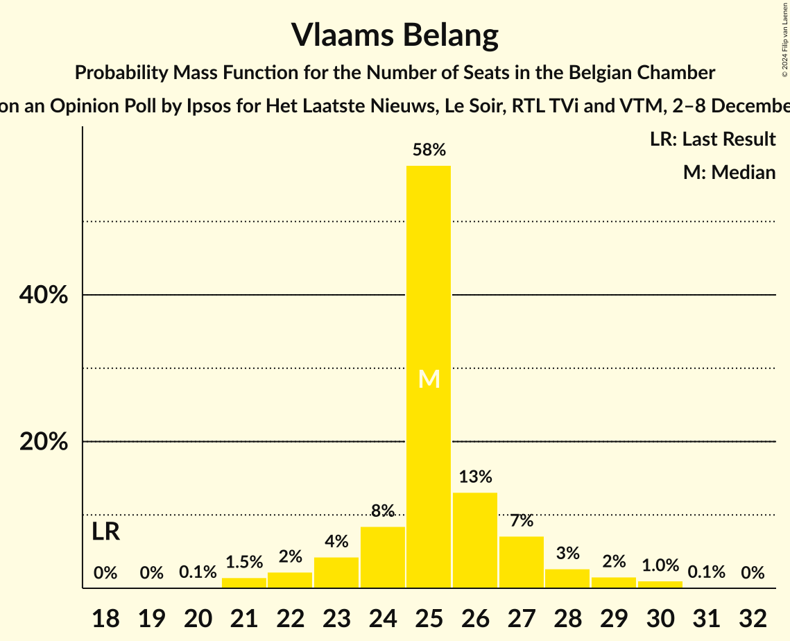

| Number of Seats | Probability | Accumulated | Special Marks |
|:---------------:|:-----------:|:-----------:|:-------------:|
| 18 | 0% | 100% | Last Result |
| 19 | 0% | 100% |  |
| 20 | 0.1% | 100% |  |
| 21 | 1.5% | 99.9% |  |
| 22 | 2% | 98% |  |
| 23 | 4% | 96% |  |
| 24 | 8% | 92% |  |
| 25 | 58% | 83% | Median |
| 26 | 13% | 26% |  |
| 27 | 7% | 13% |  |
| 28 | 3% | 5% |  |
| 29 | 2% | 3% |  |
| 30 | 1.0% | 1.2% |  |
| 31 | 0.1% | 0.1% |  |
| 32 | 0% | 0% |  |

### Nieuw-Vlaamse Alliantie

*For a full overview of the results for this party, see the [Nieuw-Vlaamse Alliantie](party-nieuw-vlaamsealliantie.html) page.*

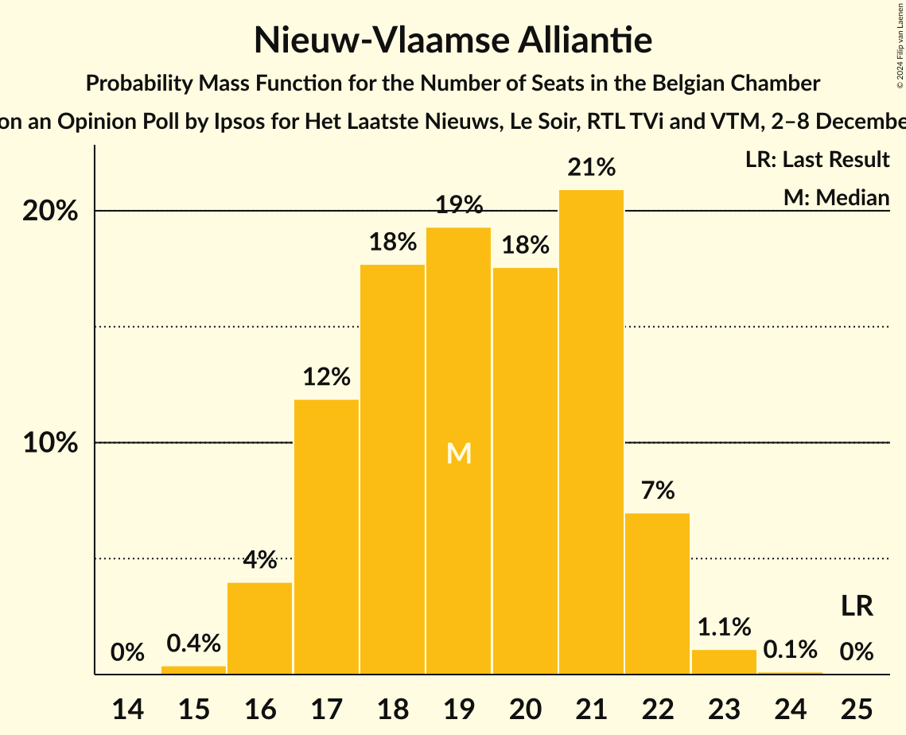

| Number of Seats | Probability | Accumulated | Special Marks |
|:---------------:|:-----------:|:-----------:|:-------------:|
| 15 | 0.4% | 100% |  |
| 16 | 4% | 99.6% |  |
| 17 | 12% | 96% |  |
| 18 | 18% | 84% |  |
| 19 | 19% | 66% | Median |
| 20 | 18% | 47% |  |
| 21 | 21% | 29% |  |
| 22 | 7% | 8% |  |
| 23 | 1.1% | 1.3% |  |
| 24 | 0.1% | 0.2% |  |
| 25 | 0% | 0% | Last Result |

### Parti Socialiste

*For a full overview of the results for this party, see the [Parti Socialiste](party-partisocialiste.html) page.*

| Number of Seats | Probability | Accumulated | Special Marks |
|:---------------:|:-----------:|:-----------:|:-------------:|
| 14 | 0.3% | 100% |  |
| 15 | 5% | 99.6% |  |
| 16 | 17% | 95% |  |
| 17 | 32% | 78% | Median |
| 18 | 36% | 46% |  |
| 19 | 8% | 10% |  |
| 20 | 2% | 2% | Last Result |
| 21 | 0.2% | 0.2% |  |
| 22 | 0% | 0% |  |

### Vooruit

*For a full overview of the results for this party, see the [Vooruit](party-vooruit.html) page.*

| Number of Seats | Probability | Accumulated | Special Marks |
|:---------------:|:-----------:|:-----------:|:-------------:|
| 9 | 1.4% | 100% | Last Result |
| 10 | 4% | 98.5% |  |
| 11 | 41% | 94% |  |
| 12 | 21% | 53% | Median |
| 13 | 20% | 32% |  |
| 14 | 10% | 12% |  |
| 15 | 3% | 3% |  |
| 16 | 0.1% | 0.1% |  |
| 17 | 0% | 0% |  |

### Christen-Democratisch en Vlaams

*For a full overview of the results for this party, see the [Christen-Democratisch en Vlaams](party-christen-democratischenvlaams.html) page.*

| Number of Seats | Probability | Accumulated | Special Marks |
|:---------------:|:-----------:|:-----------:|:-------------:|
| 7 | 0.1% | 100% |  |
| 8 | 0.3% | 99.9% |  |
| 9 | 3% | 99.6% |  |
| 10 | 59% | 96% | Median |
| 11 | 19% | 37% |  |
| 12 | 11% | 18% | Last Result |
| 13 | 4% | 7% |  |
| 14 | 2% | 3% |  |
| 15 | 0.2% | 0.2% |  |
| 16 | 0% | 0% |  |

### Open Vlaamse Liberalen en Democraten

*For a full overview of the results for this party, see the [Open Vlaamse Liberalen en Democraten](party-openvlaamseliberalenendemocraten.html) page.*

| Number of Seats | Probability | Accumulated | Special Marks |
|:---------------:|:-----------:|:-----------:|:-------------:|
| 6 | 0.1% | 100% |  |
| 7 | 0.5% | 99.9% |  |
| 8 | 1.1% | 99.4% |  |
| 9 | 10% | 98% |  |
| 10 | 67% | 88% | Median |
| 11 | 14% | 21% |  |
| 12 | 5% | 7% | Last Result |
| 13 | 2% | 2% |  |
| 14 | 0.5% | 0.6% |  |
| 15 | 0% | 0% |  |

### Mouvement Réformateur

*For a full overview of the results for this party, see the [Mouvement Réformateur](party-mouvementréformateur.html) page.*

| Number of Seats | Probability | Accumulated | Special Marks |
|:---------------:|:-----------:|:-----------:|:-------------:|
| 12 | 5% | 100% |  |
| 13 | 20% | 95% |  |
| 14 | 27% | 75% | Last Result, Median |
| 15 | 19% | 48% |  |
| 16 | 18% | 29% |  |
| 17 | 11% | 11% |  |
| 18 | 0.1% | 0.1% |  |
| 19 | 0% | 0% |  |

### Ecolo

*For a full overview of the results for this party, see the [Ecolo](party-ecolo.html) page.*

| Number of Seats | Probability | Accumulated | Special Marks |
|:---------------:|:-----------:|:-----------:|:-------------:|
| 10 | 1.4% | 100% |  |
| 11 | 12% | 98.5% |  |
| 12 | 26% | 86% |  |
| 13 | 46% | 60% | Last Result, Median |
| 14 | 13% | 14% |  |
| 15 | 1.1% | 1.2% |  |
| 16 | 0.1% | 0.2% |  |
| 17 | 0% | 0% |  |

### Parti du Travail de Belgique

*For a full overview of the results for this party, see the [Parti du Travail de Belgique](party-partidutravaildebelgique.html) page.*

| Number of Seats | Probability | Accumulated | Special Marks |
|:---------------:|:-----------:|:-----------:|:-------------:|
| 9 | 1.1% | 100% | Last Result |
| 10 | 16% | 98.9% |  |
| 11 | 42% | 83% | Median |
| 12 | 33% | 41% |  |
| 13 | 8% | 8% |  |
| 14 | 0.5% | 0.5% |  |
| 15 | 0.1% | 0.1% |  |
| 16 | 0% | 0% |  |

### Groen

*For a full overview of the results for this party, see the [Groen](party-groen.html) page.*

| Number of Seats | Probability | Accumulated | Special Marks |
|:---------------:|:-----------:|:-----------:|:-------------:|
| 3 | 0.9% | 100% |  |
| 4 | 2% | 99.1% |  |
| 5 | 38% | 97% |  |
| 6 | 28% | 59% | Median |
| 7 | 17% | 31% |  |
| 8 | 7% | 14% | Last Result |
| 9 | 7% | 7% |  |
| 10 | 0% | 0% |  |

### Partij van de Arbeid van België

*For a full overview of the results for this party, see the [Partij van de Arbeid van België](party-partijvandearbeidvanbelgië.html) page.*

| Number of Seats | Probability | Accumulated | Special Marks |
|:---------------:|:-----------:|:-----------:|:-------------:|
| 1 | 3% | 100% |  |
| 2 | 1.1% | 97% |  |
| 3 | 15% | 96% | Last Result |
| 4 | 16% | 82% |  |
| 5 | 60% | 65% | Median |
| 6 | 3% | 6% |  |
| 7 | 2% | 3% |  |
| 8 | 1.0% | 1.0% |  |
| 9 | 0% | 0% |  |

### Centre démocrate humaniste

*For a full overview of the results for this party, see the [Centre démocrate humaniste](party-centredémocratehumaniste.html) page.*

| Number of Seats | Probability | Accumulated | Special Marks |
|:---------------:|:-----------:|:-----------:|:-------------:|
| 4 | 59% | 100% | Median |
| 5 | 34% | 41% | Last Result |
| 6 | 6% | 7% |  |
| 7 | 1.3% | 2% |  |
| 8 | 0.3% | 0.4% |  |
| 9 | 0% | 0% |  |

### DéFI

*For a full overview of the results for this party, see the [DéFI](party-défi.html) page.*

| Number of Seats | Probability | Accumulated | Special Marks |
|:---------------:|:-----------:|:-----------:|:-------------:|
| 1 | 8% | 100% |  |
| 2 | 90% | 92% | Last Result, Median |
| 3 | 2% | 2% |  |
| 4 | 0.1% | 0.1% |  |
| 5 | 0% | 0% |  |

## Coalitions

### Confidence Intervals

| Coalition | Last Result | Median | Majority? | 80% Confidence Interval | 90% Confidence Interval | 95% Confidence Interval | 99% Confidence Interval |
|:---------:|:-----------:|:------:|:---------:|:-----------------------:|:-----------------------:|:-----------------------:|:-----------------------:|
| Nieuw-Vlaamse Alliantie – Christen-Democratisch en Vlaams – Open Vlaamse Liberalen en Democraten – Mouvement Réformateur – Centre démocrate humaniste | 68 | 59 | 0% | 56–62 | 55–63 | 55–64 | 54–65 |
| Christen-Democratisch en Vlaams – Open Vlaamse Liberalen en Democraten – Mouvement Réformateur – Ecolo – Groen – Centre démocrate humaniste | 64 | 58 | 0% | 56–61 | 55–62 | 55–63 | 54–64 |
| Parti Socialiste – Christen-Democratisch en Vlaams – Open Vlaamse Liberalen en Democraten – Mouvement Réformateur – Centre démocrate humaniste | 63 | 57 | 0% | 55–60 | 55–60 | 54–61 | 53–62 |
| Nieuw-Vlaamse Alliantie – Christen-Democratisch en Vlaams – Open Vlaamse Liberalen en Democraten – Mouvement Réformateur | 63 | 55 | 0% | 52–58 | 51–58 | 50–59 | 49–61 |
| Nieuw-Vlaamse Alliantie – Parti Socialiste – Vooruit – Open Vlaamse Liberalen en Democraten – Mouvement Réformateur | 80 | 41 | 0% | 38–43 | 38–44 | 37–44 | 36–46 |
| Christen-Democratisch en Vlaams – Open Vlaamse Liberalen en Democraten – Mouvement Réformateur – Centre démocrate humaniste | 43 | 40 | 0% | 37–42 | 37–43 | 36–44 | 35–45 |
| Parti Socialiste – Vooruit – Christen-Democratisch en Vlaams – Open Vlaamse Liberalen en Democraten – Mouvement Réformateur – Ecolo – Groen – Centre démocrate humaniste | 93 | 39 | 0% | 37–41 | 36–42 | 36–42 | 35–44 |
| Parti Socialiste – Vooruit – Christen-Democratisch en Vlaams – Open Vlaamse Liberalen en Democraten – Mouvement Réformateur – Ecolo – Groen | 88 | 39 | 0% | 37–41 | 36–42 | 36–42 | 35–44 |
| Parti Socialiste – Vooruit – Christen-Democratisch en Vlaams – Ecolo – Parti du Travail de Belgique – Groen – Partij van de Arbeid van België – Centre démocrate humaniste | 79 | 33 | 0% | 31–35 | 30–36 | 29–37 | 29–38 |
| Parti Socialiste – Vooruit – Christen-Democratisch en Vlaams – Open Vlaamse Liberalen en Democraten – Mouvement Réformateur – Centre démocrate humaniste | 72 | 33 | 0% | 31–35 | 30–35 | 30–36 | 29–37 |
| Parti Socialiste – Vooruit – Christen-Democratisch en Vlaams – Ecolo – Groen – Centre démocrate humaniste | 67 | 29 | 0% | 27–31 | 26–32 | 26–32 | 25–33 |
| Parti Socialiste – Vooruit – Open Vlaamse Liberalen en Democraten – Mouvement Réformateur – Ecolo – Groen | 76 | 28 | 0% | 26–31 | 26–31 | 25–31 | 24–33 |
| Parti Socialiste – Vooruit – Ecolo – Parti du Travail de Belgique – Groen – Partij van de Arbeid van België – Centre démocrate humaniste | 67 | 22 | 0% | 21–25 | 20–25 | 19–26 | 18–27 |
| Parti Socialiste – Vooruit – Ecolo – Parti du Travail de Belgique – Groen – Partij van de Arbeid van België | 62 | 22 | 0% | 21–25 | 20–25 | 19–26 | 18–27 |
| Parti Socialiste – Vooruit – Christen-Democratisch en Vlaams – Centre démocrate humaniste | 46 | 23 | 0% | 21–24 | 20–25 | 20–25 | 19–27 |
| Parti Socialiste – Vooruit – Open Vlaamse Liberalen en Democraten – Mouvement Réformateur | 55 | 22 | 0% | 20–24 | 20–25 | 20–25 | 19–26 |

### Nieuw-Vlaamse Alliantie – Christen-Democratisch en Vlaams – Open Vlaamse Liberalen en Democraten – Mouvement Réformateur – Centre démocrate humaniste

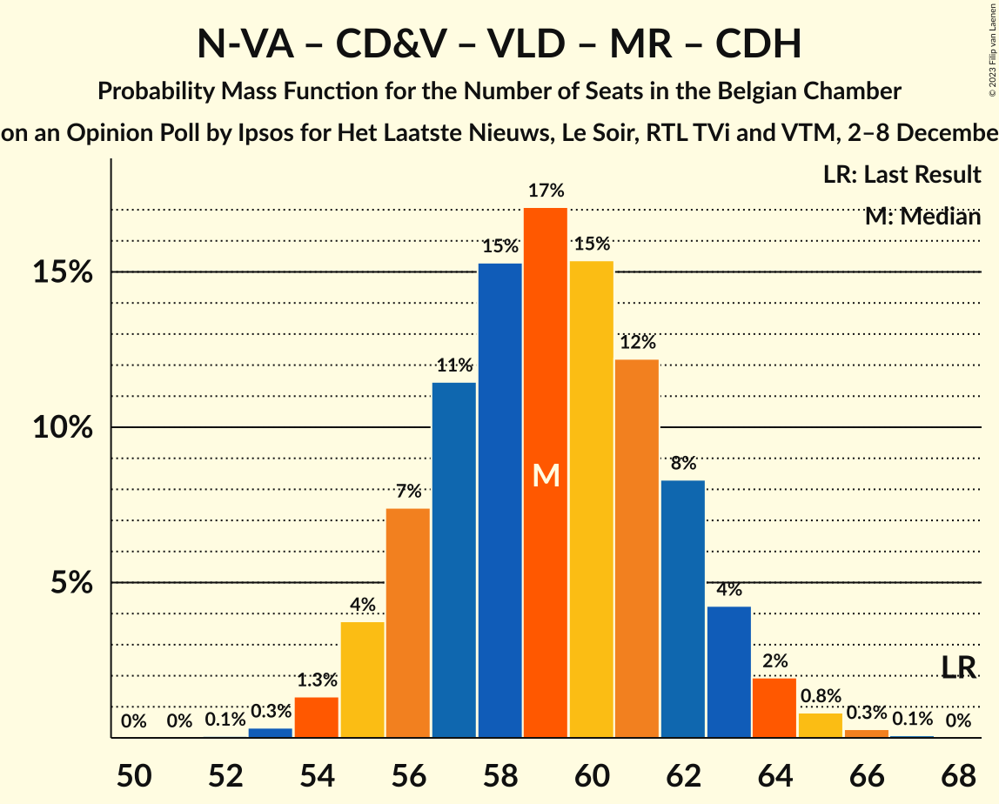

| Number of Seats | Probability | Accumulated | Special Marks |
|:---------------:|:-----------:|:-----------:|:-------------:|
| 52 | 0.1% | 100% |  |
| 53 | 0.3% | 99.9% |  |
| 54 | 1.3% | 99.6% |  |
| 55 | 4% | 98% |  |
| 56 | 7% | 95% |  |
| 57 | 11% | 87% | Median |
| 58 | 15% | 76% |  |
| 59 | 17% | 60% |  |
| 60 | 15% | 43% |  |
| 61 | 12% | 28% |  |
| 62 | 8% | 16% |  |
| 63 | 4% | 7% |  |
| 64 | 2% | 3% |  |
| 65 | 0.8% | 1.2% |  |
| 66 | 0.3% | 0.4% |  |
| 67 | 0.1% | 0.1% |  |
| 68 | 0% | 0% | Last Result |

### Christen-Democratisch en Vlaams – Open Vlaamse Liberalen en Democraten – Mouvement Réformateur – Ecolo – Groen – Centre démocrate humaniste

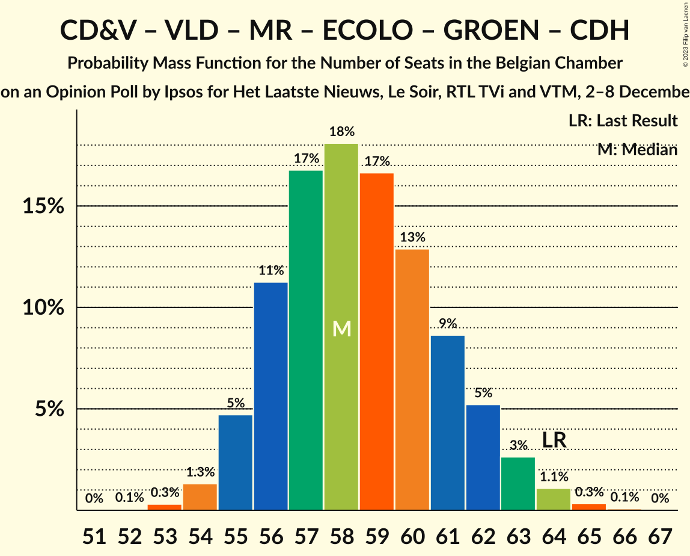

| Number of Seats | Probability | Accumulated | Special Marks |
|:---------------:|:-----------:|:-----------:|:-------------:|
| 52 | 0.1% | 100% |  |
| 53 | 0.3% | 99.9% |  |
| 54 | 1.3% | 99.6% |  |
| 55 | 5% | 98% |  |
| 56 | 11% | 94% |  |
| 57 | 17% | 82% | Median |
| 58 | 18% | 66% |  |
| 59 | 17% | 47% |  |
| 60 | 13% | 31% |  |
| 61 | 9% | 18% |  |
| 62 | 5% | 9% |  |
| 63 | 3% | 4% |  |
| 64 | 1.1% | 2% | Last Result |
| 65 | 0.3% | 0.4% |  |
| 66 | 0.1% | 0.1% |  |
| 67 | 0% | 0% |  |

### Parti Socialiste – Christen-Democratisch en Vlaams – Open Vlaamse Liberalen en Democraten – Mouvement Réformateur – Centre démocrate humaniste

| Number of Seats | Probability | Accumulated | Special Marks |
|:---------------:|:-----------:|:-----------:|:-------------:|
| 51 | 0.1% | 100% |  |
| 52 | 0.2% | 99.9% |  |
| 53 | 0.8% | 99.7% |  |
| 54 | 4% | 98.9% |  |
| 55 | 12% | 95% | Median |
| 56 | 22% | 84% |  |
| 57 | 23% | 62% |  |
| 58 | 18% | 39% |  |
| 59 | 11% | 21% |  |
| 60 | 6% | 10% |  |
| 61 | 3% | 4% |  |
| 62 | 1.1% | 2% |  |
| 63 | 0.3% | 0.4% | Last Result |
| 64 | 0.1% | 0.1% |  |
| 65 | 0% | 0% |  |

### Nieuw-Vlaamse Alliantie – Christen-Democratisch en Vlaams – Open Vlaamse Liberalen en Democraten – Mouvement Réformateur

| Number of Seats | Probability | Accumulated | Special Marks |
|:---------------:|:-----------:|:-----------:|:-------------:|
| 48 | 0.1% | 100% |  |
| 49 | 0.7% | 99.8% |  |
| 50 | 2% | 99.1% |  |
| 51 | 5% | 97% |  |
| 52 | 10% | 91% |  |
| 53 | 14% | 82% | Median |
| 54 | 16% | 68% |  |
| 55 | 17% | 52% |  |
| 56 | 14% | 35% |  |
| 57 | 10% | 21% |  |
| 58 | 6% | 11% |  |
| 59 | 3% | 5% |  |
| 60 | 1.3% | 2% |  |
| 61 | 0.5% | 0.7% |  |
| 62 | 0.2% | 0.2% |  |
| 63 | 0% | 0% | Last Result |

### Nieuw-Vlaamse Alliantie – Parti Socialiste – Vooruit – Open Vlaamse Liberalen en Democraten – Mouvement Réformateur

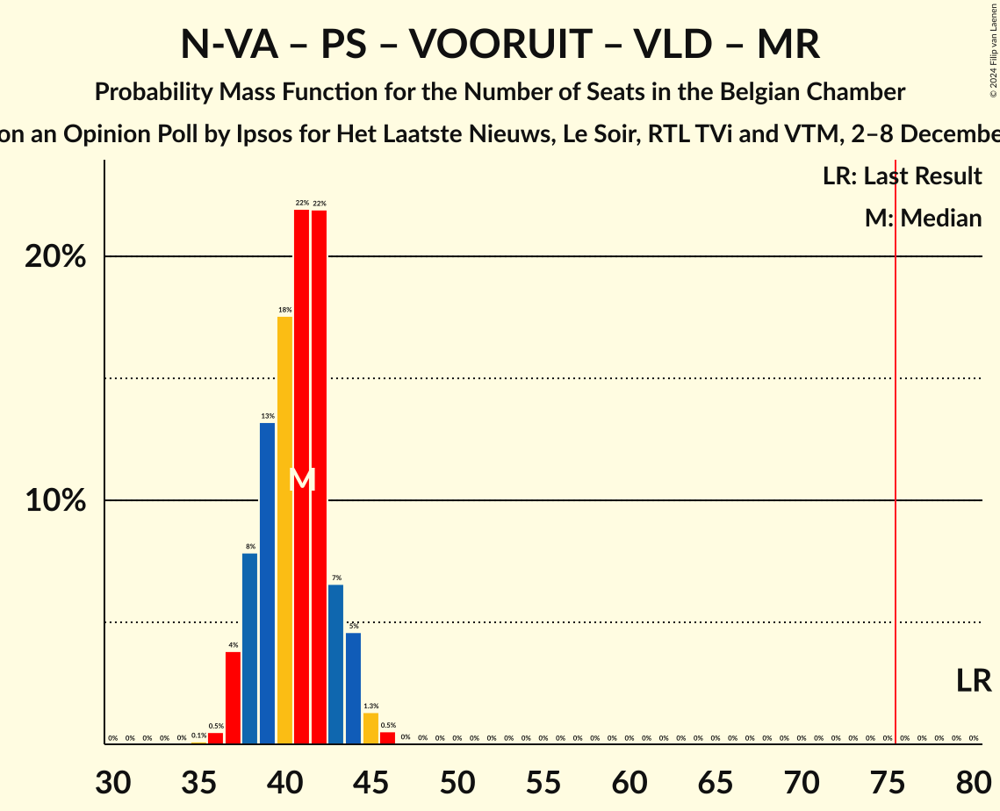

| Number of Seats | Probability | Accumulated | Special Marks |
|:---------------:|:-----------:|:-----------:|:-------------:|
| 35 | 0.1% | 100% |  |
| 36 | 0.5% | 99.9% |  |
| 37 | 4% | 99.4% |  |
| 38 | 8% | 96% |  |
| 39 | 13% | 88% |  |
| 40 | 18% | 74% |  |
| 41 | 22% | 57% |  |
| 42 | 22% | 35% |  |
| 43 | 7% | 13% |  |
| 44 | 5% | 7% |  |
| 45 | 1.3% | 2% |  |
| 46 | 0.5% | 0.6% |  |
| 47 | 0% | 0.1% |  |
| 48 | 0% | 0% |  |
| 49 | 0% | 0% |  |
| 50 | 0% | 0% |  |
| 51 | 0% | 0% |  |
| 52 | 0% | 0% |  |
| 53 | 0% | 0% |  |
| 54 | 0% | 0% |  |
| 55 | 0% | 0% |  |
| 56 | 0% | 0% |  |
| 57 | 0% | 0% |  |
| 58 | 0% | 0% |  |
| 59 | 0% | 0% |  |
| 60 | 0% | 0% |  |
| 61 | 0% | 0% |  |
| 62 | 0% | 0% |  |
| 63 | 0% | 0% |  |
| 64 | 0% | 0% |  |
| 65 | 0% | 0% |  |
| 66 | 0% | 0% |  |
| 67 | 0% | 0% |  |
| 68 | 0% | 0% |  |
| 69 | 0% | 0% |  |
| 70 | 0% | 0% |  |
| 71 | 0% | 0% |  |
| 72 | 0% | 0% | Median |
| 73 | 0% | 0% |  |
| 74 | 0% | 0% |  |
| 75 | 0% | 0% |  |
| 76 | 0% | 0% | Majority |
| 77 | 0% | 0% |  |
| 78 | 0% | 0% |  |
| 79 | 0% | 0% |  |
| 80 | 0% | 0% | Last Result |

### Christen-Democratisch en Vlaams – Open Vlaamse Liberalen en Democraten – Mouvement Réformateur – Centre démocrate humaniste

| Number of Seats | Probability | Accumulated | Special Marks |
|:---------------:|:-----------:|:-----------:|:-------------:|
| 34 | 0.1% | 100% |  |
| 35 | 0.4% | 99.9% |  |
| 36 | 2% | 99.5% |  |
| 37 | 8% | 97% |  |
| 38 | 16% | 89% | Median |
| 39 | 18% | 73% |  |
| 40 | 18% | 55% |  |
| 41 | 17% | 36% |  |
| 42 | 10% | 19% |  |
| 43 | 5% | 9% | Last Result |
| 44 | 3% | 4% |  |
| 45 | 1.1% | 2% |  |
| 46 | 0.3% | 0.4% |  |
| 47 | 0.1% | 0.1% |  |
| 48 | 0% | 0% |  |

### Parti Socialiste – Vooruit – Christen-Democratisch en Vlaams – Open Vlaamse Liberalen en Democraten – Mouvement Réformateur – Ecolo – Groen – Centre démocrate humaniste

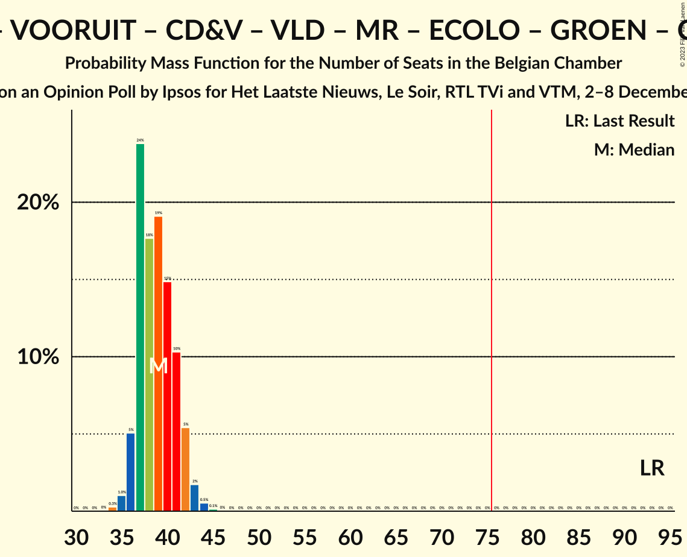

| Number of Seats | Probability | Accumulated | Special Marks |
|:---------------:|:-----------:|:-----------:|:-------------:|
| 34 | 0.3% | 100% |  |
| 35 | 1.0% | 99.7% |  |
| 36 | 5% | 98.7% |  |
| 37 | 24% | 94% |  |
| 38 | 18% | 70% |  |
| 39 | 19% | 52% |  |
| 40 | 15% | 33% |  |
| 41 | 10% | 18% |  |
| 42 | 5% | 8% |  |
| 43 | 2% | 2% |  |
| 44 | 0.5% | 0.7% |  |
| 45 | 0.1% | 0.2% |  |
| 46 | 0% | 0% |  |
| 47 | 0% | 0% |  |
| 48 | 0% | 0% |  |
| 49 | 0% | 0% |  |
| 50 | 0% | 0% |  |
| 51 | 0% | 0% |  |
| 52 | 0% | 0% |  |
| 53 | 0% | 0% |  |
| 54 | 0% | 0% |  |
| 55 | 0% | 0% |  |
| 56 | 0% | 0% |  |
| 57 | 0% | 0% |  |
| 58 | 0% | 0% |  |
| 59 | 0% | 0% |  |
| 60 | 0% | 0% |  |
| 61 | 0% | 0% |  |
| 62 | 0% | 0% |  |
| 63 | 0% | 0% |  |
| 64 | 0% | 0% |  |
| 65 | 0% | 0% |  |
| 66 | 0% | 0% |  |
| 67 | 0% | 0% |  |
| 68 | 0% | 0% |  |
| 69 | 0% | 0% |  |
| 70 | 0% | 0% |  |
| 71 | 0% | 0% |  |
| 72 | 0% | 0% |  |
| 73 | 0% | 0% |  |
| 74 | 0% | 0% |  |
| 75 | 0% | 0% |  |
| 76 | 0% | 0% | Majority |
| 77 | 0% | 0% |  |
| 78 | 0% | 0% |  |
| 79 | 0% | 0% |  |
| 80 | 0% | 0% |  |
| 81 | 0% | 0% |  |
| 82 | 0% | 0% |  |
| 83 | 0% | 0% |  |
| 84 | 0% | 0% |  |
| 85 | 0% | 0% |  |
| 86 | 0% | 0% | Median |
| 87 | 0% | 0% |  |
| 88 | 0% | 0% |  |
| 89 | 0% | 0% |  |
| 90 | 0% | 0% |  |
| 91 | 0% | 0% |  |
| 92 | 0% | 0% |  |
| 93 | 0% | 0% | Last Result |

### Parti Socialiste – Vooruit – Christen-Democratisch en Vlaams – Open Vlaamse Liberalen en Democraten – Mouvement Réformateur – Ecolo – Groen

| Number of Seats | Probability | Accumulated | Special Marks |
|:---------------:|:-----------:|:-----------:|:-------------:|
| 34 | 0.3% | 100% |  |
| 35 | 1.0% | 99.7% |  |
| 36 | 5% | 98.7% |  |
| 37 | 24% | 94% |  |
| 38 | 18% | 70% |  |
| 39 | 19% | 52% |  |
| 40 | 15% | 33% |  |
| 41 | 10% | 18% |  |
| 42 | 5% | 8% |  |
| 43 | 2% | 2% |  |
| 44 | 0.5% | 0.7% |  |
| 45 | 0.1% | 0.2% |  |
| 46 | 0% | 0% |  |
| 47 | 0% | 0% |  |
| 48 | 0% | 0% |  |
| 49 | 0% | 0% |  |
| 50 | 0% | 0% |  |
| 51 | 0% | 0% |  |
| 52 | 0% | 0% |  |
| 53 | 0% | 0% |  |
| 54 | 0% | 0% |  |
| 55 | 0% | 0% |  |
| 56 | 0% | 0% |  |
| 57 | 0% | 0% |  |
| 58 | 0% | 0% |  |
| 59 | 0% | 0% |  |
| 60 | 0% | 0% |  |
| 61 | 0% | 0% |  |
| 62 | 0% | 0% |  |
| 63 | 0% | 0% |  |
| 64 | 0% | 0% |  |
| 65 | 0% | 0% |  |
| 66 | 0% | 0% |  |
| 67 | 0% | 0% |  |
| 68 | 0% | 0% |  |
| 69 | 0% | 0% |  |
| 70 | 0% | 0% |  |
| 71 | 0% | 0% |  |
| 72 | 0% | 0% |  |
| 73 | 0% | 0% |  |
| 74 | 0% | 0% |  |
| 75 | 0% | 0% |  |
| 76 | 0% | 0% | Majority |
| 77 | 0% | 0% |  |
| 78 | 0% | 0% |  |
| 79 | 0% | 0% |  |
| 80 | 0% | 0% |  |
| 81 | 0% | 0% |  |
| 82 | 0% | 0% | Median |
| 83 | 0% | 0% |  |
| 84 | 0% | 0% |  |
| 85 | 0% | 0% |  |
| 86 | 0% | 0% |  |
| 87 | 0% | 0% |  |
| 88 | 0% | 0% | Last Result |

### Parti Socialiste – Vooruit – Christen-Democratisch en Vlaams – Ecolo – Parti du Travail de Belgique – Groen – Partij van de Arbeid van België – Centre démocrate humaniste

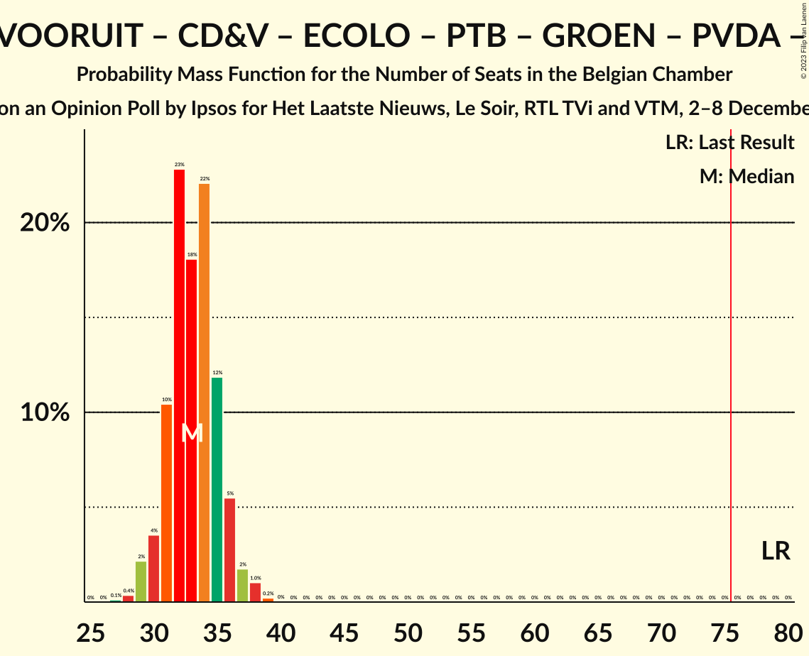

| Number of Seats | Probability | Accumulated | Special Marks |
|:---------------:|:-----------:|:-----------:|:-------------:|
| 27 | 0.1% | 100% |  |
| 28 | 0.4% | 99.9% |  |
| 29 | 2% | 99.5% |  |
| 30 | 4% | 97% |  |
| 31 | 10% | 94% |  |
| 32 | 23% | 83% |  |
| 33 | 18% | 61% |  |
| 34 | 22% | 42% |  |
| 35 | 12% | 20% |  |
| 36 | 5% | 9% |  |
| 37 | 2% | 3% |  |
| 38 | 1.0% | 1.3% |  |
| 39 | 0.2% | 0.3% |  |
| 40 | 0% | 0% |  |
| 41 | 0% | 0% |  |
| 42 | 0% | 0% |  |
| 43 | 0% | 0% |  |
| 44 | 0% | 0% |  |
| 45 | 0% | 0% |  |
| 46 | 0% | 0% |  |
| 47 | 0% | 0% |  |
| 48 | 0% | 0% |  |
| 49 | 0% | 0% |  |
| 50 | 0% | 0% |  |
| 51 | 0% | 0% |  |
| 52 | 0% | 0% |  |
| 53 | 0% | 0% |  |
| 54 | 0% | 0% |  |
| 55 | 0% | 0% |  |
| 56 | 0% | 0% |  |
| 57 | 0% | 0% |  |
| 58 | 0% | 0% |  |
| 59 | 0% | 0% |  |
| 60 | 0% | 0% |  |
| 61 | 0% | 0% |  |
| 62 | 0% | 0% |  |
| 63 | 0% | 0% |  |
| 64 | 0% | 0% |  |
| 65 | 0% | 0% |  |
| 66 | 0% | 0% |  |
| 67 | 0% | 0% |  |
| 68 | 0% | 0% |  |
| 69 | 0% | 0% |  |
| 70 | 0% | 0% |  |
| 71 | 0% | 0% |  |
| 72 | 0% | 0% |  |
| 73 | 0% | 0% |  |
| 74 | 0% | 0% |  |
| 75 | 0% | 0% |  |
| 76 | 0% | 0% | Majority |
| 77 | 0% | 0% |  |
| 78 | 0% | 0% | Median |
| 79 | 0% | 0% | Last Result |

### Parti Socialiste – Vooruit – Christen-Democratisch en Vlaams – Open Vlaamse Liberalen en Democraten – Mouvement Réformateur – Centre démocrate humaniste

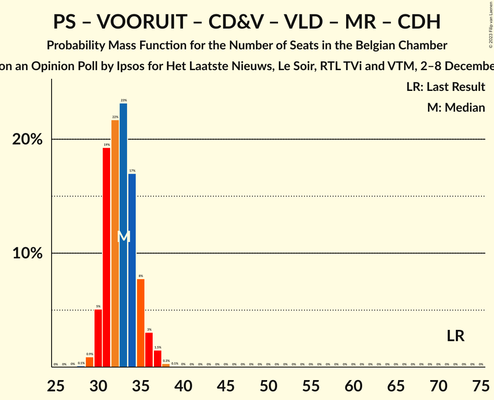

| Number of Seats | Probability | Accumulated | Special Marks |
|:---------------:|:-----------:|:-----------:|:-------------:|
| 28 | 0.1% | 100% |  |
| 29 | 0.9% | 99.9% |  |
| 30 | 5% | 99.0% |  |
| 31 | 19% | 94% |  |
| 32 | 22% | 75% |  |
| 33 | 23% | 53% |  |
| 34 | 17% | 30% |  |
| 35 | 8% | 13% |  |
| 36 | 3% | 5% |  |
| 37 | 1.5% | 2% |  |
| 38 | 0.3% | 0.4% |  |
| 39 | 0.1% | 0.1% |  |
| 40 | 0% | 0% |  |
| 41 | 0% | 0% |  |
| 42 | 0% | 0% |  |
| 43 | 0% | 0% |  |
| 44 | 0% | 0% |  |
| 45 | 0% | 0% |  |
| 46 | 0% | 0% |  |
| 47 | 0% | 0% |  |
| 48 | 0% | 0% |  |
| 49 | 0% | 0% |  |
| 50 | 0% | 0% |  |
| 51 | 0% | 0% |  |
| 52 | 0% | 0% |  |
| 53 | 0% | 0% |  |
| 54 | 0% | 0% |  |
| 55 | 0% | 0% |  |
| 56 | 0% | 0% |  |
| 57 | 0% | 0% |  |
| 58 | 0% | 0% |  |
| 59 | 0% | 0% |  |
| 60 | 0% | 0% |  |
| 61 | 0% | 0% |  |
| 62 | 0% | 0% |  |
| 63 | 0% | 0% |  |
| 64 | 0% | 0% |  |
| 65 | 0% | 0% |  |
| 66 | 0% | 0% |  |
| 67 | 0% | 0% | Median |
| 68 | 0% | 0% |  |
| 69 | 0% | 0% |  |
| 70 | 0% | 0% |  |
| 71 | 0% | 0% |  |
| 72 | 0% | 0% | Last Result |

### Parti Socialiste – Vooruit – Christen-Democratisch en Vlaams – Ecolo – Groen – Centre démocrate humaniste

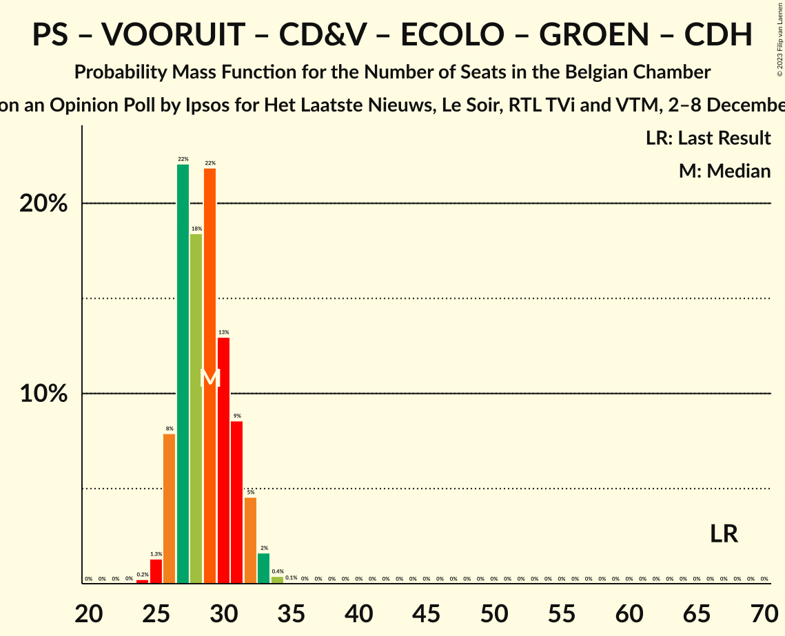

| Number of Seats | Probability | Accumulated | Special Marks |
|:---------------:|:-----------:|:-----------:|:-------------:|
| 24 | 0.2% | 100% |  |
| 25 | 1.3% | 99.7% |  |
| 26 | 8% | 98% |  |
| 27 | 22% | 91% |  |
| 28 | 18% | 68% |  |
| 29 | 22% | 50% |  |
| 30 | 13% | 28% |  |
| 31 | 9% | 15% |  |
| 32 | 5% | 7% |  |
| 33 | 2% | 2% |  |
| 34 | 0.4% | 0.5% |  |
| 35 | 0.1% | 0.1% |  |
| 36 | 0% | 0% |  |
| 37 | 0% | 0% |  |
| 38 | 0% | 0% |  |
| 39 | 0% | 0% |  |
| 40 | 0% | 0% |  |
| 41 | 0% | 0% |  |
| 42 | 0% | 0% |  |
| 43 | 0% | 0% |  |
| 44 | 0% | 0% |  |
| 45 | 0% | 0% |  |
| 46 | 0% | 0% |  |
| 47 | 0% | 0% |  |
| 48 | 0% | 0% |  |
| 49 | 0% | 0% |  |
| 50 | 0% | 0% |  |
| 51 | 0% | 0% |  |
| 52 | 0% | 0% |  |
| 53 | 0% | 0% |  |
| 54 | 0% | 0% |  |
| 55 | 0% | 0% |  |
| 56 | 0% | 0% |  |
| 57 | 0% | 0% |  |
| 58 | 0% | 0% |  |
| 59 | 0% | 0% |  |
| 60 | 0% | 0% |  |
| 61 | 0% | 0% |  |
| 62 | 0% | 0% | Median |
| 63 | 0% | 0% |  |
| 64 | 0% | 0% |  |
| 65 | 0% | 0% |  |
| 66 | 0% | 0% |  |
| 67 | 0% | 0% | Last Result |

### Parti Socialiste – Vooruit – Open Vlaamse Liberalen en Democraten – Mouvement Réformateur – Ecolo – Groen

| Number of Seats | Probability | Accumulated | Special Marks |
|:---------------:|:-----------:|:-----------:|:-------------:|
| 23 | 0.1% | 100% |  |
| 24 | 0.7% | 99.9% |  |
| 25 | 3% | 99.2% |  |
| 26 | 10% | 96% |  |
| 27 | 29% | 87% |  |
| 28 | 19% | 58% |  |
| 29 | 16% | 39% |  |
| 30 | 12% | 23% |  |
| 31 | 8% | 11% |  |
| 32 | 2% | 2% |  |
| 33 | 0.5% | 0.7% |  |
| 34 | 0.2% | 0.3% |  |
| 35 | 0.1% | 0.1% |  |
| 36 | 0% | 0% |  |
| 37 | 0% | 0% |  |
| 38 | 0% | 0% |  |
| 39 | 0% | 0% |  |
| 40 | 0% | 0% |  |
| 41 | 0% | 0% |  |
| 42 | 0% | 0% |  |
| 43 | 0% | 0% |  |
| 44 | 0% | 0% |  |
| 45 | 0% | 0% |  |
| 46 | 0% | 0% |  |
| 47 | 0% | 0% |  |
| 48 | 0% | 0% |  |
| 49 | 0% | 0% |  |
| 50 | 0% | 0% |  |
| 51 | 0% | 0% |  |
| 52 | 0% | 0% |  |
| 53 | 0% | 0% |  |
| 54 | 0% | 0% |  |
| 55 | 0% | 0% |  |
| 56 | 0% | 0% |  |
| 57 | 0% | 0% |  |
| 58 | 0% | 0% |  |
| 59 | 0% | 0% |  |
| 60 | 0% | 0% |  |
| 61 | 0% | 0% |  |
| 62 | 0% | 0% |  |
| 63 | 0% | 0% |  |
| 64 | 0% | 0% |  |
| 65 | 0% | 0% |  |
| 66 | 0% | 0% |  |
| 67 | 0% | 0% |  |
| 68 | 0% | 0% |  |
| 69 | 0% | 0% |  |
| 70 | 0% | 0% |  |
| 71 | 0% | 0% |  |
| 72 | 0% | 0% | Median |
| 73 | 0% | 0% |  |
| 74 | 0% | 0% |  |
| 75 | 0% | 0% |  |
| 76 | 0% | 0% | Last Result, Majority |

### Parti Socialiste – Vooruit – Ecolo – Parti du Travail de Belgique – Groen – Partij van de Arbeid van België – Centre démocrate humaniste

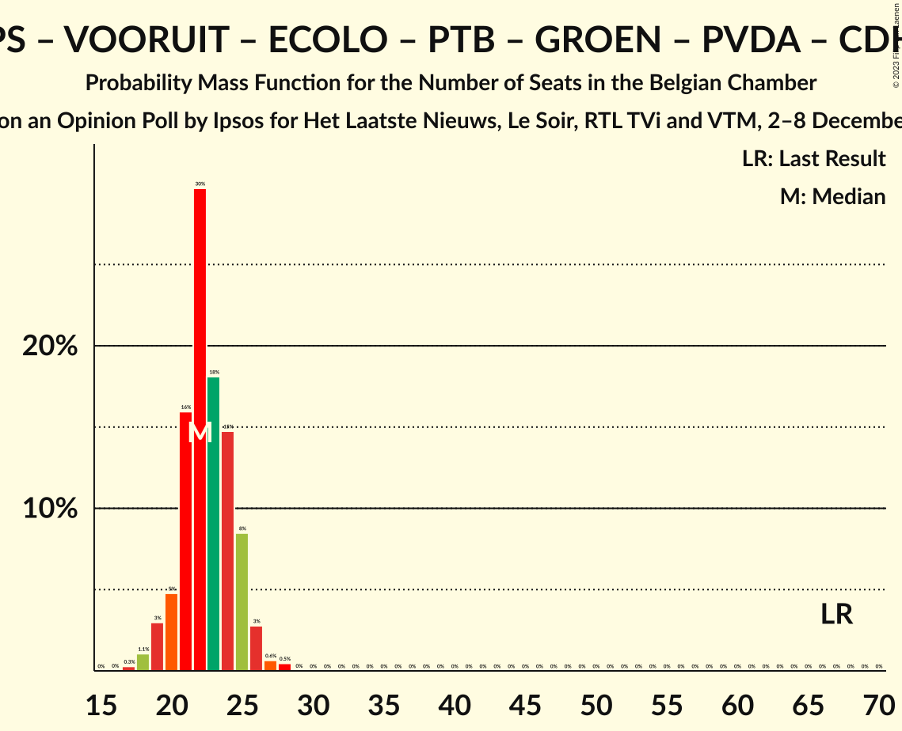

| Number of Seats | Probability | Accumulated | Special Marks |
|:---------------:|:-----------:|:-----------:|:-------------:|
| 17 | 0.3% | 100% |  |
| 18 | 1.1% | 99.7% |  |
| 19 | 3% | 98.6% |  |
| 20 | 5% | 96% |  |
| 21 | 16% | 91% |  |
| 22 | 30% | 75% |  |
| 23 | 18% | 45% |  |
| 24 | 15% | 27% |  |
| 25 | 8% | 12% |  |
| 26 | 3% | 4% |  |
| 27 | 0.6% | 1.1% |  |
| 28 | 0.5% | 0.5% |  |
| 29 | 0% | 0% |  |
| 30 | 0% | 0% |  |
| 31 | 0% | 0% |  |
| 32 | 0% | 0% |  |
| 33 | 0% | 0% |  |
| 34 | 0% | 0% |  |
| 35 | 0% | 0% |  |
| 36 | 0% | 0% |  |
| 37 | 0% | 0% |  |
| 38 | 0% | 0% |  |
| 39 | 0% | 0% |  |
| 40 | 0% | 0% |  |
| 41 | 0% | 0% |  |
| 42 | 0% | 0% |  |
| 43 | 0% | 0% |  |
| 44 | 0% | 0% |  |
| 45 | 0% | 0% |  |
| 46 | 0% | 0% |  |
| 47 | 0% | 0% |  |
| 48 | 0% | 0% |  |
| 49 | 0% | 0% |  |
| 50 | 0% | 0% |  |
| 51 | 0% | 0% |  |
| 52 | 0% | 0% |  |
| 53 | 0% | 0% |  |
| 54 | 0% | 0% |  |
| 55 | 0% | 0% |  |
| 56 | 0% | 0% |  |
| 57 | 0% | 0% |  |
| 58 | 0% | 0% |  |
| 59 | 0% | 0% |  |
| 60 | 0% | 0% |  |
| 61 | 0% | 0% |  |
| 62 | 0% | 0% |  |
| 63 | 0% | 0% |  |
| 64 | 0% | 0% |  |
| 65 | 0% | 0% |  |
| 66 | 0% | 0% |  |
| 67 | 0% | 0% | Last Result |

### Parti Socialiste – Vooruit – Ecolo – Parti du Travail de Belgique – Groen – Partij van de Arbeid van België

| Number of Seats | Probability | Accumulated | Special Marks |
|:---------------:|:-----------:|:-----------:|:-------------:|
| 17 | 0.3% | 100% |  |
| 18 | 1.1% | 99.7% |  |
| 19 | 3% | 98.6% |  |
| 20 | 5% | 96% |  |
| 21 | 16% | 91% |  |
| 22 | 30% | 75% |  |
| 23 | 18% | 45% |  |
| 24 | 15% | 27% |  |
| 25 | 8% | 12% |  |
| 26 | 3% | 4% |  |
| 27 | 0.6% | 1.1% |  |
| 28 | 0.5% | 0.5% |  |
| 29 | 0% | 0% |  |
| 30 | 0% | 0% |  |
| 31 | 0% | 0% |  |
| 32 | 0% | 0% |  |
| 33 | 0% | 0% |  |
| 34 | 0% | 0% |  |
| 35 | 0% | 0% |  |
| 36 | 0% | 0% |  |
| 37 | 0% | 0% |  |
| 38 | 0% | 0% |  |
| 39 | 0% | 0% |  |
| 40 | 0% | 0% |  |
| 41 | 0% | 0% |  |
| 42 | 0% | 0% |  |
| 43 | 0% | 0% |  |
| 44 | 0% | 0% |  |
| 45 | 0% | 0% |  |
| 46 | 0% | 0% |  |
| 47 | 0% | 0% |  |
| 48 | 0% | 0% |  |
| 49 | 0% | 0% |  |
| 50 | 0% | 0% |  |
| 51 | 0% | 0% |  |
| 52 | 0% | 0% |  |
| 53 | 0% | 0% |  |
| 54 | 0% | 0% |  |
| 55 | 0% | 0% |  |
| 56 | 0% | 0% |  |
| 57 | 0% | 0% |  |
| 58 | 0% | 0% |  |
| 59 | 0% | 0% |  |
| 60 | 0% | 0% |  |
| 61 | 0% | 0% |  |
| 62 | 0% | 0% | Last Result |

### Parti Socialiste – Vooruit – Christen-Democratisch en Vlaams – Centre démocrate humaniste

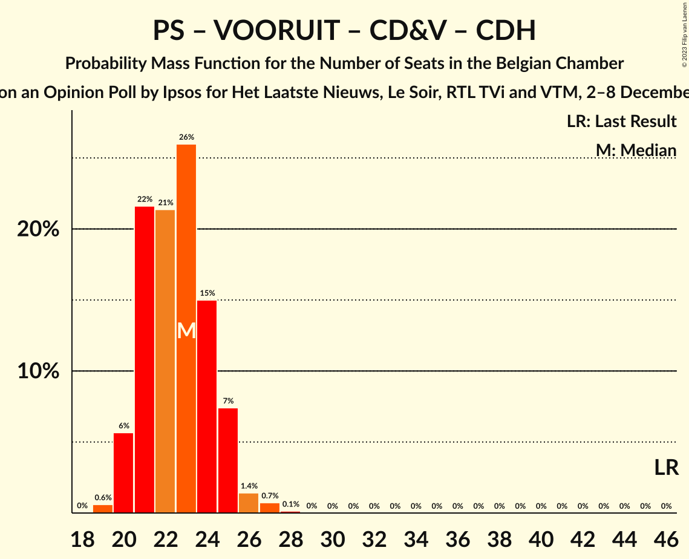

| Number of Seats | Probability | Accumulated | Special Marks |
|:---------------:|:-----------:|:-----------:|:-------------:|
| 19 | 0.6% | 100% |  |
| 20 | 6% | 99.4% |  |
| 21 | 22% | 94% |  |
| 22 | 21% | 72% |  |
| 23 | 26% | 51% |  |
| 24 | 15% | 25% |  |
| 25 | 7% | 10% |  |
| 26 | 1.4% | 2% |  |
| 27 | 0.7% | 0.9% |  |
| 28 | 0.1% | 0.2% |  |
| 29 | 0% | 0% |  |
| 30 | 0% | 0% |  |
| 31 | 0% | 0% |  |
| 32 | 0% | 0% |  |
| 33 | 0% | 0% |  |
| 34 | 0% | 0% |  |
| 35 | 0% | 0% |  |
| 36 | 0% | 0% |  |
| 37 | 0% | 0% |  |
| 38 | 0% | 0% |  |
| 39 | 0% | 0% |  |
| 40 | 0% | 0% |  |
| 41 | 0% | 0% |  |
| 42 | 0% | 0% |  |
| 43 | 0% | 0% | Median |
| 44 | 0% | 0% |  |
| 45 | 0% | 0% |  |
| 46 | 0% | 0% | Last Result |

### Parti Socialiste – Vooruit – Open Vlaamse Liberalen en Democraten – Mouvement Réformateur

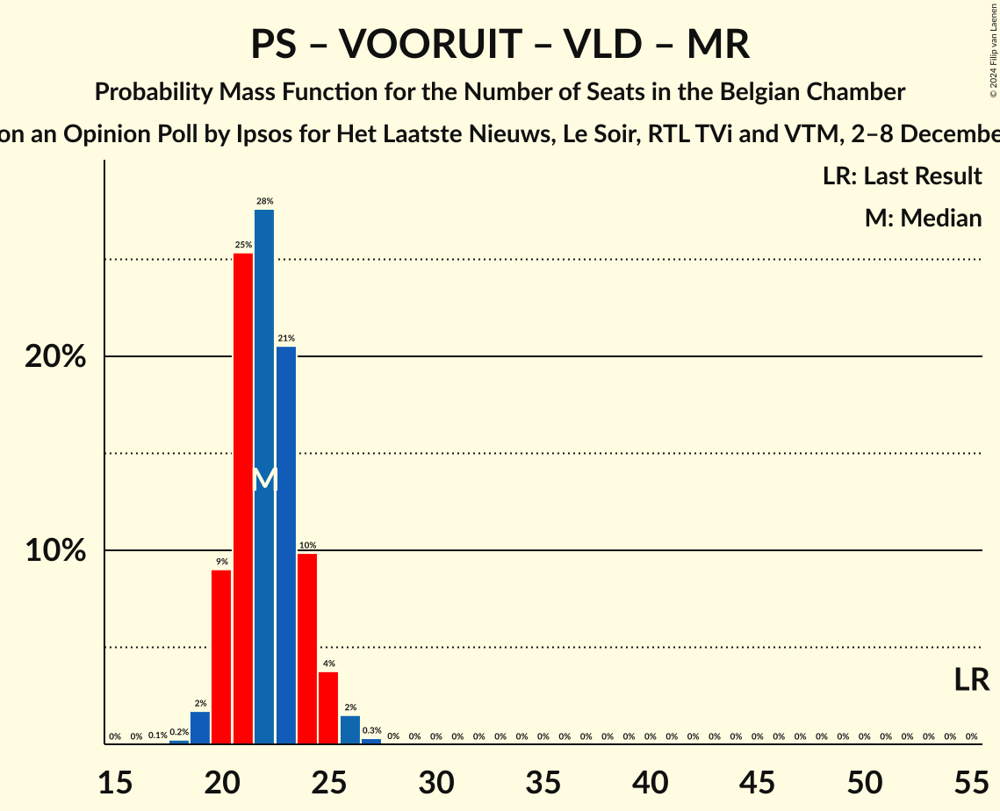

| Number of Seats | Probability | Accumulated | Special Marks |
|:---------------:|:-----------:|:-----------:|:-------------:|
| 17 | 0.1% | 100% |  |
| 18 | 0.2% | 99.9% |  |
| 19 | 2% | 99.7% |  |
| 20 | 9% | 98% |  |
| 21 | 25% | 89% |  |
| 22 | 28% | 64% |  |
| 23 | 21% | 36% |  |
| 24 | 10% | 15% |  |
| 25 | 4% | 6% |  |
| 26 | 2% | 2% |  |
| 27 | 0.3% | 0.3% |  |
| 28 | 0% | 0% |  |
| 29 | 0% | 0% |  |
| 30 | 0% | 0% |  |
| 31 | 0% | 0% |  |
| 32 | 0% | 0% |  |
| 33 | 0% | 0% |  |
| 34 | 0% | 0% |  |
| 35 | 0% | 0% |  |
| 36 | 0% | 0% |  |
| 37 | 0% | 0% |  |
| 38 | 0% | 0% |  |
| 39 | 0% | 0% |  |
| 40 | 0% | 0% |  |
| 41 | 0% | 0% |  |
| 42 | 0% | 0% |  |
| 43 | 0% | 0% |  |
| 44 | 0% | 0% |  |
| 45 | 0% | 0% |  |
| 46 | 0% | 0% |  |
| 47 | 0% | 0% |  |
| 48 | 0% | 0% |  |
| 49 | 0% | 0% |  |
| 50 | 0% | 0% |  |
| 51 | 0% | 0% |  |
| 52 | 0% | 0% |  |
| 53 | 0% | 0% | Median |
| 54 | 0% | 0% |  |
| 55 | 0% | 0% | Last Result |

## Technical Information

### Opinion Poll

+ **Polling firm:** Ipsos
+ **Commissioner(s):** Het Laatste Nieuws, Le Soir, RTL TVi and VTM
+ **Fieldwork period:** 2–8 December 2020

### Calculations

+ **Sample size:** 1628
+ **Simulations done:** 1,048,576
+ **Error estimate:** 1.37%

