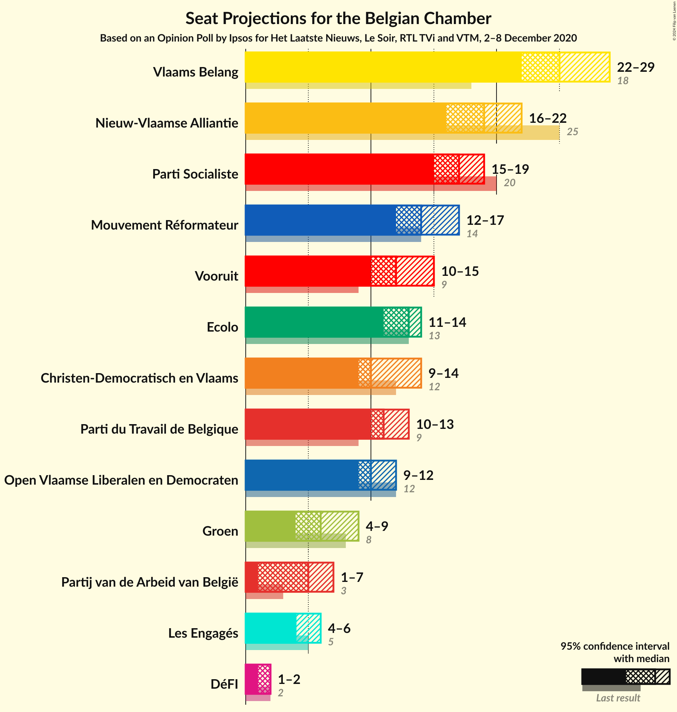
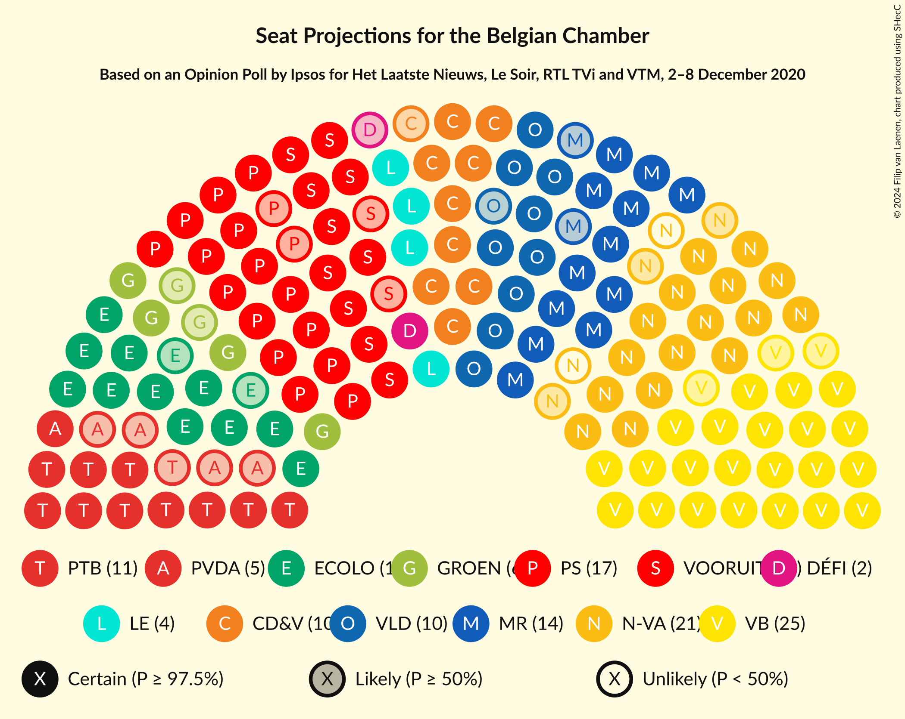
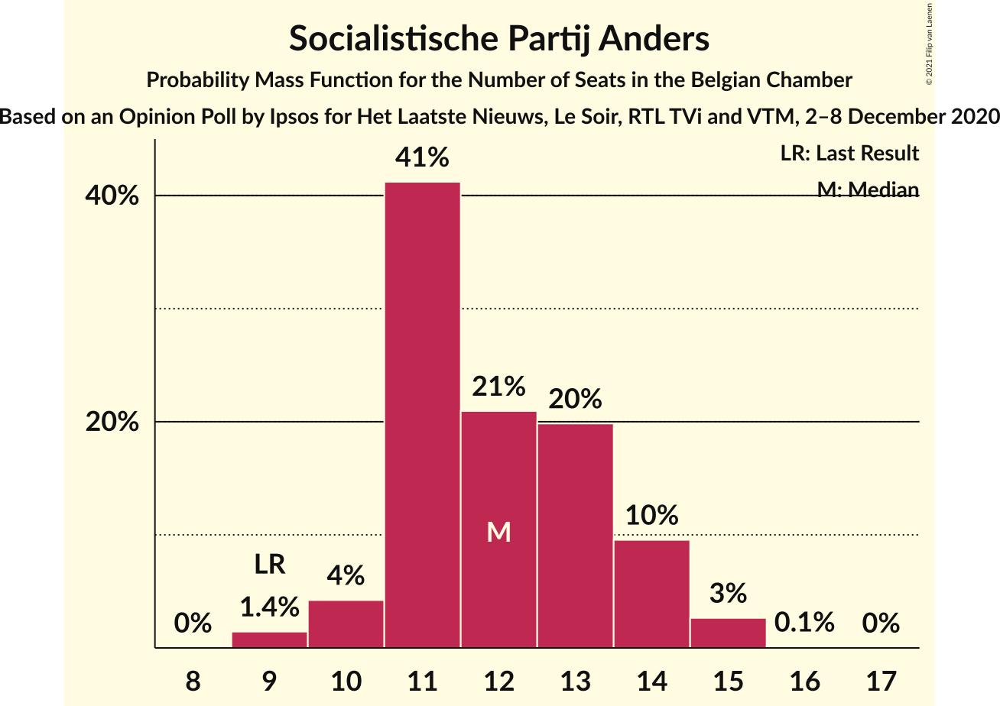
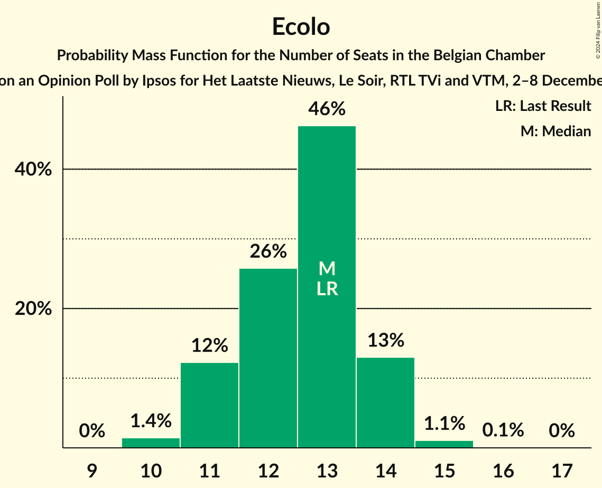
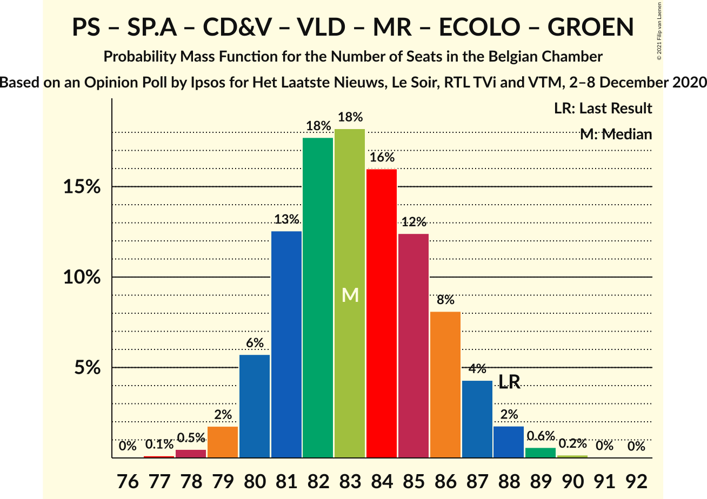
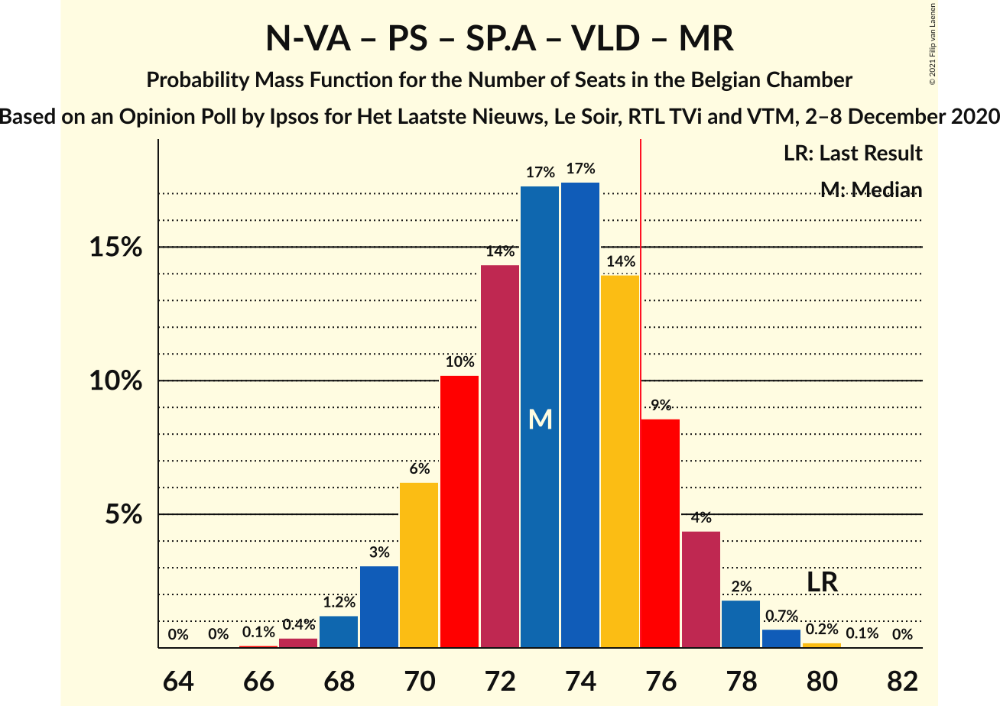
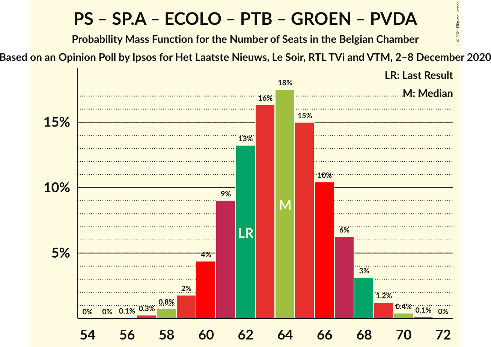
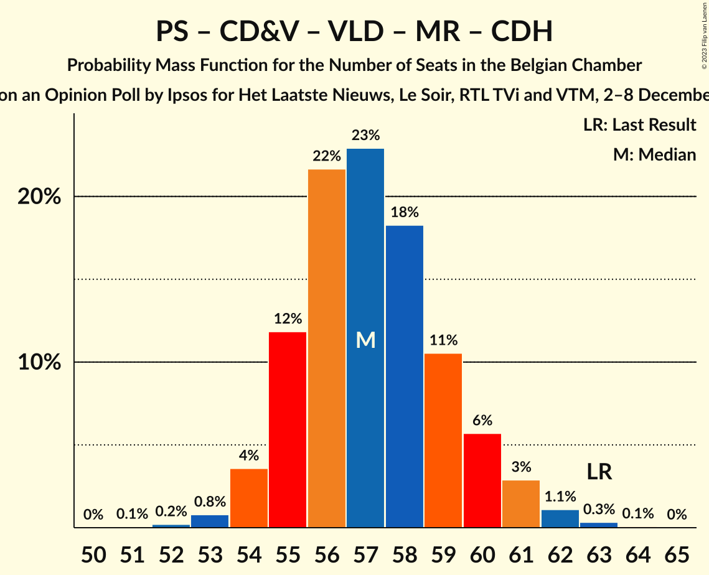
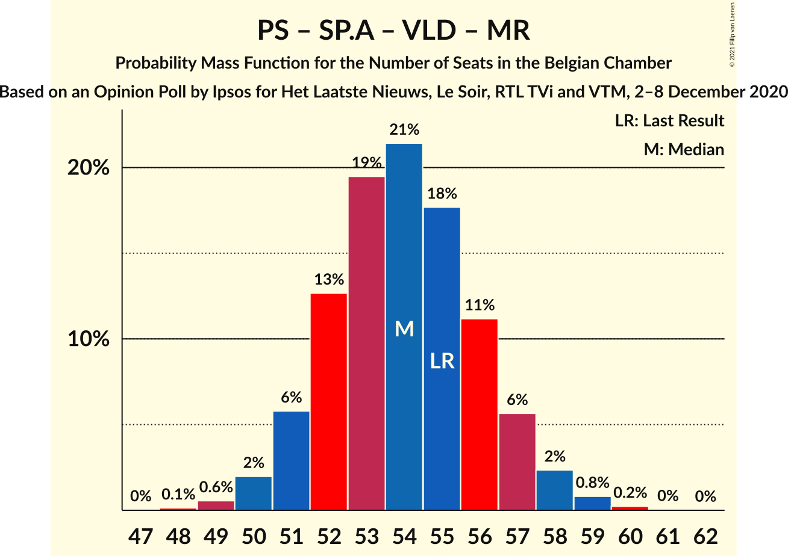
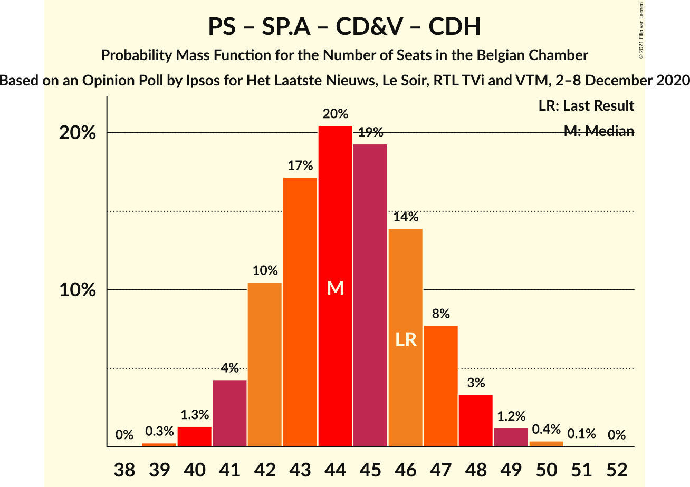

# Opinion Poll by Ipsos for Het Laatste Nieuws, Le Soir, RTL TVi and VTM, 2–8 December 2020

Areas included: Brussels, Flanders, Wallonia

<a href="#voting-intentions">Voting Intentions</a> | <a href="#seats">Seats</a> | <a href="#coalitions">Coalitions</a> | <a href="#technical-information">Technical Information</a>

## Voting Intentions

### Confidence Intervals

| Party | Last Result | Poll Result | 80% Confidence Interval | 90% Confidence Interval | 95% Confidence Interval | 99% Confidence Interval |
|:-----:|:-----------:|:-----------:|:-----------------------:|:-----------------------:|:-----------------------:|:-----------------------:|
| Vlaams Belang | 12.0% | 16.6% | 14.7–15.6% |14.5–15.6% |14.3–15.6% |13.9–15.6% |
| Nieuw-Vlaamse Alliantie | 16.0% | 12.7% | 11.0–11.8% |10.8–11.8% |10.7–11.8% |10.3–11.8% |
| Parti Socialiste | 9.5% | 8.5% | 7.5–7.9% |7.4–7.9% |7.3–7.9% |7.1–7.9% |
| Socialistische Partij Anders | 6.7% | 8.4% | 7.6–9.0% |7.4–9.2% |7.2–9.2% |6.8–9.3% |
| Christen-Democratisch en Vlaams | 8.9% | 7.7% | 6.4–7.0% |6.2–7.0% |6.1–7.0% |5.8–7.0% |
| Open Vlaamse Liberalen en Democraten | 8.5% | 7.6% | 6.3–6.9% |6.1–6.9% |6.0–6.9% |5.7–6.9% |
| Mouvement Réformateur | 7.6% | 7.4% | 6.5–6.8% |6.4–6.9% |6.3–6.9% |6.1–6.9% |
| Ecolo | 6.1% | 6.4% | 5.6–5.9% |5.5–6.0% |5.4–6.0% |5.3–6.0% |
| Parti du Travail de Belgique | 4.8% | 6.4% | 5.5–5.9% |5.5–5.9% |5.4–5.9% |5.2–5.9% |
| Groen | 6.1% | 5.0% | 4.4–5.5% |4.2–5.6% |4.1–5.7% |3.8–5.7% |
| Partij van de Arbeid van België | 3.3% | 4.1% | 3.5–4.5% |3.3–4.6% |3.2–4.7% |2.9–4.7% |
| Centre démocrate humaniste | 3.7% | 3.5% | 2.9–3.1% |2.8–3.1% |2.7–3.1% |2.6–3.1% |
| DéFI | 2.2% | 2.0% | 1.6–1.7% |1.5–1.7% |1.5–1.7% |1.4–1.7% |

*Note:* The poll result column reflects the actual value used in the calculations. Published results may vary slightly, and in addition be rounded to fewer digits.

## Seats

### Confidence Intervals

| Party | Last Result | Median | 80% Confidence Interval | 90% Confidence Interval | 95% Confidence Interval | 99% Confidence Interval |
|:-----:|:-----------:|:------:|:-----------------------:|:-----------------------:|:-----------------------:|:-----------------------:|
| <a href="#vlaams-belang">Vlaams Belang</a> | 18 | 25 | 24–27 |23–28 |22–28 |21–30 |
| <a href="#nieuw-vlaamse-alliantie">Nieuw-Vlaamse Alliantie</a> | 25 | 19 | 17–22 |17–22 |16–22 |16–23 |
| <a href="#parti-socialiste">Parti Socialiste</a> | 20 | 17 | 16–18 |16–19 |15–19 |15–20 |
| <a href="#socialistische-partij-anders">Socialistische Partij Anders</a> | 9 | 12 | 11–13 |10–14 |10–15 |9–15 |
| <a href="#christen-democratisch-en-vlaams">Christen-Democratisch en Vlaams</a> | 12 | 10 | 10–12 |10–13 |9–13 |9–14 |
| <a href="#open-vlaamse-liberalen-en-democraten">Open Vlaamse Liberalen en Democraten</a> | 12 | 10 | 9–11 |9–12 |9–12 |7–13 |
| <a href="#mouvement-réformateur">Mouvement Réformateur</a> | 14 | 14 | 13–17 |13–17 |12–17 |12–17 |
| <a href="#ecolo">Ecolo</a> | 13 | 13 | 11–14 |11–14 |11–14 |10–15 |
| <a href="#parti-du-travail-de-belgique">Parti du Travail de Belgique</a> | 9 | 11 | 10–12 |10–13 |10–13 |9–14 |
| <a href="#groen">Groen</a> | 8 | 6 | 5–8 |5–8 |4–9 |3–9 |
| <a href="#partij-van-de-arbeid-van-belgië">Partij van de Arbeid van België</a> | 3 | 5 | 3–5 |3–5 |2–6 |1–8 |
| <a href="#centre-démocrate-humaniste">Centre démocrate humaniste</a> | 5 | 4 | 4–5 |4–6 |4–6 |4–7 |
| <a href="#défi">DéFI</a> | 2 | 2 | 2 |1–2 |1–2 |1–3 |

### Vlaams Belang

*For a full overview of the results for this party, see the [Vlaams Belang](party-vlaamsbelang.html) page.*

| Number of Seats | Probability | Accumulated | Special Marks |
|:---------------:|:-----------:|:-----------:|:-------------:|
| 18 | 0% | 100% | Last Result |
| 19 | 0% | 100% |  |
| 20 | 0.2% | 100% |  |
| 21 | 0.9% | 99.8% |  |
| 22 | 2% | 98.9% |  |
| 23 | 4% | 97% |  |
| 24 | 8% | 93% |  |
| 25 | 60% | 85% | Median |
| 26 | 12% | 24% |  |
| 27 | 6% | 12% |  |
| 28 | 4% | 6% |  |
| 29 | 1.4% | 2% |  |
| 30 | 0.9% | 0.9% |  |
| 31 | 0.1% | 0.1% |  |
| 32 | 0% | 0% |  |

### Nieuw-Vlaamse Alliantie

*For a full overview of the results for this party, see the [Nieuw-Vlaamse Alliantie](party-nieuw-vlaamsealliantie.html) page.*

| Number of Seats | Probability | Accumulated | Special Marks |
|:---------------:|:-----------:|:-----------:|:-------------:|
| 15 | 0.4% | 100% |  |
| 16 | 4% | 99.6% |  |
| 17 | 12% | 96% |  |
| 18 | 18% | 83% |  |
| 19 | 17% | 65% | Median |
| 20 | 16% | 49% |  |
| 21 | 20% | 33% |  |
| 22 | 12% | 13% |  |
| 23 | 0.6% | 0.7% |  |
| 24 | 0.1% | 0.1% |  |
| 25 | 0% | 0% | Last Result |

### Parti Socialiste

*For a full overview of the results for this party, see the [Parti Socialiste](party-partisocialiste.html) page.*

| Number of Seats | Probability | Accumulated | Special Marks |
|:---------------:|:-----------:|:-----------:|:-------------:|
| 14 | 0.3% | 100% |  |
| 15 | 4% | 99.7% |  |
| 16 | 18% | 95% |  |
| 17 | 31% | 77% | Median |
| 18 | 36% | 46% |  |
| 19 | 8% | 10% |  |
| 20 | 1.3% | 1.4% | Last Result |
| 21 | 0.1% | 0.1% |  |
| 22 | 0% | 0% |  |

### Socialistische Partij Anders

*For a full overview of the results for this party, see the [Socialistische Partij Anders](party-socialistischepartijanders.html) page.*

| Number of Seats | Probability | Accumulated | Special Marks |
|:---------------:|:-----------:|:-----------:|:-------------:|
| 9 | 1.4% | 100% | Last Result |
| 10 | 5% | 98.6% |  |
| 11 | 42% | 94% |  |
| 12 | 19% | 52% | Median |
| 13 | 24% | 33% |  |
| 14 | 6% | 8% |  |
| 15 | 3% | 3% |  |
| 16 | 0.1% | 0.1% |  |
| 17 | 0% | 0% |  |

### Christen-Democratisch en Vlaams

*For a full overview of the results for this party, see the [Christen-Democratisch en Vlaams](party-christen-democratischenvlaams.html) page.*

| Number of Seats | Probability | Accumulated | Special Marks |
|:---------------:|:-----------:|:-----------:|:-------------:|
| 7 | 0.1% | 100% |  |
| 8 | 0.2% | 99.9% |  |
| 9 | 3% | 99.7% |  |
| 10 | 65% | 96% | Median |
| 11 | 17% | 32% |  |
| 12 | 8% | 14% | Last Result |
| 13 | 4% | 6% |  |
| 14 | 2% | 2% |  |
| 15 | 0.2% | 0.2% |  |
| 16 | 0% | 0% |  |

### Open Vlaamse Liberalen en Democraten

*For a full overview of the results for this party, see the [Open Vlaamse Liberalen en Democraten](party-openvlaamseliberalenendemocraten.html) page.*

| Number of Seats | Probability | Accumulated | Special Marks |
|:---------------:|:-----------:|:-----------:|:-------------:|
| 6 | 0.1% | 100% |  |
| 7 | 0.5% | 99.9% |  |
| 8 | 1.2% | 99.4% |  |
| 9 | 9% | 98% |  |
| 10 | 71% | 89% | Median |
| 11 | 13% | 19% |  |
| 12 | 4% | 6% | Last Result |
| 13 | 1.5% | 2% |  |
| 14 | 0.5% | 0.5% |  |
| 15 | 0% | 0% |  |

### Mouvement Réformateur

*For a full overview of the results for this party, see the [Mouvement Réformateur](party-mouvementréformateur.html) page.*

| Number of Seats | Probability | Accumulated | Special Marks |
|:---------------:|:-----------:|:-----------:|:-------------:|
| 12 | 5% | 100% |  |
| 13 | 21% | 95% |  |
| 14 | 25% | 74% | Last Result, Median |
| 15 | 18% | 49% |  |
| 16 | 20% | 32% |  |
| 17 | 12% | 12% |  |
| 18 | 0.1% | 0.1% |  |
| 19 | 0% | 0% |  |

### Ecolo

*For a full overview of the results for this party, see the [Ecolo](party-ecolo.html) page.*

| Number of Seats | Probability | Accumulated | Special Marks |
|:---------------:|:-----------:|:-----------:|:-------------:|
| 10 | 1.4% | 100% |  |
| 11 | 12% | 98.6% |  |
| 12 | 25% | 87% |  |
| 13 | 48% | 62% | Last Result, Median |
| 14 | 13% | 15% |  |
| 15 | 1.2% | 1.4% |  |
| 16 | 0.2% | 0.2% |  |
| 17 | 0% | 0% |  |

### Parti du Travail de Belgique

*For a full overview of the results for this party, see the [Parti du Travail de Belgique](party-partidutravaildebelgique.html) page.*

| Number of Seats | Probability | Accumulated | Special Marks |
|:---------------:|:-----------:|:-----------:|:-------------:|
| 9 | 1.3% | 100% | Last Result |
| 10 | 18% | 98.7% |  |
| 11 | 41% | 81% | Median |
| 12 | 32% | 40% |  |
| 13 | 8% | 8% |  |
| 14 | 0.4% | 0.5% |  |
| 15 | 0.1% | 0.1% |  |
| 16 | 0% | 0% |  |

### Groen

*For a full overview of the results for this party, see the [Groen](party-groen.html) page.*

| Number of Seats | Probability | Accumulated | Special Marks |
|:---------------:|:-----------:|:-----------:|:-------------:|
| 3 | 1.0% | 100% |  |
| 4 | 2% | 99.0% |  |
| 5 | 27% | 97% |  |
| 6 | 31% | 70% | Median |
| 7 | 28% | 40% |  |
| 8 | 7% | 11% | Last Result |
| 9 | 4% | 4% |  |
| 10 | 0% | 0% |  |

### Partij van de Arbeid van België

*For a full overview of the results for this party, see the [Partij van de Arbeid van België](party-partijvandearbeidvanbelgië.html) page.*

| Number of Seats | Probability | Accumulated | Special Marks |
|:---------------:|:-----------:|:-----------:|:-------------:|
| 1 | 2% | 100% |  |
| 2 | 2% | 98% |  |
| 3 | 19% | 97% | Last Result |
| 4 | 14% | 77% |  |
| 5 | 60% | 64% | Median |
| 6 | 1.4% | 4% |  |
| 7 | 1.2% | 2% |  |
| 8 | 0.9% | 0.9% |  |
| 9 | 0% | 0% |  |

### Centre démocrate humaniste

*For a full overview of the results for this party, see the [Centre démocrate humaniste](party-centredémocratehumaniste.html) page.*

| Number of Seats | Probability | Accumulated | Special Marks |
|:---------------:|:-----------:|:-----------:|:-------------:|
| 4 | 61% | 100% | Median |
| 5 | 33% | 39% | Last Result |
| 6 | 5% | 7% |  |
| 7 | 1.2% | 2% |  |
| 8 | 0.3% | 0.3% |  |
| 9 | 0% | 0% |  |

### DéFI

*For a full overview of the results for this party, see the [DéFI](party-défi.html) page.*

| Number of Seats | Probability | Accumulated | Special Marks |
|:---------------:|:-----------:|:-----------:|:-------------:|
| 1 | 8% | 100% |  |
| 2 | 91% | 92% | Last Result, Median |
| 3 | 1.4% | 2% |  |
| 4 | 0.1% | 0.1% |  |
| 5 | 0% | 0% |  |

## Coalitions

### Confidence Intervals

| Coalition | Last Result | Median | Majority? | 80% Confidence Interval | 90% Confidence Interval | 95% Confidence Interval | 99% Confidence Interval |
|:---------:|:-----------:|:------:|:---------:|:-----------------------:|:-----------------------:|:-----------------------:|:-----------------------:|
| Parti Socialiste – Socialistische Partij Anders – Christen-Democratisch en Vlaams – Open Vlaamse Liberalen en Democraten – Mouvement Réformateur – Ecolo – Groen – Centre démocrate humaniste | 93 | 88 | 100% | 85–90 | 85–91 | 84–92 | 83–93 |
| Parti Socialiste – Socialistische Partij Anders – Christen-Democratisch en Vlaams – Open Vlaamse Liberalen en Democraten – Mouvement Réformateur – Ecolo – Groen | 88 | 83 | 100% | 81–86 | 80–87 | 80–87 | 78–89 |
| Parti Socialiste – Socialistische Partij Anders – Christen-Democratisch en Vlaams – Ecolo – Parti du Travail de Belgique – Groen – Partij van de Arbeid van België – Centre démocrate humaniste | 79 | 79 | 91% | 76–82 | 75–83 | 74–83 | 73–85 |
| Nieuw-Vlaamse Alliantie – Parti Socialiste – Socialistische Partij Anders – Open Vlaamse Liberalen en Democraten – Mouvement Réformateur | 80 | 73 | 15% | 71–76 | 70–77 | 69–78 | 68–79 |
| Parti Socialiste – Socialistische Partij Anders – Open Vlaamse Liberalen en Democraten – Mouvement Réformateur – Ecolo – Groen | 76 | 73 | 8% | 70–75 | 70–76 | 69–76 | 68–78 |
| Parti Socialiste – Socialistische Partij Anders – Christen-Democratisch en Vlaams – Open Vlaamse Liberalen en Democraten – Mouvement Réformateur – Centre démocrate humaniste | 72 | 69 | 0.1% | 66–71 | 66–72 | 65–73 | 64–75 |
| Parti Socialiste – Socialistische Partij Anders – Ecolo – Parti du Travail de Belgique – Groen – Partij van de Arbeid van België – Centre démocrate humaniste | 67 | 68 | 0.1% | 65–71 | 64–72 | 64–73 | 62–74 |
| Parti Socialiste – Socialistische Partij Anders – Ecolo – Parti du Travail de Belgique – Groen – Partij van de Arbeid van België | 62 | 64 | 0% | 61–67 | 60–68 | 59–68 | 58–69 |
| Parti Socialiste – Socialistische Partij Anders – Christen-Democratisch en Vlaams – Ecolo – Groen – Centre démocrate humaniste | 67 | 63 | 0% | 60–66 | 59–67 | 59–67 | 58–69 |
| Nieuw-Vlaamse Alliantie – Christen-Democratisch en Vlaams – Open Vlaamse Liberalen en Democraten – Mouvement Réformateur – Centre démocrate humaniste | 68 | 59 | 0% | 56–62 | 55–63 | 55–64 | 54–65 |
| Christen-Democratisch en Vlaams – Open Vlaamse Liberalen en Democraten – Mouvement Réformateur – Ecolo – Groen – Centre démocrate humaniste | 64 | 58 | 0% | 56–61 | 55–62 | 55–63 | 54–64 |
| Parti Socialiste – Christen-Democratisch en Vlaams – Open Vlaamse Liberalen en Democraten – Mouvement Réformateur – Centre démocrate humaniste | 63 | 57 | 0% | 55–59 | 54–60 | 54–61 | 53–62 |
| Nieuw-Vlaamse Alliantie – Christen-Democratisch en Vlaams – Open Vlaamse Liberalen en Democraten – Mouvement Réformateur | 63 | 55 | 0% | 52–58 | 51–59 | 50–59 | 49–61 |
| Parti Socialiste – Socialistische Partij Anders – Open Vlaamse Liberalen en Democraten – Mouvement Réformateur | 55 | 54 | 0% | 52–56 | 51–57 | 50–58 | 49–59 |
| Parti Socialiste – Socialistische Partij Anders – Christen-Democratisch en Vlaams – Centre démocrate humaniste | 46 | 44 | 0% | 42–46 | 41–47 | 41–48 | 40–50 |
| Christen-Democratisch en Vlaams – Open Vlaamse Liberalen en Democraten – Mouvement Réformateur – Centre démocrate humaniste | 43 | 40 | 0% | 37–42 | 37–43 | 36–44 | 36–45 |

### Parti Socialiste – Socialistische Partij Anders – Christen-Democratisch en Vlaams – Open Vlaamse Liberalen en Democraten – Mouvement Réformateur – Ecolo – Groen – Centre démocrate humaniste

| Number of Seats | Probability | Accumulated | Special Marks |
|:---------------:|:-----------:|:-----------:|:-------------:|
| 82 | 0.1% | 100% |  |
| 83 | 0.6% | 99.8% |  |
| 84 | 3% | 99.3% |  |
| 85 | 8% | 97% |  |
| 86 | 16% | 88% | Median |
| 87 | 19% | 73% |  |
| 88 | 19% | 53% |  |
| 89 | 16% | 34% |  |
| 90 | 10% | 19% |  |
| 91 | 5% | 9% |  |
| 92 | 2% | 3% |  |
| 93 | 0.9% | 1.2% | Last Result |
| 94 | 0.3% | 0.3% |  |
| 95 | 0.1% | 0.1% |  |
| 96 | 0% | 0% |  |

### Parti Socialiste – Socialistische Partij Anders – Christen-Democratisch en Vlaams – Open Vlaamse Liberalen en Democraten – Mouvement Réformateur – Ecolo – Groen

| Number of Seats | Probability | Accumulated | Special Marks |
|:---------------:|:-----------:|:-----------:|:-------------:|
| 77 | 0.1% | 100% |  |
| 78 | 0.4% | 99.9% |  |
| 79 | 1.5% | 99.5% |  |
| 80 | 5% | 98% |  |
| 81 | 12% | 93% |  |
| 82 | 18% | 81% | Median |
| 83 | 19% | 63% |  |
| 84 | 17% | 44% |  |
| 85 | 13% | 27% |  |
| 86 | 8% | 14% |  |
| 87 | 4% | 6% |  |
| 88 | 2% | 2% | Last Result |
| 89 | 0.5% | 0.7% |  |
| 90 | 0.2% | 0.2% |  |
| 91 | 0% | 0% |  |

### Parti Socialiste – Socialistische Partij Anders – Christen-Democratisch en Vlaams – Ecolo – Parti du Travail de Belgique – Groen – Partij van de Arbeid van België – Centre démocrate humaniste

| Number of Seats | Probability | Accumulated | Special Marks |
|:---------------:|:-----------:|:-----------:|:-------------:|
| 72 | 0.3% | 100% |  |
| 73 | 0.7% | 99.7% |  |
| 74 | 2% | 99.0% |  |
| 75 | 6% | 97% |  |
| 76 | 9% | 91% | Majority |
| 77 | 13% | 82% |  |
| 78 | 16% | 69% | Median |
| 79 | 16% | 53% | Last Result |
| 80 | 14% | 37% |  |
| 81 | 11% | 23% |  |
| 82 | 7% | 12% |  |
| 83 | 3% | 5% |  |
| 84 | 1.3% | 2% |  |
| 85 | 0.5% | 0.7% |  |
| 86 | 0.2% | 0.2% |  |
| 87 | 0% | 0.1% |  |
| 88 | 0% | 0% |  |

### Nieuw-Vlaamse Alliantie – Parti Socialiste – Socialistische Partij Anders – Open Vlaamse Liberalen en Democraten – Mouvement Réformateur

| Number of Seats | Probability | Accumulated | Special Marks |
|:---------------:|:-----------:|:-----------:|:-------------:|
| 66 | 0.1% | 100% |  |
| 67 | 0.4% | 99.9% |  |
| 68 | 1.1% | 99.5% |  |
| 69 | 3% | 98% |  |
| 70 | 5% | 96% |  |
| 71 | 10% | 90% |  |
| 72 | 15% | 81% | Median |
| 73 | 18% | 66% |  |
| 74 | 18% | 48% |  |
| 75 | 14% | 29% |  |
| 76 | 8% | 15% | Majority |
| 77 | 4% | 7% |  |
| 78 | 2% | 3% |  |
| 79 | 0.6% | 0.9% |  |
| 80 | 0.2% | 0.2% | Last Result |
| 81 | 0% | 0% |  |

### Parti Socialiste – Socialistische Partij Anders – Open Vlaamse Liberalen en Democraten – Mouvement Réformateur – Ecolo – Groen

| Number of Seats | Probability | Accumulated | Special Marks |
|:---------------:|:-----------:|:-----------:|:-------------:|
| 66 | 0.1% | 100% |  |
| 67 | 0.2% | 99.9% |  |
| 68 | 0.8% | 99.7% |  |
| 69 | 3% | 98.9% |  |
| 70 | 7% | 96% |  |
| 71 | 14% | 89% |  |
| 72 | 19% | 74% | Median |
| 73 | 20% | 55% |  |
| 74 | 17% | 35% |  |
| 75 | 11% | 19% |  |
| 76 | 5% | 8% | Last Result, Majority |
| 77 | 2% | 2% |  |
| 78 | 0.5% | 0.7% |  |
| 79 | 0.1% | 0.2% |  |
| 80 | 0% | 0% |  |

### Parti Socialiste – Socialistische Partij Anders – Christen-Democratisch en Vlaams – Open Vlaamse Liberalen en Democraten – Mouvement Réformateur – Centre démocrate humaniste

| Number of Seats | Probability | Accumulated | Special Marks |
|:---------------:|:-----------:|:-----------:|:-------------:|
| 63 | 0.1% | 100% |  |
| 64 | 0.5% | 99.9% |  |
| 65 | 2% | 99.4% |  |
| 66 | 7% | 97% |  |
| 67 | 14% | 90% | Median |
| 68 | 19% | 76% |  |
| 69 | 20% | 57% |  |
| 70 | 16% | 37% |  |
| 71 | 11% | 20% |  |
| 72 | 6% | 10% | Last Result |
| 73 | 2% | 4% |  |
| 74 | 1.0% | 2% |  |
| 75 | 0.4% | 0.5% |  |
| 76 | 0.1% | 0.1% | Majority |
| 77 | 0% | 0% |  |

### Parti Socialiste – Socialistische Partij Anders – Ecolo – Parti du Travail de Belgique – Groen – Partij van de Arbeid van België – Centre démocrate humaniste

| Number of Seats | Probability | Accumulated | Special Marks |
|:---------------:|:-----------:|:-----------:|:-------------:|
| 61 | 0.2% | 100% |  |
| 62 | 0.5% | 99.8% |  |
| 63 | 1.1% | 99.3% |  |
| 64 | 3% | 98% |  |
| 65 | 7% | 95% |  |
| 66 | 11% | 88% |  |
| 67 | 14% | 76% | Last Result |
| 68 | 17% | 62% | Median |
| 69 | 16% | 45% |  |
| 70 | 12% | 29% |  |
| 71 | 8% | 17% |  |
| 72 | 5% | 8% |  |
| 73 | 2% | 3% |  |
| 74 | 0.7% | 0.9% |  |
| 75 | 0.2% | 0.2% |  |
| 76 | 0% | 0.1% | Majority |
| 77 | 0% | 0% |  |

### Parti Socialiste – Socialistische Partij Anders – Ecolo – Parti du Travail de Belgique – Groen – Partij van de Arbeid van België

| Number of Seats | Probability | Accumulated | Special Marks |
|:---------------:|:-----------:|:-----------:|:-------------:|
| 56 | 0.1% | 100% |  |
| 57 | 0.3% | 99.9% |  |
| 58 | 0.8% | 99.7% |  |
| 59 | 2% | 98.9% |  |
| 60 | 5% | 97% |  |
| 61 | 10% | 92% |  |
| 62 | 13% | 83% | Last Result |
| 63 | 16% | 70% |  |
| 64 | 17% | 54% | Median |
| 65 | 15% | 37% |  |
| 66 | 10% | 22% |  |
| 67 | 7% | 12% |  |
| 68 | 4% | 5% |  |
| 69 | 1.3% | 2% |  |
| 70 | 0.3% | 0.5% |  |
| 71 | 0.1% | 0.1% |  |
| 72 | 0% | 0% |  |

### Parti Socialiste – Socialistische Partij Anders – Christen-Democratisch en Vlaams – Ecolo – Groen – Centre démocrate humaniste

| Number of Seats | Probability | Accumulated | Special Marks |
|:---------------:|:-----------:|:-----------:|:-------------:|
| 56 | 0% | 100% |  |
| 57 | 0.3% | 99.9% |  |
| 58 | 1.2% | 99.7% |  |
| 59 | 4% | 98.5% |  |
| 60 | 7% | 95% |  |
| 61 | 12% | 87% |  |
| 62 | 17% | 75% | Median |
| 63 | 18% | 58% |  |
| 64 | 16% | 40% |  |
| 65 | 12% | 25% |  |
| 66 | 7% | 13% |  |
| 67 | 3% | 6% | Last Result |
| 68 | 2% | 2% |  |
| 69 | 0.6% | 0.8% |  |
| 70 | 0.2% | 0.2% |  |
| 71 | 0% | 0.1% |  |
| 72 | 0% | 0% |  |

### Nieuw-Vlaamse Alliantie – Christen-Democratisch en Vlaams – Open Vlaamse Liberalen en Democraten – Mouvement Réformateur – Centre démocrate humaniste

| Number of Seats | Probability | Accumulated | Special Marks |
|:---------------:|:-----------:|:-----------:|:-------------:|
| 52 | 0.1% | 100% |  |
| 53 | 0.4% | 99.9% |  |
| 54 | 2% | 99.6% |  |
| 55 | 5% | 98% |  |
| 56 | 8% | 93% |  |
| 57 | 11% | 85% | Median |
| 58 | 15% | 74% |  |
| 59 | 16% | 60% |  |
| 60 | 14% | 43% |  |
| 61 | 12% | 29% |  |
| 62 | 9% | 17% |  |
| 63 | 5% | 8% |  |
| 64 | 2% | 3% |  |
| 65 | 0.9% | 1.2% |  |
| 66 | 0.3% | 0.4% |  |
| 67 | 0.1% | 0.1% |  |
| 68 | 0% | 0% | Last Result |

### Christen-Democratisch en Vlaams – Open Vlaamse Liberalen en Democraten – Mouvement Réformateur – Ecolo – Groen – Centre démocrate humaniste

| Number of Seats | Probability | Accumulated | Special Marks |
|:---------------:|:-----------:|:-----------:|:-------------:|
| 52 | 0.1% | 100% |  |
| 53 | 0.3% | 99.9% |  |
| 54 | 1.1% | 99.7% |  |
| 55 | 4% | 98.6% |  |
| 56 | 10% | 95% |  |
| 57 | 17% | 85% | Median |
| 58 | 19% | 69% |  |
| 59 | 18% | 49% |  |
| 60 | 14% | 31% |  |
| 61 | 9% | 17% |  |
| 62 | 5% | 9% |  |
| 63 | 2% | 4% |  |
| 64 | 1.0% | 1.5% | Last Result |
| 65 | 0.3% | 0.4% |  |
| 66 | 0.1% | 0.1% |  |
| 67 | 0% | 0% |  |

### Parti Socialiste – Christen-Democratisch en Vlaams – Open Vlaamse Liberalen en Democraten – Mouvement Réformateur – Centre démocrate humaniste

| Number of Seats | Probability | Accumulated | Special Marks |
|:---------------:|:-----------:|:-----------:|:-------------:|
| 51 | 0.1% | 100% |  |
| 52 | 0.2% | 99.9% |  |
| 53 | 0.8% | 99.7% |  |
| 54 | 4% | 98.9% |  |
| 55 | 13% | 95% | Median |
| 56 | 22% | 82% |  |
| 57 | 23% | 59% |  |
| 58 | 18% | 36% |  |
| 59 | 9% | 18% |  |
| 60 | 5% | 9% |  |
| 61 | 3% | 4% |  |
| 62 | 1.0% | 1.4% |  |
| 63 | 0.3% | 0.4% | Last Result |
| 64 | 0.1% | 0.1% |  |
| 65 | 0% | 0% |  |

### Nieuw-Vlaamse Alliantie – Christen-Democratisch en Vlaams – Open Vlaamse Liberalen en Democraten – Mouvement Réformateur

| Number of Seats | Probability | Accumulated | Special Marks |
|:---------------:|:-----------:|:-----------:|:-------------:|
| 48 | 0.2% | 100% |  |
| 49 | 0.8% | 99.8% |  |
| 50 | 3% | 99.0% |  |
| 51 | 6% | 96% |  |
| 52 | 10% | 90% |  |
| 53 | 13% | 80% | Median |
| 54 | 16% | 68% |  |
| 55 | 16% | 52% |  |
| 56 | 13% | 36% |  |
| 57 | 10% | 23% |  |
| 58 | 7% | 12% |  |
| 59 | 3% | 6% |  |
| 60 | 1.4% | 2% |  |
| 61 | 0.6% | 0.7% |  |
| 62 | 0.2% | 0.2% |  |
| 63 | 0% | 0% | Last Result |

### Parti Socialiste – Socialistische Partij Anders – Open Vlaamse Liberalen en Democraten – Mouvement Réformateur

| Number of Seats | Probability | Accumulated | Special Marks |
|:---------------:|:-----------:|:-----------:|:-------------:|
| 48 | 0.1% | 100% |  |
| 49 | 0.6% | 99.8% |  |
| 50 | 2% | 99.3% |  |
| 51 | 6% | 97% |  |
| 52 | 13% | 91% |  |
| 53 | 19% | 78% | Median |
| 54 | 22% | 59% |  |
| 55 | 18% | 37% | Last Result |
| 56 | 11% | 19% |  |
| 57 | 5% | 8% |  |
| 58 | 2% | 3% |  |
| 59 | 0.6% | 0.8% |  |
| 60 | 0.2% | 0.2% |  |
| 61 | 0% | 0% |  |

### Parti Socialiste – Socialistische Partij Anders – Christen-Democratisch en Vlaams – Centre démocrate humaniste

| Number of Seats | Probability | Accumulated | Special Marks |
|:---------------:|:-----------:|:-----------:|:-------------:|
| 39 | 0.2% | 100% |  |
| 40 | 1.4% | 99.7% |  |
| 41 | 5% | 98% |  |
| 42 | 12% | 94% |  |
| 43 | 19% | 82% | Median |
| 44 | 22% | 63% |  |
| 45 | 19% | 41% |  |
| 46 | 12% | 22% | Last Result |
| 47 | 6% | 10% |  |
| 48 | 2% | 4% |  |
| 49 | 1.0% | 2% |  |
| 50 | 0.4% | 0.5% |  |
| 51 | 0.1% | 0.1% |  |
| 52 | 0% | 0% |  |

### Christen-Democratisch en Vlaams – Open Vlaamse Liberalen en Democraten – Mouvement Réformateur – Centre démocrate humaniste

| Number of Seats | Probability | Accumulated | Special Marks |
|:---------------:|:-----------:|:-----------:|:-------------:|
| 34 | 0.1% | 100% |  |
| 35 | 0.4% | 99.9% |  |
| 36 | 2% | 99.5% |  |
| 37 | 9% | 97% |  |
| 38 | 17% | 88% | Median |
| 39 | 18% | 71% |  |
| 40 | 18% | 53% |  |
| 41 | 18% | 35% |  |
| 42 | 9% | 17% |  |
| 43 | 4% | 8% | Last Result |
| 44 | 3% | 4% |  |
| 45 | 1.0% | 1.4% |  |
| 46 | 0.3% | 0.4% |  |
| 47 | 0.1% | 0.1% |  |
| 48 | 0% | 0% |  |

## Technical Information

### Opinion Poll

+ **Polling firm:** Ipsos
+ **Commissioner(s):** Het Laatste Nieuws, Le Soir, RTL TVi and VTM
+ **Fieldwork period:** 2–8 December 2020

### Calculations

+ **Sample size:** 1628
+ **Simulations done:** 262,144
+ **Error estimate:** 2.97%

