# Opinion Poll by Ipsos for Het Laatste Nieuws, Le Soir, RTL TVi and VTM, 25 May–1 June 2021

Areas included: Brussels, Flanders, Wallonia

<a href="#voting-intentions">Voting Intentions</a> | <a href="#seats">Seats</a> | <a href="#coalitions">Coalitions</a> | <a href="#technical-information">Technical Information</a>

## Voting Intentions

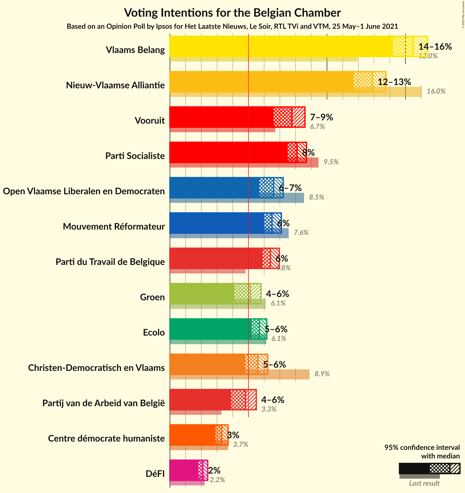

### Confidence Intervals

| Party | Last Result | Poll Result | 80% Confidence Interval | 90% Confidence Interval | 95% Confidence Interval | 99% Confidence Interval |
|:-----:|:-----------:|:-----------:|:-----------------------:|:-----------------------:|:-----------------------:|:-----------------------:|
| Vlaams Belang | 12.0% | 16.4% | 14.6–15.4% |14.3–15.4% |14.2–15.5% |13.8–15.5% |
| Nieuw-Vlaamse Alliantie | 16.0% | 13.8% | 12.0–12.8% |11.8–12.9% |11.7–12.9% |11.3–12.9% |
| Parti Socialiste | 9.5% | 8.7% | 7.7–8.1% |7.6–8.1% |7.5–8.1% |7.3–8.1% |
| Vooruit | 6.7% | 7.8% | 7.0–8.4% |6.8–8.5% |6.6–8.6% |6.2–8.6% |
| Open Vlaamse Liberalen en Democraten | 8.5% | 7.2% | 5.9–6.5% |5.8–6.6% |5.7–6.6% |5.4–6.6% |
| Mouvement Réformateur | 7.6% | 7.1% | 6.2–6.5% |6.1–6.5% |6.0–6.5% |5.8–6.6% |
| Parti du Travail de Belgique | 4.8% | 7.0% | 6.0–6.4% |6.0–6.4% |5.9–6.4% |5.7–6.4% |
| Christen-Democratisch en Vlaams | 8.9% | 6.2% | 5.0–5.6% |4.9–5.6% |4.8–5.6% |4.5–5.6% |
| Ecolo | 6.1% | 6.2% | 5.3–5.6% |5.2–5.7% |5.2–5.7% |5.0–5.7% |
| Groen | 6.1% | 5.1% | 4.5–5.6% |4.3–5.7% |4.1–5.8% |3.9–5.8% |
| Partij van de Arbeid van België | 3.3% | 4.8% | 4.2–5.3% |4.0–5.4% |3.9–5.5% |3.6–5.5% |
| Centre démocrate humaniste | 3.7% | 3.7% | 3.0–3.3% |3.0–3.3% |2.9–3.3% |2.8–3.3% |
| DéFI | 2.2% | 2.4% | 1.9–2.1% |1.8–2.1% |1.8–2.1% |1.7–2.1% |

*Note:* The poll result column reflects the actual value used in the calculations. Published results may vary slightly, and in addition be rounded to fewer digits.

## Seats

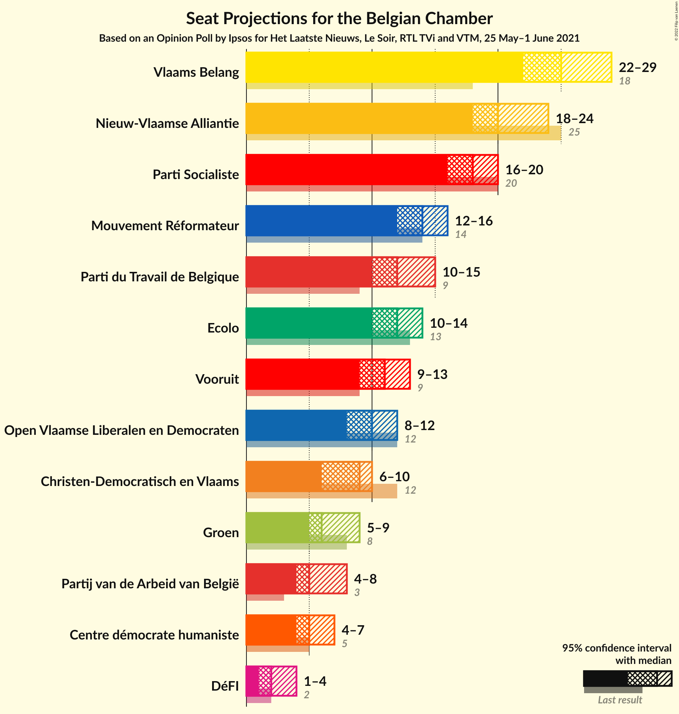

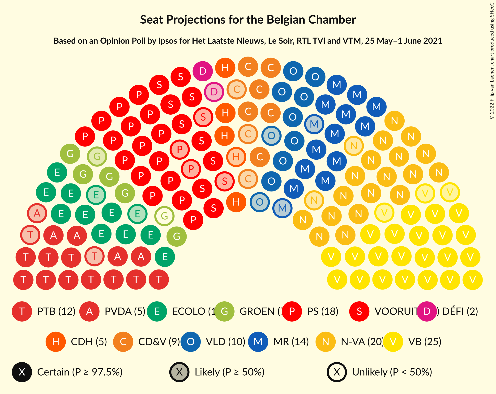

### Confidence Intervals

| Party | Last Result | Median | 80% Confidence Interval | 90% Confidence Interval | 95% Confidence Interval | 99% Confidence Interval |
|:-----:|:-----------:|:------:|:-----------------------:|:-----------------------:|:-----------------------:|:-----------------------:|
| <a href="#vlaams-belang">Vlaams Belang</a> | 18 | 25 | 24–26 |23–27 |22–29 |21–30 |
| <a href="#nieuw-vlaamse-alliantie">Nieuw-Vlaamse Alliantie</a> | 25 | 20 | 19–22 |19–23 |18–24 |17–25 |
| <a href="#parti-socialiste">Parti Socialiste</a> | 20 | 18 | 16–19 |16–19 |16–20 |15–20 |
| <a href="#vooruit">Vooruit</a> | 9 | 11 | 10–12 |9–12 |9–13 |8–14 |
| <a href="#open-vlaamse-liberalen-en-democraten">Open Vlaamse Liberalen en Democraten</a> | 12 | 10 | 9–10 |8–11 |8–12 |7–12 |
| <a href="#mouvement-réformateur">Mouvement Réformateur</a> | 14 | 14 | 13–15 |12–16 |12–16 |11–17 |
| <a href="#parti-du-travail-de-belgique">Parti du Travail de Belgique</a> | 9 | 12 | 11–14 |11–14 |10–15 |10–16 |
| <a href="#christen-democratisch-en-vlaams">Christen-Democratisch en Vlaams</a> | 12 | 9 | 6–10 |6–10 |6–10 |5–11 |
| <a href="#ecolo">Ecolo</a> | 13 | 12 | 11–14 |10–14 |10–14 |10–14 |
| <a href="#groen">Groen</a> | 8 | 6 | 5–8 |5–9 |5–9 |3–9 |
| <a href="#partij-van-de-arbeid-van-belgië">Partij van de Arbeid van België</a> | 3 | 5 | 5–8 |5–8 |4–8 |3–8 |
| <a href="#centre-démocrate-humaniste">Centre démocrate humaniste</a> | 5 | 5 | 4–6 |4–6 |4–7 |4–8 |
| <a href="#défi">DéFI</a> | 2 | 2 | 1–4 |1–4 |1–4 |1–5 |

### Vlaams Belang

*For a full overview of the results for this party, see the [Vlaams Belang](party-vlaamsbelang.html) page.*

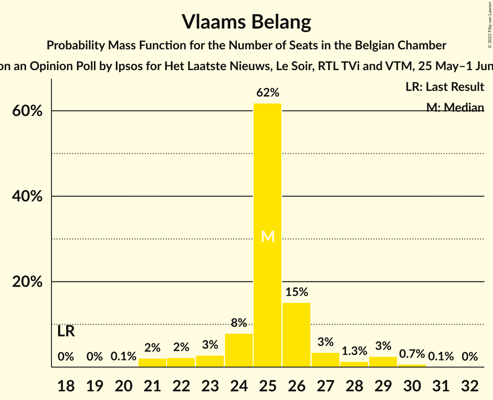

| Number of Seats | Probability | Accumulated | Special Marks |
|:---------------:|:-----------:|:-----------:|:-------------:|
| 18 | 0% | 100% | Last Result |
| 19 | 0% | 100% |  |
| 20 | 0.1% | 100% |  |
| 21 | 2% | 99.9% |  |
| 22 | 2% | 98% |  |
| 23 | 3% | 96% |  |
| 24 | 8% | 93% |  |
| 25 | 62% | 85% | Median |
| 26 | 15% | 23% |  |
| 27 | 3% | 8% |  |
| 28 | 1.3% | 5% |  |
| 29 | 3% | 3% |  |
| 30 | 0.7% | 0.7% |  |
| 31 | 0.1% | 0.1% |  |
| 32 | 0% | 0% |  |

### Nieuw-Vlaamse Alliantie

*For a full overview of the results for this party, see the [Nieuw-Vlaamse Alliantie](party-nieuw-vlaamsealliantie.html) page.*

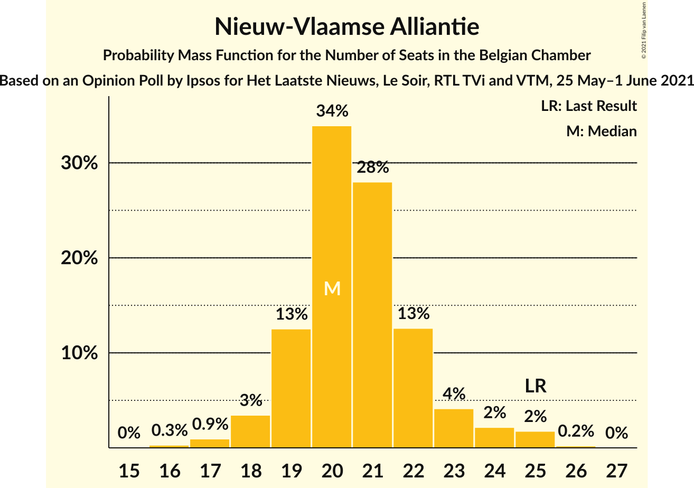

| Number of Seats | Probability | Accumulated | Special Marks |
|:---------------:|:-----------:|:-----------:|:-------------:|
| 16 | 0.3% | 100% |  |
| 17 | 0.9% | 99.7% |  |
| 18 | 3% | 98.7% |  |
| 19 | 13% | 95% |  |
| 20 | 34% | 83% | Median |
| 21 | 28% | 49% |  |
| 22 | 13% | 21% |  |
| 23 | 4% | 8% |  |
| 24 | 2% | 4% |  |
| 25 | 2% | 2% | Last Result |
| 26 | 0.2% | 0.2% |  |
| 27 | 0% | 0% |  |

### Parti Socialiste

*For a full overview of the results for this party, see the [Parti Socialiste](party-partisocialiste.html) page.*

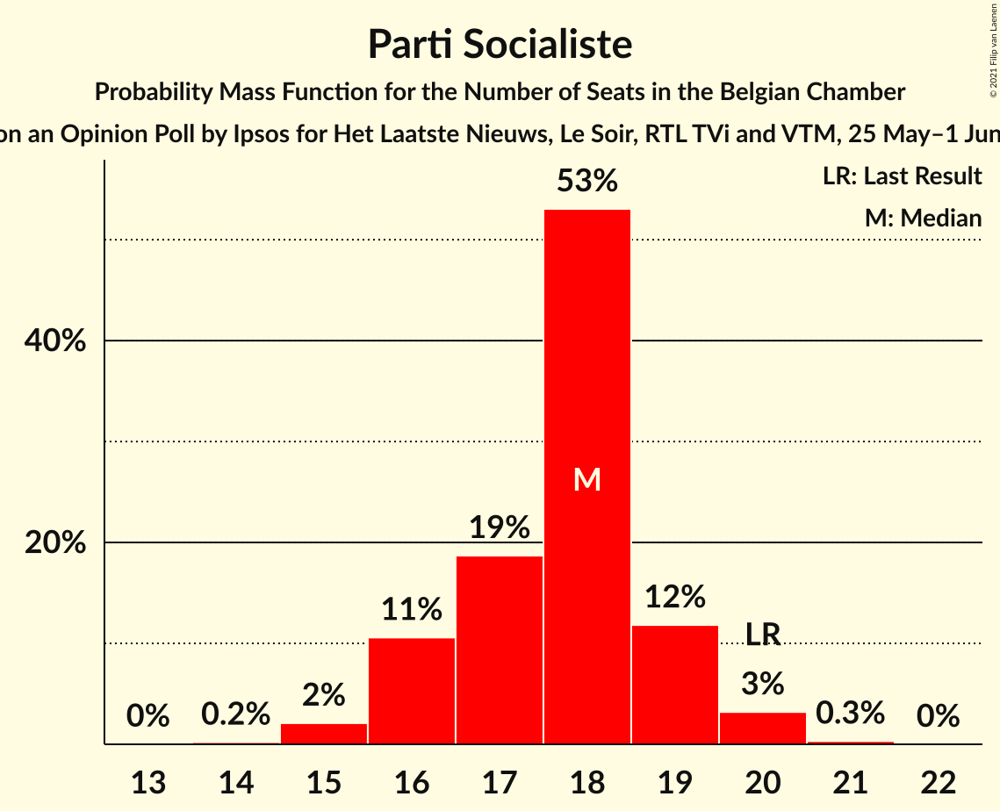

| Number of Seats | Probability | Accumulated | Special Marks |
|:---------------:|:-----------:|:-----------:|:-------------:|
| 14 | 0.2% | 100% |  |
| 15 | 2% | 99.8% |  |
| 16 | 11% | 98% |  |
| 17 | 19% | 87% |  |
| 18 | 53% | 68% | Median |
| 19 | 12% | 15% |  |
| 20 | 3% | 4% | Last Result |
| 21 | 0.3% | 0.3% |  |
| 22 | 0% | 0% |  |

### Vooruit

*For a full overview of the results for this party, see the [Vooruit](party-vooruit.html) page.*

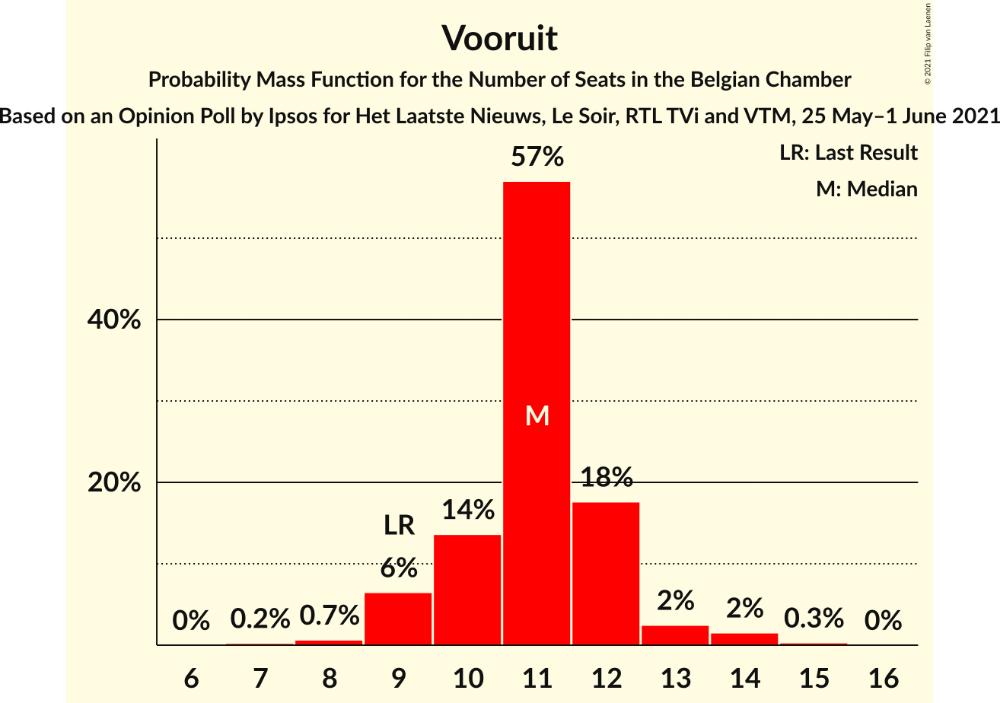

| Number of Seats | Probability | Accumulated | Special Marks |
|:---------------:|:-----------:|:-----------:|:-------------:|
| 7 | 0.2% | 100% |  |
| 8 | 0.7% | 99.7% |  |
| 9 | 6% | 99.1% | Last Result |
| 10 | 14% | 93% |  |
| 11 | 57% | 79% | Median |
| 12 | 18% | 22% |  |
| 13 | 2% | 4% |  |
| 14 | 2% | 2% |  |
| 15 | 0.3% | 0.3% |  |
| 16 | 0% | 0% |  |

### Open Vlaamse Liberalen en Democraten

*For a full overview of the results for this party, see the [Open Vlaamse Liberalen en Democraten](party-openvlaamseliberalenendemocraten.html) page.*

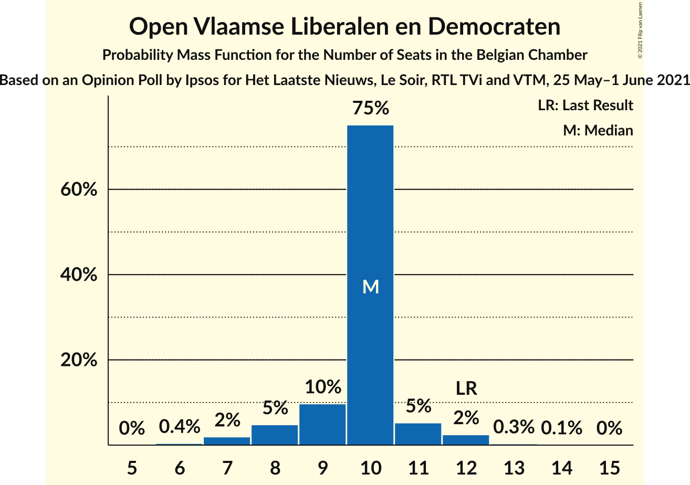

| Number of Seats | Probability | Accumulated | Special Marks |
|:---------------:|:-----------:|:-----------:|:-------------:|
| 6 | 0.4% | 100% |  |
| 7 | 2% | 99.6% |  |
| 8 | 5% | 98% |  |
| 9 | 10% | 93% |  |
| 10 | 75% | 83% | Median |
| 11 | 5% | 8% |  |
| 12 | 2% | 3% | Last Result |
| 13 | 0.3% | 0.4% |  |
| 14 | 0.1% | 0.1% |  |
| 15 | 0% | 0% |  |

### Mouvement Réformateur

*For a full overview of the results for this party, see the [Mouvement Réformateur](party-mouvementréformateur.html) page.*

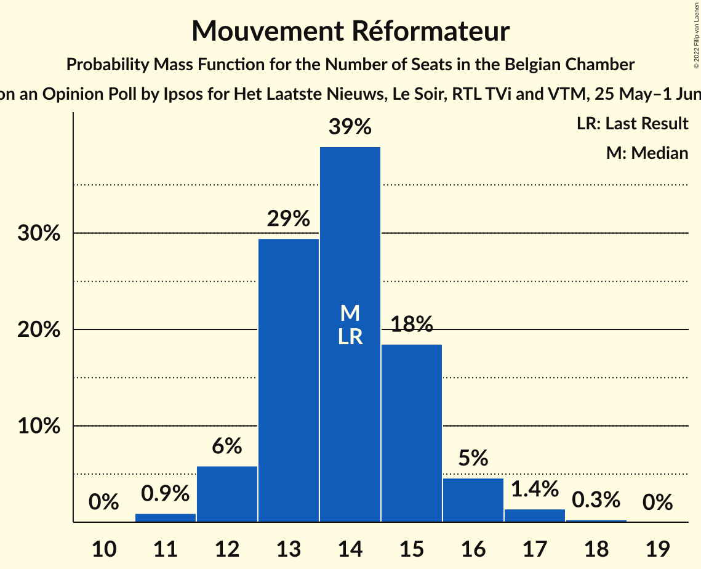

| Number of Seats | Probability | Accumulated | Special Marks |
|:---------------:|:-----------:|:-----------:|:-------------:|
| 11 | 0.9% | 100% |  |
| 12 | 6% | 99.0% |  |
| 13 | 29% | 93% |  |
| 14 | 39% | 64% | Last Result, Median |
| 15 | 18% | 25% |  |
| 16 | 5% | 6% |  |
| 17 | 1.4% | 2% |  |
| 18 | 0.3% | 0.3% |  |
| 19 | 0% | 0% |  |

### Parti du Travail de Belgique

*For a full overview of the results for this party, see the [Parti du Travail de Belgique](party-partidutravaildebelgique.html) page.*

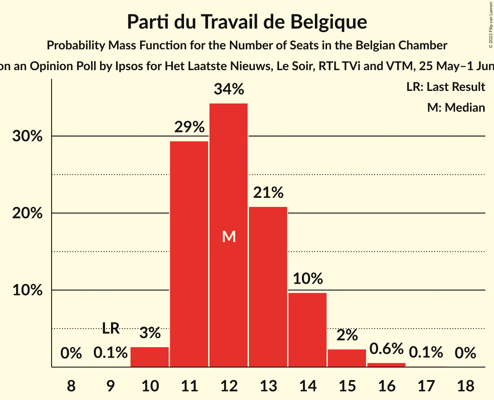

| Number of Seats | Probability | Accumulated | Special Marks |
|:---------------:|:-----------:|:-----------:|:-------------:|
| 9 | 0.1% | 100% | Last Result |
| 10 | 3% | 99.9% |  |
| 11 | 29% | 97% |  |
| 12 | 34% | 68% | Median |
| 13 | 21% | 34% |  |
| 14 | 10% | 13% |  |
| 15 | 2% | 3% |  |
| 16 | 0.6% | 0.7% |  |
| 17 | 0.1% | 0.1% |  |
| 18 | 0% | 0% |  |

### Christen-Democratisch en Vlaams

*For a full overview of the results for this party, see the [Christen-Democratisch en Vlaams](party-christen-democratischenvlaams.html) page.*

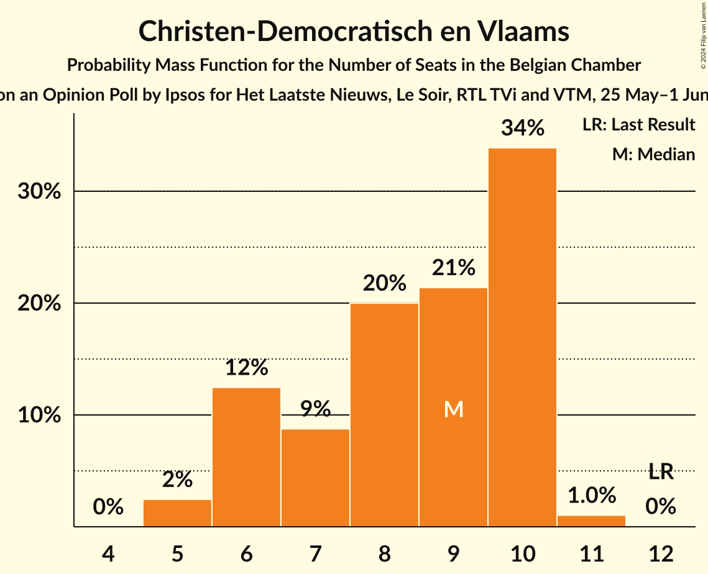

| Number of Seats | Probability | Accumulated | Special Marks |
|:---------------:|:-----------:|:-----------:|:-------------:|
| 5 | 2% | 100% |  |
| 6 | 12% | 98% |  |
| 7 | 9% | 85% |  |
| 8 | 20% | 76% |  |
| 9 | 21% | 56% | Median |
| 10 | 34% | 35% |  |
| 11 | 1.0% | 1.1% |  |
| 12 | 0% | 0% | Last Result |

### Ecolo

*For a full overview of the results for this party, see the [Ecolo](party-ecolo.html) page.*

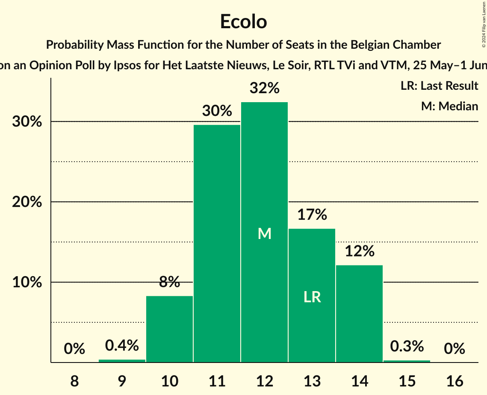

| Number of Seats | Probability | Accumulated | Special Marks |
|:---------------:|:-----------:|:-----------:|:-------------:|
| 9 | 0.4% | 100% |  |
| 10 | 8% | 99.6% |  |
| 11 | 30% | 91% |  |
| 12 | 32% | 62% | Median |
| 13 | 17% | 29% | Last Result |
| 14 | 12% | 12% |  |
| 15 | 0.3% | 0.3% |  |
| 16 | 0% | 0% |  |

### Groen

*For a full overview of the results for this party, see the [Groen](party-groen.html) page.*

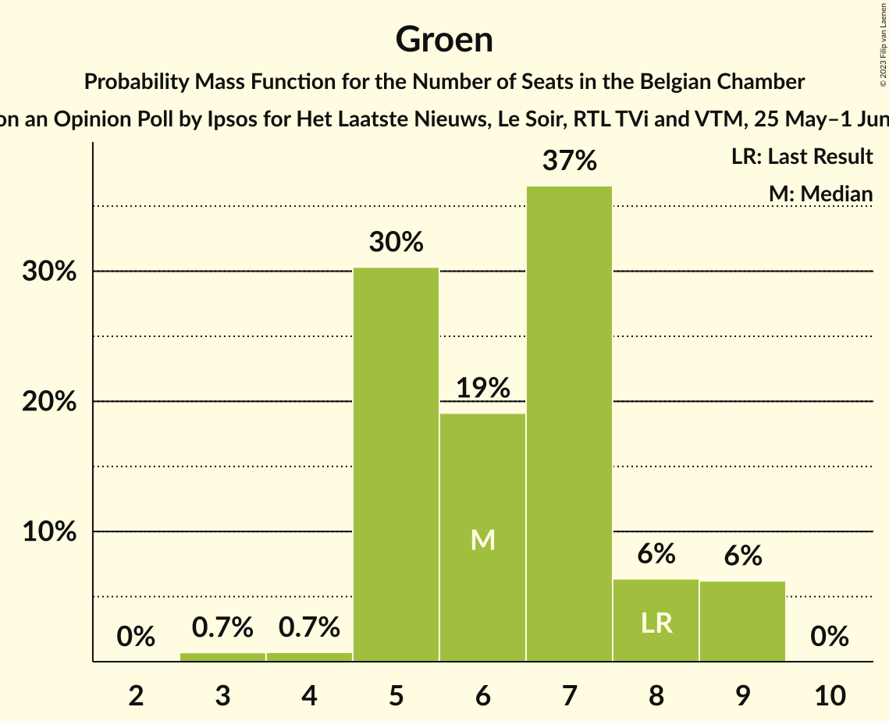

| Number of Seats | Probability | Accumulated | Special Marks |
|:---------------:|:-----------:|:-----------:|:-------------:|
| 3 | 0.7% | 100% |  |
| 4 | 0.7% | 99.3% |  |
| 5 | 30% | 98.6% |  |
| 6 | 19% | 68% | Median |
| 7 | 37% | 49% |  |
| 8 | 6% | 13% | Last Result |
| 9 | 6% | 6% |  |
| 10 | 0% | 0% |  |

### Partij van de Arbeid van België

*For a full overview of the results for this party, see the [Partij van de Arbeid van België](party-partijvandearbeidvanbelgië.html) page.*

| Number of Seats | Probability | Accumulated | Special Marks |
|:---------------:|:-----------:|:-----------:|:-------------:|
| 3 | 0.7% | 100% | Last Result |
| 4 | 3% | 99.3% |  |
| 5 | 58% | 96% | Median |
| 6 | 14% | 38% |  |
| 7 | 12% | 25% |  |
| 8 | 13% | 13% |  |
| 9 | 0.1% | 0.1% |  |
| 10 | 0% | 0% |  |

### Centre démocrate humaniste

*For a full overview of the results for this party, see the [Centre démocrate humaniste](party-centredémocratehumaniste.html) page.*

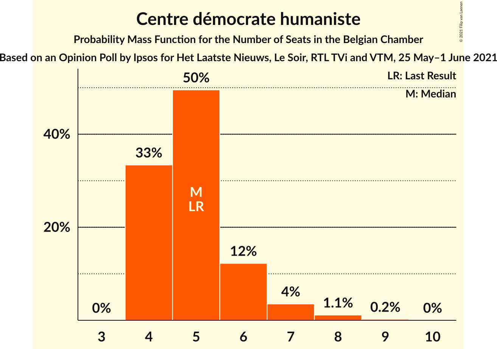

| Number of Seats | Probability | Accumulated | Special Marks |
|:---------------:|:-----------:|:-----------:|:-------------:|
| 4 | 33% | 100% |  |
| 5 | 50% | 67% | Last Result, Median |
| 6 | 12% | 17% |  |
| 7 | 4% | 5% |  |
| 8 | 1.1% | 1.3% |  |
| 9 | 0.2% | 0.2% |  |
| 10 | 0% | 0% |  |

### DéFI

*For a full overview of the results for this party, see the [DéFI](party-défi.html) page.*

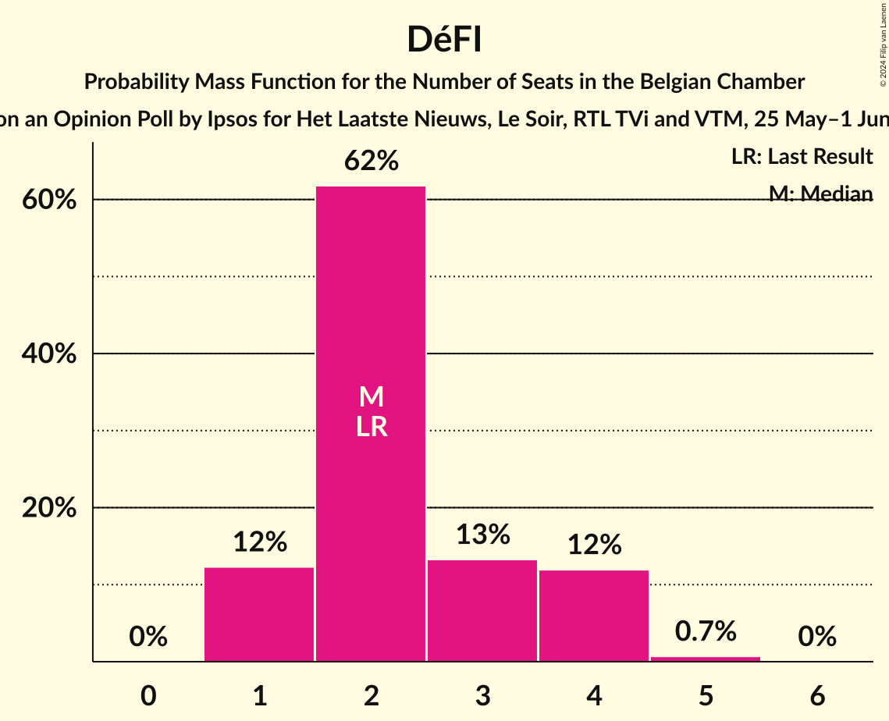

| Number of Seats | Probability | Accumulated | Special Marks |
|:---------------:|:-----------:|:-----------:|:-------------:|
| 1 | 12% | 100% |  |
| 2 | 62% | 88% | Last Result, Median |
| 3 | 13% | 26% |  |
| 4 | 12% | 13% |  |
| 5 | 0.7% | 0.7% |  |
| 6 | 0% | 0% |  |

## Coalitions

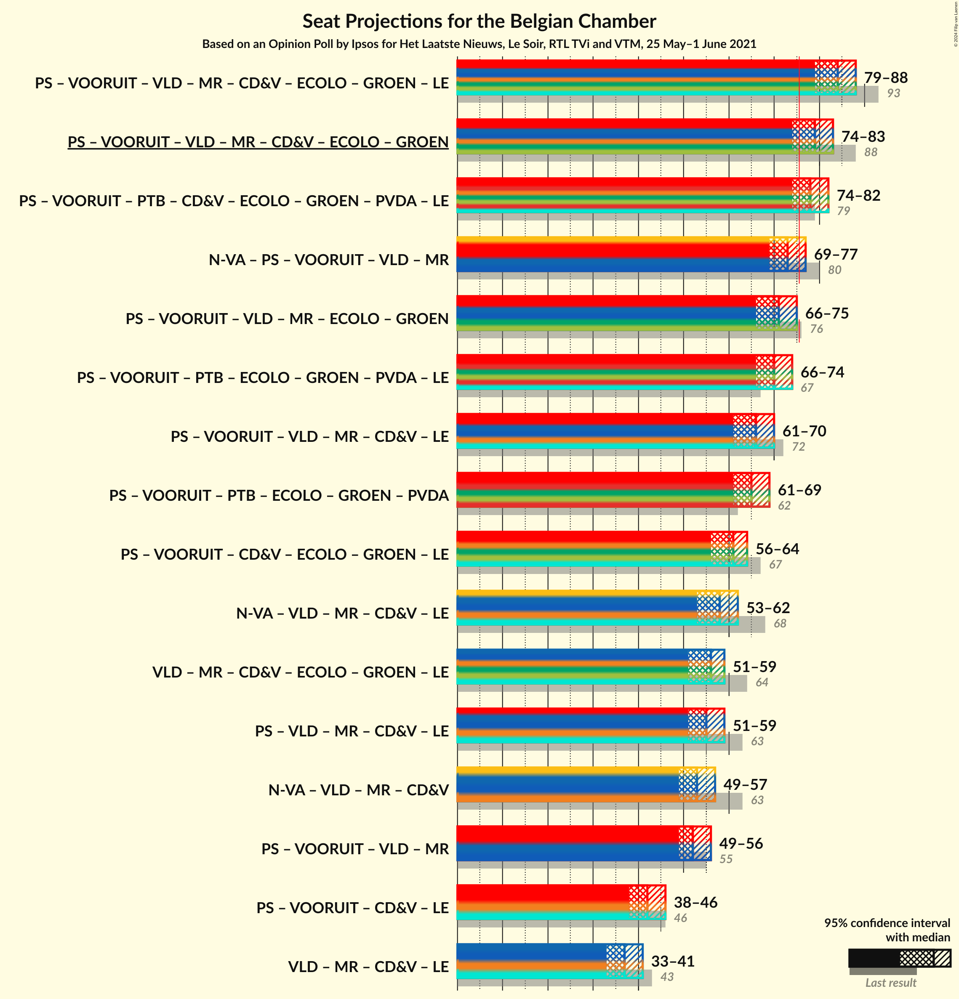

### Confidence Intervals

| Coalition | Last Result | Median | Majority? | 80% Confidence Interval | 90% Confidence Interval | 95% Confidence Interval | 99% Confidence Interval |
|:---------:|:-----------:|:------:|:---------:|:-----------------------:|:-----------------------:|:-----------------------:|:-----------------------:|
| Parti Socialiste – Vooruit – Open Vlaamse Liberalen en Democraten – Mouvement Réformateur – Christen-Democratisch en Vlaams – Ecolo – Groen – Centre démocrate humaniste | 93 | 84 | 100% | 81–87 | 80–87 | 79–88 | 78–89 |
| Parti Socialiste – Vooruit – Open Vlaamse Liberalen en Democraten – Mouvement Réformateur – Christen-Democratisch en Vlaams – Ecolo – Groen | 88 | 79 | 94% | 76–82 | 75–83 | 74–83 | 73–84 |
| Parti Socialiste – Vooruit – Parti du Travail de Belgique – Christen-Democratisch en Vlaams – Ecolo – Groen – Partij van de Arbeid van België – Centre démocrate humaniste | 79 | 78 | 90% | 75–81 | 75–82 | 74–82 | 72–84 |
| Nieuw-Vlaamse Alliantie – Parti Socialiste – Vooruit – Open Vlaamse Liberalen en Democraten – Mouvement Réformateur | 80 | 73 | 12% | 70–76 | 70–77 | 69–77 | 67–79 |
| Parti Socialiste – Vooruit – Open Vlaamse Liberalen en Democraten – Mouvement Réformateur – Ecolo – Groen | 76 | 71 | 1.1% | 68–73 | 67–74 | 66–75 | 65–76 |
| Parti Socialiste – Vooruit – Parti du Travail de Belgique – Ecolo – Groen – Partij van de Arbeid van België – Centre démocrate humaniste | 67 | 70 | 0.5% | 67–72 | 66–73 | 66–74 | 64–76 |
| Parti Socialiste – Vooruit – Open Vlaamse Liberalen en Democraten – Mouvement Réformateur – Christen-Democratisch en Vlaams – Centre démocrate humaniste | 72 | 66 | 0% | 63–69 | 62–69 | 61–70 | 60–71 |
| Parti Socialiste – Vooruit – Parti du Travail de Belgique – Ecolo – Groen – Partij van de Arbeid van België | 62 | 65 | 0% | 62–68 | 61–68 | 61–69 | 59–71 |
| Parti Socialiste – Vooruit – Christen-Democratisch en Vlaams – Ecolo – Groen – Centre démocrate humaniste | 67 | 61 | 0% | 58–63 | 57–64 | 56–64 | 54–66 |
| Nieuw-Vlaamse Alliantie – Open Vlaamse Liberalen en Democraten – Mouvement Réformateur – Christen-Democratisch en Vlaams – Centre démocrate humaniste | 68 | 58 | 0% | 55–60 | 54–61 | 53–62 | 52–63 |
| Open Vlaamse Liberalen en Democraten – Mouvement Réformateur – Christen-Democratisch en Vlaams – Ecolo – Groen – Centre démocrate humaniste | 64 | 56 | 0% | 52–58 | 51–59 | 51–59 | 49–61 |
| Parti Socialiste – Open Vlaamse Liberalen en Democraten – Mouvement Réformateur – Christen-Democratisch en Vlaams – Centre démocrate humaniste | 63 | 55 | 0% | 52–57 | 51–58 | 51–59 | 49–60 |
| Nieuw-Vlaamse Alliantie – Open Vlaamse Liberalen en Democraten – Mouvement Réformateur – Christen-Democratisch en Vlaams | 63 | 53 | 0% | 50–55 | 49–56 | 49–57 | 47–58 |
| Parti Socialiste – Vooruit – Open Vlaamse Liberalen en Democraten – Mouvement Réformateur | 55 | 52 | 0% | 50–55 | 49–55 | 49–56 | 47–57 |
| Parti Socialiste – Vooruit – Christen-Democratisch en Vlaams – Centre démocrate humaniste | 46 | 42 | 0% | 39–45 | 39–45 | 38–46 | 37–47 |
| Open Vlaamse Liberalen en Democraten – Mouvement Réformateur – Christen-Democratisch en Vlaams – Centre démocrate humaniste | 43 | 37 | 0% | 34–40 | 34–40 | 33–41 | 32–42 |

### Parti Socialiste – Vooruit – Open Vlaamse Liberalen en Democraten – Mouvement Réformateur – Christen-Democratisch en Vlaams – Ecolo – Groen – Centre démocrate humaniste

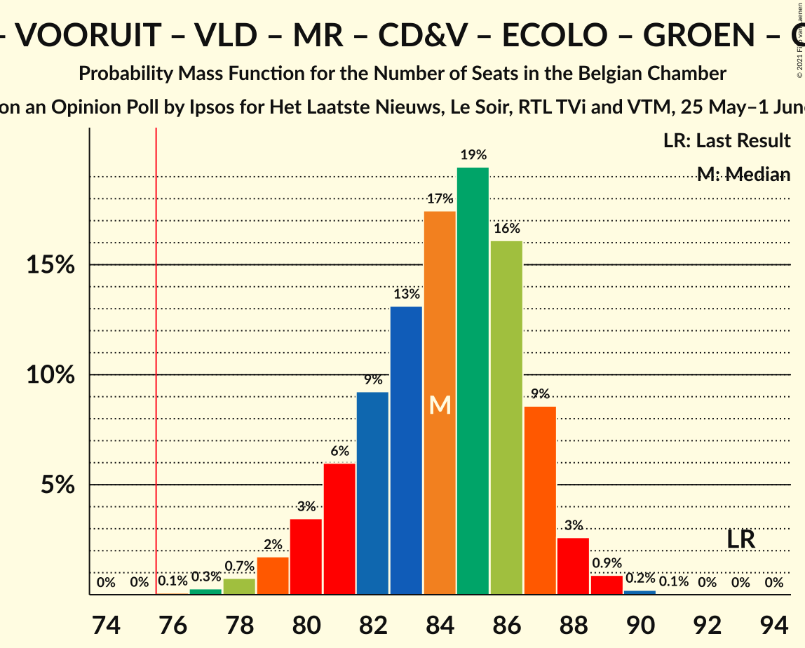

| Number of Seats | Probability | Accumulated | Special Marks |
|:---------------:|:-----------:|:-----------:|:-------------:|
| 76 | 0.1% | 100% | Majority |
| 77 | 0.3% | 99.9% |  |
| 78 | 0.7% | 99.6% |  |
| 79 | 2% | 98.9% |  |
| 80 | 3% | 97% |  |
| 81 | 6% | 94% |  |
| 82 | 9% | 88% |  |
| 83 | 13% | 78% |  |
| 84 | 17% | 65% |  |
| 85 | 19% | 48% | Median |
| 86 | 16% | 28% |  |
| 87 | 9% | 12% |  |
| 88 | 3% | 4% |  |
| 89 | 0.9% | 1.2% |  |
| 90 | 0.2% | 0.3% |  |
| 91 | 0.1% | 0.1% |  |
| 92 | 0% | 0% |  |
| 93 | 0% | 0% | Last Result |

### Parti Socialiste – Vooruit – Open Vlaamse Liberalen en Democraten – Mouvement Réformateur – Christen-Democratisch en Vlaams – Ecolo – Groen

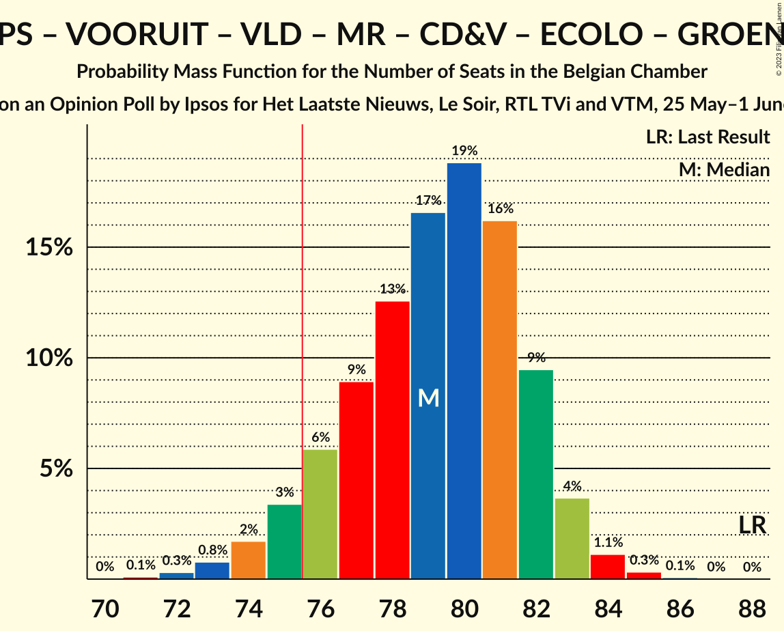

| Number of Seats | Probability | Accumulated | Special Marks |
|:---------------:|:-----------:|:-----------:|:-------------:|
| 71 | 0.1% | 100% |  |
| 72 | 0.3% | 99.9% |  |
| 73 | 0.8% | 99.6% |  |
| 74 | 2% | 98.8% |  |
| 75 | 3% | 97% |  |
| 76 | 6% | 94% | Majority |
| 77 | 9% | 88% |  |
| 78 | 13% | 79% |  |
| 79 | 17% | 66% |  |
| 80 | 19% | 50% | Median |
| 81 | 16% | 31% |  |
| 82 | 9% | 15% |  |
| 83 | 4% | 5% |  |
| 84 | 1.1% | 2% |  |
| 85 | 0.3% | 0.4% |  |
| 86 | 0.1% | 0.1% |  |
| 87 | 0% | 0% |  |
| 88 | 0% | 0% | Last Result |

### Parti Socialiste – Vooruit – Parti du Travail de Belgique – Christen-Democratisch en Vlaams – Ecolo – Groen – Partij van de Arbeid van België – Centre démocrate humaniste

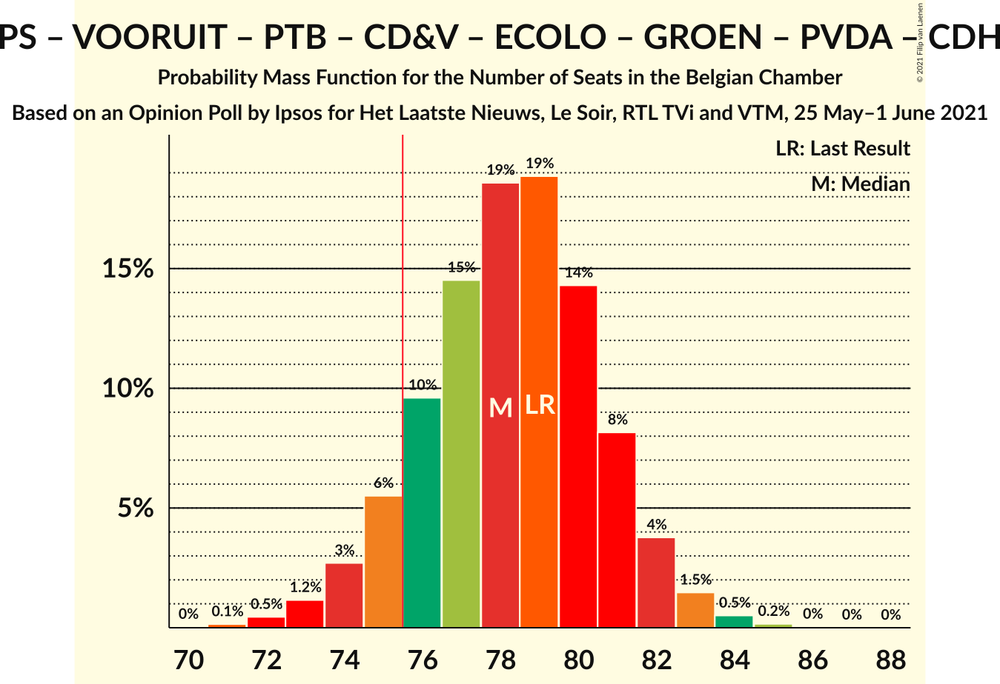

| Number of Seats | Probability | Accumulated | Special Marks |
|:---------------:|:-----------:|:-----------:|:-------------:|
| 70 | 0% | 100% |  |
| 71 | 0.1% | 99.9% |  |
| 72 | 0.5% | 99.8% |  |
| 73 | 1.2% | 99.3% |  |
| 74 | 3% | 98% |  |
| 75 | 6% | 95% |  |
| 76 | 10% | 90% | Majority |
| 77 | 15% | 80% |  |
| 78 | 19% | 66% | Median |
| 79 | 19% | 47% | Last Result |
| 80 | 14% | 28% |  |
| 81 | 8% | 14% |  |
| 82 | 4% | 6% |  |
| 83 | 1.5% | 2% |  |
| 84 | 0.5% | 0.7% |  |
| 85 | 0.2% | 0.2% |  |
| 86 | 0% | 0.1% |  |
| 87 | 0% | 0% |  |

### Nieuw-Vlaamse Alliantie – Parti Socialiste – Vooruit – Open Vlaamse Liberalen en Democraten – Mouvement Réformateur

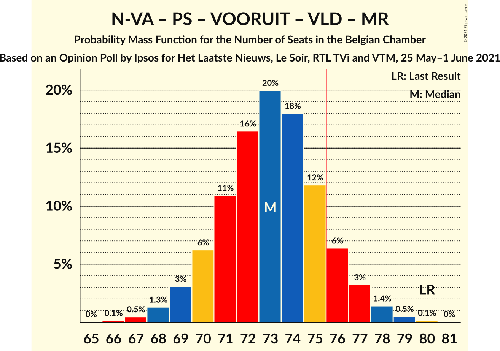

| Number of Seats | Probability | Accumulated | Special Marks |
|:---------------:|:-----------:|:-----------:|:-------------:|
| 66 | 0.1% | 100% |  |
| 67 | 0.5% | 99.8% |  |
| 68 | 1.3% | 99.4% |  |
| 69 | 3% | 98% |  |
| 70 | 6% | 95% |  |
| 71 | 11% | 89% |  |
| 72 | 16% | 78% |  |
| 73 | 20% | 61% | Median |
| 74 | 18% | 41% |  |
| 75 | 12% | 23% |  |
| 76 | 6% | 12% | Majority |
| 77 | 3% | 5% |  |
| 78 | 1.4% | 2% |  |
| 79 | 0.5% | 0.7% |  |
| 80 | 0.1% | 0.2% | Last Result |
| 81 | 0% | 0% |  |

### Parti Socialiste – Vooruit – Open Vlaamse Liberalen en Democraten – Mouvement Réformateur – Ecolo – Groen

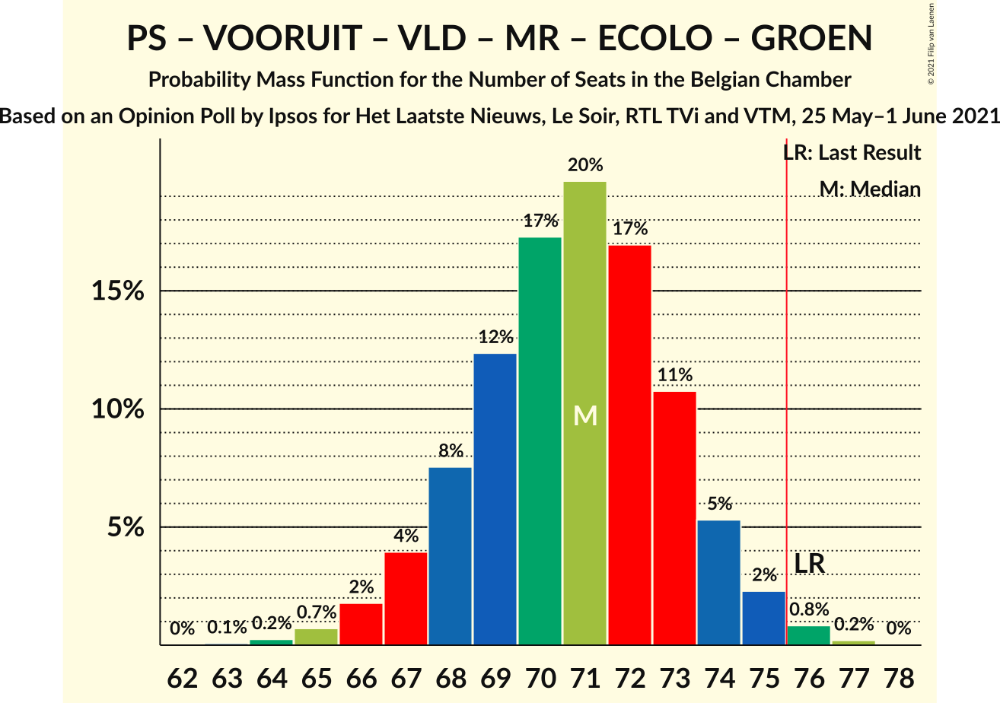

| Number of Seats | Probability | Accumulated | Special Marks |
|:---------------:|:-----------:|:-----------:|:-------------:|
| 63 | 0.1% | 100% |  |
| 64 | 0.2% | 99.9% |  |
| 65 | 0.7% | 99.6% |  |
| 66 | 2% | 98.9% |  |
| 67 | 4% | 97% |  |
| 68 | 8% | 93% |  |
| 69 | 12% | 86% |  |
| 70 | 17% | 73% |  |
| 71 | 20% | 56% | Median |
| 72 | 17% | 36% |  |
| 73 | 11% | 19% |  |
| 74 | 5% | 9% |  |
| 75 | 2% | 3% |  |
| 76 | 0.8% | 1.1% | Last Result, Majority |
| 77 | 0.2% | 0.2% |  |
| 78 | 0% | 0% |  |

### Parti Socialiste – Vooruit – Parti du Travail de Belgique – Ecolo – Groen – Partij van de Arbeid van België – Centre démocrate humaniste

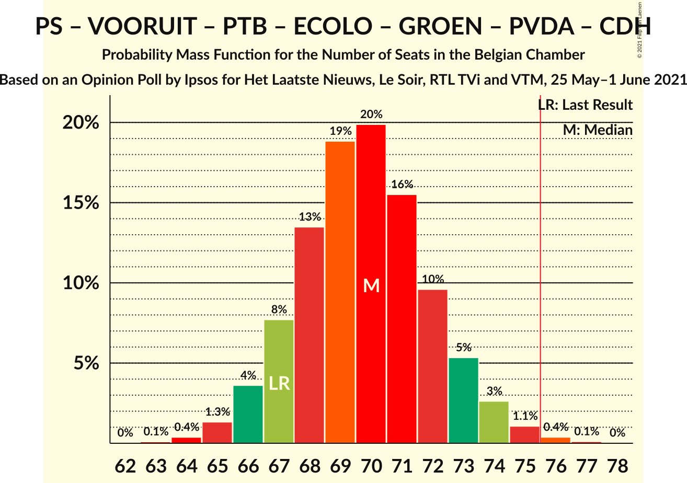

| Number of Seats | Probability | Accumulated | Special Marks |
|:---------------:|:-----------:|:-----------:|:-------------:|
| 63 | 0.1% | 100% |  |
| 64 | 0.4% | 99.9% |  |
| 65 | 1.3% | 99.5% |  |
| 66 | 4% | 98% |  |
| 67 | 8% | 95% | Last Result |
| 68 | 13% | 87% |  |
| 69 | 19% | 73% | Median |
| 70 | 20% | 55% |  |
| 71 | 16% | 35% |  |
| 72 | 10% | 19% |  |
| 73 | 5% | 10% |  |
| 74 | 3% | 4% |  |
| 75 | 1.1% | 2% |  |
| 76 | 0.4% | 0.5% | Majority |
| 77 | 0.1% | 0.1% |  |
| 78 | 0% | 0% |  |

### Parti Socialiste – Vooruit – Open Vlaamse Liberalen en Democraten – Mouvement Réformateur – Christen-Democratisch en Vlaams – Centre démocrate humaniste

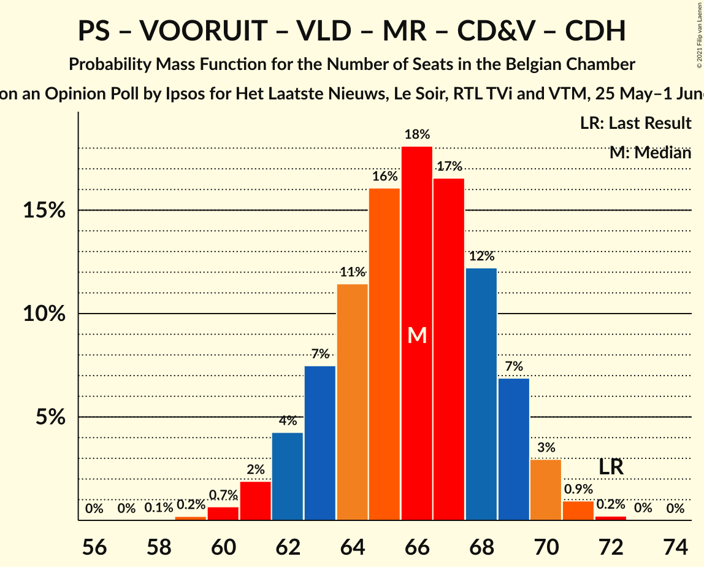

| Number of Seats | Probability | Accumulated | Special Marks |
|:---------------:|:-----------:|:-----------:|:-------------:|
| 58 | 0.1% | 100% |  |
| 59 | 0.2% | 99.9% |  |
| 60 | 0.7% | 99.7% |  |
| 61 | 2% | 99.1% |  |
| 62 | 4% | 97% |  |
| 63 | 7% | 93% |  |
| 64 | 11% | 85% |  |
| 65 | 16% | 74% |  |
| 66 | 18% | 58% |  |
| 67 | 17% | 40% | Median |
| 68 | 12% | 23% |  |
| 69 | 7% | 11% |  |
| 70 | 3% | 4% |  |
| 71 | 0.9% | 1.2% |  |
| 72 | 0.2% | 0.3% | Last Result |
| 73 | 0% | 0.1% |  |
| 74 | 0% | 0% |  |

### Parti Socialiste – Vooruit – Parti du Travail de Belgique – Ecolo – Groen – Partij van de Arbeid van België

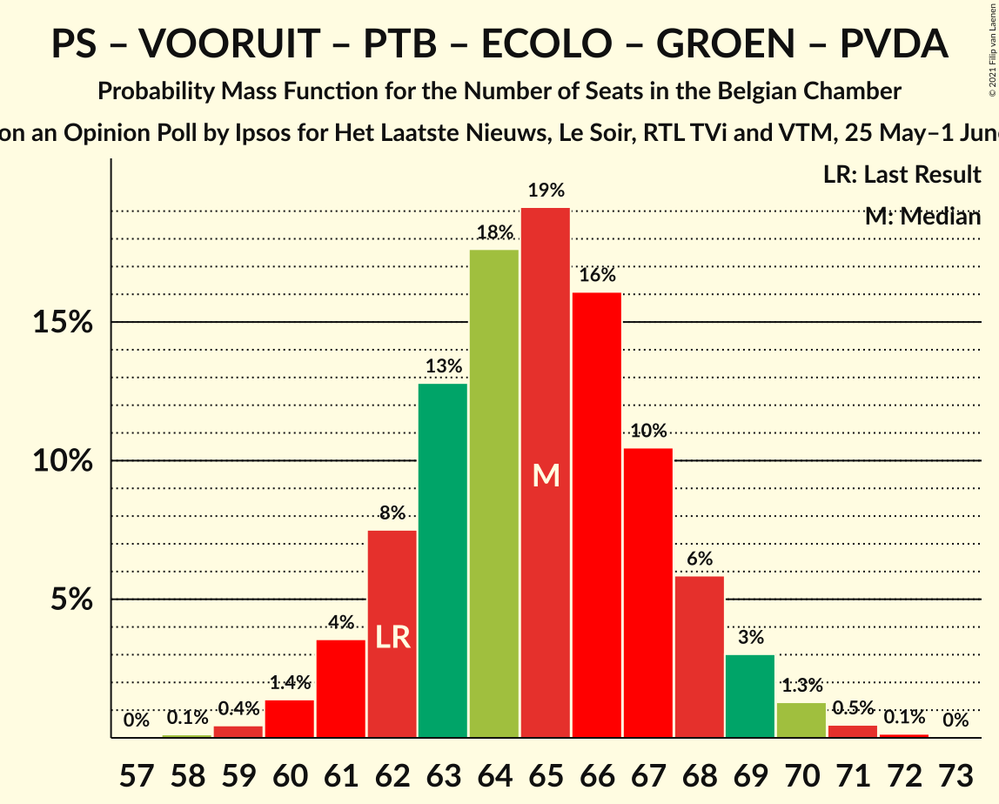

| Number of Seats | Probability | Accumulated | Special Marks |
|:---------------:|:-----------:|:-----------:|:-------------:|
| 58 | 0.1% | 100% |  |
| 59 | 0.4% | 99.8% |  |
| 60 | 1.4% | 99.4% |  |
| 61 | 4% | 98% |  |
| 62 | 8% | 94% | Last Result |
| 63 | 13% | 87% |  |
| 64 | 18% | 74% | Median |
| 65 | 19% | 57% |  |
| 66 | 16% | 37% |  |
| 67 | 10% | 21% |  |
| 68 | 6% | 11% |  |
| 69 | 3% | 5% |  |
| 70 | 1.3% | 2% |  |
| 71 | 0.5% | 0.7% |  |
| 72 | 0.1% | 0.2% |  |
| 73 | 0% | 0% |  |

### Parti Socialiste – Vooruit – Christen-Democratisch en Vlaams – Ecolo – Groen – Centre démocrate humaniste

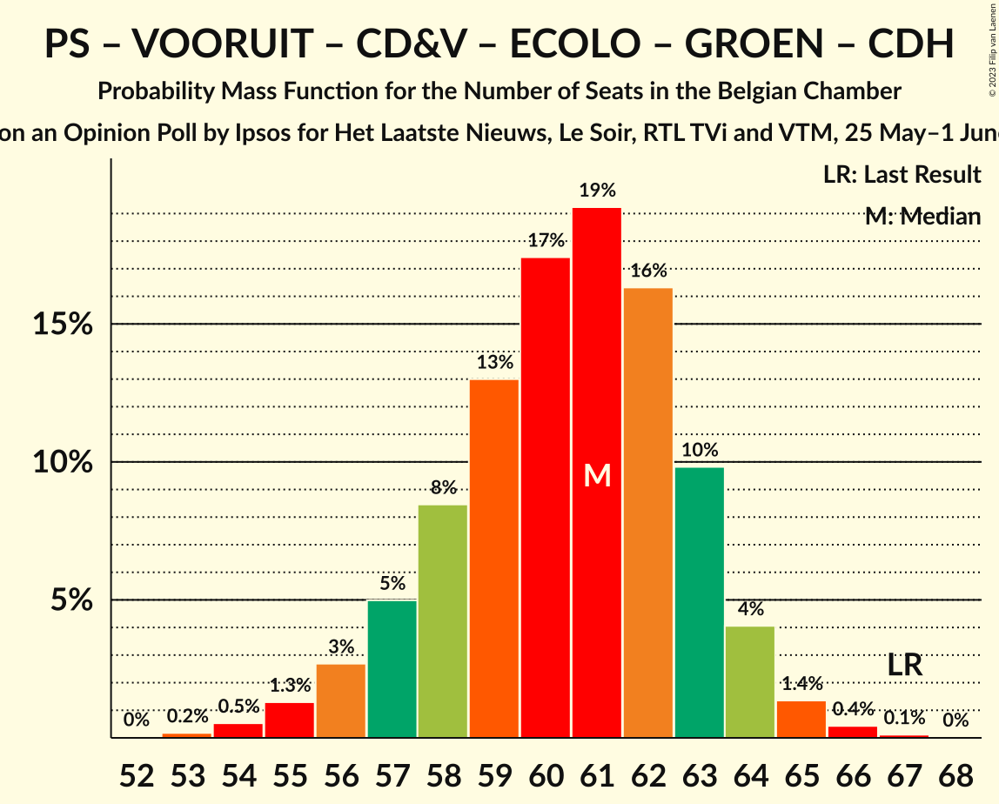

| Number of Seats | Probability | Accumulated | Special Marks |
|:---------------:|:-----------:|:-----------:|:-------------:|
| 52 | 0% | 100% |  |
| 53 | 0.2% | 99.9% |  |
| 54 | 0.5% | 99.8% |  |
| 55 | 1.3% | 99.2% |  |
| 56 | 3% | 98% |  |
| 57 | 5% | 95% |  |
| 58 | 8% | 90% |  |
| 59 | 13% | 82% |  |
| 60 | 17% | 69% |  |
| 61 | 19% | 51% | Median |
| 62 | 16% | 32% |  |
| 63 | 10% | 16% |  |
| 64 | 4% | 6% |  |
| 65 | 1.4% | 2% |  |
| 66 | 0.4% | 0.6% |  |
| 67 | 0.1% | 0.2% | Last Result |
| 68 | 0% | 0% |  |

### Nieuw-Vlaamse Alliantie – Open Vlaamse Liberalen en Democraten – Mouvement Réformateur – Christen-Democratisch en Vlaams – Centre démocrate humaniste

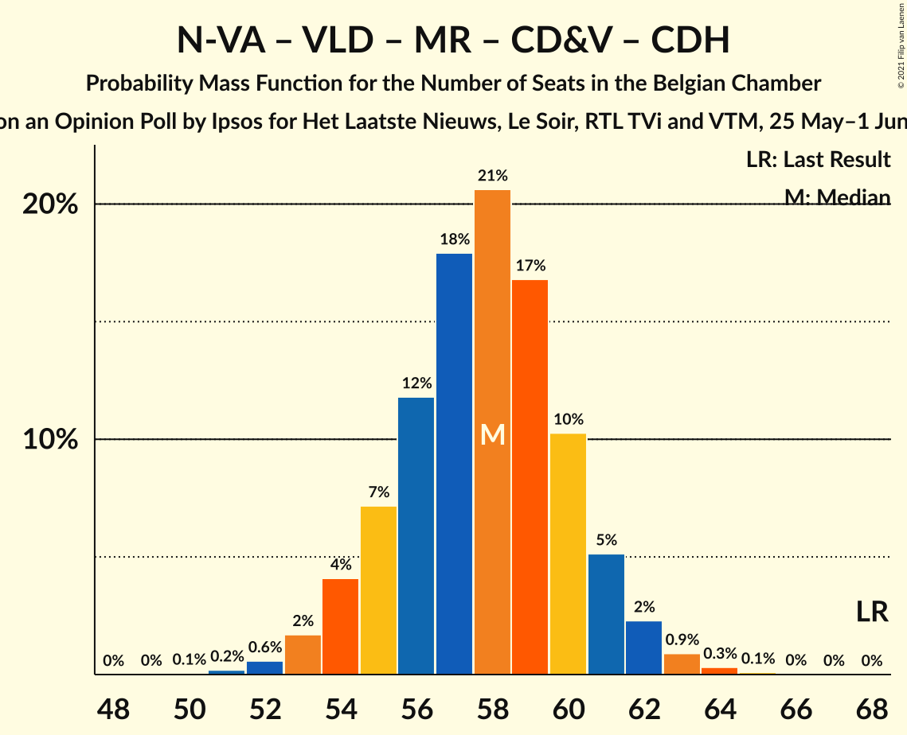

| Number of Seats | Probability | Accumulated | Special Marks |
|:---------------:|:-----------:|:-----------:|:-------------:|
| 50 | 0.1% | 100% |  |
| 51 | 0.2% | 99.9% |  |
| 52 | 0.6% | 99.7% |  |
| 53 | 2% | 99.1% |  |
| 54 | 4% | 97% |  |
| 55 | 7% | 93% |  |
| 56 | 12% | 86% |  |
| 57 | 18% | 74% |  |
| 58 | 21% | 56% | Median |
| 59 | 17% | 36% |  |
| 60 | 10% | 19% |  |
| 61 | 5% | 9% |  |
| 62 | 2% | 4% |  |
| 63 | 0.9% | 1.3% |  |
| 64 | 0.3% | 0.4% |  |
| 65 | 0.1% | 0.1% |  |
| 66 | 0% | 0% |  |
| 67 | 0% | 0% |  |
| 68 | 0% | 0% | Last Result |

### Open Vlaamse Liberalen en Democraten – Mouvement Réformateur – Christen-Democratisch en Vlaams – Ecolo – Groen – Centre démocrate humaniste

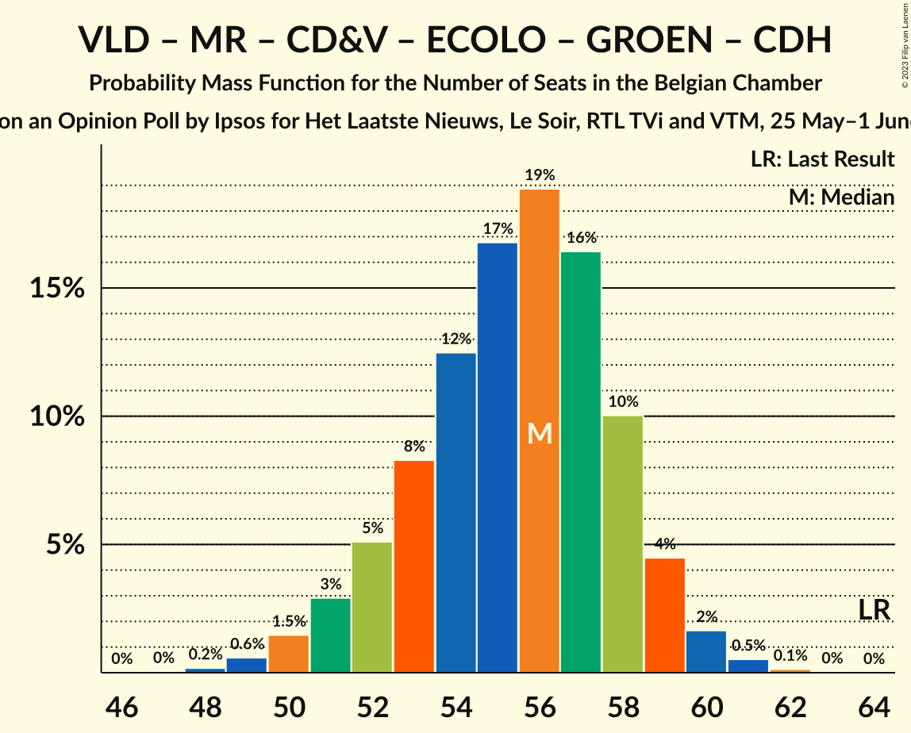

| Number of Seats | Probability | Accumulated | Special Marks |
|:---------------:|:-----------:|:-----------:|:-------------:|
| 47 | 0% | 100% |  |
| 48 | 0.2% | 99.9% |  |
| 49 | 0.6% | 99.8% |  |
| 50 | 1.5% | 99.2% |  |
| 51 | 3% | 98% |  |
| 52 | 5% | 95% |  |
| 53 | 8% | 90% |  |
| 54 | 12% | 81% |  |
| 55 | 17% | 69% |  |
| 56 | 19% | 52% | Median |
| 57 | 16% | 33% |  |
| 58 | 10% | 17% |  |
| 59 | 4% | 7% |  |
| 60 | 2% | 2% |  |
| 61 | 0.5% | 0.7% |  |
| 62 | 0.1% | 0.2% |  |
| 63 | 0% | 0% |  |
| 64 | 0% | 0% | Last Result |

### Parti Socialiste – Open Vlaamse Liberalen en Democraten – Mouvement Réformateur – Christen-Democratisch en Vlaams – Centre démocrate humaniste

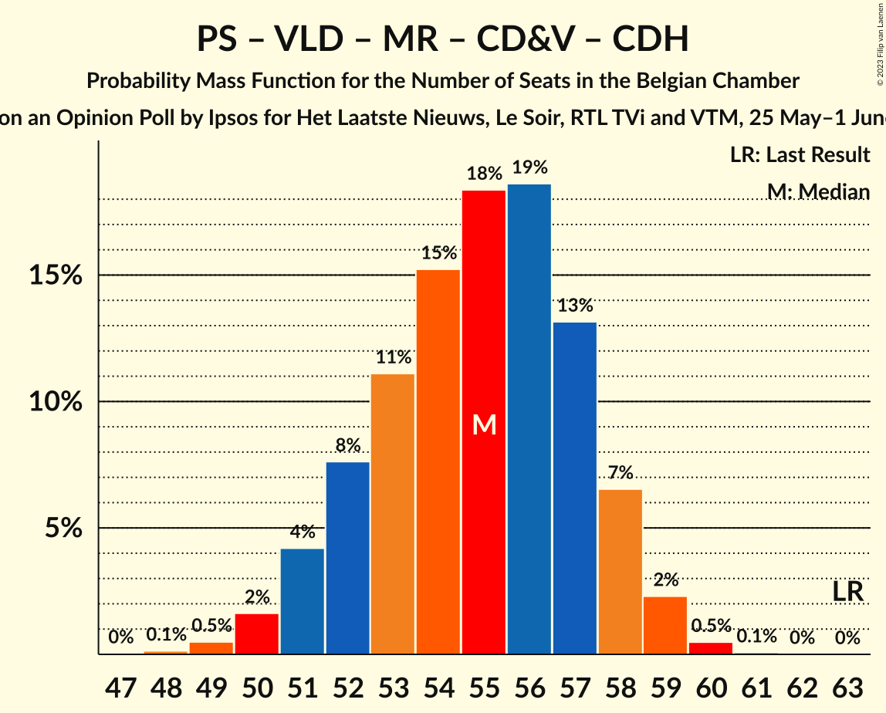

| Number of Seats | Probability | Accumulated | Special Marks |
|:---------------:|:-----------:|:-----------:|:-------------:|
| 48 | 0.1% | 100% |  |
| 49 | 0.5% | 99.8% |  |
| 50 | 2% | 99.3% |  |
| 51 | 4% | 98% |  |
| 52 | 8% | 94% |  |
| 53 | 11% | 86% |  |
| 54 | 15% | 75% |  |
| 55 | 18% | 60% |  |
| 56 | 19% | 41% | Median |
| 57 | 13% | 23% |  |
| 58 | 7% | 9% |  |
| 59 | 2% | 3% |  |
| 60 | 0.5% | 0.6% |  |
| 61 | 0.1% | 0.1% |  |
| 62 | 0% | 0% |  |
| 63 | 0% | 0% | Last Result |

### Nieuw-Vlaamse Alliantie – Open Vlaamse Liberalen en Democraten – Mouvement Réformateur – Christen-Democratisch en Vlaams

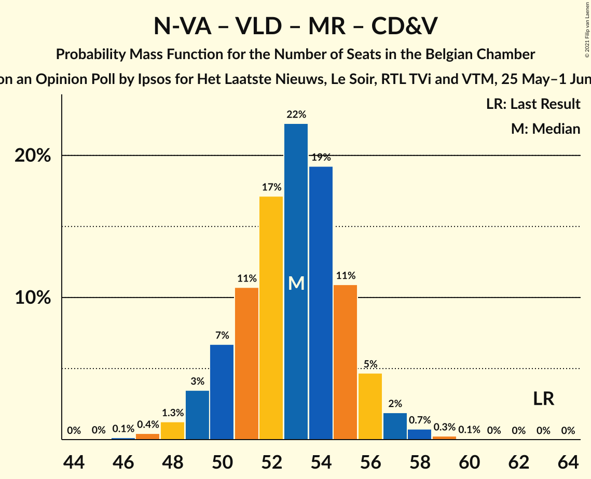

| Number of Seats | Probability | Accumulated | Special Marks |
|:---------------:|:-----------:|:-----------:|:-------------:|
| 45 | 0% | 100% |  |
| 46 | 0.1% | 99.9% |  |
| 47 | 0.4% | 99.8% |  |
| 48 | 1.3% | 99.4% |  |
| 49 | 3% | 98% |  |
| 50 | 7% | 95% |  |
| 51 | 11% | 88% |  |
| 52 | 17% | 77% |  |
| 53 | 22% | 60% | Median |
| 54 | 19% | 38% |  |
| 55 | 11% | 19% |  |
| 56 | 5% | 8% |  |
| 57 | 2% | 3% |  |
| 58 | 0.7% | 1.1% |  |
| 59 | 0.3% | 0.3% |  |
| 60 | 0.1% | 0.1% |  |
| 61 | 0% | 0% |  |
| 62 | 0% | 0% |  |
| 63 | 0% | 0% | Last Result |

### Parti Socialiste – Vooruit – Open Vlaamse Liberalen en Democraten – Mouvement Réformateur

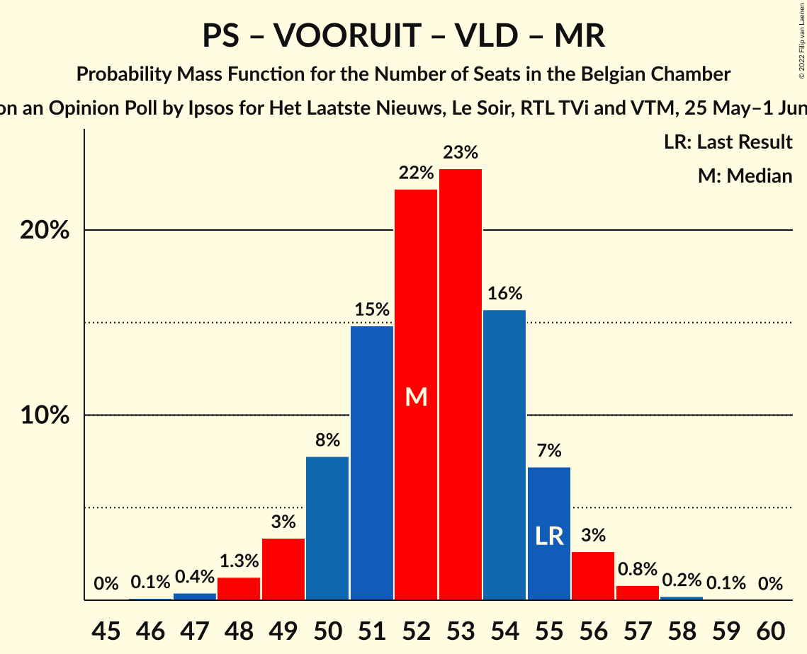

| Number of Seats | Probability | Accumulated | Special Marks |
|:---------------:|:-----------:|:-----------:|:-------------:|
| 46 | 0.1% | 100% |  |
| 47 | 0.4% | 99.9% |  |
| 48 | 1.3% | 99.5% |  |
| 49 | 3% | 98% |  |
| 50 | 8% | 95% |  |
| 51 | 15% | 87% |  |
| 52 | 22% | 72% |  |
| 53 | 23% | 50% | Median |
| 54 | 16% | 27% |  |
| 55 | 7% | 11% | Last Result |
| 56 | 3% | 4% |  |
| 57 | 0.8% | 1.1% |  |
| 58 | 0.2% | 0.3% |  |
| 59 | 0.1% | 0.1% |  |
| 60 | 0% | 0% |  |

### Parti Socialiste – Vooruit – Christen-Democratisch en Vlaams – Centre démocrate humaniste

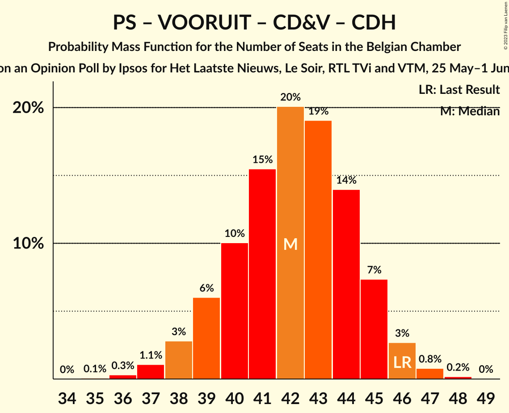

| Number of Seats | Probability | Accumulated | Special Marks |
|:---------------:|:-----------:|:-----------:|:-------------:|
| 35 | 0.1% | 100% |  |
| 36 | 0.3% | 99.9% |  |
| 37 | 1.1% | 99.6% |  |
| 38 | 3% | 98.5% |  |
| 39 | 6% | 96% |  |
| 40 | 10% | 90% |  |
| 41 | 15% | 80% |  |
| 42 | 20% | 64% |  |
| 43 | 19% | 44% | Median |
| 44 | 14% | 25% |  |
| 45 | 7% | 11% |  |
| 46 | 3% | 4% | Last Result |
| 47 | 0.8% | 1.0% |  |
| 48 | 0.2% | 0.2% |  |
| 49 | 0% | 0% |  |

### Open Vlaamse Liberalen en Democraten – Mouvement Réformateur – Christen-Democratisch en Vlaams – Centre démocrate humaniste

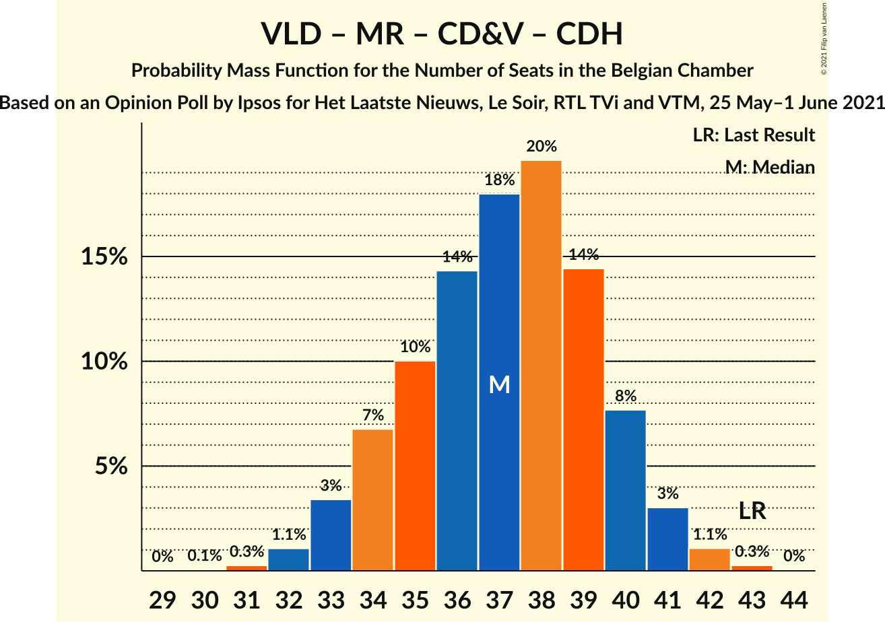

| Number of Seats | Probability | Accumulated | Special Marks |
|:---------------:|:-----------:|:-----------:|:-------------:|
| 30 | 0.1% | 100% |  |
| 31 | 0.3% | 99.9% |  |
| 32 | 1.1% | 99.7% |  |
| 33 | 3% | 98.6% |  |
| 34 | 7% | 95% |  |
| 35 | 10% | 88% |  |
| 36 | 14% | 78% |  |
| 37 | 18% | 64% |  |
| 38 | 20% | 46% | Median |
| 39 | 14% | 27% |  |
| 40 | 8% | 12% |  |
| 41 | 3% | 4% |  |
| 42 | 1.1% | 1.4% |  |
| 43 | 0.3% | 0.3% | Last Result |
| 44 | 0% | 0% |  |

## Technical Information

### Opinion Poll

+ **Polling firm:** Ipsos
+ **Commissioner(s):** Het Laatste Nieuws, Le Soir, RTL TVi and VTM
+ **Fieldwork period:** 25 May–1 June 2021

### Calculations

+ **Sample size:** 1621
+ **Simulations done:** 1,048,576
+ **Error estimate:** 0.88%

