# Opinion Poll by Ipsos for Het Laatste Nieuws, Le Soir, RTL TVi and VTM, 7–14 September 2021

Areas included: Brussels, Flanders, Wallonia

<a href="#voting-intentions">Voting Intentions</a> | <a href="#seats">Seats</a> | <a href="#coalitions">Coalitions</a> | <a href="#technical-information">Technical Information</a>

## Voting Intentions

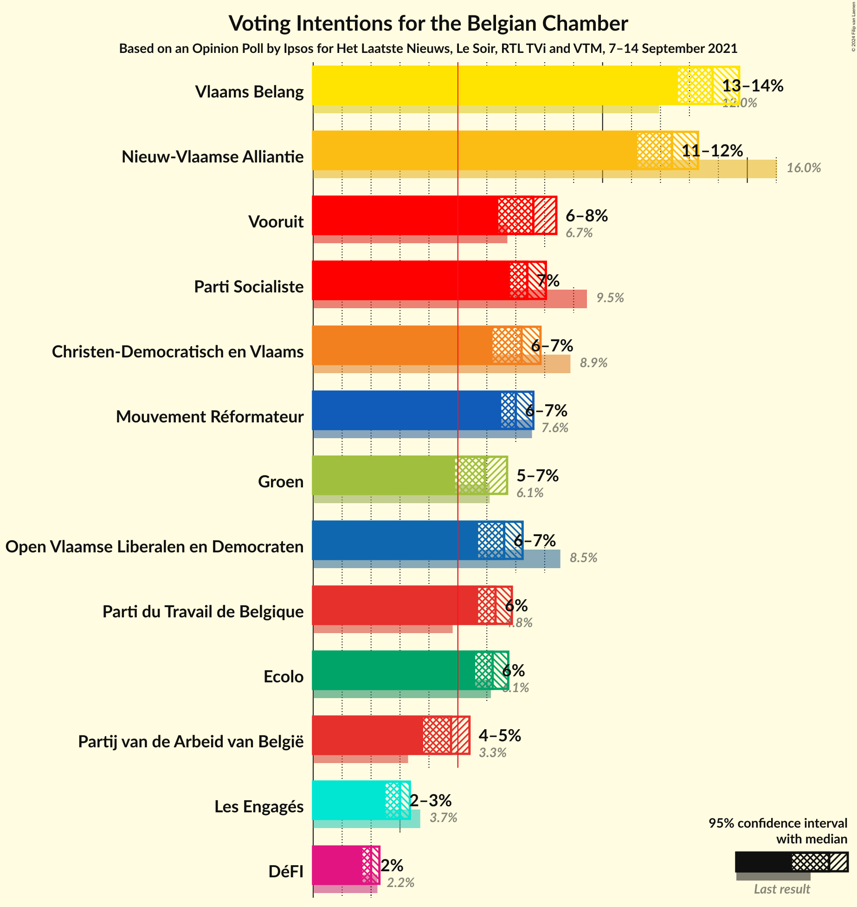

### Confidence Intervals

| Party | Last Result | Poll Result | 80% Confidence Interval | 90% Confidence Interval | 95% Confidence Interval | 99% Confidence Interval |
|:-----:|:-----------:|:-----------:|:-----------------------:|:-----------------------:|:-----------------------:|:-----------------------:|
| Vlaams Belang | 12.0% | 14.7% | 12.9–13.8% |12.7–13.8% |12.6–13.8% |12.2–13.8% |
| Nieuw-Vlaamse Alliantie | 16.0% | 13.3% | 11.6–12.4% |11.4–12.4% |11.2–12.4% |10.9–12.5% |
| Parti Socialiste | 9.5% | 8.0% | 7.0–7.4% |6.9–7.4% |6.8–7.4% |6.6–7.4% |
| Christen-Democratisch en Vlaams | 8.9% | 7.9% | 6.5–7.1% |6.4–7.2% |6.2–7.2% |5.9–7.2% |
| Vooruit | 6.7% | 7.6% | 6.8–8.2% |6.6–8.3% |6.4–8.4% |6.1–8.4% |
| Mouvement Réformateur | 7.6% | 7.6% | 6.6–7.0% |6.5–7.0% |6.5–7.0% |6.3–7.0% |
| Open Vlaamse Liberalen en Democraten | 8.5% | 7.2% | 6.0–6.6% |5.8–6.6% |5.7–6.6% |5.4–6.6% |
| Parti du Travail de Belgique | 4.8% | 6.9% | 5.9–6.3% |5.8–6.3% |5.7–6.3% |5.6–6.3% |
| Ecolo | 6.1% | 6.7% | 5.8–6.2% |5.7–6.2% |5.6–6.2% |5.5–6.2% |
| Groen | 6.1% | 5.9% | 5.2–6.5% |5.0–6.6% |4.9–6.7% |4.6–6.7% |
| Partij van de Arbeid van België | 3.3% | 4.8% | 4.1–5.3% |4.0–5.4% |3.8–5.4% |3.6–5.5% |
| Les Engagés | 3.7% | 3.3% | 2.7–2.9% |2.6–3.0% |2.5–3.0% |2.4–3.0% |
| DéFI | 2.2% | 2.3% | 1.8–2.0% |1.7–2.0% |1.7–2.0% |1.6–2.0% |

*Note:* The poll result column reflects the actual value used in the calculations. Published results may vary slightly, and in addition be rounded to fewer digits.

## Seats

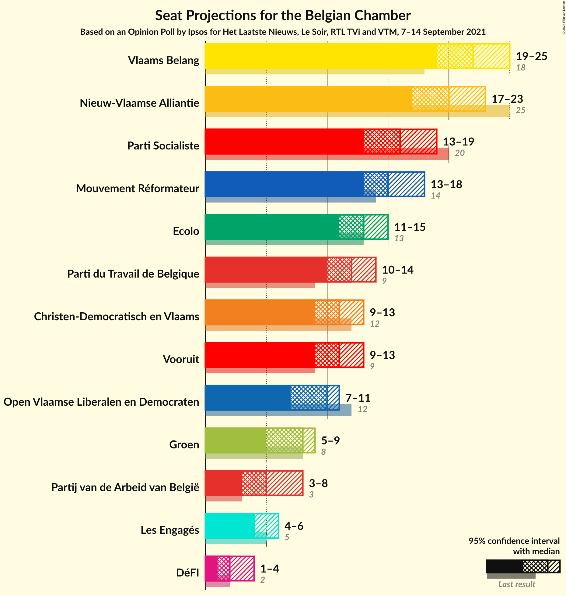

### Confidence Intervals

| Party | Last Result | Median | 80% Confidence Interval | 90% Confidence Interval | 95% Confidence Interval | 99% Confidence Interval |
|:-----:|:-----------:|:------:|:-----------------------:|:-----------------------:|:-----------------------:|:-----------------------:|
| <a href="#vlaams-belang">Vlaams Belang</a> | 18 | 22 | 20–25 |20–25 |19–25 |19–26 |
| <a href="#nieuw-vlaamse-alliantie">Nieuw-Vlaamse Alliantie</a> | 25 | 20 | 18–21 |17–22 |17–23 |16–25 |
| <a href="#parti-socialiste">Parti Socialiste</a> | 20 | 16 | 15–18 |14–18 |13–19 |12–19 |
| <a href="#christen-democratisch-en-vlaams">Christen-Democratisch en Vlaams</a> | 12 | 11 | 10–12 |9–13 |9–13 |8–14 |
| <a href="#vooruit">Vooruit</a> | 9 | 11 | 9–12 |9–12 |9–13 |7–14 |
| <a href="#mouvement-réformateur">Mouvement Réformateur</a> | 14 | 15 | 13–17 |13–17 |13–18 |13–18 |
| <a href="#open-vlaamse-liberalen-en-democraten">Open Vlaamse Liberalen en Democraten</a> | 12 | 10 | 9–11 |8–11 |7–11 |6–12 |
| <a href="#parti-du-travail-de-belgique">Parti du Travail de Belgique</a> | 9 | 12 | 11–13 |11–14 |10–14 |10–16 |
| <a href="#ecolo">Ecolo</a> | 13 | 13 | 12–14 |12–15 |11–15 |11–16 |
| <a href="#groen">Groen</a> | 8 | 8 | 6–9 |6–9 |5–9 |5–10 |
| <a href="#partij-van-de-arbeid-van-belgië">Partij van de Arbeid van België</a> | 3 | 5 | 5–8 |4–8 |3–8 |3–8 |
| <a href="#les-engagés">Les Engagés</a> | 5 | 4 | 4–5 |4–5 |4–6 |4–7 |
| <a href="#défi">DéFI</a> | 2 | 2 | 1–3 |1–4 |1–4 |1–4 |

### Vlaams Belang

*For a full overview of the results for this party, see the [Vlaams Belang](party-vlaamsbelang.html) page.*

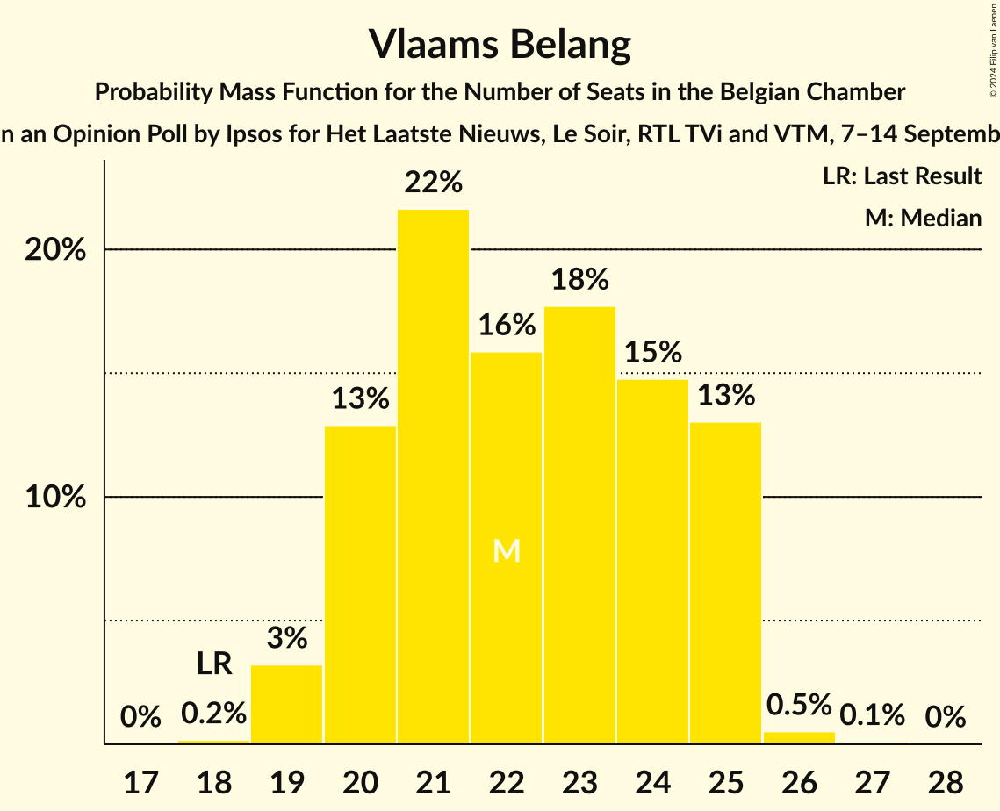

| Number of Seats | Probability | Accumulated | Special Marks |
|:---------------:|:-----------:|:-----------:|:-------------:|
| 18 | 0.2% | 100% | Last Result |
| 19 | 3% | 99.8% |  |
| 20 | 13% | 97% |  |
| 21 | 22% | 84% |  |
| 22 | 16% | 62% | Median |
| 23 | 18% | 46% |  |
| 24 | 15% | 28% |  |
| 25 | 13% | 14% |  |
| 26 | 0.5% | 0.6% |  |
| 27 | 0.1% | 0.1% |  |
| 28 | 0% | 0% |  |

### Nieuw-Vlaamse Alliantie

*For a full overview of the results for this party, see the [Nieuw-Vlaamse Alliantie](party-nieuw-vlaamsealliantie.html) page.*

| Number of Seats | Probability | Accumulated | Special Marks |
|:---------------:|:-----------:|:-----------:|:-------------:|
| 15 | 0.1% | 100% |  |
| 16 | 2% | 99.9% |  |
| 17 | 4% | 98% |  |
| 18 | 7% | 94% |  |
| 19 | 18% | 87% |  |
| 20 | 46% | 69% | Median |
| 21 | 18% | 24% |  |
| 22 | 3% | 6% |  |
| 23 | 2% | 3% |  |
| 24 | 0.7% | 1.2% |  |
| 25 | 0.5% | 0.5% | Last Result |
| 26 | 0% | 0% |  |

### Parti Socialiste

*For a full overview of the results for this party, see the [Parti Socialiste](party-partisocialiste.html) page.*

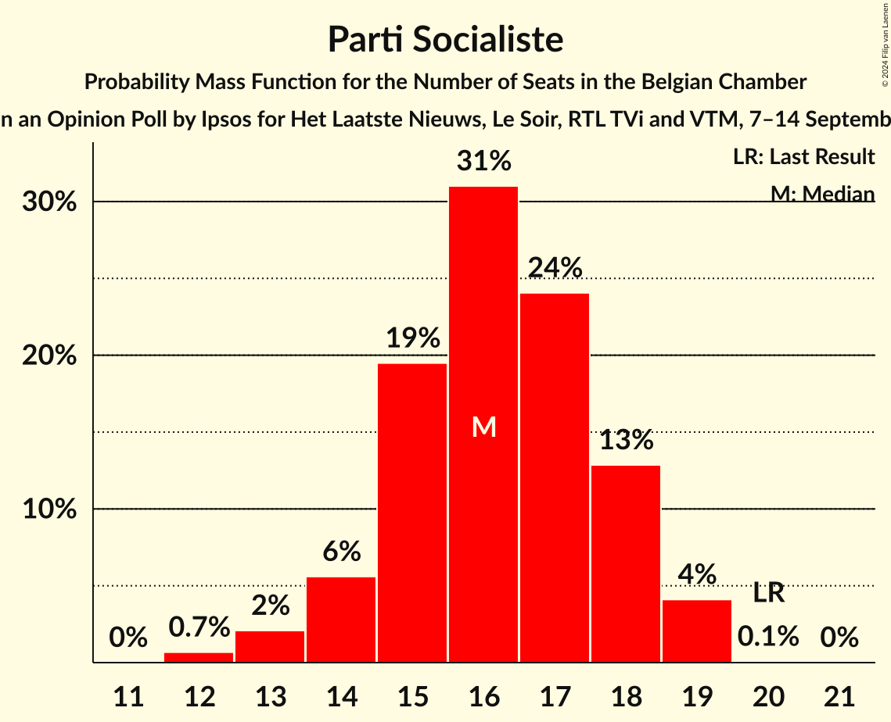

| Number of Seats | Probability | Accumulated | Special Marks |
|:---------------:|:-----------:|:-----------:|:-------------:|
| 12 | 0.7% | 100% |  |
| 13 | 2% | 99.3% |  |
| 14 | 6% | 97% |  |
| 15 | 19% | 92% |  |
| 16 | 31% | 72% | Median |
| 17 | 24% | 41% |  |
| 18 | 13% | 17% |  |
| 19 | 4% | 4% |  |
| 20 | 0.1% | 0.1% | Last Result |
| 21 | 0% | 0% |  |

### Christen-Democratisch en Vlaams

*For a full overview of the results for this party, see the [Christen-Democratisch en Vlaams](party-christen-democratischenvlaams.html) page.*

| Number of Seats | Probability | Accumulated | Special Marks |
|:---------------:|:-----------:|:-----------:|:-------------:|
| 7 | 0% | 100% |  |
| 8 | 0.4% | 99.9% |  |
| 9 | 6% | 99.5% |  |
| 10 | 40% | 94% |  |
| 11 | 37% | 54% | Median |
| 12 | 9% | 16% | Last Result |
| 13 | 6% | 8% |  |
| 14 | 2% | 2% |  |
| 15 | 0.1% | 0.1% |  |
| 16 | 0% | 0% |  |

### Vooruit

*For a full overview of the results for this party, see the [Vooruit](party-vooruit.html) page.*

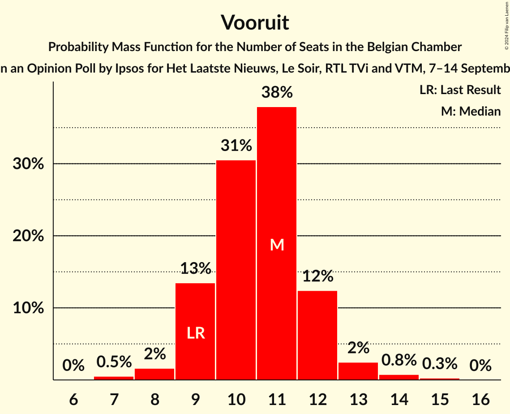

| Number of Seats | Probability | Accumulated | Special Marks |
|:---------------:|:-----------:|:-----------:|:-------------:|
| 7 | 0.5% | 100% |  |
| 8 | 2% | 99.5% |  |
| 9 | 13% | 98% | Last Result |
| 10 | 31% | 84% |  |
| 11 | 38% | 54% | Median |
| 12 | 12% | 16% |  |
| 13 | 2% | 3% |  |
| 14 | 0.8% | 1.0% |  |
| 15 | 0.3% | 0.3% |  |
| 16 | 0% | 0% |  |

### Mouvement Réformateur

*For a full overview of the results for this party, see the [Mouvement Réformateur](party-mouvementréformateur.html) page.*

| Number of Seats | Probability | Accumulated | Special Marks |
|:---------------:|:-----------:|:-----------:|:-------------:|
| 12 | 0.4% | 100% |  |
| 13 | 13% | 99.6% |  |
| 14 | 23% | 86% | Last Result |
| 15 | 26% | 64% | Median |
| 16 | 20% | 37% |  |
| 17 | 14% | 18% |  |
| 18 | 4% | 4% |  |
| 19 | 0.1% | 0.1% |  |
| 20 | 0% | 0% |  |

### Open Vlaamse Liberalen en Democraten

*For a full overview of the results for this party, see the [Open Vlaamse Liberalen en Democraten](party-openvlaamseliberalenendemocraten.html) page.*

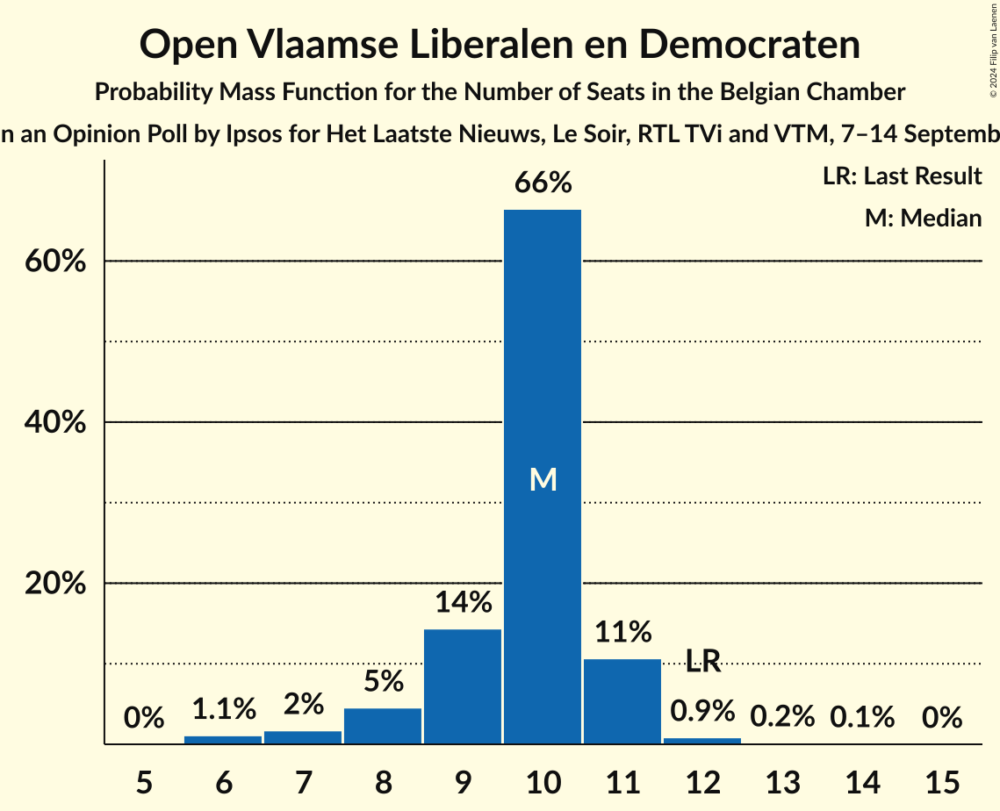

| Number of Seats | Probability | Accumulated | Special Marks |
|:---------------:|:-----------:|:-----------:|:-------------:|
| 6 | 1.1% | 100% |  |
| 7 | 2% | 98.9% |  |
| 8 | 5% | 97% |  |
| 9 | 14% | 93% |  |
| 10 | 66% | 78% | Median |
| 11 | 11% | 12% |  |
| 12 | 0.9% | 1.1% | Last Result |
| 13 | 0.2% | 0.3% |  |
| 14 | 0.1% | 0.1% |  |
| 15 | 0% | 0% |  |

### Parti du Travail de Belgique

*For a full overview of the results for this party, see the [Parti du Travail de Belgique](party-partidutravaildebelgique.html) page.*

| Number of Seats | Probability | Accumulated | Special Marks |
|:---------------:|:-----------:|:-----------:|:-------------:|
| 9 | 0.1% | 100% | Last Result |
| 10 | 3% | 99.9% |  |
| 11 | 22% | 97% |  |
| 12 | 42% | 75% | Median |
| 13 | 27% | 33% |  |
| 14 | 3% | 5% |  |
| 15 | 1.3% | 2% |  |
| 16 | 0.7% | 1.0% |  |
| 17 | 0.2% | 0.3% |  |
| 18 | 0.1% | 0.1% |  |
| 19 | 0% | 0% |  |

### Ecolo

*For a full overview of the results for this party, see the [Ecolo](party-ecolo.html) page.*

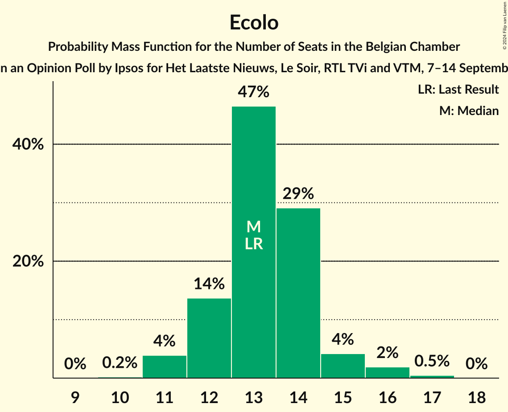

| Number of Seats | Probability | Accumulated | Special Marks |
|:---------------:|:-----------:|:-----------:|:-------------:|
| 10 | 0.2% | 100% |  |
| 11 | 4% | 99.8% |  |
| 12 | 14% | 96% |  |
| 13 | 47% | 82% | Last Result, Median |
| 14 | 29% | 36% |  |
| 15 | 4% | 7% |  |
| 16 | 2% | 2% |  |
| 17 | 0.5% | 0.5% |  |
| 18 | 0% | 0% |  |

### Groen

*For a full overview of the results for this party, see the [Groen](party-groen.html) page.*

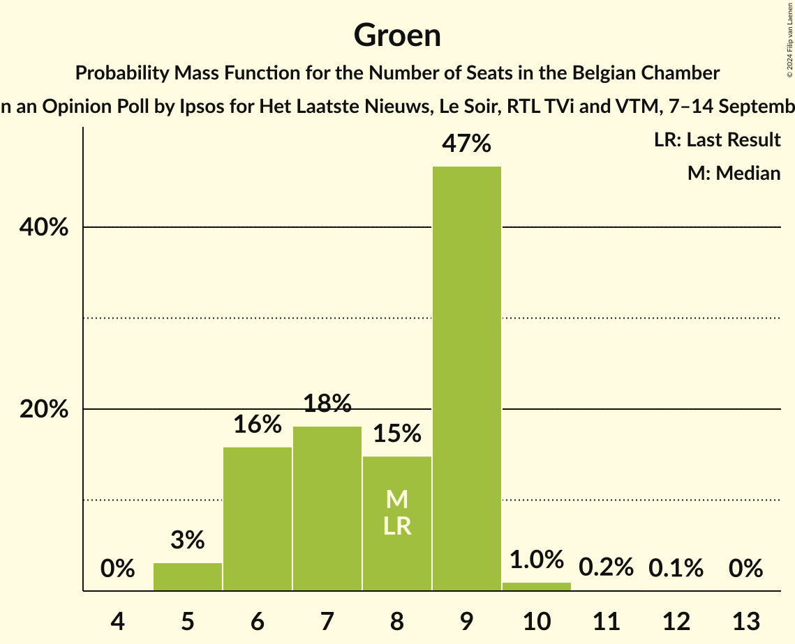

| Number of Seats | Probability | Accumulated | Special Marks |
|:---------------:|:-----------:|:-----------:|:-------------:|
| 5 | 3% | 100% |  |
| 6 | 16% | 97% |  |
| 7 | 18% | 81% |  |
| 8 | 15% | 63% | Last Result, Median |
| 9 | 47% | 48% |  |
| 10 | 1.0% | 1.2% |  |
| 11 | 0.2% | 0.2% |  |
| 12 | 0.1% | 0.1% |  |
| 13 | 0% | 0% |  |

### Partij van de Arbeid van België

*For a full overview of the results for this party, see the [Partij van de Arbeid van België](party-partijvandearbeidvanbelgië.html) page.*

| Number of Seats | Probability | Accumulated | Special Marks |
|:---------------:|:-----------:|:-----------:|:-------------:|
| 2 | 0% | 100% |  |
| 3 | 3% | 99.9% | Last Result |
| 4 | 5% | 97% |  |
| 5 | 46% | 92% | Median |
| 6 | 14% | 47% |  |
| 7 | 15% | 32% |  |
| 8 | 18% | 18% |  |
| 9 | 0.1% | 0.1% |  |
| 10 | 0% | 0% |  |

### Les Engagés

*For a full overview of the results for this party, see the [Les Engagés](party-lesengagés.html) page.*

| Number of Seats | Probability | Accumulated | Special Marks |
|:---------------:|:-----------:|:-----------:|:-------------:|
| 4 | 82% | 100% | Median |
| 5 | 14% | 18% | Last Result |
| 6 | 2% | 3% |  |
| 7 | 0.6% | 0.9% |  |
| 8 | 0.2% | 0.2% |  |
| 9 | 0% | 0% |  |

### DéFI

*For a full overview of the results for this party, see the [DéFI](party-défi.html) page.*

| Number of Seats | Probability | Accumulated | Special Marks |
|:---------------:|:-----------:|:-----------:|:-------------:|
| 1 | 24% | 100% |  |
| 2 | 52% | 76% | Last Result, Median |
| 3 | 15% | 24% |  |
| 4 | 9% | 9% |  |
| 5 | 0.1% | 0.1% |  |
| 6 | 0% | 0% |  |

## Coalitions

### Confidence Intervals

| Coalition | Last Result | Median | Majority? | 80% Confidence Interval | 90% Confidence Interval | 95% Confidence Interval | 99% Confidence Interval |
|:---------:|:-----------:|:------:|:---------:|:-----------------------:|:-----------------------:|:-----------------------:|:-----------------------:|
| Parti Socialiste – Christen-Democratisch en Vlaams – Mouvement Réformateur – Vooruit – Open Vlaamse Liberalen en Democraten – Ecolo – Groen – Les Engagés | 93 | 88 | 100% | 85–91 | 84–91 | 84–92 | 82–93 |
| Parti Socialiste – Christen-Democratisch en Vlaams – Mouvement Réformateur – Vooruit – Open Vlaamse Liberalen en Democraten – Ecolo – Groen | 88 | 84 | 100% | 81–87 | 80–87 | 79–88 | 78–89 |
| Parti Socialiste – Christen-Democratisch en Vlaams – Vooruit – Parti du Travail de Belgique – Ecolo – Groen – Partij van de Arbeid van België – Les Engagés | 79 | 81 | 98.9% | 78–84 | 77–85 | 76–86 | 75–87 |
| Parti Socialiste – Mouvement Réformateur – Vooruit – Open Vlaamse Liberalen en Democraten – Ecolo – Groen | 76 | 73 | 11% | 70–76 | 69–76 | 69–77 | 67–78 |
| Nieuw-Vlaamse Alliantie – Parti Socialiste – Mouvement Réformateur – Vooruit – Open Vlaamse Liberalen en Democraten | 80 | 72 | 3% | 69–74 | 68–75 | 67–76 | 66–77 |
| Parti Socialiste – Vooruit – Parti du Travail de Belgique – Ecolo – Groen – Partij van de Arbeid van België – Les Engagés | 67 | 70 | 1.0% | 67–73 | 66–74 | 66–75 | 64–76 |
| Parti Socialiste – Christen-Democratisch en Vlaams – Mouvement Réformateur – Vooruit – Open Vlaamse Liberalen en Democraten – Les Engagés | 72 | 67 | 0% | 64–69 | 63–70 | 62–71 | 61–72 |
| Parti Socialiste – Vooruit – Parti du Travail de Belgique – Ecolo – Groen – Partij van de Arbeid van België | 62 | 66 | 0% | 63–69 | 62–70 | 61–71 | 60–72 |
| Parti Socialiste – Christen-Democratisch en Vlaams – Vooruit – Ecolo – Groen – Les Engagés | 67 | 63 | 0% | 60–66 | 59–67 | 58–68 | 57–69 |
| Christen-Democratisch en Vlaams – Mouvement Réformateur – Open Vlaamse Liberalen en Democraten – Ecolo – Groen – Les Engagés | 64 | 61 | 0% | 58–64 | 57–64 | 57–65 | 55–66 |
| Nieuw-Vlaamse Alliantie – Christen-Democratisch en Vlaams – Mouvement Réformateur – Open Vlaamse Liberalen en Democraten – Les Engagés | 68 | 60 | 0% | 57–63 | 56–63 | 55–64 | 54–66 |
| Parti Socialiste – Christen-Democratisch en Vlaams – Mouvement Réformateur – Open Vlaamse Liberalen en Democraten – Les Engagés | 63 | 56 | 0% | 54–58 | 53–59 | 52–60 | 51–61 |
| Nieuw-Vlaamse Alliantie – Christen-Democratisch en Vlaams – Mouvement Réformateur – Open Vlaamse Liberalen en Democraten | 63 | 55 | 0% | 53–58 | 52–59 | 51–60 | 50–61 |
| Parti Socialiste – Mouvement Réformateur – Vooruit – Open Vlaamse Liberalen en Democraten | 55 | 52 | 0% | 49–54 | 48–55 | 48–55 | 46–57 |
| Parti Socialiste – Christen-Democratisch en Vlaams – Vooruit – Les Engagés | 46 | 42 | 0% | 39–44 | 39–45 | 38–46 | 37–47 |
| Christen-Democratisch en Vlaams – Mouvement Réformateur – Open Vlaamse Liberalen en Democraten – Les Engagés | 43 | 40 | 0% | 37–42 | 37–43 | 36–44 | 35–45 |

### Parti Socialiste – Christen-Democratisch en Vlaams – Mouvement Réformateur – Vooruit – Open Vlaamse Liberalen en Democraten – Ecolo – Groen – Les Engagés

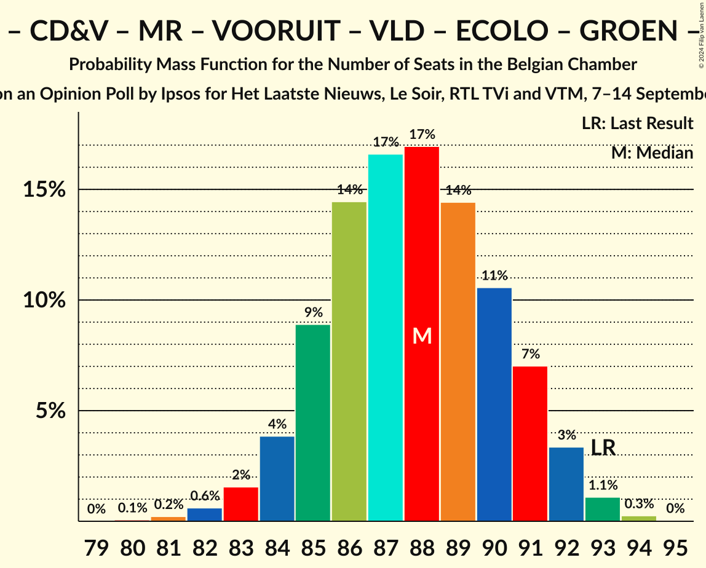

| Number of Seats | Probability | Accumulated | Special Marks |
|:---------------:|:-----------:|:-----------:|:-------------:|
| 80 | 0.1% | 100% |  |
| 81 | 0.2% | 99.9% |  |
| 82 | 0.6% | 99.7% |  |
| 83 | 2% | 99.1% |  |
| 84 | 4% | 98% |  |
| 85 | 9% | 94% |  |
| 86 | 14% | 85% |  |
| 87 | 17% | 70% |  |
| 88 | 17% | 54% | Median |
| 89 | 14% | 37% |  |
| 90 | 11% | 22% |  |
| 91 | 7% | 12% |  |
| 92 | 3% | 5% |  |
| 93 | 1.1% | 1.4% | Last Result |
| 94 | 0.3% | 0.3% |  |
| 95 | 0% | 0% |  |

### Parti Socialiste – Christen-Democratisch en Vlaams – Mouvement Réformateur – Vooruit – Open Vlaamse Liberalen en Democraten – Ecolo – Groen

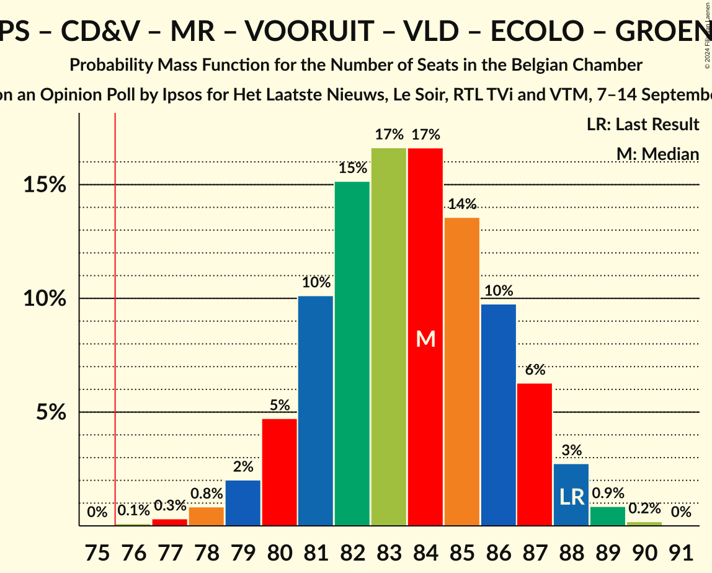

| Number of Seats | Probability | Accumulated | Special Marks |
|:---------------:|:-----------:|:-----------:|:-------------:|
| 76 | 0.1% | 100% | Majority |
| 77 | 0.3% | 99.9% |  |
| 78 | 0.8% | 99.5% |  |
| 79 | 2% | 98.7% |  |
| 80 | 5% | 97% |  |
| 81 | 10% | 92% |  |
| 82 | 15% | 82% |  |
| 83 | 17% | 67% |  |
| 84 | 17% | 50% | Median |
| 85 | 14% | 33% |  |
| 86 | 10% | 20% |  |
| 87 | 6% | 10% |  |
| 88 | 3% | 4% | Last Result |
| 89 | 0.9% | 1.1% |  |
| 90 | 0.2% | 0.2% |  |
| 91 | 0% | 0% |  |

### Parti Socialiste – Christen-Democratisch en Vlaams – Vooruit – Parti du Travail de Belgique – Ecolo – Groen – Partij van de Arbeid van België – Les Engagés

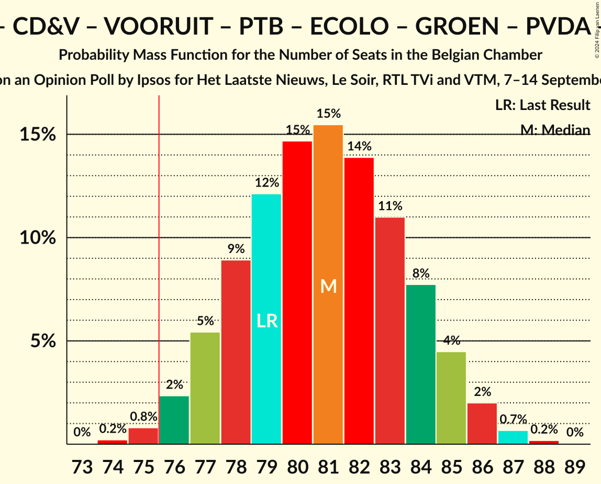

| Number of Seats | Probability | Accumulated | Special Marks |
|:---------------:|:-----------:|:-----------:|:-------------:|
| 73 | 0% | 100% |  |
| 74 | 0.2% | 99.9% |  |
| 75 | 0.8% | 99.7% |  |
| 76 | 2% | 98.9% | Majority |
| 77 | 5% | 97% |  |
| 78 | 9% | 91% |  |
| 79 | 12% | 82% | Last Result |
| 80 | 15% | 70% | Median |
| 81 | 15% | 55% |  |
| 82 | 14% | 40% |  |
| 83 | 11% | 26% |  |
| 84 | 8% | 15% |  |
| 85 | 4% | 7% |  |
| 86 | 2% | 3% |  |
| 87 | 0.7% | 0.9% |  |
| 88 | 0.2% | 0.2% |  |
| 89 | 0% | 0% |  |

### Parti Socialiste – Mouvement Réformateur – Vooruit – Open Vlaamse Liberalen en Democraten – Ecolo – Groen

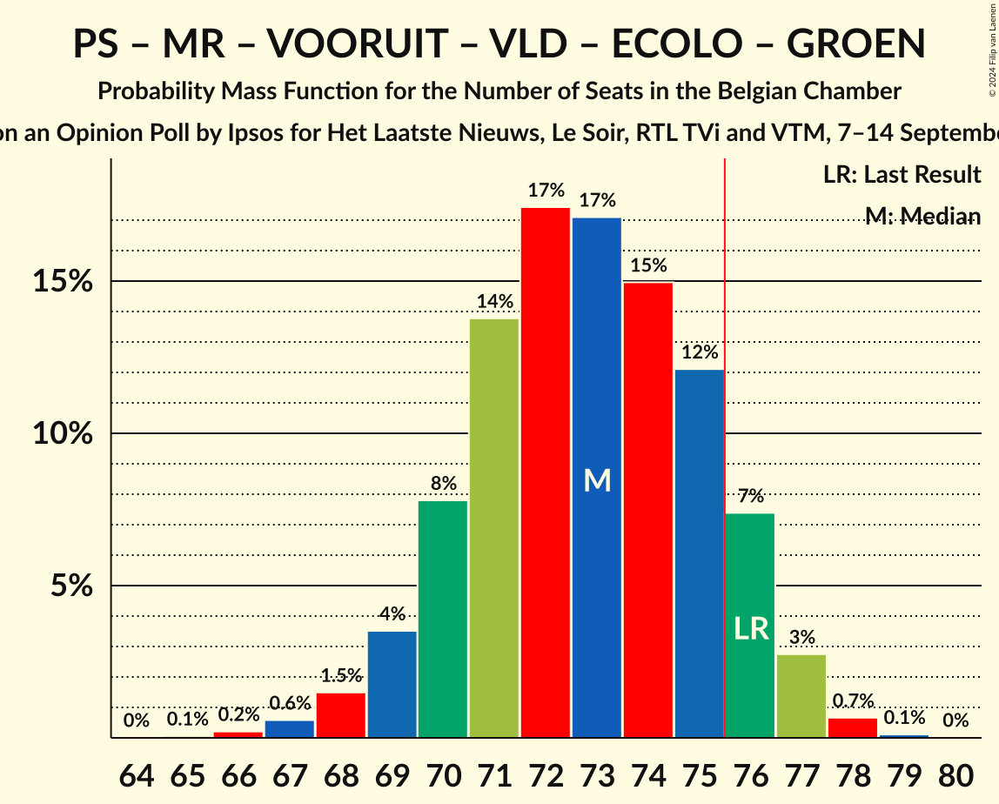

| Number of Seats | Probability | Accumulated | Special Marks |
|:---------------:|:-----------:|:-----------:|:-------------:|
| 65 | 0.1% | 100% |  |
| 66 | 0.2% | 99.9% |  |
| 67 | 0.6% | 99.7% |  |
| 68 | 1.5% | 99.1% |  |
| 69 | 4% | 98% |  |
| 70 | 8% | 94% |  |
| 71 | 14% | 86% |  |
| 72 | 17% | 73% |  |
| 73 | 17% | 55% | Median |
| 74 | 15% | 38% |  |
| 75 | 12% | 23% |  |
| 76 | 7% | 11% | Last Result, Majority |
| 77 | 3% | 4% |  |
| 78 | 0.7% | 0.8% |  |
| 79 | 0.1% | 0.1% |  |
| 80 | 0% | 0% |  |

### Nieuw-Vlaamse Alliantie – Parti Socialiste – Mouvement Réformateur – Vooruit – Open Vlaamse Liberalen en Democraten

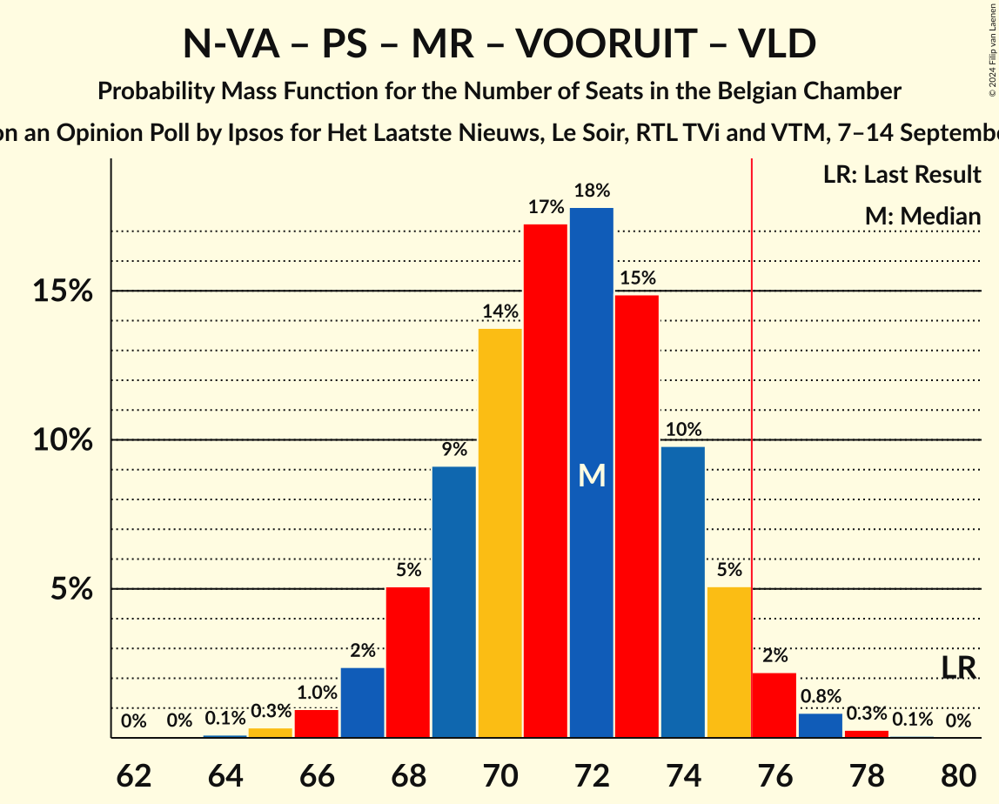

| Number of Seats | Probability | Accumulated | Special Marks |
|:---------------:|:-----------:|:-----------:|:-------------:|
| 64 | 0.1% | 100% |  |
| 65 | 0.3% | 99.9% |  |
| 66 | 1.0% | 99.5% |  |
| 67 | 2% | 98.5% |  |
| 68 | 5% | 96% |  |
| 69 | 9% | 91% |  |
| 70 | 14% | 82% |  |
| 71 | 17% | 68% |  |
| 72 | 18% | 51% | Median |
| 73 | 15% | 33% |  |
| 74 | 10% | 18% |  |
| 75 | 5% | 8% |  |
| 76 | 2% | 3% | Majority |
| 77 | 0.8% | 1.2% |  |
| 78 | 0.3% | 0.4% |  |
| 79 | 0.1% | 0.1% |  |
| 80 | 0% | 0% | Last Result |

### Parti Socialiste – Vooruit – Parti du Travail de Belgique – Ecolo – Groen – Partij van de Arbeid van België – Les Engagés

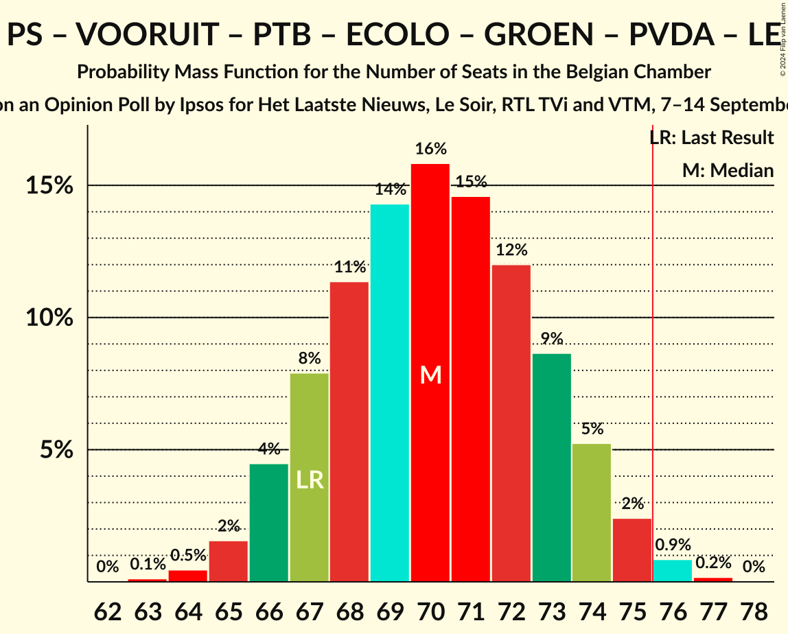

| Number of Seats | Probability | Accumulated | Special Marks |
|:---------------:|:-----------:|:-----------:|:-------------:|
| 63 | 0.1% | 100% |  |
| 64 | 0.5% | 99.8% |  |
| 65 | 2% | 99.4% |  |
| 66 | 4% | 98% |  |
| 67 | 8% | 93% | Last Result |
| 68 | 11% | 85% |  |
| 69 | 14% | 74% | Median |
| 70 | 16% | 60% |  |
| 71 | 15% | 44% |  |
| 72 | 12% | 29% |  |
| 73 | 9% | 17% |  |
| 74 | 5% | 9% |  |
| 75 | 2% | 3% |  |
| 76 | 0.9% | 1.0% | Majority |
| 77 | 0.2% | 0.2% |  |
| 78 | 0% | 0% |  |

### Parti Socialiste – Christen-Democratisch en Vlaams – Mouvement Réformateur – Vooruit – Open Vlaamse Liberalen en Democraten – Les Engagés

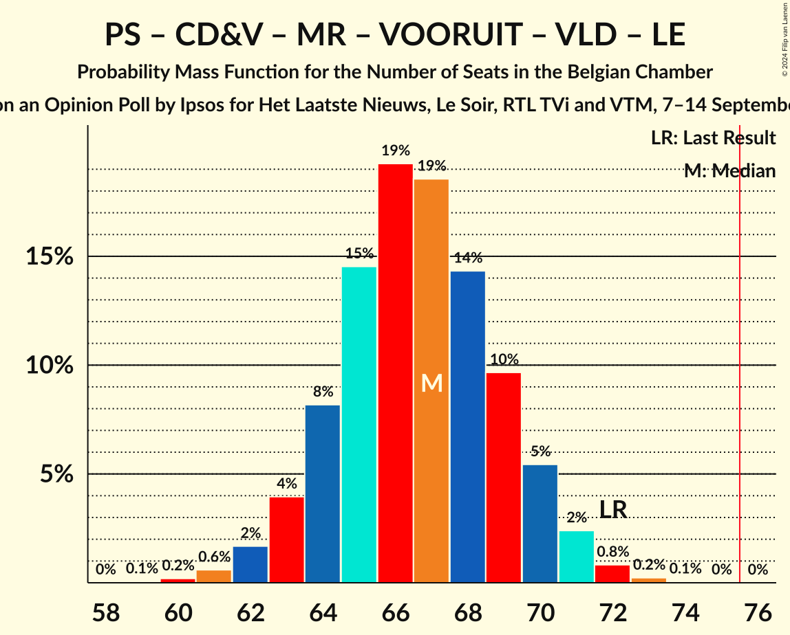

| Number of Seats | Probability | Accumulated | Special Marks |
|:---------------:|:-----------:|:-----------:|:-------------:|
| 59 | 0.1% | 100% |  |
| 60 | 0.2% | 99.9% |  |
| 61 | 0.6% | 99.7% |  |
| 62 | 2% | 99.1% |  |
| 63 | 4% | 97% |  |
| 64 | 8% | 93% |  |
| 65 | 15% | 85% |  |
| 66 | 19% | 71% |  |
| 67 | 19% | 52% | Median |
| 68 | 14% | 33% |  |
| 69 | 10% | 19% |  |
| 70 | 5% | 9% |  |
| 71 | 2% | 4% |  |
| 72 | 0.8% | 1.1% | Last Result |
| 73 | 0.2% | 0.3% |  |
| 74 | 0.1% | 0.1% |  |
| 75 | 0% | 0% |  |

### Parti Socialiste – Vooruit – Parti du Travail de Belgique – Ecolo – Groen – Partij van de Arbeid van België

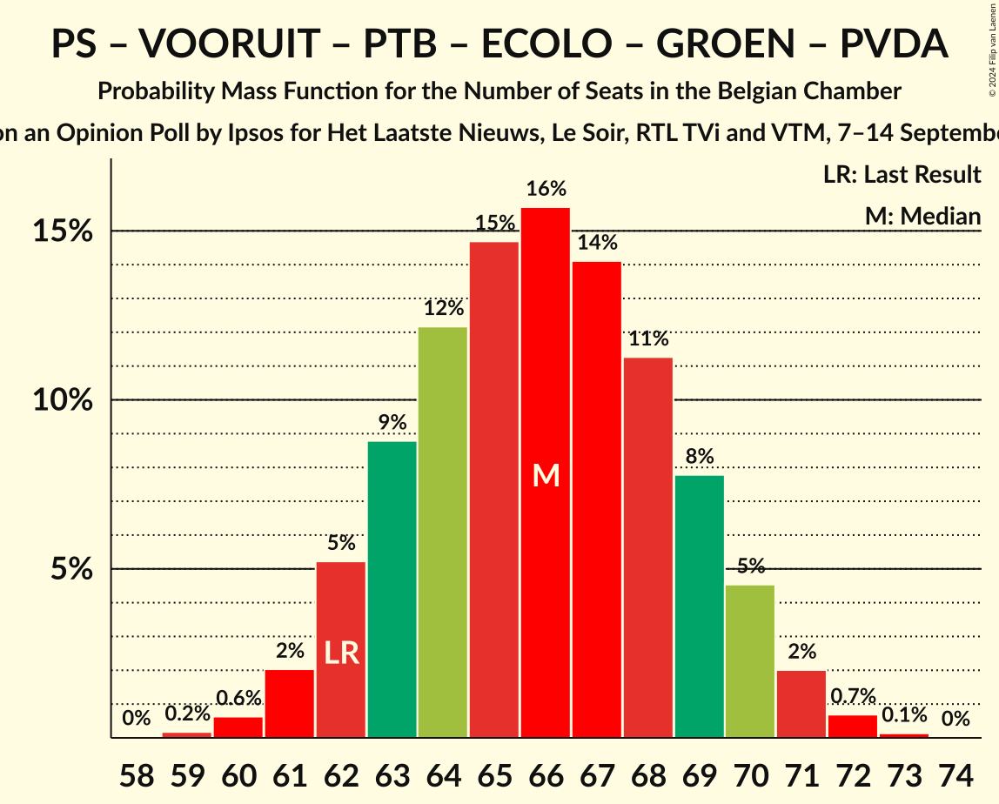

| Number of Seats | Probability | Accumulated | Special Marks |
|:---------------:|:-----------:|:-----------:|:-------------:|
| 59 | 0.2% | 100% |  |
| 60 | 0.6% | 99.8% |  |
| 61 | 2% | 99.1% |  |
| 62 | 5% | 97% | Last Result |
| 63 | 9% | 92% |  |
| 64 | 12% | 83% |  |
| 65 | 15% | 71% | Median |
| 66 | 16% | 56% |  |
| 67 | 14% | 41% |  |
| 68 | 11% | 26% |  |
| 69 | 8% | 15% |  |
| 70 | 5% | 7% |  |
| 71 | 2% | 3% |  |
| 72 | 0.7% | 0.8% |  |
| 73 | 0.1% | 0.2% |  |
| 74 | 0% | 0% |  |

### Parti Socialiste – Christen-Democratisch en Vlaams – Vooruit – Ecolo – Groen – Les Engagés

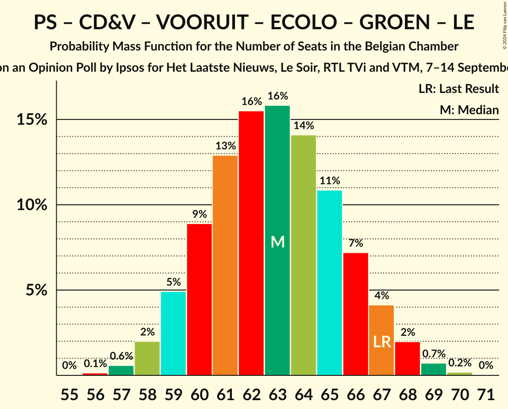

| Number of Seats | Probability | Accumulated | Special Marks |
|:---------------:|:-----------:|:-----------:|:-------------:|
| 56 | 0.1% | 100% |  |
| 57 | 0.6% | 99.8% |  |
| 58 | 2% | 99.2% |  |
| 59 | 5% | 97% |  |
| 60 | 9% | 92% |  |
| 61 | 13% | 83% |  |
| 62 | 16% | 71% |  |
| 63 | 16% | 55% | Median |
| 64 | 14% | 39% |  |
| 65 | 11% | 25% |  |
| 66 | 7% | 14% |  |
| 67 | 4% | 7% | Last Result |
| 68 | 2% | 3% |  |
| 69 | 0.7% | 0.9% |  |
| 70 | 0.2% | 0.2% |  |
| 71 | 0% | 0% |  |

### Christen-Democratisch en Vlaams – Mouvement Réformateur – Open Vlaamse Liberalen en Democraten – Ecolo – Groen – Les Engagés

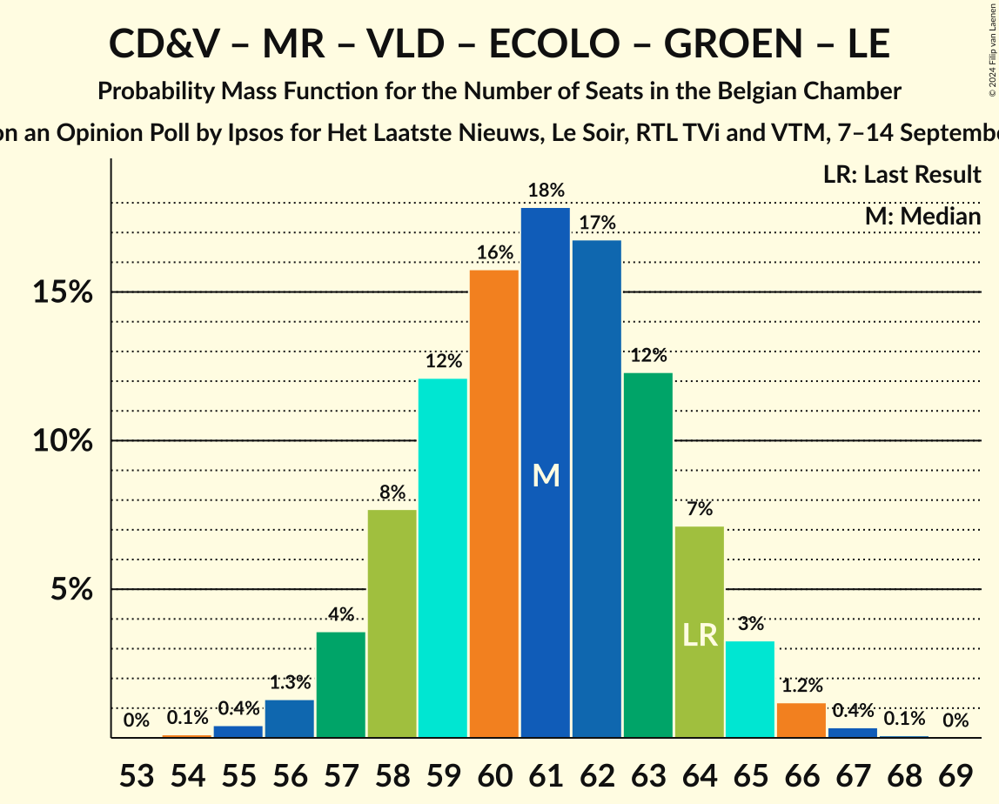

| Number of Seats | Probability | Accumulated | Special Marks |
|:---------------:|:-----------:|:-----------:|:-------------:|
| 54 | 0.1% | 100% |  |
| 55 | 0.4% | 99.9% |  |
| 56 | 1.3% | 99.4% |  |
| 57 | 4% | 98% |  |
| 58 | 8% | 95% |  |
| 59 | 12% | 87% |  |
| 60 | 16% | 75% |  |
| 61 | 18% | 59% | Median |
| 62 | 17% | 41% |  |
| 63 | 12% | 24% |  |
| 64 | 7% | 12% | Last Result |
| 65 | 3% | 5% |  |
| 66 | 1.2% | 2% |  |
| 67 | 0.4% | 0.5% |  |
| 68 | 0.1% | 0.1% |  |
| 69 | 0% | 0% |  |

### Nieuw-Vlaamse Alliantie – Christen-Democratisch en Vlaams – Mouvement Réformateur – Open Vlaamse Liberalen en Democraten – Les Engagés

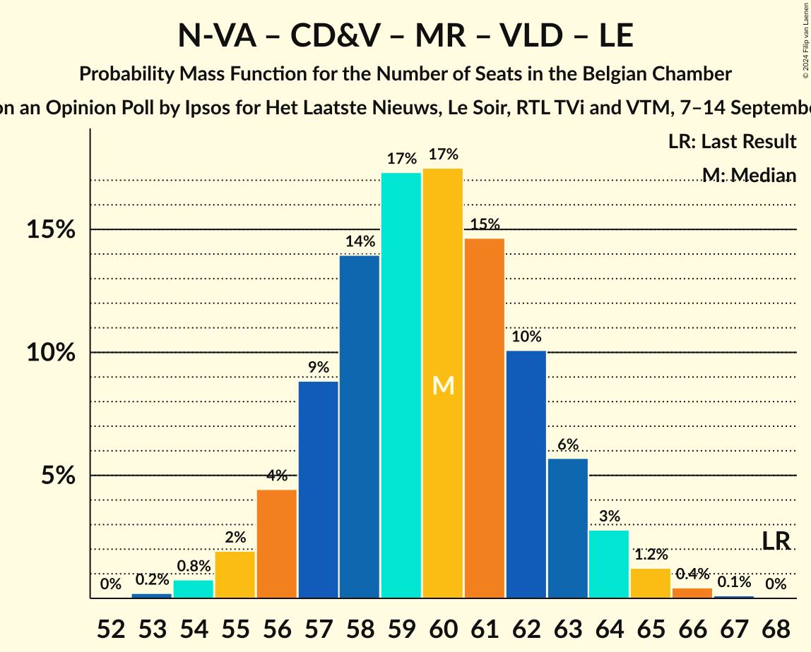

| Number of Seats | Probability | Accumulated | Special Marks |
|:---------------:|:-----------:|:-----------:|:-------------:|
| 53 | 0.2% | 100% |  |
| 54 | 0.8% | 99.8% |  |
| 55 | 2% | 99.0% |  |
| 56 | 4% | 97% |  |
| 57 | 9% | 93% |  |
| 58 | 14% | 84% |  |
| 59 | 17% | 70% |  |
| 60 | 17% | 53% | Median |
| 61 | 15% | 35% |  |
| 62 | 10% | 20% |  |
| 63 | 6% | 10% |  |
| 64 | 3% | 5% |  |
| 65 | 1.2% | 2% |  |
| 66 | 0.4% | 0.6% |  |
| 67 | 0.1% | 0.1% |  |
| 68 | 0% | 0% | Last Result |

### Parti Socialiste – Christen-Democratisch en Vlaams – Mouvement Réformateur – Open Vlaamse Liberalen en Democraten – Les Engagés

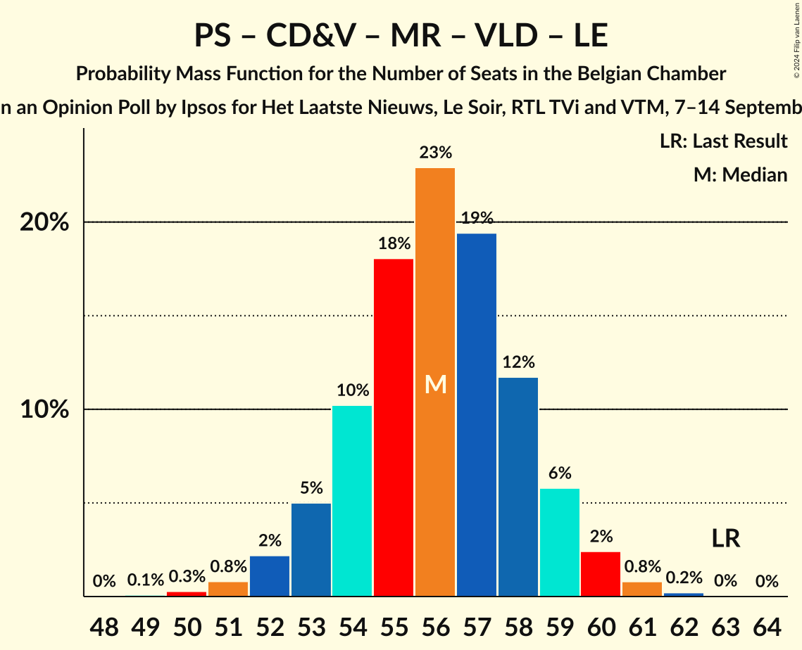

| Number of Seats | Probability | Accumulated | Special Marks |
|:---------------:|:-----------:|:-----------:|:-------------:|
| 49 | 0.1% | 100% |  |
| 50 | 0.3% | 99.9% |  |
| 51 | 0.8% | 99.6% |  |
| 52 | 2% | 98.8% |  |
| 53 | 5% | 97% |  |
| 54 | 10% | 92% |  |
| 55 | 18% | 81% |  |
| 56 | 23% | 63% | Median |
| 57 | 19% | 40% |  |
| 58 | 12% | 21% |  |
| 59 | 6% | 9% |  |
| 60 | 2% | 3% |  |
| 61 | 0.8% | 1.1% |  |
| 62 | 0.2% | 0.3% |  |
| 63 | 0% | 0.1% | Last Result |
| 64 | 0% | 0% |  |

### Nieuw-Vlaamse Alliantie – Christen-Democratisch en Vlaams – Mouvement Réformateur – Open Vlaamse Liberalen en Democraten

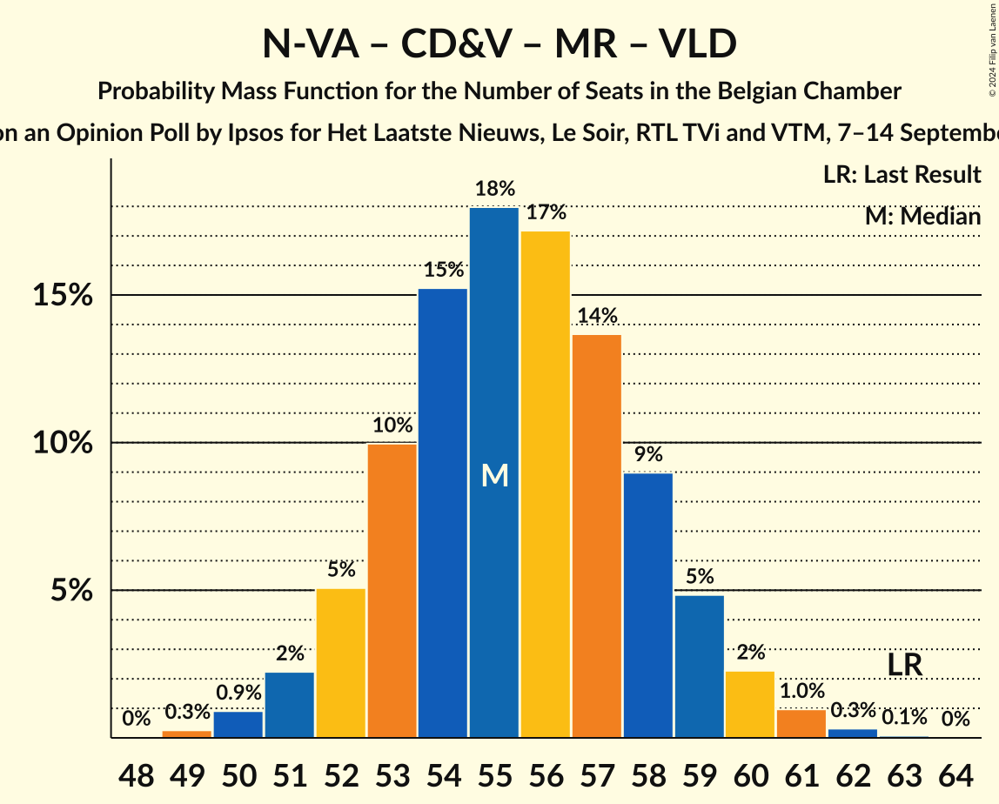

| Number of Seats | Probability | Accumulated | Special Marks |
|:---------------:|:-----------:|:-----------:|:-------------:|
| 49 | 0.3% | 100% |  |
| 50 | 0.9% | 99.7% |  |
| 51 | 2% | 98.8% |  |
| 52 | 5% | 97% |  |
| 53 | 10% | 91% |  |
| 54 | 15% | 82% |  |
| 55 | 18% | 66% |  |
| 56 | 17% | 48% | Median |
| 57 | 14% | 31% |  |
| 58 | 9% | 17% |  |
| 59 | 5% | 8% |  |
| 60 | 2% | 4% |  |
| 61 | 1.0% | 1.4% |  |
| 62 | 0.3% | 0.4% |  |
| 63 | 0.1% | 0.1% | Last Result |
| 64 | 0% | 0% |  |

### Parti Socialiste – Mouvement Réformateur – Vooruit – Open Vlaamse Liberalen en Democraten

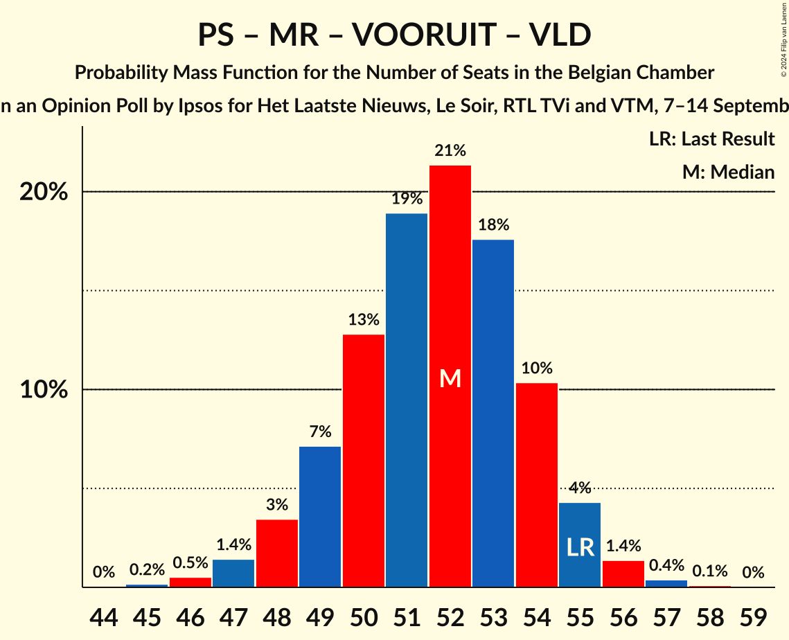

| Number of Seats | Probability | Accumulated | Special Marks |
|:---------------:|:-----------:|:-----------:|:-------------:|
| 44 | 0% | 100% |  |
| 45 | 0.2% | 99.9% |  |
| 46 | 0.5% | 99.8% |  |
| 47 | 1.4% | 99.3% |  |
| 48 | 3% | 98% |  |
| 49 | 7% | 94% |  |
| 50 | 13% | 87% |  |
| 51 | 19% | 74% |  |
| 52 | 21% | 55% | Median |
| 53 | 18% | 34% |  |
| 54 | 10% | 17% |  |
| 55 | 4% | 6% | Last Result |
| 56 | 1.4% | 2% |  |
| 57 | 0.4% | 0.5% |  |
| 58 | 0.1% | 0.1% |  |
| 59 | 0% | 0% |  |

### Parti Socialiste – Christen-Democratisch en Vlaams – Vooruit – Les Engagés

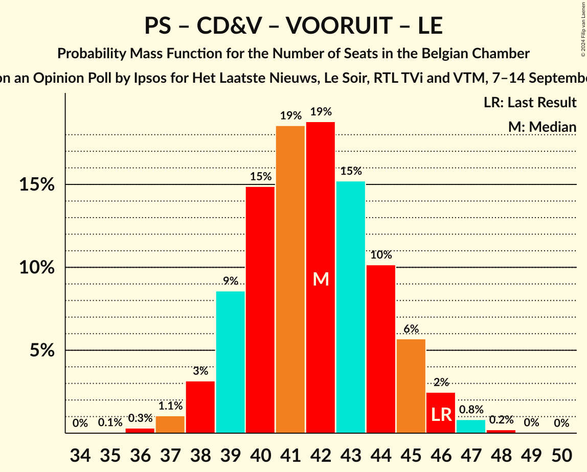

| Number of Seats | Probability | Accumulated | Special Marks |
|:---------------:|:-----------:|:-----------:|:-------------:|
| 35 | 0.1% | 100% |  |
| 36 | 0.3% | 99.9% |  |
| 37 | 1.1% | 99.6% |  |
| 38 | 3% | 98.6% |  |
| 39 | 9% | 95% |  |
| 40 | 15% | 87% |  |
| 41 | 19% | 72% |  |
| 42 | 19% | 53% | Median |
| 43 | 15% | 35% |  |
| 44 | 10% | 19% |  |
| 45 | 6% | 9% |  |
| 46 | 2% | 4% | Last Result |
| 47 | 0.8% | 1.1% |  |
| 48 | 0.2% | 0.3% |  |
| 49 | 0% | 0.1% |  |
| 50 | 0% | 0% |  |

### Christen-Democratisch en Vlaams – Mouvement Réformateur – Open Vlaamse Liberalen en Democraten – Les Engagés

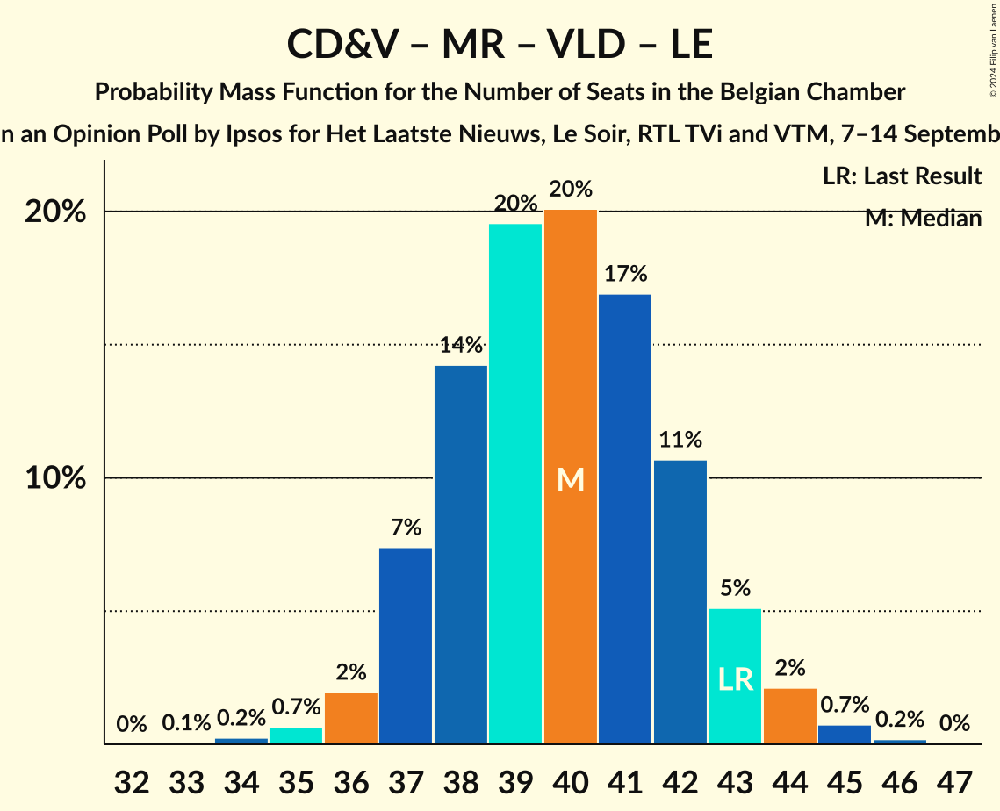

| Number of Seats | Probability | Accumulated | Special Marks |
|:---------------:|:-----------:|:-----------:|:-------------:|
| 33 | 0.1% | 100% |  |
| 34 | 0.2% | 99.9% |  |
| 35 | 0.7% | 99.7% |  |
| 36 | 2% | 99.0% |  |
| 37 | 7% | 97% |  |
| 38 | 14% | 90% |  |
| 39 | 20% | 75% |  |
| 40 | 20% | 56% | Median |
| 41 | 17% | 36% |  |
| 42 | 11% | 19% |  |
| 43 | 5% | 8% | Last Result |
| 44 | 2% | 3% |  |
| 45 | 0.7% | 1.0% |  |
| 46 | 0.2% | 0.2% |  |
| 47 | 0% | 0% |  |

## Technical Information

### Opinion Poll

+ **Polling firm:** Ipsos
+ **Commissioner(s):** Het Laatste Nieuws, Le Soir, RTL TVi and VTM
+ **Fieldwork period:** 7–14 September 2021

### Calculations

+ **Sample size:** 1617
+ **Simulations done:** 1,048,576
+ **Error estimate:** 1.83%

