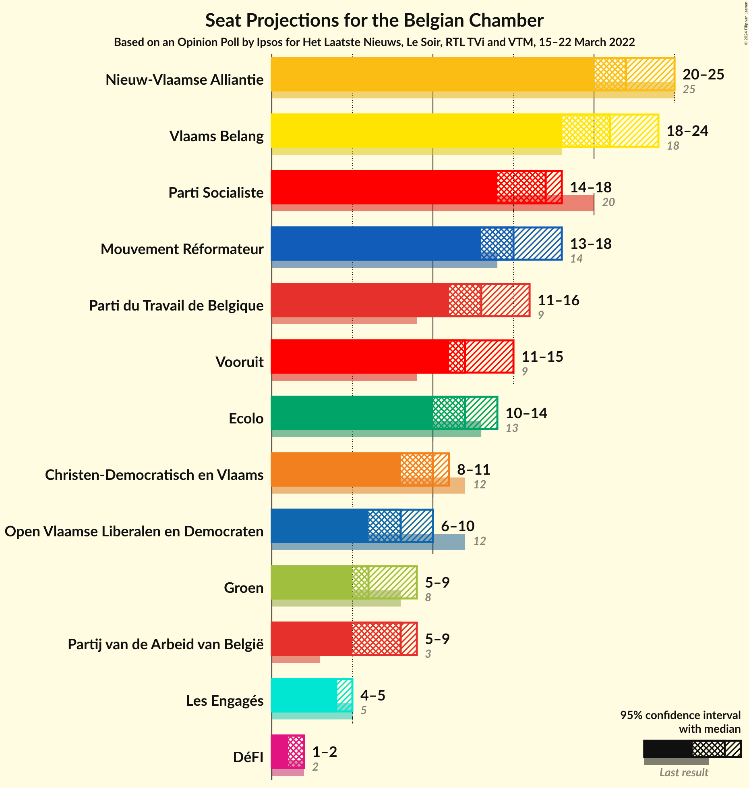
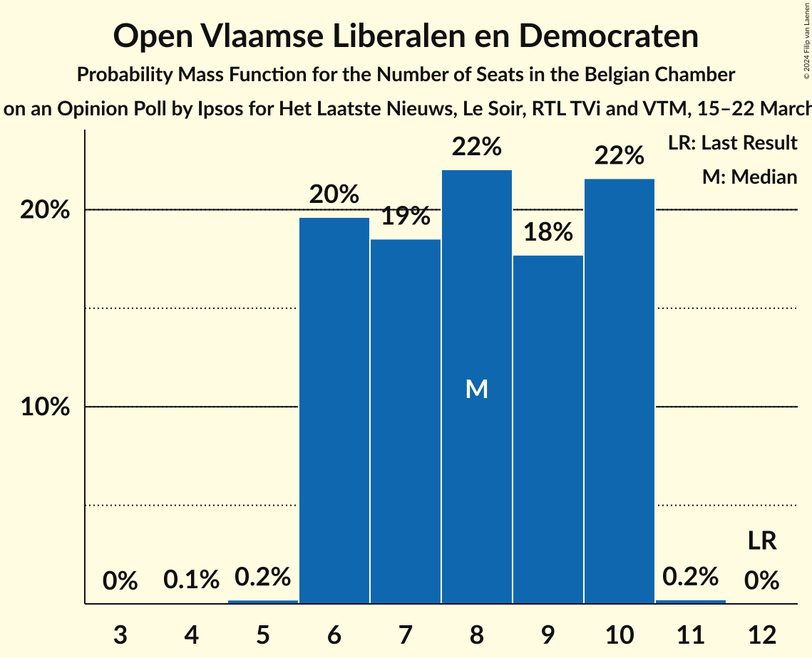
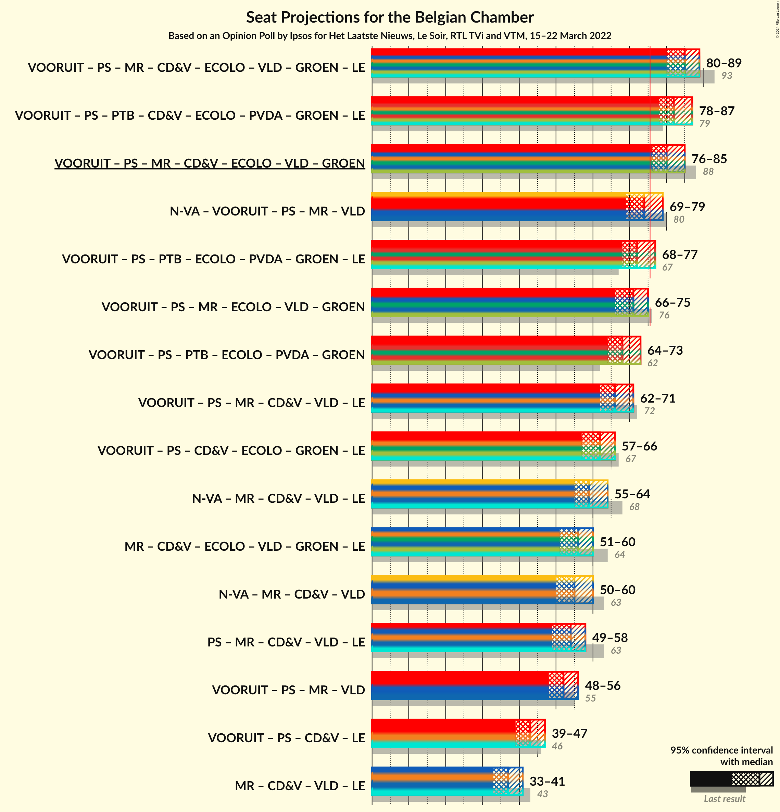
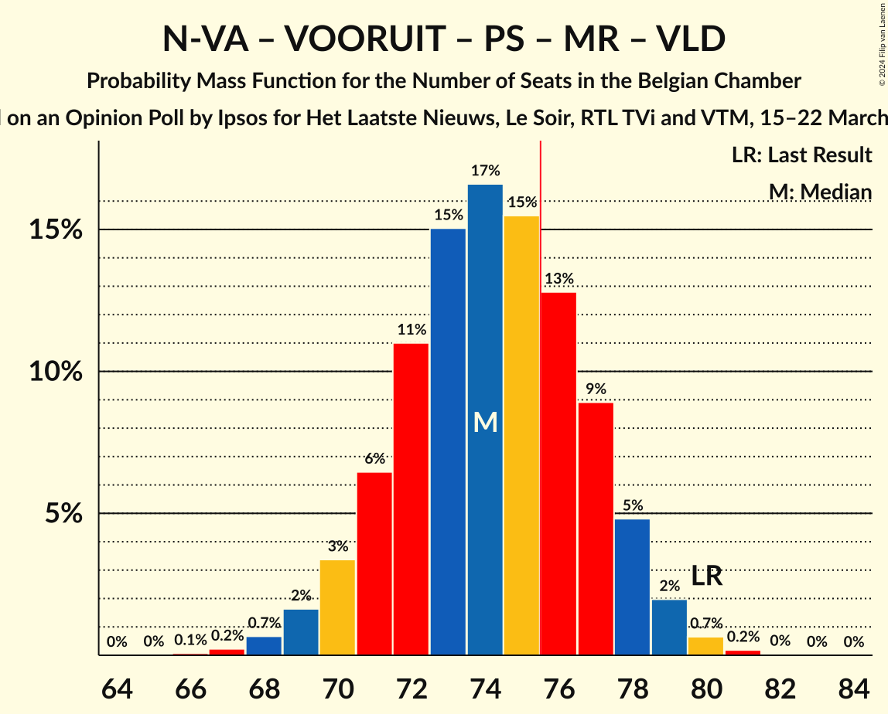
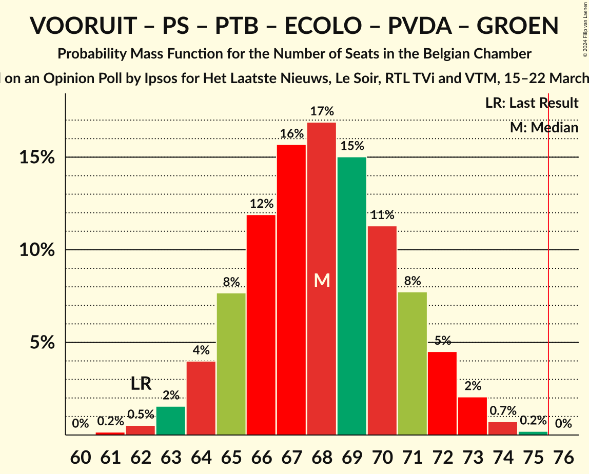

# Opinion Poll by Ipsos for Het Laatste Nieuws, Le Soir, RTL TVi and VTM, 15–22 March 2022

Areas included: Brussels, Flanders, Wallonia

<a href="#voting-intentions">Voting Intentions</a> | <a href="#seats">Seats</a> | <a href="#coalitions">Coalitions</a> | <a href="#technical-information">Technical Information</a>

## Voting Intentions

### Confidence Intervals

| Party | Last Result | Poll Result | 80% Confidence Interval | 90% Confidence Interval | 95% Confidence Interval | 99% Confidence Interval |
|:-----:|:-----------:|:-----------:|:-----------------------:|:-----------------------:|:-----------------------:|:-----------------------:|
| Nieuw-Vlaamse Alliantie | 16.0% | 14.8% | 13.0–13.8% |12.8–13.8% |12.6–13.9% |12.2–13.9% |
| Vlaams Belang | 12.0% | 14.0% | 12.2–13.0% |12.0–13.0% |11.8–13.0% |11.5–13.1% |
| Vooruit | 6.7% | 8.8% | 7.9–9.4% |7.7–9.5% |7.5–9.6% |7.1–9.7% |
| Parti Socialiste | 9.5% | 8.1% | 7.1–7.5% |7.0–7.5% |6.9–7.5% |6.7–7.5% |
| Mouvement Réformateur | 7.6% | 7.7% | 6.7–7.1% |6.6–7.1% |6.5–7.1% |6.4–7.1% |
| Parti du Travail de Belgique | 4.8% | 7.3% | 6.4–6.7% |6.3–6.7% |6.2–6.7% |6.0–6.7% |
| Christen-Democratisch en Vlaams | 8.9% | 7.0% | 5.7–6.3% |5.6–6.3% |5.4–6.3% |5.2–6.3% |
| Ecolo | 6.1% | 6.3% | 5.5–5.8% |5.4–5.8% |5.4–5.8% |5.2–5.9% |
| Open Vlaamse Liberalen en Democraten | 8.5% | 6.2% | 5.0–5.6% |4.9–5.6% |4.8–5.6% |4.5–5.6% |
| Partij van de Arbeid van België | 3.3% | 5.5% | 4.8–6.1% |4.7–6.2% |4.5–6.2% |4.2–6.3% |
| Groen | 6.1% | 5.2% | 4.6–5.7% |4.4–5.8% |4.2–5.9% |4.0–5.9% |
| Centre démocrate humaniste | 3.7% | 3.3% | 2.6–2.9% |2.6–2.9% |2.5–2.9% |2.4–2.9% |
| DéFI | 2.2% | 1.9% | 1.5–1.7% |1.5–1.7% |1.4–1.7% |1.3–1.7% |

*Note:* The poll result column reflects the actual value used in the calculations. Published results may vary slightly, and in addition be rounded to fewer digits.

## Seats

### Confidence Intervals

| Party | Last Result | Median | 80% Confidence Interval | 90% Confidence Interval | 95% Confidence Interval | 99% Confidence Interval |
|:-----:|:-----------:|:------:|:-----------------------:|:-----------------------:|:-----------------------:|:-----------------------:|
| <a href="#nieuw-vlaamse-alliantie">Nieuw-Vlaamse Alliantie</a> | 25 | 22 | 20–25 |20–25 |20–25 |18–26 |
| <a href="#vlaams-belang">Vlaams Belang</a> | 18 | 21 | 19–23 |19–23 |18–24 |17–25 |
| <a href="#vooruit">Vooruit</a> | 9 | 12 | 11–14 |11–15 |11–15 |10–15 |
| <a href="#parti-socialiste">Parti Socialiste</a> | 20 | 17 | 15–18 |15–18 |14–18 |13–19 |
| <a href="#mouvement-réformateur">Mouvement Réformateur</a> | 14 | 15 | 13–17 |13–17 |13–18 |13–18 |
| <a href="#parti-du-travail-de-belgique">Parti du Travail de Belgique</a> | 9 | 13 | 12–14 |11–15 |11–16 |11–18 |
| <a href="#christen-democratisch-en-vlaams">Christen-Democratisch en Vlaams</a> | 12 | 10 | 9–11 |8–11 |8–11 |6–13 |
| <a href="#ecolo">Ecolo</a> | 13 | 12 | 11–14 |11–14 |10–14 |10–15 |
| <a href="#open-vlaamse-liberalen-en-democraten">Open Vlaamse Liberalen en Democraten</a> | 12 | 8 | 6–10 |6–10 |6–10 |6–10 |
| <a href="#partij-van-de-arbeid-van-belgië">Partij van de Arbeid van België</a> | 3 | 8 | 6–8 |5–8 |5–9 |5–9 |
| <a href="#groen">Groen</a> | 8 | 6 | 5–8 |5–9 |5–9 |4–9 |
| <a href="#centre-démocrate-humaniste">Centre démocrate humaniste</a> | 5 | 4 | 4–5 |4–5 |4–5 |4–6 |
| <a href="#défi">DéFI</a> | 2 | 2 | 1–2 |1–2 |1–2 |1–2 |

### Nieuw-Vlaamse Alliantie

*For a full overview of the results for this party, see the [Nieuw-Vlaamse Alliantie](party-nieuw-vlaamsealliantie.html) page.*

| Number of Seats | Probability | Accumulated | Special Marks |
|:---------------:|:-----------:|:-----------:|:-------------:|
| 18 | 0.5% | 100% |  |
| 19 | 2% | 99.5% |  |
| 20 | 14% | 98% |  |
| 21 | 26% | 84% |  |
| 22 | 18% | 58% | Median |
| 23 | 15% | 40% |  |
| 24 | 10% | 26% |  |
| 25 | 13% | 15% | Last Result |
| 26 | 2% | 2% |  |
| 27 | 0.1% | 0.1% |  |
| 28 | 0% | 0% |  |

### Vlaams Belang

*For a full overview of the results for this party, see the [Vlaams Belang](party-vlaamsbelang.html) page.*

| Number of Seats | Probability | Accumulated | Special Marks |
|:---------------:|:-----------:|:-----------:|:-------------:|
| 16 | 0.2% | 100% |  |
| 17 | 0.5% | 99.7% |  |
| 18 | 3% | 99.3% | Last Result |
| 19 | 22% | 97% |  |
| 20 | 16% | 74% |  |
| 21 | 26% | 58% | Median |
| 22 | 19% | 32% |  |
| 23 | 10% | 13% |  |
| 24 | 2% | 3% |  |
| 25 | 2% | 2% |  |
| 26 | 0% | 0% |  |

### Vooruit

*For a full overview of the results for this party, see the [Vooruit](party-vooruit.html) page.*

| Number of Seats | Probability | Accumulated | Special Marks |
|:---------------:|:-----------:|:-----------:|:-------------:|
| 9 | 0.2% | 100% | Last Result |
| 10 | 2% | 99.8% |  |
| 11 | 23% | 98% |  |
| 12 | 35% | 75% | Median |
| 13 | 17% | 39% |  |
| 14 | 13% | 22% |  |
| 15 | 8% | 9% |  |
| 16 | 0.3% | 0.4% |  |
| 17 | 0.1% | 0.1% |  |
| 18 | 0% | 0% |  |

### Parti Socialiste

*For a full overview of the results for this party, see the [Parti Socialiste](party-partisocialiste.html) page.*

| Number of Seats | Probability | Accumulated | Special Marks |
|:---------------:|:-----------:|:-----------:|:-------------:|
| 12 | 0.2% | 100% |  |
| 13 | 0.6% | 99.7% |  |
| 14 | 4% | 99.1% |  |
| 15 | 16% | 96% |  |
| 16 | 27% | 79% |  |
| 17 | 26% | 52% | Median |
| 18 | 25% | 26% |  |
| 19 | 0.8% | 1.0% |  |
| 20 | 0.2% | 0.2% | Last Result |
| 21 | 0% | 0% |  |

### Mouvement Réformateur

*For a full overview of the results for this party, see the [Mouvement Réformateur](party-mouvementréformateur.html) page.*

| Number of Seats | Probability | Accumulated | Special Marks |
|:---------------:|:-----------:|:-----------:|:-------------:|
| 12 | 0.2% | 100% |  |
| 13 | 15% | 99.8% |  |
| 14 | 24% | 85% | Last Result |
| 15 | 28% | 60% | Median |
| 16 | 17% | 32% |  |
| 17 | 12% | 15% |  |
| 18 | 4% | 4% |  |
| 19 | 0% | 0% |  |

### Parti du Travail de Belgique

*For a full overview of the results for this party, see the [Parti du Travail de Belgique](party-partidutravaildebelgique.html) page.*

| Number of Seats | Probability | Accumulated | Special Marks |
|:---------------:|:-----------:|:-----------:|:-------------:|
| 9 | 0% | 100% | Last Result |
| 10 | 0.3% | 100% |  |
| 11 | 5% | 99.7% |  |
| 12 | 26% | 95% |  |
| 13 | 45% | 69% | Median |
| 14 | 15% | 23% |  |
| 15 | 5% | 9% |  |
| 16 | 2% | 4% |  |
| 17 | 1.4% | 2% |  |
| 18 | 0.7% | 0.7% |  |
| 19 | 0% | 0% |  |

### Christen-Democratisch en Vlaams

*For a full overview of the results for this party, see the [Christen-Democratisch en Vlaams](party-christen-democratischenvlaams.html) page.*

| Number of Seats | Probability | Accumulated | Special Marks |
|:---------------:|:-----------:|:-----------:|:-------------:|
| 6 | 1.2% | 100% |  |
| 7 | 1.1% | 98.7% |  |
| 8 | 5% | 98% |  |
| 9 | 19% | 93% |  |
| 10 | 57% | 73% | Median |
| 11 | 14% | 16% |  |
| 12 | 1.0% | 2% | Last Result |
| 13 | 0.6% | 0.7% |  |
| 14 | 0% | 0% |  |

### Ecolo

*For a full overview of the results for this party, see the [Ecolo](party-ecolo.html) page.*

| Number of Seats | Probability | Accumulated | Special Marks |
|:---------------:|:-----------:|:-----------:|:-------------:|
| 9 | 0.1% | 100% |  |
| 10 | 3% | 99.9% |  |
| 11 | 22% | 97% |  |
| 12 | 29% | 75% | Median |
| 13 | 35% | 46% | Last Result |
| 14 | 10% | 11% |  |
| 15 | 1.0% | 1.1% |  |
| 16 | 0.1% | 0.1% |  |
| 17 | 0% | 0% |  |

### Open Vlaamse Liberalen en Democraten

*For a full overview of the results for this party, see the [Open Vlaamse Liberalen en Democraten](party-openvlaamseliberalenendemocraten.html) page.*

| Number of Seats | Probability | Accumulated | Special Marks |
|:---------------:|:-----------:|:-----------:|:-------------:|
| 4 | 0.1% | 100% |  |
| 5 | 0.2% | 99.9% |  |
| 6 | 20% | 99.7% |  |
| 7 | 19% | 80% |  |
| 8 | 22% | 62% | Median |
| 9 | 18% | 40% |  |
| 10 | 22% | 22% |  |
| 11 | 0.2% | 0.2% |  |
| 12 | 0% | 0% | Last Result |

### Partij van de Arbeid van België

*For a full overview of the results for this party, see the [Partij van de Arbeid van België](party-partijvandearbeidvanbelgië.html) page.*

| Number of Seats | Probability | Accumulated | Special Marks |
|:---------------:|:-----------:|:-----------:|:-------------:|
| 3 | 0% | 100% | Last Result |
| 4 | 0.1% | 100% |  |
| 5 | 9% | 99.8% |  |
| 6 | 4% | 91% |  |
| 7 | 25% | 88% |  |
| 8 | 58% | 63% | Median |
| 9 | 4% | 5% |  |
| 10 | 0.1% | 0.1% |  |
| 11 | 0% | 0% |  |

### Groen

*For a full overview of the results for this party, see the [Groen](party-groen.html) page.*

| Number of Seats | Probability | Accumulated | Special Marks |
|:---------------:|:-----------:|:-----------:|:-------------:|
| 3 | 0.4% | 100% |  |
| 4 | 0.4% | 99.6% |  |
| 5 | 32% | 99.2% |  |
| 6 | 27% | 67% | Median |
| 7 | 26% | 41% |  |
| 8 | 7% | 15% | Last Result |
| 9 | 8% | 8% |  |
| 10 | 0% | 0% |  |

### Centre démocrate humaniste

*For a full overview of the results for this party, see the [Centre démocrate humaniste](party-centredémocratehumaniste.html) page.*

| Number of Seats | Probability | Accumulated | Special Marks |
|:---------------:|:-----------:|:-----------:|:-------------:|
| 4 | 66% | 100% | Median |
| 5 | 32% | 34% | Last Result |
| 6 | 2% | 2% |  |
| 7 | 0.3% | 0.3% |  |
| 8 | 0% | 0.1% |  |
| 9 | 0% | 0% |  |

### DéFI

*For a full overview of the results for this party, see the [DéFI](party-défi.html) page.*

| Number of Seats | Probability | Accumulated | Special Marks |
|:---------------:|:-----------:|:-----------:|:-------------:|
| 1 | 23% | 100% |  |
| 2 | 77% | 77% | Last Result, Median |
| 3 | 0.4% | 0.5% |  |
| 4 | 0.1% | 0.1% |  |
| 5 | 0% | 0% |  |

## Coalitions

### Confidence Intervals

| Coalition | Last Result | Median | Majority? | 80% Confidence Interval | 90% Confidence Interval | 95% Confidence Interval | 99% Confidence Interval |
|:---------:|:-----------:|:------:|:---------:|:-----------------------:|:-----------------------:|:-----------------------:|:-----------------------:|
| Vooruit – Parti Socialiste – Mouvement Réformateur – Christen-Democratisch en Vlaams – Ecolo – Open Vlaamse Liberalen en Democraten – Groen – Centre démocrate humaniste | 93 | 85 | 100% | 82–88 | 81–89 | 80–89 | 78–91 |
| Vooruit – Parti Socialiste – Parti du Travail de Belgique – Christen-Democratisch en Vlaams – Ecolo – Partij van de Arbeid van België – Groen – Centre démocrate humaniste | 79 | 82 | 99.8% | 79–85 | 78–86 | 78–87 | 76–88 |
| Vooruit – Parti Socialiste – Mouvement Réformateur – Christen-Democratisch en Vlaams – Ecolo – Open Vlaamse Liberalen en Democraten – Groen | 88 | 80 | 98% | 77–83 | 77–84 | 76–85 | 74–86 |
| Nieuw-Vlaamse Alliantie – Vooruit – Parti Socialiste – Mouvement Réformateur – Open Vlaamse Liberalen en Democraten | 80 | 74 | 29% | 71–77 | 70–78 | 69–79 | 68–80 |
| Vooruit – Parti Socialiste – Parti du Travail de Belgique – Ecolo – Partij van de Arbeid van België – Groen – Centre démocrate humaniste | 67 | 72 | 10% | 69–75 | 69–76 | 68–77 | 67–78 |
| Vooruit – Parti Socialiste – Mouvement Réformateur – Ecolo – Open Vlaamse Liberalen en Democraten – Groen | 76 | 71 | 2% | 68–74 | 67–74 | 66–75 | 64–76 |
| Vooruit – Parti Socialiste – Parti du Travail de Belgique – Ecolo – Partij van de Arbeid van België – Groen | 62 | 68 | 0% | 65–71 | 64–72 | 64–73 | 62–74 |
| Vooruit – Parti Socialiste – Mouvement Réformateur – Christen-Democratisch en Vlaams – Open Vlaamse Liberalen en Democraten – Centre démocrate humaniste | 72 | 66 | 0% | 63–69 | 62–70 | 62–71 | 60–72 |
| Vooruit – Parti Socialiste – Christen-Democratisch en Vlaams – Ecolo – Groen – Centre démocrate humaniste | 67 | 62 | 0% | 59–65 | 58–66 | 57–66 | 56–68 |
| Nieuw-Vlaamse Alliantie – Mouvement Réformateur – Christen-Democratisch en Vlaams – Open Vlaamse Liberalen en Democraten – Centre démocrate humaniste | 68 | 59 | 0% | 56–63 | 55–63 | 55–64 | 53–66 |
| Mouvement Réformateur – Christen-Democratisch en Vlaams – Ecolo – Open Vlaamse Liberalen en Democraten – Groen – Centre démocrate humaniste | 64 | 56 | 0% | 53–59 | 52–60 | 51–60 | 50–62 |
| Nieuw-Vlaamse Alliantie – Mouvement Réformateur – Christen-Democratisch en Vlaams – Open Vlaamse Liberalen en Democraten | 63 | 55 | 0% | 52–58 | 51–59 | 50–60 | 49–61 |
| Parti Socialiste – Mouvement Réformateur – Christen-Democratisch en Vlaams – Open Vlaamse Liberalen en Democraten – Centre démocrate humaniste | 63 | 54 | 0% | 51–56 | 50–57 | 49–58 | 48–59 |
| Vooruit – Parti Socialiste – Mouvement Réformateur – Open Vlaamse Liberalen en Democraten | 55 | 52 | 0% | 49–55 | 48–56 | 48–56 | 46–57 |
| Vooruit – Parti Socialiste – Christen-Democratisch en Vlaams – Centre démocrate humaniste | 46 | 43 | 0% | 41–46 | 40–46 | 39–47 | 38–48 |
| Mouvement Réformateur – Christen-Democratisch en Vlaams – Open Vlaamse Liberalen en Democraten – Centre démocrate humaniste | 43 | 37 | 0% | 34–40 | 34–41 | 33–41 | 32–42 |

### Vooruit – Parti Socialiste – Mouvement Réformateur – Christen-Democratisch en Vlaams – Ecolo – Open Vlaamse Liberalen en Democraten – Groen – Centre démocrate humaniste

| Number of Seats | Probability | Accumulated | Special Marks |
|:---------------:|:-----------:|:-----------:|:-------------:|
| 77 | 0.1% | 100% |  |
| 78 | 0.3% | 99.8% |  |
| 79 | 0.8% | 99.5% |  |
| 80 | 2% | 98.7% |  |
| 81 | 5% | 97% |  |
| 82 | 8% | 92% |  |
| 83 | 13% | 84% |  |
| 84 | 17% | 71% | Median |
| 85 | 18% | 54% |  |
| 86 | 15% | 36% |  |
| 87 | 10% | 21% |  |
| 88 | 6% | 11% |  |
| 89 | 3% | 5% |  |
| 90 | 1.4% | 2% |  |
| 91 | 0.5% | 0.6% |  |
| 92 | 0.1% | 0.2% |  |
| 93 | 0% | 0% | Last Result |

### Vooruit – Parti Socialiste – Parti du Travail de Belgique – Christen-Democratisch en Vlaams – Ecolo – Partij van de Arbeid van België – Groen – Centre démocrate humaniste

| Number of Seats | Probability | Accumulated | Special Marks |
|:---------------:|:-----------:|:-----------:|:-------------:|
| 74 | 0% | 100% |  |
| 75 | 0.2% | 99.9% |  |
| 76 | 0.4% | 99.8% | Majority |
| 77 | 1.3% | 99.3% |  |
| 78 | 3% | 98% |  |
| 79 | 7% | 95% | Last Result |
| 80 | 11% | 88% |  |
| 81 | 15% | 77% |  |
| 82 | 17% | 62% | Median |
| 83 | 16% | 44% |  |
| 84 | 12% | 29% |  |
| 85 | 8% | 17% |  |
| 86 | 5% | 8% |  |
| 87 | 2% | 4% |  |
| 88 | 0.9% | 1.2% |  |
| 89 | 0.3% | 0.3% |  |
| 90 | 0% | 0% |  |

### Vooruit – Parti Socialiste – Mouvement Réformateur – Christen-Democratisch en Vlaams – Ecolo – Open Vlaamse Liberalen en Democraten – Groen

| Number of Seats | Probability | Accumulated | Special Marks |
|:---------------:|:-----------:|:-----------:|:-------------:|
| 72 | 0.1% | 100% |  |
| 73 | 0.2% | 99.9% |  |
| 74 | 0.5% | 99.7% |  |
| 75 | 1.2% | 99.2% |  |
| 76 | 3% | 98% | Majority |
| 77 | 6% | 95% |  |
| 78 | 10% | 89% |  |
| 79 | 14% | 79% |  |
| 80 | 18% | 65% | Median |
| 81 | 17% | 47% |  |
| 82 | 13% | 30% |  |
| 83 | 8% | 17% |  |
| 84 | 5% | 9% |  |
| 85 | 3% | 4% |  |
| 86 | 1.0% | 1.4% |  |
| 87 | 0.3% | 0.4% |  |
| 88 | 0.1% | 0.1% | Last Result |
| 89 | 0% | 0% |  |

### Nieuw-Vlaamse Alliantie – Vooruit – Parti Socialiste – Mouvement Réformateur – Open Vlaamse Liberalen en Democraten

| Number of Seats | Probability | Accumulated | Special Marks |
|:---------------:|:-----------:|:-----------:|:-------------:|
| 66 | 0.1% | 100% |  |
| 67 | 0.2% | 99.9% |  |
| 68 | 0.7% | 99.7% |  |
| 69 | 2% | 99.0% |  |
| 70 | 3% | 97% |  |
| 71 | 6% | 94% |  |
| 72 | 11% | 88% |  |
| 73 | 15% | 77% |  |
| 74 | 17% | 61% | Median |
| 75 | 15% | 45% |  |
| 76 | 13% | 29% | Majority |
| 77 | 9% | 17% |  |
| 78 | 5% | 8% |  |
| 79 | 2% | 3% |  |
| 80 | 0.7% | 0.9% | Last Result |
| 81 | 0.2% | 0.2% |  |
| 82 | 0% | 0.1% |  |
| 83 | 0% | 0% |  |

### Vooruit – Parti Socialiste – Parti du Travail de Belgique – Ecolo – Partij van de Arbeid van België – Groen – Centre démocrate humaniste

| Number of Seats | Probability | Accumulated | Special Marks |
|:---------------:|:-----------:|:-----------:|:-------------:|
| 65 | 0.1% | 100% |  |
| 66 | 0.3% | 99.9% |  |
| 67 | 1.0% | 99.6% | Last Result |
| 68 | 3% | 98.6% |  |
| 69 | 6% | 96% |  |
| 70 | 10% | 90% |  |
| 71 | 15% | 80% |  |
| 72 | 17% | 65% | Median |
| 73 | 16% | 48% |  |
| 74 | 13% | 31% |  |
| 75 | 9% | 19% |  |
| 76 | 6% | 10% | Majority |
| 77 | 3% | 4% |  |
| 78 | 1.0% | 1.4% |  |
| 79 | 0.3% | 0.4% |  |
| 80 | 0.1% | 0.1% |  |
| 81 | 0% | 0% |  |

### Vooruit – Parti Socialiste – Mouvement Réformateur – Ecolo – Open Vlaamse Liberalen en Democraten – Groen

| Number of Seats | Probability | Accumulated | Special Marks |
|:---------------:|:-----------:|:-----------:|:-------------:|
| 62 | 0% | 100% |  |
| 63 | 0.2% | 99.9% |  |
| 64 | 0.4% | 99.8% |  |
| 65 | 1.0% | 99.4% |  |
| 66 | 2% | 98% |  |
| 67 | 5% | 96% |  |
| 68 | 9% | 91% |  |
| 69 | 14% | 82% |  |
| 70 | 17% | 67% | Median |
| 71 | 17% | 50% |  |
| 72 | 13% | 34% |  |
| 73 | 10% | 20% |  |
| 74 | 6% | 11% |  |
| 75 | 3% | 5% |  |
| 76 | 1.2% | 2% | Last Result, Majority |
| 77 | 0.3% | 0.4% |  |
| 78 | 0.1% | 0.1% |  |
| 79 | 0% | 0% |  |

### Vooruit – Parti Socialiste – Parti du Travail de Belgique – Ecolo – Partij van de Arbeid van België – Groen

| Number of Seats | Probability | Accumulated | Special Marks |
|:---------------:|:-----------:|:-----------:|:-------------:|
| 61 | 0.2% | 100% |  |
| 62 | 0.5% | 99.8% | Last Result |
| 63 | 2% | 99.3% |  |
| 64 | 4% | 98% |  |
| 65 | 8% | 94% |  |
| 66 | 12% | 86% |  |
| 67 | 16% | 74% |  |
| 68 | 17% | 58% | Median |
| 69 | 15% | 42% |  |
| 70 | 11% | 27% |  |
| 71 | 8% | 15% |  |
| 72 | 5% | 8% |  |
| 73 | 2% | 3% |  |
| 74 | 0.7% | 1.0% |  |
| 75 | 0.2% | 0.2% |  |
| 76 | 0% | 0% | Majority |

### Vooruit – Parti Socialiste – Mouvement Réformateur – Christen-Democratisch en Vlaams – Open Vlaamse Liberalen en Democraten – Centre démocrate humaniste

| Number of Seats | Probability | Accumulated | Special Marks |
|:---------------:|:-----------:|:-----------:|:-------------:|
| 58 | 0.1% | 100% |  |
| 59 | 0.2% | 99.9% |  |
| 60 | 0.6% | 99.7% |  |
| 61 | 2% | 99.1% |  |
| 62 | 3% | 98% |  |
| 63 | 7% | 94% |  |
| 64 | 11% | 88% |  |
| 65 | 15% | 77% |  |
| 66 | 18% | 62% | Median |
| 67 | 17% | 44% |  |
| 68 | 13% | 27% |  |
| 69 | 8% | 15% |  |
| 70 | 4% | 7% |  |
| 71 | 2% | 3% |  |
| 72 | 0.6% | 0.8% | Last Result |
| 73 | 0.1% | 0.2% |  |
| 74 | 0% | 0% |  |

### Vooruit – Parti Socialiste – Christen-Democratisch en Vlaams – Ecolo – Groen – Centre démocrate humaniste

| Number of Seats | Probability | Accumulated | Special Marks |
|:---------------:|:-----------:|:-----------:|:-------------:|
| 54 | 0% | 100% |  |
| 55 | 0.2% | 99.9% |  |
| 56 | 0.6% | 99.8% |  |
| 57 | 2% | 99.2% |  |
| 58 | 5% | 97% |  |
| 59 | 9% | 93% |  |
| 60 | 14% | 84% |  |
| 61 | 17% | 70% | Median |
| 62 | 17% | 52% |  |
| 63 | 14% | 36% |  |
| 64 | 10% | 22% |  |
| 65 | 6% | 12% |  |
| 66 | 3% | 6% |  |
| 67 | 1.5% | 2% | Last Result |
| 68 | 0.5% | 0.7% |  |
| 69 | 0.1% | 0.2% |  |
| 70 | 0% | 0% |  |

### Nieuw-Vlaamse Alliantie – Mouvement Réformateur – Christen-Democratisch en Vlaams – Open Vlaamse Liberalen en Democraten – Centre démocrate humaniste

| Number of Seats | Probability | Accumulated | Special Marks |
|:---------------:|:-----------:|:-----------:|:-------------:|
| 52 | 0.1% | 100% |  |
| 53 | 0.5% | 99.9% |  |
| 54 | 2% | 99.4% |  |
| 55 | 4% | 98% |  |
| 56 | 7% | 94% |  |
| 57 | 10% | 87% |  |
| 58 | 13% | 77% |  |
| 59 | 15% | 64% | Median |
| 60 | 15% | 48% |  |
| 61 | 13% | 33% |  |
| 62 | 9% | 20% |  |
| 63 | 6% | 11% |  |
| 64 | 3% | 5% |  |
| 65 | 1.3% | 2% |  |
| 66 | 0.5% | 0.6% |  |
| 67 | 0.1% | 0.1% |  |
| 68 | 0% | 0% | Last Result |

### Mouvement Réformateur – Christen-Democratisch en Vlaams – Ecolo – Open Vlaamse Liberalen en Democraten – Groen – Centre démocrate humaniste

| Number of Seats | Probability | Accumulated | Special Marks |
|:---------------:|:-----------:|:-----------:|:-------------:|
| 48 | 0.1% | 100% |  |
| 49 | 0.3% | 99.9% |  |
| 50 | 0.9% | 99.6% |  |
| 51 | 2% | 98.8% |  |
| 52 | 5% | 97% |  |
| 53 | 9% | 92% |  |
| 54 | 13% | 83% |  |
| 55 | 16% | 70% | Median |
| 56 | 17% | 54% |  |
| 57 | 14% | 37% |  |
| 58 | 11% | 23% |  |
| 59 | 7% | 13% |  |
| 60 | 4% | 6% |  |
| 61 | 2% | 2% |  |
| 62 | 0.6% | 0.8% |  |
| 63 | 0.2% | 0.2% |  |
| 64 | 0% | 0% | Last Result |

### Nieuw-Vlaamse Alliantie – Mouvement Réformateur – Christen-Democratisch en Vlaams – Open Vlaamse Liberalen en Democraten

| Number of Seats | Probability | Accumulated | Special Marks |
|:---------------:|:-----------:|:-----------:|:-------------:|
| 48 | 0.1% | 100% |  |
| 49 | 0.7% | 99.9% |  |
| 50 | 2% | 99.2% |  |
| 51 | 5% | 97% |  |
| 52 | 8% | 92% |  |
| 53 | 11% | 84% |  |
| 54 | 15% | 73% |  |
| 55 | 16% | 59% | Median |
| 56 | 15% | 42% |  |
| 57 | 12% | 27% |  |
| 58 | 8% | 16% |  |
| 59 | 4% | 8% |  |
| 60 | 2% | 3% |  |
| 61 | 0.8% | 1.1% |  |
| 62 | 0.2% | 0.3% |  |
| 63 | 0% | 0.1% | Last Result |
| 64 | 0% | 0% |  |

### Parti Socialiste – Mouvement Réformateur – Christen-Democratisch en Vlaams – Open Vlaamse Liberalen en Democraten – Centre démocrate humaniste

| Number of Seats | Probability | Accumulated | Special Marks |
|:---------------:|:-----------:|:-----------:|:-------------:|
| 46 | 0.1% | 100% |  |
| 47 | 0.2% | 99.9% |  |
| 48 | 0.6% | 99.7% |  |
| 49 | 2% | 99.0% |  |
| 50 | 4% | 97% |  |
| 51 | 9% | 94% |  |
| 52 | 14% | 85% |  |
| 53 | 17% | 71% |  |
| 54 | 17% | 54% | Median |
| 55 | 16% | 37% |  |
| 56 | 12% | 21% |  |
| 57 | 6% | 9% |  |
| 58 | 2% | 3% |  |
| 59 | 0.5% | 0.6% |  |
| 60 | 0.1% | 0.1% |  |
| 61 | 0% | 0% |  |
| 62 | 0% | 0% |  |
| 63 | 0% | 0% | Last Result |

### Vooruit – Parti Socialiste – Mouvement Réformateur – Open Vlaamse Liberalen en Democraten

| Number of Seats | Probability | Accumulated | Special Marks |
|:---------------:|:-----------:|:-----------:|:-------------:|
| 44 | 0% | 100% |  |
| 45 | 0.2% | 99.9% |  |
| 46 | 0.5% | 99.8% |  |
| 47 | 1.4% | 99.3% |  |
| 48 | 4% | 98% |  |
| 49 | 7% | 94% |  |
| 50 | 12% | 87% |  |
| 51 | 16% | 75% |  |
| 52 | 18% | 59% | Median |
| 53 | 17% | 41% |  |
| 54 | 12% | 24% |  |
| 55 | 7% | 12% | Last Result |
| 56 | 3% | 5% |  |
| 57 | 1.2% | 2% |  |
| 58 | 0.3% | 0.4% |  |
| 59 | 0.1% | 0.1% |  |
| 60 | 0% | 0% |  |

### Vooruit – Parti Socialiste – Christen-Democratisch en Vlaams – Centre démocrate humaniste

| Number of Seats | Probability | Accumulated | Special Marks |
|:---------------:|:-----------:|:-----------:|:-------------:|
| 36 | 0.1% | 100% |  |
| 37 | 0.2% | 99.9% |  |
| 38 | 0.7% | 99.7% |  |
| 39 | 2% | 99.0% |  |
| 40 | 6% | 97% |  |
| 41 | 11% | 91% |  |
| 42 | 17% | 80% |  |
| 43 | 20% | 63% | Median |
| 44 | 19% | 43% |  |
| 45 | 13% | 25% |  |
| 46 | 8% | 12% | Last Result |
| 47 | 3% | 4% |  |
| 48 | 0.7% | 0.9% |  |
| 49 | 0.1% | 0.2% |  |
| 50 | 0% | 0% |  |

### Mouvement Réformateur – Christen-Democratisch en Vlaams – Open Vlaamse Liberalen en Democraten – Centre démocrate humaniste

| Number of Seats | Probability | Accumulated | Special Marks |
|:---------------:|:-----------:|:-----------:|:-------------:|
| 30 | 0.1% | 100% |  |
| 31 | 0.2% | 99.9% |  |
| 32 | 0.8% | 99.7% |  |
| 33 | 3% | 98.9% |  |
| 34 | 7% | 96% |  |
| 35 | 12% | 88% |  |
| 36 | 15% | 76% |  |
| 37 | 17% | 61% | Median |
| 38 | 16% | 44% |  |
| 39 | 13% | 28% |  |
| 40 | 8% | 15% |  |
| 41 | 4% | 7% |  |
| 42 | 2% | 2% |  |
| 43 | 0.4% | 0.5% | Last Result |
| 44 | 0% | 0.1% |  |
| 45 | 0% | 0% |  |

## Technical Information

### Opinion Poll

+ **Polling firm:** Ipsos
+ **Commissioner(s):** Het Laatste Nieuws, Le Soir, RTL TVi and VTM
+ **Fieldwork period:** 15–22 March 2022

### Calculations

+ **Sample size:** 1626
+ **Simulations done:** 1,048,576
+ **Error estimate:** 2.03%

