# Opinion Poll by Ipsos for Het Laatste Nieuws, Le Soir, RTL TVi and VTM, 6–14 June 2022

Areas included: Brussels, Flanders, Wallonia

<a href="#voting-intentions">Voting Intentions</a> | <a href="#seats">Seats</a> | <a href="#coalitions">Coalitions</a> | <a href="#technical-information">Technical Information</a>

## Voting Intentions

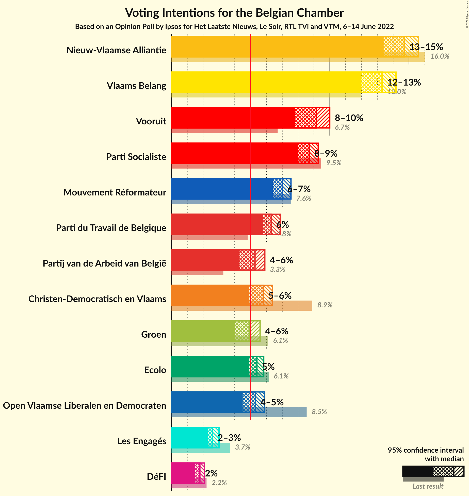

### Confidence Intervals

| Party | Last Result | Poll Result | 80% Confidence Interval | 90% Confidence Interval | 95% Confidence Interval | 99% Confidence Interval |
|:-----:|:-----------:|:-----------:|:-----------------------:|:-----------------------:|:-----------------------:|:-----------------------:|
| Nieuw-Vlaamse Alliantie | 16.0% | 15.6% | 13.8–14.6% |13.6–14.7% |13.4–14.7% |13.0–14.7% |
| Vlaams Belang | 12.0% | 14.2% | 12.4–13.2% |12.2–13.3% |12.0–13.3% |11.7–13.3% |
| Parti Socialiste | 9.5% | 9.3% | 8.2–8.6% |8.1–8.7% |8.0–8.7% |7.8–8.7% |
| Vooruit | 6.7% | 9.1% | 8.3–9.8% |8.0–9.9% |7.8–10.0% |7.5–10.1% |
| Mouvement Réformateur | 7.6% | 7.6% | 6.6–7.0% |6.5–7.0% |6.4–7.0% |6.3–7.0% |
| Parti du Travail de Belgique | 4.8% | 6.9% | 6.0–6.3% |5.9–6.3% |5.8–6.3% |5.6–6.4% |
| Christen-Democratisch en Vlaams | 8.9% | 6.4% | 5.2–5.7% |5.0–5.7% |4.9–5.8% |4.7–5.8% |
| Open Vlaamse Liberalen en Democraten | 8.5% | 5.9% | 4.8–5.3% |4.6–5.3% |4.5–5.3% |4.3–5.3% |
| Ecolo | 6.1% | 5.8% | 5.0–5.4% |5.0–5.4% |4.9–5.4% |4.7–5.4% |
| Partij van de Arbeid van België | 3.3% | 5.3% | 4.6–5.8% |4.4–5.9% |4.3–5.9% |4.0–6.0% |
| Groen | 6.1% | 4.9% | 4.3–5.4% |4.1–5.5% |4.0–5.6% |3.7–5.6% |
| Les Engagés | 3.7% | 3.0% | 2.4–2.6% |2.3–2.6% |2.3–2.6% |2.2–2.6% |
| DéFI | 2.2% | 2.1% | 1.6–1.8% |1.6–1.8% |1.5–1.8% |1.5–1.8% |

*Note:* The poll result column reflects the actual value used in the calculations. Published results may vary slightly, and in addition be rounded to fewer digits.

## Seats

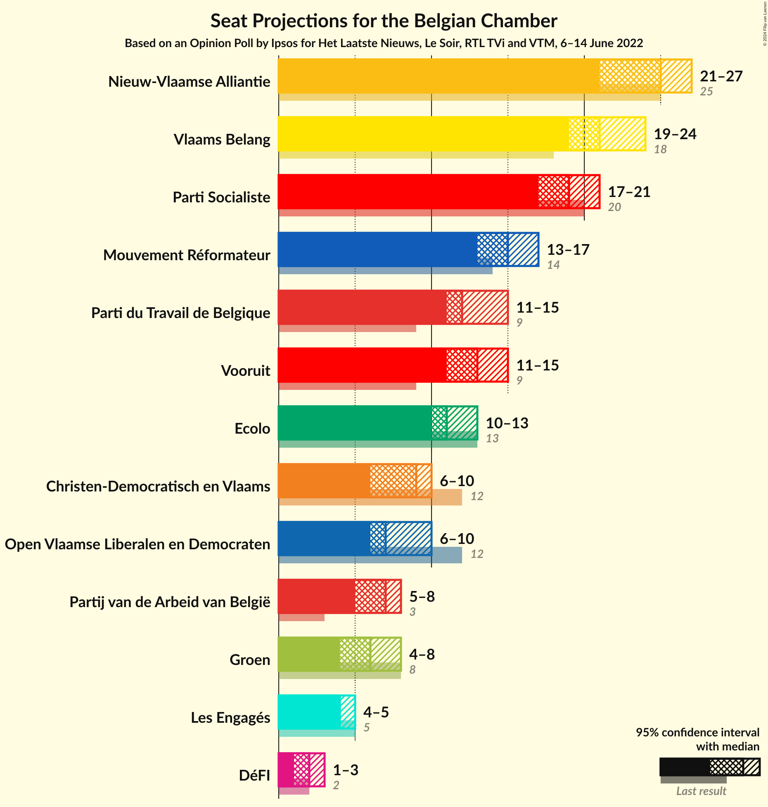

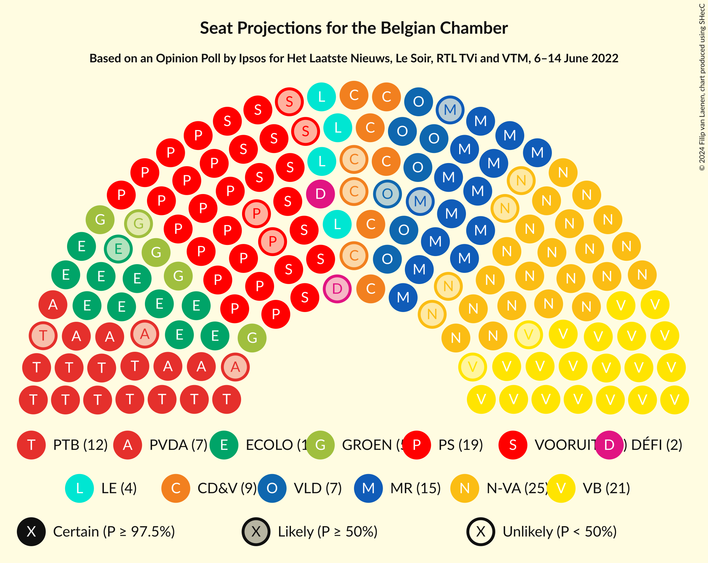

### Confidence Intervals

| Party | Last Result | Median | 80% Confidence Interval | 90% Confidence Interval | 95% Confidence Interval | 99% Confidence Interval |
|:-----:|:-----------:|:------:|:-----------------------:|:-----------------------:|:-----------------------:|:-----------------------:|
| <a href="#nieuw-vlaamse-alliantie">Nieuw-Vlaamse Alliantie</a> | 25 | 25 | 21–26 |21–26 |21–27 |20–28 |
| <a href="#vlaams-belang">Vlaams Belang</a> | 18 | 21 | 19–23 |19–24 |19–24 |18–25 |
| <a href="#parti-socialiste">Parti Socialiste</a> | 20 | 19 | 18–20 |18–21 |17–21 |16–21 |
| <a href="#vooruit">Vooruit</a> | 9 | 13 | 11–15 |11–15 |11–15 |11–17 |
| <a href="#mouvement-réformateur">Mouvement Réformateur</a> | 14 | 15 | 14–16 |13–16 |13–17 |13–18 |
| <a href="#parti-du-travail-de-belgique">Parti du Travail de Belgique</a> | 9 | 12 | 11–14 |11–14 |11–15 |10–15 |
| <a href="#christen-democratisch-en-vlaams">Christen-Democratisch en Vlaams</a> | 12 | 9 | 6–10 |6–10 |6–10 |5–11 |
| <a href="#open-vlaamse-liberalen-en-democraten">Open Vlaamse Liberalen en Democraten</a> | 12 | 7 | 6–9 |6–10 |6–10 |5–10 |
| <a href="#ecolo">Ecolo</a> | 13 | 11 | 10–12 |10–13 |10–13 |9–14 |
| <a href="#partij-van-de-arbeid-van-belgië">Partij van de Arbeid van België</a> | 3 | 7 | 5–8 |5–8 |5–8 |4–9 |
| <a href="#groen">Groen</a> | 8 | 6 | 5–7 |5–8 |4–8 |3–9 |
| <a href="#les-engagés">Les Engagés</a> | 5 | 4 | 4–5 |4–5 |4–5 |3–5 |
| <a href="#défi">DéFI</a> | 2 | 2 | 1–2 |1–2 |1–3 |1–4 |

### Nieuw-Vlaamse Alliantie

*For a full overview of the results for this party, see the [Nieuw-Vlaamse Alliantie](party-nieuw-vlaamsealliantie.html) page.*

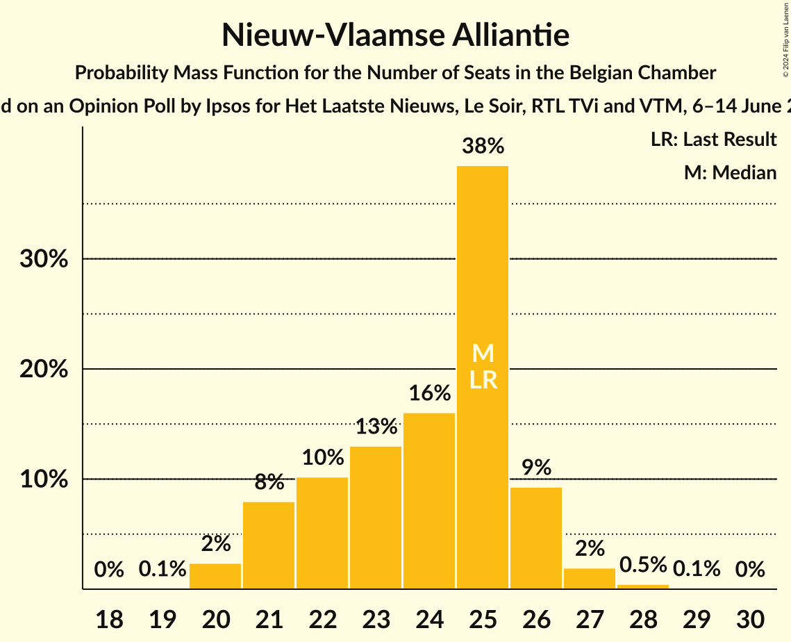

| Number of Seats | Probability | Accumulated | Special Marks |
|:---------------:|:-----------:|:-----------:|:-------------:|
| 19 | 0.1% | 100% |  |
| 20 | 2% | 99.9% |  |
| 21 | 8% | 98% |  |
| 22 | 10% | 90% |  |
| 23 | 13% | 79% |  |
| 24 | 16% | 66% |  |
| 25 | 38% | 50% | Last Result, Median |
| 26 | 9% | 12% |  |
| 27 | 2% | 3% |  |
| 28 | 0.5% | 0.6% |  |
| 29 | 0.1% | 0.1% |  |
| 30 | 0% | 0% |  |

### Vlaams Belang

*For a full overview of the results for this party, see the [Vlaams Belang](party-vlaamsbelang.html) page.*

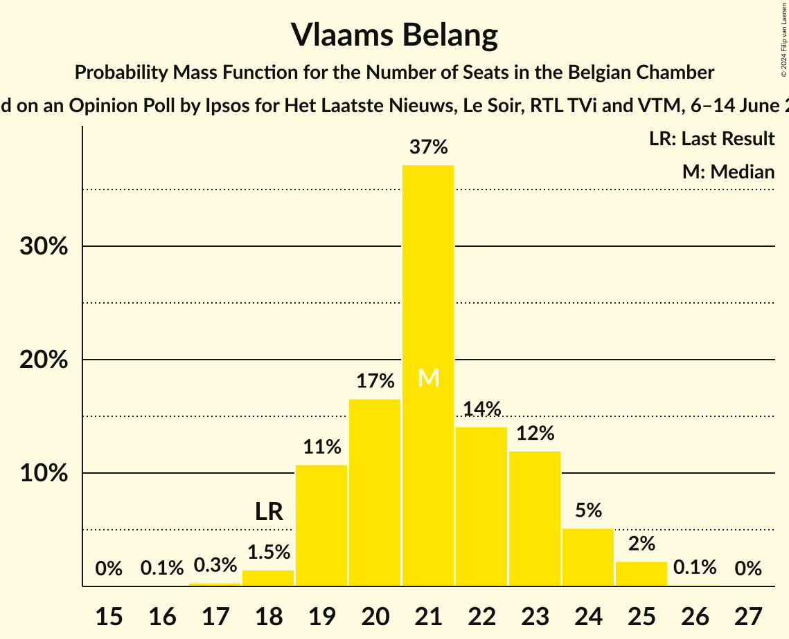

| Number of Seats | Probability | Accumulated | Special Marks |
|:---------------:|:-----------:|:-----------:|:-------------:|
| 16 | 0.1% | 100% |  |
| 17 | 0.3% | 99.9% |  |
| 18 | 1.5% | 99.6% | Last Result |
| 19 | 11% | 98% |  |
| 20 | 17% | 87% |  |
| 21 | 37% | 71% | Median |
| 22 | 14% | 34% |  |
| 23 | 12% | 19% |  |
| 24 | 5% | 8% |  |
| 25 | 2% | 2% |  |
| 26 | 0.1% | 0.2% |  |
| 27 | 0% | 0% |  |

### Parti Socialiste

*For a full overview of the results for this party, see the [Parti Socialiste](party-partisocialiste.html) page.*

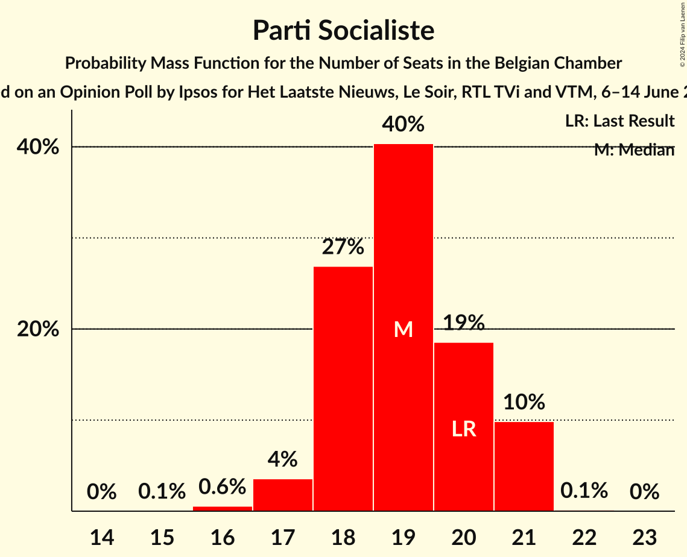

| Number of Seats | Probability | Accumulated | Special Marks |
|:---------------:|:-----------:|:-----------:|:-------------:|
| 15 | 0.1% | 100% |  |
| 16 | 0.6% | 99.9% |  |
| 17 | 4% | 99.4% |  |
| 18 | 27% | 96% |  |
| 19 | 40% | 69% | Median |
| 20 | 19% | 29% | Last Result |
| 21 | 10% | 10% |  |
| 22 | 0.1% | 0.1% |  |
| 23 | 0% | 0% |  |

### Vooruit

*For a full overview of the results for this party, see the [Vooruit](party-vooruit.html) page.*

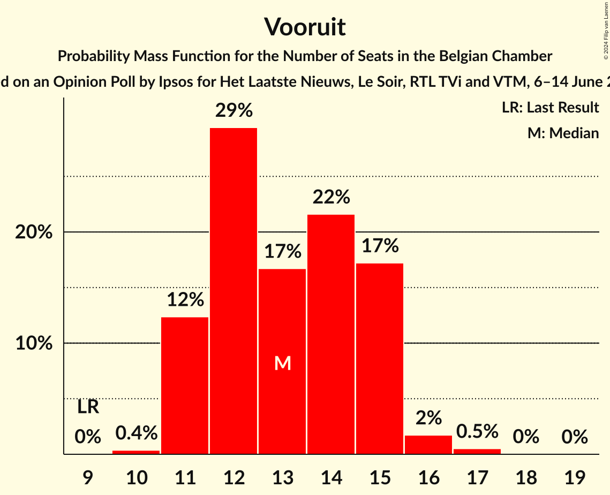

| Number of Seats | Probability | Accumulated | Special Marks |
|:---------------:|:-----------:|:-----------:|:-------------:|
| 9 | 0% | 100% | Last Result |
| 10 | 0.4% | 100% |  |
| 11 | 12% | 99.6% |  |
| 12 | 29% | 87% |  |
| 13 | 17% | 58% | Median |
| 14 | 22% | 41% |  |
| 15 | 17% | 20% |  |
| 16 | 2% | 2% |  |
| 17 | 0.5% | 0.6% |  |
| 18 | 0% | 0.1% |  |
| 19 | 0% | 0% |  |

### Mouvement Réformateur

*For a full overview of the results for this party, see the [Mouvement Réformateur](party-mouvementréformateur.html) page.*

| Number of Seats | Probability | Accumulated | Special Marks |
|:---------------:|:-----------:|:-----------:|:-------------:|
| 12 | 0.4% | 100% |  |
| 13 | 5% | 99.6% |  |
| 14 | 31% | 95% | Last Result |
| 15 | 48% | 64% | Median |
| 16 | 12% | 16% |  |
| 17 | 3% | 5% |  |
| 18 | 2% | 2% |  |
| 19 | 0.1% | 0.1% |  |
| 20 | 0% | 0% |  |

### Parti du Travail de Belgique

*For a full overview of the results for this party, see the [Parti du Travail de Belgique](party-partidutravaildebelgique.html) page.*

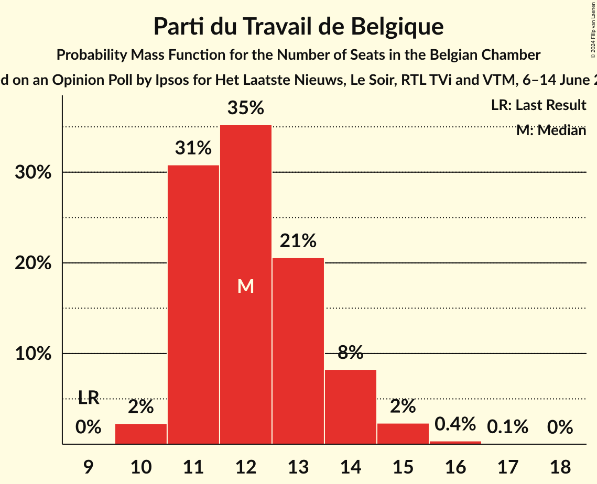

| Number of Seats | Probability | Accumulated | Special Marks |
|:---------------:|:-----------:|:-----------:|:-------------:|
| 9 | 0% | 100% | Last Result |
| 10 | 2% | 100% |  |
| 11 | 31% | 98% |  |
| 12 | 35% | 67% | Median |
| 13 | 21% | 32% |  |
| 14 | 8% | 11% |  |
| 15 | 2% | 3% |  |
| 16 | 0.4% | 0.4% |  |
| 17 | 0.1% | 0.1% |  |
| 18 | 0% | 0% |  |

### Christen-Democratisch en Vlaams

*For a full overview of the results for this party, see the [Christen-Democratisch en Vlaams](party-christen-democratischenvlaams.html) page.*

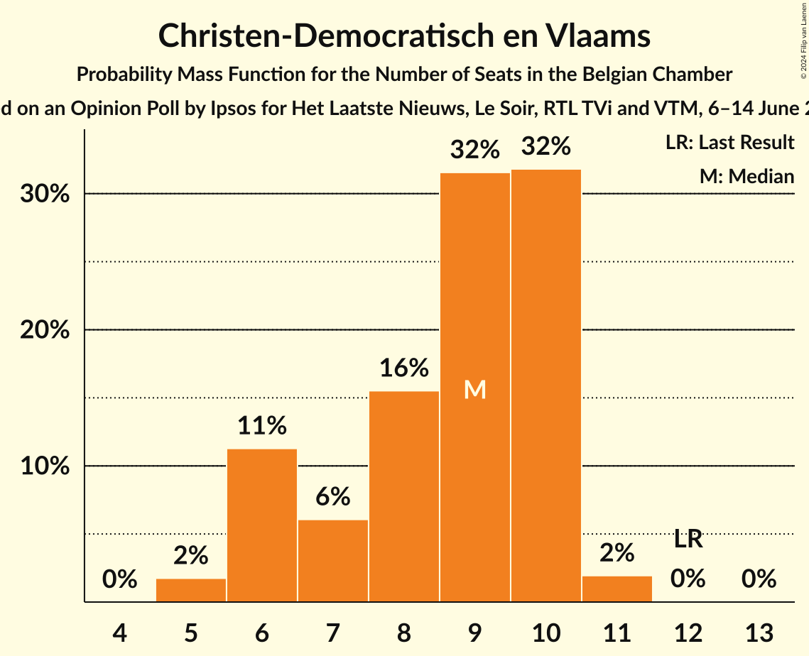

| Number of Seats | Probability | Accumulated | Special Marks |
|:---------------:|:-----------:|:-----------:|:-------------:|
| 5 | 2% | 100% |  |
| 6 | 11% | 98% |  |
| 7 | 6% | 87% |  |
| 8 | 16% | 81% |  |
| 9 | 32% | 65% | Median |
| 10 | 32% | 34% |  |
| 11 | 2% | 2% |  |
| 12 | 0% | 0.1% | Last Result |
| 13 | 0% | 0% |  |

### Open Vlaamse Liberalen en Democraten

*For a full overview of the results for this party, see the [Open Vlaamse Liberalen en Democraten](party-openvlaamseliberalenendemocraten.html) page.*

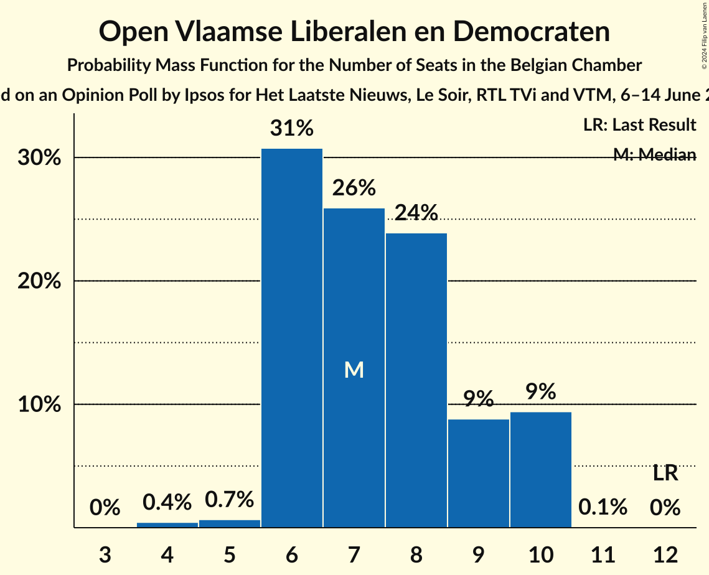

| Number of Seats | Probability | Accumulated | Special Marks |
|:---------------:|:-----------:|:-----------:|:-------------:|
| 4 | 0.4% | 100% |  |
| 5 | 0.7% | 99.5% |  |
| 6 | 31% | 98.9% |  |
| 7 | 26% | 68% | Median |
| 8 | 24% | 42% |  |
| 9 | 9% | 18% |  |
| 10 | 9% | 9% |  |
| 11 | 0.1% | 0.1% |  |
| 12 | 0% | 0% | Last Result |

### Ecolo

*For a full overview of the results for this party, see the [Ecolo](party-ecolo.html) page.*

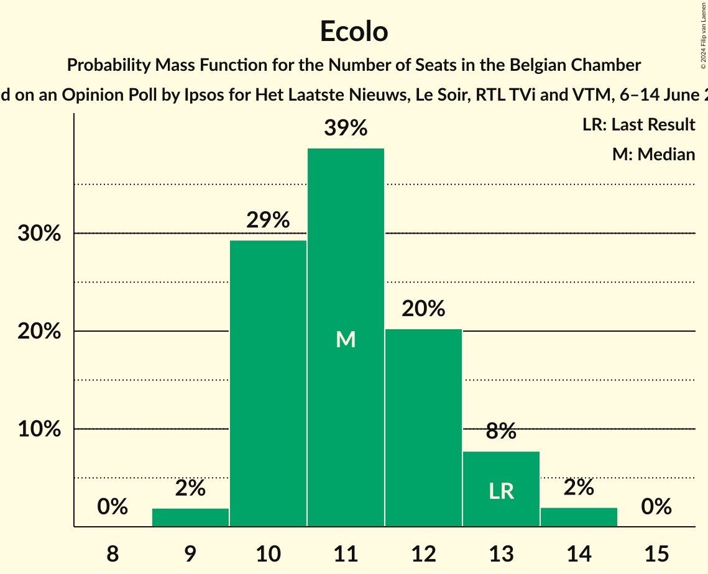

| Number of Seats | Probability | Accumulated | Special Marks |
|:---------------:|:-----------:|:-----------:|:-------------:|
| 9 | 2% | 100% |  |
| 10 | 29% | 98% |  |
| 11 | 39% | 69% | Median |
| 12 | 20% | 30% |  |
| 13 | 8% | 10% | Last Result |
| 14 | 2% | 2% |  |
| 15 | 0% | 0% |  |

### Partij van de Arbeid van België

*For a full overview of the results for this party, see the [Partij van de Arbeid van België](party-partijvandearbeidvanbelgië.html) page.*

| Number of Seats | Probability | Accumulated | Special Marks |
|:---------------:|:-----------:|:-----------:|:-------------:|
| 3 | 0.1% | 100% | Last Result |
| 4 | 0.8% | 99.9% |  |
| 5 | 22% | 99.1% |  |
| 6 | 7% | 77% |  |
| 7 | 21% | 70% | Median |
| 8 | 48% | 49% |  |
| 9 | 1.0% | 1.0% |  |
| 10 | 0.1% | 0.1% |  |
| 11 | 0% | 0% |  |

### Groen

*For a full overview of the results for this party, see the [Groen](party-groen.html) page.*

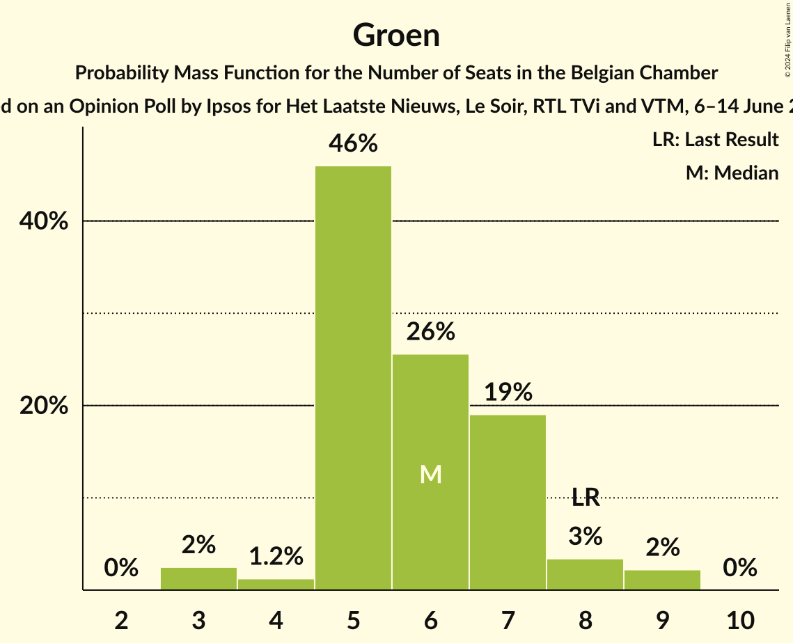

| Number of Seats | Probability | Accumulated | Special Marks |
|:---------------:|:-----------:|:-----------:|:-------------:|
| 3 | 2% | 100% |  |
| 4 | 1.2% | 98% |  |
| 5 | 46% | 96% |  |
| 6 | 26% | 50% | Median |
| 7 | 19% | 25% |  |
| 8 | 3% | 6% | Last Result |
| 9 | 2% | 2% |  |
| 10 | 0% | 0% |  |

### Les Engagés

*For a full overview of the results for this party, see the [Les Engagés](party-lesengagés.html) page.*

| Number of Seats | Probability | Accumulated | Special Marks |
|:---------------:|:-----------:|:-----------:|:-------------:|
| 1 | 0.1% | 100% |  |
| 2 | 0.2% | 99.9% |  |
| 3 | 0.5% | 99.8% |  |
| 4 | 87% | 99.3% | Median |
| 5 | 12% | 12% | Last Result |
| 6 | 0.1% | 0.1% |  |
| 7 | 0% | 0% |  |

### DéFI

*For a full overview of the results for this party, see the [DéFI](party-défi.html) page.*

| Number of Seats | Probability | Accumulated | Special Marks |
|:---------------:|:-----------:|:-----------:|:-------------:|
| 1 | 19% | 100% |  |
| 2 | 78% | 81% | Last Result, Median |
| 3 | 2% | 3% |  |
| 4 | 0.8% | 0.8% |  |
| 5 | 0% | 0% |  |

## Coalitions

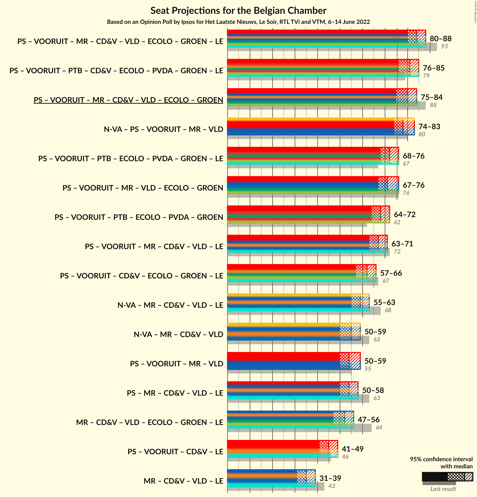

### Confidence Intervals

| Coalition | Last Result | Median | Majority? | 80% Confidence Interval | 90% Confidence Interval | 95% Confidence Interval | 99% Confidence Interval |
|:---------:|:-----------:|:------:|:---------:|:-----------------------:|:-----------------------:|:-----------------------:|:-----------------------:|
| Parti Socialiste – Vooruit – Mouvement Réformateur – Christen-Democratisch en Vlaams – Open Vlaamse Liberalen en Democraten – Ecolo – Groen – Les Engagés | 93 | 84 | 100% | 81–87 | 80–88 | 80–88 | 78–90 |
| Parti Socialiste – Vooruit – Parti du Travail de Belgique – Christen-Democratisch en Vlaams – Ecolo – Partij van de Arbeid van België – Groen – Les Engagés | 79 | 81 | 98.9% | 78–84 | 77–84 | 76–85 | 75–86 |
| Parti Socialiste – Vooruit – Mouvement Réformateur – Christen-Democratisch en Vlaams – Open Vlaamse Liberalen en Democraten – Ecolo – Groen | 88 | 80 | 97% | 77–83 | 76–83 | 75–84 | 74–86 |
| Nieuw-Vlaamse Alliantie – Parti Socialiste – Vooruit – Mouvement Réformateur – Open Vlaamse Liberalen en Democraten | 80 | 78 | 88% | 75–81 | 74–82 | 74–83 | 72–84 |
| Parti Socialiste – Vooruit – Parti du Travail de Belgique – Ecolo – Partij van de Arbeid van België – Groen – Les Engagés | 67 | 72 | 7% | 69–75 | 69–76 | 68–76 | 67–78 |
| Parti Socialiste – Vooruit – Mouvement Réformateur – Open Vlaamse Liberalen en Democraten – Ecolo – Groen | 76 | 71 | 3% | 68–74 | 67–75 | 67–76 | 66–77 |
| Parti Socialiste – Vooruit – Parti du Travail de Belgique – Ecolo – Partij van de Arbeid van België – Groen | 62 | 68 | 0% | 65–71 | 64–72 | 64–72 | 62–73 |
| Parti Socialiste – Vooruit – Mouvement Réformateur – Christen-Democratisch en Vlaams – Open Vlaamse Liberalen en Democraten – Les Engagés | 72 | 67 | 0% | 64–70 | 63–71 | 63–71 | 61–73 |
| Parti Socialiste – Vooruit – Christen-Democratisch en Vlaams – Ecolo – Groen – Les Engagés | 67 | 62 | 0% | 59–65 | 58–65 | 57–66 | 56–67 |
| Nieuw-Vlaamse Alliantie – Mouvement Réformateur – Christen-Democratisch en Vlaams – Open Vlaamse Liberalen en Democraten – Les Engagés | 68 | 59 | 0% | 56–62 | 55–63 | 55–63 | 53–65 |
| Nieuw-Vlaamse Alliantie – Mouvement Réformateur – Christen-Democratisch en Vlaams – Open Vlaamse Liberalen en Democraten | 63 | 55 | 0% | 52–58 | 51–58 | 50–59 | 49–61 |
| Parti Socialiste – Vooruit – Mouvement Réformateur – Open Vlaamse Liberalen en Democraten | 55 | 54 | 0% | 51–57 | 51–58 | 50–59 | 49–60 |
| Parti Socialiste – Mouvement Réformateur – Christen-Democratisch en Vlaams – Open Vlaamse Liberalen en Democraten – Les Engagés | 63 | 54 | 0% | 51–57 | 50–58 | 50–58 | 48–59 |
| Mouvement Réformateur – Christen-Democratisch en Vlaams – Open Vlaamse Liberalen en Democraten – Ecolo – Groen – Les Engagés | 64 | 52 | 0% | 49–55 | 48–55 | 47–56 | 46–58 |
| Parti Socialiste – Vooruit – Christen-Democratisch en Vlaams – Les Engagés | 46 | 45 | 0% | 42–47 | 42–48 | 41–49 | 40–50 |
| Mouvement Réformateur – Christen-Democratisch en Vlaams – Open Vlaamse Liberalen en Democraten – Les Engagés | 43 | 35 | 0% | 32–38 | 32–38 | 31–39 | 30–40 |

### Parti Socialiste – Vooruit – Mouvement Réformateur – Christen-Democratisch en Vlaams – Open Vlaamse Liberalen en Democraten – Ecolo – Groen – Les Engagés

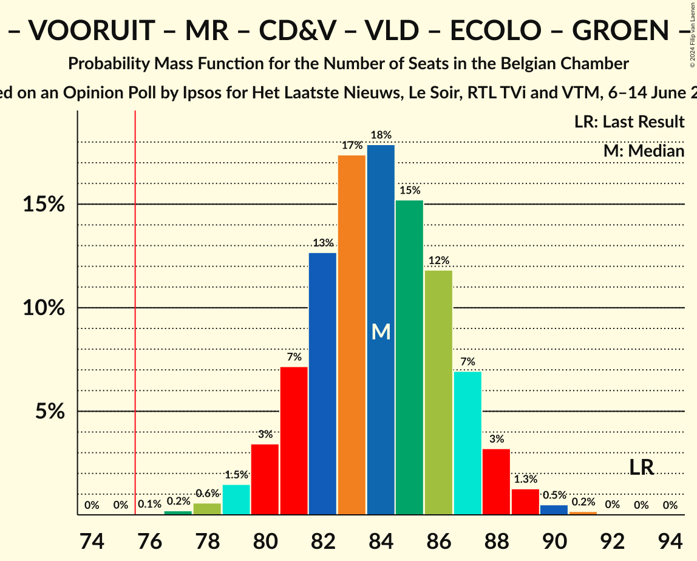

| Number of Seats | Probability | Accumulated | Special Marks |
|:---------------:|:-----------:|:-----------:|:-------------:|
| 76 | 0.1% | 100% | Majority |
| 77 | 0.2% | 99.9% |  |
| 78 | 0.6% | 99.7% |  |
| 79 | 1.5% | 99.1% |  |
| 80 | 3% | 98% |  |
| 81 | 7% | 94% |  |
| 82 | 13% | 87% |  |
| 83 | 17% | 74% |  |
| 84 | 18% | 57% | Median |
| 85 | 15% | 39% |  |
| 86 | 12% | 24% |  |
| 87 | 7% | 12% |  |
| 88 | 3% | 5% |  |
| 89 | 1.3% | 2% |  |
| 90 | 0.5% | 0.7% |  |
| 91 | 0.2% | 0.2% |  |
| 92 | 0% | 0% |  |
| 93 | 0% | 0% | Last Result |

### Parti Socialiste – Vooruit – Parti du Travail de Belgique – Christen-Democratisch en Vlaams – Ecolo – Partij van de Arbeid van België – Groen – Les Engagés

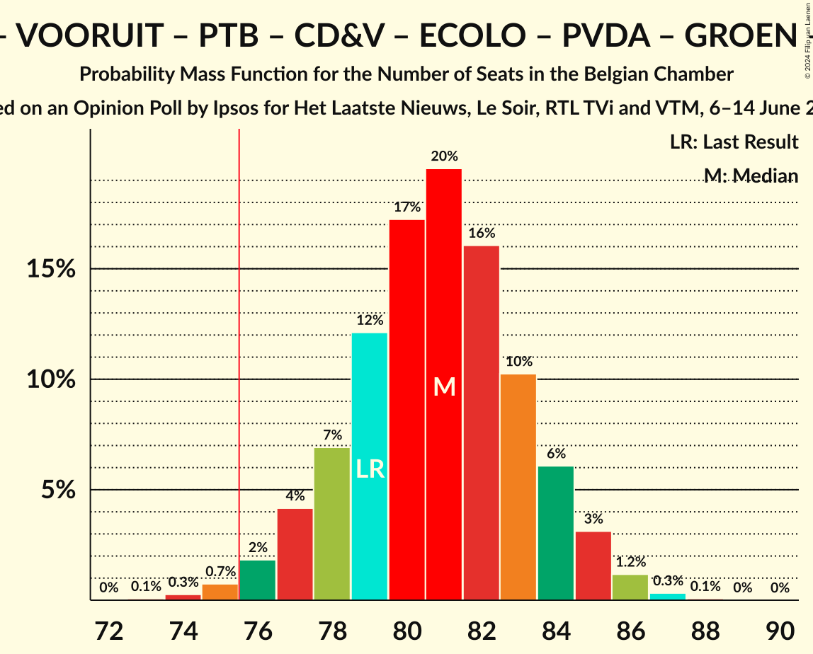

| Number of Seats | Probability | Accumulated | Special Marks |
|:---------------:|:-----------:|:-----------:|:-------------:|
| 73 | 0.1% | 100% |  |
| 74 | 0.3% | 99.9% |  |
| 75 | 0.7% | 99.6% |  |
| 76 | 2% | 98.9% | Majority |
| 77 | 4% | 97% |  |
| 78 | 7% | 93% |  |
| 79 | 12% | 86% | Last Result |
| 80 | 17% | 74% |  |
| 81 | 20% | 57% | Median |
| 82 | 16% | 37% |  |
| 83 | 10% | 21% |  |
| 84 | 6% | 11% |  |
| 85 | 3% | 5% |  |
| 86 | 1.2% | 2% |  |
| 87 | 0.3% | 0.4% |  |
| 88 | 0.1% | 0.1% |  |
| 89 | 0% | 0% |  |

### Parti Socialiste – Vooruit – Mouvement Réformateur – Christen-Democratisch en Vlaams – Open Vlaamse Liberalen en Democraten – Ecolo – Groen

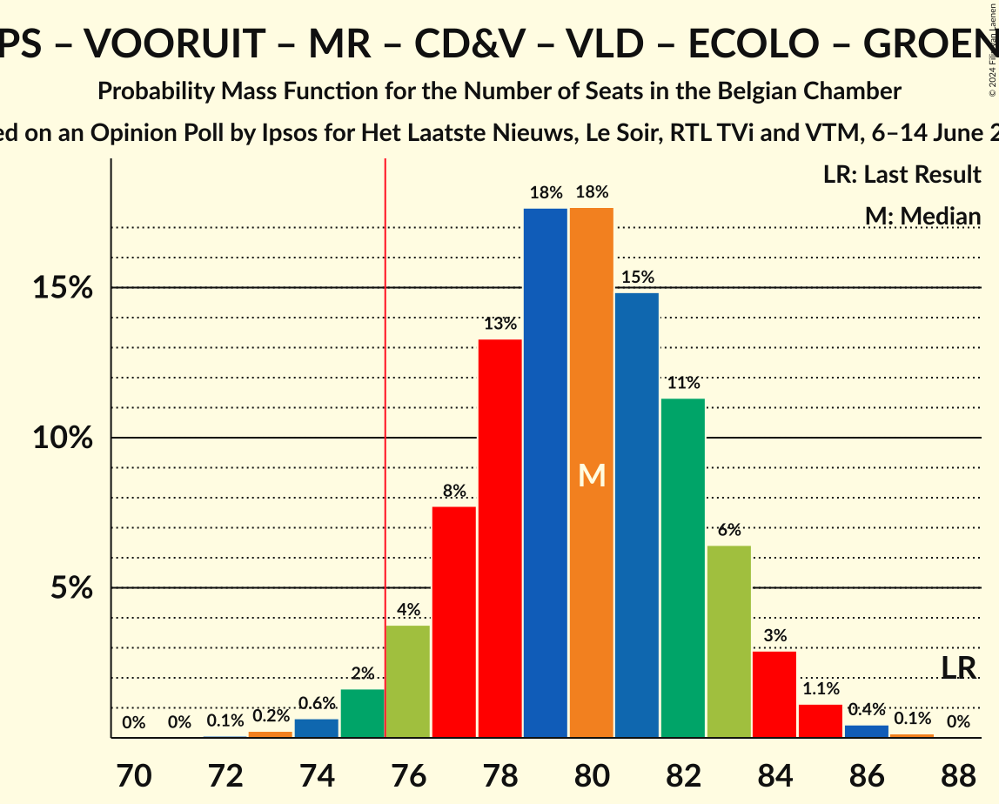

| Number of Seats | Probability | Accumulated | Special Marks |
|:---------------:|:-----------:|:-----------:|:-------------:|
| 72 | 0.1% | 100% |  |
| 73 | 0.2% | 99.9% |  |
| 74 | 0.6% | 99.7% |  |
| 75 | 2% | 99.0% |  |
| 76 | 4% | 97% | Majority |
| 77 | 8% | 94% |  |
| 78 | 13% | 86% |  |
| 79 | 18% | 73% |  |
| 80 | 18% | 55% | Median |
| 81 | 15% | 37% |  |
| 82 | 11% | 22% |  |
| 83 | 6% | 11% |  |
| 84 | 3% | 5% |  |
| 85 | 1.1% | 2% |  |
| 86 | 0.4% | 0.6% |  |
| 87 | 0.1% | 0.2% |  |
| 88 | 0% | 0% | Last Result |

### Nieuw-Vlaamse Alliantie – Parti Socialiste – Vooruit – Mouvement Réformateur – Open Vlaamse Liberalen en Democraten

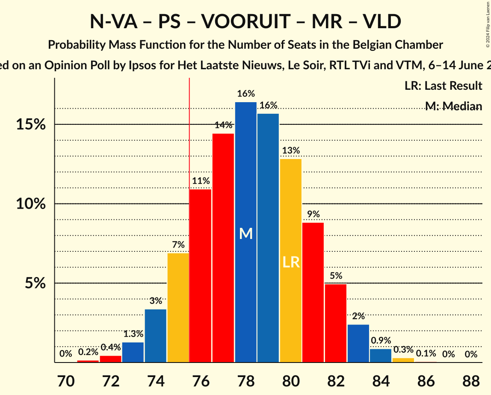

| Number of Seats | Probability | Accumulated | Special Marks |
|:---------------:|:-----------:|:-----------:|:-------------:|
| 70 | 0% | 100% |  |
| 71 | 0.2% | 99.9% |  |
| 72 | 0.4% | 99.8% |  |
| 73 | 1.3% | 99.3% |  |
| 74 | 3% | 98% |  |
| 75 | 7% | 95% |  |
| 76 | 11% | 88% | Majority |
| 77 | 14% | 77% |  |
| 78 | 16% | 62% |  |
| 79 | 16% | 46% | Median |
| 80 | 13% | 30% | Last Result |
| 81 | 9% | 17% |  |
| 82 | 5% | 9% |  |
| 83 | 2% | 4% |  |
| 84 | 0.9% | 1.3% |  |
| 85 | 0.3% | 0.4% |  |
| 86 | 0.1% | 0.1% |  |
| 87 | 0% | 0% |  |

### Parti Socialiste – Vooruit – Parti du Travail de Belgique – Ecolo – Partij van de Arbeid van België – Groen – Les Engagés

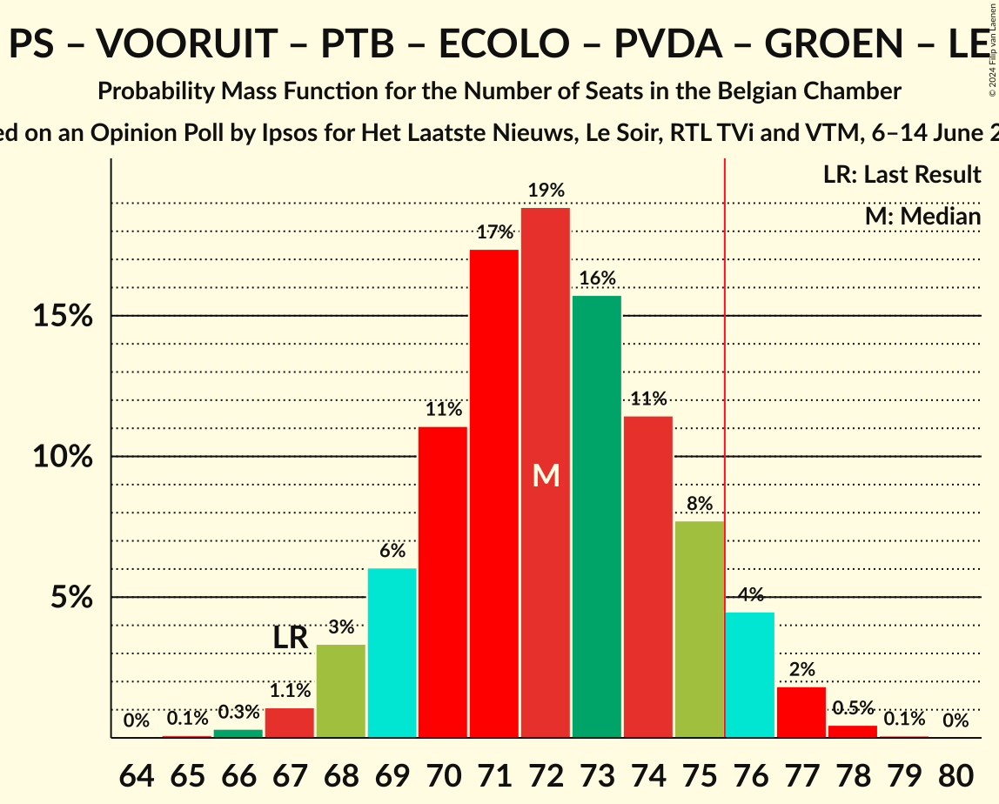

| Number of Seats | Probability | Accumulated | Special Marks |
|:---------------:|:-----------:|:-----------:|:-------------:|
| 65 | 0.1% | 100% |  |
| 66 | 0.3% | 99.9% |  |
| 67 | 1.1% | 99.6% | Last Result |
| 68 | 3% | 98% |  |
| 69 | 6% | 95% |  |
| 70 | 11% | 89% |  |
| 71 | 17% | 78% |  |
| 72 | 19% | 61% | Median |
| 73 | 16% | 42% |  |
| 74 | 11% | 26% |  |
| 75 | 8% | 15% |  |
| 76 | 4% | 7% | Majority |
| 77 | 2% | 2% |  |
| 78 | 0.5% | 0.6% |  |
| 79 | 0.1% | 0.1% |  |
| 80 | 0% | 0% |  |

### Parti Socialiste – Vooruit – Mouvement Réformateur – Open Vlaamse Liberalen en Democraten – Ecolo – Groen

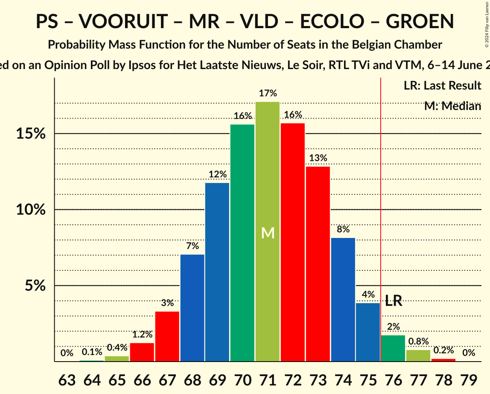

| Number of Seats | Probability | Accumulated | Special Marks |
|:---------------:|:-----------:|:-----------:|:-------------:|
| 64 | 0.1% | 100% |  |
| 65 | 0.4% | 99.9% |  |
| 66 | 1.2% | 99.5% |  |
| 67 | 3% | 98% |  |
| 68 | 7% | 95% |  |
| 69 | 12% | 88% |  |
| 70 | 16% | 76% |  |
| 71 | 17% | 60% | Median |
| 72 | 16% | 43% |  |
| 73 | 13% | 28% |  |
| 74 | 8% | 15% |  |
| 75 | 4% | 7% |  |
| 76 | 2% | 3% | Last Result, Majority |
| 77 | 0.8% | 1.0% |  |
| 78 | 0.2% | 0.2% |  |
| 79 | 0% | 0% |  |

### Parti Socialiste – Vooruit – Parti du Travail de Belgique – Ecolo – Partij van de Arbeid van België – Groen

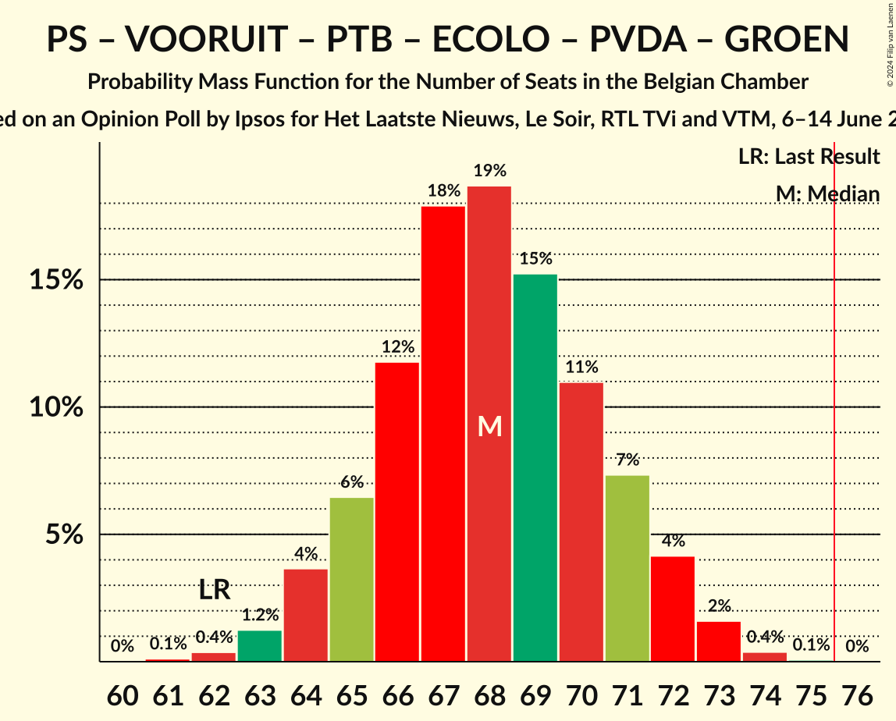

| Number of Seats | Probability | Accumulated | Special Marks |
|:---------------:|:-----------:|:-----------:|:-------------:|
| 61 | 0.1% | 100% |  |
| 62 | 0.4% | 99.9% | Last Result |
| 63 | 1.2% | 99.5% |  |
| 64 | 4% | 98% |  |
| 65 | 6% | 95% |  |
| 66 | 12% | 88% |  |
| 67 | 18% | 76% |  |
| 68 | 19% | 58% | Median |
| 69 | 15% | 40% |  |
| 70 | 11% | 25% |  |
| 71 | 7% | 14% |  |
| 72 | 4% | 6% |  |
| 73 | 2% | 2% |  |
| 74 | 0.4% | 0.5% |  |
| 75 | 0.1% | 0.1% |  |
| 76 | 0% | 0% | Majority |

### Parti Socialiste – Vooruit – Mouvement Réformateur – Christen-Democratisch en Vlaams – Open Vlaamse Liberalen en Democraten – Les Engagés

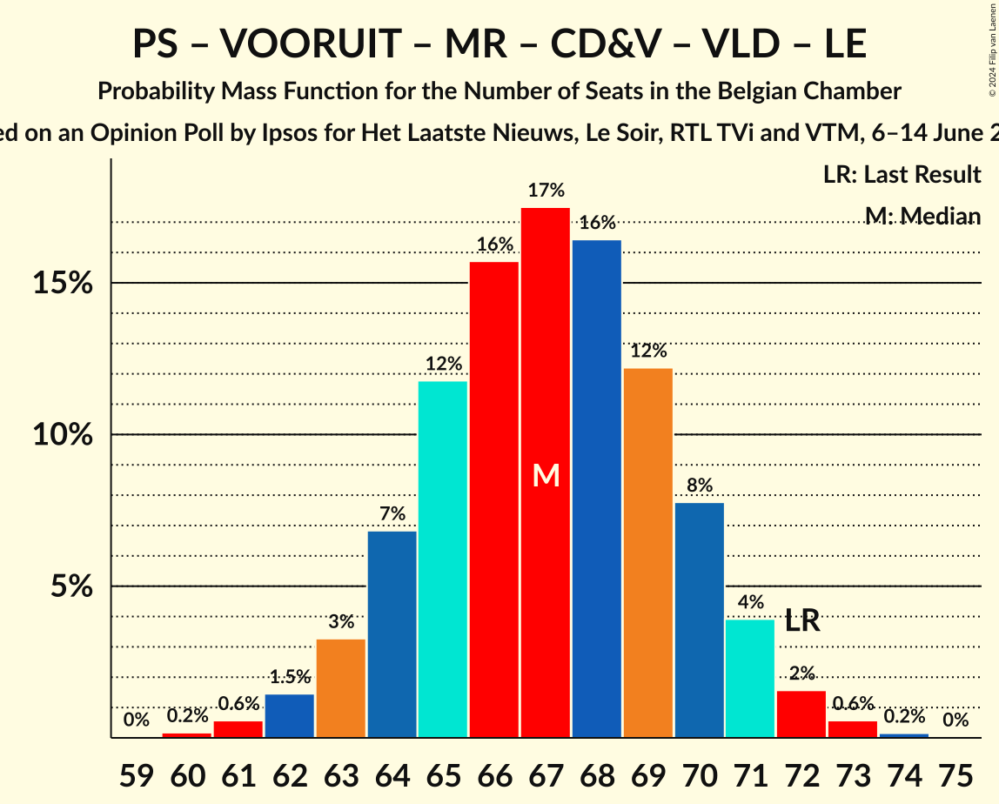

| Number of Seats | Probability | Accumulated | Special Marks |
|:---------------:|:-----------:|:-----------:|:-------------:|
| 59 | 0% | 100% |  |
| 60 | 0.2% | 99.9% |  |
| 61 | 0.6% | 99.8% |  |
| 62 | 1.5% | 99.2% |  |
| 63 | 3% | 98% |  |
| 64 | 7% | 94% |  |
| 65 | 12% | 88% |  |
| 66 | 16% | 76% |  |
| 67 | 17% | 60% | Median |
| 68 | 16% | 43% |  |
| 69 | 12% | 26% |  |
| 70 | 8% | 14% |  |
| 71 | 4% | 6% |  |
| 72 | 2% | 2% | Last Result |
| 73 | 0.6% | 0.8% |  |
| 74 | 0.2% | 0.2% |  |
| 75 | 0% | 0% |  |

### Parti Socialiste – Vooruit – Christen-Democratisch en Vlaams – Ecolo – Groen – Les Engagés

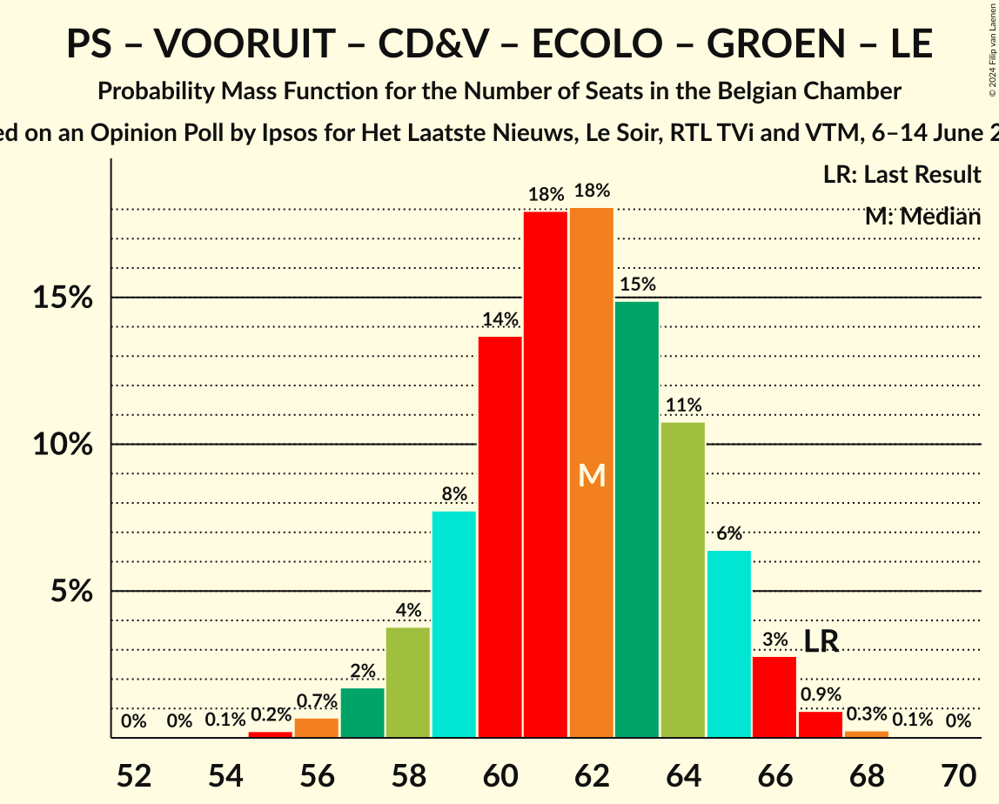

| Number of Seats | Probability | Accumulated | Special Marks |
|:---------------:|:-----------:|:-----------:|:-------------:|
| 54 | 0.1% | 100% |  |
| 55 | 0.2% | 99.9% |  |
| 56 | 0.7% | 99.7% |  |
| 57 | 2% | 99.0% |  |
| 58 | 4% | 97% |  |
| 59 | 8% | 94% |  |
| 60 | 14% | 86% |  |
| 61 | 18% | 72% |  |
| 62 | 18% | 54% | Median |
| 63 | 15% | 36% |  |
| 64 | 11% | 21% |  |
| 65 | 6% | 10% |  |
| 66 | 3% | 4% |  |
| 67 | 0.9% | 1.2% | Last Result |
| 68 | 0.3% | 0.3% |  |
| 69 | 0.1% | 0.1% |  |
| 70 | 0% | 0% |  |

### Nieuw-Vlaamse Alliantie – Mouvement Réformateur – Christen-Democratisch en Vlaams – Open Vlaamse Liberalen en Democraten – Les Engagés

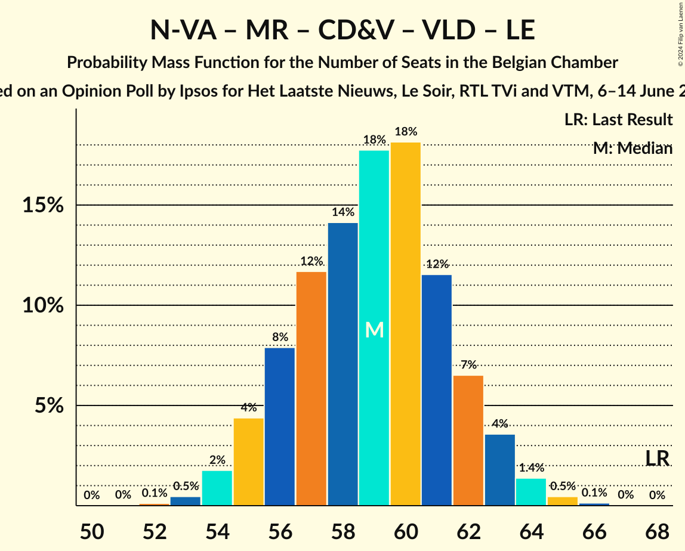

| Number of Seats | Probability | Accumulated | Special Marks |
|:---------------:|:-----------:|:-----------:|:-------------:|
| 52 | 0.1% | 100% |  |
| 53 | 0.5% | 99.8% |  |
| 54 | 2% | 99.4% |  |
| 55 | 4% | 98% |  |
| 56 | 8% | 93% |  |
| 57 | 12% | 85% |  |
| 58 | 14% | 74% |  |
| 59 | 18% | 60% |  |
| 60 | 18% | 42% | Median |
| 61 | 12% | 24% |  |
| 62 | 7% | 12% |  |
| 63 | 4% | 6% |  |
| 64 | 1.4% | 2% |  |
| 65 | 0.5% | 0.6% |  |
| 66 | 0.1% | 0.2% |  |
| 67 | 0% | 0% |  |
| 68 | 0% | 0% | Last Result |

### Nieuw-Vlaamse Alliantie – Mouvement Réformateur – Christen-Democratisch en Vlaams – Open Vlaamse Liberalen en Democraten

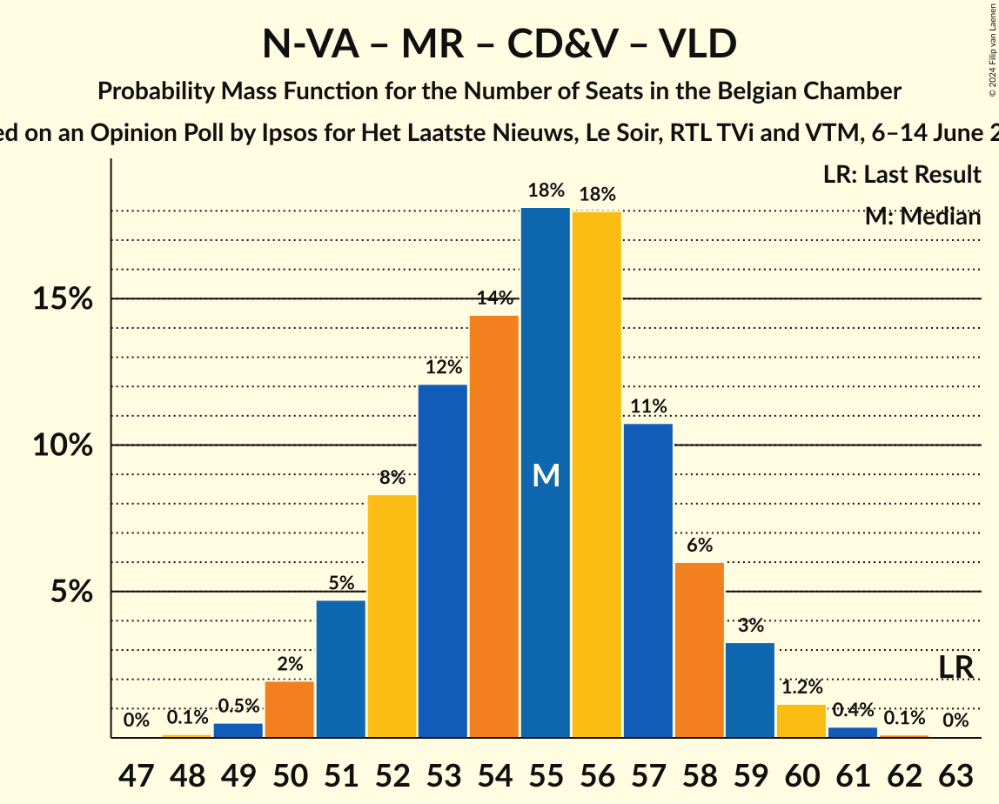

| Number of Seats | Probability | Accumulated | Special Marks |
|:---------------:|:-----------:|:-----------:|:-------------:|
| 48 | 0.1% | 100% |  |
| 49 | 0.5% | 99.8% |  |
| 50 | 2% | 99.3% |  |
| 51 | 5% | 97% |  |
| 52 | 8% | 93% |  |
| 53 | 12% | 84% |  |
| 54 | 14% | 72% |  |
| 55 | 18% | 58% |  |
| 56 | 18% | 40% | Median |
| 57 | 11% | 22% |  |
| 58 | 6% | 11% |  |
| 59 | 3% | 5% |  |
| 60 | 1.2% | 2% |  |
| 61 | 0.4% | 0.5% |  |
| 62 | 0.1% | 0.1% |  |
| 63 | 0% | 0% | Last Result |

### Parti Socialiste – Vooruit – Mouvement Réformateur – Open Vlaamse Liberalen en Democraten

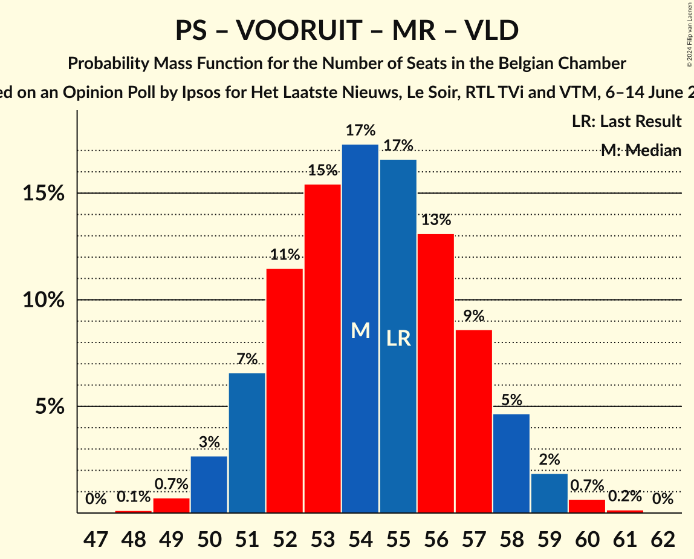

| Number of Seats | Probability | Accumulated | Special Marks |
|:---------------:|:-----------:|:-----------:|:-------------:|
| 48 | 0.1% | 100% |  |
| 49 | 0.7% | 99.9% |  |
| 50 | 3% | 99.1% |  |
| 51 | 7% | 96% |  |
| 52 | 11% | 90% |  |
| 53 | 15% | 78% |  |
| 54 | 17% | 63% | Median |
| 55 | 17% | 46% | Last Result |
| 56 | 13% | 29% |  |
| 57 | 9% | 16% |  |
| 58 | 5% | 7% |  |
| 59 | 2% | 3% |  |
| 60 | 0.7% | 0.8% |  |
| 61 | 0.2% | 0.2% |  |
| 62 | 0% | 0% |  |

### Parti Socialiste – Mouvement Réformateur – Christen-Democratisch en Vlaams – Open Vlaamse Liberalen en Democraten – Les Engagés

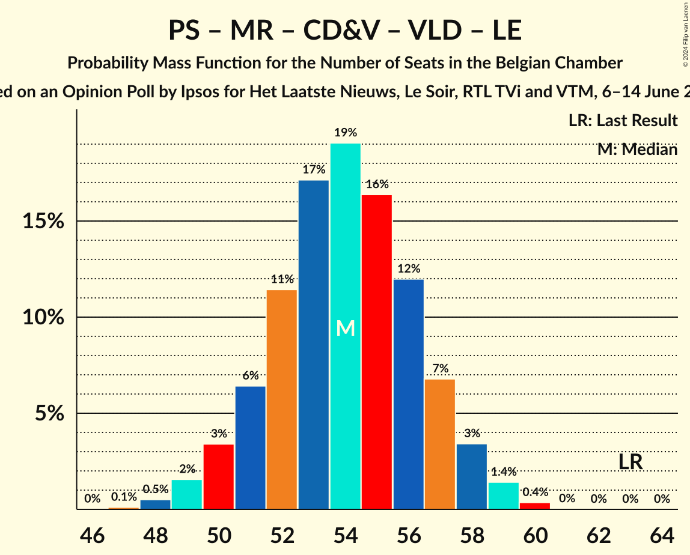

| Number of Seats | Probability | Accumulated | Special Marks |
|:---------------:|:-----------:|:-----------:|:-------------:|
| 47 | 0.1% | 100% |  |
| 48 | 0.5% | 99.9% |  |
| 49 | 2% | 99.4% |  |
| 50 | 3% | 98% |  |
| 51 | 6% | 94% |  |
| 52 | 11% | 88% |  |
| 53 | 17% | 77% |  |
| 54 | 19% | 59% | Median |
| 55 | 16% | 40% |  |
| 56 | 12% | 24% |  |
| 57 | 7% | 12% |  |
| 58 | 3% | 5% |  |
| 59 | 1.4% | 2% |  |
| 60 | 0.4% | 0.4% |  |
| 61 | 0% | 0% |  |
| 62 | 0% | 0% |  |
| 63 | 0% | 0% | Last Result |

### Mouvement Réformateur – Christen-Democratisch en Vlaams – Open Vlaamse Liberalen en Democraten – Ecolo – Groen – Les Engagés

| Number of Seats | Probability | Accumulated | Special Marks |
|:---------------:|:-----------:|:-----------:|:-------------:|
| 44 | 0% | 100% |  |
| 45 | 0.2% | 99.9% |  |
| 46 | 0.6% | 99.8% |  |
| 47 | 2% | 99.1% |  |
| 48 | 4% | 97% |  |
| 49 | 8% | 93% |  |
| 50 | 13% | 86% |  |
| 51 | 17% | 73% |  |
| 52 | 19% | 56% | Median |
| 53 | 16% | 37% |  |
| 54 | 11% | 21% |  |
| 55 | 6% | 11% |  |
| 56 | 3% | 5% |  |
| 57 | 1.3% | 2% |  |
| 58 | 0.4% | 0.6% |  |
| 59 | 0.1% | 0.2% |  |
| 60 | 0% | 0% |  |
| 61 | 0% | 0% |  |
| 62 | 0% | 0% |  |
| 63 | 0% | 0% |  |
| 64 | 0% | 0% | Last Result |

### Parti Socialiste – Vooruit – Christen-Democratisch en Vlaams – Les Engagés

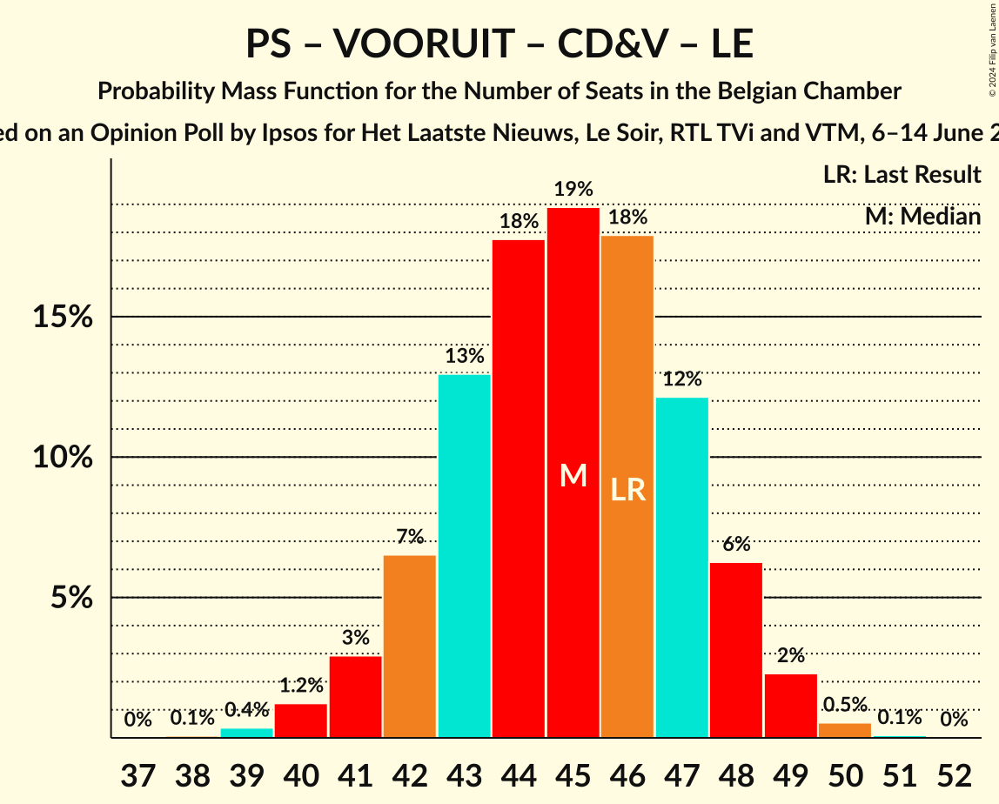

| Number of Seats | Probability | Accumulated | Special Marks |
|:---------------:|:-----------:|:-----------:|:-------------:|
| 38 | 0.1% | 100% |  |
| 39 | 0.4% | 99.9% |  |
| 40 | 1.2% | 99.6% |  |
| 41 | 3% | 98% |  |
| 42 | 7% | 95% |  |
| 43 | 13% | 89% |  |
| 44 | 18% | 76% |  |
| 45 | 19% | 58% | Median |
| 46 | 18% | 39% | Last Result |
| 47 | 12% | 21% |  |
| 48 | 6% | 9% |  |
| 49 | 2% | 3% |  |
| 50 | 0.5% | 0.7% |  |
| 51 | 0.1% | 0.1% |  |
| 52 | 0% | 0% |  |

### Mouvement Réformateur – Christen-Democratisch en Vlaams – Open Vlaamse Liberalen en Democraten – Les Engagés

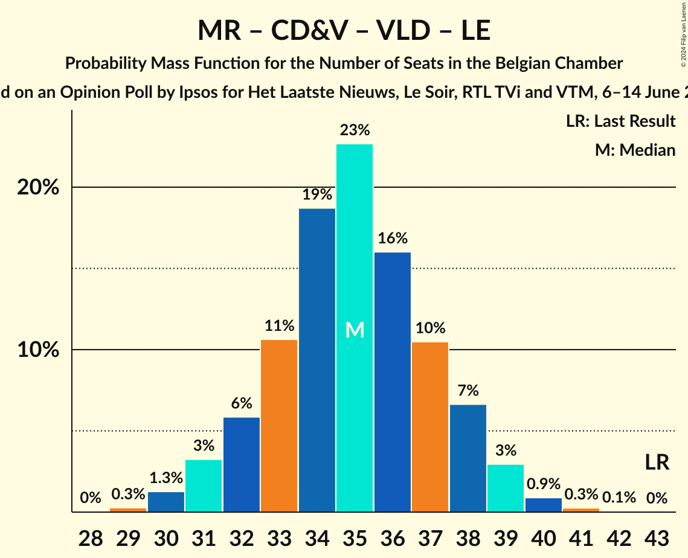

| Number of Seats | Probability | Accumulated | Special Marks |
|:---------------:|:-----------:|:-----------:|:-------------:|
| 29 | 0.3% | 100% |  |
| 30 | 1.3% | 99.7% |  |
| 31 | 3% | 98% |  |
| 32 | 6% | 95% |  |
| 33 | 11% | 89% |  |
| 34 | 19% | 79% |  |
| 35 | 23% | 60% | Median |
| 36 | 16% | 37% |  |
| 37 | 10% | 21% |  |
| 38 | 7% | 11% |  |
| 39 | 3% | 4% |  |
| 40 | 0.9% | 1.2% |  |
| 41 | 0.3% | 0.3% |  |
| 42 | 0.1% | 0.1% |  |
| 43 | 0% | 0% | Last Result |

## Technical Information

### Opinion Poll

+ **Polling firm:** Ipsos
+ **Commissioner(s):** Het Laatste Nieuws, Le Soir, RTL TVi and VTM
+ **Fieldwork period:** 6–14 June 2022

### Calculations

+ **Sample size:** 1629
+ **Simulations done:** 1,048,576
+ **Error estimate:** 1.05%

