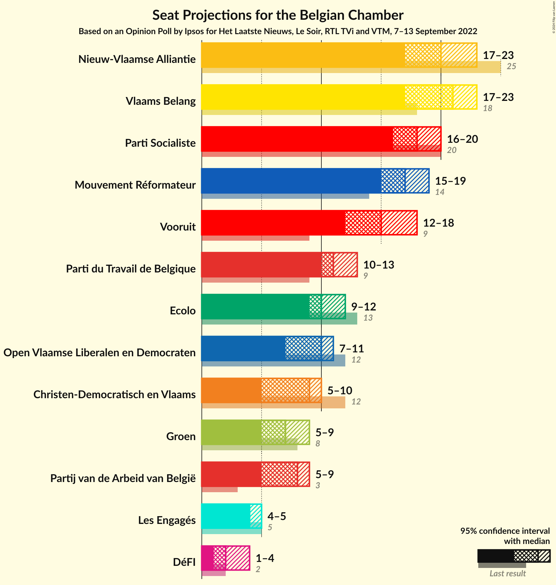
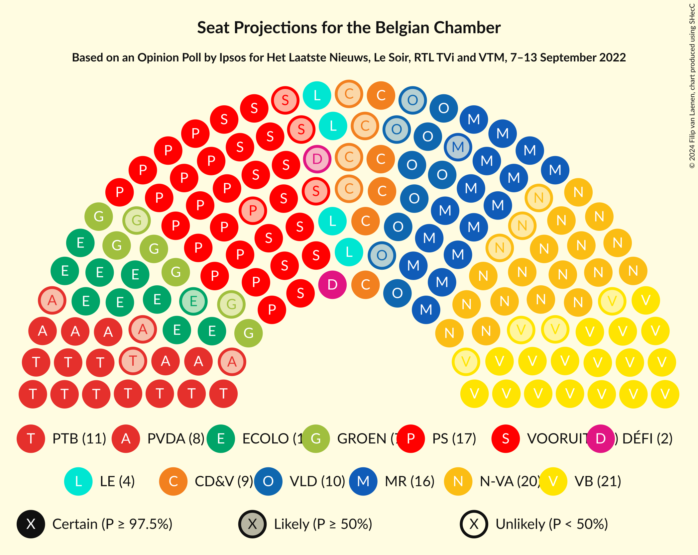
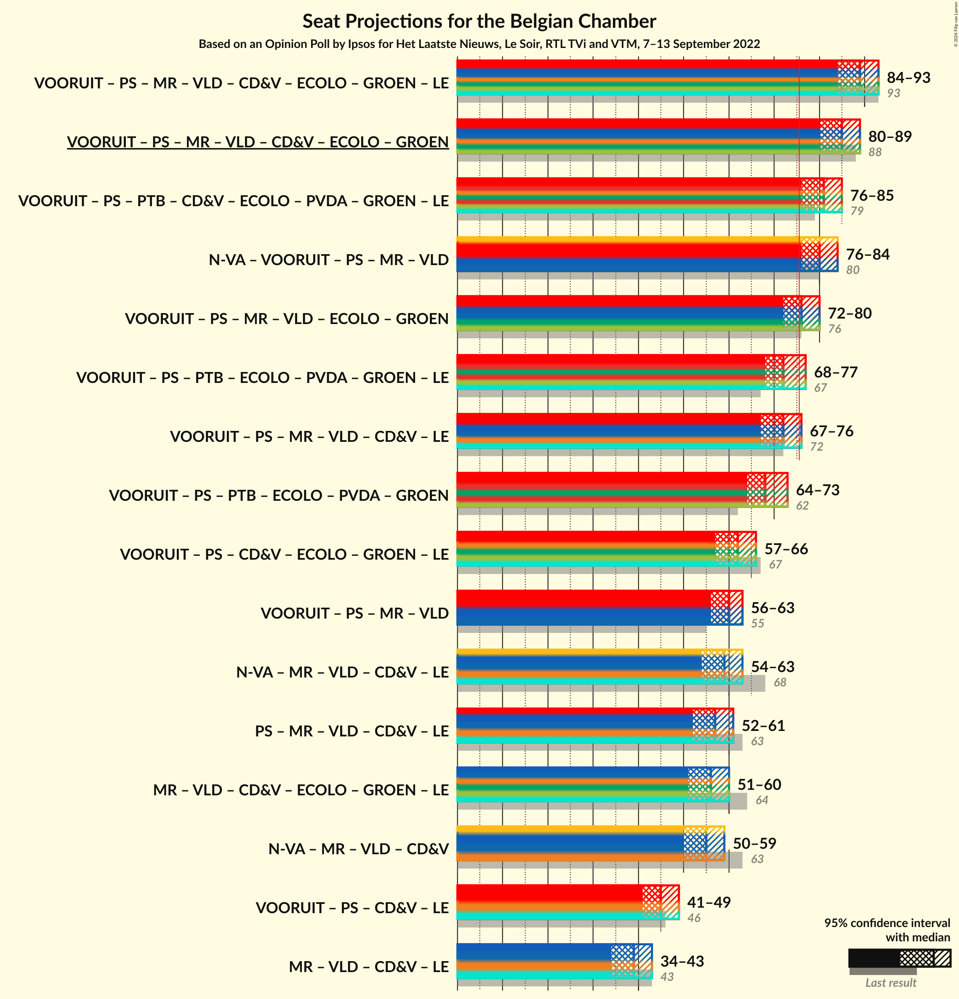

# Opinion Poll by Ipsos for Het Laatste Nieuws, Le Soir, RTL TVi and VTM, 7–13 September 2022

Areas included: Brussels, Flanders, Wallonia

<a href="#voting-intentions">Voting Intentions</a> | <a href="#seats">Seats</a> | <a href="#coalitions">Coalitions</a> | <a href="#technical-information">Technical Information</a>

## Voting Intentions

### Confidence Intervals

| Party | Last Result | Poll Result | 80% Confidence Interval | 90% Confidence Interval | 95% Confidence Interval | 99% Confidence Interval |
|:-----:|:-----------:|:-----------:|:-----------------------:|:-----------------------:|:-----------------------:|:-----------------------:|
| Vlaams Belang | 12.0% | 13.4% | 12.3–14.1% |12.1–14.2% |11.8–14.3% |11.4–14.4% |
| Nieuw-Vlaamse Alliantie | 16.0% | 13.3% | 12.3–14.0% |12.0–14.2% |11.8–14.3% |11.3–14.3% |
| Vooruit | 6.7% | 10.4% | 9.5–11.1% |9.2–11.2% |9.0–11.3% |8.6–11.4% |
| Parti Socialiste | 9.5% | 8.7% | 7.7–8.1% |7.6–8.1% |7.6–8.2% |7.4–8.2% |
| Mouvement Réformateur | 7.6% | 8.4% | 7.4–7.7% |7.3–7.8% |7.2–7.8% |7.0–7.8% |
| Open Vlaamse Liberalen en Democraten | 8.5% | 6.9% | 6.1–7.5% |5.9–7.6% |5.7–7.6% |5.4–7.7% |
| Parti du Travail de Belgique | 4.8% | 6.6% | 5.7–6.1% |5.6–6.1% |5.5–6.1% |5.4–6.1% |
| Christen-Democratisch en Vlaams | 8.9% | 6.1% | 5.4–6.7% |5.2–6.8% |5.0–6.9% |4.7–6.9% |
| Partij van de Arbeid van België | 3.3% | 5.4% | 4.7–5.9% |4.5–6.0% |4.4–6.1% |4.1–6.1% |
| Ecolo | 6.1% | 5.4% | 4.6–4.9% |4.5–4.9% |4.4–4.9% |4.3–4.9% |
| Groen | 6.1% | 5.3% | 4.6–5.8% |4.5–5.9% |4.3–6.0% |4.0–6.1% |
| Centre démocrate humaniste | N/A | 3.1% | N/A |N/A |N/A |N/A |
| DéFI | 2.2% | 2.4% | 1.9–2.1% |1.9–2.1% |1.8–2.1% |1.7–2.1% |

*Note:* The poll result column reflects the actual value used in the calculations. Published results may vary slightly, and in addition be rounded to fewer digits.

## Seats

### Confidence Intervals

| Party | Last Result | Median | 80% Confidence Interval | 90% Confidence Interval | 95% Confidence Interval | 99% Confidence Interval |
|:-----:|:-----------:|:------:|:-----------------------:|:-----------------------:|:-----------------------:|:-----------------------:|
| <a href="#vlaams-belang">Vlaams Belang</a> | 18 | 21 | 18–22 |18–22 |17–23 |16–24 |
| <a href="#nieuw-vlaamse-alliantie">Nieuw-Vlaamse Alliantie</a> | 25 | 20 | 18–22 |18–22 |17–23 |16–25 |
| <a href="#vooruit">Vooruit</a> | 9 | 15 | 14–17 |13–17 |12–18 |12–19 |
| <a href="#parti-socialiste">Parti Socialiste</a> | 20 | 18 | 16–19 |16–20 |16–20 |15–21 |
| <a href="#mouvement-réformateur">Mouvement Réformateur</a> | 14 | 17 | 15–18 |15–19 |15–19 |14–20 |
| <a href="#open-vlaamse-liberalen-en-democraten">Open Vlaamse Liberalen en Democraten</a> | 12 | 10 | 8–10 |7–11 |7–11 |6–12 |
| <a href="#parti-du-travail-de-belgique">Parti du Travail de Belgique</a> | 9 | 11 | 10–12 |10–13 |10–13 |10–14 |
| <a href="#christen-democratisch-en-vlaams">Christen-Democratisch en Vlaams</a> | 12 | 9 | 6–10 |5–10 |5–10 |5–11 |
| <a href="#partij-van-de-arbeid-van-belgië">Partij van de Arbeid van België</a> | 3 | 8 | 5–8 |5–8 |5–9 |4–9 |
| <a href="#ecolo">Ecolo</a> | 13 | 10 | 9–11 |9–12 |9–12 |8–12 |
| <a href="#groen">Groen</a> | 8 | 7 | 5–9 |5–9 |5–9 |4–9 |
| <a href="#centre-démocrate-humaniste">Centre démocrate humaniste</a> | N/A | N/A | N/A |N/A |N/A |N/A |
| <a href="#défi">DéFI</a> | 2 | 2 | 1–4 |1–4 |1–4 |1–4 |

### Vlaams Belang

*For a full overview of the results for this party, see the [Vlaams Belang](party-vlaamsbelang.html) page.*

| Number of Seats | Probability | Accumulated | Special Marks |
|:---------------:|:-----------:|:-----------:|:-------------:|
| 15 | 0.2% | 100% |  |
| 16 | 0.7% | 99.8% |  |
| 17 | 3% | 99.1% |  |
| 18 | 7% | 96% | Last Result |
| 19 | 20% | 89% |  |
| 20 | 17% | 68% |  |
| 21 | 41% | 52% | Median |
| 22 | 6% | 10% |  |
| 23 | 3% | 5% |  |
| 24 | 0.9% | 1.3% |  |
| 25 | 0.4% | 0.4% |  |
| 26 | 0% | 0% |  |

### Nieuw-Vlaamse Alliantie

*For a full overview of the results for this party, see the [Nieuw-Vlaamse Alliantie](party-nieuw-vlaamsealliantie.html) page.*

| Number of Seats | Probability | Accumulated | Special Marks |
|:---------------:|:-----------:|:-----------:|:-------------:|
| 15 | 0.1% | 100% |  |
| 16 | 0.6% | 99.9% |  |
| 17 | 3% | 99.3% |  |
| 18 | 7% | 96% |  |
| 19 | 16% | 89% |  |
| 20 | 37% | 74% | Median |
| 21 | 23% | 37% |  |
| 22 | 10% | 14% |  |
| 23 | 3% | 5% |  |
| 24 | 1.3% | 2% |  |
| 25 | 0.5% | 0.5% | Last Result |
| 26 | 0% | 0% |  |

### Vooruit

*For a full overview of the results for this party, see the [Vooruit](party-vooruit.html) page.*

| Number of Seats | Probability | Accumulated | Special Marks |
|:---------------:|:-----------:|:-----------:|:-------------:|
| 9 | 0% | 100% | Last Result |
| 10 | 0% | 100% |  |
| 11 | 0.4% | 100% |  |
| 12 | 3% | 99.6% |  |
| 13 | 3% | 97% |  |
| 14 | 14% | 93% |  |
| 15 | 45% | 80% | Median |
| 16 | 21% | 34% |  |
| 17 | 9% | 13% |  |
| 18 | 2% | 4% |  |
| 19 | 1.2% | 1.5% |  |
| 20 | 0.2% | 0.2% |  |
| 21 | 0% | 0% |  |

### Parti Socialiste

*For a full overview of the results for this party, see the [Parti Socialiste](party-partisocialiste.html) page.*

| Number of Seats | Probability | Accumulated | Special Marks |
|:---------------:|:-----------:|:-----------:|:-------------:|
| 14 | 0.1% | 100% |  |
| 15 | 0.7% | 99.9% |  |
| 16 | 10% | 99.2% |  |
| 17 | 27% | 89% |  |
| 18 | 36% | 62% | Median |
| 19 | 20% | 26% |  |
| 20 | 5% | 6% | Last Result |
| 21 | 0.8% | 0.9% |  |
| 22 | 0.2% | 0.2% |  |
| 23 | 0% | 0% |  |

### Mouvement Réformateur

*For a full overview of the results for this party, see the [Mouvement Réformateur](party-mouvementréformateur.html) page.*

| Number of Seats | Probability | Accumulated | Special Marks |
|:---------------:|:-----------:|:-----------:|:-------------:|
| 13 | 0.1% | 100% |  |
| 14 | 2% | 99.9% | Last Result |
| 15 | 10% | 98% |  |
| 16 | 20% | 88% |  |
| 17 | 23% | 67% | Median |
| 18 | 35% | 45% |  |
| 19 | 9% | 9% |  |
| 20 | 0.7% | 0.7% |  |
| 21 | 0% | 0% |  |

### Open Vlaamse Liberalen en Democraten

*For a full overview of the results for this party, see the [Open Vlaamse Liberalen en Democraten](party-openvlaamseliberalenendemocraten.html) page.*

| Number of Seats | Probability | Accumulated | Special Marks |
|:---------------:|:-----------:|:-----------:|:-------------:|
| 6 | 1.0% | 100% |  |
| 7 | 5% | 99.0% |  |
| 8 | 8% | 94% |  |
| 9 | 30% | 86% |  |
| 10 | 50% | 56% | Median |
| 11 | 4% | 6% |  |
| 12 | 2% | 2% | Last Result |
| 13 | 0.1% | 0.2% |  |
| 14 | 0% | 0% |  |

### Parti du Travail de Belgique

*For a full overview of the results for this party, see the [Parti du Travail de Belgique](party-partidutravaildebelgique.html) page.*

| Number of Seats | Probability | Accumulated | Special Marks |
|:---------------:|:-----------:|:-----------:|:-------------:|
| 9 | 0.4% | 100% | Last Result |
| 10 | 12% | 99.6% |  |
| 11 | 44% | 88% | Median |
| 12 | 34% | 44% |  |
| 13 | 8% | 9% |  |
| 14 | 1.1% | 2% |  |
| 15 | 0.3% | 0.4% |  |
| 16 | 0.1% | 0.1% |  |
| 17 | 0% | 0% |  |

### Christen-Democratisch en Vlaams

*For a full overview of the results for this party, see the [Christen-Democratisch en Vlaams](party-christen-democratischenvlaams.html) page.*

| Number of Seats | Probability | Accumulated | Special Marks |
|:---------------:|:-----------:|:-----------:|:-------------:|
| 5 | 7% | 100% |  |
| 6 | 13% | 93% |  |
| 7 | 12% | 80% |  |
| 8 | 17% | 68% |  |
| 9 | 25% | 52% | Median |
| 10 | 26% | 27% |  |
| 11 | 0.6% | 0.6% |  |
| 12 | 0% | 0% | Last Result |

### Partij van de Arbeid van België

*For a full overview of the results for this party, see the [Partij van de Arbeid van België](party-partijvandearbeidvanbelgië.html) page.*

| Number of Seats | Probability | Accumulated | Special Marks |
|:---------------:|:-----------:|:-----------:|:-------------:|
| 3 | 0% | 100% | Last Result |
| 4 | 0.5% | 100% |  |
| 5 | 17% | 99.5% |  |
| 6 | 13% | 83% |  |
| 7 | 17% | 70% |  |
| 8 | 51% | 53% | Median |
| 9 | 2% | 3% |  |
| 10 | 0.1% | 0.1% |  |
| 11 | 0% | 0% |  |

### Ecolo

*For a full overview of the results for this party, see the [Ecolo](party-ecolo.html) page.*

| Number of Seats | Probability | Accumulated | Special Marks |
|:---------------:|:-----------:|:-----------:|:-------------:|
| 8 | 2% | 100% |  |
| 9 | 19% | 98% |  |
| 10 | 62% | 80% | Median |
| 11 | 13% | 18% |  |
| 12 | 5% | 5% |  |
| 13 | 0.3% | 0.3% | Last Result |
| 14 | 0% | 0% |  |

### Groen

*For a full overview of the results for this party, see the [Groen](party-groen.html) page.*

| Number of Seats | Probability | Accumulated | Special Marks |
|:---------------:|:-----------:|:-----------:|:-------------:|
| 3 | 0.3% | 100% |  |
| 4 | 0.7% | 99.7% |  |
| 5 | 24% | 99.0% |  |
| 6 | 16% | 75% |  |
| 7 | 35% | 59% | Median |
| 8 | 13% | 24% | Last Result |
| 9 | 11% | 11% |  |
| 10 | 0% | 0% |  |

### Centre démocrate humaniste

*For a full overview of the results for this party, see the [Centre démocrate humaniste](party-centredémocratehumaniste.html) page.*

### DéFI

*For a full overview of the results for this party, see the [DéFI](party-défi.html) page.*

| Number of Seats | Probability | Accumulated | Special Marks |
|:---------------:|:-----------:|:-----------:|:-------------:|
| 1 | 18% | 100% |  |
| 2 | 35% | 82% | Last Result, Median |
| 3 | 26% | 48% |  |
| 4 | 21% | 22% |  |
| 5 | 0.2% | 0.2% |  |
| 6 | 0% | 0% |  |

## Coalitions

### Confidence Intervals

| Coalition | Last Result | Median | Majority? | 80% Confidence Interval | 90% Confidence Interval | 95% Confidence Interval | 99% Confidence Interval |
|:---------:|:-----------:|:------:|:---------:|:-----------------------:|:-----------------------:|:-----------------------:|:-----------------------:|
| Vooruit – Parti Socialiste – Mouvement Réformateur – Open Vlaamse Liberalen en Democraten – Christen-Democratisch en Vlaams – Ecolo – Groen | 88 | 85 | 100% | 81–87 | 81–88 | 80–89 | 79–90 |
| Nieuw-Vlaamse Alliantie – Vooruit – Parti Socialiste – Mouvement Réformateur – Open Vlaamse Liberalen en Democraten | 80 | 80 | 98% | 77–83 | 76–83 | 76–84 | 74–86 |
| Vooruit – Parti Socialiste – Mouvement Réformateur – Open Vlaamse Liberalen en Democraten – Ecolo – Groen | 76 | 76 | 65% | 74–79 | 73–80 | 72–80 | 71–82 |
| Vooruit – Parti Socialiste – Parti du Travail de Belgique – Ecolo – Partij van de Arbeid van België – Groen | 62 | 68 | 0.1% | 65–71 | 64–72 | 64–73 | 62–74 |
| Vooruit – Parti Socialiste – Mouvement Réformateur – Open Vlaamse Liberalen en Democraten | 55 | 60 | 0% | 57–62 | 56–63 | 56–63 | 54–65 |
| Nieuw-Vlaamse Alliantie – Mouvement Réformateur – Open Vlaamse Liberalen en Democraten – Christen-Democratisch en Vlaams | 63 | 55 | 0% | 52–58 | 51–58 | 50–59 | 49–60 |

### Vooruit – Parti Socialiste – Mouvement Réformateur – Open Vlaamse Liberalen en Democraten – Christen-Democratisch en Vlaams – Ecolo – Groen

| Number of Seats | Probability | Accumulated | Special Marks |
|:---------------:|:-----------:|:-----------:|:-------------:|
| 77 | 0.1% | 100% |  |
| 78 | 0.3% | 99.9% |  |
| 79 | 1.1% | 99.6% |  |
| 80 | 3% | 98% |  |
| 81 | 6% | 96% |  |
| 82 | 10% | 90% |  |
| 83 | 13% | 80% |  |
| 84 | 15% | 67% |  |
| 85 | 16% | 52% |  |
| 86 | 15% | 35% | Median |
| 87 | 11% | 20% |  |
| 88 | 6% | 9% | Last Result |
| 89 | 2% | 3% |  |
| 90 | 0.6% | 0.8% |  |
| 91 | 0.2% | 0.2% |  |
| 92 | 0% | 0% |  |

### Nieuw-Vlaamse Alliantie – Vooruit – Parti Socialiste – Mouvement Réformateur – Open Vlaamse Liberalen en Democraten

| Number of Seats | Probability | Accumulated | Special Marks |
|:---------------:|:-----------:|:-----------:|:-------------:|
| 73 | 0.2% | 100% |  |
| 74 | 0.5% | 99.8% |  |
| 75 | 2% | 99.3% |  |
| 76 | 4% | 98% | Majority |
| 77 | 8% | 93% |  |
| 78 | 13% | 85% |  |
| 79 | 17% | 71% |  |
| 80 | 18% | 54% | Last Result, Median |
| 81 | 15% | 36% |  |
| 82 | 10% | 21% |  |
| 83 | 6% | 11% |  |
| 84 | 3% | 5% |  |
| 85 | 1.2% | 2% |  |
| 86 | 0.4% | 0.6% |  |
| 87 | 0.1% | 0.1% |  |
| 88 | 0% | 0% |  |

### Vooruit – Parti Socialiste – Mouvement Réformateur – Open Vlaamse Liberalen en Democraten – Ecolo – Groen

| Number of Seats | Probability | Accumulated | Special Marks |
|:---------------:|:-----------:|:-----------:|:-------------:|
| 69 | 0.1% | 100% |  |
| 70 | 0.3% | 99.9% |  |
| 71 | 1.0% | 99.5% |  |
| 72 | 3% | 98% |  |
| 73 | 6% | 96% |  |
| 74 | 10% | 90% |  |
| 75 | 15% | 80% |  |
| 76 | 18% | 65% | Last Result, Majority |
| 77 | 19% | 47% | Median |
| 78 | 14% | 28% |  |
| 79 | 8% | 14% |  |
| 80 | 4% | 6% |  |
| 81 | 2% | 2% |  |
| 82 | 0.6% | 0.8% |  |
| 83 | 0.2% | 0.2% |  |
| 84 | 0% | 0% |  |

### Vooruit – Parti Socialiste – Parti du Travail de Belgique – Ecolo – Partij van de Arbeid van België – Groen

| Number of Seats | Probability | Accumulated | Special Marks |
|:---------------:|:-----------:|:-----------:|:-------------:|
| 61 | 0.1% | 100% |  |
| 62 | 0.4% | 99.9% | Last Result |
| 63 | 1.3% | 99.4% |  |
| 64 | 3% | 98% |  |
| 65 | 6% | 95% |  |
| 66 | 11% | 89% |  |
| 67 | 15% | 78% |  |
| 68 | 17% | 63% |  |
| 69 | 17% | 46% | Median |
| 70 | 13% | 29% |  |
| 71 | 8% | 16% |  |
| 72 | 5% | 8% |  |
| 73 | 2% | 4% |  |
| 74 | 0.9% | 1.3% |  |
| 75 | 0.3% | 0.4% |  |
| 76 | 0.1% | 0.1% | Majority |
| 77 | 0% | 0% |  |

### Vooruit – Parti Socialiste – Mouvement Réformateur – Open Vlaamse Liberalen en Democraten

| Number of Seats | Probability | Accumulated | Special Marks |
|:---------------:|:-----------:|:-----------:|:-------------:|
| 53 | 0.1% | 100% |  |
| 54 | 0.4% | 99.9% |  |
| 55 | 1.3% | 99.5% | Last Result |
| 56 | 4% | 98% |  |
| 57 | 8% | 95% |  |
| 58 | 14% | 87% |  |
| 59 | 20% | 72% |  |
| 60 | 21% | 52% | Median |
| 61 | 16% | 31% |  |
| 62 | 9% | 15% |  |
| 63 | 4% | 6% |  |
| 64 | 1.4% | 2% |  |
| 65 | 0.4% | 0.5% |  |
| 66 | 0.1% | 0.1% |  |
| 67 | 0% | 0% |  |

### Nieuw-Vlaamse Alliantie – Mouvement Réformateur – Open Vlaamse Liberalen en Democraten – Christen-Democratisch en Vlaams

| Number of Seats | Probability | Accumulated | Special Marks |
|:---------------:|:-----------:|:-----------:|:-------------:|
| 47 | 0% | 100% |  |
| 48 | 0.2% | 99.9% |  |
| 49 | 0.6% | 99.8% |  |
| 50 | 2% | 99.1% |  |
| 51 | 4% | 97% |  |
| 52 | 8% | 93% |  |
| 53 | 12% | 85% |  |
| 54 | 15% | 73% |  |
| 55 | 17% | 57% |  |
| 56 | 15% | 41% | Median |
| 57 | 13% | 26% |  |
| 58 | 8% | 13% |  |
| 59 | 3% | 5% |  |
| 60 | 1.0% | 2% |  |
| 61 | 0.3% | 0.5% |  |
| 62 | 0.1% | 0.1% |  |
| 63 | 0% | 0% | Last Result |

## Technical Information

### Opinion Poll

+ **Polling firm:** Ipsos
+ **Commissioner(s):** Het Laatste Nieuws, Le Soir, RTL TVi and VTM
+ **Fieldwork period:** 7–13 September 2022

### Calculations

+ **Sample size:** 1616
+ **Simulations done:** 1,048,576
+ **Error estimate:** 0.85%

