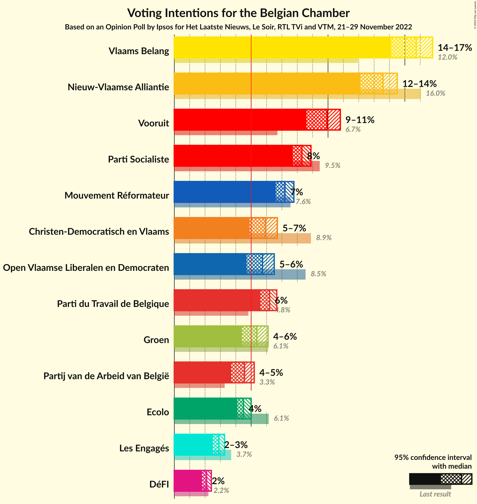
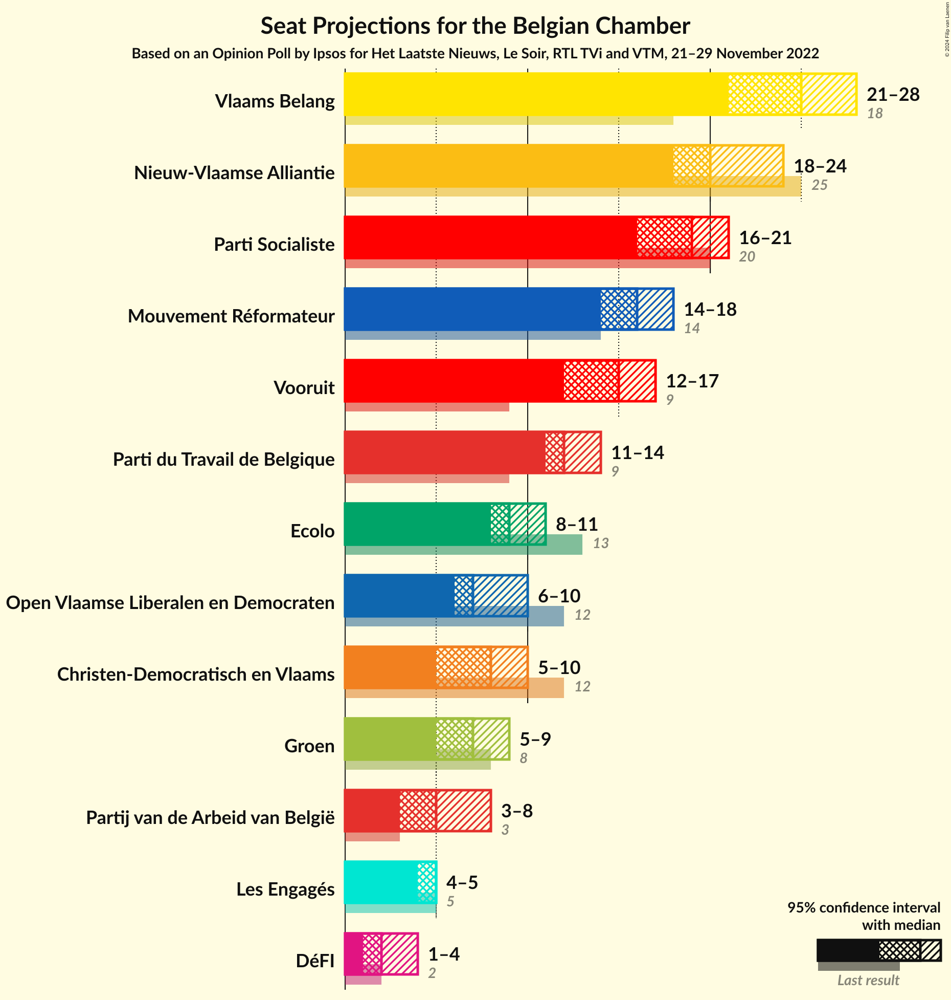
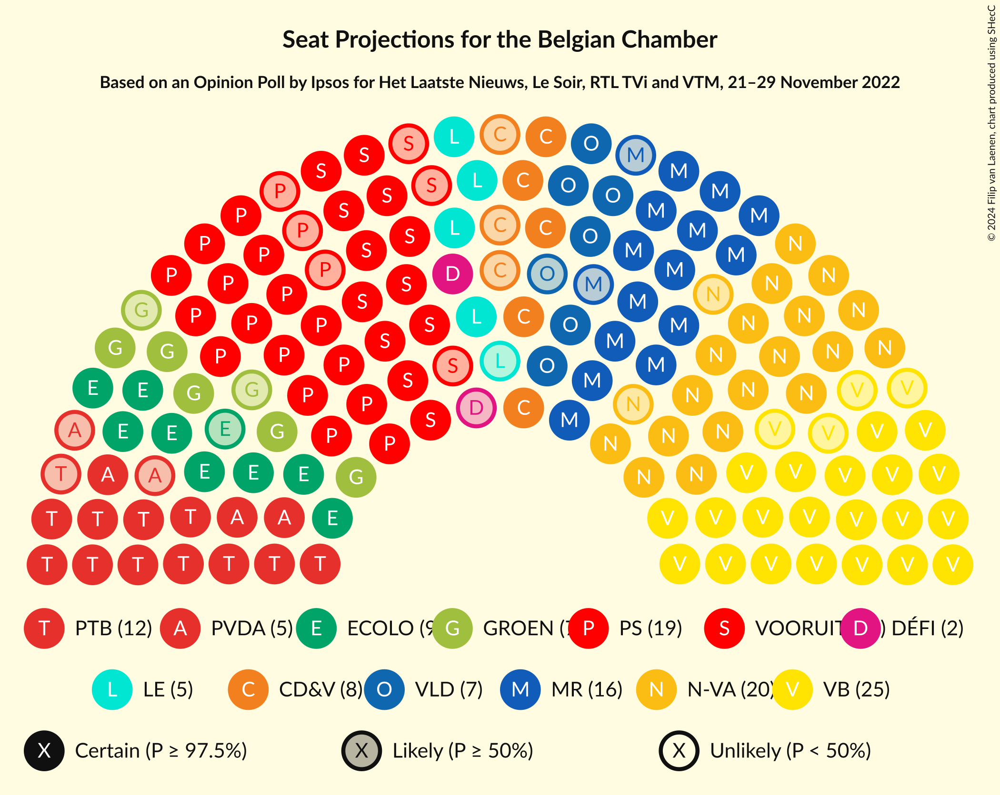
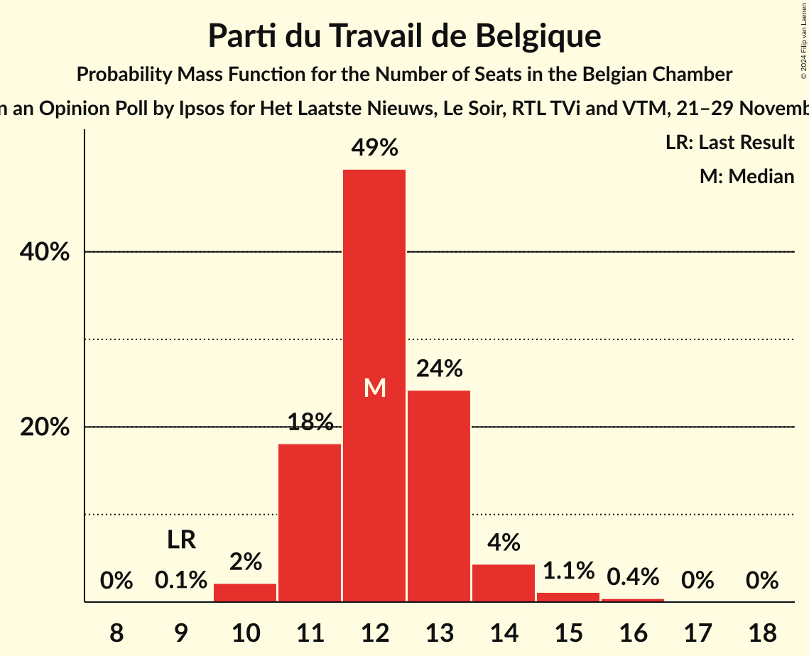
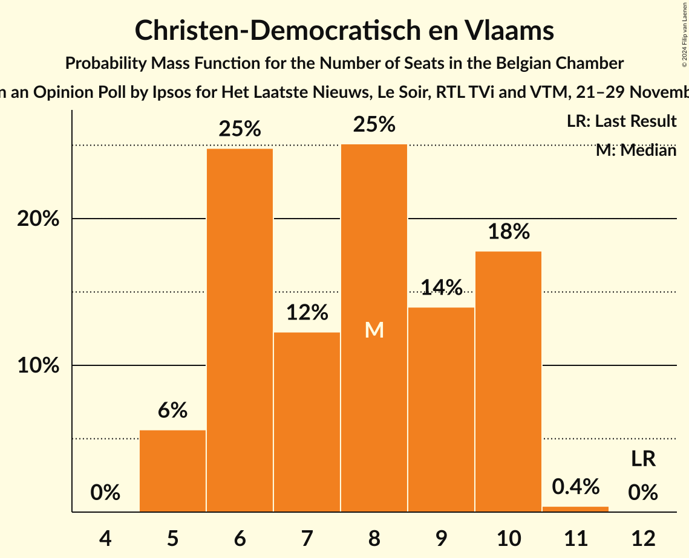
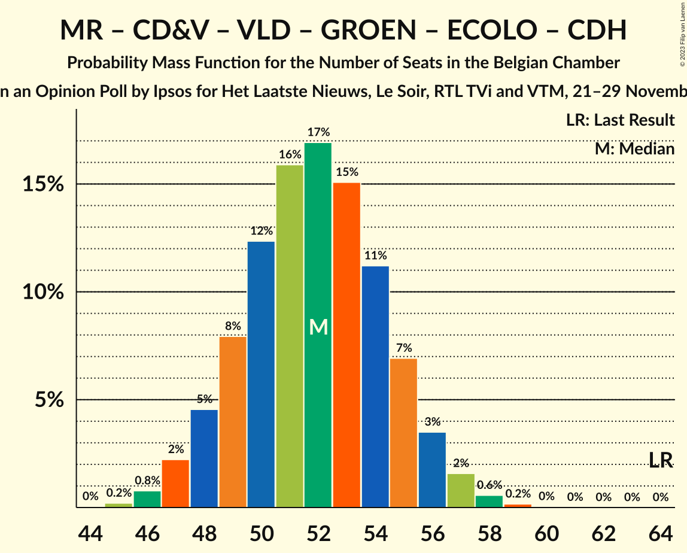

# Opinion Poll by Ipsos for Het Laatste Nieuws, Le Soir, RTL TVi and VTM, 21–29 November 2022

Areas included: Brussels, Flanders, Wallonia

<a href="#voting-intentions">Voting Intentions</a> | <a href="#seats">Seats</a> | <a href="#coalitions">Coalitions</a> | <a href="#technical-information">Technical Information</a>

## Voting Intentions

### Confidence Intervals

| Party | Last Result | Poll Result | 80% Confidence Interval | 90% Confidence Interval | 95% Confidence Interval | 99% Confidence Interval |
|:-----:|:-----------:|:-----------:|:-----------------------:|:-----------------------:|:-----------------------:|:-----------------------:|
| Vlaams Belang | 12.0% | 15.7% | 14.7–16.5% |14.4–16.7% |14.1–16.8% |13.6–16.8% |
| Nieuw-Vlaamse Alliantie | 16.0% | 13.6% | 12.6–14.3% |12.3–14.5% |12.1–14.5% |11.6–14.6% |
| Vooruit | 6.7% | 9.9% | 9.0–10.6% |8.8–10.7% |8.6–10.8% |8.2–10.9% |
| Parti Socialiste | 9.5% | 8.9% | 7.9–8.3% |7.8–8.3% |7.7–8.3% |7.5–8.3% |
| Mouvement Réformateur | 7.6% | 7.8% | 6.8–7.2% |6.7–7.2% |6.6–7.2% |6.5–7.2% |
| Parti du Travail de Belgique | 4.8% | 6.7% | 5.8–6.1% |5.7–6.2% |5.6–6.2% |5.5–6.2% |
| Christen-Democratisch en Vlaams | 8.9% | 5.9% | 5.2–6.5% |5.0–6.6% |4.9–6.7% |4.6–6.7% |
| Open Vlaamse Liberalen en Democraten | 8.5% | 5.7% | 5.0–6.3% |4.9–6.4% |4.7–6.5% |4.4–6.5% |
| Groen | 6.1% | 5.4% | 4.7–5.9% |4.5–6.0% |4.4–6.1% |4.1–6.1% |
| Ecolo | 6.1% | 5.0% | 4.2–4.5% |4.1–4.5% |4.1–4.5% |3.9–4.5% |
| Partij van de Arbeid van België | 3.3% | 4.6% | 4.0–5.1% |3.8–5.2% |3.7–5.2% |3.4–5.3% |
| Centre démocrate humaniste | 3.7% | 3.3% | 2.6–2.9% |2.6–2.9% |2.5–2.9% |2.4–2.9% |
| DéFI | 2.2% | 2.4% | 1.9–2.1% |1.8–2.1% |1.8–2.1% |1.7–2.1% |

*Note:* The poll result column reflects the actual value used in the calculations. Published results may vary slightly, and in addition be rounded to fewer digits.

## Seats

### Confidence Intervals

| Party | Last Result | Median | 80% Confidence Interval | 90% Confidence Interval | 95% Confidence Interval | 99% Confidence Interval |
|:-----:|:-----------:|:------:|:-----------------------:|:-----------------------:|:-----------------------:|:-----------------------:|
| <a href="#vlaams-belang">Vlaams Belang</a> | 18 | 25 | 22–26 |21–27 |21–28 |21–29 |
| <a href="#nieuw-vlaamse-alliantie">Nieuw-Vlaamse Alliantie</a> | 25 | 20 | 19–23 |19–24 |18–24 |17–25 |
| <a href="#vooruit">Vooruit</a> | 9 | 15 | 13–16 |12–17 |12–17 |11–18 |
| <a href="#parti-socialiste">Parti Socialiste</a> | 20 | 19 | 17–20 |17–20 |16–21 |16–21 |
| <a href="#mouvement-réformateur">Mouvement Réformateur</a> | 14 | 16 | 14–18 |14–18 |14–18 |13–19 |
| <a href="#parti-du-travail-de-belgique">Parti du Travail de Belgique</a> | 9 | 12 | 11–13 |11–14 |11–14 |10–15 |
| <a href="#christen-democratisch-en-vlaams">Christen-Democratisch en Vlaams</a> | 12 | 8 | 6–10 |5–10 |5–10 |5–10 |
| <a href="#open-vlaamse-liberalen-en-democraten">Open Vlaamse Liberalen en Democraten</a> | 12 | 7 | 6–9 |6–10 |6–10 |4–10 |
| <a href="#groen">Groen</a> | 8 | 7 | 5–9 |5–9 |5–9 |5–9 |
| <a href="#ecolo">Ecolo</a> | 13 | 9 | 9–10 |8–11 |8–11 |8–12 |
| <a href="#partij-van-de-arbeid-van-belgië">Partij van de Arbeid van België</a> | 3 | 5 | 4–7 |4–8 |3–8 |3–8 |
| <a href="#centre-démocrate-humaniste">Centre démocrate humaniste</a> | 5 | 5 | 5 |4–5 |4–5 |4–6 |
| <a href="#défi">DéFI</a> | 2 | 2 | 1–4 |1–4 |1–4 |1–4 |

### Vlaams Belang

*For a full overview of the results for this party, see the [Vlaams Belang](party-vlaamsbelang.html) page.*

| Number of Seats | Probability | Accumulated | Special Marks |
|:---------------:|:-----------:|:-----------:|:-------------:|
| 18 | 0% | 100% | Last Result |
| 19 | 0.1% | 100% |  |
| 20 | 0.3% | 99.9% |  |
| 21 | 5% | 99.6% |  |
| 22 | 7% | 95% |  |
| 23 | 17% | 88% |  |
| 24 | 18% | 71% |  |
| 25 | 39% | 53% | Median |
| 26 | 7% | 14% |  |
| 27 | 4% | 7% |  |
| 28 | 2% | 3% |  |
| 29 | 0.7% | 0.8% |  |
| 30 | 0.1% | 0.1% |  |
| 31 | 0% | 0% |  |

### Nieuw-Vlaamse Alliantie

*For a full overview of the results for this party, see the [Nieuw-Vlaamse Alliantie](party-nieuw-vlaamsealliantie.html) page.*

| Number of Seats | Probability | Accumulated | Special Marks |
|:---------------:|:-----------:|:-----------:|:-------------:|
| 16 | 0.1% | 100% |  |
| 17 | 0.8% | 99.9% |  |
| 18 | 4% | 99.0% |  |
| 19 | 8% | 95% |  |
| 20 | 43% | 87% | Median |
| 21 | 20% | 44% |  |
| 22 | 10% | 24% |  |
| 23 | 8% | 14% |  |
| 24 | 4% | 7% |  |
| 25 | 2% | 2% | Last Result |
| 26 | 0.1% | 0.1% |  |
| 27 | 0% | 0% |  |

### Vooruit

*For a full overview of the results for this party, see the [Vooruit](party-vooruit.html) page.*

| Number of Seats | Probability | Accumulated | Special Marks |
|:---------------:|:-----------:|:-----------:|:-------------:|
| 9 | 0% | 100% | Last Result |
| 10 | 0% | 100% |  |
| 11 | 1.2% | 100% |  |
| 12 | 7% | 98.8% |  |
| 13 | 8% | 92% |  |
| 14 | 19% | 84% |  |
| 15 | 48% | 65% | Median |
| 16 | 9% | 17% |  |
| 17 | 6% | 7% |  |
| 18 | 1.1% | 1.5% |  |
| 19 | 0.4% | 0.4% |  |
| 20 | 0% | 0% |  |

### Parti Socialiste

*For a full overview of the results for this party, see the [Parti Socialiste](party-partisocialiste.html) page.*

| Number of Seats | Probability | Accumulated | Special Marks |
|:---------------:|:-----------:|:-----------:|:-------------:|
| 15 | 0.3% | 100% |  |
| 16 | 3% | 99.7% |  |
| 17 | 15% | 96% |  |
| 18 | 31% | 82% |  |
| 19 | 36% | 51% | Median |
| 20 | 10% | 15% | Last Result |
| 21 | 5% | 5% |  |
| 22 | 0.2% | 0.2% |  |
| 23 | 0% | 0% |  |

### Mouvement Réformateur

*For a full overview of the results for this party, see the [Mouvement Réformateur](party-mouvementréformateur.html) page.*

| Number of Seats | Probability | Accumulated | Special Marks |
|:---------------:|:-----------:|:-----------:|:-------------:|
| 13 | 1.5% | 100% |  |
| 14 | 16% | 98% | Last Result |
| 15 | 31% | 82% |  |
| 16 | 21% | 51% | Median |
| 17 | 17% | 30% |  |
| 18 | 12% | 13% |  |
| 19 | 2% | 2% |  |
| 20 | 0% | 0% |  |

### Parti du Travail de Belgique

*For a full overview of the results for this party, see the [Parti du Travail de Belgique](party-partidutravaildebelgique.html) page.*

| Number of Seats | Probability | Accumulated | Special Marks |
|:---------------:|:-----------:|:-----------:|:-------------:|
| 9 | 0.1% | 100% | Last Result |
| 10 | 2% | 99.9% |  |
| 11 | 18% | 98% |  |
| 12 | 49% | 80% | Median |
| 13 | 24% | 30% |  |
| 14 | 4% | 6% |  |
| 15 | 1.1% | 2% |  |
| 16 | 0.4% | 0.5% |  |
| 17 | 0% | 0.1% |  |
| 18 | 0% | 0% |  |

### Christen-Democratisch en Vlaams

*For a full overview of the results for this party, see the [Christen-Democratisch en Vlaams](party-christen-democratischenvlaams.html) page.*

| Number of Seats | Probability | Accumulated | Special Marks |
|:---------------:|:-----------:|:-----------:|:-------------:|
| 5 | 6% | 100% |  |
| 6 | 25% | 94% |  |
| 7 | 12% | 70% |  |
| 8 | 25% | 57% | Median |
| 9 | 14% | 32% |  |
| 10 | 18% | 18% |  |
| 11 | 0.4% | 0.4% |  |
| 12 | 0% | 0% | Last Result |

### Open Vlaamse Liberalen en Democraten

*For a full overview of the results for this party, see the [Open Vlaamse Liberalen en Democraten](party-openvlaamseliberalenendemocraten.html) page.*

| Number of Seats | Probability | Accumulated | Special Marks |
|:---------------:|:-----------:|:-----------:|:-------------:|
| 4 | 0.5% | 100% |  |
| 5 | 1.3% | 99.5% |  |
| 6 | 28% | 98% |  |
| 7 | 29% | 70% | Median |
| 8 | 19% | 41% |  |
| 9 | 15% | 22% |  |
| 10 | 7% | 7% |  |
| 11 | 0% | 0% |  |
| 12 | 0% | 0% | Last Result |

### Groen

*For a full overview of the results for this party, see the [Groen](party-groen.html) page.*

| Number of Seats | Probability | Accumulated | Special Marks |
|:---------------:|:-----------:|:-----------:|:-------------:|
| 3 | 0.2% | 100% |  |
| 4 | 0.2% | 99.8% |  |
| 5 | 19% | 99.6% |  |
| 6 | 16% | 81% |  |
| 7 | 41% | 65% | Median |
| 8 | 10% | 23% | Last Result |
| 9 | 13% | 13% |  |
| 10 | 0.1% | 0.1% |  |
| 11 | 0% | 0% |  |

### Ecolo

*For a full overview of the results for this party, see the [Ecolo](party-ecolo.html) page.*

| Number of Seats | Probability | Accumulated | Special Marks |
|:---------------:|:-----------:|:-----------:|:-------------:|
| 6 | 0% | 100% |  |
| 7 | 0.3% | 99.9% |  |
| 8 | 8% | 99.7% |  |
| 9 | 66% | 92% | Median |
| 10 | 20% | 26% |  |
| 11 | 5% | 6% |  |
| 12 | 0.7% | 0.7% |  |
| 13 | 0% | 0% | Last Result |

### Partij van de Arbeid van België

*For a full overview of the results for this party, see the [Partij van de Arbeid van België](party-partijvandearbeidvanbelgië.html) page.*

| Number of Seats | Probability | Accumulated | Special Marks |
|:---------------:|:-----------:|:-----------:|:-------------:|
| 1 | 0.1% | 100% |  |
| 2 | 0.1% | 99.9% |  |
| 3 | 3% | 99.8% | Last Result |
| 4 | 13% | 97% |  |
| 5 | 54% | 84% | Median |
| 6 | 11% | 30% |  |
| 7 | 11% | 19% |  |
| 8 | 8% | 8% |  |
| 9 | 0% | 0% |  |

### Centre démocrate humaniste

*For a full overview of the results for this party, see the [Centre démocrate humaniste](party-centredémocratehumaniste.html) page.*

| Number of Seats | Probability | Accumulated | Special Marks |
|:---------------:|:-----------:|:-----------:|:-------------:|
| 3 | 0% | 100% |  |
| 4 | 9% | 99.9% |  |
| 5 | 89% | 91% | Last Result, Median |
| 6 | 2% | 2% |  |
| 7 | 0.2% | 0.3% |  |
| 8 | 0.1% | 0.1% |  |
| 9 | 0% | 0% |  |

### DéFI

*For a full overview of the results for this party, see the [DéFI](party-défi.html) page.*

| Number of Seats | Probability | Accumulated | Special Marks |
|:---------------:|:-----------:|:-----------:|:-------------:|
| 1 | 18% | 100% |  |
| 2 | 42% | 82% | Last Result, Median |
| 3 | 20% | 40% |  |
| 4 | 20% | 20% |  |
| 5 | 0.3% | 0.4% |  |
| 6 | 0% | 0% |  |

## Coalitions

### Confidence Intervals

| Coalition | Last Result | Median | Majority? | 80% Confidence Interval | 90% Confidence Interval | 95% Confidence Interval | 99% Confidence Interval |
|:---------:|:-----------:|:------:|:---------:|:-----------------------:|:-----------------------:|:-----------------------:|:-----------------------:|
| Vooruit – Parti Socialiste – Mouvement Réformateur – Christen-Democratisch en Vlaams – Open Vlaamse Liberalen en Democraten – Groen – Ecolo – Centre démocrate humaniste | 93 | 85 | 100% | 82–88 | 81–89 | 80–89 | 79–91 |
| Vooruit – Parti Socialiste – Parti du Travail de Belgique – Christen-Democratisch en Vlaams – Groen – Ecolo – Partij van de Arbeid van België – Centre démocrate humaniste | 79 | 79 | 94% | 76–83 | 75–83 | 75–84 | 73–86 |
| Vooruit – Parti Socialiste – Mouvement Réformateur – Christen-Democratisch en Vlaams – Open Vlaamse Liberalen en Democraten – Groen – Ecolo | 88 | 80 | 97% | 77–83 | 76–84 | 75–84 | 74–86 |
| Nieuw-Vlaamse Alliantie – Vooruit – Parti Socialiste – Mouvement Réformateur – Open Vlaamse Liberalen en Democraten | 80 | 77 | 75% | 74–80 | 73–81 | 73–82 | 71–83 |
| Vooruit – Parti Socialiste – Mouvement Réformateur – Open Vlaamse Liberalen en Democraten – Groen – Ecolo | 76 | 72 | 7% | 69–75 | 69–76 | 68–77 | 66–78 |
| Vooruit – Parti Socialiste – Parti du Travail de Belgique – Groen – Ecolo – Partij van de Arbeid van België – Centre démocrate humaniste | 67 | 72 | 5% | 69–75 | 68–75 | 67–76 | 65–78 |
| Vooruit – Parti Socialiste – Mouvement Réformateur – Christen-Democratisch en Vlaams – Open Vlaamse Liberalen en Democraten – Centre démocrate humaniste | 72 | 69 | 0.2% | 66–72 | 65–73 | 64–73 | 63–75 |
| Vooruit – Parti Socialiste – Parti du Travail de Belgique – Groen – Ecolo – Partij van de Arbeid van België | 62 | 67 | 0% | 64–70 | 63–71 | 62–71 | 61–73 |
| Vooruit – Parti Socialiste – Christen-Democratisch en Vlaams – Groen – Ecolo – Centre démocrate humaniste | 67 | 62 | 0% | 59–65 | 58–66 | 57–66 | 56–68 |
| Nieuw-Vlaamse Alliantie – Mouvement Réformateur – Christen-Democratisch en Vlaams – Open Vlaamse Liberalen en Democraten – Centre démocrate humaniste | 68 | 56 | 0% | 54–60 | 53–61 | 52–61 | 51–63 |
| Vooruit – Parti Socialiste – Mouvement Réformateur – Open Vlaamse Liberalen en Democraten | 55 | 56 | 0% | 54–59 | 53–60 | 52–60 | 51–62 |
| Parti Socialiste – Mouvement Réformateur – Christen-Democratisch en Vlaams – Open Vlaamse Liberalen en Democraten – Centre démocrate humaniste | 63 | 54 | 0% | 52–57 | 51–58 | 50–59 | 49–60 |
| Mouvement Réformateur – Christen-Democratisch en Vlaams – Open Vlaamse Liberalen en Democraten – Groen – Ecolo – Centre démocrate humaniste | 64 | 52 | 0% | 49–55 | 48–56 | 47–56 | 46–58 |
| Nieuw-Vlaamse Alliantie – Mouvement Réformateur – Christen-Democratisch en Vlaams – Open Vlaamse Liberalen en Democraten | 63 | 51 | 0% | 49–55 | 48–56 | 47–56 | 46–58 |
| Vooruit – Parti Socialiste – Christen-Democratisch en Vlaams – Centre démocrate humaniste | 46 | 46 | 0% | 43–49 | 42–49 | 42–50 | 40–51 |
| Mouvement Réformateur – Christen-Democratisch en Vlaams – Open Vlaamse Liberalen en Democraten – Centre démocrate humaniste | 43 | 36 | 0% | 33–39 | 32–40 | 32–40 | 30–42 |

### Vooruit – Parti Socialiste – Mouvement Réformateur – Christen-Democratisch en Vlaams – Open Vlaamse Liberalen en Democraten – Groen – Ecolo – Centre démocrate humaniste

| Number of Seats | Probability | Accumulated | Special Marks |
|:---------------:|:-----------:|:-----------:|:-------------:|
| 77 | 0.1% | 100% |  |
| 78 | 0.3% | 99.9% |  |
| 79 | 0.8% | 99.6% |  |
| 80 | 2% | 98.8% |  |
| 81 | 4% | 97% |  |
| 82 | 7% | 93% |  |
| 83 | 10% | 86% |  |
| 84 | 15% | 76% |  |
| 85 | 18% | 61% |  |
| 86 | 17% | 42% | Median |
| 87 | 13% | 25% |  |
| 88 | 7% | 13% |  |
| 89 | 3% | 5% |  |
| 90 | 1.3% | 2% |  |
| 91 | 0.4% | 0.6% |  |
| 92 | 0.1% | 0.1% |  |
| 93 | 0% | 0% | Last Result |

### Vooruit – Parti Socialiste – Parti du Travail de Belgique – Christen-Democratisch en Vlaams – Groen – Ecolo – Partij van de Arbeid van België – Centre démocrate humaniste

| Number of Seats | Probability | Accumulated | Special Marks |
|:---------------:|:-----------:|:-----------:|:-------------:|
| 71 | 0.1% | 100% |  |
| 72 | 0.2% | 99.9% |  |
| 73 | 0.6% | 99.7% |  |
| 74 | 2% | 99.1% |  |
| 75 | 3% | 98% |  |
| 76 | 6% | 94% | Majority |
| 77 | 10% | 88% |  |
| 78 | 14% | 78% |  |
| 79 | 16% | 64% | Last Result |
| 80 | 16% | 48% | Median |
| 81 | 13% | 33% |  |
| 82 | 9% | 20% |  |
| 83 | 6% | 10% |  |
| 84 | 3% | 5% |  |
| 85 | 1.2% | 2% |  |
| 86 | 0.4% | 0.6% |  |
| 87 | 0.1% | 0.2% |  |
| 88 | 0% | 0% |  |

### Vooruit – Parti Socialiste – Mouvement Réformateur – Christen-Democratisch en Vlaams – Open Vlaamse Liberalen en Democraten – Groen – Ecolo

| Number of Seats | Probability | Accumulated | Special Marks |
|:---------------:|:-----------:|:-----------:|:-------------:|
| 72 | 0.1% | 100% |  |
| 73 | 0.3% | 99.9% |  |
| 74 | 0.8% | 99.6% |  |
| 75 | 2% | 98.9% |  |
| 76 | 4% | 97% | Majority |
| 77 | 6% | 93% |  |
| 78 | 10% | 87% |  |
| 79 | 15% | 77% |  |
| 80 | 18% | 62% |  |
| 81 | 17% | 44% | Median |
| 82 | 13% | 26% |  |
| 83 | 8% | 13% |  |
| 84 | 4% | 6% |  |
| 85 | 1.4% | 2% |  |
| 86 | 0.5% | 0.6% |  |
| 87 | 0.1% | 0.2% |  |
| 88 | 0% | 0% | Last Result |

### Nieuw-Vlaamse Alliantie – Vooruit – Parti Socialiste – Mouvement Réformateur – Open Vlaamse Liberalen en Democraten

| Number of Seats | Probability | Accumulated | Special Marks |
|:---------------:|:-----------:|:-----------:|:-------------:|
| 70 | 0.1% | 100% |  |
| 71 | 0.5% | 99.8% |  |
| 72 | 1.4% | 99.3% |  |
| 73 | 3% | 98% |  |
| 74 | 7% | 94% |  |
| 75 | 12% | 87% |  |
| 76 | 17% | 75% | Majority |
| 77 | 18% | 58% | Median |
| 78 | 15% | 40% |  |
| 79 | 11% | 25% |  |
| 80 | 7% | 14% | Last Result |
| 81 | 4% | 7% |  |
| 82 | 2% | 3% |  |
| 83 | 0.7% | 0.9% |  |
| 84 | 0.2% | 0.3% |  |
| 85 | 0.1% | 0.1% |  |
| 86 | 0% | 0% |  |

### Vooruit – Parti Socialiste – Mouvement Réformateur – Open Vlaamse Liberalen en Democraten – Groen – Ecolo

| Number of Seats | Probability | Accumulated | Special Marks |
|:---------------:|:-----------:|:-----------:|:-------------:|
| 65 | 0.1% | 100% |  |
| 66 | 0.4% | 99.8% |  |
| 67 | 1.2% | 99.4% |  |
| 68 | 3% | 98% |  |
| 69 | 5% | 95% |  |
| 70 | 10% | 90% |  |
| 71 | 15% | 80% |  |
| 72 | 18% | 65% |  |
| 73 | 17% | 47% | Median |
| 74 | 14% | 30% |  |
| 75 | 9% | 17% |  |
| 76 | 5% | 7% | Last Result, Majority |
| 77 | 2% | 3% |  |
| 78 | 0.6% | 0.8% |  |
| 79 | 0.2% | 0.2% |  |
| 80 | 0% | 0% |  |

### Vooruit – Parti Socialiste – Parti du Travail de Belgique – Groen – Ecolo – Partij van de Arbeid van België – Centre démocrate humaniste

| Number of Seats | Probability | Accumulated | Special Marks |
|:---------------:|:-----------:|:-----------:|:-------------:|
| 64 | 0.1% | 100% |  |
| 65 | 0.4% | 99.8% |  |
| 66 | 1.0% | 99.5% |  |
| 67 | 2% | 98.5% | Last Result |
| 68 | 5% | 96% |  |
| 69 | 9% | 91% |  |
| 70 | 13% | 83% |  |
| 71 | 16% | 70% |  |
| 72 | 17% | 53% | Median |
| 73 | 15% | 36% |  |
| 74 | 10% | 21% |  |
| 75 | 6% | 11% |  |
| 76 | 3% | 5% | Majority |
| 77 | 1.2% | 2% |  |
| 78 | 0.5% | 0.7% |  |
| 79 | 0.2% | 0.2% |  |
| 80 | 0% | 0.1% |  |
| 81 | 0% | 0% |  |

### Vooruit – Parti Socialiste – Mouvement Réformateur – Christen-Democratisch en Vlaams – Open Vlaamse Liberalen en Democraten – Centre démocrate humaniste

| Number of Seats | Probability | Accumulated | Special Marks |
|:---------------:|:-----------:|:-----------:|:-------------:|
| 61 | 0% | 100% |  |
| 62 | 0.2% | 99.9% |  |
| 63 | 0.7% | 99.7% |  |
| 64 | 2% | 99.0% |  |
| 65 | 4% | 97% |  |
| 66 | 7% | 93% |  |
| 67 | 11% | 86% |  |
| 68 | 16% | 75% |  |
| 69 | 18% | 59% |  |
| 70 | 16% | 40% | Median |
| 71 | 11% | 24% |  |
| 72 | 7% | 12% | Last Result |
| 73 | 3% | 6% |  |
| 74 | 2% | 2% |  |
| 75 | 0.6% | 0.7% |  |
| 76 | 0.1% | 0.2% | Majority |
| 77 | 0% | 0% |  |

### Vooruit – Parti Socialiste – Parti du Travail de Belgique – Groen – Ecolo – Partij van de Arbeid van België

| Number of Seats | Probability | Accumulated | Special Marks |
|:---------------:|:-----------:|:-----------:|:-------------:|
| 59 | 0.1% | 100% |  |
| 60 | 0.3% | 99.9% |  |
| 61 | 0.9% | 99.5% |  |
| 62 | 2% | 98.6% | Last Result |
| 63 | 5% | 96% |  |
| 64 | 8% | 92% |  |
| 65 | 13% | 83% |  |
| 66 | 16% | 71% |  |
| 67 | 17% | 54% | Median |
| 68 | 15% | 37% |  |
| 69 | 11% | 22% |  |
| 70 | 6% | 11% |  |
| 71 | 3% | 5% |  |
| 72 | 1.3% | 2% |  |
| 73 | 0.5% | 0.7% |  |
| 74 | 0.2% | 0.2% |  |
| 75 | 0% | 0.1% |  |
| 76 | 0% | 0% | Majority |

### Vooruit – Parti Socialiste – Christen-Democratisch en Vlaams – Groen – Ecolo – Centre démocrate humaniste

| Number of Seats | Probability | Accumulated | Special Marks |
|:---------------:|:-----------:|:-----------:|:-------------:|
| 54 | 0.1% | 100% |  |
| 55 | 0.3% | 99.9% |  |
| 56 | 0.9% | 99.6% |  |
| 57 | 2% | 98.6% |  |
| 58 | 5% | 96% |  |
| 59 | 8% | 92% |  |
| 60 | 12% | 83% |  |
| 61 | 15% | 71% |  |
| 62 | 16% | 56% |  |
| 63 | 15% | 40% | Median |
| 64 | 12% | 25% |  |
| 65 | 8% | 14% |  |
| 66 | 4% | 6% |  |
| 67 | 2% | 2% | Last Result |
| 68 | 0.5% | 0.6% |  |
| 69 | 0.1% | 0.2% |  |
| 70 | 0% | 0% |  |

### Nieuw-Vlaamse Alliantie – Mouvement Réformateur – Christen-Democratisch en Vlaams – Open Vlaamse Liberalen en Democraten – Centre démocrate humaniste

| Number of Seats | Probability | Accumulated | Special Marks |
|:---------------:|:-----------:|:-----------:|:-------------:|
| 49 | 0.1% | 100% |  |
| 50 | 0.3% | 99.9% |  |
| 51 | 1.0% | 99.6% |  |
| 52 | 3% | 98.6% |  |
| 53 | 6% | 96% |  |
| 54 | 10% | 90% |  |
| 55 | 15% | 80% |  |
| 56 | 17% | 66% | Median |
| 57 | 15% | 49% |  |
| 58 | 13% | 34% |  |
| 59 | 9% | 20% |  |
| 60 | 6% | 11% |  |
| 61 | 3% | 6% |  |
| 62 | 2% | 2% |  |
| 63 | 0.6% | 0.8% |  |
| 64 | 0.2% | 0.2% |  |
| 65 | 0% | 0.1% |  |
| 66 | 0% | 0% |  |
| 67 | 0% | 0% |  |
| 68 | 0% | 0% | Last Result |

### Vooruit – Parti Socialiste – Mouvement Réformateur – Open Vlaamse Liberalen en Democraten

| Number of Seats | Probability | Accumulated | Special Marks |
|:---------------:|:-----------:|:-----------:|:-------------:|
| 50 | 0.2% | 100% |  |
| 51 | 0.8% | 99.7% |  |
| 52 | 2% | 98.9% |  |
| 53 | 5% | 97% |  |
| 54 | 10% | 91% |  |
| 55 | 16% | 81% | Last Result |
| 56 | 19% | 66% |  |
| 57 | 19% | 46% | Median |
| 58 | 14% | 27% |  |
| 59 | 8% | 13% |  |
| 60 | 4% | 5% |  |
| 61 | 1.3% | 2% |  |
| 62 | 0.4% | 0.5% |  |
| 63 | 0.1% | 0.1% |  |
| 64 | 0% | 0% |  |

### Parti Socialiste – Mouvement Réformateur – Christen-Democratisch en Vlaams – Open Vlaamse Liberalen en Democraten – Centre démocrate humaniste

| Number of Seats | Probability | Accumulated | Special Marks |
|:---------------:|:-----------:|:-----------:|:-------------:|
| 48 | 0.2% | 100% |  |
| 49 | 0.9% | 99.8% |  |
| 50 | 3% | 98.9% |  |
| 51 | 6% | 96% |  |
| 52 | 10% | 90% |  |
| 53 | 16% | 80% |  |
| 54 | 19% | 64% |  |
| 55 | 18% | 45% | Median |
| 56 | 13% | 27% |  |
| 57 | 7% | 14% |  |
| 58 | 4% | 7% |  |
| 59 | 2% | 3% |  |
| 60 | 0.8% | 1.0% |  |
| 61 | 0.2% | 0.2% |  |
| 62 | 0% | 0% |  |
| 63 | 0% | 0% | Last Result |

### Mouvement Réformateur – Christen-Democratisch en Vlaams – Open Vlaamse Liberalen en Democraten – Groen – Ecolo – Centre démocrate humaniste

| Number of Seats | Probability | Accumulated | Special Marks |
|:---------------:|:-----------:|:-----------:|:-------------:|
| 44 | 0% | 100% |  |
| 45 | 0.2% | 99.9% |  |
| 46 | 0.8% | 99.7% |  |
| 47 | 2% | 99.0% |  |
| 48 | 5% | 97% |  |
| 49 | 8% | 92% |  |
| 50 | 12% | 84% |  |
| 51 | 16% | 72% |  |
| 52 | 17% | 56% | Median |
| 53 | 15% | 39% |  |
| 54 | 11% | 24% |  |
| 55 | 7% | 13% |  |
| 56 | 3% | 6% |  |
| 57 | 2% | 2% |  |
| 58 | 0.6% | 0.8% |  |
| 59 | 0.2% | 0.2% |  |
| 60 | 0% | 0.1% |  |
| 61 | 0% | 0% |  |
| 62 | 0% | 0% |  |
| 63 | 0% | 0% |  |
| 64 | 0% | 0% | Last Result |

### Nieuw-Vlaamse Alliantie – Mouvement Réformateur – Christen-Democratisch en Vlaams – Open Vlaamse Liberalen en Democraten

| Number of Seats | Probability | Accumulated | Special Marks |
|:---------------:|:-----------:|:-----------:|:-------------:|
| 44 | 0% | 100% |  |
| 45 | 0.3% | 99.9% |  |
| 46 | 0.9% | 99.7% |  |
| 47 | 3% | 98.8% |  |
| 48 | 5% | 96% |  |
| 49 | 10% | 91% |  |
| 50 | 15% | 81% |  |
| 51 | 17% | 67% | Median |
| 52 | 16% | 50% |  |
| 53 | 13% | 34% |  |
| 54 | 10% | 21% |  |
| 55 | 6% | 11% |  |
| 56 | 3% | 6% |  |
| 57 | 2% | 2% |  |
| 58 | 0.6% | 0.9% |  |
| 59 | 0.2% | 0.3% |  |
| 60 | 0% | 0.1% |  |
| 61 | 0% | 0% |  |
| 62 | 0% | 0% |  |
| 63 | 0% | 0% | Last Result |

### Vooruit – Parti Socialiste – Christen-Democratisch en Vlaams – Centre démocrate humaniste

| Number of Seats | Probability | Accumulated | Special Marks |
|:---------------:|:-----------:|:-----------:|:-------------:|
| 39 | 0.1% | 100% |  |
| 40 | 0.5% | 99.9% |  |
| 41 | 2% | 99.3% |  |
| 42 | 4% | 98% |  |
| 43 | 9% | 93% |  |
| 44 | 13% | 84% |  |
| 45 | 16% | 72% |  |
| 46 | 17% | 56% | Last Result |
| 47 | 16% | 39% | Median |
| 48 | 12% | 23% |  |
| 49 | 7% | 11% |  |
| 50 | 3% | 4% |  |
| 51 | 1.0% | 1.3% |  |
| 52 | 0.2% | 0.3% |  |
| 53 | 0.1% | 0.1% |  |
| 54 | 0% | 0% |  |

### Mouvement Réformateur – Christen-Democratisch en Vlaams – Open Vlaamse Liberalen en Democraten – Centre démocrate humaniste

| Number of Seats | Probability | Accumulated | Special Marks |
|:---------------:|:-----------:|:-----------:|:-------------:|
| 29 | 0.1% | 100% |  |
| 30 | 0.5% | 99.9% |  |
| 31 | 2% | 99.4% |  |
| 32 | 4% | 98% |  |
| 33 | 8% | 93% |  |
| 34 | 13% | 85% |  |
| 35 | 18% | 72% |  |
| 36 | 17% | 54% | Median |
| 37 | 14% | 37% |  |
| 38 | 11% | 22% |  |
| 39 | 6% | 12% |  |
| 40 | 3% | 5% |  |
| 41 | 2% | 2% |  |
| 42 | 0.6% | 0.8% |  |
| 43 | 0.2% | 0.2% | Last Result |
| 44 | 0% | 0% |  |

## Technical Information

### Opinion Poll

+ **Polling firm:** Ipsos
+ **Commissioner(s):** Het Laatste Nieuws, Le Soir, RTL TVi and VTM
+ **Fieldwork period:** 21–29 November 2022

### Calculations

+ **Sample size:** 1620
+ **Simulations done:** 1,048,576
+ **Error estimate:** 1.71%

