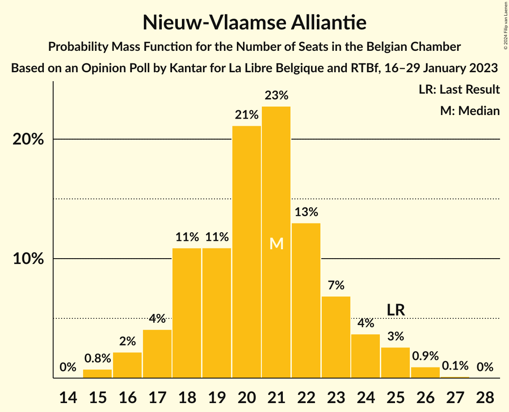
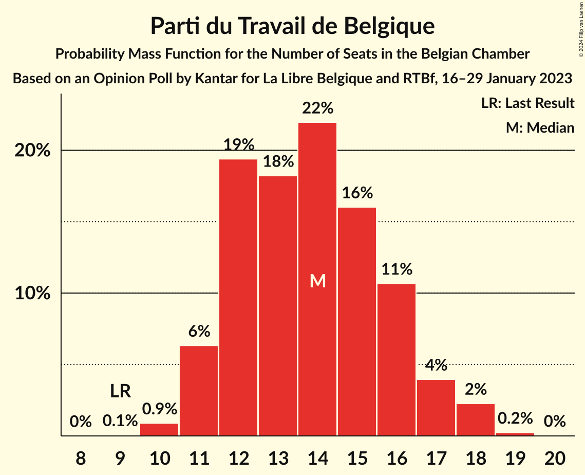
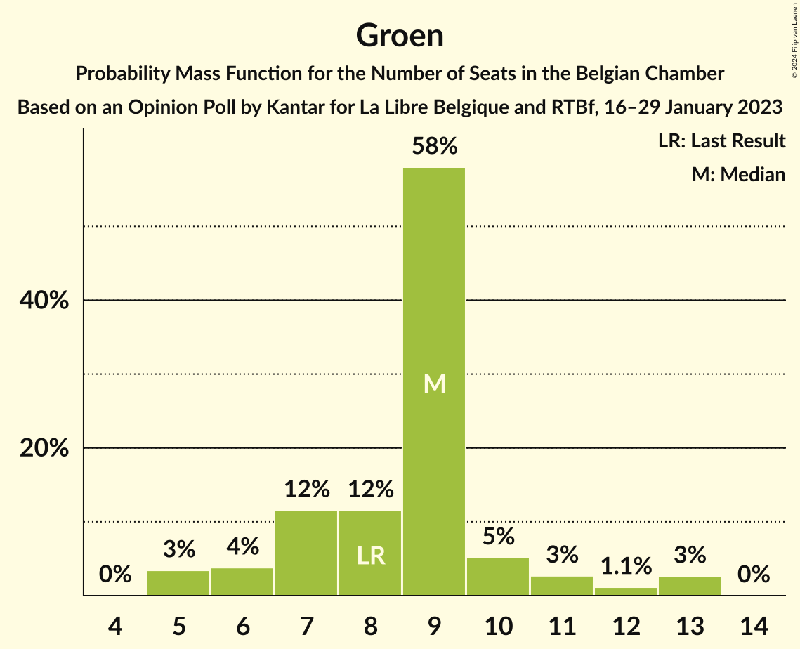
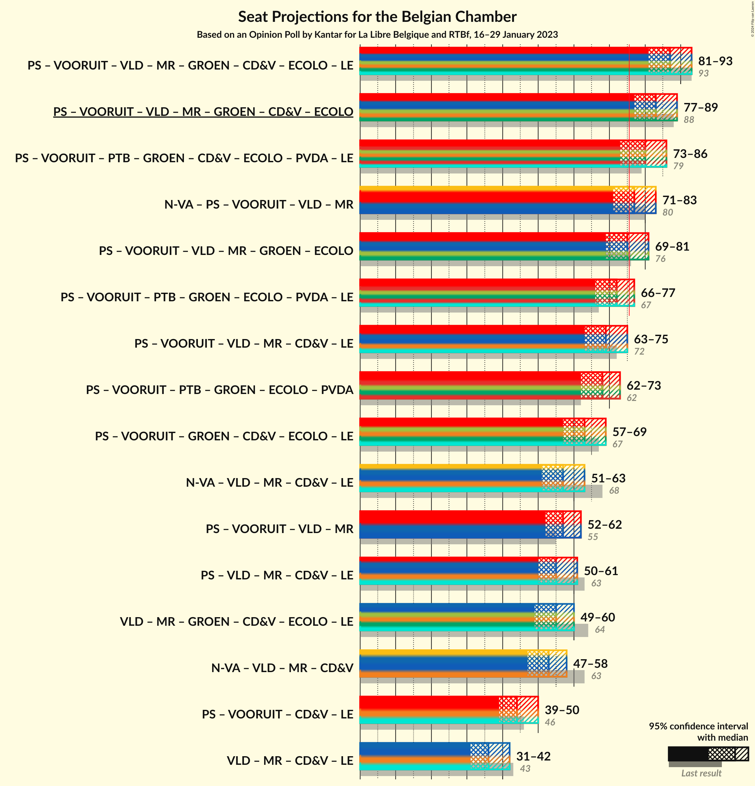
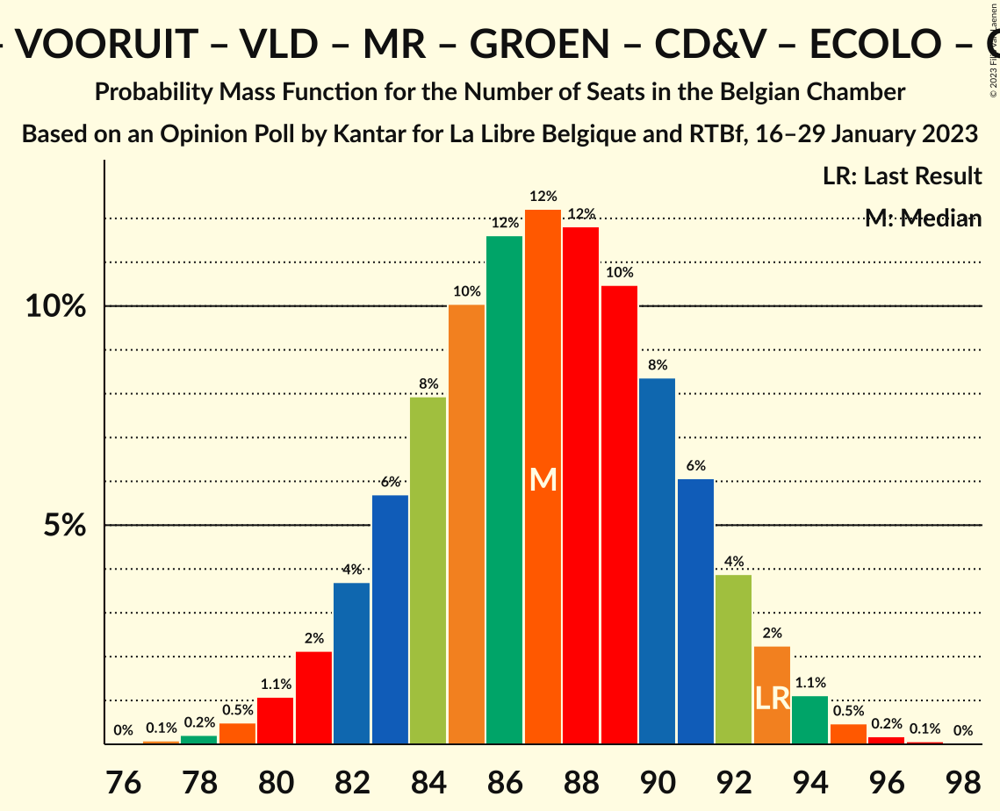
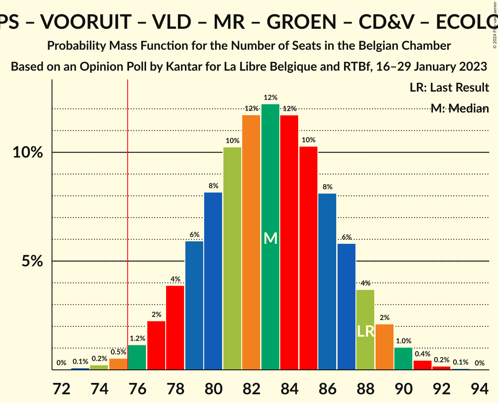
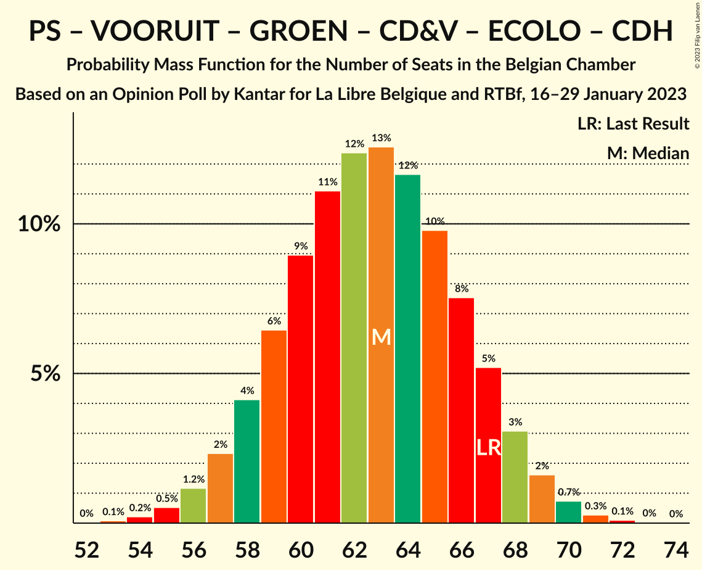
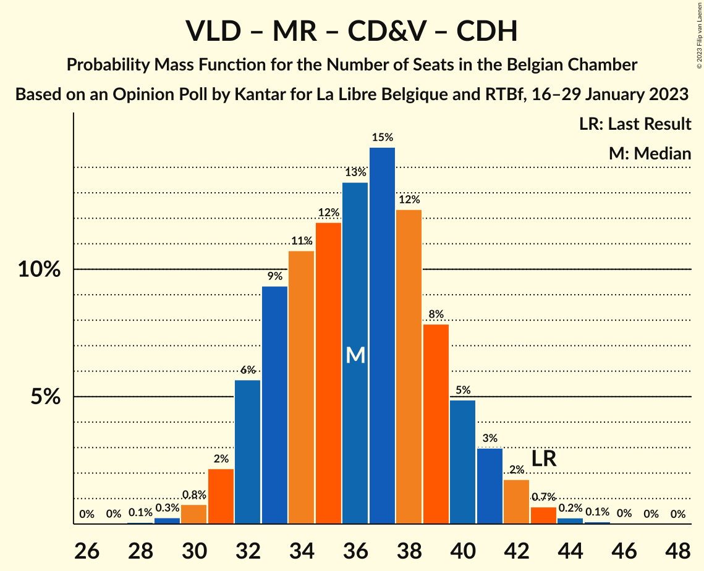

# Opinion Poll by Kantar for La Libre Belgique and RTBf, 16–29 January 2023

Areas included: Brussels, Flanders, Wallonia

<a href="#voting-intentions">Voting Intentions</a> | <a href="#seats">Seats</a> | <a href="#coalitions">Coalitions</a> | <a href="#technical-information">Technical Information</a>

## Voting Intentions

### Confidence Intervals

| Party | Last Result | Poll Result | 80% Confidence Interval | 90% Confidence Interval | 95% Confidence Interval | 99% Confidence Interval |
|:-----:|:-----------:|:-----------:|:-----------------------:|:-----------------------:|:-----------------------:|:-----------------------:|
| Vlaams Belang | 12.0% | 15.5% | 13.0–14.2% |12.7–14.2% |12.5–14.2% |12.0–14.2% |
| Nieuw-Vlaamse Alliantie | 16.0% | 13.5% | 11.2–12.3% |11.0–12.4% |10.7–12.4% |10.3–12.4% |
| Vooruit | 6.7% | 9.4% | 8.2–10.3% |7.9–10.5% |7.6–10.6% |7.1–10.7% |
| Parti Socialiste | 9.5% | 9.4% | 8.0–8.5% |7.8–8.5% |7.7–8.5% |7.4–8.6% |
| Open Vlaamse Liberalen en Democraten | 8.5% | 7.6% | 5.8–6.6% |5.6–6.6% |5.4–6.7% |5.1–6.7% |
| Parti du Travail de Belgique | 4.8% | 7.4% | 6.2–6.6% |6.0–6.7% |5.9–6.7% |5.7–6.7% |
| Mouvement Réformateur | 7.6% | 7.3% | 6.1–6.5% |5.9–6.6% |5.8–6.6% |5.6–6.6% |
| Groen | 6.1% | 6.4% | 5.4–7.2% |5.1–7.4% |4.9–7.5% |4.5–7.5% |
| Christen-Democratisch en Vlaams | 8.9% | 6.0% | 4.4–5.1% |4.2–5.2% |4.1–5.2% |3.8–5.2% |
| Ecolo | 6.1% | 5.2% | 4.1–4.5% |4.0–4.5% |4.0–4.5% |3.8–4.5% |
| Partij van de Arbeid van België | 3.3% | 3.5% | 2.8–4.1% |2.6–4.3% |2.4–4.4% |2.1–4.4% |
| Centre démocrate humaniste | 3.7% | 3.1% | 2.2–2.6% |2.2–2.6% |2.1–2.6% |1.9–2.6% |
| DéFI | 2.2% | 2.4% | 1.7–2.0% |1.6–2.0% |1.6–2.0% |1.5–2.0% |

*Note:* The poll result column reflects the actual value used in the calculations. Published results may vary slightly, and in addition be rounded to fewer digits.

## Seats

### Confidence Intervals

| Party | Last Result | Median | 80% Confidence Interval | 90% Confidence Interval | 95% Confidence Interval | 99% Confidence Interval |
|:-----:|:-----------:|:------:|:-----------------------:|:-----------------------:|:-----------------------:|:-----------------------:|
| <a href="#vlaams-belang">Vlaams Belang</a> | 18 | 24 | 21–26 |20–27 |19–28 |18–29 |
| <a href="#nieuw-vlaamse-alliantie">Nieuw-Vlaamse Alliantie</a> | 25 | 21 | 18–23 |17–24 |16–25 |15–26 |
| <a href="#vooruit">Vooruit</a> | 9 | 14 | 11–16 |11–16 |11–17 |10–19 |
| <a href="#parti-socialiste">Parti Socialiste</a> | 20 | 19 | 17–21 |17–21 |16–21 |15–22 |
| <a href="#open-vlaamse-liberalen-en-democraten">Open Vlaamse Liberalen en Democraten</a> | 12 | 10 | 9–12 |8–13 |7–14 |6–15 |
| <a href="#parti-du-travail-de-belgique">Parti du Travail de Belgique</a> | 9 | 14 | 12–16 |11–17 |11–18 |10–18 |
| <a href="#mouvement-réformateur">Mouvement Réformateur</a> | 14 | 14 | 12–16 |12–17 |12–18 |11–18 |
| <a href="#groen">Groen</a> | 8 | 9 | 7–10 |6–11 |5–13 |5–13 |
| <a href="#christen-democratisch-en-vlaams">Christen-Democratisch en Vlaams</a> | 12 | 8 | 5–10 |5–10 |5–10 |5–11 |
| <a href="#ecolo">Ecolo</a> | 13 | 10 | 8–11 |7–12 |7–12 |6–13 |
| <a href="#partij-van-de-arbeid-van-belgië">Partij van de Arbeid van België</a> | 3 | 3 | 1–5 |1–5 |1–6 |0–8 |
| <a href="#centre-démocrate-humaniste">Centre démocrate humaniste</a> | 5 | 4 | 4 |4–5 |4–6 |2–8 |
| <a href="#défi">DéFI</a> | 2 | 2 | 1–4 |1–4 |1–4 |1–5 |

### Vlaams Belang

*For a full overview of the results for this party, see the [Vlaams Belang](party-vlaamsbelang.html) page.*

| Number of Seats | Probability | Accumulated | Special Marks |
|:---------------:|:-----------:|:-----------:|:-------------:|
| 17 | 0.1% | 100% |  |
| 18 | 0.5% | 99.9% | Last Result |
| 19 | 2% | 99.4% |  |
| 20 | 4% | 97% |  |
| 21 | 15% | 93% |  |
| 22 | 12% | 78% |  |
| 23 | 14% | 66% |  |
| 24 | 12% | 52% | Median |
| 25 | 30% | 40% |  |
| 26 | 5% | 10% |  |
| 27 | 2% | 5% |  |
| 28 | 2% | 3% |  |
| 29 | 1.2% | 2% |  |
| 30 | 0.4% | 0.4% |  |
| 31 | 0% | 0.1% |  |
| 32 | 0% | 0% |  |

### Nieuw-Vlaamse Alliantie

*For a full overview of the results for this party, see the [Nieuw-Vlaamse Alliantie](party-nieuw-vlaamsealliantie.html) page.*

| Number of Seats | Probability | Accumulated | Special Marks |
|:---------------:|:-----------:|:-----------:|:-------------:|
| 15 | 0.8% | 100% |  |
| 16 | 2% | 99.2% |  |
| 17 | 4% | 97% |  |
| 18 | 11% | 93% |  |
| 19 | 11% | 82% |  |
| 20 | 21% | 71% |  |
| 21 | 23% | 50% | Median |
| 22 | 13% | 27% |  |
| 23 | 7% | 14% |  |
| 24 | 4% | 7% |  |
| 25 | 3% | 4% | Last Result |
| 26 | 0.9% | 1.1% |  |
| 27 | 0.1% | 0.2% |  |
| 28 | 0% | 0% |  |

### Vooruit

*For a full overview of the results for this party, see the [Vooruit](party-vooruit.html) page.*

| Number of Seats | Probability | Accumulated | Special Marks |
|:---------------:|:-----------:|:-----------:|:-------------:|
| 9 | 0.3% | 100% | Last Result |
| 10 | 0.9% | 99.7% |  |
| 11 | 15% | 98.8% |  |
| 12 | 14% | 84% |  |
| 13 | 13% | 70% |  |
| 14 | 15% | 56% | Median |
| 15 | 31% | 41% |  |
| 16 | 6% | 11% |  |
| 17 | 3% | 4% |  |
| 18 | 0.9% | 2% |  |
| 19 | 0.5% | 0.6% |  |
| 20 | 0.2% | 0.2% |  |
| 21 | 0% | 0% |  |

### Parti Socialiste

*For a full overview of the results for this party, see the [Parti Socialiste](party-partisocialiste.html) page.*

| Number of Seats | Probability | Accumulated | Special Marks |
|:---------------:|:-----------:|:-----------:|:-------------:|
| 14 | 0.1% | 100% |  |
| 15 | 0.8% | 99.9% |  |
| 16 | 4% | 99.1% |  |
| 17 | 9% | 95% |  |
| 18 | 25% | 86% |  |
| 19 | 31% | 61% | Median |
| 20 | 18% | 30% | Last Result |
| 21 | 11% | 12% |  |
| 22 | 0.6% | 0.8% |  |
| 23 | 0.1% | 0.1% |  |
| 24 | 0% | 0% |  |

### Open Vlaamse Liberalen en Democraten

*For a full overview of the results for this party, see the [Open Vlaamse Liberalen en Democraten](party-openvlaamseliberalenendemocraten.html) page.*

| Number of Seats | Probability | Accumulated | Special Marks |
|:---------------:|:-----------:|:-----------:|:-------------:|
| 6 | 0.8% | 100% |  |
| 7 | 3% | 99.2% |  |
| 8 | 4% | 96% |  |
| 9 | 9% | 93% |  |
| 10 | 54% | 84% | Median |
| 11 | 12% | 30% |  |
| 12 | 11% | 18% | Last Result |
| 13 | 4% | 7% |  |
| 14 | 2% | 3% |  |
| 15 | 0.5% | 0.8% |  |
| 16 | 0.3% | 0.3% |  |
| 17 | 0% | 0% |  |

### Parti du Travail de Belgique

*For a full overview of the results for this party, see the [Parti du Travail de Belgique](party-partidutravaildebelgique.html) page.*

| Number of Seats | Probability | Accumulated | Special Marks |
|:---------------:|:-----------:|:-----------:|:-------------:|
| 9 | 0.1% | 100% | Last Result |
| 10 | 0.9% | 99.9% |  |
| 11 | 6% | 99.0% |  |
| 12 | 19% | 93% |  |
| 13 | 18% | 73% |  |
| 14 | 22% | 55% | Median |
| 15 | 16% | 33% |  |
| 16 | 11% | 17% |  |
| 17 | 4% | 6% |  |
| 18 | 2% | 3% |  |
| 19 | 0.2% | 0.3% |  |
| 20 | 0% | 0% |  |

### Mouvement Réformateur

*For a full overview of the results for this party, see the [Mouvement Réformateur](party-mouvementréformateur.html) page.*

| Number of Seats | Probability | Accumulated | Special Marks |
|:---------------:|:-----------:|:-----------:|:-------------:|
| 10 | 0.2% | 100% |  |
| 11 | 2% | 99.8% |  |
| 12 | 9% | 98% |  |
| 13 | 30% | 89% |  |
| 14 | 30% | 59% | Last Result, Median |
| 15 | 13% | 29% |  |
| 16 | 7% | 16% |  |
| 17 | 4% | 8% |  |
| 18 | 4% | 4% |  |
| 19 | 0.2% | 0.3% |  |
| 20 | 0% | 0% |  |

### Groen

*For a full overview of the results for this party, see the [Groen](party-groen.html) page.*

| Number of Seats | Probability | Accumulated | Special Marks |
|:---------------:|:-----------:|:-----------:|:-------------:|
| 4 | 0% | 100% |  |
| 5 | 3% | 99.9% |  |
| 6 | 4% | 97% |  |
| 7 | 12% | 93% |  |
| 8 | 12% | 81% | Last Result |
| 9 | 58% | 70% | Median |
| 10 | 5% | 12% |  |
| 11 | 3% | 6% |  |
| 12 | 1.1% | 4% |  |
| 13 | 3% | 3% |  |
| 14 | 0% | 0% |  |

### Christen-Democratisch en Vlaams

*For a full overview of the results for this party, see the [Christen-Democratisch en Vlaams](party-christen-democratischenvlaams.html) page.*

| Number of Seats | Probability | Accumulated | Special Marks |
|:---------------:|:-----------:|:-----------:|:-------------:|
| 4 | 0.3% | 100% |  |
| 5 | 14% | 99.7% |  |
| 6 | 24% | 86% |  |
| 7 | 10% | 62% |  |
| 8 | 10% | 53% | Median |
| 9 | 17% | 42% |  |
| 10 | 23% | 25% |  |
| 11 | 2% | 2% |  |
| 12 | 0.2% | 0.3% | Last Result |
| 13 | 0.1% | 0.1% |  |
| 14 | 0% | 0% |  |

### Ecolo

*For a full overview of the results for this party, see the [Ecolo](party-ecolo.html) page.*

| Number of Seats | Probability | Accumulated | Special Marks |
|:---------------:|:-----------:|:-----------:|:-------------:|
| 5 | 0.2% | 100% |  |
| 6 | 2% | 99.8% |  |
| 7 | 6% | 98% |  |
| 8 | 8% | 92% |  |
| 9 | 19% | 84% |  |
| 10 | 35% | 65% | Median |
| 11 | 24% | 30% |  |
| 12 | 5% | 5% |  |
| 13 | 0.5% | 0.6% | Last Result |
| 14 | 0.1% | 0.1% |  |
| 15 | 0% | 0% |  |

### Partij van de Arbeid van België

*For a full overview of the results for this party, see the [Partij van de Arbeid van België](party-partijvandearbeidvanbelgië.html) page.*

| Number of Seats | Probability | Accumulated | Special Marks |
|:---------------:|:-----------:|:-----------:|:-------------:|
| 0 | 1.1% | 100% |  |
| 1 | 27% | 98.9% |  |
| 2 | 5% | 72% |  |
| 3 | 29% | 66% | Last Result, Median |
| 4 | 16% | 37% |  |
| 5 | 18% | 21% |  |
| 6 | 1.1% | 3% |  |
| 7 | 1.1% | 2% |  |
| 8 | 0.6% | 0.6% |  |
| 9 | 0% | 0% |  |

### Centre démocrate humaniste

*For a full overview of the results for this party, see the [Centre démocrate humaniste](party-centredémocratehumaniste.html) page.*

| Number of Seats | Probability | Accumulated | Special Marks |
|:---------------:|:-----------:|:-----------:|:-------------:|
| 0 | 0.1% | 100% |  |
| 1 | 0.3% | 99.9% |  |
| 2 | 0.5% | 99.6% |  |
| 3 | 0.9% | 99.1% |  |
| 4 | 91% | 98% | Median |
| 5 | 4% | 8% | Last Result |
| 6 | 2% | 3% |  |
| 7 | 0.7% | 1.4% |  |
| 8 | 0.6% | 0.7% |  |
| 9 | 0% | 0% |  |

### DéFI

*For a full overview of the results for this party, see the [DéFI](party-défi.html) page.*

| Number of Seats | Probability | Accumulated | Special Marks |
|:---------------:|:-----------:|:-----------:|:-------------:|
| 1 | 34% | 100% |  |
| 2 | 28% | 66% | Last Result, Median |
| 3 | 22% | 38% |  |
| 4 | 14% | 16% |  |
| 5 | 2% | 2% |  |
| 6 | 0.2% | 0.2% |  |
| 7 | 0% | 0% |  |

## Coalitions

### Confidence Intervals

| Coalition | Last Result | Median | Majority? | 80% Confidence Interval | 90% Confidence Interval | 95% Confidence Interval | 99% Confidence Interval |
|:---------:|:-----------:|:------:|:---------:|:-----------------------:|:-----------------------:|:-----------------------:|:-----------------------:|
| Parti Socialiste – Vooruit – Open Vlaamse Liberalen en Democraten – Mouvement Réformateur – Groen – Christen-Democratisch en Vlaams – Ecolo – Centre démocrate humaniste | 93 | 87 | 100% | 83–91 | 82–92 | 81–93 | 79–95 |
| Parti Socialiste – Vooruit – Open Vlaamse Liberalen en Democraten – Mouvement Réformateur – Groen – Christen-Democratisch en Vlaams – Ecolo | 88 | 83 | 99.1% | 79–87 | 78–88 | 77–89 | 75–91 |
| Parti Socialiste – Vooruit – Parti du Travail de Belgique – Groen – Christen-Democratisch en Vlaams – Ecolo – Partij van de Arbeid van België – Centre démocrate humaniste | 79 | 80 | 89% | 75–84 | 74–85 | 73–86 | 71–87 |
| Nieuw-Vlaamse Alliantie – Parti Socialiste – Vooruit – Open Vlaamse Liberalen en Democraten – Mouvement Réformateur | 80 | 77 | 72% | 73–81 | 72–83 | 71–83 | 70–85 |
| Parti Socialiste – Vooruit – Open Vlaamse Liberalen en Democraten – Mouvement Réformateur – Groen – Ecolo | 76 | 75 | 47% | 71–79 | 70–80 | 69–81 | 67–83 |
| Parti Socialiste – Vooruit – Parti du Travail de Belgique – Groen – Ecolo – Partij van de Arbeid van België – Centre démocrate humaniste | 67 | 72 | 11% | 68–76 | 67–77 | 66–77 | 64–79 |
| Parti Socialiste – Vooruit – Open Vlaamse Liberalen en Democraten – Mouvement Réformateur – Christen-Democratisch en Vlaams – Centre démocrate humaniste | 72 | 69 | 1.4% | 65–73 | 64–74 | 63–75 | 61–77 |
| Parti Socialiste – Vooruit – Parti du Travail de Belgique – Groen – Ecolo – Partij van de Arbeid van België | 62 | 68 | 0.4% | 64–72 | 63–73 | 62–73 | 60–75 |
| Parti Socialiste – Vooruit – Groen – Christen-Democratisch en Vlaams – Ecolo – Centre démocrate humaniste | 67 | 63 | 0% | 59–67 | 58–68 | 57–69 | 55–70 |
| Nieuw-Vlaamse Alliantie – Open Vlaamse Liberalen en Democraten – Mouvement Réformateur – Christen-Democratisch en Vlaams – Centre démocrate humaniste | 68 | 57 | 0% | 53–60 | 52–62 | 51–63 | 49–65 |
| Parti Socialiste – Vooruit – Open Vlaamse Liberalen en Democraten – Mouvement Réformateur | 55 | 57 | 0% | 53–60 | 52–61 | 52–62 | 50–64 |
| Parti Socialiste – Open Vlaamse Liberalen en Democraten – Mouvement Réformateur – Christen-Democratisch en Vlaams – Centre démocrate humaniste | 63 | 55 | 0% | 51–59 | 50–60 | 50–61 | 48–62 |
| Open Vlaamse Liberalen en Democraten – Mouvement Réformateur – Groen – Christen-Democratisch en Vlaams – Ecolo – Centre démocrate humaniste | 64 | 55 | 0% | 51–58 | 50–60 | 49–60 | 47–62 |
| Nieuw-Vlaamse Alliantie – Open Vlaamse Liberalen en Democraten – Mouvement Réformateur – Christen-Democratisch en Vlaams | 63 | 53 | 0% | 49–56 | 48–57 | 47–58 | 45–60 |
| Parti Socialiste – Vooruit – Christen-Democratisch en Vlaams – Centre démocrate humaniste | 46 | 44 | 0% | 41–48 | 40–49 | 39–50 | 38–51 |
| Open Vlaamse Liberalen en Democraten – Mouvement Réformateur – Christen-Democratisch en Vlaams – Centre démocrate humaniste | 43 | 36 | 0% | 33–40 | 32–41 | 31–42 | 30–43 |

### Parti Socialiste – Vooruit – Open Vlaamse Liberalen en Democraten – Mouvement Réformateur – Groen – Christen-Democratisch en Vlaams – Ecolo – Centre démocrate humaniste

| Number of Seats | Probability | Accumulated | Special Marks |
|:---------------:|:-----------:|:-----------:|:-------------:|
| 77 | 0.1% | 100% |  |
| 78 | 0.2% | 99.9% |  |
| 79 | 0.5% | 99.7% |  |
| 80 | 1.1% | 99.2% |  |
| 81 | 2% | 98% |  |
| 82 | 4% | 96% |  |
| 83 | 6% | 92% |  |
| 84 | 8% | 87% |  |
| 85 | 10% | 79% |  |
| 86 | 12% | 69% |  |
| 87 | 12% | 57% |  |
| 88 | 12% | 45% | Median |
| 89 | 10% | 33% |  |
| 90 | 8% | 22% |  |
| 91 | 6% | 14% |  |
| 92 | 4% | 8% |  |
| 93 | 2% | 4% | Last Result |
| 94 | 1.1% | 2% |  |
| 95 | 0.5% | 0.8% |  |
| 96 | 0.2% | 0.3% |  |
| 97 | 0.1% | 0.1% |  |
| 98 | 0% | 0% |  |

### Parti Socialiste – Vooruit – Open Vlaamse Liberalen en Democraten – Mouvement Réformateur – Groen – Christen-Democratisch en Vlaams – Ecolo

| Number of Seats | Probability | Accumulated | Special Marks |
|:---------------:|:-----------:|:-----------:|:-------------:|
| 72 | 0% | 100% |  |
| 73 | 0.1% | 99.9% |  |
| 74 | 0.2% | 99.9% |  |
| 75 | 0.5% | 99.6% |  |
| 76 | 1.2% | 99.1% | Majority |
| 77 | 2% | 98% |  |
| 78 | 4% | 96% |  |
| 79 | 6% | 92% |  |
| 80 | 8% | 86% |  |
| 81 | 10% | 78% |  |
| 82 | 12% | 67% |  |
| 83 | 12% | 56% |  |
| 84 | 12% | 43% | Median |
| 85 | 10% | 32% |  |
| 86 | 8% | 21% |  |
| 87 | 6% | 13% |  |
| 88 | 4% | 8% | Last Result |
| 89 | 2% | 4% |  |
| 90 | 1.0% | 2% |  |
| 91 | 0.4% | 0.7% |  |
| 92 | 0.2% | 0.3% |  |
| 93 | 0.1% | 0.1% |  |
| 94 | 0% | 0% |  |

### Parti Socialiste – Vooruit – Parti du Travail de Belgique – Groen – Christen-Democratisch en Vlaams – Ecolo – Partij van de Arbeid van België – Centre démocrate humaniste

| Number of Seats | Probability | Accumulated | Special Marks |
|:---------------:|:-----------:|:-----------:|:-------------:|
| 69 | 0.1% | 100% |  |
| 70 | 0.2% | 99.9% |  |
| 71 | 0.4% | 99.8% |  |
| 72 | 0.8% | 99.4% |  |
| 73 | 2% | 98.5% |  |
| 74 | 3% | 97% |  |
| 75 | 5% | 94% |  |
| 76 | 7% | 89% | Majority |
| 77 | 9% | 83% |  |
| 78 | 11% | 74% |  |
| 79 | 12% | 63% | Last Result |
| 80 | 12% | 51% |  |
| 81 | 12% | 38% | Median |
| 82 | 10% | 27% |  |
| 83 | 7% | 17% |  |
| 84 | 5% | 10% |  |
| 85 | 3% | 6% |  |
| 86 | 2% | 3% |  |
| 87 | 0.7% | 1.0% |  |
| 88 | 0.2% | 0.4% |  |
| 89 | 0.1% | 0.1% |  |
| 90 | 0% | 0% |  |

### Nieuw-Vlaamse Alliantie – Parti Socialiste – Vooruit – Open Vlaamse Liberalen en Democraten – Mouvement Réformateur

| Number of Seats | Probability | Accumulated | Special Marks |
|:---------------:|:-----------:|:-----------:|:-------------:|
| 67 | 0% | 100% |  |
| 68 | 0.1% | 99.9% |  |
| 69 | 0.3% | 99.8% |  |
| 70 | 0.7% | 99.5% |  |
| 71 | 2% | 98.8% |  |
| 72 | 3% | 97% |  |
| 73 | 5% | 94% |  |
| 74 | 8% | 89% |  |
| 75 | 10% | 82% |  |
| 76 | 12% | 72% | Majority |
| 77 | 13% | 60% |  |
| 78 | 12% | 47% | Median |
| 79 | 11% | 35% |  |
| 80 | 9% | 24% | Last Result |
| 81 | 6% | 16% |  |
| 82 | 4% | 9% |  |
| 83 | 3% | 5% |  |
| 84 | 1.3% | 2% |  |
| 85 | 0.7% | 1.1% |  |
| 86 | 0.3% | 0.5% |  |
| 87 | 0.1% | 0.2% |  |
| 88 | 0% | 0.1% |  |
| 89 | 0% | 0% |  |

### Parti Socialiste – Vooruit – Open Vlaamse Liberalen en Democraten – Mouvement Réformateur – Groen – Ecolo

| Number of Seats | Probability | Accumulated | Special Marks |
|:---------------:|:-----------:|:-----------:|:-------------:|
| 65 | 0.1% | 100% |  |
| 66 | 0.1% | 99.9% |  |
| 67 | 0.3% | 99.8% |  |
| 68 | 0.8% | 99.4% |  |
| 69 | 2% | 98.7% |  |
| 70 | 3% | 97% |  |
| 71 | 5% | 94% |  |
| 72 | 8% | 89% |  |
| 73 | 10% | 82% |  |
| 74 | 12% | 72% |  |
| 75 | 13% | 60% |  |
| 76 | 13% | 47% | Last Result, Median, Majority |
| 77 | 11% | 34% |  |
| 78 | 9% | 23% |  |
| 79 | 6% | 14% |  |
| 80 | 4% | 8% |  |
| 81 | 2% | 4% |  |
| 82 | 1.1% | 2% |  |
| 83 | 0.4% | 0.7% |  |
| 84 | 0.2% | 0.3% |  |
| 85 | 0.1% | 0.1% |  |
| 86 | 0% | 0% |  |

### Parti Socialiste – Vooruit – Parti du Travail de Belgique – Groen – Ecolo – Partij van de Arbeid van België – Centre démocrate humaniste

| Number of Seats | Probability | Accumulated | Special Marks |
|:---------------:|:-----------:|:-----------:|:-------------:|
| 62 | 0.1% | 100% |  |
| 63 | 0.2% | 99.9% |  |
| 64 | 0.5% | 99.7% |  |
| 65 | 1.1% | 99.1% |  |
| 66 | 2% | 98% |  |
| 67 | 4% | 96% | Last Result |
| 68 | 6% | 92% |  |
| 69 | 8% | 86% |  |
| 70 | 11% | 78% |  |
| 71 | 12% | 67% |  |
| 72 | 13% | 54% |  |
| 73 | 12% | 42% | Median |
| 74 | 10% | 29% |  |
| 75 | 8% | 19% |  |
| 76 | 6% | 11% | Majority |
| 77 | 3% | 6% |  |
| 78 | 1.5% | 2% |  |
| 79 | 0.6% | 1.0% |  |
| 80 | 0.3% | 0.4% |  |
| 81 | 0.1% | 0.2% |  |
| 82 | 0% | 0% |  |

### Parti Socialiste – Vooruit – Open Vlaamse Liberalen en Democraten – Mouvement Réformateur – Christen-Democratisch en Vlaams – Centre démocrate humaniste

| Number of Seats | Probability | Accumulated | Special Marks |
|:---------------:|:-----------:|:-----------:|:-------------:|
| 59 | 0.1% | 100% |  |
| 60 | 0.2% | 99.9% |  |
| 61 | 0.5% | 99.7% |  |
| 62 | 1.2% | 99.2% |  |
| 63 | 2% | 98% |  |
| 64 | 4% | 96% |  |
| 65 | 7% | 91% |  |
| 66 | 9% | 85% |  |
| 67 | 11% | 75% |  |
| 68 | 12% | 64% |  |
| 69 | 12% | 52% | Median |
| 70 | 11% | 39% |  |
| 71 | 10% | 28% |  |
| 72 | 7% | 18% | Last Result |
| 73 | 5% | 11% |  |
| 74 | 3% | 6% |  |
| 75 | 2% | 3% |  |
| 76 | 0.8% | 1.4% | Majority |
| 77 | 0.4% | 0.6% |  |
| 78 | 0.1% | 0.2% |  |
| 79 | 0.1% | 0.1% |  |
| 80 | 0% | 0% |  |

### Parti Socialiste – Vooruit – Parti du Travail de Belgique – Groen – Ecolo – Partij van de Arbeid van België

| Number of Seats | Probability | Accumulated | Special Marks |
|:---------------:|:-----------:|:-----------:|:-------------:|
| 57 | 0% | 100% |  |
| 58 | 0.1% | 99.9% |  |
| 59 | 0.3% | 99.8% |  |
| 60 | 0.6% | 99.6% |  |
| 61 | 1.2% | 99.0% |  |
| 62 | 2% | 98% | Last Result |
| 63 | 4% | 95% |  |
| 64 | 6% | 91% |  |
| 65 | 9% | 85% |  |
| 66 | 11% | 76% |  |
| 67 | 12% | 65% |  |
| 68 | 13% | 53% |  |
| 69 | 12% | 40% | Median |
| 70 | 10% | 29% |  |
| 71 | 8% | 19% |  |
| 72 | 5% | 11% |  |
| 73 | 3% | 5% |  |
| 74 | 1.4% | 2% |  |
| 75 | 0.6% | 1.0% |  |
| 76 | 0.3% | 0.4% | Majority |
| 77 | 0.1% | 0.2% |  |
| 78 | 0% | 0.1% |  |
| 79 | 0% | 0% |  |

### Parti Socialiste – Vooruit – Groen – Christen-Democratisch en Vlaams – Ecolo – Centre démocrate humaniste

| Number of Seats | Probability | Accumulated | Special Marks |
|:---------------:|:-----------:|:-----------:|:-------------:|
| 53 | 0.1% | 100% |  |
| 54 | 0.2% | 99.9% |  |
| 55 | 0.5% | 99.7% |  |
| 56 | 1.2% | 99.1% |  |
| 57 | 2% | 98% |  |
| 58 | 4% | 96% |  |
| 59 | 6% | 92% |  |
| 60 | 9% | 85% |  |
| 61 | 11% | 76% |  |
| 62 | 12% | 65% |  |
| 63 | 13% | 53% |  |
| 64 | 12% | 40% | Median |
| 65 | 10% | 28% |  |
| 66 | 8% | 19% |  |
| 67 | 5% | 11% | Last Result |
| 68 | 3% | 6% |  |
| 69 | 2% | 3% |  |
| 70 | 0.7% | 1.2% |  |
| 71 | 0.3% | 0.4% |  |
| 72 | 0.1% | 0.2% |  |
| 73 | 0% | 0% |  |

### Nieuw-Vlaamse Alliantie – Open Vlaamse Liberalen en Democraten – Mouvement Réformateur – Christen-Democratisch en Vlaams – Centre démocrate humaniste

| Number of Seats | Probability | Accumulated | Special Marks |
|:---------------:|:-----------:|:-----------:|:-------------:|
| 47 | 0.1% | 100% |  |
| 48 | 0.2% | 99.9% |  |
| 49 | 0.5% | 99.8% |  |
| 50 | 1.1% | 99.3% |  |
| 51 | 2% | 98% |  |
| 52 | 4% | 96% |  |
| 53 | 7% | 92% |  |
| 54 | 10% | 85% |  |
| 55 | 11% | 75% |  |
| 56 | 13% | 64% |  |
| 57 | 13% | 51% | Median |
| 58 | 12% | 38% |  |
| 59 | 9% | 26% |  |
| 60 | 7% | 16% |  |
| 61 | 4% | 10% |  |
| 62 | 3% | 5% |  |
| 63 | 1.5% | 3% |  |
| 64 | 0.7% | 1.3% |  |
| 65 | 0.3% | 0.6% |  |
| 66 | 0.1% | 0.2% |  |
| 67 | 0.1% | 0.1% |  |
| 68 | 0% | 0% | Last Result |

### Parti Socialiste – Vooruit – Open Vlaamse Liberalen en Democraten – Mouvement Réformateur

| Number of Seats | Probability | Accumulated | Special Marks |
|:---------------:|:-----------:|:-----------:|:-------------:|
| 48 | 0.1% | 100% |  |
| 49 | 0.2% | 99.9% |  |
| 50 | 0.6% | 99.7% |  |
| 51 | 1.4% | 99.1% |  |
| 52 | 3% | 98% |  |
| 53 | 6% | 95% |  |
| 54 | 9% | 89% |  |
| 55 | 12% | 80% | Last Result |
| 56 | 14% | 68% |  |
| 57 | 14% | 54% | Median |
| 58 | 13% | 40% |  |
| 59 | 11% | 27% |  |
| 60 | 7% | 17% |  |
| 61 | 5% | 10% |  |
| 62 | 3% | 5% |  |
| 63 | 1.3% | 2% |  |
| 64 | 0.6% | 1.1% |  |
| 65 | 0.3% | 0.4% |  |
| 66 | 0.1% | 0.2% |  |
| 67 | 0% | 0.1% |  |
| 68 | 0% | 0% |  |

### Parti Socialiste – Open Vlaamse Liberalen en Democraten – Mouvement Réformateur – Christen-Democratisch en Vlaams – Centre démocrate humaniste

| Number of Seats | Probability | Accumulated | Special Marks |
|:---------------:|:-----------:|:-----------:|:-------------:|
| 46 | 0.1% | 100% |  |
| 47 | 0.2% | 99.9% |  |
| 48 | 0.5% | 99.7% |  |
| 49 | 1.4% | 99.2% |  |
| 50 | 3% | 98% |  |
| 51 | 6% | 95% |  |
| 52 | 9% | 89% |  |
| 53 | 11% | 80% |  |
| 54 | 12% | 69% |  |
| 55 | 13% | 57% | Median |
| 56 | 13% | 43% |  |
| 57 | 11% | 30% |  |
| 58 | 8% | 19% |  |
| 59 | 5% | 11% |  |
| 60 | 3% | 5% |  |
| 61 | 1.4% | 3% |  |
| 62 | 0.7% | 1.1% |  |
| 63 | 0.3% | 0.5% | Last Result |
| 64 | 0.1% | 0.2% |  |
| 65 | 0% | 0.1% |  |
| 66 | 0% | 0% |  |

### Open Vlaamse Liberalen en Democraten – Mouvement Réformateur – Groen – Christen-Democratisch en Vlaams – Ecolo – Centre démocrate humaniste

| Number of Seats | Probability | Accumulated | Special Marks |
|:---------------:|:-----------:|:-----------:|:-------------:|
| 45 | 0.1% | 100% |  |
| 46 | 0.2% | 99.9% |  |
| 47 | 0.6% | 99.7% |  |
| 48 | 1.3% | 99.1% |  |
| 49 | 3% | 98% |  |
| 50 | 5% | 95% |  |
| 51 | 7% | 91% |  |
| 52 | 9% | 84% |  |
| 53 | 11% | 74% |  |
| 54 | 12% | 63% |  |
| 55 | 13% | 50% | Median |
| 56 | 12% | 38% |  |
| 57 | 10% | 26% |  |
| 58 | 7% | 17% |  |
| 59 | 5% | 10% |  |
| 60 | 3% | 5% |  |
| 61 | 1.4% | 2% |  |
| 62 | 0.6% | 1.0% |  |
| 63 | 0.3% | 0.4% |  |
| 64 | 0.1% | 0.2% | Last Result |
| 65 | 0% | 0.1% |  |
| 66 | 0% | 0% |  |

### Nieuw-Vlaamse Alliantie – Open Vlaamse Liberalen en Democraten – Mouvement Réformateur – Christen-Democratisch en Vlaams

| Number of Seats | Probability | Accumulated | Special Marks |
|:---------------:|:-----------:|:-----------:|:-------------:|
| 43 | 0% | 100% |  |
| 44 | 0.2% | 99.9% |  |
| 45 | 0.5% | 99.8% |  |
| 46 | 1.1% | 99.3% |  |
| 47 | 2% | 98% |  |
| 48 | 4% | 96% |  |
| 49 | 7% | 91% |  |
| 50 | 10% | 85% |  |
| 51 | 12% | 75% |  |
| 52 | 13% | 63% |  |
| 53 | 14% | 50% | Median |
| 54 | 12% | 37% |  |
| 55 | 9% | 24% |  |
| 56 | 6% | 15% |  |
| 57 | 4% | 9% |  |
| 58 | 2% | 5% |  |
| 59 | 1.3% | 2% |  |
| 60 | 0.6% | 1.1% |  |
| 61 | 0.3% | 0.5% |  |
| 62 | 0.1% | 0.2% |  |
| 63 | 0% | 0.1% | Last Result |
| 64 | 0% | 0% |  |

### Parti Socialiste – Vooruit – Christen-Democratisch en Vlaams – Centre démocrate humaniste

| Number of Seats | Probability | Accumulated | Special Marks |
|:---------------:|:-----------:|:-----------:|:-------------:|
| 36 | 0.1% | 100% |  |
| 37 | 0.4% | 99.9% |  |
| 38 | 1.0% | 99.5% |  |
| 39 | 2% | 98.5% |  |
| 40 | 4% | 96% |  |
| 41 | 7% | 92% |  |
| 42 | 11% | 85% |  |
| 43 | 13% | 74% |  |
| 44 | 14% | 60% |  |
| 45 | 13% | 47% | Median |
| 46 | 11% | 34% | Last Result |
| 47 | 9% | 23% |  |
| 48 | 7% | 14% |  |
| 49 | 4% | 7% |  |
| 50 | 2% | 3% |  |
| 51 | 0.6% | 0.9% |  |
| 52 | 0.2% | 0.3% |  |
| 53 | 0.1% | 0.1% |  |
| 54 | 0% | 0% |  |

### Open Vlaamse Liberalen en Democraten – Mouvement Réformateur – Christen-Democratisch en Vlaams – Centre démocrate humaniste

| Number of Seats | Probability | Accumulated | Special Marks |
|:---------------:|:-----------:|:-----------:|:-------------:|
| 28 | 0.1% | 100% |  |
| 29 | 0.3% | 99.9% |  |
| 30 | 0.8% | 99.7% |  |
| 31 | 2% | 98.9% |  |
| 32 | 6% | 97% |  |
| 33 | 9% | 91% |  |
| 34 | 11% | 82% |  |
| 35 | 12% | 71% |  |
| 36 | 13% | 59% | Median |
| 37 | 15% | 46% |  |
| 38 | 12% | 31% |  |
| 39 | 8% | 19% |  |
| 40 | 5% | 11% |  |
| 41 | 3% | 6% |  |
| 42 | 2% | 3% |  |
| 43 | 0.7% | 1.1% | Last Result |
| 44 | 0.2% | 0.4% |  |
| 45 | 0.1% | 0.2% |  |
| 46 | 0% | 0.1% |  |
| 47 | 0% | 0% |  |

## Technical Information

### Opinion Poll

+ **Polling firm:** Kantar
+ **Commissioner(s):** La Libre Belgique and RTBf
+ **Fieldwork period:** 16–29 January 2023

### Calculations

+ **Sample size:** 834
+ **Simulations done:** 1,048,576
+ **Error estimate:** 1.59%

