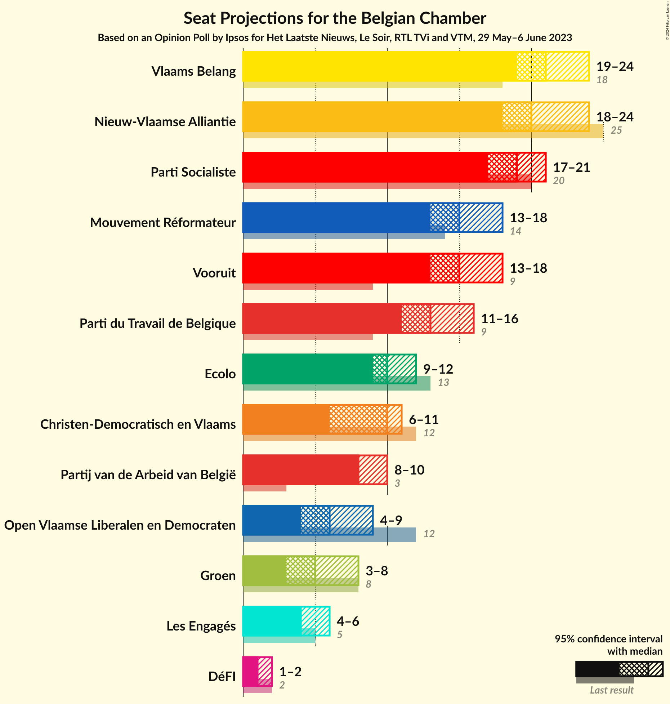
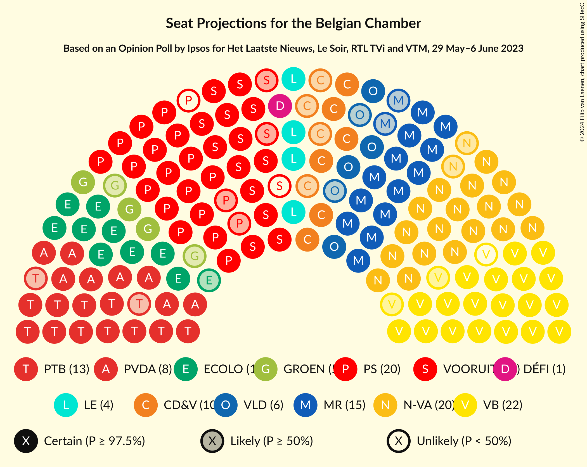
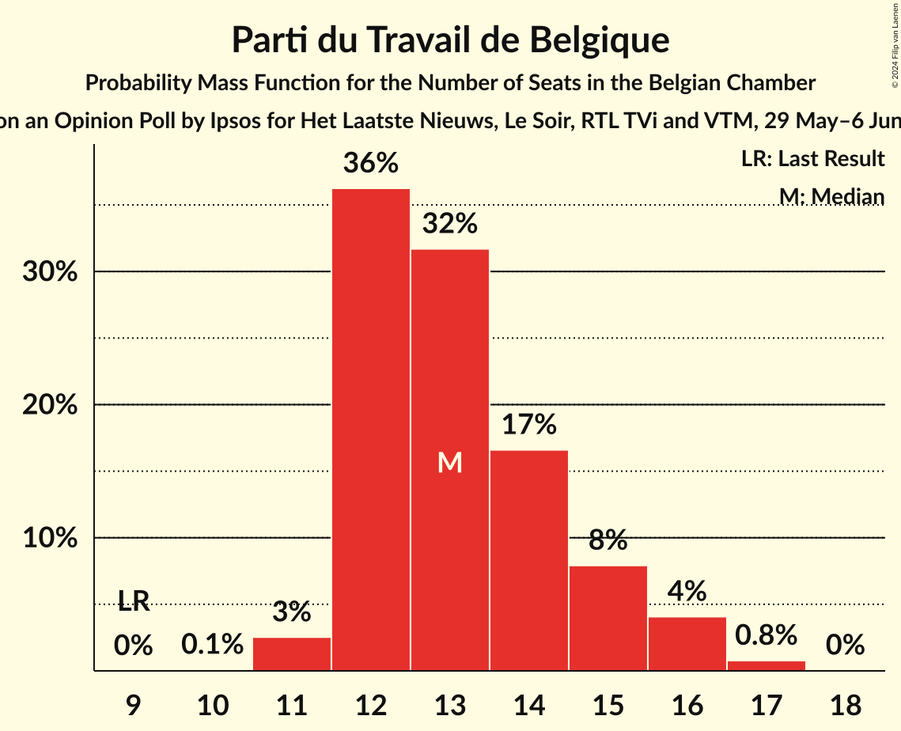
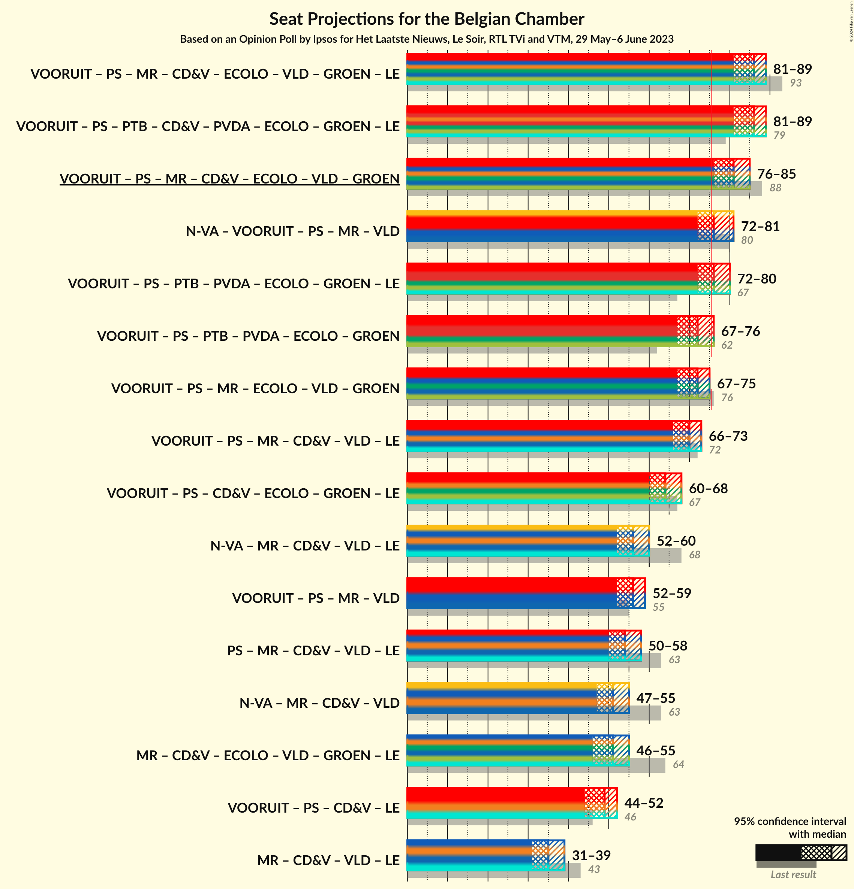
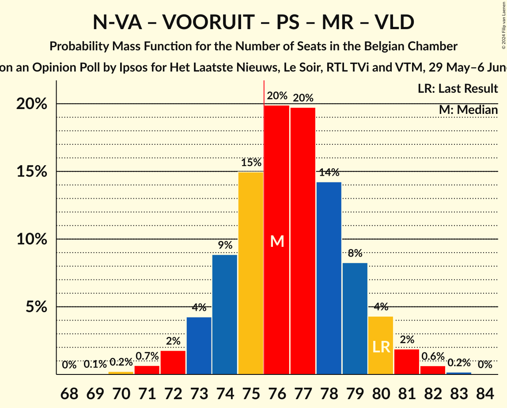
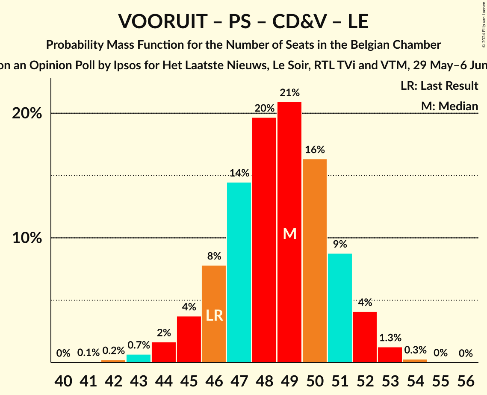

# Opinion Poll by Ipsos for Het Laatste Nieuws, Le Soir, RTL TVi and VTM, 29 May–6 June 2023

Areas included: Flanders, Wallonia

<a href="#voting-intentions">Voting Intentions</a> | <a href="#seats">Seats</a> | <a href="#coalitions">Coalitions</a> | <a href="#technical-information">Technical Information</a>

## Voting Intentions

### Confidence Intervals

| Party | Last Result | Poll Result | 80% Confidence Interval | 90% Confidence Interval | 95% Confidence Interval | 99% Confidence Interval |
|:-----:|:-----------:|:-----------:|:-----------------------:|:-----------------------:|:-----------------------:|:-----------------------:|
| Vlaams Belang | 12.0% | 15.2% | 14.0–16.2% |13.7–16.4% |13.5–16.5% |13.0–16.7% |
| Nieuw-Vlaamse Alliantie | 16.0% | 14.6% | 13.5–15.5% |13.2–15.7% |12.9–15.9% |12.4–16.0% |
| Vooruit | 6.7% | 11.2% | 10.2–11.9% |9.9–12.1% |9.7–12.2% |9.3–12.2% |
| Parti Socialiste | 9.5% | 8.6% | 7.8–8.5% |7.7–8.5% |7.6–8.6% |7.3–8.6% |
| Christen-Democratisch en Vlaams | 8.9% | 7.1% | 6.4–7.9% |6.1–8.1% |6.0–8.3% |5.6–8.4% |
| Partij van de Arbeid van België | 3.3% | 6.9% | 6.1–7.7% |5.9–7.8% |5.7–8.0% |5.4–8.1% |
| Mouvement Réformateur | 7.6% | 6.5% | 6.0–6.6% |5.8–6.7% |5.7–6.7% |5.5–6.7% |
| Parti du Travail de Belgique | 4.8% | 6.3% | 5.7–6.4% |5.6–6.4% |5.4–6.4% |5.2–6.4% |
| Open Vlaamse Liberalen en Democraten | 8.5% | 5.5% | 4.8–6.2% |4.7–6.3% |4.5–6.4% |4.2–6.5% |
| Groen | 6.1% | 5.1% | 4.4–5.7% |4.2–5.8% |4.1–5.9% |3.8–6.0% |
| Ecolo | 6.1% | 4.2% | 3.7–4.2% |3.6–4.2% |3.5–4.2% |3.3–4.2% |
| Les Engagés | 3.7% | 3.4% | 3.0–3.4% |2.9–3.5% |2.8–3.5% |2.6–3.5% |
| DéFI | 2.2% | 1.3% | 1.0–1.3% |0.9–1.3% |0.9–1.4% |0.8–1.4% |

*Note:* The poll result column reflects the actual value used in the calculations. Published results may vary slightly, and in addition be rounded to fewer digits.

## Seats

### Confidence Intervals

| Party | Last Result | Median | 80% Confidence Interval | 90% Confidence Interval | 95% Confidence Interval | 99% Confidence Interval |
|:-----:|:-----------:|:------:|:-----------------------:|:-----------------------:|:-----------------------:|:-----------------------:|
| <a href="#vlaams-belang">Vlaams Belang</a> | 18 | 21 | 20–23 |19–24 |19–24 |18–25 |
| <a href="#nieuw-vlaamse-alliantie">Nieuw-Vlaamse Alliantie</a> | 25 | 20 | 19–22 |19–23 |18–24 |17–25 |
| <a href="#vooruit">Vooruit</a> | 9 | 15 | 14–17 |13–17 |13–18 |12–19 |
| <a href="#parti-socialiste">Parti Socialiste</a> | 20 | 16 | 15–17 |14–17 |14–17 |13–17 |
| <a href="#christen-democratisch-en-vlaams">Christen-Democratisch en Vlaams</a> | 12 | 10 | 8–10 |7–10 |6–11 |6–11 |
| <a href="#partij-van-de-arbeid-van-belgië">Partij van de Arbeid van België</a> | 3 | 8 | 8–9 |8–10 |8–10 |6–11 |
| <a href="#mouvement-réformateur">Mouvement Réformateur</a> | 14 | 11 | 10–13 |10–13 |10–14 |9–15 |
| <a href="#parti-du-travail-de-belgique">Parti du Travail de Belgique</a> | 9 | 10 | 9–12 |9–12 |9–13 |8–13 |
| <a href="#open-vlaamse-liberalen-en-democraten">Open Vlaamse Liberalen en Democraten</a> | 12 | 6 | 5–8 |4–8 |4–9 |3–9 |
| <a href="#groen">Groen</a> | 8 | 5 | 5–7 |3–7 |3–8 |3–9 |
| <a href="#ecolo">Ecolo</a> | 13 | 7 | 6–7 |6–8 |6–8 |5–9 |
| <a href="#les-engagés">Les Engagés</a> | 5 | 4 | 4–5 |4–5 |4–6 |4–7 |
| <a href="#défi">DéFI</a> | 2 | 0 | 0 |0 |0 |0–1 |

### Vlaams Belang

*For a full overview of the results for this party, see the [Vlaams Belang](party-vlaamsbelang.html) page.*

| Number of Seats | Probability | Accumulated | Special Marks |
|:---------------:|:-----------:|:-----------:|:-------------:|
| 16 | 0% | 100% |  |
| 17 | 0.2% | 99.9% |  |
| 18 | 0.7% | 99.8% | Last Result |
| 19 | 6% | 99.1% |  |
| 20 | 14% | 93% |  |
| 21 | 41% | 79% | Median |
| 22 | 23% | 38% |  |
| 23 | 8% | 14% |  |
| 24 | 5% | 7% |  |
| 25 | 2% | 2% |  |
| 26 | 0.2% | 0.3% |  |
| 27 | 0% | 0% |  |

### Nieuw-Vlaamse Alliantie

*For a full overview of the results for this party, see the [Nieuw-Vlaamse Alliantie](party-nieuw-vlaamsealliantie.html) page.*

| Number of Seats | Probability | Accumulated | Special Marks |
|:---------------:|:-----------:|:-----------:|:-------------:|
| 16 | 0.2% | 100% |  |
| 17 | 0.8% | 99.8% |  |
| 18 | 3% | 99.0% |  |
| 19 | 14% | 96% |  |
| 20 | 39% | 82% | Median |
| 21 | 18% | 43% |  |
| 22 | 16% | 25% |  |
| 23 | 5% | 9% |  |
| 24 | 3% | 3% |  |
| 25 | 0.9% | 1.0% | Last Result |
| 26 | 0.1% | 0.1% |  |
| 27 | 0% | 0% |  |

### Vooruit

*For a full overview of the results for this party, see the [Vooruit](party-vooruit.html) page.*

| Number of Seats | Probability | Accumulated | Special Marks |
|:---------------:|:-----------:|:-----------:|:-------------:|
| 9 | 0% | 100% | Last Result |
| 10 | 0% | 100% |  |
| 11 | 0.2% | 100% |  |
| 12 | 2% | 99.8% |  |
| 13 | 4% | 98% |  |
| 14 | 8% | 93% |  |
| 15 | 40% | 85% | Median |
| 16 | 22% | 45% |  |
| 17 | 19% | 23% |  |
| 18 | 3% | 4% |  |
| 19 | 0.7% | 0.8% |  |
| 20 | 0.1% | 0.1% |  |
| 21 | 0% | 0% |  |

### Parti Socialiste

*For a full overview of the results for this party, see the [Parti Socialiste](party-partisocialiste.html) page.*

| Number of Seats | Probability | Accumulated | Special Marks |
|:---------------:|:-----------:|:-----------:|:-------------:|
| 13 | 1.1% | 100% |  |
| 14 | 8% | 98.9% |  |
| 15 | 34% | 91% |  |
| 16 | 27% | 57% | Median |
| 17 | 30% | 30% |  |
| 18 | 0.1% | 0.1% |  |
| 19 | 0% | 0% |  |
| 20 | 0% | 0% | Last Result |

### Christen-Democratisch en Vlaams

*For a full overview of the results for this party, see the [Christen-Democratisch en Vlaams](party-christen-democratischenvlaams.html) page.*

| Number of Seats | Probability | Accumulated | Special Marks |
|:---------------:|:-----------:|:-----------:|:-------------:|
| 5 | 0.5% | 100% |  |
| 6 | 3% | 99.5% |  |
| 7 | 3% | 96% |  |
| 8 | 12% | 93% |  |
| 9 | 13% | 80% |  |
| 10 | 65% | 67% | Median |
| 11 | 2% | 3% |  |
| 12 | 0.3% | 0.4% | Last Result |
| 13 | 0.1% | 0.1% |  |
| 14 | 0% | 0% |  |

### Partij van de Arbeid van België

*For a full overview of the results for this party, see the [Partij van de Arbeid van België](party-partijvandearbeidvanbelgië.html) page.*

| Number of Seats | Probability | Accumulated | Special Marks |
|:---------------:|:-----------:|:-----------:|:-------------:|
| 3 | 0% | 100% | Last Result |
| 4 | 0% | 100% |  |
| 5 | 0.3% | 100% |  |
| 6 | 0.4% | 99.7% |  |
| 7 | 2% | 99.3% |  |
| 8 | 59% | 98% | Median |
| 9 | 29% | 39% |  |
| 10 | 8% | 10% |  |
| 11 | 1.3% | 2% |  |
| 12 | 0.3% | 0.4% |  |
| 13 | 0.1% | 0.1% |  |
| 14 | 0% | 0% |  |

### Mouvement Réformateur

*For a full overview of the results for this party, see the [Mouvement Réformateur](party-mouvementréformateur.html) page.*

| Number of Seats | Probability | Accumulated | Special Marks |
|:---------------:|:-----------:|:-----------:|:-------------:|
| 9 | 0.8% | 100% |  |
| 10 | 14% | 99.2% |  |
| 11 | 56% | 85% | Median |
| 12 | 20% | 30% |  |
| 13 | 6% | 10% |  |
| 14 | 3% | 4% | Last Result |
| 15 | 0.9% | 0.9% |  |
| 16 | 0% | 0% |  |

### Parti du Travail de Belgique

*For a full overview of the results for this party, see the [Parti du Travail de Belgique](party-partidutravaildebelgique.html) page.*

| Number of Seats | Probability | Accumulated | Special Marks |
|:---------------:|:-----------:|:-----------:|:-------------:|
| 7 | 0.1% | 100% |  |
| 8 | 2% | 99.9% |  |
| 9 | 46% | 98% | Last Result |
| 10 | 28% | 52% | Median |
| 11 | 14% | 24% |  |
| 12 | 6% | 10% |  |
| 13 | 4% | 4% |  |
| 14 | 0.1% | 0.1% |  |
| 15 | 0% | 0% |  |

### Open Vlaamse Liberalen en Democraten

*For a full overview of the results for this party, see the [Open Vlaamse Liberalen en Democraten](party-openvlaamseliberalenendemocraten.html) page.*

| Number of Seats | Probability | Accumulated | Special Marks |
|:---------------:|:-----------:|:-----------:|:-------------:|
| 3 | 0.6% | 100% |  |
| 4 | 6% | 99.4% |  |
| 5 | 5% | 93% |  |
| 6 | 56% | 88% | Median |
| 7 | 21% | 32% |  |
| 8 | 9% | 11% |  |
| 9 | 2% | 3% |  |
| 10 | 0.4% | 0.4% |  |
| 11 | 0% | 0% |  |
| 12 | 0% | 0% | Last Result |

### Groen

*For a full overview of the results for this party, see the [Groen](party-groen.html) page.*

| Number of Seats | Probability | Accumulated | Special Marks |
|:---------------:|:-----------:|:-----------:|:-------------:|
| 3 | 6% | 100% |  |
| 4 | 3% | 94% |  |
| 5 | 55% | 91% | Median |
| 6 | 16% | 36% |  |
| 7 | 18% | 21% |  |
| 8 | 2% | 3% | Last Result |
| 9 | 0.9% | 0.9% |  |
| 10 | 0% | 0% |  |

### Ecolo

*For a full overview of the results for this party, see the [Ecolo](party-ecolo.html) page.*

| Number of Seats | Probability | Accumulated | Special Marks |
|:---------------:|:-----------:|:-----------:|:-------------:|
| 3 | 0.1% | 100% |  |
| 4 | 0.2% | 99.9% |  |
| 5 | 1.0% | 99.8% |  |
| 6 | 22% | 98.7% |  |
| 7 | 67% | 76% | Median |
| 8 | 8% | 9% |  |
| 9 | 0.9% | 1.0% |  |
| 10 | 0.2% | 0.2% |  |
| 11 | 0% | 0% |  |
| 12 | 0% | 0% |  |
| 13 | 0% | 0% | Last Result |

### Les Engagés

*For a full overview of the results for this party, see the [Les Engagés](party-lesengagés.html) page.*

| Number of Seats | Probability | Accumulated | Special Marks |
|:---------------:|:-----------:|:-----------:|:-------------:|
| 4 | 86% | 100% | Median |
| 5 | 9% | 13% | Last Result |
| 6 | 3% | 5% |  |
| 7 | 1.1% | 1.5% |  |
| 8 | 0.4% | 0.4% |  |
| 9 | 0% | 0% |  |

### DéFI

*For a full overview of the results for this party, see the [DéFI](party-défi.html) page.*

| Number of Seats | Probability | Accumulated | Special Marks |
|:---------------:|:-----------:|:-----------:|:-------------:|
| 0 | 99.4% | 100% | Median |
| 1 | 0.4% | 0.6% |  |
| 2 | 0.3% | 0.3% | Last Result |
| 3 | 0% | 0% |  |

## Coalitions

### Confidence Intervals

| Coalition | Last Result | Median | Majority? | 80% Confidence Interval | 90% Confidence Interval | 95% Confidence Interval | 99% Confidence Interval |
|:---------:|:-----------:|:------:|:---------:|:-----------------------:|:-----------------------:|:-----------------------:|:-----------------------:|
| Vooruit – Parti Socialiste – Christen-Democratisch en Vlaams – Partij van de Arbeid van België – Parti du Travail de Belgique – Groen – Ecolo – Les Engagés | 79 | 76 | 52% | 73–78 | 72–78 | 71–79 | 70–80 |
| Vooruit – Parti Socialiste – Christen-Democratisch en Vlaams – Mouvement Réformateur – Open Vlaamse Liberalen en Democraten – Groen – Ecolo – Les Engagés | 93 | 75 | 39% | 72–77 | 71–78 | 70–78 | 69–79 |
| Vooruit – Parti Socialiste – Christen-Democratisch en Vlaams – Mouvement Réformateur – Open Vlaamse Liberalen en Democraten – Groen – Ecolo | 88 | 71 | 0.3% | 68–73 | 67–73 | 66–74 | 65–75 |
| Nieuw-Vlaamse Alliantie – Vooruit – Parti Socialiste – Mouvement Réformateur – Open Vlaamse Liberalen en Democraten | 80 | 69 | 0.1% | 67–72 | 66–73 | 66–73 | 64–75 |
| Vooruit – Parti Socialiste – Partij van de Arbeid van België – Parti du Travail de Belgique – Groen – Ecolo – Les Engagés | 67 | 66 | 0% | 64–68 | 63–69 | 62–70 | 61–71 |
| Vooruit – Parti Socialiste – Christen-Democratisch en Vlaams – Mouvement Réformateur – Open Vlaamse Liberalen en Democraten – Les Engagés | 72 | 62 | 0% | 60–65 | 59–65 | 58–66 | 57–67 |
| Vooruit – Parti Socialiste – Partij van de Arbeid van België – Parti du Travail de Belgique – Groen – Ecolo | 62 | 62 | 0% | 59–64 | 58–65 | 58–65 | 56–67 |
| Vooruit – Parti Socialiste – Mouvement Réformateur – Open Vlaamse Liberalen en Democraten – Groen – Ecolo | 76 | 61 | 0% | 58–63 | 58–64 | 57–65 | 55–66 |
| Vooruit – Parti Socialiste – Christen-Democratisch en Vlaams – Groen – Ecolo – Les Engagés | 67 | 57 | 0% | 55–60 | 54–60 | 53–60 | 51–62 |
| Nieuw-Vlaamse Alliantie – Christen-Democratisch en Vlaams – Mouvement Réformateur – Open Vlaamse Liberalen en Democraten – Les Engagés | 68 | 52 | 0% | 49–54 | 49–55 | 48–56 | 47–57 |
| Vooruit – Parti Socialiste – Mouvement Réformateur – Open Vlaamse Liberalen en Democraten | 55 | 49 | 0% | 46–51 | 46–52 | 45–52 | 44–53 |
| Nieuw-Vlaamse Alliantie – Christen-Democratisch en Vlaams – Mouvement Réformateur – Open Vlaamse Liberalen en Democraten | 63 | 47 | 0% | 45–50 | 45–51 | 44–51 | 42–53 |
| Parti Socialiste – Christen-Democratisch en Vlaams – Mouvement Réformateur – Open Vlaamse Liberalen en Democraten – Les Engagés | 63 | 47 | 0% | 45–49 | 44–50 | 43–50 | 42–51 |
| Vooruit – Parti Socialiste – Christen-Democratisch en Vlaams – Les Engagés | 46 | 45 | 0% | 43–47 | 42–48 | 41–48 | 39–49 |
| Christen-Democratisch en Vlaams – Mouvement Réformateur – Open Vlaamse Liberalen en Democraten – Groen – Ecolo – Les Engagés | 64 | 44 | 0% | 41–46 | 40–47 | 39–47 | 38–48 |
| Christen-Democratisch en Vlaams – Mouvement Réformateur – Open Vlaamse Liberalen en Democraten – Les Engagés | 43 | 31 | 0% | 29–33 | 28–34 | 27–35 | 26–36 |

### Vooruit – Parti Socialiste – Christen-Democratisch en Vlaams – Partij van de Arbeid van België – Parti du Travail de Belgique – Groen – Ecolo – Les Engagés

| Number of Seats | Probability | Accumulated | Special Marks |
|:---------------:|:-----------:|:-----------:|:-------------:|
| 68 | 0.1% | 100% |  |
| 69 | 0.3% | 99.9% |  |
| 70 | 0.8% | 99.6% |  |
| 71 | 2% | 98.9% |  |
| 72 | 4% | 97% |  |
| 73 | 8% | 93% |  |
| 74 | 14% | 84% |  |
| 75 | 18% | 71% | Median |
| 76 | 18% | 52% | Majority |
| 77 | 18% | 34% |  |
| 78 | 11% | 16% |  |
| 79 | 4% | 5% | Last Result |
| 80 | 0.8% | 1.1% |  |
| 81 | 0.2% | 0.3% |  |
| 82 | 0% | 0.1% |  |
| 83 | 0% | 0% |  |

### Vooruit – Parti Socialiste – Christen-Democratisch en Vlaams – Mouvement Réformateur – Open Vlaamse Liberalen en Democraten – Groen – Ecolo – Les Engagés

| Number of Seats | Probability | Accumulated | Special Marks |
|:---------------:|:-----------:|:-----------:|:-------------:|
| 67 | 0.1% | 100% |  |
| 68 | 0.2% | 99.9% |  |
| 69 | 0.7% | 99.7% |  |
| 70 | 2% | 99.0% |  |
| 71 | 4% | 97% |  |
| 72 | 7% | 93% |  |
| 73 | 12% | 86% |  |
| 74 | 17% | 74% | Median |
| 75 | 19% | 58% |  |
| 76 | 18% | 39% | Majority |
| 77 | 15% | 20% |  |
| 78 | 4% | 5% |  |
| 79 | 1.0% | 1.4% |  |
| 80 | 0.3% | 0.4% |  |
| 81 | 0.1% | 0.1% |  |
| 82 | 0% | 0% |  |
| 83 | 0% | 0% |  |
| 84 | 0% | 0% |  |
| 85 | 0% | 0% |  |
| 86 | 0% | 0% |  |
| 87 | 0% | 0% |  |
| 88 | 0% | 0% |  |
| 89 | 0% | 0% |  |
| 90 | 0% | 0% |  |
| 91 | 0% | 0% |  |
| 92 | 0% | 0% |  |
| 93 | 0% | 0% | Last Result |

### Vooruit – Parti Socialiste – Christen-Democratisch en Vlaams – Mouvement Réformateur – Open Vlaamse Liberalen en Democraten – Groen – Ecolo

| Number of Seats | Probability | Accumulated | Special Marks |
|:---------------:|:-----------:|:-----------:|:-------------:|
| 63 | 0.1% | 100% |  |
| 64 | 0.3% | 99.9% |  |
| 65 | 0.8% | 99.6% |  |
| 66 | 2% | 98.7% |  |
| 67 | 4% | 97% |  |
| 68 | 8% | 92% |  |
| 69 | 13% | 84% |  |
| 70 | 17% | 71% | Median |
| 71 | 19% | 54% |  |
| 72 | 18% | 35% |  |
| 73 | 12% | 17% |  |
| 74 | 3% | 4% |  |
| 75 | 0.9% | 1.2% |  |
| 76 | 0.3% | 0.3% | Majority |
| 77 | 0% | 0.1% |  |
| 78 | 0% | 0% |  |
| 79 | 0% | 0% |  |
| 80 | 0% | 0% |  |
| 81 | 0% | 0% |  |
| 82 | 0% | 0% |  |
| 83 | 0% | 0% |  |
| 84 | 0% | 0% |  |
| 85 | 0% | 0% |  |
| 86 | 0% | 0% |  |
| 87 | 0% | 0% |  |
| 88 | 0% | 0% | Last Result |

### Nieuw-Vlaamse Alliantie – Vooruit – Parti Socialiste – Mouvement Réformateur – Open Vlaamse Liberalen en Democraten

| Number of Seats | Probability | Accumulated | Special Marks |
|:---------------:|:-----------:|:-----------:|:-------------:|
| 62 | 0.1% | 100% |  |
| 63 | 0.2% | 99.9% |  |
| 64 | 0.6% | 99.7% |  |
| 65 | 2% | 99.2% |  |
| 66 | 4% | 98% |  |
| 67 | 9% | 94% |  |
| 68 | 16% | 85% | Median |
| 69 | 21% | 69% |  |
| 70 | 21% | 48% |  |
| 71 | 14% | 27% |  |
| 72 | 7% | 13% |  |
| 73 | 4% | 6% |  |
| 74 | 2% | 2% |  |
| 75 | 0.5% | 0.6% |  |
| 76 | 0.1% | 0.1% | Majority |
| 77 | 0% | 0% |  |
| 78 | 0% | 0% |  |
| 79 | 0% | 0% |  |
| 80 | 0% | 0% | Last Result |

### Vooruit – Parti Socialiste – Partij van de Arbeid van België – Parti du Travail de Belgique – Groen – Ecolo – Les Engagés

| Number of Seats | Probability | Accumulated | Special Marks |
|:---------------:|:-----------:|:-----------:|:-------------:|
| 59 | 0.1% | 100% |  |
| 60 | 0.3% | 99.9% |  |
| 61 | 0.9% | 99.6% |  |
| 62 | 3% | 98.7% |  |
| 63 | 6% | 96% |  |
| 64 | 10% | 91% |  |
| 65 | 16% | 81% | Median |
| 66 | 20% | 65% |  |
| 67 | 21% | 45% | Last Result |
| 68 | 15% | 24% |  |
| 69 | 6% | 9% |  |
| 70 | 2% | 3% |  |
| 71 | 0.6% | 0.7% |  |
| 72 | 0.1% | 0.2% |  |
| 73 | 0% | 0% |  |

### Vooruit – Parti Socialiste – Christen-Democratisch en Vlaams – Mouvement Réformateur – Open Vlaamse Liberalen en Democraten – Les Engagés

| Number of Seats | Probability | Accumulated | Special Marks |
|:---------------:|:-----------:|:-----------:|:-------------:|
| 55 | 0.1% | 100% |  |
| 56 | 0.2% | 99.9% |  |
| 57 | 0.7% | 99.6% |  |
| 58 | 2% | 99.0% |  |
| 59 | 4% | 97% |  |
| 60 | 9% | 93% |  |
| 61 | 14% | 84% |  |
| 62 | 20% | 70% | Median |
| 63 | 20% | 50% |  |
| 64 | 16% | 30% |  |
| 65 | 9% | 14% |  |
| 66 | 3% | 4% |  |
| 67 | 0.9% | 1.2% |  |
| 68 | 0.2% | 0.3% |  |
| 69 | 0% | 0.1% |  |
| 70 | 0% | 0% |  |
| 71 | 0% | 0% |  |
| 72 | 0% | 0% | Last Result |

### Vooruit – Parti Socialiste – Partij van de Arbeid van België – Parti du Travail de Belgique – Groen – Ecolo

| Number of Seats | Probability | Accumulated | Special Marks |
|:---------------:|:-----------:|:-----------:|:-------------:|
| 55 | 0.1% | 100% |  |
| 56 | 0.5% | 99.8% |  |
| 57 | 1.3% | 99.3% |  |
| 58 | 3% | 98% |  |
| 59 | 7% | 95% |  |
| 60 | 11% | 88% |  |
| 61 | 17% | 77% | Median |
| 62 | 19% | 61% | Last Result |
| 63 | 20% | 41% |  |
| 64 | 14% | 22% |  |
| 65 | 6% | 8% |  |
| 66 | 2% | 2% |  |
| 67 | 0.5% | 0.7% |  |
| 68 | 0.1% | 0.2% |  |
| 69 | 0% | 0% |  |

### Vooruit – Parti Socialiste – Mouvement Réformateur – Open Vlaamse Liberalen en Democraten – Groen – Ecolo

| Number of Seats | Probability | Accumulated | Special Marks |
|:---------------:|:-----------:|:-----------:|:-------------:|
| 54 | 0.1% | 100% |  |
| 55 | 0.5% | 99.8% |  |
| 56 | 1.2% | 99.4% |  |
| 57 | 3% | 98% |  |
| 58 | 6% | 95% |  |
| 59 | 10% | 90% |  |
| 60 | 14% | 80% | Median |
| 61 | 18% | 66% |  |
| 62 | 21% | 47% |  |
| 63 | 17% | 26% |  |
| 64 | 6% | 9% |  |
| 65 | 2% | 3% |  |
| 66 | 0.7% | 0.9% |  |
| 67 | 0.2% | 0.2% |  |
| 68 | 0% | 0% |  |
| 69 | 0% | 0% |  |
| 70 | 0% | 0% |  |
| 71 | 0% | 0% |  |
| 72 | 0% | 0% |  |
| 73 | 0% | 0% |  |
| 74 | 0% | 0% |  |
| 75 | 0% | 0% |  |
| 76 | 0% | 0% | Last Result, Majority |

### Vooruit – Parti Socialiste – Christen-Democratisch en Vlaams – Groen – Ecolo – Les Engagés

| Number of Seats | Probability | Accumulated | Special Marks |
|:---------------:|:-----------:|:-----------:|:-------------:|
| 50 | 0.1% | 100% |  |
| 51 | 0.4% | 99.8% |  |
| 52 | 1.1% | 99.5% |  |
| 53 | 3% | 98% |  |
| 54 | 6% | 96% |  |
| 55 | 10% | 90% |  |
| 56 | 15% | 80% |  |
| 57 | 19% | 65% | Median |
| 58 | 20% | 46% |  |
| 59 | 14% | 27% |  |
| 60 | 10% | 12% |  |
| 61 | 2% | 2% |  |
| 62 | 0.5% | 0.7% |  |
| 63 | 0.1% | 0.2% |  |
| 64 | 0% | 0% |  |
| 65 | 0% | 0% |  |
| 66 | 0% | 0% |  |
| 67 | 0% | 0% | Last Result |

### Nieuw-Vlaamse Alliantie – Christen-Democratisch en Vlaams – Mouvement Réformateur – Open Vlaamse Liberalen en Democraten – Les Engagés

| Number of Seats | Probability | Accumulated | Special Marks |
|:---------------:|:-----------:|:-----------:|:-------------:|
| 45 | 0.1% | 100% |  |
| 46 | 0.3% | 99.9% |  |
| 47 | 1.1% | 99.5% |  |
| 48 | 3% | 98% |  |
| 49 | 6% | 96% |  |
| 50 | 13% | 90% |  |
| 51 | 23% | 76% | Median |
| 52 | 22% | 53% |  |
| 53 | 15% | 31% |  |
| 54 | 9% | 17% |  |
| 55 | 4% | 8% |  |
| 56 | 2% | 3% |  |
| 57 | 0.8% | 1.2% |  |
| 58 | 0.3% | 0.4% |  |
| 59 | 0.1% | 0.1% |  |
| 60 | 0% | 0% |  |
| 61 | 0% | 0% |  |
| 62 | 0% | 0% |  |
| 63 | 0% | 0% |  |
| 64 | 0% | 0% |  |
| 65 | 0% | 0% |  |
| 66 | 0% | 0% |  |
| 67 | 0% | 0% |  |
| 68 | 0% | 0% | Last Result |

### Vooruit – Parti Socialiste – Mouvement Réformateur – Open Vlaamse Liberalen en Democraten

| Number of Seats | Probability | Accumulated | Special Marks |
|:---------------:|:-----------:|:-----------:|:-------------:|
| 42 | 0.1% | 100% |  |
| 43 | 0.3% | 99.9% |  |
| 44 | 1.0% | 99.6% |  |
| 45 | 3% | 98.6% |  |
| 46 | 6% | 96% |  |
| 47 | 12% | 89% |  |
| 48 | 18% | 78% | Median |
| 49 | 23% | 60% |  |
| 50 | 20% | 37% |  |
| 51 | 11% | 17% |  |
| 52 | 4% | 6% |  |
| 53 | 1.3% | 2% |  |
| 54 | 0.3% | 0.4% |  |
| 55 | 0.1% | 0.1% | Last Result |
| 56 | 0% | 0% |  |

### Nieuw-Vlaamse Alliantie – Christen-Democratisch en Vlaams – Mouvement Réformateur – Open Vlaamse Liberalen en Democraten

| Number of Seats | Probability | Accumulated | Special Marks |
|:---------------:|:-----------:|:-----------:|:-------------:|
| 41 | 0.1% | 100% |  |
| 42 | 0.4% | 99.8% |  |
| 43 | 1.2% | 99.5% |  |
| 44 | 3% | 98% |  |
| 45 | 7% | 95% |  |
| 46 | 15% | 89% |  |
| 47 | 25% | 74% | Median |
| 48 | 22% | 49% |  |
| 49 | 14% | 27% |  |
| 50 | 7% | 13% |  |
| 51 | 3% | 6% |  |
| 52 | 2% | 2% |  |
| 53 | 0.6% | 0.8% |  |
| 54 | 0.2% | 0.2% |  |
| 55 | 0.1% | 0.1% |  |
| 56 | 0% | 0% |  |
| 57 | 0% | 0% |  |
| 58 | 0% | 0% |  |
| 59 | 0% | 0% |  |
| 60 | 0% | 0% |  |
| 61 | 0% | 0% |  |
| 62 | 0% | 0% |  |
| 63 | 0% | 0% | Last Result |

### Parti Socialiste – Christen-Democratisch en Vlaams – Mouvement Réformateur – Open Vlaamse Liberalen en Democraten – Les Engagés

| Number of Seats | Probability | Accumulated | Special Marks |
|:---------------:|:-----------:|:-----------:|:-------------:|
| 40 | 0.1% | 100% |  |
| 41 | 0.3% | 99.9% |  |
| 42 | 0.8% | 99.6% |  |
| 43 | 3% | 98.8% |  |
| 44 | 5% | 96% |  |
| 45 | 11% | 91% |  |
| 46 | 17% | 80% |  |
| 47 | 23% | 63% | Median |
| 48 | 24% | 40% |  |
| 49 | 11% | 16% |  |
| 50 | 4% | 6% |  |
| 51 | 1.3% | 2% |  |
| 52 | 0.3% | 0.4% |  |
| 53 | 0.1% | 0.1% |  |
| 54 | 0% | 0% |  |
| 55 | 0% | 0% |  |
| 56 | 0% | 0% |  |
| 57 | 0% | 0% |  |
| 58 | 0% | 0% |  |
| 59 | 0% | 0% |  |
| 60 | 0% | 0% |  |
| 61 | 0% | 0% |  |
| 62 | 0% | 0% |  |
| 63 | 0% | 0% | Last Result |

### Vooruit – Parti Socialiste – Christen-Democratisch en Vlaams – Les Engagés

| Number of Seats | Probability | Accumulated | Special Marks |
|:---------------:|:-----------:|:-----------:|:-------------:|
| 38 | 0.1% | 100% |  |
| 39 | 0.4% | 99.8% |  |
| 40 | 1.1% | 99.5% |  |
| 41 | 3% | 98% |  |
| 42 | 6% | 96% |  |
| 43 | 11% | 90% |  |
| 44 | 20% | 79% |  |
| 45 | 21% | 59% | Median |
| 46 | 21% | 38% | Last Result |
| 47 | 10% | 17% |  |
| 48 | 5% | 7% |  |
| 49 | 1.4% | 2% |  |
| 50 | 0.3% | 0.3% |  |
| 51 | 0% | 0% |  |

### Christen-Democratisch en Vlaams – Mouvement Réformateur – Open Vlaamse Liberalen en Democraten – Groen – Ecolo – Les Engagés

| Number of Seats | Probability | Accumulated | Special Marks |
|:---------------:|:-----------:|:-----------:|:-------------:|
| 36 | 0.1% | 100% |  |
| 37 | 0.2% | 99.9% |  |
| 38 | 0.6% | 99.7% |  |
| 39 | 2% | 99.1% |  |
| 40 | 4% | 97% |  |
| 41 | 9% | 93% |  |
| 42 | 14% | 84% |  |
| 43 | 20% | 70% | Median |
| 44 | 19% | 50% |  |
| 45 | 16% | 31% |  |
| 46 | 9% | 15% |  |
| 47 | 4% | 6% |  |
| 48 | 2% | 2% |  |
| 49 | 0.4% | 0.5% |  |
| 50 | 0.1% | 0.1% |  |
| 51 | 0% | 0% |  |
| 52 | 0% | 0% |  |
| 53 | 0% | 0% |  |
| 54 | 0% | 0% |  |
| 55 | 0% | 0% |  |
| 56 | 0% | 0% |  |
| 57 | 0% | 0% |  |
| 58 | 0% | 0% |  |
| 59 | 0% | 0% |  |
| 60 | 0% | 0% |  |
| 61 | 0% | 0% |  |
| 62 | 0% | 0% |  |
| 63 | 0% | 0% |  |
| 64 | 0% | 0% | Last Result |

### Christen-Democratisch en Vlaams – Mouvement Réformateur – Open Vlaamse Liberalen en Democraten – Les Engagés

| Number of Seats | Probability | Accumulated | Special Marks |
|:---------------:|:-----------:|:-----------:|:-------------:|
| 25 | 0.1% | 100% |  |
| 26 | 0.6% | 99.8% |  |
| 27 | 2% | 99.2% |  |
| 28 | 4% | 97% |  |
| 29 | 10% | 93% |  |
| 30 | 16% | 83% |  |
| 31 | 28% | 67% | Median |
| 32 | 19% | 40% |  |
| 33 | 11% | 21% |  |
| 34 | 6% | 10% |  |
| 35 | 3% | 4% |  |
| 36 | 0.8% | 1.1% |  |
| 37 | 0.2% | 0.3% |  |
| 38 | 0.1% | 0.1% |  |
| 39 | 0% | 0% |  |
| 40 | 0% | 0% |  |
| 41 | 0% | 0% |  |
| 42 | 0% | 0% |  |
| 43 | 0% | 0% | Last Result |

## Technical Information

### Opinion Poll

+ **Polling firm:** Ipsos
+ **Commissioner(s):** Het Laatste Nieuws, Le Soir, RTL TVi and VTM
+ **Fieldwork period:** 29 May–6 June 2023

### Calculations

+ **Sample size:** 1497
+ **Simulations done:** 1,048,576
+ **Error estimate:** 0.85%

