# Opinion Poll by Kantar for La Libre Belgique and RTBf, 10 September–9 October 2023

Areas included: Brussels, Flanders, Wallonia

<a href="#voting-intentions">Voting Intentions</a> | <a href="#seats">Seats</a> | <a href="#coalitions">Coalitions</a> | <a href="#technical-information">Technical Information</a>

## Voting Intentions

### Confidence Intervals

| Party | Last Result | Poll Result | 80% Confidence Interval | 90% Confidence Interval | 95% Confidence Interval | 99% Confidence Interval |
|:-----:|:-----------:|:-----------:|:-----------------------:|:-----------------------:|:-----------------------:|:-----------------------:|
| Vlaams Belang | 12.0% | 14.8% | 12.4–13.5% |12.2–13.5% |11.9–13.6% |11.4–13.6% |
| Nieuw-Vlaamse Alliantie | 16.0% | 13.0% | 10.8–11.8% |10.5–11.8% |10.3–11.8% |9.9–11.9% |
| Vooruit | 6.7% | 10.0% | 8.8–10.9% |8.4–11.0% |8.2–11.1% |7.7–11.2% |
| Parti Socialiste | 9.5% | 9.8% | 8.4–9.0% |8.2–9.0% |8.1–9.0% |7.8–9.0% |
| Christen-Democratisch en Vlaams | 8.9% | 8.6% | 6.9–7.7% |6.7–7.8% |6.5–7.8% |6.1–7.8% |
| Mouvement Réformateur | 7.6% | 7.8% | 6.4–7.0% |6.3–7.0% |6.2–7.0% |5.9–7.0% |
| Parti du Travail de Belgique | 4.8% | 7.1% | 5.8–6.3% |5.7–6.3% |5.6–6.3% |5.3–6.4% |
| Partij van de Arbeid van België | 3.3% | 5.5% | 4.6–6.2% |4.4–6.3% |4.2–6.4% |3.8–6.5% |
| Open Vlaamse Liberalen en Democraten | 8.5% | 5.1% | 3.8–4.4% |3.6–4.4% |3.5–4.5% |3.3–4.5% |
| Groen | 6.1% | 5.0% | 4.2–5.7% |4.0–5.9% |3.8–5.9% |3.4–6.0% |
| Ecolo | 6.1% | 4.9% | 3.8–4.2% |3.7–4.3% |3.6–4.3% |3.5–4.3% |
| Les Engagés | 3.7% | 3.7% | 2.8–3.2% |2.7–3.2% |2.6–3.2% |2.4–3.2% |
| DéFI | 2.2% | 2.0% | 1.3–1.5% |1.3–1.6% |1.2–1.6% |1.1–1.6% |

*Note:* The poll result column reflects the actual value used in the calculations. Published results may vary slightly, and in addition be rounded to fewer digits.

## Seats

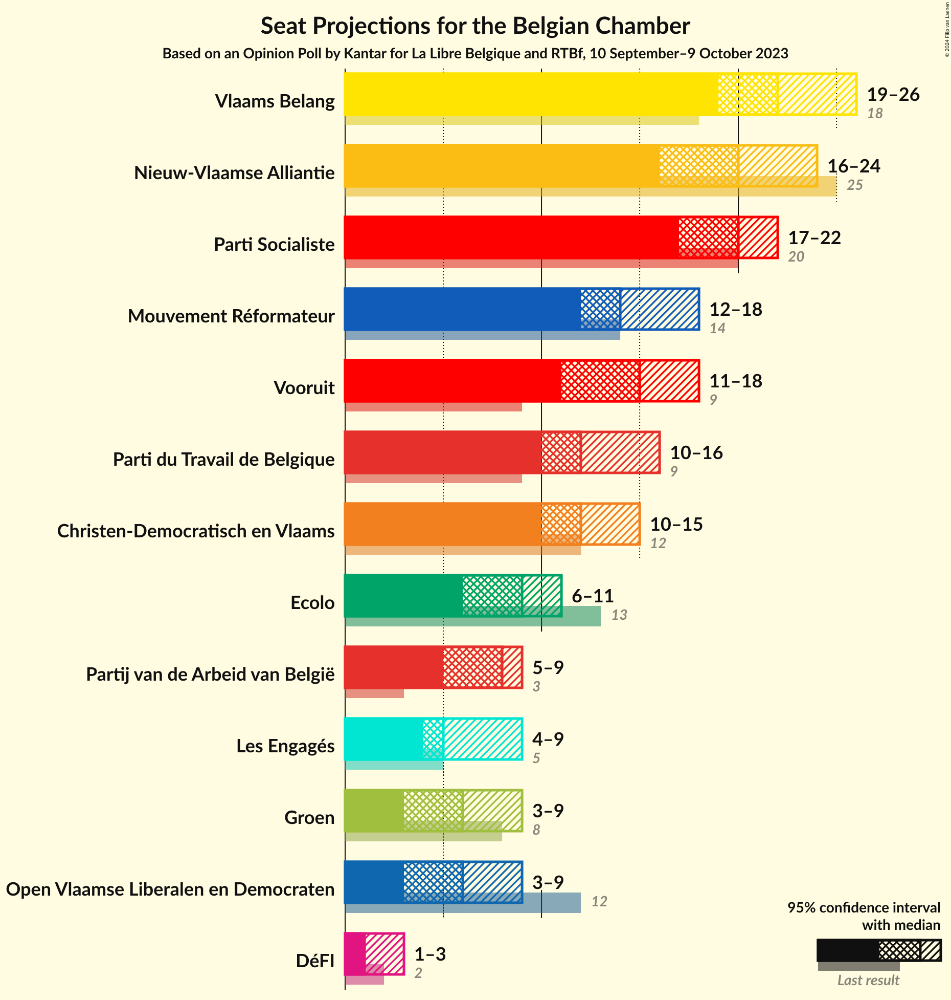

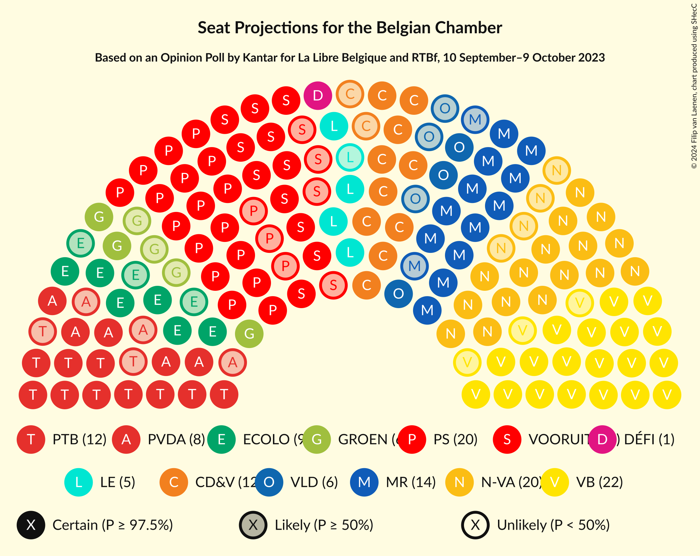

### Confidence Intervals

| Party | Last Result | Median | 80% Confidence Interval | 90% Confidence Interval | 95% Confidence Interval | 99% Confidence Interval |
|:-----:|:-----------:|:------:|:-----------------------:|:-----------------------:|:-----------------------:|:-----------------------:|
| <a href="#vlaams-belang">Vlaams Belang</a> | 18 | 22 | 20–25 |19–25 |19–26 |17–28 |
| <a href="#nieuw-vlaamse-alliantie">Nieuw-Vlaamse Alliantie</a> | 25 | 20 | 17–22 |17–23 |16–24 |15–25 |
| <a href="#vooruit">Vooruit</a> | 9 | 15 | 12–17 |12–17 |11–18 |11–19 |
| <a href="#parti-socialiste">Parti Socialiste</a> | 20 | 20 | 18–21 |17–21 |17–22 |16–23 |
| <a href="#christen-democratisch-en-vlaams">Christen-Democratisch en Vlaams</a> | 12 | 12 | 10–15 |10–15 |10–15 |9–17 |
| <a href="#mouvement-réformateur">Mouvement Réformateur</a> | 14 | 14 | 13–17 |13–18 |12–18 |11–19 |
| <a href="#parti-du-travail-de-belgique">Parti du Travail de Belgique</a> | 9 | 12 | 11–15 |10–16 |10–16 |9–18 |
| <a href="#partij-van-de-arbeid-van-belgië">Partij van de Arbeid van België</a> | 3 | 8 | 5–8 |5–9 |5–9 |4–10 |
| <a href="#open-vlaamse-liberalen-en-democraten">Open Vlaamse Liberalen en Democraten</a> | 12 | 6 | 4–8 |4–9 |3–9 |2–10 |
| <a href="#groen">Groen</a> | 8 | 6 | 5–9 |4–9 |3–9 |3–9 |
| <a href="#ecolo">Ecolo</a> | 13 | 9 | 7–10 |6–11 |6–11 |5–12 |
| <a href="#les-engagés">Les Engagés</a> | 5 | 5 | 4–7 |4–8 |4–9 |4–9 |
| <a href="#défi">DéFI</a> | 2 | 1 | 1–3 |1–3 |1–3 |0–4 |

### Vlaams Belang

*For a full overview of the results for this party, see the [Vlaams Belang](party-vlaamsbelang.html) page.*

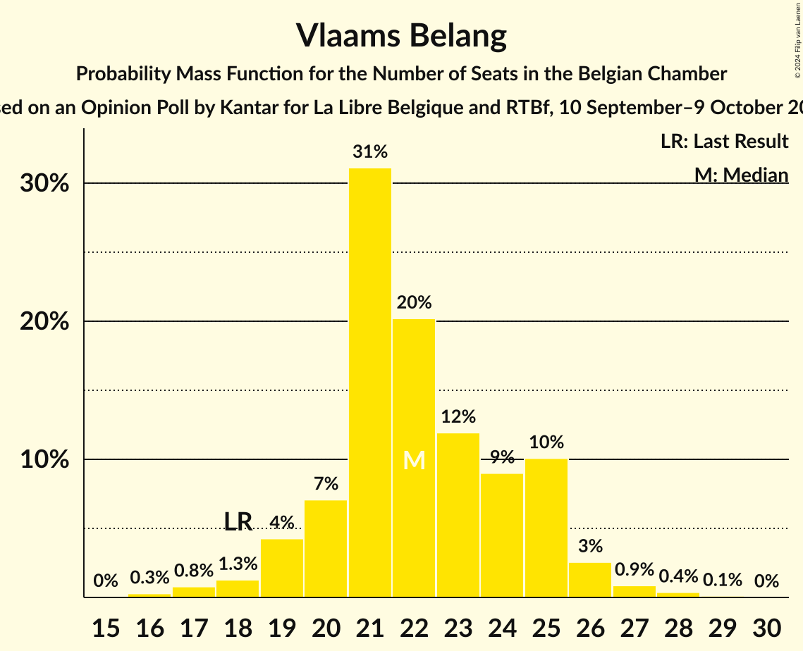

| Number of Seats | Probability | Accumulated | Special Marks |
|:---------------:|:-----------:|:-----------:|:-------------:|
| 16 | 0.3% | 100% |  |
| 17 | 0.8% | 99.7% |  |
| 18 | 1.3% | 98.9% | Last Result |
| 19 | 4% | 98% |  |
| 20 | 7% | 93% |  |
| 21 | 31% | 86% |  |
| 22 | 20% | 55% | Median |
| 23 | 12% | 35% |  |
| 24 | 9% | 23% |  |
| 25 | 10% | 14% |  |
| 26 | 3% | 4% |  |
| 27 | 0.9% | 1.4% |  |
| 28 | 0.4% | 0.5% |  |
| 29 | 0.1% | 0.1% |  |
| 30 | 0% | 0% |  |

### Nieuw-Vlaamse Alliantie

*For a full overview of the results for this party, see the [Nieuw-Vlaamse Alliantie](party-nieuw-vlaamsealliantie.html) page.*

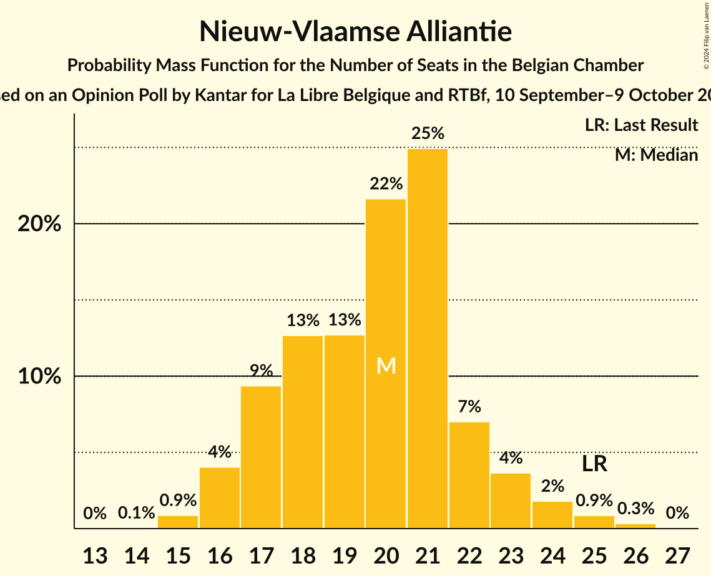

| Number of Seats | Probability | Accumulated | Special Marks |
|:---------------:|:-----------:|:-----------:|:-------------:|
| 14 | 0.1% | 100% |  |
| 15 | 0.9% | 99.9% |  |
| 16 | 4% | 99.1% |  |
| 17 | 9% | 95% |  |
| 18 | 13% | 86% |  |
| 19 | 13% | 73% |  |
| 20 | 22% | 60% | Median |
| 21 | 25% | 39% |  |
| 22 | 7% | 14% |  |
| 23 | 4% | 7% |  |
| 24 | 2% | 3% |  |
| 25 | 0.9% | 1.2% | Last Result |
| 26 | 0.3% | 0.4% |  |
| 27 | 0% | 0% |  |

### Vooruit

*For a full overview of the results for this party, see the [Vooruit](party-vooruit.html) page.*

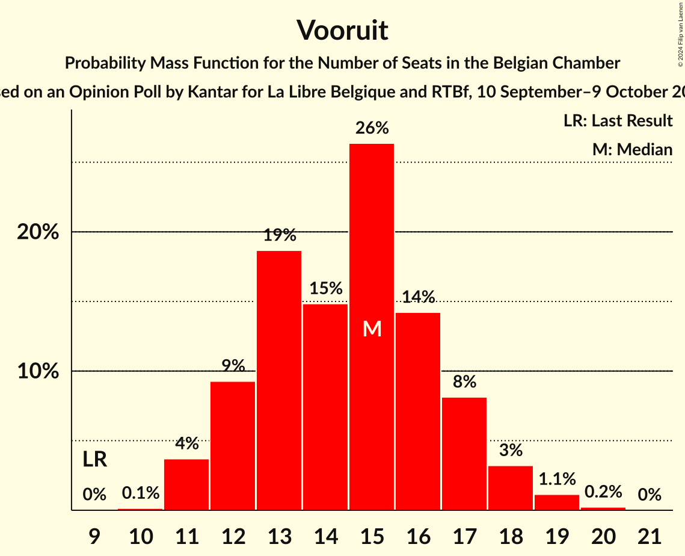

| Number of Seats | Probability | Accumulated | Special Marks |
|:---------------:|:-----------:|:-----------:|:-------------:|
| 9 | 0% | 100% | Last Result |
| 10 | 0.1% | 100% |  |
| 11 | 4% | 99.8% |  |
| 12 | 9% | 96% |  |
| 13 | 19% | 87% |  |
| 14 | 15% | 68% |  |
| 15 | 26% | 53% | Median |
| 16 | 14% | 27% |  |
| 17 | 8% | 13% |  |
| 18 | 3% | 5% |  |
| 19 | 1.1% | 1.4% |  |
| 20 | 0.2% | 0.3% |  |
| 21 | 0% | 0% |  |

### Parti Socialiste

*For a full overview of the results for this party, see the [Parti Socialiste](party-partisocialiste.html) page.*

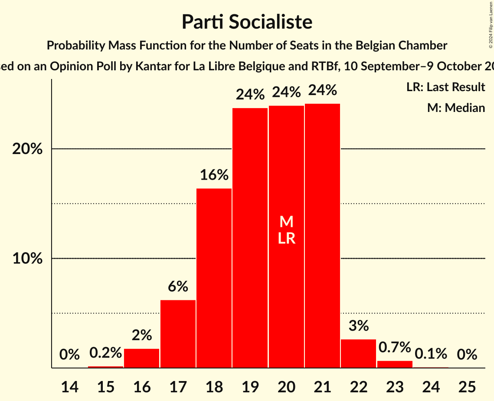

| Number of Seats | Probability | Accumulated | Special Marks |
|:---------------:|:-----------:|:-----------:|:-------------:|
| 15 | 0.2% | 100% |  |
| 16 | 2% | 99.8% |  |
| 17 | 6% | 98% |  |
| 18 | 16% | 92% |  |
| 19 | 24% | 75% |  |
| 20 | 24% | 52% | Last Result, Median |
| 21 | 24% | 28% |  |
| 22 | 3% | 3% |  |
| 23 | 0.7% | 0.8% |  |
| 24 | 0.1% | 0.1% |  |
| 25 | 0% | 0% |  |

### Christen-Democratisch en Vlaams

*For a full overview of the results for this party, see the [Christen-Democratisch en Vlaams](party-christen-democratischenvlaams.html) page.*

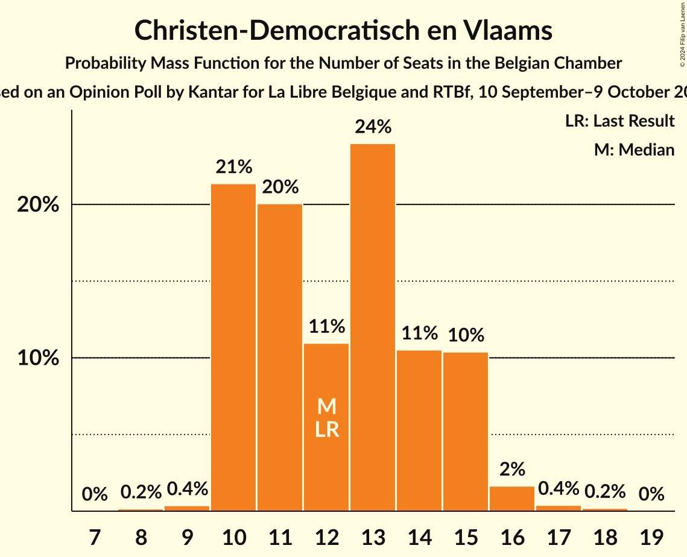

| Number of Seats | Probability | Accumulated | Special Marks |
|:---------------:|:-----------:|:-----------:|:-------------:|
| 8 | 0.2% | 100% |  |
| 9 | 0.4% | 99.8% |  |
| 10 | 21% | 99.5% |  |
| 11 | 20% | 78% |  |
| 12 | 11% | 58% | Last Result, Median |
| 13 | 24% | 47% |  |
| 14 | 11% | 23% |  |
| 15 | 10% | 13% |  |
| 16 | 2% | 2% |  |
| 17 | 0.4% | 0.6% |  |
| 18 | 0.2% | 0.2% |  |
| 19 | 0% | 0% |  |

### Mouvement Réformateur

*For a full overview of the results for this party, see the [Mouvement Réformateur](party-mouvementréformateur.html) page.*

| Number of Seats | Probability | Accumulated | Special Marks |
|:---------------:|:-----------:|:-----------:|:-------------:|
| 11 | 0.7% | 100% |  |
| 12 | 3% | 99.3% |  |
| 13 | 13% | 96% |  |
| 14 | 34% | 84% | Last Result, Median |
| 15 | 23% | 50% |  |
| 16 | 11% | 27% |  |
| 17 | 8% | 16% |  |
| 18 | 6% | 9% |  |
| 19 | 2% | 2% |  |
| 20 | 0.1% | 0.1% |  |
| 21 | 0% | 0% |  |

### Parti du Travail de Belgique

*For a full overview of the results for this party, see the [Parti du Travail de Belgique](party-partidutravaildebelgique.html) page.*

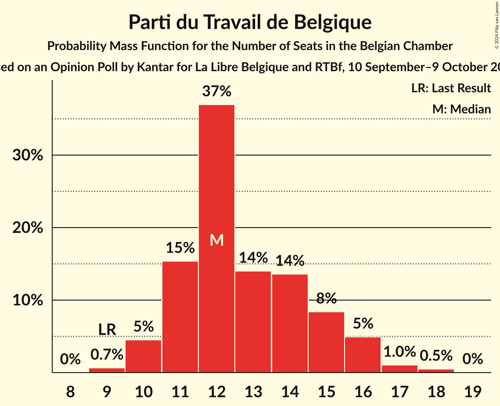

| Number of Seats | Probability | Accumulated | Special Marks |
|:---------------:|:-----------:|:-----------:|:-------------:|
| 9 | 0.7% | 100% | Last Result |
| 10 | 5% | 99.3% |  |
| 11 | 15% | 95% |  |
| 12 | 37% | 79% | Median |
| 13 | 14% | 42% |  |
| 14 | 14% | 28% |  |
| 15 | 8% | 15% |  |
| 16 | 5% | 7% |  |
| 17 | 1.0% | 2% |  |
| 18 | 0.5% | 0.5% |  |
| 19 | 0% | 0% |  |

### Partij van de Arbeid van België

*For a full overview of the results for this party, see the [Partij van de Arbeid van België](party-partijvandearbeidvanbelgië.html) page.*

| Number of Seats | Probability | Accumulated | Special Marks |
|:---------------:|:-----------:|:-----------:|:-------------:|
| 3 | 0.3% | 100% | Last Result |
| 4 | 2% | 99.7% |  |
| 5 | 15% | 98% |  |
| 6 | 13% | 83% |  |
| 7 | 10% | 70% |  |
| 8 | 50% | 59% | Median |
| 9 | 9% | 10% |  |
| 10 | 1.1% | 1.4% |  |
| 11 | 0.2% | 0.3% |  |
| 12 | 0.1% | 0.1% |  |
| 13 | 0% | 0% |  |

### Open Vlaamse Liberalen en Democraten

*For a full overview of the results for this party, see the [Open Vlaamse Liberalen en Democraten](party-openvlaamseliberalenendemocraten.html) page.*

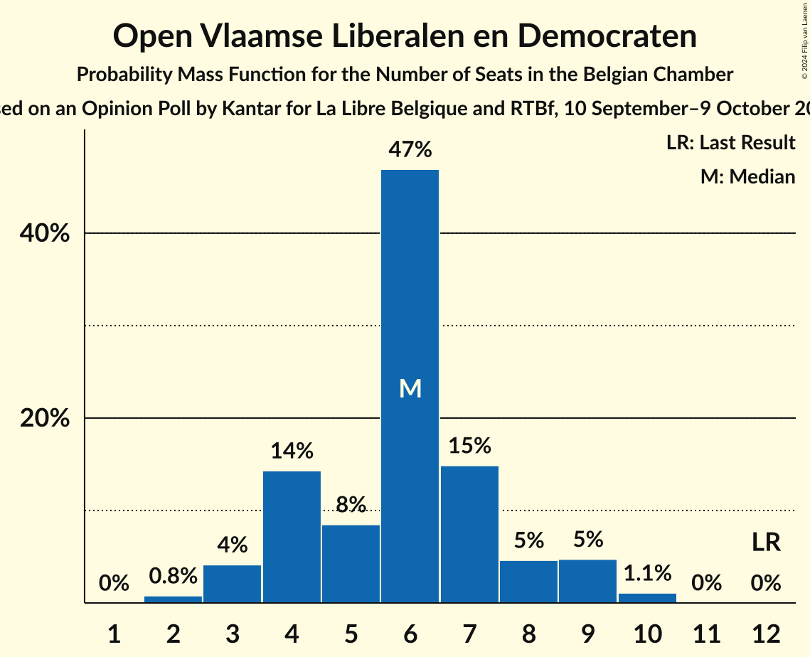

| Number of Seats | Probability | Accumulated | Special Marks |
|:---------------:|:-----------:|:-----------:|:-------------:|
| 2 | 0.8% | 100% |  |
| 3 | 4% | 99.2% |  |
| 4 | 14% | 95% |  |
| 5 | 8% | 81% |  |
| 6 | 47% | 72% | Median |
| 7 | 15% | 25% |  |
| 8 | 5% | 10% |  |
| 9 | 5% | 6% |  |
| 10 | 1.1% | 1.1% |  |
| 11 | 0% | 0% |  |
| 12 | 0% | 0% | Last Result |

### Groen

*For a full overview of the results for this party, see the [Groen](party-groen.html) page.*

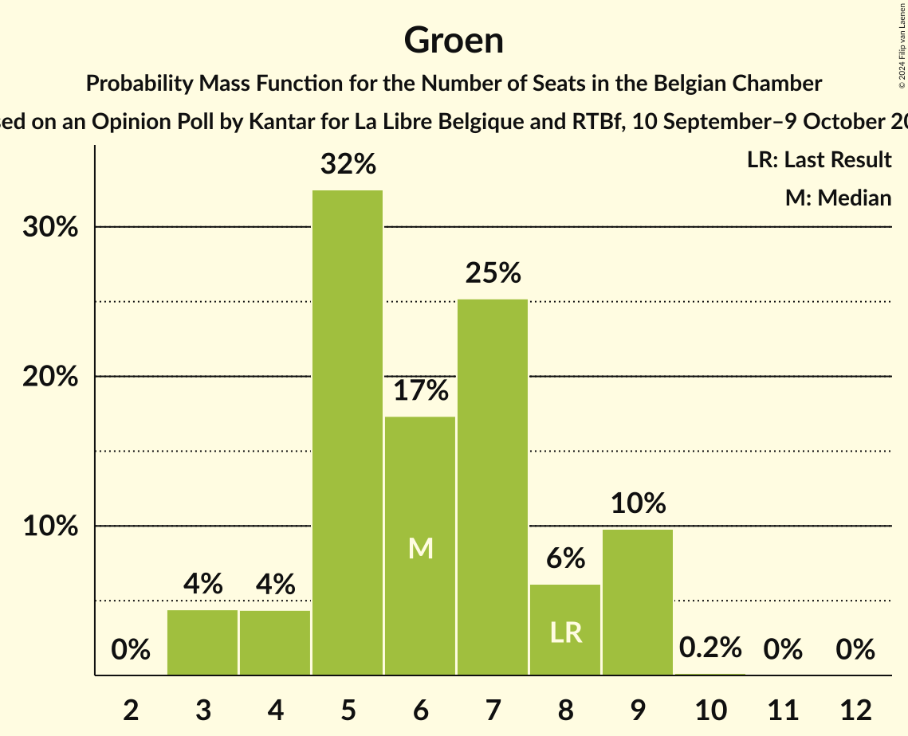

| Number of Seats | Probability | Accumulated | Special Marks |
|:---------------:|:-----------:|:-----------:|:-------------:|
| 3 | 4% | 100% |  |
| 4 | 4% | 96% |  |
| 5 | 32% | 91% |  |
| 6 | 17% | 59% | Median |
| 7 | 25% | 41% |  |
| 8 | 6% | 16% | Last Result |
| 9 | 10% | 10% |  |
| 10 | 0.2% | 0.2% |  |
| 11 | 0% | 0.1% |  |
| 12 | 0% | 0% |  |

### Ecolo

*For a full overview of the results for this party, see the [Ecolo](party-ecolo.html) page.*

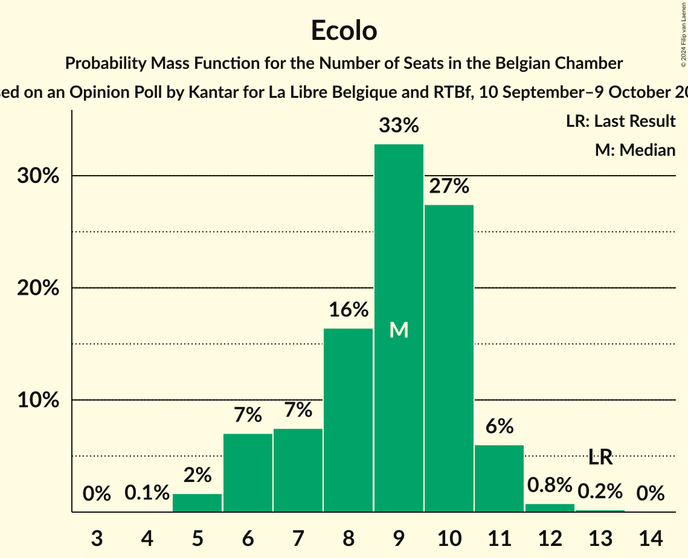

| Number of Seats | Probability | Accumulated | Special Marks |
|:---------------:|:-----------:|:-----------:|:-------------:|
| 4 | 0.1% | 100% |  |
| 5 | 2% | 99.9% |  |
| 6 | 7% | 98% |  |
| 7 | 7% | 91% |  |
| 8 | 16% | 84% |  |
| 9 | 33% | 67% | Median |
| 10 | 27% | 34% |  |
| 11 | 6% | 7% |  |
| 12 | 0.8% | 1.0% |  |
| 13 | 0.2% | 0.2% | Last Result |
| 14 | 0% | 0% |  |

### Les Engagés

*For a full overview of the results for this party, see the [Les Engagés](party-lesengagés.html) page.*

| Number of Seats | Probability | Accumulated | Special Marks |
|:---------------:|:-----------:|:-----------:|:-------------:|
| 2 | 0% | 100% |  |
| 3 | 0.1% | 99.9% |  |
| 4 | 41% | 99.9% |  |
| 5 | 34% | 59% | Last Result, Median |
| 6 | 10% | 25% |  |
| 7 | 7% | 14% |  |
| 8 | 5% | 8% |  |
| 9 | 2% | 3% |  |
| 10 | 0.2% | 0.2% |  |
| 11 | 0% | 0% |  |

### DéFI

*For a full overview of the results for this party, see the [DéFI](party-défi.html) page.*

| Number of Seats | Probability | Accumulated | Special Marks |
|:---------------:|:-----------:|:-----------:|:-------------:|
| 0 | 2% | 100% |  |
| 1 | 80% | 98% | Median |
| 2 | 7% | 18% | Last Result |
| 3 | 10% | 11% |  |
| 4 | 1.1% | 1.2% |  |
| 5 | 0.1% | 0.1% |  |
| 6 | 0% | 0% |  |

## Coalitions

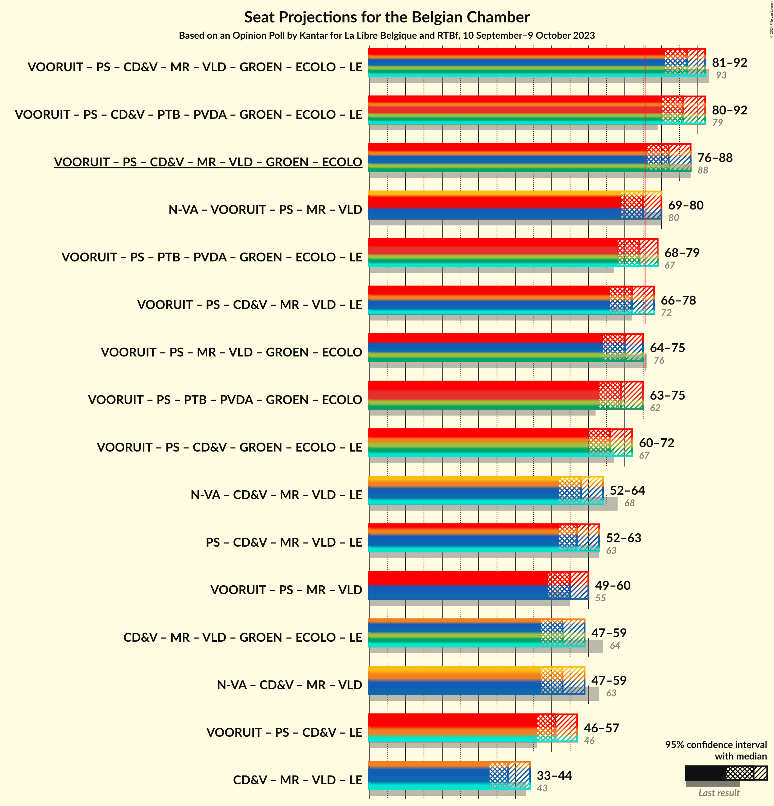

### Confidence Intervals

| Coalition | Last Result | Median | Majority? | 80% Confidence Interval | 90% Confidence Interval | 95% Confidence Interval | 99% Confidence Interval |
|:---------:|:-----------:|:------:|:---------:|:-----------------------:|:-----------------------:|:-----------------------:|:-----------------------:|
| Vooruit – Parti Socialiste – Christen-Democratisch en Vlaams – Mouvement Réformateur – Open Vlaamse Liberalen en Democraten – Groen – Ecolo – Les Engagés | 93 | 87 | 100% | 83–91 | 82–92 | 81–92 | 79–94 |
| Vooruit – Parti Socialiste – Christen-Democratisch en Vlaams – Parti du Travail de Belgique – Partij van de Arbeid van België – Groen – Ecolo – Les Engagés | 79 | 86 | 100% | 82–90 | 81–91 | 80–92 | 78–94 |
| Vooruit – Parti Socialiste – Christen-Democratisch en Vlaams – Mouvement Réformateur – Open Vlaamse Liberalen en Democraten – Groen – Ecolo | 88 | 82 | 98% | 78–86 | 77–87 | 76–88 | 74–89 |
| Nieuw-Vlaamse Alliantie – Vooruit – Parti Socialiste – Mouvement Réformateur – Open Vlaamse Liberalen en Democraten | 80 | 75 | 37% | 71–78 | 69–79 | 69–80 | 67–82 |
| Vooruit – Parti Socialiste – Parti du Travail de Belgique – Partij van de Arbeid van België – Groen – Ecolo – Les Engagés | 67 | 74 | 30% | 70–78 | 69–79 | 68–79 | 66–81 |
| Vooruit – Parti Socialiste – Christen-Democratisch en Vlaams – Mouvement Réformateur – Open Vlaamse Liberalen en Democraten – Les Engagés | 72 | 72 | 13% | 68–76 | 67–77 | 66–78 | 64–80 |
| Vooruit – Parti Socialiste – Mouvement Réformateur – Open Vlaamse Liberalen en Democraten – Groen – Ecolo | 76 | 70 | 2% | 66–73 | 65–74 | 64–75 | 62–77 |
| Vooruit – Parti Socialiste – Parti du Travail de Belgique – Partij van de Arbeid van België – Groen – Ecolo | 62 | 69 | 1.1% | 65–73 | 64–74 | 63–75 | 61–76 |
| Vooruit – Parti Socialiste – Christen-Democratisch en Vlaams – Groen – Ecolo – Les Engagés | 67 | 66 | 0.1% | 62–70 | 61–71 | 60–72 | 59–74 |
| Nieuw-Vlaamse Alliantie – Christen-Democratisch en Vlaams – Mouvement Réformateur – Open Vlaamse Liberalen en Democraten – Les Engagés | 68 | 58 | 0% | 54–62 | 53–63 | 52–64 | 50–66 |
| Parti Socialiste – Christen-Democratisch en Vlaams – Mouvement Réformateur – Open Vlaamse Liberalen en Democraten – Les Engagés | 63 | 57 | 0% | 54–61 | 53–62 | 52–63 | 50–65 |
| Vooruit – Parti Socialiste – Mouvement Réformateur – Open Vlaamse Liberalen en Democraten | 55 | 55 | 0% | 51–58 | 50–59 | 49–60 | 48–62 |
| Christen-Democratisch en Vlaams – Mouvement Réformateur – Open Vlaamse Liberalen en Democraten – Groen – Ecolo – Les Engagés | 64 | 53 | 0% | 49–57 | 48–58 | 47–59 | 45–61 |
| Nieuw-Vlaamse Alliantie – Christen-Democratisch en Vlaams – Mouvement Réformateur – Open Vlaamse Liberalen en Democraten | 63 | 53 | 0% | 49–56 | 48–58 | 47–59 | 45–60 |
| Vooruit – Parti Socialiste – Christen-Democratisch en Vlaams – Les Engagés | 46 | 51 | 0% | 48–55 | 47–56 | 46–57 | 44–59 |
| Christen-Democratisch en Vlaams – Mouvement Réformateur – Open Vlaamse Liberalen en Democraten – Les Engagés | 43 | 38 | 0% | 34–42 | 33–43 | 33–44 | 31–46 |

### Vooruit – Parti Socialiste – Christen-Democratisch en Vlaams – Mouvement Réformateur – Open Vlaamse Liberalen en Democraten – Groen – Ecolo – Les Engagés

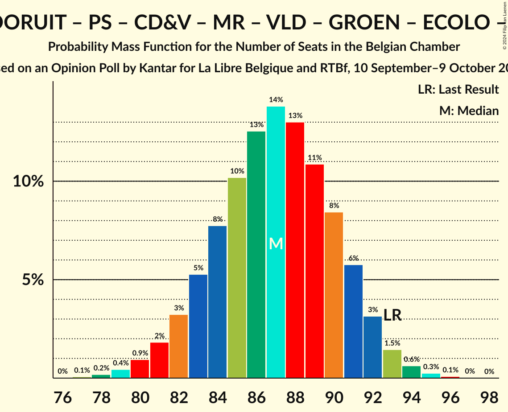

| Number of Seats | Probability | Accumulated | Special Marks |
|:---------------:|:-----------:|:-----------:|:-------------:|
| 77 | 0.1% | 100% |  |
| 78 | 0.2% | 99.9% |  |
| 79 | 0.4% | 99.7% |  |
| 80 | 0.9% | 99.3% |  |
| 81 | 2% | 98% |  |
| 82 | 3% | 96% |  |
| 83 | 5% | 93% |  |
| 84 | 8% | 88% |  |
| 85 | 10% | 80% |  |
| 86 | 13% | 70% |  |
| 87 | 14% | 57% | Median |
| 88 | 13% | 44% |  |
| 89 | 11% | 31% |  |
| 90 | 8% | 20% |  |
| 91 | 6% | 11% |  |
| 92 | 3% | 6% |  |
| 93 | 1.5% | 2% | Last Result |
| 94 | 0.6% | 1.0% |  |
| 95 | 0.3% | 0.4% |  |
| 96 | 0.1% | 0.1% |  |
| 97 | 0% | 0% |  |

### Vooruit – Parti Socialiste – Christen-Democratisch en Vlaams – Parti du Travail de Belgique – Partij van de Arbeid van België – Groen – Ecolo – Les Engagés

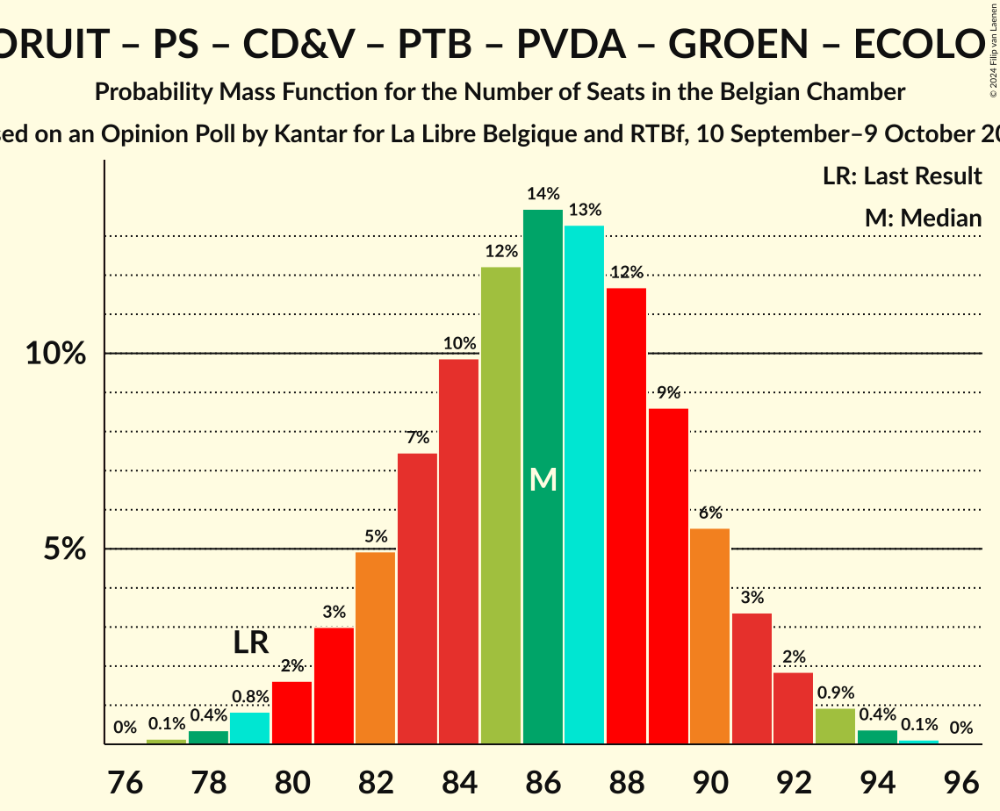

| Number of Seats | Probability | Accumulated | Special Marks |
|:---------------:|:-----------:|:-----------:|:-------------:|
| 76 | 0% | 100% | Majority |
| 77 | 0.1% | 99.9% |  |
| 78 | 0.4% | 99.8% |  |
| 79 | 0.8% | 99.4% | Last Result |
| 80 | 2% | 98.6% |  |
| 81 | 3% | 97% |  |
| 82 | 5% | 94% |  |
| 83 | 7% | 89% |  |
| 84 | 10% | 82% |  |
| 85 | 12% | 72% |  |
| 86 | 14% | 60% |  |
| 87 | 13% | 46% | Median |
| 88 | 12% | 33% |  |
| 89 | 9% | 21% |  |
| 90 | 6% | 12% |  |
| 91 | 3% | 7% |  |
| 92 | 2% | 3% |  |
| 93 | 0.9% | 1.5% |  |
| 94 | 0.4% | 0.5% |  |
| 95 | 0.1% | 0.2% |  |
| 96 | 0% | 0% |  |

### Vooruit – Parti Socialiste – Christen-Democratisch en Vlaams – Mouvement Réformateur – Open Vlaamse Liberalen en Democraten – Groen – Ecolo

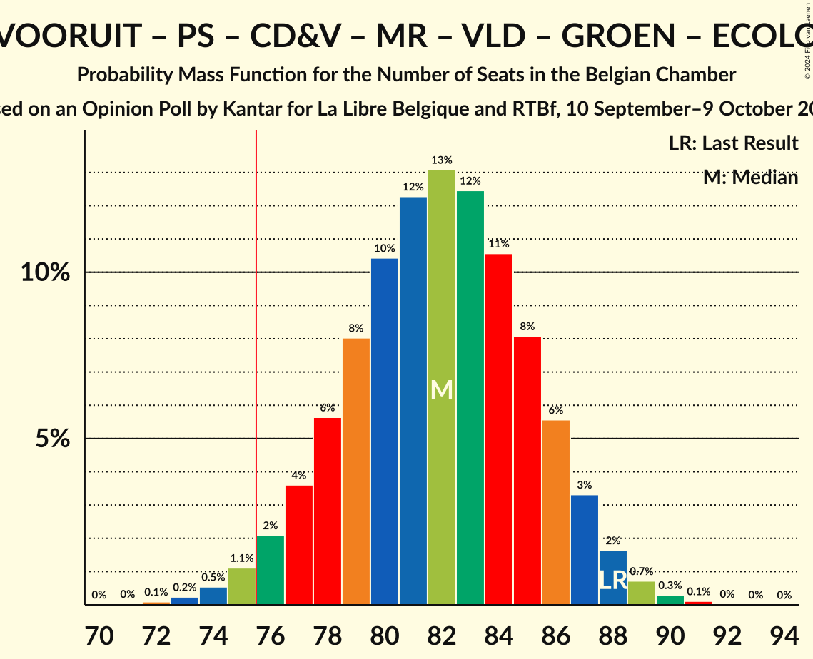

| Number of Seats | Probability | Accumulated | Special Marks |
|:---------------:|:-----------:|:-----------:|:-------------:|
| 72 | 0.1% | 100% |  |
| 73 | 0.2% | 99.9% |  |
| 74 | 0.5% | 99.6% |  |
| 75 | 1.1% | 99.1% |  |
| 76 | 2% | 98% | Majority |
| 77 | 4% | 96% |  |
| 78 | 6% | 92% |  |
| 79 | 8% | 87% |  |
| 80 | 10% | 79% |  |
| 81 | 12% | 68% |  |
| 82 | 13% | 56% | Median |
| 83 | 12% | 43% |  |
| 84 | 11% | 30% |  |
| 85 | 8% | 20% |  |
| 86 | 6% | 12% |  |
| 87 | 3% | 6% |  |
| 88 | 2% | 3% | Last Result |
| 89 | 0.7% | 1.2% |  |
| 90 | 0.3% | 0.5% |  |
| 91 | 0.1% | 0.2% |  |
| 92 | 0% | 0.1% |  |
| 93 | 0% | 0% |  |

### Nieuw-Vlaamse Alliantie – Vooruit – Parti Socialiste – Mouvement Réformateur – Open Vlaamse Liberalen en Democraten

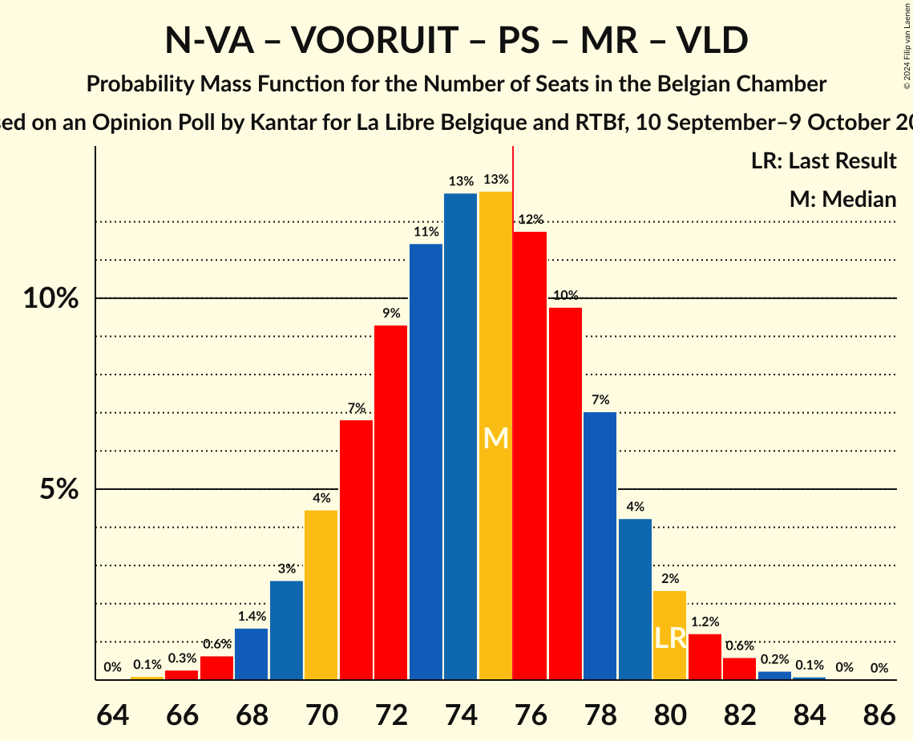

| Number of Seats | Probability | Accumulated | Special Marks |
|:---------------:|:-----------:|:-----------:|:-------------:|
| 65 | 0.1% | 100% |  |
| 66 | 0.3% | 99.8% |  |
| 67 | 0.6% | 99.6% |  |
| 68 | 1.4% | 98.9% |  |
| 69 | 3% | 98% |  |
| 70 | 4% | 95% |  |
| 71 | 7% | 90% |  |
| 72 | 9% | 84% |  |
| 73 | 11% | 74% |  |
| 74 | 13% | 63% |  |
| 75 | 13% | 50% | Median |
| 76 | 12% | 37% | Majority |
| 77 | 10% | 26% |  |
| 78 | 7% | 16% |  |
| 79 | 4% | 9% |  |
| 80 | 2% | 5% | Last Result |
| 81 | 1.2% | 2% |  |
| 82 | 0.6% | 1.0% |  |
| 83 | 0.2% | 0.4% |  |
| 84 | 0.1% | 0.1% |  |
| 85 | 0% | 0% |  |

### Vooruit – Parti Socialiste – Parti du Travail de Belgique – Partij van de Arbeid van België – Groen – Ecolo – Les Engagés

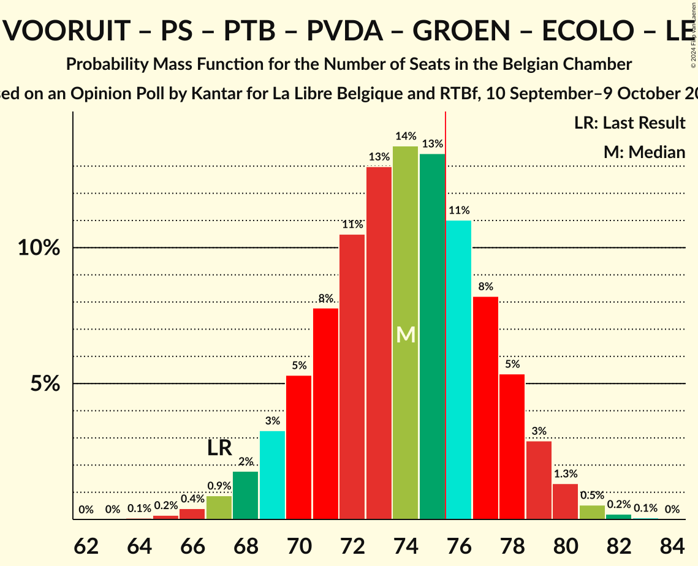

| Number of Seats | Probability | Accumulated | Special Marks |
|:---------------:|:-----------:|:-----------:|:-------------:|
| 64 | 0.1% | 100% |  |
| 65 | 0.2% | 99.9% |  |
| 66 | 0.4% | 99.8% |  |
| 67 | 0.9% | 99.4% | Last Result |
| 68 | 2% | 98% |  |
| 69 | 3% | 97% |  |
| 70 | 5% | 93% |  |
| 71 | 8% | 88% |  |
| 72 | 11% | 80% |  |
| 73 | 13% | 70% |  |
| 74 | 14% | 57% |  |
| 75 | 13% | 43% | Median |
| 76 | 11% | 30% | Majority |
| 77 | 8% | 19% |  |
| 78 | 5% | 10% |  |
| 79 | 3% | 5% |  |
| 80 | 1.3% | 2% |  |
| 81 | 0.5% | 0.8% |  |
| 82 | 0.2% | 0.3% |  |
| 83 | 0.1% | 0.1% |  |
| 84 | 0% | 0% |  |

### Vooruit – Parti Socialiste – Christen-Democratisch en Vlaams – Mouvement Réformateur – Open Vlaamse Liberalen en Democraten – Les Engagés

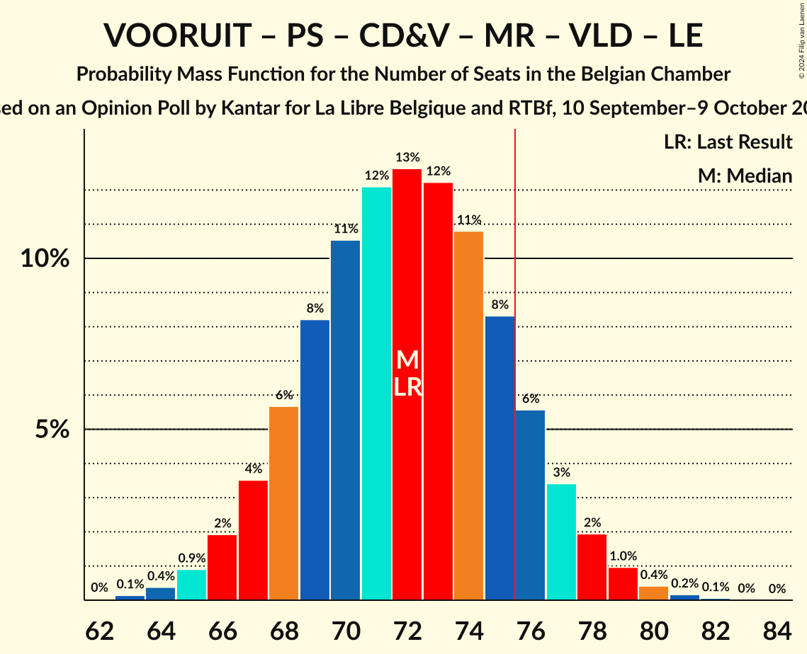

| Number of Seats | Probability | Accumulated | Special Marks |
|:---------------:|:-----------:|:-----------:|:-------------:|
| 62 | 0% | 100% |  |
| 63 | 0.1% | 99.9% |  |
| 64 | 0.4% | 99.8% |  |
| 65 | 0.9% | 99.4% |  |
| 66 | 2% | 98.5% |  |
| 67 | 4% | 97% |  |
| 68 | 6% | 93% |  |
| 69 | 8% | 87% |  |
| 70 | 11% | 79% |  |
| 71 | 12% | 69% |  |
| 72 | 13% | 57% | Last Result, Median |
| 73 | 12% | 44% |  |
| 74 | 11% | 32% |  |
| 75 | 8% | 21% |  |
| 76 | 6% | 13% | Majority |
| 77 | 3% | 7% |  |
| 78 | 2% | 4% |  |
| 79 | 1.0% | 2% |  |
| 80 | 0.4% | 0.7% |  |
| 81 | 0.2% | 0.3% |  |
| 82 | 0.1% | 0.1% |  |
| 83 | 0% | 0% |  |

### Vooruit – Parti Socialiste – Mouvement Réformateur – Open Vlaamse Liberalen en Democraten – Groen – Ecolo

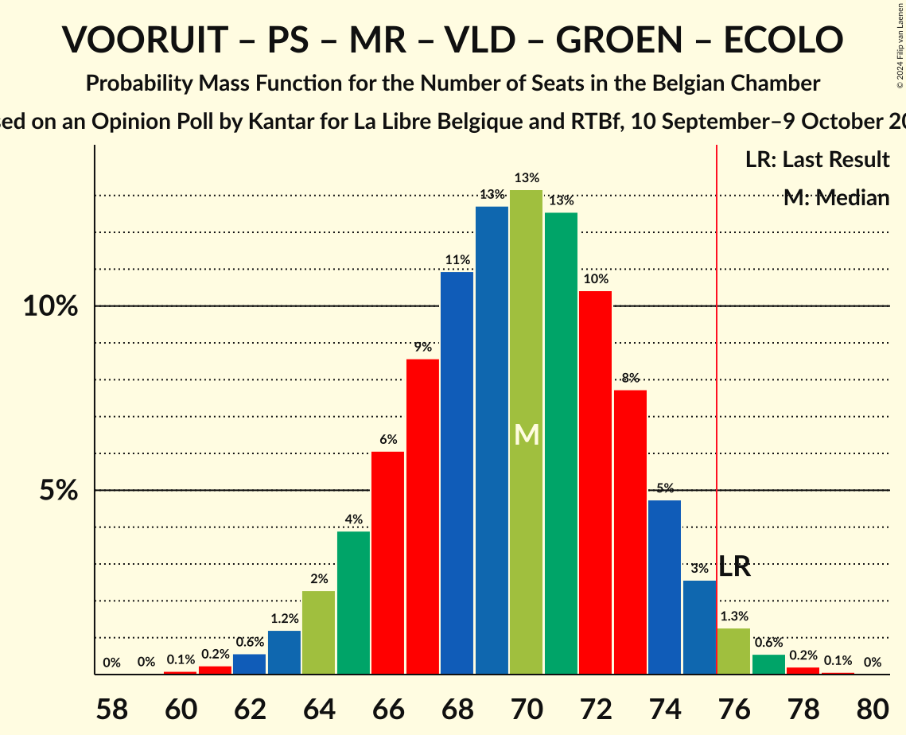

| Number of Seats | Probability | Accumulated | Special Marks |
|:---------------:|:-----------:|:-----------:|:-------------:|
| 60 | 0.1% | 100% |  |
| 61 | 0.2% | 99.9% |  |
| 62 | 0.6% | 99.6% |  |
| 63 | 1.2% | 99.0% |  |
| 64 | 2% | 98% |  |
| 65 | 4% | 96% |  |
| 66 | 6% | 92% |  |
| 67 | 9% | 86% |  |
| 68 | 11% | 77% |  |
| 69 | 13% | 66% |  |
| 70 | 13% | 53% | Median |
| 71 | 13% | 40% |  |
| 72 | 10% | 28% |  |
| 73 | 8% | 17% |  |
| 74 | 5% | 9% |  |
| 75 | 3% | 5% |  |
| 76 | 1.3% | 2% | Last Result, Majority |
| 77 | 0.6% | 0.9% |  |
| 78 | 0.2% | 0.3% |  |
| 79 | 0.1% | 0.1% |  |
| 80 | 0% | 0% |  |

### Vooruit – Parti Socialiste – Parti du Travail de Belgique – Partij van de Arbeid van België – Groen – Ecolo

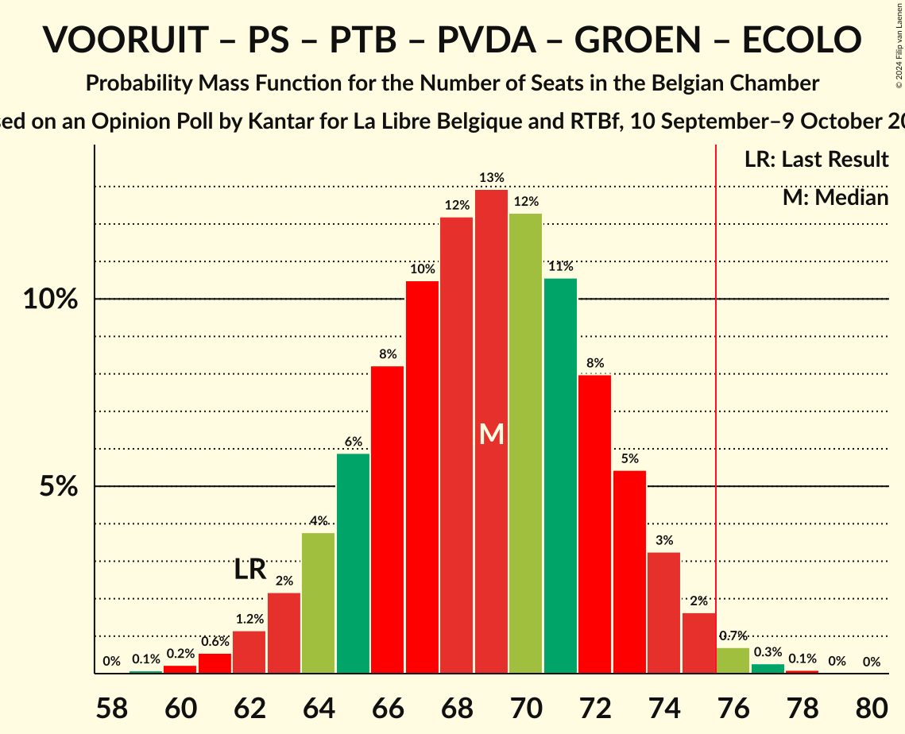

| Number of Seats | Probability | Accumulated | Special Marks |
|:---------------:|:-----------:|:-----------:|:-------------:|
| 59 | 0.1% | 100% |  |
| 60 | 0.2% | 99.9% |  |
| 61 | 0.6% | 99.7% |  |
| 62 | 1.2% | 99.1% | Last Result |
| 63 | 2% | 98% |  |
| 64 | 4% | 96% |  |
| 65 | 6% | 92% |  |
| 66 | 8% | 86% |  |
| 67 | 10% | 78% |  |
| 68 | 12% | 67% |  |
| 69 | 13% | 55% |  |
| 70 | 12% | 42% | Median |
| 71 | 11% | 30% |  |
| 72 | 8% | 19% |  |
| 73 | 5% | 11% |  |
| 74 | 3% | 6% |  |
| 75 | 2% | 3% |  |
| 76 | 0.7% | 1.1% | Majority |
| 77 | 0.3% | 0.4% |  |
| 78 | 0.1% | 0.1% |  |
| 79 | 0% | 0% |  |

### Vooruit – Parti Socialiste – Christen-Democratisch en Vlaams – Groen – Ecolo – Les Engagés

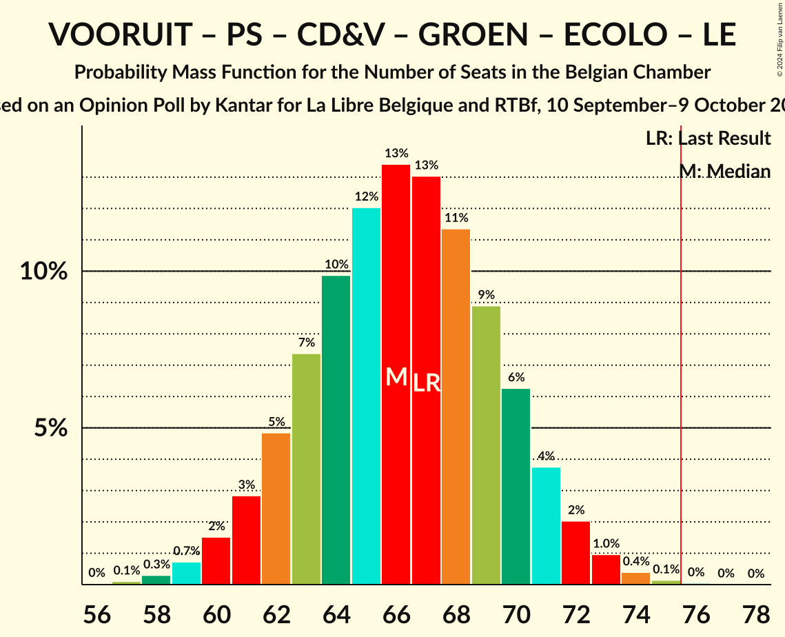

| Number of Seats | Probability | Accumulated | Special Marks |
|:---------------:|:-----------:|:-----------:|:-------------:|
| 57 | 0.1% | 100% |  |
| 58 | 0.3% | 99.8% |  |
| 59 | 0.7% | 99.5% |  |
| 60 | 2% | 98.8% |  |
| 61 | 3% | 97% |  |
| 62 | 5% | 94% |  |
| 63 | 7% | 90% |  |
| 64 | 10% | 82% |  |
| 65 | 12% | 72% |  |
| 66 | 13% | 60% |  |
| 67 | 13% | 47% | Last Result, Median |
| 68 | 11% | 34% |  |
| 69 | 9% | 23% |  |
| 70 | 6% | 14% |  |
| 71 | 4% | 7% |  |
| 72 | 2% | 4% |  |
| 73 | 1.0% | 2% |  |
| 74 | 0.4% | 0.6% |  |
| 75 | 0.1% | 0.2% |  |
| 76 | 0% | 0.1% | Majority |
| 77 | 0% | 0% |  |

### Nieuw-Vlaamse Alliantie – Christen-Democratisch en Vlaams – Mouvement Réformateur – Open Vlaamse Liberalen en Democraten – Les Engagés

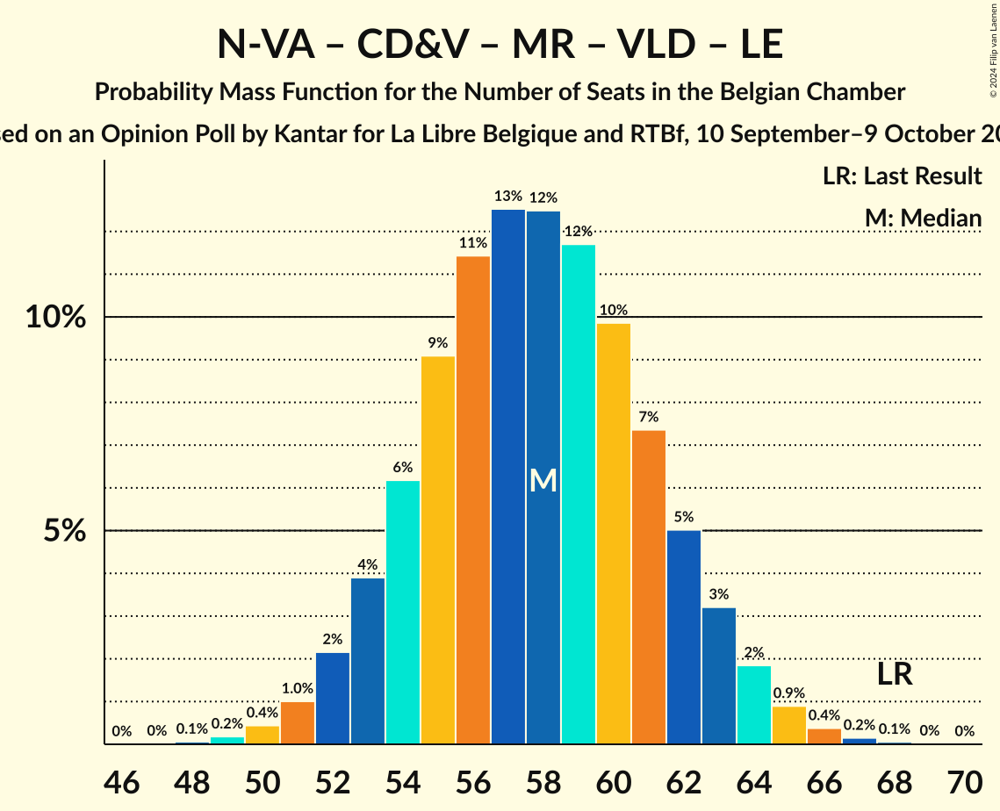

| Number of Seats | Probability | Accumulated | Special Marks |
|:---------------:|:-----------:|:-----------:|:-------------:|
| 48 | 0.1% | 100% |  |
| 49 | 0.2% | 99.9% |  |
| 50 | 0.4% | 99.7% |  |
| 51 | 1.0% | 99.3% |  |
| 52 | 2% | 98% |  |
| 53 | 4% | 96% |  |
| 54 | 6% | 92% |  |
| 55 | 9% | 86% |  |
| 56 | 11% | 77% |  |
| 57 | 13% | 66% | Median |
| 58 | 12% | 53% |  |
| 59 | 12% | 41% |  |
| 60 | 10% | 29% |  |
| 61 | 7% | 19% |  |
| 62 | 5% | 12% |  |
| 63 | 3% | 7% |  |
| 64 | 2% | 3% |  |
| 65 | 0.9% | 2% |  |
| 66 | 0.4% | 0.6% |  |
| 67 | 0.2% | 0.2% |  |
| 68 | 0.1% | 0.1% | Last Result |
| 69 | 0% | 0% |  |

### Parti Socialiste – Christen-Democratisch en Vlaams – Mouvement Réformateur – Open Vlaamse Liberalen en Democraten – Les Engagés

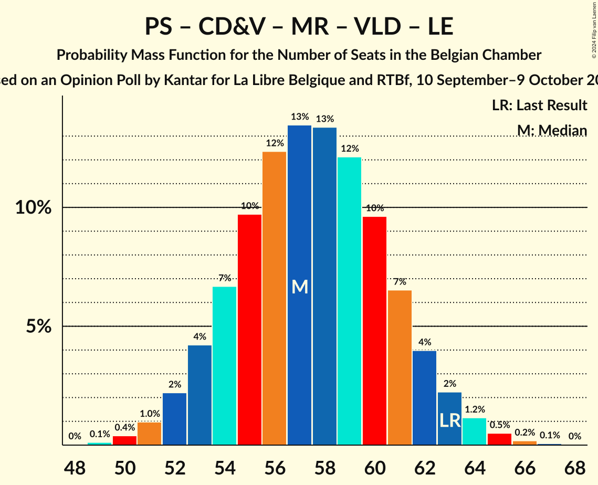

| Number of Seats | Probability | Accumulated | Special Marks |
|:---------------:|:-----------:|:-----------:|:-------------:|
| 49 | 0.1% | 100% |  |
| 50 | 0.4% | 99.8% |  |
| 51 | 1.0% | 99.4% |  |
| 52 | 2% | 98% |  |
| 53 | 4% | 96% |  |
| 54 | 7% | 92% |  |
| 55 | 10% | 85% |  |
| 56 | 12% | 76% |  |
| 57 | 13% | 63% | Median |
| 58 | 13% | 50% |  |
| 59 | 12% | 36% |  |
| 60 | 10% | 24% |  |
| 61 | 7% | 15% |  |
| 62 | 4% | 8% |  |
| 63 | 2% | 4% | Last Result |
| 64 | 1.2% | 2% |  |
| 65 | 0.5% | 0.8% |  |
| 66 | 0.2% | 0.3% |  |
| 67 | 0.1% | 0.1% |  |
| 68 | 0% | 0% |  |

### Vooruit – Parti Socialiste – Mouvement Réformateur – Open Vlaamse Liberalen en Democraten

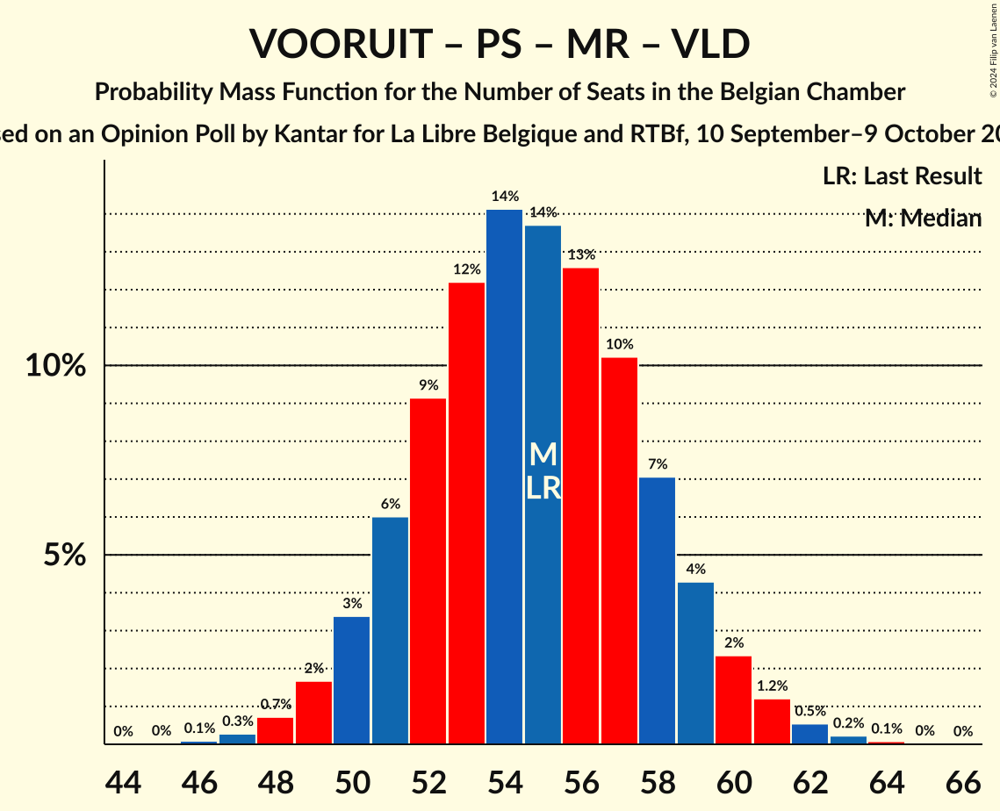

| Number of Seats | Probability | Accumulated | Special Marks |
|:---------------:|:-----------:|:-----------:|:-------------:|
| 46 | 0.1% | 100% |  |
| 47 | 0.3% | 99.9% |  |
| 48 | 0.7% | 99.6% |  |
| 49 | 2% | 98.9% |  |
| 50 | 3% | 97% |  |
| 51 | 6% | 94% |  |
| 52 | 9% | 88% |  |
| 53 | 12% | 79% |  |
| 54 | 14% | 66% |  |
| 55 | 14% | 52% | Last Result, Median |
| 56 | 13% | 39% |  |
| 57 | 10% | 26% |  |
| 58 | 7% | 16% |  |
| 59 | 4% | 9% |  |
| 60 | 2% | 4% |  |
| 61 | 1.2% | 2% |  |
| 62 | 0.5% | 0.9% |  |
| 63 | 0.2% | 0.3% |  |
| 64 | 0.1% | 0.1% |  |
| 65 | 0% | 0% |  |

### Christen-Democratisch en Vlaams – Mouvement Réformateur – Open Vlaamse Liberalen en Democraten – Groen – Ecolo – Les Engagés

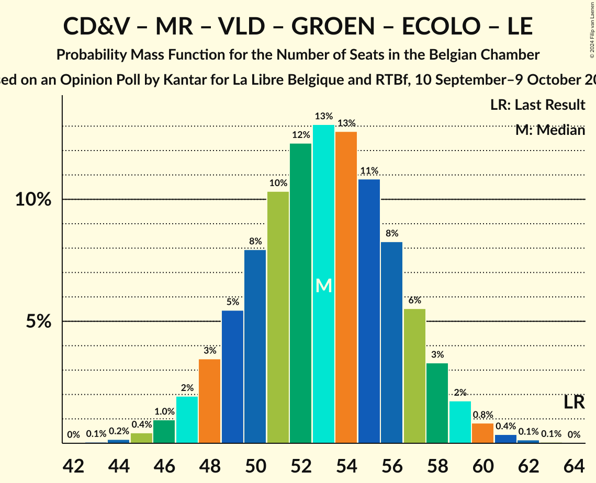

| Number of Seats | Probability | Accumulated | Special Marks |
|:---------------:|:-----------:|:-----------:|:-------------:|
| 43 | 0.1% | 100% |  |
| 44 | 0.2% | 99.9% |  |
| 45 | 0.4% | 99.8% |  |
| 46 | 1.0% | 99.3% |  |
| 47 | 2% | 98% |  |
| 48 | 3% | 96% |  |
| 49 | 5% | 93% |  |
| 50 | 8% | 88% |  |
| 51 | 10% | 80% |  |
| 52 | 12% | 69% | Median |
| 53 | 13% | 57% |  |
| 54 | 13% | 44% |  |
| 55 | 11% | 31% |  |
| 56 | 8% | 20% |  |
| 57 | 6% | 12% |  |
| 58 | 3% | 6% |  |
| 59 | 2% | 3% |  |
| 60 | 0.8% | 1.4% |  |
| 61 | 0.4% | 0.6% |  |
| 62 | 0.1% | 0.2% |  |
| 63 | 0.1% | 0.1% |  |
| 64 | 0% | 0% | Last Result |

### Nieuw-Vlaamse Alliantie – Christen-Democratisch en Vlaams – Mouvement Réformateur – Open Vlaamse Liberalen en Democraten

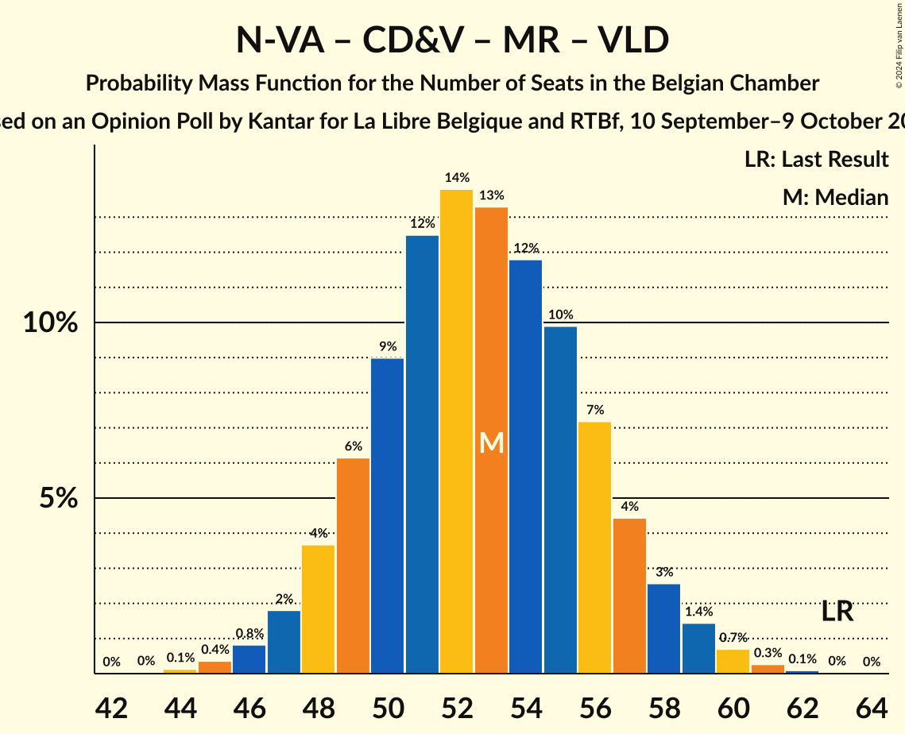

| Number of Seats | Probability | Accumulated | Special Marks |
|:---------------:|:-----------:|:-----------:|:-------------:|
| 43 | 0% | 100% |  |
| 44 | 0.1% | 99.9% |  |
| 45 | 0.4% | 99.8% |  |
| 46 | 0.8% | 99.5% |  |
| 47 | 2% | 98.6% |  |
| 48 | 4% | 97% |  |
| 49 | 6% | 93% |  |
| 50 | 9% | 87% |  |
| 51 | 12% | 78% |  |
| 52 | 14% | 66% | Median |
| 53 | 13% | 52% |  |
| 54 | 12% | 38% |  |
| 55 | 10% | 27% |  |
| 56 | 7% | 17% |  |
| 57 | 4% | 10% |  |
| 58 | 3% | 5% |  |
| 59 | 1.4% | 3% |  |
| 60 | 0.7% | 1.1% |  |
| 61 | 0.3% | 0.4% |  |
| 62 | 0.1% | 0.1% |  |
| 63 | 0% | 0% | Last Result |

### Vooruit – Parti Socialiste – Christen-Democratisch en Vlaams – Les Engagés

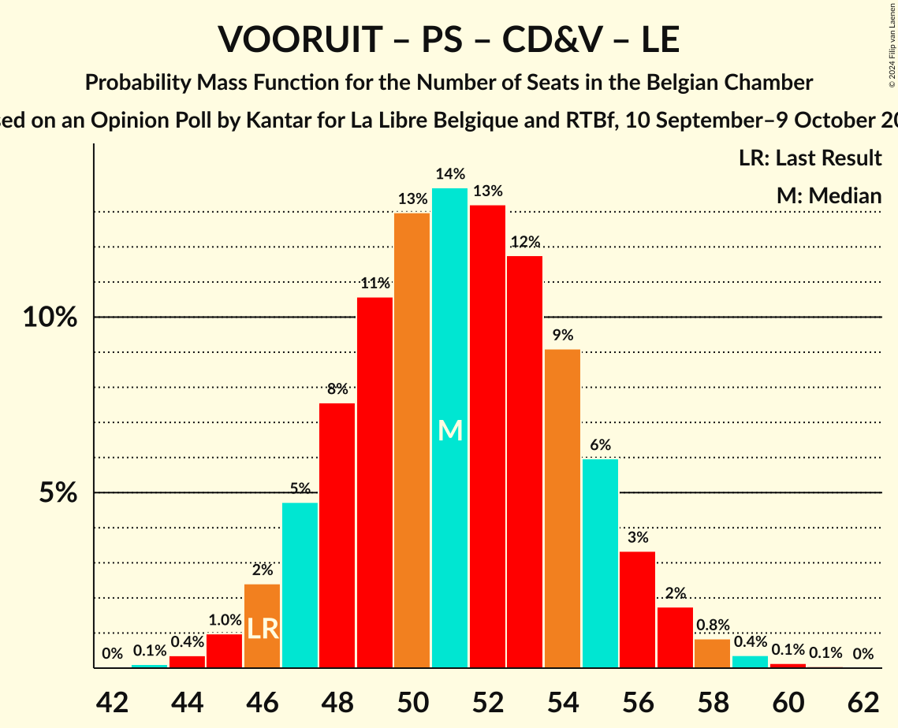

| Number of Seats | Probability | Accumulated | Special Marks |
|:---------------:|:-----------:|:-----------:|:-------------:|
| 43 | 0.1% | 100% |  |
| 44 | 0.4% | 99.9% |  |
| 45 | 1.0% | 99.5% |  |
| 46 | 2% | 98.5% | Last Result |
| 47 | 5% | 96% |  |
| 48 | 8% | 91% |  |
| 49 | 11% | 84% |  |
| 50 | 13% | 73% |  |
| 51 | 14% | 60% |  |
| 52 | 13% | 47% | Median |
| 53 | 12% | 33% |  |
| 54 | 9% | 22% |  |
| 55 | 6% | 12% |  |
| 56 | 3% | 7% |  |
| 57 | 2% | 3% |  |
| 58 | 0.8% | 1.4% |  |
| 59 | 0.4% | 0.6% |  |
| 60 | 0.1% | 0.2% |  |
| 61 | 0.1% | 0.1% |  |
| 62 | 0% | 0% |  |

### Christen-Democratisch en Vlaams – Mouvement Réformateur – Open Vlaamse Liberalen en Democraten – Les Engagés

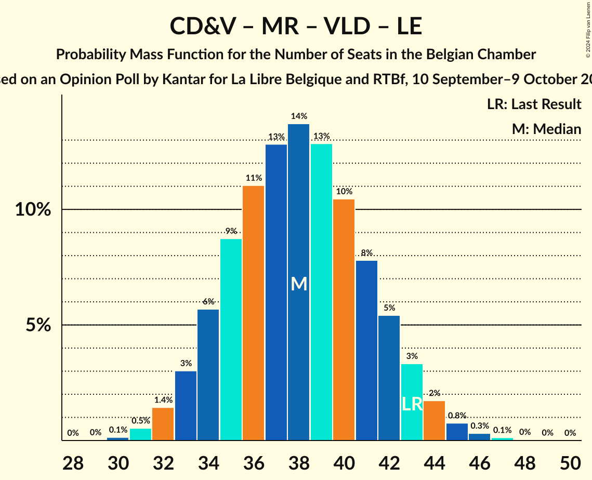

| Number of Seats | Probability | Accumulated | Special Marks |
|:---------------:|:-----------:|:-----------:|:-------------:|
| 30 | 0.1% | 100% |  |
| 31 | 0.5% | 99.8% |  |
| 32 | 1.4% | 99.3% |  |
| 33 | 3% | 98% |  |
| 34 | 6% | 95% |  |
| 35 | 9% | 89% |  |
| 36 | 11% | 80% |  |
| 37 | 13% | 69% | Median |
| 38 | 14% | 57% |  |
| 39 | 13% | 43% |  |
| 40 | 10% | 30% |  |
| 41 | 8% | 20% |  |
| 42 | 5% | 12% |  |
| 43 | 3% | 6% | Last Result |
| 44 | 2% | 3% |  |
| 45 | 0.8% | 1.3% |  |
| 46 | 0.3% | 0.5% |  |
| 47 | 0.1% | 0.2% |  |
| 48 | 0% | 0.1% |  |
| 49 | 0% | 0% |  |

## Technical Information

### Opinion Poll

+ **Polling firm:** Kantar
+ **Commissioner(s):** La Libre Belgique and RTBf
+ **Fieldwork period:** 10 September–9 October 2023

### Calculations

+ **Sample size:** 914
+ **Simulations done:** 1,048,576
+ **Error estimate:** 2.21%

