# Opinion Poll by Kantar for Knack and Le Vif, 22 January–8 February 2024

Areas included: Brussels, Flanders, Wallonia

<a href="#voting-intentions">Voting Intentions</a> | <a href="#seats">Seats</a> | <a href="#coalitions">Coalitions</a> | <a href="#technical-information">Technical Information</a>

## Voting Intentions

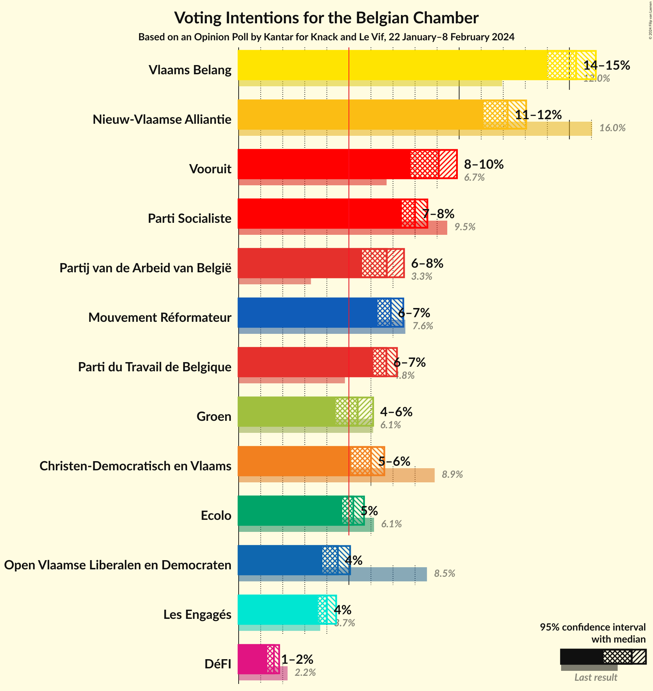

### Confidence Intervals

| Party | Last Result | Poll Result | 80% Confidence Interval | 90% Confidence Interval | 95% Confidence Interval | 99% Confidence Interval |
|:-----:|:-----------:|:-----------:|:-----------------------:|:-----------------------:|:-----------------------:|:-----------------------:|
| Vlaams Belang | 12.0% | 16.2% | 14.4–15.2% |14.2–15.3% |14.0–15.3% |13.6–15.3% |
| Nieuw-Vlaamse Alliantie | 16.0% | 13.0% | 11.4–12.2% |11.2–12.2% |11.1–12.2% |10.7–12.2% |
| Vooruit | 6.7% | 9.1% | 8.2–9.7% |8.0–9.8% |7.8–9.9% |7.5–10.0% |
| Parti Socialiste | 9.5% | 8.6% | 7.6–8.0% |7.5–8.0% |7.4–8.0% |7.2–8.0% |
| Mouvement Réformateur | 7.6% | 7.5% | 6.5–6.9% |6.4–6.9% |6.3–6.9% |6.2–6.9% |
| Parti du Travail de Belgique | 4.8% | 7.2% | 6.3–6.6% |6.2–6.7% |6.1–6.7% |6.0–6.7% |
| Partij van de Arbeid van België | 3.3% | 6.7% | 6.0–7.3% |5.8–7.4% |5.6–7.5% |5.3–7.5% |
| Christen-Democratisch en Vlaams | 8.9% | 6.6% | 5.4–5.9% |5.3–6.0% |5.1–6.0% |4.9–6.0% |
| Ecolo | 6.1% | 5.7% | 4.9–5.2% |4.8–5.2% |4.7–5.2% |4.6–5.2% |
| Groen | 6.1% | 5.4% | 4.7–5.9% |4.6–6.0% |4.4–6.1% |4.1–6.1% |
| Open Vlaamse Liberalen en Democraten | 8.5% | 5.1% | 4.0–4.5% |3.9–4.5% |3.8–4.5% |3.6–4.6% |
| Les Engagés | 3.7% | 4.4% | 3.7–4.0% |3.6–4.0% |3.6–4.0% |3.4–4.0% |
| DéFI | 2.2% | 1.8% | 1.4–1.6% |1.4–1.6% |1.3–1.6% |1.2–1.6% |

*Note:* The poll result column reflects the actual value used in the calculations. Published results may vary slightly, and in addition be rounded to fewer digits.

## Seats

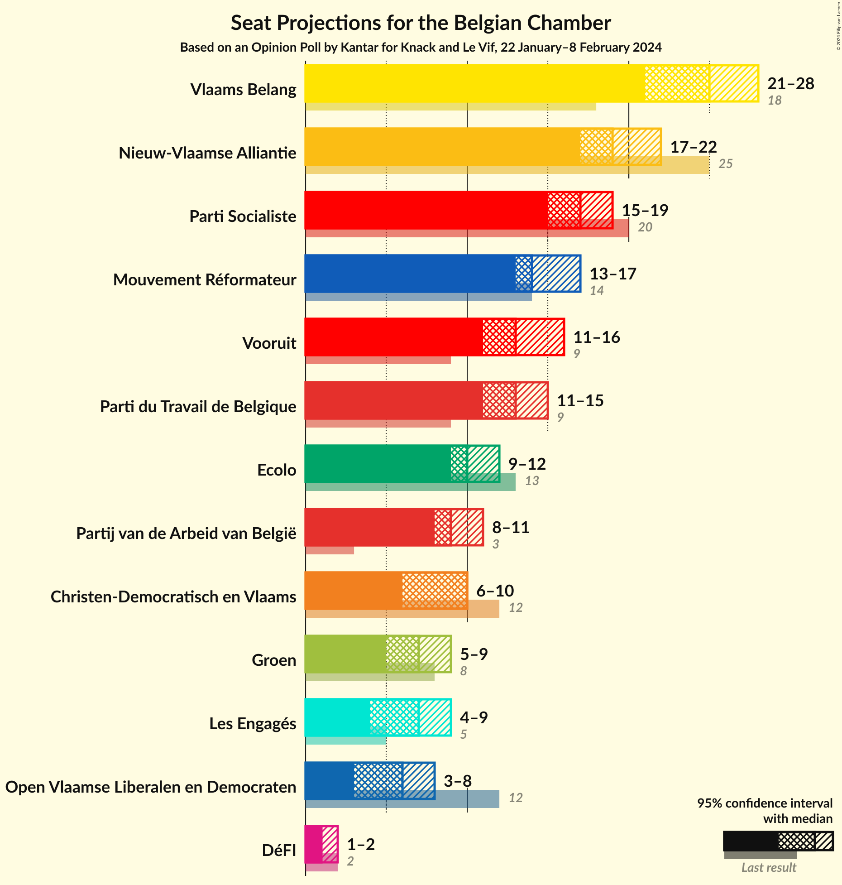

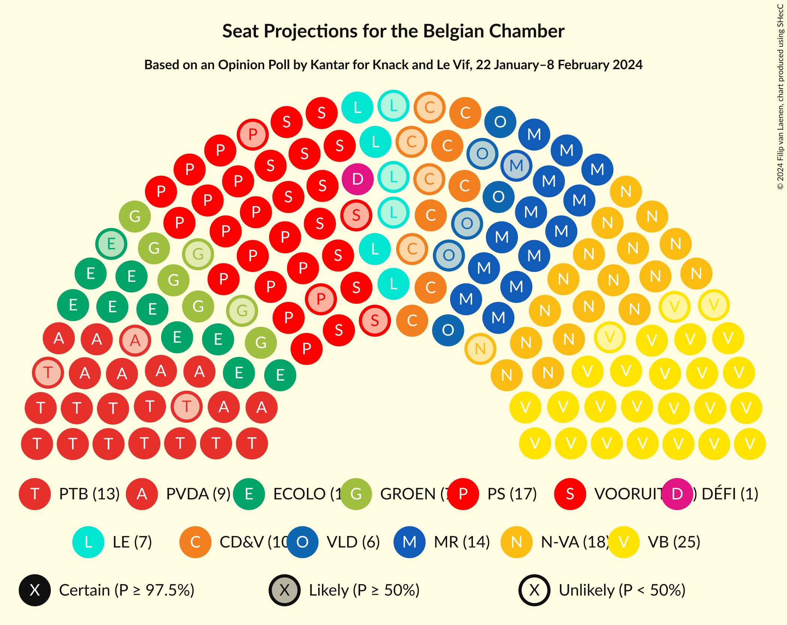

### Confidence Intervals

| Party | Last Result | Median | 80% Confidence Interval | 90% Confidence Interval | 95% Confidence Interval | 99% Confidence Interval |
|:-----:|:-----------:|:------:|:-----------------------:|:-----------------------:|:-----------------------:|:-----------------------:|
| <a href="#vlaams-belang">Vlaams Belang</a> | 18 | 25 | 22–26 |22–27 |21–28 |21–29 |
| <a href="#nieuw-vlaamse-alliantie">Nieuw-Vlaamse Alliantie</a> | 25 | 19 | 18–21 |17–22 |17–22 |15–23 |
| <a href="#vooruit">Vooruit</a> | 9 | 13 | 11–15 |11–15 |11–16 |11–16 |
| <a href="#parti-socialiste">Parti Socialiste</a> | 20 | 17 | 16–18 |15–19 |15–19 |14–20 |
| <a href="#mouvement-réformateur">Mouvement Réformateur</a> | 14 | 14 | 13–16 |13–16 |13–17 |12–17 |
| <a href="#parti-du-travail-de-belgique">Parti du Travail de Belgique</a> | 9 | 13 | 12–14 |12–14 |11–15 |11–16 |
| <a href="#partij-van-de-arbeid-van-belgië">Partij van de Arbeid van België</a> | 3 | 9 | 8–10 |8–10 |8–11 |7–13 |
| <a href="#christen-democratisch-en-vlaams">Christen-Democratisch en Vlaams</a> | 12 | 10 | 7–10 |6–10 |6–10 |5–11 |
| <a href="#ecolo">Ecolo</a> | 13 | 10 | 9–12 |9–12 |9–12 |9–13 |
| <a href="#groen">Groen</a> | 8 | 7 | 5–9 |5–9 |5–9 |5–9 |
| <a href="#open-vlaamse-liberalen-en-democraten">Open Vlaamse Liberalen en Democraten</a> | 12 | 6 | 4–7 |4–7 |3–8 |3–9 |
| <a href="#les-engagés">Les Engagés</a> | 5 | 7 | 5–9 |5–9 |4–9 |4–10 |
| <a href="#défi">DéFI</a> | 2 | 1 | 1 |1–2 |1–2 |1–3 |

### Vlaams Belang

*For a full overview of the results for this party, see the [Vlaams Belang](party-vlaamsbelang.html) page.*

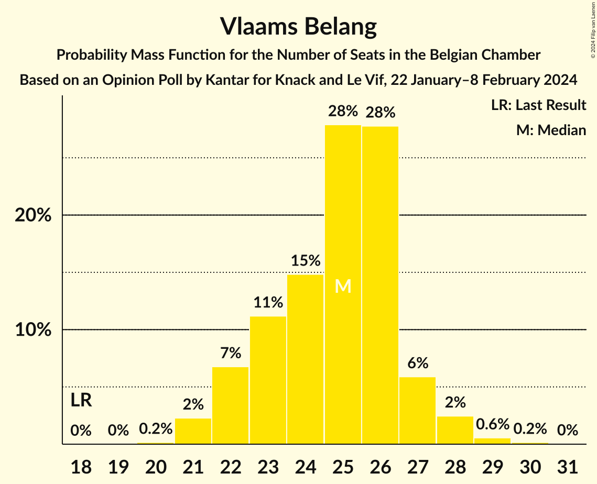

| Number of Seats | Probability | Accumulated | Special Marks |
|:---------------:|:-----------:|:-----------:|:-------------:|
| 18 | 0% | 100% | Last Result |
| 19 | 0% | 100% |  |
| 20 | 0.2% | 100% |  |
| 21 | 3% | 99.8% |  |
| 22 | 7% | 97% |  |
| 23 | 11% | 90% |  |
| 24 | 15% | 79% |  |
| 25 | 29% | 64% | Median |
| 26 | 25% | 35% |  |
| 27 | 6% | 9% |  |
| 28 | 2% | 3% |  |
| 29 | 0.6% | 0.8% |  |
| 30 | 0.2% | 0.2% |  |
| 31 | 0% | 0% |  |

### Nieuw-Vlaamse Alliantie

*For a full overview of the results for this party, see the [Nieuw-Vlaamse Alliantie](party-nieuw-vlaamsealliantie.html) page.*

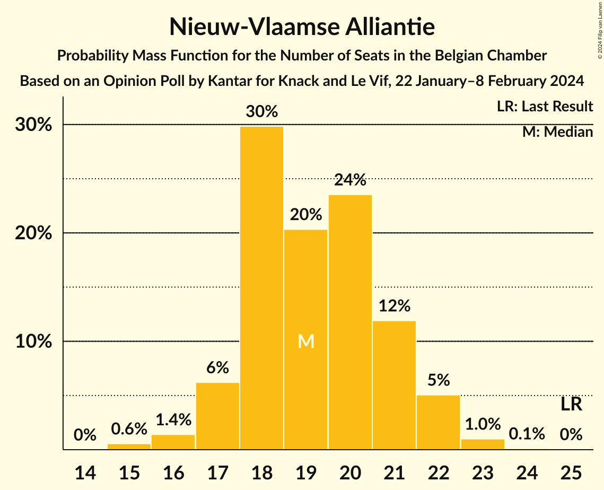

| Number of Seats | Probability | Accumulated | Special Marks |
|:---------------:|:-----------:|:-----------:|:-------------:|
| 15 | 0.5% | 100% |  |
| 16 | 1.3% | 99.5% |  |
| 17 | 5% | 98% |  |
| 18 | 28% | 93% |  |
| 19 | 22% | 65% | Median |
| 20 | 24% | 43% |  |
| 21 | 12% | 18% |  |
| 22 | 5% | 7% |  |
| 23 | 1.1% | 1.3% |  |
| 24 | 0.1% | 0.2% |  |
| 25 | 0% | 0% | Last Result |

### Vooruit

*For a full overview of the results for this party, see the [Vooruit](party-vooruit.html) page.*

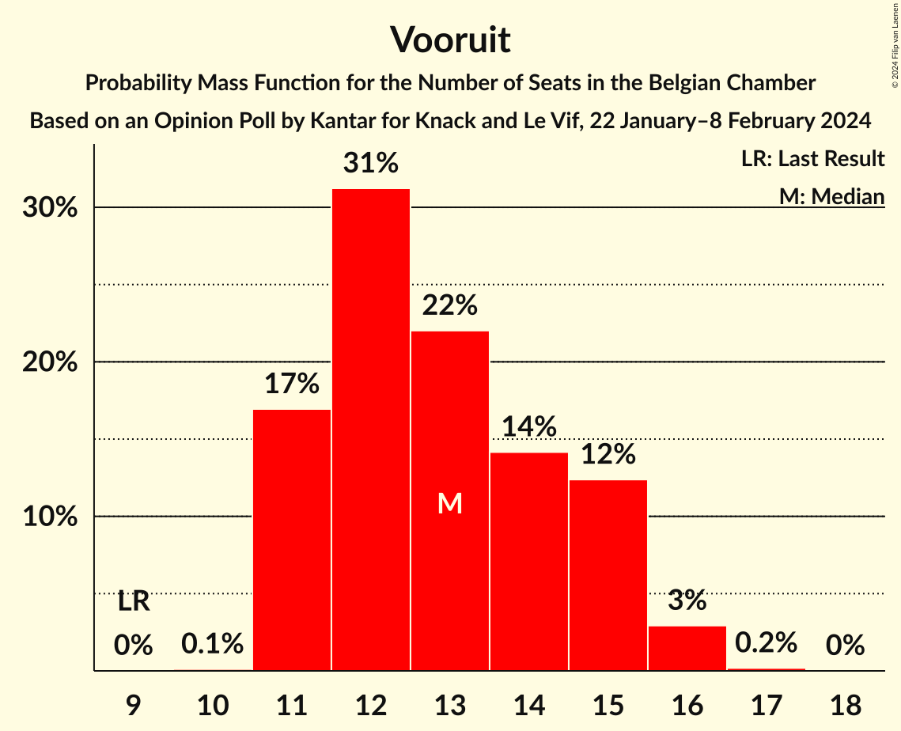

| Number of Seats | Probability | Accumulated | Special Marks |
|:---------------:|:-----------:|:-----------:|:-------------:|
| 9 | 0% | 100% | Last Result |
| 10 | 0.1% | 100% |  |
| 11 | 17% | 99.9% |  |
| 12 | 31% | 82% |  |
| 13 | 22% | 51% | Median |
| 14 | 14% | 29% |  |
| 15 | 12% | 15% |  |
| 16 | 3% | 3% |  |
| 17 | 0.2% | 0.2% |  |
| 18 | 0% | 0% |  |

### Parti Socialiste

*For a full overview of the results for this party, see the [Parti Socialiste](party-partisocialiste.html) page.*

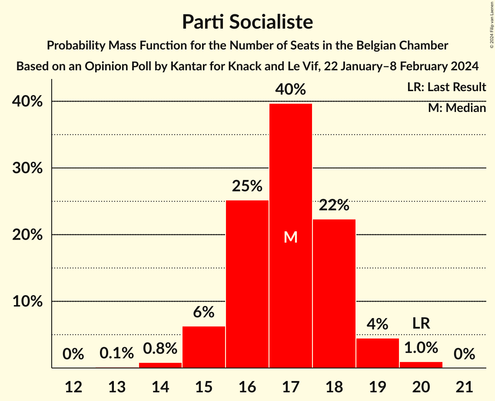

| Number of Seats | Probability | Accumulated | Special Marks |
|:---------------:|:-----------:|:-----------:|:-------------:|
| 13 | 0.2% | 100% |  |
| 14 | 1.0% | 99.8% |  |
| 15 | 8% | 98.8% |  |
| 16 | 27% | 91% |  |
| 17 | 38% | 64% | Median |
| 18 | 20% | 26% |  |
| 19 | 4% | 5% |  |
| 20 | 0.8% | 0.8% | Last Result |
| 21 | 0% | 0% |  |

### Mouvement Réformateur

*For a full overview of the results for this party, see the [Mouvement Réformateur](party-mouvementréformateur.html) page.*

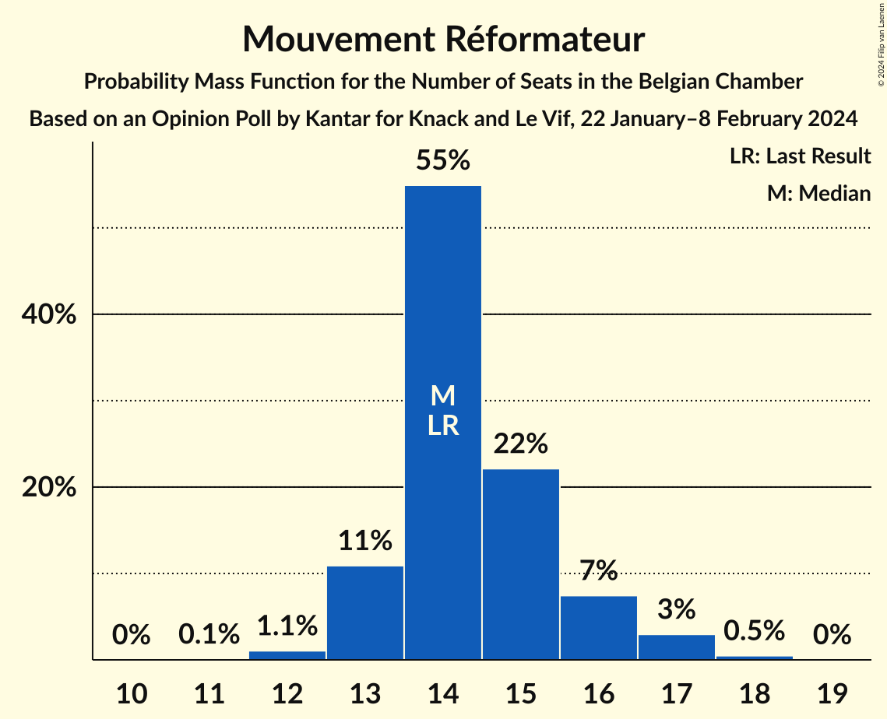

| Number of Seats | Probability | Accumulated | Special Marks |
|:---------------:|:-----------:|:-----------:|:-------------:|
| 11 | 0.1% | 100% |  |
| 12 | 1.1% | 99.9% |  |
| 13 | 12% | 98.8% |  |
| 14 | 58% | 87% | Last Result, Median |
| 15 | 18% | 28% |  |
| 16 | 7% | 10% |  |
| 17 | 3% | 3% |  |
| 18 | 0.3% | 0.4% |  |
| 19 | 0% | 0% |  |

### Parti du Travail de Belgique

*For a full overview of the results for this party, see the [Parti du Travail de Belgique](party-partidutravaildebelgique.html) page.*

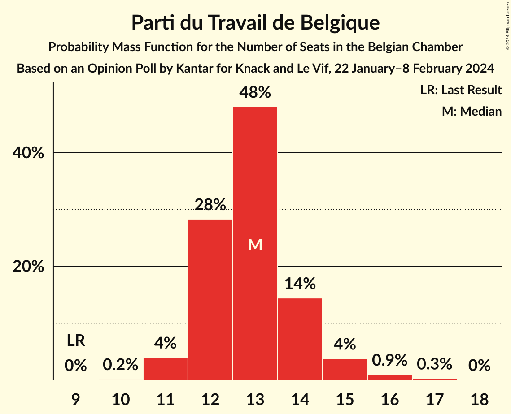

| Number of Seats | Probability | Accumulated | Special Marks |
|:---------------:|:-----------:|:-----------:|:-------------:|
| 9 | 0% | 100% | Last Result |
| 10 | 0.2% | 100% |  |
| 11 | 4% | 99.8% |  |
| 12 | 28% | 96% |  |
| 13 | 48% | 68% | Median |
| 14 | 14% | 19% |  |
| 15 | 4% | 5% |  |
| 16 | 0.9% | 1.2% |  |
| 17 | 0.3% | 0.3% |  |
| 18 | 0% | 0% |  |

### Partij van de Arbeid van België

*For a full overview of the results for this party, see the [Partij van de Arbeid van België](party-partijvandearbeidvanbelgië.html) page.*

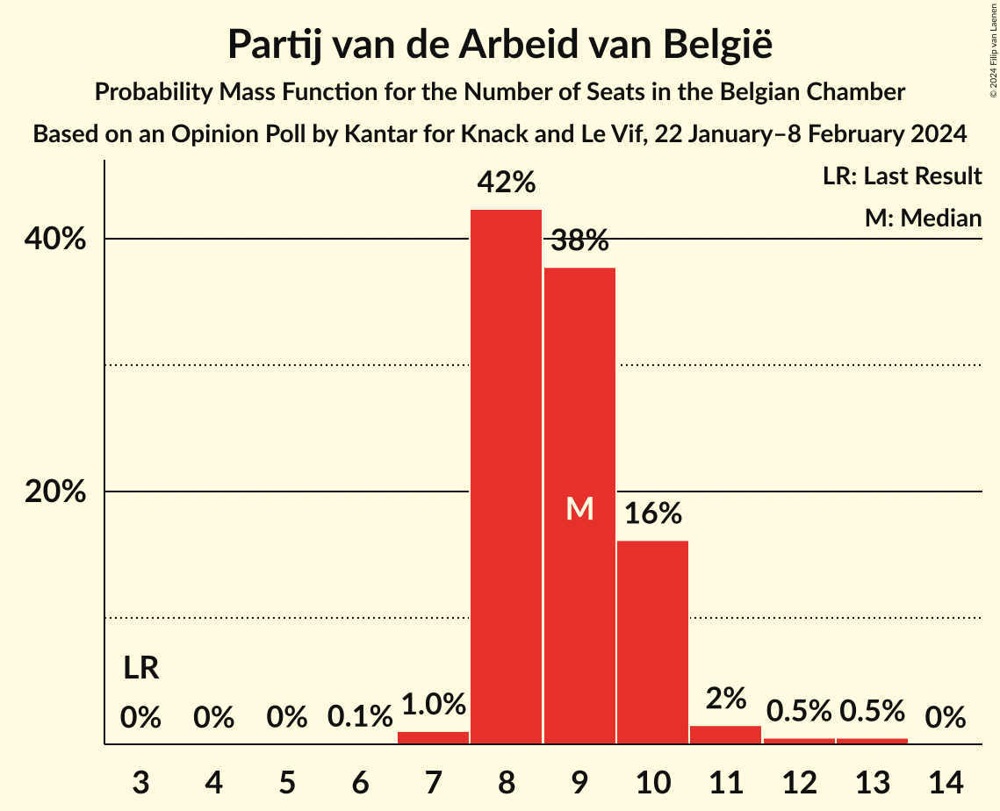

| Number of Seats | Probability | Accumulated | Special Marks |
|:---------------:|:-----------:|:-----------:|:-------------:|
| 3 | 0% | 100% | Last Result |
| 4 | 0% | 100% |  |
| 5 | 0% | 100% |  |
| 6 | 0.1% | 100% |  |
| 7 | 1.0% | 99.9% |  |
| 8 | 42% | 98.8% |  |
| 9 | 38% | 56% | Median |
| 10 | 16% | 19% |  |
| 11 | 2% | 3% |  |
| 12 | 0.5% | 1.0% |  |
| 13 | 0.5% | 0.5% |  |
| 14 | 0% | 0% |  |

### Christen-Democratisch en Vlaams

*For a full overview of the results for this party, see the [Christen-Democratisch en Vlaams](party-christen-democratischenvlaams.html) page.*

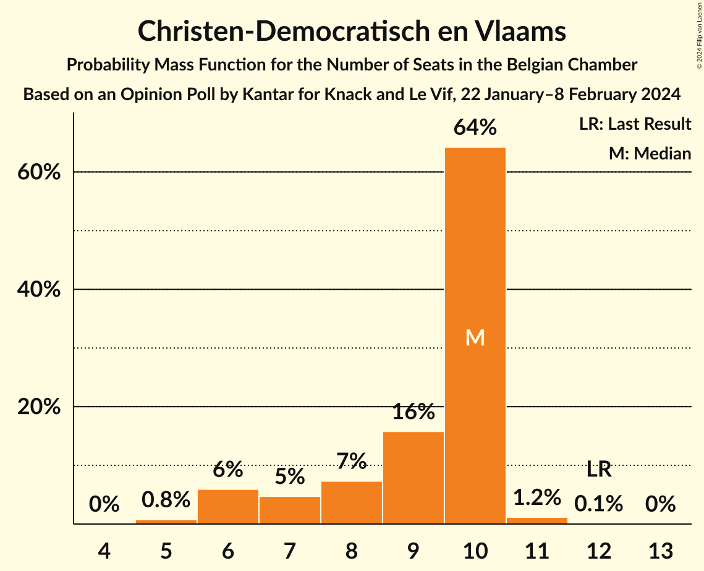

| Number of Seats | Probability | Accumulated | Special Marks |
|:---------------:|:-----------:|:-----------:|:-------------:|
| 5 | 0.8% | 100% |  |
| 6 | 6% | 99.2% |  |
| 7 | 5% | 93% |  |
| 8 | 8% | 88% |  |
| 9 | 17% | 80% |  |
| 10 | 62% | 64% | Median |
| 11 | 1.2% | 1.3% |  |
| 12 | 0.1% | 0.1% | Last Result |
| 13 | 0% | 0% |  |

### Ecolo

*For a full overview of the results for this party, see the [Ecolo](party-ecolo.html) page.*

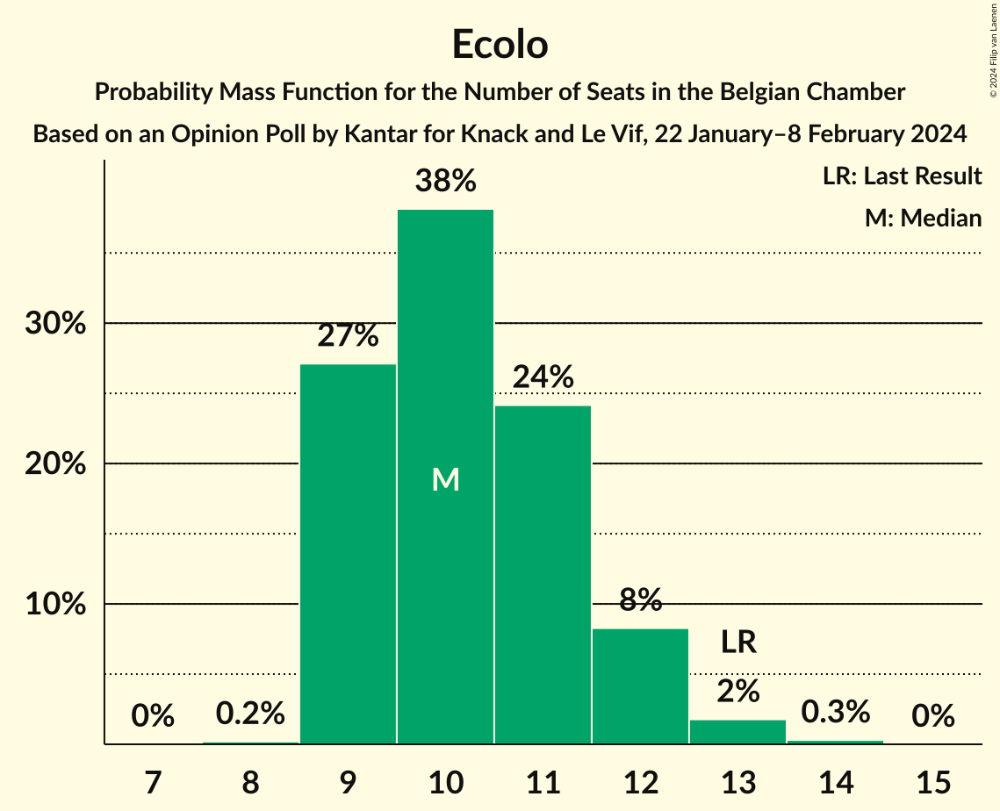

| Number of Seats | Probability | Accumulated | Special Marks |
|:---------------:|:-----------:|:-----------:|:-------------:|
| 8 | 0.2% | 100% |  |
| 9 | 27% | 99.8% |  |
| 10 | 38% | 73% | Median |
| 11 | 24% | 35% |  |
| 12 | 8% | 10% |  |
| 13 | 2% | 2% | Last Result |
| 14 | 0.3% | 0.3% |  |
| 15 | 0% | 0% |  |

### Groen

*For a full overview of the results for this party, see the [Groen](party-groen.html) page.*

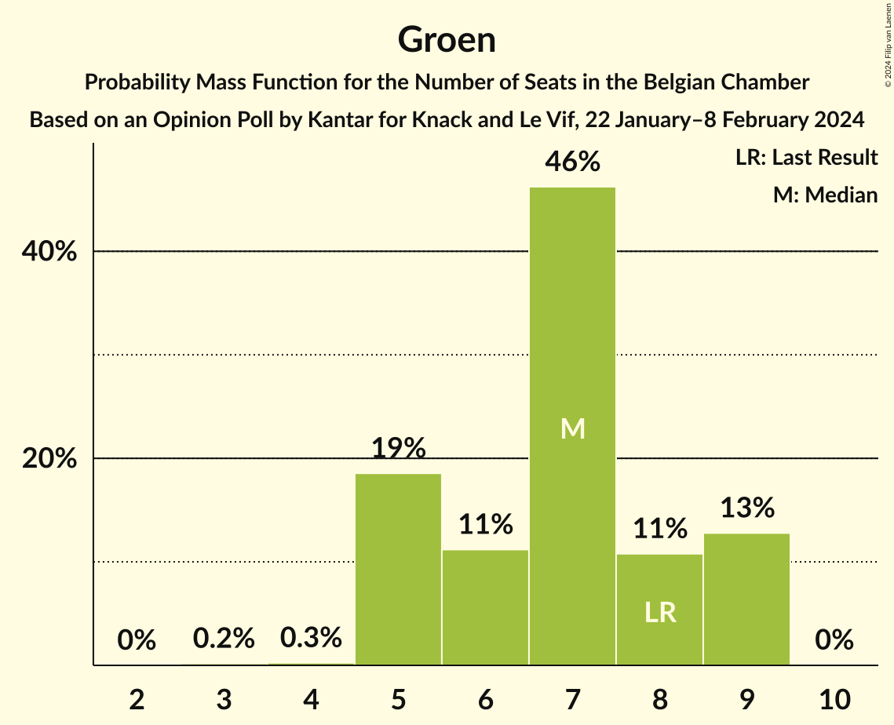

| Number of Seats | Probability | Accumulated | Special Marks |
|:---------------:|:-----------:|:-----------:|:-------------:|
| 3 | 0.2% | 100% |  |
| 4 | 0.2% | 99.8% |  |
| 5 | 19% | 99.6% |  |
| 6 | 11% | 81% |  |
| 7 | 45% | 70% | Median |
| 8 | 12% | 25% | Last Result |
| 9 | 13% | 13% |  |
| 10 | 0% | 0% |  |

### Open Vlaamse Liberalen en Democraten

*For a full overview of the results for this party, see the [Open Vlaamse Liberalen en Democraten](party-openvlaamseliberalenendemocraten.html) page.*

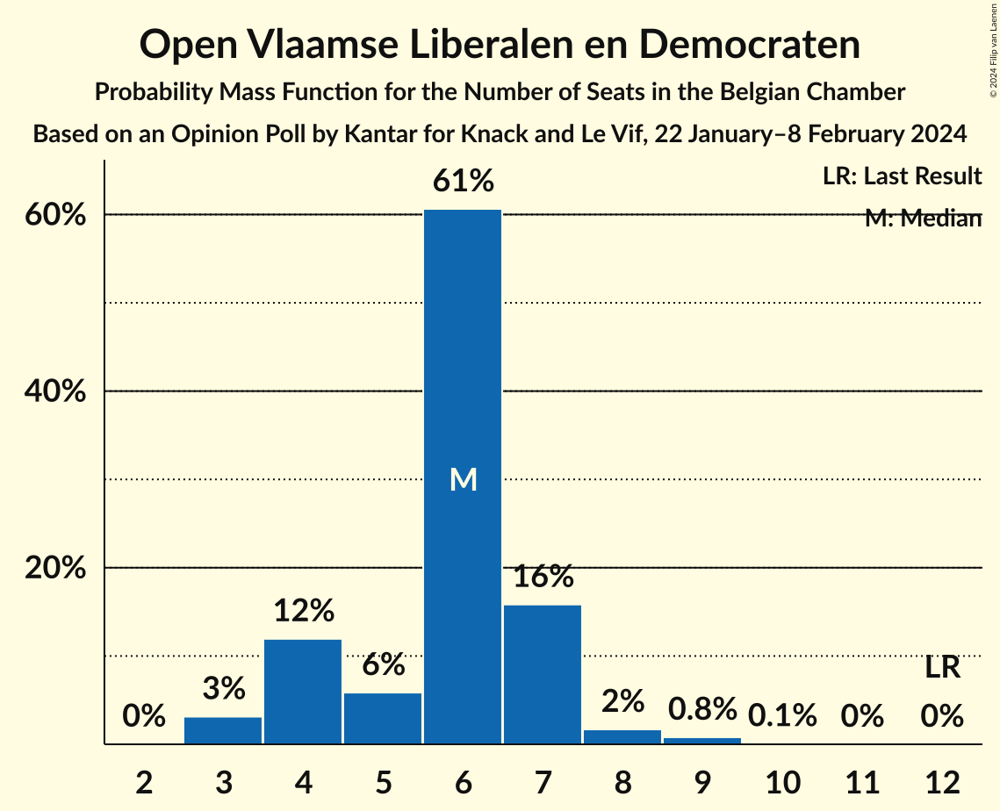

| Number of Seats | Probability | Accumulated | Special Marks |
|:---------------:|:-----------:|:-----------:|:-------------:|
| 3 | 3% | 100% |  |
| 4 | 12% | 97% |  |
| 5 | 6% | 85% |  |
| 6 | 61% | 80% | Median |
| 7 | 16% | 19% |  |
| 8 | 2% | 3% |  |
| 9 | 0.8% | 0.9% |  |
| 10 | 0.1% | 0.1% |  |
| 11 | 0% | 0% |  |
| 12 | 0% | 0% | Last Result |

### Les Engagés

*For a full overview of the results for this party, see the [Les Engagés](party-lesengagés.html) page.*

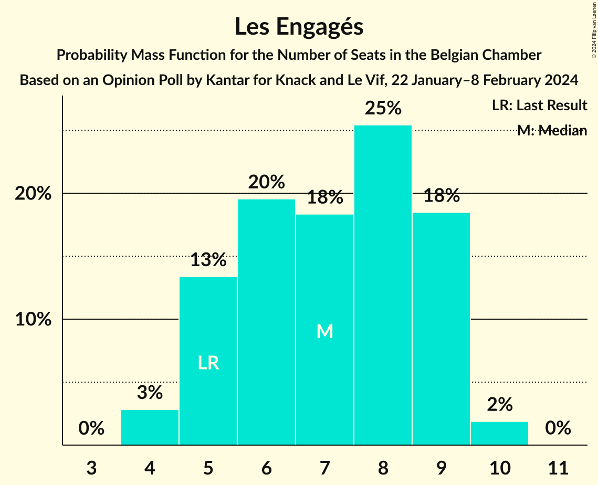

| Number of Seats | Probability | Accumulated | Special Marks |
|:---------------:|:-----------:|:-----------:|:-------------:|
| 4 | 3% | 100% |  |
| 5 | 13% | 97% | Last Result |
| 6 | 20% | 84% |  |
| 7 | 18% | 64% | Median |
| 8 | 25% | 46% |  |
| 9 | 18% | 20% |  |
| 10 | 2% | 2% |  |
| 11 | 0% | 0% |  |

### DéFI

*For a full overview of the results for this party, see the [DéFI](party-défi.html) page.*

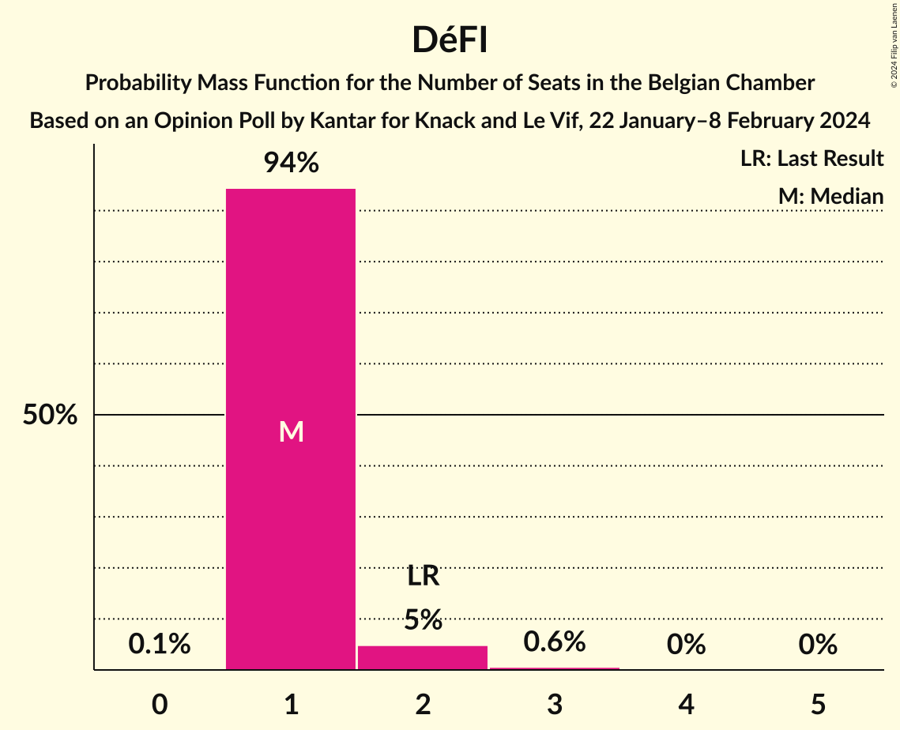

| Number of Seats | Probability | Accumulated | Special Marks |
|:---------------:|:-----------:|:-----------:|:-------------:|
| 0 | 0.2% | 100% |  |
| 1 | 93% | 99.8% | Median |
| 2 | 6% | 7% | Last Result |
| 3 | 0.6% | 0.6% |  |
| 4 | 0% | 0% |  |

## Coalitions

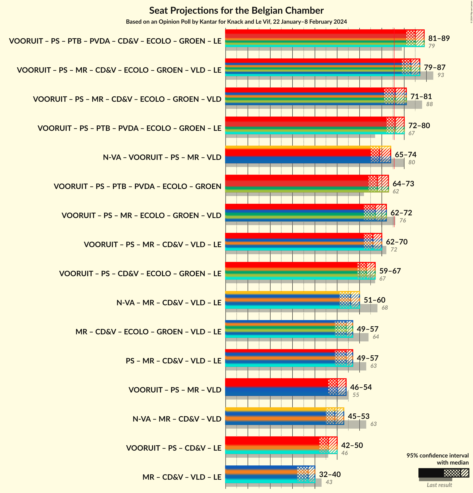

### Confidence Intervals

| Coalition | Last Result | Median | Majority? | 80% Confidence Interval | 90% Confidence Interval | 95% Confidence Interval | 99% Confidence Interval |
|:---------:|:-----------:|:------:|:---------:|:-----------------------:|:-----------------------:|:-----------------------:|:-----------------------:|
| Vooruit – Parti Socialiste – Parti du Travail de Belgique – Partij van de Arbeid van België – Christen-Democratisch en Vlaams – Ecolo – Groen – Les Engagés | 79 | 85 | 100% | 82–88 | 81–88 | 81–89 | 79–90 |
| Vooruit – Parti Socialiste – Mouvement Réformateur – Christen-Democratisch en Vlaams – Ecolo – Groen – Open Vlaamse Liberalen en Democraten – Les Engagés | 93 | 83 | 100% | 81–86 | 80–87 | 79–87 | 77–88 |
| Vooruit – Parti Socialiste – Mouvement Réformateur – Christen-Democratisch en Vlaams – Ecolo – Groen – Open Vlaamse Liberalen en Democraten | 88 | 76 | 60% | 73–79 | 72–80 | 71–81 | 70–82 |
| Vooruit – Parti Socialiste – Parti du Travail de Belgique – Partij van de Arbeid van België – Ecolo – Groen – Les Engagés | 67 | 76 | 50% | 73–78 | 72–79 | 72–80 | 70–81 |
| Nieuw-Vlaamse Alliantie – Vooruit – Parti Socialiste – Mouvement Réformateur – Open Vlaamse Liberalen en Democraten | 80 | 69 | 0.3% | 66–72 | 66–73 | 65–74 | 64–75 |
| Vooruit – Parti Socialiste – Parti du Travail de Belgique – Partij van de Arbeid van België – Ecolo – Groen | 62 | 68 | 0.2% | 65–71 | 65–72 | 64–73 | 63–75 |
| Vooruit – Parti Socialiste – Mouvement Réformateur – Ecolo – Groen – Open Vlaamse Liberalen en Democraten | 76 | 67 | 0% | 64–70 | 63–71 | 62–72 | 61–73 |
| Vooruit – Parti Socialiste – Mouvement Réformateur – Christen-Democratisch en Vlaams – Open Vlaamse Liberalen en Democraten – Les Engagés | 72 | 66 | 0% | 63–69 | 62–70 | 62–70 | 60–72 |
| Vooruit – Parti Socialiste – Christen-Democratisch en Vlaams – Ecolo – Groen – Les Engagés | 67 | 63 | 0% | 60–66 | 59–67 | 59–67 | 57–68 |
| Nieuw-Vlaamse Alliantie – Mouvement Réformateur – Christen-Democratisch en Vlaams – Open Vlaamse Liberalen en Democraten – Les Engagés | 68 | 56 | 0% | 53–59 | 52–59 | 51–60 | 49–61 |
| Mouvement Réformateur – Christen-Democratisch en Vlaams – Ecolo – Groen – Open Vlaamse Liberalen en Democraten – Les Engagés | 64 | 54 | 0% | 51–56 | 50–57 | 49–57 | 48–58 |
| Parti Socialiste – Mouvement Réformateur – Christen-Democratisch en Vlaams – Open Vlaamse Liberalen en Democraten – Les Engagés | 63 | 54 | 0% | 51–56 | 50–56 | 49–57 | 47–58 |
| Vooruit – Parti Socialiste – Mouvement Réformateur – Open Vlaamse Liberalen en Democraten | 55 | 50 | 0% | 47–53 | 46–53 | 46–54 | 44–55 |
| Nieuw-Vlaamse Alliantie – Mouvement Réformateur – Christen-Democratisch en Vlaams – Open Vlaamse Liberalen en Democraten | 63 | 49 | 0% | 46–51 | 45–52 | 45–53 | 43–54 |
| Vooruit – Parti Socialiste – Christen-Democratisch en Vlaams – Les Engagés | 46 | 46 | 0% | 43–49 | 42–50 | 42–50 | 40–51 |
| Mouvement Réformateur – Christen-Democratisch en Vlaams – Open Vlaamse Liberalen en Democraten – Les Engagés | 43 | 37 | 0% | 34–39 | 33–39 | 32–40 | 30–41 |

### Vooruit – Parti Socialiste – Parti du Travail de Belgique – Partij van de Arbeid van België – Christen-Democratisch en Vlaams – Ecolo – Groen – Les Engagés

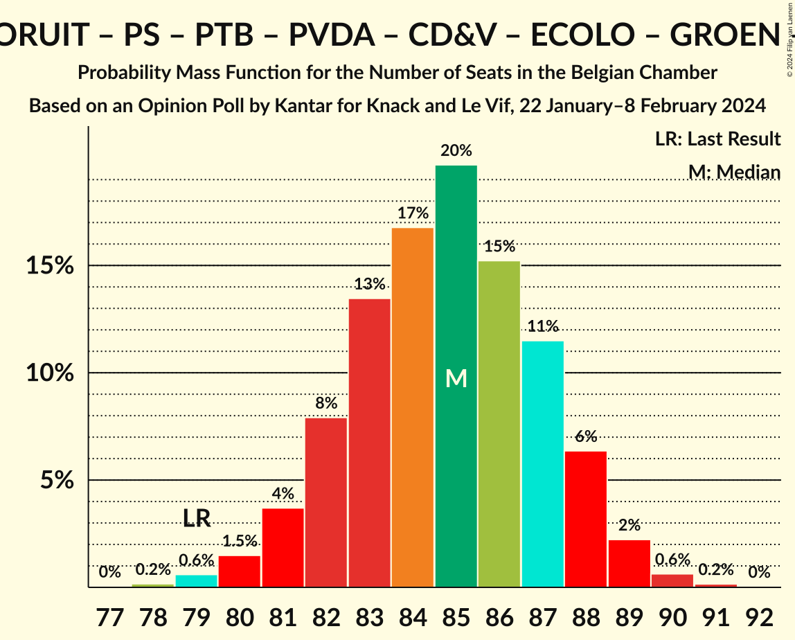

| Number of Seats | Probability | Accumulated | Special Marks |
|:---------------:|:-----------:|:-----------:|:-------------:|
| 77 | 0% | 100% |  |
| 78 | 0.2% | 99.9% |  |
| 79 | 0.6% | 99.8% | Last Result |
| 80 | 1.5% | 99.2% |  |
| 81 | 4% | 98% |  |
| 82 | 8% | 94% |  |
| 83 | 13% | 86% |  |
| 84 | 17% | 73% |  |
| 85 | 19% | 56% |  |
| 86 | 15% | 37% | Median |
| 87 | 11% | 21% |  |
| 88 | 7% | 10% |  |
| 89 | 3% | 4% |  |
| 90 | 0.7% | 0.9% |  |
| 91 | 0.2% | 0.2% |  |
| 92 | 0% | 0% |  |

### Vooruit – Parti Socialiste – Mouvement Réformateur – Christen-Democratisch en Vlaams – Ecolo – Groen – Open Vlaamse Liberalen en Democraten – Les Engagés

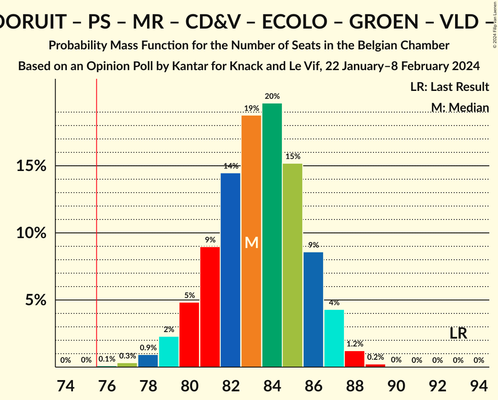

| Number of Seats | Probability | Accumulated | Special Marks |
|:---------------:|:-----------:|:-----------:|:-------------:|
| 76 | 0.1% | 100% | Majority |
| 77 | 0.4% | 99.9% |  |
| 78 | 1.0% | 99.5% |  |
| 79 | 2% | 98% |  |
| 80 | 5% | 96% |  |
| 81 | 10% | 91% |  |
| 82 | 16% | 81% |  |
| 83 | 19% | 65% |  |
| 84 | 18% | 46% | Median |
| 85 | 14% | 27% |  |
| 86 | 8% | 14% |  |
| 87 | 4% | 6% |  |
| 88 | 1.2% | 2% |  |
| 89 | 0.2% | 0.3% |  |
| 90 | 0% | 0% |  |
| 91 | 0% | 0% |  |
| 92 | 0% | 0% |  |
| 93 | 0% | 0% | Last Result |

### Vooruit – Parti Socialiste – Mouvement Réformateur – Christen-Democratisch en Vlaams – Ecolo – Groen – Open Vlaamse Liberalen en Democraten

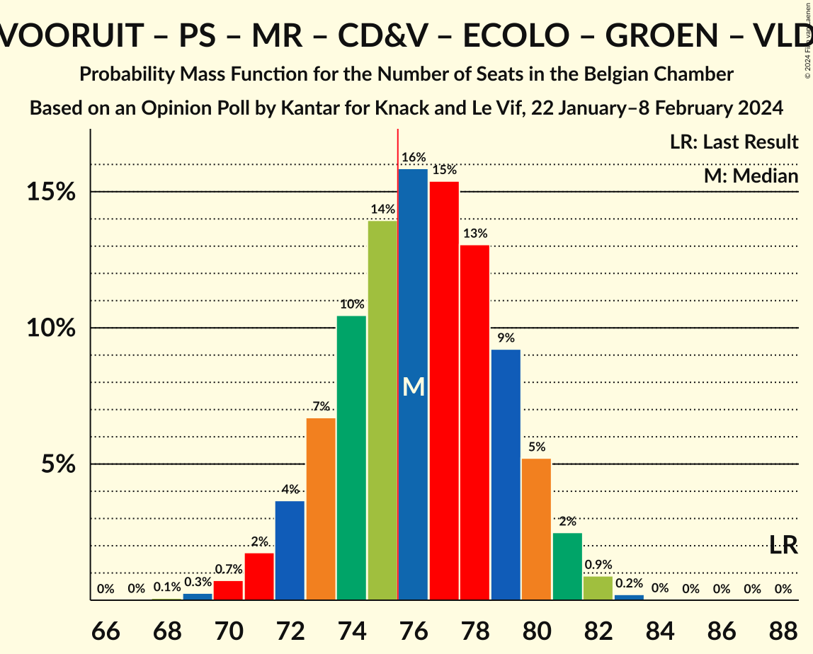

| Number of Seats | Probability | Accumulated | Special Marks |
|:---------------:|:-----------:|:-----------:|:-------------:|
| 68 | 0.1% | 100% |  |
| 69 | 0.3% | 99.9% |  |
| 70 | 0.8% | 99.6% |  |
| 71 | 2% | 98.9% |  |
| 72 | 4% | 97% |  |
| 73 | 7% | 93% |  |
| 74 | 11% | 86% |  |
| 75 | 14% | 74% |  |
| 76 | 16% | 60% | Majority |
| 77 | 15% | 44% | Median |
| 78 | 12% | 29% |  |
| 79 | 8% | 17% |  |
| 80 | 5% | 8% |  |
| 81 | 2% | 3% |  |
| 82 | 0.8% | 1.0% |  |
| 83 | 0.2% | 0.2% |  |
| 84 | 0% | 0% |  |
| 85 | 0% | 0% |  |
| 86 | 0% | 0% |  |
| 87 | 0% | 0% |  |
| 88 | 0% | 0% | Last Result |

### Vooruit – Parti Socialiste – Parti du Travail de Belgique – Partij van de Arbeid van België – Ecolo – Groen – Les Engagés

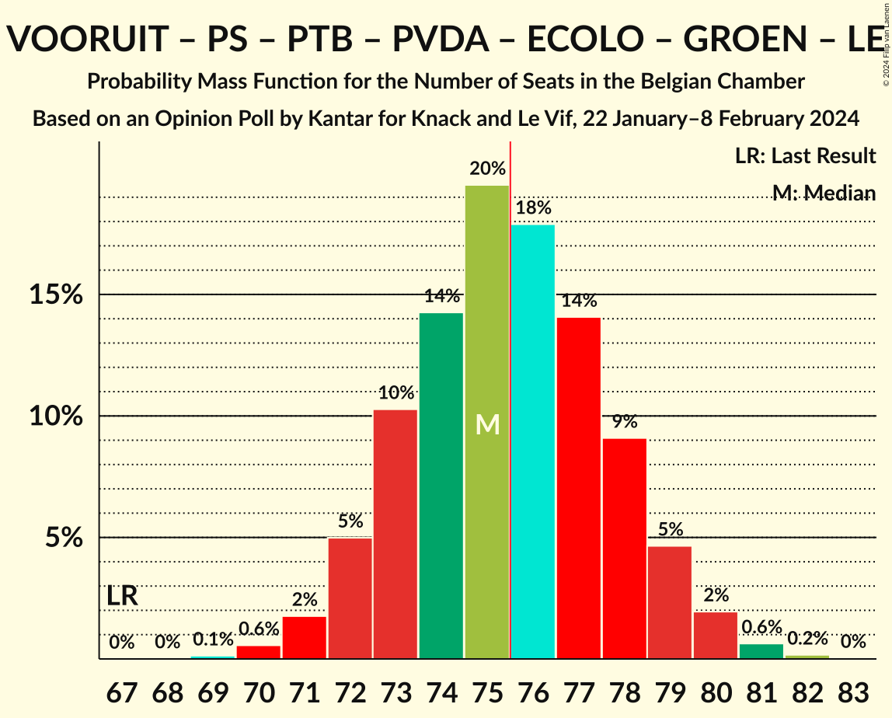

| Number of Seats | Probability | Accumulated | Special Marks |
|:---------------:|:-----------:|:-----------:|:-------------:|
| 67 | 0% | 100% | Last Result |
| 68 | 0% | 100% |  |
| 69 | 0.1% | 100% |  |
| 70 | 0.5% | 99.9% |  |
| 71 | 2% | 99.3% |  |
| 72 | 5% | 98% |  |
| 73 | 10% | 93% |  |
| 74 | 15% | 83% |  |
| 75 | 18% | 68% |  |
| 76 | 18% | 50% | Median, Majority |
| 77 | 14% | 32% |  |
| 78 | 10% | 18% |  |
| 79 | 5% | 8% |  |
| 80 | 2% | 3% |  |
| 81 | 0.7% | 1.0% |  |
| 82 | 0.2% | 0.3% |  |
| 83 | 0% | 0.1% |  |
| 84 | 0% | 0% |  |

### Nieuw-Vlaamse Alliantie – Vooruit – Parti Socialiste – Mouvement Réformateur – Open Vlaamse Liberalen en Democraten

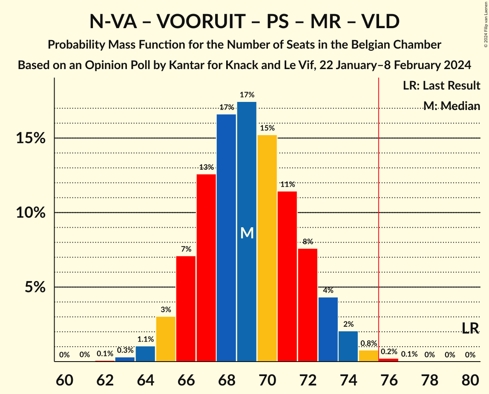

| Number of Seats | Probability | Accumulated | Special Marks |
|:---------------:|:-----------:|:-----------:|:-------------:|
| 62 | 0.1% | 100% |  |
| 63 | 0.3% | 99.9% |  |
| 64 | 1.2% | 99.5% |  |
| 65 | 3% | 98% |  |
| 66 | 8% | 95% |  |
| 67 | 13% | 87% |  |
| 68 | 17% | 74% |  |
| 69 | 17% | 57% | Median |
| 70 | 15% | 40% |  |
| 71 | 11% | 25% |  |
| 72 | 7% | 14% |  |
| 73 | 4% | 7% |  |
| 74 | 2% | 3% |  |
| 75 | 0.8% | 1.1% |  |
| 76 | 0.2% | 0.3% | Majority |
| 77 | 0.1% | 0.1% |  |
| 78 | 0% | 0% |  |
| 79 | 0% | 0% |  |
| 80 | 0% | 0% | Last Result |

### Vooruit – Parti Socialiste – Parti du Travail de Belgique – Partij van de Arbeid van België – Ecolo – Groen

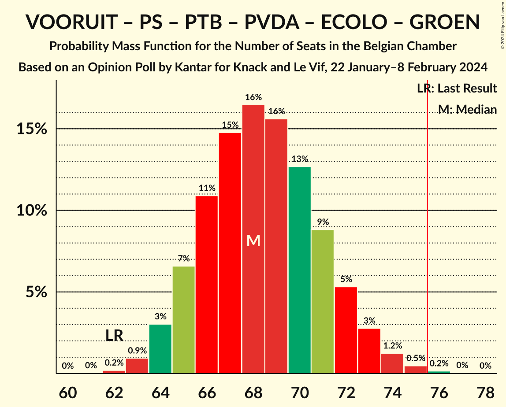

| Number of Seats | Probability | Accumulated | Special Marks |
|:---------------:|:-----------:|:-----------:|:-------------:|
| 62 | 0.2% | 100% | Last Result |
| 63 | 0.9% | 99.8% |  |
| 64 | 3% | 98.8% |  |
| 65 | 7% | 96% |  |
| 66 | 11% | 89% |  |
| 67 | 15% | 78% |  |
| 68 | 16% | 64% |  |
| 69 | 16% | 47% | Median |
| 70 | 13% | 31% |  |
| 71 | 9% | 19% |  |
| 72 | 5% | 10% |  |
| 73 | 3% | 5% |  |
| 74 | 1.2% | 2% |  |
| 75 | 0.5% | 0.7% |  |
| 76 | 0.2% | 0.2% | Majority |
| 77 | 0% | 0.1% |  |
| 78 | 0% | 0% |  |

### Vooruit – Parti Socialiste – Mouvement Réformateur – Ecolo – Groen – Open Vlaamse Liberalen en Democraten

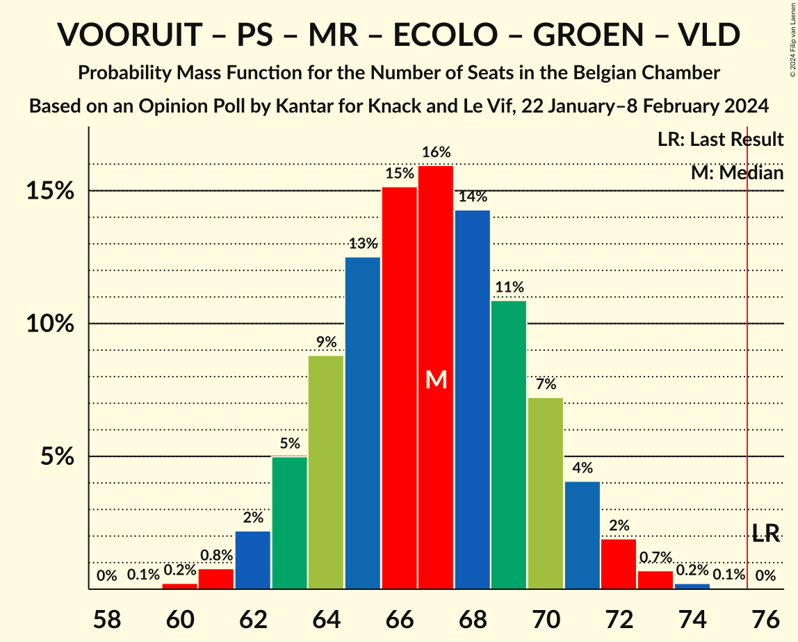

| Number of Seats | Probability | Accumulated | Special Marks |
|:---------------:|:-----------:|:-----------:|:-------------:|
| 59 | 0.1% | 100% |  |
| 60 | 0.2% | 99.9% |  |
| 61 | 0.8% | 99.7% |  |
| 62 | 2% | 98.9% |  |
| 63 | 5% | 97% |  |
| 64 | 9% | 92% |  |
| 65 | 13% | 83% |  |
| 66 | 15% | 70% |  |
| 67 | 16% | 55% | Median |
| 68 | 14% | 39% |  |
| 69 | 11% | 25% |  |
| 70 | 7% | 14% |  |
| 71 | 4% | 7% |  |
| 72 | 2% | 3% |  |
| 73 | 0.7% | 1.0% |  |
| 74 | 0.2% | 0.3% |  |
| 75 | 0.1% | 0.1% |  |
| 76 | 0% | 0% | Last Result, Majority |

### Vooruit – Parti Socialiste – Mouvement Réformateur – Christen-Democratisch en Vlaams – Open Vlaamse Liberalen en Democraten – Les Engagés

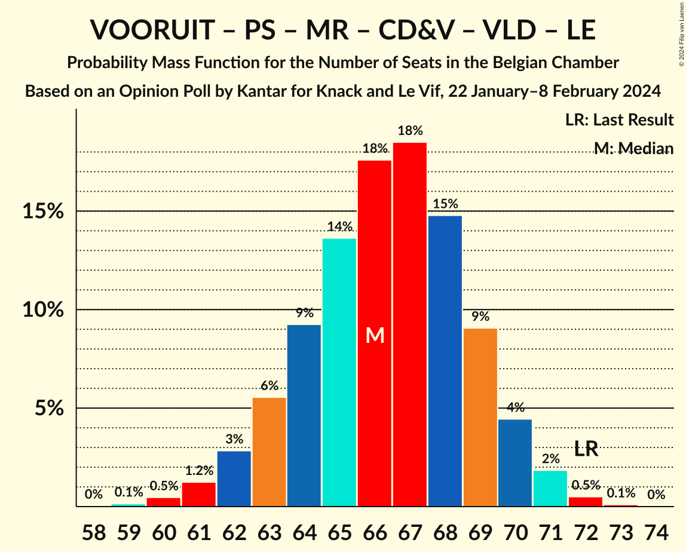

| Number of Seats | Probability | Accumulated | Special Marks |
|:---------------:|:-----------:|:-----------:|:-------------:|
| 58 | 0% | 100% |  |
| 59 | 0.2% | 99.9% |  |
| 60 | 0.6% | 99.8% |  |
| 61 | 1.5% | 99.2% |  |
| 62 | 3% | 98% |  |
| 63 | 6% | 94% |  |
| 64 | 10% | 88% |  |
| 65 | 15% | 78% |  |
| 66 | 18% | 63% |  |
| 67 | 18% | 46% | Median |
| 68 | 14% | 28% |  |
| 69 | 8% | 14% |  |
| 70 | 4% | 6% |  |
| 71 | 2% | 2% |  |
| 72 | 0.5% | 0.6% | Last Result |
| 73 | 0.1% | 0.1% |  |
| 74 | 0% | 0% |  |

### Vooruit – Parti Socialiste – Christen-Democratisch en Vlaams – Ecolo – Groen – Les Engagés

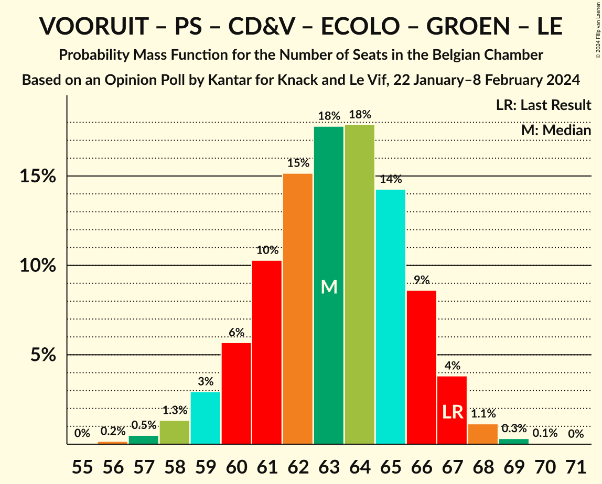

| Number of Seats | Probability | Accumulated | Special Marks |
|:---------------:|:-----------:|:-----------:|:-------------:|
| 55 | 0.1% | 100% |  |
| 56 | 0.2% | 99.9% |  |
| 57 | 0.5% | 99.8% |  |
| 58 | 1.4% | 99.2% |  |
| 59 | 3% | 98% |  |
| 60 | 6% | 95% |  |
| 61 | 11% | 89% |  |
| 62 | 16% | 78% |  |
| 63 | 18% | 62% |  |
| 64 | 17% | 44% | Median |
| 65 | 13% | 27% |  |
| 66 | 8% | 14% |  |
| 67 | 4% | 5% | Last Result |
| 68 | 1.2% | 2% |  |
| 69 | 0.3% | 0.4% |  |
| 70 | 0.1% | 0.1% |  |
| 71 | 0% | 0% |  |

### Nieuw-Vlaamse Alliantie – Mouvement Réformateur – Christen-Democratisch en Vlaams – Open Vlaamse Liberalen en Democraten – Les Engagés

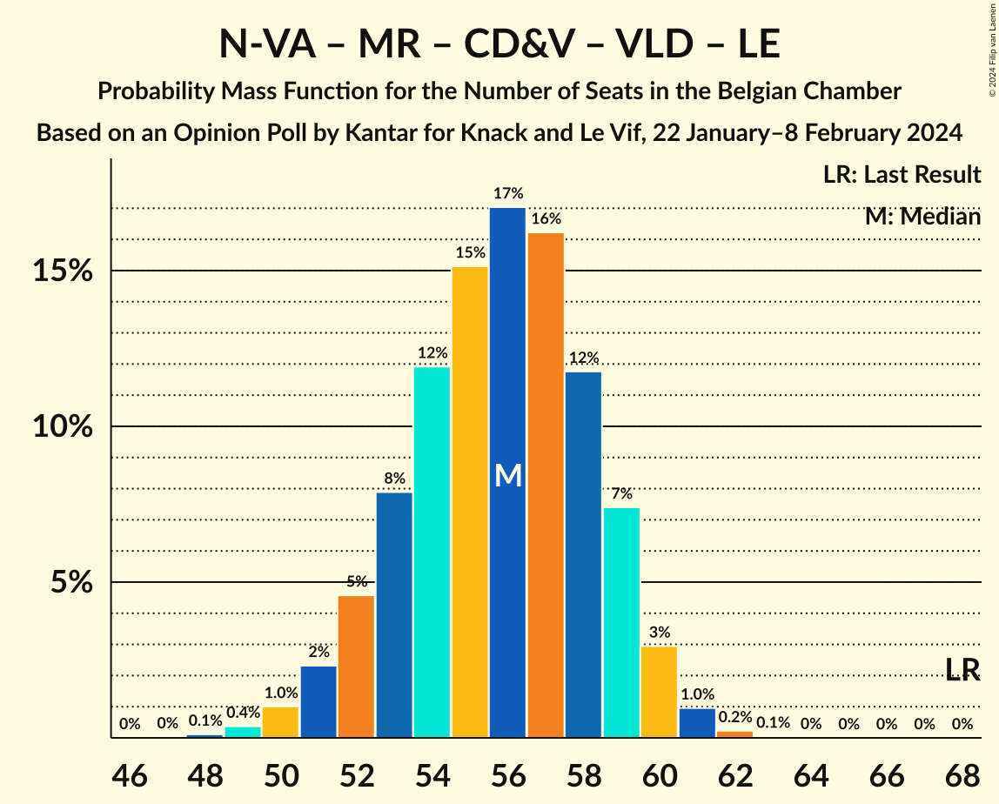

| Number of Seats | Probability | Accumulated | Special Marks |
|:---------------:|:-----------:|:-----------:|:-------------:|
| 48 | 0.1% | 100% |  |
| 49 | 0.4% | 99.8% |  |
| 50 | 1.0% | 99.5% |  |
| 51 | 2% | 98% |  |
| 52 | 5% | 96% |  |
| 53 | 8% | 91% |  |
| 54 | 12% | 83% |  |
| 55 | 15% | 71% |  |
| 56 | 17% | 56% | Median |
| 57 | 16% | 39% |  |
| 58 | 12% | 23% |  |
| 59 | 7% | 12% |  |
| 60 | 3% | 4% |  |
| 61 | 1.0% | 1.4% |  |
| 62 | 0.2% | 0.3% |  |
| 63 | 0.1% | 0.1% |  |
| 64 | 0% | 0% |  |
| 65 | 0% | 0% |  |
| 66 | 0% | 0% |  |
| 67 | 0% | 0% |  |
| 68 | 0% | 0% | Last Result |

### Mouvement Réformateur – Christen-Democratisch en Vlaams – Ecolo – Groen – Open Vlaamse Liberalen en Democraten – Les Engagés

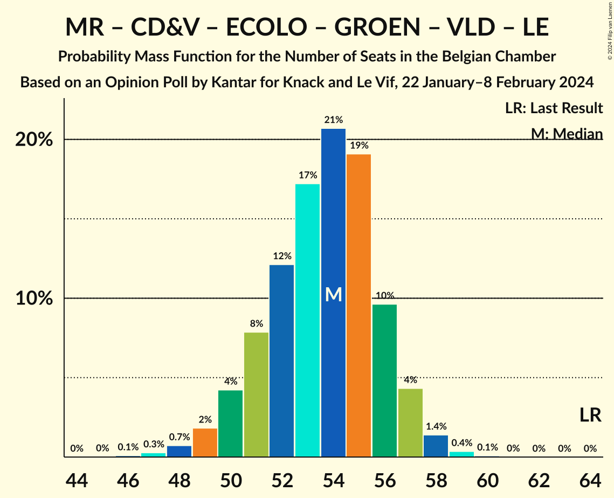

| Number of Seats | Probability | Accumulated | Special Marks |
|:---------------:|:-----------:|:-----------:|:-------------:|
| 46 | 0.1% | 100% |  |
| 47 | 0.3% | 99.9% |  |
| 48 | 0.8% | 99.6% |  |
| 49 | 2% | 98.8% |  |
| 50 | 4% | 97% |  |
| 51 | 8% | 93% |  |
| 52 | 12% | 85% |  |
| 53 | 17% | 72% |  |
| 54 | 20% | 55% | Median |
| 55 | 19% | 34% |  |
| 56 | 10% | 16% |  |
| 57 | 4% | 6% |  |
| 58 | 1.4% | 2% |  |
| 59 | 0.4% | 0.5% |  |
| 60 | 0.1% | 0.1% |  |
| 61 | 0% | 0% |  |
| 62 | 0% | 0% |  |
| 63 | 0% | 0% |  |
| 64 | 0% | 0% | Last Result |

### Parti Socialiste – Mouvement Réformateur – Christen-Democratisch en Vlaams – Open Vlaamse Liberalen en Democraten – Les Engagés

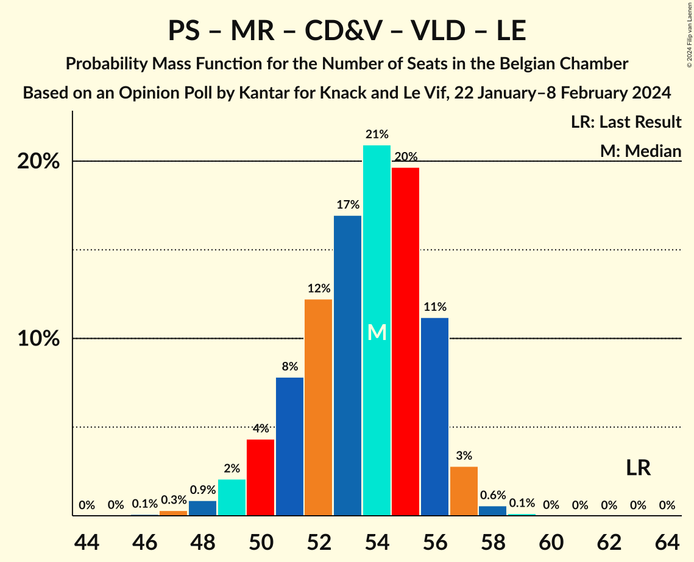

| Number of Seats | Probability | Accumulated | Special Marks |
|:---------------:|:-----------:|:-----------:|:-------------:|
| 46 | 0.1% | 100% |  |
| 47 | 0.4% | 99.9% |  |
| 48 | 1.0% | 99.5% |  |
| 49 | 2% | 98% |  |
| 50 | 5% | 96% |  |
| 51 | 9% | 91% |  |
| 52 | 13% | 82% |  |
| 53 | 18% | 69% |  |
| 54 | 21% | 52% | Median |
| 55 | 18% | 31% |  |
| 56 | 10% | 13% |  |
| 57 | 2% | 3% |  |
| 58 | 0.5% | 0.6% |  |
| 59 | 0.1% | 0.1% |  |
| 60 | 0% | 0% |  |
| 61 | 0% | 0% |  |
| 62 | 0% | 0% |  |
| 63 | 0% | 0% | Last Result |

### Vooruit – Parti Socialiste – Mouvement Réformateur – Open Vlaamse Liberalen en Democraten

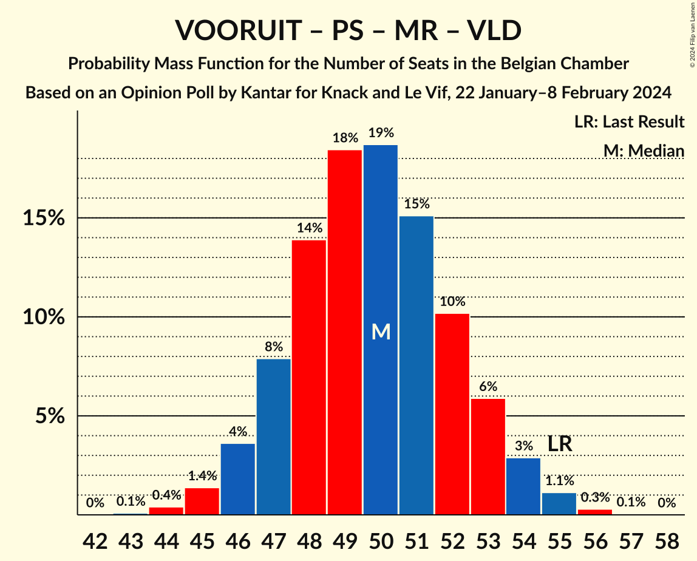

| Number of Seats | Probability | Accumulated | Special Marks |
|:---------------:|:-----------:|:-----------:|:-------------:|
| 43 | 0.1% | 100% |  |
| 44 | 0.4% | 99.9% |  |
| 45 | 1.4% | 99.5% |  |
| 46 | 4% | 98% |  |
| 47 | 8% | 94% |  |
| 48 | 14% | 87% |  |
| 49 | 18% | 73% |  |
| 50 | 19% | 54% | Median |
| 51 | 15% | 36% |  |
| 52 | 10% | 20% |  |
| 53 | 6% | 10% |  |
| 54 | 3% | 4% |  |
| 55 | 1.1% | 1.5% | Last Result |
| 56 | 0.3% | 0.4% |  |
| 57 | 0.1% | 0.1% |  |
| 58 | 0% | 0% |  |

### Nieuw-Vlaamse Alliantie – Mouvement Réformateur – Christen-Democratisch en Vlaams – Open Vlaamse Liberalen en Democraten

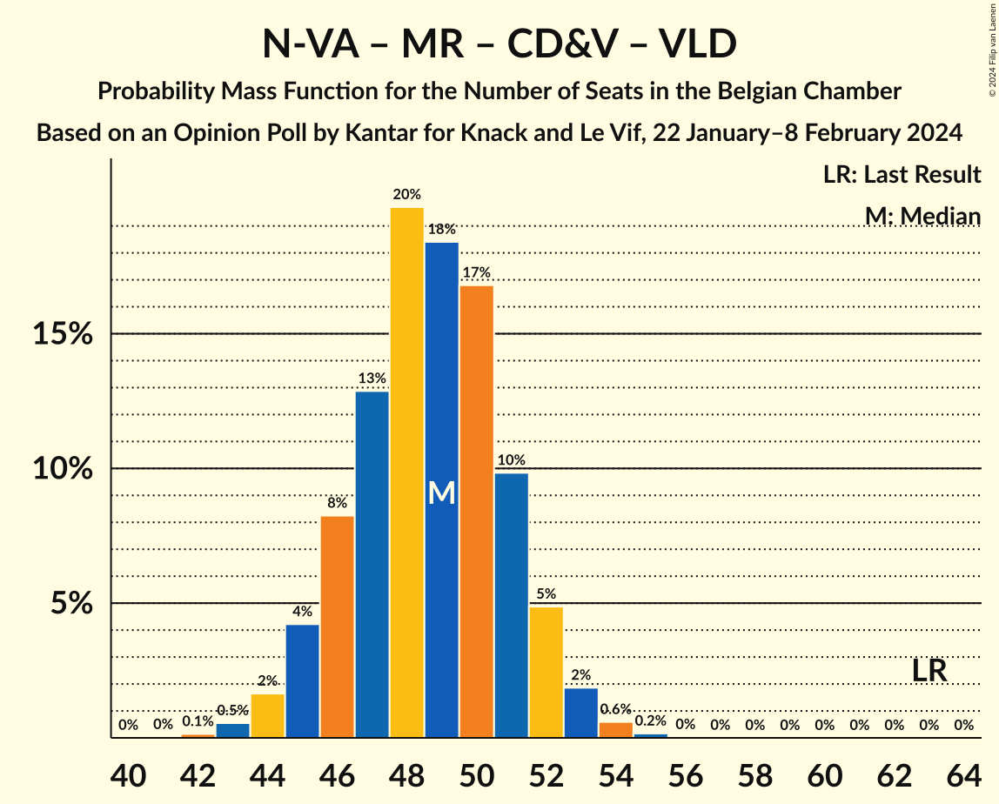

| Number of Seats | Probability | Accumulated | Special Marks |
|:---------------:|:-----------:|:-----------:|:-------------:|
| 42 | 0.1% | 100% |  |
| 43 | 0.5% | 99.8% |  |
| 44 | 2% | 99.3% |  |
| 45 | 4% | 98% |  |
| 46 | 8% | 93% |  |
| 47 | 13% | 85% |  |
| 48 | 20% | 72% |  |
| 49 | 18% | 53% | Median |
| 50 | 17% | 34% |  |
| 51 | 10% | 17% |  |
| 52 | 5% | 8% |  |
| 53 | 2% | 3% |  |
| 54 | 0.6% | 0.8% |  |
| 55 | 0.2% | 0.2% |  |
| 56 | 0% | 0% |  |
| 57 | 0% | 0% |  |
| 58 | 0% | 0% |  |
| 59 | 0% | 0% |  |
| 60 | 0% | 0% |  |
| 61 | 0% | 0% |  |
| 62 | 0% | 0% |  |
| 63 | 0% | 0% | Last Result |

### Vooruit – Parti Socialiste – Christen-Democratisch en Vlaams – Les Engagés

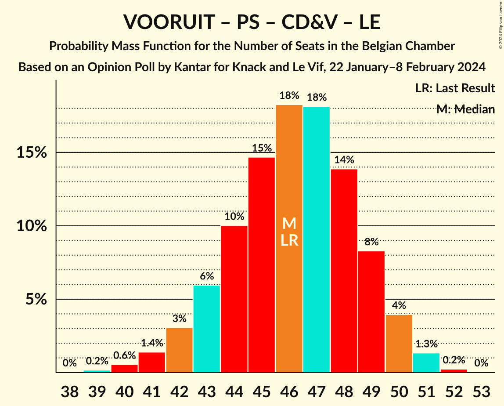

| Number of Seats | Probability | Accumulated | Special Marks |
|:---------------:|:-----------:|:-----------:|:-------------:|
| 38 | 0% | 100% |  |
| 39 | 0.2% | 99.9% |  |
| 40 | 0.6% | 99.7% |  |
| 41 | 2% | 99.1% |  |
| 42 | 3% | 98% |  |
| 43 | 7% | 94% |  |
| 44 | 11% | 88% |  |
| 45 | 15% | 77% |  |
| 46 | 18% | 61% | Last Result |
| 47 | 17% | 43% | Median |
| 48 | 13% | 26% |  |
| 49 | 8% | 13% |  |
| 50 | 4% | 5% |  |
| 51 | 1.3% | 2% |  |
| 52 | 0.2% | 0.3% |  |
| 53 | 0% | 0% |  |

### Mouvement Réformateur – Christen-Democratisch en Vlaams – Open Vlaamse Liberalen en Democraten – Les Engagés

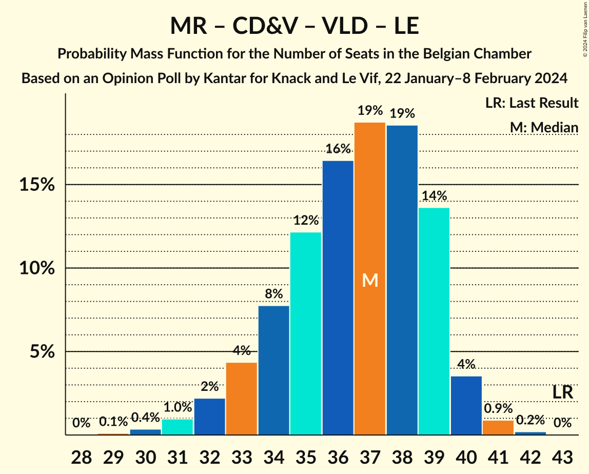

| Number of Seats | Probability | Accumulated | Special Marks |
|:---------------:|:-----------:|:-----------:|:-------------:|
| 29 | 0.1% | 100% |  |
| 30 | 0.4% | 99.8% |  |
| 31 | 1.1% | 99.5% |  |
| 32 | 2% | 98% |  |
| 33 | 5% | 96% |  |
| 34 | 8% | 91% |  |
| 35 | 13% | 83% |  |
| 36 | 17% | 71% |  |
| 37 | 19% | 54% | Median |
| 38 | 18% | 35% |  |
| 39 | 13% | 17% |  |
| 40 | 3% | 4% |  |
| 41 | 0.8% | 1.1% |  |
| 42 | 0.2% | 0.2% |  |
| 43 | 0% | 0% | Last Result |

## Technical Information

### Opinion Poll

+ **Polling firm:** Kantar
+ **Commissioner(s):** Knack and Le Vif
+ **Fieldwork period:** 22 January–8 February 2024

### Calculations

+ **Sample size:** 1741
+ **Simulations done:** 2,097,152
+ **Error estimate:** 0.69%

