# Opinion Poll by Ipsos for Het Laatste Nieuws, Le Soir, RTL TVi and VTM, 11–18 March 2024

Areas included: Brussels, Flanders, Wallonia

<a href="#voting-intentions">Voting Intentions</a> | <a href="#seats">Seats</a> | <a href="#coalitions">Coalitions</a> | <a href="#technical-information">Technical Information</a>

## Voting Intentions

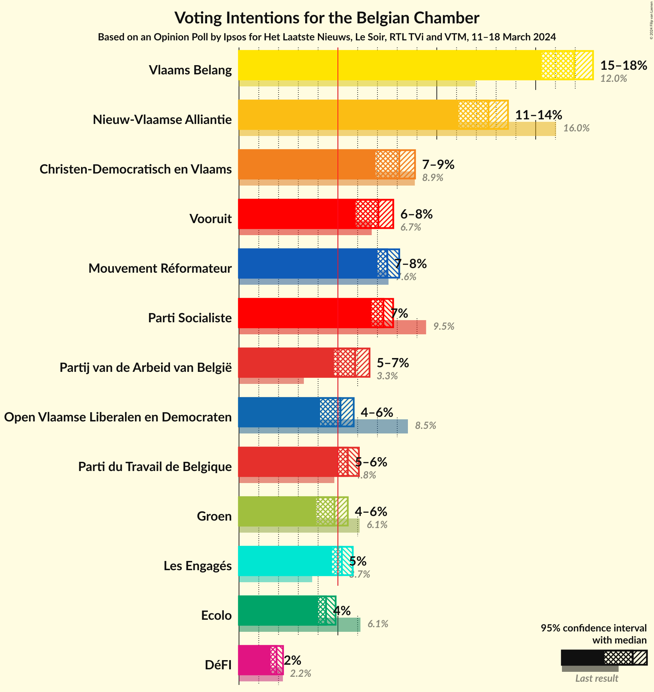

### Confidence Intervals

| Party | Last Result | Poll Result | 80% Confidence Interval | 90% Confidence Interval | 95% Confidence Interval | 99% Confidence Interval |
|:-----:|:-----------:|:-----------:|:-----------------------:|:-----------------------:|:-----------------------:|:-----------------------:|
| Vlaams Belang | 12.0% | 16.9% | 15.8–17.7% |15.5–17.9% |15.3–17.9% |14.8–18.0% |
| Nieuw-Vlaamse Alliantie | 16.0% | 12.6% | 11.6–13.3% |11.3–13.5% |11.1–13.6% |10.7–13.6% |
| Christen-Democratisch en Vlaams | 8.9% | 8.1% | 7.3–8.7% |7.1–8.8% |6.9–8.9% |6.5–9.0% |
| Mouvement Réformateur | 7.6% | 8.1% | 7.2–7.5% |7.1–7.5% |7.0–7.5% |6.8–7.5% |
| Parti Socialiste | 9.5% | 7.8% | 6.9–7.2% |6.8–7.3% |6.7–7.3% |6.5–7.3% |
| Vooruit | 6.7% | 7.1% | 6.3–7.6% |6.1–7.8% |5.9–7.8% |5.6–7.9% |
| Parti du Travail de Belgique | 4.8% | 6.1% | 5.2–5.5% |5.1–5.5% |5.0–5.5% |4.9–5.5% |
| Partij van de Arbeid van België | 3.3% | 5.9% | 5.2–6.4% |5.0–6.5% |4.8–6.6% |4.5–6.7% |
| Les Engagés | 3.7% | 5.8% | 4.9–5.2% |4.8–5.2% |4.7–5.2% |4.6–5.2% |
| Open Vlaamse Liberalen en Democraten | 8.5% | 5.1% | 4.5–5.6% |4.3–5.7% |4.1–5.8% |3.9–5.8% |
| Ecolo | 6.1% | 4.9% | 4.1–4.4% |4.0–4.4% |4.0–4.4% |3.8–4.4% |
| Groen | 6.1% | 4.8% | 4.2–5.3% |4.0–5.4% |3.9–5.5% |3.6–5.5% |
| DéFI | 2.2% | 2.2% | 1.7–1.9% |1.7–1.9% |1.6–1.9% |1.5–1.9% |

*Note:* The poll result column reflects the actual value used in the calculations. Published results may vary slightly, and in addition be rounded to fewer digits.

## Seats

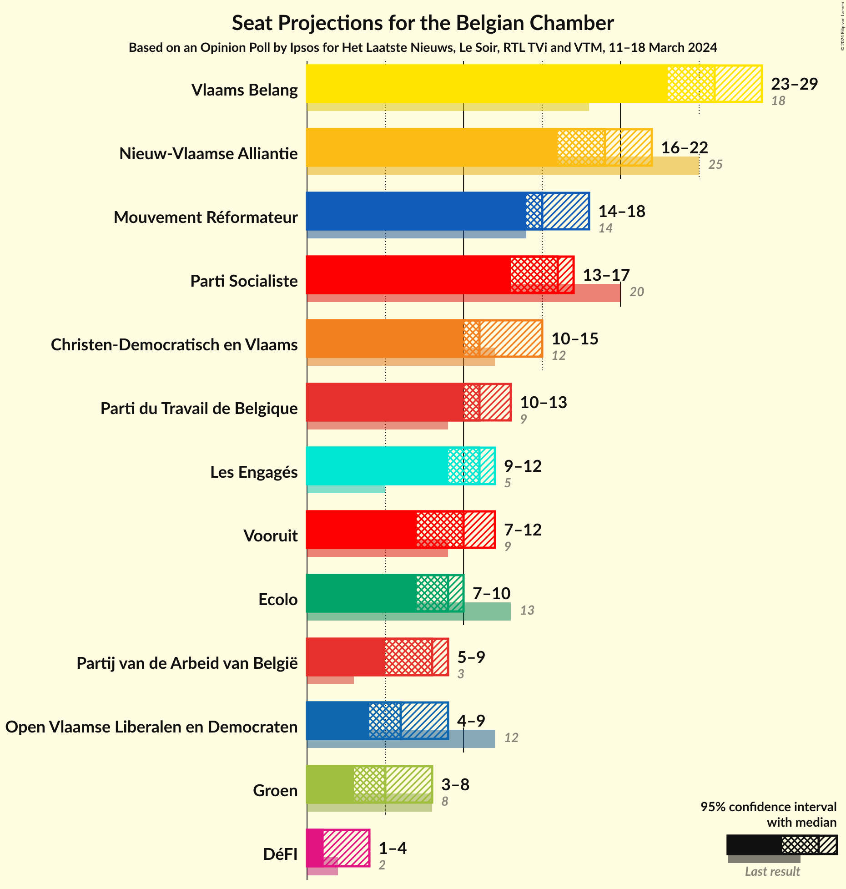

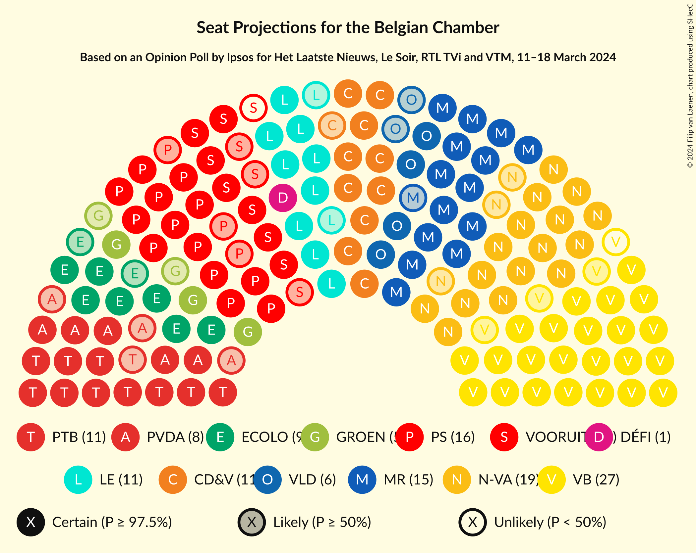

### Confidence Intervals

| Party | Last Result | Median | 80% Confidence Interval | 90% Confidence Interval | 95% Confidence Interval | 99% Confidence Interval |
|:-----:|:-----------:|:------:|:-----------------------:|:-----------------------:|:-----------------------:|:-----------------------:|
| <a href="#vlaams-belang">Vlaams Belang</a> | 18 | 26 | 25–29 |24–29 |23–29 |22–30 |
| <a href="#nieuw-vlaamse-alliantie">Nieuw-Vlaamse Alliantie</a> | 25 | 19 | 17–21 |17–22 |16–22 |15–23 |
| <a href="#christen-democratisch-en-vlaams">Christen-Democratisch en Vlaams</a> | 12 | 11 | 10–13 |10–14 |10–15 |10–15 |
| <a href="#mouvement-réformateur">Mouvement Réformateur</a> | 14 | 15 | 14–17 |14–18 |14–18 |13–19 |
| <a href="#parti-socialiste">Parti Socialiste</a> | 20 | 16 | 14–17 |13–17 |13–17 |12–18 |
| <a href="#vooruit">Vooruit</a> | 9 | 10 | 9–11 |8–11 |7–12 |7–13 |
| <a href="#parti-du-travail-de-belgique">Parti du Travail de Belgique</a> | 9 | 11 | 10–12 |10–12 |10–13 |9–13 |
| <a href="#partij-van-de-arbeid-van-belgië">Partij van de Arbeid van België</a> | 3 | 8 | 7–9 |6–9 |5–9 |5–10 |
| <a href="#les-engagés">Les Engagés</a> | 5 | 11 | 9–12 |9–12 |9–12 |8–13 |
| <a href="#open-vlaamse-liberalen-en-democraten">Open Vlaamse Liberalen en Democraten</a> | 12 | 6 | 5–8 |4–8 |4–9 |3–10 |
| <a href="#ecolo">Ecolo</a> | 13 | 9 | 8–9 |8–10 |7–10 |6–11 |
| <a href="#groen">Groen</a> | 8 | 5 | 5–7 |4–7 |3–8 |3–9 |
| <a href="#défi">DéFI</a> | 2 | 1 | 1–3 |1–3 |1–4 |1–4 |

### Vlaams Belang

*For a full overview of the results for this party, see the [Vlaams Belang](party-vlaamsbelang.html) page.*

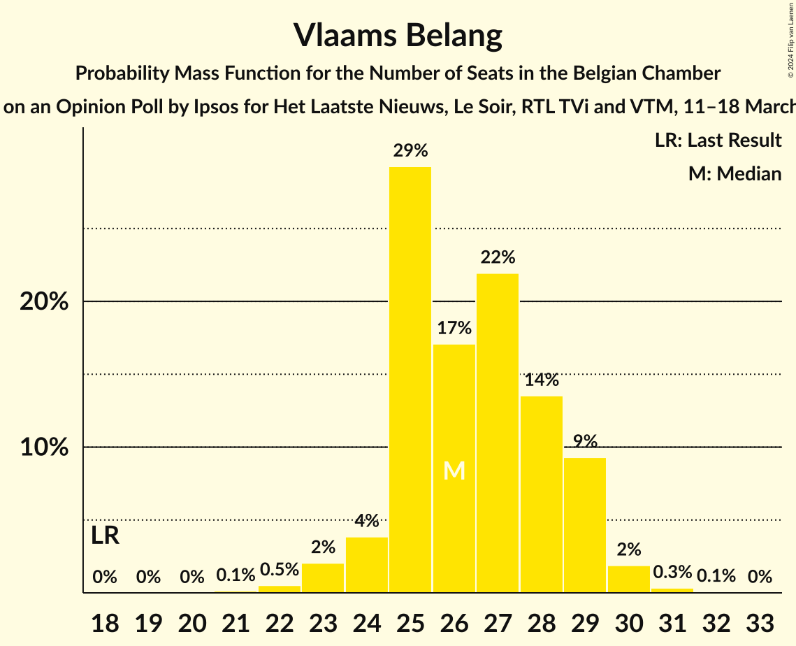

| Number of Seats | Probability | Accumulated | Special Marks |
|:---------------:|:-----------:|:-----------:|:-------------:|
| 18 | 0% | 100% | Last Result |
| 19 | 0% | 100% |  |
| 20 | 0% | 100% |  |
| 21 | 0.1% | 100% |  |
| 22 | 0.5% | 99.9% |  |
| 23 | 2% | 99.3% |  |
| 24 | 4% | 97% |  |
| 25 | 29% | 93% |  |
| 26 | 17% | 64% | Median |
| 27 | 22% | 47% |  |
| 28 | 14% | 25% |  |
| 29 | 9% | 12% |  |
| 30 | 2% | 2% |  |
| 31 | 0.3% | 0.4% |  |
| 32 | 0.1% | 0.1% |  |
| 33 | 0% | 0% |  |

### Nieuw-Vlaamse Alliantie

*For a full overview of the results for this party, see the [Nieuw-Vlaamse Alliantie](party-nieuw-vlaamsealliantie.html) page.*

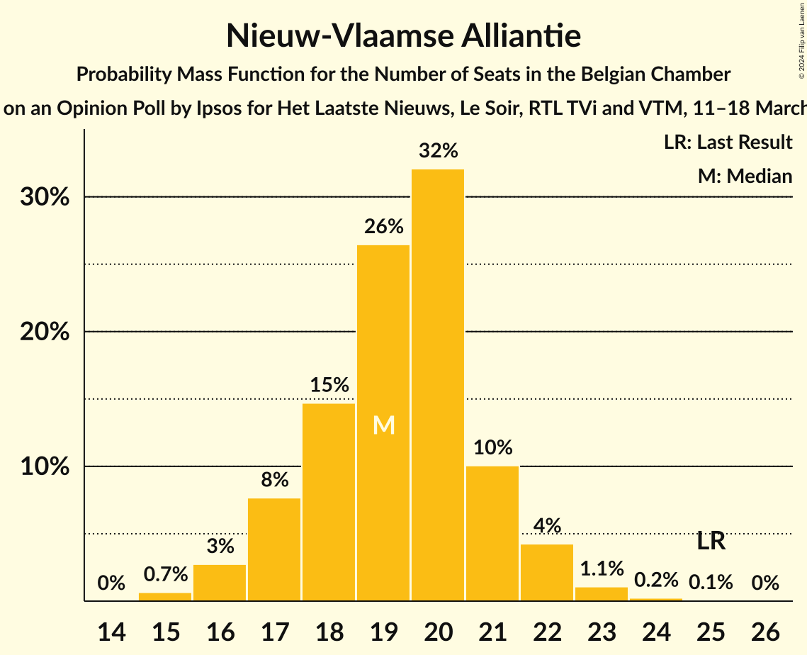

| Number of Seats | Probability | Accumulated | Special Marks |
|:---------------:|:-----------:|:-----------:|:-------------:|
| 15 | 0.7% | 100% |  |
| 16 | 3% | 99.3% |  |
| 17 | 8% | 97% |  |
| 18 | 15% | 89% |  |
| 19 | 26% | 74% | Median |
| 20 | 32% | 48% |  |
| 21 | 10% | 16% |  |
| 22 | 4% | 6% |  |
| 23 | 1.1% | 1.4% |  |
| 24 | 0.2% | 0.3% |  |
| 25 | 0.1% | 0.1% | Last Result |
| 26 | 0% | 0% |  |

### Christen-Democratisch en Vlaams

*For a full overview of the results for this party, see the [Christen-Democratisch en Vlaams](party-christen-democratischenvlaams.html) page.*

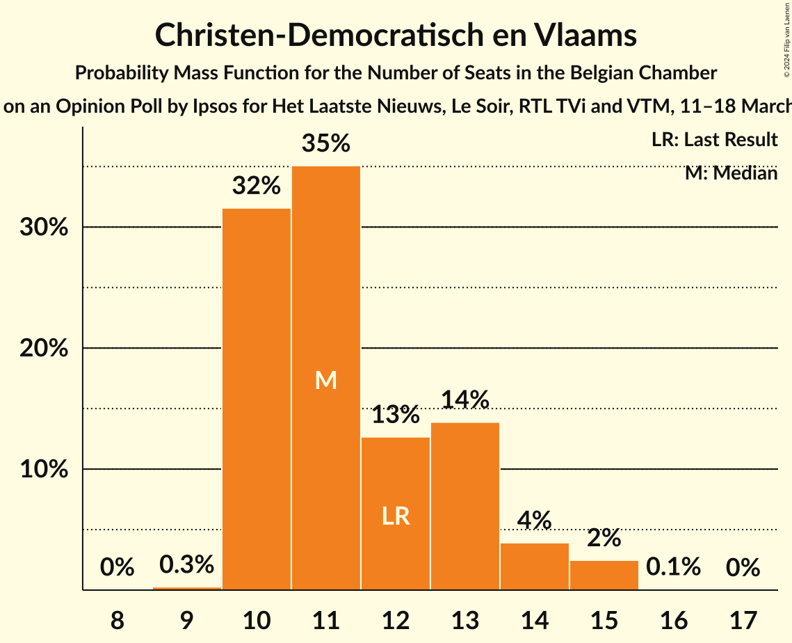

| Number of Seats | Probability | Accumulated | Special Marks |
|:---------------:|:-----------:|:-----------:|:-------------:|
| 8 | 0% | 100% |  |
| 9 | 0.3% | 99.9% |  |
| 10 | 32% | 99.7% |  |
| 11 | 35% | 68% | Median |
| 12 | 13% | 33% | Last Result |
| 13 | 14% | 20% |  |
| 14 | 4% | 6% |  |
| 15 | 2% | 3% |  |
| 16 | 0.1% | 0.1% |  |
| 17 | 0% | 0% |  |

### Mouvement Réformateur

*For a full overview of the results for this party, see the [Mouvement Réformateur](party-mouvementréformateur.html) page.*

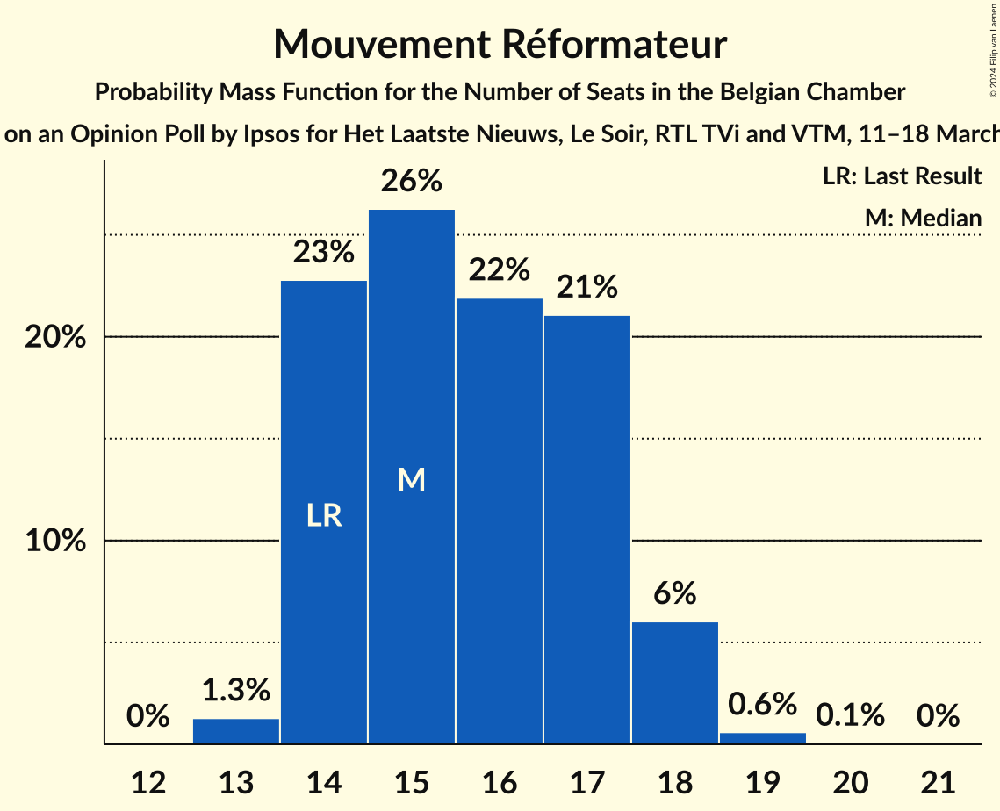

| Number of Seats | Probability | Accumulated | Special Marks |
|:---------------:|:-----------:|:-----------:|:-------------:|
| 13 | 1.3% | 100% |  |
| 14 | 23% | 98.7% | Last Result |
| 15 | 26% | 76% | Median |
| 16 | 22% | 50% |  |
| 17 | 21% | 28% |  |
| 18 | 6% | 7% |  |
| 19 | 0.6% | 0.7% |  |
| 20 | 0.1% | 0.1% |  |
| 21 | 0% | 0% |  |

### Parti Socialiste

*For a full overview of the results for this party, see the [Parti Socialiste](party-partisocialiste.html) page.*

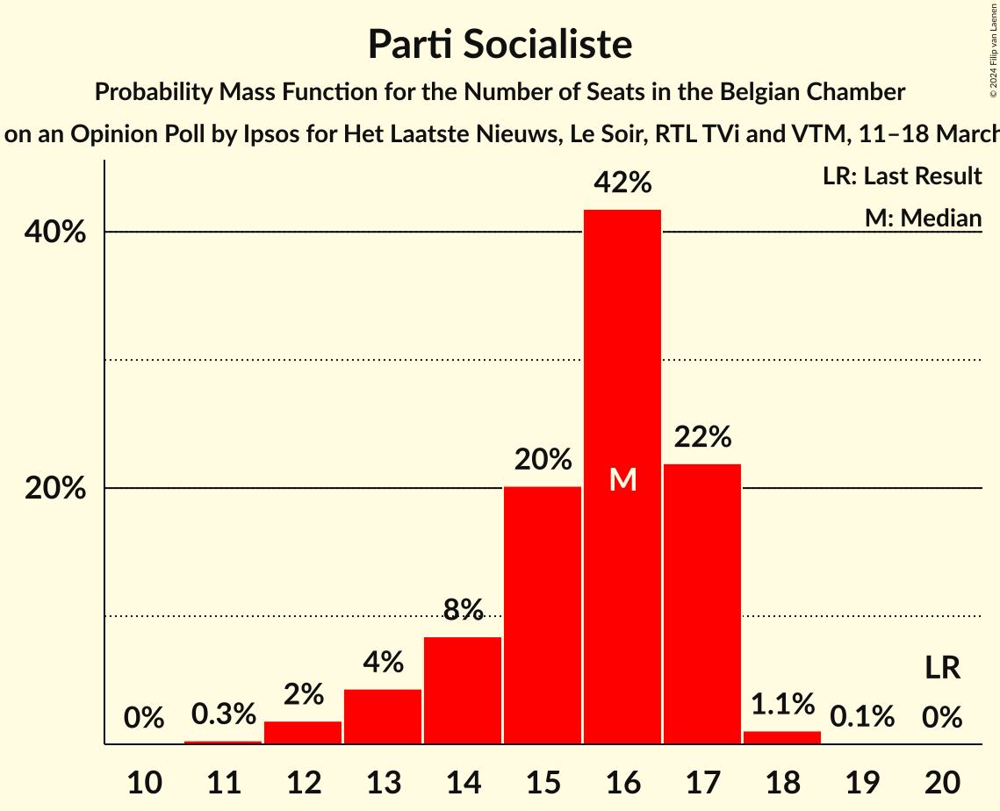

| Number of Seats | Probability | Accumulated | Special Marks |
|:---------------:|:-----------:|:-----------:|:-------------:|
| 11 | 0.3% | 100% |  |
| 12 | 2% | 99.7% |  |
| 13 | 4% | 98% |  |
| 14 | 8% | 94% |  |
| 15 | 20% | 85% |  |
| 16 | 42% | 65% | Median |
| 17 | 22% | 23% |  |
| 18 | 1.1% | 1.2% |  |
| 19 | 0.1% | 0.1% |  |
| 20 | 0% | 0% | Last Result |

### Vooruit

*For a full overview of the results for this party, see the [Vooruit](party-vooruit.html) page.*

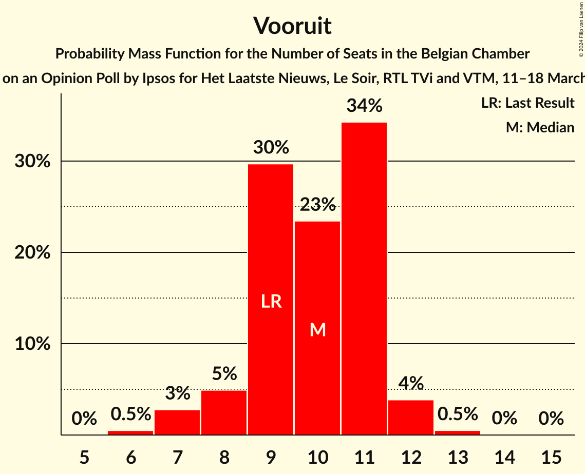

| Number of Seats | Probability | Accumulated | Special Marks |
|:---------------:|:-----------:|:-----------:|:-------------:|
| 6 | 0.5% | 100% |  |
| 7 | 3% | 99.5% |  |
| 8 | 5% | 97% |  |
| 9 | 30% | 92% | Last Result |
| 10 | 23% | 62% | Median |
| 11 | 34% | 39% |  |
| 12 | 4% | 4% |  |
| 13 | 0.5% | 0.6% |  |
| 14 | 0% | 0.1% |  |
| 15 | 0% | 0% |  |

### Parti du Travail de Belgique

*For a full overview of the results for this party, see the [Parti du Travail de Belgique](party-partidutravaildebelgique.html) page.*

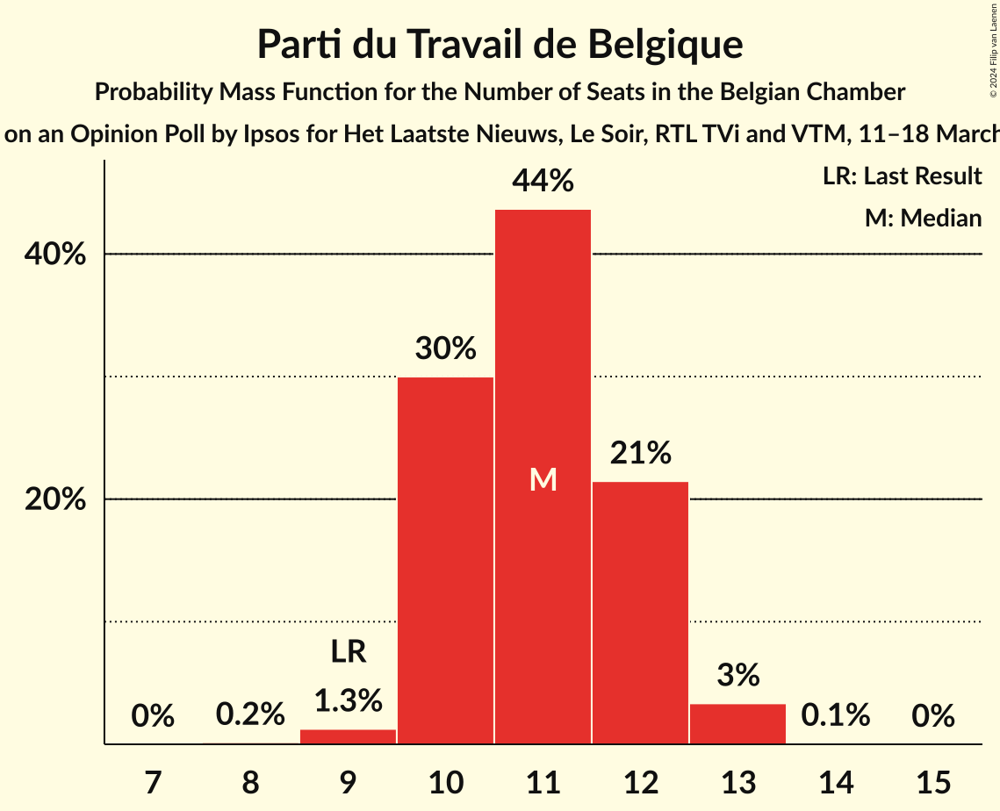

| Number of Seats | Probability | Accumulated | Special Marks |
|:---------------:|:-----------:|:-----------:|:-------------:|
| 8 | 0.2% | 100% |  |
| 9 | 1.3% | 99.8% | Last Result |
| 10 | 30% | 98.6% |  |
| 11 | 44% | 69% | Median |
| 12 | 21% | 25% |  |
| 13 | 3% | 3% |  |
| 14 | 0.1% | 0.1% |  |
| 15 | 0% | 0% |  |

### Partij van de Arbeid van België

*For a full overview of the results for this party, see the [Partij van de Arbeid van België](party-partijvandearbeidvanbelgië.html) page.*

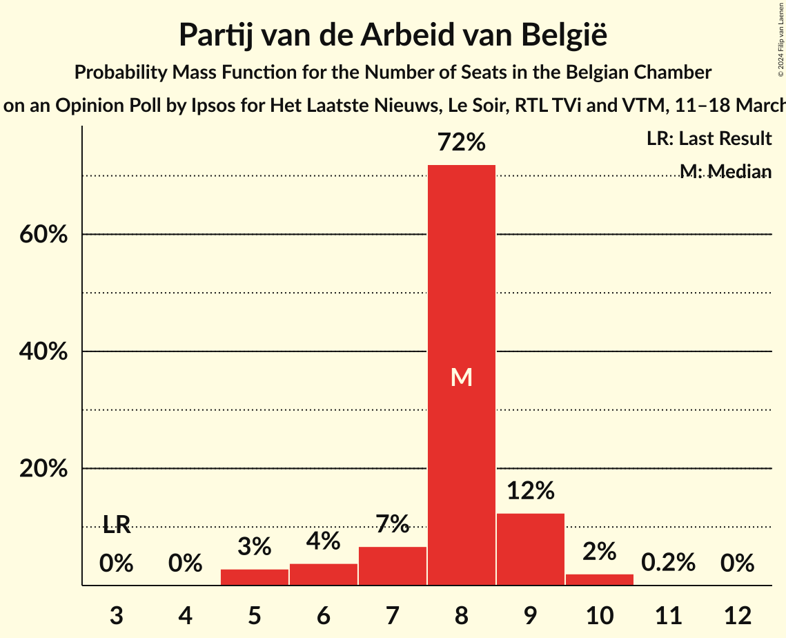

| Number of Seats | Probability | Accumulated | Special Marks |
|:---------------:|:-----------:|:-----------:|:-------------:|
| 3 | 0% | 100% | Last Result |
| 4 | 0% | 100% |  |
| 5 | 3% | 100% |  |
| 6 | 4% | 97% |  |
| 7 | 7% | 93% |  |
| 8 | 72% | 86% | Median |
| 9 | 12% | 14% |  |
| 10 | 2% | 2% |  |
| 11 | 0.2% | 0.2% |  |
| 12 | 0% | 0% |  |

### Les Engagés

*For a full overview of the results for this party, see the [Les Engagés](party-lesengagés.html) page.*

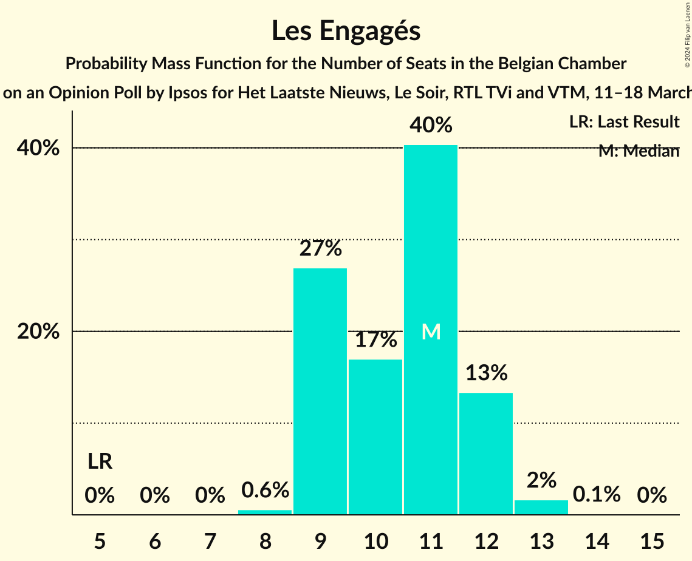

| Number of Seats | Probability | Accumulated | Special Marks |
|:---------------:|:-----------:|:-----------:|:-------------:|
| 5 | 0% | 100% | Last Result |
| 6 | 0% | 100% |  |
| 7 | 0% | 100% |  |
| 8 | 0.6% | 100% |  |
| 9 | 27% | 99.4% |  |
| 10 | 17% | 72% |  |
| 11 | 41% | 55% | Median |
| 12 | 13% | 14% |  |
| 13 | 2% | 2% |  |
| 14 | 0.1% | 0.1% |  |
| 15 | 0% | 0% |  |

### Open Vlaamse Liberalen en Democraten

*For a full overview of the results for this party, see the [Open Vlaamse Liberalen en Democraten](party-openvlaamseliberalenendemocraten.html) page.*

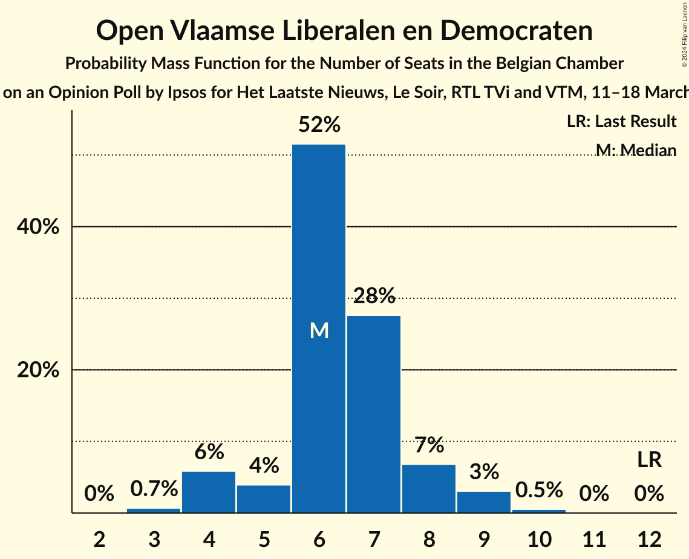

| Number of Seats | Probability | Accumulated | Special Marks |
|:---------------:|:-----------:|:-----------:|:-------------:|
| 3 | 0.8% | 100% |  |
| 4 | 6% | 99.2% |  |
| 5 | 4% | 93% |  |
| 6 | 49% | 89% | Median |
| 7 | 28% | 40% |  |
| 8 | 8% | 12% |  |
| 9 | 3% | 4% |  |
| 10 | 0.5% | 0.5% |  |
| 11 | 0% | 0% |  |
| 12 | 0% | 0% | Last Result |

### Ecolo

*For a full overview of the results for this party, see the [Ecolo](party-ecolo.html) page.*

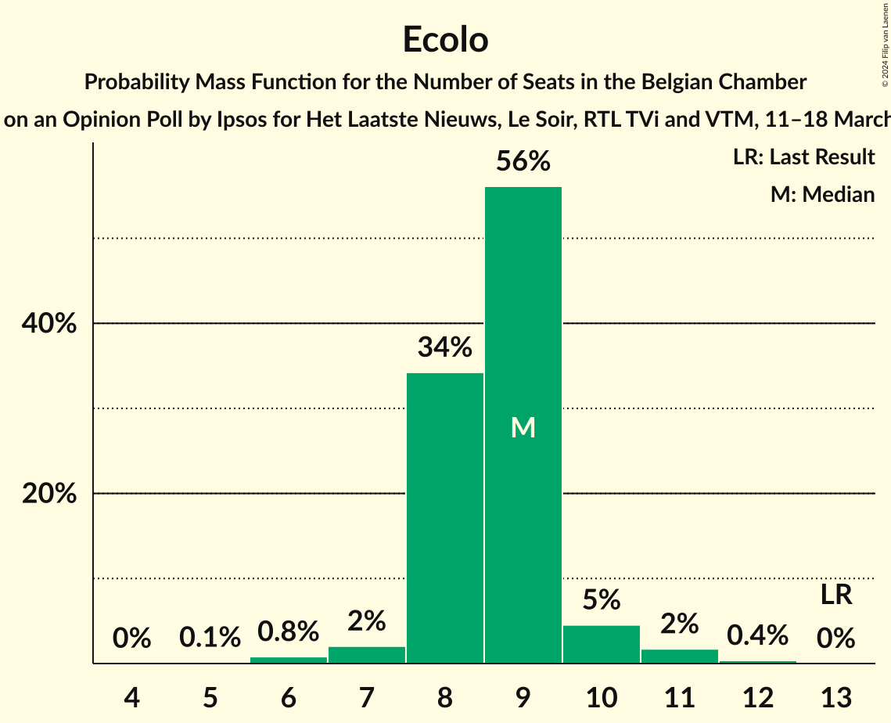

| Number of Seats | Probability | Accumulated | Special Marks |
|:---------------:|:-----------:|:-----------:|:-------------:|
| 5 | 0.1% | 100% |  |
| 6 | 0.8% | 99.8% |  |
| 7 | 2% | 99.0% |  |
| 8 | 34% | 97% |  |
| 9 | 56% | 63% | Median |
| 10 | 5% | 7% |  |
| 11 | 2% | 2% |  |
| 12 | 0.4% | 0.4% |  |
| 13 | 0% | 0% | Last Result |

### Groen

*For a full overview of the results for this party, see the [Groen](party-groen.html) page.*

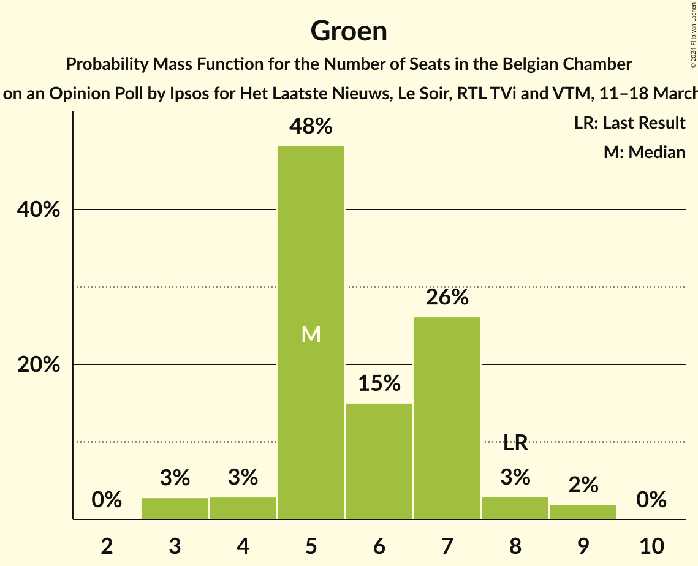

| Number of Seats | Probability | Accumulated | Special Marks |
|:---------------:|:-----------:|:-----------:|:-------------:|
| 3 | 3% | 100% |  |
| 4 | 3% | 97% |  |
| 5 | 48% | 94% | Median |
| 6 | 15% | 46% |  |
| 7 | 26% | 31% |  |
| 8 | 3% | 5% | Last Result |
| 9 | 2% | 2% |  |
| 10 | 0% | 0% |  |

### DéFI

*For a full overview of the results for this party, see the [DéFI](party-défi.html) page.*

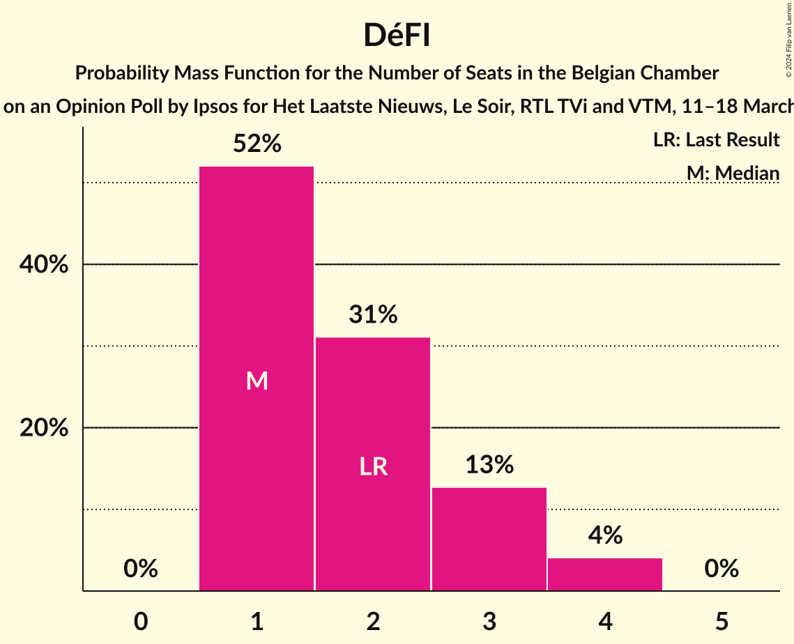

| Number of Seats | Probability | Accumulated | Special Marks |
|:---------------:|:-----------:|:-----------:|:-------------:|
| 1 | 52% | 100% | Median |
| 2 | 31% | 48% | Last Result |
| 3 | 13% | 17% |  |
| 4 | 4% | 4% |  |
| 5 | 0% | 0% |  |

## Coalitions

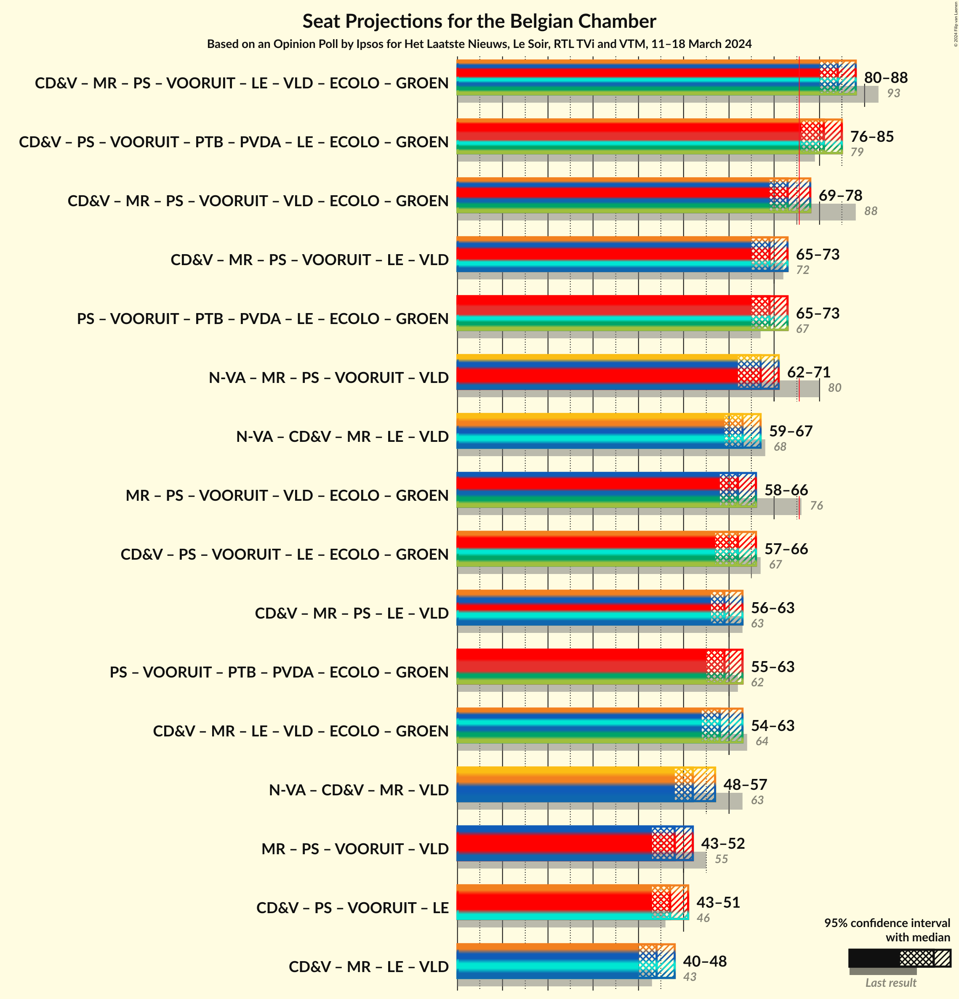

### Confidence Intervals

| Coalition | Last Result | Median | Majority? | 80% Confidence Interval | 90% Confidence Interval | 95% Confidence Interval | 99% Confidence Interval |
|:---------:|:-----------:|:------:|:---------:|:-----------------------:|:-----------------------:|:-----------------------:|:-----------------------:|
| Christen-Democratisch en Vlaams – Mouvement Réformateur – Parti Socialiste – Vooruit – Les Engagés – Open Vlaamse Liberalen en Democraten – Ecolo – Groen | 93 | 84 | 100% | 81–86 | 80–87 | 79–88 | 78–89 |
| Christen-Democratisch en Vlaams – Parti Socialiste – Vooruit – Parti du Travail de Belgique – Partij van de Arbeid van België – Les Engagés – Ecolo – Groen | 79 | 81 | 98.8% | 78–84 | 77–84 | 76–85 | 75–87 |
| Christen-Democratisch en Vlaams – Mouvement Réformateur – Parti Socialiste – Vooruit – Open Vlaamse Liberalen en Democraten – Ecolo – Groen | 88 | 73 | 17% | 70–76 | 69–77 | 69–78 | 67–79 |
| Christen-Democratisch en Vlaams – Mouvement Réformateur – Parti Socialiste – Vooruit – Les Engagés – Open Vlaamse Liberalen en Democraten | 72 | 69 | 0.1% | 67–72 | 66–73 | 65–73 | 64–75 |
| Parti Socialiste – Vooruit – Parti du Travail de Belgique – Partij van de Arbeid van België – Les Engagés – Ecolo – Groen | 67 | 69 | 0.1% | 67–72 | 66–73 | 65–73 | 64–75 |
| Nieuw-Vlaamse Alliantie – Mouvement Réformateur – Parti Socialiste – Vooruit – Open Vlaamse Liberalen en Democraten | 80 | 67 | 0% | 64–70 | 63–71 | 62–71 | 61–73 |
| Nieuw-Vlaamse Alliantie – Christen-Democratisch en Vlaams – Mouvement Réformateur – Les Engagés – Open Vlaamse Liberalen en Democraten | 68 | 63 | 0% | 60–66 | 59–67 | 59–67 | 57–69 |
| Mouvement Réformateur – Parti Socialiste – Vooruit – Open Vlaamse Liberalen en Democraten – Ecolo – Groen | 76 | 62 | 0% | 59–65 | 58–66 | 58–66 | 56–67 |
| Christen-Democratisch en Vlaams – Parti Socialiste – Vooruit – Les Engagés – Ecolo – Groen | 67 | 62 | 0% | 59–65 | 58–66 | 57–66 | 56–68 |
| Christen-Democratisch en Vlaams – Mouvement Réformateur – Parti Socialiste – Les Engagés – Open Vlaamse Liberalen en Democraten | 63 | 59 | 0% | 57–62 | 56–63 | 56–63 | 54–64 |
| Parti Socialiste – Vooruit – Parti du Travail de Belgique – Partij van de Arbeid van België – Ecolo – Groen | 62 | 59 | 0% | 56–62 | 55–62 | 55–63 | 53–64 |
| Christen-Democratisch en Vlaams – Mouvement Réformateur – Les Engagés – Open Vlaamse Liberalen en Democraten – Ecolo – Groen | 64 | 58 | 0% | 55–61 | 55–62 | 54–63 | 53–64 |
| Nieuw-Vlaamse Alliantie – Christen-Democratisch en Vlaams – Mouvement Réformateur – Open Vlaamse Liberalen en Democraten | 63 | 53 | 0% | 50–55 | 49–56 | 48–57 | 47–58 |
| Christen-Democratisch en Vlaams – Parti Socialiste – Vooruit – Les Engagés | 46 | 47 | 0% | 45–50 | 44–51 | 43–52 | 42–53 |
| Mouvement Réformateur – Parti Socialiste – Vooruit – Open Vlaamse Liberalen en Democraten | 55 | 48 | 0% | 45–50 | 44–51 | 43–52 | 42–53 |
| Christen-Democratisch en Vlaams – Mouvement Réformateur – Les Engagés – Open Vlaamse Liberalen en Democraten | 43 | 44 | 0% | 41–46 | 41–47 | 40–48 | 39–49 |

### Christen-Democratisch en Vlaams – Mouvement Réformateur – Parti Socialiste – Vooruit – Les Engagés – Open Vlaamse Liberalen en Democraten – Ecolo – Groen

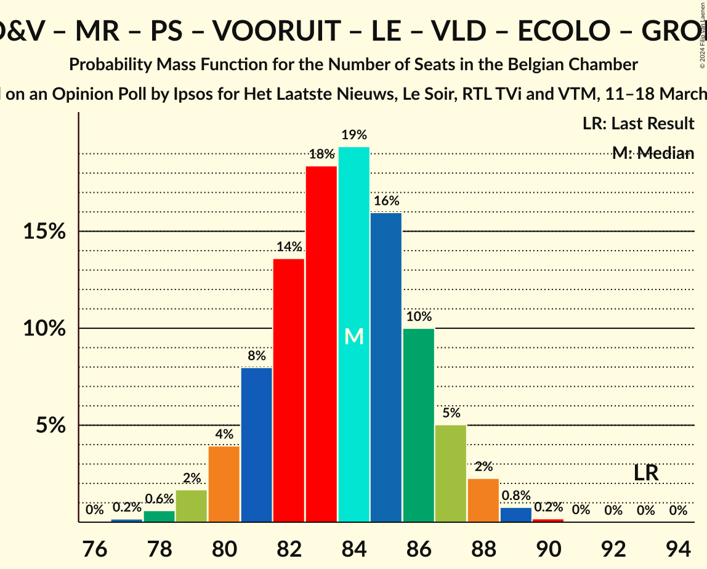

| Number of Seats | Probability | Accumulated | Special Marks |
|:---------------:|:-----------:|:-----------:|:-------------:|
| 77 | 0.2% | 100% |  |
| 78 | 0.7% | 99.8% |  |
| 79 | 2% | 99.1% |  |
| 80 | 4% | 97% |  |
| 81 | 8% | 93% |  |
| 82 | 13% | 86% |  |
| 83 | 18% | 73% | Median |
| 84 | 19% | 55% |  |
| 85 | 16% | 36% |  |
| 86 | 11% | 19% |  |
| 87 | 5% | 9% |  |
| 88 | 2% | 3% |  |
| 89 | 0.8% | 1.0% |  |
| 90 | 0.2% | 0.2% |  |
| 91 | 0% | 0% |  |
| 92 | 0% | 0% |  |
| 93 | 0% | 0% | Last Result |

### Christen-Democratisch en Vlaams – Parti Socialiste – Vooruit – Parti du Travail de Belgique – Partij van de Arbeid van België – Les Engagés – Ecolo – Groen

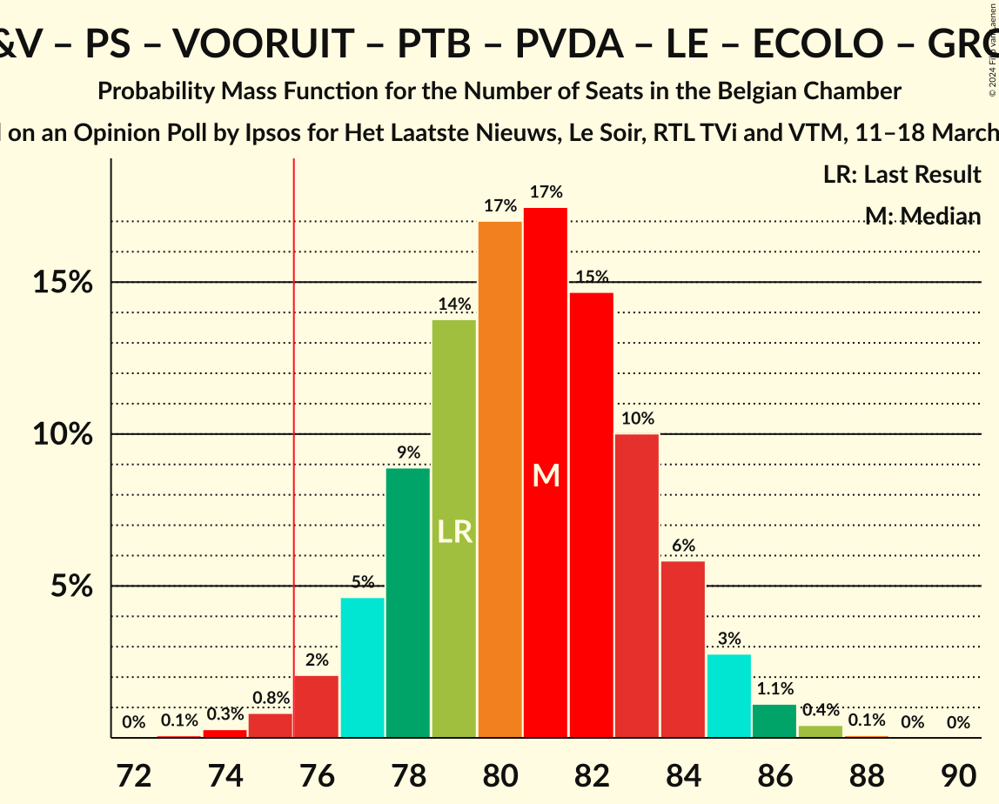

| Number of Seats | Probability | Accumulated | Special Marks |
|:---------------:|:-----------:|:-----------:|:-------------:|
| 73 | 0.1% | 100% |  |
| 74 | 0.3% | 99.9% |  |
| 75 | 0.8% | 99.6% |  |
| 76 | 2% | 98.8% | Majority |
| 77 | 5% | 97% |  |
| 78 | 9% | 92% |  |
| 79 | 14% | 83% | Last Result |
| 80 | 17% | 69% |  |
| 81 | 17% | 52% | Median |
| 82 | 15% | 35% |  |
| 83 | 10% | 20% |  |
| 84 | 6% | 10% |  |
| 85 | 3% | 4% |  |
| 86 | 1.1% | 2% |  |
| 87 | 0.4% | 0.5% |  |
| 88 | 0.1% | 0.1% |  |
| 89 | 0% | 0% |  |

### Christen-Democratisch en Vlaams – Mouvement Réformateur – Parti Socialiste – Vooruit – Open Vlaamse Liberalen en Democraten – Ecolo – Groen

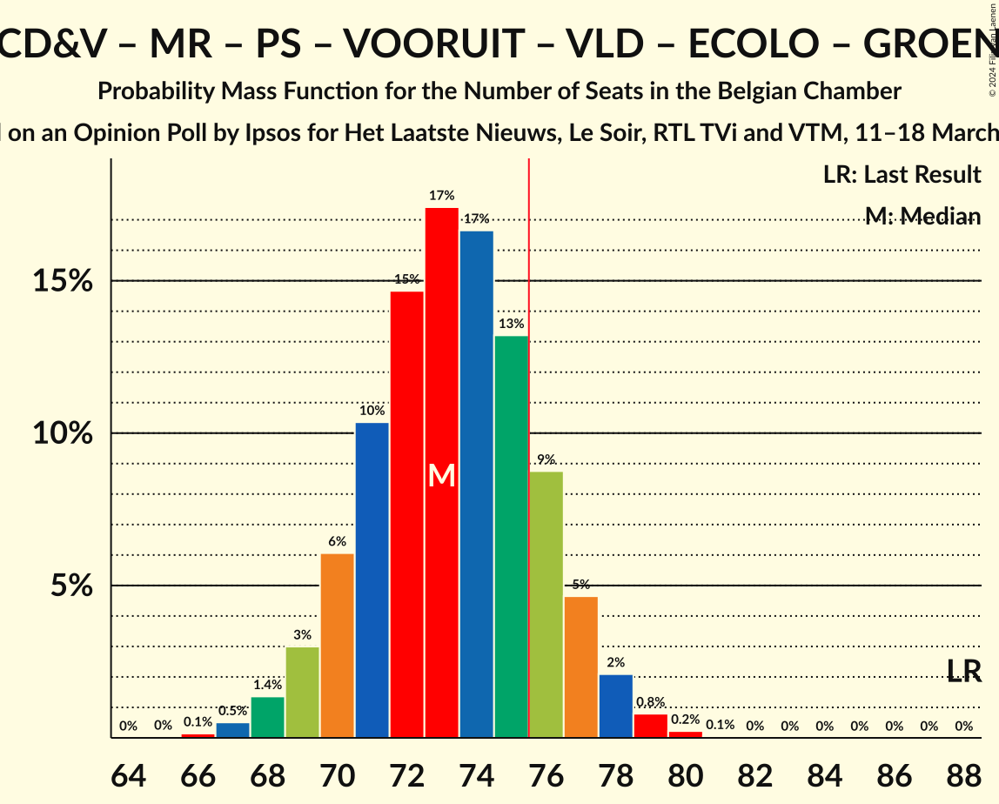

| Number of Seats | Probability | Accumulated | Special Marks |
|:---------------:|:-----------:|:-----------:|:-------------:|
| 66 | 0.1% | 100% |  |
| 67 | 0.5% | 99.8% |  |
| 68 | 1.4% | 99.3% |  |
| 69 | 3% | 98% |  |
| 70 | 6% | 95% |  |
| 71 | 10% | 89% |  |
| 72 | 15% | 79% | Median |
| 73 | 17% | 64% |  |
| 74 | 17% | 46% |  |
| 75 | 13% | 30% |  |
| 76 | 9% | 17% | Majority |
| 77 | 5% | 8% |  |
| 78 | 2% | 3% |  |
| 79 | 0.8% | 1.1% |  |
| 80 | 0.2% | 0.3% |  |
| 81 | 0.1% | 0.1% |  |
| 82 | 0% | 0% |  |
| 83 | 0% | 0% |  |
| 84 | 0% | 0% |  |
| 85 | 0% | 0% |  |
| 86 | 0% | 0% |  |
| 87 | 0% | 0% |  |
| 88 | 0% | 0% | Last Result |

### Christen-Democratisch en Vlaams – Mouvement Réformateur – Parti Socialiste – Vooruit – Les Engagés – Open Vlaamse Liberalen en Democraten

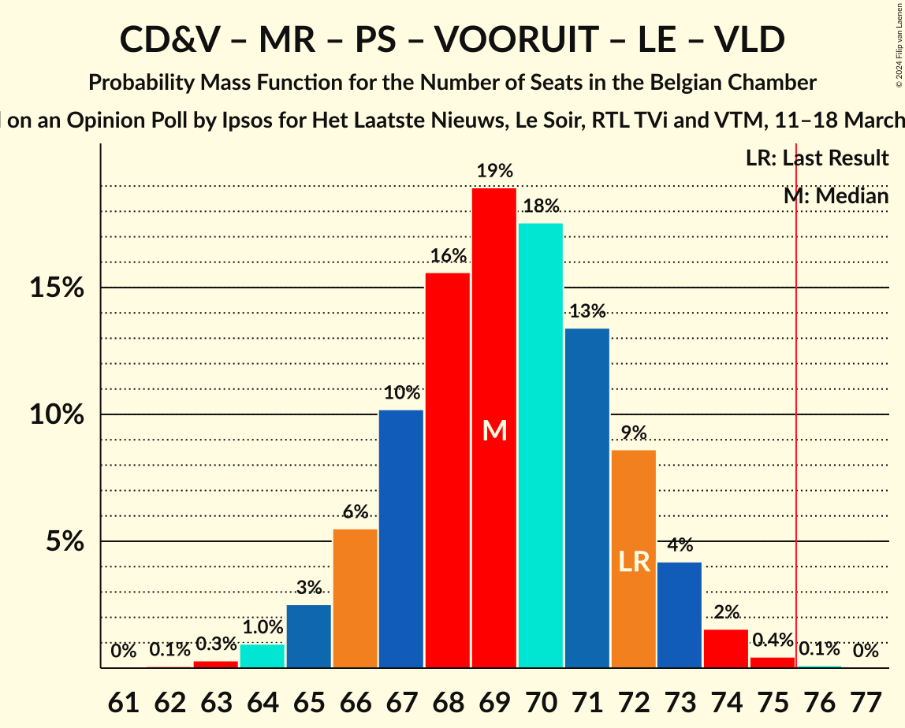

| Number of Seats | Probability | Accumulated | Special Marks |
|:---------------:|:-----------:|:-----------:|:-------------:|
| 62 | 0.1% | 100% |  |
| 63 | 0.3% | 99.9% |  |
| 64 | 1.0% | 99.6% |  |
| 65 | 3% | 98.7% |  |
| 66 | 6% | 96% |  |
| 67 | 10% | 91% |  |
| 68 | 16% | 80% |  |
| 69 | 19% | 65% | Median |
| 70 | 18% | 46% |  |
| 71 | 13% | 28% |  |
| 72 | 9% | 15% | Last Result |
| 73 | 4% | 6% |  |
| 74 | 2% | 2% |  |
| 75 | 0.4% | 0.6% |  |
| 76 | 0.1% | 0.1% | Majority |
| 77 | 0% | 0% |  |

### Parti Socialiste – Vooruit – Parti du Travail de Belgique – Partij van de Arbeid van België – Les Engagés – Ecolo – Groen

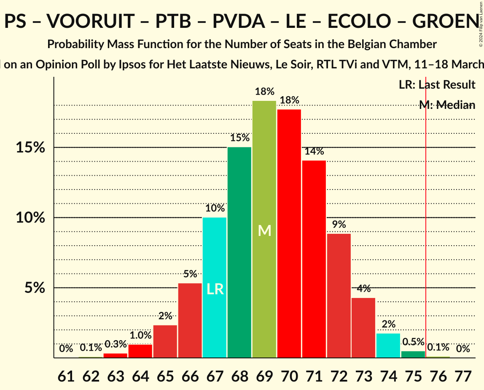

| Number of Seats | Probability | Accumulated | Special Marks |
|:---------------:|:-----------:|:-----------:|:-------------:|
| 62 | 0.1% | 100% |  |
| 63 | 0.3% | 99.9% |  |
| 64 | 1.0% | 99.5% |  |
| 65 | 2% | 98.5% |  |
| 66 | 5% | 96% |  |
| 67 | 10% | 91% | Last Result |
| 68 | 15% | 81% |  |
| 69 | 18% | 66% |  |
| 70 | 18% | 47% | Median |
| 71 | 14% | 30% |  |
| 72 | 9% | 16% |  |
| 73 | 4% | 7% |  |
| 74 | 2% | 2% |  |
| 75 | 0.5% | 0.7% |  |
| 76 | 0.1% | 0.1% | Majority |
| 77 | 0% | 0% |  |

### Nieuw-Vlaamse Alliantie – Mouvement Réformateur – Parti Socialiste – Vooruit – Open Vlaamse Liberalen en Democraten

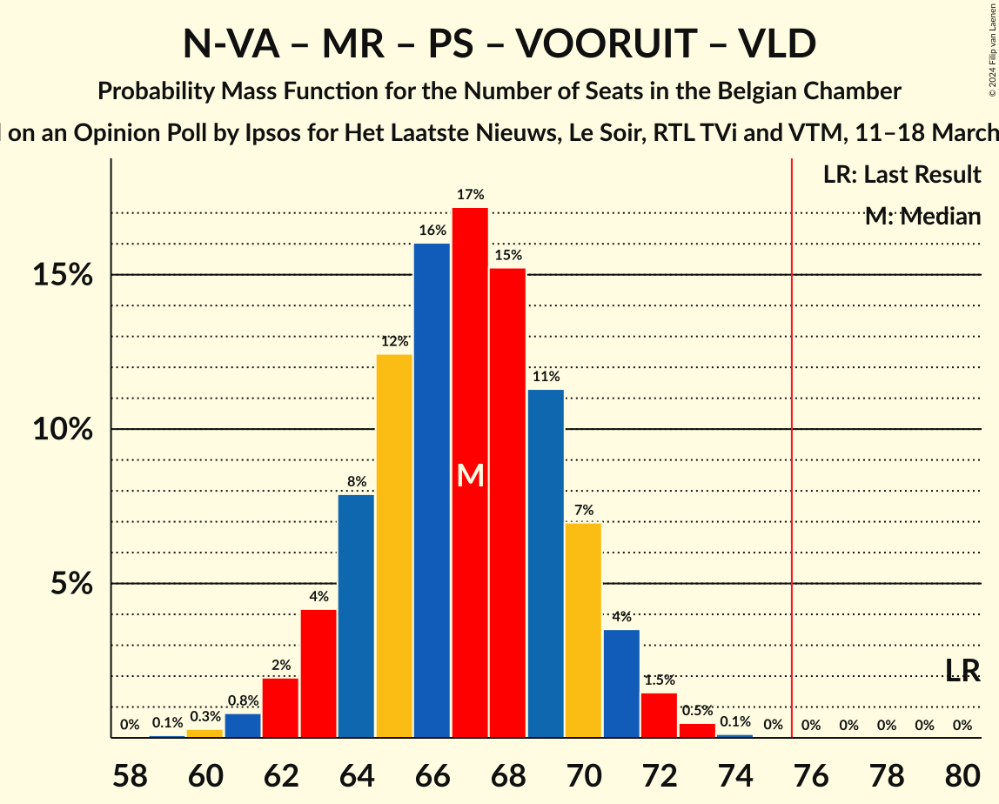

| Number of Seats | Probability | Accumulated | Special Marks |
|:---------------:|:-----------:|:-----------:|:-------------:|
| 59 | 0.1% | 100% |  |
| 60 | 0.3% | 99.9% |  |
| 61 | 0.8% | 99.6% |  |
| 62 | 2% | 98.8% |  |
| 63 | 4% | 97% |  |
| 64 | 8% | 93% |  |
| 65 | 12% | 85% |  |
| 66 | 16% | 72% | Median |
| 67 | 17% | 56% |  |
| 68 | 15% | 39% |  |
| 69 | 11% | 24% |  |
| 70 | 7% | 13% |  |
| 71 | 4% | 6% |  |
| 72 | 1.5% | 2% |  |
| 73 | 0.5% | 0.6% |  |
| 74 | 0.1% | 0.2% |  |
| 75 | 0% | 0% |  |
| 76 | 0% | 0% | Majority |
| 77 | 0% | 0% |  |
| 78 | 0% | 0% |  |
| 79 | 0% | 0% |  |
| 80 | 0% | 0% | Last Result |

### Nieuw-Vlaamse Alliantie – Christen-Democratisch en Vlaams – Mouvement Réformateur – Les Engagés – Open Vlaamse Liberalen en Democraten

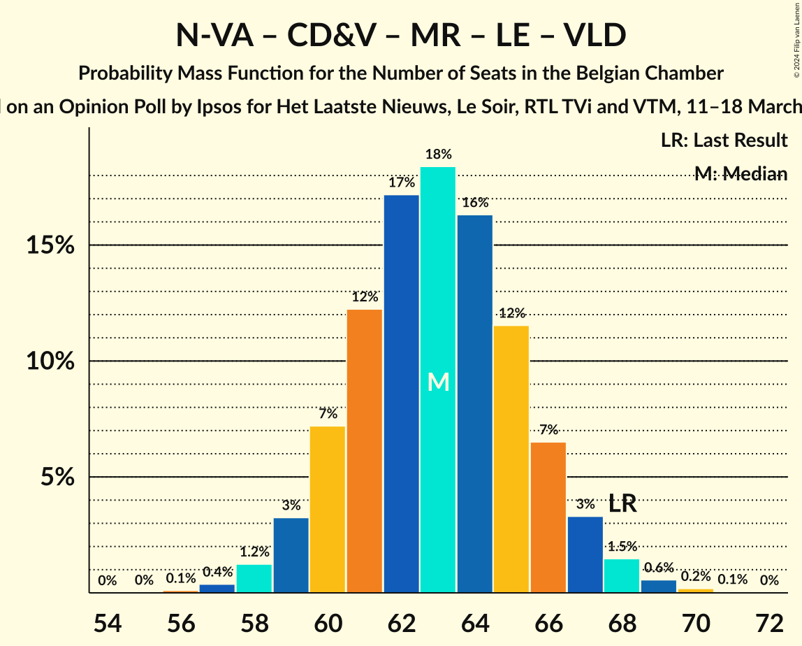

| Number of Seats | Probability | Accumulated | Special Marks |
|:---------------:|:-----------:|:-----------:|:-------------:|
| 56 | 0.1% | 100% |  |
| 57 | 0.4% | 99.9% |  |
| 58 | 1.2% | 99.5% |  |
| 59 | 3% | 98% |  |
| 60 | 7% | 95% |  |
| 61 | 12% | 88% |  |
| 62 | 17% | 76% | Median |
| 63 | 18% | 58% |  |
| 64 | 16% | 40% |  |
| 65 | 12% | 24% |  |
| 66 | 7% | 12% |  |
| 67 | 3% | 6% |  |
| 68 | 1.5% | 2% | Last Result |
| 69 | 0.6% | 0.8% |  |
| 70 | 0.2% | 0.3% |  |
| 71 | 0.1% | 0.1% |  |
| 72 | 0% | 0% |  |

### Mouvement Réformateur – Parti Socialiste – Vooruit – Open Vlaamse Liberalen en Democraten – Ecolo – Groen

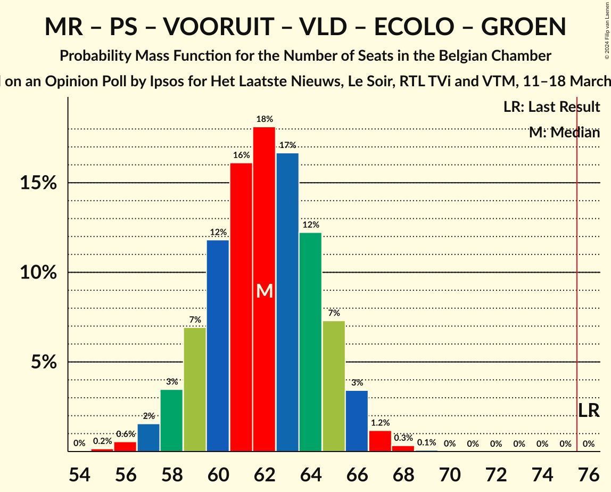

| Number of Seats | Probability | Accumulated | Special Marks |
|:---------------:|:-----------:|:-----------:|:-------------:|
| 54 | 0% | 100% |  |
| 55 | 0.2% | 99.9% |  |
| 56 | 0.6% | 99.8% |  |
| 57 | 2% | 99.2% |  |
| 58 | 3% | 98% |  |
| 59 | 7% | 94% |  |
| 60 | 12% | 87% |  |
| 61 | 16% | 75% | Median |
| 62 | 18% | 59% |  |
| 63 | 17% | 41% |  |
| 64 | 12% | 25% |  |
| 65 | 7% | 12% |  |
| 66 | 3% | 5% |  |
| 67 | 1.2% | 2% |  |
| 68 | 0.3% | 0.4% |  |
| 69 | 0.1% | 0.1% |  |
| 70 | 0% | 0% |  |
| 71 | 0% | 0% |  |
| 72 | 0% | 0% |  |
| 73 | 0% | 0% |  |
| 74 | 0% | 0% |  |
| 75 | 0% | 0% |  |
| 76 | 0% | 0% | Last Result, Majority |

### Christen-Democratisch en Vlaams – Parti Socialiste – Vooruit – Les Engagés – Ecolo – Groen

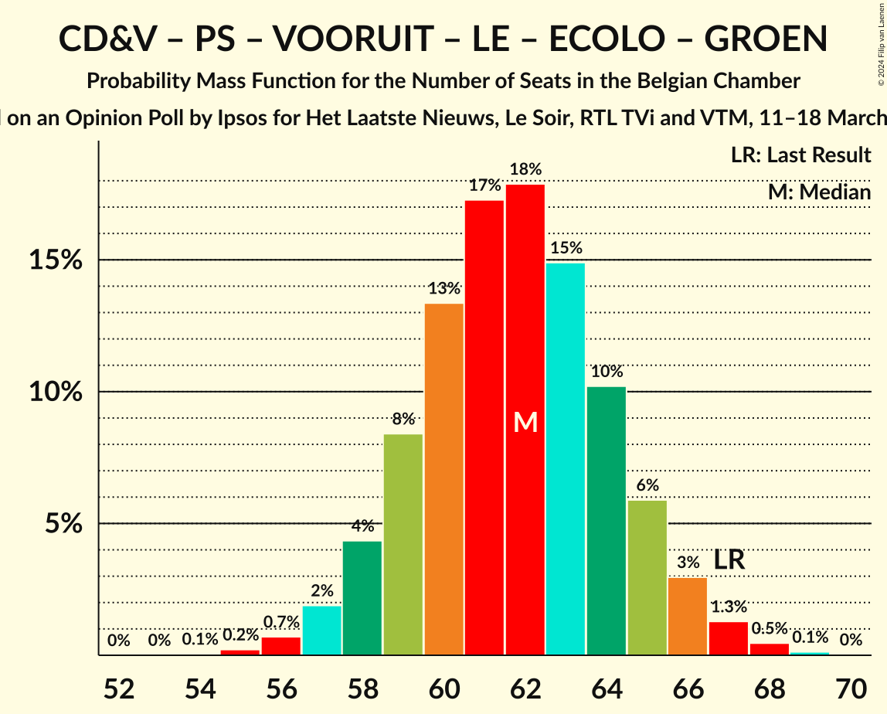

| Number of Seats | Probability | Accumulated | Special Marks |
|:---------------:|:-----------:|:-----------:|:-------------:|
| 54 | 0.1% | 100% |  |
| 55 | 0.2% | 99.9% |  |
| 56 | 0.7% | 99.7% |  |
| 57 | 2% | 99.1% |  |
| 58 | 4% | 97% |  |
| 59 | 8% | 93% |  |
| 60 | 13% | 85% |  |
| 61 | 17% | 71% |  |
| 62 | 18% | 54% | Median |
| 63 | 15% | 36% |  |
| 64 | 10% | 21% |  |
| 65 | 6% | 11% |  |
| 66 | 3% | 5% |  |
| 67 | 1.4% | 2% | Last Result |
| 68 | 0.5% | 0.7% |  |
| 69 | 0.1% | 0.2% |  |
| 70 | 0% | 0% |  |

### Christen-Democratisch en Vlaams – Mouvement Réformateur – Parti Socialiste – Les Engagés – Open Vlaamse Liberalen en Democraten

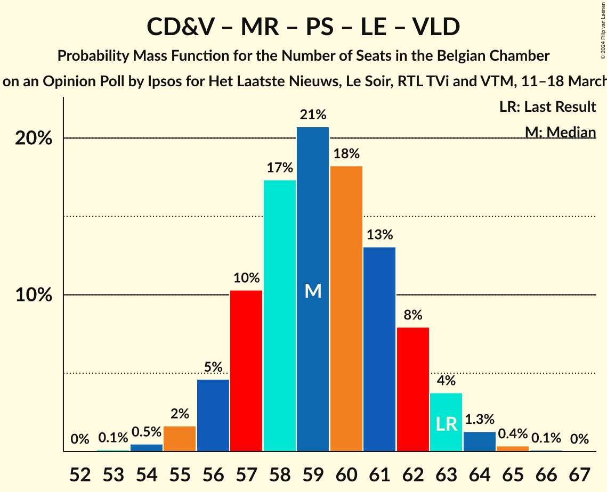

| Number of Seats | Probability | Accumulated | Special Marks |
|:---------------:|:-----------:|:-----------:|:-------------:|
| 53 | 0.1% | 100% |  |
| 54 | 0.5% | 99.8% |  |
| 55 | 2% | 99.3% |  |
| 56 | 5% | 98% |  |
| 57 | 10% | 93% |  |
| 58 | 17% | 83% |  |
| 59 | 20% | 66% | Median |
| 60 | 18% | 46% |  |
| 61 | 14% | 28% |  |
| 62 | 8% | 14% |  |
| 63 | 4% | 6% | Last Result |
| 64 | 1.3% | 2% |  |
| 65 | 0.4% | 0.5% |  |
| 66 | 0.1% | 0.1% |  |
| 67 | 0% | 0% |  |

### Parti Socialiste – Vooruit – Parti du Travail de Belgique – Partij van de Arbeid van België – Ecolo – Groen

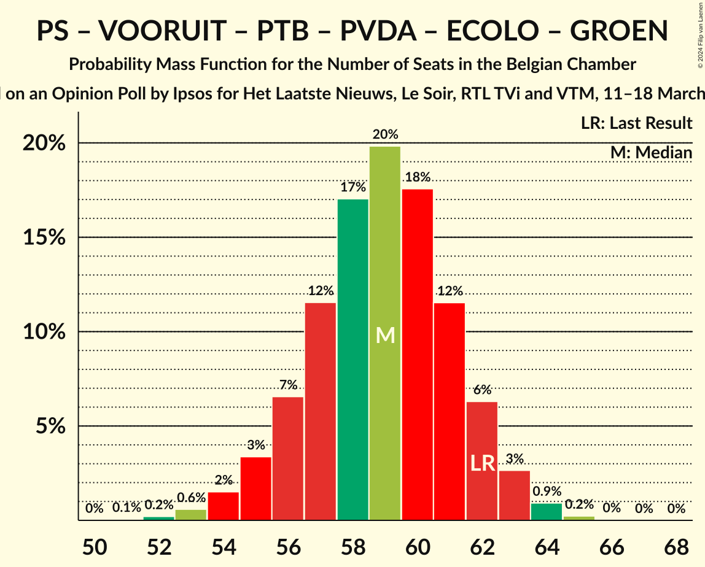

| Number of Seats | Probability | Accumulated | Special Marks |
|:---------------:|:-----------:|:-----------:|:-------------:|
| 51 | 0.1% | 100% |  |
| 52 | 0.2% | 99.9% |  |
| 53 | 0.6% | 99.7% |  |
| 54 | 1.5% | 99.1% |  |
| 55 | 3% | 98% |  |
| 56 | 6% | 94% |  |
| 57 | 12% | 88% |  |
| 58 | 17% | 76% |  |
| 59 | 20% | 59% | Median |
| 60 | 18% | 40% |  |
| 61 | 12% | 22% |  |
| 62 | 6% | 10% | Last Result |
| 63 | 3% | 4% |  |
| 64 | 0.9% | 1.2% |  |
| 65 | 0.2% | 0.3% |  |
| 66 | 0% | 0.1% |  |
| 67 | 0% | 0% |  |

### Christen-Democratisch en Vlaams – Mouvement Réformateur – Les Engagés – Open Vlaamse Liberalen en Democraten – Ecolo – Groen

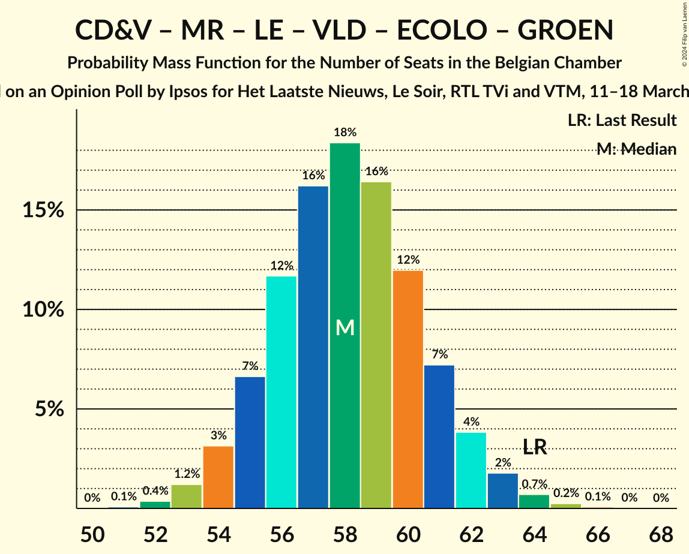

| Number of Seats | Probability | Accumulated | Special Marks |
|:---------------:|:-----------:|:-----------:|:-------------:|
| 51 | 0.1% | 100% |  |
| 52 | 0.4% | 99.9% |  |
| 53 | 1.2% | 99.5% |  |
| 54 | 3% | 98% |  |
| 55 | 7% | 95% |  |
| 56 | 12% | 89% |  |
| 57 | 16% | 77% | Median |
| 58 | 18% | 61% |  |
| 59 | 16% | 42% |  |
| 60 | 12% | 26% |  |
| 61 | 7% | 14% |  |
| 62 | 4% | 7% |  |
| 63 | 2% | 3% |  |
| 64 | 0.7% | 1.1% | Last Result |
| 65 | 0.2% | 0.3% |  |
| 66 | 0.1% | 0.1% |  |
| 67 | 0% | 0% |  |

### Nieuw-Vlaamse Alliantie – Christen-Democratisch en Vlaams – Mouvement Réformateur – Open Vlaamse Liberalen en Democraten

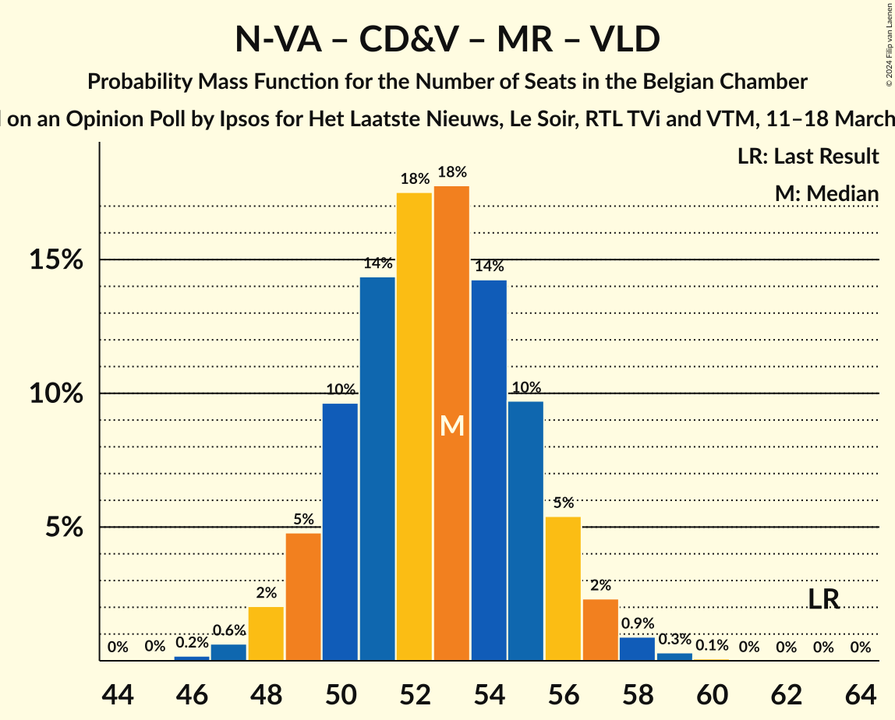

| Number of Seats | Probability | Accumulated | Special Marks |
|:---------------:|:-----------:|:-----------:|:-------------:|
| 45 | 0% | 100% |  |
| 46 | 0.2% | 99.9% |  |
| 47 | 0.6% | 99.8% |  |
| 48 | 2% | 99.1% |  |
| 49 | 5% | 97% |  |
| 50 | 10% | 92% |  |
| 51 | 14% | 83% | Median |
| 52 | 18% | 68% |  |
| 53 | 18% | 51% |  |
| 54 | 14% | 33% |  |
| 55 | 10% | 19% |  |
| 56 | 5% | 9% |  |
| 57 | 2% | 4% |  |
| 58 | 0.9% | 1.3% |  |
| 59 | 0.3% | 0.4% |  |
| 60 | 0.1% | 0.1% |  |
| 61 | 0% | 0% |  |
| 62 | 0% | 0% |  |
| 63 | 0% | 0% | Last Result |

### Christen-Democratisch en Vlaams – Parti Socialiste – Vooruit – Les Engagés

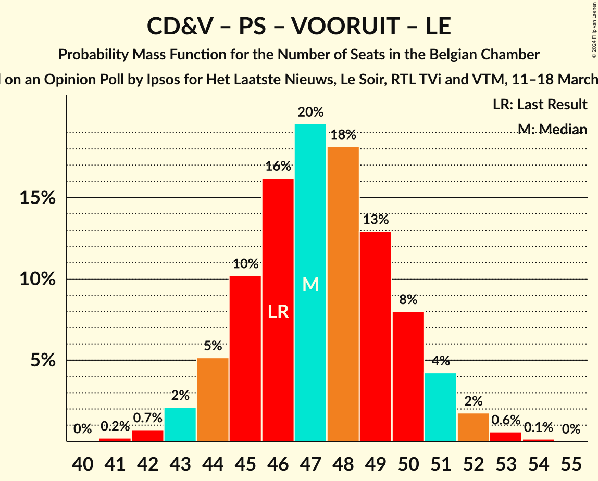

| Number of Seats | Probability | Accumulated | Special Marks |
|:---------------:|:-----------:|:-----------:|:-------------:|
| 40 | 0% | 100% |  |
| 41 | 0.2% | 99.9% |  |
| 42 | 0.7% | 99.7% |  |
| 43 | 2% | 99.0% |  |
| 44 | 5% | 97% |  |
| 45 | 10% | 92% |  |
| 46 | 16% | 82% | Last Result |
| 47 | 20% | 65% |  |
| 48 | 18% | 46% | Median |
| 49 | 13% | 28% |  |
| 50 | 8% | 15% |  |
| 51 | 4% | 7% |  |
| 52 | 2% | 3% |  |
| 53 | 0.6% | 0.8% |  |
| 54 | 0.1% | 0.2% |  |
| 55 | 0% | 0% |  |

### Mouvement Réformateur – Parti Socialiste – Vooruit – Open Vlaamse Liberalen en Democraten

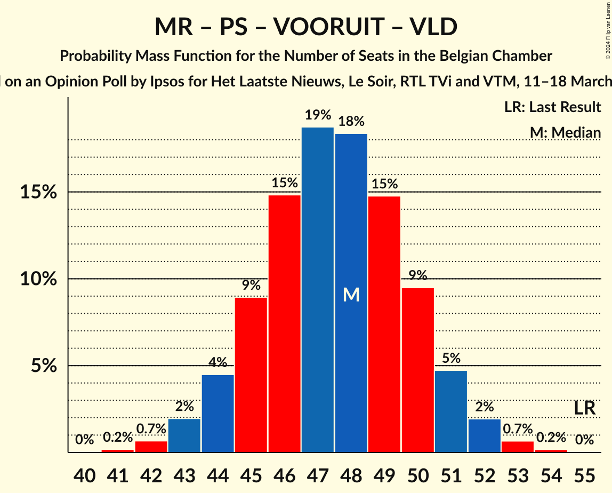

| Number of Seats | Probability | Accumulated | Special Marks |
|:---------------:|:-----------:|:-----------:|:-------------:|
| 40 | 0% | 100% |  |
| 41 | 0.2% | 99.9% |  |
| 42 | 0.7% | 99.7% |  |
| 43 | 2% | 99.0% |  |
| 44 | 5% | 97% |  |
| 45 | 9% | 92% |  |
| 46 | 14% | 84% |  |
| 47 | 18% | 69% | Median |
| 48 | 18% | 51% |  |
| 49 | 15% | 33% |  |
| 50 | 10% | 18% |  |
| 51 | 5% | 8% |  |
| 52 | 2% | 3% |  |
| 53 | 0.7% | 0.9% |  |
| 54 | 0.2% | 0.2% |  |
| 55 | 0% | 0% | Last Result |

### Christen-Democratisch en Vlaams – Mouvement Réformateur – Les Engagés – Open Vlaamse Liberalen en Democraten

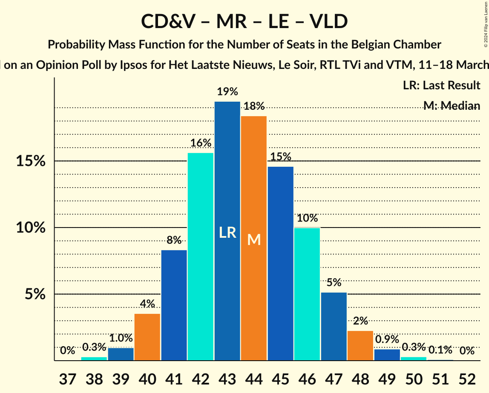

| Number of Seats | Probability | Accumulated | Special Marks |
|:---------------:|:-----------:|:-----------:|:-------------:|
| 38 | 0.3% | 100% |  |
| 39 | 1.0% | 99.7% |  |
| 40 | 4% | 98.7% |  |
| 41 | 8% | 95% |  |
| 42 | 16% | 87% |  |
| 43 | 19% | 71% | Last Result, Median |
| 44 | 18% | 52% |  |
| 45 | 15% | 33% |  |
| 46 | 10% | 19% |  |
| 47 | 5% | 9% |  |
| 48 | 2% | 4% |  |
| 49 | 0.9% | 1.3% |  |
| 50 | 0.3% | 0.4% |  |
| 51 | 0.1% | 0.1% |  |
| 52 | 0% | 0% |  |

## Technical Information

### Opinion Poll

+ **Polling firm:** Ipsos
+ **Commissioner(s):** Het Laatste Nieuws, Le Soir, RTL TVi and VTM
+ **Fieldwork period:** 11–18 March 2024

### Calculations

+ **Sample size:** 1617
+ **Simulations done:** 1,048,576
+ **Error estimate:** 1.17%

