# Opinion Poll by Kantar for La Libre Belgique and RTBf, 8–18 April 2024

Areas included: Brussels, Flanders, Wallonia

<a href="#voting-intentions">Voting Intentions</a> | <a href="#seats">Seats</a> | <a href="#coalitions">Coalitions</a> | <a href="#technical-information">Technical Information</a>

## Voting Intentions

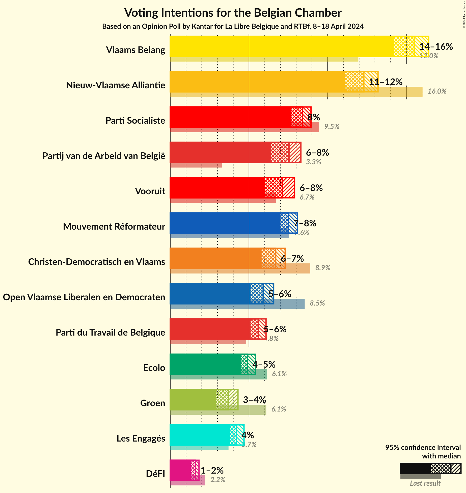

### Confidence Intervals

| Party | Last Result | Poll Result | 80% Confidence Interval | 90% Confidence Interval | 95% Confidence Interval | 99% Confidence Interval |
|:-----:|:-----------:|:-----------:|:-----------------------:|:-----------------------:|:-----------------------:|:-----------------------:|
| Vlaams Belang | 12.0% | 16.4% | 14.6–15.5% |14.4–15.5% |14.2–15.5% |13.8–15.5% |
| Nieuw-Vlaamse Alliantie | 16.0% | 13.2% | 11.5–12.3% |11.3–12.3% |11.1–12.3% |10.8–12.3% |
| Parti Socialiste | 9.5% | 8.9% | 7.9–8.3% |7.8–8.3% |7.7–8.4% |7.6–8.4% |
| Mouvement Réformateur | 7.6% | 8.1% | 7.1–7.5% |7.1–7.5% |7.0–7.5% |6.8–7.5% |
| Partij van de Arbeid van België | 3.3% | 7.5% | 6.8–8.1% |6.6–8.3% |6.4–8.3% |6.0–8.4% |
| Christen-Democratisch en Vlaams | 8.9% | 7.3% | 6.0–6.6% |5.9–6.6% |5.8–6.7% |5.5–6.7% |
| Vooruit | 6.7% | 7.1% | 6.3–7.7% |6.2–7.8% |6.0–7.9% |5.6–8.0% |
| Open Vlaamse Liberalen en Democraten | 8.5% | 6.6% | 5.3–5.9% |5.2–5.9% |5.1–5.9% |4.8–5.9% |
| Parti du Travail de Belgique | 4.8% | 6.1% | 5.2–5.6% |5.1–5.6% |5.1–5.6% |4.9–5.6% |
| Ecolo | 6.1% | 5.4% | 4.6–4.9% |4.6–4.9% |4.5–4.9% |4.4–4.9% |
| Les Engagés | 3.7% | 4.7% | 3.9–4.2% |3.8–4.2% |3.8–4.2% |3.6–4.2% |
| Groen | 6.1% | 3.7% | 3.2–4.2% |3.0–4.3% |2.9–4.3% |2.7–4.4% |
| DéFI | 2.2% | 1.8% | 1.4–1.6% |1.4–1.6% |1.3–1.6% |1.2–1.6% |

*Note:* The poll result column reflects the actual value used in the calculations. Published results may vary slightly, and in addition be rounded to fewer digits.

## Seats

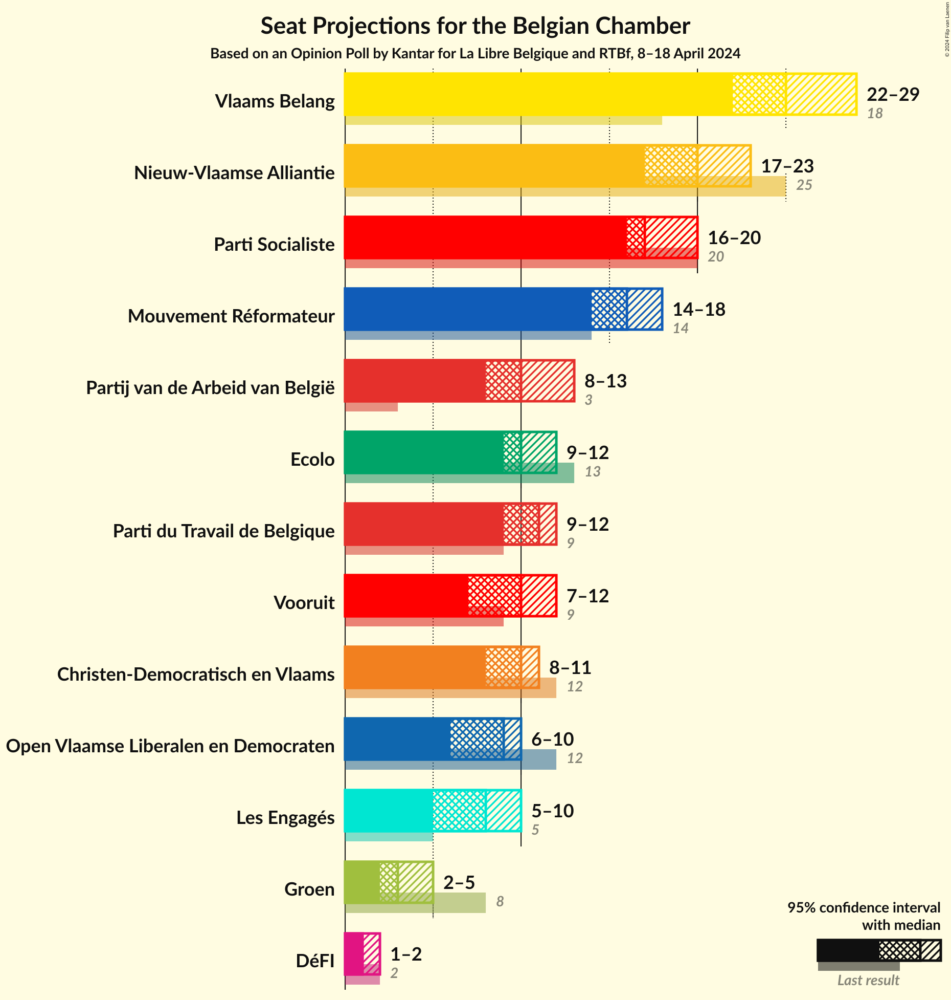

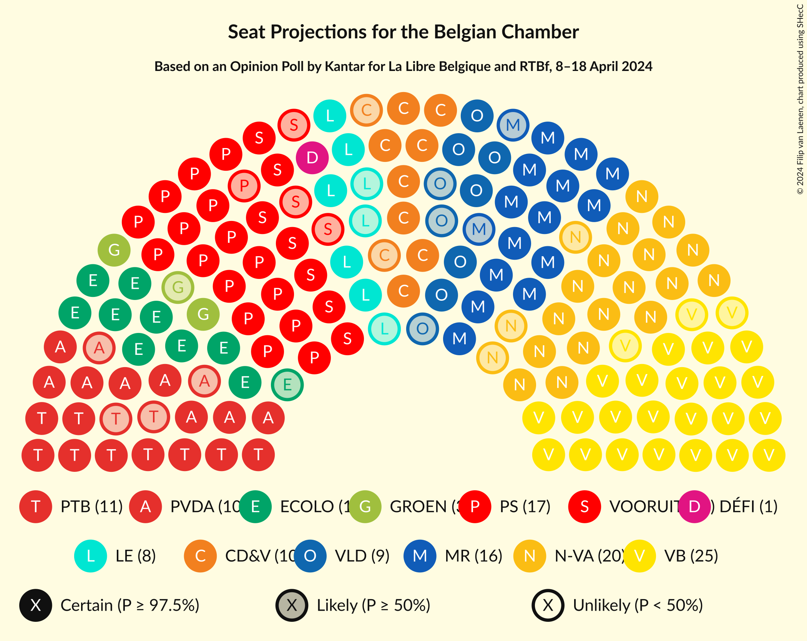

### Confidence Intervals

| Party | Last Result | Median | 80% Confidence Interval | 90% Confidence Interval | 95% Confidence Interval | 99% Confidence Interval |
|:-----:|:-----------:|:------:|:-----------------------:|:-----------------------:|:-----------------------:|:-----------------------:|
| <a href="#vlaams-belang">Vlaams Belang</a> | 18 | 25 | 23–27 |23–28 |22–29 |21–30 |
| <a href="#nieuw-vlaamse-alliantie">Nieuw-Vlaamse Alliantie</a> | 25 | 20 | 18–21 |18–22 |17–23 |16–24 |
| <a href="#parti-socialiste">Parti Socialiste</a> | 20 | 17 | 16–19 |16–19 |16–20 |15–20 |
| <a href="#mouvement-réformateur">Mouvement Réformateur</a> | 14 | 16 | 15–17 |14–18 |14–18 |14–19 |
| <a href="#partij-van-de-arbeid-van-belgië">Partij van de Arbeid van België</a> | 3 | 10 | 9–12 |8–13 |8–13 |8–13 |
| <a href="#christen-democratisch-en-vlaams">Christen-Democratisch en Vlaams</a> | 12 | 10 | 9–11 |9–11 |8–11 |6–13 |
| <a href="#vooruit">Vooruit</a> | 9 | 10 | 9–11 |8–11 |7–12 |7–12 |
| <a href="#open-vlaamse-liberalen-en-democraten">Open Vlaamse Liberalen en Democraten</a> | 12 | 9 | 7–10 |7–10 |6–10 |6–11 |
| <a href="#parti-du-travail-de-belgique">Parti du Travail de Belgique</a> | 9 | 11 | 9–12 |9–12 |9–12 |9–12 |
| <a href="#ecolo">Ecolo</a> | 13 | 10 | 9–11 |9–11 |9–12 |7–12 |
| <a href="#les-engagés">Les Engagés</a> | 5 | 8 | 6–9 |6–9 |5–10 |5–10 |
| <a href="#groen">Groen</a> | 8 | 3 | 3–5 |3–5 |2–5 |1–6 |
| <a href="#défi">DéFI</a> | 2 | 1 | 1 |1 |1–2 |1–3 |

### Vlaams Belang

*For a full overview of the results for this party, see the [Vlaams Belang](party-vlaamsbelang.html) page.*

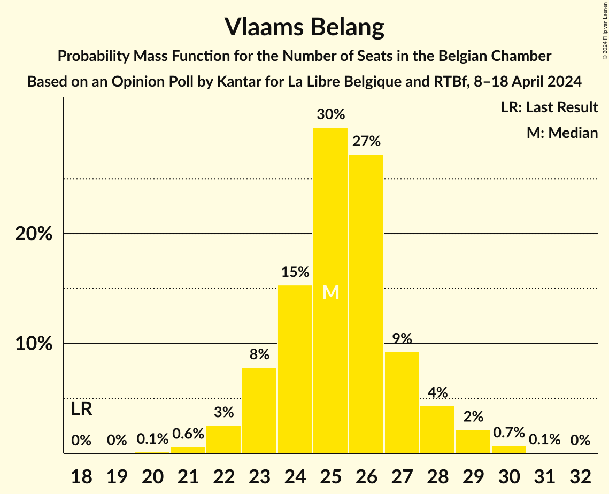

| Number of Seats | Probability | Accumulated | Special Marks |
|:---------------:|:-----------:|:-----------:|:-------------:|
| 18 | 0% | 100% | Last Result |
| 19 | 0% | 100% |  |
| 20 | 0.1% | 100% |  |
| 21 | 0.6% | 99.8% |  |
| 22 | 3% | 99.2% |  |
| 23 | 8% | 97% |  |
| 24 | 15% | 89% |  |
| 25 | 30% | 74% | Median |
| 26 | 27% | 44% |  |
| 27 | 9% | 17% |  |
| 28 | 4% | 7% |  |
| 29 | 2% | 3% |  |
| 30 | 0.7% | 0.8% |  |
| 31 | 0.1% | 0.1% |  |
| 32 | 0% | 0% |  |

### Nieuw-Vlaamse Alliantie

*For a full overview of the results for this party, see the [Nieuw-Vlaamse Alliantie](party-nieuw-vlaamsealliantie.html) page.*

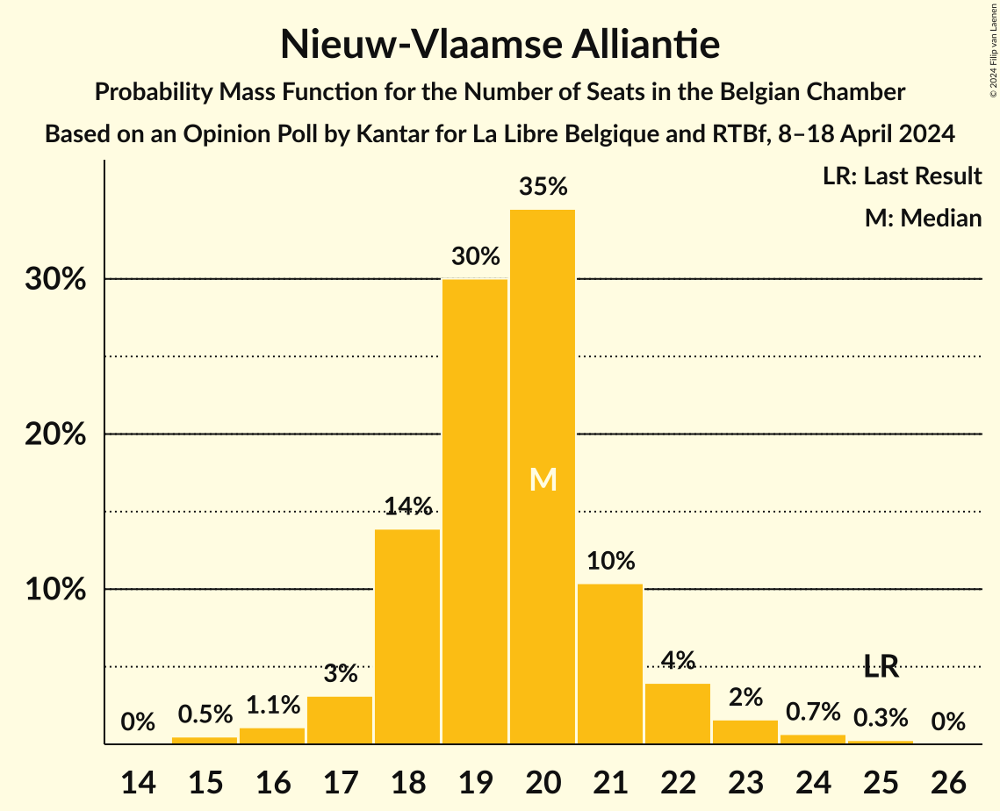

| Number of Seats | Probability | Accumulated | Special Marks |
|:---------------:|:-----------:|:-----------:|:-------------:|
| 15 | 0.5% | 100% |  |
| 16 | 1.1% | 99.5% |  |
| 17 | 3% | 98% |  |
| 18 | 14% | 95% |  |
| 19 | 30% | 81% |  |
| 20 | 35% | 51% | Median |
| 21 | 10% | 17% |  |
| 22 | 4% | 6% |  |
| 23 | 2% | 3% |  |
| 24 | 0.7% | 0.9% |  |
| 25 | 0.3% | 0.3% | Last Result |
| 26 | 0% | 0% |  |

### Parti Socialiste

*For a full overview of the results for this party, see the [Parti Socialiste](party-partisocialiste.html) page.*

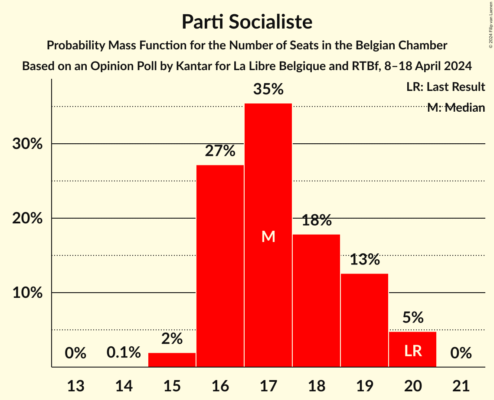

| Number of Seats | Probability | Accumulated | Special Marks |
|:---------------:|:-----------:|:-----------:|:-------------:|
| 14 | 0.1% | 100% |  |
| 15 | 2% | 99.9% |  |
| 16 | 27% | 98% |  |
| 17 | 35% | 71% | Median |
| 18 | 18% | 35% |  |
| 19 | 13% | 17% |  |
| 20 | 5% | 5% | Last Result |
| 21 | 0% | 0% |  |

### Mouvement Réformateur

*For a full overview of the results for this party, see the [Mouvement Réformateur](party-mouvementréformateur.html) page.*

| Number of Seats | Probability | Accumulated | Special Marks |
|:---------------:|:-----------:|:-----------:|:-------------:|
| 13 | 0.2% | 100% |  |
| 14 | 6% | 99.7% | Last Result |
| 15 | 40% | 94% |  |
| 16 | 34% | 54% | Median |
| 17 | 13% | 20% |  |
| 18 | 5% | 6% |  |
| 19 | 1.0% | 1.0% |  |
| 20 | 0.1% | 0.1% |  |
| 21 | 0% | 0% |  |

### Partij van de Arbeid van België

*For a full overview of the results for this party, see the [Partij van de Arbeid van België](party-partijvandearbeidvanbelgië.html) page.*

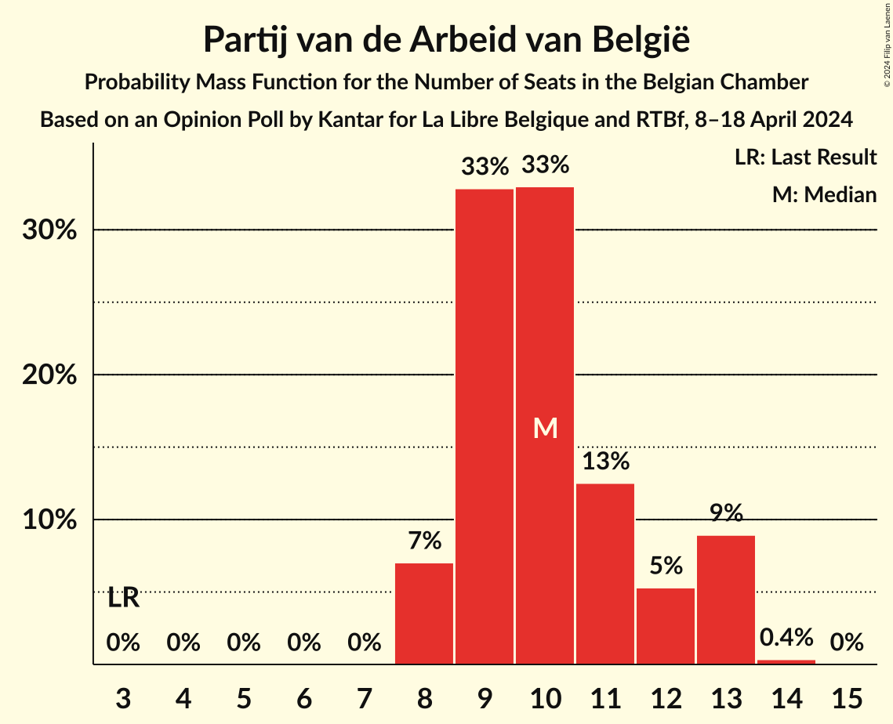

| Number of Seats | Probability | Accumulated | Special Marks |
|:---------------:|:-----------:|:-----------:|:-------------:|
| 3 | 0% | 100% | Last Result |
| 4 | 0% | 100% |  |
| 5 | 0% | 100% |  |
| 6 | 0% | 100% |  |
| 7 | 0% | 100% |  |
| 8 | 7% | 100% |  |
| 9 | 33% | 93% |  |
| 10 | 33% | 60% | Median |
| 11 | 13% | 27% |  |
| 12 | 5% | 15% |  |
| 13 | 9% | 9% |  |
| 14 | 0.4% | 0.4% |  |
| 15 | 0% | 0% |  |

### Christen-Democratisch en Vlaams

*For a full overview of the results for this party, see the [Christen-Democratisch en Vlaams](party-christen-democratischenvlaams.html) page.*

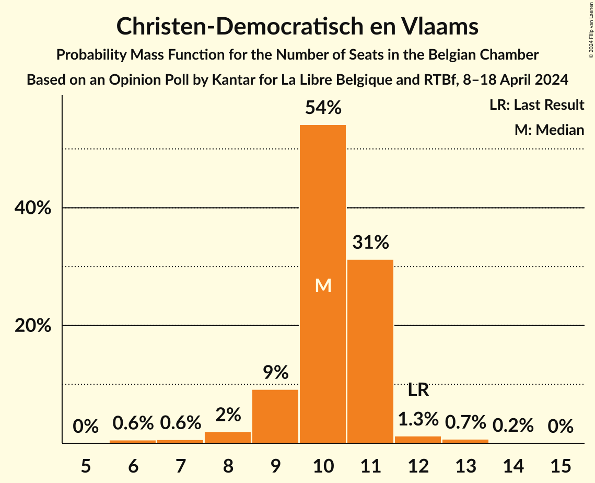

| Number of Seats | Probability | Accumulated | Special Marks |
|:---------------:|:-----------:|:-----------:|:-------------:|
| 6 | 0.6% | 100% |  |
| 7 | 0.6% | 99.4% |  |
| 8 | 2% | 98.8% |  |
| 9 | 9% | 97% |  |
| 10 | 54% | 88% | Median |
| 11 | 31% | 33% |  |
| 12 | 1.3% | 2% | Last Result |
| 13 | 0.7% | 0.9% |  |
| 14 | 0.2% | 0.2% |  |
| 15 | 0% | 0% |  |

### Vooruit

*For a full overview of the results for this party, see the [Vooruit](party-vooruit.html) page.*

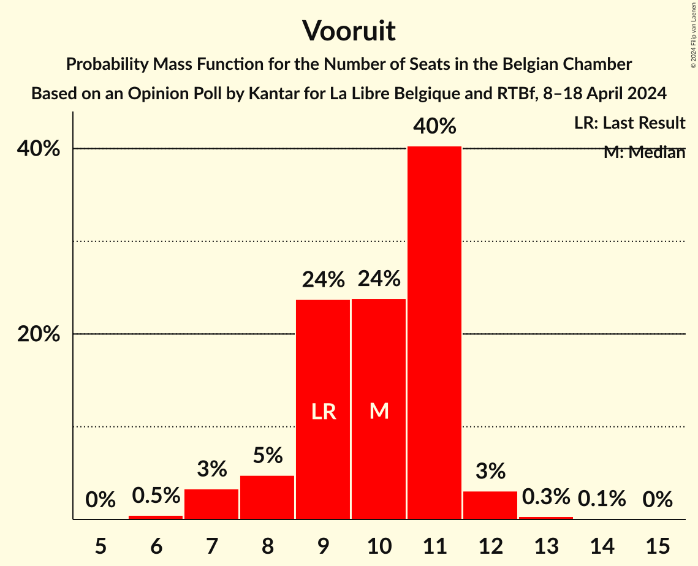

| Number of Seats | Probability | Accumulated | Special Marks |
|:---------------:|:-----------:|:-----------:|:-------------:|
| 6 | 0.5% | 100% |  |
| 7 | 3% | 99.5% |  |
| 8 | 5% | 96% |  |
| 9 | 24% | 91% | Last Result |
| 10 | 24% | 68% | Median |
| 11 | 40% | 44% |  |
| 12 | 3% | 4% |  |
| 13 | 0.3% | 0.5% |  |
| 14 | 0.1% | 0.1% |  |
| 15 | 0% | 0% |  |

### Open Vlaamse Liberalen en Democraten

*For a full overview of the results for this party, see the [Open Vlaamse Liberalen en Democraten](party-openvlaamseliberalenendemocraten.html) page.*

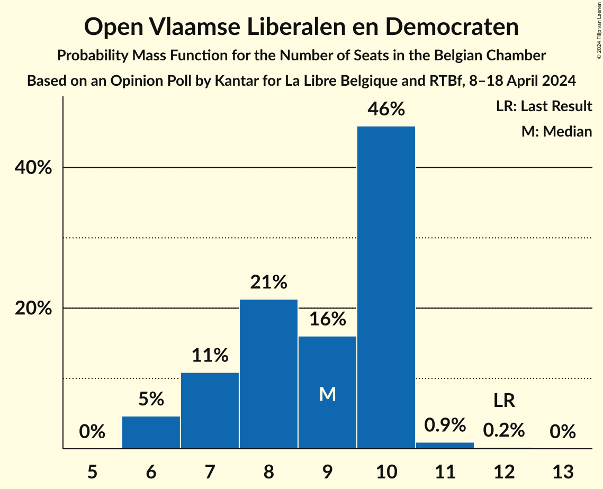

| Number of Seats | Probability | Accumulated | Special Marks |
|:---------------:|:-----------:|:-----------:|:-------------:|
| 6 | 5% | 100% |  |
| 7 | 11% | 95% |  |
| 8 | 21% | 84% |  |
| 9 | 16% | 63% | Median |
| 10 | 46% | 47% |  |
| 11 | 0.9% | 1.2% |  |
| 12 | 0.2% | 0.2% | Last Result |
| 13 | 0% | 0% |  |

### Parti du Travail de Belgique

*For a full overview of the results for this party, see the [Parti du Travail de Belgique](party-partidutravaildebelgique.html) page.*

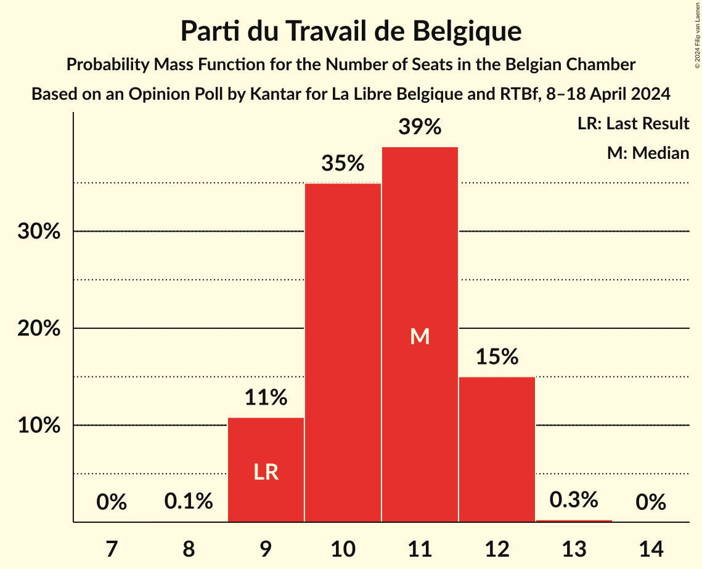

| Number of Seats | Probability | Accumulated | Special Marks |
|:---------------:|:-----------:|:-----------:|:-------------:|
| 8 | 0.1% | 100% |  |
| 9 | 11% | 99.8% | Last Result |
| 10 | 35% | 89% |  |
| 11 | 39% | 54% | Median |
| 12 | 15% | 15% |  |
| 13 | 0.3% | 0.3% |  |
| 14 | 0% | 0% |  |

### Ecolo

*For a full overview of the results for this party, see the [Ecolo](party-ecolo.html) page.*

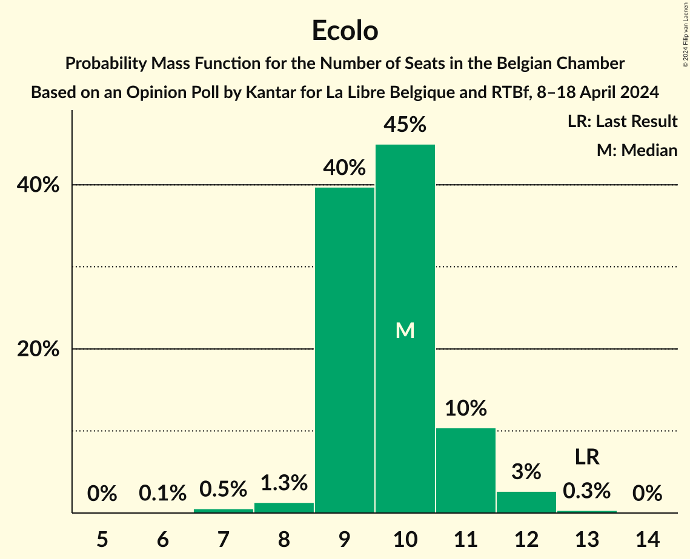

| Number of Seats | Probability | Accumulated | Special Marks |
|:---------------:|:-----------:|:-----------:|:-------------:|
| 6 | 0.1% | 100% |  |
| 7 | 0.5% | 99.9% |  |
| 8 | 1.3% | 99.4% |  |
| 9 | 40% | 98% |  |
| 10 | 45% | 58% | Median |
| 11 | 10% | 13% |  |
| 12 | 3% | 3% |  |
| 13 | 0.3% | 0.4% | Last Result |
| 14 | 0% | 0% |  |

### Les Engagés

*For a full overview of the results for this party, see the [Les Engagés](party-lesengagés.html) page.*

| Number of Seats | Probability | Accumulated | Special Marks |
|:---------------:|:-----------:|:-----------:|:-------------:|
| 4 | 0.3% | 100% |  |
| 5 | 3% | 99.7% | Last Result |
| 6 | 8% | 97% |  |
| 7 | 14% | 89% |  |
| 8 | 31% | 75% | Median |
| 9 | 39% | 44% |  |
| 10 | 4% | 4% |  |
| 11 | 0.2% | 0.3% |  |
| 12 | 0% | 0% |  |

### Groen

*For a full overview of the results for this party, see the [Groen](party-groen.html) page.*

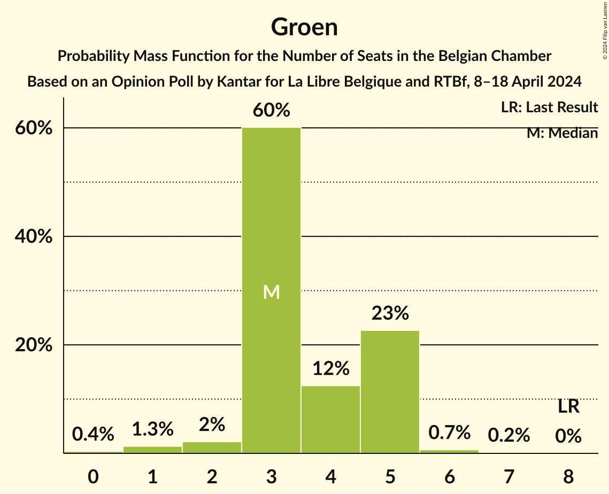

| Number of Seats | Probability | Accumulated | Special Marks |
|:---------------:|:-----------:|:-----------:|:-------------:|
| 0 | 0.4% | 100% |  |
| 1 | 1.3% | 99.6% |  |
| 2 | 2% | 98% |  |
| 3 | 60% | 96% | Median |
| 4 | 12% | 36% |  |
| 5 | 23% | 24% |  |
| 6 | 0.7% | 0.9% |  |
| 7 | 0.2% | 0.2% |  |
| 8 | 0% | 0% | Last Result |

### DéFI

*For a full overview of the results for this party, see the [DéFI](party-défi.html) page.*

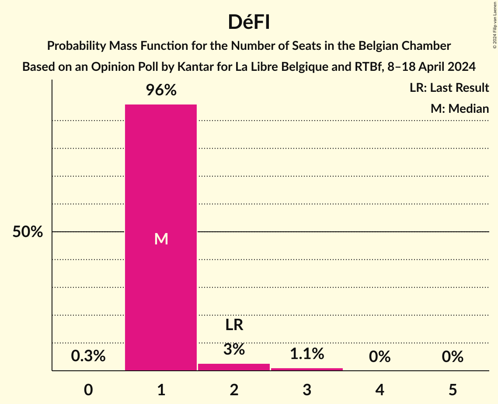

| Number of Seats | Probability | Accumulated | Special Marks |
|:---------------:|:-----------:|:-----------:|:-------------:|
| 0 | 0.3% | 100% |  |
| 1 | 96% | 99.7% | Median |
| 2 | 3% | 4% | Last Result |
| 3 | 1.1% | 1.1% |  |
| 4 | 0% | 0% |  |

## Coalitions

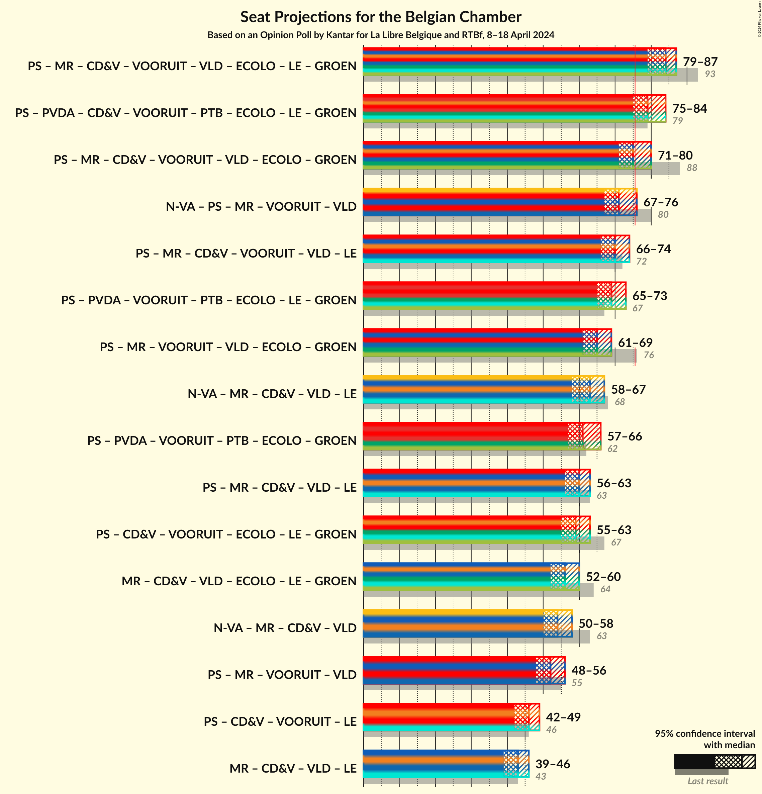

### Confidence Intervals

| Coalition | Last Result | Median | Majority? | 80% Confidence Interval | 90% Confidence Interval | 95% Confidence Interval | 99% Confidence Interval |
|:---------:|:-----------:|:------:|:---------:|:-----------------------:|:-----------------------:|:-----------------------:|:-----------------------:|
| Parti Socialiste – Mouvement Réformateur – Christen-Democratisch en Vlaams – Vooruit – Open Vlaamse Liberalen en Democraten – Ecolo – Les Engagés – Groen | 93 | 84 | 100% | 81–86 | 80–86 | 79–87 | 78–88 |
| Parti Socialiste – Partij van de Arbeid van België – Christen-Democratisch en Vlaams – Vooruit – Parti du Travail de Belgique – Ecolo – Les Engagés – Groen | 79 | 79 | 97% | 77–82 | 76–83 | 75–84 | 74–85 |
| Parti Socialiste – Mouvement Réformateur – Christen-Democratisch en Vlaams – Vooruit – Open Vlaamse Liberalen en Democraten – Ecolo – Groen | 88 | 75 | 49% | 73–78 | 72–79 | 71–80 | 70–81 |
| Nieuw-Vlaamse Alliantie – Parti Socialiste – Mouvement Réformateur – Vooruit – Open Vlaamse Liberalen en Democraten | 80 | 71 | 3% | 69–74 | 68–75 | 67–76 | 66–77 |
| Parti Socialiste – Mouvement Réformateur – Christen-Democratisch en Vlaams – Vooruit – Open Vlaamse Liberalen en Democraten – Les Engagés | 72 | 70 | 0.2% | 68–73 | 67–73 | 66–74 | 65–75 |
| Parti Socialiste – Partij van de Arbeid van België – Vooruit – Parti du Travail de Belgique – Ecolo – Les Engagés – Groen | 67 | 69 | 0.2% | 67–72 | 66–73 | 65–73 | 64–75 |
| Parti Socialiste – Mouvement Réformateur – Vooruit – Open Vlaamse Liberalen en Democraten – Ecolo – Groen | 76 | 65 | 0% | 62–68 | 62–69 | 61–69 | 59–71 |
| Nieuw-Vlaamse Alliantie – Mouvement Réformateur – Christen-Democratisch en Vlaams – Open Vlaamse Liberalen en Democraten – Les Engagés | 68 | 63 | 0% | 60–65 | 59–66 | 58–67 | 57–68 |
| Parti Socialiste – Partij van de Arbeid van België – Vooruit – Parti du Travail de Belgique – Ecolo – Groen | 62 | 61 | 0% | 58–64 | 58–65 | 57–66 | 56–67 |
| Parti Socialiste – Mouvement Réformateur – Christen-Democratisch en Vlaams – Open Vlaamse Liberalen en Democraten – Les Engagés | 63 | 60 | 0% | 58–62 | 57–63 | 56–63 | 55–64 |
| Parti Socialiste – Christen-Democratisch en Vlaams – Vooruit – Ecolo – Les Engagés – Groen | 67 | 59 | 0% | 56–61 | 56–62 | 55–63 | 53–64 |
| Mouvement Réformateur – Christen-Democratisch en Vlaams – Open Vlaamse Liberalen en Democraten – Ecolo – Les Engagés – Groen | 64 | 56 | 0% | 54–59 | 53–59 | 52–60 | 51–61 |
| Nieuw-Vlaamse Alliantie – Mouvement Réformateur – Christen-Democratisch en Vlaams – Open Vlaamse Liberalen en Democraten | 63 | 54 | 0% | 52–57 | 51–58 | 50–58 | 49–60 |
| Parti Socialiste – Mouvement Réformateur – Vooruit – Open Vlaamse Liberalen en Democraten | 55 | 52 | 0% | 49–54 | 49–55 | 48–56 | 46–57 |
| Parti Socialiste – Christen-Democratisch en Vlaams – Vooruit – Les Engagés | 46 | 46 | 0% | 43–48 | 42–48 | 42–49 | 40–50 |
| Mouvement Réformateur – Christen-Democratisch en Vlaams – Open Vlaamse Liberalen en Democraten – Les Engagés | 43 | 43 | 0% | 40–45 | 40–46 | 39–46 | 37–47 |

### Parti Socialiste – Mouvement Réformateur – Christen-Democratisch en Vlaams – Vooruit – Open Vlaamse Liberalen en Democraten – Ecolo – Les Engagés – Groen

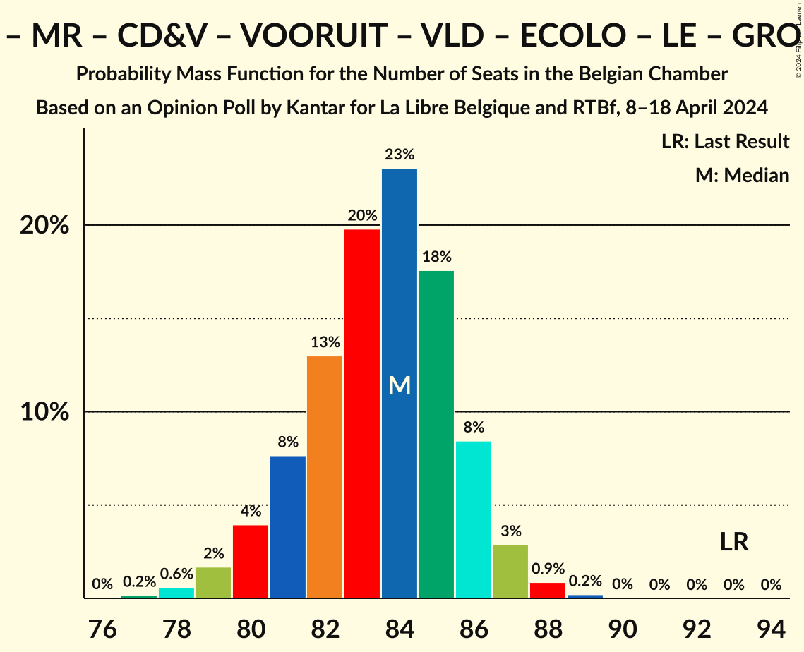

| Number of Seats | Probability | Accumulated | Special Marks |
|:---------------:|:-----------:|:-----------:|:-------------:|
| 76 | 0% | 100% | Majority |
| 77 | 0.2% | 99.9% |  |
| 78 | 0.6% | 99.8% |  |
| 79 | 2% | 99.2% |  |
| 80 | 4% | 97% |  |
| 81 | 8% | 94% |  |
| 82 | 13% | 86% |  |
| 83 | 20% | 73% | Median |
| 84 | 23% | 53% |  |
| 85 | 18% | 30% |  |
| 86 | 8% | 12% |  |
| 87 | 3% | 4% |  |
| 88 | 0.9% | 1.1% |  |
| 89 | 0.2% | 0.3% |  |
| 90 | 0% | 0% |  |
| 91 | 0% | 0% |  |
| 92 | 0% | 0% |  |
| 93 | 0% | 0% | Last Result |

### Parti Socialiste – Partij van de Arbeid van België – Christen-Democratisch en Vlaams – Vooruit – Parti du Travail de Belgique – Ecolo – Les Engagés – Groen

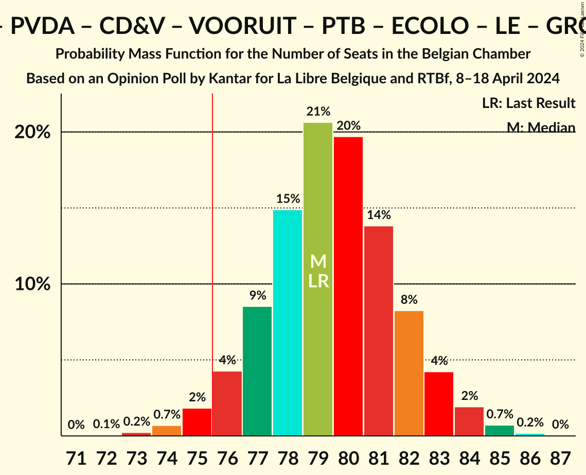

| Number of Seats | Probability | Accumulated | Special Marks |
|:---------------:|:-----------:|:-----------:|:-------------:|
| 72 | 0.1% | 100% |  |
| 73 | 0.2% | 99.9% |  |
| 74 | 0.7% | 99.7% |  |
| 75 | 2% | 99.0% |  |
| 76 | 4% | 97% | Majority |
| 77 | 9% | 93% |  |
| 78 | 15% | 84% |  |
| 79 | 21% | 69% | Last Result, Median |
| 80 | 20% | 49% |  |
| 81 | 14% | 29% |  |
| 82 | 8% | 15% |  |
| 83 | 4% | 7% |  |
| 84 | 2% | 3% |  |
| 85 | 0.7% | 0.9% |  |
| 86 | 0.2% | 0.2% |  |
| 87 | 0% | 0% |  |

### Parti Socialiste – Mouvement Réformateur – Christen-Democratisch en Vlaams – Vooruit – Open Vlaamse Liberalen en Democraten – Ecolo – Groen

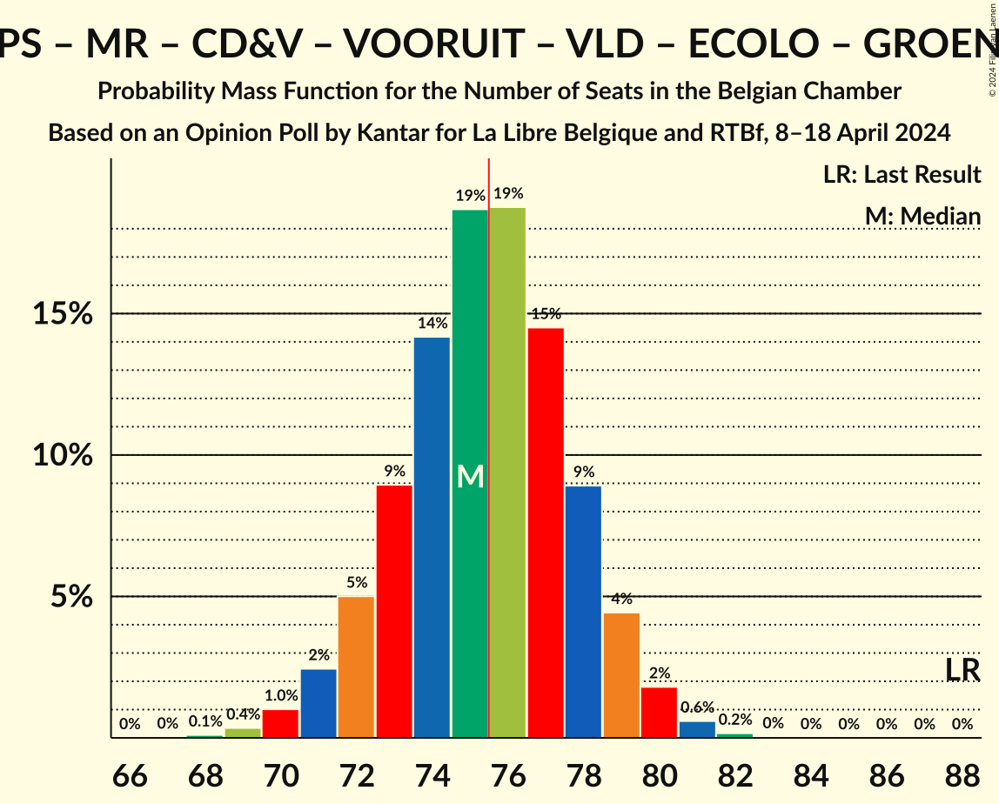

| Number of Seats | Probability | Accumulated | Special Marks |
|:---------------:|:-----------:|:-----------:|:-------------:|
| 68 | 0.1% | 100% |  |
| 69 | 0.4% | 99.9% |  |
| 70 | 1.0% | 99.5% |  |
| 71 | 2% | 98% |  |
| 72 | 5% | 96% |  |
| 73 | 9% | 91% |  |
| 74 | 14% | 82% |  |
| 75 | 19% | 68% | Median |
| 76 | 19% | 49% | Majority |
| 77 | 15% | 30% |  |
| 78 | 9% | 16% |  |
| 79 | 4% | 7% |  |
| 80 | 2% | 3% |  |
| 81 | 0.6% | 0.8% |  |
| 82 | 0.2% | 0.2% |  |
| 83 | 0% | 0% |  |
| 84 | 0% | 0% |  |
| 85 | 0% | 0% |  |
| 86 | 0% | 0% |  |
| 87 | 0% | 0% |  |
| 88 | 0% | 0% | Last Result |

### Nieuw-Vlaamse Alliantie – Parti Socialiste – Mouvement Réformateur – Vooruit – Open Vlaamse Liberalen en Democraten

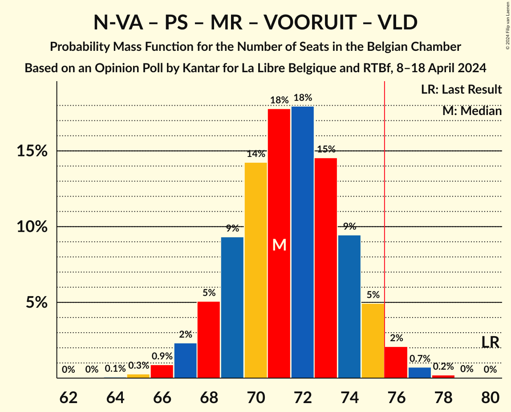

| Number of Seats | Probability | Accumulated | Special Marks |
|:---------------:|:-----------:|:-----------:|:-------------:|
| 64 | 0.1% | 100% |  |
| 65 | 0.3% | 99.9% |  |
| 66 | 0.9% | 99.6% |  |
| 67 | 2% | 98.7% |  |
| 68 | 5% | 96% |  |
| 69 | 9% | 91% |  |
| 70 | 14% | 82% |  |
| 71 | 18% | 68% |  |
| 72 | 18% | 50% | Median |
| 73 | 15% | 32% |  |
| 74 | 9% | 17% |  |
| 75 | 5% | 8% |  |
| 76 | 2% | 3% | Majority |
| 77 | 0.7% | 1.0% |  |
| 78 | 0.2% | 0.3% |  |
| 79 | 0% | 0.1% |  |
| 80 | 0% | 0% | Last Result |

### Parti Socialiste – Mouvement Réformateur – Christen-Democratisch en Vlaams – Vooruit – Open Vlaamse Liberalen en Democraten – Les Engagés

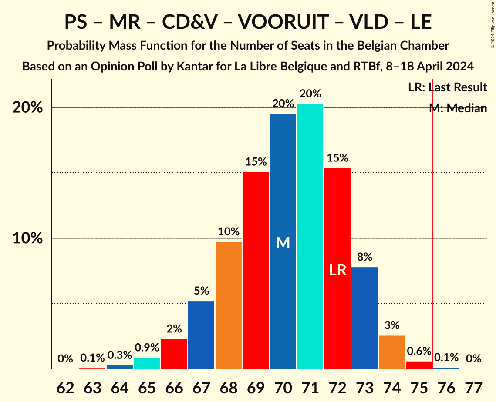

| Number of Seats | Probability | Accumulated | Special Marks |
|:---------------:|:-----------:|:-----------:|:-------------:|
| 63 | 0.1% | 100% |  |
| 64 | 0.3% | 99.9% |  |
| 65 | 0.9% | 99.6% |  |
| 66 | 2% | 98.7% |  |
| 67 | 5% | 96% |  |
| 68 | 10% | 91% |  |
| 69 | 15% | 81% |  |
| 70 | 20% | 66% | Median |
| 71 | 20% | 47% |  |
| 72 | 15% | 27% | Last Result |
| 73 | 8% | 11% |  |
| 74 | 3% | 3% |  |
| 75 | 0.6% | 0.8% |  |
| 76 | 0.1% | 0.2% | Majority |
| 77 | 0% | 0% |  |

### Parti Socialiste – Partij van de Arbeid van België – Vooruit – Parti du Travail de Belgique – Ecolo – Les Engagés – Groen

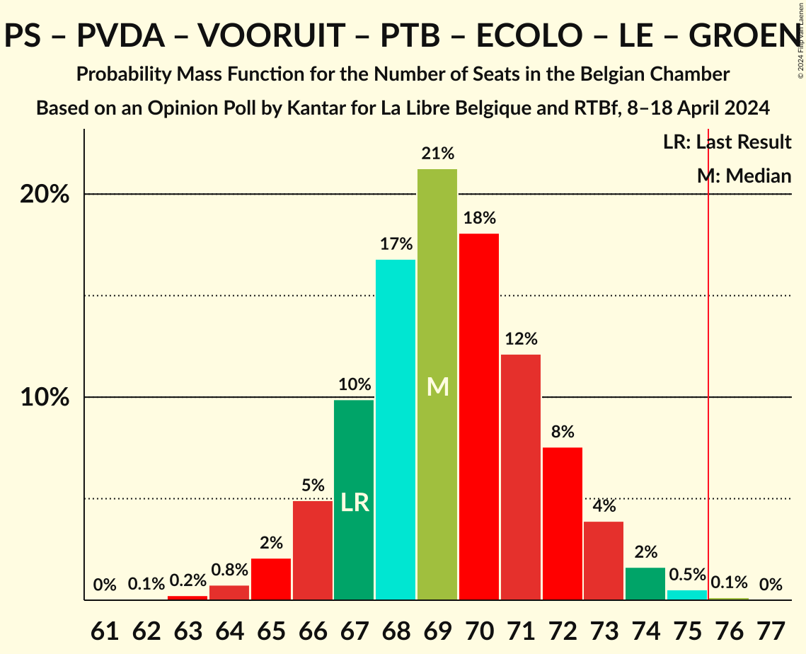

| Number of Seats | Probability | Accumulated | Special Marks |
|:---------------:|:-----------:|:-----------:|:-------------:|
| 62 | 0.1% | 100% |  |
| 63 | 0.2% | 99.9% |  |
| 64 | 0.8% | 99.7% |  |
| 65 | 2% | 98.9% |  |
| 66 | 5% | 97% |  |
| 67 | 10% | 92% | Last Result |
| 68 | 17% | 82% |  |
| 69 | 21% | 65% | Median |
| 70 | 18% | 44% |  |
| 71 | 12% | 26% |  |
| 72 | 8% | 14% |  |
| 73 | 4% | 6% |  |
| 74 | 2% | 2% |  |
| 75 | 0.5% | 0.7% |  |
| 76 | 0.1% | 0.2% | Majority |
| 77 | 0% | 0% |  |

### Parti Socialiste – Mouvement Réformateur – Vooruit – Open Vlaamse Liberalen en Democraten – Ecolo – Groen

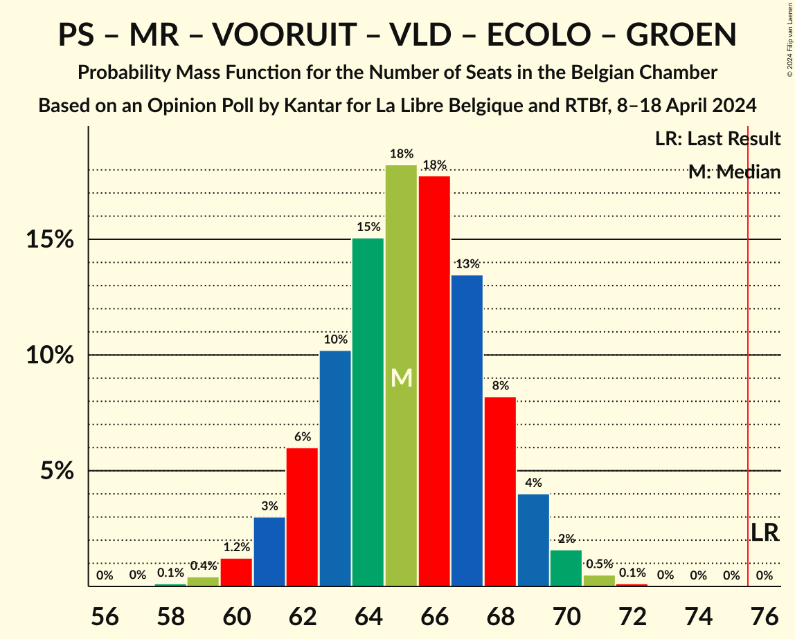

| Number of Seats | Probability | Accumulated | Special Marks |
|:---------------:|:-----------:|:-----------:|:-------------:|
| 58 | 0.1% | 100% |  |
| 59 | 0.4% | 99.8% |  |
| 60 | 1.2% | 99.4% |  |
| 61 | 3% | 98% |  |
| 62 | 6% | 95% |  |
| 63 | 10% | 89% |  |
| 64 | 15% | 79% |  |
| 65 | 18% | 64% | Median |
| 66 | 18% | 46% |  |
| 67 | 13% | 28% |  |
| 68 | 8% | 14% |  |
| 69 | 4% | 6% |  |
| 70 | 2% | 2% |  |
| 71 | 0.5% | 0.7% |  |
| 72 | 0.1% | 0.2% |  |
| 73 | 0% | 0% |  |
| 74 | 0% | 0% |  |
| 75 | 0% | 0% |  |
| 76 | 0% | 0% | Last Result, Majority |

### Nieuw-Vlaamse Alliantie – Mouvement Réformateur – Christen-Democratisch en Vlaams – Open Vlaamse Liberalen en Democraten – Les Engagés

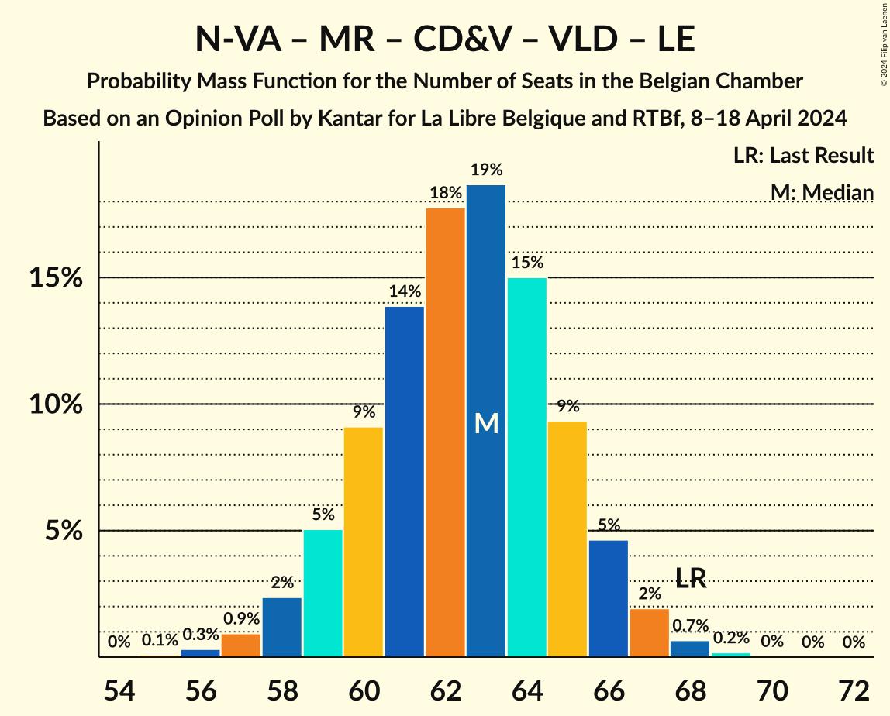

| Number of Seats | Probability | Accumulated | Special Marks |
|:---------------:|:-----------:|:-----------:|:-------------:|
| 55 | 0.1% | 100% |  |
| 56 | 0.3% | 99.9% |  |
| 57 | 0.9% | 99.6% |  |
| 58 | 2% | 98.6% |  |
| 59 | 5% | 96% |  |
| 60 | 9% | 91% |  |
| 61 | 14% | 82% |  |
| 62 | 18% | 68% |  |
| 63 | 19% | 50% | Median |
| 64 | 15% | 32% |  |
| 65 | 9% | 17% |  |
| 66 | 5% | 7% |  |
| 67 | 2% | 3% |  |
| 68 | 0.7% | 0.9% | Last Result |
| 69 | 0.2% | 0.2% |  |
| 70 | 0% | 0.1% |  |
| 71 | 0% | 0% |  |

### Parti Socialiste – Partij van de Arbeid van België – Vooruit – Parti du Travail de Belgique – Ecolo – Groen

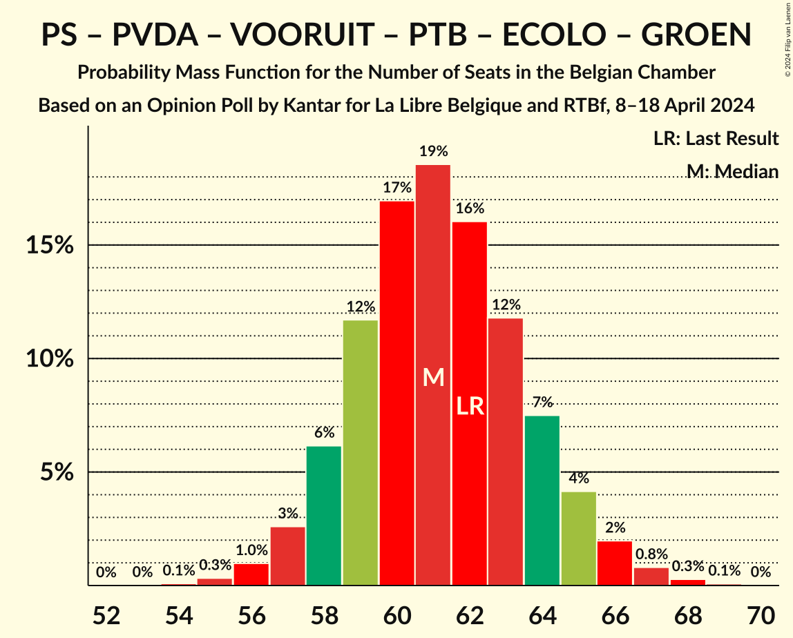

| Number of Seats | Probability | Accumulated | Special Marks |
|:---------------:|:-----------:|:-----------:|:-------------:|
| 54 | 0.1% | 100% |  |
| 55 | 0.3% | 99.9% |  |
| 56 | 1.0% | 99.6% |  |
| 57 | 3% | 98.6% |  |
| 58 | 6% | 96% |  |
| 59 | 12% | 90% |  |
| 60 | 17% | 78% |  |
| 61 | 19% | 61% | Median |
| 62 | 16% | 43% | Last Result |
| 63 | 12% | 27% |  |
| 64 | 7% | 15% |  |
| 65 | 4% | 7% |  |
| 66 | 2% | 3% |  |
| 67 | 0.8% | 1.2% |  |
| 68 | 0.3% | 0.4% |  |
| 69 | 0.1% | 0.1% |  |
| 70 | 0% | 0% |  |

### Parti Socialiste – Mouvement Réformateur – Christen-Democratisch en Vlaams – Open Vlaamse Liberalen en Democraten – Les Engagés

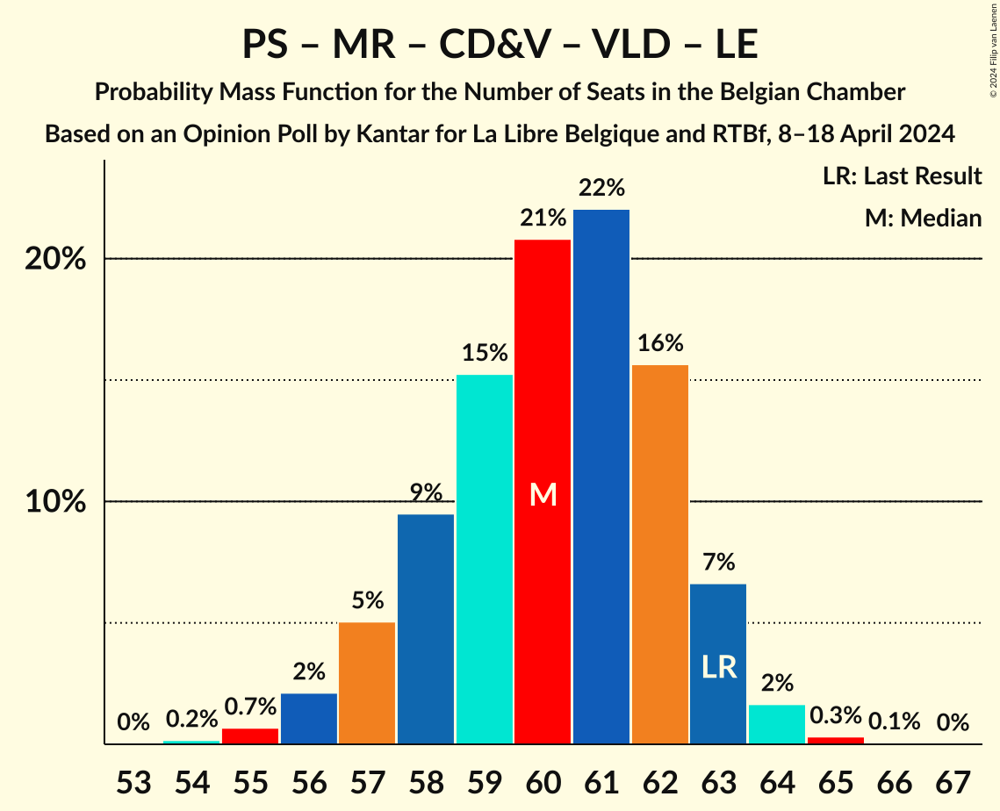

| Number of Seats | Probability | Accumulated | Special Marks |
|:---------------:|:-----------:|:-----------:|:-------------:|
| 54 | 0.2% | 100% |  |
| 55 | 0.7% | 99.8% |  |
| 56 | 2% | 99.1% |  |
| 57 | 5% | 97% |  |
| 58 | 9% | 92% |  |
| 59 | 15% | 82% |  |
| 60 | 21% | 67% | Median |
| 61 | 22% | 46% |  |
| 62 | 16% | 24% |  |
| 63 | 7% | 9% | Last Result |
| 64 | 2% | 2% |  |
| 65 | 0.3% | 0.4% |  |
| 66 | 0.1% | 0.1% |  |
| 67 | 0% | 0% |  |

### Parti Socialiste – Christen-Democratisch en Vlaams – Vooruit – Ecolo – Les Engagés – Groen

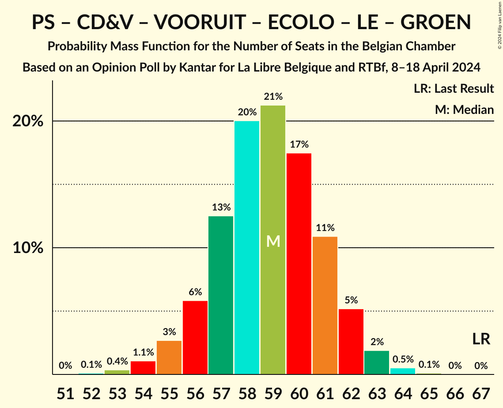

| Number of Seats | Probability | Accumulated | Special Marks |
|:---------------:|:-----------:|:-----------:|:-------------:|
| 52 | 0.1% | 100% |  |
| 53 | 0.4% | 99.9% |  |
| 54 | 1.1% | 99.5% |  |
| 55 | 3% | 98% |  |
| 56 | 6% | 96% |  |
| 57 | 13% | 90% |  |
| 58 | 20% | 77% | Median |
| 59 | 21% | 57% |  |
| 60 | 17% | 36% |  |
| 61 | 11% | 19% |  |
| 62 | 5% | 8% |  |
| 63 | 2% | 3% |  |
| 64 | 0.5% | 0.7% |  |
| 65 | 0.1% | 0.1% |  |
| 66 | 0% | 0% |  |
| 67 | 0% | 0% | Last Result |

### Mouvement Réformateur – Christen-Democratisch en Vlaams – Open Vlaamse Liberalen en Democraten – Ecolo – Les Engagés – Groen

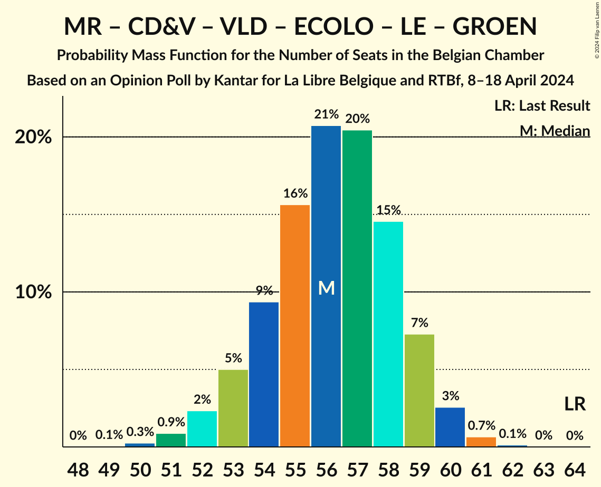

| Number of Seats | Probability | Accumulated | Special Marks |
|:---------------:|:-----------:|:-----------:|:-------------:|
| 49 | 0.1% | 100% |  |
| 50 | 0.3% | 99.9% |  |
| 51 | 0.9% | 99.7% |  |
| 52 | 2% | 98.8% |  |
| 53 | 5% | 96% |  |
| 54 | 9% | 91% |  |
| 55 | 16% | 82% |  |
| 56 | 21% | 66% | Median |
| 57 | 20% | 46% |  |
| 58 | 15% | 25% |  |
| 59 | 7% | 11% |  |
| 60 | 3% | 3% |  |
| 61 | 0.7% | 0.8% |  |
| 62 | 0.1% | 0.2% |  |
| 63 | 0% | 0% |  |
| 64 | 0% | 0% | Last Result |

### Nieuw-Vlaamse Alliantie – Mouvement Réformateur – Christen-Democratisch en Vlaams – Open Vlaamse Liberalen en Democraten

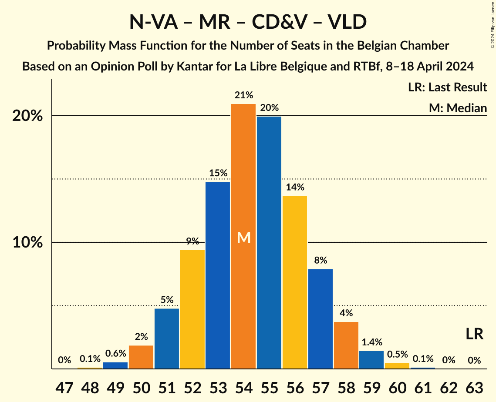

| Number of Seats | Probability | Accumulated | Special Marks |
|:---------------:|:-----------:|:-----------:|:-------------:|
| 48 | 0.1% | 100% |  |
| 49 | 0.6% | 99.8% |  |
| 50 | 2% | 99.3% |  |
| 51 | 5% | 97% |  |
| 52 | 9% | 93% |  |
| 53 | 15% | 83% |  |
| 54 | 21% | 68% |  |
| 55 | 20% | 47% | Median |
| 56 | 14% | 27% |  |
| 57 | 8% | 14% |  |
| 58 | 4% | 6% |  |
| 59 | 1.4% | 2% |  |
| 60 | 0.5% | 0.7% |  |
| 61 | 0.1% | 0.2% |  |
| 62 | 0% | 0% |  |
| 63 | 0% | 0% | Last Result |

### Parti Socialiste – Mouvement Réformateur – Vooruit – Open Vlaamse Liberalen en Democraten

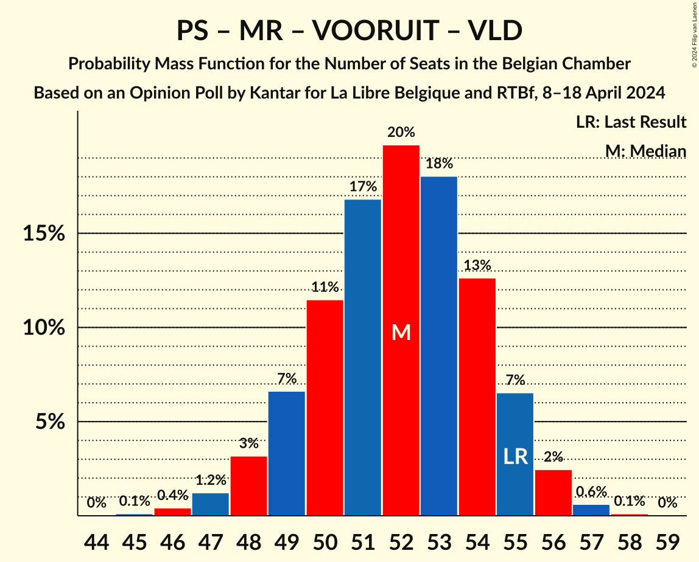

| Number of Seats | Probability | Accumulated | Special Marks |
|:---------------:|:-----------:|:-----------:|:-------------:|
| 45 | 0.1% | 100% |  |
| 46 | 0.4% | 99.9% |  |
| 47 | 1.2% | 99.4% |  |
| 48 | 3% | 98% |  |
| 49 | 7% | 95% |  |
| 50 | 11% | 88% |  |
| 51 | 17% | 77% |  |
| 52 | 20% | 60% | Median |
| 53 | 18% | 40% |  |
| 54 | 13% | 22% |  |
| 55 | 7% | 10% | Last Result |
| 56 | 2% | 3% |  |
| 57 | 0.6% | 0.7% |  |
| 58 | 0.1% | 0.1% |  |
| 59 | 0% | 0% |  |

### Parti Socialiste – Christen-Democratisch en Vlaams – Vooruit – Les Engagés

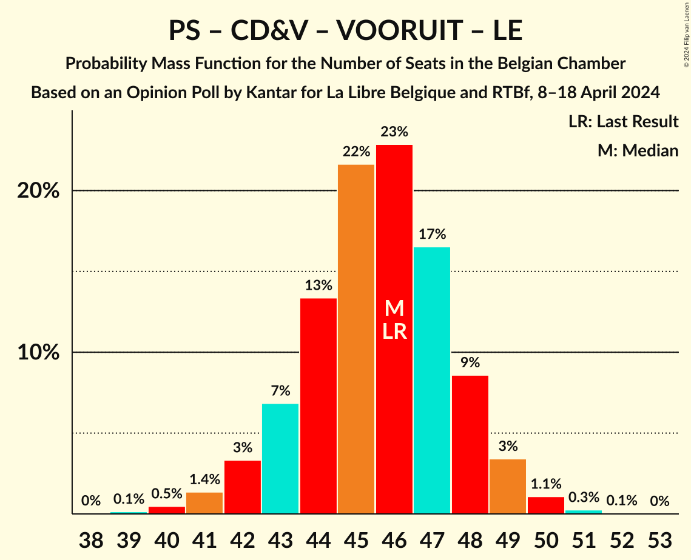

| Number of Seats | Probability | Accumulated | Special Marks |
|:---------------:|:-----------:|:-----------:|:-------------:|
| 38 | 0% | 100% |  |
| 39 | 0.1% | 99.9% |  |
| 40 | 0.5% | 99.8% |  |
| 41 | 1.4% | 99.3% |  |
| 42 | 3% | 98% |  |
| 43 | 7% | 95% |  |
| 44 | 13% | 88% |  |
| 45 | 22% | 74% | Median |
| 46 | 23% | 53% | Last Result |
| 47 | 17% | 30% |  |
| 48 | 9% | 13% |  |
| 49 | 3% | 5% |  |
| 50 | 1.1% | 1.4% |  |
| 51 | 0.3% | 0.3% |  |
| 52 | 0.1% | 0.1% |  |
| 53 | 0% | 0% |  |

### Mouvement Réformateur – Christen-Democratisch en Vlaams – Open Vlaamse Liberalen en Democraten – Les Engagés

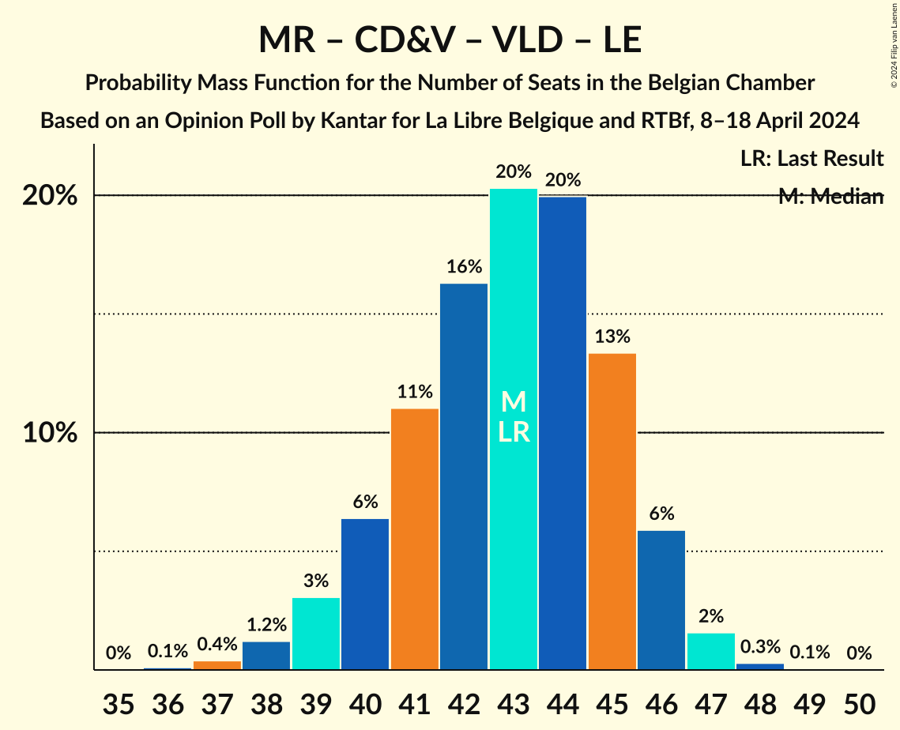

| Number of Seats | Probability | Accumulated | Special Marks |
|:---------------:|:-----------:|:-----------:|:-------------:|
| 36 | 0.1% | 100% |  |
| 37 | 0.4% | 99.9% |  |
| 38 | 1.2% | 99.5% |  |
| 39 | 3% | 98% |  |
| 40 | 6% | 95% |  |
| 41 | 11% | 89% |  |
| 42 | 16% | 78% |  |
| 43 | 20% | 61% | Last Result, Median |
| 44 | 20% | 41% |  |
| 45 | 13% | 21% |  |
| 46 | 6% | 8% |  |
| 47 | 2% | 2% |  |
| 48 | 0.3% | 0.4% |  |
| 49 | 0.1% | 0.1% |  |
| 50 | 0% | 0% |  |

## Technical Information

### Opinion Poll

+ **Polling firm:** Kantar
+ **Commissioner(s):** La Libre Belgique and RTBf
+ **Fieldwork period:** 8–18 April 2024

### Calculations

+ **Sample size:** 1644
+ **Simulations done:** 2,097,152
+ **Error estimate:** 0.76%

