# Opinion Poll by Ipsos for Het Laatste Nieuws, Le Soir, RTL TVi and VTM, 14–20 May 2024

Areas included: Brussels, Flanders, Wallonia

<a href="#voting-intentions">Voting Intentions</a> | <a href="#seats">Seats</a> | <a href="#coalitions">Coalitions</a> | <a href="#technical-information">Technical Information</a>

## Voting Intentions

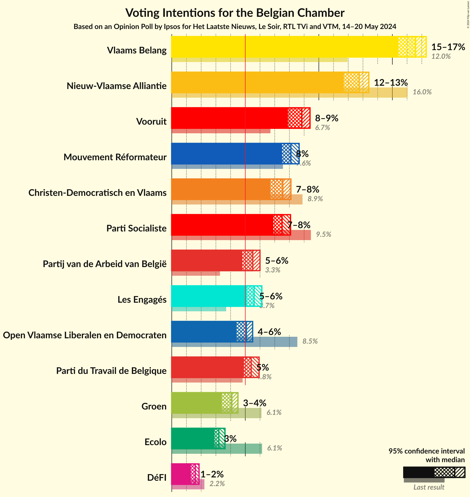

### Confidence Intervals

| Party | Last Result | Poll Result | 80% Confidence Interval | 90% Confidence Interval | 95% Confidence Interval | 99% Confidence Interval |
|:-----:|:-----------:|:-----------:|:-----------------------:|:-----------------------:|:-----------------------:|:-----------------------:|
| Vlaams Belang | 12.0% | 16.6% | 15.8–17.1% |15.6–17.2% |15.4–17.3% |15.0–17.3% |
| Nieuw-Vlaamse Alliantie | 16.0% | 12.7% | 12.0–13.2% |11.8–13.4% |11.7–13.4% |11.3–13.5% |
| Vooruit | 6.7% | 8.8% | 8.2–9.3% |8.1–9.4% |7.9–9.4% |7.6–9.5% |
| Mouvement Réformateur | 7.6% | 8.7% | 7.7–8.1% |7.6–8.1% |7.5–8.1% |7.3–8.1% |
| Parti Socialiste | 9.5% | 8.1% | 7.1–7.5% |7.0–7.5% |6.9–7.5% |6.7–7.5% |
| Christen-Democratisch en Vlaams | 8.9% | 7.5% | 7.0–8.0% |6.8–8.0% |6.7–8.1% |6.4–8.1% |
| Les Engagés | 3.7% | 6.1% | 5.3–5.6% |5.2–5.6% |5.1–5.6% |4.9–5.6% |
| Parti du Travail de Belgique | 4.8% | 5.9% | 5.1–5.4% |5.0–5.4% |4.9–5.4% |4.8–5.4% |
| Partij van de Arbeid van België | 3.3% | 5.5% | 5.0–5.9% |4.9–5.9% |4.8–6.0% |4.5–6.0% |
| Open Vlaamse Liberalen en Democraten | 8.5% | 5.1% | 4.6–5.4% |4.5–5.5% |4.4–5.5% |4.1–5.6% |
| Groen | 6.1% | 4.1% | 3.7–4.4% |3.5–4.5% |3.4–4.5% |3.3–4.5% |
| Ecolo | 6.1% | 3.6% | 3.0–3.2% |2.9–3.2% |2.9–3.2% |2.7–3.2% |
| DéFI | 2.2% | 1.9% | 1.4–1.6% |1.4–1.6% |1.3–1.6% |1.2–1.6% |

*Note:* The poll result column reflects the actual value used in the calculations. Published results may vary slightly, and in addition be rounded to fewer digits.

## Seats

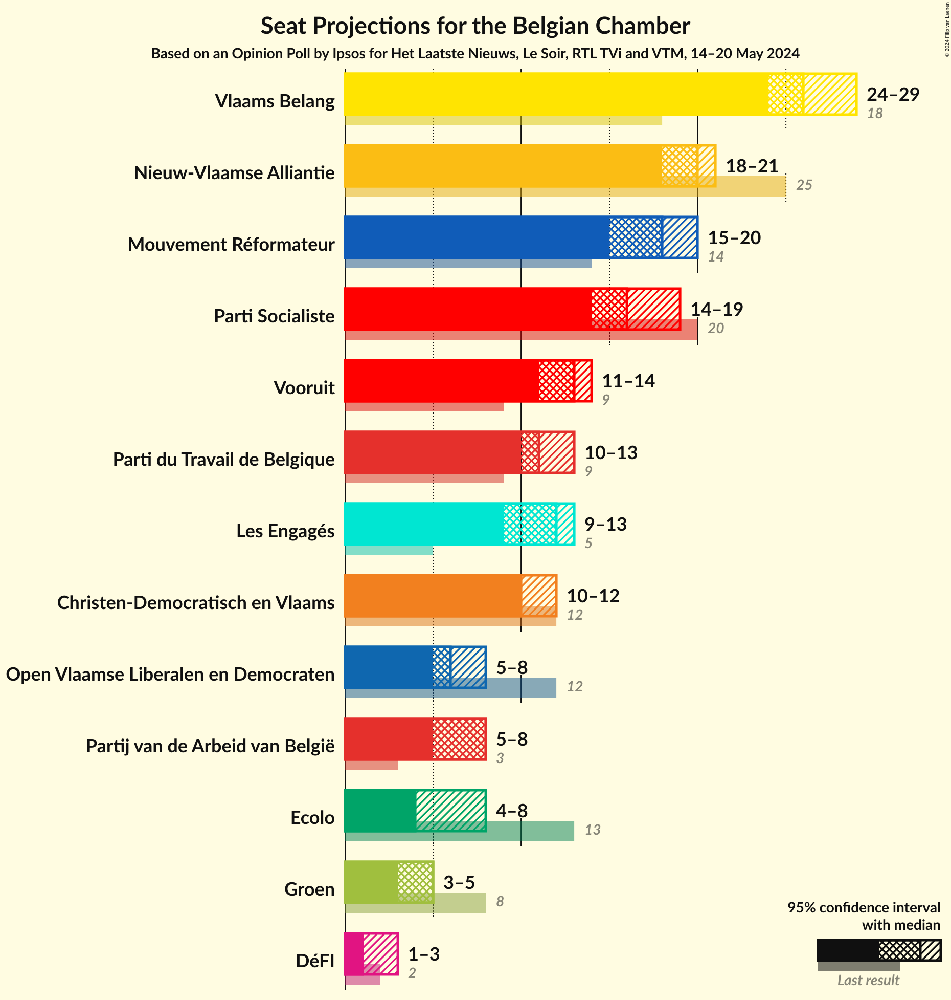

### Confidence Intervals

| Party | Last Result | Median | 80% Confidence Interval | 90% Confidence Interval | 95% Confidence Interval | 99% Confidence Interval |
|:-----:|:-----------:|:------:|:-----------------------:|:-----------------------:|:-----------------------:|:-----------------------:|
| <a href="#vlaams-belang">Vlaams Belang</a> | 18 | 26 | 25–28 |25–28 |24–29 |23–29 |
| <a href="#nieuw-vlaamse-alliantie">Nieuw-Vlaamse Alliantie</a> | 25 | 20 | 18–21 |18–21 |18–21 |17–22 |
| <a href="#vooruit">Vooruit</a> | 9 | 13 | 12–14 |11–14 |11–14 |11–16 |
| <a href="#mouvement-réformateur">Mouvement Réformateur</a> | 14 | 18 | 16–19 |15–19 |15–20 |14–21 |
| <a href="#parti-socialiste">Parti Socialiste</a> | 20 | 16 | 15–17 |14–18 |14–19 |13–20 |
| <a href="#christen-democratisch-en-vlaams">Christen-Democratisch en Vlaams</a> | 12 | 10 | 10–11 |10–11 |10–12 |10–13 |
| <a href="#les-engagés">Les Engagés</a> | 5 | 12 | 10–13 |9–13 |9–13 |9–14 |
| <a href="#parti-du-travail-de-belgique">Parti du Travail de Belgique</a> | 9 | 11 | 10–12 |10–13 |10–13 |9–13 |
| <a href="#partij-van-de-arbeid-van-belgië">Partij van de Arbeid van België</a> | 3 | 8 | 7–8 |6–8 |5–8 |5–9 |
| <a href="#open-vlaamse-liberalen-en-democraten">Open Vlaamse Liberalen en Democraten</a> | 12 | 6 | 6–7 |5–7 |5–8 |4–9 |
| <a href="#groen">Groen</a> | 8 | 5 | 3–5 |3–5 |3–5 |3–7 |
| <a href="#ecolo">Ecolo</a> | 13 | 4 | 4–7 |4–8 |4–8 |3–9 |
| <a href="#défi">DéFI</a> | 2 | 1 | 1 |1–2 |1–3 |0–3 |

### Vlaams Belang

*For a full overview of the results for this party, see the [Vlaams Belang](party-vlaamsbelang.html) page.*

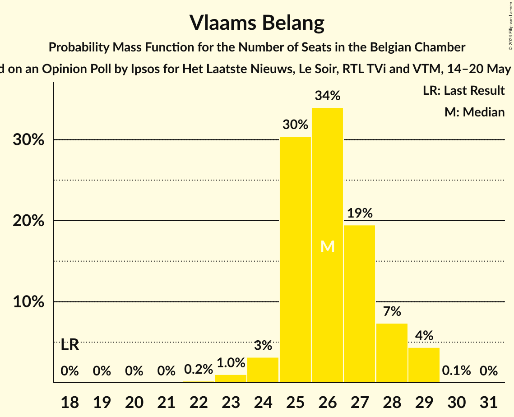

| Number of Seats | Probability | Accumulated | Special Marks |
|:---------------:|:-----------:|:-----------:|:-------------:|
| 18 | 0% | 100% | Last Result |
| 19 | 0% | 100% |  |
| 20 | 0% | 100% |  |
| 21 | 0% | 100% |  |
| 22 | 0.2% | 100% |  |
| 23 | 1.0% | 99.8% |  |
| 24 | 3% | 98.8% |  |
| 25 | 30% | 96% |  |
| 26 | 34% | 65% | Median |
| 27 | 19% | 31% |  |
| 28 | 7% | 12% |  |
| 29 | 4% | 4% |  |
| 30 | 0.1% | 0.1% |  |
| 31 | 0% | 0% |  |

### Nieuw-Vlaamse Alliantie

*For a full overview of the results for this party, see the [Nieuw-Vlaamse Alliantie](party-nieuw-vlaamsealliantie.html) page.*

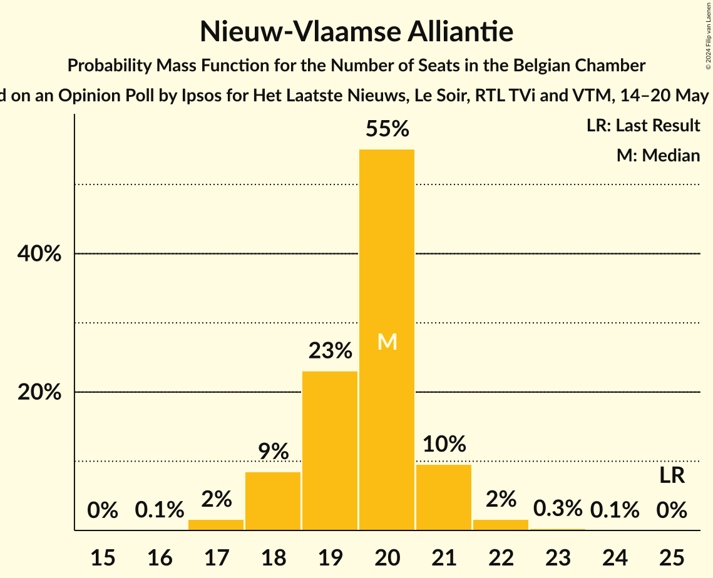

| Number of Seats | Probability | Accumulated | Special Marks |
|:---------------:|:-----------:|:-----------:|:-------------:|
| 16 | 0.1% | 100% |  |
| 17 | 2% | 99.9% |  |
| 18 | 9% | 98% |  |
| 19 | 23% | 90% |  |
| 20 | 55% | 67% | Median |
| 21 | 10% | 12% |  |
| 22 | 2% | 2% |  |
| 23 | 0.3% | 0.4% |  |
| 24 | 0.1% | 0.1% |  |
| 25 | 0% | 0% | Last Result |

### Vooruit

*For a full overview of the results for this party, see the [Vooruit](party-vooruit.html) page.*

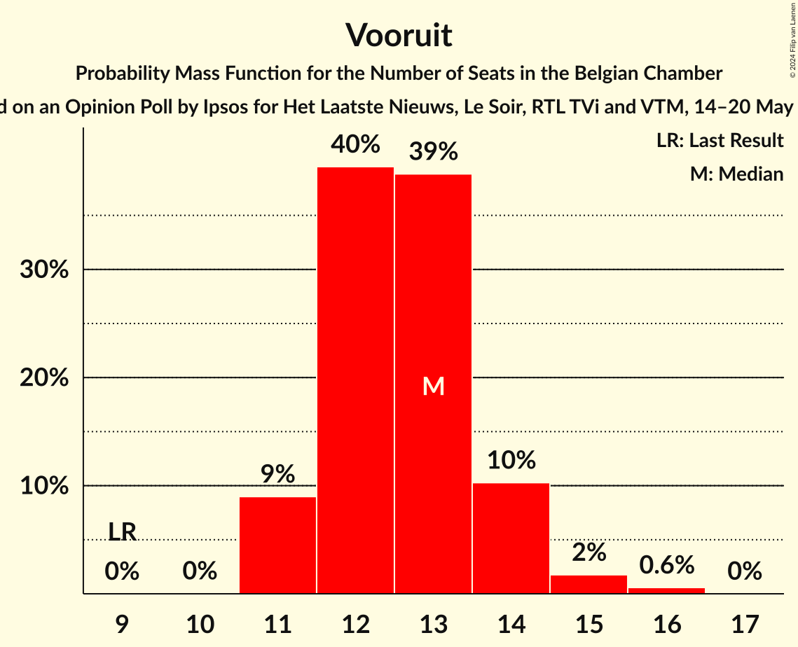

| Number of Seats | Probability | Accumulated | Special Marks |
|:---------------:|:-----------:|:-----------:|:-------------:|
| 9 | 0% | 100% | Last Result |
| 10 | 0% | 100% |  |
| 11 | 9% | 100% |  |
| 12 | 40% | 91% |  |
| 13 | 39% | 51% | Median |
| 14 | 10% | 13% |  |
| 15 | 2% | 2% |  |
| 16 | 0.6% | 0.6% |  |
| 17 | 0% | 0% |  |

### Mouvement Réformateur

*For a full overview of the results for this party, see the [Mouvement Réformateur](party-mouvementréformateur.html) page.*

| Number of Seats | Probability | Accumulated | Special Marks |
|:---------------:|:-----------:|:-----------:|:-------------:|
| 14 | 2% | 100% | Last Result |
| 15 | 4% | 98% |  |
| 16 | 7% | 94% |  |
| 17 | 13% | 88% |  |
| 18 | 44% | 75% | Median |
| 19 | 27% | 31% |  |
| 20 | 3% | 3% |  |
| 21 | 0.4% | 0.6% |  |
| 22 | 0.1% | 0.1% |  |
| 23 | 0% | 0% |  |

### Parti Socialiste

*For a full overview of the results for this party, see the [Parti Socialiste](party-partisocialiste.html) page.*

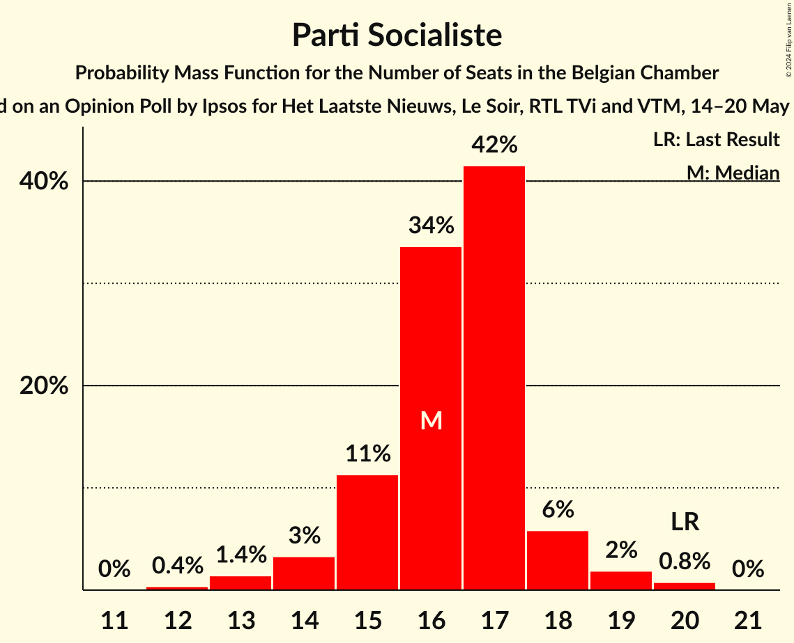

| Number of Seats | Probability | Accumulated | Special Marks |
|:---------------:|:-----------:|:-----------:|:-------------:|
| 12 | 0.4% | 100% |  |
| 13 | 1.4% | 99.6% |  |
| 14 | 3% | 98% |  |
| 15 | 11% | 95% |  |
| 16 | 34% | 84% | Median |
| 17 | 42% | 50% |  |
| 18 | 6% | 8% |  |
| 19 | 2% | 3% |  |
| 20 | 0.8% | 0.8% | Last Result |
| 21 | 0% | 0% |  |

### Christen-Democratisch en Vlaams

*For a full overview of the results for this party, see the [Christen-Democratisch en Vlaams](party-christen-democratischenvlaams.html) page.*

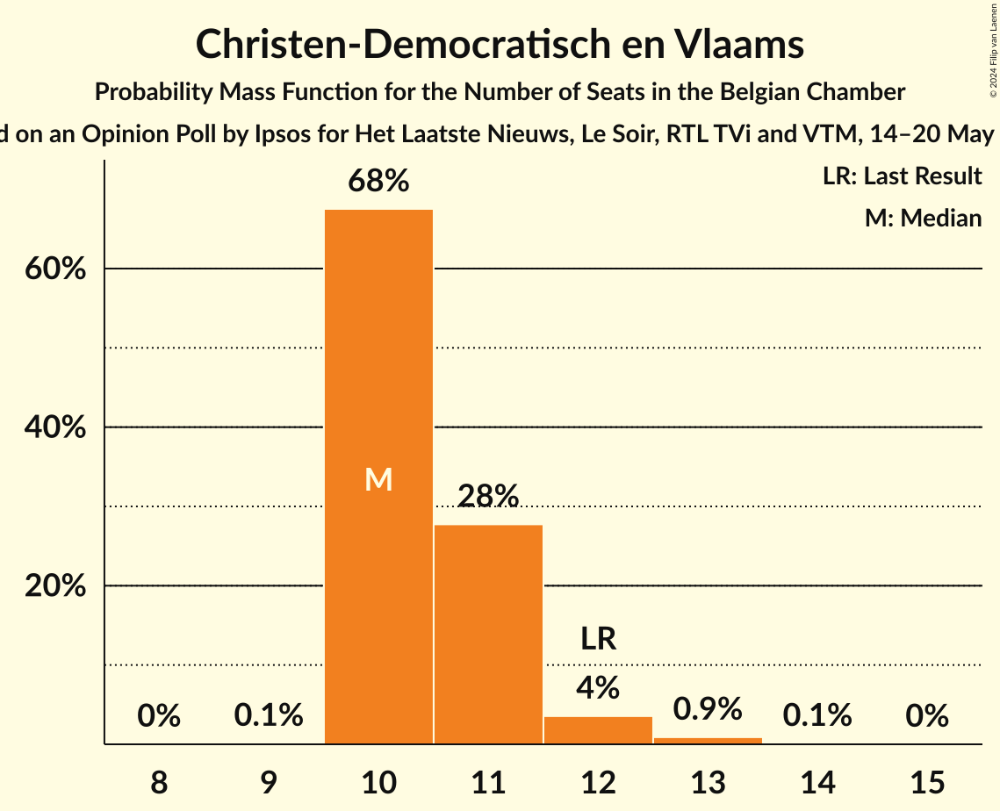

| Number of Seats | Probability | Accumulated | Special Marks |
|:---------------:|:-----------:|:-----------:|:-------------:|
| 9 | 0.1% | 100% |  |
| 10 | 68% | 99.8% | Median |
| 11 | 28% | 32% |  |
| 12 | 4% | 5% | Last Result |
| 13 | 0.9% | 1.0% |  |
| 14 | 0.1% | 0.1% |  |
| 15 | 0% | 0% |  |

### Les Engagés

*For a full overview of the results for this party, see the [Les Engagés](party-lesengagés.html) page.*

| Number of Seats | Probability | Accumulated | Special Marks |
|:---------------:|:-----------:|:-----------:|:-------------:|
| 5 | 0% | 100% | Last Result |
| 6 | 0% | 100% |  |
| 7 | 0% | 100% |  |
| 8 | 0% | 100% |  |
| 9 | 6% | 100% |  |
| 10 | 12% | 94% |  |
| 11 | 30% | 81% |  |
| 12 | 38% | 51% | Median |
| 13 | 10% | 12% |  |
| 14 | 2% | 2% |  |
| 15 | 0.3% | 0.3% |  |
| 16 | 0% | 0% |  |

### Parti du Travail de Belgique

*For a full overview of the results for this party, see the [Parti du Travail de Belgique](party-partidutravaildebelgique.html) page.*

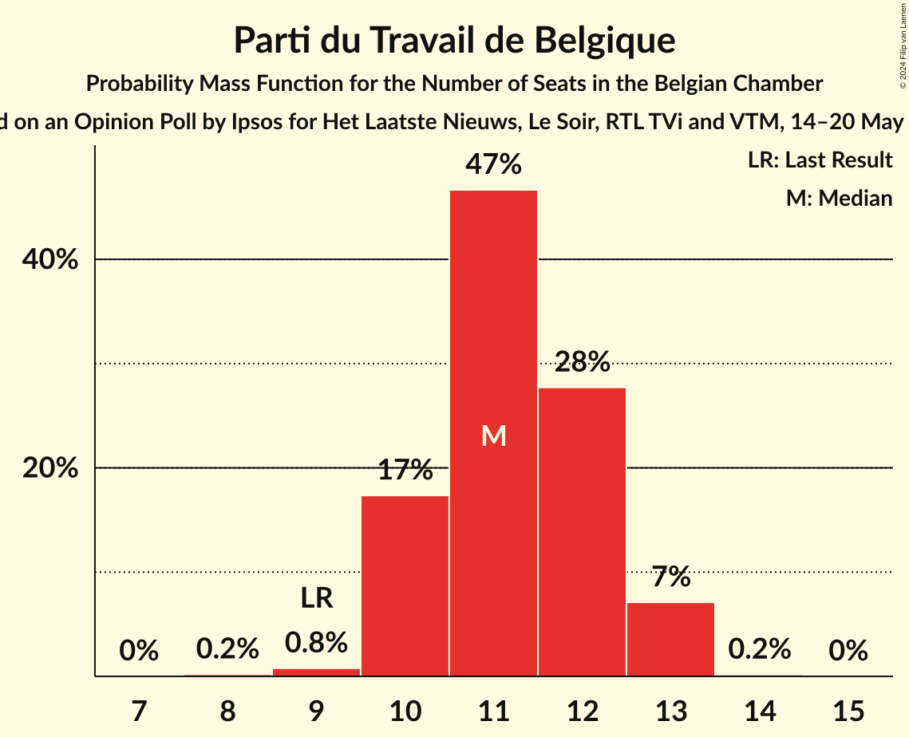

| Number of Seats | Probability | Accumulated | Special Marks |
|:---------------:|:-----------:|:-----------:|:-------------:|
| 8 | 0.2% | 100% |  |
| 9 | 0.8% | 99.8% | Last Result |
| 10 | 17% | 99.0% |  |
| 11 | 47% | 82% | Median |
| 12 | 28% | 35% |  |
| 13 | 7% | 7% |  |
| 14 | 0.2% | 0.2% |  |
| 15 | 0% | 0% |  |

### Partij van de Arbeid van België

*For a full overview of the results for this party, see the [Partij van de Arbeid van België](party-partijvandearbeidvanbelgië.html) page.*

| Number of Seats | Probability | Accumulated | Special Marks |
|:---------------:|:-----------:|:-----------:|:-------------:|
| 3 | 0% | 100% | Last Result |
| 4 | 0% | 100% |  |
| 5 | 4% | 100% |  |
| 6 | 5% | 96% |  |
| 7 | 15% | 91% |  |
| 8 | 75% | 76% | Median |
| 9 | 1.5% | 2% |  |
| 10 | 0.1% | 0.1% |  |
| 11 | 0% | 0% |  |

### Open Vlaamse Liberalen en Democraten

*For a full overview of the results for this party, see the [Open Vlaamse Liberalen en Democraten](party-openvlaamseliberalenendemocraten.html) page.*

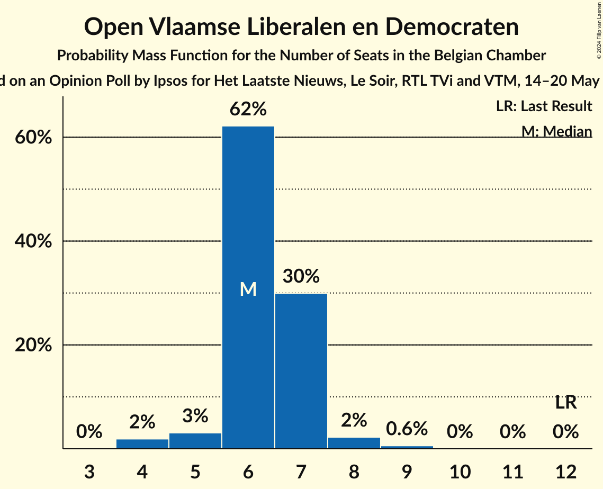

| Number of Seats | Probability | Accumulated | Special Marks |
|:---------------:|:-----------:|:-----------:|:-------------:|
| 4 | 2% | 100% |  |
| 5 | 3% | 98% |  |
| 6 | 62% | 95% | Median |
| 7 | 30% | 33% |  |
| 8 | 2% | 3% |  |
| 9 | 0.6% | 0.6% |  |
| 10 | 0% | 0% |  |
| 11 | 0% | 0% |  |
| 12 | 0% | 0% | Last Result |

### Groen

*For a full overview of the results for this party, see the [Groen](party-groen.html) page.*

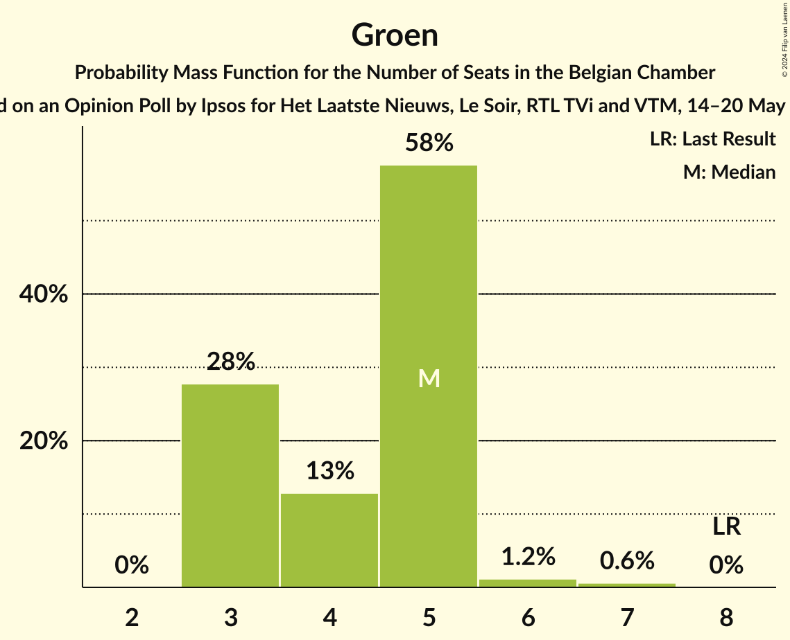

| Number of Seats | Probability | Accumulated | Special Marks |
|:---------------:|:-----------:|:-----------:|:-------------:|
| 3 | 28% | 100% |  |
| 4 | 13% | 72% |  |
| 5 | 58% | 59% | Median |
| 6 | 1.2% | 2% |  |
| 7 | 0.6% | 0.6% |  |
| 8 | 0% | 0% | Last Result |

### Ecolo

*For a full overview of the results for this party, see the [Ecolo](party-ecolo.html) page.*

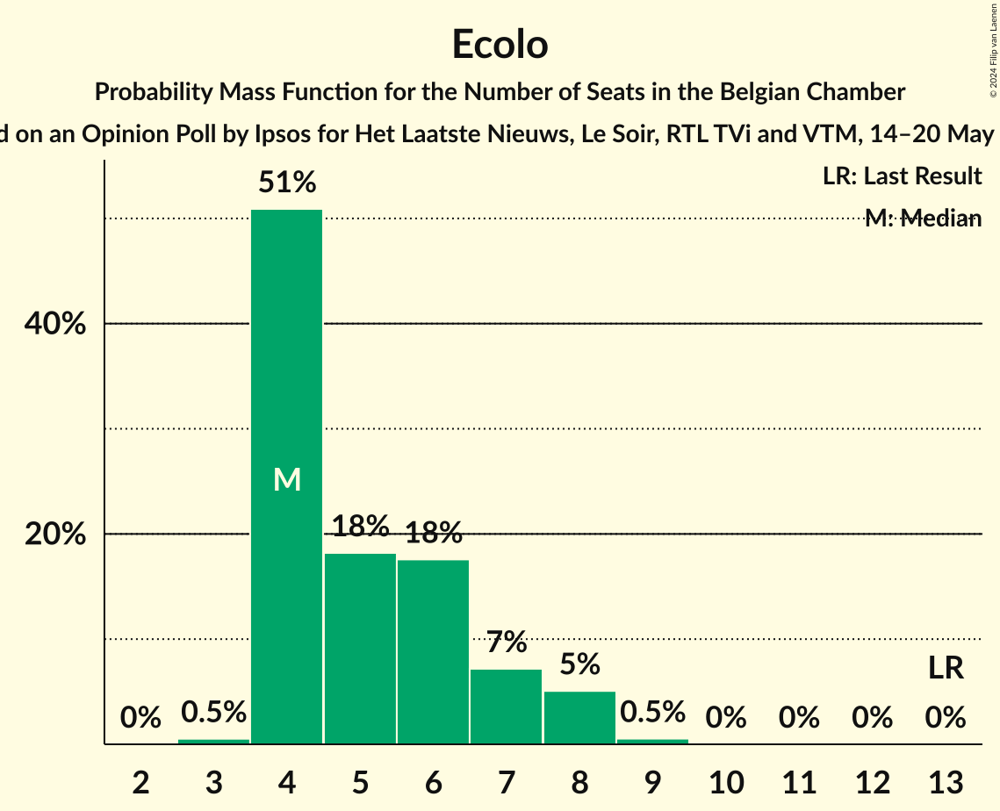

| Number of Seats | Probability | Accumulated | Special Marks |
|:---------------:|:-----------:|:-----------:|:-------------:|
| 3 | 0.5% | 100% |  |
| 4 | 51% | 99.5% | Median |
| 5 | 18% | 49% |  |
| 6 | 18% | 30% |  |
| 7 | 7% | 13% |  |
| 8 | 5% | 6% |  |
| 9 | 0.5% | 0.5% |  |
| 10 | 0% | 0% |  |
| 11 | 0% | 0% |  |
| 12 | 0% | 0% |  |
| 13 | 0% | 0% | Last Result |

### DéFI

*For a full overview of the results for this party, see the [DéFI](party-défi.html) page.*

| Number of Seats | Probability | Accumulated | Special Marks |
|:---------------:|:-----------:|:-----------:|:-------------:|
| 0 | 0.7% | 100% |  |
| 1 | 90% | 99.3% | Median |
| 2 | 6% | 9% | Last Result |
| 3 | 3% | 3% |  |
| 4 | 0.1% | 0.1% |  |
| 5 | 0% | 0% |  |

## Coalitions

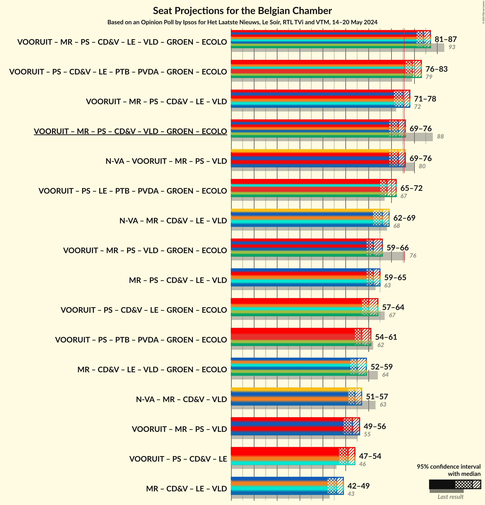

### Confidence Intervals

| Coalition | Last Result | Median | Majority? | 80% Confidence Interval | 90% Confidence Interval | 95% Confidence Interval | 99% Confidence Interval |
|:---------:|:-----------:|:------:|:---------:|:-----------------------:|:-----------------------:|:-----------------------:|:-----------------------:|
| Vooruit – Mouvement Réformateur – Parti Socialiste – Christen-Democratisch en Vlaams – Les Engagés – Open Vlaamse Liberalen en Democraten – Groen – Ecolo | 93 | 84 | 100% | 82–86 | 82–87 | 81–87 | 80–88 |
| Vooruit – Parti Socialiste – Christen-Democratisch en Vlaams – Les Engagés – Parti du Travail de Belgique – Partij van de Arbeid van België – Groen – Ecolo | 79 | 79 | 98% | 77–81 | 76–82 | 76–83 | 75–84 |
| Vooruit – Mouvement Réformateur – Parti Socialiste – Christen-Democratisch en Vlaams – Les Engagés – Open Vlaamse Liberalen en Democraten | 72 | 75 | 39% | 72–77 | 72–78 | 71–78 | 70–79 |
| Vooruit – Mouvement Réformateur – Parti Socialiste – Christen-Democratisch en Vlaams – Open Vlaamse Liberalen en Democraten – Groen – Ecolo | 88 | 73 | 7% | 71–75 | 70–76 | 69–76 | 68–78 |
| Nieuw-Vlaamse Alliantie – Vooruit – Mouvement Réformateur – Parti Socialiste – Open Vlaamse Liberalen en Democraten | 80 | 73 | 6% | 70–75 | 70–76 | 69–76 | 68–77 |
| Vooruit – Parti Socialiste – Les Engagés – Parti du Travail de Belgique – Partij van de Arbeid van België – Groen – Ecolo | 67 | 68 | 0% | 66–71 | 66–72 | 65–72 | 64–74 |
| Nieuw-Vlaamse Alliantie – Mouvement Réformateur – Christen-Democratisch en Vlaams – Les Engagés – Open Vlaamse Liberalen en Democraten | 68 | 66 | 0% | 63–68 | 62–69 | 62–69 | 61–70 |
| Vooruit – Mouvement Réformateur – Parti Socialiste – Open Vlaamse Liberalen en Democraten – Groen – Ecolo | 76 | 62 | 0% | 60–65 | 60–65 | 59–66 | 58–67 |
| Mouvement Réformateur – Parti Socialiste – Christen-Democratisch en Vlaams – Les Engagés – Open Vlaamse Liberalen en Democraten | 63 | 62 | 0% | 60–64 | 60–65 | 59–65 | 58–67 |
| Vooruit – Parti Socialiste – Christen-Democratisch en Vlaams – Les Engagés – Groen – Ecolo | 67 | 60 | 0% | 58–62 | 57–63 | 57–64 | 56–65 |
| Vooruit – Parti Socialiste – Parti du Travail de Belgique – Partij van de Arbeid van België – Groen – Ecolo | 62 | 57 | 0% | 55–60 | 54–60 | 54–61 | 53–62 |
| Mouvement Réformateur – Christen-Democratisch en Vlaams – Les Engagés – Open Vlaamse Liberalen en Democraten – Groen – Ecolo | 64 | 55 | 0% | 53–57 | 53–58 | 52–59 | 51–60 |
| Nieuw-Vlaamse Alliantie – Mouvement Réformateur – Christen-Democratisch en Vlaams – Open Vlaamse Liberalen en Democraten | 63 | 54 | 0% | 52–56 | 51–57 | 51–57 | 49–58 |
| Vooruit – Mouvement Réformateur – Parti Socialiste – Open Vlaamse Liberalen en Democraten | 55 | 53 | 0% | 51–55 | 50–56 | 49–56 | 48–57 |
| Vooruit – Parti Socialiste – Christen-Democratisch en Vlaams – Les Engagés | 46 | 51 | 0% | 48–53 | 48–54 | 47–54 | 46–55 |
| Mouvement Réformateur – Christen-Democratisch en Vlaams – Les Engagés – Open Vlaamse Liberalen en Democraten | 43 | 46 | 0% | 44–48 | 43–49 | 42–49 | 41–50 |

### Vooruit – Mouvement Réformateur – Parti Socialiste – Christen-Democratisch en Vlaams – Les Engagés – Open Vlaamse Liberalen en Democraten – Groen – Ecolo

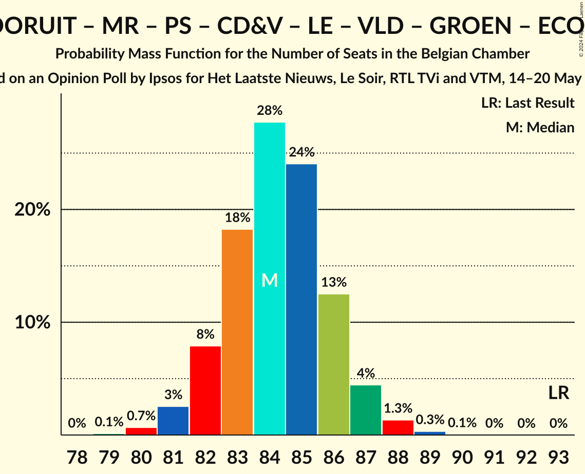

| Number of Seats | Probability | Accumulated | Special Marks |
|:---------------:|:-----------:|:-----------:|:-------------:|
| 79 | 0.1% | 100% |  |
| 80 | 0.7% | 99.8% |  |
| 81 | 3% | 99.2% |  |
| 82 | 8% | 97% |  |
| 83 | 18% | 89% |  |
| 84 | 28% | 70% | Median |
| 85 | 24% | 43% |  |
| 86 | 13% | 19% |  |
| 87 | 4% | 6% |  |
| 88 | 1.3% | 2% |  |
| 89 | 0.3% | 0.4% |  |
| 90 | 0.1% | 0.1% |  |
| 91 | 0% | 0% |  |
| 92 | 0% | 0% |  |
| 93 | 0% | 0% | Last Result |

### Vooruit – Parti Socialiste – Christen-Democratisch en Vlaams – Les Engagés – Parti du Travail de Belgique – Partij van de Arbeid van België – Groen – Ecolo

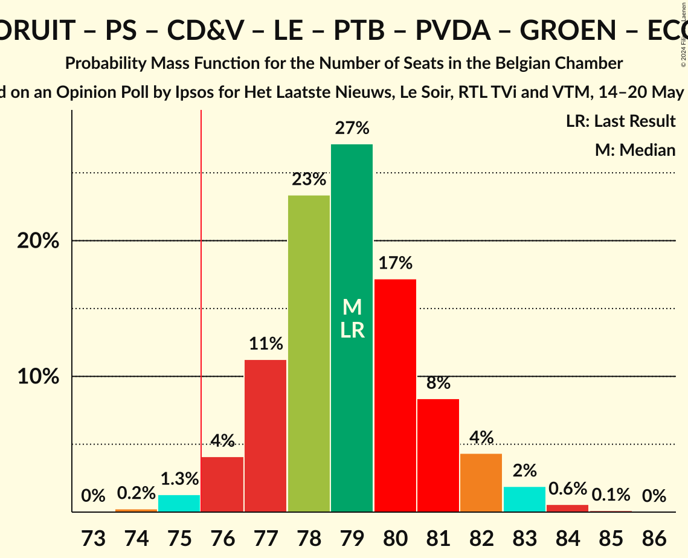

| Number of Seats | Probability | Accumulated | Special Marks |
|:---------------:|:-----------:|:-----------:|:-------------:|
| 73 | 0% | 100% |  |
| 74 | 0.2% | 99.9% |  |
| 75 | 1.3% | 99.7% |  |
| 76 | 4% | 98% | Majority |
| 77 | 11% | 94% |  |
| 78 | 23% | 83% |  |
| 79 | 27% | 60% | Last Result, Median |
| 80 | 17% | 33% |  |
| 81 | 8% | 15% |  |
| 82 | 4% | 7% |  |
| 83 | 2% | 3% |  |
| 84 | 0.6% | 0.7% |  |
| 85 | 0.1% | 0.2% |  |
| 86 | 0% | 0% |  |

### Vooruit – Mouvement Réformateur – Parti Socialiste – Christen-Democratisch en Vlaams – Les Engagés – Open Vlaamse Liberalen en Democraten

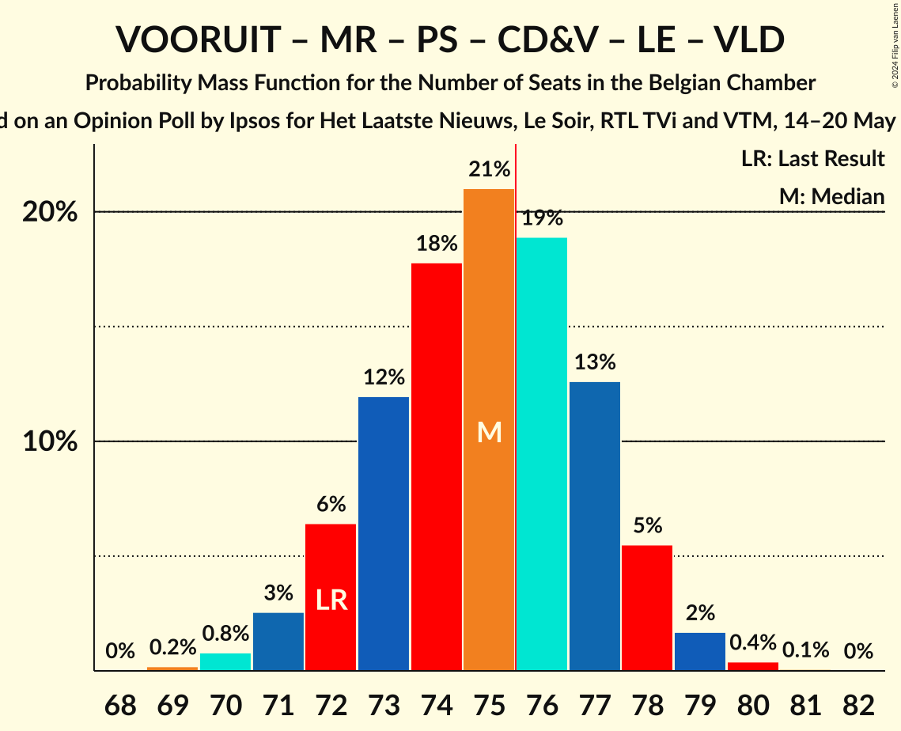

| Number of Seats | Probability | Accumulated | Special Marks |
|:---------------:|:-----------:|:-----------:|:-------------:|
| 69 | 0.2% | 100% |  |
| 70 | 0.8% | 99.8% |  |
| 71 | 3% | 99.0% |  |
| 72 | 6% | 96% | Last Result |
| 73 | 12% | 90% |  |
| 74 | 18% | 78% |  |
| 75 | 21% | 60% | Median |
| 76 | 19% | 39% | Majority |
| 77 | 13% | 20% |  |
| 78 | 5% | 8% |  |
| 79 | 2% | 2% |  |
| 80 | 0.4% | 0.5% |  |
| 81 | 0.1% | 0.1% |  |
| 82 | 0% | 0% |  |

### Vooruit – Mouvement Réformateur – Parti Socialiste – Christen-Democratisch en Vlaams – Open Vlaamse Liberalen en Democraten – Groen – Ecolo

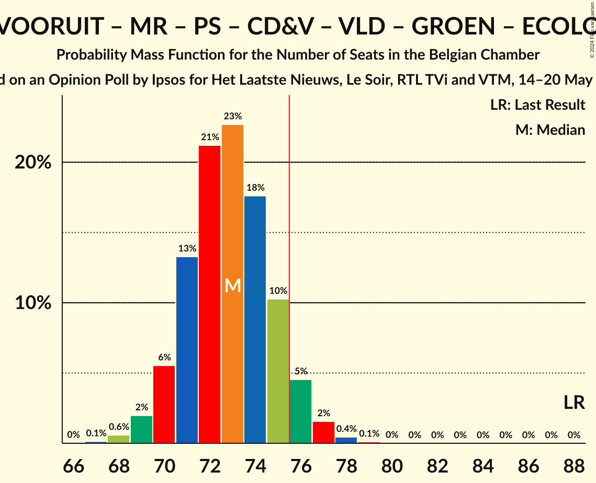

| Number of Seats | Probability | Accumulated | Special Marks |
|:---------------:|:-----------:|:-----------:|:-------------:|
| 67 | 0.1% | 100% |  |
| 68 | 0.6% | 99.8% |  |
| 69 | 2% | 99.2% |  |
| 70 | 6% | 97% |  |
| 71 | 13% | 92% |  |
| 72 | 21% | 78% | Median |
| 73 | 23% | 57% |  |
| 74 | 18% | 35% |  |
| 75 | 10% | 17% |  |
| 76 | 5% | 7% | Majority |
| 77 | 2% | 2% |  |
| 78 | 0.4% | 0.6% |  |
| 79 | 0.1% | 0.1% |  |
| 80 | 0% | 0% |  |
| 81 | 0% | 0% |  |
| 82 | 0% | 0% |  |
| 83 | 0% | 0% |  |
| 84 | 0% | 0% |  |
| 85 | 0% | 0% |  |
| 86 | 0% | 0% |  |
| 87 | 0% | 0% |  |
| 88 | 0% | 0% | Last Result |

### Nieuw-Vlaamse Alliantie – Vooruit – Mouvement Réformateur – Parti Socialiste – Open Vlaamse Liberalen en Democraten

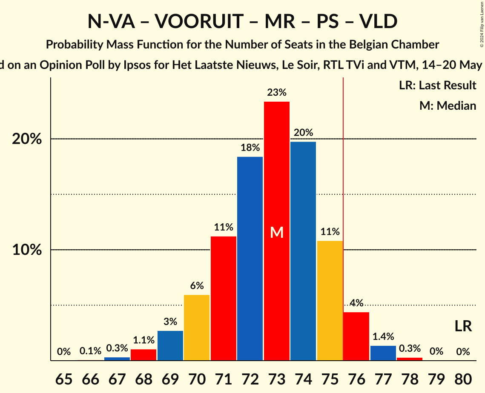

| Number of Seats | Probability | Accumulated | Special Marks |
|:---------------:|:-----------:|:-----------:|:-------------:|
| 66 | 0.1% | 100% |  |
| 67 | 0.3% | 99.9% |  |
| 68 | 1.1% | 99.6% |  |
| 69 | 3% | 98% |  |
| 70 | 6% | 96% |  |
| 71 | 11% | 90% |  |
| 72 | 18% | 79% |  |
| 73 | 23% | 60% | Median |
| 74 | 20% | 37% |  |
| 75 | 11% | 17% |  |
| 76 | 4% | 6% | Majority |
| 77 | 1.4% | 2% |  |
| 78 | 0.3% | 0.4% |  |
| 79 | 0% | 0.1% |  |
| 80 | 0% | 0% | Last Result |

### Vooruit – Parti Socialiste – Les Engagés – Parti du Travail de Belgique – Partij van de Arbeid van België – Groen – Ecolo

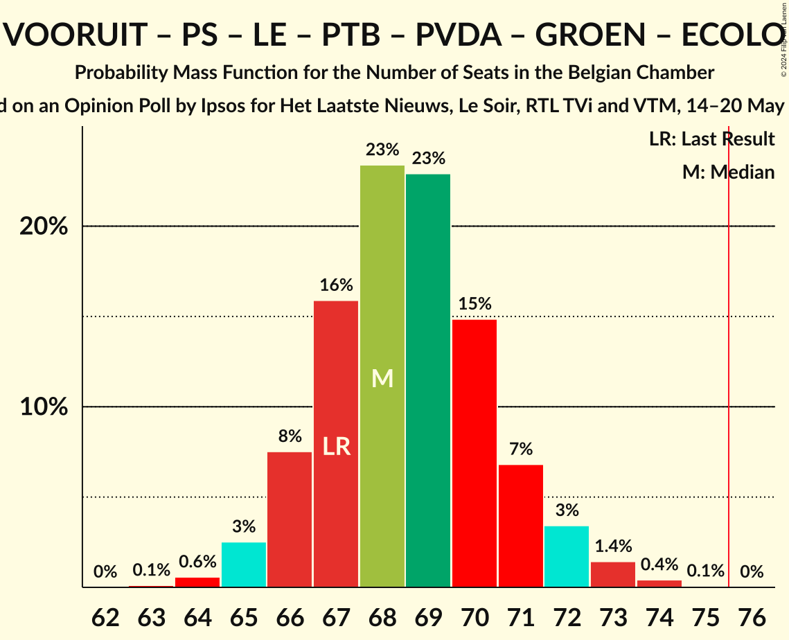

| Number of Seats | Probability | Accumulated | Special Marks |
|:---------------:|:-----------:|:-----------:|:-------------:|
| 63 | 0.1% | 100% |  |
| 64 | 0.6% | 99.9% |  |
| 65 | 3% | 99.3% |  |
| 66 | 8% | 97% |  |
| 67 | 16% | 89% | Last Result |
| 68 | 23% | 73% |  |
| 69 | 23% | 50% | Median |
| 70 | 15% | 27% |  |
| 71 | 7% | 12% |  |
| 72 | 3% | 5% |  |
| 73 | 1.4% | 2% |  |
| 74 | 0.4% | 0.5% |  |
| 75 | 0.1% | 0.1% |  |
| 76 | 0% | 0% | Majority |

### Nieuw-Vlaamse Alliantie – Mouvement Réformateur – Christen-Democratisch en Vlaams – Les Engagés – Open Vlaamse Liberalen en Democraten

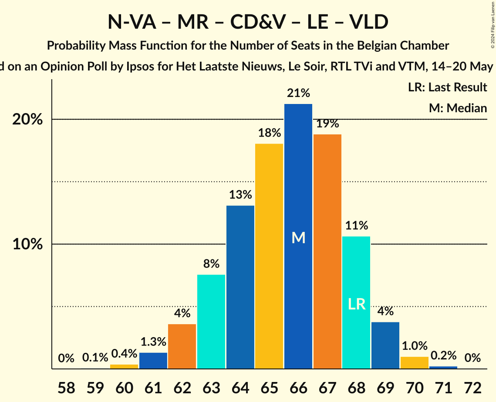

| Number of Seats | Probability | Accumulated | Special Marks |
|:---------------:|:-----------:|:-----------:|:-------------:|
| 59 | 0.1% | 100% |  |
| 60 | 0.4% | 99.9% |  |
| 61 | 1.3% | 99.5% |  |
| 62 | 4% | 98% |  |
| 63 | 8% | 95% |  |
| 64 | 13% | 87% |  |
| 65 | 18% | 74% |  |
| 66 | 21% | 56% | Median |
| 67 | 19% | 35% |  |
| 68 | 11% | 16% | Last Result |
| 69 | 4% | 5% |  |
| 70 | 1.0% | 1.3% |  |
| 71 | 0.2% | 0.3% |  |
| 72 | 0% | 0% |  |

### Vooruit – Mouvement Réformateur – Parti Socialiste – Open Vlaamse Liberalen en Democraten – Groen – Ecolo

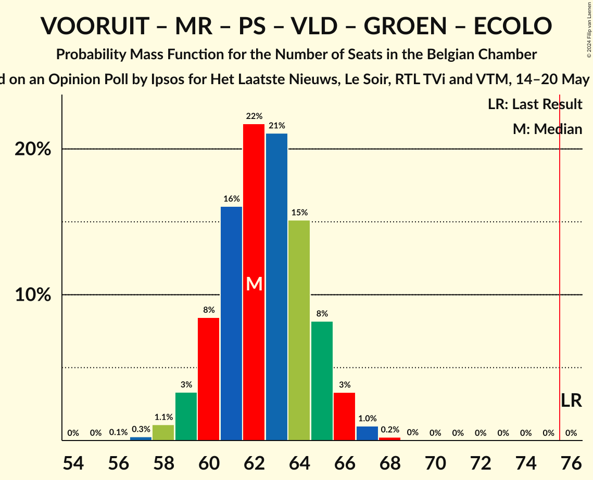

| Number of Seats | Probability | Accumulated | Special Marks |
|:---------------:|:-----------:|:-----------:|:-------------:|
| 56 | 0.1% | 100% |  |
| 57 | 0.3% | 99.9% |  |
| 58 | 1.1% | 99.7% |  |
| 59 | 3% | 98.6% |  |
| 60 | 8% | 95% |  |
| 61 | 16% | 87% |  |
| 62 | 22% | 71% | Median |
| 63 | 21% | 49% |  |
| 64 | 15% | 28% |  |
| 65 | 8% | 13% |  |
| 66 | 3% | 5% |  |
| 67 | 1.0% | 1.3% |  |
| 68 | 0.2% | 0.3% |  |
| 69 | 0% | 0.1% |  |
| 70 | 0% | 0% |  |
| 71 | 0% | 0% |  |
| 72 | 0% | 0% |  |
| 73 | 0% | 0% |  |
| 74 | 0% | 0% |  |
| 75 | 0% | 0% |  |
| 76 | 0% | 0% | Last Result, Majority |

### Mouvement Réformateur – Parti Socialiste – Christen-Democratisch en Vlaams – Les Engagés – Open Vlaamse Liberalen en Democraten

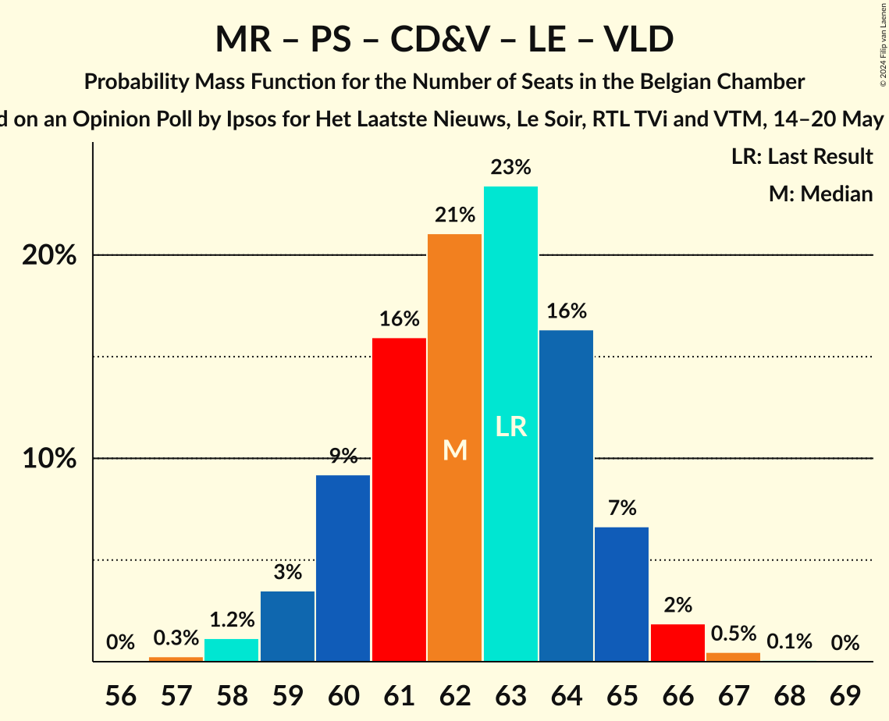

| Number of Seats | Probability | Accumulated | Special Marks |
|:---------------:|:-----------:|:-----------:|:-------------:|
| 56 | 0% | 100% |  |
| 57 | 0.3% | 99.9% |  |
| 58 | 1.2% | 99.7% |  |
| 59 | 3% | 98.5% |  |
| 60 | 9% | 95% |  |
| 61 | 16% | 86% |  |
| 62 | 21% | 70% | Median |
| 63 | 23% | 49% | Last Result |
| 64 | 16% | 25% |  |
| 65 | 7% | 9% |  |
| 66 | 2% | 2% |  |
| 67 | 0.5% | 0.6% |  |
| 68 | 0.1% | 0.1% |  |
| 69 | 0% | 0% |  |

### Vooruit – Parti Socialiste – Christen-Democratisch en Vlaams – Les Engagés – Groen – Ecolo

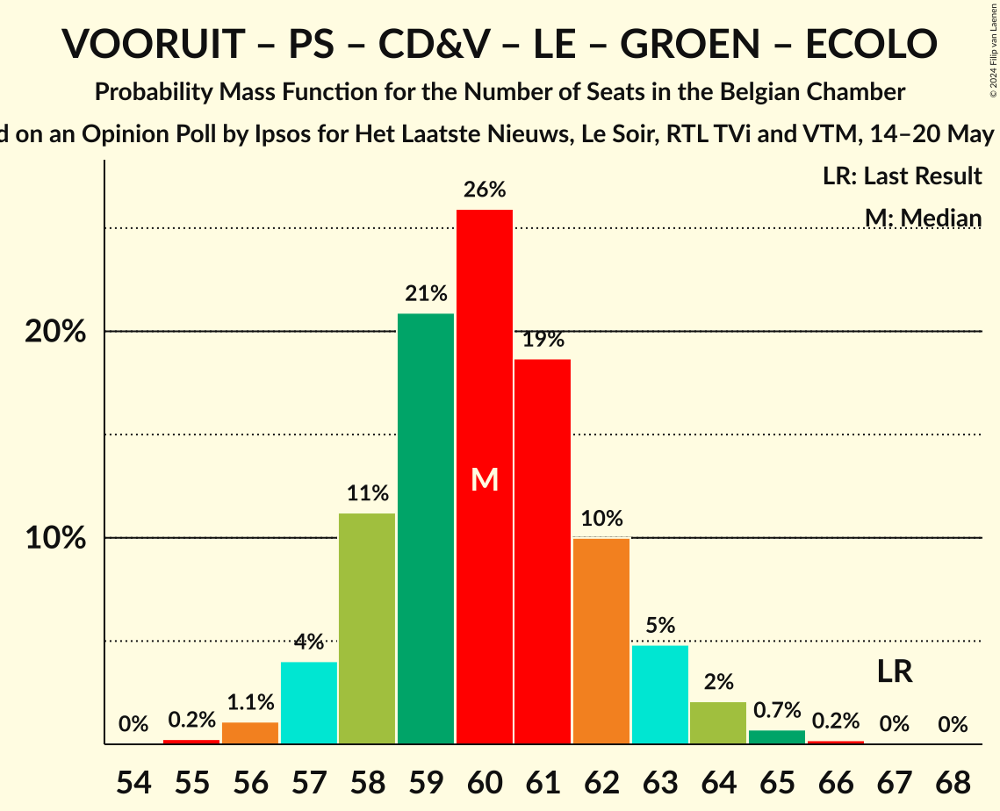

| Number of Seats | Probability | Accumulated | Special Marks |
|:---------------:|:-----------:|:-----------:|:-------------:|
| 55 | 0.2% | 100% |  |
| 56 | 1.1% | 99.7% |  |
| 57 | 4% | 98.6% |  |
| 58 | 11% | 95% |  |
| 59 | 21% | 83% |  |
| 60 | 26% | 62% | Median |
| 61 | 19% | 37% |  |
| 62 | 10% | 18% |  |
| 63 | 5% | 8% |  |
| 64 | 2% | 3% |  |
| 65 | 0.7% | 1.0% |  |
| 66 | 0.2% | 0.3% |  |
| 67 | 0% | 0.1% | Last Result |
| 68 | 0% | 0% |  |

### Vooruit – Parti Socialiste – Parti du Travail de Belgique – Partij van de Arbeid van België – Groen – Ecolo

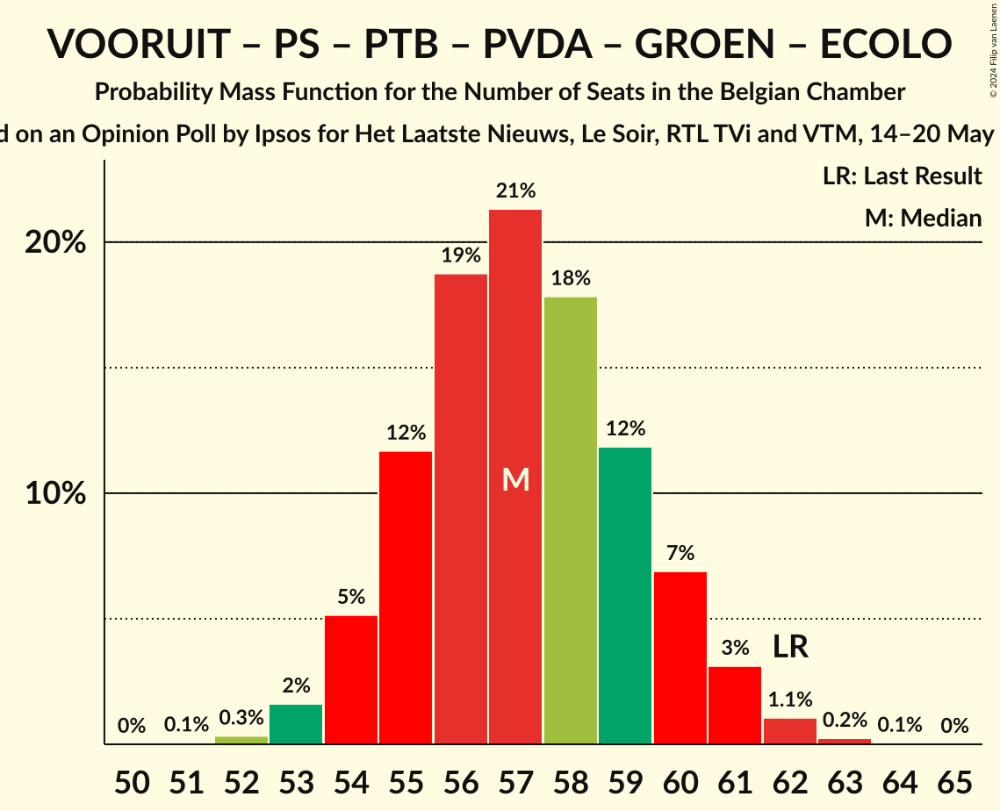

| Number of Seats | Probability | Accumulated | Special Marks |
|:---------------:|:-----------:|:-----------:|:-------------:|
| 51 | 0.1% | 100% |  |
| 52 | 0.3% | 99.9% |  |
| 53 | 2% | 99.6% |  |
| 54 | 5% | 98% |  |
| 55 | 12% | 93% |  |
| 56 | 19% | 81% |  |
| 57 | 21% | 62% | Median |
| 58 | 18% | 41% |  |
| 59 | 12% | 23% |  |
| 60 | 7% | 11% |  |
| 61 | 3% | 4% |  |
| 62 | 1.1% | 1.4% | Last Result |
| 63 | 0.2% | 0.3% |  |
| 64 | 0.1% | 0.1% |  |
| 65 | 0% | 0% |  |

### Mouvement Réformateur – Christen-Democratisch en Vlaams – Les Engagés – Open Vlaamse Liberalen en Democraten – Groen – Ecolo

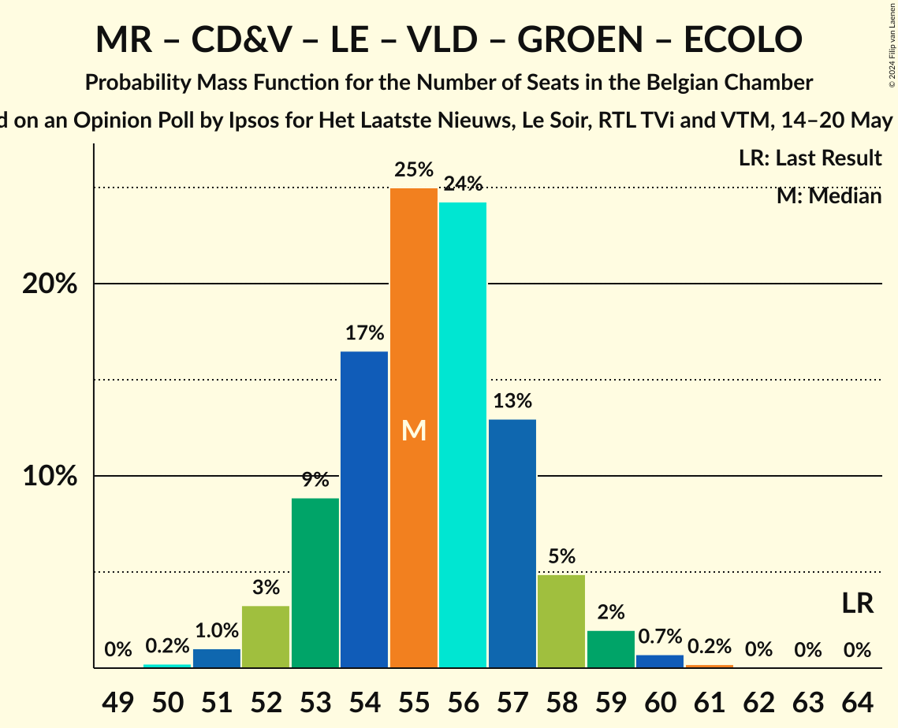

| Number of Seats | Probability | Accumulated | Special Marks |
|:---------------:|:-----------:|:-----------:|:-------------:|
| 50 | 0.2% | 100% |  |
| 51 | 1.0% | 99.7% |  |
| 52 | 3% | 98.7% |  |
| 53 | 9% | 95% |  |
| 54 | 17% | 87% |  |
| 55 | 25% | 70% | Median |
| 56 | 24% | 45% |  |
| 57 | 13% | 21% |  |
| 58 | 5% | 8% |  |
| 59 | 2% | 3% |  |
| 60 | 0.7% | 1.0% |  |
| 61 | 0.2% | 0.3% |  |
| 62 | 0% | 0.1% |  |
| 63 | 0% | 0% |  |
| 64 | 0% | 0% | Last Result |

### Nieuw-Vlaamse Alliantie – Mouvement Réformateur – Christen-Democratisch en Vlaams – Open Vlaamse Liberalen en Democraten

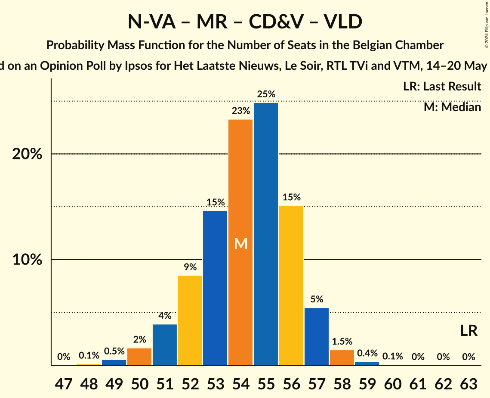

| Number of Seats | Probability | Accumulated | Special Marks |
|:---------------:|:-----------:|:-----------:|:-------------:|
| 48 | 0.1% | 100% |  |
| 49 | 0.5% | 99.8% |  |
| 50 | 2% | 99.3% |  |
| 51 | 4% | 98% |  |
| 52 | 9% | 94% |  |
| 53 | 15% | 85% |  |
| 54 | 23% | 71% | Median |
| 55 | 25% | 47% |  |
| 56 | 15% | 22% |  |
| 57 | 5% | 7% |  |
| 58 | 1.5% | 2% |  |
| 59 | 0.4% | 0.4% |  |
| 60 | 0.1% | 0.1% |  |
| 61 | 0% | 0% |  |
| 62 | 0% | 0% |  |
| 63 | 0% | 0% | Last Result |

### Vooruit – Mouvement Réformateur – Parti Socialiste – Open Vlaamse Liberalen en Democraten

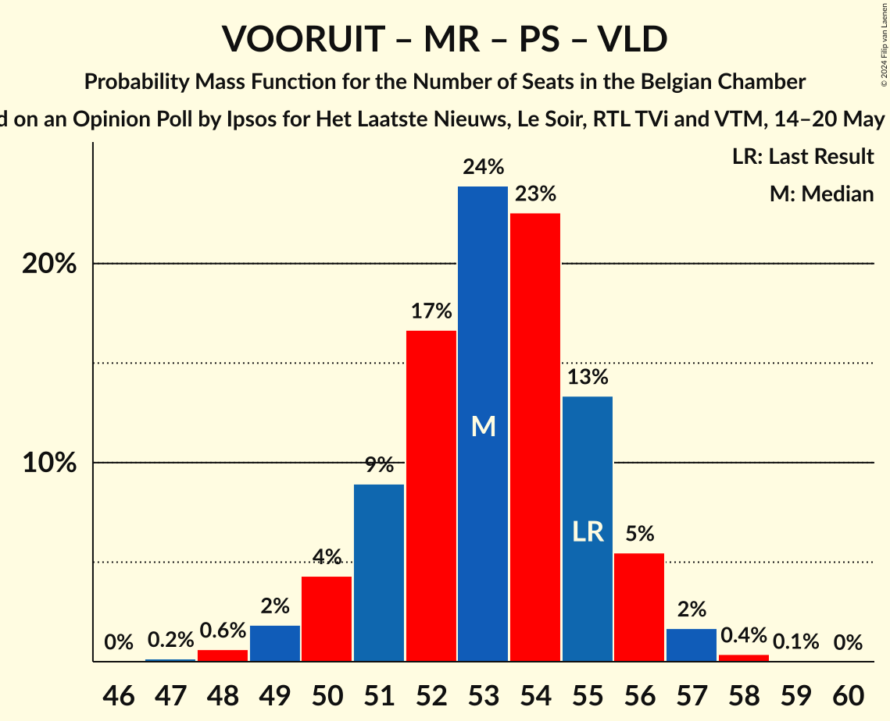

| Number of Seats | Probability | Accumulated | Special Marks |
|:---------------:|:-----------:|:-----------:|:-------------:|
| 47 | 0.2% | 100% |  |
| 48 | 0.6% | 99.8% |  |
| 49 | 2% | 99.2% |  |
| 50 | 4% | 97% |  |
| 51 | 9% | 93% |  |
| 52 | 17% | 84% |  |
| 53 | 24% | 67% | Median |
| 54 | 23% | 44% |  |
| 55 | 13% | 21% | Last Result |
| 56 | 5% | 8% |  |
| 57 | 2% | 2% |  |
| 58 | 0.4% | 0.4% |  |
| 59 | 0.1% | 0.1% |  |
| 60 | 0% | 0% |  |

### Vooruit – Parti Socialiste – Christen-Democratisch en Vlaams – Les Engagés

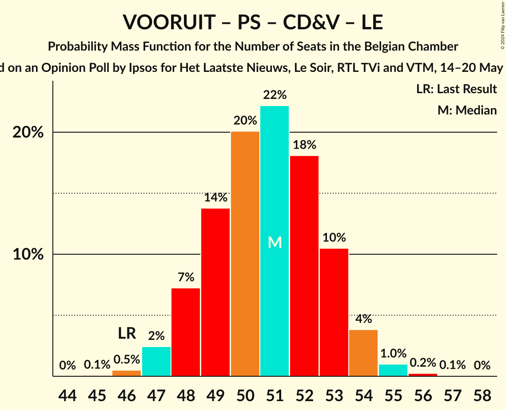

| Number of Seats | Probability | Accumulated | Special Marks |
|:---------------:|:-----------:|:-----------:|:-------------:|
| 45 | 0.1% | 100% |  |
| 46 | 0.5% | 99.9% | Last Result |
| 47 | 2% | 99.4% |  |
| 48 | 7% | 97% |  |
| 49 | 14% | 90% |  |
| 50 | 20% | 76% |  |
| 51 | 22% | 56% | Median |
| 52 | 18% | 34% |  |
| 53 | 10% | 16% |  |
| 54 | 4% | 5% |  |
| 55 | 1.0% | 1.3% |  |
| 56 | 0.2% | 0.3% |  |
| 57 | 0.1% | 0.1% |  |
| 58 | 0% | 0% |  |

### Mouvement Réformateur – Christen-Democratisch en Vlaams – Les Engagés – Open Vlaamse Liberalen en Democraten

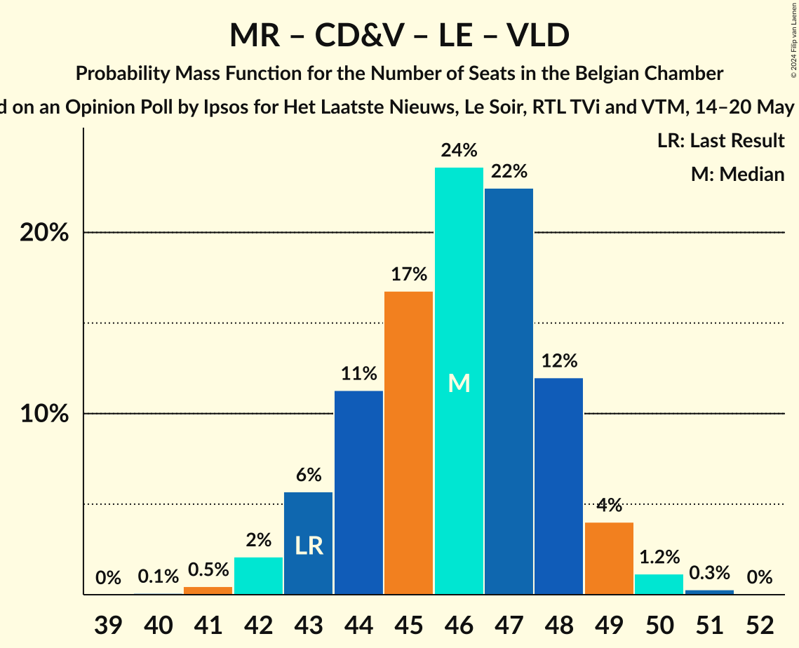

| Number of Seats | Probability | Accumulated | Special Marks |
|:---------------:|:-----------:|:-----------:|:-------------:|
| 40 | 0.1% | 100% |  |
| 41 | 0.5% | 99.9% |  |
| 42 | 2% | 99.4% |  |
| 43 | 6% | 97% | Last Result |
| 44 | 11% | 92% |  |
| 45 | 17% | 80% |  |
| 46 | 24% | 64% | Median |
| 47 | 22% | 40% |  |
| 48 | 12% | 18% |  |
| 49 | 4% | 6% |  |
| 50 | 1.2% | 1.5% |  |
| 51 | 0.3% | 0.3% |  |
| 52 | 0% | 0% |  |

## Technical Information

### Opinion Poll

+ **Polling firm:** Ipsos
+ **Commissioner(s):** Het Laatste Nieuws, Le Soir, RTL TVi and VTM
+ **Fieldwork period:** 14–20 May 2024

### Calculations

+ **Sample size:** 3233
+ **Simulations done:** 2,097,152
+ **Error estimate:** 0.73%

